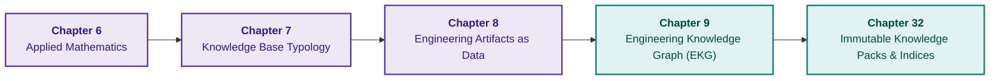

# Part II. Mathematical Models, Knowledge Representation, and Storage

[← To Part I](part-01-foundations.md) | [Table of Contents](README.md) | [To Part III →](part-03-knowledge-engineering-nlp.md)

---

## Purpose of the Part

This part answers the question: how to represent and store knowledge so that operations on knowledge have well-defined semantics? The mathematical method is selected according to the problem, the representation type according to the expected outcome, and relationships and physical indices are stored together with version, provenance, and scope of applicability.

For an initial practical reading, a logical rule, an explicit "unknown" state, a typed relationship, and a run version are sufficient. Probabilistic methods, causal analysis, and constraint solvers are needed for problems where these operations genuinely affect the decision; reading the entire mathematical catalog prior to initial implementation is not mandatory.

---

## Overview of the Theme and Interconnection of Chapters

Chapter 6 explains computational methods, Chapter 7 separates the semantics of outcomes, Chapter 8 prepares typed artifacts, and Chapter 9 connects artifacts into a graph. Chapter 32 completes the trajectory with an immutable package: canonical data, derived indices, reader verification, and reproducible builds.

The knowledge model and the physical package format are distinct architectural decisions. A valid index does not prove the correctness of a fact, and an automatically extracted graph does not prove the validity of edges. The outcome of this part is a consistent representation that the knowledge acquisition pipeline of Part III can operate upon.

---

## Chapters in This Part

### [Chapter 6. Applied Mathematics for Expert Systems: Rules, Probabilities, Graphs, and Causality](ch06-applied-mathematics-for-expert-systems.md)

* **Abstract:** A map of mathematical operations organized by question type: logical consequence, uncertainty, precedent, relationship, action selection, and causality. Formulas and worked numerical examples clarify the distinction between formal proof, estimation, and ranking. This is a reference guide rather than an obligatory linear prerequisite for implementation.

### [Chapter 7. Knowledge Base Typology: Rules, Ontologies, Precedents, and Vectors](ch07-knowledge-base-typology.md)

* **Abstract:** Why the identical set of facts yields divergent conclusions across production rules, hierarchical frames, formal ontologies, and case-based memory. Selecting representation by required outcome; ontology competency questions as verifiable model requirements; verification of types, roles, and mutable states using OntoClean. Partitioning the knowledge base: fragmentation, sharding, and feature clustering as three distinct decisions; partitioning key selection based on inference dependencies; and why shard silence does not equate to the absence of a fact.

### [Chapter 8. Engineering Artifacts as Data for Expert Systems](ch08-engineering-artifacts-as-data.md)

* **Abstract:** A versioned artifact model and the pipeline from raw file to chunk: parsing, extraction fidelity, chunking, access, and retrieval. A candidate field or relationship does not become a verified fact merely through successful parsing or indexing.

### [Chapter 9. Engineering Knowledge Graph: Traceability from Requirements to Hardware](ch09-engineering-knowledge-graph-traceability.md)

* **Abstract:** A typed graph of requirements, code, tests, and hardware; coverage and change-impact queries. Claimed and inferred relationships are strictly segregated from verified ones. An educational harvester validates references and symbol identity, but does not prove requirements satisfaction.

### [Chapter 32. Immutable Knowledge Packs: Byte-Level Admission, Indices, and Memory Mapping](ch32-high-performance-knowledge-packs-mmap-and-harvesting.md)

* **Abstract:** Authorial architecture of the immutable knowledge pack: canonical and derived layers, format versions, materialized views, citations, and build reproducibility. Archival multi-domain benchmarks are segregated from an open Python test bench for point queries with SQLite and `mmap`; opening a file is not equivalent to cold reading, and `mmap` is justified solely for an immutable index fitting into available memory. The cluster key encodes field lengths, the index reader verifies bounds prior to the first query, and knowledge density is distinguished from completeness evaluated via mark-recapture methods. Sharding the immutable pack by document family is verified through synthetic corpus test benches: the router distinguishes shard silence from the absence of a fact, while partition verification identifies omission, intersection, and fractured families. The verbatim citation gateway does not authenticate the truth of its downstream interpretation.

## Systems Workflow of Chapters 7–11

The chapters form a unified workflow spanning Parts II and III. Chapter 7 defines **what the result means**; Chapter 8 defines **how to preserve the artifact and its provenance**; Chapter 9 defines **which relationships may be leveraged in analysis**; [Chapter 10](ch10-knowledge-acquisition-systems.md) governs admission, validity, delivery, and revocation; [Chapter 11](ch11-knowledge-elicitation-from-experts.md) elicits verifiable candidates from human expertise.

The essential boundary of this workflow lies not between "human" and "model", but among distinct grounds for assertion. Syntactic validity merely proves adherence to a schema. A verbatim citation establishes provenance. Approval defines authority and operational scope. Execution results corroborate observation under specific operating conditions. Logical derivation demonstrates consequence from accepted premises. None of these statuses substitutes for the others.

Two educational failure modes illustrate this boundary. A graph containing `verifies` does not satisfy a schema requiring `verifiedBy` without an explicit inverse edge or an inverse property rule. An `@satisfies` annotation records the code author's claim, yet a function bearing the correct annotation may fail to satisfy the required execution deadline. The engineering examples in Chapters 7 and 9 rigorously verify these distinctions.

To coordinate this process, Chapter 10 introduces the Object Passport. The passport preserves identity, content, provenance, applicability, verification verdicts, approvals, access control, and dependencies. Any novel storage backend or language model must preserve these attributes rather than artificially elevating the evidential status of a replica.

## Proposals for Scientific Enhancement

The following table constitutes a research agenda, **not a report of completed empirical results**. For each proposal, a hypothesis, alternative baseline, and falsification criterion are defined.

| Chapter & Gap | Hypothesis & Mechanism | Baseline Comparison | Metrics & Falsification Criteria |
|---|---|---|---|
| 7: concept modeling & result semantics | distinct test, execution, and report entities reduce cross-release leakage; competency questions & OntoClean detect role conflation | flat test result property vs. discrete execution runs on identical test cases | false permits across releases, retention of true positives; absence of statistical separation or surge in false rejections falsifies practical utility |
| 8: artifact ingestion fidelity | preserving numerical values, units, negations, and spatial coordinates is more critical than a single average readability score | identical page corpus fed to parser, OCR, and cascade with manual fallback queue | exact match of critical fields, false acceptance, false rejection, review time; improved readability without superior downstream decisions falsifies the adequacy of surface metrics |
| 9: edge status & impact completeness | distinct declared, measured, and approved relationships minimize spurious coverage without prohibitive manual overhead | automated annotation graph vs. verified graph on identical change sets | edge precision, missed dependencies, spurious coverage, reviewer latency; supplement random edge masking with temporal evaluation on unseen commits |
| 10: release & revocation | an active revocation registry outside the static snapshot prevents re-admission following rollback | rolling back snapshot alone vs. rollback coupled with discrete authorization check | time to block new issuances, cache invalidation latency, rejection under unreachable policy; issuing responses based on revoked grounds constitutes contract failure |
| 11: elicitation & expert disagreement | neutral incident reconstruction and counterexamples produce rules with lower error on novel cases | equivalent time budget allocated to unstructured interviews vs. structured protocols | weighted loss, spurious permits, abstention rate, session cost; expert consensus without improvement on held-out cases falsifies the hypothesis |

The foundational methodology is established across the chapters: Noy & McGuinness competency questions and Guarino & Welty OntoClean in Chapter 7; the [SHACL](https://www.w3.org/TR/shacl/) shape validation standard; the [PROV-O](https://www.w3.org/TR/prov-o/) provenance data model; the Jensen & Snodgrass bitemporal data model in Chapter 10; CommonKADS, protocol analysis, and the Critical Decision Method in Chapter 11. While these works validate individual techniques, they do not prove the superiority of the complete proposed pipeline.

### End-to-End Evaluation Protocol

Select a single decision domain, such as authorizing an API modification for production release. Independent reviewers annotate requirements, dependencies, applicable test runs, and anticipated failure modes. Model summaries or internal rule labels must never serve as the ground truth baseline. Revisions of a single specification, recurring incidents, and duplicate reports are clustered into the same fold; a temporal held-out evaluation set assesses unseen modifications rather than memorized formulations.

Prior to execution, fix the primary metric, error cost matrix, abstention policy, and acceptance thresholds. The test suite must include missing test runs, contradictory results, execution artifacts from divergent releases, shifted engineering units or modalities, late patches, an unreachable authorization registry, and rollbacks following revocation. Every negative case requires a matched positive control: persistent abstention or rejection does not constitute an expert system.

Components are ablated sequentially while holding data and evaluation budgets constant: schema alone, schema with provenance, verified dependencies, lifecycle governance, and expert rules. This ablation demonstrates the marginal contribution of each mechanism. Report not merely average precision, but false permits, dependency recall, abstention rate, weighted loss, and human verification overhead; evaluate uncertainty with respect to document and incident clusters.

Synthetic test suites verify invariants but cannot measure production failure rates. Zero defects across a small test suite do not establish zero risk. If introducing the object passport escalates overhead without reducing operational errors, the contract must be tightened to fields directly driving decisions, or the core hypothesis must be revised. Scientific rigor resides in the ability to test and falsify architectural decisions, not in the sheer volume of integrated technologies.

---

[← To Part I](part-01-foundations.md) | [Table of Contents](README.md) | [To Part III →](part-03-knowledge-engineering-nlp.md)
