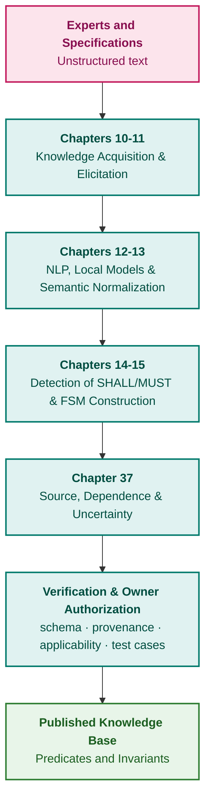

# Part III. Knowledge Acquisition, Linguistic Analysis, and Input Assessment

[← To Part II](part-02-knowledge-models.md) | [Table of Contents](README.md) | [To Part IV →](part-04-architecture-and-inference.md)

---

## Purpose of the Part

The purpose of this part is to demonstrate how to prepare verifiable knowledge for an expert system, spanning from the definition of the expert task to the formalization and evaluation of candidates:

1. **Sources:** Distinguish precise verbatim citation extraction from correct interpretation of its substantive meaning.
2. **Expert Experience:** Elicit candidates equipped with operating context, exceptions, and validation procedures.
3. **Linguistic Analysis:** Apply parsers and local models without obscuring ambiguities and extraction errors.
4. **Formalization:** Construct an explicit representation of conditions and state transitions, verify it, and admit it via an accountable owner.
5. **Input Assessment:** Disentangle source reliability, claim corroboration, evidence dependence, and authorization to utilize the result.

---

## Overview of the Theme and Interconnection of Chapters

Chapters 10–11 establish provenance management and the elicitation of specialist expertise. Chapters 12–13 preserve semantic content and provenance throughout linguistic analysis. Chapters 14–15 transform normative specifications into requirements, facts, grammars, and state machines. Chapter 37 introduces the rigorous evaluation of sources and evidence: a correctly parsed message may nonetheless originate from an untrusted source or remain causally dependent upon previously processed intelligence.

The CommonKADS framework segregates domain knowledge from inference operations and task control flow. Linguistic analyzers propose hypotheses, whereas ontology validation and evidence assessment address distinct verification planes. The deliverable of this part is a candidate knowledge unit bounded by explicit invariants, rather than an axiom presumed true by default.

Knowledge engineering does not terminate at extraction. Knowledge base verification is examined in [Chapter 23](ch23-knowledge-base-verification.md), knowledge maintenance based on operational feedback and degradation markers in [Chapter 26](ch26-continual-learning.md), and immutable package release in [Chapter 32](ch32-high-performance-knowledge-packs-mmap-and-harvesting.md). The expert system not only consumes published facts and rules to render decisions, but also acts as an active instrument of knowledge engineering: enforcing admission policies, detecting epistemic gaps, and elucidating contradictions. An execution refusal or an identified gap triggers a formal change proposal rather than silent, automated mutations of the production knowledge base.

---

## Chapters in This Part

### [Chapter 10. Knowledge Acquisition Systems: Sources, Admission, and Lifecycle](ch10-knowledge-acquisition-systems.md)

* **Abstract:** The contract between sources and consumers: object passports, independent verification and approval statuses, access control, bitemporal timelines, release gating, and revocation. Rolling back a database snapshot does not restore revoked authority for a compromised source.

### [Chapter 11. Knowledge Elicitation from Experts: Interviewing, Cognitive Maps, and Experience Formalization](ch11-knowledge-elicitation-from-experts.md)

* **Abstract:** Protocols for empirical knowledge elicitation, uncovering latent boundary exceptions, independent rule verification, and boundaries of statistical heuristics. CommonKADS cleanly partitions domain models, inference schemas, and task control; digital audit footprints identify candidates for expert consultation rather than constituting automated competency rankings.

### [Chapter 12. Linguistic Analysis and Local Models: Preserving Content and Provenance](ch12-linguistic-analysis-and-local-models.md)

* **Abstract:** Decoupling coordinates of the original artifact, derived text, and tokenizer spans. Structural document parsing, failure boundaries of statistical NLP, weak supervision, active learning strategies, and decoupled uncertainty estimation.

### [Chapter 13. Natural Language Variability vs. Determinism: Compiling Query Intent](ch13-language-variability-vs-determinism.md)

* **Abstract:** Logical form candidates, constrained decoding, and semantic invariant checking. Paraphrasing and contrastive pairs; handling unknown slots and mutually exclusive hypotheses; GLiNER, GLiNER2, and typed validators without conflating grammatical form with factual truth.

### [Chapter 14. Requirements and Modality Extraction: From Normative Text to Invariants](ch14-requirements-detection-and-formalization.md)

* **Abstract:** Document conventions and regulatory context, structural limitations of EARS templates, typed intermediate representations, and partial compilation. Trigger timestamps must not be confused with operational reaction deadlines; formula satisfiability does not establish physical product compliance.

### [Chapter 15. Knowledge Extraction and KB Construction: Facts, Grammars, and Automata](ch15-knowledge-extraction-and-kb-construction.md)

* **Abstract:** Facts, grammars, and deterministic state automata backed by verifiable provenance; citation span boundaries, physical units, and multi-edition document reconciliation. Decoupling admission, authorization, and formal release. Protégé and ROBOT for ontology validation; process mining and association rule discovery as generators of candidate hypotheses rather than normative mandates.

### [Chapter 37. Input Information Assessment: Sources, Evidence, and Uncertainty](ch37-input-information-assessment-and-algorithmic-skepticism.md)

* **Abstract:** From raw physical signal to admissible inference: disentangling source reliability, claim corroboration, analytical confidence, and authorization to act. Survey of nine open-source intelligence doctrines, law enforcement analytical frameworks (UNODC, FBI, INTERPOL, Europol), and formal incident response standards (FIRST, NIST). Multimodal data streams (text, audio, RF signals, imagery) bound to primary carriers and transformation lineage; dependent corroboration, interval probabilities, algorithmic skepticism, and streaming versus batch verification. Architectural analysis of i2 Analyst's Notebook and specialized intelligence platforms separates marketed capabilities from evidential admission. An educational Go reference module verifies invariance under replicated observations, dependency tracking, and principled abstention.

## Applied Analysis of Chapters 12–15

Epistemic errors compound causally: a document parser drops a table header, an extractor misbinds a numerical threshold to an unrelated operational mode, a compiler masks an undefined temporal scope, and an admission gateway approves the record solely due to an authenticated citation. Substituting a larger language model does not eradicate these architectural failure modes. Rigorous evaluation therefore isolates processing stages while holding the remaining pipeline constant.

| Boundary | Methodological Challenge | Low-Cost Control Case |
|---|---|---|
| File → Text | Normalization can be non-invertible; PDF coordinates are derived | Unicode ligatures, repeated citations, truncated multi-byte UTF-8 sequences |
| Text → Candidate | Statistical classification does not constitute formal proof | Syntactic negation, swapped semantic roles, distinct numerals in conflicting roles |
| Candidate → Formula | Formal grammars and EARS templates cannot verify semantic correctness | Latency embedded in trigger condition, ambiguous deadlines, unreachable preconditions |
| Formula → Admission | Logical consistency does not guarantee operational applicability or authorization | Valid citation possessing revoked credentials or mismatched operational profile |
| Change → New Pack | An unchanged verbatim citation may acquire conflicting semantics in a revised document | Modified section header or newly introduced exception; delta vs. clean rebuild diff |

For each structural boundary, the chapters present targeted experimental designs:

1. [Chapter 12](ch12-linguistic-analysis-and-local-models.md): Docling, Apache Tika, and OCR extraction; hierarchical document schemas, byte-granular source maps, and active learning for annotation.
2. [Chapter 13](ch13-language-variability-vs-determinism.md): Open-information extraction models, contrastive evaluation suites, and explicit abstention policies.
3. [Chapters 14](ch14-requirements-detection-and-formalization.md) and [15](ch15-knowledge-extraction-and-kb-construction.md): Partial compilation, constraint satisfaction solvers, process event logs, and bit-level equivalence between incremental and clean builds.

These experimental configurations represent proposed benchmark protocols rather than pre-computed results. Independent ground-truth baselines, document family cross-validation, and segregated hold-out sets prevent evaluating models on their own generated labels. Synthetic test suites verify operational invariants, but cannot guarantee zero-defect execution across all arbitrary regulatory corpora.

---

[← To Part II](part-02-knowledge-models.md) | [Table of Contents](README.md) | [To Part IV →](part-04-architecture-and-inference.md)
