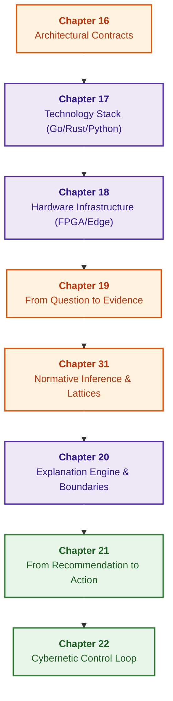

# Part IV. Architecture, Technology Stack, Inference, and Action

[← To Part III](part-03-knowledge-engineering-nlp.md) | [Table of Contents](README.md) | [To Part V →](part-05-verification-and-learning.md)

---

## Purpose of the Part

Construct the complete engineering pipeline of an expert system: from architectural contracts, selection of programming languages, and hardware platforms to normative logical inference, explanation generation, transition to action, and closing the cybernetic control loop via sensor feedback.

---

## Overview of the Theme and Interconnection of Chapters

Chapter 16 defines baseline architectural contracts and component boundaries. Chapter 17 establishes engineering criteria for selecting the technology stack (Go, Rust, Python, rule engines). Chapter 18 deploys the execution hardware infrastructure (FPGA, NPU, on-premise, edge computing). Chapter 19 decouples retrieved evidence fragments from the formal assertions they corroborate. Chapter 31 implements normative inference across predicate hierarchies and relation lattices under temporal validity constraints. Chapter 20 synthesizes verifiable explanations directly from the execution trace. Chapter 21 executes safe transitions from recommendation to authorized action with strict access control. Chapter 22 closes the cybernetic control loop by ingesting peripheral sensor data streams and detecting early signs of critical slowing down (CSD).

The deliverable of this part is an integrated, functioning system maintaining strictly decoupled lifecycle statuses: "architecturally specified", "hardware-deployed", "retrieved", "justified", "explained", "executed", and "feedback recorded". Formal rule verification, the knowledge testing pyramid, and safety case synthesis are continued in [Part V](part-05-verification-and-learning.md).

---

## Chapters in This Part

### [Chapter 16. Expert System Architecture: From Formal Knowledge to Evidence-Governed Decisions](ch16-expert-systems-architecture.md)

* **Abstract:** Separation of responsibilities, pinned read contexts, and active query authorization. Positive grounding closure, independent alternative justifications, and unsupported inference cycles; decision provenance guarantees verifiable fact and rule version binding.

### [Chapter 17. Technology Stack: Selection Criteria for Tools, Programming Languages, and Rule Engines](ch17-implementation-stack.md)

* **Abstract:** Engineering criteria for selecting languages (Go, Rust, Python, C++), rule engines (Rete, Datalog, Prolog), and embedded storage engines tailored to specific problem classes, latency SLOs, and memory profiles.

### [Chapter 18. Execution Infrastructure: Local Models, Hardware Accelerators, Edge, and On-Premise](ch18-execution-infrastructure.md)

* **Abstract:** Hardware execution environments: placement across CPU, GPU, NPU, and FPGA targets; cold-start mitigation, compute isolation, edge thermal/power envelopes, and deterministic latency enforcement.

### [Chapter 19. From Question to Evidence: Retrieval, Grounding, and Assertion Verification](ch19-from-question-to-evidence.md)

* **Abstract:** Query contracts, semantic retrieval, atomic grounding, and independent assertion verification. Mandatory constraints and importance weights evaluated prior to completeness calculations; verbatim textual citations do not establish semantic roles, and missing evidence does not prove absence of a governing norm.

### [Chapter 31. Normative Inference: Predicate Hierarchies, Exceptions, and Temporal Validity](ch31-syllogistic-reasoning-and-relation-lattices.md)

* **Abstract:** Distinguishing predicate hierarchies from relation lattices; current normative revisions do not retroactively annul historical application conditions. The instructional Go step evaluates classes, specialization, exceptions, and competing rules; practical network examples partition operational actions by state, sequence number, and supported profile.

### [Chapter 20. Explanation Engine: Decisions, Refusals, and Competence Boundaries](ch20-explanation-engine.md)

* **Abstract:** Constructing explanations from factual execution traces; distinguishing unknown preconditions from logical incompatibilities. QuickXPlain prerequisites, subset minimality, counterfactual targets, unconstrained text filtering, and post-redaction leakage prevention.

### [Chapter 21. From Recommendation to Action: Authorization Control and Safe Production Execution](ch21-from-recommendation-to-action.md)

* **Abstract:** Action contracts, active capabilities, signed submissions, and atomic precondition guards. Idempotency verifies both target identity and parameters; uncertain side effects require explicit state reconciliation prior to compensation. Segregating orchestration roles across Temporal, OPA, and Cedar. Local plan repair preserves only still-valid approvals.

### [Chapter 22. Cybernetic Control Loop: Sensors, Edge Computing, and Feedback](ch22-cybernetics-edge-to-backend.md)

* **Abstract:** Closed cybernetic control loop: Ashby's Law of Requisite Variety, streaming telemetry ingestion, signal filtering, critical slowing down (CSD) detection, and fail-safe operation during peripheral partial autonomy.

---

## End-to-End Analysis of Architecture, Implementation, and Action: Chapters 16–22

This sequence integrates the complete decision-making and enactment pipeline, validating transitional boundaries where local subsystem success can be mistakenly equated with global system reliability:

| Transition | Non-Automatic Deduction | Discriminative Check |
|---|---|---|
| Architecture → Decision | Rule correctness implied by the label "symbolic" | Independent alternative grounds, unsupported circularity check, snapshot mixing prevention |
| Tool → Semantics | Equivalence between Rete, Datalog, expressions, and tables | Unknown fact representation, rule order variance, fact retraction semantics, recursion limits |
| Hardware → Latency | Guaranteed deadline met based solely on peak compute or p99 | Cold-start delays, queue contention, CPU round-trip stalls, end-to-end tail latency distribution |
| Citation → Assertion | Correct semantic role assumed from the mere presence of a number | Multiple competing figures, mismatched measurement units, empty or duplicated semantic atoms |
| Trace → Explanation | Correct semantic meaning assumed from entity presence | Negation alteration, omitted root cause, redacted ground leakage, valid counterfactual target |
| Recommendation → Action | Execution validity implied by recommendation correctness | Active capability verification, idempotency token validation, atomic precondition re-check |
| Action → Feedback | Normal plant operational state assumed from successful command dispatch | Sensory receipt confirmation, Ashby state estimator divergence, early CSD dynamical indicators |

Defects must be reproduced in an isolated, neutral simulation environment before evaluating local corrections and proceeding through independent quality gates toward production deployment. Continuous log auditing, semantic drift tracking, and candidate rule analysis identify systemic vulnerabilities; automated learning mechanisms cannot grant expanded execution privileges or modify safety invariants without explicit gating authorization.

---

[← To Part III](part-03-knowledge-engineering-nlp.md) | [Table of Contents](README.md) | [To Part V →](part-05-verification-and-learning.md)
