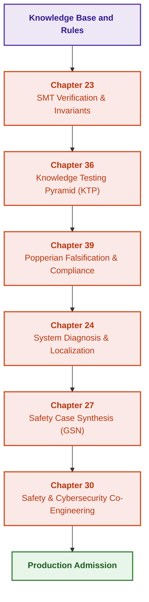

# Part V. Verification, Testing, Diagnosis, and Safety Case Synthesis

[← To Part IV](part-04-architecture-and-inference.md) | [Table of Contents](README.md) | [To Part VI →](part-06-frontiers-neuro-symbolic.md)

---

## Purpose of the Part

Provide an exhaustive engineering lifecycle of verification, validation (V&V), technical diagnosis, and formal safety argumentation for expert systems. This part unites mathematical SMT proofs, multi-tiered rule testing, Popperian falsification of compliance requirements, root-cause diagnosis, and the synthesis of verifiable safety cases compliant with ISO 26262 and ISO/SAE 21434 standards.

---

## Overview of the Theme and Interconnection of Chapters

Chapter 23 establishes formal knowledge base verification methods (Z3 SMT solvers, completeness, and consistency checks). Chapter 36 deploys the author's Knowledge Testing Pyramid (KTP) spanning from individual predicates to integrated packs and variational calibration. Chapter 39 introduces an active Popperian testing agent for automated counterexample generation and normative compliance auditing (ASPICE, ISO 26262, ISO 21434, DO-178C). Chapter 24 resolves technical diagnosis for external physical systems, strictly segregating root causes from secondary symptoms. Chapter 27 synthesizes structured safety arguments in Goal Structuring Notation (GSN) with rigorous traceability governance. Chapter 30 completes this continuum with joint functional safety and cybersecurity co-engineering.

The deliverable of this part is mathematically and empirically demonstrated system reliability, backed by legally defensible and certifiable release artifacts. Adaptation, neuro-symbolic frontiers, and continual learning are explored in [Part VI](part-06-frontiers-neuro-symbolic.md).

---

## Chapters in This Part

### [Chapter 23. Knowledge Base Verification: Checking Rule Consistency, Completeness, and Robustness](ch23-knowledge-base-verification.md)

* **Abstract:** Test oracle provenance, prohibited and permissible states, boundaries of exhaustive enumeration, and mutation scores. Rapid, Hypothesis, Z3, and TLA+ tooling verify distinct formal properties. Rule reduction targets specific structural defects; complete formal proofs mandate establishing root assertions, premises, and all preconditions of activated rules. Inductive data mining proposes candidates rather than normative truth.

### [Chapter 36. Knowledge Testing Pyramid: Rules, Interactions, and Answer Robustness](ch36-knowledge-testing-pyramid-and-variational-calibration.md)

* **Abstract:** The author's testing pyramid for evaluating individual rules, multi-rule compositions, end-to-end decision packs, and input variations. Independent oracle expectations decouple false premises from unknown ones; integration test cases validate semantic compatibility, defeater attacks, and minimal conflict subsets. Test contracts differ across deduction, induction, abduction, defeasible reasoning, and case-based reasoning. Go examples and unit tests evaluate specific boundary contexts, empty inputs, loss of justification, and prohibit concealing verdict regressions behind aggregate metrics. Metrics and gap queues do not constitute universal certification of an ontology or physical actuator.

### [Chapter 39. Active Compliance Auditor: Popperian Falsification, Normative Compliance (ASPICE/ISO 26262/ISO 21434), and Autonomous Test Design](ch39-active-compliance-auditor-and-popperian-testing.md)

* **Abstract:** Autonomous test design based on the principle of Popperian falsification: generating the most adversarial counterexamples, auditing execution traces against functional safety and cybersecurity standards, and automatically detecting blind spots in normative requirements.

### [Chapter 24. System Diagnosis: Disentangling Symptoms from Root Causes under Uncertainty](ch24-system-diagnosis.md)

* **Abstract:** Fault diagnosis of complex engineering systems. Symptom-based heuristic classification versus Model-Based Diagnosis (MBD) grounded in physical structure. Minimizing the expected cost of subsequent diagnostic tests and performing abductive root-cause localization.

### [Chapter 27. Safety Case: Synthesis and Verification of Arguments](ch27-safety-case-gsn-synthesis.md)

* **Abstract:** Safety argumentation in Goal Structuring Notation (GSN) synthesized directly from the engineering knowledge graph. Formal criteria for argument completeness and link integrity, hardware revision binding across operational contexts and evidence, selective evidence disclosure via salted Merkle trees, and managing counterarguments within Dung's argumentation frameworks under unresolved mutual attacks. SACM metamodels, in-toto and SLSA attestations, transparency logs, and traceability extraction augment instructional implementations without replacing the domain specialist who assesses argument sufficiency.

### [Chapter 30. Safety and Cybersecurity Co-Engineering](ch30-safety-cybersecurity-co-engineering.md)

* **Abstract:** Harmonizing functional safety and cybersecurity across verified causal relationships and concrete product requirements. Instructional Go validators inspect safety classifications, latency budgets, approved parent artifacts, three-valued update rules (conflict, insufficient evidence, no conflict), and binding digital signatures across payload data and metadata. STPA-Sec, ReqIF, CycloneDX, OpenVEX, and Uptane provide machine-readable evidence formats with explicit boundaries. Project profiles do not substitute for industry-wide standards; software tool qualification remains an independent engineering procedure.

---

[← To Part IV](part-04-architecture-and-inference.md) | [Table of Contents](README.md) | [To Part VI →](part-06-frontiers-neuro-symbolic.md)
