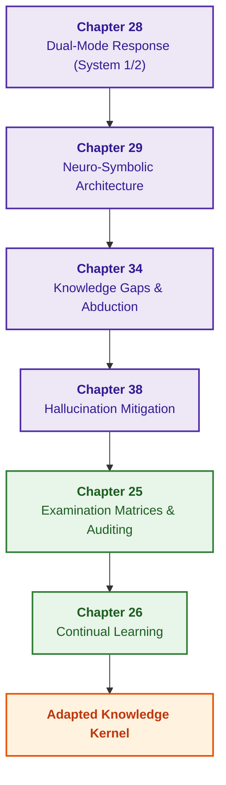

# Part VI. Neuro-Symbolic Models, Cognitive Frontiers, and Continual Learning

[← To Part V](part-05-verification-and-learning.md) | [Table of Contents](README.md) | [To Part VII →](part-07-runtime-and-knowledge-exchange.md)

---

## Purpose of the Part

Combine the heuristic flexibility of large language models with the deterministic rigor of symbolic deduction, resolve knowledge deficit challenges via abduction and Socratic dialogue, mitigate generative hallucinations, and implement non-regressive continual learning of the expert system from operational empirical experience.

---

## Overview of the Theme and Interconnection of Chapters

Chapter 28 defines dual operational modes (fast advisory heuristics of System 1 and deterministic symbolic proofs of System 2), strictly prohibiting unverified hypothesis elevation. Chapter 29 operationalizes the division of labor between local language models and a symbolic gatekeeper based on constrained grammars and schemas. Chapter 34 leverages inference gaps to trigger relational link discovery, abduction, and Socratic clarification dialogue with users. Chapter 38 systematizes root causes of machine hallucinations and establishes a multi-tiered verification pipeline for answer justifications. Chapter 25 introduces examination matrices, independent knowledge auditing, and regression control prior to release. Chapter 26 implements streaming continual learning on system event logs without catastrophic forgetting.

The deliverable of this part is a resilient neuro-symbolic system that safely collaborates with generative models, explicitly acknowledges its own lack of competence when facing epistemic gaps, and systematically evolves without compromising foundational safety invariants. Reactive execution, cross-system knowledge exchange, and distributed epistemic SOA are explored in [Part VII](part-07-runtime-and-knowledge-exchange.md).

---

## Chapters in This Part

### [Chapter 28. Dual-Mode Expert Systems: Rigorous Deduction and Advisory Hypotheses](ch28-dual-mode-expert-systems.md)

* **Abstract:** Strict results supported by verified evidence or explicit refusals alongside distinctly flagged advisory hypotheses. Deduction, case-based reasoning, and abduction fulfill specialized roles. An operational refusal or specialist consultation yields a candidate knowledge artifact that cannot bypass independent verification and release governance.

### [Chapter 29. Neuro-Symbolic Architecture: Language Models and Verifying Evidential Grounding](ch29-neuro-symbolic-architecture.md)

* **Abstract:** The division of responsibilities where "the model proposes, the symbolic engine approves": an admission gateway with document revision registries, closed vocabularies, byte-level verbatim citation verification, and token-level value validation; constrained local model outputs via Ollama JSON schemas; explanation validation; advisory query reconstruction with host validation; recording refusal rationales for telemetry analysis; benchmark suites distinguishing adapted from foundation models; open research horizons.

### [Chapter 34. Knowledge Gaps: Relational Search, Abduction, and Socratic Clarification](ch34-deterministic-relational-analysis-abduction-and-socratic-dialogue.md)

* **Abstract:** Transforming inference impasses into identifiable missing premises. Relational search identifies candidate links, abduction synthesizes testable hypotheses, and dialogue isolates necessary user clarifications. Inductively mined rules or similar historical cases cannot elevate hypothesis status without formal domain verification.

### [Chapter 38. Machine Hallucinations and Knowledge Deficits: Evidential Control of Answers](ch38-curing-machine-hallucinations-and-knowledge-deficits.md)

* **Abstract:** Taxonomies of generative failures and multifaceted control mechanisms: structural constraints, citation verification, explicit refusal, hypothesis tagging, and defensive action gating. Fine-tuning on verified question-answer pairs and machine unlearning are examined as complementary methodologies. Instructional admission gateways do not imply complete semantic comprehension across all citations or universal eradication of hallucinations.

### [Chapter 25. Training Expert Systems: Examination Matrices, Knowledge Auditing, and Regression Control](ch25-how-expert-systems-learn.md)

* **Abstract:** Governed lifecycle releases of expert systems: examination matrices, pairwise comparisons, and rejecting incomplete exam coverage. Stratified and temporal splitting, label verification queues, weak-slice mining, and LLM-as-a-judge pipelines prepare evaluation assets without making autonomous promotion decisions. End-to-end demonstrations of requirement modifications and safety case revocations trace dependent facts, rules, indices, caches, and verdicts.

### [Chapter 26. Continual Learning from Experience and Overcoming System Log Drift](ch26-continual-learning.md)

* **Abstract:** Self-learning from operational refusals: case logging, label arrival intervals, and propensity scoring. Off-policy evaluation refuses numerical scoring in the absence of common action support, while unfinished episodes are not classified as defects. River, Avalanche, and Open Bandit Pipeline assist experimental workflows, but candidate updates must pass standard admission gates. Leading indicators and CUSUM detectors signal operational distribution drift before the first erroneous response is emitted.

---

[← To Part V](part-05-verification-and-learning.md) | [Table of Contents](README.md) | [To Part VII →](part-07-runtime-and-knowledge-exchange.md)
