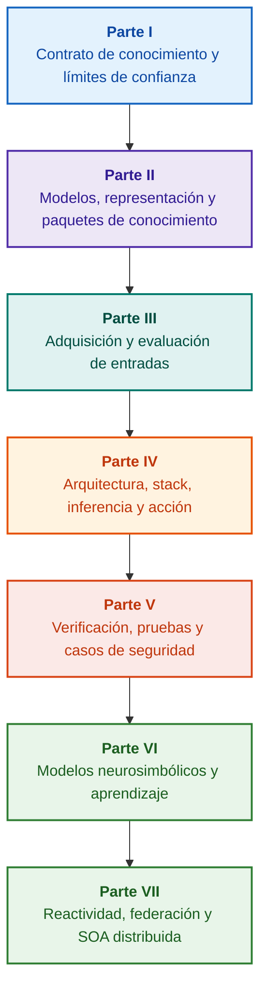

# Arquitectura de sistemas expertos basados en evidencias: de las ontologías formales a la IA neurosimbólica

**Monografía de ingeniería y manual de referencia sobre diseño, modelos matemáticos, arquitectura y verificación de sistemas inteligentes de alta integridad (Safety-Critical & Evidence-Grounded AI)**

**Autor:** [Mykola Fedchyk](about-the-author.md) · [LinkedIn](https://www.linkedin.com/in/nickfedchik/)  
**Formato:** Monografía de ingeniería / Manual para arquitectos de sistemas de IA  
**Año:** 2026  

---

## Acerca del libro

Esta monografía constituye una investigación fundamental y una guía de ingeniería dedicada a superar la crisis primordial de la inteligencia artificial contemporánea: la brecha epistémica entre la plausibilidad probabilística de las generaciones neuronales y la verdad determinista de las demostraciones formales. En el núcleo de esta obra se plantea un requisito innegociable: **¿cómo diseñar un sistema experto cuyas conclusiones sean irrefutables, plenamente trazables hacia fuentes primarias y aptas para certificación en dominios de ingeniería crítica (ISO 26262, IEC 61508, DO-178C, ISO/SAE 21434)?**

El autor fundamenta y formaliza un nuevo paradigma: **la IA neurosimbólica basada en evidencias (Evidence-Grounded Neuro-Symbolic AI)**, donde los modelos estadísticos (LLM/SLM) desempeñan una función consultiva de generación de hipótesis y proyección, mientras que un núcleo simbólico determinista garantiza de manera inmutable los invariantes de consistencia lógica, anclaje de hechos a nivel de byte, control de autorizaciones y transición segura a la acción.

### Del artefacto a la decisión verificable

Requisitos del sistema, código fuente, registros de pruebas, estándares normativos y decisiones de diseño ya conviven en los entornos productivos, pero operan mayormente como artefactos aislados carentes de semántica formalizada y trazabilidad bidireccional. Un informe de prueba superado puede hacer referencia a una revisión obsoleta de hardware; una cita de un estándar puede estar descontextualizada; un rollback automatizado de configuración puede reactivar inadvertidamente un componente revocado.

La monografía establece un recorrido de ingeniería integral: desde la formalización de artefactos como datos tipados y paquetes de conocimiento firmados criptográficamente, hasta la inferencia simbólica, la descomposición de planes, las explicaciones contrafácticas y la auditoría de límites de competencia. La exposición práctica se sustenta en implementaciones de grado de producción en Go con suites de pruebas completas ([Capítulo 1](ch01-introduction-to-expert-systems.md)), contratos matemáticos estrictos ([Parte II](part-02-knowledge-models.md)) y protocolos de aprendizaje continuo sin regresiones ([Capítulo 25](ch25-how-expert-systems-learn.md)).

### Destinatarios

Esta obra está dirigida a arquitectos de sistemas, ingenieros principales de confiabilidad y seguridad funcional, desarrolladores de motores de inferencia e ingenieros del conocimiento. Para dominar los conceptos básicos basta con conocimientos elementales de lógica de predicados de primer orden, control de versiones y ciclo de vida del software; para ejecutar los ejemplos prácticos se requieren las herramientas estándar de Go. Capítulos especializados dedicados a la síntesis de Goal Structuring Notation (GSN), la sinergética de sistemas complejos, los aceleradores neuromórficos y la navegación autónoma sin GNSS revelan las fronteras de aplicación en la industria aeroespacial, vehículos autónomos y redes energéticas.

---

## Contexto científico y posicionamiento mundial de la monografía

La monografía no aborda los sistemas expertos como un residuo arcaico de los motores de reglas de los años ochenta (como CLIPS o MYCIN), sino como la vanguardia de **la IA neurosimbólica de tercera ola basada en evidencias (Third-Wave NeSy)**. El enfoque tiende un puente entre las principales escuelas académicas mundiales y la ingeniería de sistemas de alto rendimiento:

| Disciplina científica | Obras clave y autores | Puente conceptual en el libro |
|---|---|---|
| **IA neurosimbólica de 3ª ola (NeSy)** | Artur d'Avila Garcez, Luis C. Lamb (*Neurosymbolic AI: The 3rd Wave*, 2023; *Neural-Symbolic Cognitive Reasoning*, Springer, 2009); Henry Kautz (*The Third AI Summer*, AAAI 2022) | Separación de responsabilidades: los modelos estadísticos (SLM/LLM) generan hipótesis de consulta, mientras que un núcleo simbólico determinista verifica y convalida formalmente los hechos ([Capítulo 29](ch29-neuro-symbolic-architecture.md)). |
| **Restricciones semánticas y aprendizaje seguro** | Guy Van den Broeck et al. (*A Semantic Loss Function for Deep Learning with Symbolic Knowledge*, ICML 2018); Luc De Raedt et al. (*DeepProbLog*, IJCAI 2020) | Pasarelas de admisión y salida, filtrado semántico determinista de propuestas neuronales frente a esquemas formales ([Capítulos 28](ch28-dual-mode-expert-systems.md), [33](ch33-inter-system-knowledge-exchange-and-model-teaching.md)). |
| **Razonamiento derrotable y teoría de la argumentación** | John L. Pollock (*Defeasible Reasoning*, 1987; *Cognitive Carpentry*, MIT Press, 1995); Phan Minh Dung (*Abstract Argumentation Frameworks*, AIJ 1995); Douglas Walton (*Argumentation Schemes*, Cambridge, 2008) | Descomposición del conocimiento en asertos, procedencia y factores de refutación (*rebutting* y *undercutting defeaters*); arbitraje de conflictos normativos mediante marcos de Dung ([Capítulos 2](ch02-epistemology-of-machine-knowledge.md), [27](ch27-safety-case-gsn-synthesis.md)). |
| **Minería autónoma de reglas de asociación (KBC)** | Luis Galárraga, Fabian M. Suchanek et al. (*AMIE: Association Rule Mining under Incomplete Evidence*, WWW 2013, VLDBJ 2015); Stephen Muggleton (*Inductive Logic Programming*, 1994) | Inducción automática de reglas en bases de conocimiento bajo la presunción de completitud parcial (PCA) sin falsos contraejemplos de mundo abierto ([Capítulo 34](ch34-deterministic-relational-analysis-abduction-and-socratic-dialogue.md)). |
| **Escudos formales de seguridad y certificación (Safe AI)** | Bettina Könighofer, Roderick Bloem et al. (*Shield Synthesis*, 2017); Tim Kelly, Rob Weaver (*Goal Structuring Notation*, York, 2004); André Platzer (*Logical Foundations of CPS*, Springer, 2018) | Síntesis de argumentos de seguridad en GSN para ISO 26262/21434; escudos formales y envolventes numéricas de validez para actuadores de borde ([Capítulos 27](ch27-safety-case-gsn-synthesis.md), [30](ch30-safety-cybersecurity-co-engineering.md), [33](ch33-inter-system-knowledge-exchange-and-model-teaching.md)). |
| **Lógica epistémica y semiótica del conocimiento** | John F. Sowa (*Knowledge Representation: Logical, Philosophical, and Computational Foundations*, 2000); Frank van Harmelen et al. (*Handbook of Knowledge Representation*, Elsevier, 2008) | Tríada epistémica de Charles Sanders Peirce (Concepto → Juicio → Inferencia); formulación abductiva de hipótesis de trabajo bajo estricto control deductivo ([Capítulos 6](ch06-applied-mathematics-for-expert-systems.md), [34](ch34-deterministic-relational-analysis-abduction-and-socratic-dialogue.md)). |
| **Cibernética y sinergética de sistemas complejos** | Norbert Wiener (*Cybernetics*, 1948); W. Ross Ashby (*An Introduction to Cybernetics*, 1956); Hermann Haken (*Synergetics: An Introduction*, 1977; *Advanced Synergetics*, 1983); Ilya Prigogine (*Order out of Chaos*, 1984) | Ley de variedad requerida de Ashby, lazos cerrados de control L0–L4, reducción del espacio de fases a parámetros de orden mediante el principio de subordinación de Haken, alerta temprana CSD y estabilización disipativa ([Capítulos 6](ch06-applied-mathematics-for-expert-systems.md), [22](ch22-cybernetics-edge-to-backend.md), [35](ch35-self-organizing-expert-systems-synergetics-and-npu-runtime.md)). |
| **Pruebas de conocimiento, invarianza y calibración de Lipschitz** | Kent Beck (*TDD*, 2002); Martin Fowler (*Refactoring*, 2018); Clark Barrett, Leonardo de Moura (*Z3 SMT Solver*, 2008); Chuan Guo et al. (*On Calibration of Modern Neural Networks*, ICML 2017); Marco Tulio Ribeiro et al. (*CheckList*, ACL 2020); John L. Pollock (*Defeasible Reasoning*, 1987) | Pirámide de pruebas de conocimiento de cuatro niveles (KTP): pruebas unitarias de átomos (KUT) con mocks de premisas (`PremiseMock`), bloqueo de verdades vacuas, análisis espectral de límites, retículos de reglas (KIT), puntuación de invarianza semántica ($\text{SIS} \ge 0{,}98$) y continuidad de Lipschitz ($L_{\mathcal{K}} \le L_{\max}$) contra castañeo de relés ([Capítulo 36](ch36-knowledge-testing-pyramid-and-variational-calibration.md)). |

---

## Modelos teóricos del autor, investigaciones científicas e innovaciones de ingeniería

La monografía sintetiza la trayectoria de investigación y desarrollo del autor en sistemas de alta fiabilidad, arquitecturas embebidas e IA gobernada por evidencias:

### 1. Desarrollos teóricos fundamentales y formalismos matemáticos

1. **Invariante de demostrabilidad a nivel de byte (EGI) y pasarela de anclaje de hechos ([Capítulos 2](ch02-epistemology-of-machine-knowledge.md), [19](ch19-from-question-to-evidence.md), [28](ch28-dual-mode-expert-systems.md), [29](ch29-neuro-symbolic-architecture.md)):**
   * *Concepto teórico:* El autor formaliza el invariante de completitud de anclaje $\mathrm{Comp}(C) = 1{,}00$: ninguna afirmación alcanza estatus de hecho sin una proyección determinista sobre fuentes primarias. Cada hecho queda resguardado por una tupla criptográfica: coordenadas de byte inmutables `[byte_start, byte_end]`, hash de cita `quote_sha256` y certificado de procedencia PROV-O.
   * *Impacto en ingeniería:* La pasarela de admisión a nivel de byte impide la penetración de alucinaciones en la base de conocimiento versionada ($ZHR = 1{,}00$).
2. **Pirámide de pruebas de conocimiento (KTP) y estabilidad de Lipschitz del espacio lógico ([Capítulo 36](ch36-knowledge-testing-pyramid-and-variational-calibration.md)):**
   * *Concepto teórico:* Transposición de la pirámide de pruebas de software a las bases de conocimiento: pruebas unitarias de reglas (KUT) con mocks de antecedentes (`PremiseMock`), pruebas de integración de reglas y defeaters (KIT), y calibración variacional (KVT).
   * *Aparato matemático:* Invariante contra verdad vacua ($P \to Q$ con $P \equiv \text{False}$), índice de invarianza semántica ($\mathrm{SIS} \ge 0{,}98$) y restricción de Lipschitz ($L_{\mathcal{K}} \le L_{\max}$) que anula matemáticamente el castañeo de conclusiones ante perturbaciones de entrada.
3. **Falsación popperiana de normas deónticas y auditor activo de cumplimiento ([Capítulo 39](ch39-active-compliance-auditor-and-popperian-testing.md)):**
   * *Concepto teórico:* Transición del oráculo pasivo al auditor activo de cumplimiento cimentado en el principio de refutabilidad de Karl Popper. El sistema sondea espacios normativos (ASPICE 4.0, ISO 26262, ISO/SAE 21434), sintetiza contraejemplos y diseña programas de prueba.
   * *Valor práctico:* Acoplamiento entre generación neuronal de casos extremos (Sistema 1) y verificación deóntica determinista (Sistema 2), resguardando al humano de la fatiga de aprobación.
4. **Reducción sinergética de dimensionalidad y diagnóstico prebifurcación CSD ([Capítulos 6](ch06-applied-mathematics-for-expert-systems.md), [22](ch22-cybernetics-edge-to-backend.md), [35](ch35-self-organizing-expert-systems-synergetics-and-npu-runtime.md)):**
   * *Concepto teórico:* Aplicación de la sinergética de Haken (parámetros de orden y principio de esclavizamiento) y de las estructuras disipativas de Prigogine a las bases de conocimiento.
   * *Resultado científico:* Reducción de espacios de fase de telemetría e integración de un detector de desaceleración crítica (*Critical Slowing Down*, CSD) para advertir colapsos dinámicos mucho antes de que se activen sensores de umbral de emergencia.
5. **Modelo de niveles de autonomía de acción (A0–A4), pasarela de admisión y sagas idempotentes ([Capítulo 21](ch21-from-recommendation-to-action.md)):**
   * *Concepto teórico:* Escala discreta de facultades operativas (desde A0: análisis pasivo hasta A4: desconexión de emergencia autónoma), asignada a la tupla $\langle\text{acción}, \text{entorno}, \text{nivel de riesgo}\rangle$.
   * *Aparato matemático:* Invariante algebraico de idempotencia $f(f(x, k), k) \equiv f(x, k)$ con clave $k$ y sagas compensatorias distribuidas que resuelven el estado `OutcomeUnknown`.
6. **Coingeniería formal de seguridad funcional y ciberseguridad en GSN ([Capítulos 27](ch27-safety-case-gsn-synthesis.md), [30](ch30-safety-cybersecurity-co-engineering.md)):**
   * *Concepto teórico:* Modelo unificado de síntesis de árboles de argumentación GSN para satisfacer conjuntamente ISO 26262 (safety) e ISO/SAE 21434 (security).
   * *Logro de ingeniería:* Arbitraje matemático entre requerimientos contrapuestos (latencia de respuesta vs. profundidad de atestación) y divulgación selectiva de evidencias mediante árboles de Merkle con sal.
7. **Protocolo de verificación de fidelidad y consistencia semántica de explicaciones ([Capítulo 20](ch20-explanation-engine.md)):**
   * *Concepto teórico:* La explicación se gestiona como un artefacto determinista derivado del grafo de prueba, de las reglas activas y de los hechos admitidos.
   * *Aparato matemático:* Pasarela métrica ($C_{\text{facts}} = 1{,}00, H_{\text{free}} = 1{,}00$) con conmutación automática a plantilla determinista ante cualquier discrepancia.

---

### 2. Investigaciones empíricas, bancos de pruebas experimentales e ingeniería de sistemas

1. **Paquetes binarios inmutables de conocimiento con `mmap` y cero asignaciones ([Capítulo 32](ch32-high-performance-knowledge-packs-mmap-and-harvesting.md)):**
   * *Innovación:* Arquitectura en dos niveles (nivel canónico de fuentes primarias + nivel materializado de índices).
   * *Resultado empírico:* Mapeo directo en memoria (`mmap`), eliminación de asignaciones dinámicas en el heap (zero-allocation) e inicio sublineal sin importar el volumen de la ontología.
2. **Polígono de calibración empírica en corpus normativos IETF RFC-1000 y W3C-150 ([Capítulos 2](ch02-epistemology-of-machine-knowledge.md), [4](ch04-evolution-from-bayes-to-evidence-ai.md), [14](ch14-requirements-detection-and-formalization.md), [25](ch25-how-expert-systems-learn.md)):**
   * *Banco de prueba:* Evaluación exhaustiva sobre 1.000 especificaciones activas IETF RFC y 150 casos diagnósticos W3C (con inducción de contradicciones).
   * *Resultado práctico:* Matrices objetivas de examen, detección de contradicciones normativas e inmunidad demostrada ante regresiones.
3. **Análisis relacional multisalto, abducción simbólica y diálogo socrático ([Capítulo 34](ch34-deterministic-relational-analysis-abduction-and-socratic-dialogue.md)):**
   * *Desarrollo:* Algoritmo BFS bidireccional acotado ($k \le 6$) con supresión de bucles y síntesis de cadenas de pruebas a nivel de byte.
   * *Ventaja:* Realización de la abducción de Peirce bajo control deductivo y marcos socráticos tipados de aclaración (*Clarification Frames*).
4. **Escudos formales de seguridad y envolventes numéricas de validez para control en el borde ([Capítulo 33](ch33-inter-system-knowledge-exchange-and-model-teaching.md), [Apéndices B](appendix-b-robotics-and-cyber-physical-systems.md), [C](appendix-c-autonomous-navigation-and-geosearch.md), [E](appendix-e-mixed-signal-neuromorphic-expert-systems.md)):**
   * *Innovación:* Traducción de invariantes discretos a corredores continuos de seguridad para DSP y navegación autónoma sin GNSS.
   * *Fiabilidad:* Intercambio de reglas firmado criptográficamente con Ed25519 e interceptación a nivel de hardware de comandos no conformes.
5. **Defensa contra la filtración de datos confidenciales en explicaciones y auditoría diferencial ([Capítulo 20](ch20-explanation-engine.md)):**
   * *Desarrollo:* Protocolo de reducción de representación ($\mathrm{EIR}_{\text{redacted}}$) con verificación de listas de control de acceso (ACL) en cada nodo y arista del grafo de prueba.

---

## Principio de estructuración

Las partes de la monografía se estructuran según los objetivos centrales de ingeniería y no por orden cronológico o nombres comerciales. Cada capítulo se inscribe en una parte principal. Los identificadores y rutas de archivos son permanentes.

| Clase de sección | Pregunta del lector | Función arquitectónica en el capítulo |
|---|---|---|
| Problema & Alcance | ¿Qué dificultad técnica exacta se debe resolver? | Definir la cuestión central y el ámbito de validez |
| Objeto & Modelo | ¿Qué datos, conocimientos o estados se procesan? | Formalizar conceptos, tipos y asunciones operativas |
| Método & Procedimiento | ¿Cómo se deriva la solución? | Detallar algoritmos de deducción, transformación y control |
| Implementación & Herramientas | ¿Con qué medios se ejecuta el procedimiento? | Presentar soluciones concretas de software y hardware |
| Verificación & Benchmark | ¿Cómo se caracterizan sistemáticamente las fallas? | Evaluar el resultado frente a criterios independientes |
| Conclusiones & Límites | ¿Qué ha sido probado y qué permanece abierto? | Responder a la tesis sin promesas indemostrables |

El informe de revisión editorial ([editorial-structure-review.md](editorial-structure-review.md)) documenta la evaluación temática de cada capítulo.

## Rutas de lectura

**Primera verificación de software:** [1](ch01-introduction-to-expert-systems.md) → [7](ch07-knowledge-base-typology.md) → [8](ch08-engineering-artifacts-as-data.md) → [17](ch17-implementation-stack.md) → [23](ch23-knowledge-base-verification.md) → [25](ch25-how-expert-systems-learn.md). Objetivo: Producir un veredicto reproducible basado en pruebas con tests negativos y cambio controlado de reglas.

**Ingeniería del conocimiento:** [Parte II](part-02-knowledge-models.md) → [Parte III](part-03-knowledge-engineering-nlp.md) → [19](ch19-from-question-to-evidence.md) → [20](ch20-explanation-engine.md) → [26](ch26-continual-learning.md). Objetivo: Conciliar semántica, procedencia, extracción y validación de candidatos.

**Arquitectura de solución:** [16](ch16-expert-systems-architecture.md) → [19](ch19-from-question-to-evidence.md) → [31](ch31-syllogistic-reasoning-and-relation-lattices.md) → [20](ch20-explanation-engine.md) → [21](ch21-from-recommendation-to-action.md). Objetivo: Desacoplar verificación probatoria, aplicación normativa, explicación y permisos de acción.

**Verificación y seguridad:** [23](ch23-knowledge-base-verification.md) → [36](ch36-knowledge-testing-pyramid-and-variational-calibration.md) → [25](ch25-how-expert-systems-learn.md) → [26](ch26-continual-learning.md) → [27](ch27-safety-case-gsn-synthesis.md) → [30](ch30-safety-cybersecurity-co-engineering.md). Diagnóstico de sistemas externos mediante el [Capítulo 24](ch24-system-diagnosis.md).

**Sistemas híbridos y explotación:** [Parte VI](part-06-frontiers-neuro-symbolic.md) → [Parte VII](part-07-runtime-and-knowledge-exchange.md) → [40](ch40-distributed-epistemic-architectures-soa-and-cluster-scaling.md) y apéndices. Objetivo: Integrar modelos de lenguaje, gestionar lagunas y desplegar arquitecturas SOA epistémicas distribuidas.

---

## Límites de las garantías

Esta obra constituye material pedagógico y de investigación, no una norma certificada ni una prueba automática de conformidad. La ejecución determinista no garantiza la veracidad empírica de las premisas; los hashes y firmas certifican integridad, no verdad física; los grafos de argumentos no reemplazan el juicio de ingenieros habilitados. Los requerimientos de confiabilidad del sistema completo no deben asimilarse a la tasa de error de un modelo lingüístico.

La extracción automática no sustituye el modelado riguroso ni la revisión por pares. Las garantías matemáticas son válidas bajo las premisas formales declaradas. Las decisiones de puesta en producción y asunción de riesgos recaen exclusivamente en ingenieros autorizados.

---

## Estructura de la obra

La monografía se articula en siete partes temáticas, 40 capítulos y cinco apéndices:

---

### [Parte I. Fundamentos conceptuales y epistémicos](part-01-foundations.md)

*Cuándo se requiere un sistema experto, qué constituye conocimiento para una máquina y preservación de justificaciones organizacionales.*

* [Capítulo 1. Introducción a los sistemas expertos: del caos al conocimiento gobernado](ch01-introduction-to-expert-systems.md)
* [Capítulo 2. Filosofía para el ingeniero: lo que una máquina tiene derecho a llamar conocimiento](ch02-epistemology-of-machine-knowledge.md)
* [Capítulo 3. Distinguir el sistema experto del sistema de información y consulta](ch03-beyond-reference-information-systems.md)
* [Capítulo 4. Evolución de los sistemas expertos: del teorema de Bayes a la IA basada en evidencias](ch04-evolution-from-bayes-to-evidence-ai.md)
* [Capítulo 5. La tríada de la confianza: sistema experto, recomendación demostrable y memoria corporativa](ch05-triad-of-trust-and-corporate-memory.md)

---

### [Parte II. Modelos matemáticos, representación y almacenamiento del conocimiento](part-02-knowledge-models.md)

*Formalismos matemáticos, artefactos tipados, grafos de trazabilidad y paquetes de conocimiento inmutables.*

* [Capítulo 6. Matemáticas aplicadas a los sistemas expertos: reglas, probabilidades, grafos y causalidad](ch06-applied-mathematics-for-expert-systems.md)
* [Capítulo 7. Tipología de bases de conocimiento: reglas, ontologías, casos y vectores](ch07-knowledge-base-typology.md)
* [Capítulo 8. Artefactos de ingeniería como datos del sistema experto](ch08-engineering-artifacts-as-data.md)
* [Capítulo 9. Grafo de conocimiento de ingeniería: trazabilidad desde requisitos hasta el silicio](ch09-engineering-knowledge-graph-traceability.md)
* [Capítulo 32. Paquetes de conocimiento inmutables: admisión a nivel de byte, índices y memory-mapping](ch32-high-performance-knowledge-packs-mmap-and-harvesting.md)

---

### [Parte III. Adquisición del conocimiento, análisis lingüístico y evaluación de entradas](part-03-knowledge-engineering-nlp.md)

*Documentos, experiencia técnica y observaciones: extracción de candidatos, análisis lingüístico y evaluación de evidencias.*

* [Capítulo 10. Sistemas de adquisición del conocimiento: fuentes, pasarelas de admisión y ciclos de vida](ch10-knowledge-acquisition-systems.md)
* [Capítulo 11. Extracción de conocimiento con expertos de dominio: entrevistas, mapas cognitivos y formalización de prácticas](ch11-knowledge-elicitation-from-experts.md)
* [Capítulo 12. Análisis lingüístico y modelos locales: preservación de semántica y atribución de fuentes](ch12-linguistic-analysis-and-local-models.md)
* [Capítulo 13. Variabilidad del lenguaje natural frente al determinismo: compilación del sentido de la consulta](ch13-language-variability-vs-determinism.md)
* [Capítulo 14. Detección de requisitos y modalidades: del texto normativo a los invariantes formales](ch14-requirements-detection-and-formalization.md)
* [Capítulo 15. Extracción de conocimiento y construcción de la base: hechos, gramáticas y autómatas](ch15-knowledge-extraction-and-kb-construction.md)
* [Capítulo 37. Evaluación de la información de entrada: fuentes, evidencias y escepticismo algorítmico](ch37-input-information-assessment-and-algorithmic-skepticism.md)

---

### [Parte IV. Arquitectura, stack tecnológico, inferencia y acción](part-04-architecture-and-inference.md)

*Contratos arquitectónicos, entorno de ejecución, inferencia normativa, motor de explicaciones y lazo de regulación.*

* [Capítulo 16. Arquitectura del sistema experto: del conocimiento formalizado a la acción gobernada por evidencias](ch16-expert-systems-architecture.md)
* [Capítulo 17. El stack tecnológico: criterios de selección de herramientas, lenguajes y motores de reglas](ch17-implementation-stack.md)
* [Capítulo 18. Infraestructura de ejecución: SLM locales, aceleradores de hardware, Edge y On-Premise](ch18-execution-infrastructure.md)
* [Capítulo 19. De la pregunta a la evidencia: búsqueda, anclaje y verificación de asertos](ch19-from-question-to-evidence.md)
* [Capítulo 31. Inferencia normativa: jerarquías de predicados, excepciones y validez temporal](ch31-syllogistic-reasoning-and-relation-lattices.md)
* [Capítulo 20. Motor de explicaciones: decisiones, rechazo fundamentado y límites de competencia](ch20-explanation-engine.md)
* [Capítulo 21. De la recomendación a la acción: control de autorizaciones y ejecución segura](ch21-from-recommendation-to-action.md)
* [Capítulo 22. El lazo cibernético de control: sensores, actuadores y retroalimentación cerrada](ch22-cybernetics-edge-to-backend.md)

---

### [Parte V. Verificación, pruebas, diagnóstico y casos de seguridad](part-05-verification-and-learning.md)

*Verificación formal de reglas, pirámide de pruebas de conocimiento, falsación popperiana y casos de seguridad GSN.*

* [Capítulo 23. Verificación de la base de conocimiento: consistencia, completitud y robustez](ch23-knowledge-base-verification.md)
* [Capítulo 36. La pirámide de pruebas de conocimiento: reglas, interacciones y estabilidad variacional](ch36-knowledge-testing-pyramid-and-variational-calibration.md)
* [Capítulo 39. El auditor activo de cumplimiento: falsación popperiana, normas (ASPICE/ISO 26262/ISO 21434) y diseño de pruebas](ch39-active-compliance-auditor-and-popperian-testing.md)
* [Capítulo 24. Diagnóstico técnico: separación de síntomas y causas raíz bajo información incompleta](ch24-system-diagnosis.md)
* [Capítulo 27. Casos de seguridad: síntesis y verificación formal de argumentos GSN](ch27-safety-case-gsn-synthesis.md)
* [Capítulo 30. Coingeniería de seguridad funcional y ciberseguridad](ch30-safety-cybersecurity-co-engineering.md)

---

### [Parte VI. Modelos neurosimbólicos, fronteras cognitivas y aprendizaje continuo](part-06-frontiers-neuro-symbolic.md)

*Deducción estricta vs. hipótesis consultivas, integración de modelos de lenguaje, mitigación de alucinaciones y aprendizaje experiencial.*

* [Capítulo 28. Sistemas expertos bimodales: deducción estricta e hipótesis consultiva](ch28-dual-mode-expert-systems.md)
* [Capítulo 29. Arquitectura neurosimbólica: modelos de lenguaje y verificación probatoria de hechos](ch29-neuro-symbolic-architecture.md)
* [Capítulo 34. Lagunas de conocimiento: búsqueda relacional, abducción y diálogo socrático](ch34-deterministic-relational-analysis-abduction-and-socratic-dialogue.md)
* [Capítulo 38. Mitigación de alucinaciones y déficits de conocimiento: control basado en evidencias](ch38-curing-machine-hallucinations-and-knowledge-deficits.md)
* [Capítulo 25. Cómo aprenden los sistemas expertos: matrices de examen, auditorías de conocimiento y control de regresiones](ch25-how-expert-systems-learn.md)
* [Capítulo 26. Aprendizaje continuo (Continual Learning) a partir de la experiencia y control de deriva](ch26-continual-learning.md)

---

### [Parte VII. Ejecución reactiva, intercambio de conocimiento y SOA distribuida](part-07-runtime-and-knowledge-exchange.md)

*Ejecución reactiva de reglas, sinergética, federación de sistemas y arquitecturas SOA distribuidas.*

* [Capítulo 35. Sistemas expertos reactivos: eventos, revocación y autoorganización del conocimiento](ch35-self-organizing-expert-systems-synergetics-and-npu-runtime.md)
* [Capítulo 33. Intercambio de conocimiento entre sistemas: provisión de reglas, entrenamiento y retroalimentación segura](ch33-inter-system-knowledge-exchange-and-model-teaching.md)
* [Capítulo 40. Arquitectura epistémica distribuida: Knowledge SOA, enrutamiento semántico y arbitraje multifuente](ch40-distributed-epistemic-architectures-soa-and-cluster-scaling.md)

---

### Apéndices

* [Apéndice A. Marco práctico de investigación basada en evidencias en proyectos de ingeniería complejos](appendix-a-evidence-governed-framework.md)
* [Apéndice B. Sistemas expertos basados en evidencias en robótica autónoma y sistemas ciberfísicos](appendix-b-robotics-and-cyber-physical-systems.md)
* [Apéndice C. Navegación autónoma sin GNSS: correspondencia geoespacial (TRN/DSMAC), odometría visual (VIO) y fusión sensorial](appendix-c-autonomous-navigation-and-geosearch.md)
* [Apéndice D. Sistemas expertos analógicos, computación neuromórfica e inferencia en hardware](appendix-d-analog-expert-systems-and-neuromorphic-computing.md)
* [Apéndice E. Sistemas expertos mixtos analógico-digitales bajo control basado en evidencias](appendix-e-mixed-signal-neuromorphic-expert-systems.md)
* [Sobre el autor: Mykola Fedchyk (Nick Fedchik)](about-the-author.md)

---

## Líneas de investigación

Las líneas de investigación futuras comprenden: la compilación reproducible de paquetes de conocimiento sin asignación dinámica; la verificación de fragmentos formales restringidos; el gobierno de agentes mediante contratos explícitos de autoridad; la verificación con pruebas de conocimiento cero (ZKP); así como la revocación controlada y el desaprendizaje automático (*machine unlearning*). La verificación de una propiedad sobre el modelo no certifica por sí sola el equipo físico.

Para aceleradores de hardware, las tasas de error, latencias y comportamientos ante fallas deben caracterizarse de antemano ([Capítulos 29](ch29-neuro-symbolic-architecture.md), [32](ch32-high-performance-knowledge-packs-mmap-and-harvesting.md), [Apéndices D](appendix-d-analog-expert-systems-and-neuromorphic-computing.md) y [E](appendix-e-mixed-signal-neuromorphic-expert-systems.md)). El programa empírico para los capítulos 7 a 11 se detalla en la [Parte II](part-02-knowledge-models.md).
