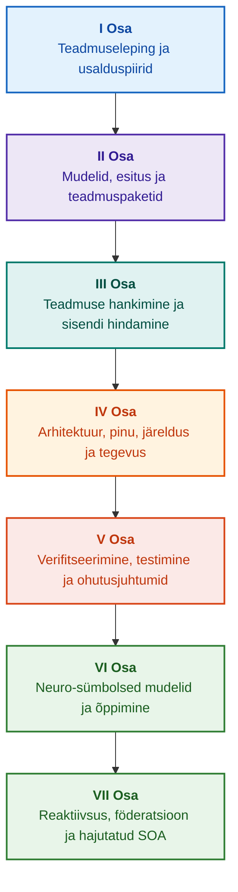

# Tõenduspõhiste ekspertsüsteemide arhitektuur: Formaalsetest ontoloogiatest neuro-sümbolse tehisintellektini

**Insenerimonograafia ja käsiraamat kõrge terviklikkusega intelligentsete süsteemide kavandamisest, matemaatilistest alustest, arhitektuurist ja verifitseerimisest (Safety-Critical & Evidence-Grounded AI)**

**Autor:** [Mykola Fedchyk](about-the-author.md) · [LinkedIn](https://www.linkedin.com/in/nickfedchik/)  
**Formaat:** Insenerimonograafia / Tehisintellekti arhitekti käsiraamat  
**Aasta:** 2026  

---

## Raamatust

Käesolev monograafia kujutab endast fundamentaalset uurimistööd ja insenerijuhendit, mis on pühendatud kaasaegse tehisintellekti suurima kriisi ületamisele: episteemilisele lõhele närvivõrkude genereeritud vastuste tõenäosusliku usutavuse ja formaalsete matemaatiliste tõestuste deterministliku tõe vahel. Selle uurimistöö keskmes on kompromissitu küsimus: **kuidas kavandada ekspertsüsteemi, mille iga järeldus on ümberlükkamatu, täielikult tuvastatav esmastest tõendusallikatest ning sobib sertifitseerimiseks ohutuskriitilistes insenerivaldkondades (ISO 26262, IEC 61508, DO-178C, ISO/SAE 21434)?**

Autor põhjendab ja esitab uue paradigma: **Tõenduspõhine neuro-sümbolne tehisintellekt (Evidence-Grounded Neuro-Symbolic AI)**, milles statistilised mudelid (LLM/SLM) täidavad hüpoteeside genereerimise ja projektsioonide visualiseerimise nõuandvat funktsiooni, samas kui deterministlik sümboltuum tagab vankumatult loogilise järjepidevuse, bait-taseme faktide ankurdamise, volituste piiride jõustamise ja turvalise ülemineku täitmisele.

### Artefaktist kontrollitava otsuseni

Süsteeminõuded, lähtekood, testide käivitamise logid, regulatiivsed standardid ja inseneriotsused läbivad tänapäeval kaasaegseid tootmiskeskkondi. Need toimivad aga valdavalt eraldiseisvate artefaktidena, millel puuduvad formaliseeritud semantika, selged kehtivuspiirid ja kahesuunaline jälgitavus. Edukas kvalifikatsioonitesti aruanne võib viidata vananenud riistvaraversioonile; tsitaat funktsionaalse ohutuse standardist võib olla kontekstist välja rebitud; automaatne hädakonfiguratsiooni tagasipööramine võib tahtmatult aktiveerida tühistatud komponendi.

Käesolev monograafia loob tervikliku insenerikonveieri: alates inseneriartefaktide formaliseerimisest tüübitud andmete ja krüptograafiliselt allkirjastatud teadmuspakettidena kuni sümboljärelduse, samm-sammulise plaanide dekomponeerimise, kontrafaktuaalsete selgituste ja pädevuspiiride auditeerimiseni. Praktiline esitus tugineb tööstusliku tasemega Go-keele lahendustele koos ammendavate testikomplektidega ([Peatükk 1](ch01-introduction-to-expert-systems.md)), rangetele matemaatilistele lepingutele ([II Osa](part-02-knowledge-models.md)) ja pideva õppe protokollidele, mis tõendatult välistavad regressioonid ([Peatükk 25](ch25-how-expert-systems-learn.md)).

### Sihtrühm

Teos on mõeldud süsteemiarhitektidele, töökindluse ja funktsionaalse ohutuse juhtivinseneridele, järeldusmootorite arendajatele ja teadmusinseneridele. Põhimõistete omandamine nõuab vaid esimese järgu predikaatloogika, tarkvara versioonihalduse ja elutsüklihalduse põhialuste tundmist; praktiliste näidete kordamiseks piisab standardsetest Go tööriistadest. Spetsiaalsed peatükid, mis käsitlevad Goal Structuring Notation (GSN) sünteesi, keerukate süsteemide sünergeetikat, neuromorfseid kiirendeid ja autonoomset navigatsiooni ilma GNSS-ita, käsitlevad tõenduspõhise tehisintellekti tipptasemel piire lennunduses, autonoomsetes sõidukites ja kriitilises taristus.

---

## Teaduslik kontekst ja monograafia globaalne paigutus

Monograafia ei käsitle ekspertsüsteeme 1980. aastate reeglipõhiste süsteemide (nagu CLIPS või MYCIN) arhailise pärandina, vaid **kolmanda laine tõenduspõhise neuro-sümbolse tehisintellekti (Third-Wave Evidence-Grounded Neuro-Symbolic AI)** eesliinina. Metoodika seob juhtivate ülemaailmsete teaduskoolkondade teoreetilised alused suure jõudlusega süsteemitehnoloogiaga:

| Teadusdistsipliin | Peamised globaalsed teosed ja autorid | Kontseptuaalne sild käesolevas monograafias |
|---|---|---|
| **Kolmanda laine neuro-sümbolne AI (NeSy)** | Artur d'Avila Garcez, Luis C. Lamb (*Neurosymbolic AI: The 3rd Wave*, 2023; *Neural-Symbolic Cognitive Reasoning*, Springer, 2009); Henry Kautz (*The Third AI Summer*, AAAI 2022) | Vastutusalade lahusus: statistilised mudelid (SLM/LLM) genereerivad päringuhüpoteese, samas kui deterministlik sümboltuum verifitseerib ja kinnitab faktid formaalselt ([Peatükk 29](ch29-neuro-symbolic-architecture.md)). |
| **Semantilised kitsendused ja ohutu õppimine** | Guy Van den Broeck et al. (*A Semantic Loss Function for Deep Learning with Symbolic Knowledge*, ICML 2018); Luc De Raedt et al. (*DeepProbLog*, IJCAI 2020) | Sissepääsu- ja väljumisväravad, närvivõrkude kandidaatväidete deterministlik semantiline filtreerimine formaalsete skeemide suhtes ([Peatükid 28](ch28-dual-mode-expert-systems.md), [33](ch33-inter-system-knowledge-exchange-and-model-teaching.md)). |
| **Kummutatav arutlemine ja argumentatsiooniteooria** | John L. Pollock (*Defeasible Reasoning*, 1987; *Cognitive Carpentry*, MIT Press, 1995); Phan Minh Dung (*Abstract Argumentation Frameworks*, AIJ 1995); Douglas Walton (*Argumentation Schemes*, Cambridge, 2008) | Teadmiste dekomponeerimine väideteks, päritoluks ja kummutajateks (*defeaters*: *rebutting* ja *undercutting*); konfliktide lahendamine normatiivsetes reeglibaasides Dungi argumentatsiooniraamistike kaudu ([Peatükid 2](ch02-epistemology-of-machine-knowledge.md), [27](ch27-safety-case-gsn-synthesis.md)). |
| **Assotsiatsioonireeglite automatiseeritud kaevandamine (KBC)** | Luis Galárraga, Fabian M. Suchanek et al. (*AMIE: Association Rule Mining under Incomplete Evidence*, WWW 2013, VLDBJ 2015); Stephen Muggleton (*Inductive Logic Programming*, 1994) | Autonoomne reegliinduktsioon teadmusbaasidest osalise täielikkuse eelduse (PCA) alusel, vältides avatud maailma valesid vastunäiteid ([Peatükk 34](ch34-deterministic-relational-analysis-abduction-and-socratic-dialogue.md)). |
| **Formaalsed turvakilbid ja sertifitseerimine (Safe AI)** | Bettina Könighofer, Roderick Bloem et al. (*Shield Synthesis*, 2017); Tim Kelly, Rob Weaver (*Goal Structuring Notation*, York, 2004); André Platzer (*Logical Foundations of CPS*, Springer, 2018) | Struktureeritud ohutusjuhtumite süntees GSN-notatsioonis standardite ISO 26262/21434 jaoks; formaalsed kilbid ja numbrilised kehtivusümbrised ääretäituritele ([Peatükid 27](ch27-safety-case-gsn-synthesis.md), [30](ch30-safety-cybersecurity-co-engineering.md), [33](ch33-inter-system-knowledge-exchange-and-model-teaching.md)). |
| **Episteemiline loogika ja teadmussemiootika** | John F. Sowa (*Knowledge Representation: Logical, Philosophical, and Computational Foundations*, 2000); Frank van Harmelen et al. (*Handbook of Knowledge Representation*, Elsevier, 2008) | Charles Sanders Peirce'i episteemiline triaad (Mõiste → Otsustus → Järeldus); tööhüpoteeside abduktiivne genereerimine range deduktiivse kontrolli all ([Peatükid 6](ch06-applied-mathematics-for-expert-systems.md), [34](ch34-deterministic-relational-analysis-abduction-and-socratic-dialogue.md)). |
| **Keerukate süsteemide küberneetika ja sünergeetika** | Norbert Wiener (*Cybernetics*, 1948); W. Ross Ashby (*An Introduction to Cybernetics*, 1956); Hermann Haken (*Synergetics: An Introduction*, 1977; *Advanced Synergetics*, 1983); Ilya Prigogine (*Order out of Chaos*, 1984) | Ashby vajaliku mitmekesisuse seadus, suletud L0–L4 juhtimisahelad, faasiruumi redutseerimine järjekorranäitajatele Hakeni allutamisprintsiibi kaudu, faasisiirete varajane hoiatus kriitilise aeglustumise (CSD) kaudu ning arenevate teadmusbaaside dissipatiivne stabiliseerimine ([Peatükid 6](ch06-applied-mathematics-for-expert-systems.md), [22](ch22-cybernetics-edge-to-backend.md), [35](ch35-self-organizing-expert-systems-synergetics-and-npu-runtime.md)). |
| **Teadmuse testimine, invariantsus ja Lipschitzi kalibreerimine** | Kent Beck (*TDD*, 2002); Martin Fowler (*Refactoring*, 2018); Clark Barrett, Leonardo de Moura (*Z3 SMT Solver*, 2008); Chuan Guo et al. (*On Calibration of Modern Neural Networks*, ICML 2017); Marco Tulio Ribeiro et al. (*CheckList*, ACL 2020); John L. Pollock (*Defeasible Reasoning*, 1987) | Neljatasemeline teadmuse testimise püramiid (KTP): aatomireeglite isoleeritud ühiktestimine (KUT) simuleeritud eeldustega (`PremiseMock`), tühitõe lõksu vältimine, 6-punktiline spektraalne piirväärtuste analüüs (BVA), reeglivõred ja kummutajad (KIT), semantilise invariantsuse skoor ($\text{SIS} \ge 0.98$) keeleliste päringumutatsioonide korral, Lipschitzi pidevuse piirid ($L_{\mathcal{K}} \le L_{\max}$) releede võnkumise vältimiseks ja teadmuslünkade stigmergiline tuvastamine ([Peatükk 36](ch36-knowledge-testing-pyramid-and-variational-calibration.md)). |

---

## Autori teoreetilised mudelid, teaduslik uurimistöö ja inseneriuuendused

Käesolev monograafia võtab kokku autori alusuuringud ja süsteemitehnilise panuse ohutuskriitilise tarkvara, manussüsteemide ja tõenduspõhise tehisintellekti vallas. Erinevalt puhtalt ülevaatlikust kirjandusest tutvustab raamat algsete formaalsete teooriate, protokollide ja arhitektuurimustrite kogumit, mis viivad neuro-sümbolse suhtluse matemaatiliselt kontrollitud usaldusväärsuse tasemele:

### 1. Fundamentaalsed teoreetilised arendused ja matemaatilised formalismid

1. **Tõenduspõhine invariant (EGI) ja faktide kinnitamise värav ([Peatükid 2](ch02-epistemology-of-machine-knowledge.md), [19](ch19-from-question-to-evidence.md), [28](ch28-dual-mode-expert-systems.md), [29](ch29-neuro-symbolic-architecture.md)):**
   * *Teoreetiline formuleering:* Autor formaliseerib Ankurdamise Täielikkuse Invariandi $\mathrm{Comp}(C) = 1.00$, sätestades, et tõenduspõhises arhitektuuris ei saa ühtegi väidet tõsta tunnustatud faktiks ilma deterministliku projektsioonita autoriteetsetele esmasallikatele. Iga heakskiidetud faktikogum on ankurdatud muudatamatute baidinihetega `[byte_start, byte_end]`, kanoonilise krüptograafilise fragmendiräsiga `quote_sha256` ja PROV-O päritolusertifikaadi identifikaatoriga.
   * *Insenerimõju:* Baiditasemel riist-/tarkvaraline vastuvõtuvärav muudab närvivõrkude hallutsinatsioonid võimatuks pääseda versioonitud teadmusbaasi, tagades nulltolerantsi põhjendamata väidete suhtes ($ZHR = 1.00$).
2. **Neljatasemeline teadmuse testimise püramiid (KTP) ja loogilise ruumi Lipschitzi pidevus ([Peatükk 36](ch36-knowledge-testing-pyramid-and-variational-calibration.md)):**
   * *Teoreetiline formuleering:* Autor toob sisse Teadmuse Testimise Püramiidi (KTP), kandes Fowleri tarkvara testimispüramiidi distsipliini üle teadmussüsteemidesse: reeglite isoleeritud ühiktestimine (KUT) simuleeritud eeltingimustega (`PremiseMock`), reeglite koostoimete ja kummutajate integratsioonitestimine (KIT) ning variatsiooniline kalibreerimine päringute ruumis (KVT).
   * *Matemaatiline aparaat:* Tühitõde välistava invariandi formaliseerimine ($P \to Q$, kus $P \equiv \text{False}$), Semantilise Invariantsuse Skoor ($\mathrm{SIS} \ge 0.98$) keeleliste häirete korral ja Lipschitzi pidevuse kitsendus järeldusruumis ($L_{\mathcal{K}} \le L_{\max}$), mis kõrvaldab matemaatiliselt katastroofilise releevõnkumise sisendite väikeste kõikumiste korral.
3. **Deontiliste normide popperlik falsifitseerimine ja aktiivne vastavusaudit ([Peatükk 39](ch39-active-compliance-auditor-and-popperian-testing.md)):**
   * *Teoreetiline formuleering:* Paradigmanihk passiivselt oraaklilt (mis vaid vastab päringutele) aktiivsele vastavuse audiitorile, kes rakendab Karl Popperi falsifitseeritavuse printsiipi. Süsteem sondeerib autonoomselt spetsifikatsiooniruumi (ASPICE 4.0, ISO 26262, ISO/SAE 21434), sünteesib vastunäiteid, tuvastab puudulikult määratletud ääretingimusi ja kavandab ammendavaid kontrollikampaaniaid.
   * *Praktiline väärtus:* Äärejuhtumite neuraalse genereerimise (Süsteem 1) sidumine deterministliku deontilise kontrolliga sümboltarkvara kaudu (Süsteem 2), kaitstes juhtimisahelas olevat inimest (Human-in-the-Loop) heakskiitmise väsimuse eest.
4. **Teadmusbaaside sünergeetiline dimensioonide vähendamine ja bifurkatsioonieelne CSD-diagnostika ([Peatükid 6](ch06-applied-mathematics-for-expert-systems.md), [22](ch22-cybernetics-edge-to-backend.md), [35](ch35-self-organizing-expert-systems-synergetics-and-npu-runtime.md)):**
   * *Teoreetiline formuleering:* Hermann Hakeni sünergeetika (järjekorranäitajad ja allutamisprintsiip) ja Ilya Prigogine'i dissipatiivsete struktuuride rakendamine keerukate teadmushoidlate evolutsioonile.
   * *Teaduslik panus:* Telemeetria mitmemõõtmelised faasiruumid taandatakse järjekorranäitajatele, integreerides autokorrelatsiooni- ja dispersioonimõõdikutel põhineva bifurkatsioonieelse kriitilise aeglustumise (CSD) detektori. See tuvastab ähvardava küberfüüsilise ebastabiilsuse ammu enne tavapäraste lävemonitoride häiret.
5. **Tegevusautonoomia tasemete mudel (A0–A4), vastuvõtuväravad ja idempotentsed saagad ([Peatükk 21](ch21-from-recommendation-to-action.md)):**
   * *Teoreetiline formuleering:* Granulaarne volituste raamistik automatiseeritud täitmiseks (A0: passiivne analüüs, A1: kavandi loomine, A2: inimese poolt allkirjastatud täitmine, A3: järelevalve all piiratud autonoomia, A4: hädaseiskamine fail-closed). Õigused ei ole seotud süsteemiga monoliidina, vaid kolmikuga $\langle\text{tegevus}, \text{keskkond}, \text{riskitase}\rangle$.
   * *Matemaatiline aparaat:* Algebraline idempotentsuse invariant $f(f(x, k), k) \equiv f(x, k)$ krüptograafilise loaga $k$, samm-sammuline suletud ahelaga täitmine ja hajutatud kompenseerivate saagade protokoll, mis lahendab `OutcomeUnknown` olekud ribavälise järeltingimuste verifitseerimise teel.
6. **Funktsionaalse ohutuse ja küberturvalisuse formaalne koosprojekteerimine GSN-is ([Peatükid 27](ch27-safety-case-gsn-synthesis.md), [30](ch30-safety-cybersecurity-co-engineering.md)):**
   * *Teoreetiline formuleering:* Ühtne Goal Structuring Notation (GSN) sünteesimetoodika, mis ühildab standardite ISO 26262 (ohutus) ja ISO/SAE 21434 (turvalisus) samaaegsed piirangud.
   * *Inseneriläbimurre:* Matemaatiline arbitraaž vastuoluliste eesmärkide vahel (hädaolukorra reageerimise latentsuse piirid vs. krüptograafilise atesteerimise sügavus), kombineerituna tõendite valikulise avalikustamise protokolliga välisaudiitoritele soolatud Merkle'i puude kaudu.
7. **Selgituste truuduse ja semantilise järjepidevuse verifitseerimise protokoll ([Peatükk 20](ch20-explanation-engine.md)):**
   * *Teoreetiline formuleering:* Selgitusi ei käsitleta vaba genereeritud tekstina, vaid esmaklassiliste deterministlike artefaktidena, mis pärinevad rangelt tõestusgraafist, reeglite versioonimärgenditest ja fikseeritud faktipiltidest.
   * *Matemaatiline aparaat:* Selgituste truuduse formaalne meetriline valideerimine ($C_{\text{facts}} = 1.00, H_{\text{free}} = 1.00$), mida toetab automaatne tõrkekindel tagasipöördumine jäikade mallide juurde vähimagi lahknevuse korral sümboljärelduse ja operaatorile suunatud loomuliku keele vahel.

---

### 2. Empiiriline uurimistöö, autori katsestendid ja süsteemitehnoloogia

1. **Muutumatud binaarsed teadmuspaketid koos `mmap` ja null-allokatsiooniga deserialiseerimisega ([Peatükk 32](ch32-high-performance-knowledge-packs-mmap-and-harvesting.md)):**
   * *Autori innovatsioon:* Kahetasemeline paketiarhitektuur, mis eraldab esmasallikate kanoonilised arhiivid tuletatud realiseeritud indeksisegmentidest.
   * *Empiiriline tulemus:* Otsene mälukaardistus `mmap`-i kaudu virtuaalsesse aadressiruumi kõrvaldab käitusaegsed kuhjaallokatsioonid (zero-allocation) ja saavutab sublineaarse mootori käivituslatentsuse sõltumata ontoloogiate mitmegigabaidisest mahust.
2. **Empiiriline kalibreerimiskatsestend IETF RFC-1000 ja W3C-150 regulatiivsetel korpustel ([Peatükid 2](ch02-epistemology-of-machine-knowledge.md), [4](ch04-evolution-from-bayes-to-evidence-ai.md), [14](ch14-requirements-detection-and-formalization.md), [25](ch25-how-expert-systems-learn.md)):**
   * *Autori katsestend:* Laiaulatusliku hindamisraamistiku juurutamine 1000 aktiivse IETF RFC spetsifikatsiooni (hõlmates 5 kronoloogilist interneti-ajastut) ja 150 keeruka diagnostilise päringu peal W3C korpuses (sealhulgas indutseeritud loogilised konfliktid ja konfabulatsioonid).
   * *Praktiline järeldus:* Objektiivsete teadmiste eksamimaatriksite koostamine, normatiivsete vastuolude empiiriline tuvastamine ja matemaatiliselt valideeritud kaitse teadmusbaasi regressioonide vastu pidevate uuenduste käigus.
3. **Mitmesammuline relatsioonianalüüs, sümbolabduktsioon ja sokraatiline dialoog ([Peatükk 34](ch34-deterministic-relational-analysis-abduction-and-socratic-dialogue.md)):**
   * *Autori innovatsioon:* Kahesuunaline piiratud laiushaku algoritm (Bounded BFS, $k \le 6$) tsüklite summutamise ja liitse baiditasemel tõendusahela sünteesiga suvaliste omavahel seotud olemite vahel.
   * *Insenerieelis:* Peirce'i sümbolabduktsiooni realiseerimine rangete deduktiivsete piirete all, kombineerituna tüübitud sokraatiliste täpsustusraamidega (Clarification Frames), mis suunavad süsteemi produktiivsesse kasutajadialoogi pime tagasilükkamise asemel suletud maailma eelduse (CWA) all.
4. **Formaalsed turvakilbid ja numbrilised kehtivusümbrised äärejuhtimiseks ([Peatükk 33](ch33-inter-system-knowledge-exchange-and-model-teaching.md), [Lisad B](appendix-b-robotics-and-cyber-physical-systems.md), [C](appendix-c-autonomous-navigation-and-geosearch.md), [E](appendix-e-mixed-signal-neuromorphic-expert-systems.md)):**
   * *Autori innovatsioon:* Metoodika diskreetsete loogiliste invariantide tõlkimiseks pidevateks numbrilisteks ohutuskoridorideks digitaalsignaaliprotsessoritele (DSP) ja autonoomsele navigatsioonile ilma GNSS-ita (TRN/DSMAC/VIO).
   * *Töökindlus:* Krüptograafiliselt allkirjastatud reeglivahetus Ed25519 kaudu, kandidaatreeglite isoleeritud karantiin ja täiturmehhanismide kehtetute trajektooride riistvaraline kinnipidamine.
5. **Kaitse konfidentsiaalse teabe lekkimise eest selgituste kaudu ja diferentsiaalaudit ([Peatükk 20](ch20-explanation-engine.md)):**
   * *Autori innovatsioon:* Vahepealse selgituse esituse redutseerimise protokoll ($\mathrm{EIR}_{\text{redacted}}$), mis jõustab pääsukontrolliloendeid (ACL) igas tõestusgraafi sõlmes ja servas, neutraliseerides mudeli rekonstrueerimise külgkanali rünnakud kontrastsete MIKS MITTE (WHY NOT) päringute kaudu.

---

## Struktureerimise põhimõte

Selle monograafia osad on struktureeritud peamiste insenerieesmärkide, mitte kronoloogiliste avaldamiskuupäevade või mööduvate tehnoloogianimede ümber. Iga peatükk kuulub ühte primaarsesse ossa; seotud tehnikad illustreerivad meetodeid selle keskse teesi lahendamiseks. Peatükkide numbrid ja failiidentifikaatorid jäävad püsivateks võtmeteks, võimaldades temaatilistel lugemisjärjestustel erineda numbrilisest järjekorrast.

Peatükkide sees olevad jaotiseklassid loovad loogiliselt seotud argumentatsiooni, mitte samaväärsete tehnoloogiate lihtsa kataloogi:

| Jaotiseklass | Lugeja küsimus | Arhitektuurne funktsioon peatükis |
|---|---|---|
| Probleem ja piirid | Milline täpne väljakutse tuleb lahendada? | Määratleb uurimistöö tuuma ja kehtivusulatuse |
| Objekt ja mudel | Milliseid andmeid, teadmisi või olekuid hinnatakse? | Formaliseerib mõisted, tüübid ja töölähtekohad |
| Meetod ja protseduur | Kuidas lahendus tuletatakse? | Kirjeldab deduktsiooni-, teisendus- ja juhtimisalgoritme |
| Rakendamine ja tööriistad | Milline tarkvara või riistvara protseduuri täidab? | Annab konkreetsed koodiloendid ja arhitektuurilepingud |
| Verifitseerimine ja etalon | Kuidas tõrkerežiimid süsteemselt paljastatakse? | Mõõdab jõudlust ja korrektsust sõltumatute kriteeriumide alusel |
| Järeldus ja piirangud | Mis on tõestatud ja mis jääb avatuks? | Vastab kesksele teesile ilma põhjendamata väideteta |

Geograafia, konkreetsed tööstussektorid ja kaubanduslikud platvormid toimivad rakenduskontekstidena, mitte eraldi tasanditena selles taksonoomias. Sõnastikud, lühendid, bibliograafiad ja registrinavigatsioon moodustavad viiteaparatuuri, mitte iseseisvad peatükiteemad.

Täielik [toimetuslik struktuuriülevaade](editorial-structure-review.md) annab hinnangu iga peatüki põhiteemale, piiridele külgnevate teemade vahel ja kompositsioonilistele märkustele. Resümee värskendamine ei tähenda, et kõik peatükkide sisesed kompositsiooniriskid oleksid lahendatud.

## Lugemisteed

**Esimene tarkvara verifitseerimine:** [1](ch01-introduction-to-expert-systems.md) → [7](ch07-knowledge-base-typology.md) → [8](ch08-engineering-artifacts-as-data.md) → [17](ch17-implementation-stack.md) → [23](ch23-knowledge-base-verification.md) → [25](ch25-how-expert-systems-learn.md). Eesmärk: Luua korratav, tõenduspõhine otsus koos negatiivsete testide ja kontrollitud teadmuse mutatsiooniga. Keelemudel on valikuline.

**Teadmusinseneeria:** [II Osa](part-02-knowledge-models.md) → [III Osa](part-03-knowledge-engineering-nlp.md) → [19](ch19-from-question-to-evidence.md) → [20](ch20-explanation-engine.md) → [26](ch26-continual-learning.md). Eesmärk: Ühildada formaalne semantika, päritolu, kandidaatide hankimine ja valideerimine. II Osa säilitab läbiva empiirilise uurimisprogrammi peatükkidele 7–11.

**Lahenduse arhitektuur:** [16](ch16-expert-systems-architecture.md) → [19](ch19-from-question-to-evidence.md) → [31](ch31-syllogistic-reasoning-and-relation-lattices.md) → [20](ch20-explanation-engine.md) → [21](ch21-from-recommendation-to-action.md). Eesmärk: Lahutada tõendite kontrollimine, normatiivsete reeglite rakendamine, selgituste genereerimine ja operatiivne tegevusvolitus.

**Verifitseerimine ja ohutus:** [23](ch23-knowledge-base-verification.md) → [36](ch36-knowledge-testing-pyramid-and-variational-calibration.md) → [25](ch25-how-expert-systems-learn.md) → [26](ch26-continual-learning.md) → [27](ch27-safety-case-gsn-synthesis.md) → [30](ch30-safety-cybersecurity-co-engineering.md). Välist füüsilist diagnostikat käsitletakse [Peatükis 24](ch24-system-diagnosis.md).

**Hübriidvastused ja operatiivne juurutamine:** [VI Osa](part-06-frontiers-neuro-symbolic.md) → [VII Osa](part-07-runtime-and-knowledge-exchange.md) → [40](ch40-distributed-epistemic-architectures-soa-and-cluster-scaling.md) ja asjakohased lisad. Eesmärk: Integreerida neuraalseid keelemudeleid, hallata episteemilisi lünki, kavandada hajutatud teadmusteenuste klastreid ja verifitseerida süsteemidevahelisi föderatsioone. Peatükkidele [2](ch02-epistemology-of-machine-knowledge.md), [4](ch04-evolution-from-bayes-to-evidence-ai.md) ja [6](ch06-applied-mathematics-for-expert-systems.md) saab viidata vastavalt vajadusele lepingute, ajaloolise evolutsiooni ja matemaatiliste alustena.

---

## Väidete ulatus ja inseneripiirid

Käesolev monograafia kujutab endast fundamentaalset haridus- ja uurimismaterjali; see ei ole sertifitseeritud vastavushindamise menetlus ega iseseisev tõend seadmete vastavusest standarditele. Deterministlik täitmine ei taga eelduste faktilist täpsust; räsid ja digiallkirjad tõendavad terviklikkust, mitte empiirilist tõde; argumentatsioonigraafid ei asenda sertifitseeritud inimlikku otsustust. Süsteemitaseme töökindlusnõudeid ei saa samastada keelemudeli märgistusvigade määraga ega üldistada universaalselt kõigile tarkvaramoodulitele.

Automatiseeritud parsimine ja ekstraheerimine vähendavad käsitsi andmeliikumist, kuid ei kõrvalda formaalse modelleerimise, ekspertretsenseerimise (peer review) ja määratud teadmusehoidjate (knowledge custodians) vajalikkust. Protégé ontoloogiad, käsitsi auditid ja automaatsed kogujad toimivad kooskõlas. Matemaatilisi garantiisid piiravad selgesõnalised formaalkeele profiilid ja töölähtekohad; mõõdetud läbilaskevõime võrdlusnäitajad peegeldavad konkreetseid päringukoormusi, korpusi ja täitmiskeskkondi. Autori varasemate tootmisjuurutuste ajaloolised mõõdikud on rangelt eraldatud avatud hariduslikest katsestendidest ja aktiivsest uurimistööst.

Lõplikud otsused tootmisse lubamise, riskide aktsepteerimise ja regulatiivse vastavuse kohta kuuluvad eranditult volitatud inseneridele. Tõenduspõhine ekspertsüsteem valmistab ette kontrollitavad auditeerimisjäljed ja jõustab kokkulepitud turvapoliitikaid; see ei võta üle regulatiivset suveräänsust.

---

## Raamatu struktuur

Monograafia on jaotatud seitsmesse temaatilisse ossa, hõlmates 40 peatükki ja viis lisa. Iga peatükk kuulub ühte primaarsesse ossa. Navigatsioonijärjestused järgivad allolevat temaatilist teekaarti; peatükkide numbrid ja failiteed jäävad muudatamatuks.

---

### [I Osa. Kontseptuaalsed ja episteemilised alused](part-01-foundations.md)

*Millal on ekspertsüsteem vajalik, mis moodustab masinteadmuse ja kuidas säilitatakse organisatsiooniline põhjendus.*

* [Peatükk 1. Sissejuhatus ekspertsüsteemidesse: Kaosest juhitud teadmuseni](ch01-introduction-to-expert-systems.md)
* [Peatükk 2. Filosoofia süsteemiinsenerile: Mida on masinatel õigus nimetada teadmiseks](ch02-epistemology-of-machine-knowledge.md)
* [Peatükk 3. Ekspertsüsteemide eristamine viiteinfosüsteemidest](ch03-beyond-reference-information-systems.md)
* [Peatükk 4. Ekspertsüsteemide evolutsioon: Bayesi teoreemist tõenduspõhise tehisintellektini](ch04-evolution-from-bayes-to-evidence-ai.md)
* [Peatükk 5. Usalduse triaad: Ekspertsüsteem, kontrollitav soovitus ja ettevõtte mälu](ch05-triad-of-trust-and-corporate-memory.md)

---

### [II Osa. Matemaatilised mudelid, teadmuse esitus ja salvestamine](part-02-knowledge-models.md)

*Matemaatiliste formalismide valik, tüübitud artefaktid, inseneri jälgitavusgraafid ja muutumatud teadmuspaketid.*

* [Peatükk 6. Rakendusmatemaatika ekspertsüsteemidele: Reeglid, tõenäosused, graafid ja põhjuslikkus](ch06-applied-mathematics-for-expert-systems.md)
* [Peatükk 7. Teadmusbaaside tüpoloogia: Reeglid, ontoloogiad, juhtumid ja vektorpesastused](ch07-knowledge-base-typology.md)
* [Peatükk 8. Inseneriartefaktid ekspertsüsteemi andmetena](ch08-engineering-artifacts-as-data.md)
* [Peatükk 9. Inseneri teadmusgraaf: Täielik jälgitavus nõuetest ränini](ch09-engineering-knowledge-graph-traceability.md)
* [Peatükk 32. Muutumatud teadmuspaketid: Baiditasemel valideerimine, indeksid ja mälukaardistus](ch32-high-performance-knowledge-packs-mmap-and-harvesting.md)

---

### [III Osa. Teadmuse hankimine, lingvistiline analüüs ja sisendi hindamine](part-03-knowledge-engineering-nlp.md)

*Dokumendid, inimteadmised ja sensoorsed vaatlused: kandidaatide eraldamine, lingvistiline analüüs, formaliseerimine ja tõendite hindamine.*

* [Peatükk 10. Teadmuse omandamise süsteemid: Allikad, vastuvõtuväravad ja elutsüklid](ch10-knowledge-acquisition-systems.md)
* [Peatükk 11. Teadmuse hankimine valdkonnaekspertidelt: Intervjuud, kognitiivsed kaardid ja praktika formaliseerimine](ch11-knowledge-elicitation-from-experts.md)
* [Peatükk 12. Lingvistiline analüüs ja lokaalsed mudelid: Semantika ja allikate omistamise säilitamine](ch12-linguistic-analysis-and-local-models.md)
* [Peatükk 13. Loomuliku keele varieeruvus vs. determinism: Päringu semantika kompileerimine](ch13-language-variability-vs-determinism.md)
* [Peatükk 14. Nõuete ja modaalsuste eraldamine: Normatiivsest tekstist formaalsete invariantideni](ch14-requirements-detection-and-formalization.md)
* [Peatükk 15. Teadmuse kaevandamine ja teadmusbaasi ehitamine: Faktid, grammatikad ja automaadid](ch15-knowledge-extraction-and-kb-construction.md)
* [Peatükk 37. Sisendinfo hindamine: Allikad, tõendid ja algoritmiline skeptitsism](ch37-input-information-assessment-and-algorithmic-skepticism.md)

---

### [IV Osa. Arhitektuur, tehnoloogiapinu, järeldus ja tegevus](part-04-architecture-and-inference.md)

*Arhitektuurilepingud, käituspinu, riistvaraline kiirendus, väidete verifitseerimine, normatiivne järeldus, selgitusmootorid ja küberneetilised juhtimisahelad.*

* [Peatükk 16. Ekspertsüsteemide arhitektuur: Formaliseeritud teadmisest tõenduspõhise tegevuseni](ch16-expert-systems-architecture.md)
* [Peatükk 17. Tehnoloogiapinu: Tööriistade valik, programmeerimiskeeled ja reeglimootorid](ch17-implementation-stack.md)
* [Peatükk 18. Käitusinfrastruktuur: Lokaalsed SLM-id, riistvarakiirendid, edge ja on-premise](ch18-execution-infrastructure.md)
* [Peatükk 19. Küsimusest tõendini: Otsing, ankurdamine ja propositsioonide verifitseerimine](ch19-from-question-to-evidence.md)
* [Peatükk 31. Normatiivne järeldus: Predikaatide hierarhiad, erandid ja ajaline kehtivus](ch31-syllogistic-reasoning-and-relation-lattices.md)
* [Peatükk 20. Selgitusmootor: Otsused, põhjendatud keeldumine ja pädevuspiirid](ch20-explanation-engine.md)
* [Peatükk 21. Soovitusest tegevuseni: Volituste kontroll ja turvaline täitmine tootmises](ch21-from-recommendation-to-action.md)
* [Peatükk 22. Küberneetiline juhtimisahel: Andurid, täiturmehhanismid ja tagasiside](ch22-cybernetics-edge-to-backend.md)

---

### [V Osa. Verifitseerimine, testimine, diagnostika ja ohutusjuhtumid](part-05-verification-and-learning.md)

*Formaalne reeglite verifitseerimine, teadmuse testimispüramiidid, popperlik falsifitseerimine, tehniline diagnostika ja funktsionaalse/küberturvalisuse juhtumid.*

* [Peatükk 23. Teadmusbaasi verifitseerimine: Järjepidevus, täielikkus ja reeglite korrektsus](ch23-knowledge-base-verification.md)
* [Peatükk 36. Teadmuse testimise püramiid: Reeglid, interaktsioonid ja variatsiooniline stabiilsus](ch36-knowledge-testing-pyramid-and-variational-calibration.md)
* [Peatükk 39. Aktiivne vastavuse audiitor: Popperlik falsifitseerimine, standarditele vastavus (ASPICE/ISO 26262/ISO 21434) ja autonoomne testide genereerimine](ch39-active-compliance-auditor-and-popperian-testing.md)
* [Peatükk 24. Tehniline diagnostika: Sümptomite eristamine algpõhjustest mittetäieliku teabe korral](ch24-system-diagnosis.md)
* [Peatükk 27. Ohutusjuhtumite inseneeria: GSN-argumentide formaalne süntees ja verifitseerimine](ch27-safety-case-gsn-synthesis.md)
* [Peatükk 30. Funktsionaalse ohutuse ja küberturvalisuse koosprojekteerimine](ch30-safety-cybersecurity-co-engineering.md)

---

### [VI Osa. Neuro-sümbolsed mudelid, kognitiivsed piirid ja pidev õppimine](part-06-frontiers-neuro-symbolic.md)

*Range deduktsioon vs. nõuandvad hüpoteesid, keelemudelite integreerimine, teadmuslüngad, hallutsinatsioonide kõrvaldamine, eksamimaatriksid ja kogemuspõhine õppimine.*

* [Peatükk 28. Kaherežiimilised ekspertsüsteemid: Range deduktsioon ja nõuandvad hüpoteesid](ch28-dual-mode-expert-systems.md)
* [Peatükk 29. Neuro-sümbolne arhitektuur: Keelemudelid ja tõenduspõhine verifitseerimine](ch29-neuro-symbolic-architecture.md)
* [Peatükk 34. Teadmuslüngad: Relatsiooniline otsing, abduktsioon ja sokraatiline selgitamine](ch34-deterministic-relational-analysis-abduction-and-socratic-dialogue.md)
* [Peatükk 38. Masinhallutsinatsioonide ja teadmuse puudujääkide ravimine: Tõenduspõhine väljundkontroll](ch38-curing-machine-hallucinations-and-knowledge-deficits.md)
* [Peatükk 25. Kuidas ekspertsüsteemid õpivad: Eksamimaatriksid, teadmuse auditid ja regressioonikontroll](ch25-how-expert-systems-learn.md)
* [Peatükk 26. Pidev õppimine kogemusest ja süsteemilogide nihke leevendamine](ch26-continual-learning.md)

---

### [VII Osa. Reaktiivne käituskeskkond, süsteemidevaheline teadmusvahetus ja hajutatud SOA](part-07-runtime-and-knowledge-exchange.md)

*Reaktiivne reeglite täitmine, sünergeetika ja teadmuse faasisiirded, süsteemidevaheline föderatsioon ja hajutatud ettevõtte episteemilised arhitektuurid.*

* [Peatükk 35. Reaktiivsed ekspertsüsteemid: Sündmused, tühistamine ja teadmuse iseorganiseerumine](ch35-self-organizing-expert-systems-synergetics-and-npu-runtime.md)
* [Peatükk 33. Süsteemidevaheline teadmusvahetus: Reeglite pakkumine, mudelite õpetamine ja turvaline tagasiside](ch33-inter-system-knowledge-exchange-and-model-teaching.md)
* [Peatükk 40. Hajutatud episteemiline arhitektuur: Teadmus-SOA, semantiline marsruutimine, mäluhierarhiad ja mitme allikaga kummutatav vahekohtumenetlus](ch40-distributed-epistemic-architectures-soa-and-cluster-scaling.md)

---

### Lisad

* [Lisa A. Praktiline tõenduspõhine uurimisraamistik keerukatele inseneriprojektidele](appendix-a-evidence-governed-framework.md)
* [Lisa B. Tõenduspõhised ekspertsüsteemid autonoomses robootikas ja küberfüüsilistes süsteemides](appendix-b-robotics-and-cyber-physical-systems.md)
* [Lisa C. Autonoomne navigatsioon ilma GNSS-ita: Georuumiline sobitamine (TRN/DSMAC), visuaal-inertsiaalne odomeetria (VIO) ja ekspertandurite liitmisvahekohus](appendix-c-autonomous-navigation-and-geosearch.md)
* [Lisa D. Analoogekspertsüsteemid, neuromorfne arvutus ja riistvaraline järeldamine](appendix-d-analog-expert-systems-and-neuromorphic-computing.md)
* [Lisa E. Segasignaaliga analoog-digitaalsed ekspertsüsteemid: Neuromorfsed, analoog- ja mitte-von-Neumanni protsessorid tõendusvalitsemise all](appendix-e-mixed-signal-neuromorphic-expert-systems.md)
* [Autorist: Mykola Fedchyk (Nick Fedchik)](about-the-author.md)

---

## Uurimissuunad

Käesolevas töös sõnastatud tulevased uurimissuunad kujutavad endast avatud inseneriprobleeme, mitte garanteeritud valmislahendusi: null-allokatsiooniga teadmuspakettide korratav pakendamine; piiritletud formaalsete fragmentide verifitseerimine; agentide juhtimine selgesõnaliste volituslepingute (authority leases) kaudu; konfidentsiaalsete formaalsete propositsioonide nullteadmuskontroll (zero-knowledge); ning reeglite kontrollitud tühistamine ja mudelite unustamine (machine unlearning). Teoreetilise omaduse tõestamine mudelil ei kinnita automaatselt füüsilise süsteemi ohutust ja reegli tagasivõtmine ei võrdu andmemõju kõrvaldamisega treenitud närvivõrgumudelist.

Riistvarakiirendite ja ebatraditsiooniliste protsessorite puhul tuleb empiirilised veamäärad, latentsuspiirid, energiahajuvus ja fail-silent käitumine enne kasutuselevõttu põhjalikult iseloomustada. Asjakohaseid arhitektuuristrateegiaid uuritakse [Peatükis 29](ch29-neuro-symbolic-architecture.md), [Peatükis 32](ch32-high-performance-knowledge-packs-mmap-and-harvesting.md) ning [Lisades D](appendix-d-analog-expert-systems-and-neuromorphic-computing.md) ja [E](appendix-e-mixed-signal-neuromorphic-expert-systems.md). Peatükkide 7–11 empiiriline uurimisplaan on üksikasjalikult esitatud [II Osas](part-02-knowledge-models.md): iga kavandatud uuring on seotud testitava hüpoteesi, algse võrdlusnäitaja ja formaalse falsifitseerimiskriteeriumiga.
