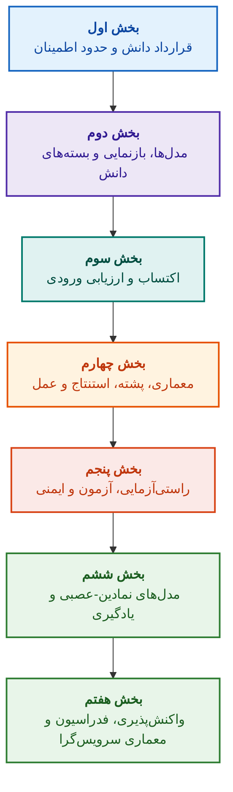

# معماری سامانه‌های خبره مبتنی بر شواهد: از انتولوژی‌های صوری تا هوش مصنوعی نمادین-عصبی

**تک‌نگاشت مهندسی و راهنمای جامع طراحی، مدل‌های ریاضی، معماری و راستی‌آزمایی صوری سامانه‌های هوشمند با قابلیت اطمینان بالا (Safety-Critical & Evidence-Grounded AI)**

**مؤلف:** [میکولا فدچیک (Mykola Fedchyk)](about-the-author.md) · [لینکدین](https://www.linkedin.com/in/nickfedchik/)  
**قالب:** تک‌نگاشت مهندسی / کتاب مرجع معماران هوش مصنوعی  
**سال:** ۲۰۲۶  

---

## درباره کتاب

این کتاب یک پژوهش بنیادین تک‌نگاشتی و راهنمای عملی مهندسی است که به رفع بحران اساسی هوش مصنوعی معاصر اختصاص یافته است: شکاف معرفت‌شناختی میان پذیرفتنی بودن احتمالاتی خروجی شبکه‌های عصبی و صدق قطعی برهان‌های صوری ریاضی. در کانون این پژوهش یک پرسش صریح مهندسی نهفته است: **چگونه می‌توان سامانه خبره‌ای طراحی کرد که تک‌تک استنتاج‌های آن تغییرناپذیر، کاملاً قابل ردگیری تا منابع اولیه شواهد و سازگار با استانداردهای گواهی‌نامه در حوزه‌های مهندسی با ایمنی بحرانی (ISO 26262, IEC 61508, DO-178C, ISO/SAE 21434) باشد؟**

مؤلف پارادایم نوینی را مستدل ساخته و پایه‌ریزی می‌کند: **هوش مصنوعی نمادین-عصبی مبتنی بر شواهد (Evidence-Grounded Neuro-Symbolic AI)**. در این معماری، مدل‌های آماری (LLM/SLM) کارکرد مشورتی تولید فرضیه‌های پرس‌وجو و رندر پروجکشنی را بر عهده دارند؛ در حالی که هسته نمادین معین به‌طور ناوردا سازگاری منطقی، اتکای سطح بایت حقایق، پایش حدود اختیارات و گذار ایمن به عمل را تضمین می‌کند.

### از دست‌سازه مهندسی تا تصمیم قابل راستی‌آزمایی

نیازمندی‌های سامانه، کدهای منبع، گزارش‌های آزمون، استانداردهای مقرراتی و تصمیم‌های مهندسی هم‌اکنون در محیط‌های تولیدی مدرن حضور دارند، اما اغلب به صورت دست‌سازه‌های جزیره‌ای بدون معناشناسی صوری، بدون مرزهای اعتبارسنجی دقیق و بدون قابلیت ردیابی متقابل عمل می‌کنند. یک گزارش آزمون موفق ممکن است به بازنگری سخت‌افزاری منسوخی ارجاع دهد؛ گزیده‌ای از یک استاندارد ایمنی عملکردی از بافت خود جدا شود؛ و بازگردانی اضطراری پیکربندی، مؤلفه‌ای مردود را ناخواسته فعال سازد.

این تک‌نگاشت یک خط لوله مهندسی کامل را پیشنهاد می‌کند: از صورت‌بندی دست‌سازه‌های مهندسی به عنوان داده‌های نوع‌دار و بسته‌های دانش دارای امضای رمزنگاری‌شده — تا استنتاج نمادین، تجزیه گام‌به‌گام برنامه‌ها، تبیین‌های خلاف واقع و بازرسی حدود صلاحیت. ارائه عملی کتاب همراه با پیاده‌سازی‌های سطح صنعتی به زبان Go با مجموعه‌های آزمون جامع ([فصل ۱](ch01-introduction-to-expert-systems.md))، قراردادهای دقیق ریاضی ([بخش دوم](part-02-knowledge-models.md)) و پروتکل‌های یادگیری مداوم بدون پسرفت دانش ([فصل ۲۵](ch25-how-expert-systems-learn.md)) پشتیبانی می‌شود.

### مخاطبان این اثر

این کتاب برای معماران سامانه‌ها، مهندسان ارشد قابلیت اطمینان و ایمنی عملکردی، توسعه‌دهندگان موتورهای استنتاج منطقی و مهندسان دانش نگاشته شده است. برای فراگیری مقدماتی مفاهیم، درک پایه‌ای از منطق محمولات مرتبه اول، کنترل نسخه نرم‌افزار و چرخه حیات سیستم‌ها کفایت می‌کند؛ برای استقرار نمونه‌های کاربردی، ابزارهای استاندارد Go لازم است. فصل‌های تخصصی ناظر بر سنتز صوری پرونده‌های ایمنی Goal Structuring Notation (GSN)، هم‌افزایی سامانه‌های پیچیده، شتاب‌دهنده‌های نورومورفیک و ناوبری خودکار بدون GNSS، افق‌های پیشگامانه هوش مصنوعی مبتنی بر شواهد در صنایع پیشرفته (هوافضا، ترابری خودران، زیرساخت‌های حیاتی انرژی) را روشن می‌سازند.

---

## بافت علمی و جایگاه کتاب در پژوهش‌های جهانی

این اثر به سامانه‌های خبره نه به مثابه بازمانده‌ای از سامانه‌های مبتنی بر قاعده دهه ۱۹۸۰ (نظیر CLIPS یا MYCIN)، بلکه به عنوان خط مقدم **هوش مصنوعی نمادین-عصبی مبتنی بر شواهد موج سوم (Third-Wave Evidence-Grounded Neuro-Symbolic AI)** می‌نگرد. پژوهش بر شالوده‌های نظری مکاتب برجسته علمی جهان استوار است و هم‌زمان شکاف میان مدل‌های انتزاعی ریاضی و مهندسی سیستم‌های با کارایی بالا را پر می‌کند:

| حوزه علمی | آثار کلیدی جهان و مؤلفان | پل مفهومی در کتاب |
|---|---|---|
| **هوش مصنوعی نمادین-عصبی موج سوم (NeSy)** | Artur d'Avila Garcez, Luis C. Lamb (*Neurosymbolic AI: The 3rd Wave*, 2023; *Neural-Symbolic Cognitive Reasoning*, Springer, 2009); Henry Kautz (*The Third AI Summer*, AAAI 2022) | تفکیک مسئولیت‌ها: مدل‌های آماری (SLM/LLM) فرضیه‌های پرس‌وجو را تولید می‌کنند و هسته نمادین معین، حقایق را رسماً تأیید و تصویب می‌نماید ([فصل ۲۹](ch29-neuro-symbolic-architecture.md)). |
| **قیود معنایی و یادگیری ایمن** | Guy Van den Broeck et al. (*A Semantic Loss Function for Deep Learning with Symbolic Knowledge*, ICML 2018); Luc De Raedt et al. (*DeepProbLog*, IJCAI 2020) | دروازه‌های مهار ورودی و خروجی، پالایش معنایی قطعی پیشنهادهای شبکه عصبی بر اساس اسکیمای صوری ([فصل‌های ۲۸](ch28-dual-mode-expert-systems.md)، [۳۳](ch33-inter-system-knowledge-exchange-and-model-teaching.md)). |
| **استدلال ابطال‌پذیر و نظریه استدلال‌آوری** | John L. Pollock (*Defeasible Reasoning*, 1987; *Cognitive Carpentry*, MIT Press, 1995); Phan Minh Dung (*Abstract Argumentation Frameworks*, AIJ 1995); Douglas Walton (*Argumentation Schemes*, Cambridge, 2008) | تجزیه دانش به ادعاها، خاستگاه و عوامل باطل‌کننده (*rebutting* و *undercutting defeaters*)؛ حل تعارض‌ها در پایگاه‌های هنجاری از طریق چارچوب‌های استدلال دانگ ([فصل‌های ۲](ch02-epistemology-of-machine-knowledge.md)، [۲۷](ch27-safety-case-gsn-synthesis.md)). |
| **داده‌کاوی خودکار قواعد انجمنی (KBC)** | Luis Galárraga, Fabian M. Suchanek et al. (*AMIE: Association Rule Mining under Incomplete Evidence*, WWW 2013, VLDBJ 2015); Stephen Muggleton (*Inductive Logic Programming*, 1994) | استقرای خودکار قواعد از پایگاه‌های دانش بر پایه فرض جامعیت نسبی (PCA) بدون مثال‌های نقض کاذب جهان باز ([فصل ۳۴](ch34-deterministic-relational-analysis-abduction-and-socratic-dialogue.md)). |
| **سپرهای ایمنی صوری و گواهی‌نامه (Safe AI)** | Bettina Könighofer, Roderick Bloem et al. (*Shield Synthesis*, 2017); Tim Kelly, Rob Weaver (*Goal Structuring Notation*, York, 2004); André Platzer (*Logical Foundations of CPS*, Springer, 2018) | سنتز ادله ایمنی با نمادگذاری GSN برای استانداردهای ISO 26262/21434؛ سپرهای صوری و لفاف‌های عددی اعتبار برای عملگرهای جانبی ([فصل‌های ۲۷](ch27-safety-case-gsn-synthesis.md)، [۳۰](ch30-safety-cybersecurity-co-engineering.md)، [۳۳](ch33-inter-system-knowledge-exchange-and-model-teaching.md)). |
| **منطق معرفتی و نشانه‌شناسی دانش** | John F. Sowa (*Knowledge Representation: Logical, Philosophical, and Computational Foundations*, 2000); Frank van Harmelen et al. (*Handbook of Knowledge Representation*, Elsevier, 2008) | سه‌گانه معرفتی چارلز سندرز پیرس (مفهوم → حکم → استنتاج)؛ استنتاج ربایشی فرضیه‌ها تحت مهار قیاسی صلب ([فصل‌های ۶](ch06-applied-mathematics-for-expert-systems.md)، [۳۴](ch34-deterministic-relational-analysis-abduction-and-socratic-dialogue.md)). |
| **سیبرنتیک و هم‌افزایی سامانه‌های پیچیده** | Norbert Wiener (*Cybernetics*, 1948); W. Ross Ashby (*An Introduction to Cybernetics*, 1956); Hermann Haken (*Synergetics: An Introduction*, 1977; *Advanced Synergetics*, 1983); Ilya Prigogine (*Order out of Chaos*, 1984) | قانون تنوع بایسته اشبی، حلقه‌های کنترل بسته L0–L4، تقلیل فضای حالت به پارامترهای نظم بر اساس اصل زیردستی هاکن، پیش‌بینی گذار فاز از طریق کندشدگی بحرانی (CSD) و پایدارسازی اتلافی پایگاه‌های دانش ([فصل‌های ۶](ch06-applied-mathematics-for-expert-systems.md)، [۲۲](ch22-cybernetics-edge-to-backend.md)، [۳۵](ch35-self-organizing-expert-systems-synergetics-and-npu-runtime.md)). |
| **آزمون دانش، ناوردایی زبانی و واسنجی لیپشیتس** | Kent Beck (*TDD*, 2002); Martin Fowler (*Refactoring*, 2018); Clark Barrett, Leonardo de Moura (*Z3 SMT Solver*, 2008); Chuan Guo et al. (*On Calibration of Modern Neural Networks*, ICML 2017); Marco Tulio Ribeiro et al. (*CheckList*, ACL 2020); John L. Pollock (*Defeasible Reasoning*, 1987) | هرم چهارسطحی آزمون دانش (KTP): آزمون واحد ایزوله قواعد (`PremiseMock`) (KUT)، مسدودسازی دام صدق تهی، آزمون مقادیر مرزی ۶ نقطه‌ای، مشبکه قواعد و باطل‌کننده‌ها (KIT)، سنجه ناوردایی معنایی ($\text{SIS} \ge 0.98$) در برابر دگرگونی‌های زبانی، پیوستگی لیپشیتس ($L_{\mathcal{K}} \le L_{\max}$) در برابر پرش‌های رله‌ای و انباشت روزنه‌های دانش ([فصل ۳۶](ch36-knowledge-testing-pyramid-and-variational-calibration.md)). |

---

## مدل‌های نظری، پژوهش‌های علمی و نوآوری‌های مهندسی مؤلف

این تک‌نگاشت دستاوردهای پژوهشی بنیادین و تجربیات مهندسی مؤلف در حیطه طراحی سامانه‌های با اطمینان‌پذیری ارتقایافته، معماری‌های تعبیه‌شده و هوش مصنوعی مبتنی بر شواهد را صورت‌بندی می‌کند. بر خلاف مرورهای صِرف، در این کتاب مجموعه‌ای از نظریه‌ها، پروتکل‌ها و راه‌حل‌های معماری نوآورانه تدوین یافته است که تعامل نمادین-عصبی را به سطح اطمینان‌پذیری مبرهن ریاضی ارتقا می‌دهند:

### ۱. دستاوردهای نظری بنیادین و صورت‌بندی‌های ریاضی

۱. **ناورداهای اتکای شواهد (Evidence-Grounded Invariant, EGI) و دروازه اعتبارسنجی حقایق ([فصل‌های ۲](ch02-epistemology-of-machine-knowledge.md)، [۱۹](ch19-from-question-to-evidence.md)، [۲۸](ch28-dual-mode-expert-systems.md)، [۲۹](ch29-neuro-symbolic-architecture.md)):**
   * *مفهوم نظری:* مؤلف ناوردای جامعیت اتکا $\mathrm{Comp}(C) = 1.00$ را صورت‌بندی و از نظر ریاضی مدل‌سازی کرده است که بیان می‌دارد در یک سامانه مبتنی بر شواهد، هیچ ادعایی نمی‌تواند بدون نگاشت قطعی بر منابع اولیه دانش، جایگاه حقیقت را احراز کند. هر مؤلفه در پایگاه حقایق با چندتایی رمزنگاری‌شده همراه است: مختصات سطح بایت تغییرناپذیر `[byte_start, byte_end]`، هش بخش معیار `quote_sha256` و شناسه گواهی خاستگاه PROV-O.
   * *اهمیت مهندسی:* سازوکار دروازه کنترل سطح بایت در لایه‌های سخت‌افزاری و نرم‌افزاری مانع نفوذ توهمات شبکه عصبی به پایگاه دانش نسخه‌بندی‌شده می‌شود و تحمل صفر در برابر داده‌های نامعتبر را تثبیت می‌کند ($ZHR = 1.00$).
۲. **هرم چهارسطحی آزمون دانش (KTP) و پایداری لیپشیتس فضای استنتاج ([فصل ۳۶](ch36-knowledge-testing-pyramid-and-variational-calibration.md)):**
   * *مفهوم نظری:* مؤلف برای نخستین بار هرم سامانه‌مند آزمون دانش (KTP) را شبیه به هرم آزمون نرم‌افزار مارتین فاولر پیشنهاد داده است: آزمون واحد قواعد مجزا (`PremiseMock`) (KUT)، آزمون یکپارچگی تعامل قواعد و باطل‌کننده‌ها (KIT) و واسنجی متغیر روی منیفولد فرمولاسیون‌ها (KVT).
   * *دستگاه ریاضی:* ناوردای صلب برای انسداد تله صدق تهی ($P \to Q$ در صورتی که $P \equiv \text{False}$)، سنجه ناوردایی معنایی ($\mathrm{SIS} \ge 0.98$) ذیل آشفتگی‌های زبانی و قید پیوستگی لیپشیتس فضای استنتاج ($L_{\mathcal{K}} \le L_{\max}$) که تکانه‌های فاجعه‌بار استنتاج را در نوسانات ناچیز ورودی منتفی می‌سازد.
۳. **نظریه ابطال‌پذیری پوپری هنجارهای تکلیفی و حسابرس فعال انطباق ([فصل ۳۹](ch39-active-compliance-auditor-and-popperian-testing.md)):**
   * *مفهوم نظری:* گذار از الگوی سنتی «اوراکل منفعل» (که صرفاً به پرسش‌ها پاسخ می‌دهد) به پارادایم حسابرس فعال دانش که اصل ابطال‌پذیری کارل پوپر را به اجرا درمی‌آورد. سامانه فضای الزامات (ASPICE 4.0, ISO 26262, ISO/SAE 21434) را به شکل خودگردان بازرسی، نمونه‌های نقض را سنتز، کاستی‌های مشخصات را شناسایی و برنامه جامع آزمون محصول را طرح‌ریزی می‌کند.
   * *ارزش عملی:* تلفیق آفرینش سناریوهای مرزی توسط شبکه عصبی (سامانه ۱) و ممیزی تکلیفی قطعی توسط هسته نمادین (سامانه ۲) با صیانت تضمین‌شده از انسان در حلقه کنترل (Human-in-the-Loop) در برابر خستگی تأیید.
۴. **کاهش ابعاد هم‌افزا در پایگاه دانش و تشخیص پیش‌بحرانی CSD ([فصل‌های ۶](ch06-applied-mathematics-for-expert-systems.md)، [۲۲](ch22-cybernetics-edge-to-backend.md)، [۳۵](ch35-self-organizing-expert-systems-synergetics-and-npu-runtime.md)):**
   * *مفهوم نظری:* به‌کارگیری ابزار ریاضی هم‌افزایی هرمان هاکن (پارامترهای نظم و اصل زیردستی) و نظریه ساختارهای اتلافی ایلیا پریگوژین در پویایی پایگاه‌های دانش پیچیده.
   * *دستاورد علمی:* ابداع روش کاهش فضای حالت چندبعدی تله‌متری به پارامترهای نظم و یکپارچه‌سازی حسگر پیش‌دوشاخگی کندشدگی بحرانی (*Critical Slowing Down*, CSD) بر پایه خودهمبستگی و پراکندگی، که پیش‌بینی فروپاشی دینامیکی سامانه را مدت‌ها پیش از تحریک حسگرهای آستانه ممکن می‌سازد.
۵. **مدل سطوح خودمختاری عمل (A0–A4)، دروازه دسترسی و ساگاهای خودتوان ([فصل ۲۱](ch21-from-recommendation-to-action.md)):**
   * *مفهوم نظری:* مقیاس گسسته حدود اختیارات عمل سامانه (A0: تحلیل منفعل، A1: تهیه پیش‌نویس، A2: اقدام با امضای انسان، A3: خودمختاری پایش‌شده، A4: قطع اضطراری محافظتی) تخصیص‌یافته به چندتایی «اقدام، بستر، سطح خطر».
   * *دستگاه ریاضی:* ناوردای جبری خودتوانی $f(f(x, k), k) \equiv f(x, k)$ مبتنی بر کلید رمزنگاری $k$، اجرای گام‌به‌گام حلقه بسته، و پروتکل ساگاهای جبرانی توزیع‌شده با وضعیت `OutcomeUnknown` و تأیید مستقل پس‌شرط‌ها.
۶. **هم‌مهندسی صوری ایمنی عملکردی و امنیت سایبری در نمادگذاری GSN ([فصل‌های ۲۷](ch27-safety-case-gsn-synthesis.md)، [۳۰](ch30-safety-cybersecurity-co-engineering.md)):**
   * *مفهوم نظری:* الگوی سنتز هماهنگ درخت‌های استدلال GSN (Goal Structuring Notation) برای پاسخگویی هم‌زمان به الزامات استانداردهای ISO 26262 (ایمنی عملکردی) و ISO/SAE 21434 (امنیت سایبری).
   * *جهش مهندسی:* صورت‌بندی داوری ریاضی بین اهداف متناقض (بودجه زمانی واکنش اضطراری در برابر عمق تصدیق رمزنگاری) و پروتکل افشای گزینشی شواهد به حسابرسان بیرونی از طریق درخت‌های مرکل نمک‌دار.
۷. **پروتکل ممیزی وفاداری و سازگاری معنایی تبیین‌ها ([فصل ۲۰](ch20-explanation-engine.md)):**
   * *مفهوم نظری:* تبیین نه به عنوان متنی آزاد از یک مدل زایشی، بلکه به مثابه دست‌سازه‌ای قطعی و مجزا تلقی می‌شود که منحصراً از گراف برهان، نسخه قواعد و مقطع تثبیت‌شده حقایق استخراج می‌گردد.
   * *دستگاه ریاضی:* دروازه سنجه ارزیابی وفاداری ($C_{\text{facts}} = 1.00, H_{\text{free}} = 1.00$) با بازگشت امن fail-safe به الگوی صلب در صورت بروز کوچک‌ترین ناهمخوانی میان استنتاج نمادین و تعبیر زبانی برای کاربر.

---

### ۲. پژوهش‌های تجربی، بسترهای آزمایشی مؤلف و مهندسی سیستم‌ها

۱. **بسته‌های دانش باینری تغییرناپذیر با `mmap` و نادیده‌گیری فرایند بازنشانی ([فصل ۳۲](ch32-high-performance-knowledge-packs-mmap-and-harvesting.md)):**
   * *نوآوری مؤلف:* معماری دولایه بسته‌ها (لایه معیار منابع اصیل + لایه مشتق نمایه‌های مادی‌شده).
   * *نتیجه تجربی:* نگاشت مستقیم نمایه به فضای آدرس مجازی با فراخوان سیستمی `mmap`، حذف سربار تخصیص پویای حافظه (zero-allocation) و راه‌اندازی موتور در زمان زیرخطی، مستقل از حجم گیگابایتی انتولوژی.
۲. **بستر آزمون تجربی روی پیکره‌های استاندارد IETF RFC-1000 و W3C-150 ([فصل‌های ۲](ch02-epistemology-of-machine-knowledge.md)، [۴](ch04-evolution-from-bayes-to-evidence-ai.md)، [۱۴](ch14-requirements-detection-and-formalization.md)، [۲۵](ch25-how-expert-systems-learn.md)):**
   * *آزمایش مؤلف:* استقرار بستر پژوهشی گسترده روی ۱۰۰۰ مشخصه معتبر IETF RFC (تقسیم‌شده در ۵ دوره تاریخی تکامل اینترنت) و ۱۵۰ پرس‌وجوی تشخیصی پیچیده پیکره W3C (با القای ساختگی تناقضات منطقی و خاطره‌سازی‌ها).
   * *دستاورد عملی:* برپایی ماتریس‌های ارزیابی عینی دانش، کشف تعارضات هنجاری و محافظت مبرهن ریاضی در برابر پسرفت پایگاه دانش حین به‌روزرسانی.
۳. **تحلیل رابطه‌ای چندمرحله‌ای، ابداع نمادین و گفت‌وگوی سقراطی ([فصل ۳۴](ch34-deterministic-relational-analysis-abduction-and-socratic-dialogue.md)):**
   * *دست‌سازه مؤلف:* الگوریتم جست‌وجوی عرضی محدود دوطرفه (Bidirectional Bounded BFS, $k \le 6$) مجهز به محافظت از چرخه و ایجاد زنجیره‌های ترکیبی شواهد در سطح بایت برای موجودیت‌های مرتبط.
   * *مزیت مهندسی:* پیاده‌سازی ربایش نمادین پیرس تحت مهار قیاسی سخت‌گیرانه و فریم‌های شفاف‌سازی نوع‌دار سقراطی (*Clarification Frames*)، که سامانه را به جای امتناع کورکورانه ذیل فرض جهان بسته (CWA)، به حالت گفت‌وگوی سازنده با انسان سوق می‌دهد.
۴. **سپرهای صوری و لفاف‌های عددی اعتبار برای سامانه‌های مهار جانبی ([فصل ۳۳](ch33-inter-system-knowledge-exchange-and-model-teaching.md)، [پیوست‌های ب](appendix-b-robotics-and-cyber-physical-systems.md)، [ج](appendix-c-autonomous-navigation-and-geosearch.md)، [هـ](appendix-e-mixed-signal-neuromorphic-expert-systems.md)):**
   * *نوآوری مؤلف:* متدولوژی ترجمه ناورداهای منطق گسسته به دالان‌های ایمنی عددی پیوسته برای پردازنده‌های سیگنال دیجیتال (DSP) و سامانه‌های ناوبری خودکار عاری از GNSS (TRN/DSMAC/VIO).
   * *قابلیت اتکای عملیاتی:* تبادل قواعد امضاشده مبتنی بر رمزنگاری Ed25519، قرنطینه امن دانش نامزد جدید و مسدودسازی فرامین مهار خطرناک در لایه سخت‌افزاری.
۵. **حفاظت در برابر نشت داده‌های محرمانه از طریق تبیین‌ها و بازرسی تفاضلی ([فصل ۲۰](ch20-explanation-engine.md)):**
   * *دست‌سازه مؤلف:* پروتکل کاهش بازنمایی میانی تبیین ($\mathrm{EIR}_{\text{redacted}}$) همراه با ممیزی ACL برای هر گره و یال در گراف برهان، که مانع حملات کانال جانبی برای بازسازی مدل‌ها از طریق پرس‌وجوهای تقابلی WHY NOT می‌شود.

---

## اصل گروه‌بندی و طبقه‌بندی

بخش‌های کتاب بر پایه مأموریت اصلی مهندسی سامان یافته‌اند، نه سال نگارش فصل یا نام فناوری معین. هر فصل به یک بخش اصلی وابسته است؛ روش‌های پیرامونی، شیوه پاسخ به پرسش بنیادین آن را روشن می‌سازند. شماره فصل‌ها و نام فایل‌ها شناسه‌های ثابت باقی می‌مانند، بنابراین توالی موضوعی مطالعه می‌تواند با ترتیب عددی متفاوت باشد.

عناوین زیربخش‌های درون فصل‌ها کلاس‌های معینی را تشکیل می‌دهند و باید به مثابه زنجیره‌ای مستمر از استدلال‌ها خوانده شوند، نه فهرستی از فناوری‌های هم‌تراز:

| رده زیربخش | پرسش خواننده | کارکرد در فصل |
|---|---|---|
| مسئله و مرز مأموریت | دقیقاً چه چیزی باید حل شود؟ | تعریف پرسش محوری و قلمرو کاربرد |
| عینیت و مدل | چه داده‌ها، دانش یا وضعیت‌هایی بررسی می‌شوند؟ | هماهنگ‌سازی مفاهیم، گونه‌ها و مفروضات |
| روش و روند | چگونه می‌توان به نتیجه دست یافت؟ | تبیین استنتاج، دگرگونی یا اعمال مهار |
| پیاده‌سازی و ابزار | روند با چه ابزاری به اجرا درمی‌آید؟ | نمایش تجسم نرم‌افزاری یا سخت‌افزاری روش |
| ممیزی و حالت شاهد | خطا چگونه کشف می‌شود؟ | تطبیق دستاورد با معیاری مستقل |
| نتیجه و حدود دستاورد | چه چیزی اثبات شده و چه امری گشوده مانده است؟ | پاسخ به مسئله اصلی بدون گزافه‌گویی |

کشور، صنعت یا محصول تجاری بستر کاربرد به شمار می‌روند، نه رده‌ای مستقل در این رده‌بندی. واژه‌نامه، اختصارات، منابع و ابزارهای ناوبری، سازوبرگ مرجع کمکی‌اند، نه مباحث مستقل فصول.

[نقشه بازبینی ساختاری ویراستاری](editorial-structure-review.md) ارزیابی موضوع اصلی هر فصل، مرزهای میان گفتارهای همجوار و ملاحظات ناظر بر ترکیب‌بندی و نتایج را در بر دارد. افزودن یادداشت تفسیری جدید به معنای رفع کلیه مخاطرات محتوایی درون فصل‌ها نیست.

---

## مسیرهای پیشنهادی مطالعه

**نخستین ممیزی نرم‌افزاری:** [۱](ch01-introduction-to-expert-systems.md) ← [۷](ch07-knowledge-base-typology.md) ← [۸](ch08-engineering-artifacts-as-data.md) ← [۱۷](ch17-implementation-stack.md) ← [۲۳](ch23-knowledge-base-verification.md) ← [۲۵](ch25-how-expert-systems-learn.md). هدف: داوری تکرارپذیر با ادله شواهد، آزمون‌های منفی و تطور هدایت‌شده دانش. به کارگیری مدل زبانی الزامی نیست.

**مهندسی دانش:** [بخش دوم](part-02-knowledge-models.md) ← [بخش سوم](part-03-knowledge-engineering-nlp.md) ← [۱۹](ch19-from-question-to-evidence.md) ← [۲۰](ch20-explanation-engine.md) ← [۲۶](ch26-continual-learning.md). هدف: هم‌راستاسازی معناشناسی، خاستگاه، اکتساب دانش و ممیزی کاندیداهای جدید. بخش دوم حاوی برنامه آزمون علمی فصول ۷ تا ۱۱ است.

**معماری راهکار:** [۱۶](ch16-expert-systems-architecture.md) ← [۱۹](ch19-from-question-to-evidence.md) ← [۳۱](ch31-syllogistic-reasoning-and-relation-lattices.md) ← [۲۰](ch20-explanation-engine.md) ← [۲۱](ch21-from-recommendation-to-action.md). هدف: تفکیک دقیق ممیزی شواهد، کاربست هنجار، تبیین و حدود اختیار اقدام.

**راستی‌آزمایی و ایمنی:** [۲۳](ch23-knowledge-base-verification.md) ← [۳۶](ch36-knowledge-testing-pyramid-and-variational-calibration.md) ← [۲۵](ch25-how-expert-systems-learn.md) ← [۲۶](ch26-continual-learning.md) ← [۲۷](ch27-safety-case-gsn-synthesis.md) ← [۳۰](ch30-safety-cybersecurity-co-engineering.md). عیب‌یابی سامانه‌های بیرونی از مدخل اختصاصی [فصل ۲۴](ch24-system-diagnosis.md) صورت می‌پذیرد.

**پاسخ‌های ترکیبی و بهره‌برداری:** [بخش ششم](part-06-frontiers-neuro-symbolic.md) ← [بخش هفتم](part-07-runtime-and-knowledge-exchange.md) ← [۴۰](ch40-distributed-epistemic-architectures-soa-and-cluster-scaling.md) و پیوست‌های مربوطه. هدف: یکپارچه‌سازی مدل زبانی، مدیریت شکاف‌های دانش، استقرار معمari سرویس‌گرای توزیع‌شده دانش و آزمون تبادلات بین‌سیستمی. فصول [۲](ch02-epistemology-of-machine-knowledge.md)، [۴](ch04-evolution-from-bayes-to-evidence-ai.md) و [۶](ch06-applied-mathematics-for-expert-systems.md) را می‌توان بر حسب ضرورت به مثابه قرارداد، تاریخچه و مرجع ریاضی مطالعه کرد.

---

## حدود تعهدات مهندسی

این کتاب متن آموزشی و پژوهشی است، نه یک رویه رسمی گواهی‌شده یا اثبات انطباق محصول با استاندارد. اجرای قطعی به خودی خود صحت فکت‌ها را اثبات نمی‌کند؛ هش و امضای دیجیتال ضامن صدق مطلق نیستند؛ و نمودار استدلال هرگز جایگزین قضاوت کارشناس انسانی نخواهد شد. الزامات پایایی کلیت یک محصول نباید به نرخ خطای مدل زبانی تقلیل یابد یا به تمام اجزای نرم‌افزاری تعمیم یابد.

تجزیه خودکار نیاز به ورود دستی داده‌ها را می‌کاهد، اما مدل‌سازی دامنه، داوری همتا و مسئولیت مالکان دانش را ملغی نمی‌سازد. Protégé، بازبینی دستی و استخراج خودکار می‌توانند در تعامل مؤثر باشند. تضمین‌های ریاضیاتی صرفاً ناظر بر پروفایل زبانی و مفروضات معین هستند؛ سرعت‌های سنجیده‌شده به پرس‌وجو، پیکره و محیط آزمون ویژه اختصاص دارند. ارقام آرشیوی مؤلف به صراحت از بسترهای آموزشی آزاد و آزمون‌های آینده تفکیک شده‌اند.

تصمیم‌گیری درباره انتشار محصول، پذیرش ریسک و پایبندی به الزامات مقرراتی بر عهده کارشناسان انسانی صاحب‌اختیار است. سامانه خبره متریال قابل بررسی را مهیا کرده و سیاست‌های مصوب را به اجرا درمی‌آورد، اما فی‌نفسه مرجعیت قانونی یا رگولاتوری کسب نمی‌کند.

---

## ساختار کتاب

کتاب از هفت بخش محوری، ۴۰ فصل و پنج پیوست تشکیل شده است. هر فصل زیرمجموعه یک بخش اصلی است. فصل پیشین و پسین در ناوبری مطابق ترتیب ساختاری زیر است؛ شماره فصول و نام فایل‌ها حفظ شده‌اند.

---

### [بخش اول. مبانی مفهومی و معرفت‌شناختی](part-01-foundations.md)

*زمان نیاز به سامانه خبره، چیستی دانش و شیوه صیانت از پایه‌های تصمیم‌های سازمانی.*

* [فصل ۱. درآمدی بر سامانه‌های خبره: از آشفتگی تا دانش مدیریت‌شده](ch01-introduction-to-expert-systems.md)
* [فصل ۲. فلسفه برای مهندس: ماشین چه چیزی را مجاز است دانش بنامد](ch02-epistemology-of-machine-knowledge.md)
* [فصل ۳. تمایز بنیادین سامانه خبره با سامانه اطلاعاتی مرجع](ch03-beyond-reference-information-systems.md)
* [فصل ۴. تطور سامانه‌های خبره: از قضیه بیز تا راهکارهای هوش مصنوعی مبتنی بر شواهد](ch04-evolution-from-bayes-to-evidence-ai.md)
* [فصل ۵. سه‌گانه اعتماد: سامانه خبره، توصیه مستند به شواهد و حافظه سازمانی](ch05-triad-of-trust-and-corporate-memory.md)

---

### [بخش دوم. مدل‌های ریاضی، بازنمایی و ذخیره‌سازی دانش](part-02-knowledge-models.md)

*انتخاب اعمال و نمایش‌های ریاضی، دست‌سازه‌های نوع‌دار، گراف ردیابی و بسته دانش تغییرناپذیر.*

* [فصل ۶. ریاضیات کاربردی برای سامانه‌های خبره: قواعد، احتمالات، گراف‌ها و علیت](ch06-applied-mathematics-for-expert-systems.md)
* [فصل ۷. سنخ‌شناسی پایگاه‌های دانش: قواعد، هستی‌شناسی‌ها، پیشینه‌ها و بردارها](ch07-knowledge-base-typology.md)
* [فصل ۸. دست‌سازه‌های مهندسی به عنوان داده‌های سامانه خبره](ch08-engineering-artifacts-as-data.md)
* [فصل ۹. گراف دانش مهندسی: ردیابی از الزامات تا سخت‌افزار](ch09-engineering-knowledge-graph-traceability.md)
* [فصل ۳۲. بسته‌های دانش تغییرناپذیر: ممیزی سطح بایت، نمایه‌ها و نگاشت حافظه](ch32-high-performance-knowledge-packs-mmap-and-harvesting.md)

---

### [بخش سوم. اکتساب دانش، تحلیل زبانی و ارزیابی ورودی](part-03-knowledge-engineering-nlp.md)

*اسناد، تجارب خبرگان و مشاهدات: استخراج کاندیداها، تحلیل زبانی، صورت‌بندی و ارزیابی شواهد.*

* [فصل ۱۰. سامانه‌های اکتساب دانش: منابع، پذیرش و چرخه حیات](ch10-knowledge-acquisition-systems.md)
* [فصل ۱۱. استخراج دانش از خبرگان: مصاحبه، نقشه‌های شناختی و صورت‌بندی تجربه](ch11-knowledge-elicitation-from-experts.md)
* [فصل ۱۲. تحلیل زبانی و مدل‌های بومی: حفظ معنا و مراجع](ch12-linguistic-analysis-and-local-models.md)
* [فصل ۱۳. تنوع زبان طبیعی در برابر قطعیت: همگردانی معنای پرس‌وجو](ch13-language-variability-vs-determinism.md)
* [فصل ۱۴. کشف الزامات و وجهیت‌ها: از متن هنجاری تا ناورداها](ch14-requirements-detection-and-formalization.md)
* [فصل ۱۵. استخراج دانش و ساخت پایگاه دانش: فکت‌ها، گرامرها و اتوماتا](ch15-knowledge-extraction-and-kb-construction.md)
* [فصل ۳۷. ارزیابی اطلاعات ورودی: منابع، شواهد و عدم قطعیت](ch37-input-information-assessment-and-algorithmic-skepticism.md)

---

### [بخش چهارم. معماری، پشته فناوری، استنتاج و عمل](part-04-architecture-and-inference.md)

*قراردادهای معماری، پشته فناوری، اجرای سخت‌افزاری، آزمون ادعاها، استنتاج مبتنی بر هنجارها، تبیین و حلقه مهار سیبرنتیک.*

* [فصل ۱۶. معماری سامانه خبره: از دانش صوری تا تصمیم مبتنی بر شواهد](ch16-expert-systems-architecture.md)
* [فصل ۱۷. پشته فناوری: معیارهای گزینش ابزارها، زبان‌های برنامه‌نویسی و موتورهای قواعد](ch17-implementation-stack.md)
* [فصل ۱۸. زیرساخت اجرا: مدل‌های محلی، شتاب‌دهنده‌های سخت‌افزاری، Edge و On-Premise](ch18-execution-infrastructure.md)
* [فصل ۱۹. از پرسش تا گواه: جست‌وجو، استقرار شواهد و راستی‌آزمایی ادعا](ch19-from-question-to-evidence.md)
* [فصل ۳۱. استنتاج مبتنی بر هنجارها: سلسله‌مراتب محمولات، استثنائات و اعتبار](ch31-syllogistic-reasoning-and-relation-lattices.md)
* [فصل ۲۰. موتور تبیین: تصمیم، امتناع و مرزهای صلاحیت](ch20-explanation-engine.md)
* [فصل ۲۱. از پیشنهاد تا اقدام: کنترل اختیارات و اجرای ایمن در محیط عملیاتی](ch21-from-recommendation-to-action.md)
* [فصل ۲۲. حلقه کنترل سیبرنتیک: حسگرها، قطعات جانبی و بازخورد](ch22-cybernetics-edge-to-backend.md)

---

### [بخش پنجم. راستی‌آزمایی، آزمون، تشخیص و پرونده ایمنی](part-05-verification-and-learning.md)

*راستی‌آزمایی صوری قواعد، هرم آزمون دانش، ابطال‌پذیری پوپری، تشخیص فنی و ادله ایمنی عملکردی و امنیت سایبری.*

* [فصل ۲۳. راستی‌آزمایی پایگاه دانش: شیوه پایش سازگاری، جامعیت و پایایی قواعد](ch23-knowledge-base-verification.md)
* [فصل ۳۶. هرم آزمون دانش: قواعد، اندرکنش‌ها و پایداری پاسخ‌ها](ch36-knowledge-testing-pyramid-and-variational-calibration.md)
* [فصل ۳۹. آزمون‌گر خبره فعال: ابطال‌پذیری پوپری، انطباق با استانداردها (ASPICE/ISO 26262/ISO 21434) و طراحی خودکار آزمون](ch39-active-compliance-auditor-and-popperian-testing.md)
* [فصل ۲۴. عیب‌یابی فنی: چگونگی پرهیز از اشتباه گرفتن نشانه با علت ریشه‌ای در کاستی داده‌ها](ch24-system-diagnosis.md)
* [فصل ۲۷. پرونده ایمنی: سنتز و بررسی صحت استدلال‌ها](ch27-safety-case-gsn-synthesis.md)
* [فصل ۳۰. هم‌مهندسی ایمنی عملکردی و امنیت سایبری](ch30-safety-cybersecurity-co-engineering.md)

---

### [بخش ششم. مدل‌های نمادین-عصبی، مرزهای شناختی و یادگیری مداوم](part-06-frontiers-neuro-symbolic.md)

*استنتاج صلب و فرضیه مشورتی، تلفیق مدل‌های زبانی، روزنه‌های دانش، مهار پاسخ‌های نامعتبر، ماتریس‌های سنجش و یادگیری مستمر از تجربه.*

* [فصل ۲۸. سامانه‌های خبره دوموضعی: استنتاج صلب و فرضیه مشورتی](ch28-dual-mode-expert-systems.md)
* [فصل ۲۹. معماری نمادین-عصبی: مدل‌های زبانی و بررسی مبانی شواهد](ch29-neuro-symbolic-architecture.md)
* [فصل ۳۴. روزنه‌های دانش: جست‌وجوی رابطه‌ای، ربایش و گفت‌وگوی ایضاحی](ch34-deterministic-relational-analysis-abduction-and-socratic-dialogue.md)
* [فصل ۳۸. توهمات ماشین و کاستی دانش: مهار پاسخی متکی به شواهد](ch38-curing-machine-hallucinations-and-knowledge-deficits.md)
* [فصل ۲۵. نحوه آموزش سامانه خبره: ماتریس‌های سنجش، ممیزی دانش و پایش پسرفت](ch25-how-expert-systems-learn.md)
* [فصل ۲۶. یادگیری مداوم (Continual Learning) بر بستر تجربه و چیرگی بر تغییرات لاگ سامانه](ch26-continual-learning.md)

---

### [بخش هفتم. اجرای واکنشی، تبادل بین‌سیستمی دانش و معماری سرویس‌گرای توزیع‌شده](part-07-runtime-and-knowledge-exchange.md)

*اجرای واکنشی قواعد، هم‌افزایی و گذار فازهای دانش، تبادلات بین‌سیستمی و معماری معرفتی توزیع‌شده در مقیاس سازمانی.*

* [فصل ۳۵. سامانه خبره واکنشی: رویدادها، ابطال و انطباق دانش](ch35-self-organizing-expert-systems-synergetics-and-npu-runtime.md)
* [فصل ۳۳. تبادل بین‌سیستمی دانش: عرضه قواعد به سامانه‌های ثالث، آموزش مدل‌ها و بازخورد امن](ch33-inter-system-knowledge-exchange-and-model-teaching.md)
* [فصل ۴۰. معماری توزیع‌شده سامانه خبره مبتنی بر شواهد: SOA معرفتی، مسیریابی معنایی، سلسله‌مراتب حافظه و داوری ابطال‌پذیر چندتأمین‌کننده](ch40-distributed-epistemic-architectures-soa-and-cluster-scaling.md)

---

### پیوست‌ها

* [پیوست الف. چارچوب کاربردی پژوهش مبتنی بر شواهد در پروژه‌های پیچیده مهندسی](appendix-a-evidence-governed-framework.md)
* [پیوست ب. سامانه‌های خبره مبتنی بر شواهد در رباتیک خودران و مجتمع‌های سایبر-فیزیکی](appendix-b-robotics-and-cyber-physical-systems.md)
* [پیوست ج. ناوبری خودکار بدون GNSS: تطبیق مکانی (TRN/DSMAC)، ادومتری بصری (VIO) و داوری خبره ادغام حسگرها](appendix-c-autonomous-navigation-and-geosearch.md)
* [پیوست د. سامانه‌های خبره آنالوگ، محاسبات نورومورفیک و استنتاج منطقی سخت‌افزاری](appendix-d-analog-expert-systems-and-neuromorphic-computing.md)
* [پیوست هـ. سامانه‌های خبره ترکیبی آنالوگ-دیجیتال: پردازشگرهای نورومورفیک، آنالوگ و غیرمتعارف تحت نظارت شواهد](appendix-e-mixed-signal-neuromorphic-expert-systems.md)
* [درباره مؤلف: میکولا فدچیک (Nick Fedchik)](about-the-author.md)

---

## افق‌های پژوهش آینده

جهت‌گیری‌های آتی پژوهش ضمانت‌های پیش‌ساخته تلقی نمی‌شوند: گردآوری تکرارپذیر بسته‌های دانش؛ آزمون بازنمایی‌های صوری محدود؛ حکمرانی عامل‌ها از طریق اعطای اختیارات شفاف؛ راستی‌آزمایی محرمانه ادعاهای صوری مشخص؛ ابطال مهارشده و بررسی پدیده فراموشی ماشین (machine unlearning). اثبات یک خصیصه در مدل الزاماً منطبق بودن محصول فیزیکی را تأیید نمی‌کند و حذف یک قاعده هم‌ارز زدودن اثر داده از مدل آموزش‌دیده نیست.

برای شتاب‌دهنده‌های سخت‌افزاری و پردازنده‌های نامتعارف، نرخ خطا، تأخیر، مصرف انرژی و رفتار هنگام خرابی در وهله نخست به دقت سنجیده می‌شود. این مباحث در [فصل ۲۹](ch29-neuro-symbolic-architecture.md)، [فصل ۳۲](ch32-high-performance-knowledge-packs-mmap-and-harvesting.md) و [پیوست‌های د](appendix-d-analog-expert-systems-and-neuromorphic-computing.md) و [هـ](appendix-e-mixed-signal-neuromorphic-expert-systems.md) مطرح شده‌اند. برنامه پژوهشی کاربردی برای فصول ۷ تا ۱۱ در [بخش دوم](part-02-knowledge-models.md) مندرج است: هر گزاره دارای فرضیه، سنجش شاهد و شرط ابطال است.
