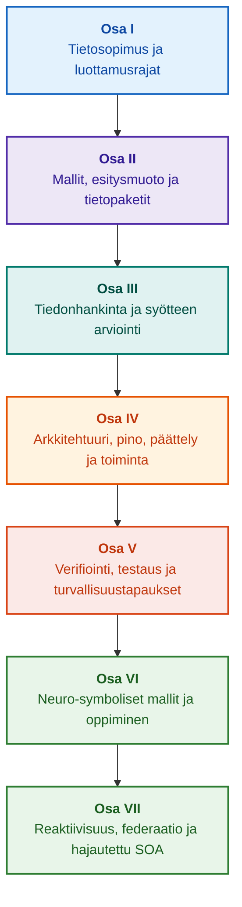

# Todisteohjattujen asiantuntijajärjestelmien arkkitehtuuri: Muodollisista ontologioista neuro-symboliseen tekoälyyn

**Insinöörimonografia ja käsikirja korkean luotettavuuden älykkäiden järjestelmien suunnittelusta, matemaattisista perusteista, arkkitehtuurista ja verifioinnista (Safety-Critical & Evidence-Grounded AI)**

**Kirjoittaja:** [Mykola Fedchyk](../en/about-the-author.md) · [LinkedIn](https://www.linkedin.com/in/nickfedchik/)  
**Formaatti:** Insinöörimonografia / Tekoälyarkkitehdin käsikirja  
**Vuosi:** 2026  

---

## Kirjasta

Tämä monografia on perustavanlaatuinen tutkimustyö ja insinööriopas, joka on omistettu nykyaikaisen tekoälyn ensisijaisen kriisin voittamiseen: neuroverkkojen tuottamien vastausten todennäköisyyspohjaisen uskottavuuden ja muodollisten matemaattisten todistusten deterministisen totuuden välisen episteemisen kuilun ylittämiseen. Tämän tutkimuksen ytimessä on tinkimätön kysymys: **kuinka voimme suunnitella asiantuntijajärjestelmän, jonka jokainen johtopäätös on kiistaton, täysin jäljitettävissä ensisijaisiin todistelähteisiin ja kelvollinen sertifioitavaksi turvallisuuskriittisillä insinöörialoilla (ISO 26262, IEC 61508, DO-178C, ISO/SAE 21434)?**

Kirjoittaja perustelee ja esittelee uuden paradigman: **Todisteisiin ankkuroitu neuro-symbolinen tekoäly (Evidence-Grounded Neuro-Symbolic AI)**, jossa tilastolliset mallit (LLM/SLM) hoitavat hypoteesien luomisen ja projektioiden visualisoinnin neuvoa-antavaa tehtävää, kun taas deterministinen symbolinen ydin takaa muuttumattomasti loogisen johdonmukaisuuden, tavutason faktojen ankkuroinnin, valtuutusrajojen valvonnan ja turvallisen siirtymisen toiminnan suorittamiseen.

### Artefaktista todennettavaan päätökseen

Järjestelmävaatimukset, lähdekoodi, testien suorituslokit, sääntelystandardit ja insinööripäätökset läpäisevät nykyaikaiset tuotantoympäristöt. Ne toimivat kuitenkin pääosin irrallisina artefakteina, joilta puuttuvat formalisoitu semantiikka, eksplisiittiset kelpoisuusrajat ja kaksisuuntainen jäljitettävyys. Hyväksytty testiraportti voi viitata vanhentuneeseen laitteistoversioon; toiminnallisen turvallisuuden standardin lainaus voi olla irrotettu kontekstistaan; automaattinen hätäkonfiguraation palautus voi vahingossa aktivoida peruutetun komponentin.

Tämä monografia rakentaa kokonaisvaltaisen insinööriputken: insinööriartefaktien formalisoinnista tyypitettynä datana ja kryptografisesti allekirjoitettuina tietopaketteina aina symboliseen päättelyyn, vaiheittaiseen suunnitelman purkamiseen, kontrafaktuaalisiin selityksiin ja pätevyysrajojen auditointiin saakka. Käytännön esitys perustuu tuotantotason Go-toteutuksiin kattavine testisarjoineen ([Luku 1](../en/ch01-introduction-to-expert-systems.md)), tiukkoihin matemaattisiin sopimuksiin ([Osa II](../en/part-02-knowledge-models.md)) ja jatkuvan oppimisen protokolliin, jotka todistetusti eliminoivat regressiot ([Luku 25](../en/ch25-how-expert-systems-learn.md)).

### Kohdeyleisö

Teos on suunnattu järjestelmäarkkitehdeille, luotettavuuden ja toiminnallisen turvallisuuden pääinsinööreille, päättelymoottoreiden kehittäjille ja tietämysinsinööreille. Keskeisten käsitteiden omaksuminen vaatii vain ensimmäisen kertaluvun predikaattilogiikan, ohjelmistojen versiohallinnan ja elinkaarenhallinnan perusteiden hallintaa; käytännön esimerkkien toistamiseen riittävät Go-vakiotyökalut. Erikoisluvut, jotka käsittelevät Goal Structuring Notation (GSN) -synteesiä, monimutkaisten järjestelmien synergetiikkaa, neuromorfisia kiihdyttimiä ja GNSS-vapaata autonomista navigointia, käsittelevät todisteohjatun tekoälyn huippuosaamisen rajoja ilmailu- ja avaruustekniikassa, autonomisissa ajoneuvoissa ja kriittisessä infrastruktuurissa.

---

## Tieteellinen konteksti ja monografian globaali asema

Monografia ei käsittele asiantuntijajärjestelmiä 1980-luvun sääntöpohjaisten järjestelmien (kuten CLIPS tai MYCIN) arkaaisena jäänteenä, vaan **Kolmannen aallon todisteohjatun neuro-symbolisen tekoälyn (Third-Wave Evidence-Grounded Neuro-Symbolic AI)** eturintamana. Metodologia yhdistää johtavien globaalien tiedekuntien teoreettiset perusteet suorituskykyiseen järjestelmäsuunnitteluun:

| Tieteenala | Tärkeimmät kansainväliset teokset ja kirjoittajat | Käsitteellinen silta tässä monografiassa |
|---|---|---|
| **Kolmannen aallon neuro-symbolinen tekoäly (NeSy)** | Artur d'Avila Garcez, Luis C. Lamb (*Neurosymbolic AI: The 3rd Wave*, 2023; *Neural-Symbolic Cognitive Reasoning*, Springer, 2009); Henry Kautz (*The Third AI Summer*, AAAI 2022) | Vastuualueiden jakaminen: tilastolliset mallit (SLM/LLM) luovat kyselyhypoteeseja, kun taas deterministinen symbolinen ydin verifioi ja hyväksyy faktat muodollisesti ([Luku 29](../en/ch29-neuro-symbolic-architecture.md)). |
| **Semanttiset rajoitteet ja turvallinen oppiminen** | Guy Van den Broeck et al. (*A Semantic Loss Function for Deep Learning with Symbolic Knowledge*, ICML 2018); Luc De Raedt et al. (*DeepProbLog*, IJCAI 2020) | Tulo- ja lähtöportit, neuroverkkojen ehdokasväittämien deterministinen semanttinen suodatus suhteessa muodollisiin skeemoihin ([Luvut 28](../en/ch28-dual-mode-expert-systems.md), [33](../en/ch33-inter-system-knowledge-exchange-and-model-teaching.md)). |
| **Kumottavissa oleva päättely ja argumentaatioteoria** | John L. Pollock (*Defeasible Reasoning*, 1987; *Cognitive Carpentry*, MIT Press, 1995); Phan Minh Dung (*Abstract Argumentation Frameworks*, AIJ 1995); Douglas Walton (*Argumentation Schemes*, Cambridge, 2008) | Tiedon hajottaminen väitteisiin, alkuperään ja kumoajiin (*defeaters*: *rebutting* ja *undercutting*); normatiivisten sääntökantojen ristiriitojen ratkaiseminen Dungin argumentaatiokehyksillä ([Luvut 2](../en/ch02-epistemology-of-machine-knowledge.md), [27](../en/ch27-safety-case-gsn-synthesis.md)). |
| **Automatisoitu assosiaatiosääntöjen louhinta (KBC)** | Luis Galárraga, Fabian M. Suchanek et al. (*AMIE: Association Rule Mining under Incomplete Evidence*, WWW 2013, VLDBJ 2015); Stephen Muggleton (*Inductive Logic Programming*, 1994) | Autonominen sääntöinduktio tietokannoista osittaisen täydellisyyden oletuksen (PCA) alaisena, mikä poistaa avoimen maailman virheelliset vastaesimerkit ([Luku 34](../en/ch34-deterministic-relational-analysis-abduction-and-socratic-dialogue.md)). |
| **Muodolliset turvakilvet ja sertifiointi (Safe AI)** | Bettina Könighofer, Roderick Bloem et al. (*Shield Synthesis*, 2017); Tim Kelly, Rob Weaver (*Goal Structuring Notation*, York, 2004); André Platzer (*Logical Foundations of CPS*, Springer, 2018) | Strukturoitujen turvallisuustapausten synteesi GSN-notaatiossa ISO 26262/21434 -standardeja varten; muodolliset kilvet ja numeeriset kelpoisuuskuoret reunalaitteille ([Luvut 27](../en/ch27-safety-case-gsn-synthesis.md), [30](../en/ch30-safety-cybersecurity-co-engineering.md), [33](../en/ch33-inter-system-knowledge-exchange-and-model-teaching.md)). |
| **Episteeminen logiikka ja tiedon semiotiikka** | John F. Sowa (*Knowledge Representation: Logical, Philosophical, and Computational Foundations*, 2000); Frank van Harmelen et al. (*Handbook of Knowledge Representation*, Elsevier, 2008) | Charles Sanders Peircen episteeminen triadi (Käsite → Arvostelma → Päätelmä); työhypoteesien abduktiivinen luominen tiukassa deduktiivisessa valvonnassa ([Luvut 6](../en/ch06-applied-mathematics-for-expert-systems.md), [34](../en/ch34-deterministic-relational-analysis-abduction-and-socratic-dialogue.md)). |
| **Monimutkaisten järjestelmien kybernetiikka ja synergetiikka** | Norbert Wiener (*Cybernetics*, 1948); W. Ross Ashby (*An Introduction to Cybernetics*, 1956); Hermann Haken (*Synergetics: An Introduction*, 1977; *Advanced Synergetics*, 1983); Ilya Prigogine (*Order out of Chaos*, 1984) | Ashbyn välttämättömän moninaisuuden laki, suljetut L0–L4-ohjaussilmukat, faasiavaruuden reduktio järjestysparametreihin Hakenin orjuuttamisperiaatteen kautta, faasisiirtymien varhainen varoitus kriittisen hidastumisen (CSD) avulla ja kehittyvien tietokantojen dissipatiivinen stabilointi ([Luvut 6](../en/ch06-applied-mathematics-for-expert-systems.md), [22](../en/ch22-cybernetics-edge-to-backend.md), [35](../en/ch35-self-organizing-expert-systems-synergetics-and-npu-runtime.md)). |
| **Tiedon testaus, invarianssi ja Lipschitz-kalibrointi** | Kent Beck (*TDD*, 2002); Martin Fowler (*Refactoring*, 2018); Clark Barrett, Leonardo de Moura (*Z3 SMT Solver*, 2008); Chuan Guo et al. (*On Calibration of Modern Neural Networks*, ICML 2017); Marco Tulio Ribeiro et al. (*CheckList*, ACL 2020); John L. Pollock (*Defeasible Reasoning*, 1987) | Nelitasoinen tiedon testauspyramidi (KTP): atomisten sääntöjen eristetty yksikkötestaus (KUT) simuloitujen ehtojen avulla (`PremiseMock`), tyhjän totuuden ansan poistaminen, 6 pisteen spektraalinen raja-arvoanalyysi (BVA), sääntörakenteet ja kumoajat (KIT), semanttisen invarianssin pistemäärä ($\text{SIS} \ge 0.98$) kyselymutaatioissa, Lipschitz-jatkuvuusrajat ($L_{\mathcal{K}} \le L_{\max}$) releiden värähtelyn estämiseksi ja tietoaukkojen stigmerginen talteenotto ([Luku 36](../en/ch36-knowledge-testing-pyramid-and-variational-calibration.md)). |

---

## Kirjoittajan teoreettiset mallit, tieteellinen tutkimus ja insinööri-innovaatiot

Tämä monografia kokoaa yhteen kirjoittajan perustutkimuksen ja järjestelmäsuunnittelun saavutukset turvallisuuskriittisten ohjelmistojen, sulautettujen arkkitehtuurien ja todisteohjatun tekoälyn alalla. Puhtaan katsauskirjallisuuden sijaan kirja esittelee joukon alkuperäisiä muodollisia teorioita, protokollia ja arkkitehtuurimalleja, jotka nostavat neuro-symbolisen vuorovaikutuksen matemaattisesti todennetulle luottamustasolle:

### 1. Perustavanlaatuiset teoreettiset mallit ja matemaattiset formalismit

1. **Todisteisiin ankkuroitu invariantti (EGI) ja faktojen validointiportti ([Luvut 2](../en/ch02-epistemology-of-machine-knowledge.md), [19](../en/ch19-from-question-to-evidence.md), [28](../en/ch28-dual-mode-expert-systems.md), [29](../en/ch29-neuro-symbolic-architecture.md)):**
   * *Teoreettinen muotoilu:* Kirjoittaja formalisoi Ankkuroinnin Täydellisyysinvariantin $\mathrm{Comp}(C) = 1.00$, jonka mukaan todisteohjatussa arkkitehtuurissa mitään väitettä ei voida nostaa tunnustetuksi faktaksi ilman determinististä projisointia auktoritatiivisiin ensisijaisiin lähteisiin. Jokainen hyväksytty faktatuppeli ankkuroidaan muuttumattomilla tavusiirtymillä `[byte_start, byte_end]`, kanonisella kryptografisella fragmenttitiivisteellä `quote_sha256` ja PROV-O-alkuperäsertifikaatin tunnisteella.
   * *Insinöörivaikutus:* Tavutason laitteisto-/ohjelmistovalidointiportti estää neuroverkkojen hallusinaatioita pääsemästä versioituun tietokantaan, mikä takaa nollatoleranssin perusteettomille väitteille ($ZHR = 1.00$).
2. **Nelitasoinen tiedon testauspyramidi (KTP) ja loogisen avaruuden Lipschitz-jatkuvuus ([Luku 36](../en/ch36-knowledge-testing-pyramid-and-variational-calibration.md)):**
   * *Teoreettinen muotoilu:* Kirjoittaja esittelee Tiedon Testauspyramidin (KTP), joka soveltaa Fowlerin ohjelmistotestauspyramidin kurinalaisuutta tietojärjestelmiin: eristetty sääntöjen yksikkötestaus (KUT) simuloitujen lähtöolettamusten avulla (`PremiseMock`), sääntöjen vuorovaikutusten ja kumoajien integraatiotestaus (KIT) sekä variationaalinen kalibrointi kyselymoninaisuuksilla (KVT).
   * *Matemaattinen laitteisto:* Tyhjää totuutta estävän invariantin formalisointi ($P \to Q$, missä $P \equiv \text{False}$), Semanttisen Invarianssin Pistemäärä ($\mathrm{SIS} \ge 0.98$) kielellisissä häiriöissä ja Lipschitz-jatkuvuusrajoite päättelymoninaisuudella ($L_{\mathcal{K}} \le L_{\max}$), joka poistaa matemaattisesti releiden katastrofaalisen värähtelyn pienissä syötevaihteluissa.
3. **Deonttisten normien popperilainen falsifiointi ja aktiivinen vaatimustenmukaisuuden auditointi ([Luku 39](../en/ch39-active-compliance-auditor-and-popperian-testing.md)):**
   * *Teoreettinen muotoilu:* Paradigman muutos passiivisesta oraakkelista (joka vain vastaa kyselyihin) aktiiviseksi vaatimustenmukaisuuden auditoijaksi, joka soveltaa Karl Popperin falsifioitavuusperiaatetta. Järjestelmä luotaa autonomisesti määrittelyavaruutta (ASPICE 4.0, ISO 26262, ISO/SAE 21434), syntetisoi vastaesimerkkejä, tunnistaa alimääritellyt reunaehdot ja suunnittelee kattavia verifiointikampanjoita.
   * *Käytännön arvo:* Neuroverkkopohjaisen reunatapausten luomisen (Järjestelmä 1) yhdistäminen deterministiseen deonttiseen verifiointiin symbolisen ytimen kautta (Järjestelmä 2), suojaten ohjaussilmukassa olevaa ihmistä (Human-in-the-Loop) hyväksyntäväsymykseltä.
4. **Tietokantojen synergeettinen ulottuvuuden vähentäminen ja bifurkaatiota edeltävä CSD-diagnostiikka ([Luvut 6](../en/ch06-applied-mathematics-for-expert-systems.md), [22](../en/ch22-cybernetics-edge-to-backend.md), [35](../en/ch35-self-organizing-expert-systems-synergetics-and-npu-runtime.md)):**
   * *Teoreettinen muotoilu:* Hermann Hakenin synergetiikan (järjestysparametrit ja orjuuttamisperiaate) ja Ilya Prigoginen dissipatiivisten rakenteiden soveltaminen monimutkaisten tietovarastojen evoluutioon.
   * *Tieteellinen panos:* Telemetrian moniulotteiset faasiavaruudet pienennetään järjestysparametreiksi integroimalla bifurkaatiota edeltävä kriittisen hidastumisen (CSD) ilmaisin, joka perustuu autokorrelaatio- ja varianssimetriikoihin. Tämä havaitsee lähestyvän kyberfyysisen epävakauden kauan ennen perinteisten kynnysvahtien hälytystä.
5. **Toiminnan autonomiatasojen malli (A0–A4), hyväksyntäportit ja idempotentit saagat ([Luku 21](../en/ch21-from-recommendation-to-action.md)):**
   * *Teoreettinen muotoilu:* Granulaarinen valtuutuskehys automatisoituun suoritukseen (A0: passiivinen analyysi, A1: luonnoksen laadinta, A2: ihmisen allekirjoittama suoritus, A3: valvottu rajattu autonomia, A4: fail-closed-hätäsammutus). Oikeudet eivät sido järjestelmää monoliittina, vaan kolmikkoa $\langle\text{toiminto}, \text{ympäristö}, \text{riskitaso}\rangle$.
   * *Matemaattinen laitteisto:* Algebrallinen idempotenssi-invariantti $f(f(x, k), k) \equiv f(x, k)$ kryptografisella tunnuksella $k$, vaiheittainen suljetun silmukan suoritus ja hajautettu kompensoivien saagojen protokolla, joka ratkaisee `OutcomeUnknown`-tilat kaistan ulkopuolisella jälkiehtojen tarkistuksella.
6. **Toiminnallisen turvallisuuden ja kyberturvallisuuden muodollinen yhteissuunnittelu GSN:ssä ([Luvut 27](../en/ch27-safety-case-gsn-synthesis.md), [30](../en/ch30-safety-cybersecurity-co-engineering.md)):**
   * *Teoreettinen muotoilu:* Yhtenäinen Goal Structuring Notation (GSN) -synteesimenetelmä, joka sovittaa yhteen standardien ISO 26262 (turvallisuus) ja ISO/SAE 21434 (kyberturvallisuus) samanaikaiset rajoitteet.
   * *Insinööriläpimurto:* Ristiriitaisten tavoitteiden matemaattinen sovittelu (hätävastelatenenssirajat vs. kryptografisen todistuksen syvyys), yhdistettynä protokollaan todisteiden valikoivasta paljastamisesta ulkoisille auditoijille suolattujen Merkle-puiden kautta.
7. **Selityksen uskollisuus- ja semanttisen johdonmukaisuuden verifiointiprotokolla ([Luku 20](../en/ch20-explanation-engine.md)):**
   * *Teoreettinen muotoilu:* Selityksiä ei käsitellä vapaasti luotuna tekstinä, vaan ensiluokkaisina deterministisinä artefakteina, jotka johdetaan tiukasti todistuskaaviosta, sääntöjen versiotunnisteista ja jäädytetyistä faktatuokioista.
   * *Matemaattinen laitteisto:* Selityksen uskollisuuden muodollinen metrinen validointi ($C_{\text{facts}} = 1.00, H_{\text{free}} = 1.00$), jota tukee automaattinen vikaturvallinen palautus jäykkiin malleihin, jos symbolisen deduktion ja käyttäjälle suunnatun luonnollisen kielen välillä havaitaan pienikin ristiriita.

---

### 2. Empiirinen tutkimus, kirjoittajan koepenkit ja järjestelmäsuunnittelu

1. **Muuttumattomat binääriset tietopaketit `mmap`:lla ja nolla-allokaatiodeserialisoinnilla ([Luku 32](../en/ch32-high-performance-knowledge-packs-mmap-and-harvesting.md)):**
   * *Kirjoittajan innovaatio:* Kaksitasoinen pakettirakenne, joka erottaa kanoniset ensisijaiset lähdearkistot johdetuista materialisoiduista indeksisegmenteistä.
   * *Empiirinen tulos:* Suora muistikartoitus virtuaaliseen osoiteavaruuteen `mmap`:n avulla eliminoi ajonaikaiset kekoallokaatiot (zero-allocation) ja saavuttaa sublineaarisen moottorin käynnistysviiveen ontologioiden monigigatavuisesta koosta riippumatta.
2. **Empiirinen kalibrointikoepenkki IETF RFC-1000 ja W3C-150 -sääntelykorpuksilla ([Luvut 2](../en/ch02-epistemology-of-machine-knowledge.md), [4](../en/ch04-evolution-from-bayes-to-evidence-ai.md), [14](../en/ch14-requirements-detection-and-formalization.md), [25](../en/ch25-how-expert-systems-learn.md)):**
   * *Kirjoittajan koepenkki:* Laajamittaisen arviointikehyksen käyttöönotto 1 000 aktiiviselle IETF RFC -spesifikaatiolle (jotka kattavat 5 internetin aikakautta) ja 150 monimutkaiselle diagnostiselle kyselylle W3C-korpuksessa (mukaan lukien indusoidut loogiset ristiriidat ja konfabulaatiot).
   * *Käytännön löydös:* Objektiivisten tiedontarkastusmatriisien rakentaminen, normatiivisten ristiriitojen empiirinen tunnistaminen ja matemaattisesti validoitu puolustus tietokannan regressioita vastaan jatkuvissa päivityksissä.
3. **Moniaskelinen relaatioanalyysi, symbolinen abduktio ja sokraattinen dialogi ([Luku 34](../en/ch34-deterministic-relational-analysis-abduction-and-socratic-dialogue.md)):**
   * *Kirjoittajan innovaatio:* Kaksisuuntainen rajattu leveyssuuntainen hakualgoritmi (Bounded BFS, $k \le 6$) syklien vaimennuksella ja yhdistetyn tavutason todisteketjun synteesillä toisiinsa liittyvien entiteettien välillä.
   * *Insinöörietulyönti:* Peircen symbolisen abduktion toteutus tiukkojen deduktiivisten suojakaiteiden alaisuudessa yhdistettynä tyypitettyihin sokraattisiin selvennyskehyksiin (Clarification Frames), jotka ohjaavat järjestelmän tuottavaan käyttäjädialogiin suljetun maailman oletuksen (CWA) mukaisen sokean hylkäämisen sijasta.
4. **Muodolliset turvakilvet ja numeeriset kelpoisuuskuoret reunalaitteiden ohjaukseen ([Luku 33](../en/ch33-inter-system-knowledge-exchange-and-model-teaching.md), [Liitteet B](../en/appendix-b-robotics-and-cyber-physical-systems.md), [C](../en/appendix-c-autonomous-navigation-and-geosearch.md), [E](../en/appendix-e-mixed-signal-neuromorphic-expert-systems.md)):**
   * *Kirjoittajan innovaatio:* Metodologia diskreettien loogisten invarianttien kääntämiseksi jatkuviksi numeerisiksi turvakäytäviksi digitaalisille signaaliprosessoreille (DSP) ja navigoinnille ilman GNSS-yhteyttä (TRN/DSMAC/VIO).
   * *Toiminnallinen luotettavuus:* Kryptografisesti allekirjoitettu sääntöjenvaihto Ed25519:n avulla, ehdokassääntöjen eristetty karanteeni ja toimilaitteiden virheellisten liikeratojen sieppaaminen laitteistotasolla.
5. **Luottamuksellisten tietojen vuotojen torjunta selitysten kautta ja differentiaalinen auditointi ([Luku 20](../en/ch20-explanation-engine.md)):**
   * *Kirjoittajan innovaatio:* Väliselitysrepresentaation pienennysprotokolla ($\mathrm{EIR}_{\text{redacted}}$), joka valvoo käyttöoikeusluetteloita (ACL) todistuskaavion jokaisessa solmussa ja särmässä, neutraloiden mallin rekonstruktioon tähtäävät sivukanavahyökkäykset MIKSI EI (WHY NOT) -kyselyiden kautta.

---

## Rakenteellinen periaate

Tämän monografian osat on jäsennelty ensisijaisten insinööritavoitteiden ympärille eikä kronologisten julkaisupäivien tai ohimenevien teknologianimien mukaan. Jokainen luku kuuluu yhteen ensisijaiseen osaan; siihen liittyvät tekniikat havainnollistavat menetelmiä sen keskeisen teesin ratkaisemiseksi. Lukunumerot ja tiedostotunnisteet pysyvät pysyvinä avaimina, mikä mahdollistaa temaattisten lukujärjestysten poikkeamisen numerojärjestyksestä.

Lukujen sisäiset osioluokat rakentavat loogisesti jäsennellyn argumentin pelkän vastaavien teknologioiden luettelon sijaan:

| Osioluokka | Lukijan kysymys | Arkkitehtoninen tehtävä luvussa |
|---|---|---|
| Ongelma ja rajat | Mikä tarkka haaste on ratkaistava? | Määrittelee tutkimuksen ytimen ja pätevyysalueen |
| Objekti ja malli | Mitä dataa, tietoa tai tiloja arvioidaan? | Formalisoi käsitteet, tyypit ja toimintaoletukset |
| Menetelmä ja menettely | Miten ratkaisu johdetaan? | Kuvaa yksityiskohtaisesti deduktio-, muunnos- ja ohjausalgoritmit |
| Toteutus ja työkalut | Mikä ohjelmisto tai laitteisto suorittaa menettelyn? | Tarjoaa konkreettiset koodilistaukset ja arkkitehtuurisopimukset |
| Verifiointi ja vertailu | Miten vikatilat paljastetaan järjestelmällisesti? | Mittaa suorituskykyä ja oikeellisuutta riippumattomien kriteerien mukaan |
| Johtopäätös ja rajoitukset | Mitä on todistettu ja mikä jää avoimeksi? | Vastaa keskeiseen teesiin ilman perusteettomia väitteitä |

Maantiede, tietyt teollisuudenalat ja kaupalliset alustat toimivat sovelluskonteksteina eivätkä erillisinä tasoina tässä taksonomiassa. Sanastot, lyhenteet, kirjallisuusluettelot ja hakemistonakigointi muodostavat viiteaineiston, eivät itsenäisiä lukuteemoja.

Täydellinen toimituksellinen rakennekatsaus antaa arvion kunkin luvun ydinteemasta, vierekkäisten aiheiden välisistä rajoista ja sommitteluhuomioista. Tiivistelmän päivittäminen ei tarkoita, että kaikki lukujen sisäiset sommitteluriskit olisi ratkaistu.

## Lukureitit

**Ensimmäinen ohjelmistoverifiointi:** [1](../en/ch01-introduction-to-expert-systems.md) → [7](../en/ch07-knowledge-base-typology.md) → [8](../en/ch08-engineering-artifacts-as-data.md) → [17](../en/ch17-implementation-stack.md) → [23](../en/ch23-knowledge-base-verification.md) → [25](../en/ch25-how-expert-systems-learn.md). Tavoite: Tuottaa toistettava, todisteisiin ankkuroitu tuomio negatiivisilla testeillä ja hallitulla tiedon mutaatiolla. Kielimalli on valinnainen.

**Tietämysinsinööritaito:** [Osa II](../en/part-02-knowledge-models.md) → [Osa III](../en/part-03-knowledge-engineering-nlp.md) → [19](../en/ch19-from-question-to-evidence.md) → [20](../en/ch20-explanation-engine.md) → [26](../en/ch26-continual-learning.md). Tavoite: Yhdistää muodollinen semantiikka, alkuperä, ehdokkaiden hankinta ja validointi. Osa II säilyttää lukujen 7–11 poikkileikkaavan empiirisen tutkimusohjelman.

**Ratkaisuarkkitehtuuri:** [16](../en/ch16-expert-systems-architecture.md) → [19](../en/ch19-from-question-to-evidence.md) → [31](../en/ch31-syllogistic-reasoning-and-relation-lattices.md) → [20](../en/ch20-explanation-engine.md) → [21](../en/ch21-from-recommendation-to-action.md). Tavoite: Erottaa toisistaan todisteiden verifiointi, normatiivisten sääntöjen soveltaminen, selitysten luominen ja operatiivinen toimintavaltuutus.

**Verifiointi ja turvallisuus:** [23](../en/ch23-knowledge-base-verification.md) → [36](../en/ch36-knowledge-testing-pyramid-and-variational-calibration.md) → [25](../en/ch25-how-expert-systems-learn.md) → [26](../en/ch26-continual-learning.md) → [27](../en/ch27-safety-case-gsn-synthesis.md) → [30](../en/ch30-safety-cybersecurity-co-engineering.md). Ulkoista fyysistä diagnostiikkaa käsitellään [Luvussa 24](../en/ch24-system-diagnosis.md).

**Hybridivasteet ja operatiivinen käyttöönotto:** [Osa VI](../en/part-06-frontiers-neuro-symbolic.md) → [Osa VII](../en/part-07-runtime-and-knowledge-exchange.md) → [40](../en/ch40-distributed-epistemic-architectures-soa-and-cluster-scaling.md) ja asiaankuuluvat liitteet. Tavoite: Integroida hermoverkkokielimalleja, hallita episteemisiä kuiluja, suunnitella hajautettuja tietopalveluklustereita ja verifioida järjestelmien välisiä liittoumia. Lukuihin [2](../en/ch02-epistemology-of-machine-knowledge.md), [4](../en/ch04-evolution-from-bayes-to-evidence-ai.md) ja [6](../en/ch06-applied-mathematics-for-expert-systems.md) voidaan viitata tarpeen mukaan sopimuksina, historiallisena kehityksenä ja matemaattisina perusteina.

---

## Väitteiden laajuus ja insinöörirajat

Tämä monografia on perustavanlaatuista koulutus- ja tutkimusmateriaalia; se ei ole sertifioitu vaatimustenmukaisuusmenettely eikä itsenäinen todiste laitteiston standardien mukaisuudesta. Deterministinen suoritus ei takaa lähtöolettamusten tosiasiallista oikeellisuutta; tiivisteet ja digitaaliset allekirjoitukset todistavat eheyden, eivät empiiristä totuutta; argumentaatiokaaviot eivät korvaa sertifioitua inhimillistä harkintaa. Järjestelmätason luotettavuusvaatimuksia ei voida rinnastaa kielimallin token-virhetiheyteen eikä ekstrapoloida universaalisti kaikkiin ohjelmistomoduuleihin.

Automatisoitu jäsentäminen ja karkaisu vähentävät manuaalista tiedonsiirtoa, mutta eivät poista muodollisen mallinnuksen, vertaisarvioinnin (peer review) ja nimettyjen tietojen hoitajien (knowledge custodians) tarvetta. Protégé-ontologiat, manuaaliset auditoinnit ja automatisoidut kerääjät toimivat rinnakkain. Matemaattisia takuita rajoittavat muodollisten kielten eksplisiittiset profiilit ja toimintaoletukset; mitatut läpimenovertailuarvot heijastavat tiettyjä kyselykuormia, korpuksia ja suoritusympäristöjä. Kirjoittajan aiempien tuotantokäyttöönottojen historialliset mittarit on erotettu tiukasti avoimista koulutuskoepenkeistä ja aktiivisesta tutkimuksesta.

Lopulliset päätökset tuotantoon julkaisemisesta, riskien hyväksymisestä ja säädösten noudattamisesta kuuluvat yksinomaan valtuutetuille insinööreille. Todisteohjattu asiantuntijajärjestelmä valmistelee todennettavissa olevat kirjausketjut ja valvoo sovittuja turvallisuuskäytäntöjä; se ei ota itselleen sääntelyllistä suvereniteettia.

---

## Kirjan rakenne

Monografia on jaettu seitsemään temaattiseen osaan, jotka sisältävät 40 lukua ja viisi liitettä. Jokainen luku kuuluu yhteen ensisijaiseen osaan. Navigointisekvenssit noudattavat alla olevaa temaattista etenemissuunnitelmaa; lukunumerot ja tiedostopolut pysyvät muuttumattomina.

---

### [Osa I. Käsitteelliset ja episteemiset perusteet](../en/part-01-foundations.md)

*Milloin asiantuntijajärjestelmää tarvitaan, mikä muodostaa konetiedon ja miten organisatorinen perustelu säilytetään.*

* [Luku 1. Johdatus asiantuntijajärjestelmiin: Kaaoksesta hallittuun tietoon](../en/ch01-introduction-to-expert-systems.md)
* [Luku 2. Filosofiaa järjestelmäinsinöörille: Mitä koneilla on oikeus kutsua tiedoksi](../en/ch02-epistemology-of-machine-knowledge.md)
* [Luku 3. Asiantuntijajärjestelmien erottaminen viitetietojärjestelmistä](../en/ch03-beyond-reference-information-systems.md)
* [Luku 4. Asiantuntijajärjestelmien evoluutio: Bayesin lauseesta todisteohjattuun tekoälyyn](../en/ch04-evolution-from-bayes-to-evidence-ai.md)
* [Luku 5. Luottamuksen triadi: Asiantuntijajärjestelmä, todennettava suositus ja yritysmuisti](../en/ch05-triad-of-trust-and-corporate-memory.md)

---

### [Osa II. Matemaattiset mallit, tiedon esitysmuoto ja tallennus](../en/part-02-knowledge-models.md)

*Matemaattisten formalismien valinta, tyypitetyt artefaktit, tekniset jäljitettävyyskaaviot ja muuttumattomat tietopaketit.*

* [Luku 6. Sovellettu matematiikka asiantuntijajärjestelmille: Säännöt, todennäköisyydet, graafit ja kausaliteetti](../en/ch06-applied-mathematics-for-expert-systems.md)
* [Luku 7. Tietokantojen typologia: Säännöt, ontologiat, tapaukset ja vektorisulautukset](../en/ch07-knowledge-base-typology.md)
* [Luku 8. Insinööriartefaktit asiantuntijajärjestelmän datana](../en/ch08-engineering-artifacts-as-data.md)
* [Luku 9. Tekninen tietograafi: Täysi jäljitettävyys vaatimuksista piihin](../en/ch09-engineering-knowledge-graph-traceability.md)
* [Luku 32. Muuttumattomat tietopaketit: Tavutason validointi, indeksit ja muistikartoitus](../en/ch32-high-performance-knowledge-packs-mmap-and-harvesting.md)

---

### [Osa III. Tiedonhankinta, lingvistinen analyysi ja syötteen arviointi](../en/part-03-knowledge-engineering-nlp.md)

*Asiakirjat, inhimillinen asiantuntemus ja aistihavainnot: ehdokkaiden poiminta, kielellinen analyysi, formalisointi ja todisteiden arviointi.*

* [Luku 10. Tiedonhankintajärjestelmät: Lähteet, validointiportit ja elinkaaret](../en/ch10-knowledge-acquisition-systems.md)
* [Luku 11. Tiedon hankkiminen verkkoasiantuntijoilta: Haastattelut, kognitiiviset kartat ja käytännön formalisointi](../en/ch11-knowledge-elicitation-from-experts.md)
* [Luku 12. Lingvistinen analyysi ja paikalliset mallit: Semantiikan säilyttäminen ja lähteiden nimeäminen](../en/ch12-linguistic-analysis-and-local-models.md)
* [Luku 13. Luonnollisen kielen vaihtelevuus vs. determinismi: Kyselyn semantiikan kääntäminen](../en/ch13-language-variability-vs-determinism.md)
* [Luku 14. Vaatimusten ja modaliteettien poiminta: Normatiivisesta tekstistä muodollisiin invariantteihin](../en/ch14-requirements-detection-and-formalization.md)
* [Luku 15. Tiedon louhinta ja tietokannan rakentaminen: Faktat, kieliopit ja automaatit](../en/ch15-knowledge-extraction-and-kb-construction.md)
* [Luku 37. Syöttötietojen arviointi: Lähteet, todisteet ja algoritminen skeptisyys](../en/ch37-input-information-assessment-and-algorithmic-skepticism.md)

---

### [Osa IV. Arkkitehtuuri, teknologiayhdistelmä, päättely ja toiminta](../en/part-04-architecture-and-inference.md)

*Arkkitehtuurisopimukset, ajonaikainen pino, laitteistokiihdytys, väitteiden verifiointi, normatiivinen päättely, selitysmoottorit ja kyberneettiset ohjaussilmukat.*

* [Luku 16. Asiantuntijajärjestelmien arkkitehtuuri: Formalisoidusta tiedosta todisteohjattuun toimintaan](../en/ch16-expert-systems-architecture.md)
* [Luku 17. Teknologiayhdistelmä: Työkalujen valinta, ohjelmointikielet ja sääntömoottorit](../en/ch17-implementation-stack.md)
* [Luku 18. Suoritusinfrastruktuuri: Paikalliset SLM-mallit, laitteistokiihdyttimet, edge ja on-premise](../en/ch18-execution-infrastructure.md)
* [Luku 19. Kysymyksestä todisteeseen: Haku, ankkurointi ja väitteiden verifiointi](../en/ch19-from-question-to-evidence.md)
* [Luku 31. Normatiivinen päättely: Predikaattihierarkiat, poikkeukset ja ajallinen pätevyys](../en/ch31-syllogistic-reasoning-and-relation-lattices.md)
* [Luku 20. Selitysmoottori: Päätökset, perusteltu kieltäytyminen ja pätevyysrajat](../en/ch20-explanation-engine.md)
* [Luku 21. Suosituksesta toimintaan: Valtuutusten hallinta ja turvallinen suoritus tuotannossa](../en/ch21-from-recommendation-to-action.md)
* [Luku 22. Kyberneettinen ohjaussilmukka: Anturit, toimilaitteet ja palaute](../en/ch22-cybernetics-edge-to-backend.md)

---

### [Osa V. Verifiointi, testaus, diagnostiikka ja turvallisuustapaukset](../en/part-05-verification-and-learning.md)

*Muodollinen sääntöjen verifiointi, tiedontestauspyramidit, popperilainen falsifiointi, tekninen diagnostiikka ja toiminnallisen/kyberturvallisuuden tapaukset.*

* [Luku 23. Tietokannan verifiointi: Johdonmukaisuus, täydellisyys ja sääntöjen oikeellisuus](../en/ch23-knowledge-base-verification.md)
* [Luku 36. Tiedontestauspyramidi: Säännöt, vuorovaikutukset ja variationaalinen vakaus](../en/ch36-knowledge-testing-pyramid-and-variational-calibration.md)
* [Luku 39. Aktiivinen vaatimustenmukaisuuden auditoija: Popperilainen falsifiointi, standardien noudattaminen (ASPICE/ISO 26262/ISO 21434) ja autonominen testien luonti](../en/ch39-active-compliance-auditor-and-popperian-testing.md)
* [Luku 24. Tekninen diagnostiikka: Oireiden erottaminen perimmäisistä syistä epätäydellisen tiedon vallitessa](../en/ch24-system-diagnosis.md)
* [Luku 27. Turvallisuustapausten suunnittelu: GSN-argumenttien muodollinen synteesi ja verifiointi](../en/ch27-safety-case-gsn-synthesis.md)
* [Luku 30. Toiminnallisen turvallisuuden ja kyberturvallisuuden yhteissuunnittelu](../en/ch30-safety-cybersecurity-co-engineering.md)

---

### [Osa VI. Neuro-symboliset mallit, kognitiiviset rajapinnat ja jatkuva oppiminen](../en/part-06-frontiers-neuro-symbolic.md)

*Tiukka deduktio vs. neuvoa-antavat hypoteesit, kielimallien integrointi, tietoaukot, hallusinaatioiden poistaminen, tenttimatriisit ja kokemusperäinen oppiminen.*

* [Luku 28. Kaksoistilan asiantuntijajärjestelmät: Tiukka deduktio ja neuvoa-antavat hypoteesit](../en/ch28-dual-mode-expert-systems.md)
* [Luku 29. Neuro-symbolinen arkkitehtuuri: Kielimallit ja todisteohjattu verifiointi](../en/ch29-neuro-symbolic-architecture.md)
* [Luku 34. Tietoaukot: Relaatiohaku, abduktio ja sokraattinen selvennys](../en/ch34-deterministic-relational-analysis-abduction-and-socratic-dialogue.md)
* [Luku 38. Konehallusinaatioiden ja tietovajeiden hoitaminen: Todisteisiin ankkuroitu tulosteen valvonta](../en/ch38-curing-machine-hallucinations-and-knowledge-deficits.md)
* [Luku 25. Kuinka asiantuntijajärjestelmät oppivat: Koematriisit, tiedon auditoinnit ja regressioiden hallinta](../en/ch25-how-expert-systems-learn.md)
* [Luku 26. Jatkuva oppiminen kokemuksesta ja järjestelmälokien siirtymän hillitseminen](../en/ch26-continual-learning.md)

---

### [Osa VII. Reaktiivinen ajonaikainen ympäristö, järjestelmien välinen tiedonvaihto ja hajautettu SOA](../en/part-07-runtime-and-knowledge-exchange.md)

*Reaktiivinen sääntöjen suoritus, synergetiikka ja tiedon faasisiirtymät, järjestelmien välinen federaatio ja hajautetut yrityksen episteemiset arkkitehtuurit.*

* [Luku 35. Reaktiiviset asiantuntijajärjestelmät: Tapahtumat, sääntöjen peruuttaminen ja tiedon itseorganisoituminen](../en/ch35-self-organizing-expert-systems-synergetics-and-npu-runtime.md)
* [Luku 33. Järjestelmien välinen tiedonvaihto: Sääntöjen jakelu, mallien opettaminen ja turvallinen palaute](../en/ch33-inter-system-knowledge-exchange-and-model-teaching.md)
* [Luku 40. Hajautettu episteeminen arkkitehtuuri: Tieto-SOA, semanttinen reititys, muistihierarkiat ja monilähdeinen kumottavissa oleva sovittelu](../en/ch40-distributed-epistemic-architectures-soa-and-cluster-scaling.md)

---

### Liitteet

* [Liite A. Käytännöllinen todisteohjattu tutkimuskehys monimutkaisille insinööriprojekteille](../en/appendix-a-evidence-governed-framework.md)
* [Liite B. Todisteohjatut asiantuntijajärjestelmät autonomisessa robotiikassa ja kyberfyysisissä järjestelmissä](../en/appendix-b-robotics-and-cyber-physical-systems.md)
* [Liite C. Autonominen navigointi ilman GNSS-yhteyttä: Paikkatietojen vertailu (TRN/DSMAC), visuaalis-inertiaalinen odometria (VIO) ja asiantuntija-anturifuusion sovittelu](../en/appendix-c-autonomous-navigation-and-geosearch.md)
* [Liite D. Analogiset asiantuntijajärjestelmät, neuromorfinen laskenta ja laitteistopäättely](../en/appendix-d-analog-expert-systems-and-neuromorphic-computing.md)
* [Liite E. Sekasignaaliset analogis-digitaaliset asiantuntijajärjestelmät: Neuromorfiset, analogiset ja ei-von-Neumann-prosessorit todisteohjauksessa](../en/appendix-e-mixed-signal-neuromorphic-expert-systems.md)
* [Kirjoittajasta: Mykola Fedchyk (Nick Fedchik)](../en/about-the-author.md)

---

## Tutkimussuunnat

Tässä työssä muotoillut tulevat tutkimussuunnat edustavat avoimia insinöörihaasteita eivätkä taattuja kaupallisia valmispaketteja: nolla-allokaatiotietopakettien toistettava pakkaaminen; rajattujen muodollisten fragmenttien verifiointi; agenttien ohjaus eksplisiittisillä valtuutusvuokrasopimuksilla (authority leases); luottamuksellisten muodollisten väitteiden nollatietoverifiointi (zero-knowledge); sekä sääntöjen hallittu peruuttaminen ja mallien pois-oppiminen (machine unlearning). Teoreettisen ominaisuuden todistaminen mallilla ei automaattisesti vahvista fyysisen järjestelmän turvallisuutta, eikä säännön peruuttaminen vastaa datan vaikutuksen poistamista koulutetusta neuroverkkomallista.

Laitteistokiihdyttimille ja epätavanomaisille prosessoreille on empiiriset virhetiheydet, latenssirajat, energiahäviöt ja fail-silent-käyttäytyminen määritettävä tarkasti ennen käyttöönottoa. Asiaankuuluvia arkkitehtuuristrategioita tutkitaan [Luvussa 29](../en/ch29-neuro-symbolic-architecture.md), [Luvussa 32](../en/ch32-high-performance-knowledge-packs-mmap-and-harvesting.md) sekä [Liitteissä D](../en/appendix-d-analog-expert-systems-and-neuromorphic-computing.md) ja [E](../en/appendix-e-mixed-signal-neuromorphic-expert-systems.md). Lukujen 7–11 empiirinen tutkimusohjelma on kuvattu yksityiskohtaisesti [Osassa II](../en/part-02-knowledge-models.md): jokaiseen ehdotettuun tutkimukseen liittyy testattava hypoteesi, vertailukohta ja muodollinen falsifiointikriteeri.
