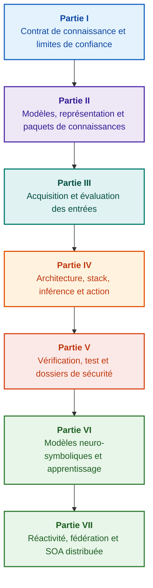

# Architecture des systèmes experts fondés sur les preuves : des ontologies formelles à l'IA neuro-symbolique

**Monographie d'ingénierie et manuel de référence sur la conception, les modèles mathématiques, l'architecture et la vérification des systèmes intelligents à haute intégrité (Safety-Critical & Evidence-Grounded AI)**

**Auteur :** [Mykola Fedchyk](about-the-author.md) · [LinkedIn](https://www.linkedin.com/in/nickfedchik/)  
**Format :** Monographie d'ingénierie / Manuel de référence de l'architecte système  
**Année :** 2026  

---

## À propos du livre

Cette monographie constitue une recherche fondamentale et un guide d'ingénierie consacré au dépassement de la crise majeure de l'intelligence artificielle contemporaine : le fossé épistémique séparant la plausibilité probabiliste des modèles de langage neuronaux de la vérité déterministe des preuves formelles. Au cœur de cette étude se trouve une exigence intransigeante : **comment concevoir un système expert dont chaque déduction est irréfutable, intégralement traçable jusqu'aux sources primaires et certifiable dans les domaines critiques (ISO 26262, IEC 61508, DO-178C, ISO/SAE 21434) ?**

L'auteur fonde et formalise un nouveau paradigme : **l'IA neuro-symbolique fondée sur les preuves (Evidence-Grounded Neuro-Symbolic AI)**. Les modèles statistiques (LLM/SLM) y assument une fonction consultative de génération d'hypothèses et de projection, tandis qu'un noyau symbolique déterministe garantit de manière immuable la cohérence logique, l'ancrage des faits au niveau de l'octet, le contrôle strict des autorisations et la transition sécurisée vers l'action.

### De l'artefact à la décision vérifiable

Exigences système, code source, rapports d'essais, normes réglementaires et choix d'architecture existent déjà dans les environnements industriels. Cependant, ils fonctionnent le plus souvent comme des artefacts disparates sans sémantique formelle, sans limites de validité explicites et sans traçabilité bidirectionnelle. Un rapport de qualification réussi peut faire référence à une révision matérielle obsolète ; une citation de norme peut être sortie de son contexte ; une procédure de repli d'urgence peut réactiver par erreur un composant révoqué.

Cette monographie établit un cycle d'ingénierie complet : de la formalisation des artefacts sous forme de données et de paquets de connaissances signés cryptographiquement, jusqu'à l'inférence symbolique, la décomposition de plans, les explications contrefactuelles et l'audit des limites de compétence. L'exposé s'appuie sur des implémentations de référence en langage Go avec bancs d'essais exhaustifs ([Chapitre 1](ch01-introduction-to-expert-systems.md)), des contrats mathématiques stricts ([Partie II](part-02-knowledge-models.md)) et des protocoles d'apprentissage continu sans régression ([Chapitre 25](ch25-how-expert-systems-learn.md)).

### Public visé

Cet ouvrage s'adresse aux architectes systèmes, ingénieurs principaux en sûreté de fonctionnement et sécurité fonctionnelle, concepteurs de moteurs d'inférence et ingénieurs de la connaissance. La maîtrise des concepts requiert une compréhension de base de la logique des prédicats du premier ordre, du versionnement et du cycle de vie logiciel ; la reproduction des cas pratiques nécessite les outils standards de l'écosystème Go. Des chapitres spécialisés consacrés à la synthèse de dossiers de sécurité (GSN), à la synergétique des systèmes complexes, aux accélérateurs neuromorphiques et à la navigation autonome en environnement privé de GNSS ouvrent la voie aux applications critiques de pointe (aérospatiale, véhicules autonomes, énergie).

---

## Contexte scientifique et positionnement mondial de la monographie

La monographie ne considère pas les systèmes experts comme un vestige des moteurs de règles des années 1980 (tels que CLIPS ou MYCIN), mais comme l'avant-garde de **l'IA neuro-symbolique de troisième vague fondée sur les preuves (Third-Wave NeSy)**. Elle articule les fondements des grandes écoles académiques mondiales avec l'ingénierie des systèmes à haute performance :

| Discipline scientifique | Travaux majeurs et auteurs | Passerelle conceptuelle de l'ouvrage |
|---|---|---|
| **IA neuro-symbolique de 3e vague (NeSy)** | Artur d'Avila Garcez, Luis C. Lamb (*Neurosymbolic AI: The 3rd Wave*, 2023; *Neural-Symbolic Cognitive Reasoning*, Springer, 2009); Henry Kautz (*The Third AI Summer*, AAAI 2022) | Séparation des responsabilités : les modèles statistiques (SLM/LLM) génèrent des hypothèses d'interrogation, tandis qu'un noyau symbolique déterministe vérifie et valide formellement les faits ([Chapitre 29](ch29-neuro-symbolic-architecture.md)). |
| **Contraintes sémantiques et apprentissage sûr** | Guy Van den Broeck et al. (*A Semantic Loss Function for Deep Learning with Symbolic Knowledge*, ICML 2018); Luc De Raedt et al. (*DeepProbLog*, IJCAI 2020) | Passerelles d'admission et de sortie, filtrage sémantique déterministe des propositions neuronales selon des schémas formels ([Chapitres 28](ch28-dual-mode-expert-systems.md), [33](ch33-inter-system-knowledge-exchange-and-model-teaching.md)). |
| **Raisonnement défaisable et théorie de l'argumentation** | John L. Pollock (*Defeasible Reasoning*, 1987; *Cognitive Carpentry*, MIT Press, 1995); Phan Minh Dung (*Abstract Argumentation Frameworks*, AIJ 1995); Douglas Walton (*Argumentation Schemes*, Cambridge, 2008) | Décomposition de la connaissance en assertions, provenance et facteurs de réfutation (*rebutting* et *undercutting defeaters*) ; arbitrage des conflits normatifs selon les cadres de Dung ([Chapitres 2](ch02-epistemology-of-machine-knowledge.md), [27](ch27-safety-case-gsn-synthesis.md)). |
| **Extraction autonome de règles d'association (KBC)** | Luis Galárraga, Fabian M. Suchanek et al. (*AMIE: Association Rule Mining under Incomplete Evidence*, WWW 2013, VLDBJ 2015); Stephen Muggleton (*Inductive Logic Programming*, 1994) | Induction automatique de règles dans les bases de connaissances sous l'hypothèse de complétude partielle (PCA) sans contre-exemples erronés du monde ouvert ([Chapitre 34](ch34-deterministic-relational-analysis-abduction-and-socratic-dialogue.md)). |
| **Boucliers formels de sécurité et certification (Safe AI)** | Bettina Könighofer, Roderick Bloem et al. (*Shield Synthesis*, 2017); Tim Kelly, Rob Weaver (*Goal Structuring Notation*, York, 2004); André Platzer (*Logical Foundations of CPS*, Springer, 2018) | Synthèse de dossiers de sécurité en notation GSN pour ISO 26262/21434 ; boucliers formels et enveloppes numériques de validité pour actionneurs périphériques ([Chapitres 27](ch27-safety-case-gsn-synthesis.md), [30](ch30-safety-cybersecurity-co-engineering.md), [33](ch33-inter-system-knowledge-exchange-and-model-teaching.md)). |
| **Logique épistémique et sémiotique de la connaissance** | John F. Sowa (*Knowledge Representation: Logical, Philosophical, and Computational Foundations*, 2000); Frank van Harmelen et al. (*Handbook of Knowledge Representation*, Elsevier, 2008) | Triade épistémique de Charles Sanders Peirce (Concept → Jugement → Inférence) ; génération abductive d'hypothèses sous contrôle déductif strict ([Chapitres 6](ch06-applied-mathematics-for-expert-systems.md), [34](ch34-deterministic-relational-analysis-abduction-and-socratic-dialogue.md)). |
| **Cybernétique et synergétique des systèmes complexes** | Norbert Wiener (*Cybernetics*, 1948); W. Ross Ashby (*An Introduction to Cybernetics*, 1956); Hermann Haken (*Synergetics: An Introduction*, 1977; *Advanced Synergetics*, 1983); Ilya Prigogine (*Order out of Chaos*, 1984) | Loi de la variété requise d'Ashby, boucles de contrôle fermées L0–L4, réduction de l'espace des phases aux paramètres d'ordre selon le principe d'asservissement de Haken, détection de transitions critiques (CSD) et stabilisation dissipative ([Chapitres 6](ch06-applied-mathematics-for-expert-systems.md), [22](ch22-cybernetics-edge-to-backend.md), [35](ch35-self-organizing-expert-systems-synergetics-and-npu-runtime.md)). |
| **Test de connaissances, invariance et calibration lipschitzienne** | Kent Beck (*TDD*, 2002); Martin Fowler (*Refactoring*, 2018); Clark Barrett, Leonardo de Moura (*Z3 SMT Solver*, 2008); Chuan Guo et al. (*On Calibration of Modern Neural Networks*, ICML 2017); Marco Tulio Ribeiro et al. (*CheckList*, ACL 2020); John L. Pollock (*Defeasible Reasoning*, 1987) | Pyramide de test des connaissances à quatre niveaux (KTP) : tests unitaires d'atomes (KUT) avec bouchonnage des prémisses (`PremiseMock`), élimination du piège de vérité vacueuse, analyse spectrale aux limites, réseaux de règles (KIT), score d'invariance sémantique ($\text{SIS} \ge 0{,}98$) et continuité lipschitzienne ($L_{\mathcal{K}} \le L_{\max}$) contre le broutement de relais ([Chapitre 36](ch36-knowledge-testing-pyramid-and-variational-calibration.md)). |

---

## Modèles théoriques de l'auteur, recherches scientifiques et innovations d'ingénierie

La monographie capitalise les contributions de recherche et d'ingénierie système de l'auteur dans les systèmes embarqués critiques et l'IA de haute intégrité :

### 1. Développements théoriques fondamentaux et formalismes mathématiques

1. **Invariant de preuve au niveau de l'octet (EGI) et passerelle d'ancrage des faits ([Chapitres 2](ch02-epistemology-of-machine-knowledge.md), [19](ch19-from-question-to-evidence.md), [28](ch28-dual-mode-expert-systems.md), [29](ch29-neuro-symbolic-architecture.md)) :**
   * *Concept théorique :* L'auteur formalise l'invariant de complétude d'ancrage $\mathrm{Comp}(C) = 1{,}00$ : aucune proposition ne devient un fait reconnu sans projection déterministe sur les sources primaires. Chaque fait est protégé par un triplet cryptographique : coordonnées d'octets immuables `[byte_start, byte_end]`, empreinte de citation `quote_sha256` et certificat de provenance PROV-O.
   * *Impact industriel :* La passerelle d'admission au niveau de l'octet interdit la pénétration d'hallucinations dans la base de connaissances ($ZHR = 1{,}00$).
2. **Pyramide de test des connaissances (KTP) et continuité lipschitzienne de l'espace logique ([Chapitre 36](ch36-knowledge-testing-pyramid-and-variational-calibration.md)) :**
   * *Concept théorique :* Transposition de la pyramide de test logiciel aux bases de connaissances : tests unitaires de règles (KUT) avec bouchonnage d'antécédents (`PremiseMock`), tests d'intégration des interactions et defeaters (KIT), et calibration variationnelle (KVT).
   * *Appareil mathématique :* Invariant bloquant la vérité vacueuse ($P \to Q$ lorsque $P \equiv \text{False}$), score d'invariance sémantique ($\mathrm{SIS} \ge 0{,}98$) et borne de Lipschitz ($L_{\mathcal{K}} \le L_{\max}$) empêchant le broutement d'inférence sous bruit d'entrée.
3. **Falsification poppérienne des normes déontiques et auditeur actif de conformité ([Chapitre 39](ch39-active-compliance-auditor-and-popperian-testing.md)) :**
   * *Concept théorique :* Transition de l'oracle passif à l'auditeur actif de conformité fondé sur le principe de réfutabilité de Karl Popper. Le système explore les espaces normatifs (ASPICE 4.0, ISO 26262, ISO/SAE 21434), synthétise des contre-exemples et conçoit les campagnes d'essais.
   * *Valeur pratique :* Synergie entre génération d'angles morts (Système 1) et validation déontique déterministe (Système 2) tout en préservant l'humain de la fatigue d'approbation.
4. **Réduction synergétique de dimensionnalité et diagnostic pré-bifurcation CSD ([Chapitres 6](ch06-applied-mathematics-for-expert-systems.md), [22](ch22-cybernetics-edge-to-backend.md), [35](ch35-self-organizing-expert-systems-synergetics-and-npu-runtime.md)) :**
   * *Concept théorique :* Application de la synergétique de Haken (paramètres d'ordre et principe d'asservissement) et des structures dissipatives de Prigogine à l'évolution des connaissances.
   * *Résultat scientifique :* Réduction des espaces de phases télémétriques et intégration d'un détecteur de ralentissement critique (*Critical Slowing Down*, CSD) anticipant les ruptures dynamiques bien avant les capteurs de seuil.
5. **Modèle de niveaux d'autonomie d'action (A0–A4), passerelle d'admission et sagas idempotentes ([Chapitre 21](ch21-from-recommendation-to-action.md)) :**
   * *Concept théorique :* Échelle discrète d'habilitation opérationnelle (A0 : analyse passive à A4 : coupure d'urgence autonome), attribuée au triplet $\langle\text{action}, \text{environnement}, \text{niveau de risque}\rangle$.
   * *Appareil mathématique :* Invariant algébrique d'idempotence $f(f(x, k), k) \equiv f(x, k)$ avec clé $k$, exécution en boucle fermée et sagas compensatoires gérant l'état `OutcomeUnknown`.
6. **Co-ingénierie formelle de la sûreté de fonctionnement et de la cybersécurité en GSN ([Chapitres 27](ch27-safety-case-gsn-synthesis.md), [30](ch30-safety-cybersecurity-co-engineering.md)) :**
   * *Concept théorique :* Modèle unifié de synthèse d'arbres d'argumentation GSN conciliant ISO 26262 (sûreté) et ISO/SAE 21434 (sécurité).
   * *Percée d'ingénierie :* Arbitrage mathématique entre objectifs antagonistes (latence de réaction vs profondeur d'attestation) et divulgation sélective de preuves via arbres de Merkle salés.
7. **Protocole de vérification de fidélité et cohérence sémantique des explications ([Chapitre 20](ch20-explanation-engine.md)) :**
   * *Concept théorique :* L'explication est un artefact déterministe dérivé du graphe de preuve, de l'état des règles et de l'état des faits.
   * *Appareil mathématique :* Passerelle métrique ($C_{\text{facts}} = 1{,}00, H_{\text{free}} = 1{,}00$) avec repli automatique vers un gabarit déterministe à la moindre divergence.

---

### 2. Recherches empiriques, bancs d'essais expérimentaux et ingénierie système

1. **Paquets de connaissances binaires immuables avec `mmap` et allocation zéro ([Chapitre 32](ch32-high-performance-knowledge-packs-mmap-and-harvesting.md)) :**
   * *Innovation :* Découplage entre archives de sources primaires et couches d'index matérialisées.
   * *Résultat empirique :* Projection mémoire directe (`mmap`), allocation nulle sur le tas et démarrage sub-linéaire indépendant du volume de l'ontologie.
2. **Polygone de calibration sur les corpus normatifs IETF RFC-1000 et W3C-150 ([Chapitres 2](ch02-epistemology-of-machine-knowledge.md), [4](ch04-evolution-from-bayes-to-evidence-ai.md), [14](ch14-requirements-detection-and-formalization.md), [25](ch25-how-expert-systems-learn.md)) :**
   * *Banc d'essai :* Évaluation sur 1 000 spécifications IETF RFC et 150 scénarios de diagnostic W3C (incluant contradictions induites).
   * *Résultat pratique :* Matrices d'examen objectives, révélation de conflits normatifs et immunité prouvée contre les régressions de connaissances.
3. **Analyse relationnelle multi-sauts, abduction symbolique et dialogue socratique ([Chapitre 34](ch34-deterministic-relational-analysis-abduction-and-socratic-dialogue.md)) :**
   * *Développement :* Algorithme BFS bidirectionnel borné ($k \le 6$) avec suppression des cycles et synthèse de chaînes de preuves.
   * *Avantage d'ingénierie :* Réalisation de l'abduction de Peirce sous garde-fous déductifs et cadres socratiques de clarification (*Clarification Frames*).
4. **Boucliers formels et enveloppes numériques de validité pour commandes périphériques ([Chapitre 33](ch33-inter-system-knowledge-exchange-and-model-teaching.md), [Annexes B](appendix-b-robotics-and-cyber-physical-systems.md), [C](appendix-c-autonomous-navigation-and-geosearch.md), [E](appendix-e-mixed-signal-neuromorphic-expert-systems.md)) :**
   * *Innovation :* Conversion d'invariants discrets en corridors continus de sécurité pour processeurs DSP et navigation sans GNSS.
   * *Fiabilité :* Échange de règles signé en Ed25519 et interception matérielle des ordres d'actionnement non autorisés.
5. **Défense contre la fuite d'informations confidentielles via les explications et audit différentiel ([Chapitre 20](ch20-explanation-engine.md)) :**
   * *Développement :* Protocole de réduction de représentation ($\mathrm{EIR}_{\text{redacted}}$) vérifiant les ACL sur chaque nœud et arc du graphe de preuve.

---

## Principe de structuration

Les parties de la monographie sont organisées par objectifs d'ingénierie et non par chronologie ou dénomination commerciale. Chaque chapitre appartient à une partie principale. Les identifiants et numéros de fichiers demeurent permanents.

| Classe de section | Question du lecteur | Rôle architectural dans le chapitre |
|---|---|---|
| Problème & Périmètre | Quelle difficulté exacte doit être résolue ? | Définir la question centrale et le domaine de validité |
| Objet & Modèle | Quelles données, connaissances ou états sont traités ? | Formaliser les concepts, types et hypothèses d'exploitation |
| Méthode & Procédure | Comment déduire le résultat ? | Décrire les algorithmes de déduction et de régulation |
| Implémentation & Outils | Avec quels moyens exécuter la procédure ? | Fournir les réalisations logicielles et matérielles concrètes |
| Vérification & Métrologie | Comment caractériser les anomalies ? | Évaluer les résultats selon des critères indépendants |
| Conclusions & Limites | Qu'est-ce qui est prouvé et qu'est-ce qui reste ouvert ? | Répondre à la thèse sans promesse non vérifiable |

Le rapport complet de revue rédactionnelle ([editorial-structure-review.md](editorial-structure-review.md)) consigne l'évaluation thématique de chaque chapitre.

## Parcours de lecture

**Première vérification logicielle :** [1](ch01-introduction-to-expert-systems.md) → [7](ch07-knowledge-base-typology.md) → [8](ch08-engineering-artifacts-as-data.md) → [17](ch17-implementation-stack.md) → [23](ch23-knowledge-base-verification.md) → [25](ch25-how-expert-systems-learn.md). Objectif : Produire un verdict reproductible avec tests négatifs et mutation contrôlée.

**Ingénierie de la connaissance :** [Partie II](part-02-knowledge-models.md) → [Partie III](part-03-knowledge-engineering-nlp.md) → [19](ch19-from-question-to-evidence.md) → [20](ch20-explanation-engine.md) → [26](ch26-continual-learning.md). Objectif : Aligner sémantique, provenance, extraction et validation.

**Architecture de solution :** [16](ch16-expert-systems-architecture.md) → [19](ch19-from-question-to-evidence.md) → [31](ch31-syllogistic-reasoning-and-relation-lattices.md) → [20](ch20-explanation-engine.md) → [21](ch21-from-recommendation-to-action.md). Objectif : Découpler vérification de preuves, application de normes, explications et autorisations.

**Vérification et sûreté :** [23](ch23-knowledge-base-verification.md) → [36](ch36-knowledge-testing-pyramid-and-variational-calibration.md) → [25](ch25-how-expert-systems-learn.md) → [26](ch26-continual-learning.md) → [27](ch27-safety-case-gsn-synthesis.md) → [30](ch30-safety-cybersecurity-co-engineering.md). Diagnostic matériel abordé via le [Chapitre 24](ch24-system-diagnosis.md).

**Systèmes hybrides et exploitation :** [Partie VI](part-06-frontiers-neuro-symbolic.md) → [Partie VII](part-07-runtime-and-knowledge-exchange.md) → [40](ch40-distributed-epistemic-architectures-soa-and-cluster-scaling.md) et annexes. Objectif : Intégrer les modèles de langage, gérer les lacunes de connaissances et bâtir des SOA épistémiques distribuées.

---

## Limites des garanties

Cet ouvrage constitue un support pédagogique et de recherche, et non une procédure certifiée ni une preuve autonome de conformité. L'exécution déterministe ne garantit pas la vérité empirique des prémisses ; les signatures prouvent l'intégrité, non la justesse physique ; les graphes d'arguments ne se substituent pas au jugement humain qualifié.

L'extraction automatisée ne dispense pas de la modélisation ni de la revue formelle. Les garanties mathématiques sont valables dans le cadre strict des hypothèses formulées. Les décisions de mise en service et d'acceptation du risque incombent exclusivement aux ingénieurs habilités.

---

## Structure de l'ouvrage

L'ouvrage comprend sept parties thématiques, 40 chapitres et cinq annexes :

---

### [Partie I. Fondements conceptuels et épistémiques](part-01-foundations.md)

*Quand recourir aux systèmes experts, ce qui constitue la connaissance machine et préservation des justifications organisationnelles.*

* [Chapitre 1. Introduction aux systèmes experts : du chaos à la gouvernance des connaissances](ch01-introduction-to-expert-systems.md)
* [Chapitre 2. Philosophie pour l'ingénieur : ce que la machine est en droit de nommer connaissance](ch02-epistemology-of-machine-knowledge.md)
* [Chapitre 3. Distinguer le système expert du système d'information de référence](ch03-beyond-reference-information-systems.md)
* [Chapitre 4. Évolution des systèmes experts : du théorème de Bayes à l'IA fondée sur les preuves](ch04-evolution-from-bayes-to-evidence-ai.md)
* [Chapitre 5. La triade de confiance : système expert, recommandation prouvable et mémoire d'entreprise](ch05-triad-of-trust-and-corporate-memory.md)

---

### [Partie II. Modèles mathématiques, représentation et stockage des connaissances](part-02-knowledge-models.md)

*Formalismes mathématiques, artefacts typés, graphes de traçabilité et paquets de connaissances immuables.*

* [Chapitre 6. Mathématiques appliquées aux systèmes experts : règles, probabilités, graphes et causalité](ch06-applied-mathematics-for-expert-systems.md)
* [Chapitre 7. Typologie des bases de connaissances : règles, ontologies, cas et plongements vectoriels](ch07-knowledge-base-typology.md)
* [Chapitre 8. Les artefacts d'ingénierie comme données du système expert](ch08-engineering-artifacts-as-data.md)
* [Chapitre 9. Graphe de connaissances d'ingénierie : traçabilité des exigences jusqu'au silicium](ch09-engineering-knowledge-graph-traceability.md)
* [Chapitre 32. Paquets de connaissances immuables : admission à l'octet, index et projection mémoire](ch32-high-performance-knowledge-packs-mmap-and-harvesting.md)

---

### [Partie III. Acquisition des connaissances, analyse linguistique et évaluation des entrées](part-03-knowledge-engineering-nlp.md)

*Documents, expertise métier et observations : extraction de candidats, parsing linguistique et évaluation des preuves.*

* [Chapitre 10. Systèmes d'acquisition des connaissances : sources, passerelles d'admission et cycles de vie](ch10-knowledge-acquisition-systems.md)
* [Chapitre 11. Élicitation des connaissances expertes : entretiens, cartes cognitives et formalisation de la pratique](ch11-knowledge-elicitation-from-experts.md)
* [Chapitre 12. Analyse linguistique et modèles locaux : préservation de la sémantique et attribution des sources](ch12-linguistic-analysis-and-local-models.md)
* [Chapitre 13. Variabilité du langage naturel vs déterminisme : compilation du sens de la requête](ch13-language-variability-vs-determinism.md)
* [Chapitre 14. Détection des exigences et modalités : du texte normatif aux invariants formels](ch14-requirements-detection-and-formalization.md)
* [Chapitre 15. Extraction de connaissances et construction de base : faits, grammaires et automates](ch15-knowledge-extraction-and-kb-construction.md)
* [Chapitre 37. Évaluation des informations d'entrée : sources, preuves et scepticisme algorithmique](ch37-input-information-assessment-and-algorithmic-skepticism.md)

---

### [Partie IV. Architecture, stack technologique, inférence et action](part-04-architecture-and-inference.md)

*Contrats d'architecture, infrastructure d'exécution, inférence normative, moteur d'explication et boucle de régulation.*

* [Chapitre 16. Architecture du système expert : de la connaissance formalisée à l'action gouvernée par les preuves](ch16-expert-systems-architecture.md)
* [Chapitre 17. Le stack technologique : critères de sélection des outils, langages et moteurs de règles](ch17-implementation-stack.md)
* [Chapitre 18. Infrastructure d'exécution : SLM locaux, accélérateurs matériels, Edge et On-Premise](ch18-execution-infrastructure.md)
* [Chapitre 19. De la question à la preuve : recherche, ancrage et vérification d'assertions](ch19-from-question-to-evidence.md)
* [Chapitre 31. Inférence normative : hiérarchies de prédicats, exceptions et validité temporelle](ch31-syllogistic-reasoning-and-relation-lattices.md)
* [Chapitre 20. Moteur d'explication : décisions, refus motivé et limites de compétence](ch20-explanation-engine.md)
* [Chapitre 21. De la recommandation à l'action : contrôle d'habilitation et exécution sécurisée](ch21-from-recommendation-to-action.md)
* [Chapitre 22. La boucle de régulation cybernétique : capteurs, actionneurs et rétroaction fermée](ch22-cybernetics-edge-to-backend.md)

---

### [Partie V. Vérification, test, diagnostic et dossiers de sécurité](part-05-verification-and-learning.md)

*Vérification formelle de règles, pyramide de test des connaissances, falsification poppérienne et dossiers GSN.*

* [Chapitre 23. Vérification de la base de connaissances : cohérence, complétude et robustesse](ch23-knowledge-base-verification.md)
* [Chapitre 36. La pyramide de test des connaissances : règles, interactions et stabilité variationnelle](ch36-knowledge-testing-pyramid-and-variational-calibration.md)
* [Chapitre 39. L'auditeur actif de conformité : falsification poppérienne, conformité (ASPICE/ISO 26262/ISO 21434) et conception d'essais](ch39-active-compliance-auditor-and-popperian-testing.md)
* [Chapitre 24. Diagnostic technique : dissociation des symptômes et des causes racines en information incomplète](ch24-system-diagnosis.md)
* [Chapitre 27. Ingénierie des dossiers de sécurité : synthèse et vérification formelle d'arguments GSN](ch27-safety-case-gsn-synthesis.md)
* [Chapitre 30. Co-ingénierie de la sûreté de fonctionnement et de la cybersécurité](ch30-safety-cybersecurity-co-engineering.md)

---

### [Partie VI. Modèles neuro-symboliques, frontières cognitives et apprentissage continu](part-06-frontiers-neuro-symbolic.md)

*Déduction stricte vs hypothèses consultatives, intégration des modèles de langage, remède aux hallucinations et apprentissage d'expérience.*

* [Chapitre 28. Systèmes experts bimodaux : déduction stricte et hypothèse consultative](ch28-dual-mode-expert-systems.md)
* [Chapitre 29. Architecture neuro-symbolique : modèles de langage et vérification des fondements de preuve](ch29-neuro-symbolic-architecture.md)
* [Chapitre 34. Lacunes de connaissances : recherche relationnelle, abduction et dialogue socratique](ch34-deterministic-relational-analysis-abduction-and-socratic-dialogue.md)
* [Chapitre 38. Élimination des hallucinations machine et déficits de connaissances : contrôle fondé sur les preuves](ch38-curing-machine-hallucinations-and-knowledge-deficits.md)
* [Chapitre 25. Comment apprennent les systèmes experts : matrices d'examen, audits de connaissances et contrôle de régression](ch25-how-expert-systems-learn.md)
* [Chapitre 26. Apprentissage continu (Continual Learning) à partir de l'expérience et atténuation de la dérive des journaux](ch26-continual-learning.md)

---

### [Partie VII. Exécution réactive, échange de connaissances et SOA distribuée](part-07-runtime-and-knowledge-exchange.md)

*Exécution réactive de règles, synergétique, fédération inter-systèmes et architectures SOA distribuées.*

* [Chapitre 35. Systèmes experts réactifs : événements, révocation et auto-organisation des connaissances](ch35-self-organizing-expert-systems-synergetics-and-npu-runtime.md)
* [Chapitre 33. Échange inter-systèmes de connaissances : diffusion de règles, entraînement de modèles et rétroaction sécurisée](ch33-inter-system-knowledge-exchange-and-model-teaching.md)
* [Chapitre 40. Architecture épistémique distribuée : Knowledge SOA, routage sémantique et arbitrage multi-sources](ch40-distributed-epistemic-architectures-soa-and-cluster-scaling.md)

---

### Annexes

* [Annexe A. Cadre pratique de recherche fondée sur les preuves dans les projets d'ingénierie complexes](appendix-a-evidence-governed-framework.md)
* [Annexe B. Systèmes experts fondés sur les preuves en robotique autonome et systèmes cyber-physiques](appendix-b-robotics-and-cyber-physical-systems.md)
* [Annexe C. Navigation autonome en environnement privé de GNSS : recalage géospatial (TRN/DSMAC), odométrie visuelle (VIO) et fusion de capteurs](appendix-c-autonomous-navigation-and-geosearch.md)
* [Annexe D. Systèmes experts analogiques, calcul neuromorphique et inférence matérielle](appendix-d-analog-expert-systems-and-neuromorphic-computing.md)
* [Annexe E. Systèmes experts mixtes analogiques-numériques sous gouvernance des preuves](appendix-e-mixed-signal-neuromorphic-expert-systems.md)
* [À propos de l'auteur : Mykola Fedchyk (Nick Fedchik)](about-the-author.md)

---

## Axes de recherche

Les axes futurs de recherche abordent : la compilation reproductible de paquets de connaissances sans allocation ; la vérification de fragments formels restreints ; la gouvernance d'agents par contrats d'autorité explicites ; la vérification à divulgation nulle de connaissance (ZKP) ; ainsi que la révocation contrôlée et le machine unlearning. Prouver une propriété sur un modèle ne valide pas de facto le matériel physique.

Pour les accélérateurs matériels, les taux d'erreur, latences et comportements en panne doivent être caractérisés au préalable ([Chapitres 29](ch29-neuro-symbolic-architecture.md), [32](ch32-high-performance-knowledge-packs-mmap-and-harvesting.md), [Annexes D](appendix-d-analog-expert-systems-and-neuromorphic-computing.md) et [E](appendix-e-mixed-signal-neuromorphic-expert-systems.md)). Le programme de recherche pour les chapitres 7 à 11 est détaillé dans la [Partie II](part-02-knowledge-models.md).
