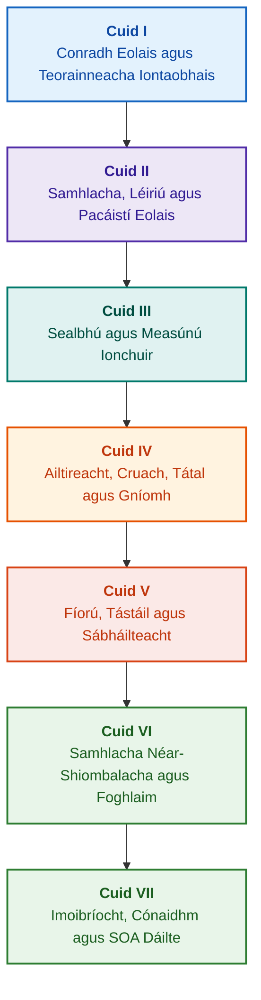

# Ailtireacht Córas Saineolach Fianaise-Bhunaithe: Ón Oineolaíocht Fhoirmiúil go dtí an IS Néar-Shiombalach

**Monagraf innealtóireachta agus lámhleabhar cuimsitheach ar dhearadh, samhlacha matamaitice, ailtireacht agus fíorú foirmiúil córas cliste ard-iontaofachta (Safety-Critical & Evidence-Grounded AI)**

**Údar:** [Mykola Fedchyk](../en/about-the-author.md) · [LinkedIn](https://www.linkedin.com/in/nickfedchik/)  
**Formáid:** Monagraf Innealtóireachta / Lámhleabhar Ailtire IS  
**Bliain:** 2026  

---

## Maidir leis an Leabhar

Is saothar taighde bunúsach agus treoir chuimsitheach innealtóireachta é an monagraf seo atá tiomnaithe do phríomhghéarchéim na hintleachta saorga comhaimseartha a shárú: an bhearna eipistéimeach idir sochreidteacht dhóchúlachtach aschuir líonraí néaracha agus fírinne chinntitheach cruthúnas foirmiúil matamaitice. I gcroílár an taighde tá ceist dhochta dholeithscéalach: **Conas córas saineolach a dhearadh a bhfuil gach conclúid dá chuid dho-chloíte, inrianaithe go hiomlán siar go dtí bunfhoinsí fianaise, agus inoiriúnaithe do dheimhniú i réimsí innealtóireachta atá ríthábhachtach ó thaobh sábháilteachta de (ISO 26262, IEC 61508, DO-178C, ISO/SAE 21434)?**

Déanann an t-údar paraidím nua a bhunú agus a leagan amach: **IS Néar-Shiombalach Fianaise-Bhunaithe (Evidence-Grounded Neuro-Symbolic AI)**. Sa chóras seo, comhlíonann samhlacha staitistiúla (LLM/SLM) feidhm chomhairleach maidir le giniúint hipitéisí ceisteanna agus rindreáil theilgean; fad a ráthaíonn croí siombalach cinntitheach go do-athraithe comhsheasmhacht loighciúil, talamhú sonraí ar leibhéal na mbeart, rialú teorann údaráis, agus aistriú sábháilte go gníomh.

### Ó Dhéantán Innealtóireachta go Cinneadh Infhíoraithe

Tá riachtanais chórais, cód foinseach, logaí tástála, caighdeáin rialála, agus cinntí innealtóireachta i láthair cheana féin i dtimpeallachtaí táirgthe nua-aimseartha, ach den chuid is mó feidhmíonn siad mar dhéantáin scoite gan séimeantaic fhoirmiúil, gan teorainneacha dochta bailíochta, agus gan inrianaitheacht fhrithpháirteach. Féadfaidh tuarascáil tástála rathúil tagairt a dhéanamh do leasú crua-earraí as dáta; féadfar luachan ó chaighdeán sábháilteachta feidhmiúla a bhaint as a chomhthéacs; agus féadfaidh aischur éigeandála cumraíochta comhpháirt aisghairthe a athghníomhachtú i ngan fhios.

Leagann an monagraf seo amach píblíne iomlán innealtóireachta: ó dhéantáin innealtóireachta a fhoirmliú mar shonraí clóscríofa agus pacáistí eolais atá sínithe go cripteagrafach – go tátal siombalach, dianscaoileadh céimneach pleananna, mínithe frithfhíriciúla, agus iniúchadh teorann inniúlachta. Tacaítear leis an gcur chuige praiticiúil trí chur i bhfeidhm de ghrád tionsclaíoch i dteanga Go le tacair chuimsitheacha tástála ([Caibidil 1](../en/ch01-introduction-to-expert-systems.md)), conarthaí dochta matamaitice ([Cuid II](../en/part-02-knowledge-models.md)), agus prótacail foghlama leanúnaí a chuireann cosc cruthaithe ar chúlchéimniú eolais ([Caibidil 25](../en/ch25-how-expert-systems-learn.md)).

### Sprioc-Lucht Léitheoireachta

Tá an foilseachán seo dírithe ar ailtirí córais, príomhinnealtóirí iontaofachta agus sábháilteachta feidhmiúla, forbróirí inneall tátail loighciúil, agus innealtóirí eolais. Chun na bunchoincheapa a thuiscint, is leor eolas bunúsach ar loighic phreideacáide den chéad ordú, ar bhainistíocht leaganacha bogearraí, agus ar shaolré córas; chun na samplaí praiticiúla a chur i bhfeidhm, tá gnáth-uirlisí Go ag teastáil. Nochtann caibidlí speisialaithe a bhaineann le sintéis fhoirmiúil argóintí sábháilteachta Goal Structuring Notation (GSN), sinéirgitic córas casta, luasaire néarmhorfacha, agus loingseoireacht uathrialach gan GNSS teorainneacha ceannródaíocha na hIntleachta Saorga fianaise-bhunaithe sna tionscail ardteicneolaíochta (aeraspás, iompar uathrialach, bonneagar fuinnimh criticiúil).

---

## Comhthéacs Eolaíoch agus Suíomh an Mhonagraif i dTaighde Domhanda

Ní fhéachann an monagraf ar chórais shaineolacha mar iarsma seanchaite de chórais riail-bhunaithe na 1980idí (ar nós CLIPS nó MYCIN), ach mar thús cadhnaíochta ar **IS Néar-Shiombalach Fianaise-Bhunaithe an Tríú Tonn (Third-Wave Evidence-Grounded Neuro-Symbolic AI)**. Braitheann an saothar ar bhunchlocha teoiriciúla na bpríomhscoileanna eolaíochta domhanda, fad a dhroicheadann sé an bhearna idir samhlacha teibí matamaitice agus innealtóireacht chórais ardfheidhmíochta:

| Réimse Eolaíochta | Príomhshaothair Dhomhanda agus Údair | Droichead Coincheapúil sa Leabhar |
|---|---|---|
| **IS Néar-Shiombalach an Tríú Tonn (NeSy)** | Artur d'Avila Garcez, Luis C. Lamb (*Neurosymbolic AI: The 3rd Wave*, 2023; *Neural-Symbolic Cognitive Reasoning*, Springer, 2009); Henry Kautz (*The Third AI Summer*, AAAI 2022) | Scaradh freagrachtaí: gineann samhlacha staitistiúla (SLM/LLM) hipitéisí ceisteanna, agus fVerifyíonn an croí siombalach cinntitheach fíricí go foirmiúil ([Caibidil 29](../en/ch29-neuro-symbolic-architecture.md)). |
| **Srianta Séimeantacha agus Foghlaim Shábháilte** | Guy Van den Broeck et al. (*A Semantic Loss Function for Deep Learning with Symbolic Knowledge*, ICML 2018); Luc De Raedt et al. (*DeepProbLog*, IJCAI 2020) | Geataí iontrála agus aschuir rialaithe, scagadh séimeantach cinntitheach ar thograí líonra néaraigh de réir scéimeanna foirmiúla ([Caibidlí 28](../en/ch28-dual-mode-expert-systems.md), [33](../en/ch33-inter-system-knowledge-exchange-and-model-teaching.md)). |
| **Réasúnaíocht Shochloíte agus Teoiric Argónaíochta** | John L. Pollock (*Defeasible Reasoning*, 1987; *Cognitive Carpentry*, MIT Press, 1995); Phan Minh Dung (*Abstract Argumentation Frameworks*, AIJ 1995); Douglas Walton (*Argumentation Schemes*, Cambridge, 2008) | Eolas a dhianscaoileadh ina éilimh, bunús, agus díbheoirí (*rebutting* agus *undercutting defeaters*); coinbhleachtaí i rialacha normatacha a réiteach le creataí argónaíochta Dung ([Caibidlí 2](../en/ch02-epistemology-of-machine-knowledge.md), [27](../en/ch27-safety-case-gsn-synthesis.md)). |
| **Mianadóireacht Uathrialach Rialacha Comhlachais (KBC)** | Luis Galárraga, Fabian M. Suchanek et al. (*AMIE: Association Rule Mining under Incomplete Evidence*, WWW 2013, VLDBJ 2015); Stephen Muggleton (*Inductive Logic Programming*, 1994) | Rialacha a ionduchtú go huathoibríoch ó bhunachair eolais faoi thoimhde neamhiomláine páirteach (PCA) gan fhrithshamplaí bréagacha an domhain oscailte ([Caibidil 34](../en/ch34-deterministic-relational-analysis-abduction-and-socratic-dialogue.md)). |
| **Sciatha Sábháilteachta Foirmiúla agus Deimhniú (Safe AI)** | Bettina Könighofer, Roderick Bloem et al. (*Shield Synthesis*, 2017); Tim Kelly, Rob Weaver (*Goal Structuring Notation*, York, 2004); André Platzer (*Logical Foundations of CPS*, Springer, 2018) | Sintéis cásanna sábháilteachta i nodaireacht GSN do chaighdeáin ISO 26262/21434; sciatha foirmiúla agus clúdaigh bhailíochta uimhriúla d'achtúirí forimeallacha ([Caibidlí 27](../en/ch27-safety-case-gsn-synthesis.md), [30](../en/ch30-safety-cybersecurity-co-engineering.md), [33](../en/ch33-inter-system-knowledge-exchange-and-model-teaching.md)). |
| **Loighic Eipistéimeach agus Séimeolaíocht Eolais** | John F. Sowa (*Knowledge Representation: Logical, Philosophical, and Computational Foundations*, 2000); Frank van Harmelen et al. (*Handbook of Knowledge Representation*, Elsevier, 2008) | Triad eipistéimeach Charles Sanders Peirce (Coincheap → Breithiúnas → Conclúid); réasúnaíocht iaduchtach ar oibríochtaí faoi dhlúthrialú asbhainteach ([Caibidlí 6](../en/ch06-applied-mathematics-for-expert-systems.md), [34](../en/ch34-deterministic-relational-analysis-abduction-and-socratic-dialogue.md)). |
| **Cibearneitic agus Sinéirgitic Córas Casta** | Norbert Wiener (*Cybernetics*, 1948); W. Ross Ashby (*An Introduction to Cybernetics*, 1956); Hermann Haken (*Synergetics: An Introduction*, 1977; *Advanced Synergetics*, 1983); Ilya Prigogine (*Order out of Chaos*, 1984) | Dlí éagsúlachta riachtanaí Ashby, lúba rialaithe dúnta L0–L4, spás staide a laghdú go paraiméadair ordaithe trí phrionsabal fo-ordaithe Haken, luathrabhadh aistrithe céime trí Mhoilliú Criticiúil (CSD) agus cobhsú scaiptheach ar bhunachair eolais ([Caibidlí 6](../en/ch06-applied-mathematics-for-expert-systems.md), [22](../en/ch22-cybernetics-edge-to-backend.md), [35](../en/ch35-self-organizing-expert-systems-synergetics-and-npu-runtime.md)). |
| **Tástáil Eolais, Inathraitheacht Theangeolaíoch agus Calabrú Lipschitz** | Kent Beck (*TDD*, 2002); Martin Fowler (*Refactoring*, 2018); Clark Barrett, Leonardo de Moura (*Z3 SMT Solver*, 2008); Chuan Guo et al. (*On Calibration of Modern Neural Networks*, ICML 2017); Marco Tulio Ribeiro et al. (*CheckList*, ACL 2020); John L. Pollock (*Defeasible Reasoning*, 1987) | Pirimid Tástála Eolais ceithre leibhéal (KTP): tástáil aonad rialacha iargúlta (KUT) le caoineadh bunreachta (`PremiseMock`), fáil réidh le gaiste na fírinne folmha, BVA speictreach 6-phointe, laitíse rialacha agus díbheoirí (KIT), scór inathraitheachta séimeantaí ($\text{SIS} \ge 0.98$) ar athruithe teangeolaíocha, srian leanúnachais Lipschitz ($L_{\mathcal{K}} \le L_{\max}$) in aghaidh chnagadh sealaíochta, agus carnadh bearnaí eolais ([Caibidil 36](../en/ch36-knowledge-testing-pyramid-and-variational-calibration.md)). |

---

## Samhlacha Teoiriciúla, Taighde Eolaíoch agus Nuálaíochtaí Innealtóireachta an Údair

Déanann an monagraf seo torthaí taighde bunúsacha agus obair phraiticiúil innealtóireachta an údair i réimsí dearadh córas ard-iontaofachta, ailtireachtaí leabaithe, agus IS fianaise-bhunaithe a shintéisiú. Murab ionann agus gnáth-athbhreithnithe litríochta, leagann an leabhar amach sraith teoiricí foirmiúla, prótacal, agus patrún ailtireachta a ardaíonn idirghníomhú néar-shiombalach go leibhéal muiníne is féidir a chruthú go matamaiticiúil:

### 1. Forbairtí Teoiriciúla Bunúsacha agus Foirmiúlacht Mhatamaiticiúil

1. **Inathraitheach Bunúsaithe Fianaise (EGI) agus Geata Bailíochtaithe Fíricí ([Caibidlí 2](../en/ch02-epistemology-of-machine-knowledge.md), [19](../en/ch19-from-question-to-evidence.md), [28](../en/ch28-dual-mode-expert-systems.md), [29](../en/ch29-neuro-symbolic-architecture.md)):**
   * *Coincheap Teoiriciúil:* Déanann an t-údar an t-inathraitheach iomláine bunúsaithe $\mathrm{Comp}(C) = 1.00$ a fhoirmliú, ag sonrú nach féidir le haon éileamh stádas fírice aitheanta a fháil i gcóras fianaise-bhunaithe gan theilgean cinntitheach ar bhunfhoinsí eolais. Tacaítear le gach eilimint sa bhunachar fíricí le tuple cripteagrafach: fritháirimh bheart dho-athraithe `[byte_start, byte_end]`, hais blúire canónach `quote_sha256`, agus aitheantóir teastais bunúis PROV-O.
   * *Tábhacht Innealtóireachta:* Cuireann meicníocht an gheata iontrála ar leibhéal na mbeart cosc iomlán ar bhréagchéadfaí líonra néaraigh dul isteach sa bhunachar eolais leaganaithe, ag ráthú neamhfhulaingt iomlán ar shonraí neamhdheimhnithe ($ZHR = 1.00$).
2. **Pirimid Tástála Eolais Ceithre Leibhéal (KTP) agus Cobhsaíocht Lipschitz an Spáis Thátail ([Caibidil 36](../en/ch36-knowledge-testing-pyramid-and-variational-calibration.md)):**
   * *Coincheap Teoiriciúil:* Molann an t-údar den chéad uair Pirimid Tástála Eolais chórasach (KTP), ag cur disciplín phirimid tástála bogearraí Martin Fowler i bhfeidhm ar chórais eolais: tástáil aonaid ar rialacha scoite (`PremiseMock`) (KUT), tástáil chomhtháthaithe ar idirghníomhaíochtaí rialacha agus díbheoirí (KIT), agus calabrú athraitheach ar iomadúlachtaí ceisteanna (KVT).
   * *Gaireas Matamaiticiúil:* Inathraitheach dochta chun gaiste na fírinne folmha a chosc ($P \to Q$ nuair atá $P \equiv \text{False}$), méadrach inathraitheachta séimeantaí ($\mathrm{SIS} \ge 0.98$) faoi shuaitheadh teanga, agus srian leanúnachais Lipschitz don spás tátail ($L_{\mathcal{K}} \le L_{\max}$) a chuireann cosc iomlán ar chnagadh tubaisteach sealaíochta ar athruithe beaga ionchuir.
3. **Teoiric Falsaithe Popperian ar Rialacha Deontacha agus Iniúchóir Comhlíonta Gníomhach ([Caibidil 39](../en/ch39-active-compliance-auditor-and-popperian-testing.md)):**
   * *Coincheap Teoiriciúil:* Aistriú ón tsamhail thraidisiúnta "oracal éighníomhach" (a fhreagraíonn ceisteanna amháin) go dtí paraidím an iniúchóra eolais ghníomhaigh a chuireann prionsabal falsaithe Karl Popper i bhfeidhm. Déanann an córas spás na riachtanas (ASPICE 4.0, ISO 26262, ISO/SAE 21434) a iniúchadh go huathrialach, frithshamplaí a shintéisiú, sonraíochtaí neamhiomlána a aithint, agus clár tástála iomlán táirge a dhearadh.
   * *Luach Praiticiúil:* Comhcheangal idir giniúint chruthaitheach cásanna teorann ag líonra néarach (Córas 1) agus fíorú deontach cinntitheach ag an gcroí siombalach (Córas 2), ag cosaint an duine sa lúb rialaithe (Human-in-the-Loop) ó thuirse cheadaithe.
4. **Laghdú Toise Sinéirgitigh ar an mBunachar Eolais agus Luathdhiagnóis CSD ([Caibidlí 6](../en/ch06-applied-mathematics-for-expert-systems.md), [22](../en/ch22-cybernetics-edge-to-backend.md), [35](../en/ch35-self-organizing-expert-systems-synergetics-and-npu-runtime.md)):**
   * *Coincheap Teoiriciúil:* Uirlisí matamaitice shinéirgitic Hermann Haken (paraiméadair ordaithe agus prionsabal an fho-ordaithe) agus teoiric struchtúr scaiptheach Ilya Prigogine a chur i bhfeidhm ar éabhlóid bunachar eolais casta.
   * *Toradh Eolaíoch:* Modh forbartha chun spás stáit iltoiseach teiliméadrachta a laghdú go paraiméadair ordaithe, agus brathadóir Luathmhoillithe Chriticiúil (*Critical Slowing Down*, CSD) comhtháite bunaithe ar uath-chomhghaol agus athraitheacht, rud a cheadaíonn titim dhinimiciúil an chórais a thuar i bhfad sula gcuirtear braiteoirí teorann éigeandála i ngníomh.
5. **Múnla Leibhéil Uathriail Gníomhaíochta (A0–A4), Geata Údaraithe agus Ságaí Idéamphóiteacha ([Caibidil 21](../en/ch21-from-recommendation-to-action.md)):**
   * *Coincheap Teoiriciúil:* Scála scoite d'údaráis ghníomhaíochta an chórais (A0: anailís éighníomhach, A1: ullmhú dréachta, A2: gníomh faoi shíniú daonna, A3: uathriail mhaoirsithe, A4: scoitheadh cosanta éigeandála) a shanntar don tréad "gníomh, timpeallacht, leibhéal riosca".
   * *Gaireas Matamaiticiúil:* Inathraitheach ailgéabrach idéamphóiteachta $f(f(x, k), k) \equiv f(x, k)$ bunaithe ar an eochair chripteagrafach $k$, forghníomhú lúb dúnta céimneach, agus prótacal ságaí cúitimh dáilte le stádas `OutcomeUnknown` agus fíorú neamhspleách iarthoinníollacha.
6. **Comh-Innealtóireacht Fhoirmiúil ar Shábháilteacht Fheidhmiúil agus Cibearshlándáil i Nodaireacht GSN ([Caibidlí 27](../en/ch27-safety-case-gsn-synthesis.md), [30](../en/ch30-safety-cybersecurity-co-engineering.md)):**
   * *Coincheap Teoiriciúil:* Múnla sintéise comhordaithe de chrainn argónaíochta GSN (Goal Structuring Notation) a chomhlíonann riachtanais chaighdeáin ISO 26262 (sábháilteacht fheidhmiúil) agus ISO/SAE 21434 (cibearshlándáil) ag an am céanna.
   * *Céim ar Aghaidh san Innealtóireacht:* Eadráin mhatamaiticiúil idir spriocanna contrártha (buiséad ama freagartha éigeandála i gcoinne doimhneacht fianaithe cripteagrafaigh) agus prótacal nochta roghnaigh fianaise d'iniúchóirí seachtracha trí chrainn Merkle shaillte.
7. **Prótacal Fíoraithe Dílseachta agus Comhsheasmhachta Séimeantaí Mínithe ([Caibidil 20](../en/ch20-explanation-engine.md)):**
   * *Coincheap Teoiriciúil:* Déileáiltear leis an míniú ní mar théacs saor de chuid samhalta ghiniúnaigh, ach mar dhéantán cinntitheach neamhspleách a dhíorthaítear go heisiach ó ghraf an chruthúnais, ó leagan na rialacha, agus ó léargas daingnithe na bhfíricí.
   * *Gaireas Matamaiticiúil:* Geata méadrach um mheasúnú dílseachta ($C_{\text{facts}} = 1.00, H_{\text{free}} = 1.00$) le haischur sábháilte uathoibríoch (fail-safe fallback) go teimpléad docht má bhíonn an t-athrú is lú idir an tátal siombalach agus an fhoirmliú don oibreoir.

---

### 2. Taighde Eimpíreach, Seastáin Turgnamhacha an Údair agus Innealtóireacht Chórais

1. **Pacáistí Eolais Dénártha Dho-athraithe le `mmap` agus Gan Réamhshraithú ([Caibidil 32](../en/ch32-high-performance-knowledge-packs-mmap-and-harvesting.md)):**
   * *Nuálaíocht an Údair:* Ailtireacht dhá chiseal do na pacáistí (ciseal canónach na mbunfhoinsí + ciseal díorthaithe ábhartha na n-innéacsanna).
   * *Toradh Eimpíreach:* Mapáil dhíreach an innéacs isteach sa spás seoltaí fíorúla tríd an nglao córais `mmap`, fáil réidh le forchostais leithdháilte cuimhne dinimiciúla (zero-allocation), agus tosú an innill i dtréimhse fholíneach gan beann ar líon na ngigibheart san oineolaíocht.
2. **Polagán Calabraithe Eimpíreach ar Chorpais Chaighdeánacha IETF RFC-1000 agus W3C-150 ([Caibidlí 2](../en/ch02-epistemology-of-machine-knowledge.md), [4](../en/ch04-evolution-from-bayes-to-evidence-ai.md), [14](../en/ch14-requirements-detection-and-formalization.md), [25](../en/ch25-how-expert-systems-learn.md)):**
   * *Turgnamh an Údair:* Seastán taighde ar mhórscála a imscaradh ar 1,000 sonraíocht bhailí IETF RFC (scaipthe thar 5 ré stairiúla d'fhorbairt an Idirlín) agus 150 ceist dhiagnóiseacha chasta ó chorpais W3C (lena n-áirítear instealladh d'aon ghnó de choinbhleachtaí loighciúla agus bréag-chuimhní).
   * *Toradh Praiticiúil:* Maitrísí scrúdaithe eolais oibiachtúla a chruthú, coinbhleachtaí normatacha a bhrath, agus cosaint chruthaithe go matamaiticiúil in aghaidh cúlchéimnithe sa bhunachar eolais le linn nuashonruithe.
3. **Anailís Choibhneasta Ilchéime, Asbhaint Shiombalach agus Idirphlé Sócraiteach ([Caibidil 34](../en/ch34-deterministic-relational-analysis-abduction-and-socratic-dialogue.md)):**
   * *Forbairt an Údair:* Algartam Cuardaigh ar Leithead Teoranntha Dhá Threo (Bidirectional Bounded BFS, $k \le 6$) le cosaint ar lúba agus cruthú slabhraí fianaise beart ilchodacha d'aonáin ghaolmhara.
   * *Buntáiste Innealtóireachta:* Asbhaint shiombalach Peirce a chur i bhfeidhm faoi dhlúthrialú asbhainteach agus frámaí soiléirithe Sócraiteacha clóscríofa (*Clarification Frames*), aistriú an chórais go modh idirphlé torthúil leis an duine in ionad diúltú dall faoi thoimhde an domhain iata (CWA).
4. **Sciatha Foirmiúla agus Clúdaigh Bhailíochta Uimhriúla do Chórais Rialaithe Forimeallacha ([Caibidil 33](../en/ch33-inter-system-knowledge-exchange-and-model-teaching.md), [Aguisíní B](../en/appendix-b-robotics-and-cyber-physical-systems.md), [C](../en/appendix-c-autonomous-navigation-and-geosearch.md), [E](../en/appendix-e-mixed-signal-neuromorphic-expert-systems.md)):**
   * *Nuálaíocht an Údair:* Modheolaíocht chun inathraitheacha loighce scoite a aistriú go conairí sábháilteachta uimhriúla leanúnacha do phróiseálaithe comhartha digiteacha (DSP) agus do chórais loingseoireachta uathrialacha gan GNSS (TRN/DSMAC/VIO).
   * *Iontaofacht Oibriúcháin:* Malartú rialacha sínithe bunaithe ar chripteagrafaíocht Ed25519, coraintín sábháilte d'eolas nua iarrthóra, agus gearradh orduithe rialaithe contúirteacha ag leibhéal na gcrua-earraí.
5. **Cosaint ar Sceitheadh Eolais Rúnda trí Mhínithe agus Iniúchadh Difreálach ([Caibidil 20](../en/ch20-explanation-engine.md)):**
   * *Forbairt an Údair:* Prótacal laghdaithe léirithe idirmheánaigh mínithe ($\mathrm{EIR}_{\text{redacted}}$) le seiceáil ACL do gach nód agus ciumhais de ghraf an chruthúnais, ag bacadh ionsaithe cainéil taoibh chun samhlacha a atógáil trí shraith ceisteanna codarsnacha WHY NOT.

---

## Prionsabal an Ghrúpála agus na hAicmithe

Sainmhínítear codanna an leabhair de réir an phríomhthasc innealtóireachta, seachas de réir na bliana a scríobhadh an chaibidil nó ainm teicneolaíochta ar leith. Baineann gach caibidil le cuid phríomha amháin; míníonn modhanna comharsanachta an bealach chun a príomhcheist a réiteach. Coinnítear uimhreacha caibidlí agus ainmneacha comhad mar aitheantóirí seasta, ionas go bhféadfadh an t-ord léitheoireachta téamach a bheith difriúil ón ord uimhriúil.

Baineann teidil na bhfocodanna sna caibidlí le haicmí soiléire agus ba chóir iad a léamh mar sheicheamh argóna leanúnach, ní mar liosta de theicneolaíochtaí comhionanna:

| Aicme an Fho-ailt | Ceist an Léitheora | Feidhm sa Chaibidil |
|---|---|---|
| Fadhb agus Teora Tasc | Cad go díreach is gá a réiteach? | An phríomhcheist agus an réimse feidhme a shainiú |
| Réad agus Samhail | Cad iad na sonraí, an t-eolas nó na stáit a scrúdaítear? | Coincheapa, cineálacha agus toimhdí a chomhordú |
| Modh agus Nós Imeachta | Conas an toradh a bhaint amach? | An tátal, an claochlú nó an rialú a mhíniú |
| Cur i bhFeidhm agus Uirlis | Cén uirlis a úsáidtear chun an nós imeachta a fhorghníomhú? | Léiriú bogearraí nó crua-earraí an mhodha a thaispeáint |
| Fíorú agus Cás Rialaithe | Conas botún a bhrath? | An toradh a chur i gcomparáid le critéar neamhspleách |
| Conclúid agus Teorainneacha Toraidh | Cad atá cruthaithe agus cad atá fágtha ar oscailt? | Freagra a thabhairt ar an bpríomhcheist gan gealltanais a áibhéil |

Is comhthéacs feidhme iad tír, tionscal nó táirge tráchtála, ní leibhéal neamhspleách den tacsanomaíocht seo. Is uirlisí tagartha cúnta iad an foclóir, giorrúcháin, foinsí agus loingseoireacht, ní topaicí neamhspleácha caibidle.

Tá measúnú ar phríomhthéama gach caibidle, teorainneacha idir díospóireachtaí comharsanacha, agus nótaí ar chomhdhéanamh agus ar chonclúidí sa léarscáil athbhreithnithe eagarthóireachta iomlán. Ní chiallaíonn nóta nua tráchta go bhfuil gach riosca ábhair laistigh de na caibidlí díothaithe go hiomlán cheana féin.

## Bealaí Léitheoireachta Molta

**An Chéad Fhíorú Bogearraí:** [1](../en/ch01-introduction-to-expert-systems.md) → [7](../en/ch07-knowledge-base-typology.md) → [8](../en/ch08-engineering-artifacts-as-data.md) → [17](../en/ch17-implementation-stack.md) → [23](../en/ch23-knowledge-base-verification.md) → [25](../en/ch25-how-expert-systems-learn.md). Sprioc: Breithiúnas in-atáirgthe le bunús fianaise, tástálacha diúltacha agus athrú rialaithe eolais. Níl samhail teanga riachtanach.

**Innealtóireacht Eolais:** [Cuid II](../en/part-02-knowledge-models.md) → [Cuid III](../en/part-03-knowledge-engineering-nlp.md) → [19](../en/ch19-from-question-to-evidence.md) → [20](../en/ch20-explanation-engine.md) → [26](../en/ch26-continual-learning.md). Sprioc: Séimeantaic, bunús, sealbhú eolais agus bailíochtú iarrthóirí nua a ailíniú. Coinníonn Cuid II an clár tástála eolaíochta do chaibidlí 7–11.

**Ailtireacht Réitigh:** [16](../en/ch16-expert-systems-architecture.md) → [19](../en/ch19-from-question-to-evidence.md) → [31](../en/ch31-syllogistic-reasoning-and-relation-lattices.md) → [20](../en/ch20-explanation-engine.md) → [21](../en/ch21-from-recommendation-to-action.md). Sprioc: Seiceáil an bhunúis fianaise, cur i bhfeidhm an noirm, míniú agus údarás gníomhaíochta a scaradh go docht.

**Fíorú agus Sábháilteacht:** [23](../en/ch23-knowledge-base-verification.md) → [36](../en/ch36-knowledge-testing-pyramid-and-variational-calibration.md) → [25](../en/ch25-how-expert-systems-learn.md) → [26](../en/ch26-continual-learning.md) → [27](../en/ch27-safety-case-gsn-synthesis.md) → [30](../en/ch30-safety-cybersecurity-co-engineering.md). Déantar diagnóis ar réad seachtrach a láimhseáil go tiomnaithe trí [Chaibidil 24](../en/ch24-system-diagnosis.md).

**Freagraí Hibrideacha agus Oibriú:** [Cuid VI](../en/part-06-frontiers-neuro-symbolic.md) → [Cuid VII](../en/part-07-runtime-and-knowledge-exchange.md) → [40](../en/ch40-distributed-epistemic-architectures-soa-and-cluster-scaling.md) agus aguisíní ábhartha. Sprioc: An tsamhail teanga a chomhtháthú, bearnaí eolais a bhainistiú, ailtireacht seirbhísí eolais dáilte a thógáil agus malartú idir-chórais a fhíorú. Is féidir caibidlí [2](../en/ch02-epistemology-of-machine-knowledge.md), [4](../en/ch04-evolution-from-bayes-to-evidence-ai.md) agus [6](../en/ch06-applied-mathematics-for-expert-systems.md) a léamh mar chonradh, stair agus treoir mhatamaiticiúil de réir mar is gá.

---

## Teorainneacha Gealltanais Innealtóireachta

Is ábhar oideachais agus taighde é an leabhar seo, ní nós imeachta deimhnithe ná cruthúnas oifigiúil ar chomhlíonadh caighdeáin ag táirge. Ní chruthaíonn forghníomhú cinntitheach go díreach cruinneas na bhfíricí; ní chruthaíonn hais chripteagrafach agus síniú digiteach an fhírinne iomlán; agus ní thagann graf argóintí in ionad mheasúnú saineolaí daonna. Níor cheart riachtanais iontaofachta táirge iomláin a ionannú le ráta earráide samhalta teanga nó a ghinearálú ar gach comhpháirt bogearraí.

Laghdaíonn parsáil uathoibrithe iontráil láimhe sonraí, ach ní chuireann sé deireadh le samhaltú fearainn, athbhreithniú piaraí, agus freagracht úinéirí eolais. Féadann Protégé, athbhreithniú láimhe, agus bailiú uathoibríoch oibriú le chéile go héifeachtach. Ní bhaineann ráthaíochtaí matamaitice ach le próifíl theanga agus toimhdí sonracha; baineann na luasanna tomhaiste leis an gceist, an corpas agus an timpeallacht thástáilte go sonrach. Tá sonraí cartlainne an údair scartha go docht ó thimpeallachtaí foghlama oscailte agus ó thaighde atá le teacht.

Fanann cinntí maidir le heisiúint táirge, glacadh le riosca agus comhlíonadh caighdeán rialála faoi fhreagracht speisialtóirí daonna údaraithe. Ullmhaíonn an córas saineolach ábhar infhíoraithe agus cuireann sé beartas comhaontaithe i bhfeidhm, ach ní fhaigheann sé údarás rialála ná dlíthiúil uaidh féin.

---

## Struchtúr an Leabhair

Tá seacht gcuid théamacha, 40 caibidil agus cúig aguisín sa leabhar. Baineann gach caibidil le cuid phríomha amháin. Leanann an chaibidil roimhe seo agus an chéad chaibidil eile sa loingseoireacht an t-ord téamach thíos; caomhnaítear uimhreacha caibidlí agus ainmneacha comhad.

---

### [Cuid I. Bunchlocha Coincheapúla agus Eipistéimeacha](../en/part-01-foundations.md)

*Cathain a bhíonn gá le córas saineolach, cad is féidir a mheas mar eolas, agus conas bunchlocha cinntí eagraíochta a chaomhnú.*

* [Caibidil 1. Réamhrá ar Chórais Shaineolacha: Ó Chaos go hEolas Bainistithe](../en/ch01-introduction-to-expert-systems.md)
* [Caibidil 2. Fealsúnacht don Innealtóir: Cad atá de Cheart ag Meaisín Eolas a Thabhairt Air](../en/ch02-epistemology-of-machine-knowledge.md)
* [Caibidil 3. Cad iad na Difríochtaí Bunúsacha idir Córas Saineolach agus Gnáthchóras Tagartha Faisnéise](../en/ch03-beyond-reference-information-systems.md)
* [Caibidil 4. Éabhlóid na gCóras Saineolach: Ó Theoirim Bayes go Réitigh IS Fianaise-Bhunaithe](../en/ch04-evolution-from-bayes-to-evidence-ai.md)
* [Caibidil 5. Triad an Iontaobhais: Córas Saineolach, Moladh Fianaise-Bhunaithe agus Cuimhne Chorparáideach](../en/ch05-triad-of-trust-and-corporate-memory.md)

---

### [Cuid II. Samhlacha Matamaitice, Léiriú agus Stóráil Eolais](../en/part-02-knowledge-models.md)

*Roghnú oibríochtaí matamaitice agus léirithe, déantáin chlóscríofa, graf inrianaitheachta agus pacáiste eolais do-athraithe.*

* [Caibidil 6. Matamaitic Fheidhmeach do Chórais Shaineolacha: Rialacha, Dóchúlachtaí, Graif agus Cúisíocht](../en/ch06-applied-mathematics-for-expert-systems.md)
* [Caibidil 7. Tíopeolaíocht Bunachar Eolais: Rialacha, Oineolaíochtaí, Fasaigh agus Veicteoirí](../en/ch07-knowledge-base-typology.md)
* [Caibidil 8. Déantáin Innealtóireachta mar Shonraí Córais Shaineolaigh](../en/ch08-engineering-artifacts-as-data.md)
* [Caibidil 9. Graf Eolais Innealtóireachta: Inrianaitheacht ó Riachtanais go Crua-Earraí](../en/ch09-engineering-knowledge-graph-traceability.md)
* [Caibidil 32. Pacáistí Eolais Do-athraithe: Ceadú ar Leibhéal na mBeart, Innéacsanna agus Mapáil Chuimhne](../en/ch32-high-performance-knowledge-packs-mmap-and-harvesting.md)

---

### [Cuid III. Sealbhú Eolais, Anailís Theangeolaíoch agus Measúnú Ionchuir](../en/part-03-knowledge-engineering-nlp.md)

*Cáipéisí, taithí saineolaithe agus breathnuithe: Eastóscadh iarrthóirí, anailís theangeolaíoch, foirmiú agus measúnú fianaise.*

* [Caibidil 10. Córais Sealbhaithe Eolais: Foinsí, Ceadú agus Saolré](../en/ch10-knowledge-acquisition-systems.md)
* [Caibidil 11. Eolas a Bhaint as Saineolaithe: Agallaimh, Léarscáileanna Cognaíocha agus Foirmiú Taithí](../en/ch11-knowledge-elicitation-from-experts.md)
* [Caibidil 12. Anailís Teangeolaíoch agus Samhlacha Áitiúla: Caomhnú Brí agus Foinsí](../en/ch12-linguistic-analysis-and-local-models.md)
* [Caibidil 13. Éagsúlacht Teanga Nádúrtha i gCoinne Cinntithíochta: Tiomsú Bhrí na Ceiste](../en/ch13-language-variability-vs-determinism.md)
* [Caibidil 14. Riachtanais agus Modhúlachtaí a Bhrath: Ó Théacs Normatach go hInathraitheacha](../en/ch14-requirements-detection-and-formalization.md)
* [Caibidil 15. Eastóscadh Eolais agus Tógáil Bunachair Eolais: Fíricí, Gramadaí agus Uathoibreáin](../en/ch15-knowledge-extraction-and-kb-construction.md)
* [Caibidil 37. Measúnú Faisnéise Ionchuir: Foinsí, Fianaise agus Éiginnteacht](../en/ch37-input-information-assessment-and-algorithmic-skepticism.md)

---

### [Cuid IV. Ailtireacht, Cruach Teicneolaíochta, Tátal agus Gníomh](../en/part-04-architecture-and-inference.md)

*Conarthaí ailtireachta, cruach teicneolaíochta, forghníomhú crua-earraí, fíorú éilimh, tátal bunaithe ar noirm, míniú agus lúb rialaithe cibearneitice.*

* [Caibidil 16. Ailtireacht Córais Shaineolaigh: Ó Eolas Foirmiúil go Cinneadh Fianaise-Bhunaithe](../en/ch16-expert-systems-architecture.md)
* [Caibidil 17. Cruach Teicneolaíochta: Critéir chun Uirlisí, Teangacha Ríomhchlárúcháin agus Innill Rialacha a Roghnú](../en/ch17-implementation-stack.md)
* [Caibidil 18. Bonneagar Forghníomhaithe: Samhlacha Áitiúla, Luasairí Crua-Earraí, Edge agus On-Premise](../en/ch18-execution-infrastructure.md)
* [Caibidil 19. Ó Cheist go Fianaise: Cuardach, Talamhú agus Fíorú Éilimh](../en/ch19-from-question-to-evidence.md)
* [Caibidil 31. Tátal Bunaithe ar Noirm: Ordlathais Phreideacáidí, Eisceachtaí agus Bailíocht](../en/ch31-syllogistic-reasoning-and-relation-lattices.md)
* [Caibidil 20. Inneall Mínithe: Cinneadh, Diúltú agus Teorainneacha Inniúlachta](../en/ch20-explanation-engine.md)
* [Caibidil 21. Ó Mholadh go Gníomh: Rialú Údaráis agus Forghníomhú Sábháilte i dTimpeallacht Táirgthe](../en/ch21-from-recommendation-to-action.md)
* [Caibidil 22. Lúb Rialaithe Cibearneitice: Braiteoirí, Forimeallaigh agus Aiseolas](../en/ch22-cybernetics-edge-to-backend.md)

---

### [Cuid V. Fíorú, Tástáil, Diagnóis agus Cás Sábháilteachta](../en/part-05-verification-and-learning.md)

*Fíorú foirmiúil rialacha, pirimid tástála eolais, falsú Popperian, diagnóis theicniúil agus argóintí sábháilteachta feidhmiúla agus cibearshlándála.*

* [Caibidil 23. Fíorú Bunachar Eolais: Conas Comhsheasmhacht, Iomláine agus Iontaofacht Rialacha a Seiceáil](../en/ch23-knowledge-base-verification.md)
* [Caibidil 36. Pirimid Tástála Eolais: Rialacha, Idirghníomhaíochtaí agus Cobhsaíocht Freagartha](../en/ch36-knowledge-testing-pyramid-and-variational-calibration.md)
* [Caibidil 39. Tástálaí Saineolach Gníomhach: Falsú Popperian, Comhlíonadh Rialála (ASPICE/ISO 26262/ISO 21434) agus Dearadh Tástála Uathrialach](../en/ch39-active-compliance-auditor-and-popperian-testing.md)
* [Caibidil 24. Diagnóis Theicniúil: Conas Gan Comhartha agus Bunúis a Mheascadh faoi Neamhiomláine Sonraí](../en/ch24-system-diagnosis.md)
* [Caibidil 27. Cás Sábháilteachta: Sintéis agus Fíorú Argóintí](../en/ch27-safety-case-gsn-synthesis.md)
* [Caibidil 30. Comh-Innealtóireacht ar Shábháilteacht Fheidhmiúil agus Cibearshlándáil](../en/ch30-safety-cybersecurity-co-engineering.md)

---

### [Cuid VI. Samhlacha Néar-Shiombalacha, Teorainneacha Cognaíocha agus Foghlaim Leanúnach](../en/part-06-frontiers-neuro-symbolic.md)

*Tátal docht agus hipitéis chomhairleach, comhtháthú samhlacha teanga, bearnaí eolais, rialú ar fhreagraí gan tacaíocht, maitrísí scrúdaithe agus foghlaim leanúnach ó thaithí.*

* [Caibidil 28. Córais Shaineolacha Dé-Mhód: Tátal Docht agus Hipitéis Chomhairleach](../en/ch28-dual-mode-expert-systems.md)
* [Caibidil 29. Ailtireacht Néar-Shiombalach: Samhlacha Teanga agus Fíorú Bunús Fianaise](../en/ch29-neuro-symbolic-architecture.md)
* [Caibidil 34. Bearnaí Eolais: Cuardach Coibhneasta, Asbhaint agus Idirphlé Soiléirithe](../en/ch34-deterministic-relational-analysis-abduction-and-socratic-dialogue.md)
* [Caibidil 38. Bréagchéadfaí Meaisín agus Easnamh Eolais: Rialú Freagartha Fianaise-Bhunaithe](../en/ch38-curing-machine-hallucinations-and-knowledge-deficits.md)
* [Caibidil 25. Conas Córas Saineolach a Oiliúint: Maitrísí Scrúdaithe, Iniúchadh Eolais agus Rialú Cúlchéimnithe](../en/ch25-how-expert-systems-learn.md)
* [Caibidil 26. Foghlaim Leanúnach (Continual Learning) ó Thaithí agus Sárú ar Shiorradh Logaí Córais](../en/ch26-continual-learning.md)

---

### [Cuid VII. Forghníomhú Imoibríoch, Malartú Eolais Idir-Chórais agus SOA Dáilte](../en/part-07-runtime-and-knowledge-exchange.md)

*Forghníomhú rialacha imoibríoch, sinéirgitic agus aistrithe céime eolais, malartú idir córais agus ailtireacht eipistéimeach dháilte ar scála fiontraíochta.*

* [Caibidil 35. Córas Saineolach Imoibríoch: Teagmhais, Aisghairm agus Oiriúnú Eolais](../en/ch35-self-organizing-expert-systems-synergetics-and-npu-runtime.md)
* [Caibidil 33. Malartú Eolais Idir-Chórais: Rialacha a Sholáthar do Chórais Sheachtracha, Múnlaí a Theagasc agus Aiseolas Slán](../en/ch33-inter-system-knowledge-exchange-and-model-teaching.md)
* [Caibidil 40. Ailtireacht Dháilte Córais Shaineolaigh Fianaise-Bhunaithe: SOA Eipistéimeach, Ródú Séimeantach, Ordlathas Cuimhne agus Eadráin Ildíoltóir](../en/ch40-distributed-epistemic-architectures-soa-and-cluster-scaling.md)

---

### Aguisíní

* [Aguisín A. Creat Praiticiúil do Thaighde Fianaise-Bhunaithe i dTionscadail Chasta Innealtóireachta](../en/appendix-a-evidence-governed-framework.md)
* [Aguisín B. Córais Shaineolacha Fianaise-Bhunaithe i Róbataic Uathrialach agus i gCoimpléisc Chibear-Fhisiceacha](../en/appendix-b-robotics-and-cyber-physical-systems.md)
* [Aguisín C. Loingseoireacht Uathrialach gan GNSS: Meaitseáil Gheospásúil (TRN/DSMAC), Odaiméadracht Amhairc (VIO) agus Eadráin Saineolaithe ar Chomhtháthú Braiteoirí](../en/appendix-c-autonomous-navigation-and-geosearch.md)
* [Aguisín D. Córais Shaineolacha Analógacha, Ríomhaireacht Néarmhorfach agus Tátal Loighce Crua-Earraí](../en/appendix-d-analog-expert-systems-and-neuromorphic-computing.md)
* [Aguisín E. Córais Shaineolacha Comhartha Measctha Analógach-Digiteach: Ríomhaireacht Néarmhorfach, Analógach agus Neamhghnách faoi Mhaoirseacht Fianaise](../en/appendix-e-mixed-signal-neuromorphic-expert-systems.md)
* [Maidir leis an Údar: Mykola Fedchyk (Nick Fedchik)](../en/about-the-author.md)

---

## Treonna Taighde don Todhchaí

Ní gealltanais réamhdhéanta iad treoracha na hoibre sa todhchaí: Tógáil in-atáirgthe ar phacáistí eolais; fíorú ar léiriú foirmiúil teoranta; rialachas gníomhairí trí údaráis shoiléire; fíorú rúnda ar éilimh fhoirmiúla shonracha; aisghairm rialaithe agus taighde ar dhí-fhoghlaim meaisín (machine unlearning). Ní dhearbhaíonn cruthú airí de chuid samhalta go huathoibríoch comhréireacht an táirge fhisiciúil, agus ní hionann scriosadh rialach agus deireadh iomlán a chur le tionchar na sonraí ón tsamhail oilte.

Maidir le luasairí crua-earraí agus ailtireachtaí ríomhaireachta neamhghnácha, déantar an ráta earráide, an latency, an tomhaltas fuinnimh, agus an t-iompar le linn teipeanna a thomhas go beacht ar dtús. Déantar plé ar na saincheisteanna seo i [gCaibidil 29](../en/ch29-neuro-symbolic-architecture.md), i [gCaibidil 32](../en/ch32-high-performance-knowledge-packs-mmap-and-harvesting.md) agus in [Aguisíní D](../en/appendix-d-analog-expert-systems-and-neuromorphic-computing.md) agus [E](../en/appendix-e-mixed-signal-neuromorphic-expert-systems.md). Tá an clár taighde praiticiúil do chaibidlí 7–11 leagtha amach i [gCuid II](../en/part-02-knowledge-models.md): tá hipitéis, comparáid rialaithe, agus coinníoll falsaithe ag gach togra.
