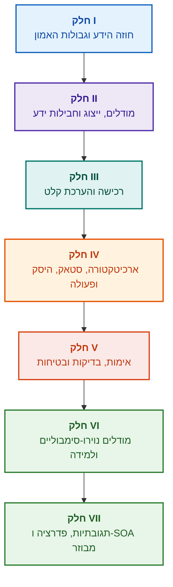

# ארכיטקטורה של מערכות מומחה מבוססות ראיות: מאונטולוגיות פורמליות לבינה מלאכותית נוירו-סימבולית

**מונוגרפיה הנדסית ומדריך לתכנון, מודלים מתמטיים, ארכיטקטורה ואימות של מערכות חכמות בעלות רמת אמינות גבוהה (Safety-Critical & Evidence-Grounded AI)**

**מחבר:** [Mykola Fedchyk](../en/about-the-author.md) · [LinkedIn](https://www.linkedin.com/in/nickfedchik/)  
**פורמט:** מונוגרפיה הנדסית / ספר עיון לארכיטקט AI  
**שנה:** 2026  

---

## אודות הספר

מונוגרפיה זו מהווה מחקר יסוד ומדריך הנדסי מקיף המוקדש להתמודדות עם המשבר המרכזי של הבינה המלאכותית המודרנית: הפער האפיסטמי בין הסבירות ההסתברותית של פלטי רשתות עצביות לבין האמיתות הדטרמיניסטית של הוכחות פורמליות. במוקד המחקר עומדת השאלה ההנדסית הנוקבת: **כיצד לתכנן מערכת מומחה שכל מסקנה שלה היא בלתי ניתנת להפרכה, ניתנת למעקב מלא עד למקורות הראיות הראשוניים, ומתאימה להסמכה בתחומים הנדסיים קריטיים לבטיחות (ISO 26262, IEC 61508, DO-178C, ISO/SAE 21434)?**

המחבר מבסס ומציג פרדיגמה חדשה: **בינה מלאכותית נוירו-סימבולית מבוססת ראיות (Evidence-Grounded Neuro-Symbolic AI)**, שבה מודלים סטטיסטיים (LLM/SLM) משמשים בתפקיד מייעץ של העלאת השערות ורינדור השלכות, בעוד שליבה סימבולית דטרמיניסטית מבטיחה באופן בלתי מעורער את האינווריאנטים של עקביות לוגית, עיגון עובדות ברמת הבייט, בקרת הרשאות ומעבר בטוח לפעולה.

### מארטיפקט להחלטה ניתנת לאימות

דרישות מערכת, קוד מקור, יומני בדיקות, תקנים רגולטוריים והחלטות הנדסיות קיימים כיום בסביבות ייצור, אך לרוב מתפקדים כארטיפקטים מבודדים ללא סמנטיקה פורמלית, גבולות תוקף ברורים או עקיבות הדדית. דוח בדיקת הסמכה מוצלח עשוי להתייחס לגרסת חומרה מיושנת; ציטוט מתקן בטיחות עשוי להיתלש מהקשרו; ונסיגה אוטומטית בעת תקלה עלולה להפעיל בשוגג רכיב שנפסל.

המונוגרפיה מתווה מסלול הנדסי מקצה לקצה: מפורמליזציה של ארטיפקטים הנדסיים כנתונים מובנים וחבילות ידע חתומות קריפטוגרפית – ועד להיסק סימבולי, פירוק שלבי של תוכניות, הסברים קונטרפקטואליים וביקורת גבולות יכולת. ההסבר המעשי מלווה במימושים מלאים ברמת ייצור בשפת Go עם סוויטות בדיקה מקיפות ([פרק 1](../en/ch01-introduction-to-expert-systems.md)), חוזים מתמטיים קפדניים ([חלק II](../en/part-02-knowledge-models.md)), ופרוטוקולי למידה מתמדת המונעים רגרסיות באופן מוכח ([פרק 25](../en/ch25-how-expert-systems-learn.md)).

### למי מיועדת המונוגרפיה

הספר מיועד לארכיטקטי מערכת, מהנדסי אמינות ובטיחות תפקודית מובילים, מפתחי מנועי היקש ומהנדסי ידע. לשליטה מושגית ראשונית נדרשת הבנה בסיסית בלוגיקה של פרדיקטים מסדר ראשון, ניהול גרסאות תוכנה ומחזור חיי מערכות; ליישום הדוגמאות נדרשת סביבת עבודה סטנדרטית של Go. פרקים ייעודיים, העוסקים בסינתזה פורמלית של תיקי בטיחות ב-Goal Structuring Notation (GSN), סינרגטיקה של מערכות מורכבות, מאיצים נוירומורפיים וניווט אוטונומי ללא GNSS, חושפים את חזית הבינה המלאכותית מבוססת הראיות בתעשיות עתירות טכנולוגיה (תעופה וחלל, רכב אוטונומי, אנרגיה).

---

## ההקשר המדעי ומקומה של המונוגרפיה במחקר העולמי

המונוגרפיה מתייחסת למערכות מומחה לא כאל שריד ארכאי משנות ה-80 המבוסס על חוקים פשוטים (דוגמת CLIPS או MYCIN), אלא כחוד החנית של **בינה מלאכותית נוירו-סימבולית מבוססת ראיות מהגל השלישי (Third-Wave Evidence-Grounded Neuro-Symbolic AI)**. המחקר נשען על המסד התיאורטי של אסכולות מדעיות מובילות בעולם, תוך גישור על הפער בין מודלים מתמטיים מופשטים לבין הנדסת מערכות עתירת ביצועים:

| תחום מדעי | חיבורים וחוקרים מובילים בעולם | גשר מושגי בספר |
|---|---|---|
| **בינה מלאכותית נוירו-סימבולית מהגל השלישי (NeSy)** | Artur d'Avila Garcez, Luis C. Lamb (*Neurosymbolic AI: The 3rd Wave*, 2023; *Neural-Symbolic Cognitive Reasoning*, Springer, 2009); Henry Kautz (*The Third AI Summer*, AAAI 2022) | הפרדת תחומי אחריות: מודלים סטטיסטיים (SLM/LLM) מייצרים השערות לשאילתות, בעוד שליבה סימבולית דטרמיניסטית מאמתת ומאשרת עובדות ([פרק 29](../en/ch29-neuro-symbolic-architecture.md)). |
| **מגבלות סמנטיות ולמידה בטוחה** | Guy Van den Broeck et al. (*A Semantic Loss Function for Deep Learning with Symbolic Knowledge*, ICML 2018); Luc De Raedt et al. (*DeepProbLog*, IJCAI 2020) | שערי כניסה ויציאה מבוקרים, סינון סמנטי דטרמיניסטי של הצעות רשת עצבית מול סכמות פורמליות ([פרקים 28](../en/ch28-dual-mode-expert-systems.md), [33](../en/ch33-inter-system-knowledge-exchange-and-model-teaching.md)). |
| **היסק בר-הפרכה ותורת הטיעון** | John L. Pollock (*Defeasible Reasoning*, 1987; *Cognitive Carpentry*, MIT Press, 1995); Phan Minh Dung (*Abstract Argumentation Frameworks*, AIJ 1995); Douglas Walton (*Argumentation Schemes*, Cambridge, 2008) | פירוק ידע לטענות, מקורות וגורמים מפריכים (*rebutting* ו-*undercutting defeaters*); פתרון קונפליקטים במאגרי כללים באמצעות מסגרות טיעון של Dung ([פרקים 2](../en/ch02-epistemology-of-machine-knowledge.md), [27](../en/ch27-safety-case-gsn-synthesis.md)). |
| **כרייה אוטונומית של כללי אסוציאציה (KBC)** | Luis Galárraga, Fabian M. Suchanek et al. (*AMIE: Association Rule Mining under Incomplete Evidence*, WWW 2013, VLDBJ 2015); Stephen Muggleton (*Inductive Logic Programming*, 1994) | הפקת חוקים אוטומטית מבסיסי ידע תחת הנחת שלמות חלקית (PCA) ללא דוגמאות-נגד שגויות של עולם פתוח ([פרק 34](../en/ch34-deterministic-relational-analysis-abduction-and-socratic-dialogue.md)). |
| **מגני בטיחות פורמליים והסמכה (Safe AI)** | Bettina Könighofer, Roderick Bloem et al. (*Shield Synthesis*, 2017); Tim Kelly, Rob Weaver (*Goal Structuring Notation*, York, 2004); André Platzer (*Logical Foundations of CPS*, Springer, 2018) | סינתזה של תיקי בטיחות בתחביר GSN לתקני ISO 26262/21434; מגנים פורמליים ומעטפות תוקף מספריות למפעילים פריפריאליים ([פרקים 27](../en/ch27-safety-case-gsn-synthesis.md), [30](../en/ch30-safety-cybersecurity-co-engineering.md), [33](../en/ch33-inter-system-knowledge-exchange-and-model-teaching.md)). |
| **לוגיקה אפיסטמית וסמיוטיקה של ידע** | John F. Sowa (*Knowledge Representation: Logical, Philosophical, and Computational Foundations*, 2000); Frank van Harmelen et al. (*Handbook of Knowledge Representation*, Elsevier, 2008) | הטריאדה האפיסטמית של צ'ארלס סנדרס פירס (מושג → שיפוט → היקש); היסק אבדוקטיבי של השערות עבודה תחת פיקוח דדוקטיבי מחמיר ([פרקים 6](../en/ch06-applied-mathematics-for-expert-systems.md), [34](../en/ch34-deterministic-relational-analysis-abduction-and-socratic-dialogue.md)). |
| **קיברנטיקה וסינרגטיקה של מערכות מורכבות** | Norbert Wiener (*Cybernetics*, 1948); W. Ross Ashby (*An Introduction to Cybernetics*, 1956); Hermann Haken (*Synergetics: An Introduction*, 1977; *Advanced Synergetics*, 1983); Ilya Prigogine (*Order out of Chaos*, 1984) | חוק המגוון ההכרחי של אשבי, לולאות בקרה סגורות L0–L4, צמצום מרחב המצבים לפרמטרי סדר לפי עקרון השעבוד של האקן, חיזוי מוקדם של מעברי פאזה באמצעות האטה קריטית (CSD) וייצוב דיסיפטיבי של בסיסי ידע ([פרקים 6](../en/ch06-applied-mathematics-for-expert-systems.md), [22](../en/ch22-cybernetics-edge-to-backend.md), [35](../en/ch35-self-organizing-expert-systems-synergetics-and-npu-runtime.md)). |
| **בדיקת ידע, אינווריאנטיות וכיול ליפשיץ** | Kent Beck (*TDD*, 2002); Martin Fowler (*Refactoring*, 2018); Clark Barrett, Leonardo de Moura (*Z3 SMT Solver*, 2008); Chuan Guo et al. (*On Calibration of Modern Neural Networks*, ICML 2017); Marco Tulio Ribeiro et al. (*CheckList*, ACL 2020); John L. Pollock (*Defeasible Reasoning*, 1987) | פירמידת בדיקות ידע בעלת ארבע רמות (KTP): בדיקות יחידה מבודדות לכללים (KUT) עם מוקים של הנחות יסוד (`PremiseMock`), ביטול מלכודת האמת הריקה, ניתוח ערכי גבול ספקטרלי ב-6 נקודות (BVA), סריגי כללים וגורמים מפריכים (KIT), ציון אינווריאנטיות סמנטית ($\text{SIS} \ge 0.98$) מול מוטציות לשוניות, רציפות ליפשיץ ($L_{\mathcal{K}} \le L_{\max}$) למניעת רעידות ממסר, ותיעוד סטיגמרגי של פערי ידע ([פרק 36](../en/ch36-knowledge-testing-pyramid-and-variational-calibration.md)). |

---

## מודלים תיאורטיים, מחקרים מדעיים וחידושים הנדסיים של המחבר

המונוגרפיה מאגדת את הישגי המחקר וההנדסה המקוריים של המחבר בתחום תכנון מערכות בעלות אמינות קריטית, ארכיטקטורות משובצות מחשב ובינה מלאכותית מבוססת ראיות. בניגוד לסקירות ספרות בלבד, הספר מציג תיאוריות פורמליות מקוריות, פרוטוקולים ותבניות ארכיטקטורה המעלים את יחסי הגומלין הנוירו-סימבוליים לרמת ביטחון הניתנת לאימות מתמטי:

### 1. פיתוחים תיאורטיים יסודיים ופורמליזם מתמטי

1. **אינווריאנט ביסוס הראיות (EGI) ושער אימות עובדות ([פרקים 2](../en/ch02-epistemology-of-machine-knowledge.md), [19](../en/ch19-from-question-to-evidence.md), [28](../en/ch28-dual-mode-expert-systems.md), [29](../en/ch29-neuro-symbolic-architecture.md)):**
   * *תפיסה תיאורטית:* המחבר מנסח ומגדיר מתמטית את אינווריאנט שלמות העיגון $\mathrm{Comp}(C) = 1.00$, הקובע כי במערכת מבוססת ראיות אף טענה לא תקבל מעמד של עובדה ללא השלכה דטרמיניסטית על מקורות ידע ראשוניים. כל פריט במאגר העובדות מגובה ברשומה קריפטוגרפית: היסט בייטים בלתי משתנה `[byte_start, byte_end]`, גיבוב של הקטע המקורי `quote_sha256`, ומזהה תעודת מקור לפי PROV-O.
   * *חשיבות הנדסית:* מנגנון שער הכניסה ברמת הבייט מונע ברמת החומרה והתוכנה חדירה של הזיות רשת עצבית לבסיס הידע המנוהל גרסאות, ומבטיח אפס סובלנות לנתונים בלתי מבוססים ($ZHR = 1.00$).
2. **פירמידת בדיקות ידע בעלת 4 רמות (KTP) ויציבות ליפשיץ של המרחב הלוגי ([פרק 36](../en/ch36-knowledge-testing-pyramid-and-variational-calibration.md)):**
   * *תפיסה תיאורטית:* המחבר מציג לראשונה פירמידת בדיקות ידע שיטתית (KTP), המקבילה לפירמידת בדיקות התוכנה של מרטין פאולר: בדיקת יחידה מבודדת של כללים (KUT) תוך בידוד הנחות יסוד (`PremiseMock`), בדיקות אינטגרציה של אינטראקציות כללים (KIT), וכיול וריאציוני על מרחב ניסוחים (KVT).
   * *מנגנון מתמטי:* הוגדר אינווריאנט מחמיר לחסימת אמת ריקה ($P \to Q$ כאשר $P \equiv \text{False}$), מדד אינווריאנטיות סמנטית ($\mathrm{SIS} \ge 0.98$) תחת שונויות לשוניות בשאילתות, ומגבלת רציפות ליפשיץ של מרחב ההיסק ($L_{\mathcal{K}} \le L_{\max}$), המונעת מתמטית תנודות ממסר הרסניות בעקבות תנודות קלות בקלט.
3. **תורת ההפרכה הפופריאנית של נורמות דאונטיות ומבקר תאימות פעיל ([פרק 39](../en/ch39-active-compliance-auditor-and-popperian-testing.md)):**
   * *תפיסה תיאורטית:* מעבר ממודל ה"אורקל הפסיבי" המסורתי (שרק עונה על שאלות) לפרדיגמה של מבקר ידע אקטיבי המממש את עקרון ההפרכה של קרל פופר. המערכת סורקת באופן עצמאי את מרחב הדרישות (ASPICE 4.0, ISO 26262, ISO/SAE 21434), מסנתזת דוגמאות-נגד, מאתרת מפרטים חלקיים ומתכננת באופן אוטונומי תוכנית בדיקות מקיפה.
   * *ערך מעשי:* שילוב בין יצירתיות מודלי שפה בתרחישי קצה (System 1) לבין אימות דאונטי דטרמיניסטי בליבה הסימבולית (System 2), תוך הגנה מובטחת על המפעיל האנושי בלולאת הבקרה מפני עייפות קוגניטיבית.
4. **צמצום סינרגטי של ממדי בסיס הידע ואבחון מוקדם של האטה קריטית ([פרקים 6](../en/ch06-applied-mathematics-for-expert-systems.md), [22](../en/ch22-cybernetics-edge-to-backend.md), [35](../en/ch35-self-organizing-expert-systems-synergetics-and-npu-runtime.md)):**
   * *תפיסה תיאורטית:* יישום המנגנון המתמטי של סינרגטיקת הרמן האקן (פרמטרי סדר ועקרון השעבוד) ותורת המבנים הדיסיפטיביים של איליה פריגוז'ין להתפתחות בסיסי ידע מורכבים.
   * *תוצאה מדעית:* פותחה שיטה לצמצום מרחב המצבים הרב-ממדי של טלמטריה לפרמטרי סדר, ושולב גלאי מוקדם של האטה קריטית (*Critical Slowing Down*, CSD) המבוסס על אוטוקורלציה ושונות, המאפשר לזהות התקרבות לכשל דינמי הרבה לפני הפעלת חיישני סף החירום.
5. **מודל רמות אוטונומיה בפעולה (A0–A4), שער אימות וסאגות אידמפוטנטיות ([פרק 21](../en/ch21-from-recommendation-to-action.md)):**
   * *תפיסה תיאורטית:* המחבר ניסח סולם הרשאות דיסקרטי לפעולות מערכת (A0 – ניתוח פסיבי, A1 – הכנת טיוטה, A2 – פעולה בחתימת אדם, A3 – אוטונומיה מפוקחת, A4 – ניתוק הגנה אוטומטי במצב חירום), המיוחס לא למערכת כולה אלא לשלשה "פעולה, סביבה, רמת סיכון".
   * *מנגנון מתמטי:* הוגדר אינווריאנט אידמפוטנטיות אלגברי $f(f(x, k), k) \equiv f(x, k)$ על בסיס מפתח קריפטוגרפי $k$, ביצוע שלבי בלולאה סגורה ופרוטוקול סאגות פיצוי מבוזרות עם מצב `OutcomeUnknown` ואימות תנאי-סיום עצמאי.
6. **הנדסה משותפת של בטיחות תפקודית ואבטחת סייבר בתחביר GSN ([פרקים 27](../en/ch27-safety-case-gsn-synthesis.md), [30](../en/ch30-safety-cybersecurity-co-engineering.md)):**
   * *תפיסה תיאורטית:* פותח מודל לסינתזה מתואמת של עצי טיעון בתחביר GSN (Goal Structuring Notation) למתן מענה משולב לדרישות התקנים ISO 26262 (בטיחות תפקודית) ו-ISO/SAE 21434 (אבטחת סייבר).
   * *פריצת דרך הנדסית:* פורמליזציה של בוררות מתמטית בין יעדים מתנגשים (תקציב זמן לתגובת חירום מול עומק אימות קריפטוגרפי) ופרוטוקול לחשיפה סלקטיבית של ראיות למבקרי חוץ באמצעות עצי מרקל עם תוספת מלח (salting).
7. **פרוטוקול לאימות נאמנות ועקביות סמנטית של הסברים ([פרק 20](../en/ch20-explanation-engine.md)):**
   * *תפיסה תיאורטית:* הסבר נתפס לא כטקסט חופשי של מודל גנרטיבי, אלא כארטיפקט דטרמיניסטי מובהק הנגזר ישירות מגרף ההוכחה, גרסת הכללים ומצב העובדות המקובע.
   * *מנגנון מתמטי:* הוגדר שער מטרי להערכת נאמנות ($C_{\text{facts}} = 1.00, H_{\text{free}} = 1.00$) עם נסיגה בטוחה אוטומטית (fail-safe fallback) לתבנית קשיחה בכל מקרה של פער בין ההיסק הסימבולי לבין הניסוח המילולי למפעיל.

---

### 2. מחקרים אמפיריים, מתקני ניסוי ייחודיים והנדסת מערכות

1. **חבילות ידע בינאריות בלתי משתנות עם `mmap` ואפס דה-סריאליזציה ([פרק 32](../en/ch32-high-performance-knowledge-packs-mmap-and-harvesting.md)):**
   * *חידוש המחבר:* ארכיטקטורת חבילות דו-שכבתית (שכבה קנונית של מקורות ראשוניים + שכבת אינדקסים נגזרת ממומשת).
   * *תוצאה אמפירית:* מיפוי ישיר של האינדקס למרחב הכתובות הווירטואלי באמצעות קריאת המערכת `mmap`, ביטול תקורה של הקצאת זיכרון דינמי (zero-allocation) ואתחול המנוע בזמן תת-ליניארי ללא תלות בנפח הג'יגה-בייטים של האונטולוגיה.
2. **מטווח כיול אמפירי על קורפוסי התקנים IETF RFC-1000 ו-W3C-150 ([פרקים 2](../en/ch02-epistemology-of-machine-knowledge.md), [4](../en/ch04-evolution-from-bayes-to-evidence-ai.md), [14](../en/ch14-requirements-detection-and-formalization.md), [25](../en/ch25-how-expert-systems-learn.md)):**
   * *ניסוי המחבר:* הקמת עמדת מחקר מקיפה על 1,000 מפרטי IETF RFC תקפים (המתפרסים על פני 5 תקופות כרונולוגיות בהתפתחות האינטרנט) ו-150 שאילתות אבחון מורכבות מקורפוס W3C (כולל הזרקה יזומה של סתירות לוגיות וקונפבולציות).
   * *תוצאה מעשית:* בניית מטריצות בחינת ידע אובייקטיביות, איתור סתירות רגולטוריות והגנה מוכחת מתמטית מפני רגרסיות בבסיס הידע בעת עדכונו.
3. **ניתוח יחסים רב-שלבי, אבדוקציה סימבולית ודיאלוג סוקרטי ([פרק 34](../en/ch34-deterministic-relational-analysis-abduction-and-socratic-dialogue.md)):**
   * *פיתוח המחבר:* אלגוריתם חיפוש קשרים דו-כיווני חסום (Bidirectional Bounded BFS, $k \le 6$) עם הגנה מפני מעגליות ויצירת שרשראות ראיות מורכבות ברמת הבייט עבור ישויות מקושרות.
   * *יתרון הנדסי:* מימוש אבדוקציה סימבולית של פירס תחת בקרה דדוקטיבית קפדנית ומסגרות הבהרה סוקרטיות מוגדרות טיפוסים (*Clarification Frames*), המעבירות את המערכת לדיאלוג פורה עם האדם במקום דחייה עיוורת תחת הנחת עולם סגור (CWA).
4. **מגני בטיחות פורמליים ומעטפות תוקף מספריות למערכות בקרה פריפריאליות ([פרק 33](../en/ch33-inter-system-knowledge-exchange-and-model-teaching.md), [נספחים ב'](../en/appendix-b-robotics-and-cyber-physical-systems.md), [ג'](../en/appendix-c-autonomous-navigation-and-geosearch.md), [ה'](../en/appendix-e-mixed-signal-neuromorphic-expert-systems.md)):**
   * *חידוש המחבר:* מתודולוגיה לתרגום אינווריאנטים לוגיים דיסקרטיים למסדרונות בטיחות מספריים רציפים עבור מעבדי אותות דיגיטליים (DSP) ומערכות ניווט אוטונומי ללא GNSS (TRN/DSMAC/VIO).
   * *אמינות מעשית:* שיתוף כללים חתום בהתבסס על קריפטוגרפיית Ed25519, הסגר מוגן למועמדי ידע חדשים וחסימת פקודות בקרה מסוכנות ברמת החומרה.
5. **הגנה מפני דליפת מידע מסווג באמצעות הסברים וביקורת דיפרנציאלית ([פרק 20](../en/ch20-explanation-engine.md)):**
   * *פיתוח המחבר:* פרוטוקול צמצום ייצוג ביניים של הסברים ($\mathrm{EIR}_{\text{redacted}}$) עם בדיקת ACL לכל צומת וקשת בגרף ההוכחה, החוסם התקפות ערוץ צדדי לשחזור מודלים באמצעות סדרות שאילתות ניגודיות מסוג WHY NOT.

---

## עקרון החלוקה והקיבוץ

חלקי הספר מוגדרים על פי האתגר ההנדסי המרכזי, ולא לפי שנת כתיבת הפרק או שם טכנולוגיה ספציפית. לכל פרק יש חלק עיקרי אחד; שיטות נלוות מתארות את דרך הפתרון של האתגר המרכזי. מספרי הפרקים ושמות הקבצים נשמרים כמזהים קבועים, ולכן סדר הקריאה הנושאי עשוי להיות שונה מהסדר המספרי.

שמות הסעיפים בתוך הפרקים משתייכים למספר מחלקות מובחנות. יש לקרוא אותם כרצף של טיעון מנומק, ולא כרשימה של טכנולוגיות מקבילות:

| סוג הסעיף | שאלת הקורא | תפקיד בפרק |
|---|---|---|
| הבעיה וגבולות המשימה | מה בדיוק נדרש לפתור? | הגדרת שאלת המפתח ותחום התחולה |
| האובייקט והמודל | אילו נתונים, ידע או מצבים נבחנים? | תיאום מושגים, טיפוסים והנחות יסוד |
| השיטה והפרוצדורה | כיצד משיגים את התוצאה? | הסבר ההיסק, הטרנספורמציה או הבקרה |
| המימוש והכלים | באמצעות מה מבצעים את הפרוצדורה? | הצגת המימוש התוכנתי או החומרתי של השיטה |
| האימות ומקרה המבחן | כיצד מזהים שגיאה? | השוואת התוצאה מול קריטריון בלתי תלוי |
| המסקנות וגבולות התוצאה | מה הוכח ומה נותר פתוח? | מענה לשאלת המפתח ללא הרחבת יתר של הבטחות |

מדינה, ענף תעשייתי או מוצר מסחרי מהווים הקשר יישום, ולא רמה נפרדת בטקסונומיה זו. המילון, ראשי התיבות, המקורות והניווט מהווים מנגנון עזר, ולא נושאים עצמאיים.

מפת העריכה המלאה מכילה הערכה של הנושא המרכזי בכל פרק, גבולות בין דיונים סמוכים והערות על מבנה ומסקנות. תקציר חדש אינו מעיד על כך שכל הסיכונים התוכניים בתוך הפרקים כבר הוסרו.

## מסלולי קריאה מומלצים

**אימות תוכנתי ראשון:** [1](../en/ch01-introduction-to-expert-systems.md) ← [7](../en/ch07-knowledge-base-typology.md) ← [8](../en/ch08-engineering-artifacts-as-data.md) ← [17](../en/ch17-implementation-stack.md) ← [23](../en/ch23-knowledge-base-verification.md) ← [25](../en/ch25-how-expert-systems-learn.md). מטרה: פסק דין שניתן לשחזור עם ביסוס ראיות, בדיקות שליליות ושינוי ידע מבוקר. מודל שפה אינו חובה.

**הנדסת ידע:** [חלק II](../en/part-02-knowledge-models.md) ← [חלק III](../en/part-03-knowledge-engineering-nlp.md) ← [19](../en/ch19-from-question-to-evidence.md) ← [20](../en/ch20-explanation-engine.md) ← [26](../en/ch26-continual-learning.md). מטרה: תיאום סמנטיקה, מקוריות, רכישת ידע ואימות מועמדים חדשים. חלק II משמר תוכנית בדיקה מדעית לפרקים 7–11.

**ארכיטקטורת פתרון:** [16](../en/ch16-expert-systems-architecture.md) ← [19](../en/ch19-from-question-to-evidence.md) ← [31](../en/ch31-syllogistic-reasoning-and-relation-lattices.md) ← [20](../en/ch20-explanation-engine.md) ← [21](../en/ch21-from-recommendation-to-action.md). מטרה: הפרדה בין אימות בסיס הראיות, החלת נורמה, הסבר והרשאת פעולה.

**אימות ובטיחות:** [23](../en/ch23-knowledge-base-verification.md) ← [36](../en/ch36-knowledge-testing-pyramid-and-variational-calibration.md) ← [25](../en/ch25-how-expert-systems-learn.md) ← [26](../en/ch26-continual-learning.md) ← [27](../en/ch27-safety-case-gsn-synthesis.md) ← [30](../en/ch30-safety-cybersecurity-co-engineering.md). אבחון אובייקט חיצוני מונחה על ידי [פרק 24](../en/ch24-system-diagnosis.md).

**תגובות היברידיות ותפעול מבצעי:** [חלק VI](../en/part-06-frontiers-neuro-symbolic.md) ← [חלק VII](../en/part-07-runtime-and-knowledge-exchange.md) ← [40](../en/ch40-distributed-epistemic-architectures-soa-and-cluster-scaling.md) ונספחים רלוונטיים. מטרה: שילוב מודל שפה, ניהול פערי ידע, הקמת ארכיטקטורת שירותי ידע מבוזרת ובדיקת שיתוף בין-מערכתי. פרקים [2](../en/ch02-epistemology-of-machine-knowledge.md), [4](../en/ch04-evolution-from-bayes-to-evidence-ai.md) ו-[6](../en/ch06-applied-mathematics-for-expert-systems.md) מומלצים כחוזה, היסטוריה ומדריך מתמטי.

---

## גבולות ההבטחה ההנדסית

הספר מהווה חומר לימודי ומחקרי, ולא הליך מוסמך או הוכחת עמידה של מוצר בתקן כלשהו. הרצה דטרמיניסטית אינה מוכיחה נכונות של עובדות; גיבוב וחתימה אינם מוכיחים אמיתות; וגרף טיעונים אינו מחליף הערכת מומחה אנושי. אין לזהות דרישות אמינות של מוצר שלם עם שיעור השגיאות של מודל שפה או להשליך אותן על כלל רכיבי התוכנה.

ניתוח אוטומטי מצמצם העברה ידנית של נתונים, אך אינו מבטל מידול, ביקורת עמיתים ואחריות של מומחי תחום. Protégé, סקירה ידנית ואיסוף אוטומטי יכולים לפעול במשולב. ערבויות מתמטיות חלות על פרופיל שפה והנחות מוגדרים בלבד; זמני ריצה שנמדדו מתייחסים לשאילתה, לקורפוס ולסביבה שנבדקו. נתוני ארכיון של המחבר מופרדים מסביבות לימוד פתוחות וממחקרים עתידיים.

החלטות על שחרור לגרסת ייצור, קבלת סיכונים ועמידה בדרישות רגולטוריות נותרות באחריות אנשים מוסמכים. מערכת המומחה מכינה חומר הניתן לאימות ומיישמת מדיניות מוסכמת, אך אינה נוטלת סמכויות רגולטוריות.

---

## מבנה הספר

הספר מורכב משבעה חלקים נושאיים, 40 פרקים וחמישה נספחים. לכל פרק יש חלק עיקרי אחד. הפרק הקודם והבא בניווט תואמים לסדר הנושאי להלן; מספרי הפרקים ושמות הקבצים נשמרו.

---

### [חלק I. יסודות מושגיים ואפיסטמיים](../en/part-01-foundations.md)

*מתי נדרשת מערכת מומחה, מה נחשב לידע וכיצד לשמר את נימוקי ההחלטה הארגונית.*

* [פרק 1. מבוא למערכות מומחה: מכאוס לידע מנוהל](../en/ch01-introduction-to-expert-systems.md)
* [פרק 2. פילוסופיה למהנדס: מה המכונה רשאית לכנות ידע](../en/ch02-epistemology-of-machine-knowledge.md)
* [פרק 3. במה מערכת מומחה נבדלת ממערכת מידע ומסדי נתונים](../en/ch03-beyond-reference-information-systems.md)
* [פרק 4. התפתחות מערכות מומחה: ממשפט בייס לפתרונות בינה מלאכותית מבוססי ראיות](../en/ch04-evolution-from-bayes-to-evidence-ai.md)
* [פרק 5. שלישיית האמון: מערכת מומחה, המלצה מבוססת ראיות וזיכרון ארגוני](../en/ch05-triad-of-trust-and-corporate-memory.md)

---

### [חלק II. מודלים מתמטיים, ייצוג ואחסון ידע](../en/part-02-knowledge-models.md)

*בחירת פעולות מתמטיות וייצוגים, ארטיפקטים מוגדרים טיפוסית, גרף עקיבות וחבילת ידע בלתי משתנה.*

* [פרק 6. מתמטיקה שימושית למערכות מומחה: כללים, הסתברויות, גרפים וסיבתיות](../en/ch06-applied-mathematics-for-expert-systems.md)
* [פרק 7. טיפולוגיה של בסיסי ידע: כללים, אונטולוגיות, מקרים ווקטורים](../en/ch07-knowledge-base-typology.md)
* [פרק 8. ארטיפקטים הנדסיים כנתוני מערכת מומחה](../en/ch08-engineering-artifacts-as-data.md)
* [פרק 9. גרף ידע הנדסי: עקיבות מדרישות ועד לחומרה](../en/ch09-engineering-knowledge-graph-traceability.md)
* [פרק 32. חבילות ידע בלתי ניתנות לשינוי: אישור ברמת הבייט, אינדקסים ומיפוי זיכרון](../en/ch32-high-performance-knowledge-packs-mmap-and-harvesting.md)

---

### [חלק III. רכישת ידע, ניתוח שפתי והערכת קלט](../en/part-03-knowledge-engineering-nlp.md)

*מסמכים, ניסיון מומחים ותצפיות: הפקת מועמדים, ניתוח לשוני, פורמליזציה והערכת ראיות.*

* [פרק 10. מערכות לרכישת ידע: מקורות, אישור ומחזור חיים](../en/ch10-knowledge-acquisition-systems.md)
* [פרק 11. חילוץ ידע ממומחים: ראיונות, מפות קוגניטיביות ופורמליזציה של מומחיות](../en/ch11-knowledge-elicitation-from-experts.md)
* [פרק 12. ניתוח בלשני ומודלים מקומיים: שימור משמעות ומקורות](../en/ch12-linguistic-analysis-and-local-models.md)
* [פרק 13. שונות השפה הטבעית מול דטרמיניזם: קומפילציה של משמעות השאלה](../en/ch13-language-variability-vs-determinism.md)
* [פרק 14. זיהוי דרישות ומודאליות: מטקסט נורמטיבי לאינווריאנטים](../en/ch14-requirements-detection-and-formalization.md)
* [פרק 15. חילוץ ידע ובניית בסיס ידע: עובדות, דקדוקים ואוטומטים](../en/ch15-knowledge-extraction-and-kb-construction.md)
* [פרק 37. הערכת מידע נכנס: מקורות, ראיות ואי-ודאות](../en/ch37-input-information-assessment-and-algorithmic-skepticism.md)

---

### [חלק IV. ארכיטקטורה, סטאק טכנולוגי, היסק ופעולה](../en/part-04-architecture-and-inference.md)

*חוזים ארכיטקטוניים, סטאק טכנולוגי, ביצוע חומרתי, בדיקת טענות, היסק מבוסס נורמות, הסברים ולולאת בקרה קיברנטית.*

* [פרק 16. ארכיטקטורה של מערכת מומחה: מידע פורמלי לפתרון מבוסס ראיות](../en/ch16-expert-systems-architecture.md)
* [פרק 17. הסטאק הטכנולוגי: קריטריונים לבחירת כלים, שפות תכנות ומנועי כללים](../en/ch17-implementation-stack.md)
* [פרק 18. תשתית ביצוע: מודלים מקומיים, מאיצי חומרה, קצה (Edge) ו-On-Premise](../en/ch18-execution-infrastructure.md)
* [פרק 19. משאלה לראיה: חיפוש, עיגון ובדיקת טענה](../en/ch19-from-question-to-evidence.md)
* [פרק 31. היסק לפי נורמות: היררכיות פרדיקטים, חריגים ותוקף](../en/ch31-syllogistic-reasoning-and-relation-lattices.md)
* [פרק 20. מנוע הסברים: החלטה, סירוב וגבולות יכולת](../en/ch20-explanation-engine.md)
* [פרק 21. מהמלצה לפעולה: בקרת הרשאות וביצוע בטוח בסביבת ייצור](../en/ch21-from-recommendation-to-action.md)
* [פרק 22. לולאת בקרה קיברנטית: חיישנים, פריפריה ומשוב](../en/ch22-cybernetics-edge-to-backend.md)

---

### [חלק V. אימות, בדיקות, אבחון ותיקי בטיחות](../en/part-05-verification-and-learning.md)

*אימות פורמלי של כללים, פירמידת בדיקות ידע, הפרכה פופריאנית, אבחון הנדסי וטיעוני בטיחות תפקודית וסייבר.*

* [פרק 23. אימות בסיס הידע: כיצד לבדוק עקביות, שלמות ואמינות של כללים](../en/ch23-knowledge-base-verification.md)
* [פרק 36. פירמידת בדיקות ידע: כללים, אינטראקציות ויציבות מענה](../en/ch36-knowledge-testing-pyramid-and-variational-calibration.md)
* [פרק 39. בודק מומחה אקטיבי: הפרכה פופריאנית, תאימות תקנים (ASPICE/ISO 26262/ISO 21434) ותכנון בדיקות אוטונומי](../en/ch39-active-compliance-auditor-and-popperian-testing.md)
* [פרק 24. אבחון טכני: כיצד לא לבלבל בין סימפטום לגורם שורש בתנאי אי-שלמות](../en/ch24-system-diagnosis.md)
* [פרק 27. ביסוס בטיחות: סינתזה ואימות טיעונים](../en/ch27-safety-case-gsn-synthesis.md)
* [פרק 30. הנדסה משותפת של בטיחות תפקודית ואבטחת סייבר](../en/ch30-safety-cybersecurity-co-engineering.md)

---

### [חלק VI. מודלים נוירו-סימבוליים, חזית קוגניטיבית ולמידה מתמדת](../en/part-06-frontiers-neuro-symbolic.md)

*היסק קפדני מול השערה מייעצת, שילוב מודלי שפה, פערי ידע, בקרה על מענה בלתי מבוסס, מטריצות בחינה ולמידה מניסיון.*

* [פרק 28. מערכות מומחה במצב כפול: היסק קפדני מול השערה מייעצת](../en/ch28-dual-mode-expert-systems.md)
* [פרק 29. ארכיטקטורה נוירו-סימבולית: מודלי שפה ואימות בסיס הראיות](../en/ch29-neuro-symbolic-architecture.md)
* [פרק 34. פערי ידע: חיפוש יחסים, אבדוקציה ודיאלוג הבהרה](../en/ch34-deterministic-relational-analysis-abduction-and-socratic-dialogue.md)
* [פרק 38. הזיות מכונה ומחסור בידע: בקרה מבוססת ראיות על תשובות](../en/ch38-curing-machine-hallucinations-and-knowledge-deficits.md)
* [פרק 25. כיצד ללמד מערכת מומחה: מטריצות בחינה, ביקורת ידע ובקרת רגרסיות](../en/ch25-how-expert-systems-learn.md)
* [פרק 26. למידה מתמדת (Continual Learning) מניסיון והתמודדות עם היסחף יומני מערכת](../en/ch26-continual-learning.md)

---

### [חלק VII. ביצוע תגובתי, שיתוף ידע בין-מערכתי ו-SOA מבוזר](../en/part-07-runtime-and-knowledge-exchange.md)

*ביצוע תגובתי של כללים, סינרגטיקה ומעברי פאזה בידע, שיתוף בין מערכות וארכיטקטורה אפיסטמית מבוזרת בקנה מידה ארגוני.*

* [פרק 35. מערכת מומחה תגובתית: אירועים, ביטול והתאמת ידע](../en/ch35-self-organizing-expert-systems-synergetics-and-npu-runtime.md)
* [פרק 33. שיתוף ידע בין מערכות: אספקת כללים לצדדים שלישיים, הוראת מודלים ומשוב מאובטח](../en/ch33-inter-system-knowledge-exchange-and-model-teaching.md)
* [פרק 40. ארכיטקטורה מבוזרת של מערכת מומחה מבוססת ראיות: SOA אפיסטמי, ניתוב סמנטי, היררכיית זיכרון ובוררות מרובת מקורות](../en/ch40-distributed-epistemic-architectures-soa-and-cluster-scaling.md)

---

### נספחים

* [נספח א'. מסגרת מעשית למחקר מבוסס ראיות בפרויקטים הנדסיים מורכבים](../en/appendix-a-evidence-governed-framework.md)
* [נספח ב'. מערכות מומחה מבוססות ראיות ברובוטיקה אוטונומית ובמערכות סייבר-פיזיות](../en/appendix-b-robotics-and-cyber-physical-systems.md)
* [נספח ג'. ניווט אוטונומי ללא GNSS: התאמה גיאו-מרחבית (TRN/DSMAC), אודומטריה חזותית (VIO) ובוררות מומחה של היתוך חיישנים](../en/appendix-c-autonomous-navigation-and-geosearch.md)
* [נספח ד'. מערכות מומחה אנלוגיות, חישוב נוירומורפי והיסק לוגי בחומרה](../en/appendix-d-analog-expert-systems-and-neuromorphic-computing.md)
* [נספח ה'. מערכות מומחה היברידיות אנלוגיות-דיגיטליות: מחשוב נוירומורפי, אנלוגי ולא שגרתי תחת בקרה מבוססת ראיות](../en/appendix-e-mixed-signal-neuromorphic-expert-systems.md)
* [על המחבר: Mykola Fedchyk (Nick Fedchik)](../en/about-the-author.md)

---

## כיווני מחקר עתידיים

כיווני העבודה העתידיים אינם ערבויות מוגמרות: הרכבה הדירה של חבילות ידע; אימות ייצוג פורמלי תָחוּם; ניהול סוכנים באמצעות הרשאות מפורשות; אימות חסוי של טענה פורמלית ספציפית; ביטול מבוקר ומחקר של שכחה ממוכנת (machine unlearning). הוכחת תכונה במודל אינה מאשרת אוטומטית התאמה של מוצר פיזי, והסרת כלל אינה שוות ערך למחיקת השפעת הנתונים ממודל מאומן.

עבור מאיצי חומרה ומחשוב לא שגרתי, נמדדים תחילה שגיאות, זמני השהיה, צריכת אנרגיה והתנהגות בעת כשלים. סוגיות אלו נידונות ב[פרק 29](../en/ch29-neuro-symbolic-architecture.md), [פרק 32](../en/ch32-high-performance-knowledge-packs-mmap-and-harvesting.md) וב[נספחים ד'](../en/appendix-d-analog-expert-systems-and-neuromorphic-computing.md) ו-[ה'](../en/appendix-e-mixed-signal-neuromorphic-expert-systems.md). תוכנית המחקר המעשית לפרקים 7–11 מפורטת ב[חלק II](../en/part-02-knowledge-models.md): לכל הצעה יש השערה, השוואת בקרה ותנאי הפרכה.
