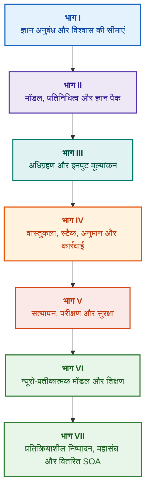

# प्रमाण-शासित विशेषज्ञ प्रणालियों की वास्तुकला: औपचारिक ओंटोलॉजी से न्यूरो-प्रतीकात्मक AI तक

**उच्च विश्वसनीयता वाली बुद्धिमान प्रणालियों के डिजाइन, गणितीय मॉडल, वास्तुकला और औपचारिक सत्यापन पर इंजीनियरिंग मोनोग्राफ एवं संदर्भ हैंडबुक (Safety-Critical & Evidence-Grounded AI)**

**लेखक:** [Mykola Fedchyk](../en/about-the-author.md) · [LinkedIn](https://www.linkedin.com/in/nickfedchik/)  
**प्रारूप:** इंजीनियरिंग मोनोग्राफ / AI वास्तुकार संदर्भ पुस्तक  
**वर्ष:** 2026  

---

## पुस्तक के बारे में

यह मोनोग्राफ एक मौलिक शोध कार्य और व्यापक इंजीनियरिंग गाइड है, जो आधुनिक कृत्रिम बुद्धिमत्ता के सबसे महत्वपूर्ण संकट—तंत्रिका नेटवर्क आउटपुट की संभाव्य ग्राह्यता और औपचारिक गणितीय प्रमाणों की नियतात्मक सत्यता के बीच ज्ञानमीमांसीय (एपिस्टेमिक) खाई—को पाटने के लिए समर्पित है। इस शोध के केंद्र में यह समझौताहीन प्रश्न है: **एक ऐसी विशेषज्ञ प्रणाली कैसे डिजाइन की जाए जिसका प्रत्येक निष्कर्ष अकाट्य हो, प्राथमिक साक्ष्य स्रोतों तक पूर्णतः सुराग-योग्य हो, और सुरक्षा-महत्वपूर्ण इंजीनियरिंग क्षेत्रों (ISO 26262, IEC 61508, DO-178C, ISO/SAE 21434) में प्रमाणन योग्य हो?**

लेखक एक नए प्रतिमान को प्रतिपादित और स्थापित करते हैं: **प्रमाण-शासित न्यूरो-प्रतीकात्मक AI (Evidence-Grounded Neuro-Symbolic AI)**। इस वास्तुकला में, सांख्यिकीय मॉडल (LLM/SLM) परिकल्पना निर्माण और प्रक्षेपण प्रतिपादन का परामर्शी कार्य करते हैं; जबकि नियतात्मक प्रतीकात्मक कोर तार्किक सुसंगतता, बाइट-स्तरीय तथ्य आधार, प्राधिकरण सीमा नियंत्रण और सुरक्षित कार्रवाई संक्रमण के इनवेरिएंट्स की अटूट गारंटी देता है।

### आर्टिफैक्ट से सत्यापन योग्य निर्णय तक

प्रणालीगत आवश्यकताएं, स्रोत कोड, परीक्षण लॉग, विनियामक मानक और इंजीनियरिंग निर्णय आधुनिक उत्पादन वातावरण में पहले से मौजूद हैं, लेकिन वे ज्यादातर औपचारिक सिमेंटिक्स, सख्त वैधता सीमाओं और पारस्परिक ट्रेसिबिलिटी के बिना अलग-थलग कलाकृतियों के रूप में कार्य करते हैं। एक सफल योग्यता परीक्षण रिपोर्ट किसी पुराने हार्डवेयर संशोधन पर आधारित हो सकती है; कार्यात्मक सुरक्षा मानक का कोई उद्धरण संदर्भ से बाहर निकाला जा सकता है; और आपातकालीन रोलबैक अनजाने में किसी निरस्त घटक को पुनः सक्रिय कर सकता है।

यह मोनोग्राफ एक संपूर्ण एंड-टू-एंड इंजीनियरिंग पाइपलाइन प्रस्तुत करता है: इंजीनियरिंग कलाकृतियों को टाइप किए गए डेटा और क्रिप्टोग्राफिक रूप से हस्ताक्षरित ज्ञान पैक के रूप में औपचारिक रूप देने से लेकर प्रतीकात्मक अनुमान, चरणबद्ध योजना अपघटन, प्रति-तथ्यात्मक स्पष्टीकरण और सक्षमता सीमा ऑडिट तक। व्यावहारिक विवरण व्यापक परीक्षण सूट के साथ Go भाषा में औद्योगिक-ग्रेड कार्यान्वयन ([अध्याय 1](../en/ch01-introduction-to-expert-systems.md)), सख्त गणितीय अनुबंध ([भाग II](../en/part-02-knowledge-models.md)), और निरंतर शिक्षण प्रोटोकॉल के साथ समर्थित हैं जो रिग्रेशन को निश्चित रूप से रोकते हैं ([अध्याय 25](../en/ch25-how-expert-systems-learn.md))।

### लक्षित पाठक वर्ग

यह पुस्तक सिस्टम वास्तुकारों, विश्वसनीयता और कार्यात्मक सुरक्षा के प्रमुख इंजीनियरों, तार्किक अनुमान इंजन डेवलपर्स और ज्ञान इंजीनियरों के लिए तैयार की गई है। मूलभूत अवधारणाओं को समझने के लिए प्रथम-क्रम विधेय तर्क, सॉफ्टवेयर संस्करण और सिस्टम जीवन चक्र प्रबंधन का बुनियादी ज्ञान पर्याप्त है; व्यावहारिक उदाहरणों को चलाने के लिए मानक Go टूल्स की आवश्यकता होती है। Goal Structuring Notation (GSN) के साथ सुरक्षा मामलों के औपचारिक संश्लेषण, जटिल प्रणालियों के सहक्रिया विज्ञान (Synergetics), न्यूरोमॉर्फिक त्वरक और GNSS-मुक्त स्वायत्त नेविगेशन को समर्पित विशेष अध्याय एयरोस्पेस, स्वायत्त परिवहन और महत्वपूर्ण ऊर्जा अवसंरचना जैसे उच्च तकनीक उद्योगों में प्रमाण-शासित AI के अग्रणी मोर्चों को उजागर करते हैं।

---

## वैज्ञानिक संदर्भ और वैश्विक अनुसंधान में मोनोग्राफ का स्थान

मोनोग्राफ विशेषज्ञ प्रणालियों को 1980 के दशक के नियम-आधारित प्रणालियों (जैसे CLIPS या MYCIN) के अवशेष के रूप में नहीं, बल्कि **तीसरी लहर के प्रमाण-शासित न्यूरो-प्रतीकात्मक AI (Third-Wave Evidence-Grounded Neuro-Symbolic AI)** के अग्रदूत के रूप में स्थापित करता है। यह कार्य दुनिया के प्रमुख वैज्ञानिक विद्यालयों की सैद्धांतिक नींव पर आधारित है, जबकि सारगर्भित गणितीय मॉडलों और उच्च-प्रदर्शन सिस्टम इंजीनियरिंग के बीच के अंतर को समाप्त करता है:

| वैज्ञानिक क्षेत्र | प्रमुख वैश्विक कार्य और लेखक | पुस्तक में वैचारिक सेतु |
|---|---|---|
| **तीसरी लहर का न्यूरो-प्रतीकात्मक AI (NeSy)** | Artur d'Avila Garcez, Luis C. Lamb (*Neurosymbolic AI: The 3rd Wave*, 2023; *Neural-Symbolic Cognitive Reasoning*, Springer, 2009); Henry Kautz (*The Third AI Summer*, AAAI 2022) | उत्तरदायित्व का पृथक्करण: सांख्यिकीय मॉडल (SLM/LLM) क्वेरी परिकल्पनाएं उत्पन्न करते हैं, और नियतात्मक प्रतीकात्मक कोर औपचारिक रूप से तथ्यों की पुष्टि और सत्यापन करता है ([अध्याय 29](../en/ch29-neuro-symbolic-architecture.md))। |
| **सिमेंटिक प्रतिबंध और सुरक्षित शिक्षण** | Guy Van den Broeck et al. (*A Semantic Loss Function for Deep Learning with Symbolic Knowledge*, ICML 2018); Luc De Raedt et al. (*DeepProbLog*, IJCAI 2020) | इनपुट और आउटपुट सत्यापन प्रवेश द्वार, औपचारिक स्कीमा के अनुसार न्यूरल नेटवर्क प्रस्तावों का नियतात्मक सिमेंटिक फ़िल्टरिंग ([अध्याय 28](../en/ch28-dual-mode-expert-systems.md), [अध्याय 33](../en/ch33-inter-system-knowledge-exchange-and-model-teaching.md))। |
| **खंडन-योग्य तर्क और तर्कशास्त्र सिद्धांत** | John L. Pollock (*Defeasible Reasoning*, 1987; *Cognitive Carpentry*, MIT Press, 1995); Phan Minh Dung (*Abstract Argumentation Frameworks*, AIJ 1995); Douglas Walton (*Argumentation Schemes*, Cambridge, 2008) | ज्ञान का दावों, उद्गम और खंडनकर्ताओं (*rebutting* और *undercutting defeaters*) में विभाजन; डुंग (Dung) के अमूर्त तर्क ढांचे के माध्यम से मानक नियमों के टकराव का समाधान ([अध्याय 2](../en/ch02-epistemology-of-machine-knowledge.md), [अध्याय 27](../en/ch27-safety-case-gsn-synthesis.md))। |
| **स्वायत्त साहचर्य नियम खनन (KBC)** | Luis Galárraga, Fabian M. Suchanek et al. (*AMIE: Association Rule Mining under Incomplete Evidence*, WWW 2013, VLDBJ 2015); Stephen Muggleton (*Inductive Logic Programming*, 1994) | खुले विश्व की परिकल्पना के झूठे प्रति-उदाहरणों को छोड़कर, आंशिक पूर्णता धारणा (PCA) के तहत ज्ञान अड्डों से नियमों का स्वचालित प्रेरण ([अध्याय 34](../en/ch34-deterministic-relational-analysis-abduction-and-socratic-dialogue.md))। |
| **औपचारिक सुरक्षा शील्ड और प्रमाणन (Safe AI)** | Bettina Könighofer, Roderick Bloem et al. (*Shield Synthesis*, 2017); Tim Kelly, Rob Weaver (*Goal Structuring Notation*, York, 2004); André Platzer (*Logical Foundations of CPS*, Springer, 2018) | ISO 26262/21434 मानकों के लिए GSN प्रारूप में सुरक्षा मामलों का संश्लेषण; परिधीय एक्चुएटर्स के लिए औपचारिक शील्ड और संख्यात्मक वैधता आवरण ([अध्याय 27](../en/ch27-safety-case-gsn-synthesis.md), [अध्याय 30](../en/ch30-safety-cybersecurity-co-engineering.md), [अध्याय 33](../en/ch33-inter-system-knowledge-exchange-and-model-teaching.md))। |
| **ज्ञानमीमांसीय तर्क और ज्ञान सांकेतिकता** | John F. Sowa (*Knowledge Representation: Logical, Philosophical, and Computational Foundations*, 2000); Frank van Harmelen et al. (*Handbook of Knowledge Representation*, Elsevier, 2008) | चार्ल्स सैंडर्स पियर्स की ज्ञानमीमांसीय त्रयी (अवधारणा → निर्णय → निष्कर्ष); सख्त निगमनात्मक नियंत्रण के तहत कार्य परिकल्पनाओं का अनुमान लगाना ([अध्याय 6](../en/ch06-applied-mathematics-for-expert-systems.md), [अध्याय 34](../en/ch34-deterministic-relational-analysis-abduction-and-socratic-dialogue.md))। |
| **साइबरनेटिक्स और जटिल प्रणालियों का सहक्रिया विज्ञान** | Norbert Wiener (*Cybernetics*, 1948); W. Ross Ashby (*An Introduction to Cybernetics*, 1956); Hermann Haken (*Synergetics: An Introduction*, 1977; *Advanced Synergetics*, 1983); Ilya Prigogine (*Order out of Chaos*, 1984) | एशबी का आवश्यक विविधता कानून, L0–L4 बंद नियंत्रण चक्र, हाकेन के पराधीनता सिद्धांत द्वारा अवस्था स्थान का क्रम मापदंडों में न्यूनीकरण, क्रिटिकल स्लोइंग डाउन (CSD) द्वारा चरण परिवर्तनों की पूर्व चेतावनी और ज्ञान अड्डों का अपव्ययी स्थिरीकरण ([अध्याय 6](../en/ch06-applied-mathematics-for-expert-systems.md), [अध्याय 22](../en/ch22-cybernetics-edge-to-backend.md), [अध्याय 35](../en/ch35-self-organizing-expert-systems-synergetics-and-npu-runtime.md))। |
| **ज्ञान परीक्षण, भाषाई निश्चरता और लिपशिट्ज़ अंशांकन** | Kent Beck (*TDD*, 2002); Martin Fowler (*Refactoring*, 2018); Clark Barrett, Leonardo de Moura (*Z3 SMT Solver*, 2008); Chuan Guo et al. (*On Calibration of Modern Neural Networks*, ICML 2017); Marco Tulio Ribeiro et al. (*CheckList*, ACL 2020); John L. Pollock (*Defeasible Reasoning*, 1987) | चार-स्तरीय ज्ञान परीक्षण पिरामिड (KTP): आधार मॉक (`PremiseMock`) के साथ पृथक नियम इकाई परीक्षण (KUT), शून्य सत्य जाल का उन्मूलन, 6-बिंदु वर्णक्रमीय BVA, नियम जाली और खंडनकर्ता (KIT), भाषाई विविधताओं पर सिमेंटिक अपरिवर्तनीयता स्कोर ($\text{SIS} \ge 0.98$), रिले चैटरिंग को रोकने वाला लिपशिट्ज़ निरंतरता प्रतिबंध ($L_{\mathcal{K}} \le L_{\max}$), और स्टिग्मर्जिक ज्ञान अंतर संचय ([अध्याय 36](../en/ch36-knowledge-testing-pyramid-and-variational-calibration.md))। |

---

## लेखक के मूल सैद्धांतिक मॉडल, वैज्ञानिक अनुसंधान और इंजीनियरिंग नवाचार

यह मोनोग्राफ सुरक्षा-महत्वपूर्ण सिस्टम डिजाइन, एम्बेडेड आर्किटेक्चर और प्रमाण-शासित AI के क्षेत्र में लेखक के बुनियादी अनुसंधान और इंजीनियरिंग योगदान को संश्लेषित करता है। केवल साहित्य समीक्षाओं के विपरीत, पुस्तक मूल औपचारिक सिद्धांतों, प्रोटोकॉल और वास्तुशिल्प पैटर्न का एक सेट स्थापित करती है जो न्यूरो-प्रतीकात्मक अंतःक्रियाओं को गणितीय रूप से सत्यापन योग्य स्तर तक ले जाती है:

### 1. मौलिक सैद्धांतिक विकास और गणितीय औपचारिकताएं

1. **प्रमाण ग्राउंडिंग इनवेरिएंट (EGI) और तथ्य सत्यापन प्रवेश द्वार ([अध्याय 2](../en/ch02-epistemology-of-machine-knowledge.md), [19](../en/ch19-from-question-to-evidence.md), [28](../en/ch28-dual-mode-expert-systems.md), [29](../en/ch29-neuro-symbolic-architecture.md)):**
   * *सैद्धांतिक अवधारणा:* लेखक ने ग्राउंडिंग पूर्णता इनवेरिएंट $\mathrm{Comp}(C) = 1.00$ को औपचारिक रूप दिया है, जिसमें कहा गया है कि किसी प्रमाण-शासित प्रणाली में किसी भी दावे को ज्ञान के प्राथमिक स्रोतों पर नियतात्मक प्रक्षेपण के बिना मान्यता प्राप्त तथ्य का दर्जा नहीं दिया जा सकता है। तथ्य आधार का प्रत्येक घटक एक क्रिप्टोग्राफिक टुपल द्वारा समर्थित है: अपरिवर्तनीय बाइट ऑफसेट `[byte_start, byte_end]`, कैनोनिकल अंश हैश `quote_sha256`, और PROV-O स्रोत प्रमाणपत्र पहचानकर्ता।
   * *इंजीनियरिंग महत्व:* हार्डवेयर और सॉफ्टवेयर सीमा पर बाइट-स्तरीय प्रवेश द्वार तंत्र संस्करण-नियंत्रित ज्ञान आधार में न्यूरल नेटवर्क मतिभ्रम (हैलुसिनेशन) के प्रवेश को पूरी तरह से रोकता है, जिससे अपुष्ट डेटा के लिए शून्य सहिष्णुता ($ZHR = 1.00$) सुनिश्चित होती है।
2. **चार-स्तरीय ज्ञान परीक्षण पिरामिड (KTP) और अनुमान स्थान की लिपशिट्ज़ स्थिरता ([अध्याय 36](../en/ch36-knowledge-testing-pyramid-and-variational-calibration.md)):**
   * *सैद्धांतिक अवधारणा:* मार्टिन फाउलर के सॉफ्टवेयर परीक्षण पिरामिड को ज्ञान प्रणालियों में लागू करने वाला व्यवस्थित ज्ञान परीक्षण पिरामिड (KTP) प्रस्तावित: परिसर के अलगाव (`PremiseMock`) के साथ नियम इकाई परीक्षण (KUT), नियम अंतःक्रियाओं और खंडनकर्ताओं का एकीकरण परीक्षण (KIT), और प्रश्न विविधताओं पर परिवर्तनशील अंशांकन (KVT)।
   * *गणितीय तंत्र:* शून्य सत्य जाल को रोकने वाला कठोर इनवेरिएंट ($P \equiv \text{False}$ होने पर $P \to Q$), भाषाई प्रश्नों में सिमेंटिक अपरिवर्तनीयता मीट्रिक ($\mathrm{SIS} \ge 0.98$), और अनुमान स्थान का लिपशिट्ज़ निरंतरता प्रतिबंध ($L_{\mathcal{K}} \le L_{\max}$), जो मामूली इनपुट परिवर्तनों पर विनाशकारी रिले चैटरिंग को गणितीय रूप से बाहर करता है।
3. **मानदंडों का पॉपरियन मिथ्याकरण सिद्धांत और सक्रिय अनुपालन लेखा परीक्षक ([अध्याय 39](../en/ch39-active-compliance-auditor-and-popperian-testing.md)):**
   * *सैद्धांतिक अवधारणा:* केवल प्रश्नों का उत्तर देने वाले पारंपरिक निष्क्रिय मॉडल से सक्रिय ज्ञान लेखा परीक्षक प्रतिमान में संक्रमण, जो कार्ल पॉपर के मिथ्याकरण सिद्धांत को लागू करता है। प्रणाली आवश्यकताओं के स्थान (ASPICE 4.0, ISO 26262, ISO/SAE 21434) की स्वायत्तता से जांच करती है, प्रति-उदाहरणों को संश्लेषित करती है, अपूर्ण विशिष्टताओं की पहचान करती है और व्यापक उत्पाद परीक्षण कार्यक्रम डिजाइन करती है।
   * *व्यावहारिक मूल्य:* न्यूरल नेटवर्क द्वारा सीमांत परिदृश्यों के रचनात्मक निर्माण (System 1) और प्रतीकात्मक कोर द्वारा नियतात्मक सत्यापन (System 2) का संयोजन, जो नियंत्रण चक्र में मनुष्य (Human-in-the-Loop) को अनुमोदन की थकान से बचाता है।
4. **ज्ञान आधार आयामों का सहक्रियात्मक न्यूनीकरण और CSD प्रारंभिक निदान ([अध्याय 6](../en/ch06-applied-mathematics-for-expert-systems.md), [22](../en/ch22-cybernetics-edge-to-backend.md), [35](../en/ch35-self-organizing-expert-systems-synergetics-and-npu-runtime.md)):**
   * *सैद्धांतिक अवधारणा:* हरमन हाकेन के सहक्रिया विज्ञान (क्रम पैरामीटर और अधीनता सिद्धांत) और इल्या प्रोगोगिन के अपव्ययी संरचनाओं के सिद्धांत को जटिल ज्ञान अड्डों के विकास पर लागू करना।
   * *वैज्ञानिक परिणाम:* टेलीमेट्री के बहुआयामी अवस्था स्थान को क्रम मापदंडों में घटाने की विधि विकसित की गई, और ऑटोकोरेलेशन और विचरण के आधार पर क्रिटिकल स्लोइंग डाउन (*Critical Slowing Down*, CSD) डिटेक्टर को एकीकृत किया गया, जिससे आपातकालीन सीमा सेंसर सक्रिय होने से बहुत पहले सिस्टम के गतिशील टूटने की भविष्यवाणी की जा सकती है।
5. **कार्रवाई स्वायत्तता स्तर (A0–A4) मॉडल, प्राधिकरण प्रवेश द्वार और इडेम्पोटेंट सागा ([अध्याय 21](../en/ch21-from-recommendation-to-action.md)):**
   * *सैद्धांतिक अवधारणा:* संपूर्ण प्रणाली को नहीं, बल्कि "कार्रवाई, पर्यावरण, जोखिम स्तर" टुपल को सौंपी गई असतत प्राधिकरण प्रणाली (A0: निष्क्रिय विश्लेषण, A1: मसौदा तैयार करना, A2: मानव-हस्ताक्षरित कार्रवाई, A3: पर्यवेक्षित स्वायत्तता, A4: आपातकालीन सुरक्षा कटऑफ)।
   * *गणितीय तंत्र:* क्रिप्टोग्राफिक कुंजी $k$ पर आधारित बीजगणितीय इडेम्पोटेंस इनवेरिएंट $f(f(x, k), k) \equiv f(x, k)$, चरणबद्ध बंद-लूप निष्पादन, और `OutcomeUnknown` स्थिति के साथ वितरित मुआवजा सागा प्रोटोकॉल।
6. **GSN संकेतन में कार्यात्मक सुरक्षा और साइबर सुरक्षा का औपचारिक सह-इंजीनियरिंग ([अध्याय 27](../en/ch27-safety-case-gsn-synthesis.md), [30](../en/ch30-safety-cybersecurity-co-engineering.md)):**
   * *सैद्धांतिक अवधारणा:* ISO 26262 (कार्यात्मक सुरक्षा) और ISO/SAE 21434 (साइबर सुरक्षा) मानकों की आवश्यकताओं को एक साथ पूरा करने के लिए GSN (Goal Structuring Notation) तर्क वृक्षों का समन्वित संश्लेषण मॉडल।
   * *इंजीनियरिंग सफलता:* परस्पर विरोधी लक्ष्यों के बीच गणितीय मध्यस्थता (आपातकालीन प्रतिक्रिया समय बजट बनाम क्रिप्टोग्राफिक प्रमाणीकरण गहराई) और साल्टेड मर्कल ट्री के माध्यम से बाहरी लेखा परीक्षकों को साक्ष्य का चयनात्मक प्रकटीकरण प्रोटोकॉल।
7. **स्पष्टीकरण निष्ठा और सिमेंटिक निरंतरता सत्यापन प्रोटोकॉल ([अध्याय 20](../en/ch20-explanation-engine.md)):**
   * *सैद्धांतिक अवधारणा:* स्पष्टीकरण को जनरेटिव मॉडल के मुक्त पाठ के रूप में नहीं, बल्कि एक नियतात्मक कलाकृति के रूप में देखा जाता है जो प्रमाण ग्राफ, नियम संस्करण और स्थिर तथ्य स्नैपशॉट से विशिष्ट रूप से प्राप्त होती है।
   * *गणितीय तंत्र:* निष्ठा मूल्यांकन मीट्रिक गेट ($C_{\text{facts}} = 1.00, H_{\text{free}} = 1.00$) को औपचारिक रूप दिया गया है, जो प्रतीकात्मक निष्कर्ष और ऑपरेटर के मौखिक पाठ के बीच मामूली विसंगति होने पर भी स्वचालित सुरक्षित टेम्पलेट पर वापस आ जाता है।

---

### 2. अनुभवजन्य अनुसंधान, लेखक के प्रयोगात्मक बेंच और सिस्टम इंजीनियरिंग

1. **`mmap` और शून्य-डीसिरियलाइजेशन के साथ अपरिवर्तनीय बाइनरी ज्ञान पैक ([अध्याय 32](../en/ch32-high-performance-knowledge-packs-mmap-and-harvesting.md)):**
   * *लेखक का आविष्कार:* ज्ञान पैक की दो-स्तरीय वास्तुकला (प्राथमिक स्रोतों की विहित परत + अनुक्रमित की व्युत्पन्न मूर्त परत)।
   * *अनुभवजन्य परिणाम:* सिस्टम कॉल `mmap` के माध्यम से वर्चुअल एड्रेस स्पेस में इंडेक्स की सीधी मैपिंग, डायनेमिक मेमोरी आवंटन ओवरहेड को पूरी तरह समाप्त करना (zero-allocation), और ओंटोलॉजी के गीगाबाइट आकार के बावजूद उप-रैखिक समय में इंजन की शुरुआत।
2. **IETF RFC-1000 और W3C-150 मानक संग्रहों पर अनुभवजन्य अंशांकन मंच ([अध्याय 2](../en/ch02-epistemology-of-machine-knowledge.md), [4](../en/ch04-evolution-from-bayes-to-evidence-ai.md), [14](../en/ch14-requirements-detection-and-formalization.md), [25](../en/ch25-how-expert-systems-learn.md)):**
   * *लेखक का प्रयोग:* 1,000 वैध IETF RFC विनिर्देशों (इंटरनेट विकास के 5 युगों में वितरित) और W3C संग्रह के 150 जटिल नैदानिक प्रश्नों पर बड़े पैमाने पर अनुसंधान वातावरण की तैनाती।
   * *व्यावहारिक परिणाम:* वस्तुनिष्ठ ज्ञान परीक्षा मैट्रिक्स का निर्माण, मानक अंतर्विरोधों का पता लगाना, और ज्ञान आधार को अद्यतन करते समय रिग्रेशन के खिलाफ गणितीय रूप से सिद्ध सुरक्षा।
3. **बहु-चरणीय संबंधपरक विश्लेषण, प्रतीकात्मक एब्डक्शन और सुकराती संवाद ([अध्याय 34](../en/ch34-deterministic-relational-analysis-abduction-and-socratic-dialogue.md)):**
   * *लेखक का विकास:* लूप सुरक्षा और जुड़े हुए तत्वों के लिए समग्र बाइट साक्ष्य श्रृंखला निर्माण के साथ द्विदिशीय सीमित चौड़ाई-प्रथम खोज (Bidirectional Bounded BFS, $k \le 6$) एल्गोरिदम।
   * *इंजीनियरिंग लाभ:* सख्त निगमनात्मक नियंत्रण के तहत पियर्स के प्रतीकात्मक एब्डक्शन का कार्यान्वयन और टाइप किए गए सुकराती स्पष्टीकरण फ्रेम (*Clarification Frames*), जो क्लोज्ड-वर्ल्ड धारणा (CWA) के तहत अंधाधुंध अस्वीकृति के बजाय मनुष्य के साथ उत्पादक संवाद को सक्षम बनाते हैं।
4. **परिधीय नियंत्रण प्रणालियों के लिए औपचारिक शील्ड और संख्यात्मक वैधता आवरण ([अध्याय 33](../en/ch33-inter-system-knowledge-exchange-and-model-teaching.md), [परिशिष्ट ख](../en/appendix-b-robotics-and-cyber-physical-systems.md), [परिशिष्ट ग](../en/appendix-c-autonomous-navigation-and-geosearch.md), [परिशिष्ट ङ](../en/appendix-e-mixed-signal-neuromorphic-expert-systems.md)):**
   * *लेखक का आविष्कार:* डिजिटल सिग्नल प्रोसेसर (DSP) और GNSS-मुक्त स्वायत्त नेविगेशन (TRN/DSMAC/VIO) के लिए असतत तार्किक इनवेरिएंट्स को निरंतर संख्यात्मक सुरक्षा गलियारों में अनुवाद करने की कार्यप्रणाली।
   * *व्यावहारिक विश्वसनीयता:* Ed25519 क्रिप्टोग्राफी पर आधारित हस्ताक्षरित नियम विनिमय, उम्मीदवार ज्ञान का सुरक्षित संगरोध, और हार्डवेयर स्तर पर खतरनाक नियंत्रण आदेशों को अवरुद्ध करना।
5. **स्पष्टीकरण के माध्यम से गोपनीय जानकारी रिसाव की रोकथाम और विभेदक ऑडिट ([अध्याय 20](../en/ch20-explanation-engine.md)):**
   * *लेखक का विकास:* स्पष्टीकरण मध्यवर्ती प्रतिनिधित्व न्यूनीकरण प्रोटोकॉल ($\mathrm{EIR}_{\text{redacted}}$), जो प्रमाण ग्राफ के प्रत्येक नोड और किनारे के लिए ACL जांच करता है, जिससे विपरीतात्मक "WHY NOT" प्रश्नों के माध्यम से मॉडल पुनर्निर्माण हमलों को रोका जा सकता है।

---

## वर्गीकरण और समूहीकरण का सिद्धांत

पुस्तक के भागों को मुख्य इंजीनियरिंग कार्य के आधार पर परिभाषित किया गया है, न कि अध्याय लिखे जाने के वर्ष या विशिष्ट तकनीक के नाम से। प्रत्येक अध्याय एक मुख्य भाग से संबंधित है; संबंधित तरीके मुख्य प्रश्न को हल करने का तरीका समझाते हैं। अध्याय संख्याएं और फ़ाइल नाम स्थायी पहचानकर्ता बने रहते हैं, इसलिए तार्किक पठन क्रम संख्यात्मक क्रम से भिन्न हो सकता है।

अध्यायों के भीतर अनुभाग शीर्षक विभिन्न श्रेणियों में विभाजित हैं और इन्हें समान तकनीकों की सूची के रूप में नहीं, बल्कि तार्किक तर्क की निरंतरता के रूप में पढ़ा जाना चाहिए:

| अनुभाग वर्ग | पाठक का प्रश्न | अध्याय में कार्य |
|---|---|---|
| समस्या और कार्य सीमा | वास्तव में क्या हल किया जाना है? | मुख्य प्रश्न और आवेदन के दायरे को परिभाषित करना |
| वस्तु और मॉडल | किस डेटा, ज्ञान या अवस्थाओं की जांच की जाती है? | अवधारणाओं, प्रकारों और मान्यताओं का समन्वय करना |
| विधि और प्रक्रिया | परिणाम कैसे प्राप्त करें? | अनुमान, परिवर्तन या नियंत्रण चरणों की व्याख्या करना |
| कार्यान्वयन और उपकरण | प्रक्रिया को किससे क्रियान्वित किया जाए? | विधि के सॉफ्टवेयर या हार्डवेयर कार्यान्वयन को दिखाना |
| सत्यापन और नियंत्रण मामला | त्रुटि का पता कैसे लगाएं? | एक स्वतंत्र मानदंड के साथ परिणाम की तुलना करना |
| निष्कर्ष और परिणाम की सीमाएं | क्या सिद्ध हुआ और क्या खुला रह गया? | अत्यधिक वादे किए बिना मुख्य प्रश्न का उत्तर देना |

देश, उद्योग या वाणिज्यिक उत्पाद अनुप्रयोग संदर्भ हैं, इस वर्गीकरण का स्वतंत्र स्तर नहीं। शब्दावली, संक्षिप्ताक्षर, स्रोत और नेविगेशन सहायक उपकरण हैं, स्वतंत्र विषय नहीं।

पूर्ण संपादकीय समीक्षा मानचित्र में प्रत्येक अध्याय के मुख्य विषय का मूल्यांकन, आसन्न चर्चाओं के बीच की सीमाएं और संरचना एवं निष्कर्षों पर नोट्स शामिल हैं। नए सारांश का अर्थ यह नहीं है कि अध्यायों के भीतर सभी सामग्री जोखिम पूरी तरह समाप्त हो गए हैं।

## अनुशंसित पठन मार्ग

**पहला सॉफ्टवेयर सत्यापन:** [1](../en/ch01-introduction-to-expert-systems.md) → [7](../en/ch07-knowledge-base-typology.md) → [8](../en/ch08-engineering-artifacts-as-data.md) → [17](../en/ch17-implementation-stack.md) → [23](../en/ch23-knowledge-base-verification.md) → [25](../en/ch25-how-expert-systems-learn.md)। लक्ष्य: साक्ष्य आधार, नकारात्मक परीक्षणों और नियंत्रित ज्ञान परिवर्तन के साथ एक प्रतिलिपि प्रस्तुत करने योग्य निर्णय प्राप्त करना। भाषा मॉडल अनिवार्य नहीं है।

**ज्ञान इंजीनियरिंग:** [भाग II](../en/part-02-knowledge-models.md) → [भाग III](../en/part-03-knowledge-engineering-nlp.md) → [19](../en/ch19-from-question-to-evidence.md) → [20](../en/ch20-explanation-engine.md) → [26](../en/ch26-continual-learning.md)। लक्ष्य: सिमेंटिक्स, उद्गम, ज्ञान अधिग्रहण और नए उम्मीदवारों के सत्यापन का समन्वय करना। भाग II में अध्याय 7–11 के लिए वैज्ञानिक परीक्षण कार्यक्रम सुरक्षित है।

**समाधान वास्तुकला:** [16](../en/ch16-expert-systems-architecture.md) → [19](../en/ch19-from-question-to-evidence.md) → [31](../en/ch31-syllogistic-reasoning-and-relation-lattices.md) → [20](../en/ch20-explanation-engine.md) → [21](../en/ch21-from-recommendation-to-action.md)। लक्ष्य: साक्ष्य आधारों की जांच, मानदंड के अनुप्रयोग, स्पष्टीकरण और कार्रवाई के अधिकार को स्पष्ट रूप से अलग करना।

**सत्यापन और सुरक्षा:** [23](../en/ch23-knowledge-base-verification.md) → [36](../en/ch36-knowledge-testing-pyramid-and-variational-calibration.md) → [25](../en/ch25-how-expert-systems-learn.md) → [26](../en/ch26-continual-learning.md) → [27](../en/ch27-safety-case-gsn-synthesis.md) → [30](../en/ch30-safety-cybersecurity-co-engineering.md)। बाहरी प्रणालियों के निदान को [अध्याय 24](../en/ch24-system-diagnosis.md) के माध्यम से विशेष रूप से संबोधित किया जाता है।

**हाइब्रिड प्रतिक्रियाएं और संचालन:** [भाग VI](../en/part-06-frontiers-neuro-symbolic.md) → [भाग VII](../en/part-07-runtime-and-knowledge-exchange.md) → [40](../en/ch40-distributed-epistemic-architectures-soa-and-cluster-scaling.md) और प्रासंगिक परिशिष्ट। लक्ष्य: भाषा मॉडल को एकीकृत करना, ज्ञान के अंतर को प्रबंधित करना, वितरित ज्ञान सेवाओं की वास्तुकला बनाना और अंतर-प्रणाली साझाकरण को सत्यापित करना। [अध्याय 2](../en/ch02-epistemology-of-machine-knowledge.md), [अध्याय 4](../en/ch04-evolution-from-bayes-to-evidence-ai.md) और [अध्याय 6](../en/ch06-applied-mathematics-for-expert-systems.md) को अनुबंध, इतिहास और गणितीय संदर्भ के रूप में पढ़ा जा सकता है।

---

## इंजीनियरिंग वादों की सीमाएं

यह पुस्तक एक शैक्षिक और अनुसंधान सामग्री है, न कि कोई प्रमाणित प्रक्रिया या किसी मानक के लिए उत्पाद अनुरूपता का आधिकारिक प्रमाण। नियतात्मक निष्पादन तथ्यों की सटीकता को सीधे सिद्ध नहीं करता है; क्रिप्टोग्राफिक हैश और डिजिटल हस्ताक्षर पूर्ण सत्य को सिद्ध नहीं करते हैं; और तर्क ग्राफ मानव विशेषज्ञ मूल्यांकन की जगह नहीं ले सकता है। पूरे उत्पाद की विश्वसनीयता आवश्यकताओं को भाषा मॉडल की त्रुटि दर के बराबर नहीं माना जाना चाहिए या सभी सॉफ्टवेयर घटकों पर सामान्यीकृत नहीं किया जाना चाहिए।

स्वचालित विश्लेषण मैन्युअल डेटा प्रविष्टि को कम करता है, लेकिन डोमेन मॉडलिंग, सहकर्मी समीक्षा और ज्ञान स्वामियों की जिम्मेदारी को समाप्त नहीं करता है। Protégé, मैन्युअल समीक्षा और स्वचालित संग्रह एक साथ काम कर सकते हैं। गणितीय गारंटी केवल विशिष्ट भाषा प्रोफाइल और मान्यताओं पर लागू होती है; मापी गई गति परीक्षण की गई विशिष्ट क्वेरी, कॉर्पस और पर्यावरण पर निर्भर करती है। लेखक के ऐतिहासिक माप आंकड़े खुले शिक्षण बेंच और आगामी अनुसंधान से स्पष्ट रूप से अलग हैं।

उत्पाद रिलीज, जोखिम स्वीकृति और नियामक मानकों के अनुपालन के निर्णय अधिकृत मानव विशेषज्ञों के पास रहते हैं। विशेषज्ञ प्रणाली सत्यापन योग्य सामग्री तैयार करती है और सहमत नीति को लागू करती है, लेकिन अपने आप में नियामक या कानूनी अधिकार प्राप्त नहीं करती है।

---

## पुस्तक की संरचना

पुस्तक में सात विषयगत भाग, 40 अध्याय और पांच परिशिष्ट शामिल हैं। प्रत्येक अध्याय एक मुख्य भाग से संबंधित है। नेविगेशन में पिछले और अगले अध्याय नीचे दिए गए तार्किक क्रम के अनुरूप हैं; अध्याय संख्याएं और फ़ाइल नाम संरक्षित हैं।

---

### [भाग I. वैचारिक और ज्ञानमीमांसीय नींव](../en/part-01-foundations.md)

*विशेषज्ञ प्रणाली की आवश्यकता कब होती है, ज्ञान क्या माना जाए, और संगठनात्मक निर्णय के आधारों को कैसे संरक्षित किया जाए।*

* [अध्याय 1. विशेषज्ञ प्रणालियों का परिचय: अराजकता से प्रबंधित ज्ञान तक](../en/ch01-introduction-to-expert-systems.md)
* [अध्याय 2. इंजीनियर के लिए दर्शन: मशीन को क्या ज्ञान कहने का अधिकार है](../en/ch02-epistemology-of-machine-knowledge.md)
* [अध्याय 3. विशेषज्ञ प्रणाली सूचना संदर्भ प्रणालियों से कैसे भिन्न है](../en/ch03-beyond-reference-information-systems.md)
* [अध्याय 4. विशेषज्ञ प्रणालियों का विकास: बेयस प्रमेय से साक्ष्य-आधारित AI समाधानों तक](../en/ch04-evolution-from-bayes-to-evidence-ai.md)
* [अध्याय 5. विश्वास की त्रयी: विशेषज्ञ प्रणाली, साक्ष्य-आधारित अनुशंसा और कॉर्पोरेट स्मृति](../en/ch05-triad-of-trust-and-corporate-memory.md)

---

### [भाग II. गणितीय मॉडल, ज्ञान प्रतिनिधित्व और भंडारण](../en/part-02-knowledge-models.md)

*गणितीय संक्रियाओं और अभ्यावेदन का चयन, टाइप की गई कलाकृतियां, ट्रैसेबिलिटी ग्राफ और अपरिवर्तनीय ज्ञान पैक।*

* [अध्याय 6. विशेषज्ञ प्रणालियों के लिए अनुप्रयुक्त गणित: नियम, संभावनाएं, रेखांकन और कार्य-कारण](../en/ch06-applied-mathematics-for-expert-systems.md)
* [अध्याय 7. ज्ञान अड्डों का वर्गीकरण: नियम, ऑन्टोलॉजी, दृष्टांत और सदिश](../en/ch07-knowledge-base-typology.md)
* [अध्याय 8. विशेषज्ञ प्रणाली के डेटा के रूप में इंजीनियरिंग कलाकृतियां](../en/ch08-engineering-artifacts-as-data.md)
* [अध्याय 9. इंजीनियरिंग ज्ञान ग्राफ: आवश्यकताओं से हार्डवेयर तक ट्रैसेबिलिटी](../en/ch09-engineering-knowledge-graph-traceability.md)
* [अध्याय 32. अपरिवर्तनीय ज्ञान पैक: बाइट-स्तरीय प्रवेश, अनुक्रमणिका और मेमोरी मैपिंग](../en/ch32-high-performance-knowledge-packs-mmap-and-harvesting.md)

---

### [भाग III. ज्ञान अर्जन, भाषाई विश्लेषण और इनपुट मूल्यांकन](../en/part-03-knowledge-engineering-nlp.md)

*दस्तावेज़, विशेषज्ञ अनुभव और अवलोकन: उम्मीदवारों का निष्कर्षण, भाषाई विश्लेषण, औपचारिकीकरण और साक्ष्य मूल्यांकन।*

* [अध्याय 10. ज्ञान अर्जन प्रणालियां: स्रोत, स्वीकृति और जीवन चक्र](../en/ch10-knowledge-acquisition-systems.md)
* [अध्याय 11. विशेषज्ञों से ज्ञान निकालना: साक्षात्कार, संज्ञानात्मक मानचित्र और अनुभव औपचारिकीकरण](../en/ch11-knowledge-elicitation-from-experts.md)
* [अध्याय 12. भाषाई विश्लेषण और स्थानीय मॉडल: अर्थ और स्रोत संरक्षण](../en/ch12-linguistic-analysis-and-local-models.md)
* [अध्याय 13. प्राकृतिक भाषा परिवर्तनशीलता बनाम नियतिवाद: प्रश्न अर्थ का संकलन](../en/ch13-language-variability-vs-determinism.md)
* [अध्याय 14. आवश्यकताओं और तौर-तरीकों का पता लगाना: विनियामक पाठ से अपरिवर्तनीयों तक](../en/ch14-requirements-detection-and-formalization.md)
* [अध्याय 15. ज्ञान निष्कर्षण और ज्ञान आधार निर्माण: तथ्य, व्याकरण और ऑटोमेटा](../en/ch15-knowledge-extraction-and-kb-construction.md)
* [अध्याय 37. इनपुट जानकारी का मूल्यांकन: स्रोत, साक्ष्य और अनिश्चितता](../en/ch37-input-information-assessment-and-algorithmic-skepticism.md)

---

### [भाग IV. वास्तुकला, प्रौद्योगिकी स्टैक, अनुमान और कार्रवाई](../en/part-04-architecture-and-inference.md)

*वास्तुशिल्प अनुबंध, प्रौद्योगिकी स्टैक, हार्डवेयर निष्पादन, दावा सत्यापन, मानक-आधारित अनुमान, स्पष्टीकरण और साइबरनेटिक नियंत्रण चक्र।*

* [अध्याय 16. विशेषज्ञ प्रणाली वास्तुकला: औपचारिक ज्ञान से साक्ष्य-आधारित निर्णय तक](../en/ch16-expert-systems-architecture.md)
* [अध्याय 17. प्रौद्योगिकी स्टैक: उपकरण, प्रोग्रामिंग भाषाएं और नियम इंजन चयन मानदंड](../en/ch17-implementation-stack.md)
* [अध्याय 18. निष्पादन अवसंरचना: स्थानीय मॉडल, हार्डवेयर त्वरक, Edge और On-Premise](../en/ch18-execution-infrastructure.md)
* [अध्याय 19. प्रश्न से साक्ष्य तक: खोज, एंकरिंग और दावा सत्यापन](../en/ch19-from-question-to-evidence.md)
* [अध्याय 31. मानदंडों पर आधारित अनुमान: विधेय पदानुक्रम, अपवाद और वैधता](../en/ch31-syllogistic-reasoning-and-relation-lattices.md)
* [अध्याय 20. स्पष्टीकरण इंजन: निर्णय, अस्वीकृति और क्षमता सीमाएं](../en/ch20-explanation-engine.md)
* [अध्याय 21. अनुशंसा से कार्रवाई तक: प्राधिकरण नियंत्रण और उत्पादन वातावरण में सुरक्षित निष्पादन](../en/ch21-from-recommendation-to-action.md)
* [अध्याय 22. साइबरनेटिक नियंत्रण चक्र: सेंसर, बाह्य उपकरण और फीडबैक](../en/ch22-cybernetics-edge-to-backend.md)

---

### [भाग V. सत्यापन, परीक्षण, निदान और सुरक्षा मामला](../en/part-05-verification-and-learning.md)

*नियमों का औपचारिक सत्यापन, ज्ञान परीक्षण पिरामिड, पॉपरियन मिथ्याकरण, तकनीकी निदान, और कार्यात्मक सुरक्षा एवं साइबर सुरक्षा तर्क।*

* [अध्याय 23. ज्ञान आधार सत्यापन: नियमों की सुसंगतता, पूर्णता और विश्वसनीयता की जांच कैसे करें](../en/ch23-knowledge-base-verification.md)
* [अध्याय 36. ज्ञान परीक्षण पिरामिड: नियम, अंतःक्रियाएं और प्रतिक्रिया स्थिरता](../en/ch36-knowledge-testing-pyramid-and-variational-calibration.md)
* [अध्याय 39. सक्रिय विशेषज्ञ परीक्षक: पॉपरियन मिथ्याकरण, विनियामक अनुपालन (ASPICE/ISO 26262/ISO 21434) और स्वायत्त परीक्षण डिजाइन](../en/ch39-active-compliance-auditor-and-popperian-testing.md)
* [अध्याय 24. तकनीकी निदान: अपूर्णता की स्थिति में लक्षण और मूल कारण के बीच भ्रम से कैसे बचें](../en/ch24-system-diagnosis.md)
* [अध्याय 27. सुरक्षा मामला: तर्कों का संश्लेषण और सत्यापन](../en/ch27-safety-case-gsn-synthesis.md)
* [अध्याय 30. कार्यात्मक सुरक्षा और साइबर सुरक्षा का सह-इंजीनियरिंग](../en/ch30-safety-cybersecurity-co-engineering.md)

---

### [भाग VI. न्यूरो-प्रतीकात्मक मॉडल, संज्ञानात्मक सीमाएं और निरंतर शिक्षण](../en/part-06-frontiers-neuro-symbolic.md)

*सख्त अनुमान और परामर्शी परिकल्पना, भाषा मॉडल एकीकरण, ज्ञान अंतर, अपुष्ट प्रतिक्रिया नियंत्रण, परीक्षा मैट्रिक्स और अनुभव से निरंतर सीखना।*

* [अध्याय 28. दोहरे मोड वाली विशेषज्ञ प्रणालियां: सख्त निष्कर्ष और परामर्शी परिकल्पना](../en/ch28-dual-mode-expert-systems.md)
* [अध्याय 29. न्यूरो-प्रतीकात्मक वास्तुकला: भाषा मॉडल और साक्ष्य आधार सत्यापन](../en/ch29-neuro-symbolic-architecture.md)
* [अध्याय 34. ज्ञान अंतराल: संबंधपरक खोज, एब्डक्शन और स्पष्टीकरण संवाद](../en/ch34-deterministic-relational-analysis-abduction-and-socratic-dialogue.md)
* [अध्याय 38. मशीन मतिभ्रम और ज्ञान की कमी: साक्ष्य-आधारित प्रतिक्रिया नियंत्रण](../en/ch38-curing-machine-hallucinations-and-knowledge-deficits.md)
* [अध्याय 25. विशेषज्ञ प्रणाली को कैसे प्रशिक्षित करें: परीक्षा मैट्रिक्स, ज्ञान ऑडिट और रिग्रेशन नियंत्रण](../en/ch25-how-expert-systems-learn.md)
* [अध्याय 26. अनुभव से निरंतर सीखना (Continual Learning) और सिस्टम लॉग ड्रिफ्ट पर काबू पाना](../en/ch26-continual-learning.md)

---

### [भाग VII. प्रतिक्रियाशील निष्पादन, अंतर-प्रणाली ज्ञान विनिमय और वितरित SOA](../en/part-07-runtime-and-knowledge-exchange.md)

*नियमों का प्रतिक्रियाशील निष्पादन, सहक्रिया विज्ञान और ज्ञान चरण संक्रमण, अंतर-प्रणाली साझाकरण और उद्यम-स्तरीय वितरित ज्ञानमीमांसीय वास्तुकला।*

* [अध्याय 35. प्रतिक्रियाशील विशेषज्ञ प्रणाली: घटनाएं, निरसन और ज्ञान अनुकूलन](../en/ch35-self-organizing-expert-systems-synergetics-and-npu-runtime.md)
* [अध्याय 33. अंतर-प्रणाली ज्ञान विनिमय: बाहरी प्रणालियों को नियम वितरण, मॉडल शिक्षण और सुरक्षित फीडबैक](../en/ch33-inter-system-knowledge-exchange-and-model-teaching.md)
* [अध्याय 40. प्रमाण-शासित विशेषज्ञ प्रणाली की वितरित वास्तुकला: एपिस्टेमिक SOA, सिमेंटिक रूटिंग, मेमोरी पदानुक्रम और बहु-स्रोत मध्यस्थता](../en/ch40-distributed-epistemic-architectures-soa-and-cluster-scaling.md)

---

### परिशिष्ट

* [परिशिष्ट क. जटिल इंजीनियरिंग परियोजनाओं में साक्ष्य-आधारित अनुसंधान का व्यावहारिक ढांचा](../en/appendix-a-evidence-governed-framework.md)
* [परिशिष्ट ख. स्वायत्त रोबोटिक्स और साइबर-भौतिक परिसरों में प्रमाण-शासित विशेषज्ञ प्रणालियां](../en/appendix-b-robotics-and-cyber-physical-systems.md)
* [परिशिष्ट ग. GNSS-मुक्त स्वायत्त नेविगेशन: भू-स्थानिक मिलान (TRN/DSMAC), विजुअल ओडोमेट्री (VIO) और सेंसर संलयन का विशेषज्ञ मध्यस्थता](../en/appendix-c-autonomous-navigation-and-geosearch.md)
* [परिशिष्ट घ. एनालॉग विशेषज्ञ प्रणालियां, न्यूरोमॉर्फिक कंप्यूटिंग और हार्डवेयर तार्किक अनुमान](../en/appendix-d-analog-expert-systems-and-neuromorphic-computing.md)
* [परिशिष्ट ङ. मिश्रित एनालॉग-डिजिटल विशेषज्ञ प्रणालियां: साक्ष्य देखरेख में न्यूरोमॉर्फिक, एनालॉग और गैर-पारंपरिक कंप्यूटिंग](../en/appendix-e-mixed-signal-neuromorphic-expert-systems.md)
* [लेखक के बारे में: Mykola Fedchyk (Nick Fedchik)](../en/about-the-author.md)

---

## भविष्य के अनुसंधान की दिशाएं

भविष्य के कार्य की दिशाएं पूर्वनिर्मित गारंटी नहीं हैं: ज्ञान पैक का प्रतिलिपि प्रस्तुत करने योग्य निर्माण; सीमित औपचारिक प्रतिनिधित्व का सत्यापन; स्पष्ट शक्तियों के माध्यम से स्वायत्त एजेंटों का प्रबंधन; विशिष्ट औपचारिक दावों का गोपनीय सत्यापन; नियंत्रित निरसन और मशीन अनलर्निंग (machine unlearning) अनुसंधान। मॉडल की किसी विशेषता को सिद्ध करना स्वचालित रूप से भौतिक उत्पाद की अनुरूपता की पुष्टि नहीं करता है, और किसी नियम को हटाना प्रशिक्षित मॉडल से डेटा के प्रभाव को पूरी तरह मिटाने के बराबर नहीं है।

हार्डवेयर त्वरक और गैर-पारंपरिक कंप्यूटिंग के लिए, त्रुटि दर, विलंबता, ऊर्जा की खपत और विफलता पर व्यवहार को पहले सटीक रूप से मापा जाता है। प्रासंगिक मुद्दों पर [अध्याय 29](../en/ch29-neuro-symbolic-architecture.md), [अध्याय 32](../en/ch32-high-performance-knowledge-packs-mmap-and-harvesting.md) और [परिशिष्ट घ](../en/appendix-d-analog-expert-systems-and-neuromorphic-computing.md) एवं [परिशिष्ट ङ](../en/appendix-e-mixed-signal-neuromorphic-expert-systems.md) में चर्चा की गई है। अध्याय 7–11 के लिए व्यावहारिक अनुसंधान कार्यक्रम [भाग II](../en/part-02-knowledge-models.md) में प्रस्तुत किया गया है: प्रत्येक प्रस्ताव में एक परिकल्पना, नियंत्रण तुलना और मिथ्याकरण की शर्त होती है।
