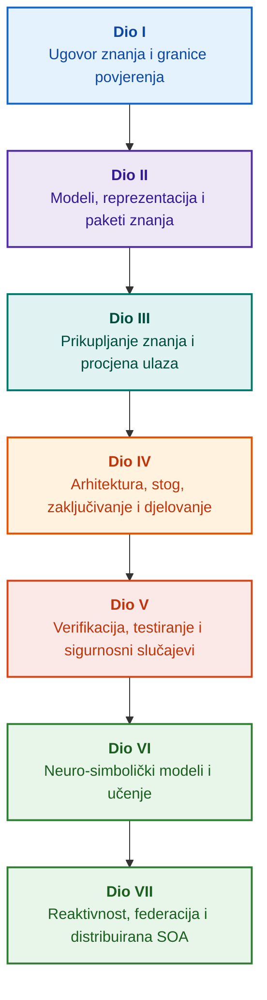

# Arhitektura dokazno vođenih ekspertnih sustava: Od formalnih ontologija do neuro-simboličke umjetne inteligencije

**Inženjerska monografija i priručnik za projektiranje, matematičke temelje, arhitekturu i verifikaciju visokopouzdanih inteligentnih sustava (Safety-Critical & Evidence-Grounded AI)**

**Autor:** [Mykola Fedchyk](../en/about-the-author.md) · [LinkedIn](https://www.linkedin.com/in/nickfedchik/)  
**Format:** Inženjerska monografija / Priručnik za arhitekte umjetne inteligencije  
**Godina:** 2026  

---

## O knjizi

Ova monografija predstavlja temeljno istraživanje i inženjerski vodič posvećen prevladavanju ključne krize suvremene umjetne inteligencije: epistemološkog jaza između vjerojatnosne uvjerljivosti generacija neuronskih mreža i determinističke istinitosti formalnih matematičkih dokaza. U središtu ovog istraživanja nalazi se beskompromisno pitanje: **kako projektirati ekspertni sustav čiji je svaki zaključak neoboriv, u potpunosti sljediv do primarnih izvora dokaza i prikladan za certifikaciju u sigurnosno kritičnim inženjerskim domenama (ISO 26262, IEC 61508, DO-178C, ISO/SAE 21434)?**

Autor utemeljuje i uvodi novu paradigmu: **dokazno utemeljenu neuro-simboličku umjetnu inteligenciju (Evidence-Grounded Neuro-Symbolic AI)**, u kojoj statistički modeli (LLM/SLM) obavljaju savjetodavnu funkciju generiranja hipoteza i projekcija, dok deterministička simbolička jezgra nepromjenjivo jamči invarijante logičke dosljednosti, bajtovnog usidrenja činjenica, nametanja granica ovlasti i sigurnog prijelaza na izvršavanje akcija.

### Od artefakta do provjerljive odluke

Zahtjevi sustava, izvorni kod, dnevnici izvršavanja testova, regulatorni standardi i inženjerske odluke danas prožimaju moderna proizvodna okruženja. Međutim, oni pretežno funkcioniraju kao nepovezani artefakti bez formalizirane semantike, eksplicitnih granica valjanosti i dvosmjerne sljedivosti. Izvješće o položenom kvalifikacijskom testu može upućivati na zastarjelu reviziju hardvera; citat iz norme o funkcionalnoj sigurnosti može biti izvučen iz konteksta; automatsko vraćanje konfiguracije u nuždi može nenamjerno aktivirati opozvanu komponentu.

Ova monografija uspostavlja cjelovit inženjerski cjevovod: od formalizacije inženjerskih artefakata kao tipiziranih podataka i kriptografski potpisanih paketa znanja do simboličkog zaključivanja, dekompozicije planova korak po korak, kontračinjeničnih objašnjenja i revizije granica kompetencija. Praktično izlaganje potkrijepljeno je produkcijskim implementacijama u programskom jeziku Go s iscrpnim testnim paketima ([Poglavlje 1](../en/ch01-introduction-to-expert-systems.md)), strogim matematičkim ugovorima ([Dio II](../en/part-02-knowledge-models.md)) i protokolima kontinuiranog učenja koji dokazano eliminiraju regresije ([Poglavlje 25](../en/ch25-how-expert-systems-learn.md)).

### Ciljana publika

Djelo je namijenjeno arhitektima sustava, vodećim inženjerima za pouzdanost i funkcionalnu sigurnost, razvojnim inženjerima mehanizama zaključivanja i inženjerima znanja. Početno usvajanje temeljnih koncepata zahtijeva samo bazično razumijevanje predikatne logike prvog reda, verzioniranja softvera i upravljanja životnim ciklusom; repliciranje praktičnih primjera koristi standardne Go alate. Specijalizirana poglavlja koja pokrivaju formalnu sintezu Goal Structuring Notation (GSN), sinergetiku složenih sustava, neuromorfne akceleratore i autonomnu navigaciju bez GNSS-a istražuju najnaprednije granice dokazno vođene umjetne inteligencije u zrakoplovstvu, autonomnim vozilima i kritičnoj infrastrukturi.

---

## Znanstveni kontekst i globalno pozicioniranje monografije

Monografija ne pristupa ekspertnim sustavima kao arhaičnom nasljeđu sustava temeljenih na pravilima iz 1980-ih (poput CLIPS-a ili MYCIN-a), već kao avangardi **trećeg vala dokazno utemeljene neuro-simboličke umjetne inteligencije (Third-Wave Evidence-Grounded Neuro-Symbolic AI)**. Metodologija povezuje teorijske temelje vodećih svjetskih znanstvenih škola s visokoučinkovitim sustavnim inženjerstvom:

| Znanstvena disciplina | Ključna svjetska djela i autori | Konceptualni most u ovoj monografiji |
|---|---|---|
| **Neuro-simbolička AI trećeg vala (NeSy)** | Artur d'Avila Garcez, Luis C. Lamb (*Neurosymbolic AI: The 3rd Wave*, 2023; *Neural-Symbolic Cognitive Reasoning*, Springer, 2009); Henry Kautz (*The Third AI Summer*, AAAI 2022) | Razdvajanje odgovornosti: statistički modeli (SLM/LLM) generiraju hipoteze upita, dok deterministička simbolička jezgra formalno verificira i prihvaća činjenice ([Poglavlje 29](../en/ch29-neuro-symbolic-architecture.md)). |
| **Semantička ograničenja i sigurno učenje** | Guy Van den Broeck et al. (*A Semantic Loss Function for Deep Learning with Symbolic Knowledge*, ICML 2018); Luc De Raedt et al. (*DeepProbLog*, IJCAI 2020) | Ulazni i izlazni prolazi, determinističko semantičko filtriranje kandidatskih tvrdnji neuronskih mreža u odnosu na formalne sheme ([Poglavlja 28](../en/ch28-dual-mode-expert-systems.md), [33](../en/ch33-inter-system-knowledge-exchange-and-model-teaching.md)). |
| **Oborivo rasuđivanje i teorija argumentacije** | John L. Pollock (*Defeasible Reasoning*, 1987; *Cognitive Carpentry*, MIT Press, 1995); Phan Minh Dung (*Abstract Argumentation Frameworks*, AIJ 1995); Douglas Walton (*Argumentation Schemes*, Cambridge, 2008) | Dekompozicija znanja na tvrdnje, podrijetlo i pobijače (*defeaters*: *rebutting* i *undercutting*); rješavanje sukoba u normativnim bazama pravila putem Dungovih argumentacijskih okvira ([Poglavlja 2](../en/ch02-epistemology-of-machine-knowledge.md), [27](../en/ch27-safety-case-gsn-synthesis.md)). |
| **Automatizirano rudarenje asocijacijskih pravila (KBC)** | Luis Galárraga, Fabian M. Suchanek et al. (*AMIE: Association Rule Mining under Incomplete Evidence*, WWW 2013, VLDBJ 2015); Stephen Muggleton (*Inductive Logic Programming*, 1994) | Autonomna indukcija pravila iz baza znanja pod Pretpostavkom Djelomične Potpunosti (PCA), čime se uklanjaju lažni protuprimjeri otvorenog svijeta ([Poglavlje 34](../en/ch34-deterministic-relational-analysis-abduction-and-socratic-dialogue.md)). |
| **Formalni sigurnosni štitovi i certifikacija (Safe AI)** | Bettina Könighofer, Roderick Bloem et al. (*Shield Synthesis*, 2017); Tim Kelly, Rob Weaver (*Goal Structuring Notation*, York, 2004); André Platzer (*Logical Foundations of CPS*, Springer, 2018) | Sinteza strukturiranih sigurnosnih argumenata u GSN notaciji za standarde ISO 26262/21434; formalni štitovi i numeričke omotnice valjanosti za rubne aktuatore ([Poglavlja 27](../en/ch27-safety-case-gsn-synthesis.md), [30](../en/ch30-safety-cybersecurity-co-engineering.md), [33](../en/ch33-inter-system-knowledge-exchange-and-model-teaching.md)). |
| **Epistemička logika i semiotika znanja** | John F. Sowa (*Knowledge Representation: Logical, Philosophical, and Computational Foundations*, 2000); Frank van Harmelen et al. (*Handbook of Knowledge Representation*, Elsevier, 2008) | Epistemička trijada Charlesa Sandersa Peircea (Pojam → Sud → Zaključak); abduktivno generiranje radnih hipoteza pod strogim deduktivnim nadzorom ([Poglavlja 6](../en/ch06-applied-mathematics-for-expert-systems.md), [34](../en/ch34-deterministic-relational-analysis-abduction-and-socratic-dialogue.md)). |
| **Kibernetika i sinergetika složenih sustava** | Norbert Wiener (*Cybernetics*, 1948); W. Ross Ashby (*An Introduction to Cybernetics*, 1956); Hermann Haken (*Synergetics: An Introduction*, 1977; *Advanced Synergetics*, 1983); Ilya Prigogine (*Order out of Chaos*, 1984) | Ashbyjev zakon nužne raznolikosti, zatvorene upravljačke petlje L0–L4, redukcija faznog prostora na parametre reda pomoću Hakenovog principa podčinjavanja, rano upozorenje na fazne prijelaze kroz kritično usporavanje (CSD) i disipativna stabilizacija baza znanja ([Poglavlja 6](../en/ch06-applied-mathematics-for-expert-systems.md), [22](../en/ch22-cybernetics-edge-to-backend.md), [35](../en/ch35-self-organizing-expert-systems-synergetics-and-npu-runtime.md)). |
| **Testiranje znanja, invarijantnost i Lipschitzova kalibracija** | Kent Beck (*TDD*, 2002); Martin Fowler (*Refactoring*, 2018); Clark Barrett, Leonardo de Moura (*Z3 SMT Solver*, 2008); Chuan Guo et al. (*On Calibration of Modern Neural Networks*, ICML 2017); Marco Tulio Ribeiro et al. (*CheckList*, ACL 2020); John L. Pollock (*Defeasible Reasoning*, 1987) | Četverorazinska piramida testiranja znanja (KTP): izolirano jedinično testiranje atomarnih pravila (KUT) uz simulirane pretpostavke (`PremiseMock`), eliminacija zamke vakuumske istinitosti, spektralna analiza graničnih vrijednosti u 6 točaka (BVA), rešetke pravila i pobijači (KIT), ocjena semantičke invarijantnosti ($\text{SIS} \ge 0.98$) pri jezičnim mutacijama upita, Lipschitzova ograničenja neprekinutosti ($L_{\mathcal{K}} \le L_{\max}$) koja sprječavaju titranje releja i stigmergijsko bilježenje praznina u znanju ([Poglavlje 36](../en/ch36-knowledge-testing-pyramid-and-variational-calibration.md)). |

---

## Autorski teorijski modeli, znanstvena istraživanja i inženjerske inovacije

Ova monografija sažima autorovo temeljno istraživanje i inženjerski doprinos u području sigurnosno kritičnog softvera, ugrađenih arhitektura i dokazno vođene umjetne inteligencije. Za razliku od isključivo pregledne literature, knjiga uvodi skup izvornih formalnih teorija, protokola i arhitektonskih obrazaca koji podižu neuro-simboličke interakcije na matematički verificiranu razinu povjerenja:

### 1. Fundamentalni teorijski modeli i matematički formalizmi

1. **Invarijanta usidrenja u dokazima (EGI) i pristupna vrata za prihvaćanje činjenica ([Poglavlja 2](../en/ch02-epistemology-of-machine-knowledge.md), [19](../en/ch19-from-question-to-evidence.md), [28](../en/ch28-dual-mode-expert-systems.md), [29](../en/ch29-neuro-symbolic-architecture.md)):**
   * *Teorijska formulacija:* Autor formalizira Invarijantu potpunosti usidrenja $\mathrm{Comp}(C) = 1.00$, utvrđujući da u arhitekturi vođenoj dokazima nijedna tvrdnja ne može dobiti status priznate činjenice bez determinističke projekcije na vjerodostojne primarne izvore. Svaka prihvaćena n-torka činjenice usidrena je nepromjenjivim bajtovnim pomacima `[byte_start, byte_end]`, kanonskim kriptografskim sažetkom fragmenta `quote_sha256` i identifikatorom PROV-O certifikata o podrijetlu.
   * *Inženjerski učinak:* Hardversko-softverska pristupna vrata na razini bajtova onemogućuju halucinacijama neuronskih mreža ulazak u verzioniranu bazu znanja, jamčeći nultu toleranciju na neutemeljene tvrdnje ($ZHR = 1.00$).
2. **Četverorazinska piramida testiranja znanja (KTP) i Lipschitzova neprekinutost logičkog prostora ([Poglavlje 36](../en/ch36-knowledge-testing-pyramid-and-variational-calibration.md)):**
   * *Teorijska formulacija:* Autor uvodi Piramidu testiranja znanja (KTP), prenoseći disciplinu Fowlerove testne piramide u sustave znanja: izolirano jedinično testiranje pravila (KUT) korištenjem simuliranih preduvjeta (`PremiseMock`), integracijsko testiranje interakcija pravila i pobijača (KIT) te varijacijsku kalibraciju kroz mnogostrukosti upita (KVT).
   * *Matematički aparat:* Formalizacija invarijante koja sprječava vakuumsku istinitost ($P \to Q$ gdje je $P \equiv \text{False}$), ocjena semantičke invarijantnosti ($\mathrm{SIS} \ge 0.98$) pri jezičnim perturbacijama i Lipschitzovo ograničenje neprekinutosti na mnogostrukosti zaključivanja ($L_{\mathcal{K}} \le L_{\max}$), čime se matematički eliminira katastrofalno titranje releja pri malim varijacijama ulaza.
3. **Popperovska falsifikacija deontičkih normi i aktivna revizija sukladnosti ([Poglavlje 39](../en/ch39-active-compliance-auditor-and-popperian-testing.md)):**
   * *Teorijska formulacija:* Promjena paradigme s pasivnog proročišta (koje samo odgovara na upite) na aktivnog revizora sukladnosti koji provodi načelo opovrgljivosti Karla Poppera. Sustav autonomno ispituje prostor specifikacija (ASPICE 4.0, ISO 26262, ISO/SAE 21434), sintetizira protuprimjere, identificira nedovoljno definirane rubne uvjete i projektira iscrpne verifikacijske kampanje.
   * *Praktična vrijednost:* Spajanje neuronskog generiranja rubnih slučajeva (Sustav 1) s determinističkom deontičkom verifikacijom putem simboličke jezgre (Sustav 2), čime se čovjek u upravljačkoj petlji (Human-in-the-Loop) štiti od zamora odobravanja.
4. **Sinergetska redukcija dimenzionalnosti baza znanja i dijagnostika CSD prije bifurkacije ([Poglavlja 6](../en/ch06-applied-mathematics-for-expert-systems.md), [22](../en/ch22-cybernetics-edge-to-backend.md), [35](../en/ch35-self-organizing-expert-systems-synergetics-and-npu-runtime.md)):**
   * *Teorijska formulacija:* Primjena sinergetike Hermanna Hakena (parametri reda i princip podčinjavanja) i disipativnih struktura Ilye Prigoginea na evoluciju složenih repozitorija znanja.
   * *Znanstveni doprinos:* Visokodimenzionalni fazni prostori telemetrije reduciraju se na parametre reda, uz integraciju detektora kritičnog usporavanja (CSD) prije bifurkacije utemeljenog na autokorelaciji i varijanci. To omogućuje rano otkrivanje nadolazeće kibernetičko-fizičke nestabilnosti znatno prije nego što reagiraju konvencionalni nadzornici pragova.
5. **Model razina autonomije djelovanja (A0–A4), pristupna vrata i idempotentne sage ([Poglavlje 21](../en/ch21-from-recommendation-to-action.md)):**
   * *Teorijska formulacija:* Granularni okvir ovlasti za automatizirano izvršavanje (A0: pasivna analiza, A1: izrada nacrta akcije, A2: izvršavanje potpisano od strane čovjeka, A3: nadzirana ograničena autonomija, A4: hitno zaustavljanje fail-closed). Dozvole nisu vezane za sustav kao monolit, već za tripletu $\langle\text{akcija}, \text{okruženje}, \text{razina rizika}\rangle$.
   * *Matematički aparat:* Algebarska invarijanta idempotentnosti $f(f(x, k), k) \equiv f(x, k)$ zaštićena kriptografskim tokenom $k$, izvršavanje korak po korak u zatvorenoj petlji i distribuirani protokol kompenzacijskih saga koji rješava stanja `OutcomeUnknown` putem izvanpojasne verifikacije post-uvjeta.
6. **Formalno zajedničko inženjerstvo funkcionalne i kibernetičke sigurnosti u GSN-u ([Poglavlja 27](../en/ch27-safety-case-gsn-synthesis.md), [30](../en/ch30-safety-cybersecurity-co-engineering.md)):**
   * *Teorijska formulacija:* Jedinstvena metodologija sinteze u Goal Structuring Notation (GSN) koja usklađuje istodobna ograničenja normi ISO 26262 (sigurnost) i ISO/SAE 21434 (kibernetička sigurnost).
   * *Inženjerski iskorak:* Matematička arbitraža između sukobljenih ciljeva (granice latencije hitnog odgovora nasuprot dubini kriptografske atestacije), kombinirana s protokolom selektivnog otkrivanja dokaza vanjskim revizorima pomoću soljenih Merkleovih stabala.
7. **Protokol vjernosti objašnjenja i verifikacije semantičke dosljednosti ([Poglavlje 20](../en/ch20-explanation-engine.md)):**
   * *Teorijska formulacija:* Objašnjenja se ne tretiraju kao slobodno generirani tekst, već kao deterministički artefakti prve klase izvedeni strogo iz grafa dokaza, verzionih oznaka pravila i zamrznutih snimaka činjenica.
   * *Matematički aparat:* Formalna metrička provjera vjernosti objašnjenja ($C_{\text{facts}} = 1.00, H_{\text{free}} = 1.00$) uz automatsko sigurno vraćanje na krute predloške pri najmanjem neskladu između simboličke dedukcije i teksta na prirodnom jeziku za operatera.

---

### 2. Empirijska istraživanja, autorske eksperimentalne platforme i sustavno inženjerstvo

1. **Nepromjenjivi binarni paketi znanja s `mmap` i deserializacijom s nultom alokacijom ([Poglavlje 32](../en/ch32-high-performance-knowledge-packs-mmap-and-harvesting.md)):**
   * *Autorska inovacija:* Dvorazinska arhitektura paketa koja odvaja kanonske arhive primarnih izvora od izvedenih materijaliziranih segmenata indeksa.
   * *Empirijski rezultat:* Izravno mapiranje u virtualni adresni prostor pomoću `mmap` eliminira alokacije na hrpi tijekom izvođenja (zero-allocation) i postiže sub-linearno kašnjenje pokretanja mehanizma bez obzira na višegigabajtni opseg ontologija.
2. **Empirijska kalibracijska platforma na regulatornim korpusima IETF RFC-1000 i W3C-150 ([Poglavlja 2](../en/ch02-epistemology-of-machine-knowledge.md), [4](../en/ch04-evolution-from-bayes-to-evidence-ai.md), [14](../en/ch14-requirements-detection-and-formalization.md), [25](../en/ch25-how-expert-systems-learn.md)):**
   * *Autorska platforma:* Uspostava opsežnog evaluacijskog okvira na 1.000 aktivnih specifikacija IETF RFC (koje obuhvaćaju 5 kronoloških epoha interneta) i 150 složenih dijagnostičkih upita nad korpusom W3C (uključujući inducirane logičke konflikte i konfabulacije).
   * *Praktični nalaz:* Izgradnja objektivnih matrica ispita znanja, empirijska identifikacija normativnih proturječja i matematički validirana obrana od regresije baze znanja tijekom kontinuiranih ažuriranja.
3. **Višekoračna relacijska analiza, simbolička abdukcija i sokratovski dijalog ([Poglavlje 34](../en/ch34-deterministic-relational-analysis-abduction-and-socratic-dialogue.md)):**
   * *Autorska inovacija:* Algoritam dvosmjernog ograničenog pretraživanja u širinu (Bounded BFS, $k \le 6$) sa suzbijanjem ciklusa i sintezom složenog lanca bajtovnih dokaza među međusobno povezanim entitetima.
   * *Inženjerska prednost:* Realizacija Peirceove simboličke abdukcije pod strogim deduktivnim ograničenjima, kombinirana s tipiziranim sokratovskim okvirima za pojašnjenje (Clarification Frames) koji vode sustav u produktivan dijalog s korisnikom umjesto slijepog odbijanja pod Pretpostavkom Zatvorenog Svijeta (CWA).
4. **Formalni sigurnosni štitovi i numeričke omotnice valjanosti za upravljanje na rubu ([Poglavlje 33](../en/ch33-inter-system-knowledge-exchange-and-model-teaching.md), [Prilozi B](../en/appendix-b-robotics-and-cyber-physical-systems.md), [C](../en/appendix-c-autonomous-navigation-and-geosearch.md), [E](../en/appendix-e-mixed-signal-neuromorphic-expert-systems.md)):**
   * *Autorska inovacija:* Metodologija prevođenja diskretnih logičkih invarijanti u kontinuirane numeričke sigurnosne koridore za digitalne signalne procesore (DSP) i navigaciju bez GNSS-a (TRN/DSMAC/VIO).
   * *Operativna pouzdanost:* Kriptografski potpisana razmjena pravila putem Ed25519, izolirana karantena kandidatskih pravila i hardversko presretanje nevažećih putanja aktuatora.
5. **Obrana od curenja povjerljivih informacija putem objašnjenja i diferencijalna revizija ([Poglavlje 20](../en/ch20-explanation-engine.md)):**
   * *Autorska inovacija:* Protokol redukcije međureprezentacije objašnjenja ($\mathrm{EIR}_{\text{redacted}}$) koji nameće popise kontrole pristupa (ACL) na svakom čvoru i bridu grafa dokaza, neutralizirajući napade bočnim kanalima za rekonstrukciju modela kroz kontrastne upite ZAŠTO NE (WHY NOT).

---

## Načelo strukturiranja

Dijelovi ove monografije strukturirani su oko primarnih inženjerskih ciljeva, a ne prema kronološkim datumima objavljivanja ili prolaznim komercijalnim nazivima tehnologija. Svako poglavlje pripada jednom primarnom dijelu; srodne tehnike ilustriraju metode za rješavanje njegove središnje teze. Brojevi poglavlja i identifikatori datoteka ostaju trajni ključevi, omogućujući da se tematski redoslijedi čitanja razlikuju od brojčanog poretka.

Strukturne klase odjeljaka unutar poglavlja grade logički povezanu argumentaciju umjesto pukog kataloga ekvivalentnih tehnologija:

| Klasa odjeljka | Pitanje čitatelja | Arhitektonska funkcija u poglavlju |
|---|---|---|
| Problem i granice | Koji se točno izazov mora riješiti? | Definira srž istraživanja i opseg valjanosti |
| Objekt i model | Koji se podatci, znanja ili stanja vrednuju? | Formalizira pojmove, tipove i operativne pretpostavke |
| Metoda i postupak | Kako se izvodi rješenje? | Detaljno opisuje algoritme dedukcije, transformacije i kontrole |
| Implementacija i alati | Koji softver ili hardver provodi postupak? | Pruža konkretne popise koda i arhitektonske ugovore |
| Verifikacija i testiranje | Kako se sustavno otkrivaju kvarovi? | Mjeri performanse i točnost prema neovisnim kriterijima |
| Zaključak i ograničenja | Što je dokazano, a što ostaje otvoreno? | Odgovara na središnju tezu bez neutemeljenih tvrdnji |

Geografija, specifični industrijski sektori i komercijalne platforme služe kao konteksti primjene, a ne kao zasebne razine u ovoj taksonomiji. Rječnici, kratice, bibliografije i navigacija kroz indeks čine referentni aparat, a ne samostalne teme poglavlja.

Cjeloviti urednički pregled strukture pruža procjenu središnje teme svakog poglavlja, granica između susjednih tema i kompozicijskih bilješki. Ažuriranje sažetka ne podrazumijeva da su svi unutarnji kompozicijski rizici unutar poglavlja riješeni.

## Putanje čitanja

**Prva verifikacija softvera:** [1](../en/ch01-introduction-to-expert-systems.md) → [7](../en/ch07-knowledge-base-typology.md) → [8](../en/ch08-engineering-artifacts-as-data.md) → [17](../en/ch17-implementation-stack.md) → [23](../en/ch23-knowledge-base-verification.md) → [25](../en/ch25-how-expert-systems-learn.md). Cilj: Dobivanje ponovljivog, na dokazima utemeljenog pravorijeka s negativnim testovima i kontroliranom mutacijom znanja. Jezični model je opcionalan.

**Inženjerstvo znanja:** [Dio II](../en/part-02-knowledge-models.md) → [Dio III](../en/part-03-knowledge-engineering-nlp.md) → [19](../en/ch19-from-question-to-evidence.md) → [20](../en/ch20-explanation-engine.md) → [26](../en/ch26-continual-learning.md). Cilj: Usklađivanje formalne semantike, podrijetla, ekstrakcije kandidata i validacije. Dio II čuva međusektorski empirijski istraživački program za Poglavlja 7–11.

**Arhitektura rješenja:** [16](../en/ch16-expert-systems-architecture.md) → [19](../en/ch19-from-question-to-evidence.md) → [31](../en/ch31-syllogistic-reasoning-and-relation-lattices.md) → [20](../en/ch20-explanation-engine.md) → [21](../en/ch21-from-recommendation-to-action.md). Cilj: Razdvajanje dokazne verifikacije, primjene normativnih pravila, generiranja objašnjenja i operativnih ovlasti za djelovanje.

**Verifikacija i sigurnost:** [23](../en/ch23-knowledge-base-verification.md) → [36](../en/ch36-knowledge-testing-pyramid-and-variational-calibration.md) → [25](../en/ch25-how-expert-systems-learn.md) → [26](../en/ch26-continual-learning.md) → [27](../en/ch27-safety-case-gsn-synthesis.md) → [30](../en/ch30-safety-cybersecurity-co-engineering.md). Vanjska fizička dijagnostika obrađuje se u [Poglavlju 24](../en/ch24-system-diagnosis.md).

**Hibridni odgovori i operativno uvođenje:** [Dio VI](../en/part-06-frontiers-neuro-symbolic.md) → [Dio VII](../en/part-07-runtime-and-knowledge-exchange.md) → [40](../en/ch40-distributed-epistemic-architectures-soa-and-cluster-scaling.md) i relevantni prilozi. Cilj: Integracija neuronskih jezičnih modela, upravljanje epistemičkim jazovima, arhitektura distribuiranih klastera usluga znanja i verifikacija međusustavnih federacija. Poglavlja [2](../en/ch02-epistemology-of-machine-knowledge.md), [4](../en/ch04-evolution-from-bayes-to-evidence-ai.md) i [6](../en/ch06-applied-mathematics-for-expert-systems.md) mogu se koristiti prema potrebi kao ugovori, povijesna evolucija i matematički temelji.

---

## Opseg tvrdnji i inženjerske granice

Ova monografija predstavlja temeljni obrazovni i istraživački materijal; ona nije certificirani postupak usklađenosti niti samostalni dokaz usklađenosti opreme s normama. Determinističko izvršavanje ne jamči činjeničnu točnost premisa; sažeci i digitalni potpisi dokazuju cjelovitost, a ne empirijsku istinu; grafovi argumenata ne zamjenjuju certificiranu ljudsku prosudbu. Zahtjevi pouzdanosti na razini sustava ne mogu se izjednačiti sa stopom pogrešaka tokena jezičnog modela niti univerzalno preslikati na sve softverske module.

Automatizirano raščlanjivanje i ekstrakcija smanjuju ručno premještanje podataka, ali ne uklanjaju nužnost formalnog modeliranja, stručne recenzije (peer review) i određivanja odgovornih čuvara znanja (knowledge custodians). Ontologije u Protégéu, ručne revizije i automatizirani sakupljači funkcioniraju usklađeno. Matematička jamstva omeđena su eksplicitnim profilima formalnih jezika i operativnim pretpostavkama; izmjerene vrijednosti propusnosti odražavaju specifična opterećenja upita, korpuse i okruženja izvršavanja. Povijesne metrike iz autorovih prethodnih produkcijskih implementacija strogo su odvojene od otvorenih edukativnih platformi i aktivnih znanstvenih istraživanja.

Konačne odluke o puštanju u rad, prihvaćanju rizika i regulatornoj usklađenosti pripadaju isključivo ovlaštenim inženjerima. Ekspertni sustav vođen dokazima priprema provjerljive revizijske tragove i provodi dogovorene sigurnosne politike; on ne preuzima regulatorni suverenitet.

---

## Struktura knjige

Monografija je organizirana u sedam tematskih dijelova koji obuhvaćaju 40 poglavlja i pet priloga. Svako poglavlje pripada jednom primarnom dijelu. Sekvence navigacije prate tematsku putanju prikazanu u nastavku; brojevi poglavlja i staze datoteka ostaju nepromjenjivi.

---

### [Dio I. Konceptualni i epistemološki temelji](../en/part-01-foundations.md)

*Kada je potreban ekspertni sustav, što čini strojno znanje i kako se čuva organizacijsko obrazloženje.*

* [Poglavlje 1. Uvod u ekspertne sustave: Od kaosa do upravljanog znanja](../en/ch01-introduction-to-expert-systems.md)
* [Poglavlje 2. Filozofija za sustavnog inženjera: Što strojevi imaju pravo nazivati znanjem](../en/ch02-epistemology-of-machine-knowledge.md)
* [Poglavlje 3. Razgraničenje ekspertnih sustava od referentnih informacijskih sustava](../en/ch03-beyond-reference-information-systems.md)
* [Poglavlje 4. Evolucija ekspertnih sustava: Od Bayesova teorema do umjetne inteligencije utemeljene na dokazima](../en/ch04-evolution-from-bayes-to-evidence-ai.md)
* [Poglavlje 5. Trijada povjerenja: Ekspertni sustav, provjerljiva preporuka i korporativno pamćenje](../en/ch05-triad-of-trust-and-corporate-memory.md)

---

### [Dio II. Matematički modeli, reprezentacija i pohrana znanja](../en/part-02-knowledge-models.md)

*Odabir matematičkih formalizama, tipizirani artefakti, inženjerski grafovi sljedivosti i nepromjenjivi paketi znanja.*

* [Poglavlje 6. Primijenjena matematika za ekspertne sustave: Pravila, vjerojatnosti, grafovi i uzročnost](../en/ch06-applied-mathematics-for-expert-systems.md)
* [Poglavlje 7. Tipologija baza znanja: Pravila, ontologije, slučajevi i vektorska ugrađivanja](../en/ch07-knowledge-base-typology.md)
* [Poglavlje 8. Inženjerski artefakti kao podatci ekspertnog sustava](../en/ch08-engineering-artifacts-as-data.md)
* [Poglavlje 9. Inženjerski graf znanja: Potpuna sljedivost od zahtjeva do silicija](../en/ch09-engineering-knowledge-graph-traceability.md)
* [Poglavlje 32. Nepromjenjivi paketi znanja: Bajtovska provjera, indeksi i mapiranje memorije](../en/ch32-high-performance-knowledge-packs-mmap-and-harvesting.md)

---

### [Dio III. Prikupljanje znanja, lingvistička analiza i procjena ulaza](../en/part-03-knowledge-engineering-nlp.md)

*Dokumenti, ljudska stručnost i senzorska opažanja: ekstrakcija kandidata, lingvistička analiza, formalizacija i procjena dokaza.*

* [Poglavlje 10. Sustavi za stjecanje znanja: Izvori, pristupna vrata i životni ciklusi](../en/ch10-knowledge-acquisition-systems.md)
* [Poglavlje 11. Prikupljanje znanja od domenskih stručnjaka: Intervjui, kognitivne karte i formalizacija prakse](../en/ch11-knowledge-elicitation-from-experts.md)
* [Poglavlje 12. Lingvistička analiza i lokalni modeli: Očuvanje semantike i atribucija izvora](../en/ch12-linguistic-analysis-and-local-models.md)
* [Poglavlje 13. Varijabilnost prirodnog jezika nasuprot determinizmu: Kompiliranje semantike upita](../en/ch13-language-variability-vs-determinism.md)
* [Poglavlje 14. Ekstrakcija zahtjeva i modaliteta: Od normativnog teksta do formalnih invarijanti](../en/ch14-requirements-detection-and-formalization.md)
* [Poglavlje 15. Ekstrakcija znanja i izgradnja baze znanja: Činjenice, gramatike i automati](../en/ch15-knowledge-extraction-and-kb-construction.md)
* [Poglavlje 37. Procjena ulaznih informacija: Izvori, dokazi i algoritamski skepticizam](../en/ch37-input-information-assessment-and-algorithmic-skepticism.md)

---

### [Dio IV. Arhitektura, tehnološki stog, zaključivanje i djelovanje](../en/part-04-architecture-and-inference.md)

*Arhitektonski ugovori, izvedbeni stog, hardversko ubrzanje, provjera tvrdnji, normativno zaključivanje, mehanizmi objašnjenja i kibernetičke upravljačke petlje.*

* [Poglavlje 16. Arhitektura ekspertnih sustava: Od formaliziranog znanja do djelovanja vođenog dokazima](../en/ch16-expert-systems-architecture.md)
* [Poglavlje 17. Tehnološki stog: Odabir alata, programski jezici i mehanizmi pravila](../en/ch17-implementation-stack.md)
* [Poglavlje 18. Infrastruktura izvođenja: Lokalni SLM-ovi, hardverski akceleratori, edge i on-premise](../en/ch18-execution-infrastructure.md)
* [Poglavlje 19. Od pitanja do dokaza: Pretraživanje, usidrenje i provjera propozicija](../en/ch19-from-question-to-evidence.md)
* [Poglavlje 31. Normativno zaključivanje: Hijerarhije predikata, iznimke i vremenska valjanost](../en/ch31-syllogistic-reasoning-and-relation-lattices.md)
* [Poglavlje 20. Mehanizam objašnjenja: Odluke, obrazloženo odbijanje i granice kompetencija](../en/ch20-explanation-engine.md)
* [Poglavlje 21. Od preporuke do akcije: Kontrola ovlasti i sigurno izvršavanje u proizvodnji](../en/ch21-from-recommendation-to-action.md)
* [Poglavlje 22. Kibernetička upravljačka petlja: Senzori, aktuatori i povratna veza](../en/ch22-cybernetics-edge-to-backend.md)

---

### [Dio V. Verifikacija, testiranje, dijagnostika i sigurnosni slučajevi](../en/part-05-verification-and-learning.md)

*Formalna verifikacija pravila, piramide testiranja znanja, popperovska falsifikacija, tehnička dijagnostika i slučajevi funkcionalne/kibernetičke sigurnosti.*

* [Poglavlje 23. Verifikacija baze znanja: Dosljednost, potpunost i ispravnost pravila](../en/ch23-knowledge-base-verification.md)
* [Poglavlje 36. Piramida testiranja znanja: Pravila, interakcije i varijacijska stabilnost](../en/ch36-knowledge-testing-pyramid-and-variational-calibration.md)
* [Poglavlje 39. Aktivni revizor sukladnosti: Popperovska falsifikacija, sukladnost sa standardima (ASPICE/ISO 26262/ISO 21434) i autonomno generiranje testova](../en/ch39-active-compliance-auditor-and-popperian-testing.md)
* [Poglavlje 24. Tehnička dijagnostika: Razdvajanje simptoma od temeljnih uzroka uz nepotpune informacije](../en/ch24-system-diagnosis.md)
* [Poglavlje 27. Inženjerstvo sigurnosnih slučajeva: Formalna sinteza i verifikacija GSN argumenata](../en/ch27-safety-case-gsn-synthesis.md)
* [Poglavlje 30. Zajedničko inženjerstvo funkcionalne i kibernetičke sigurnosti](../en/ch30-safety-cybersecurity-co-engineering.md)

---

### [Dio VI. Neuro-simbolički modeli, kognitivne granice i kontinuirano učenje](../en/part-06-frontiers-neuro-symbolic.md)

*Stroga dedukcija nasuprot savjetodavnih hipoteza, integracija jezičnih modela, praznine u znanju, eliminacija halucinacija, ispitne matrice i učenje iz iskustva.*

* [Poglavlje 28. Dvomodalni ekspertni sustavi: Stroga dedukcija i savjetodavne hipoteze](../en/ch28-dual-mode-expert-systems.md)
* [Poglavlje 29. Neuro-simbolička arhitektura: Jezični modeli i verifikacija utemeljena na dokazima](../en/ch29-neuro-symbolic-architecture.md)
* [Poglavlje 34. Praznine u znanju: Relacijsko pretraživanje, abdukcija i sokratovsko razjašnjenje](../en/ch34-deterministic-relational-analysis-abduction-and-socratic-dialogue.md)
* [Poglavlje 38. Liječenje strojnih halucinacija i deficita znanja: Kontrola izlaza usidrena u dokazima](../en/ch38-curing-machine-hallucinations-and-knowledge-deficits.md)
* [Poglavlje 25. Kako ekspertni sustavi uče: Ispitne matrice, revizije znanja i kontrola regresije](../en/ch25-how-expert-systems-learn.md)
* [Poglavlje 26. Kontinuirano učenje iz iskustva i ublažavanje pomaka u zapisima sustava](../en/ch26-continual-learning.md)

---

### [Dio VII. Reaktivno izvedbeno okruženje, međusustavna razmjena znanja i distribuirana SOA](../en/part-07-runtime-and-knowledge-exchange.md)

*Reaktivno izvršavanje pravila, sinergetika i fazni prijelazi znanja, međusustavna federacija i distribuirane korporativne epistemičke arhitekture.*

* [Poglavlje 35. Reaktivni ekspertni sustavi: Događaji, opoziv pravila i samoorganizacija znanja](../en/ch35-self-organizing-expert-systems-synergetics-and-npu-runtime.md)
* [Poglavlje 33. Međusustavna razmjena znanja: Distribucija pravila, podučavanje modela i sigurna povratna sprega](../en/ch33-inter-system-knowledge-exchange-and-model-teaching.md)
* [Poglavlje 40. Distribuirana epistemička arhitektura: SOA znanja, semantičko usmjeravanje, memorijske hijerarhije i višeizvorna oboriva arbitraža](../en/ch40-distributed-epistemic-architectures-soa-and-cluster-scaling.md)

---

### Prilozi

* [Prilog A. Praktični istraživački okvir vođen dokazima za složene inženjerske projekte](../en/appendix-a-evidence-governed-framework.md)
* [Prilog B. Ekspertni sustavi vođeni dokazima u autonomnoj robotici i kibernetičko-fizičkim sustavima](../en/appendix-b-robotics-and-cyber-physical-systems.md)
* [Prilog C. Autonomna navigacija bez GNSS-a: Geoprostorno usklađivanje (TRN/DSMAC), vizualno-inercijalna odometrija (VIO) i ekspertna arbitraža fuzije senzora](../en/appendix-c-autonomous-navigation-and-geosearch.md)
* [Prilog D. Analogni ekspertni sustavi, neuromorfno računarstvo i hardversko zaključivanje](../en/appendix-d-analog-expert-systems-and-neuromorphic-computing.md)
* [Prilog E. Ekspertni sustavi mješovitih analogno-digitalnih signala: Neuromorfni, analogni i ne-von-Neumannovi procesori pod upravom dokaza](../en/appendix-e-mixed-signal-neuromorphic-expert-systems.md)
* [O autoru: Mykola Fedchyk (Nick Fedchik)](../en/about-the-author.md)

---

## Pravci istraživanja

Budući pravci istraživanja formulirani u ovom radu predstavljaju otvorene inženjerske izazove, a ne gotova komercijalna rješenja: ponovljivo pakiranje paketa znanja s nultom alokacijom; verifikacija ograničenih formalnih fragmenata; upravljanje agentima putem eksplicitnih zakupa ovlasti (authority leases); provjera povjerljivih formalnih propozicija s nultim znanjem (zero-knowledge); te kontrolirani opoziv pravila i modularno odučavanje modela (machine unlearning). Dokazivanje teorijskog svojstva na modelu ne potvrđuje automatski sigurnost fizičkog sustava, a opoziv pravila nije jednak eliminaciji utjecaja podataka iz treniranog neuronskog modela.

Za hardverske akceleratore i nekonvencionalne procesore, empirijske stope pogrešaka, granice latencije, disipacija energije i fail-silent ponašanja moraju biti temeljito karakterizirani prije uvođenja. Relevantne arhitektonske strategije istražuju se u [Poglavlju 29](../en/ch29-neuro-symbolic-architecture.md), [Poglavlju 32](../en/ch32-high-performance-knowledge-packs-mmap-and-harvesting.md) i [Prilozima D](../en/appendix-d-analog-expert-systems-and-neuromorphic-computing.md) i [E](../en/appendix-e-mixed-signal-neuromorphic-expert-systems.md). Plan empirijskog istraživanja za poglavlja 7–11 detaljno je razrađen u [Dijelu II](../en/part-02-knowledge-models.md): svako predloženo istraživanje upareno je s provjerljivom hipotezom, polaznim mjerilom i formalnim kriterijem opovrgavanja.
