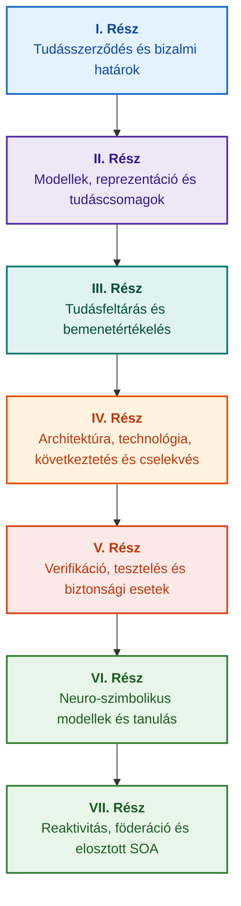

# Bizonyíték-vezérelt szakértői rendszerek architektúrája: A formális ontológiáktól a neuro-szimbolikus MI-ig

**Mérnöki monográfia és kézikönyv a nagy integritású intelligens rendszerek tervezéséről, matematikai alapjairól, architektúrájáról és verifikációjáról (Safety-Critical & Evidence-Grounded AI)**

**Szerző:** [Mykola Fedchyk](../en/about-the-author.md) · [LinkedIn](https://www.linkedin.com/in/nickfedchik/)  
**Formátum:** Mérnöki monográfia / MI-architekti kézikönyv  
**Év:** 2026  

---

## A könyvről

Ez a monográfia egy fundamentális kutatási vizsgálat és mérnöki útmutató, amely a modern mesterséges intelligencia legsúlyosabb válságának leküzdését célozza: a neurális hálózatok generálásának valószínűségi hihetősége és a formális matematikai bizonyítások determinisztikus igazsága közötti episztemikus szakadék áthidalását. A kutatás középpontjában egy kompromisszummentes kérdés áll: **hogyan tervezhetünk olyan szakértői rendszert, amelynek minden következtetése megdönthetetlen, teljes mértékben visszakövethető az elsődleges bizonyítékforrásokhoz, és alkalmas a tanúsításra a biztonságkritikus mérnöki területeken (ISO 26262, IEC 61508, DO-178C, ISO/SAE 21434)?**

A szerző egy új paradigmát alapoz meg és vezet be: a **Bizonyíték-alapú Neuro-Szimbolikus MI-t (Evidence-Grounded Neuro-Symbolic AI)**, amelyben a statisztikai modellek (LLM-ek/SLM-ek) tanácsadó funkciót töltenek be a hipotézisek generálásában és a vetületek megjelenítésében, míg a determinisztikus szimbolikus mag megváltoztathatatlanul garantálja a logikai konzisztencia, a bájtszintű tényhorgonyzás, a jogosultsági határok érvényesítése és a végrehajtásra való biztonságos átmenet invariánsait.

### A műterméktől az ellenőrizhető döntésig

A rendszerkövetelmények, a forráskódok, a tesztvégrehajtási naplók, a szabályozási szabványok és a mérnöki döntések ma átszövik a modern termelési környezeteket. Többnyire azonban elszigetelt műtermékként (artefact) működnek, formalizált szemantika, explicit érvényességi határok és kétirányú nyomonkövethetőség nélkül. Egy sikeres minősítő tesztjelentés hivatkozhat egy elavult hardverrevízióra; egy funkcionális biztonsági szabványból származó idézet kiragadható a kontextusból; egy automatikus vészhelyzeti konfiguráció-visszaállítás akaratlanul aktiválhat egy visszavont komponenst.

Ez a monográfia egy teljes körű mérnöki láncot épít fel: a mérnöki műtermékek típusos adatként és kriptográfiailag aláírt tudáscsomagként történő formalizálásától a szimbolikus következtetésig, a lépésről lépésre történő tervfelbontásig, a kontrafaktuális magyarázatokig és a kompetenciahatárok auditálásáig. A gyakorlati bemutatás alapját ipari minőségű Go implementációk képezik kimerítő tesztcsomagokkal ([1. Fejezet](../en/ch01-introduction-to-expert-systems.md)), szigorú matematikai szerződésekkel ([II. Rész](../en/part-02-knowledge-models.md)) és folytonos tanulási protokollokkal, amelyek bizonyíthatóan kizárják a regressziókat ([25. Fejezet](../en/ch25-how-expert-systems-learn.md)).

### Célközönség

A mű rendszerarchitekteknek, vezető megbízhatósági és funkcionális biztonsági mérnököknek, következtető motorok fejlesztőinek és tudásmérnököknek szól. Az alapkoncepciók megértéséhez csupán az elsőrendű predikátumlogika, a szoftververziózás és az életciklus-kezelés alapszintű ismerete szükséges; a gyakorlati példák reprodukálásához a standard Go eszközkészlet elegendő. A formális Goal Structuring Notation (GSN) szintézist, az összetett rendszerek szinergetikáját, a neuromorfikus gyorsítókat és a GNSS nélküli autonóm navigációt tárgyaló speciális fejezetek a bizonyíték-vezérelt MI legkorszerűbb határait tárják fel a repülőgépiparban, az önvezető járművekben és a kritikus infrastruktúrákban.

---

## Tudományos kontextus és a monográfia globális elhelyezése

A monográfia a szakértői rendszereket nem az 1980-as évek szabályalapú rendszereinek (például a CLIPS vagy a MYCIN) archaikus örökségeként kezeli, hanem a **harmadik hullámbeli bizonyíték-alapú neuro-szimbolikus MI (Third-Wave Evidence-Grounded Neuro-Symbolic AI)** élvonalaként. A módszertan összeköti a vezető globális tudományos iskolák elméleti alapjait a nagy teljesítményű rendszertervezéssel:

| Tudományos diszciplína | Kulcsfontosságú globális művek és szerzők | Koncepcionális híd ebben a monográfiában |
|---|---|---|
| **Harmadik hullámbeli neuro-szimbolikus MI (NeSy)** | Artur d'Avila Garcez, Luis C. Lamb (*Neurosymbolic AI: The 3rd Wave*, 2023; *Neural-Symbolic Cognitive Reasoning*, Springer, 2009); Henry Kautz (*The Third AI Summer*, AAAI 2022) | Feladatkörök szétválasztása: a statisztikai modellek (SLM-ek/LLM-ek) lekérdezési hipotéziseket generálnak, míg a determinisztikus szimbolikus mag formálisan ellenőrzi és jóváhagyja a tényeket ([29. Fejezet](../en/ch29-neuro-symbolic-architecture.md)). |
| **Szemantikai korlátok és biztonságos tanulás** | Guy Van den Broeck et al. (*A Semantic Loss Function for Deep Learning with Symbolic Knowledge*, ICML 2018); Luc De Raedt et al. (*DeepProbLog*, IJCAI 2020) | Beléptető és kilépési kapuk, a neurális hálózatok jelölt állításainak determinisztikus szemantikai szűrése formális sémákkal szemben ([28. Fejezet](../en/ch28-dual-mode-expert-systems.md), [33. Fejezet](../en/ch33-inter-system-knowledge-exchange-and-model-teaching.md)). |
| **Megdönthető érvelés és argumentációs elmélet** | John L. Pollock (*Defeasible Reasoning*, 1987; *Cognitive Carpentry*, MIT Press, 1995); Phan Minh Dung (*Abstract Argumentation Frameworks*, AIJ 1995); Douglas Walton (*Argumentation Schemes*, Cambridge, 2008) | A tudás felbontása állításokra, eredetre és megdöntő tényezőkre (*defeaters*: *rebutting* és *undercutting*); konfliktusfeloldás normatív szabálybázisokban Dung argumentációs keretrendszereivel ([2. Fejezet](../en/ch02-epistemology-of-machine-knowledge.md), [27. Fejezet](../en/ch27-safety-case-gsn-synthesis.md)). |
| **Automatizált asszociációs szabálybányászat (KBC)** | Luis Galárraga, Fabian M. Suchanek et al. (*AMIE: Association Rule Mining under Incomplete Evidence*, WWW 2013, VLDBJ 2015); Stephen Muggleton (*Inductive Logic Programming*, 1994) | Autonóm szabályindukció tudásbázisokból a részleges teljesség feltételezése (PCA) mellett, elkerülve a nyílt világú hamis ellenpéldákat ([34. Fejezet](../en/ch34-deterministic-relational-analysis-abduction-and-socratic-dialogue.md)). |
| **Formális biztonsági pajzsok és tanúsítás (Safe AI)** | Bettina Könighofer, Roderick Bloem et al. (*Shield Synthesis*, 2017); Tim Kelly, Rob Weaver (*Goal Structuring Notation*, York, 2004); André Platzer (*Logical Foundations of CPS*, Springer, 2018) | Strukturált biztonsági esetek szintézise GSN jelölésrendszerben az ISO 26262/21434 szabványokhoz; formális pajzsok és numerikus érvényességi burkolók peremi beavatkozókhoz ([27. Fejezet](../en/ch27-safety-case-gsn-synthesis.md), [30. Fejezet](../en/ch30-safety-cybersecurity-co-engineering.md), [33. Fejezet](../en/ch33-inter-system-knowledge-exchange-and-model-teaching.md)). |
| **Episztemikus logika és tudásszemiotika** | John F. Sowa (*Knowledge Representation: Logical, Philosophical, and Computational Foundations*, 2000); Frank van Harmelen et al. (*Handbook of Knowledge Representation*, Elsevier, 2008) | Charles Sanders Peirce episztemikus triádja (Fogalom → Ítélet → Következtetés); munkahipotézisek abduktív generálása szigorú deduktív felügyelet mellett ([6. Fejezet](../en/ch06-applied-mathematics-for-expert-systems.md), [34. Fejezet](../en/ch34-deterministic-relational-analysis-abduction-and-socratic-dialogue.md)). |
| **Összetett rendszerek kibernetikája és szinergetikája** | Norbert Wiener (*Cybernetics*, 1948); W. Ross Ashby (*An Introduction to Cybernetics*, 1956); Hermann Haken (*Synergetics: An Introduction*, 1977; *Advanced Synergetics*, 1983); Ilya Prigogine (*Order out of Chaos*, 1984) | Ashby szükséges változatosság törvénye, zárt L0–L4 vezérlési hurkok, fázistér redukciója rendparaméterekre Haken rabszolga-elve alapján, fázisátmenetek korai előrejelzése kritikus lelassulással (CSD), és fejlődő tudásbázisok disszipatív stabilizációja ([6. Fejezet](../en/ch06-applied-mathematics-for-expert-systems.md), [22. Fejezet](../en/ch22-cybernetics-edge-to-backend.md), [35. Fejezet](../en/ch35-self-organizing-expert-systems-synergetics-and-npu-runtime.md)). |
| **Tudástesztelés, invariancia és Lipschitz-kalibráció** | Kent Beck (*TDD*, 2002); Martin Fowler (*Refactoring*, 2018); Clark Barrett, Leonardo de Moura (*Z3 SMT Solver*, 2008); Chuan Guo et al. (*On Calibration of Modern Neural Networks*, ICML 2017); Marco Tulio Ribeiro et al. (*CheckList*, ACL 2020); John L. Pollock (*Defeasible Reasoning*, 1987) | Négyszintű tudástesztelési piramis (KTP): atomi szabályok izolált egységtesztelése (KUT) szimulált előfeltételekkel (`PremiseMock`), az üres igazság csapdájának kiküszöbölése, 6 pontos spektrális határérték-elemzés (BVA), szabályhálók és megdöntők (KIT), szemantikai invarianciapontszám ($\text{SIS} \ge 0.98$) lekérdezési mutációk esetén, Lipschitz-folytonossági korlátok ($L_{\mathcal{K}} \le L_{\max}$) a relé-remegés megakadályozására és a tudáshiányok sztigmergikus rögzítése ([36. Fejezet](../en/ch36-knowledge-testing-pyramid-and-variational-calibration.md)). |

---

## A szerző elméleti modelljei, tudományos kutatásai és mérnöki innovációi

Ez a monográfia összegzi a szerző fundamentális kutatásait és rendszermérnöki hozzájárulását a biztonságkritikus szoftverek, beágyazott architektúrák és a bizonyíték-vezérelt MI területén. Az áttekintő jellegű irodalomtól eltérően a könyv eredeti formális elméletek, protokollok és architekturális minták sorát vezeti be, amelyek a neuro-szimbolikus kölcsönhatásokat a matematikailag ellenőrzött bizalom szintjére emelik:

### 1. Alapvető elméleti fejlesztések és matematikai formalizmusok

1. **Bizonyíték-horgonyzott invariáns (EGI) és tényérvényesítő kapu ([2. Fejezet](../en/ch02-epistemology-of-machine-knowledge.md), [19. Fejezet](../en/ch19-from-question-to-evidence.md), [28. Fejezet](../en/ch28-dual-mode-expert-systems.md), [29. Fejezet](../en/ch29-neuro-symbolic-architecture.md)):**
   * *Elméleti megfogalmazás:* A szerző formalizálja a Horgonyzási Teljességi Invariánst $\mathrm{Comp}(C) = 1.00$, rögzítve, hogy egy bizonyíték-vezérelt architektúrában egyetlen állítás sem emelhető elismert ténnyé az autentikus elsődleges forrásokra való determinisztikus vetítés nélkül. Minden jóváhagyott tény-n-es megváltoztathatatlan bájtelhúzásokkal `[byte_start, byte_end]`, egy kanonikus kriptográfiai töredékhashel `quote_sha256` és egy PROV-O eredetigazolási azonosítóval van rögzítve.
   * *Mérnöki hatás:* A bájtszintű hardver/szoftver beléptető kapu lehetetlenné teszi, hogy a neurális hálózatok hallucinációi bekerüljenek a verziózott tudásbázisba, garantálva az alaptalan állításokkal szembeni zéró toleranciát ($ZHR = 1.00$).
2. **Négyszintű tudástesztelési piramis (KTP) és a logikai tér Lipschitz-folytonossága ([36. Fejezet](../en/ch36-knowledge-testing-pyramid-and-variational-calibration.md)):**
   * *Elméleti megfogalmazás:* A szerző bevezeti a Tudástesztelési Piramist (KTP), átültetve Fowler szoftvertesztelési piramisának fegyelmét a tudásrendszerekbe: izolált szabály-egységtesztelés (KUT) szimulált előfeltételekkel (`PremiseMock`), szabálykölcsönhatások és megdöntők integrációs tesztelése (KIT), valamint variációs kalibráció a lekérdezési sokaságokon (KVT).
   * *Matematikai apparátus:* Az üres igazságot megakadályozó invariáns formalizálása ($P \to Q$, ahol $P \equiv \text{False}$), a Szemantikai Invariancia Pontszám ($\mathrm{SIS} \ge 0.98$) nyelvi perturbációk esetén, valamint egy Lipschitz-folytonossági kényszer a következtetési sokaságon ($L_{\mathcal{K}} \le L_{\max}$), amely matematikailag kiküszöböli a katasztrofális relé-remegést a bemenetek apró változásai esetén.
3. **Deontikus normák popperi cáfolhatósága és aktív megfelelőségi audit ([39. Fejezet](../en/ch39-active-compliance-auditor-and-popperian-testing.md)):**
   * *Elméleti megfogalmazás:* Paradigmaváltás egy passzív orákulumról (amely csupán megválaszolja a kérdéseket) egy aktív megfelelőségi auditorra, amely Karl Popper cáfolhatósági elvét alkalmazza. A rendszer autonóm módon vizsgálja a specifikációs teret (ASPICE 4.0, ISO 26262, ISO/SAE 21434), ellenpéldákat szintetizál, azonosítja az alulspeficikált peremfeltételeket, és kimerítő ellenőrzési kampányokat tervez.
   * *Gyakorlati érték:* A peremesetek neurális generálásának (1. Rendszer) összekapcsolása a determinisztikus deontikus ellenőrzéssel a szimbolikus magon keresztül (2. Rendszer), megvédve a vezérlési hurokban lévő embert (Human-in-the-Loop) a döntési fáradtságtól.
4. **Tudásbázisok szinergetikus dimenziócsökkentése és bifurkáció előtti CSD-diagnosztika ([6. Fejezet](../en/ch06-applied-mathematics-for-expert-systems.md), [22. Fejezet](../en/ch22-cybernetics-edge-to-backend.md), [35. Fejezet](../en/ch35-self-organizing-expert-systems-synergetics-and-npu-runtime.md)):**
   * *Elméleti megfogalmazás:* Hermann Haken szinergetikájának (rendparaméterek és rabszolga-elv) és Ilya Prigogine disszipatív struktúráinak alkalmazása összetett tudástárak evolúciójára.
   * *Tudományos hozzájárulás:* A telemetria sokdimenziós fázisterei rendparaméterekre redukálódnak, integrálva egy autokorreláción és variancián alapuló bifurkáció előtti kritikus lelassulás (CSD) detektort. Ez lehetővé teszi a fenyegető kiber-fizikai instabilitás észlelését jóval azelőtt, hogy a hagyományos küszöbérték-figyelők riasztanának.
5. **Cselekvési autonómiaszintek modellje (A0–A4), jóváhagyási kapuk és idempotens szagák ([21. Fejezet](../en/ch21-from-recommendation-to-action.md)):**
   * *Elméleti megfogalmazás:* Granuláris felhatalmazási keretrendszer az automatizált végrehajtáshoz (A0: passzív elemzés, A1: tervezetkészítés, A2: ember által aláírt végrehajtás, A3: felügyelt korlátozott autonómia, A4: vészleállítás fail-closed). A jogosultságok nem a rendszerhez mint monolitikus egészhez kötődnek, hanem az $\langle\text{akció}, \text{környezet}, \text{kockázati szint}\rangle$ hármashoz.
   * *Matematikai apparátus:* Kriptográfiai tokennel ($k$) kulcsolt algebrai idempotencia-invariáns $f(f(x, k), k) \equiv f(x, k)$, lépésről lépésre történő zárt hurkú végrehajtás és elosztott kompenzáló szaga-protokoll, amely az `OutcomeUnknown` állapotokat sávon kívüli utófeltétel-ellenőrzéssel oldja fel.
6. **Funkcionális biztonság és kiberbiztonság formális együttes tervezése GSN-ben ([27. Fejezet](../en/ch27-safety-case-gsn-synthesis.md), [30. Fejezet](../en/ch30-safety-cybersecurity-co-engineering.md)):**
   * *Elméleti megfogalmazás:* Egységes Goal Structuring Notation (GSN) szintézismódszertan, amely összehangolja az ISO 26262 (biztonság) és az ISO/SAE 21434 (kiberbiztonság) szabványok egyidejű követelményeit.
   * *Mérnöki áttörés:* Matematikai döntőbíráskodás az ellentétes célok között (vészhelyzeti reakcióidő korlátai vs. kriptográfiai tanúsítási mélység), kombinálva a bizonyítékok külső auditorok felé történő szelektív feltárására szolgáló protokollal, sózott Merkle-fák alkalmazásával.
7. **Magyarázathűségi és szemantikai konzisztencia-ellenőrzési protokoll ([20. Fejezet](../en/ch20-explanation-engine.md)):**
   * *Elméleti megfogalmazás:* A magyarázatokat a rendszer nem szabadon generált szövegként kezeli, hanem első osztályú determinisztikus műtermékként, amelyek szigorúan a bizonyítási gráfból, a szabályok verziócímkéiből és a tények rögzített pillanatképeiből származnak.
   * *Matematikai apparátus:* A magyarázathűség formális metrikus kapuzása ($C_{\text{facts}} = 1.00, H_{\text{free}} = 1.00$), amelyet automatikus biztonsági visszalépés támogat merev sablonokra, amennyiben a szimbolikus dedukció és az operátornak szánt természetes nyelvű szöveg között a legkisebb eltérés mutatkozik.

---

### 2. Empirikus kutatás, a szerző kísérleti platformjai és rendszermérnökség

1. **Megváltoztathatatlan bináris tudáscsomagok `mmap`-pal és zéró-allokációs deszerializációval ([32. Fejezet](../en/ch32-high-performance-knowledge-packs-mmap-and-harvesting.md)):**
   * *Szerzői innováció:* Kétszintű csomagarchitektúra, amely elválasztja a kanonikus elsődleges forrásarchívumokat a származtatott materializált indexszegmensektől.
   * *Empirikus eredmény:* A virtuális címtérbe történő közvetlen memórialeképezés (`mmap`) kiküszöböli a futásidejű halomallokációkat (zero-allocation), és szublineáris indítási késleltetést ér el a több gigabájtos ontológiák méretétől függetlenül.
2. **Empirikus kalibrációs tesztkörnyezet az IETF RFC-1000 és W3C-150 szabályozási korpuszokon ([2. Fejezet](../en/ch02-epistemology-of-machine-knowledge.md), [4. Fejezet](../en/ch04-evolution-from-bayes-to-evidence-ai.md), [14. Fejezet](../en/ch14-requirements-detection-and-formalization.md), [25. Fejezet](../en/ch25-how-expert-systems-learn.md)):**
   * *Szerzői tesztkörnyezet:* Nagyszabású értékelési keretrendszer kiépítése 1000 aktív IETF RFC specifikáción (amelyek az internet 5 kronológiai korszakát ölelik fel) és 150 összetett diagnosztikai lekérdezésen a W3C korpuszon (beleértve az indukált logikai konfliktusokat és konfabulációkat).
   * *Gyakorlati megállapítás:* Objektív tudásvizsgáló mátrixok felépítése, a normatív ellentmondások empirikus azonosítása és matematikailag validált védelem a tudásbázis regressziói ellen a folyamatos frissítések során.
3. **Többlépéses relációs elemzés, szimbolikus abdukció és szókratészi párbeszéd ([34. Fejezet](../en/ch34-deterministic-relational-analysis-abduction-and-socratic-dialogue.md)):**
   * *Szerzői innováció:* Kétirányú korlátos szélességi keresési algoritmus (Bounded BFS, $k \le 6$) cikluselfojtással és összetett bájtszintű bizonyítéklánc-szintézissel tetszőlegesen összekapcsolt entitások között.
   * *Mérnöki előny:* Peirce szimbolikus abdukciójának megvalósítása szigorú deduktív korlátok között, típusos szókratészi pontosító keretekkel (Clarification Frames) párosítva, amelyek produktív felhasználói párbeszédbe vezetik a rendszert a zárt világ feltételezése (CWA) szerinti vak elutasítás helyett.
4. **Formális biztonsági pajzsok és numerikus érvényességi burkolók peremi vezérléshez ([33. Fejezet](../en/ch33-inter-system-knowledge-exchange-and-model-teaching.md), [B. Függelék](../en/appendix-b-robotics-and-cyber-physical-systems.md), [C. Függelék](../en/appendix-c-autonomous-navigation-and-geosearch.md), [E. Függelék](../en/appendix-e-mixed-signal-neuromorphic-expert-systems.md)):**
   * *Szerzői innováció:* Módszertan a diszkrét logikai invariánsok folytonos numerikus biztonsági folyosókká történő átalakítására digitális jelfeldolgozókhoz (DSP-k) és GNSS nélküli navigációhoz (TRN/DSMAC/VIO).
   * *Működési megbízhatóság:* Kriptográfiailag aláírt szabálycsere Ed25519 használatával, a jelölt szabályok izolált karanténja és az érvénytelen beavatkozási pályák hardverszintű elfogása.
5. **Védelem a bizalmas információk magyarázatokon keresztüli szivárgása ellen és differenciális auditálás ([20. Fejezet](../en/ch20-explanation-engine.md)):**
   * *Szerzői innováció:* Köztes magyarázati reprezentációt csökkentő protokoll ($\mathrm{EIR}_{\text{redacted}}$), amely hozzáférés-vezérlési listákat (ACL) kényszerít ki a bizonyítási gráf minden csomópontján és élén, semlegesítve a kontrasztív MIÉRT NEM (WHY NOT) kérdéseken keresztül indított modellrekonstrukciós mellékcsatorna-támadásokat.

---

## Strukturálási elv

E monográfia részei az elsődleges mérnöki célkitűzések köré épülnek, nem pedig időrendi publikációs dátumok vagy átmeneti technológiai elnevezések szerint. Minden fejezet egyetlen elsődleges részhez tartozik; a kapcsolódó technikák a központi tézis megválaszolására szolgáló módszereket szemléltetik. A fejezetszámok és fájlazonosítók állandó kulcsok maradnak, lehetővé téve, hogy a tematikus olvasási sorrendek eltérjenek a numerikus sorrendtől.

A fejezeteken belüli szakaszosztályok logikusan felépített érvelést alkotnak az egyenértékű technológiák egyszerű katalógusa helyett:

| Szakaszosztály | Az olvasó kérdése | Architektúrában betöltött funkció a fejezetben |
|---|---|---|
| Probléma és határok | Milyen pontos kihívást kell megoldani? | Meghatározza a vizsgálat magját és az érvényesség körét |
| Objektum és modell | Milyen adatokat, tudást vagy állapotokat értékel a rendszer? | Formalizálja a fogalmakat, típusokat és működési feltételezéseket |
| Módszer és eljárás | Hogyan vezethető le a megoldás? | Részletezi a dedukciós, transzformációs és vezérlési algoritmusokat |
| Implementáció és eszközök | Milyen szoftver vagy hardver hajtja végre az eljárást? | Konkrét megvalósítási listákat és architekturális szerződéseket nyújt |
| Ellenőrzés és mérések | Hogyan tárhatók fel szisztematikusan a hibamódok? | Méri a teljesítményt és a helyességet független kritériumok alapján |
| Következtetés és korlátok | Mi bizonyított és mi marad nyitott? | Megválaszolja a központi tézist alaptalan állítások nélkül |

A földrajzi területek, az egyes iparágak és a kereskedelmi platformok alkalmazási környezetként szolgálnak, nem pedig önálló szintekként ezen a taxonómián belül. A szószedetek, rövidítések, bibliográfiák és a tárgymutató-navigáció kiegészítő referenciakészletet alkotnak, nem pedig önálló fejezettémákat.

A teljes szerkezeti szerkesztői áttekintés értékeli az egyes fejezetek központi témáját, a szomszédos témák közötti határokat és a kompozíciós megjegyzéseket. Egy összefoglaló frissítése nem jelenti azt, hogy a fejezeteken belüli összes belső kompozíciós kockázat megoldódott.

## Olvasási útvonalak

**Első szoftverellenőrzés:** [1](../en/ch01-introduction-to-expert-systems.md) → [7](../en/ch07-knowledge-base-typology.md) → [8](../en/ch08-engineering-artifacts-as-data.md) → [17](../en/ch17-implementation-stack.md) → [23](../en/ch23-knowledge-base-verification.md) → [25](../en/ch25-how-expert-systems-learn.md). Cél: Reprodukálható, bizonyíték-alapú döntés előállítása negatív tesztekkel és ellenőrzött tudásmutációval. Nyelvi modell opcionális.

**Tudásmérnökség:** [II. Rész](../en/part-02-knowledge-models.md) → [III. Rész](../en/part-03-knowledge-engineering-nlp.md) → [19](../en/ch19-from-question-to-evidence.md) → [20](../en/ch20-explanation-engine.md) → [26](../en/ch26-continual-learning.md). Cél: A formális szemantika, az eredet, a jelöltfeltárás és az érvényesítés összehangolása. A II. Rész megőrzi a 7–11. fejezetek közötti empirikus kutatási programot.

**Megoldásarchitektúra:** [16](../en/ch16-expert-systems-architecture.md) → [19](../en/ch19-from-question-to-evidence.md) → [31](../en/ch31-syllogistic-reasoning-and-relation-lattices.md) → [20](../en/ch20-explanation-engine.md) → [21](../en/ch21-from-recommendation-to-action.md). Cél: A bizonyítékok ellenőrzésének, a normatív szabályok alkalmazásának, a magyarázatgenerálásnak és az operatív cselekvési felhatalmazásnak a szétválasztása.

**Verifikáció és biztonság:** [23](../en/ch23-knowledge-base-verification.md) → [36](../en/ch36-knowledge-testing-pyramid-and-variational-calibration.md) → [25](../en/ch25-how-expert-systems-learn.md) → [26](../en/ch26-continual-learning.md) → [27](../en/ch27-safety-case-gsn-synthesis.md) → [30](../en/ch30-safety-cybersecurity-co-engineering.md). A külső fizikai diagnosztika a [24. Fejezetben](../en/ch24-system-diagnosis.md) található.

**Hibrid válaszok és operatív bevezetés:** [VI. Rész](../en/part-06-frontiers-neuro-symbolic.md) → [VII. Rész](../en/part-07-runtime-and-knowledge-exchange.md) → [40](../en/ch40-distributed-epistemic-architectures-soa-and-cluster-scaling.md) és a vonatkozó függelékek. Cél: Neurális nyelvi modellek integrálása, episztemikus szakadékok kezelése, elosztott tudásszolgáltatási fürtök tervezése és rendszerek közötti szövetségek ellenőrzése. A [2.](../en/ch02-epistemology-of-machine-knowledge.md), [4.](../en/ch04-evolution-from-bayes-to-evidence-ai.md) és [6.](../en/ch06-applied-mathematics-for-expert-systems.md) fejezetek igény szerint szerződésként, történelmi evolúcióként és matematikai alapként hivatkozhatók.

---

## Az állítások köre és mérnöki határok

Ez a monográfia alapvető oktatási és kutatási anyag; nem minősül tanúsított megfelelőségi eljárásnak, sem pedig a berendezések szabványoknak való megfelelőségének önálló bizonyítékának. A determinisztikus végrehajtás nem garantálja a premisszák tényszerű pontosságát; a hashek és a digitális aláírások az integritást bizonyítják, nem az empirikus igazságot; az érvelési gráfok nem helyettesítik a minősített emberi megítélést. A rendszerszintű megbízhatósági követelmények nem azonosíthatók a nyelvi modellek token-hibaarányaival, és nem vihetők át általánosan minden szoftvermodulra.

Az automatizált feldolgozás és kinyerés csökkenti a kézi adatmozgatást, de nem küszöböli ki a formális modellezés, a szakértői értékelés (peer review) és a kijelölt tudásfelelősök (knowledge custodians) szükségességét. A Protégé-ontológiák, a kézi auditok és az automatikus adatgyűjtők szorosan együttműködnek. A matematikai garanciákat explicit formális nyelvi profilok és környezeti feltevések határolják be; a mért átviteli sebességek specifikus lekérdezési terheléseket, korpuszokat és futtatókörnyezeteket tükröznek. A szerző korábbi ipari bevezetéseiből származó korábbi metrikák szigorúan elválnak a nyílt oktatási tesztkörnyezetektől és az aktív kutatásoktól.

A gyártásba adásra, a kockázatvállalásra és a szabályozási megfelelőségre vonatkozó végső döntések kizárólag a felhatalmazott mérnökök hatáskörébe tartoznak. A bizonyíték-vezérelt szakértői rendszer ellenőrizhető auditnaplókat készít és betartatja a megállapodott biztonsági irányelveket; nem veszi át a szabályozási szuverenitást.

---

## A könyv szerkezete

A monográfia hét tematikus részbe szerveződik, amelyek 40 fejezetet és öt függeléket tartalmaznak. Minden fejezet egyetlen elsődleges részhez tartozik. A navigációs sorrend az alábbi tematikus útitervet követi; a fejezetszámok és a fájlelérési utak változatlanok maradnak.

---

### [I. Rész. Koncepcionális és episztemikus alapok](../en/part-01-foundations.md)

*Mikor van szükség szakértői rendszerre, mit tekinthet a gép tudásnak, és hogyan őrizhető meg a szervezeti indoklás.*

* [1. Fejezet. Bevezetés a szakértői rendszerekbe: A káosztól a kormányzott tudásig](../en/ch01-introduction-to-expert-systems.md)
* [2. Fejezet. Filozófia a rendszermérnök számára: Mit nevezhetnek a gépek tudásnak](../en/ch02-epistemology-of-machine-knowledge.md)
* [3. Fejezet. A szakértői rendszerek elhatárolása a referenciainformációs rendszerektől](../en/ch03-beyond-reference-information-systems.md)
* [4. Fejezet. A szakértői rendszerek fejlődése: A Bayes-tételtől a bizonyíték-vezérelt MI-ig](../en/ch04-evolution-from-bayes-to-evidence-ai.md)
* [5. Fejezet. A bizalom triádja: Szakértői rendszer, ellenőrizhető ajánlás és vállalati memória](../en/ch05-triad-of-trust-and-corporate-memory.md)

---

### [II. Rész. Matematikai modellek, tudásreprezentáció és -tárolás](../en/part-02-knowledge-models.md)

*Matematikai formalizmusok kiválasztása, típusos műtermékek, mérnöki nyomonkövethetőségi gráfok és megváltoztathatatlan tudáscsomagok.*

* [6. Fejezet. Alkalmazott matematika szakértői rendszerekhez: Szabályok, valószínűségek, gráfok és kauzalitás](../en/ch06-applied-mathematics-for-expert-systems.md)
* [7. Fejezet. Tudásbázisok tipológiája: Szabályok, ontológiák, esetek és vektoros beágyazások](../en/ch07-knowledge-base-typology.md)
* [8. Fejezet. Mérnöki műtermékek mint szakértői rendszer adatai](../en/ch08-engineering-artifacts-as-data.md)
* [9. Fejezet. Mérnöki tudásgráf: Végpontok közötti nyomonkövethetőség a követelményektől a szilíciumig](../en/ch09-engineering-knowledge-graph-traceability.md)
* [32. Fejezet. Megváltoztathatatlan tudáscsomagok: Bájtszintű érvényesítés, indexek és memórialeképezés](../en/ch32-high-performance-knowledge-packs-mmap-and-harvesting.md)

---

### [III. Rész. Tudásszerzés, nyelvészeti elemzés és bemenetértékelés](../en/part-03-knowledge-engineering-nlp.md)

*Dokumentumok, emberi szaktudás és szenzoros megfigyelések: jelöltkinyerés, nyelvészeti elemzés, formalizálás és bizonyítékértékelés.*

* [10. Fejezet. Tudásszerző rendszerek: Források, beléptető kapuk és életciklusok](../en/ch10-knowledge-acquisition-systems.md)
* [11. Fejezet. Tudásszerzés szakterületi szakértőktől: Interjúk, kognitív térképek és a gyakorlat formalizálása](../en/ch11-knowledge-elicitation-from-experts.md)
* [12. Fejezet. Nyelvészeti elemzés és helyi modellek: A szemantika megőrzése és forrásmegjelölés](../en/ch12-linguistic-analysis-and-local-models.md)
* [13. Fejezet. A természetes nyelv változékonysága vs. determinizmus: A lekérdezési szemantika fordítása](../en/ch13-language-variability-vs-determinism.md)
* [14. Fejezet. Követelmények és modalitások kinyerése: A normatív szövegtől a formális invariánsokig](../en/ch14-requirements-detection-and-formalization.md)
* [15. Fejezet. Tudáskinyerés és tudásbázis-építés: Tények, nyelvtanok és automaták](../en/ch15-knowledge-extraction-and-kb-construction.md)
* [37. Fejezet. Bemeneti információk értékelése: Források, bizonyítékok és algoritmikus szkepticizmus](../en/ch37-input-information-assessment-and-algorithmic-skepticism.md)

---

### [IV. Rész. Architektúra, technológiai réteg, következtetés és cselekvés](../en/part-04-architecture-and-inference.md)

*Architekturális szerződések, futtatókörnyezet, hardveres gyorsítás, állításellenőrzés, normatív következtetés, magyarázó motorok és kibernetikai vezérlési hurkok.*

* [16. Fejezet. Szakértői rendszerek architektúrája: A formalizált tudástól a bizonyíték-vezérelt cselekvésig](../en/ch16-expert-systems-architecture.md)
* [17. Fejezet. A technológiai réteg: Eszközválasztás, programozási nyelvek és szabálymotorok](../en/ch17-implementation-stack.md)
* [18. Fejezet. Végrehajtási infrastruktúra: Helyi SLM-ek, hardveres gyorsítók, edge és on-premise](../en/ch18-execution-infrastructure.md)
* [19. Fejezet. A kérdéstől a bizonyítékig: Keresés, horgonyzás és állításellenőrzés](../en/ch19-from-question-to-evidence.md)
* [31. Fejezet. Normatív következtetés: Predikátum-hierarchiák, kivételek és időbeli érvényesség](../en/ch31-syllogistic-reasoning-and-relation-lattices.md)
* [20. Fejezet. Magyarázó motor: Döntések, indokolt elutasítás és kompetenciahatárok](../en/ch20-explanation-engine.md)
* [21. Fejezet. Az ajánlástól a cselekvésig: Jogosultságkezelés és biztonságos végrehajtás a termelésben](../en/ch21-from-recommendation-to-action.md)
* [22. Fejezet. A kibernetikai vezérlési hurok: Érzékelők, beavatkozók és zárt visszacsatolás](../en/ch22-cybernetics-edge-to-backend.md)

---

### [V. Rész. Verifikáció, tesztelés, diagnosztika és biztonsági esetek](../en/part-05-verification-and-learning.md)

*Formális szabályellenőrzés, tudástesztelési piramisok, popperi cáfolat, műszaki diagnosztika és funkcionális/kiberbiztonsági esetek.*

* [23. Fejezet. Tudásbázis verifikációja: Konzisztencia, teljesség és szabályhelyesség](../en/ch23-knowledge-base-verification.md)
* [36. Fejezet. A tudástesztelési piramis: Szabályok, interakciók és variációs stabilitás](../en/ch36-knowledge-testing-pyramid-and-variational-calibration.md)
* [39. Fejezet. Az aktív megfelelőségi auditor: Popperi cáfolat, szabványmegfelelőség (ASPICE/ISO 26262/ISO 21434) és autonóm tesztgenerálás](../en/ch39-active-compliance-auditor-and-popperian-testing.md)
* [24. Fejezet. Műszaki diagnosztika: A tünetek és a kiváltó okok szétválasztása hiányos információk mellett](../en/ch24-system-diagnosis.md)
* [27. Fejezet. Biztonsági esetek tervezése: GSN-érvek formális szintézise és verifikációja](../en/ch27-safety-case-gsn-synthesis.md)
* [30. Fejezet. Funkcionális biztonság és kiberbiztonság együttes tervezése](../en/ch30-safety-cybersecurity-co-engineering.md)

---

### [VI. Rész. Neuro-szimbolikus modellek, kognitív határok és folyamatos tanulás](../en/part-06-frontiers-neuro-symbolic.md)

*Szigorú dedukció vs. tanácsadó hipotézisek, nyelvi modellek integrációja, tudáshiányok, hallucinációk kiküszöbölése, vizsgamátrixok és tapasztalati tanulás.*

* [28. Fejezet. Kétmódú szakértői rendszerek: Szigorú dedukció és tanácsadó hipotézisek](../en/ch28-dual-mode-expert-systems.md)
* [29. Fejezet. Neuro-szimbolikus architektúra: Nyelvi modellek és bizonyíték-alapú ellenőrzés](../en/ch29-neuro-symbolic-architecture.md)
* [34. Fejezet. Tudáshiányok: Relációs keresés, abdukció és szókratészi pontosítás](../en/ch34-deterministic-relational-analysis-abduction-and-socratic-dialogue.md)
* [38. Fejezet. Gépi hallucinációk és tudáshiányok kezelése: Bizonyíték-alapú kimenet-ellenőrzés](../en/ch38-curing-machine-hallucinations-and-knowledge-deficits.md)
* [25. Fejezet. Hogyan tanulnak a szakértői rendszerek: Vizsgamátrixok, tudásauditok és regresszió-ellenőrzés](../en/ch25-how-expert-systems-learn.md)
* [26. Fejezet. Folyamatos tanulás a tapasztalatból és a rendszernaplók eltolódásának mérséklése](../en/ch26-continual-learning.md)

---

### [VII. Rész. Reaktív futtatókörnyezet, rendszerek közötti tudáscsere és elosztott SOA](../en/part-07-runtime-and-knowledge-exchange.md)

*Reaktív szabályvégrehajtás, szinergetika és tudásfázis-átmenetek, rendszerek közötti szövetség és elosztott vállalati episztemikus architektúrák.*

* [35. Fejezet. Reaktív szakértői rendszerek: Események, visszavonás és a tudás önszerveződése](../en/ch35-self-organizing-expert-systems-synergetics-and-npu-runtime.md)
* [33. Fejezet. Rendszerek közötti tudáscsere: Szabálykiszolgálás, modelltatás és biztonságos visszacsatolás](../en/ch33-inter-system-knowledge-exchange-and-model-teaching.md)
* [40. Fejezet. Elosztott episztemikus architektúra: Tudás-SOA, szemantikai útválasztás, memóriahierarchiák és többforrású megdönthető döntőbíráskodás](../en/ch40-distributed-epistemic-architectures-soa-and-cluster-scaling.md)

---

### Függelékek

* [A. Függelék. Gyakorlati bizonyíték-vezérelt kutatási keretrendszer komplex mérnöki projektekhez](../en/appendix-a-evidence-governed-framework.md)
* [B. Függelék. Bizonyíték-vezérelt szakértői rendszerek az autonóm robotikában és kiber-fizikai rendszerekben](../en/appendix-b-robotics-and-cyber-physical-systems.md)
* [C. Függelék. Autonóm navigáció GNSS hiányában: Térinformatikai egyeztetés (TRN/DSMAC), vizuális-inerciális odometria (VIO) és szakértői szenzorfúziós döntőbíráskodás](../en/appendix-c-autonomous-navigation-and-geosearch.md)
* [D. Függelék. Analóg szakértői rendszerek, neuromorfikus számítástechnika és hardveres következtetés](../en/appendix-d-analog-expert-systems-and-neuromorphic-computing.md)
* [E. Függelék. Vegyes analóg-digitális jelű szakértői rendszerek: Neuromorfikus, analóg és nem-von-Neumann processzorok bizonyíték-vezérlés alatt](../en/appendix-e-mixed-signal-neuromorphic-expert-systems.md)
* [A szerzőről: Mykola Fedchyk (Nick Fedchik)](../en/about-the-author.md)

---

## Kutatási irányok

A munkában megfogalmazott jövőbeli kutatási irányok nyitott mérnöki kihívásokat jelentenek, nem pedig garantált, azonnal használható eredményeket: zéró-allokációs tudáscsomagok reprodukálható csomagolása; körülhatárolt formális töredékek ellenőrzése; ágensek irányítása explicit jogosultsági bérletekkel (authority leases); bizalmas formális állítások zéró-tudású (zero-knowledge) ellenőrzése; valamint a szabályok ellenőrzött visszavonása és a modellek felejtése (machine unlearning). Egy elméleti tulajdonság modellen történő bizonyítása nem igazolja automatikusan a fizikai rendszer biztonságát, és egy szabály visszavonása nem azonos az adathatás kiküszöbölésével egy betanított neurális modellből.

Hardveres gyorsítók és nem-hagyományos processzorok esetén a bevezetés előtt empirikusan jellemezni kell a hibaarányokat, a késleltetési határokat, az energiaveszteséget és a fail-silent viselkedést. A releváns architekturális stratégiákat a [29. Fejezet](../en/ch29-neuro-symbolic-architecture.md), a [32. Fejezet](../en/ch32-high-performance-knowledge-packs-mmap-and-harvesting.md), valamint a [D.](../en/appendix-d-analog-expert-systems-and-neuromorphic-computing.md) és [E.](../en/appendix-e-mixed-signal-neuromorphic-expert-systems.md) függelékek vizsgálják. A 7–11. fejezetek empirikus kutatási terve részletesen a [II. Részben](../en/part-02-knowledge-models.md) található: minden javasolt vizsgálathoz tesztelhető hipotézis, kiindulási viszonyítási alap és formális cáfolhatósági kritérium társul.
