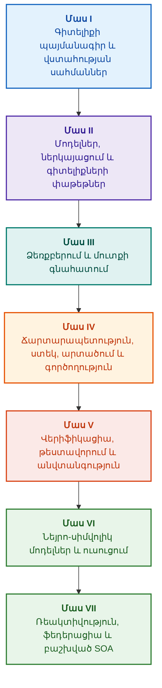

# Ապացուցահեն փորձագիտական համակարգերի ճարտարապետություն․ ֆորմալ օնթոլոգիաներից մինչև նեյրո-սիմվոլիկ արհեստական բանականություն

**Ինժեներական մենագրություն և տեղեկատու բարձր վստահելիության ինտելեկտուալ համակարգերի նախագծման, մաթեմատիկական հիմունքների, ճարտարապետության և վերիֆիկացիայի մասին (Safety-Critical & Evidence-Grounded AI)**

**Հեղինակ՝** [Mykola Fedchyk](../../about-the-author.md) · [LinkedIn](https://www.linkedin.com/in/nickfedchik/)  
**Ձևաչափ՝** Ինժեներական մենագրություն / AI ճարտարապետի ուղեցույց  
**Տարեթիվ՝** 2026  

---

## Գրքի մասին

Սույն մենագրությունը հիմնարար հետազոտական աշխատություն և ինժեներական ուղեցույց է, որը նվիրված է ժամանակակից արհեստական բանականության գլխավոր ճգնաժամի հաղթահարմանը՝ նեյրոնային ցանցերի հավանականային հավաստիության և ֆորմալ մաթեմատիկական ապացույցների դետերմինացված ճշմարտության միջև առկա իմացաբանական (էպիստեմիկ) անդունդին։ Հետազոտության կիզակետում դրված է հետևյալ հարցը․ **ինչպե՞ս նախագծել փորձագիտական համակարգ, որի յուրաքանչյուր եզրակացություն կլինի անհերքելի, ամբողջությամբ հետագծելի մինչև առաջնային ապացույցների աղբյուրները և ենթակա սերտիֆիկացման անվտանգության համար կրիտիկական ինժեներական ոլորտներում (ISO 26262, IEC 61508, DO-178C, ISO/SAE 21434)։**

Հեղինակը հիմնավորում և ներդնում է նոր հարացույց՝ **ապացուցահեն նեյրո-սիմվոլիկ AI (Evidence-Grounded Neuro-Symbolic AI)**, որտեղ վիճակագրական մոդելները (LLM/SLM) կատարում են հիպոթեզների առաջադրման և պրոյեկցիոն արտապատկերման խորհրդատվական գործառույթ, իսկ դետերմինացված սիմվոլիկ միջուկն անխախտորեն երաշխավորում է տրամաբանական անհակասականության, բայթերի մակարդակով փաստերի ամրագրման, լիազորությունների սահմանների պահպանման և գործողությանն անվտանգ անցման ինվարիանտները։

### Արտեֆակտից մինչև ստուգելի որոշում

Համակարգային պահանջները, ելակետային կոդը, փորձարկումների մատյանները, նորմատիվային ստանդարտներն ու ինժեներական որոշումներն այսօր ժամանակակից արտադրական միջավայրի անբաժան մասն են։ Այդուհանդերձ, դրանք մեծ մասամբ գործում են որպես առանձնացված արտեֆակտներ՝ զուրկ ֆորմալացված իմաստաբանությունից, հստակ վավերականության սահմաններից և փոխադարձ հետագծելիությունից։ Որակավորման հաջողված փորձարկման հաշվետվությունը կարող է հղվել ապարատային հանգույցի հնացած տարբերակին, ֆունկցիոնալ անվտանգության ստանդարտից մեջբերումը կարող է կտրված լինել համատեքստից, իսկ կոնֆիգուրացիայի վթարային հետգլորումը կարող է չարտոնված կերպով ակտիվացնել չեղարկված բաղադրիչ։

Մենագրությունն առաջարկում է ամբողջական ինժեներական տրակտ՝ ինժեներական արտեֆակտների տիպայնացված տվյալների և կրիպտոգրաֆիկորեն ստորագրված գիտելիքների փաթեթների ֆորմալացումից մինչև սիմվոլիկ տրամաբանական արտածում, պլանների փուլային ապակոմպոզիցիա, հակափաստացի բացատրություններ և իրավասության սահմանների աուդիտ։ Գործնական շարադրանքն ուղեկցվում է Go լեզվով իրականացված արտադրական մակարդակի մոդուլներով և ամբողջական թեստային փաթեթներով ([Գլուխ 1](../../ch01-introduction-to-expert-systems.md)), խիստ մաթեմատիկական պայմանագրերով ([Մաս II](../../part-02-knowledge-models.md)) և անընդհատ ուսուցման արձանագրություններով, որոնք ապացուցելիորեն բացառում են ռեգրեսիաները ([Գլուխ 25](../../ch25-how-expert-systems-learn.md))։

### Ում համար է նախատեսված մենագրությունը

Հրատարակությունը հասցեագրված է համակարգային ճարտարապետներին, հուսալիության և ֆունկցիոնալ անվտանգության առաջատար ինժեներներին, տրամաբանական արտածման շարժիչների մշակողներին և գիտելիքների ինժեներներին։ Հիմնական հասկացությունների յուրացման համար բավարար է առաջին կարգի պրեդիկատների տրամաբանության, ծրագրային ապահովման տարբերակման և կենսական ցիկլի բազային իմացությունը. գործնական օրինակների տեղակայման համար անհրաժեշտ է Go-ի ստանդարտ գործիքակազմ։ Մասնագիտացված գլուխները, որոնք նվիրված են Goal Structuring Notation (GSN) անվտանգության հիմնավորումների ֆորմալ սինթեզին, բարդ համակարգերի սիներգետիկային, նեյրոմորֆիկ արագացուցիչներին և առանց GNSS-ի ինքնավար նավիգացիային, բացահայտում են ապացուցահեն AI-ի առաջատար սահմանները ռազմավարական բարձրտեխնոլոգիական ոլորտներում (ավիատիեզերական արդյունաբերություն, ինքնավար տրանսպորտ, էներգետիկա)։

---

## Գիտական համատեքստը և մենագրության տեղը համաշխարհային հետազոտություններում

Մենագրությունը փորձագիտական համակարգերը դիտարկում է ոչ թե որպես 1980-ականների կանոնների համակարգերի հնացած ժառանգություն (ինչպիսիք են CLIPS-ը կամ MYCIN-ը), այլ որպես **երրորդ ալիքի ապացուցահեն նեյրո-սիմվոլիկ AI-ի (Third-Wave Evidence-Grounded Neuro-Symbolic AI)** առաջապահ։ Աշխատանքը հենվում է աշխարհի առաջատար գիտական դպրոցների տեսական հիմքի վրա՝ միաժամանակ հաղթահարելով ճեղքվածքը վերացական մաթեմատիկական մոդելների և բարձր արտադրողականությամբ համակարգային ինժեներիայի միջև․

| Գիտական ուղղություն | Հիմնական համաշխարհային աշխատություններ և հեղինակներ | Հայեցակարգային կամուրջը գրքում |
|---|---|---|
| **Երրորդ ալիքի նեյրո-սիմվոլիկ AI (NeSy)** | Artur d'Avila Garcez, Luis C. Lamb (*Neurosymbolic AI: The 3rd Wave*, 2023; *Neural-Symbolic Cognitive Reasoning*, Springer, 2009); Henry Kautz (*The Third AI Summer*, AAAI 2022) | Պարտականությունների բաժանում․ վիճակագրական մոդելները (SLM/LLM) գեներացնում են հարցման հիպոթեզներ, իսկ դետերմինացված սիմվոլիկ միջուկը ստուգում և հաստատում է փաստերը ([Գլուխ 29](../../ch29-neuro-symbolic-architecture.md))։ |
| **Սեմանտիկ սահմանափակումներ և անվտանգ ուսուցում** | Guy Van den Broeck et al. (*A Semantic Loss Function for Deep Learning with Symbolic Knowledge*, ICML 2018); Luc De Raedt et al. (*DeepProbLog*, IJCAI 2020) | Մուտքային և ելքային վերահսկողության դարպասներ, նեյրոնային ցանցի առաջարկների դետերմինացված սեմանտիկ զտում ֆորմալ սխեմաներով ([Գլուխներ 28](../../ch28-dual-mode-expert-systems.md), [33](../../ch33-inter-system-knowledge-exchange-and-model-teaching.md))։ |
| **Հերքելի տրամաբանություն և արգումենտացիայի տեսություն** | John L. Pollock (*Defeasible Reasoning*, 1987; *Cognitive Carpentry*, MIT Press, 1995); Phan Minh Dung (*Abstract Argumentation Frameworks*, AIJ 1995); Douglas Walton (*Argumentation Schemes*, Cambridge, 2008) | Գիտելիքի բաժանում պնդումների, ծագման և հերքող հանգամանքների (*rebutting* և *undercutting defeaters*)․ կոնֆլիկտների լուծում նորմատիվ բազաներում Դունգի արգումենտացիոն շրջանակներով ([Գլուխներ 2](../../ch02-epistemology-of-machine-knowledge.md), [27](../../ch27-safety-case-gsn-synthesis.md))։ |
| **Ասոցիատիվ կանոնների ինքնավար մայնինգ (KBC)** | Luis Galárraga, Fabian M. Suchanek et al. (*AMIE: Association Rule Mining under Incomplete Evidence*, WWW 2013, VLDBJ 2015); Stephen Muggleton (*Inductive Logic Programming*, 1994) | Կանոնների ավտոմատ արդյունահանում գիտելիքների բազաներից մասնակի ամբողջականության ենթադրությամբ (PCA)՝ բաց աշխարհի կեղծ հակաօրինակների բացառմամբ ([Գլուխ 34](../../ch34-deterministic-relational-analysis-abduction-and-socratic-dialogue.md))։ |
| **Անվտանգության ֆորմալ վահաններ և սերտիֆիկացում (Safe AI)** | Bettina Könighofer, Roderick Bloem et al. (*Shield Synthesis*, 2017); Tim Kelly, Rob Weaver (*Goal Structuring Notation*, York, 2004); André Platzer (*Logical Foundations of CPS*, Springer, 2018) | Անվտանգության հիմնավորումների սինթեզ GSN նոտացիայով ISO 26262/21434 ստանդարտների համար․ ֆորմալ վահաններ և թվային վավերականության ծրարներ պերիֆերիկ ակտուատորների համար ([Գլուխներ 27](../../ch27-safety-case-gsn-synthesis.md), [30](../../ch30-safety-cybersecurity-co-engineering.md), [33](../../ch33-inter-system-knowledge-exchange-and-model-teaching.md))։ |
| **Էպիստեմիկ տրամաբանություն և գիտելիքի սեմիոտիկա** | John F. Sowa (*Knowledge Representation: Logical, Philosophical, and Computational Foundations*, 2000); Frank van Harmelen et al. (*Handbook of Knowledge Representation*, Elsevier, 2008) | Չարլզ Սանդերս Պիրսի էպիստեմիկ տրիադան (Հասկացություն → Դատողություն → Եզրահանգում)․ աշխատանքային հիպոթեզների աբդուկտիվ արտածում խիստ դեդուկտիվ վերահսկողության ներքո ([Գլուխներ 6](../../ch06-applied-mathematics-for-expert-systems.md), [34](../../ch34-deterministic-relational-analysis-abduction-and-socratic-dialogue.md))։ |
| **Կիբեռնետիկա և բարդ համակարգերի սիներգետիկա** | Norbert Wiener (*Cybernetics*, 1948); W. Ross Ashby (*An Introduction to Cybernetics*, 1956); Hermann Haken (*Synergetics: An Introduction*, 1977; *Advanced Synergetics*, 1983); Ilya Prigogine (*Order out of Chaos*, 1984) | Էշբիի անհրաժեշտ բազմազանության օրենքը, L0–L4 փակ կառավարման ցիկլերը, փուլային տարածության ռեդուկցիան կարգի պարամետրերին Հակենի ենթարկման սկզբունքով, ֆազային անցումների վաղ կանխատեսումը կրիտիկական դանդաղեցմամբ (CSD) և գիտելիքների բազաների դիսիպատիվ կայունացումը ([Գլուխներ 6](../../ch06-applied-mathematics-for-expert-systems.md), [22](../../ch22-cybernetics-edge-to-backend.md), [35](../../ch35-self-organizing-expert-systems-synergetics-and-npu-runtime.md))։ |
| **Գիտելիքի թեստավորում, լեզվական ինվարիանտություն և Լիպշիցյան տրամաչափարկում** | Kent Beck (*TDD*, 2002); Martin Fowler (*Refactoring*, 2018); Clark Barrett, Leonardo de Moura (*Z3 SMT Solver*, 2008); Chuan Guo et al. (*On Calibration of Modern Neural Networks*, ICML 2017); Marco Tulio Ribeiro et al. (*CheckList*, ACL 2020); John L. Pollock (*Defeasible Reasoning*, 1987) | Գիտելիքի թեստավորման քառամակարդակ բուրգ (KTP)․ ատոմների մեկուսացված թեստավորում (KUT) նախադրյալների մոկերով (`PremiseMock`), վակուումային ճշմարտության թակարդի արգելափակում, 6-կետանոց սպեկտրալ BVA, կանոնների ցանցեր և դեֆիտերներ (KIT), սեմանտիկ ինվարիանտության ցուցանիշ ($\text{SIS} \ge 0{,}98$) հարցման լեզվական վարիացիաների նկատմամբ, Լիպշիցյան անընդհատություն ($L_{\mathcal{K}} \le L_{\max}$) ռելեային տատանումների դեմ և գիտելիքների բազայի բացերի ստիգմերգիկ կուտակում ([Գլուխ 36](../../ch36-knowledge-testing-pyramid-and-variational-calibration.md))։ |

---

## Հեղինակային տեսական մոդելներ, գիտական հետազոտություններ և ինժեներական նորարարություններ

Մենագրությունն ամփոփում է հեղինակի հիմնարար հետազոտական և ինժեներական ձեռքբերումները բարձր հուսալիության համակարգերի նախագծման, ներկառուցված ճարտարապետությունների և ապացուցահեն AI-ի ոլորտում։ Ի տարբերություն զուտ ակնարկային աշխատությունների՝ գրքում մշակված են մի շարք ինքնատիպ ֆորմալ տեսություններ, արձանագրություններ և համակարգային լուծումներ, որոնք նեյրո-սիմվոլիկ փոխազդեցությունները բարձրացնում են մաթեմատիկորեն ստուգված վստահելիության մակարդակի․

### 1. Հիմնարար տեսական մշակումներ և մաթեմատիկական ֆորմալիզմներ

1. **Բայթային ապացուցելիության ինվարիանտ (EGI) և փաստերի հիմնավորման դարպաս ([Գլուխներ 2](../../ch02-epistemology-of-machine-knowledge.md), [19](../../ch19-from-question-to-evidence.md), [28](../../ch28-dual-mode-expert-systems.md), [29](../../ch29-neuro-symbolic-architecture.md)):**
   * *Տեսական հայեցակարգ՝* Հեղինակը ձևակերպել և մաթեմատիկորեն ֆորմալացրել է հիմնավորման ամբողջականության ինվարիանտը՝ $\mathrm{Comp}(C) = 1{,}00$, որը պնդում է, որ ապացուցահեն համակարգում ոչ մի պնդում չի կարող ստանալ փաստի կարգավիճակ առանց գիտելիքի առաջնաղբյուրների վրա դետերմինացված պրոյեկցիայի։ Փաստերի բազայի յուրաքանչյուր տարր ապահովվում է կրիպտոգրաֆիկ կորտեժով՝ անփոփոխ կոորդինատներով `[byte_start, byte_end]`, կանոնիկ հատվածի հեշով `quote_sha256` և PROV-O ծագման սերտիֆիկատի նույնացուցիչով։
   * *Ինժեներական նշանակություն՝* Բայթային հսկիչ-անցագրային դարպասի մեխանիզմն ապարատածրագրային մակարդակում անհնարին է դարձնում նեյրոնային ցանցի հալյուցինացիաների ներթափանցումը տարբերակված գիտելիքների բազա՝ ապահովելով զրոյական հանդուրժողականություն չհաստատված տվյալների նկատմամբ ($ZHR = 1{,}00$)։
2. **Գիտելիքի թեստավորման քառամակարդակ բուրգ (KTP) և տրամաբանական տարածության Լիպշիցյան կայունություն ([Գլուխ 36](../../ch36-knowledge-testing-pyramid-and-variational-calibration.md)):**
   * *Տեսական հայեցակարգ՝* Հեղինակն առաջին անգամ առաջարկել է գիտելիքի թեստավորման համակարգային բուրգը (Knowledge Testing Pyramid, KTP), որը նման է Մարտին Ֆաուլերի ծրագրային ապահովման թեստավորման բուրգին՝ առանձին կանոնների մոդուլային թեստավորում (KUT) նախադրյալների մեկուսացմամբ (`PremiseMock`), կանոնների փոխազդեցության ինտեգրացիոն թեստավորում (KIT) և վարիացիոն տրամաչափարկում ձևակերպումների բազմաձևության վրա (KVT)։
   * *Մաթեմատիկական ապարատ՝* Ներդրվել է վակուումային ճշմարտության արգելափակման անխախտ ինվարիանտը ($P \to Q$, երբ $P \equiv \text{False}$), սեմանտիկ ինվարիանտության ցուցանիշը ($\mathrm{SIS} \ge 0{,}98$) հարցման լեզվական վարիացիաների դեպքում և տրամաբանական տարածության Լիպշիցյան անընդհատության չափանիշը ($L_{\mathcal{K}} \le L_{\max}$), որը մաթեմատիկորեն բացառում է եզրակացությունների աղետալի ռելեային տատանումը մուտքի չնչին տատանումների ժամանակ։
3. **Դեոնտիկ նորմերի պոպերյան ֆալսիֆիկացիայի տեսություն և համապատասխանության ակտիվ աուդիտոր ([Գլուխ 39](../../ch39-active-compliance-auditor-and-popperian-testing.md)):**
   * *Տեսական հայեցակարգ՝* Իրականացվել է անցում «պասիվ պատգամախոսի» դասական մոդելից (որը միայն պատասխանում է հարցերին) դեպի գիտելիքի ակտիվ աուդիտորի հարացույց, որն իրականացնում է Կառլ Պոպերի ֆալսիֆիկացիայի սկզբունքը։ Համակարգն ինքնուրույն իրականացնում է պահանջների տարածության ռեֆլեքսիվ զոնդավորում (ASPICE 4.0, ISO 26262, ISO/SAE 21434), սինթեզում է հակաօրինակներ, հայտնաբերում թերի սպեցիֆիկացիաներ և ինքնավար նախագծում արտադրանքի փորձարկումների սպառիչ ծրագիր։
   * *Գործնական արժեք՝* Նեյրոնային ցանցի միջոցով եզրային սցենարների կրեատիվ գեներացման (System 1) և սիմվոլիկ միջուկով դետերմինացված դեոնտիկ վերիֆիկացիայի (System 2) համադրում՝ կառավարման ցիկլում գտնվող մարդու (Human-in-the-Loop) երաշխավորված պաշտպանությամբ ճանաչողական հոգնածությունից։
4. **Գիտելիքների բազայի չափողականության սիներգետիկ ռեդուկցիա և CSD նախաբիֆուրկացիոն ախտորոշում ([Գլուխներ 6](../../ch06-applied-mathematics-for-expert-systems.md), [22](../../ch22-cybernetics-edge-to-backend.md), [35](../../ch35-self-organizing-expert-systems-synergetics-and-npu-runtime.md)):**
   * *Տեսական հայեցակարգ՝* Հերման Հակենի սիներգետիկայի մաթեմատիկական ապարատի (կարգի պարամետրեր և ենթարկման սկզբունք) և Իլյա Պրիգոժինի դիսիպատիվ կառույցների տեսության կիրառումը բարդ գիտելիքների բազաների էվոլյուցիայի նկատմամբ։
   * *Գիտական արդյունք՝* Մշակվել է տելեմետրիայի բազմաչափ փուլային տարածության ռեդուկցիայի մեթոդ մինչև կարգի պարամետրեր և ինտեգրվել կրիտիկական դանդաղեցման (*Critical Slowing Down*, CSD) նախաբիֆուրկացիոն դետեկտոր ավտոկորելացիայի և դիսպերսիայի հիման վրա, ինչը թույլ է տալիս բացահայտել կիբեռֆիզիկական համակարգի մոտեցումը դինամիկ խափանմանը վթարային շեմային տվիչների գործարկումից շատ առաջ։
5. **Գործողության ինքնավարության մակարդակների մոդել (A0–A4), հսկիչ-անցագրային դարպաս և իդեմպոտենտ սագաներ ([Գլուխ 21](../../ch21-from-recommendation-to-action.md)):**
   * *Տեսական հայեցակարգ՝* Հեղինակը ձևակերպել է համակարգային գործողության լիազորությունների դիսկրետ սանդղակ (A0՝ պասիվ վերլուծություն, A1՝ սևագրի նախապատրաստում, A2՝ գործողություն մարդու ստորագրությամբ, A3՝ վերահսկվող ինքնավարություն, A4՝ վթարային պաշտպանիչ անջատում), որը վերագրվում է ոչ թե համակարգին ամբողջությամբ, այլ «գործողություն, միջավայր, ռիսկի մակարդակ» կորտեժին։
   * *Մաթեմատիկական ապարատ՝* Ներդրվել է իդեմպոտենտության հանրահաշվական ինվարիանտը՝ $f(f(x, k), k) \equiv f(x, k)$ կրիպտոգրաֆիկ բանալու $k$ հիման վրա, փուլային փակ կատարումը (closed-loop execution) և `OutcomeUnknown` վիճակով բաշխված փոխհատուցման սագաների արձանագրությունը՝ հետպայմանների անկախ վերիֆիկացմամբ։
6. **Ֆունկցիոնալ անվտանգության և կիբեռանվտանգության ֆորմալ համատեղ ինժեներիա GSN նոտացիայում ([Գլուխներ 27](../../ch27-safety-case-gsn-synthesis.md), [30](../../ch30-safety-cybersecurity-co-engineering.md)):**
   * *Տեսական հայեցակարգ՝* Մշակվել է GSN (Goal Structuring Notation) արգումենտացիոն ծառերի ներդաշնակ սինթեզի մոդել՝ ISO 26262 (ֆունկցիոնալ անվտանգություն) և ISO/SAE 21434 (կիբեռանվտանգություն) ստանդարտների պահանջների միաժամանակյա լուծման համար։
   * *Ինժեներական առաջընթաց՝* Հակասական նպատակների միջև մաթեմատիկական արբիտրաժի ֆորմալացում (վթարային արձագանքման ժամանակային բյուջեն ընդդեմ կրիպտոգրաֆիկ ատեստացիայի խորության) և ապացույցների ընտրովի բացահայտման արձանագրություն արտաքին աուդիտորներին աղ ավելացված Մերկլի ծառերի միջոցով։
7. **Բացատրությունների հավատարմության և սեմանտիկ կոնսիստենտության վերիֆիկացիայի արձանագրություն ([Գլուխ 20](../../ch20-explanation-engine.md)):**
   * *Տեսական հայեցակարգ՝* Բացատրությունը դիտարկվում է ոչ թե որպես գեներատիվ մոդելի ազատ տեքստ, այլ որպես ինքնուրույն դետերմինացված արտեֆակտ, որը միարժեքորեն արտածվում է ապացուցման գրաֆից, կանոնների տարբերակից և փաստերի ֆիքսված կտրվածքից։
   * *Մաթեմատիկական ապարատ՝* Ֆորմալացվել է հավատարմության գնահատման մետրիկ դարպասը ($C_{\text{facts}} = 1{,}00, H_{\text{free}} = 1{,}00$)՝ դեպի կոշտ շաբլոն ավտոմատ fail-safe հետգլորմամբ՝ սիմվոլիկ եզրակացության և օպերատորի համար վերբալիզացիայի միջև նվազագույն անհամապատասխանության դեպքում։

---

### 2. Էմպիրիկ հետազոտություններ, հեղինակային փորձարարական ստենդեր և համակարգային ինժեներիա

1. **Անփոփոխ բինար գիտելիքների փաթեթներ `mmap`-ով և զրոյական դեսերիալիզացիայով ([Գլուխ 32](../../ch32-high-performance-knowledge-packs-mmap-and-harvesting.md)):**
   * *Հեղինակային գյուտ՝* Փաթեթների երկմակարդակ ճարտարապետություն (առաջնաղբյուրների կանոնիկ շերտ + ինդեքսների ածանցյալ մատերիալիզացված շերտ)։
   * *Էմպիրիկ արդյունք՝* Ինդեքսի ուղիղ արտապատկերում վիրտուալ հասցեական տարածություն `mmap` համակարգային կանչի միջոցով, դինամիկ հիշողության հատկացման վերադիր ծախսերի վերացում (zero-allocation) և շարժիչի մեկնարկ ենթագծային ժամանակում՝ անկախ օնթոլոգիայի գիգաբայթային ծավալից։
2. **Էմպիրիկ տրամաչափարկման պոլիգոն IETF RFC-1000 և W3C-150 նորմատիվային կորպուսների վրա ([Գլուխներ 2](../../ch02-epistemology-of-machine-knowledge.md), [4](../../ch04-evolution-from-bayes-to-evidence-ai.md), [14](../../ch14-requirements-detection-and-formalization.md), [25](../../ch25-how-expert-systems-learn.md)):**
   * *Հեղինակային փորձարկում՝* Լայնածավալ հետազոտական ստենդի տեղակայում IETF RFC 1000 գործող սպեցիֆիկացիաների (բաշխված ըստ Ինտերնետի զարգացման 5 ժամանակագրական դարաշրջանների) և W3C կորպուսի 150 բարդ ախտորոշիչ հարցումների հիման վրա (ներառյալ տրամաբանական հակասությունների և կոնֆաբուլյացիաների արհեստական ինդուկցիան)։
   * *Գործնական արդյունք՝* Գիտելիքի օբյեկտիվ քննական մատրիցաների կառուցում, նորմատիվային հակասությունների բացահայտում և գիտելիքների բազայի թարմացման ժամանակ ռեգրեսիաներից մաթեմատիկորեն ապացուցված պաշտպանություն։
3. **Բազմաքայլ ռելյացիոն վերլուծություն, սիմվոլիկ աբդուկցիա և սոկրատեսյան երկխոսություն ([Գլուխ 34](../../ch34-deterministic-relational-analysis-abduction-and-socratic-dialogue.md)):**
   * *Հեղինակային մշակում՝* Կապերի երկկողմանի սահմանափակ որոնման ալգորիթմ (Bidirectional Bounded BFS, $k \le 6$) ցիկլերից պաշտպանությամբ և կամայական փոխկապակցված էությունների համար ապացույցների կոմպոզիտային բայթային շղթաների ձևավորմամբ։
   * *Ինժեներական առավելություն՝* Պիրսի սիմվոլիկ աբդուկցիայի իրականացում խիստ դեդուկտիվ վերահսկողության ներքո և ճշգրտման տիպայնացված սոկրատեսյան ֆրեյմեր (*Clarification Frames*), որոնք համակարգը փոխադրում են մարդու հետ արդյունավետ երկխոսության ռեժիմի՝ փակ աշխարհի ենթադրությամբ (CWA) կույր մերժման փոխարեն։
4. **Ֆորմալ վահաններ և թվային վավերականության ծրարներ կառավարման պերիֆերիկ համակարգերի համար ([Գլուխ 33](../../ch33-inter-system-knowledge-exchange-and-model-teaching.md), [Հավելվածներ Բ](../../appendix-b-robotics-and-cyber-physical-systems.md), [Գ](../../appendix-c-autonomous-navigation-and-geosearch.md), [Ե](../../appendix-e-mixed-signal-neuromorphic-expert-systems.md)):**
   * *Հեղինակային գյուտ՝* Դիսկրետ տրամաբանական ինվարիանտները թվային ազդանշանային պրոցեսորների (DSP) և առանց GNSS-ի ինքնավար նավիգացիոն համակարգերի (TRN/DSMAC/VIO) համար անվտանգության անընդհատ թվային միջանցքների թարգմանելու մեթոդաբանություն։
   * *Գործնական հուսալիություն՝* Կանոնների ստորագրված փոխանակում Ed25519 կրիպտոգրաֆիայի հիման վրա, թեկնածու գիտելիքների պաշտպանված կարանտին և ապարատային մակարդակում վտանգավոր կառավարող ազդեցությունների անջատում։
5. **Գաղտնի տեղեկատվության արտահոսքից պաշտպանություն բացատրությունների միջոցով և դիֆերենցիալ աուդիտ ([Գլուխ 20](../../ch20-explanation-engine.md)):**
   * *Հեղինակային մշակում՝* Բացատրության միջանկյալ ներկայացման ռեդուկցիայի արձանագրություն ($\mathrm{EIR}_{\text{redacted}}$) ապացուցման գրաֆի յուրաքանչյուր հանգույցի և կողի համար ACL-ի ստուգմամբ, ինչն արգելափակում է մոդելների վերականգնման հարձակումների կողմնակի ալիքները WHY NOT կոնտրաստային հարցումների շարքի միջոցով։

---

## Խմբավորման սկզբունքը

Գրքի մասերը սահմանվում են հիմնական ինժեներական խնդրով, ոչ թե գլխի ավելացման տարեթվով կամ տեխնոլոգիայի անվանմամբ։ Յուրաքանչյուր գլուխ ունի մեկ հիմնական մաս. հարակից մեթոդները բացատրում են դրա գլխավոր հարցի լուծման եղանակը։ Գլուխների համարները և ֆայլերի անունները մնում են հաստատուն նույնացուցիչներ, ուստի ընթերցման թեմատիկ կարգը կարող է տարբերվել թվայինից։

Գլուխների ներսում բաժինների անվանումները ձևավորում են մի քանի տարբեր դասեր։ Դրանք պետք է կարդալ որպես փաստարկների հաջորդականություն, այլ ոչ թե որպես համազոր տեխնոլոգիաների ցանկ․

| Բաժնի դաս | Ընթերցողի հարցը | Գործառույթը գլխում |
|---|---|---|
| Խնդիրը և առաջադրանքի սահմանը | Ի՞նչ է կոնկրետ անհրաժեշտ լուծել | Սահմանել գլխավոր հարցը և կիրառման ոլորտը |
| Օբյեկտը և մոդելը | Ի՞նչ տվյալներ, գիտելիք կամ վիճակներ են դիտարկվում | Համաձայնեցնել հասկացությունները, տիպերը և ենթադրությունները |
| Մեթոդը և ընթացակարգը | Ինչպե՞ս ստանալ արդյունքը | Բացատրել արտածումը, փոխակերպումը կամ կառավարումը |
| Իրականացումը և գործիքը | Ինչո՞վ կատարել ընթացակարգը | Ցույց տալ մեթոդի ծրագրային կամ ապարատային մարմնավորումը |
| Ստուգումը և վերահսկիչ դեպքը | Ինչպե՞ս հայտնաբերել սխալը | Համադրել արդյունքն անկախ չափանիշի հետ |
| Եզրակացությունը և արդյունքի սահմանները | Ի՞նչ է հաստատված, և ի՞նչն է մնացել բաց | Պատասխանել գլխավոր հարցին՝ առանց խոստումների ընդլայնման |

Երկիրը, ոլորտը կամ կոմերցիոն արտադրանքը կիրառման համատեքստ են, այլ ոչ թե այս տաքսոնոմիայի առանձին մակարդակ։ Բառարանը, հապավումները, աղբյուրներն ու նավիգացիան կազմում են տեղեկատու ապարատը, այլ ոչ թե գլխի ինքնուրույն թեմաներ։

Ամբողջական խմբագրական քարտեզը պարունակում է յուրաքանչյուր գլխի գլխավոր թեմայի գնահատականը, հարակից շարադրանքների միջև սահմանները և դիտողություններ կոմպոզիցիայի ու եզրակացությունների վերաբերյալ։ Նոր անոտացիան չի նշանակում, որ գլուխների ներսում բովանդակային բոլոր ռիսկերն արդեն վերացված են։

## Ընթերցման երթուղիներ

**Առաջին ծրագրային ստուգում՝** [1](../../ch01-introduction-to-expert-systems.md) → [7](../../ch07-knowledge-base-typology.md) → [8](../../ch08-engineering-artifacts-as-data.md) → [17](../../ch17-implementation-stack.md) → [23](../../ch23-knowledge-base-verification.md) → [25](../../ch25-how-expert-systems-learn.md)։ Նպատակը՝ վերարտադրելի դատավճիռ հիմնավորումներով, նեգատիվ թեստերով և գիտելիքի կառավարվող փոփոխությամբ։ Լեզվական մոդելը պարտադիր չէ։

**Գիտելիքների ինժեներիա՝** [Մաս II](../../part-02-knowledge-models.md) → [Մաս III](../../part-03-knowledge-engineering-nlp.md) → [19](../../ch19-from-question-to-evidence.md) → [20](../../ch20-explanation-engine.md) → [26](../../ch26-continual-learning.md)։ Նպատակը՝ համաձայնեցնել սեմանտիկան, ծագումը, գիտելիքի ստացումը և նոր թեկնածուների ստուգումը։ Մաս II-ում պահպանված է 7–11 գլուխների գիտական փորձարկման միջմասային ծրագիրը։

**Լուծման ճարտարապետություն՝** [16](../../ch16-expert-systems-architecture.md) → [19](../../ch19-from-question-to-evidence.md) → [31](../../ch31-syllogistic-reasoning-and-relation-lattices.md) → [20](../../ch20-explanation-engine.md) → [21](../../ch21-from-recommendation-to-action.md)։ Նպատակը՝ տարանջատել հիմքերի ստուգումը, նորմայի կիրառումը, բացատրությունը և գործողության լիազորությունները։

**Ստուգում և անվտանգություն՝** [23](../../ch23-knowledge-base-verification.md) → [36](../../ch36-knowledge-testing-pyramid-and-variational-calibration.md) → [25](../../ch25-how-expert-systems-learn.md) → [26](../../ch26-continual-learning.md) → [27](../../ch27-safety-case-gsn-synthesis.md) → [30](../../ch30-safety-cybersecurity-co-engineering.md)։ Արտաքին օբյեկտի ախտորոշումն ունի առանձին մուտք [24 գլխի](../../ch24-system-diagnosis.md) միջոցով։

**Հիբրիդային պատասխաններ և շահագործում՝** [Մաս VI](../../part-06-frontiers-neuro-symbolic.md) → [Մաս VII](../../part-07-runtime-and-knowledge-exchange.md) → [40](../../ch40-distributed-epistemic-architectures-soa-and-cluster-scaling.md) և անհրաժեշտ հավելվածներ։ Նպատակը՝ ինտեգրել լեզվական մոդելը, կառավարել բացերը, կառուցել գիտելիքի ծառայությունների ռեֆերենս բաշխված ճարտարապետությունը և ստուգել միջհամակարգային փոխանակումը։ [2](../../ch02-epistemology-of-machine-knowledge.md), [4](../../ch04-evolution-from-bayes-to-evidence-ai.md) և [6](../../ch06-applied-mathematics-for-expert-systems.md) գլուխները կարելի է կարդալ ըստ հարցի՝ որպես պայմանագիր, պատմություն և մաթեմատիկական տեղեկատու։

---

## Խոստումների սահմանները

Գիրքն ուսումնական և հետազոտական նյութ է, ոչ թե սերտիֆիկացված ընթացակարգ և ոչ էլ ստանդարտին արտադրանքի համապատասխանության ապացույց։ Դետերմինացված կատարումը չի ապացուցում փաստերի ճշտությունը. հեշն ու ստորագրությունը չեն ապացուցում ճշմարտացիությունը. արգումենտների գրաֆը չի փոխարինում մասնագետի գնահատականին։ Ամբողջ արտադրանքի հուսալիության պահանջները չպետք է նույնացվեն լեզվական մոդելի սխալների հաճախականության հետ կամ վերագրվեն բոլոր ծրագրային բաղադրիչներին։

Ավտոմատ վերլուծությունը նվազեցնում է տվյալների ձեռքով տեղափոխումը, բայց չի չեղարկում մոդելավորումը, գրախոսումն ու գիտելիքի տերերին։ Protégé-ն, ձեռքով դիտարկումն ու ավտոմատ հավաքագրումը կարող են աշխատել միասին։ Մաթեմատիկական երաշխիքները վերաբերում են լեզվի կոնկրետ պրոֆիլին և ենթադրություններին. չափված արագությունը վերաբերում է տրված հարցմանը, կորպուսին և միջավայրին։ Հեղինակի արխիվային թվերը տարանջատված են բաց ուսումնական ստենդերից և դեռևս չիրականացված հետազոտություններից։

Թողարկման, ռիսկի ընդունման և ոլորտային պահանջներին համապատասխանության որոշումները մնում են լիազորված մարդկանց իրավասության ներքո։ Փորձագիտական համակարգը պատրաստում է ստուգելի նյութ և իրականացնում համաձայնեցված քաղաքականություն, բայց չի ձեռք բերում կարգավորիչ լիազորություններ։

---

## Գրքի կառուցվածքը

Գիրքը բաղկացած է յոթ թեմատիկ մասից, 40 գլխից և հինգ հավելվածից։ Յուրաքանչյուր գլուխ ունի մեկ հիմնական մաս։ Նավիգացիայում նախորդ և հաջորդ գլուխները համապատասխանում են ստորև բերված թեմատիկ կարգին. գլուխների համարները և ֆայլերի անունները պահպանված են։

---

### [Մաս I. Հայեցակարգային և էպիստեմիկ հիմք](../../part-01-foundations.md)

*Երբ է անհրաժեշտ փորձագիտական համակարգը, ինչը համարել գիտելիք և ինչպես պահպանել կազմակերպչական որոշման հիմքերը:*

* [Գլուխ 1. Ներածություն փորձագիտական համակարգերին․ քաոսից մինչև կառավարվող գիտելիք](../../ch01-introduction-to-expert-systems.md)
* [Գլուխ 2. Փիլիսոփայություն ինժեների համար․ ինչը մեքենան իրավունք ունի անվանել գիտելիք](../../ch02-epistemology-of-machine-knowledge.md)
* [Գլուխ 3. Ինչո՞վ է փորձագիտական համակարգը տարբերվում տեղեկատվական-տեղեկատու համակարգից](../../ch03-beyond-reference-information-systems.md)
* [Գլուխ 4. Փորձագիտական համակարգերի էվոլյուցիան․ Բայեսի թեորեմից մինչև ապացուցահեն AI լուծումներ](../../ch04-evolution-from-bayes-to-evidence-ai.md)
* [Գլուխ 5. Վստահության տրիադան․ փորձագիտական համակարգ, ապացուցահեն հանձնարարական և կորպորատիվ հիշողություն](../../ch05-triad-of-trust-and-corporate-memory.md)

---

### [Մաս II. Մաթեմատիկական մոդելներ, գիտելիքի ներկայացում և պահպանում](../../part-02-knowledge-models.md)

*Մաթեմատիկական գործողության և ներկայացման ընտրություն, տիպայնացված արտեֆակտներ, հետագծելիության գրաֆ և անփոփոխ գիտելիքների փաթեթ:*

* [Գլուխ 6. Փորձագիտական համակարգերի կիրառական մաթեմատիկա․ կանոններ, հավանականություններ, գրաֆներ և պատճառականություն](../../ch06-applied-mathematics-for-expert-systems.md)
* [Գլուխ 7. Գիտելիքների բազաների տիպաբանություն․ կանոններ, օնթոլոգիաներ, նախադեպեր և վեկտորներ](../../ch07-knowledge-base-typology.md)
* [Գլուխ 8. Ինժեներական արտեֆակտները որպես փորձագիտական համակարգի տվյալներ](../../ch08-engineering-artifacts-as-data.md)
* [Գլուխ 9. Ինժեներական գիտելիքների գրաֆ․ հետագծելիություն պահանջներից մինչև ապարատուրա](../../ch09-engineering-knowledge-graph-traceability.md)
* [Գլուխ 32. Անփոփոխ գիտելիքների փաթեթներ․ բայթային թույլտվություն, ինդեքսներ և հիշողության արտապատկերում](../../ch32-high-performance-knowledge-packs-mmap-and-harvesting.md)

---

### [Մաս III. Գիտելիքի ձեռքբերում, լեզվական վերլուծություն և մուտքի գնահատում](../../part-03-knowledge-engineering-nlp.md)

*Փաստաթղթեր, փորձագետների փորձ և դիտարկումներ․ թեկնածուների ստացում, լեզվական վերլուծություն, ֆորմալացում և ապացույցների գնահատում:*

* [Գլուխ 10. Գիտելիքի ձեռքբերման համակարգեր․ աղբյուրներ, թույլտվություն և կենսական ցիկլ](../../ch10-knowledge-acquisition-systems.md)
* [Գլուխ 11. Գիտելիքի կորզում փորձագետներից․ հարցազրույցներ, ճանաչողական քարտեզներ և փորձի ֆորմալացում](../../ch11-knowledge-elicitation-from-experts.md)
* [Գլուխ 12. Լեզվաբանական վերլուծություն և լոկալ մոդելներ․ իմաստի և աղբյուրի պահպանում](../../ch12-linguistic-analysis-and-local-models.md)
* [Գլուխ 13. Բնական լեզվի փոփոխականությունն ընդդեմ դետերմինիզմի․ հարցի իմաստի կոմպիլյացիա](../../ch13-language-variability-vs-determinism.md)
* [Գլուխ 14. Պահանջների և մոդալությունների հայտնաբերում․ նորմատիվ տեքստից մինչև ինվարիանտներ](../../ch14-requirements-detection-and-formalization.md)
* [Գլուխ 15. Գիտելիքի արդյունահանում և գիտելիքների բազայի կառուցում․ փաստեր, քերականություններ և ավտոմատներ](../../ch15-knowledge-extraction-and-kb-construction.md)
* [Գլուխ 37. Մուտքային տեղեկատվության գնահատում․ աղբյուրներ, ապացույցներ և անորոշություն](../../ch37-input-information-assessment-and-algorithmic-skepticism.md)

---

### [Մաս IV. Ճարտարապետություն, տեխնոլոգիական ստեկ, արտածում և գործողություն](../../part-04-architecture-and-inference.md)

*Ճարտարապետական պայմանագրեր, տեխնոլոգիական ստեկ, ապարատային կատարում, պնդման ստուգում, արտածում ըստ նորմերի, բացատրություն և կիբեռնետիկ կառավարման ցիկլ:*

* [Գլուխ 16. Փորձագիտական համակարգի ճարտարապետություն․ ֆորմալ գիտելիքից մինչև ապացուցահեն լուծում](../../ch16-expert-systems-architecture.md)
* [Գլուխ 17. Տեխնոլոգիական ստեկ․ գործիքների, ծրագրավորման լեզուների և կանոնների շարժիչների ընտրության չափանիշներ](../../ch17-implementation-stack.md)
* [Գլուխ 18. Կատարման ենթակառուցվածք․ լոկալ մոդելներ, ապարատային արագացուցիչներ, Edge և On-Premise](../../ch18-execution-infrastructure.md)
* [Գլուխ 19. Հարցից մինչև ապացույց․ որոնում, կապակցում և պնդման ստուգում](../../ch19-from-question-to-evidence.md)
* [Գլուխ 31. Արտածում ըստ նորմերի․ պրեդիկատների հիերարխիաներ, բացառություններ և վավերականություն](../../ch31-syllogistic-reasoning-and-relation-lattices.md)
* [Գլուխ 20. Բացատրությունների շարժիչ․ լուծում, մերժում և իրավասության սահմաններ](../../ch20-explanation-engine.md)
* [Գլուխ 21. Հանձնարարականից մինչև գործողություն․ լիազորությունների վերահսկողություն և անվտանգ կատարում արտադրական միջավայրում](../../ch21-from-recommendation-to-action.md)
* [Գլուխ 22. Կիբեռնետիկ կառավարման ցիկլ․ սենսորներ, պերիֆերիա և հետադարձ կապ](../../ch22-cybernetics-edge-to-backend.md)

---

### [Մաս V. Վերիֆիկացիա, թեստավորում, ախտորոշում և անվտանգության հիմնավորում](../../part-05-verification-and-learning.md)

*Կանոնների ֆորմալ վերիֆիկացիա, գիտելիքի թեստավորման բուրգ, պոպերյան ֆալսիֆիկացիա, տեխնիկական ախտորոշում և ֆունկցիոնալ անվտանգության ու կիբեռանվտանգության արգումենտներ:*

* [Գլուխ 23. Գիտելիքների բազայի վերիֆիկացիա․ ինչպես ստուգել կանոնների անհակասականությունը, ամբողջականությունը և հուսալիությունը](../../ch23-knowledge-base-verification.md)
* [Գլուխ 36. Գիտելիքի թեստավորման բուրգ․ կանոններ, փոխազդեցություններ և պատասխանների կայունություն](../../ch36-knowledge-testing-pyramid-and-variational-calibration.md)
* [Գլուխ 39. Ակտիվ փորձագետ-թեստավորող․ պոպերյան ֆալսիֆիկացիա, նորմատիվային համապատասխանություն (ASPICE/ISO 26262/ISO 21434) և թեստավորման ինքնավար նախագծում](../../ch39-active-compliance-auditor-and-popperian-testing.md)
* [Գլուխ 24. Տեխնիկական ախտորոշում․ ինչպես չշփոթել ախտանիշը արմատական պատճառի հետ թերիության պայմաններում](../../ch24-system-diagnosis.md)
* [Գլուխ 27. Անվտանգության հիմնավորում․ փաստարկների սինթեզ և վերիֆիկացիա](../../ch27-safety-case-gsn-synthesis.md)
* [Գլուխ 30. Ֆունկցիոնալ անվտանգության և կիբեռանվտանգության համատեղ նախագծում](../../ch30-safety-cybersecurity-co-engineering.md)

---

### [Մաս VI. Նեյրո-սիմվոլիկ մոդելներ, ճանաչողական առաջնագիծ և անընդհատ ուսուցում](../../part-06-frontiers-neuro-symbolic.md)

*Խիստ եզրակացություն և խորհրդատվական հիպոթեզ, լեզվական մոդելի ինտեգրում, բացեր, չհաստատված պատասխանի վերահսկողություն, քննական մատրիցաներ և անընդհատ ուսուցում փորձից:*

* [Գլուխ 28. Երկռեժիմ փորձագիտական համակարգեր․ խիստ եզրակացություն և խորհրդատվական հիպոթեզ](../../ch28-dual-mode-expert-systems.md)
* [Գլուխ 29. Նեյրո-սիմվոլիկ ճարտարապետություն․ լեզվական մոդելներ և ապացուցողական հիմքերի ստուգում](../../ch29-neuro-symbolic-architecture.md)
* [Գլուխ 34. Գիտելիքի բացեր․ ռելյացիոն որոնում, աբդուկցիա և պարզաբանման երկխոսություն](../../ch34-deterministic-relational-analysis-abduction-and-socratic-dialogue.md)
* [Գլուխ 38. Մեքենայական հալյուցինացիաներ և գիտելիքի դեֆիցիտ․ պատասխանների ապացուցահեն վերահսկողություն](../../ch38-curing-machine-hallucinations-and-knowledge-deficits.md)
* [Գլուխ 25. Ինչպես ուսուցանել փորձագիտական համակարգը․ քննական մատրիցաներ, գիտելիքի աուդիտ և ռեգրեսիաների վերահսկողություն](../../ch25-how-expert-systems-learn.md)
* [Գլուխ 26. Անընդհատ ուսուցում (Continual Learning) փորձից և համակարգային մատյանի շեղման հաղթահարում](../../ch26-continual-learning.md)

---

### [Մաս VII. Ռեակտիվ կատարում, միջհամակարգային գիտելիքների փոխանակում և բաշխված SOA](../../part-07-runtime-and-knowledge-exchange.md)

*Կանոնների ռեակտիվ կատարում, սիներգետիկա և գիտելիքի ֆազային անցումներ, միջհամակարգային փոխանակում և ձեռնարկատիրական մասշտաբի բաշխված էպիստեմիկ ճարտարապետություն:*

* [Գլուխ 35. Ռեակտիվ փորձագիտական համակարգ․ իրադարձություններ, հետկանչ և գիտելիքի հարմարեցում](../../ch35-self-organizing-expert-systems-synergetics-and-npu-runtime.md)
* [Գլուխ 33. Միջհամակարգային գիտելիքների փոխանակում․ կանոնների մատակարարում կողմնակի համակարգերին, մոդելների ուսուցում և պաշտպանված հետադարձ կապ](../../ch33-inter-system-knowledge-exchange-and-model-teaching.md)
* [Գլուխ 40. Ապացուցահեն փորձագիտական համակարգի բաշխված ճարտարապետություն․ էպիստեմիկ SOA, սեմանտիկ երթուղավորում, հիշողության հիերարխիա և բազմաղբյուր դեֆեզիտիվ արբիտրաժ](../../ch40-distributed-epistemic-architectures-soa-and-cluster-scaling.md)

---

### Հավելվածներ

* [Հավելված Ա. Ապացուցահեն հետազոտության գործնական շրջանակ բարդ ինժեներական նախագծերում](../../appendix-a-evidence-governed-framework.md)
* [Հավելված Բ. Ապացուցահեն փորձագիտական համակարգերն ինքնավար ռոբոտատեխնիկայում և կիբեռֆիզիկական համալիրներում](../../appendix-b-robotics-and-cyber-physical-systems.md)
* [Հավելված Գ. Ինքնավար նավիգացիա առանց GNSS-ի․ աշխարհատարածական համադրում (TRN/DSMAC), վիզուալ օդոմետրիա (VIO) և սենսորային միաձուլման փորձագիտական արբիտրաժ](../../appendix-c-autonomous-navigation-and-geosearch.md)
* [Հավելված Դ. Անալոգային փորձագիտական համակարգեր, նեյրոմորֆիկ հաշվարկներ և ապարատային տրամաբանական արտածում](../../appendix-d-analog-expert-systems-and-neuromorphic-computing.md)
* [Հավելված Ե. Խառը անալոգա-թվային փորձագիտական համակարգեր․ նեյրոմորֆիկ, անալոգային և այլ ոչ ավանդական հաշվիչներ ապացուցողական վերահսկողության ներքո](../../appendix-e-mixed-signal-neuromorphic-expert-systems.md)
* [Հեղինակի մասին՝ Mykola Fedchyk (Nick Fedchik)](../../about-the-author.md)

---

## Հետազոտական ուղղություններ

Հետագա աշխատանքի ուղղությունները պատրաստի երաշխիքներ չեն՝ գիտելիքների փաթեթների վերարտադրելի հավաքագրում, սահմանափակ ֆորմալ ներկայացման ստուգում, գործակալների կառավարում բացահայտ լիազորությունների միջոցով, կոնկրետ ֆորմալացված պնդման գաղտնի ստուգում, վերահսկվող հետկանչ և մեքենայական ապաուսուցման հետազոտություն։ Մոդելի հատկության ապացուցումն ավտոմատ կերպով չի հաստատում ֆիզիկական արտադրանքի համապատասխանությունը, իսկ կանոնի հեռացումը նույնական չէ ուսուցանված մոդելից տվյալների ազդեցության հեռացմանը։

Ապարատային արագացուցիչների և ոչ ավանդական հաշվիչների համար նախ չափում են սխալանքը, հապաղումը, էներգիան և վարքագիծը խափանումների դեպքում։ Համապատասխան հարցերը դիտարկվում են [Գլուխ 29-ում](../../ch29-neuro-symbolic-architecture.md), [Գլուխ 32-ում](../../ch32-high-performance-knowledge-packs-mmap-and-harvesting.md) և [Դ](../../appendix-d-analog-expert-systems-and-neuromorphic-computing.md) ու [Ե հավելվածներում](../../appendix-e-mixed-signal-neuromorphic-expert-systems.md)։ 7–11 գլուխների գործնական հետազոտական ծրագիրը բերված է [Մաս II-ում](../../part-02-knowledge-models.md)․ յուրաքանչյուր առաջարկ ունի հիպոթեզ, վերահսկիչ համեմատություն և հերքման պայման։
