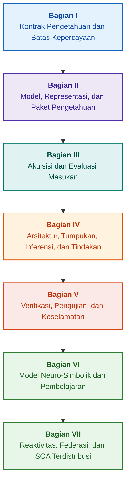

# Arsitektur Sistem Pakar Berbasis Bukti: Dari Ontologi Formal ke AI Neuro-Simbolik

**Monograf rekayasa dan panduan komprehensif tentang perancangan, model matematika, arsitektur, dan verifikasi formal sistem cerdas berkeandalan tinggi (Safety-Critical & Evidence-Grounded AI)**

**Penulis:** [Mykola Fedchyk](../../about-the-author.md) · [LinkedIn](https://www.linkedin.com/in/nickfedchik/)  
**Format:** Monograf Rekayasa / Buku Pegangan Arsitek AI  
**Tahun:** 2026  

---

## Tentang Buku Ini

Monograf ini merupakan karya penelitian fundamental dan panduan rekayasa komprehensif yang didedikasikan untuk mengatasi krisis inti kecerdasan buatan modern: jurang epistemik antara plausibilitas probabilistik dari luaran jaringan saraf tiruan dan kebenaran deterministik dari pembuktian matematika formal. Pusat dari penelitian ini adalah pertanyaan tanpa kompromi: **Bagaimana merancang sistem pakar yang setiap kesimpulannya tidak dapat dibantah, dapat dilacak sepenuhnya hingga ke sumber bukti primer, dan memenuhi syarat sertifikasi di domain rekayasa kritis keselamatan (ISO 26262, IEC 61508, DO-178C, ISO/SAE 21434)?**

Penulis mendalilkan dan membangun paradigma baru: **AI Neuro-Simbolik Berbasis Bukti (Evidence-Grounded Neuro-Symbolic AI)**. Di dalamnya, model statistik (LLM/SLM) menjalankan fungsi penasihat dalam pembuatan hipotesis kueri dan perenderan proyeksi; sementara inti simbolik deterministik tanpa kompromi menjamin invarian konsistensi logis, penjangkaran data tingkat bita, kontrol batas kewenangan, dan transisi tindakan yang aman.

### Dari Artefak Rekayasa Menuju Keputusan yang Dapat Diverifikasi

Persyaratan sistem, kode sumber, log pengujian, standar regulasi, dan keputusan rekayasa telah ada di lingkungan produksi modern, namun sebagian besar berfungsi sebagai artefak terisolasi tanpa semantik formal, batas validitas yang ketat, dan ketertelusuran timbal balik. Laporan uji kualifikasi yang berhasil dapat merujuk pada revisi perangkat keras yang sudah usang; kutipan dari standar keselamatan fungsional dapat terlepas dari konteksnya; pengembalian konfigurasi darurat dapat secara tidak sengaja mengaktifkan kembali komponen yang telah ditarik.

Monograf ini menguraikan alur rekayasa ujung-ke-ujung: mulai dari formalisasi artefak rekayasa menjadi data bertipe dan paket pengetahuan yang ditandatangani secara kriptografis – hingga inferensi simbolik, dekomposisi rencana bertahap, penjelasan kontrafaktual, dan audit batas kompetensi. Pemaparan praktis didukung oleh implementasi tingkat industri dalam bahasa Go dengan rangkaian pengujian komprehensif ([Bab 1](../../ch01-introduction-to-expert-systems.md)), kontrak matematika yang ketat ([Bagian II](../../part-02-knowledge-models.md)), dan protokol pembelajaran berkelanjutan yang terbukti mencegah regresi pengetahuan ([Bab 25](../../ch25-how-expert-systems-learn.md)).

### Sasaran Pembaca

Buku ini ditujukan bagi para arsitek sistem, insinyur utama keandalan dan keselamatan fungsional, pengembang mesin inferensi logis, serta insinyur pengetahuan. Untuk memahami konsep dasar, diperlukan pemahaman dasar tentang logika predikat tingkat pertama, manajemen versi perangkat lunak, dan siklus hidup sistem; untuk menjalankan contoh praktis, diperlukan lingkungan Go standar. Bab-bab khusus yang membahas sintesis formal argumen keselamatan Goal Structuring Notation (GSN), sinergetika sistem kompleks, akselerator neuromorfik, dan navigasi otonom tanpa GNSS membuka batas terdepan penerapan AI berbasis bukti di industri teknologi tinggi (kedirgantaraan, transportasi otonom, energi penting).

---

## Konteks Ilmiah dan Kedudukan Monograf dalam Riset Global

Monograf ini memandang sistem pakar bukan sebagai peninggalan usang dari sistem berbasis aturan tahun 1980-an (seperti CLIPS atau MYCIN), melainkan sebagai garda depan **AI Neuro-Simbolik Berbasis Bukti Gelombang Ketiga (Third-Wave Evidence-Grounded Neuro-Symbolic AI)**. Karya ini bertumpu pada fondasi teoretis sekolah ilmiah terkemuka dunia, sekaligus menjembatani jurang pemisah antara model matematika abstrak dan rekayasa sistem berkinerja tinggi:

| Bidang Ilmiah | Karya Global Utama dan Penulis | Jembatan Konseptual dalam Buku |
|---|---|---|
| **AI Neuro-Simbolik Gelombang Ketiga (NeSy)** | Artur d'Avila Garcez, Luis C. Lamb (*Neurosymbolic AI: The 3rd Wave*, 2023; *Neural-Symbolic Cognitive Reasoning*, Springer, 2009); Henry Kautz (*The Third AI Summer*, AAAI 2022) | Pemisahan tanggung jawab: Model statistik (SLM/LLM) menghasilkan hipotesis kueri, sedangkan inti simbolik deterministik memverifikasi dan menyetujui fakta secara formal ([Bab 29](../../ch29-neuro-symbolic-architecture.md)). |
| **Batasan Semantik dan Pembelajaran Aman** | Guy Van den Broeck dkk. (*A Semantic Loss Function for Deep Learning with Symbolic Knowledge*, ICML 2018); Luc De Raedt dkk. (*DeepProbLog*, IJCAI 2020) | Gerbang penerimaan input dan output, penyaringan semantik deterministik atas keluaran jaringan saraf berdasarkan skema formal ([Bab 28](../../ch28-dual-mode-expert-systems.md), [Bab 33](../../ch33-inter-system-knowledge-exchange-and-model-teaching.md)). |
| **Penalaran yang Dapat Dibantah dan Teori Argumentasi** | John L. Pollock (*Defeasible Reasoning*, 1987; *Cognitive Carpentry*, MIT Press, 1995); Phan Minh Dung (*Abstract Argumentation Frameworks*, AIJ 1995); Douglas Walton (*Argumentation Schemes*, Cambridge, 2008) | Dekomposisi pengetahuan menjadi klaim, silsilah asal-usul, dan pembatal (*rebutting* dan *undercutting defeaters*); penyelesaian konflik dalam basis aturan normatif menggunakan kerangka argumentasi Dung ([Bab 2](../../ch02-epistemology-of-machine-knowledge.md), [Bab 27](../../ch27-safety-case-gsn-synthesis.md)). |
| **Penambangan Aturan Asosiasi Otonom (KBC)** | Luis Galárraga, Fabian M. Suchanek dkk. (*AMIE: Association Rule Mining under Incomplete Evidence*, WWW 2013, VLDBJ 2015); Stephen Muggleton (*Inductive Logic Programming*, 1994) | Induksi aturan otomatis dari basis pengetahuan di bawah asumsi kelengkapan parsial (PCA) tanpa contoh tandingan palsu dari dunia terbuka ([Bab 34](../../ch34-deterministic-relational-analysis-abduction-and-socratic-dialogue.md)). |
| **Perisai Keselamatan Formal dan Sertifikasi (Safe AI)** | Bettina Könighofer, Roderick Bloem dkk. (*Shield Synthesis*, 2017); Tim Kelly, Rob Weaver (*Goal Structuring Notation*, York, 2004); André Platzer (*Logical Foundations of CPS*, Springer, 2018) | Sintesis argumen keselamatan dalam notasi GSN untuk standar ISO 26262/21434; perisai formal dan amplop validitas numerik untuk aktuator periferal ([Bab 27](../../ch27-safety-case-gsn-synthesis.md), [Bab 30](../../ch30-safety-cybersecurity-co-engineering.md), [Bab 33](../../ch33-inter-system-knowledge-exchange-and-model-teaching.md)). |
| **Logika Epistemik dan Semiotika Pengetahuan** | John F. Sowa (*Knowledge Representation: Logical, Philosophical, and Computational Foundations*, 2000); Frank van Harmelen dkk. (*Handbook of Knowledge Representation*, Elsevier, 2008) | Triad epistemik Charles Sanders Peirce (Konsep → Penilaian → Inferensi); penalaran abduktif atas hipotesis kerja di bawah kontrol deduktif yang ketat ([Bab 6](../../ch06-applied-mathematics-for-expert-systems.md), [Bab 34](../../ch34-deterministic-relational-analysis-abduction-and-socratic-dialogue.md)). |
| **Sibernetika dan Sinergetika Sistem Kompleks** | Norbert Wiener (*Cybernetics*, 1948); W. Ross Ashby (*An Introduction to Cybernetics*, 1956); Hermann Haken (*Synergetics: An Introduction*, 1977; *Advanced Synergetics*, 1983); Ilya Prigogine (*Order out of Chaos*, 1984) | Hukum variasi esensial Ashby, siklus kendali tertutup L0–L4, reduksi ruang keadaan menjadi parameter keteraturan melalui prinsip subordinasi Haken, peringatan dini transisi fase via perlambatan kritis (CSD), dan stabilisasi disipatif basis pengetahuan ([Bab 6](../../ch06-applied-mathematics-for-expert-systems.md), [Bab 22](../../ch22-cybernetics-edge-to-backend.md), [Bab 35](../../ch35-self-organizing-expert-systems-synergetics-and-npu-runtime.md)). |
| **Pengujian Pengetahuan, Invariansi Linguistik, dan Kalibrasi Lipschitz** | Kent Beck (*TDD*, 2002); Martin Fowler (*Refactoring*, 2018); Clark Barrett, Leonardo de Moura (*Z3 SMT Solver*, 2008); Chuan Guo dkk. (*On Calibration of Modern Neural Networks*, ICML 2017); Marco Tulio Ribeiro dkk. (*CheckList*, ACL 2020); John L. Pollock (*Defeasible Reasoning*, 1987) | Piramida Pengujian Pengetahuan empat tingkat (KTP): Pengujian unit aturan terisolasi (KUT) dengan peniruan premis (`PremiseMock`), penghapusan jebakan kebenaran hampa, analisis nilai batas spektral 6-titik (BVA), kisi aturan dan pembatal (KIT), skor invariansi semantik ($\text{SIS} \ge 0.98$) terhadap variasi linguistik, batasan kontinuitas Lipschitz ($L_{\mathcal{K}} \le L_{\max}$) terhadap getaran relai, dan akumulasi stigmergik celah pengetahuan ([Bab 36](../../ch36-knowledge-testing-pyramid-and-variational-calibration.md)). |

---

## Model Teoretis Orisinal, Riset Ilmiah, dan Inovasi Rekayasa Penulis

Monograf ini merangkum kontribusi riset mendasar dan rekayasa praktis penulis di bidang perancangan sistem kritis keandalan, arsitektur tertanam, dan AI berbasis bukti. Berbeda dari ulasan literatur murni, buku ini menetapkan serangkaian teori formal, protokol, dan pola arsitektur orisinal yang meningkatkan interaksi neuro-simbolik ke tingkat kepercayaan yang dapat dibuktikan secara matematis:

### 1. Pengembangan Teoretis Mendasar dan Formalisme Matematika

1. **Invarian Penjangkaran Bukti (EGI) dan Gerbang Penerimaan Fakta ([Bab 2](../../ch02-epistemology-of-machine-knowledge.md), [19](../../ch19-from-question-to-evidence.md), [28](../../ch28-dual-mode-expert-systems.md), [29](../../ch29-neuro-symbolic-architecture.md)):**
   * *Konsep Teoretis:* Penulis memformulasikan invarian kelengkapan penjangkaran $\mathrm{Comp}(C) = 1.00$, yang menetapkan bahwa dalam sistem berbasis bukti, tidak ada klaim yang dapat memperoleh status fakta yang diakui tanpa proyeksi deterministik ke sumber pengetahuan primer. Setiap elemen basis fakta didukung oleh tupel kriptografis: pergeseran bita tak-ubah `[byte_start, byte_end]`, hash fragmen kanonikal `quote_sha256`, dan pengenal sertifikat asal-usul PROV-O.
   * *Signifikansi Rekayasa:* Mekanisme gerbang penerimaan tingkat bita pada batas perangkat keras dan perangkat lunak sepenuhnya mencegah halusinasi jaringan saraf menyusup ke dalam basis pengetahuan yang terkelola versinya, menjamin nol toleransi terhadap data yang tidak terkonfirmasi ($ZHR = 1.00$).
2. **Piramida Pengujian Pengetahuan Empat Tingkat (KTP) dan Stabilitas Lipschitz Ruang Inferensi ([Bab 36](../../ch36-knowledge-testing-pyramid-and-variational-calibration.md)):**
   * *Konsep Teoretis:* Penulis pertama kali mengusulkan Piramida Pengujian Pengetahuan (KTP) yang terstruktur, menerapkan disiplin piramida pengujian perangkat lunak Martin Fowler ke sistem pengetahuan: pengujian unit aturan terisolasi (KUT) dengan isolasi premis (`PremiseMock`), pengujian integrasi interaksi aturan dan pembatal (KIT), serta kalibrasi variasional pada manifold kueri (KVT).
   * *Aparatus Matematika:* Ditetapkan invarian ketat pencegahan kebenaran hampa ($P \to Q$ saat $P \equiv \text{False}$), metrik invariansi semantik ($\mathrm{SIS} \ge 0.98$) terhadap gangguan linguistik, dan batasan kontinuitas Lipschitz dari ruang inferensi ($L_{\mathcal{K}} \le L_{\max}$), yang secara matematis meniadakan getaran relai akibat fluktuasi masukan kecil.
3. **Teori Falsifikasi Popperian atas Norma Deontik dan Auditor Kepatuhan Aktif ([Bab 39](../../ch39-active-compliance-auditor-and-popperian-testing.md)):**
   * *Konsep Teoretis:* Transisi dari model "peramal pasif" tradisional (yang hanya menjawab pertanyaan) ke paradigma auditor pengetahuan aktif yang menerapkan prinsip falsifikasi Karl Popper. Sistem secara otonom memeriksa ruang persyaratan (ASPICE 4.0, ISO 26262, ISO/SAE 21434), menyintesis contoh tandingan, mengidentifikasi spesifikasi yang tidak lengkap, dan merancang program pengujian produk yang komprehensif.
   * *Nilai Praktis:* Penggabungan pembuatan skenario batas yang kreatif oleh jaringan saraf (Sistem 1) dengan verifikasi normatif deterministik oleh inti simbolik (Sistem 2), melindungi manusia dalam siklus kendali (Human-in-the-Loop) dari kelelahan persetujuan kognitif.
4. **Reduksi Dimensi Sinergetik Basis Pengetahuan dan Diagnosis Dini CSD ([Bab 6](../../ch06-applied-mathematics-for-expert-systems.md), [22](../../ch22-cybernetics-edge-to-backend.md), [35](../../ch35-self-organizing-expert-systems-synergetics-and-npu-runtime.md)):**
   * *Konsep Teoretis:* Penerapan aparatus matematika sinergetika Hermann Haken (parameter keteraturan dan prinsip subordinasi) serta teori struktur disipatif Ilya Prigogine terhadap evolusi basis pengetahuan yang kompleks.
   * *Hasil Ilmiah:* Dikembangkan metode untuk mereduksi ruang keadaan telemetri multi-dimensi menjadi parameter keteraturan, dan diintegrasikan detektor Perlambatan Kritis (*Critical Slowing Down*, CSD) berbasis autokorelasi dan varians, memungkinkan prediksi keruntuhan dinamis jauh sebelum sensor ambang batas darurat terpicu.
5. **Model Tingkat Otonomi Tindakan (A0–A4), Gerbang Otorisasi, dan Saga Idempoten ([Bab 21](../../ch21-from-recommendation-to-action.md)):**
   * *Konsep Teoretis:* Skala diskret kewenangan tindakan sistem (A0: Analisis pasif, A1: Penyusunan draf, A2: Tindakan bertanda tangan manusia, A3: Otonomi terawasi, A4: Pemutusan darurat aman), yang tidak dialokasikan untuk seluruh sistem, melainkan untuk tupel "tindakan, lingkungan, tingkat risiko".
   * *Aparatus Matematika:* Diperkenalkan invarian idempoten aljabar $f(f(x, k), k) \equiv f(x, k)$ berdasarkan kunci kriptografi $k$, eksekusi putaran tertutup bertahap, dan protokol saga kompensasi terdistribusi dengan status `OutcomeUnknown` serta verifikasi pasca-kondisi independen.
6. **Rekayasa Bersama Formal Keselamatan Fungsional dan Keamanan Siber dalam Notasi GSN ([Bab 27](../../ch27-safety-case-gsn-synthesis.md), [30](../../ch30-safety-cybersecurity-co-engineering.md)):**
   * *Konsep Teoretis:* Dikembangkan model sintesis terkoordinasi pohon argumentasi GSN (Goal Structuring Notation) untuk memenuhi persyaratan standar ISO 26262 (keselamatan fungsional) dan ISO/SAE 21434 (keamanan siber) secara simultan.
   * *Terobosan Rekayasa:* Formalisasi arbitrase matematika antara tujuan yang saling bertentangan (anggaran waktu tanggap darurat vs kedalaman atestasi kriptografis) dan protokol pengungkapan bukti selektif kepada auditor eksternal melalui pohon Merkle bergaram.
7. **Protokol Verifikasi Kesetiaan dan Konsistensi Semantik Penjelasan ([Bab 20](../../ch20-explanation-engine.md)):**
   * *Konsep Teoretis:* Penjelasan diperlakukan bukan sebagai teks bebas model generatif, melainkan sebagai artefak deterministik independen yang diturunkan secara unik dari grafik pembuktian, versi aturan, dan rekam jepret fakta yang dibekukan.
   * *Aparatus Matematika:* Diformalkan gerbang metrik evaluasi kesetiaan ($C_{\text{facts}} = 1.00, H_{\text{free}} = 1.00$) dengan mekanisme kembali aman otomatis (fail-safe fallback) ke templat kaku jika terjadi ketidaksesuaian sekecil apa pun antara inferensi simbolik dan verbalisasi operator.

---

### 2. Riset Empiris, Bangku Eksperimen Penulis, dan Rekayasa Sistem

1. **Paket Pengetahuan Biner Tak-Ubah dengan `mmap` dan Nol Deserialisasi ([Bab 32](../../ch32-high-performance-knowledge-packs-mmap-and-harvesting.md)):**
   * *Inovasi Penulis:* Arsitektur paket dua lapis (lapisan kanonikal sumber primer + lapisan materialisasi terderivasi dari indeks).
   * *Hasil Empiris:* Pemetaan langsung indeks ke ruang alamat virtual melalui panggilan sistem `mmap`, menghilangkan beban alokasi memori dinamis (zero-allocation), dan memulai mesin dalam waktu sub-linear tanpa memandang ukuran ontologi yang mencapai gigabita.
2. **Arena Kalibrasi Empiris pada Korpus Standar IETF RFC-1000 dan W3C-150 ([Bab 2](../../ch02-epistemology-of-machine-knowledge.md), [4](../../ch04-evolution-from-bayes-to-evidence-ai.md), [14](../../ch14-requirements-detection-and-formalization.md), [25](../../ch25-how-expert-systems-learn.md)):**
   * *Eksperimen Penulis:* Penerapan lingkungan riset skala besar pada 1.000 spesifikasi IETF RFC yang sah (tersebar dalam 5 era kronologis perkembangan internet) dan 150 kueri diagnostik kompleks dari korpus W3C (termasuk induksi kontradiksi logis dan konfabulasi).
   * *Hasil Praktis:* Pembentukan matriks ujian pengetahuan yang objektif, deteksi kontradiksi normatif, dan perlindungan terbukti matematis terhadap regresi pengetahuan saat pembaruan.
3. **Analisis Relasional Multilangkah, Abduksi Simbolik, dan Dialog Sokrates ([Bab 34](../../ch34-deterministic-relational-analysis-abduction-and-socratic-dialogue.md)):**
   * *Pengembangan Penulis:* Algoritma Pencarian Lebar Terbatas Dua Arah (Bidirectional Bounded BFS, $k \le 6$) dengan perlindungan terhadap perulangan dan pembentukan rantai bukti bita komposit untuk entitas yang saling terhubung.
   * *Keunggulan Rekayasa:* Implementasi abduksi simbolik Peirce di bawah kontrol deduktif yang ketat dan bingkai klarifikasi Sokrates bertipe (*Clarification Frames*), mengalihkan sistem ke mode dialog produktif dengan manusia alih-alih penolakan buta berdasarkan asumsi dunia tertutup (CWA).
4. **Perisai Formal dan Amplop Validitas Numerik untuk Sistem Kendali Periferal ([Bab 33](../../ch33-inter-system-knowledge-exchange-and-model-teaching.md), [Lampiran B](../../appendix-b-robotics-and-cyber-physical-systems.md), [Lampiran C](../../appendix-c-autonomous-navigation-and-geosearch.md), [Lampiran E](../../appendix-e-mixed-signal-neuromorphic-expert-systems.md)):**
   * *Inovasi Penulis:* Metodologi untuk menerjemahkan invarian logis diskret menjadi koridor keselamatan numerik kontinu untuk prosesor sinyal digital (DSP) dan sistem navigasi otonom tanpa GNSS (TRN/DSMAC/VIO).
   * *Keandalan Operasional:* Pertukaran aturan bertanda tangan berbasis kriptografi Ed25519, karantina aman untuk kandidat pengetahuan baru, dan pemutusan perintah kontrol berbahaya di tingkat perangkat keras.
5. **Pencegahan Kebocoran Informasi Rahasia melalui Penjelasan dan Audit Diferensial ([Bab 20](../../ch20-explanation-engine.md)):**
   * *Pengembangan Penulis:* Protokol reduksi representasi perantara penjelasan ($\mathrm{EIR}_{\text{redacted}}$) dengan pemeriksaan ACL untuk setiap simpul dan sisi grafik pembuktian, memblokir serangan saluran samping rekonstruksi model melalui serangkaian kueri kontrastif WHY NOT.

---

## Prinsip Pengelompokan dan Struktur

Bagian-bagian buku ditentukan oleh tugas rekayasa utama, bukan oleh tahun penulisan bab atau nama teknologi tertentu. Setiap bab memiliki satu bagian utama; metode yang berdekatan menjelaskan cara penyelesaian masalah utamanya. Nomor bab dan nama berkas dipertahankan sebagai pengidentifikasi permanen, sehingga urutan membaca tematis dapat berbeda dari urutan numerik.

Judul sub-bab di dalam bab membentuk kategori-kategori yang jelas dan harus dibaca sebagai kelanjutan argumen yang runtut, bukan sebagai daftar teknologi yang setara:

| Kategori Sub-bab | Pertanyaan Pembaca | Fungsi dalam Bab |
|---|---|---|
| Masalah dan Batasan Tugas | Apa tepatnya yang harus diselesaikan? | Menentukan pertanyaan kunci dan ruang lingkup penerapan |
| Objek dan Model | Data, pengetahuan, atau keadaan apa yang dikaji? | Menyelaraskan konsep, tipe, dan asumsi dasar |
| Metode dan Prosedur | Bagaimana cara memperoleh hasil? | Menjelaskan alur inferensi, transformasi, atau kendali |
| Implementasi dan Alat | Menggunakan apa prosedur tersebut dieksekusi? | Menampilkan perwujudan perangkat lunak atau keras dari metode |
| Verifikasi dan Kasus Uji | Bagaimana mendeteksi kesalahan? | Membandingkan hasil dengan kriteria evaluasi independen |
| Kesimpulan dan Batas Hasil | Apa yang telah dibuktikan dan apa yang masih terbuka? | Menjawab pertanyaan utama tanpa melebih-lebihkan janji |

Negara, sektor industri, atau produk komersial merupakan konteks penerapan, bukan tingkat independen dari taksonomi ini. Glosarium, singkatan, referensi, dan navigasi merupakan perangkat rujukan pembantu, bukan topik mandiri bab.

Peta tinjauan editorial lengkap memuat penilaian atas topik utama setiap bab, batasan antardiskusi terdekat, serta catatan struktur dan kesimpulan. Ringkasan pengantar baru bukan berarti semua risiko konten di dalam bab telah sepenuhnya dihilangkan.

## Rute Membaca yang Direkomendasikan

**Verifikasi Perangkat Lunak Awal:** [1](../../ch01-introduction-to-expert-systems.md) → [7](../../ch07-knowledge-base-typology.md) → [8](../../ch08-engineering-artifacts-as-data.md) → [17](../../ch17-implementation-stack.md) → [23](../../ch23-knowledge-base-verification.md) → [25](../../ch25-how-expert-systems-learn.md). Tujuan: Putusan yang dapat direproduksi dengan landasan bukti, pengujian negatif, dan modifikasi pengetahuan terkontrol. Penggunaan model bahasa tidak wajib.

**Rekayasa Pengetahuan:** [Bagian II](../../part-02-knowledge-models.md) → [Bagian III](../../part-03-knowledge-engineering-nlp.md) → [19](../../ch19-from-question-to-evidence.md) → [20](../../ch20-explanation-engine.md) → [26](../../ch26-continual-learning.md). Tujuan: Menyelaraskan semantik, silsilah asal-usul, akuisisi pengetahuan, dan validasi kandidat baru. Bagian II mempertahankan program pengujian ilmiah lintas-bagian untuk Bab 7–11.

**Arsitektur Solusi:** [16](../../ch16-expert-systems-architecture.md) → [19](../../ch19-from-question-to-evidence.md) → [31](../../ch31-syllogistic-reasoning-and-relation-lattices.md) → [20](../../ch20-explanation-engine.md) → [21](../../ch21-from-recommendation-to-action.md). Tujuan: Memisahkan pemeriksaan landasan bukti, penerapan norma, penjelasan, dan kewenangan bertindak.

**Verifikasi dan Keselamatan:** [23](../../ch23-knowledge-base-verification.md) → [36](../../ch36-knowledge-testing-pyramid-and-variational-calibration.md) → [25](../../ch25-how-expert-systems-learn.md) → [26](../../ch26-continual-learning.md) → [27](../../ch27-safety-case-gsn-synthesis.md) → [30](../../ch30-safety-cybersecurity-co-engineering.md). Diagnosis sistem eksternal ditangani secara terpisah melalui [Bab 24](../../ch24-system-diagnosis.md).

**Respons Hibrida dan Operasional:** [Bagian VI](../../part-06-frontiers-neuro-symbolic.md) → [Bagian VII](../../part-07-runtime-and-knowledge-exchange.md) → [40](../../ch40-distributed-epistemic-architectures-soa-and-cluster-scaling.md) dan lampiran yang relevan. Tujuan: Mengintegrasikan model bahasa, mengelola celah pengetahuan, membangun arsitektur layanan pengetahuan terdistribusi, dan memverifikasi pertukaran antarsistem. Bab [2](../../ch02-epistemology-of-machine-knowledge.md), [4](../../ch04-evolution-from-bayes-to-evidence-ai.md), dan [6](../../ch06-applied-mathematics-for-expert-systems.md) dapat dibaca sesuai kebutuhan sebagai kontrak, sejarah, dan referensi matematika.

---

## Batasan Janji Rekayasa

Buku ini merupakan materi pembelajaran dan penelitian, bukan prosedur tersertifikasi atau bukti kepatuhan produk terhadap standar tertentu. Eksekusi deterministik tidak secara otomatis membuktikan kebenaran fakta; ringkasan kriptografis dan tanda tangan digital tidak membuktikan kebenaran mutlak; dan grafik argumen tidak menggantikan penilaian ahli manusia. Persyaratan keandalan seluruh produk tidak boleh disamakan dengan tingkat kesalahan model bahasa atau digeneralisasikan ke seluruh komponen perangkat lunak.

Penguraian otomatis mengurangi transfer data manual, tetapi tidak menghapus pemodelan domain, tinjauan rekan sejawat, dan tanggung jawab pemilik pengetahuan. Protégé, peninjauan manual, dan pengumpulan otomatis dapat saling melengkapi. Jaminan matematika hanya berlaku untuk profil bahasa dan asumsi tertentu; kecepatan pemrosesan yang terukur hanya berlaku untuk kueri, korpus, dan lingkungan pengujian spesifik. Data arsip penulis dipisahkan secara tegas dari lingkungan uji terbuka dan penelitian yang belum diselesaikan.

Keputusan rilis produk, penerimaan risiko, dan kepatuhan terhadap standar regulasi tetap berada di bawah tanggung jawab para ahli manusia yang berwenang. Sistem pakar menyiapkan materi yang dapat diverifikasi dan menjalankan kebijakan yang telah disepakati, tetapi tidak memperoleh kewenangan regulasi atau hukum secara mandiri.

---

## Struktur Buku

Buku ini terdiri dari tujuh bagian tematis, 40 bab, dan lima lampiran. Setiap bab termasuk dalam satu bagian utama. Bab sebelum dan sesudahnya dalam navigasi mengikuti urutan logis di bawah ini; nomor bab dan nama berkas tetap dipertahankan.

---

### [Bagian I. Fondasi Konseptual dan Epistemik](../../part-01-foundations.md)

*Kapan sistem pakar diperlukan, apa yang dianggap sebagai pengetahuan, dan bagaimana melestarikan landasan keputusan organisasi.*

* [Bab 1. Pengantar Sistem Pakar: Dari Kekacauan Menuju Pengetahuan Terkelola](../../ch01-introduction-to-expert-systems.md)
* [Bab 2. Filsafat untuk Insinyur: Apa yang Berhak Disebut Mesin sebagai Pengetahuan](../../ch02-epistemology-of-machine-knowledge.md)
* [Bab 3. Perbedaan Mendasar Sistem Pakar dengan Sistem Informasi Referensi](../../ch03-beyond-reference-information-systems.md)
* [Bab 4. Evolusi Sistem Pakar: Dari Teorema Bayes ke Solusi AI Berbasis Bukti](../../ch04-evolution-from-bayes-to-evidence-ai.md)
* [Bab 5. Triad Kepercayaan: Sistem Pakar, Rekomendasi Berbasis Bukti, dan Memori Perusahaan](../../ch05-triad-of-trust-and-corporate-memory.md)

---

### [Bagian II. Model Matematika, Representasi, dan Penyimpanan Pengetahuan](../../part-02-knowledge-models.md)

*Pemilihan operasi matematika dan representasi, artefak bertipe, grafik ketertelusuran, dan paket pengetahuan tak-ubah.*

* [Bab 6. Matematika Terapan untuk Sistem Pakar: Aturan, Probabilitas, Grafik, dan Kausalitas](../../ch06-applied-mathematics-for-expert-systems.md)
* [Bab 7. Tipologi Basis Pengetahuan: Aturan, Ontologi, Preseden, dan Vektor](../../ch07-knowledge-base-typology.md)
* [Bab 8. Artefak Rekayasa sebagai Data Sistem Pakar](../../ch08-engineering-artifacts-as-data.md)
* [Bab 9. Grafik Pengetahuan Rekayasa: Ketertelusuran dari Persyaratan hingga Perangkat Keras](../../ch09-engineering-knowledge-graph-traceability.md)
* [Bab 32. Paket Pengetahuan Tak-Ubah: Penerimaan Tingkat Bita, Indeks, dan Pemetaan Memori](../../ch32-high-performance-knowledge-packs-mmap-and-harvesting.md)

---

### [Bagian III. Akuisisi Pengetahuan, Analisis Linguistik, dan Evaluasi Masukan](../../part-03-knowledge-engineering-nlp.md)

*Dokumen, pengalaman pakar, dan observasi: Ekstraksi kandidat, analisis linguistik, formalisasi, dan evaluasi bukti.*

* [Bab 10. Sistem Akuisisi Pengetahuan: Sumber, Penerimaan, dan Siklus Hidup](../../ch10-knowledge-acquisition-systems.md)
* [Bab 11. Elisitasi Pengetahuan dari Para Pakar: Wawancara, Peta Kognitif, dan Formalisasi Pengalaman](../../ch11-knowledge-elicitation-from-experts.md)
* [Bab 12. Analisis Linguistik dan Model Lokal: Preservasi Makna dan Sumber](../../ch12-linguistic-analysis-and-local-models.md)
* [Bab 13. Variabilitas Bahasa Alami Melawan Determinisme: Kompilasi Makna Pertanyaan](../../ch13-language-variability-vs-determinism.md)
* [Bab 14. Deteksi Persyaratan dan Modalitas: Dari Teks Regulasi ke Invarian](../../ch14-requirements-detection-and-formalization.md)
* [Bab 15. Ekstraksi Pengetahuan dan Konstruksi Basis Pengetahuan: Fakta, Tata Bahasa, dan Otomata](../../ch15-knowledge-extraction-and-kb-construction.md)
* [Bab 37. Evaluasi Informasi Masukan: Sumber, Bukti, dan Ketidakpastian](../../ch37-input-information-assessment-and-algorithmic-skepticism.md)

---

### [Bagian IV. Arsitektur, Tumpukan Teknologi, Inferensi, dan Tindakan](../../part-04-architecture-and-inference.md)

*Kontrak arsitektur, tumpukan teknologi, eksekusi perangkat keras, verifikasi klaim, inferensi berdasarkan norma, penjelasan, dan siklus kendali sibernetika.*

* [Bab 16. Arsitektur Sistem Pakar: Dari Pengetahuan Formal ke Keputusan Berbasis Bukti](../../ch16-expert-systems-architecture.md)
* [Bab 17. Tumpukan Teknologi: Kriteria Pemilihan Alat, Bahasa Pemrograman, dan Mesin Aturan](../../ch17-implementation-stack.md)
* [Bab 18. Infrastruktur Eksekusi: Model Lokal, Akselerator Perangkat Keras, Edge, dan On-Premise](../../ch18-execution-infrastructure.md)
* [Bab 19. Dari Pertanyaan ke Bukti: Pencarian, Penjangkaran, dan Verifikasi Klaim](../../ch19-from-question-to-evidence.md)
* [Bab 31. Inferensi Berdasarkan Norma: Hierarki Predikat, Pengecualian, dan Validitas](../../ch31-syllogistic-reasoning-and-relation-lattices.md)
* [Bab 20. Mesin Penjelasan: Keputusan, Penolakan, dan Batas Kompetensi](../../ch20-explanation-engine.md)
* [Bab 21. Dari Rekomendasi ke Tindakan: Kontrol Otoritas dan Eksekusi Aman di Lingkungan Produksi](../../ch21-from-recommendation-to-action.md)
* [Bab 22. Siklus Kendali Sibernetika: Sensor, Periferal, dan Umpan Balik](../../ch22-cybernetics-edge-to-backend.md)

---

### [Bagian V. Verifikasi, Pengujian, Diagnosis, dan Argumen Keselamatan](../../part-05-verification-and-learning.md)

*Verifikasi formal aturan, piramida pengujian pengetahuan, falsifikasi Popperian, diagnosis teknis, serta argumen keselamatan fungsional dan keamanan siber.*

* [Bab 23. Verifikasi Basis Pengetahuan: Cara Memeriksa Konsistensi, Kelengkapan, dan Keandalan Aturan](../../ch23-knowledge-base-verification.md)
* [Bab 36. Piramida Pengujian Pengetahuan: Aturan, Interaksi, dan Stabilitas Respons](../../ch36-knowledge-testing-pyramid-and-variational-calibration.md)
* [Bab 39. Penguji Pakar Aktif: Falsifikasi Popperian, Kepatuhan Regulasi (ASPICE/ISO 26262/ISO 21434), dan Desain Pengujian Otonom](../../ch39-active-compliance-auditor-and-popperian-testing.md)
* [Bab 24. Diagnosis Teknis: Cara Menghindari Kerancuan Antara Gejala dan Akar Masalah di Bawah Ketidaklengkapan Data](../../ch24-system-diagnosis.md)
* [Bab 27. Argumen Keselamatan: Sintesis dan Verifikasi Argumen](../../ch27-safety-case-gsn-synthesis.md)
* [Bab 30. Rekayasa Bersama Keselamatan Fungsional dan Keamanan Siber](../../ch30-safety-cybersecurity-co-engineering.md)

---

### [Bagian VI. Model Neuro-Simbolik, Batas Kognitif, dan Pembelajaran Berkelanjutan](../../part-06-frontiers-neuro-symbolic.md)

*Inferensi ketat dan hipotesis penasihat, integrasi model bahasa, celah pengetahuan, kontrol respons tanpa bukti, matriks ujian, dan pembelajaran berkelanjutan dari pengalaman.*

* [Bab 28. Sistem Pakar Mode Ganda: Inferensi Ketat dan Hipotesis Penasihat](../../ch28-dual-mode-expert-systems.md)
* [Bab 29. Arsitektur Neuro-Simbolik: Model Bahasa dan Verifikasi Landasan Bukti](../../ch29-neuro-symbolic-architecture.md)
* [Bab 34. Celah Pengetahuan: Pencarian Relasional, Abduksi, dan Dialog Klarifikasi](../../ch34-deterministic-relational-analysis-abduction-and-socratic-dialogue.md)
* [Bab 38. Halusinasi Mesin dan Defisit Pengetahuan: Kontrol Respons Berbasis Bukti](../../ch38-curing-machine-hallucinations-and-knowledge-deficits.md)
* [Bab 25. Cara Melatih Sistem Pakar: Matriks Ujian, Audit Pengetahuan, dan Kontrol Regresi](../../ch25-how-expert-systems-learn.md)
* [Bab 26. Pembelajaran Berkelanjutan (Continual Learning) dari Pengalaman dan Mengatasi Pergeseran Log Sistem](../../ch26-continual-learning.md)

---

### [Bagian VII. Eksekusi Reaktif, Pertukaran Pengetahuan Antarsistem, dan SOA Terdistribusi](../../part-07-runtime-and-knowledge-exchange.md)

*Eksekusi reaktif aturan, sinergetika dan transisi fase pengetahuan, pertukaran antarsistem, dan arsitektur epistemik terdistribusi skala perusahaan.*

* [Bab 35. Sistem Pakar Reaktif: Kejadian, Pencabutan, dan Adaptasi Pengetahuan](../../ch35-self-organizing-expert-systems-synergetics-and-npu-runtime.md)
* [Bab 33. Pertukaran Pengetahuan Antarsistem: Distribusi Aturan ke Sistem Eksternal, Pengajaran Model, dan Umpan Balik Aman](../../ch33-inter-system-knowledge-exchange-and-model-teaching.md)
* [Bab 40. Arsitektur Terdistribusi Sistem Pakar Berbasis Bukti: SOA Epistemik, Perutean Semantik, Hierarki Memori, dan Arbitrase Multi-Sumber](../../ch40-distributed-epistemic-architectures-soa-and-cluster-scaling.md)

---

### Lampiran

* [Lampiran A. Kerangka Kerja Praktis untuk Riset Berbasis Bukti dalam Proyek Rekayasa Kompleks](../../appendix-a-evidence-governed-framework.md)
* [Lampiran B. Sistem Pakar Berbasis Bukti dalam Robotika Otonom dan Kompleks Siber-Fisik](../../appendix-b-robotics-and-cyber-physical-systems.md)
* [Lampiran C. Navigasi Otonom Tanpa GNSS: Pencocokan Geospasial (TRN/DSMAC), Odometri Visual (VIO), dan Arbitrase Pakar Fusi Sensor](../../appendix-c-autonomous-navigation-and-geosearch.md)
* [Lampiran D. Sistem Pakar Analog, Komputasi Neuromorfik, dan Inferensi Logis Perangkat Keras](../../appendix-d-analog-expert-systems-and-neuromorphic-computing.md)
* [Lampiran E. Sistem Pakar Sinyal Campuran Analog-Digital: Komputasi Neuromorfik, Analog, dan Non-Konvensional di Bawah Pengawasan Bukti](../../appendix-e-mixed-signal-neuromorphic-expert-systems.md)
* [Tentang Penulis: Mykola Fedchyk (Nick Fedchik)](../../about-the-author.md)

---

## Arah Penelitian Masa Depan

Arah penelitian masa depan bukanlah jaminan yang sudah jadi: Pembangunan paket pengetahuan yang dapat direproduksi; verifikasi representasi formal terbatas; tata kelola agen melalui otoritas eksplisit; verifikasi rahasia atas klaim formal tertentu; pencabutan terkontrol dan penelitian penghapusan pembelajaran mesin (machine unlearning). Membuktikan sifat suatu model tidak secara otomatis menjamin kepatuhan produk fisik, dan menghapus aturan tidak sama dengan menghapus seluruh pengaruh data dari model yang telah dilatih.

Untuk akselerator perangkat keras dan komputasi non-konvensional, tingkat kesalahan, latensi, konsumsi energi, dan perilaku saat kegagalan diukur terlebih dahulu secara presisi. Masalah terkait dibahas dalam [Bab 29](../../ch29-neuro-symbolic-architecture.md), [Bab 32](../../ch32-high-performance-knowledge-packs-mmap-and-harvesting.md), serta [Lampiran D](../../appendix-d-analog-expert-systems-and-neuromorphic-computing.md) dan [Lampiran E](../../appendix-e-mixed-signal-neuromorphic-expert-systems.md). Program riset praktis untuk Bab 7–11 disajikan dalam [Bagian II](../../part-02-knowledge-models.md): Setiap proposal memiliki hipotesis, perbandingan kontrol, dan syarat falsifikasi.
