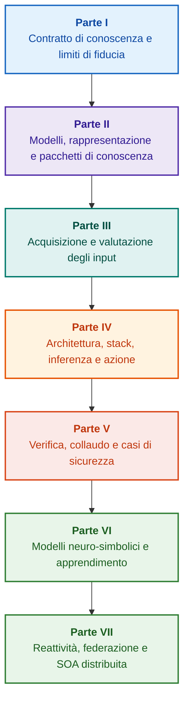

# Architettura dei sistemi esperti basati su prove: dalle ontologie formali all'IA neuro-simbolica

**Monografia di ingegneria e manuale di riferimento su progettazione, modelli matematici, architettura e verifica di sistemi intelligenti ad alta affidabilità (Safety-Critical & Evidence-Grounded AI)**

**Autore:** [Mykola Fedchyk](../en/about-the-author.md) · [LinkedIn](https://www.linkedin.com/in/nickfedchik/)  
**Formato:** Monografia di ingegneria / Manuale per architetti di sistemi IA  
**Anno:** 2026  

---

## Informazioni sul libro

Questa monografia rappresenta un'indagine di ricerca fondamentale e una guida ingegneristica dedicata al superamento della principale crisi dell'intelligenza artificiale moderna: il divario epistemico tra la plausibilità probabilistica dei modelli neurali e la verità deterministica delle dimostrazioni formali. Al centro della ricerca si colloca un requisito inderogabile: **come progettare un sistema esperto le cui conclusioni siano inconfutabili, pienamente tracciabili verso fonti primarie e idonee alla certificazione in domini ingegneristici critici (ISO 26262, IEC 61508, DO-178C, ISO/SAE 21434)?**

L'autore fonda e formalizza un nuovo paradigma: **l'IA neuro-simbolica basata su prove (Evidence-Grounded Neuro-Symbolic AI)**, in cui i modelli statistici (LLM/SLM) svolgono una funzione consultiva di generazione di ipotesi e proiezione, mentre un nucleo simbolico deterministico garantisce immutabilmente gli invarianti di coerenza logica, ancoraggio dei fatti a livello di byte, controllo delle autorizzazioni e transizione sicura all'azione.

### Dall'artefatto alla decisione verificabile

Requisiti di sistema, codice sorgente, registri di prova, standard normativi e decisioni di progettazione sono già presenti negli ambienti produttivi, ma operano perlopiù come artefatti frammentati privi di semantica formalizzata e tracciabilità bidirezionale. Un rapporto di collaudo superato può riferirsi a una revisione hardware obsoleta; una citazione di norma può essere decontestualizzata; un rollback automatico di configurazione può riattivare per errore un componente revocato.

La monografia propone un percorso ingegneristico end-to-end: dalla formalizzazione degli artefatti come dati e pacchetti di conoscenza firmati crittograficamente, all'inferenza simbolica, alla scomposizione dei piani, alle spiegazioni controfattuali e all'audit dei limiti di competenza. L'esposizione è corroborata da implementazioni di riferimento in Go con suite di test esaustive ([Capitolo 1](../en/ch01-introduction-to-expert-systems.md)), contratti matematici rigorosi ([Parte II](../en/part-02-knowledge-models.md)) e protocolli di apprendimento continuo senza regressioni ([Capitolo 25](../en/ch25-how-expert-systems-learn.md)).

### Destinatari

L'opera è destinata ad architetti di sistema, ingegneri responsabili della sicurezza funzionale e affidabilità, sviluppatori di motori inferenziali e ingegneri della conoscenza. La comprensione dei concetti richiede nozioni di base di logica dei predicati del primo ordine, versionamento e ciclo di vita del software; l'esecuzione degli esempi richiede gli strumenti standard dell'ecosistema Go. Capitoli specialistici dedicati alla Goal Structuring Notation (GSN), alla sinergetica dei sistemi complessi, agli acceleratori neuromorfici e alla navigazione autonoma in assenza di GNSS aprono l'impiego dell'IA affidabile nei settori aerospaziale, automobilistico ed energetico.

---

## Contesto scientifico e collocazione globale della monografia

La monografia inquadra i sistemi esperti non come un retaggio dei motori a regole degli anni '80 (come CLIPS o MYCIN), ma come l'avanguardia dell'**IA neuro-simbolica di terza ondata basata su prove (Third-Wave NeSy)**. La trattazione raccorda le principali scuole accademiche con l'ingegneria dei sistemi ad alte prestazioni:

| Ambito scientifico | Opere chiave e autori | Ponte concettuale nell'opera |
|---|---|---|
| **IA neuro-simbolica di 3a ondata (NeSy)** | Artur d'Avila Garcez, Luis C. Lamb (*Neurosymbolic AI: The 3rd Wave*, 2023; *Neural-Symbolic Cognitive Reasoning*, Springer, 2009); Henry Kautz (*The Third AI Summer*, AAAI 2022) | Separazione dei compiti: i modelli statistici (SLM/LLM) generano ipotesi di interrogazione, mentre un nucleo simbolico deterministico verifica e convalida i fatti ([Capitolo 29](../en/ch29-neuro-symbolic-architecture.md)). |
| **Vincoli semantici e apprendimento sicuro** | Guy Van den Broeck et al. (*A Semantic Loss Function for Deep Learning with Symbolic Knowledge*, ICML 2018); Luc De Raedt et al. (*DeepProbLog*, IJCAI 2020) | Gateway di ammissione e rilascio, filtraggio semantico deterministico delle proposte neurali rispetto a schemi formali ([Capitoli 28](../en/ch28-dual-mode-expert-systems.md), [33](../en/ch33-inter-system-knowledge-exchange-and-model-teaching.md)). |
| **Ragionamento defettibile e teoria dell'argomentazione** | John L. Pollock (*Defeasible Reasoning*, 1987; *Cognitive Carpentry*, MIT Press, 1995); Phan Minh Dung (*Abstract Argumentation Frameworks*, AIJ 1995); Douglas Walton (*Argumentation Schemes*, Cambridge, 2008) | Scomposizione della conoscenza in asserzioni, provenienza e fattori invalidanti (*rebutting* e *undercutting defeaters*); risoluzione dei conflitti normativi tramite framework di Dung ([Capitoli 2](../en/ch02-epistemology-of-machine-knowledge.md), [27](../en/ch27-safety-case-gsn-synthesis.md)). |
| **Estrazione automatica di regole associative (KBC)** | Luis Galárraga, Fabian M. Suchanek et al. (*AMIE: Association Rule Mining under Incomplete Evidence*, WWW 2013, VLDBJ 2015); Stephen Muggleton (*Inductive Logic Programming*, 1994) | Induzione automatica di regole da basi di conoscenza sotto l'ipotesi di completezza parziale (PCA) senza falsi controesempi del mondo aperto ([Capitolo 34](../en/ch34-deterministic-relational-analysis-abduction-and-socratic-dialogue.md)). |
| **Scudi formali di sicurezza e certificazione (Safe AI)** | Bettina Könighofer, Roderick Bloem et al. (*Shield Synthesis*, 2017); Tim Kelly, Rob Weaver (*Goal Structuring Notation*, York, 2004); André Platzer (*Logical Foundations of CPS*, Springer, 2018) | Sintesi di casi di sicurezza in notazione GSN per ISO 26262/21434; scudi formali e inviluppi numerici di validità per attuatori periferici ([Capitoli 27](../en/ch27-safety-case-gsn-synthesis.md), [30](../en/ch30-safety-cybersecurity-co-engineering.md), [33](../en/ch33-inter-system-knowledge-exchange-and-model-teaching.md)). |
| **Logica epistemica e semiotica della conoscenza** | John F. Sowa (*Knowledge Representation: Logical, Philosophical, and Computational Foundations*, 2000); Frank van Harmelen et al. (*Handbook of Knowledge Representation*, Elsevier, 2008) | Triade epistemica di Charles Sanders Peirce (Concetto → Giudizio → Inferenza); generazione abduttiva di ipotesi sotto rigoroso controllo deduttivo ([Capitoli 6](../en/ch06-applied-mathematics-for-expert-systems.md), [34](../en/ch34-deterministic-relational-analysis-abduction-and-socratic-dialogue.md)). |
| **Cibernetica e sinergetica dei sistemi complessi** | Norbert Wiener (*Cybernetics*, 1948); W. Ross Ashby (*An Introduction to Cybernetics*, 1956); Hermann Haken (*Synergetics: An Introduction*, 1977; *Advanced Synergetics*, 1983); Ilya Prigogine (*Order out of Chaos*, 1984) | Legge della varietà necessaria di Ashby, anelli di controllo chiusi L0–L4, riduzione dello spazio delle fasi a parametri d'ordine tramite principio di asservimento di Haken, allerta precoce CSD e stabilizzazione dissipativa ([Capitoli 6](../en/ch06-applied-mathematics-for-expert-systems.md), [22](../en/ch22-cybernetics-edge-to-backend.md), [35](../en/ch35-self-organizing-expert-systems-synergetics-and-npu-runtime.md)). |
| **Test della conoscenza, invarianza e calibrazione lipschitziana** | Kent Beck (*TDD*, 2002); Martin Fowler (*Refactoring*, 2018); Clark Barrett, Leonardo de Moura (*Z3 SMT Solver*, 2008); Chuan Guo et al. (*On Calibration of Modern Neural Networks*, ICML 2017); Marco Tulio Ribeiro et al. (*CheckList*, ACL 2020); John L. Pollock (*Defeasible Reasoning*, 1987) | Piramide di test della conoscenza a quattro livelli (KTP): test unitari di atomi (KUT) con mock delle premesse (`PremiseMock`), blocco della verità vacua, analisi spettrale dei valori limite, reticoli di regole (KIT), punteggio di invarianza semantica ($\text{SIS} \ge 0{,}98$) e continuità lipschitziana ($L_{\mathcal{K}} \le L_{\max}$) contro il rimbalzo da relè ([Capitolo 36](../en/ch36-knowledge-testing-pyramid-and-variational-calibration.md)). |

---

## Modelli teorici dell'autore, ricerche scientifiche e innovazioni ingegneristiche

La monografia compendia i risultati di ricerca e di ingegneria dei sistemi dell'autore nei sistemi critici e nell'IA governata da prove:

### 1. Sviluppi teorici fondamentali e formalismi matematici

1. **Invariante di prova a livello di byte (EGI) e gateway di ancoraggio dei fatti ([Capitoli 2](../en/ch02-epistemology-of-machine-knowledge.md), [19](../en/ch19-from-question-to-evidence.md), [28](../en/ch28-dual-mode-expert-systems.md), [29](../en/ch29-neuro-symbolic-architecture.md)):**
   * *Concetto teorico:* L'autore formalizza l'invariante di completezza dell'ancoraggio $\mathrm{Comp}(C) = 1{,}00$: nessuna asserzione ottiene lo stato di fatto senza proiezione deterministica sulle fonti primarie. Ogni fatto è tutelato da una tupla crittografica: coordinate fisse `[byte_start, byte_end]`, hash di citazione `quote_sha256` e certificato di provenienza PROV-O.
   * *Impatto ingegneristico:* Il gateway di ammissione a livello di byte impedisce l'infiltrazione di allucinazioni neurali nella base di conoscenza ($ZHR = 1{,}00$).
2. **Piramide di test della conoscenza (KTP) e stabilità lipschitziana dello spazio logico ([Capitolo 36](../en/ch36-knowledge-testing-pyramid-and-variational-calibration.md)):**
   * *Concetto teorico:* Trasposizione della piramide di test del software alle basi di conoscenza: test unitari isolati di regole (KUT) con mock delle premesse (`PremiseMock`), test di integrazione delle interazioni e dei defeater (KIT) e calibrazione variazionale (KVT).
   * *Apparato matematico:* Invariante contro la verità vacua ($P \to Q$ con $P \equiv \text{False}$), punteggio di invarianza semantica ($\mathrm{SIS} \ge 0{,}98$) e limite di Lipschitz ($L_{\mathcal{K}} \le L_{\max}$), che elimina matematicamente il rimbalzo delle conclusioni sotto variazioni dell'input.
3. **Falsificazione popperiana delle norme deontiche e auditor attivo di conformità ([Capitolo 39](../en/ch39-active-compliance-auditor-and-popperian-testing.md)):**
   * *Concetto teorico:* Passaggio dall'oracolo passivo all'auditor attivo di conformità basato sul principio di falsificabilità di Karl Popper. Il sistema esplora lo spazio normativo (ASPICE 4.0, ISO 26262, ISO/SAE 21434), sintetizza controesempi e progetta campagne di collaudo.
   * *Valore pratico:* Coniugazione di generazione neurale di casi limite (Sistema 1) e verifica deontica deterministica (Sistema 2), tutelando l'operatore dall'affaticamento da approvazione.
4. **Riduzione sinergetica di dimensionalità e diagnosi pre-biforcazione CSD ([Capitoli 6](../en/ch06-applied-mathematics-for-expert-systems.md), [22](../en/ch22-cybernetics-edge-to-backend.md), [35](../en/ch35-self-organizing-expert-systems-synergetics-and-npu-runtime.md)):**
   * *Concetto teorico:* Applicazione della sinergetica di Haken (parametri d'ordine e principio di asservimento) e delle strutture dissipative di Prigogine all'evoluzione della conoscenza.
   * *Risultato scientifico:* Riduzione degli spazi di fase telemetrici e integrazione di un rilevatore di rallentamento critico (*Critical Slowing Down*, CSD) per individuare instabilità dinamiche con largo anticipo rispetto ai sensori di soglia.
5. **Modello dei livelli di autonomia dell'azione (A0–A4), gateway di ammissione e saghe idempotenti ([Capitolo 21](../en/ch21-from-recommendation-to-action.md)):**
   * *Concetto teorico:* Scala discreta di abilitazione all'azione (da A0: analisi passiva ad A4: arresto di sicurezza autonomo), associata alla tupla $\langle\text{azione}, \text{ambiente}, \text{livello di rischio}\rangle$.
   * *Apparato matematico:* Invariante algebrico di idempotenza $f(f(x, k), k) \equiv f(x, k)$ basato su chiave $k$, esecuzione in anello chiuso e saghe compensative che gestiscono lo stato `OutcomeUnknown`.
6. **Co-ingegneria formale di sicurezza funzionale e sicurezza informatica in GSN ([Capitoli 27](../en/ch27-safety-case-gsn-synthesis.md), [30](../en/ch30-safety-cybersecurity-co-engineering.md)):**
   * *Concetto teorico:* Modello integrato di sintesi di alberi GSN per soddisfare congiuntamente ISO 26262 (safety) e ISO/SAE 21434 (security).
   * *Innovazione ingegneristica:* Arbitraggio matematico tra requisiti contrastanti (latenza di risposta vs profondità di attestazione) e divulgazione selettiva di prove tramite alberi di Merkle con salt.
7. **Protocollo di verifica di fedeltà e coerenza semantica delle spiegazioni ([Capitolo 20](../en/ch20-explanation-engine.md)):**
   * *Concetto teorico:* La spiegazione è trattata come artefatto deterministico derivato direttamente dal grafo di prova, dallo stato delle regole e dai fatti ammessi.
   * *Apparato matematico:* Gateway metrico ($C_{\text{facts}} = 1{,}00, H_{\text{free}} = 1{,}00$) con fallback automatico a template deterministico in presenza della minima divergenza.

---

### 2. Ricerche empiriche, banchi di prova sperimentali e ingegneria dei sistemi

1. **Pacchetti di conoscenza binari immutabili con `mmap` e zero allocazioni ([Capitolo 32](../en/ch32-high-performance-knowledge-packs-mmap-and-harvesting.md)):**
   * *Innovazione:* Architettura a due livelli (livello canonico delle fonti primarie + livello materializzato degli indici).
   * *Risultato empirico:* Mappatura diretta in memoria virtuale (`mmap`), zero allocazioni sull'heap e avvio sub-lineare indipendentemente dalla dimensione dell'ontologia.
2. **Poligono di calibrazione empirica sui corpora IETF RFC-1000 e W3C-150 ([Capitoli 2](../en/ch02-epistemology-of-machine-knowledge.md), [4](../en/ch04-evolution-from-bayes-to-evidence-ai.md), [14](../en/ch14-requirements-detection-and-formalization.md), [25](../en/ch25-how-expert-systems-learn.md)):**
   * *Banco di prova:* Valutazione su 1.000 specifiche IETF RFC e 150 casi diagnostici W3C (comprese contraddizioni indotte).
   * *Risultato pratico:* Matrici di esame oggettive, rilevamento di contraddizioni normative e protezione provata contro regressioni di conoscenza.
3. **Analisi relazionale multi-hop, abduzione simbolica e dialogo socratico ([Capitolo 34](../en/ch34-deterministic-relational-analysis-abduction-and-socratic-dialogue.md)):**
   * *Sviluppo:* Algoritmo BFS bidirezionale limitato ($k \le 6$) con soppressione dei cicli e sintesi di catene di prova a livello di byte.
   * *Vantaggio:* Realizzazione dell'abduzione di Peirce sotto controllo deduttivo e frame socratici di chiarimento (*Clarification Frames*).
4. **Scudi formali e inviluppi numerici di validità per controllori edge ([Capitolo 33](../en/ch33-inter-system-knowledge-exchange-and-model-teaching.md), [Appendici B](../en/appendix-b-robotics-and-cyber-physical-systems.md), [C](../en/appendix-c-autonomous-navigation-and-geosearch.md), [E](../en/appendix-e-mixed-signal-neuromorphic-expert-systems.md)):**
   * *Innovazione:* Traduzione di invarianti logici discreti in corridoi continui di sicurezza per DSP e navigazione senza GNSS.
   * *Affidabilità:* Scambio di regole firmato con Ed25519 e intercettazione a livello hardware dei segnali di comando non conformi.
5. **Difesa dalla fuga di dati riservati nelle spiegazioni e audit differenziale ([Capitolo 20](../en/ch20-explanation-engine.md)):**
   * *Sviluppo:* Protocollo di riduzione della rappresentazione ($\mathrm{EIR}_{\text{redacted}}$) con verifica ACL su ogni nodo e arco del grafo di prova.

---

## Principio di strutturazione

Le parti dell'opera sono organizzate per obiettivi di ingegneria e non per ordine cronologico o denominazione tecnologica. Ciascun capitolo appartiene a una parte primaria. I numeri dei capitoli e i nomi dei file rimangono identificatori immutabili.

| Classe di sezione | Domanda del lettore | Funzione architettonica nel capitolo |
|---|---|---|
| Problema & Limiti | Quale problematica specifica deve essere risolta? | Definire la domanda centrale e il dominio di validità |
| Oggetto & Modello | Quali dati, conoscenze o stati sono considerati? | Formalizzare concetti, tipi e assunzioni operative |
| Metodo & Procedura | Come si perviene alla deduzione? | Dettagliare algoritmi di inferenza, trasformazione e controllo |
| Implementazione & Strumenti | Con quali mezzi si realizza la procedura? | Fornire implementazioni software e architetture hardware concrete |
| Verifica & Collaudo | Come si rilevano sistematicamente gli errori? | Confrontare il risultato rispetto a criteri indipendenti |
| Conclusioni & Vincoli | Cosa è stato dimostrato e cosa rimane aperto? | Rispondere alla tesi senza promesse non dimostrabili |

La relazione completa di revisione editoriale (editorial-structure-review.md) documenta la valutazione tematica di ogni capitolo.

## Percorsi di lettura

**Prima verifica software:** [1](../en/ch01-introduction-to-expert-systems.md) → [7](../en/ch07-knowledge-base-typology.md) → [8](../en/ch08-engineering-artifacts-as-data.md) → [17](../en/ch17-implementation-stack.md) → [23](../en/ch23-knowledge-base-verification.md) → [25](../en/ch25-how-expert-systems-learn.md). Obiettivo: Ottenere un verdetto riproducibile e basato su prove con test negativi e mutazione controllata.

**Ingegneria della conoscenza:** [Parte II](../en/part-02-knowledge-models.md) → [Parte III](../en/part-03-knowledge-engineering-nlp.md) → [19](../en/ch19-from-question-to-evidence.md) → [20](../en/ch20-explanation-engine.md) → [26](../en/ch26-continual-learning.md). Obiettivo: Raccordare semantica, provenienza, acquisizione e validazione di candidati.

**Architettura della soluzione:** [16](../en/ch16-expert-systems-architecture.md) → [19](../en/ch19-from-question-to-evidence.md) → [31](../en/ch31-syllogistic-reasoning-and-relation-lattices.md) → [20](../en/ch20-explanation-engine.md) → [21](../en/ch21-from-recommendation-to-action.md). Obiettivo: Separare verifica delle prove, applicazione delle norme, spiegazione e abilitazione all'azione.

**Verifica e sicurezza:** [23](../en/ch23-knowledge-base-verification.md) → [36](../en/ch36-knowledge-testing-pyramid-and-variational-calibration.md) → [25](../en/ch25-how-expert-systems-learn.md) → [26](../en/ch26-continual-learning.md) → [27](../en/ch27-safety-case-gsn-synthesis.md) → [30](../en/ch30-safety-cybersecurity-co-engineering.md). Diagnostica di sistemi esterni tramite il [Capitolo 24](../en/ch24-system-diagnosis.md).

**Sistemi ibridi ed esercizio:** [Parte VI](../en/part-06-frontiers-neuro-symbolic.md) → [Parte VII](../en/part-07-runtime-and-knowledge-exchange.md) → [40](../en/ch40-distributed-epistemic-architectures-soa-and-cluster-scaling.md) e appendici. Obiettivo: Integrare modelli linguistici, gestire lacune conoscitive e scalare architetture SOA epistemiche distribuite.

---

## Limiti delle garanzie

L'opera costituisce materiale didattico e di ricerca, non una procedura certificata né una prova autonoma di conformità agli standard. L'esecuzione deterministica non garantisce la verità empirica delle premesse; firme e digest crittografici provano l'integrità, non la correttezza fisica; i grafi argomentativi non sostituiscono il giudizio degli esperti. I requisiti di affidabilità d'insieme non vanno confusi con il tasso di errore dei token del modello linguistico.

L'estrazione automatica non elimina la necessità di modellazione formale e revisione. Le garanzie matematiche valgono nell'ambito delle assunzioni dichiarate. Le decisioni di rilascio e accettazione del rischio spettano esclusivamente agli ingegneri abilitati.

---

## Struttura dell'opera

La monografia è articolata in sette parti tematiche, 40 capitoli e cinque appendici:

---

### [Parte I. Fondamenti concettuali ed epistemici](../en/part-01-foundations.md)

*Quando è necessario un sistema esperto, cosa costituisce conoscenza per la macchina e come preservare le motivazioni delle decisioni.*

* [Capitolo 1. Introduzione ai sistemi esperti: dal caos alla conoscenza governata](../en/ch01-introduction-to-expert-systems.md)
* [Capitolo 2. Filosofia per l'ingegnere: ciò che la macchina ha il diritto di chiamare conoscenza](../en/ch02-epistemology-of-machine-knowledge.md)
* [Capitolo 3. Distinguere il sistema esperto dal sistema informativo di riferimento](../en/ch03-beyond-reference-information-systems.md)
* [Capitolo 4. Evoluzione dei sistemi esperti: dal teorema di Bayes alle decisioni basate su prove](../en/ch04-evolution-from-bayes-to-evidence-ai.md)
* [Capitolo 5. La triade della fiducia: sistema esperto, raccomandazione verificabile e memoria aziendale](../en/ch05-triad-of-trust-and-corporate-memory.md)

---

### [Parte II. Modelli matematici, rappresentazione e memorizzazione della conoscenza](../en/part-02-knowledge-models.md)

*Formalismi matematici, artefatti tipizzati, grafi di tracciabilità e pacchetti di conoscenza immutabili.*

* [Capitolo 6. Matematica applicata ai sistemi esperti: regole, probabilità, grafi e causalità](../en/ch06-applied-mathematics-for-expert-systems.md)
* [Capitolo 7. Tipologia delle basi di conoscenza: regole, ontologie, casi e vettori](../en/ch07-knowledge-base-typology.md)
* [Capitolo 8. Artefatti di ingegneria come dati del sistema esperto](../en/ch08-engineering-artifacts-as-data.md)
* [Capitolo 9. Grafo della conoscenza ingegneristica: tracciabilità dai requisiti al silicio](../en/ch09-engineering-knowledge-graph-traceability.md)
* [Capitolo 32. Pacchetti di conoscenza immutabili: ammissione a livello di byte, indici e memory-mapping](../en/ch32-high-performance-knowledge-packs-mmap-and-harvesting.md)

---

### [Parte III. Acquisizione della conoscenza, analisi linguistica e valutazione degli input](../en/part-03-knowledge-engineering-nlp.md)

*Documenti, esperienza professionale e osservazioni: estrazione di candidati, analisi linguistica e valutazione delle prove.*

* [Capitolo 10. Sistemi di acquisizione della conoscenza: fonti, gateway di ammissione e cicli di vita](../en/ch10-knowledge-acquisition-systems.md)
* [Capitolo 11. Estrazione di conoscenza dagli esperti: interviste, mappe cognitive e formalizzazione delle pratiche](../en/ch11-knowledge-elicitation-from-experts.md)
* [Capitolo 12. Analisi linguistica e modelli locali: salvaguardia di semantica e attribuzione delle fonti](../en/ch12-linguistic-analysis-and-local-models.md)
* [Capitolo 13. Variabilità del linguaggio naturale vs determinismo: compilazione del senso della richiesta](../en/ch13-language-variability-vs-determinism.md)
* [Capitolo 14. Rilevamento di requisiti e modalità: dal testo normativo agli invarianti formali](../en/ch14-requirements-detection-and-formalization.md)
* [Capitolo 15. Estrazione di conoscenza e costruzione della base: fatti, grammatiche e automi](../en/ch15-knowledge-extraction-and-kb-construction.md)
* [Capitolo 37. Valutazione delle informazioni in ingresso: fonti, prove e scetticismo algoritmico](../en/ch37-input-information-assessment-and-algorithmic-skepticism.md)

---

### [Parte IV. Architettura, stack tecnologico, inferenza e azione](../en/part-04-architecture-and-inference.md)

*Contratti architetturali, infrastruttura runtime, inferenza normativa, motore di spiegazione e anello di regolazione.*

* [Capitolo 16. Architettura del sistema esperto: dalla conoscenza formalizzata all'azione governata da prove](../en/ch16-expert-systems-architecture.md)
* [Capitolo 17. Lo stack tecnologico: criteri di selezione di strumenti, linguaggi e motori di regole](../en/ch17-implementation-stack.md)
* [Capitolo 18. Infrastruttura di esecuzione: SLM locali, acceleratori hardware, Edge e On-Premise](../en/ch18-execution-infrastructure.md)
* [Capitolo 19. Dalla domanda alla prova: ricerca, ancoraggio e verifica di asserzioni](../en/ch19-from-question-to-evidence.md)
* [Capitolo 31. Inferenza normativa: gerarchie di predicati, eccezioni e validità temporale](../en/ch31-syllogistic-reasoning-and-relation-lattices.md)
* [Capitolo 20. Motore di spiegazione: decisioni, rifiuto motivato e limiti di competenza](../en/ch20-explanation-engine.md)
* [Capitolo 21. Dalla raccomandazione all'azione: controllo delle autorizzazioni ed esecuzione sicura](../en/ch21-from-recommendation-to-action.md)
* [Capitolo 22. L'anello di controllo cibernetico: sensori, attuatori e retroazione chiusa](../en/ch22-cybernetics-edge-to-backend.md)

---

### [Parte V. Verifica, collaudo, diagnostica e casi di sicurezza](../en/part-05-verification-and-learning.md)

*Verifica formale delle regole, piramide di test della conoscenza, falsificazione popperiana e casi GSN.*

* [Capitolo 23. Verifica della base di conoscenza: coerenza, completezza e robustezza](../en/ch23-knowledge-base-verification.md)
* [Capitolo 36. La piramide di test della conoscenza: regole, interazioni e stabilità variazionale](../en/ch36-knowledge-testing-pyramid-and-variational-calibration.md)
* [Capitolo 39. L'auditor attivo di conformità: falsificazione popperiana, conformità (ASPICE/ISO 26262/ISO 21434) e progettazione dei test](../en/ch39-active-compliance-auditor-and-popperian-testing.md)
* [Capitolo 24. Diagnostica tecnica: separazione dei sintomi dalle cause primarie in condizioni di incompletezza](../en/ch24-system-diagnosis.md)
* [Capitolo 27. Ingegneria dei casi di sicurezza: sintesi e verifica formale di argomentazioni GSN](../en/ch27-safety-case-gsn-synthesis.md)
* [Capitolo 30. Co-ingegneria di sicurezza funzionale e sicurezza informatica](../en/ch30-safety-cybersecurity-co-engineering.md)

---

### [Parte VI. Modelli neuro-simbolici, frontiere cognitive e apprendimento continuo](../en/part-06-frontiers-neuro-symbolic.md)

*Deduzione rigorosa vs ipotesi consultive, integrazione di modelli linguistici, contrasto alle allucinazioni e apprendimento continuo.*

* [Capitolo 28. Sistemi esperti bimodali: deduzione rigorosa e ipotesi consultiva](../en/ch28-dual-mode-expert-systems.md)
* [Capitolo 29. Architettura neuro-simbolica: modelli linguistici e verifica dei fondamenti di prova](../en/ch29-neuro-symbolic-architecture.md)
* [Capitolo 34. Lacune conoscitive: ricerca relazionale, abduzione e dialogo socratico](../en/ch34-deterministic-relational-analysis-abduction-and-socratic-dialogue.md)
* [Capitolo 38. Cura delle allucinazioni e dei deficit di conoscenza: controllo delle risposte basato su prove](../en/ch38-curing-machine-hallucinations-and-knowledge-deficits.md)
* [Capitolo 25. Come apprendono i sistemi esperti: matrici di esame, audit di conoscenza e controllo delle regressioni](../en/ch25-how-expert-systems-learn.md)
* [Capitolo 26. Apprendimento continuo (Continual Learning) dall'esperienza e mitigazione del drift dei log](../en/ch26-continual-learning.md)

---

### [Parte VII. Esecuzione reattiva, scambio di conoscenza e SOA distribuita](../en/part-07-runtime-and-knowledge-exchange.md)

*Esecuzione reattiva delle regole, sinergetica, federazione tra sistemi e architetture SOA distribuite.*

* [Capitolo 35. Sistemi esperti reattivi: eventi, revoca e auto-organizzazione della conoscenza](../en/ch35-self-organizing-expert-systems-synergetics-and-npu-runtime.md)
* [Capitolo 33. Scambio di conoscenza tra sistemi: erogazione di regole, addestramento di modelli e feedback sicuro](../en/ch33-inter-system-knowledge-exchange-and-model-teaching.md)
* [Capitolo 40. Architettura epistemica distribuita: Knowledge SOA, instradamento semantico e arbitraggio multi-fonte](../en/ch40-distributed-epistemic-architectures-soa-and-cluster-scaling.md)

---

### Appendici

* [Appendice A. Framework pratico di ricerca basata su prove in progetti ingegneristici complessi](../en/appendix-a-evidence-governed-framework.md)
* [Appendice B. Sistemi esperti basati su prove nella robotica autonoma e nei sistemi ciber-fisici](../en/appendix-b-robotics-and-cyber-physical-systems.md)
* [Appendice C. Navigazione autonoma in assenza di GNSS: correlazione geospaziale (TRN/DSMAC), odometria visiva (VIO) e fusione sensoriale](../en/appendix-c-autonomous-navigation-and-geosearch.md)
* [Appendice D. Sistemi esperti analogici, computazione neuromorfica e inferenza hardware](../en/appendix-d-analog-expert-systems-and-neuromorphic-computing.md)
* [Appendice E. Sistemi esperti misti analogico-digitali sotto controllo basato su prove](../en/appendix-e-mixed-signal-neuromorphic-expert-systems.md)
* [Informazioni sull'autore: Mykola Fedchyk (Nick Fedchik)](../en/about-the-author.md)

---

## Linee di ricerca

Le future linee di ricerca comprendono: la compilazione riproducibile di pacchetti di conoscenza zero-allocation; la verifica di frammenti formali vincolati; la governance di agenti mediante contratti di autorizzazione espliciti; la verifica a conoscenza zero (ZKP); nonché la revoca controllata e il machine unlearning. Dimostrare una proprietà sul modello non valida automaticamente il dispositivo fisico.

Per gli acceleratori hardware, tassi di errore, latenze e comportamenti a guasto devono essere quantificati preventivamente ([Capitoli 29](../en/ch29-neuro-symbolic-architecture.md), [32](../en/ch32-high-performance-knowledge-packs-mmap-and-harvesting.md), [Appendici D](../en/appendix-d-analog-expert-systems-and-neuromorphic-computing.md) ed [E](../en/appendix-e-mixed-signal-neuromorphic-expert-systems.md)). Il programma empirico per i capitoli da 7 a 11 è dettagliato nella [Parte II](../en/part-02-knowledge-models.md).
