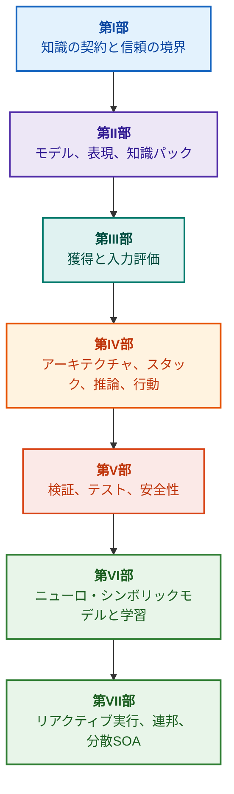

# 証拠駆動型エキスパートシステムのアーキテクチャ：形式オントロジーからニューロ・シンボリックAIへ

**高信頼性インテリジェントシステムの設計、数学的モデル、アーキテクチャ、および形式検証に関するエンジニアリング・モノグラフ兼ハンドブック（Safety-Critical & Evidence-Grounded AI）**

**著者:** [Mykola Fedchyk](../en/about-the-author.md) · [LinkedIn](https://www.linkedin.com/in/nickfedchik/)  
**形式:** エンジニアリング・モノグラフ / AIアーキテクトの実務手引書  
**発行年:** 2026年  

---

## 本書について

本書は、現代の人工知能が直面する最も深刻な危機、すなわちニューラルネットワーク生成の確率的妥当性と形式的数学証明の決定論的真理性との間にある「認識論的断絶（エピステミック・ギャップ）」を克服するために執筆された基礎的モノグラフであり、実践的エンジニアリングガイドです。本書の中心にあるのは次の妥協なき問いです。**「導出されるすべての結論が反駁不能であり、一次証拠まで完全に追跡可能で、かつ機能安全が最重視される重要産業分野（ISO 26262、IEC 61508、DO-178C、ISO/SAE 21434）において認証可能なエキスパートシステムをいかに設計するか？」**

著者は、新しいパラダイムである**「証拠駆動型ニューロ・シンボリックAI（Evidence-Grounded Neuro-Symbolic AI）」**を提唱し、体系化します。このアーキテクチャでは、統計的言語モデル（LLM/SLM）がクエリ仮説の生成と射影レンダリングを行う諮問的役割を担う一方、決定論的シンボリックコアが論理的無矛盾性、バイト単位の事実グラウンディング、権限境界の制御、および安全なアクション遷移の不変条件（インバリアント）を厳格に保証します。

### アーティファクトから検証可能な意思決定へ

システム要件仕様書、ソースコード、テスト実行ログ、規制規格、および設計判断は、現代のエンジニアリング現場に既に存在していますが、形式化されたセマンティクス、厳密な有効境界、および双方向の追跡可能性を欠いたまま、孤立したアーティファクトとして散在しています。合格したテストレポートが古いハードウェアリビジョンを参照していたり、安全規格の引用文が文脈から切り離されていたり、緊急時の設定ロールバックによって廃止されたコンポーネントが不正に再有効化されたりするリスクが常に存在します。

本書は、エンドツーエンドのエンジニアリングパイプラインを提示します。エンジニアリングアーティファクトの型付きデータ化および暗号署名付き知識パック化から、シンボリック推論、計画の段階的分解、反事実的説明、そして能力境界の監査に至るまでを網羅します。解説は、包括的なテストスイートを備えたGo言語による商用レベルの実装（[第1章](../en/ch01-introduction-to-expert-systems.md)）、厳密な数学的コントラクト（[第II部](../en/part-02-knowledge-models.md)）、およびリグレッションを論理的に排除する継続的学習プロトコル（[第25章](../en/ch25-how-expert-systems-learn.md)）によって支えられています。

### 対象読者

本書は、システムアーキテクト、信頼性・機能安全の主任エンジニア、推論エンジンの開発者、およびナレッジエンジニアを対象としています。基本概念の習得には、一階述語論理、ソフトウェアのバージョン管理、およびシステムライフサイクル管理の基礎知識があれば十分です。実践例の再現には標準的なGo開発環境を使用します。Goal Structuring Notation（GSN）による安全論証の形式合成、複雑系のシナジェティクス、ニューロモルフィックアクセラレータ、GNSS非依存自律航法を扱う専門章は、航空宇宙、自動運転、重要エネルギーインフラなどの先端ハイテク分野における証拠駆動型AIの最前線を切り拓きます。

---

## 学術的文脈と世界的研究における位置付け

本書は、エキスパートシステムを1980年代のルールベースシステム（CLIPSやMYCINなど）の遺物としてではなく、**「第3の波の証拠駆動型ニューロ・シンボリックAI（Third-Wave Evidence-Grounded Neuro-Symbolic AI）」**の最先端として再定義します。世界的な学術潮流の理論的基盤に立脚しつつ、抽象的な数学モデルと高性能システムエンジニアリングとの間のギャップを架橋します。

| 研究分野 | 世界の主要研究および著者 | 本書における概念的架橋 |
|---|---|---|
| **第3の波のニューロ・シンボリックAI（NeSy）** | Artur d'Avila Garcez, Luis C. Lamb (*Neurosymbolic AI: The 3rd Wave*, 2023; *Neural-Symbolic Cognitive Reasoning*, Springer, 2009); Henry Kautz (*The Third AI Summer*, AAAI 2022) | 責任の分離：統計モデル（SLM/LLM）がクエリ仮説を生成し、決定論的シンボリックコアが事実を形式検証して承認する（[第29章](../en/ch29-neuro-symbolic-architecture.md)）。 |
| **セマンティック制約と安全な学習** | Guy Van den Broeck et al. (*A Semantic Loss Function for Deep Learning with Symbolic Knowledge*, ICML 2018); Luc De Raedt et al. (*DeepProbLog*, IJCAI 2020) | 入力・出力の承認ゲートウェイ、形式スキーマに基づくニューラルネットワーク出力候補の決定論的セマンティックフィルタリング（[第28章](../en/ch28-dual-mode-expert-systems.md)、[第33章](../en/ch33-inter-system-knowledge-exchange-and-model-teaching.md)）。 |
| **取消可能推論と議論理論** | John L. Pollock (*Defeasible Reasoning*, 1987; *Cognitive Carpentry*, MIT Press, 1995); Phan Minh Dung (*Abstract Argumentation Frameworks*, AIJ 1995); Douglas Walton (*Argumentation Schemes*, Cambridge, 2008) | 知識を主張、出所、および反駁要因（*rebutting* / *undercutting defeaters*）に分解し、Dungの抽象議論フレームワークを用いて規範ルールベースの衝突を解決する（[第2章](../en/ch02-epistemology-of-machine-knowledge.md)、[第27章](../en/ch27-safety-case-gsn-synthesis.md)）。 |
| **自律的関連ルールマイニング（KBC）** | Luis Galárraga, Fabian M. Suchanek et al. (*AMIE: Association Rule Mining under Incomplete Evidence*, WWW 2013, VLDBJ 2015); Stephen Muggleton (*Inductive Logic Programming*, 1994) | 開放世界仮説の偽の反例を排除しつつ、部分完全性仮定（PCA）の下で知識ベースから関連ルールを自律的に帰納抽出する（[第34章](../en/ch34-deterministic-relational-analysis-abduction-and-socratic-dialogue.md)）。 |
| **形式安全シールドと認証（Safe AI）** | Bettina Könighofer, Roderick Bloem et al. (*Shield Synthesis*, 2017); Tim Kelly, Rob Weaver (*Goal Structuring Notation*, York, 2004); André Platzer (*Logical Foundations of CPS*, Springer, 2018) | ISO 26262/21434規格に適合するGSN記法での安全論証ツリー合成。周辺アクチュエータ向けの形式シールドおよび数値的妥当性エンベロープ（[第27章](../en/ch27-safety-case-gsn-synthesis.md)、[第30章](../en/ch30-safety-cybersecurity-co-engineering.md)、[第33章](../en/ch33-inter-system-knowledge-exchange-and-model-teaching.md)）。 |
| **認識論的論理学と知識記号論** | John F. Sowa (*Knowledge Representation: Logical, Philosophical, and Computational Foundations*, 2000); Frank van Harmelen et al. (*Handbook of Knowledge Representation*, Elsevier, 2008) | チャールズ・サンダース・パースの認識論的三項組（概念 → 判断 → 推論）。厳格な演繹的統制下における作業仮説の仮説形成（アブダクション）（[第6章](../en/ch06-applied-mathematics-for-expert-systems.md)、[第34章](../en/ch34-deterministic-relational-analysis-abduction-and-socratic-dialogue.md)）。 |
| **複雑系のサイバネティクスとシナジェティクス** | Norbert Wiener (*Cybernetics*, 1948); W. Ross Ashby (*An Introduction to Cybernetics*, 1956); Hermann Haken (*Synergetics: An Introduction*, 1977; *Advanced Synergetics*, 1983); Ilya Prigogine (*Order out of Chaos*, 1984) | アシュビーの必要多様性の法則、L0〜L4閉ループ制御、ハーケンの隷属原理による状態空間の秩序パラメータへの縮約、臨界減速（CSD）による相転移の早期検知、および知識ベースの散逸構造的安定化（[第6章](../en/ch06-applied-mathematics-for-expert-systems.md)、[第22章](../en/ch22-cybernetics-edge-to-backend.md)、[第35章](../en/ch35-self-organizing-expert-systems-synergetics-and-npu-runtime.md)）。 |
| **知識テスト、言語的不変性、リプシッツ較正** | Kent Beck (*TDD*, 2002); Martin Fowler (*Refactoring*, 2018); Clark Barrett, Leonardo de Moura (*Z3 SMT Solver*, 2008); Chuan Guo et al. (*On Calibration of Modern Neural Networks*, ICML 2017); Marco Tulio Ribeiro et al. (*CheckList*, ACL 2020); John L. Pollock (*Defeasible Reasoning*, 1987) | 4層の知識テストピラミッド（KTP）：前提モック（`PremiseMock`）によるアトミックルールの単体テスト（KUT）、空虚な真の罠の排除、6点スペクトル境界値分析（BVA）、ルール束と反駁要因（KIT）、言語変形に対するセマンティック不変性スコア（$\text{SIS} \ge 0.98$）、リレーチャタリングを防ぐリプシッツ連続性制約（$L_{\mathcal{K}} \le L_{\max}$）、およびスティグマジー的知識ギャップ蓄積（[第36章](../en/ch36-knowledge-testing-pyramid-and-variational-calibration.md)）。 |

---

## 著者の理論モデル、科学的研究、およびエンジニアリング革新

本書は、安全クリティカルなシステム設計、組み込みアーキテクチャ、および証拠駆動型AIの領域における著者の独創的研究と実践的貢献を結集したものです。単なる文献レビューにとどまらず、ニューロ・シンボリックの協調を数学的に検証可能な信頼性へと高める一連のオリジナル理論、プロトコル、およびアーキテクチャパターンを提示します。

### 1. 基礎的理論モデルと厳密な数学的形式化

1. **証拠グラウンディング不変条件（EGI）と事実承認ゲートウェイ（[第2章](../en/ch02-epistemology-of-machine-knowledge.md)、[第19章](../en/ch19-from-question-to-evidence.md)、[第28章](../en/ch28-dual-mode-expert-systems.md)、[第29章](../en/ch29-neuro-symbolic-architecture.md)）：**
   * *理論的概念:* 著者はグラウンディング完全性の不変条件 $\mathrm{Comp}(C) = 1.00$ を定式化し、証拠駆動型システムにおいて、一次情報源への決定論的射影なしにいかなる主張も事実として承認されてはならないことを数学的に定義しました。すべての事実は、不変のバイトオフセット `[byte_start, byte_end]`、正準フラグメントハッシュ `quote_sha256`、およびPROV-O出所証明書IDによって裏付けられます。
   * *工学的意義:* ハードウェアおよびソフトウェア境界に配置されたバイトレベルの承認ゲートウェイが、ニューラルネットワークのハルシネーションがバージョン管理された知識ベースへ混入することを完全に遮断し、裏付けのないデータに対するゼロトレランス（$ZHR = 1.00$）を保証します。
2. **4層の知識テストピラミッド（KTP）と推論空間のリプシッツ安定性（[第36章](../en/ch36-knowledge-testing-pyramid-and-variational-calibration.md)）：**
   * *理論的概念:* マーティン・ファウラーのテストピラミッドを知識システムに応用した体系的知識テストピラミッド（KTP）を提唱：前提のモック化（`PremiseMock`）による単体ルールテスト（KUT）、ルール相互作用と反駁要因の統合テスト（KIT）、および質問表現の多様体に対する変分較正（KVT）。
   * *数学的機構:* 空虚な真（$P \equiv \text{False}$ のときの $P \to Q$）の排除、言語的摂動に対するセマンティック不変性指標（$\mathrm{SIS} \ge 0.98$）、および入力の微小な変動に対する壊滅的なリレーチャタリングを排除する推論空間のリプシッツ連続性制約（$L_{\mathcal{K}} \le L_{\max}$）を導入。
3. **ポパー的規範反証理論とアクティブ・コンプライアンス・オーディター（[第39章](../en/ch39-active-compliance-auditor-and-popperian-testing.md)）：**
   * *理論的概念:* 単に質問に答える受動的オラクルから、カール・ポパーの反証可能性原理を実装する能動的知識監査アーキテクチャへの転換。システムが要件空間（ASPICE 4.0、ISO 26262、ISO/SAE 21434）を自律的にプロービングし、反例を合成し、不完全な仕様を特定して、網羅的な検証プログラムを設計します。
   * *実務的価値:* ニューラルモデルによるコーナーケースの創造的生成（System 1）とシンボリックコアによる決定論的規範検証（System 2）の融合により、制御ループ内の人間（Human-in-the-Loop）を承認疲弊から保護します。
4. **知識ベース次元のシナジェティック縮約とCSD早期診断（[第6章](../en/ch06-applied-mathematics-for-expert-systems.md)、[第22章](../en/ch22-cybernetics-edge-to-backend.md)、[第35章](../en/ch35-self-organizing-expert-systems-synergetics-and-npu-runtime.md)）：**
   * *理論的概念:* ヘルマン・ハーケンのシナジェティクス（秩序パラメータと隷属原理）およびイリヤ・プリゴジンの散逸構造論を複雑な知識ベースの進化に適用。
   * *学術的成果:* テレメトリの多次元状態空間を秩序パラメータへ縮約する手法を開発し、自己相関と分散に基づく臨界減速（*Critical Slowing Down*, CSD）検出器を統合。緊急閾値センサーが反応する遥か前に、動的破綻の兆候を予知します。
5. **行動自律性レベル（A0〜A4）モデル、認可ゲートウェイ、および冪等サガ（[第21章](../en/ch21-from-recommendation-to-action.md)）：**
   * *理論的概念:* システムアクションの離散的権限スケール（A0: 受動的分析、A1: ドラフト作成、A2: 人間承認アクション、A3: 監視付き自律、A4: 緊急フェイルセーフ遮断）を定義し、システム全体ではなく「アクション、環境、リスクレベル」の組に対して割り当てます。
   * *数学的機構:* 暗号鍵 $k$ に基づく代数的冪等性インバリアント $f(f(x, k), k) \equiv f(x, k)$、段階的閉ループ実行、および `OutcomeUnknown` 状態と事後条件の独立検証を備えた分散補償サガプロトコルを確立。
6. **GSN記法における機能安全とサイバーセキュリティの形式的共同エンジニアリング（[第27章](../en/ch27-safety-case-gsn-synthesis.md)、[第30章](../en/ch30-safety-cybersecurity-co-engineering.md)）：**
   * *理論的概念:* ISO 26262（機能安全）とISO/SAE 21434（サイバーセキュリティ）の要求事項を同時に満たすGSN（Goal Structuring Notation）論証ツリーの整合合成モデルを確立。
   * *工学的ブレークスルー:* 対立する目標（緊急応答時間バジェット vs 暗号認証の深度）間の数学的調停、およびソルト付きマークルツリーを用いた外部監査人向け証拠の選択的開示プロトコルを構築。
7. **説明の忠実性とセマンティック整合性の検証プロトコル（[第20章](../en/ch20-explanation-engine.md)）：**
   * *理論的概念:* 説明を生成モデルの自由記述テキストとしてではなく、証明グラフ、ルールバージョン、および固定された事実スナップショットから一意に導出される決定論的アーティファクトとして扱います。
   * *数学的機構:* 忠実性評価メトリックゲート（$C_{\text{facts}} = 1.00, H_{\text{free}} = 1.00$）を形式化し、シンボリック推論結果とオペレータ向け言語化との間にわずかでも乖離が生じた場合、フェイルセーフな固定テンプレートへ自動フォールバックします。

---

### 2. 実証研究、著者の実験ベンチ、およびシステムエンジニアリング

1. **`mmap`とゼロデシリアライゼーションによる不変バイナリ知識パック（[第32章](../en/ch32-high-performance-knowledge-packs-mmap-and-harvesting.md)）：**
   * *著者の設計:* 知識パックの2層アーキテクチャ（一次情報源の正準層 + インデックスの派生実体化層）。
   * *実証結果:* システムコール `mmap` によるインデックスの仮想アドレス空間への直接マッピング、動的メモリ確保オーバーヘッドの完全排除（zero-allocation）、およびオントロジーの容量に依存しないサブリニア時間でのエンジン起動を実現。
2. **IETF RFC-1000およびW3C-150標準コーパスによる実証較正ベンチ（[第2章](../en/ch02-epistemology-of-machine-knowledge.md)、[第4章](../en/ch04-evolution-from-bayes-to-evidence-ai.md)、[第14章](../en/ch14-requirements-detection-and-formalization.md)、[第25章](../en/ch25-how-expert-systems-learn.md)）：**
   * *著者の実験:* 1,000件の現行IETF RFC規格（インターネット発展の5つの時代に分類）およびW3Cの150件の複雑な診断クエリ（論理的矛盾や作話の意図的注入を含む）に基づく大規模実証環境を構築。
   * *実務的成果:* 客観的な知識評価マトリクスの構築、規範の矛盾の検出、および更新時における知識ベースの回帰防止を数学的に実証。
3. **多段階リレーショナル分析、シンボリックアブダクション、およびソクラテス式対話（[第34章](../en/ch34-deterministic-relational-analysis-abduction-and-socratic-dialogue.md)）：**
   * *著者の開発:* 双方向有界幅優先探索（Bidirectional Bounded BFS, $k \le 6$）アルゴリズムにより、ループを防止しながら相互に関連するエンティティ間の複合バイト証拠チェーンを構成。
   * *工学的利点:* 厳格な演繹的統制下におけるパースのシンボリックアブダクションの実装、および型付きソクラテス式釈明フレーム（*Clarification Frames*）により、閉世界仮説（CWA）による盲目的な拒絶を避け、人間との建設的な対話モードへ移行。
4. **周辺制御システム向け形式シールドおよび数値的妥当性エンベロープ（[第33章](../en/ch33-inter-system-knowledge-exchange-and-model-teaching.md)、[付録B](../en/appendix-b-robotics-and-cyber-physical-systems.md)、[付録C](../en/appendix-c-autonomous-navigation-and-geosearch.md)、[付録E](../en/appendix-e-mixed-signal-neuromorphic-expert-systems.md)）：**
   * *著者の設計:* デジタルシグナルプロセッサ（DSP）およびGNSS非依存自律航法（TRN/DSMAC/VIO）向けに、離散論理インバリアントを連続数値安全コリドーへ変換する手法。
   * *運用の信頼性:* Ed25519暗号に基づく署名付きルール交換、新規候補ルールの安全な隔離検疫、およびハードウェアレベルでの危険な制御コマンド遮断。
5. **説明機能を通じた機密漏洩防止と差分監査（[第20章](../en/ch20-explanation-engine.md)）：**
   * *著者の開発:* 証明グラフのノードおよびエッジごとにACL検査を行う説明中間表現縮約プロトコル（$\mathrm{EIR}_{\text{redacted}}$）により、連続する対照的「WHY NOT」クエリを通じたモデル再構築サイドチャネル攻撃を遮断。

---

## 分類と構成の原則

本書の各部は、章が執筆された年や個別技術の名称ではなく、解決すべき中核的な工学的課題に基づいて分類されています。各章は1つの主要部に属し、関連する手法はその中心的な課題の解決方法を説明します。章番号とファイル名は恒久的な識別子として維持されているため、論理的な読書順序は番号順と異なる場合があります。

章内のセクションタイトルは明確に定義されたカテゴリに分かれており、同列の技術リストではなく、一貫した論証の連続として読む必要があります。

| セクション分類 | 読者の疑問 | 章における役割 |
|---|---|---|
| 問題と課題の境界 | 何を解決すべきか？ | 主要な課題と適用領域の定義 |
| 対象とモデル | どのようなデータ、知識、状態を扱うか？ | 概念、型、および前提条件の統一 |
| 手法と手順 | どのように結果を得るか？ | 推論、変換、制御のアルゴリズムの説明 |
| 実装とツール | 何を用いて手順を実行するか？ | 手法のソフトウェアおよびハードウェアでの具現化 |
| 検証とテストケース | いかに誤りを検出するか？ | 独立した基準との照合による結果の検証 |
| 結論と結果の限界 | 何が証明され、何が未解決か？ | 約束を過大に広げることなく中核の問いに答える |

国、産業分野、商用製品は適用の文脈であり、この分類の独立した階層ではありません。用語集、略語、文献、ナビゲーションは参考資料であり、章の独立した主題ではありません。

完全な編集レビューマップには、各章の主要テーマの評価、隣接する議論間の境界、構成と結論に関する注記が含まれています。新しい要約が追加されたからといって、章内のすべての内容リスクが解消されたことを意味するものではありません。

## 推奨読書ルート

**最初のソフトウェア検証:** [1](../en/ch01-introduction-to-expert-systems.md) → [7](../en/ch07-knowledge-base-typology.md) → [8](../en/ch08-engineering-artifacts-as-data.md) → [17](../en/ch17-implementation-stack.md) → [23](../en/ch23-knowledge-base-verification.md) → [25](../en/ch25-how-expert-systems-learn.md)。目標：証拠の根拠、ネガティブテスト、制御された知識更新を伴う再現可能な結論の獲得。言語モデルの使用は必須ではありません。

**知識エンジニアリング:** [第II部](../en/part-02-knowledge-models.md) → [第III部](../en/part-03-knowledge-engineering-nlp.md) → [19](../en/ch19-from-question-to-evidence.md) → [20](../en/ch20-explanation-engine.md) → [26](../en/ch26-continual-learning.md)。目標：セマンティクス、出所、知識獲得、および新規候補の検証の調和。第II部には、第7章〜第11章の科学的検証プログラムが含まれます。

**ソリューションアーキテクチャ:** [16](../en/ch16-expert-systems-architecture.md) → [19](../en/ch19-from-question-to-evidence.md) → [31](../en/ch31-syllogistic-reasoning-and-relation-lattices.md) → [20](../en/ch20-explanation-engine.md) → [21](../en/ch21-from-recommendation-to-action.md)。目標：証拠根拠の検証、規範の適用、説明の生成、および実行権限の明確な分離。

**検証と安全性:** [23](../en/ch23-knowledge-base-verification.md) → [36](../en/ch36-knowledge-testing-pyramid-and-variational-calibration.md) → [25](../en/ch25-how-expert-systems-learn.md) → [26](../en/ch26-continual-learning.md) → [27](../en/ch27-safety-case-gsn-synthesis.md) → [30](../en/ch30-safety-cybersecurity-co-engineering.md)。外部システムの診断については、[第24章](../en/ch24-system-diagnosis.md)で詳しく解説しています。

**ハイブリッド応答と運用:** [第VI部](../en/part-06-frontiers-neuro-symbolic.md) → [第VII部](../en/part-07-runtime-and-knowledge-exchange.md) → [40](../en/ch40-distributed-epistemic-architectures-soa-and-cluster-scaling.md) および関連付録。目標：言語モデルの統合、知識ギャップの管理、分散知識サービスアーキテクチャの構築、およびシステム間知識共有の検証。[第2章](../en/ch02-epistemology-of-machine-knowledge.md)、[第4章](../en/ch04-evolution-from-bayes-to-evidence-ai.md)、[第6章](../en/ch06-applied-mathematics-for-expert-systems.md)は、必要に応じてコントラクト、歴史、数学的リファレンスとして参照してください。

---

## 工学的約束の境界

本書は教育・研究資料であり、認証された手順や特定の規格に対する適合証明書ではありません。決定論的実行は事実の正確性を証明するものではなく、暗号ハッシュや電子署名は絶対的な真理を証明するものではありません。また、議論グラフは人間の専門家による評価に代わるものではありません。製品全体の信頼性要件を単一の言語モデルのエラー率と同等とみなしたり、すべてのソフトウェアコンポーネントに無条件に適用したりしてはなりません。

自動パース処理はデータの手作業による転記を削減しますが、ドメインモデリング、ピアレビュー、ナレッジオーナーの責務を代替するものではありません。Protégé、手作業レビュー、および自動収集は相補的に機能します。数学的保証は特定の言語プロファイルおよび前提条件にのみ適用されます。測定された処理速度は、特定のクエリ、コーパス、および環境に依存します。著者の過去の測定記録は、オープンな学習ベンチマークや今後の研究と明確に区別されています。

製品のリリース、リスクの受容、および業界規制への準拠に関する決定権は、常に権限を持つ人間の判断に委ねられます。エキスパートシステムは検証可能な証拠材料を準備し、合意されたポリシーを実行しますが、それ自体が規制当局の権限を持つことはありません。

---

## 本書の構成

本書は7つの主要部、40の章、および5つの付録で構成されています。各章は1つの主要部に属しています。ナビゲーションにおける前後の章は以下の論理順序に従っています。章番号とファイル名は維持されています。

---

### [第I部 概念的および認識論的基礎](../en/part-01-foundations.md)

*エキスパートシステムがいつ必要とされるか、何を知識とみなすか、そして組織的意思決定の根拠をいかに保持するか。*

* [第1章 エキスパートシステム入門：カオスから管理された知識へ](../en/ch01-introduction-to-expert-systems.md)
* [第2章 エンジニアのための認識論：機械は何を知識と呼ぶ権利があるか](../en/ch02-epistemology-of-machine-knowledge.md)
* [第3章 エキスパートシステムと従来の情報検索システムとの相違点](../en/ch03-beyond-reference-information-systems.md)
* [第4章 エキスパートシステムの進化：ベイズの定理から証拠駆動型AIへ](../en/ch04-evolution-from-bayes-to-evidence-ai.md)
* [第5章 信頼の三項組：エキスパートシステム、証拠駆動型推奨、および組織の記憶](../en/ch05-triad-of-trust-and-corporate-memory.md)

---

### [第II部 数学モデル、知識表現、および知識ストレージ](../en/part-02-knowledge-models.md)

*数学的演算と表現の選択、型付きアーティファクト、追跡可能性グラフ、および不変知識パック。*

* [第6章 エキスパートシステムのための応用数学：ルール、確率、グラフ、因果関係](../en/ch06-applied-mathematics-for-expert-systems.md)
* [第7章 知識ベースの類型論：ルール、オントロジー、事例、ベクトル](../en/ch07-knowledge-base-typology.md)
* [第8章 エキスパートシステムのデータとしてのエンジニアリングアーティファクト](../en/ch08-engineering-artifacts-as-data.md)
* [第9章 エンジニアリング知識グラフ：要件からハードウェアへの追跡可能性](../en/ch09-engineering-knowledge-graph-traceability.md)
* [第32章 不変知識パック：バイトレベル承認、インデックス、メモリマッピング](../en/ch32-high-performance-knowledge-packs-mmap-and-harvesting.md)

---

### [第III部 知識獲得、言語分析、および入力評価](../en/part-03-knowledge-engineering-nlp.md)

*ドキュメント、専門家の経験、および観測：候補の抽出、言語分析、形式化、および証拠の評価。*

* [第10章 知識獲得システム：ソース、承認、およびライフサイクル](../en/ch10-knowledge-acquisition-systems.md)
* [第11章 専門家からの知識抽出：インタビュー、認知マップ、および経験の形式化](../en/ch11-knowledge-elicitation-from-experts.md)
* [第12章 言語分析とローカルモデル：意味と出所の保存](../en/ch12-linguistic-analysis-and-local-models.md)
* [第13章 自然言語の多様性対決定論：質問の意味のコンパイル](../en/ch13-language-variability-vs-determinism.md)
* [第14章 要件とモダリティの検出：規範テキストから不変条件へ](../en/ch14-requirements-detection-and-formalization.md)
* [第15章 知識抽出と知識ベース構築：事実、文法、オートマトン](../en/ch15-knowledge-extraction-and-kb-construction.md)
* [第37章 入力情報の評価：ソース、証拠、および不確実性](../en/ch37-input-information-assessment-and-algorithmic-skepticism.md)

---

### [第IV部 アーキテクチャ、技術スタック、推論、および行動](../en/part-04-architecture-and-inference.md)

*アーキテクチャコントラクト、技術スタック、ハードウェア実行、主張の検証、規範に基づく推論、説明、およびサイバネティクス制御ループ。*

* [第16章 エキスパートシステムのアーキテクチャ：形式的知識から証拠に基づく意思決定へ](../en/ch16-expert-systems-architecture.md)
* [第17章 技術スタック：ツール、プログラミング言語、ルールエンジンの選定基準](../en/ch17-implementation-stack.md)
* [第18章 実行インフラストラクチャ：ローカルモデル、ハードウェアアクセラレータ、Edge、On-Premise](../en/ch18-execution-infrastructure.md)
* [第19章 質問から証拠へ：検索、グラウンディング、主張の検証](../en/ch19-from-question-to-evidence.md)
* [第31章 規範に基づく推論：述語階層、例外、有効性](../en/ch31-syllogistic-reasoning-and-relation-lattices.md)
* [第20章 説明エンジン：意思決定、拒否、能力の限界](../en/ch20-explanation-engine.md)
* [第21章 推奨から行動へ：権限管理と本番環境での安全な実行](../en/ch21-from-recommendation-to-action.md)
* [第22章 サイバネティクス制御ループ：センサー、周辺機器、フィードバック](../en/ch22-cybernetics-edge-to-backend.md)

---

### [第V部 検証、テスト、診断、および安全論証](../en/part-05-verification-and-learning.md)

*ルールの形式検証、知識テストピラミッド、ポパー的反証、技術診断、および機能安全とサイバーセキュリティの論証。*

* [第23章 知識ベースの検証：ルールの無矛盾性、完全性、信頼性をいかに検査するか](../en/ch23-knowledge-base-verification.md)
* [第36章 知識テストピラミッド：ルール、相互作用、応答の安定性](../en/ch36-knowledge-testing-pyramid-and-variational-calibration.md)
* [第39章 アクティブ・エキスパートテスター：ポパー的反証、規制適合（ASPICE/ISO 26262/ISO 21434）、および自律的テスト設計](../en/ch39-active-compliance-auditor-and-popperian-testing.md)
* [第24章 技術診断：不完全性の下で症状と根本原因を混同しない方法](../en/ch24-system-diagnosis.md)
* [第27章 安全論証：議論の合成と検証](../en/ch27-safety-case-gsn-synthesis.md)
* [第30章 機能安全とサイバーセキュリティの共同エンジニアリング](../en/ch30-safety-cybersecurity-co-engineering.md)

---

### [第VI部 ニューロ・シンボリックモデル、認知的フロンティア、および継続的学習](../en/part-06-frontiers-neuro-symbolic.md)

*厳密な結論と諮問的仮説、言語モデルの統合、知識ギャップ、未確認応答の制御、テストマトリクス、および経験からの継続的学習。*

* [第28章 デュアルモードエキスパートシステム：厳格な推論と諮問的仮説](../en/ch28-dual-mode-expert-systems.md)
* [第29章 ニューロ・シンボリックアーキテクチャ：言語モデルと証拠根拠の検証](../en/ch29-neuro-symbolic-architecture.md)
* [第34章 知識ギャップ：リレーショナル探索、アブダクション、釈明対話](../en/ch34-deterministic-relational-analysis-abduction-and-socratic-dialogue.md)
* [第38章 機械のハルシネーションと知識不足：証拠駆動型の応答制御](../en/ch38-curing-machine-hallucinations-and-knowledge-deficits.md)
* [第25章 エキスパートシステムの教え方：テストマトリクス、知識監査、回帰防止](../en/ch25-how-expert-systems-learn.md)
* [第26章 経験からの継続的学習（Continual Learning）とシステムログドリフトの克服](../en/ch26-continual-learning.md)

---

### [第VII部 リアクティブ実行、システム間知識共有、および分散SOA](../en/part-07-runtime-and-knowledge-exchange.md)

*ルールのリアクティブ実行、シナジェティクスと知識の相転移、システム間共有、およびエンタープライズ規模の分散エピステミックアーキテクチャ。*

* [第35章 リアクティブエキスパートシステム：イベント、取り消し、知識適応](../en/ch35-self-organizing-expert-systems-synergetics-and-npu-runtime.md)
* [第33章 システム間知識共有：外部システムへのルール配信、モデル教育、安全なフィードバック](../en/ch33-inter-system-knowledge-exchange-and-model-teaching.md)
* [第40章 証拠駆動型エキスパートシステムの分散アーキテクチャ：エピステミックSOA、セマンティックルーティング、メモリ階層、複数ソースの取消可能調停](../en/ch40-distributed-epistemic-architectures-soa-and-cluster-scaling.md)

---

### 付録

* [付録A 複雑なエンジニアリングプロジェクトにおける証拠駆動型研究の実践的フレームワーク](../en/appendix-a-evidence-governed-framework.md)
* [付録B 自律ロボティクスおよびサイバーフィジカルシステムにおける証拠駆動型エキスパートシステム](../en/appendix-b-robotics-and-cyber-physical-systems.md)
* [付録C GNSS非依存自律航法：地理空間マッチング（TRN/DSMAC）、視覚オドメトリ（VIO）、センサーフュージョンのエキスパート調停](../en/appendix-c-autonomous-navigation-and-geosearch.md)
* [付録D アナログエキスパートシステム、ニューロモルフィックコンピューティング、ハードウェア論理推論](../en/appendix-d-analog-expert-systems-and-neuromorphic-computing.md)
* [付録E アナログ・デジタル混在エキスパートシステム：証拠管理下でのニューロモルフィック、アナログ、および非従来型コンピューティング](../en/appendix-e-mixed-signal-neuromorphic-expert-systems.md)
* [著者について：Mykola Fedchyk (Nick Fedchik)](../en/about-the-author.md)

---

## 今後の研究方針

今後の研究課題は、既成の保証ではありません。知識パックの再現可能な収集、限定された形式表現の検証、明確な権限に基づくエージェントの制御、特定の形式化された主張の機密検証、制御された失効、および機械の忘却（machine unlearning）の研究が含まれます。モデルの特性を証明しても物理的な製品の適合性が自動的に証明されるわけではなく、ルールを削除してもトレーニング済みモデルからデータの影響が完全に消去されるわけではありません。

ハードウェアアクセラレータおよび非従来型コンピューティングについては、まずエラー率、レイテンシ、消費電力、および障害時の動作が測定されます。これらに関する課題は、[第29章](../en/ch29-neuro-symbolic-architecture.md)、[第32章](../en/ch32-high-performance-knowledge-packs-mmap-and-harvesting.md)、ならびに[付録D](../en/appendix-d-analog-expert-systems-and-neuromorphic-computing.md)および[付録E](../en/appendix-e-mixed-signal-neuromorphic-expert-systems.md)で検討されています。第7章〜第11章の実践的研究プログラムは[第II部](../en/part-02-knowledge-models.md)に記載されており、各提案には仮説、対照比較、および反証条件が設定されています。
