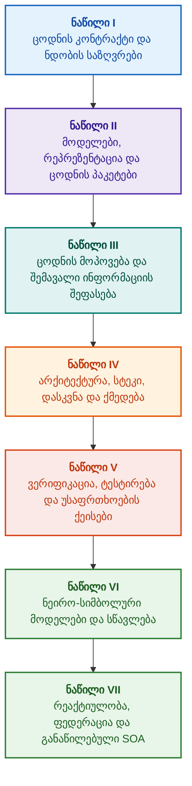

# მტკიცებულებებზე დაფუძნებული ექსპერტული სისტემების არქიტექტურა: ფორმალური ონტოლოგიებიდან ნეირო-სიმბოლურ ხელოვნურ ინტელექტამდე

**საინჟინრო მონოგრაფია და ცნობარი მაღალი სანდოობის ინტელექტუალური სისტემების პროექტირების, მათემატიკური საფუძვლების, არქიტექტურისა და ვერიფიკაციის შესახებ (Safety-Critical & Evidence-Grounded AI)**

**ავტორი:** [Mykola Fedchyk](../en/about-the-author.md) · [LinkedIn](https://www.linkedin.com/in/nickfedchik/)  
**ფორმატი:** საინჟინრო მონოგრაფია / ხელოვნური ინტელექტის არქიტექტორის ცნობარი  
**წელი:** 2026  

---

## წიგნის შესახებ

წინამდებარე მონოგრაფია წარმოადგენს ფუნდამენტურ კვლევით ნაშრომსა და საინჟინრო სახელმძღვანელოს, რომელიც ეძღვნება თანამედროვე ხელოვნური ინტელექტის უმთავრესი კრიზისის გადალახვას: ეპისტემურ ნაპრალს ნეირონული ქსელების გენერირების ალბათურ დამაჯერებლობასა და ფორმალური მათემატიკური დამტკიცებების დეტერმინისტულ ჭეშმარიტებას შორის. ამ კვლევის ცენტრში დგას უკომპრომისო კითხვა: **როგორ დავაპროექტოთ ექსპერტული სისტემა, რომლის თითოეული დასკვნა იქნება უტყუარი, სრულად მიკვლევადი პირველად მტკიცებულებათა წყაროებამდე და ვარგისი სერტიფიკაციისთვის უსაფრთხოებისთვის კრიტიკულ საინჟინრო სფეროებში (ISO 26262, IEC 61508, DO-178C, ISO/SAE 21434)?**

ავტორი ასაბუთებს და ნერგავს ახალ პარადიგმას: **მტკიცებულებებზე დაფუძნებულ ნეირო-სიმბოლურ AI-ს (Evidence-Grounded Neuro-Symbolic AI)**, რომელშიც სტატისტიკური მოდელები (LLM/SLM) ასრულებენ ჰიპოთეზების გენერირებისა და პროექციების რენდერინგის საკონსულტაციო ფუნქციას, მაშინ როდესაც დეტერმინისტული სიმბოლური ბირთვი ურყევად უზრუნველყოფს ლოგიკური თანმიმდევრულობის, ბაიტების დონეზე ფაქტების დამაგრების, უფლებამოსილების საზღვრების დაცვისა და ქმედებაზე უსაფრთხო გადასვლის ინვარიანტებს.

### არტეფაქტიდან გადამოწმებად გადაწყვეტილებამდე

სისტემური მოთხოვნები, საწყისი კოდი, ტესტირების ჟურნალები, რეგულაციური სტანდარტები და საინჟინრო გადაწყვეტილებები დღეს თანამედროვე საწარმოო გარემოს განუყოფელი ნაწილია. თუმცა, ისინი უმეტესწილად ფუნქციონირებენ როგორც გათიშული არტეფაქტები ფორმალიზებული სემანტიკის, მკაფიო ვალიდურობის საზღვრებისა და ორმხრივი მიკვლევადობის გარეშე. წარმატებული კვალიფიკაციის ტესტის ანგარიში შეიძლება ეყრდნობოდეს აპარატურის მოძველებულ ვერსიას; ფუნქციური უსაფრთხოების სტანდარტიდან ციტატა შეიძლება ამოგლეჯილი იყოს კონტექსტიდან; ავტომატურმა საგანგებო კონფიგურაციის უკუქცევამ შეიძლება შემთხვევით გაააქტიუროს გაუქმებული კომპონენტი.

ეს მონოგრაფია აგებს სრულყოფილ საინჟინრო კონვეიერს: საინჟინრო არტეფაქტების ტიპიზებულ მონაცემებად და კრიპტოგრაფიულად ხელმოწერილ ცოდნის პაკეტებად ფორმალიზებიდან დაწყებული, სიმბოლურ ლოგიკურ დასკვნამდე, ეტაპობრივ გეგმის დეკომპოზიციამდე, კონტრფაქტუალურ ახსნა-განმარტებებამდე და კომპეტენციის საზღვრების აუდიტამდე. პრაქტიკული ექსპოზიცია ეფუძნება Go ენაზე შექმნილ სამრეწველო დონის იმპლემენტაციებს ამომწურავი ტესტებით ([თავი 1](../en/ch01-introduction-to-expert-systems.md)), მკაცრ მათემატიკურ კონტრაქტებს ([ნაწილი II](../en/part-02-knowledge-models.md)) და უწყვეტი სწავლის ოქმებს, რომლებიც დამტკიცებულად გამორიცხავს რეგრესიებს ([თავი 25](../en/ch25-how-expert-systems-learn.md)).

### სამიზნე აუდიტორია

წიგნი განკუთვნილია სისტემური არქიტექტორებისთვის, საიმედოობისა და ფუნქციური უსაფრთხოების წამყვანი ინჟინრებისთვის, ლოგიკური დასკვნის ძრავების დეველოპერებისა და ცოდნის ინჟინრებისთვის. ძირითადი ცნებების ათვისება მოითხოვს მხოლოდ პირველი რიგის პრედიკატთა ლოგიკის, პროგრამული უზრუნველყოფის ვერსიონირებისა და სასიცოცხლო ციკლის მართვის საბაზისო ცოდნას; პრაქტიკული მაგალითების რეპროდუცირებისთვის საკმარისია სტანდარტული Go ინსტრუმენტები. სპეციალიზებული თავები, რომლებიც მოიცავს Goal Structuring Notation (GSN) ფორმალურ სინთეზს, რთული სისტემების სინერგეტიკას, ნეირომორფულ ამაჩქარებლებსა და ავტონომიურ ნავიგაციას GNSS-ის გარეშე, იკვლევს მტკიცებულებებზე დაფუძნებული AI-ს მოწინავე საზღვრებს აეროკოსმოსურ ინდუსტრიაში, ავტონომიურ ტრანსპორტსა და კრიტიკულ ინფრასტრუქტურაში.

---

## სამეცნიერო კონტექსტი და მონოგრაფიის გლობალური ადგილი

მონოგრაფია ექსპერტულ სისტემებს განიხილავს არა როგორც 1980-იანი წლების წესებზე დაფუძნებული სისტემების (როგორიცაა CLIPS ან MYCIN) არქაულ მემკვიდრეობას, არამედ როგორც **მესამე ტალღის მტკიცებულებებზე დაფუძნებული ნეირო-სიმბოლური AI-ს (Third-Wave Evidence-Grounded Neuro-Symbolic AI)** ავანგარდს. მეთოდოლოგია აკავშირებს წამყვანი გლობალური სამეცნიერო სკოლების თეორიულ საფუძვლებს მაღალმწარმოებლურ სისტემურ ინჟინერიასთან:

| სამეცნიერო დისციპლინა | ძირითადი გლობალური ნაშრომები და ავტორები | კონცეპტუალური ხიდი ამ მონოგრაფიაში |
|---|---|---|
| **მესამე ტალღის ნეირო-სიმბოლური AI (NeSy)** | Artur d'Avila Garcez, Luis C. Lamb (*Neurosymbolic AI: The 3rd Wave*, 2023; *Neural-Symbolic Cognitive Reasoning*, Springer, 2009); Henry Kautz (*The Third AI Summer*, AAAI 2022) | პასუხისმგებლობების გამიჯვნა: სტატისტიკური მოდელები (SLM/LLM) აგენერირებენ შეკითხვის ჰიპოთეზებს, ხოლო დეტერმინისტული სიმბოლური ბირთვი ფორმალურად ამოწმებს და იღებს ფაქტებს ([თავი 29](../en/ch29-neuro-symbolic-architecture.md)). |
| **სემანტიკური შეზღუდვები და უსაფრთხო სწავლება** | Guy Van den Broeck et al. (*A Semantic Loss Function for Deep Learning with Symbolic Knowledge*, ICML 2018); Luc De Raedt et al. (*DeepProbLog*, IJCAI 2020) | დაშვებისა და გამოსვლის კარიბჭეები, ნეირონული ქსელების კანდიდატური მტკიცებების დეტერმინისტული სემანტიკური ფილტრაცია ფორმალურ სქემებთან მიმართებაში ([თავები 28](../en/ch28-dual-mode-expert-systems.md), [33](../en/ch33-inter-system-knowledge-exchange-and-model-teaching.md)). |
| **გაბათილებადი მსჯელობა და არგუმენტაციის თეორია** | John L. Pollock (*Defeasible Reasoning*, 1987; *Cognitive Carpentry*, MIT Press, 1995); Phan Minh Dung (*Abstract Argumentation Frameworks*, AIJ 1995); Douglas Walton (*Argumentation Schemes*, Cambridge, 2008) | ცოდნის დეკომპოზიცია მტკიცებებად, წარმომავლობად და დეფიტერებად (*defeaters*: *rebutting* და *undercutting*); კონფლიქტების გადაწყვეტა ნორმატიულ წესთა ბაზებში დუნგის არგუმენტაციის ჩარჩოებით ([თავები 2](../en/ch02-epistemology-of-machine-knowledge.md), [27](../en/ch27-safety-case-gsn-synthesis.md)). |
| **ასოციაციური წესების ავტომატური მოპოვება (KBC)** | Luis Galárraga, Fabian M. Suchanek et al. (*AMIE: Association Rule Mining under Incomplete Evidence*, WWW 2013, VLDBJ 2015); Stephen Muggleton (*Inductive Logic Programming*, 1994) | ავტონომიური წესების ინდუქცია ცოდნის ბაზებიდან ნაწილობრივი სისრულის დაშვების (PCA) პირობებში, ღია სამყაროს ცრუ კონტრმაგალითების გამორიცხვით ([თავი 34](../en/ch34-deterministic-relational-analysis-abduction-and-socratic-dialogue.md)). |
| **ფორმალური უსაფრთხოების ფარები და სერტიფიკაცია (Safe AI)** | Bettina Könighofer, Roderick Bloem et al. (*Shield Synthesis*, 2017); Tim Kelly, Rob Weaver (*Goal Structuring Notation*, York, 2004); André Platzer (*Logical Foundations of CPS*, Springer, 2018) | სტრუქტურირებული უსაფრთხოების ქეისების სინთეზი GSN ნოტაციაში ISO 26262/21434 სტანდარტებისთვის; ფორმალური ფარები და რიცხვითი ვალიდურობის კონვერტები პერიფერიული აქტუატორებისთვის ([თავები 27](../en/ch27-safety-case-gsn-synthesis.md), [30](../en/ch30-safety-cybersecurity-co-engineering.md), [33](../en/ch33-inter-system-knowledge-exchange-and-model-teaching.md)). |
| **ეპისტემური ლოგიკა და ცოდნის სემიოტიკა** | John F. Sowa (*Knowledge Representation: Logical, Philosophical, and Computational Foundations*, 2000); Frank van Harmelen et al. (*Handbook of Knowledge Representation*, Elsevier, 2008) | ჩარლზ სანდერს პირსის ეპისტემური ტრიადა (ცნება → მსჯელობა → დასკვნა); სამუშაო ჰიპოთეზების აბდუქციური გენერირება მკაცრი დედუქციური კონტროლის ქვეშ ([თავები 6](../en/ch06-applied-mathematics-for-expert-systems.md), [34](../en/ch34-deterministic-relational-analysis-abduction-and-socratic-dialogue.md)). |
| **რთული სისტემების კიბერნეტიკა და სინერგეტიკა** | Norbert Wiener (*Cybernetics*, 1948); W. Ross Ashby (*An Introduction to Cybernetics*, 1956); Hermann Haken (*Synergetics: An Introduction*, 1977; *Advanced Synergetics*, 1983); Ilya Prigogine (*Order out of Chaos*, 1984) | ეშბის აუცილებელი მრავალფეროვნების კანონი, დახურული L0–L4 მართვის ციკლები, ფაზური სივრცის რედუქცია წესრიგის პარამეტრებამდე ჰაკენის დაქვემდებარების პრინციპით, ფაზური გადასვლების ადრეული გაფრთხილება კრიტიკული შენელების (CSD) მეშვეობით და ცოდნის ბაზების დისიპაციური სტაბილიზაცია ([თავები 6](../en/ch06-applied-mathematics-for-expert-systems.md), [22](../en/ch22-cybernetics-edge-to-backend.md), [35](../en/ch35-self-organizing-expert-systems-synergetics-and-npu-runtime.md)). |
| **ცოდნის ტესტირება, ინვარიანტობა და ლიპშიცის კალიბრაცია** | Kent Beck (*TDD*, 2002); Martin Fowler (*Refactoring*, 2018); Clark Barrett, Leonardo de Moura (*Z3 SMT Solver*, 2008); Chuan Guo et al. (*On Calibration of Modern Neural Networks*, ICML 2017); Marco Tulio Ribeiro et al. (*CheckList*, ACL 2020); John L. Pollock (*Defeasible Reasoning*, 1987) | ცოდნის ტესტირების ოთხდონიანი პირამიდა (KTP): ატომური წესების იზოლირებული ერთეულოვანი ტესტირება (KUT) სიმულირებული პრემისებით (`PremiseMock`), ვაკუუმური ჭეშმარიტების მახის აღმოფხვრა, 6-წერტილიანი სპექტრული სასაზღვრო მნიშვნელობების ანალიზი (BVA), წესთა ბადეები და დეფიტერები (KIT), სემანტიკური ინვარიანტობის ქულა ($\text{SIS} \ge 0.98$) ენობრივი მუტაციებისას, ლიპშიცის უწყვეტობის საზღვრები ($L_{\mathcal{K}} \le L_{\max}$), რაც გამორიცხავს რელეს რყევას, და ცოდნის ხარვეზების სტიგმერგიული დაფიქსირება ([თავი 36](../en/ch36-knowledge-testing-pyramid-and-variational-calibration.md)). |

---

## ავტორისეული თეორიული მოდელები, სამეცნიერო კვლევები და საინჟინრო ინოვაციები

ეს მონოგრაფია აჯამებს ავტორის ფუნდამენტურ კვლევებსა და სისტემურ-საინჟინრო წვლილს უსაფრთხოებისთვის კრიტიკული პროგრამული უზრუნველყოფის, ჩაშენებული არქიტექტურებისა და მტკიცებულებებზე დაფუძნებული AI-ს დარგში. წმინდა მიმოხილვითი ლიტერატურისგან განსხვავებით, წიგნში წარმოდგენილია ორიგინალური ფორმალური თეორიების, პროტოკოლებისა და არქიტექტურული შაბლონების კომპლექტი, რომლებიც ნეირო-სიმბოლურ ურთიერთქმედებებს მათემატიკურად გადამოწმებული ნდობის დონემდე ამაღლებს:

### 1. ფუნდამენტური თეორიული მოდელები და მათემატიკური ფორმალიზმები

1. **მტკიცებულებებზე დაფუძნებული ინვარიანტი (EGI) და ფაქტების დაშვების კარიბჭე ([თავები 2](../en/ch02-epistemology-of-machine-knowledge.md), [19](../en/ch19-from-question-to-evidence.md), [28](../en/ch28-dual-mode-expert-systems.md), [29](../en/ch29-neuro-symbolic-architecture.md)):**
   * *თეორიული ფორმულირება:* ავტორი ფორმალიზებას უკეთებს დამაგრების სისრულის ინვარიანტს $\mathrm{Comp}(C) = 1.00$, რითაც ადგენს, რომ მტკიცებულებებით მართულ არქიტექტურაში არცერთ მტკიცებას არ შეიძლება მიენიჭოს აღიარებული ფაქტის სტატუსი ავტორიტეტულ პირველად წყაროებზე დეტერმინისტული პროექციის გარეშე. თითოეული მიღებული ფაქტი დამაგრებულია უცვლელი ბაიტური წანაცვლებით `[byte_start, byte_end]`, კანონიკური კრიპტოგრაფიული ფრაგმენტის ჰეშით `quote_sha256` და PROV-O წარმომავლობის სერტიფიკატის იდენტიფიკატორით.
   * *საინჟინრო შედეგი:* აპარატურულ-პროგრამული დაშვების კარიბჭე ბაიტების დონეზე შეუძლებელს ხდის ნეირონული ქსელის ჰალუცინაციების შეღწევას ვერსიონირებულ ცოდნის ბაზაში, რაც უზრუნველყოფს ნულოვან ტოლერანტობას დაუსაბუთებელი მტკიცებების მიმართ ($ZHR = 1.00$).
2. **ცოდნის ტესტირების ოთხდონიანი პირამიდა (KTP) და ლოგიკური სივრცის ლიპშიცის უწყვეტობა ([თავი 36](../en/ch36-knowledge-testing-pyramid-and-variational-calibration.md)):**
   * *თეორიული ფორმულირება:* ავტორი ნერგავს ცოდნის ტესტირების პირამიდას (KTP), რითაც ფაულერის ტესტირების პირამიდის დისციპლინა გადააქვს ცოდნის სისტემებში: წესების იზოლირებული ერთეულოვანი ტესტირება (KUT) სიმულირებული წინაპირობებით (`PremiseMock`), წესების ურთიერთქმედებისა და დეფიტერების ინტეგრაციული ტესტირება (KIT) და ვარიაციული კალიბრაცია შეკითხვათა მრავალსახეობებზე (KVT).
   * *მათემატიკური აპარატი:* ვაკუუმური ჭეშმარიტების გამომრიცხავი ინვარიანტის ფორმალიზება ($P \to Q$, სადაც $P \equiv \text{False}$), სემანტიკური ინვარიანტობის ქულა ($\mathrm{SIS} \ge 0.98$) ენობრივი შეშფოთებებისას და ლიპშიცის უწყვეტობის შეზღუდვა დასკვნის მრავალსახეობაზე ($L_{\mathcal{K}} \le L_{\max}$), რაც მათემატიკურად გამორიცხავს რელეს კატასტროფულ რყევას მცირე შემავალი ცვლილებებისას.
3. **დეონტიკური ნორმების პოპერისეული ფალსიფიკაცია და შესაბამისობის აქტიური აუდიტი ([თავი 39](../en/ch39-active-compliance-auditor-and-popperian-testing.md)):**
   * *თეორიული ფორმულირება:* პარადიგმის ცვლილება პასიური ორაკულიდან (რომელიც მხოლოდ პასუხობს შეკითხვებს) შესაბამისობის აქტიურ აუდიტორზე, რომელიც ახორციელებს კარლ პოპერის ფალსიფიცირებადობის პრინციპს. სისტემა ავტონომიურად ზონდირებს სპეციფიკაციების სივრცეს (ASPICE 4.0, ISO 26262, ISO/SAE 21434), ასინთეზებს კონტრმაგალითებს, ავლენს არასაკმარისად განსაზღვრულ სასაზღვრო პირობებს და გეგმავს ამომწურავ ვერიფიკაციის კამპანიებს.
   * *პრაქტიკული ღირებულება:* სასაზღვრო შემთხვევების ნეირონული გენერირების (სისტემა 1) დაკავშირება დეტერმინისტულ დეონტიკურ შემოწმებასთან სიმბოლური ბირთვის მეშვეობით (სისტემა 2), რაც იცავს მართვის ციკლში მყოფ ადამიანს (Human-in-the-Loop) დამღლელი დასტურებისგან.
4. **ცოდნის ბაზების სინერგეტიკული განზომილების შემცირება და CSD დიაგნოსტიკა ბიფურკაციამდე ([თავები 6](../en/ch06-applied-mathematics-for-expert-systems.md), [22](../en/ch22-cybernetics-edge-to-backend.md), [35](../en/ch35-self-organizing-expert-systems-synergetics-and-npu-runtime.md)):**
   * *თეორიული ფორმულირება:* ჰერმან ჰაკენის სინერგეტიკისა (წესრიგის პარამეტრები და დაქვემდებარების პრინციპი) და ილია პრიგოჟინის დისიპაციური სტრუქტურების გამოყენება რთული ცოდნის საცავების ევოლუციაზე.
   * *სამეცნიერო წვლილი:* ტელემეტრიის მრავალგანზომილებიანი ფაზური სივრცეები რედუცირდება წესრიგის პარამეტრებამდე, რასაც ემატება ავტოკორელაციასა და დისპერსიაზე დაფუძნებული კრიტიკული შენელების (CSD) დეტექტორი ბიფურკაციამდე. ეს საშუალებას იძლევა მოსალოდნელი კიბერ-ფიზიკური არასტაბილურობის გამოვლენას ტრადიციული ზღვრული მონიტორების ამოქმედებამდე ბევრად ადრე.
5. **მოქმედების ავტონომიის დონეების მოდელი (A0–A4), დაშვების კარიბჭეები და იდემპოტენტური საგები ([თავი 21](../en/ch21-from-recommendation-to-action.md)):**
   * *თეორიული ფორმულირება:* ავტორიზაციის გრანულარული ჩარჩო ავტომატიზებული აღსრულებისთვის (A0: პასიური ანალიზი, A1: პროექტის მომზადება, A2: ადამიანის მიერ ხელმოწერილი აღსრულება, A3: ზედამხედველობის ქვეშ მყოფი შეზღუდული ავტონომია, A4: საგანგებო გამორთვა fail-closed). ნებართვები დაკავშირებულია არა სისტემასთან, როგორც მონოლითთან, არამედ სამეულთან $\langle\text{ქმედება}, \text{გარემო}, \text{რისკის დონე}\rangle$.
   * *მათემატიკური აპარატი:* ალგებრული იდემპოტენტობის ინვარიანტი $f(f(x, k), k) \equiv f(x, k)$ კრიპტოგრაფიული ტოკენით $k$, ეტაპობრივი დახურული ციკლის აღსრულება და განაწილებული კომპენსაციური საგების პროტოკოლი, რომელიც წყვეტს `OutcomeUnknown` მდგომარეობებს პოსტ-პირობების გარე გადამოწმებით.
6. **ფუნქციური უსაფრთხოებისა და კიბერუსაფრთხოების ფორმალური თანაპროექტირება GSN-ში ([თავები 27](../en/ch27-safety-case-gsn-synthesis.md), [30](../en/ch30-safety-cybersecurity-co-engineering.md)):**
   * *თეორიული ფორმულირება:* ერთიანი Goal Structuring Notation (GSN) სინთეზის მეთოდოლოგია, რომელიც ჰარმონიზაციას უკეთებს ISO 26262 (უსაფრთხოება) და ISO/SAE 21434 (კიბერუსაფრთხოება) სტანდარტების ერთდროულ მოთხოვნებს.
   * *საინჟინრო გარღვევა:* მათემატიკური არბიტრაჟი ურთიერთსაწინააღმდეგო მიზნებს შორის (საგანგებო რეაგირების ლატენტობის ლიმიტები კრიპტოგრაფიული დადასტურების სიღრმის წინააღმდეგ), შერწყმული გარე აუდიტორებისთვის მტკიცებულებების სელექციური გამჟღავნების პროტოკოლთან დამარილებული მერკლის ხეების მეშვეობით.
7. **ახსნა-განმარტებათა სიზუსტისა და სემანტიკური კონსისტენტურობის ვერიფიკაციის პროტოკოლი ([თავი 20](../en/ch20-explanation-engine.md)):**
   * *თეორიული ფორმულირება:* ახსნა-განმარტებები განიხილება არა როგორც თავისუფლად გენერირებული ტექსტი, არამედ როგორც პირველი კლასის დეტერმინისტული არტეფაქტები, რომლებიც მიღებულია მკაცრად დამტკიცების გრაფიდან, წესების ვერსიის ტეგებიდან და დაფიქსირებული ფაქტების კადრებიდან.
   * *მათემატიკური აპარატი:* ახსნის სიზუსტის ფორმალური მეტრიკული დადასტურება ($C_{\text{facts}} = 1.00, H_{\text{free}} = 1.00$), რომელსაც მხარს უჭერს ავტომატური უსაფრთხო დაბრუნება მკაცრ შაბლონებზე სიმბოლურ დასკვნასა და ოპერატორისთვის განკუთვნილ ბუნებრივ ენას შორის მცირედი შეუსაბამობის შემთხვევაშიც კი.

---

### 2. ემპირიული კვლევა, ავტორისეული ექსპერიმენტული სტენდები და სისტემური ინჟინერია

1. **უცვლელი ბინარული ცოდნის პაკეტები `mmap`-ით და ნულოვანი მეხსიერების გამოყოფის დესერიალიზაციით ([თავი 32](../en/ch32-high-performance-knowledge-packs-mmap-and-harvesting.md)):**
   * *ავტორის ინოვაცია:* ორდონიანი პაკეტური არქიტექტურა, რომელიც აცალკევებს პირველადი წყაროების კანონიკურ არქივებს წარმოებული მატერიალიზებული ინდექსის სეგმენტებისგან.
   * *ემპირიული შედეგი:* პირდაპირი მეხსიერების ასახვა `mmap`-ის საშუალებით ვირტუალურ სამისამართო სივრცეში გამორიცხავს მეხსიერების დინამიურ გამოყოფას შესრულებისას (zero-allocation) და აღწევს ძრავის გაშვების სუბ-ხაზოვან ლატენტობას მრავალგიგაბაიტიანი ონტოლოგიების მიუხედავად.
2. **ემპირიული კალიბრაციის სატესტო სტენდი IETF RFC-1000 და W3C-150 რეგულაციურ კორპუსებზე ([თავები 2](../en/ch02-epistemology-of-machine-knowledge.md), [4](../en/ch04-evolution-from-bayes-to-evidence-ai.md), [14](../en/ch14-requirements-detection-and-formalization.md), [25](../en/ch25-how-expert-systems-learn.md)):**
   * *ავტორის სტენდი:* მასშტაბური შეფასების ჩარჩოს განთავსება 1000 აქტიურ IETF RFC სპეციფიკაციაზე (რომლებიც მოიცავს ინტერნეტის 5 ქრონოლოგიურ ეპოქას) და 150 კომპლექსურ დიაგნოსტიკურ შეკითხვაზე W3C კორპუსში (მათ შორის ინდუცირებული ლოგიკური კონფლიქტებითა და კონფაბულაციებით).
   * *პრაქტიკული აღმოჩენა:* ცოდნის შემოწმების ობიექტური მატრიცების აგება, ნორმატიული წინააღმდეგობების ემპირიული იდენტიფიცირება და მათემატიკურად ვალიდირებული დაცვა ცოდნის ბაზის რეგრესიებისგან უწყვეტი განახლებების დროს.
3. **მრავალსაფეხურიანი რელაციური ანალიზი, სიმბოლური აბდუქცია და სოკრატული დიალოგი ([თავი 34](../en/ch34-deterministic-relational-analysis-abduction-and-socratic-dialogue.md)):**
   * *ავტორის ინოვაცია:* ორმხრივი შეზღუდული სიგანეში ძიების ალგორითმი (Bounded BFS, $k \le 6$) ციკლების ჩახშობითა და კომპოზიტური ბაიტური მტკიცებულებათა ჯაჭვის სინთეზით ურთიერთდაკავშირებულ ერთეულებს შორის.
   * *საინჟინრო უპირატესობა:* პირსის სიმბოლური აბდუქციის რეალიზება მკაცრ დედუქციურ საზღვრებში, შერწყმული ტიპიზებულ სოკრატულ დაზუსტების ჩარჩოებთან (Clarification Frames), რომლებიც სისტემას წარმართავს მომხმარებელთან პროდუქტიულ დიალოგში დახურული სამყაროს დაშვების (CWA) ქვეშ ბრმა უარყოფის ნაცვლად.
4. **ფორმალური უსაფრთხოების ფარები და რიცხვითი ვალიდურობის კონვერტები პერიფერიული კონტროლისთვის ([თავი 33](../en/ch33-inter-system-knowledge-exchange-and-model-teaching.md), [დანართები B](../en/appendix-b-robotics-and-cyber-physical-systems.md), [C](../en/appendix-c-autonomous-navigation-and-geosearch.md), [E](../en/appendix-e-mixed-signal-neuromorphic-expert-systems.md)):**
   * *ავტორის ინოვაცია:* დისკრეტული ლოგიკური ინვარიანტების უწყვეტ რიცხვით უსაფრთხოების დერეფნებად გარდაქმნის მეთოდოლოგია ციფრული სიგნალის პროცესორებისთვის (DSP) და ნავიგაციისთვის GNSS-ის გარეშე (TRN/DSMAC/VIO).
   * *ოპერაციული საიმედოობა:* კრიპტოგრაფიულად ხელმოწერილი წესების გაცვლა Ed25519-ით, კანდიდატი წესების იზოლირებული კარანტინი და არასწორი ამძრავი ტრაექტორიების აპარატურული შეჩერება.
5. **ახსნა-განმარტებებით კონფიდენციალური ინფორმაციის გაჟონვისგან დაცვა და დიფერენციალური აუდიტი ([თავი 20](../en/ch20-explanation-engine.md)):**
   * *ავტორის ინოვაცია:* შუალედური ახსნის რეპრეზენტაციის რედუქციის პროტოკოლი ($\mathrm{EIR}_{\text{redacted}}$), რომელიც ახორციელებს წვდომის კონტროლის სიებს (ACL) მტკიცებულებათა გრაფის თითოეულ კვანძსა და წიბოზე, რითაც ანეიტრალებს მოდელის რეკონსტრუქციის გვერდითი არხის შეტევებს კონტრასტული რატომ არა (WHY NOT) შეკითხვების მეშვეობით.

---

## სტრუქტურირების პრინციპი

ამ მონოგრაფიის ნაწილები სტრუქტურირებულია პირველადი საინჟინრო მიზნების და არა ქრონოლოგიური გამოქვეყნების თარიღების ან დროებითი ტექნოლოგიური სახელების გარშემო. თითოეული თავი ეკუთვნის ერთ ძირითად ნაწილს; მასთან დაკავშირებული ტექნიკები ასახავს ცენტრალური თეზისის გადაჭრის მეთოდებს. თავების ნომრები და ფაილების იდენტიფიკატორები რჩება მუდმივ გასაღებებად, რაც საშუალებას იძლევა თემატური კითხვის თანმიმდევრობა განსხვავდებოდეს რიცხვითი რიგისგან.

თავების შიდა ქვეთავების კლასები აგებს ლოგიკურად თანმიმდევრულ არგუმენტაციას და არა ეკვივალენტური ტექნოლოგიების უბრალო კატალოგს:

| ქვეთავის კლასი | მკითხველის კითხვა | არქიტექტურული ფუნქცია თავში |
|---|---|---|
| პრობლემა და საზღვრები | რა კონკრეტული გამოწვევა უნდა გადაიჭრას? | განსაზღვრავს კვლევის ბირთვსა და ვალიდურობის ფარგლებს |
| ობიექტი და მოდელი | რა მონაცემები, ცოდნა ან მდგომარეობები ფასდება? | ახდენს ცნებების, ტიპებისა და ოპერაციული დაშვებების ფორმალიზებას |
| მეთოდი და პროცედურა | როგორ მიიღება გადაწყვეტა? | დეტალურად აღწერს დედუქციის, ტრანსფორმაციისა და მართვის ალგორითმებს |
| იმპლემენტაცია და ინსტრუმენტები | რომელი პროგრამული თუ აპარატურული უზრუნველყოფა ასრულებს პროცედურას? | წარმოადგენს კონკრეტულ კოდის სიებსა და არქიტექტურულ კონტრაქტებს |
| ვერიფიკაცია და ეტალონი | როგორ ვლინდება სისტემურად გაუმართაობის რეჟიმები? | ზომავს მწარმოებლურობასა და სისწორეს დამოუკიდებელი კრიტერიუმებით |
| დასკვნა და შეზღუდვები | რა დამტკიცდა და რა რჩება ღიად? | პასუხობს ცენტრალურ თეზისს დაუსაბუთებელი მტკიცებების გარეშე |

გეოგრაფია, კონკრეტული ინდუსტრიული სექტორები და კომერციული პლატფორმები წარმოადგენს გამოყენების კონტექსტებს და არა ცალკეულ დონეებს ამ ტაქსონომიაში. ლექსიკონები, აბრევიატურები, ბიბლიოგრაფია და ინდექსური ნავიგაცია ქმნის საცნობარო აპარატს და არა დამოუკიდებელ თავების თემებს.

სრული სარედაქციო სტრუქტურული მიმოხილვა იძლევა თითოეული თავის ძირითადი თემის, მომიჯნავე თემებს შორის საზღვრებისა და კომპოზიციური შენიშვნების შეფასებას. ანოტაციის განახლება არ ნიშნავს, რომ თავებში არსებული ყველა შიდა კომპოზიციური რისკი მოგვარებულია.

## კითხვის მარშრუტები

**პროგრამული უზრუნველყოფის პირველი ვერიფიკაცია:** [1](../en/ch01-introduction-to-expert-systems.md) → [7](../en/ch07-knowledge-base-typology.md) → [8](../en/ch08-engineering-artifacts-as-data.md) → [17](../en/ch17-implementation-stack.md) → [23](../en/ch23-knowledge-base-verification.md) → [25](../en/ch25-how-expert-systems-learn.md). მიზანი: რეპროდუცირებადი, მტკიცებულებებზე დაფუძნებული ვერდიქტის მიღება ნეგატიური ტესტებითა და ცოდნის კონტროლირებადი მუტაციით. ენობრივი მოდელი არასავალდებულოა.

**ცოდნის ინჟინერია:** [ნაწილი II](../en/part-02-knowledge-models.md) → [ნაწილი III](../en/part-03-knowledge-engineering-nlp.md) → [19](../en/ch19-from-question-to-evidence.md) → [20](../en/ch20-explanation-engine.md) → [26](../en/ch26-continual-learning.md). მიზანი: ფორმალური სემანტიკის, წარმომავლობის, კანდიდატების ამოღებისა და ვალიდაციის შეთანხმება. ნაწილი II ინარჩუნებს დარგთაშორის ემპირიულ კვლევით პროგრამას 7–11 თავებისთვის.

**გადაწყვეტის არქიტექტურა:** [16](../en/ch16-expert-systems-architecture.md) → [19](../en/ch19-from-question-to-evidence.md) → [31](../en/ch31-syllogistic-reasoning-and-relation-lattices.md) → [20](../en/ch20-explanation-engine.md) → [21](../en/ch21-from-recommendation-to-action.md). მიზანი: მტკიცებულებათა შემოწმების, ნორმატიული წესების გამოყენების, ახსნა-განმარტებების გენერირებისა და ოპერატიული მოქმედების უფლებამოსილების გამიჯვნა.

**ვერიფიკაცია და უსაფრთხოება:** [23](../en/ch23-knowledge-base-verification.md) → [36](../en/ch36-knowledge-testing-pyramid-and-variational-calibration.md) → [25](../en/ch25-how-expert-systems-learn.md) → [26](../en/ch26-continual-learning.md) → [27](../en/ch27-safety-case-gsn-synthesis.md) → [30](../en/ch30-safety-cybersecurity-co-engineering.md). გარე ფიზიკური დიაგნოსტიკა განიხილება [თავში 24](../en/ch24-system-diagnosis.md).

**ჰიბრიდული პასუხები და ოპერაციული დანერგვა:** [ნაწილი VI](../en/part-06-frontiers-neuro-symbolic.md) → [ნაწილი VII](../en/part-07-runtime-and-knowledge-exchange.md) → [40](../en/ch40-distributed-epistemic-architectures-soa-and-cluster-scaling.md) და შესაბამისი დანართები. მიზანი: ნეირონული ენობრივი მოდელების ინტეგრირება, ეპისტემური ნაპრალების მართვა, ცოდნის სერვისების განაწილებული კლასტერების დაპროექტება და სისტემათაშორისი ფედერაციების გადამოწმება. თავები [2](../en/ch02-epistemology-of-machine-knowledge.md), [4](../en/ch04-evolution-from-bayes-to-evidence-ai.md) და [6](../en/ch06-applied-mathematics-for-expert-systems.md) შეიძლება გამოყენებულ იქნას მოთხოვნის შესაბამისად, როგორც კონტრაქტები, ისტორიული ევოლუცია და მათემატიკური საფუძვლები.

---

## მტკიცებების ფარგლები და საინჟინრო საზღვრები

ეს მონოგრაფია წარმოადგენს ფუნდამენტურ საგანმანათლებლო და კვლევით მასალას; ის არ არის სერტიფიცირებული შესაბამისობის პროცედურა ან მოწყობილობის სტანდარტებთან შესაბამისობის დამოუკიდებელი მტკიცებულება. დეტერმინისტული შესრულება არ იძლევა წინაპირობების ფაქტობრივი სისწორის გარანტიას; ჰეშები და ციფრული ხელმოწერები ადასტურებს მთლიანობას და არა ემპირიულ ჭეშმარიტებას; არგუმენტების გრაფები არ ცვლის სერტიფიცირებულ ადამიანურ განსჯას. სისტემის დონის საიმედოობის მოთხოვნები არ შეიძლება გათანაბრდეს ენობრივი მოდელის ტოკენების შეცდომის მაჩვენებელთან ან უნივერსალურად გავრცელდეს ყველა პროგრამულ მოდულზე.

ავტომატიზებული პარსინგი და ექსტრაქცია ამცირებს მონაცემთა ხელით გადაადგილებას, მაგრამ არ გამორიცხავს ფორმალური მოდელირების, ექსპერტული შეფასების (peer review) და ცოდნის პასუხისმგებელი მეურვეების (knowledge custodians) დანიშვნის აუცილებლობას. Protégé ონტოლოგიები, ხელით აუდიტი და ავტომატური შემგროვებლები მოქმედებენ სინქრონულად. მათემატიკური გარანტიები შემოიფარგლება ფორმალური ენების მკაფიო პროფილებითა და ოპერაციული დაშვებებით; გაზომილი გამტარუნარიანობის მაჩვენებლები ასახავს კონკრეტულ მოთხოვნათა დატვირთვას, კორპუსებსა და შესრულების გარემოს. ავტორის წინა საწარმოო დანერგვებიდან მიღებული ისტორიული მეტრიკები მკაცრად არის გამიჯნული ღია საგანმანათლებლო სტენდებისა და აქტიური კვლევებისგან.

საბოლოო გადაწყვეტილებები ექსპლუატაციაში გაშვების, რისკის მიღებისა და მარეგულირებელი შესაბამისობის შესახებ ეკუთვნის ექსკლუზიურად უფლებამოსილ ინჟინრებს. მტკიცებულებებით მართული ექსპერტული სისტემა ამზადებს გადამოწმებად აუდიტის კვალს და აღასრულებს შეთანხმებულ უსაფრთხოების პოლიტიკას; ის არ იღებს მარეგულირებელ სუვერენიტეტს.

---

## წიგნის სტრუქტურა

მონოგრაფია ორგანიზებულია შვიდ თემატურ ნაწილად, რომელიც მოიცავს 40 თავსა და ხუთ დანართს. თითოეული თავი ეკუთვნის ერთ ძირითად ნაწილს. ნავიგაციის თანმიმდევრობა მიჰყვება ქვემოთ მოცემულ თემატურ გეგმას; თავების ნომრები და ფაილების ბილიკები რჩება უცვლელი.

---

### [ნაწილი I. კონცეპტუალური და ეპისტემური საფუძვლები](../en/part-01-foundations.md)

*როდის არის საჭირო ექსპერტული სისტემა, რა წარმოადგენს მანქანურ ცოდნას და როგორ ნარჩუნდება ორგანიზაციული დასაბუთება.*

* [თავი 1. შესავალი ექსპერტულ სისტემებში: ქაოსიდან მართულ ცოდნამდე](../en/ch01-introduction-to-expert-systems.md)
* [თავი 2. ფილოსოფია სისტემური ინჟინრისთვის: რას აქვთ მანქანებს უფლება უწოდონ ცოდნა](../en/ch02-epistemology-of-machine-knowledge.md)
* [თავი 3. ექსპერტული სისტემების გამიჯვნა საცნობარო საინფორმაციო სისტემებისგან](../en/ch03-beyond-reference-information-systems.md)
* [თავი 4. ექსპერტული სისტემების ევოლუცია: ბაიესის თეორემიდან მტკიცებულებებზე დაფუძნებულ AI-მდე](../en/ch04-evolution-from-bayes-to-evidence-ai.md)
* [თავი 5. ნდობის ტრიადა: ექსპერტული სისტემა, გადამოწმებადი რეკომენდაცია და კორპორატიული მეხსიერება](../en/ch05-triad-of-trust-and-corporate-memory.md)

---

### [ნაწილი II. მათემატიკური მოდელები, ცოდნის რეპრეზენტაცია და შენახვა](../en/part-02-knowledge-models.md)

*მათემატიკური ფორმალიზმების შერჩევა, ტიპიზებული არტეფაქტები, საინჟინრო მიკვლევადობის გრაფები და უცვლელი ცოდნის პაკეტები.*

* [თავი 6. გამოყენებითი მათემატიკა ექსპერტული სისტემებისთვის: წესები, ალბათობები, გრაფები და მიზეზობრიობა](../en/ch06-applied-mathematics-for-expert-systems.md)
* [თავი 7. ცოდნის ბაზების ტიპოლოგია: წესები, ონტოლოგიები, პრეცედენტები და ვექტორული ჩაშენებები](../en/ch07-knowledge-base-typology.md)
* [თავი 8. საინჟინრო არტეფაქტები, როგორც ექსპერტული სისტემის მონაცემები](../en/ch08-engineering-artifacts-as-data.md)
* [თავი 9. საინჟინრო ცოდნის გრაფი: სრული მიკვლევადობა მოთხოვნებიდან სილიციუმამდე](../en/ch09-engineering-knowledge-graph-traceability.md)
* [თავი 32. უცვლელი ცოდნის პაკეტები: ბაიტის დონეზე მიღება, ინდექსები და მეხსიერების ასახვა](../en/ch32-high-performance-knowledge-packs-mmap-and-harvesting.md)

---

### [ნაწილი III. ცოდნის მოპოვება, ლინგვისტური ანალიზი და შემავალი ინფორმაციის შეფასება](../en/part-03-knowledge-engineering-nlp.md)

*დოკუმენტები, ადამიანური ექსპერტიზა და სენსორული დაკვირვებები: კანდიდატების ექსტრაქცია, ლინგვისტური ანალიზი, ფორმალიზაცია და მტკიცებულებათა შეფასება.*

* [თავი 10. ცოდნის შეძენის სისტემები: წყაროები, დაშვების კარიბჭეები და სასიცოცხლო ციკლები](../en/ch10-knowledge-acquisition-systems.md)
* [თავი 11. ცოდნის მიღება დარგის ექსპერტებისგან: ინტერვიუები, კოგნიტური რუკები და პრაქტიკის ფორმალიზაცია](../en/ch11-knowledge-elicitation-from-experts.md)
* [თავი 12. ლინგვისტური ანალიზი და ლოკალური მოდელები: სემანტიკისა და წყაროების ატრიბუციის შენარჩუნება](../en/ch12-linguistic-analysis-and-local-models.md)
* [თავი 13. ბუნებრივი ენის ცვალებადობა დეტერმინიზმის წინააღმდეგ: მოთხოვნის სემანტიკის კომპილაცია](../en/ch13-language-variability-vs-determinism.md)
* [თავი 14. მოთხოვნებისა და მოდალობების გამოყოფა: ნორმატიული ტექსტიდან ფორმალურ ინვარიანტებამდე](../en/ch14-requirements-detection-and-formalization.md)
* [თავი 15. ცოდნის მოპოვება და ცოდნის ბაზის აგება: ფაქტები, გრამატიკები და ავტომატები](../en/ch15-knowledge-extraction-and-kb-construction.md)
* [თავი 37. შემავალი ინფორმაციის შეფასება: წყაროები, მტკიცებულებები და ალგორითმული სკეპტიციზმი](../en/ch37-input-information-assessment-and-algorithmic-skepticism.md)

---

### [ნაწილი IV. არქიტექტურა, ტექნოლოგიური სტეკი, დასკვნა და ქმედება](../en/part-04-architecture-and-inference.md)

*არქიტექტურული კონტრაქტები, შესრულების სტეკი, აპარატურული აჩქარება, მტკიცებათა გადამოწმება, ნორმატიული დასკვნა, ახსნის ძრავები და კიბერნეტიკული მართვის ციკლები.*

* [თავი 16. ექსპერტული სისტემების არქიტექტურა: ფორმალიზებული ცოდნიდან მტკიცებულებებით მართულ ქმედებამდე](../en/ch16-expert-systems-architecture.md)
* [თავი 17. ტექნოლოგიური სტეკი: ხელსაწყოების შერჩევა, პროგრამირების ენები და წესების ძრავები](../en/ch17-implementation-stack.md)
* [თავი 18. შესრულების ინფრასტრუქტურა: ლოკალური SLM-ები, აპარატურული ამაჩქარებლები, edge და on-premise](../en/ch18-execution-infrastructure.md)
* [თავი 19. კითხვიდან მტკიცებულებამდე: ძიება, დამაგრება და წინადადებების გადამოწმება](../en/ch19-from-question-to-evidence.md)
* [თავი 31. ნორმატიული დასკვნა: პრედიკატთა იერარქიები, გამონაკლისები და დროებითი ვალიდურობა](../en/ch31-syllogistic-reasoning-and-relation-lattices.md)
* [თავი 20. ახსნა-განმარტების ძრავა: გადაწყვეტილებები, დასაბუთებული უარი და კომპეტენციის საზღვრები](../en/ch20-explanation-engine.md)
* [თავი 21. რეკომენდაციიდან მოქმედებამდე: უფლებამოსილების კონტროლი და უსაფრთხო შესრულება წარმოებაში](../en/ch21-from-recommendation-to-action.md)
* [თავი 22. კიბერნეტიკული მართვის ციკლი: სენსორები, ამძრავები და უკუკავშირი](../en/ch22-cybernetics-edge-to-backend.md)

---

### [ნაწილი V. ვერიფიკაცია, ტესტირება, დიაგნოსტიკა და უსაფრთხოების ქეისები](../en/part-05-verification-and-learning.md)

*წესების ფორმალური ვერიფიკაცია, ცოდნის ტესტირების პირამიდები, პოპერისეული ფალსიფიკაცია, ტექნიკური დიაგნოსტიკა და ფუნქციური/კიბერუსაფრთხოების ქეისები.*

* [თავი 23. ცოდნის ბაზის ვერიფიკაცია: თანმიმდევრულობა, სისრულე და წესების სისწორე](../en/ch23-knowledge-base-verification.md)
* [თავი 36. ცოდნის ტესტირების პირამიდა: წესები, ურთიერთქმედებები და ვარიაციული სტაბილურობა](../en/ch36-knowledge-testing-pyramid-and-variational-calibration.md)
* [თავი 39. შესაბამისობის აქტიური აუდიტორი: პოპერისეული ფალსიფიკაცია, სტანდარტებთან შესაბამისობა (ASPICE/ISO 26262/ISO 21434) და ავტონომიური ტესტების გენერირება](../en/ch39-active-compliance-auditor-and-popperian-testing.md)
* [თავი 24. ტექნიკური დიაგნოსტიკა: სიმპტომების გამოყოფა ძირეული მიზეზებისგან არასრული ინფორმაციის პირობებში](../en/ch24-system-diagnosis.md)
* [თავი 27. უსაფრთხოების ქეისების ინჟინერია: GSN არგუმენტების ფორმალური სინთეზი და ვერიფიკაცია](../en/ch27-safety-case-gsn-synthesis.md)
* [თავი 30. ფუნქციური უსაფრთხოებისა და კიბერუსაფრთხოების თანაპროექტირება](../en/ch30-safety-cybersecurity-co-engineering.md)

---

### [ნაწილი VI. ნეირო-სიმბოლური მოდელები, კოგნიტური საზღვრები და უწყვეტი სწავლება](../en/part-06-frontiers-neuro-symbolic.md)

*მკაცრი დედუქცია საკონსულტაციო ჰიპოთეზების წინააღმდეგ, ენობრივი მოდელების ინტეგრაცია, ცოდნის ხარვეზები, ჰალუცინაციების აღმოფხვრა, საგამოცდო მატრიცები და გამოცდილებით სწავლება.*

* [თავი 28. ორმაგი რეჟიმის ექსპერტული სისტემები: მკაცრი დედუქცია და საკონსულტაციო ჰიპოთეზები](../en/ch28-dual-mode-expert-systems.md)
* [თავი 29. ნეირო-სიმბოლური არქიტექტურა: ენობრივი მოდელები და მტკიცებულებებზე დაფუძნებული ვერიფიკაცია](../en/ch29-neuro-symbolic-architecture.md)
* [თავი 34. ცოდნის ხარვეზები: რელაციური ძიება, აბდუქცია და სოკრატული განმარტება](../en/ch34-deterministic-relational-analysis-abduction-and-socratic-dialogue.md)
* [თავი 38. მანქანური ჰალუცინაციებისა და ცოდნის დეფიციტის განკურნება: მტკიცებულებებით დამაგრებული გამომავალი კონტროლი](../en/ch38-curing-machine-hallucinations-and-knowledge-deficits.md)
* [თავი 25. როგორ სწავლობენ ექსპერტული სისტემები: საგამოცდო მატრიცები, ცოდნის აუდიტები და რეგრესიის კონტროლი](../en/ch25-how-expert-systems-learn.md)
* [თავი 26. უწყვეტი სწავლა გამოცდილებიდან და სისტემის ჟურნალების დრეიფის შერბილება](../en/ch26-continual-learning.md)

---

### [ნაწილი VII. რეაქტიული სამუშაო გარემო, სისტემათაშორისი ცოდნის გაცვლა და განაწილებული SOA](../en/part-07-runtime-and-knowledge-exchange.md)

*წესების რეაქტიული შესრულება, სინერგეტიკა და ცოდნის ფაზური გადასვლები, სისტემათაშორისი ფედერაცია და განაწილებული კორპორატიული ეპისტემური არქიტექტურები.*

* [თავი 35. რეაქტიული ექსპერტული სისტემები: მოვლენები, წესების გაუქმება და ცოდნის თვითორგანიზაცია](../en/ch35-self-organizing-expert-systems-synergetics-and-npu-runtime.md)
* [თავი 33. სისტემათაშორისი ცოდნის გაცვლა: წესების მიწოდება, მოდელების სწავლება და უსაფრთხო უკუკავშირი](../en/ch33-inter-system-knowledge-exchange-and-model-teaching.md)
* [თავი 40. განაწილებული ეპისტემური არქიტექტურა: ცოდნის SOA, სემანტიკური მარშრუტიზაცია, მეხსიერების იერარქიები და მრავალწყაროიანი გაბათილებადი არბიტრაჟი](../en/ch40-distributed-epistemic-architectures-soa-and-cluster-scaling.md)

---

### დანართები

* [დანართი A. პრაქტიკული მტკიცებულებებით მართული კვლევითი ჩარჩო რთული საინჟინრო პროექტებისთვის](../en/appendix-a-evidence-governed-framework.md)
* [დანართი B. მტკიცებულებებით მართული ექსპერტული სისტემები ავტონომიურ რობოტიკასა და კიბერ-ფიზიკურ სისტემებში](../en/appendix-b-robotics-and-cyber-physical-systems.md)
* [დანართი C. ავტონომიური ნავიგაცია GNSS-ის გარეშე: გეოსივრცითი შედარება (TRN/DSMAC), ვიზუალურ-ინერციული ოდომეტრია (VIO) და ექსპერტული სენსორული შერწყმის არბიტრაჟი](../en/appendix-c-autonomous-navigation-and-geosearch.md)
* [დანართი D. ანალოგური ექსპერტული სისტემები, ნეირომორფული გამოთვლები და აპარატურული დასკვნა](../en/appendix-d-analog-expert-systems-and-neuromorphic-computing.md)
* [დანართი E. შერეული ანალოგურ-ციფრული სიგნალების ექსპერტული სისტემები: ნეირომორფული, ანალოგური და არაფონნეიმანისეული პროცესორები მტკიცებულებათა მმართველობის ქვეშ](../en/appendix-e-mixed-signal-neuromorphic-expert-systems.md)
* [ავტორის შესახებ: Mykola Fedchyk (Nick Fedchik)](../en/about-the-author.md)

---

## კვლევის მიმართულებები

ამ ნაშრომში ჩამოყალიბებული მომავალი კვლევის მიმართულებები წარმოადგენს ღია საინჟინრო გამოწვევებს და არა გარანტირებულ მზა კომერციულ შედეგებს: ნულოვანი მეხსიერების გამოყოფის ცოდნის პაკეტების რეპროდუცირებადი შეფუთვა; შემოსაზღვრული ფორმალური ფრაგმენტების ვერიფიკაცია; აგენტების მართვა მკაფიო უფლებამოსილების იჯარით (authority leases); კონფიდენციალური ფორმალური წინადადებების ნულოვანი ცოდნის გადამოწმება (zero-knowledge); და წესების კონტროლირებადი გაუქმება და მოდელების გადასწავლება (machine unlearning). მოდელზე თეორიული თვისების დამტკიცება ავტომატურად არ ადასტურებს ფიზიკური სისტემის უსაფრთხოებას, ხოლო წესის გაუქმება არ ნიშნავს გაწვრთნილი ნეირონული მოდელიდან მონაცემთა გავლენის აღმოფხვრას.

აპარატურული ამაჩქარებლებისა და არაკონვენციური პროცესორებისთვის, ემპირიული შეცდომის მაჩვენებლები, ლატენტობის საზღვრები, ენერგიის გაფანტვა და fail-silent ქცევები მკაცრად უნდა დახასიათდეს დანერგვამდე. შესაბამისი არქიტექტურული სტრატეგიები განხილულია [თავში 29](../en/ch29-neuro-symbolic-architecture.md), [თავში 32](../en/ch32-high-performance-knowledge-packs-mmap-and-harvesting.md) და [დანართებში D](../en/appendix-d-analog-expert-systems-and-neuromorphic-computing.md) და [E](../en/appendix-e-mixed-signal-neuromorphic-expert-systems.md). 7–11 თავების ემპირიული კვლევის გეგმა დეტალურადაა აღწერილი [ნაწილში II](../en/part-02-knowledge-models.md): თითოეული შემოთავაზებული გამოკვლევა შეწყვილებულია შესამოწმებელ ჰიპოთეზასთან, საწყის ეტალონთან და ფორმალურ ფალსიფიკაციის კრიტერიუმთან.
