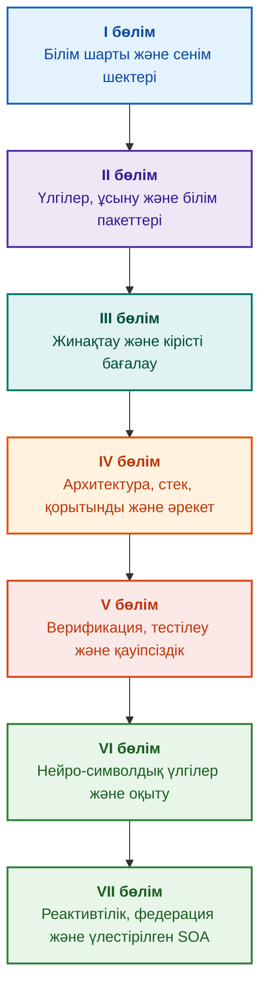

# Дәлелді сараптамалық жүйелер архитектурасы: Формалды онтологиялардан нейро-символдық ЖИ-ге дейін

**Жоғары сенімділіктегі интеллектуалды жүйелерді жобалау, математикалық үлгілері, архитектурасы және формалды верификациясы туралы инженерлік монография және кешенді нұсқаулық (Safety-Critical & Evidence-Grounded AI)**

**Автор:** [Микола Федчик (Mykola Fedchyk)](../../about-the-author.md) · [LinkedIn](https://www.linkedin.com/in/nickfedchik/)  
**Форматы:** Инженерлік монография / ЖИ сәулетшісінің үстелдік кітабы  
**Жылы:** 2026  

---

## Кітап туралы

Бұл кітап қазіргі жасанды интеллекттің түйінді дағдарысын — нейрожелілік генерациялардың ықтималдық шындыққа ұқсастығы мен формалды математикалық дәлелдердің детерминирленген ақиқаттығы арасындағы эпистемикалық алшақтықты еңсеруге арналған іргелі монографиялық зерттеу және инженерлік нұсқаулық болып табылады. Зерттеудің орталығында қатаң инженерлік сұрақ тұр: **әрбір қорытындысы бұлтартпас, бастапқы дәлел көздеріне дейін толық қадағаланатын және қауіпсіздік үшін сыни маңызды инженерлік домендерде (ISO 26262, IEC 61508, DO-178C, ISO/SAE 21434) сертификаттауға жарамды сараптамалық жүйені қалай жобалауға болады?**

Автор жаңа парадигманы негіздеп, орнықтырады: **Дәлелді нейро-символдық ЖИ (Evidence-Grounded Neuro-Symbolic AI)**. Мұнда статистикалық модельдер (LLM/SLM) сұраныс гипотезаларын жасау және проекциялық рендеринг бойынша кеңесшілік қызмет атқарады; ал детерминирленген символдық ядро қисындық қайшылықсыздықтың, фактілерді байт деңгейінде бекітудің, өкілеттіктер шегін бақылаудың және әрекетке қауіпсіз көшудің инварианттарына бұлжымас кепілдік береді.

### Инженерлік артефактіден тексерілетін шешімге дейін

Жүйелік талаптар, бастапқы код, сынақ хаттамалары, реттеуіш стандарттар және инженерлік шешімдер қазіргі өндірістік ортада бұрыннан бар, бірақ көбінесе формалданған семантикасыз, қатаң қолданылу шектерінсіз және өзара қадағаланусыз оқшауланған артефактілер ретінде әрекет етеді. Сәтті сынақ есебі ескірген аппаратура ревизиясына қатысты болуы мүмкін; функционалдық қауіпсіздік стандартынан алынған дәйексөз контекстен жұлынып алынуы мүмкін; ал конфигурацияны авариялық кері қайтару кері қайтарып алынған құрамдасты байқаусызда қайта қосып жіберуі мүмкін.

Бұл монография толыққанды инженерлік тракт ұсынады: инженерлік артефактілерді типтелген деректер мен криптографиялық қол қойылған білім пакеттері ретінде формалдаудан — символдық қорытынды шығаруға, жоспарларды кезең-кезеңімен декомпозициялауға, контрфактикалық түсіндірмелерге және құзыреттілік шектерін аудиттеуге дейін. Тәжірибелік баяндау Go тіліндегі толық сынақ топтамалары бар өндірістік деңгейдегі іске асырулармен ([1-тарау](../../ch01-introduction-to-expert-systems.md)), қатаң математикалық келісімшарттармен ([II бөлім](../../part-02-knowledge-models.md)) және білім регрессиясын болдырмайтын үздіксіз оқыту хаттамаларымен ([25-тарау](../../ch25-how-expert-systems-learn.md)) бекітілген.

### Монография кімге арналған

Басылым жүйелік архитекторларға, сенімділік және функционалдық қауіпсіздік жөніндегі жетекші инженерлерге, қисынды қорытынды жасау қозғалтқыштарын әзірлеушілерге және білім инженерлеріне арналған. Тұжырымдамаларды алғашқы меңгеру үшін бірінші ретті предикаттар қисыны, нұсқаларды басқару және жүйелердің өмірлік циклі туралы негізгі түсінік жеткілікті; мысалдарды іске қосу үшін Go стандартты құралдары қажет. Goal Structuring Notation (GSN) қауіпсіздік дәйектемелерін формалды синтездеуге, күрделі жүйелер синергетикасына, нейроморфты үдеткіштерге және GNSS-сіз автономды навигацияға арналған арнайы тараулар жоғары технологиялық салалардағы (аэроғарыш, автономды көлік, сыни энергетика) дәлелді ЖИ қолданудың озық шептерін ашады.

---

## Ғылыми контекст және монографияның әлемдік зерттеулердегі орны

Монография сараптамалық жүйелерді 1980-жылдардағы ережелерге негізделген жүйелердің (CLIPS немесе MYCIN сияқты) ескірген сарқыншағы ретінде емес, **Үшінші толқынның дәлелді нейро-символдық ЖИ (Third-Wave Evidence-Grounded Neuro-Symbolic AI)** алдыңғы шебі ретінде қарастырады. Жұмыс жетекші әлемдік ғылыми мектептердің теориялық іргетасына сүйенеді, сонымен бірге абстрактілі математикалық модельдер мен жоғары өнімді жүйелік инженерия арасындағы алшақтықты жояды:

| Ғылыми бағыт | Әлемдік негізгі еңбектер мен авторлар | Кітаптағы тұжырымдамалық көпір |
|---|---|---|
| **Үшінші толқынның нейро-символдық ЖИ (NeSy)** | Artur d'Avila Garcez, Luis C. Lamb (*Neurosymbolic AI: The 3rd Wave*, 2023; *Neural-Symbolic Cognitive Reasoning*, Springer, 2009); Henry Kautz (*The Third AI Summer*, AAAI 2022) | Міндеттерді бөлу: статистикалық модельдер (SLM/LLM) сұраныс гипотезаларын жасайды, ал детерминирленген символдық ядро фактілерді формалды түрде тексереді және бекітеді ([29-тарау](../../ch29-neuro-symbolic-architecture.md)). |
| **Семантикалық шектеулер және қауіпсіз оқыту** | Guy Van den Broeck et al. (*A Semantic Loss Function for Deep Learning with Symbolic Knowledge*, ICML 2018); Luc De Raedt et al. (*DeepProbLog*, IJCAI 2020) | Кіріс және шығыс бақылау шлюздері, нейрожелі ұсыныстарын формалды схемалар бойынша детерминирленген семантикалық сүзу ([28](../../ch28-dual-mode-expert-systems.md), [33-тараулар](../../ch33-inter-system-knowledge-exchange-and-model-teaching.md)). |
| **Терістелетін пайымдау және дәлелдеу теориясы** | John L. Pollock (*Defeasible Reasoning*, 1987; *Cognitive Carpentry*, MIT Press, 1995); Phan Minh Dung (*Abstract Argumentation Frameworks*, AIJ 1995); Douglas Walton (*Argumentation Schemes*, Cambridge, 2008) | Білімді тұжырымдарға, шығу тегіне және жоққа шығарушы факторларға (*rebutting* және *undercutting defeaters*) жіктеу; Дунг дәйектеме негіздері арқылы нормативтік базалардағы қайшылықтарды шешу ([2](../../ch02-epistemology-of-machine-knowledge.md), [27-тараулар](../../ch27-safety-case-gsn-synthesis.md)). |
| **Қауымдастық ережелерін автономды өндіру (KBC)** | Luis Galárraga, Fabian M. Suchanek et al. (*AMIE: Association Rule Mining under Incomplete Evidence*, WWW 2013, VLDBJ 2015); Stephen Muggleton (*Inductive Logic Programming*, 1994) | Ашық әлемнің жалған қарсы мысалдарынсыз ішінара толықтық болжамы (PCA) бойынша білім қорларында заңдылықтарды автоматты түрде шығару ([34-тарау](../../ch34-deterministic-relational-analysis-abduction-and-socratic-dialogue.md)). |
| **Формалды қауіпсіздік қалқандары және сертификаттау (Safe AI)** | Bettina Könighofer, Roderick Bloem et al. (*Shield Synthesis*, 2017); Tim Kelly, Rob Weaver (*Goal Structuring Notation*, York, 2004); André Platzer (*Logical Foundations of CPS*, Springer, 2018) | ISO 26262/21434 стандарттары үшін GSN нотациясында қауіпсіздік негіздемелерін синтездеу; перифериялық жетектерге арналған формалды қалқандар мен сандық жарамдылық конверттері ([27](../../ch27-safety-case-gsn-synthesis.md), [30](../../ch30-safety-cybersecurity-co-engineering.md), [33-тараулар](../../ch33-inter-system-knowledge-exchange-and-model-teaching.md)). |
| **Эпистемикалық логика және білім семиотикасы** | John F. Sowa (*Knowledge Representation: Logical, Philosophical, and Computational Foundations*, 2000); Frank van Harmelen et al. (*Handbook of Knowledge Representation*, Elsevier, 2008) | Чарльз Сандерс Пирстің эпистемикалық триадасы (Ұғым → Пайымдау → Қорытынды); қатаң дедуктивті бақылаумен жұмыс гипотезаларын абдуктивті шығару ([6](../../ch06-applied-mathematics-for-expert-systems.md), [34-тараулар](../../ch34-deterministic-relational-analysis-abduction-and-socratic-dialogue.md)). |
| **Күрделі жүйелердің кибернетикасы мен синергетикасы** | Norbert Wiener (*Cybernetics*, 1948); W. Ross Ashby (*An Introduction to Cybernetics*, 1956); Hermann Haken (*Synergetics: An Introduction*, 1977; *Advanced Synergetics*, 1983); Ilya Prigogine (*Order out of Chaos*, 1984) | Эшбидің қажетті әртүрлілік заңы, L0–L4 тұйық басқару циклдері, Хакен бағыну қағидаты бойынша күй кеңістігін тәртіп параметрлеріне келтіру, сыни баяулау (CSD) бойынша фазалық ауысуларды болжау және білім қорларын диссипативті тұрақтандыру ([6](../../ch06-applied-mathematics-for-expert-systems.md), [22](../../ch22-cybernetics-edge-to-backend.md), [35-тараулар](../../ch35-self-organizing-expert-systems-synergetics-and-npu-runtime.md)). |
| **Білімді тестілеу, лингвистикалық инварианттылық және Липшиц калибрлеуі** | Kent Beck (*TDD*, 2002); Martin Fowler (*Refactoring*, 2018); Clark Barrett, Leonardo de Moura (*Z3 SMT Solver*, 2008); Chuan Guo et al. (*On Calibration of Modern Neural Networks*, ICML 2017); Marco Tulio Ribeiro et al. (*CheckList*, ACL 2020); John L. Pollock (*Defeasible Reasoning*, 1987) | Төрт деңгейлі білім тестілеу пирамидасы (KTP): алғышарттарды оқшаулаумен жеке ережелерді модульдік тестілеу (`PremiseMock`) (KUT), вакуумдық ақиқат тұзағын бұғаттау, 6 нүктелі спектрлік BVA, ережелер мен дефитерлер торы (KIT), сұраныс вариацияларындағы семантикалық инварианттылық метрикасы ($\text{SIS} \ge 0.98$), релелік дірілге қарсы Липшиц үздіксіздігі ($L_{\mathcal{K}} \le L_{\max}$), және білім алшақтықтарын стигмергиялық жинақтау ([36-тарау](../../ch36-knowledge-testing-pyramid-and-variational-calibration.md)). |

---

## Автордың теориялық үлгілері, ғылыми зерттеулері мен инженерлік инновациялары

Бұл монография автордың жоғары сенімділіктегі жүйелерді, ендірілген архитектураларды және дәлелді ЖИ-ді жобалау саласындағы іргелі зерттеу нәтижелері мен практикалық инженерлік тәжірибесін жинақтайды. Тек шолу еңбектерінен айырмашылығы, кітапта нейро-символдық өзара әрекеттесуді математикалық тексерілетін сенім деңгейіне алғаш рет көтеретін түпнұсқалық формалды теориялар, хаттамалар және жүйелік шешімдер ұсынылады:

### 1. Іргелі теориялық әзірлемелер мен математикалық формализмдер

1. **Дәлелдік бекіту инварианты (Evidence-Grounded Invariant, EGI) және фактілерді валидациялау шлюзі ([2](../../ch02-epistemology-of-machine-knowledge.md), [19](../../ch19-from-question-to-evidence.md), [28](../../ch28-dual-mode-expert-systems.md), [29-тараулар](../../ch29-neuro-symbolic-architecture.md)):**
   * *Теориялық тұжырымдама:* Автор бекіту толықтығы инвариантын $\mathrm{Comp}(C) = 1.00$ тұжырымдап, математикалық тұрғыдан формалдады, ол дәлелді жүйеде ешбір тұжырым бастапқы білім көздеріне детерминирленген проекциясыз факт мәртебесін ала алмайтынын белгілейді. Фактілер базасындағы әрбір элемент криптографиялық кортежбен сүйемелденеді: өзгермейтін байт координаттары `[byte_start, byte_end]`, канондық фрагмент хэші `quote_sha256`, және PROV-O шығу тегі сертификатының идентификаторы.
   * *Инженерлік мәні:* Байт деңгейіндегі өткізу шлюзі аппаратуралық және бағдарламалық деңгейде нейрожелілік галлюцинациялардың нұсқаланған білім қорына өтуін толығымен болдырмайды, расталмаған деректерге нөлдік төзімділікті кепілдендіреді ($ZHR = 1.00$).
2. **Төрт деңгейлі білім тестілеу пирамидасы (KTP) және қорытынды кеңістігінің Липшиц тұрақтылығы ([36-тарау](../../ch36-knowledge-testing-pyramid-and-variational-calibration.md)):**
   * *Теориялық тұжырымдама:* Автор алғаш рет Мартин Фаулердің бағдарламалық жасақтаманы сынау пирамидасына ұқсас жүйелік білімді тестілеу пирамидасын (KTP) ұсынды: оқшауланған ережелерді модульдік сынау (`PremiseMock`) (KUT), ережелер мен дефитерлердің өзара әрекеттесуін интеграциялық сынау (KIT), және тұжырымдаулар көпбейнесінде вариациялық калибрлеу (KVT).
   * *Математикалық аппарат:* Вакуумдық ақиқат тұзағын бұғаттайтын қатаң инвариант ($P \to Q$ мұндағы $P \equiv \text{False}$), лингвистикалық ауытқулар кезіндегі семантикалық инварианттылық метрикасы ($\mathrm{SIS} \ge 0.98$), және кірістің шамалы ауытқулары кезінде қорытындылардың апатты дірілін математикалық тұрғыдан жоятын қорытынды кеңістігінің Липшиц үздіксіздігі шегі ($L_{\mathcal{K}} \le L_{\max}$).
3. **Деонтикалық ережелердің попперлік фальсификация теориясы және белсенді комплаенс аудиторы ([39-тарау](../../ch39-active-compliance-auditor-and-popperian-testing.md)):**
   * *Теориялық тұжырымдама:* «Пассивті оракул» (тек сұрақтарға жауап беретін) классикалық моделінен Карл Поппердің фальсификация қағидатын жүзеге асыратын белсенді білім аудиторы парадигмасына көшу. Жүйе талаптар кеңістігін (ASPICE 4.0, ISO 26262, ISO/SAE 21434) дербес зерттейді, қарсы мысалдарды синтездейді, толық емес спецификацияларды анықтайды және өнімді сынаудың толық бағдарламасын құрастырады.
   * *Практикалық құндылығы:* Нейрожелінің шектік сценарийлерді креативті жасауын (1-жүйе) және символдық ядроның детерминирленген деонтикалық тексеруін (2-жүйе) біріктіру, бұл ретте басқару цикліндегі адамды (Human-in-the-Loop) келісу шаршауынан кепілді қорғау.
4. **Білім қоры өлшемділігін синергетикалық қысқарту және бифуркация алдындағы CSD диагностикасы ([6](../../ch06-applied-mathematics-for-expert-systems.md), [22](../../ch22-cybernetics-edge-to-backend.md), [35-тараулар](../../ch35-self-organizing-expert-systems-synergetics-and-npu-runtime.md)):**
   * *Теориялық тұжырымдама:* Герман Хакеннің синергетикалық математикалық аппаратын (тәртіп параметрлері және бағыну қағидаты) және Илья Пригожиннің диссипативті құрылымдар теориясын күрделі білім қорларының эволюциясына қолдану.
   * *Ғылыми нәтиже:* Телеметрияның көпөлшемді фазалық кеңістігін тәртіп параметрлеріне келтіру әдісі әзірленді және автокорреляция мен дисперсия негізінде сыни баяулауды (*Critical Slowing Down*, CSD) анықтайтын бифуркация алдындағы детектор біріктірілді, бұл жүйенің динамикалық құлдырауын авариялық шектік сенсорлар іске қосылғанға дейін әлдеқайда бұрын болжауға мүмкіндік береді.
5. **Әрекет дербестігі деңгейлерінің моделі (A0–A4), өкілеттіктер шлюзі және идемпотентті сагалар ([21-тарау](../../ch21-from-recommendation-to-action.md)):**
   * *Теориялық тұжырымдама:* «Әрекет, орта, тәуекел деңгейі» кортежіне тағайындалатын жүйелік әрекет өкілеттіктерінің дискретті шкаласы (A0: пассивті талдау, A1: жобаны дайындау, A2: адам қолымен әрекет ету, A3: бақыланатын автономия, A4: қорғаныстық авариялық өшіру).
   * *Математикалық аппарат:* Криптографиялық кілт $k$ негізіндегі алгебралық идемпотенттілік инварианты $f(f(x, k), k) \equiv f(x, k)$, қадамдық тұйық циклді орындау, және `OutcomeUnknown` күйі мен кейінгі шарттарды тәуелсіз тексеруі бар үлестірілген өтемақы сагаларының хаттамасы.
6. **GSN нотациясында функционалдық қауіпсіздік пен киберқауіпсіздікті формалды бірлескен жобалау ([27](../../ch27-safety-case-gsn-synthesis.md), [30-тараулар](../../ch30-safety-cybersecurity-co-engineering.md)):**
   * *Теориялық тұжырымдама:* ISO 26262 (функционалдық қауіпсіздік) және ISO/SAE 21434 (киберқауіпсіздік) стандарттарының талаптарын бір мезгілде шешу үшін GSN (Goal Structuring Notation) дәлелдеу ағаштарын үйлестірілген синтездеу моделі.
   * *Инженерлік серпіліс:* Қайшылықты мақсаттар арасындағы математикалық арбитражды формалдау (авариялық әрекет ету уақытының бюджеті криптографиялық аттестация тереңдігіне қарсы) және тұздалған Меркл ағаштары арқылы сыртқы аудиторларға дәлелдемелерді селективті ашу хаттамасы.
7. **Түсіндірмелердің дұрыстығы мен семантикалық консистенттілігін тексеру хаттамасы ([20-тарау](../../ch20-explanation-engine.md)):**
   * *Теориялық тұжырымдама:* Түсіндіру генеративті модельдің еркін мәтіні ретінде емес, дәлелдеу графынан, ережелер нұсқасынан және бекітілген фактілер қимасынан бірмәнді шығарылатын дербес детерминирленген артефакт ретінде қарастырылады.
   * *Математикалық аппарат:* Символдық қорытынды мен оператор үшін вербализация арасындағы шамалы сәйкессіздік кезінде қатаң үлгіге автоматты түрде fail-safe кері шегінуі бар дұрыстықты бағалаудың метрикалық шлюзі ($C_{\text{facts}} = 1.00, H_{\text{free}} = 1.00$).

---

### 2. Эмпирикалық зерттеулер, авторлық сынақ стендтері және жүйелік инженерия

1. **`mmap` және нөлдік десериализациясы бар өзгермейтін екілік білім пакеттері ([32-тарау](../../ch32-high-performance-knowledge-packs-mmap-and-harvesting.md)):**
   * *Авторлық жаңалық:* Пакеттердің екі қабатты сәулеті (бастапқы дереккөздердің канондық қабаты + индекстердің туынды материалданған қабаты).
   * *Эмпирикалық нәтиже:* `mmap` жүйелік шақыруы арқылы индексті виртуалды мекенжай кеңістігіне тікелей салыстыру, динамикалық жадты бөлуге кететін үстеме шығындарды жою (zero-allocation), және онтологияның гигабайттық көлеміне қарамастан қорытынды қозғалтқышын сублинейлік уақытта іске қосу.
2. **IETF RFC-1000 және W3C-150 стандартты корпустарындағы эмпирикалық калибрлеу полигоны ([2](../../ch02-epistemology-of-machine-knowledge.md), [4](../../ch04-evolution-from-bayes-to-evidence-ai.md), [14](../../ch14-requirements-detection-and-formalization.md), [25-тараулар](../../ch25-how-expert-systems-learn.md)):**
   * *Авторлық эксперимент:* IETF RFC-тің 1000 жарамды спецификациясында (Интернет дамуының 5 тарихи дәуіріне бөлінген) және W3C корпусының 150 күрделі диагностикалық сұранысында (соның ішінде логикалық қайшылықтар мен конфабуляцияларды жасанды енгізумен) ауқымды зерттеу стендін орналастыру.
   * *Практикалық нәтиже:* Білімді тексерудің объективті емтихандық матрицаларын құру, нормативтік қайшылықтарды анықтау және жаңарту кезінде білім қорының регрессиясынан математикалық дәлелденген қорғаныс.
3. **Көпқадамдық реляциялық талдау, символдық абдукция және сократтық диалог ([34-тарау](../../ch34-deterministic-relational-analysis-abduction-and-socratic-dialogue.md)):**
   * *Авторлық әзірлеме:* Байланысты нысандар үшін байт деңгейіндегі композитті дәлелдеулер тізбегін құрумен және тұзақтардан қорғауы бар екі бағытты шектелген ені бойынша іздеу алгоритмі (Bidirectional Bounded BFS, $k \le 6$).
   * *Инженерлік артықшылық:* Қатаң дедуктивті бақылаумен Пирстің символдық абдукциясын жүзеге асыру және жабық әлем болжамы (CWA) бойынша соқыр бас тартудың орнына жүйені адаммен нәтижелі диалог режиміне ауыстыратын типтелген сократтық нақтылау фреймдері (*Clarification Frames*).
4. **Перифериялық басқару жүйелеріне арналған формалды қалқандар мен сандық жарамдылық конверттері ([33-тарау](../../ch33-inter-system-knowledge-exchange-and-model-teaching.md), [Қосымшалар Б](../../appendix-b-robotics-and-cyber-physical-systems.md), [В](../../appendix-c-autonomous-navigation-and-geosearch.md), [Д](../../appendix-e-mixed-signal-neuromorphic-expert-systems.md)):**
   * *Авторлық жаңалық:* Сандық сигналдық процессорлар (DSP) және GNSS-сіз автономды навигация жүйелері (TRN/DSMAC/VIO) үшін дискретті қисындық инварианттарды үздіксіз сандық қауіпсіздік дәліздеріне аудару әдіснамасы.
   * *Пайдалану сенімділігі:* Ed25519 криптографиясына негізделген қол қойылған ережелермен алмасу, жаңа білім кандидаттарының қауіпсіз карантині, және аппараттық деңгейде қауіпті басқару командаларын кесіп тастау.
5. **Түсіндірулер мен дифференциалды аудит арқылы құпия ақпараттың таралуынан қорғау ([20-тарау](../../ch20-explanation-engine.md)):**
   * *Авторлық әзірлеме:* Дәлелдеу графының әрбір түйіні мен қыры үшін ACL тексеруі бар түсіндірмені аралық ұсынуды қысқарту хаттамасы ($\mathrm{EIR}_{\text{redacted}}$), ол контрастты WHY NOT сұраныстары сериясы арқылы модельдерді қалпына келтірудің жанама арна шабуылдарын бұғаттайды.

---

## Топтастыру және жіктеу қағидаты

Кітаптың бөлімдері тараудың жазылған жылымен немесе нақты технологияның атауымен емес, негізгі инженерлік міндетпен анықталады. Әрбір тараудың бір негізгі бөлімі бар; аралас әдістер оның басты сұрағын қалай шешу керектігін түсіндіреді. Тарау нөмірлері мен файл атаулары тұрақты идентификаторлар ретінде сақталады, сондықтан тақырыптық оқу реті сандық реттен өзгеше болуы мүмкін.

Тараулар ішіндегі бөлімше атаулары нақты сыныптарды құрайды және оларды тең құқықты технологиялар тізімі ретінде емес, дәйекті дәлелдеулер реті ретінде оқу керек:

| Бөлімше сыныбы | Оқырманның сұрағы | Тараудағы қызметі |
|---|---|---|
| Мәселе және тапсырма шегі | Нақты нені шешу керек? | Басты сұрақ пен қолдану аясын анықтау |
| Нысан және үлгі | Қандай деректер, білімдер немесе күйлер қарастырылады? | Ұғымдарды, типтерді және болжамдарды сәйкестендіру |
| Әдіс және рәсім | Нәтижеге қалай жетуге болады? | Қорытынды жасауды, түрлендіруді немесе басқаруды түсіндіру |
| Іске асыру және құрал | Рәсім қандай құралмен орындалады? | Әдістің бағдарламалық немесе аппараттық көрінісін көрсету |
| Тексеру және бақылау жағдайы | Қатені қалай анықтауға болады? | Нәтижені тәуелсіз критериймен салыстыру |
| Қорытынды және нәтиже шектері | Не дәлелденді және не ашық қалды? | Артық уәделерсіз басты сұраққа жауап беру |

Ел, сала немесе коммерциялық өнім осы таксономияның жеке деңгейі емес, қолдану контексі болып табылады. Сөздік, қысқартулар, дереккөздер және навигация тараудың дербес тақырыптары емес, қосымша анықтамалық құралдар болып табылады.

Толық редакциялық құрылымдық шолу әрбір тараудың басты тақырыбын бағалауды, аралас талқылаулар арасындағы шекараларды және құрылым мен қорытындыларға қатысты ескертпелерді қамтиды. Жаңа түсініктеме тараулар ішіндегі барлық мазмұндық тәуекелдер толығымен жойылғанын білдірмейді.

---

## Ұсынылатын оқу маршруттары

**Алғашқы бағдарламалық тексеру:** [1](../../ch01-introduction-to-expert-systems.md) → [7](../../ch07-knowledge-base-typology.md) → [8](../../ch08-engineering-artifacts-as-data.md) → [17](../../ch17-implementation-stack.md) → [23](../../ch23-knowledge-base-verification.md) → [25](../../ch25-how-expert-systems-learn.md). Мақсаты: дәлелді негіздері, теріс сынақтары және білімнің бақыланатын өзгерісі бар қайталанатын шешім. Тілдік модель міндетті емес.

**Білім инженериясы:** [II бөлім](../../part-02-knowledge-models.md) → [III бөлім](../../part-03-knowledge-engineering-nlp.md) → [19](../../ch19-from-question-to-evidence.md) → [20](../../ch20-explanation-engine.md) → [26](../../ch26-continual-learning.md). Мақсаты: семантиканы, шығу тегін, білімді жинақтауды және жаңа үміткерлерді тексеруді сәйкестендіру. II бөлім 7–11 тараулар үшін ғылыми сынақ бағдарламасын сақтайды.

**Шешім архитектурасы:** [16](../../ch16-expert-systems-architecture.md) → [19](../../ch19-from-question-to-evidence.md) → [31](../../ch31-syllogistic-reasoning-and-relation-lattices.md) → [20](../../ch20-explanation-engine.md) → [21](../../ch21-from-recommendation-to-action.md). Мақсаты: дәлелдерді тексеруді, норманы қолдануды, түсіндіруді және әрекет ету өкілеттігін қатаң бөлу.

**Верификация және қауіпсіздік:** [23](../../ch23-knowledge-base-verification.md) → [36](../../ch36-knowledge-testing-pyramid-and-variational-calibration.md) → [25](../../ch25-how-expert-systems-learn.md) → [26](../../ch26-continual-learning.md) → [27](../../ch27-safety-case-gsn-synthesis.md) → [30](../../ch30-safety-cybersecurity-co-engineering.md). Сыртқы нысанды диагностикалау [24-тарау](../../ch24-system-diagnosis.md) арқылы арнайы қарастырылады.

**Гибридті жауаптар және пайдалану:** [VI бөлім](../../part-06-frontiers-neuro-symbolic.md) → [VII бөлім](../../part-07-runtime-and-knowledge-exchange.md) → [40](../../ch40-distributed-epistemic-architectures-soa-and-cluster-scaling.md) және қажетті қосымшалар. Мақсаты: тілдік модельді біріктіру, білім алшақтықтарын басқару, үлестірілген білім қызметтерінің архитектурасын құру және жүйеаралық алмасуды тексеру. [2](../../ch02-epistemology-of-machine-knowledge.md), [4](../../ch04-evolution-from-bayes-to-evidence-ai.md) және [6-тарауларды](../../ch06-applied-mathematics-for-expert-systems.md) қажеттілікке қарай шарт, тарих және математикалық анықтамалық ретінде оқуға болады.

---

## Инженерлік міндеттемелер шегі

Бұл кітап оқу және зерттеу материалы болып табылады, ол сертификатталған рәсім немесе өнімнің стандартқа сәйкестігінің ресми дәлелі емес. Детерминирленген орындау фактілердің дұрыстығын тікелей дәлелдемейді; хэш пен сандық қолтаңба абсолютті ақиқатты дәлелдемейді; ал дәйектемелер графы адам сарапшысының бағалауын алмастырмайды. Бүкіл өнімнің сенімділік талаптарын тілдік модельдің қателік деңгейімен теңестіруге немесе барлық бағдарламалық құрамдастарға жалпылауға болмайды.

Автоматтандырылған талдау қолмен деректерді енгізуді азайтады, бірақ доменді модельдеуді, сараптамалық шолуды және білім иелерінің жауапкершілігін жоймайды. Protégé, қолмен қарау және автоматты жинау тиімді бірлесіп жұмыс істей алады. Математикалық кепілдіктер тек белгілі бір тілдік профильге және болжамдарға қолданылады; өлшенген жылдамдықтар нақты сыналған сұранысқа, корпусқа және ортаға қатысты. Автордың мұрағаттық деректері ашық оқу стендтерінен және әлі орындалмаған зерттеулерден қатаң бөлінген.

Өнімді шығару, тәуекелді қабылдау және реттеуіш талаптарға сәйкестік туралы шешімдер уәкілетті адам мамандарының жауапкершілігінде қалады. Сараптамалық жүйе тексерілетін материалды дайындайды және келісілген саясатты орындайды, бірақ өзінен-өзі реттеуші немесе заңды өкілеттікке ие болмайды.

---

## Кітап құрылымы

Кітап жеті тақырыптық бөлімнен, 40 тараудан және бес қосымшадан тұрады. Әрбір тарау бір негізгі бөлімге жатады. Навигациядағы алдыңғы және келесі тараулар төмендегі тақырыптық тәртіпке сәйкес келеді; тарау нөмірлері мен файл атаулары өзгеріссіз сақталған.

---

### [I бөлім. Тұжырымдамалық және эпистемологиялық негіздер](../../part-01-foundations.md)

*Сараптамалық жүйе қашан қажет, нені білім деп санауға болады және ұйымдық шешімдердің негіздерін қалай сақтау керек.*

* [1-тарау. Сараптамалық жүйелерге кіріспе: Хаостан басқарылатын білімге дейін](../../ch01-introduction-to-expert-systems.md)
* [2-тарау. Инженерге арналған философия: Машинаның нені білім деп атауға құқығы бар](../../ch02-epistemology-of-machine-knowledge.md)
* [3-тарау. Сараптамалық жүйенің ақпараттық-анықтамалық жүйеден түбегейлі айырмашылығы неде](../../ch03-beyond-reference-information-systems.md)
* [4-тарау. Сараптамалық жүйелер эволюциясы: Байес теоремасынан дәлелді ЖИ шешімдеріне дейін](../../ch04-evolution-from-bayes-to-evidence-ai.md)
* [5-тарау. Сенім триадасы: Сараптамалық жүйе, дәлелді ұсыныс және корпоративтік жады](../../ch05-triad-of-trust-and-corporate-memory.md)

---

### [II бөлім. Математикалық үлгілер, білімді ұсыну және сақтау](../../part-02-knowledge-models.md)

*Математикалық операциялар мен ұсынуларды таңдау, типтелген артефактілер, қадағалану графы және өзгермейтін білім пакеті.*

* [6-тарау. Сараптамалық жүйелерге арналған қолданбалы математика: Ережелер, ықтималдықтар, графтар және себептілік](../../ch06-applied-mathematics-for-expert-systems.md)
* [7-тарау. Білім қорларының типологиясы: Ережелер, онтологиялар, прецеденттер және векторлар](../../ch07-knowledge-base-typology.md)
* [8-тарау. Сараптамалық жүйе деректері ретіндегі инженерлік артефактілер](../../ch08-engineering-artifacts-as-data.md)
* [9-тарау. Инженерлік білім графы: Талаптардан аппаратураға дейінгі қадағалану](../../ch09-engineering-knowledge-graph-traceability.md)
* [32-тарау. Өзгермейтін білім пакеттері: Байт деңгейіндегі рұқсат, индекстер және жадты бейнелеу](../../ch32-high-performance-knowledge-packs-mmap-and-harvesting.md)

---

### [III бөлім. Білімді жинақтау, лингвистикалық талдау және кірісті бағалау](../../part-03-knowledge-engineering-nlp.md)

*Құжаттар, мамандардың тәжірибесі және бақылаулар: үміткерлерді алу, лингвистикалық талдау, формалдау және дәлелдемелерді бағалау.*

* [10-тарау. Білімді жинақтау жүйелері: Дереккөздер, рұқсат және өмірлік цикл](../../ch10-knowledge-acquisition-systems.md)
* [11-тарау. Сарапшылардан білім алу: Сұхбаттасу, когнитивтік карталар және тәжірибені формалдау](../../ch11-knowledge-elicitation-from-experts.md)
* [12-тарау. Лингвистикалық талдау және жергілікті үлгілер: Мағына мен дереккөздерді сақтау](../../ch12-linguistic-analysis-and-local-models.md)
* [13-тарау. Табиғи тіл вариативтілігі детерминизмге қарсы: Сұраныс мағынасын құрастыру](../../ch13-language-variability-vs-determinism.md)
* [14-тарау. Талаптар мен модальділіктерді анықтау: Нормативтік мәтіннен инварианттарға дейін](../../ch14-requirements-detection-and-formalization.md)
* [15-тарау. Білімді өндіру және білім қорын құру: Фактілер, грамматикалар және автоматтар](../../ch15-knowledge-extraction-and-kb-construction.md)
* [37-тарау. Кіріс ақпаратты бағалау: Дереккөздер, дәлелдемелер және белгісіздік](../../ch37-input-information-assessment-and-algorithmic-skepticism.md)

---

### [IV бөлім. Архитектура, технологиялық стек, қорытынды шығару және әрекет](../../part-04-architecture-and-inference.md)

*Архитектуралық келісімшарттар, технологиялық стек, аппараттық орындау, тұжырымдарды тексеру, нормалар бойынша қорытынды, түсіндіру және кибернетикалық басқару циклі.*

* [16-тарау. Сараптамалық жүйе архитектурасы: Формалды білімнен дәлелді шешімге дейін](../../ch16-expert-systems-architecture.md)
* [17-тарау. Технологиялық стек: Құралдарды, бағдарламалау тілдерін және ережелер қозғалтқыштарын таңдау критерийлері](../../ch17-implementation-stack.md)
* [18-тарау. Орындау инфрақұрылымы: Жергілікті үлгілер, аппараттық үдеткіштер, Edge және On-Premise](../../ch18-execution-infrastructure.md)
* [19-тарау. Сұрақтан дәлелге дейін: Іздеу, бекіту және тұжырымдарды тексеру](../../ch19-from-question-to-evidence.md)
* [31-тарау. Нормалар бойынша қорытынды: Предикаттар иерархиясы, ерекшеліктер және қолданылу шегі](../../ch31-syllogistic-reasoning-and-relation-lattices.md)
* [20-тарау. Түсіндіру қозғалтқышы: Шешім, бас тарту және құзыреттілік шектері](../../ch20-explanation-engine.md)
* [21-тарау. Ұсыныстан әрекетке дейін: Өкілеттіктерді бақылау және өндірістік ортада қауіпсіз орындау](../../ch21-from-recommendation-to-action.md)
* [22-тарау. Кибернетикалық басқару циклі: Сенсорлар, периферия және кері байланыс](../../ch22-cybernetics-edge-to-backend.md)

---

### [V бөлім. Верификация, тестілеу, диагностика және қауіпсіздік негіздемесі](../../part-05-verification-and-learning.md)

*Ережелерді формалды тексеру, білімді тестілеу пирамидасы, попперлік фальсификация, техникалық диагностика және функционалдық қауіпсіздік пен киберқауіпсіздік дәйектері.*

* [23-тарау. Білім қорын тексеру: Ережелердің қайшылықсыздығын, толықтығын және сенімділігін тексеру](../../ch23-knowledge-base-verification.md)
* [36-тарау. Білімді тестілеу пирамидасы: Ережелер, өзара әрекеттесулер және жауап тұрақтылығы](../../ch36-knowledge-testing-pyramid-and-variational-calibration.md)
* [39-тарау. Белсенді комплаенс аудиторы: Попперлік фальсификация, нормативтік сәйкестік (ASPICE/ISO 26262/ISO 21434) және автономды сынақ дизайны](../../ch39-active-compliance-auditor-and-popperian-testing.md)
* [24-тарау. Техникалық диагностика: Деректер толық болмаған кезде белгіні түпкі себеппен шатастырмау](../../ch24-system-diagnosis.md)
* [27-тарау. Қауіпсіздік негіздемесі: Дәйектерді синтездеу және тексеру](../../ch27-safety-case-gsn-synthesis.md)
* [30-тарау. Функционалдық қауіпсіздік пен киберқауіпсіздікті бірлескен жобалау](../../ch30-safety-cybersecurity-co-engineering.md)

---

### [VI бөлім. Нейро-символдық үлгілер, когнитивтік шептер және үздіксіз оқыту](../../part-06-frontiers-neuro-symbolic.md)

*Қатаң қорытынды және кеңесші гипотеза, тілдік үлгіні біріктіру, білім алшақтықтары, расталмаған жауапты бақылау, емтихан матрицалары және тәжірибеден үздіксіз оқу.*

* [28-тарау. Қос режимді сараптамалық жүйелер: Қатаң қорытынды және кеңесші гипотеза](../../ch28-dual-mode-expert-systems.md)
* [29-тарау. Нейро-символдық архитектура: Тілдік модельдер және дәлелдік негіздерді тексеру](../../ch29-neuro-symbolic-architecture.md)
* [34-тарау. Білім алшақтықтары: Реляциялық іздеу, абдукция және нақтылау диалогы](../../ch34-deterministic-relational-analysis-abduction-and-socratic-dialogue.md)
* [38-тарау. Машиналық галлюцинациялар және білім тапшылығы: Дәлелді жауап бақылауы](../../ch38-curing-machine-hallucinations-and-knowledge-deficits.md)
* [25-тарау. Сараптамалық жүйені қалай оқыту керек: Емтихан матрицалары, білім аудиті және регрессияны бақылау](../../ch25-how-expert-systems-learn.md)
* [26-тарау. Тәжірибеден үздіксіз оқыту (Continual Learning) және жүйелік журналдың ығысуын еңсеру](../../ch26-continual-learning.md)

---

### [VII бөлім. Реактивті орындау, жүйеаралық білім алмасу және үлестірілген SOA](../../part-07-runtime-and-knowledge-exchange.md)

*Ережелерді реактивті орындау, білім синергетикасы мен фазалық ауысулары, жүйеаралық алмасу және кәсіпорын ауқымындағы үлестірілген эпистемикалық архитектура.*

* [35-тарау. Реактивті сараптамалық жүйе: Оқиғалар, білімді кері қайтарып алу және бейімдеу](../../ch35-self-organizing-expert-systems-synergetics-and-npu-runtime.md)
* [33-тарау. Жүйеаралық білім алмасу: Сыртқы жүйелерге ережелерді жеткізу, үлгілерді оқыту және қауіпсіз кері байланыс](../../ch33-inter-system-knowledge-exchange-and-model-teaching.md)
* [40-тарау. Дәлелді сараптамалық жүйенің үлестірілген архитектурасы: Эпистемикалық SOA, семантикалық бағыттау, жад иерархиясы және көпжеткізушілік дефезитивті арбитраж](../../ch40-distributed-epistemic-architectures-soa-and-cluster-scaling.md)

---

### Қосымшалар

* [А қосымшасы. Күрделі инженерлік жобалардағы дәлелді зерттеудің практикалық фреймворкі](../../appendix-a-evidence-governed-framework.md)
* [Б қосымшасы. Автономды робототехника мен киберфизикалық кешендердегі дәлелді сараптамалық жүйелер](../../appendix-b-robotics-and-cyber-physical-systems.md)
* [В қосымшасы. GNSS-сіз автономды навигация: Геокеңістіктік салыстыру (TRN/DSMAC), визуалды одометрия (VIO) және сенсорлық біріктірудің сараптамалық арбитражы](../../appendix-c-autonomous-navigation-and-geosearch.md)
* [Г қосымшасы. Аналогтық сараптамалық жүйелер, нейроморфты есептеулер және аппараттық логикалық қорытынды](../../appendix-d-analog-expert-systems-and-neuromorphic-computing.md)
* [Д қосымшасы. Аралас аналогты-сандық сараптамалық жүйелер: Дәлелді бақылаудағы нейроморфты, аналогтық және басқа да дәстүрлі емес есептеуіштер](../../appendix-e-mixed-signal-neuromorphic-expert-systems.md)
* [Автор туралы: Микола Федчик (Nick Fedchik)](../../about-the-author.md)

---

## Болашақ зерттеу бағыттары

Болашақ жұмыс бағыттары дайын кепілдіктер болып табылмайды: Білім пакеттерін қайталанатын құрастыру; шектеулі формалды ұсынуды тексеру; нақты өкілеттіктер арқылы агенттерді басқару; нақты формалданған тұжырымдарды құпия тексеру; бақыланатын кері шақыру және машиналық ұмытуды (machine unlearning) зерттеу. Үлгі қасиетін дәлелдеу физикалық өнімнің сәйкестігін автоматты түрде растамайды, ал ережені жою оқытылған үлгіден деректер әсерін толығымен жоюмен бірдей емес.

Аппараттық үдеткіштер мен дәстүрлі емес есептеуіштер үшін алдымен қателіктер деңгейі, кідіріс, энергия тұтыну және сәтсіздіктер кезіндегі әрекет қатаң өлшенеді. Бұл мәселелер [29-тарауда](../../ch29-neuro-symbolic-architecture.md), [32-тарауда](../../ch32-high-performance-knowledge-packs-mmap-and-harvesting.md) және [Г](../../appendix-d-analog-expert-systems-and-neuromorphic-computing.md) және [Д қосымшаларында](../../appendix-e-mixed-signal-neuromorphic-expert-systems.md) қарастырылады. 7–11 тарауларға арналған практикалық зерттеу бағдарламасы [II бөлімде](../../part-02-knowledge-models.md) келтірілген: әрбір ұсыныстың гипотезасы, бақылау салыстыруы және фальсификация шарты бар.
