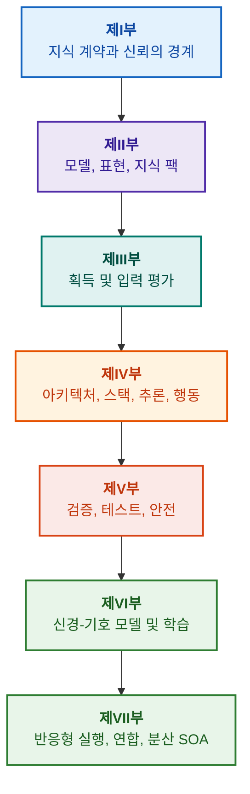

# 증거 기반 전문가 시스템 아키텍처: 형식 온톨로지에서 신경-기호 AI까지

**고신뢰성 지능형 시스템의 설계, 수학적 모델, 아키텍처 및 형식 검증을 다루는 엔지니어링 모노그래프 겸 실무 핸드북 (Safety-Critical & Evidence-Grounded AI)**

**저자:** [Mykola Fedchyk](about-the-author.md) · [LinkedIn](https://www.linkedin.com/in/nickfedchik/)  
**형식:** 엔지니어링 모노그래프 / AI 아키텍트 실무 지침서  
**발행 연도:** 2026년  

---

## 책 소개

본 모노그래프는 현대 인공지능이 직면한 가장 심각한 위기, 즉 신경망 생성물의 확률적 그럴듯함과 형식적 수학 증명의 결정론적 진리성 사이에 존재하는 ‘인식론적 단절(Epistemic Gap)’을 극복하기 위해 저술된 기초 연구이자 종합 엔지니어링 가이드입니다. 연구의 중심에는 타협할 수 없는 질문이 자리 잡고 있습니다. **"도출된 모든 결론이 반박 불가능하고, 1차 증거 출처까지 완전히 추적 가능하며, 기능 안전이 최우선시되는 핵심 산업 분야(ISO 26262, IEC 61508, DO-178C, ISO/SAE 21434)에서 인증받을 수 있는 전문가 시스템을 어떻게 설계할 것인가?"**

저자는 새로운 패러다임인 **‘증거 기반 신경-기호 AI(Evidence-Grounded Neuro-Symbolic AI)’**를 제안하고 체계화합니다. 이 아키텍처에서 통계적 언어 모델(LLM/SLM)은 질의 가설 생성과 투영 렌더링을 담당하는 자문적 역할을 수행하는 반면, 결정론적 기호 코어는 논리적 무모순성, 바이트 단위 사실 접지(Grounding), 권한 경계 제어, 안전한 행동 전이의 불변성을 엄격하게 보장합니다.

### 아티팩트에서 검증 가능한 의사결정으로

시스템 요구사항 명세서, 소스 코드, 테스트 로그, 규제 표준, 설계 결정은 현대 엔지니어링 환경에 이미 존재하지만, 대부분 형식화된 시맨틱, 엄격한 유효성 경계, 상호 추적성을 결여한 채 고립된 아티팩트로 흩어져 있습니다. 통과된 테스트 보고서가 구버전 하드웨어 리비전을 참조하거나, 안전 표준의 인용문이 문맥에서 벗어나 해석되거나, 긴급 롤백으로 인해 폐기된 구성 요소가 부주의하게 다시 활성화될 위험이 항상 존재합니다.

본 모노그래프는 엔드투엔드 엔지니어링 파이프라인을 제시합니다. 엔지니어링 아티팩트를 타입화된 데이터와 암호화 서명된 지식 팩으로 정형화하는 것부터 기호 추론, 단계적 계획 분해, 반사실적 설명, 역량 경계 감사에 이르기까지 전 과정을 아우릅니다. 실무적 설명은 포괄적인 테스트 스위트를 갖춘 Go 언어 기반의 상용 수준 구현체([제1장](ch01-introduction-to-expert-systems.md)), 엄밀한 수학적 계약([제II부](part-02-knowledge-models.md)), 그리고 지식 퇴행(Regression)을 입증 가능하게 방지하는 지속적 학습 프로토콜([제25장](ch25-how-expert-systems-learn.md))로 뒷받침됩니다.

### 대상 독자

본서는 시스템 아키텍트, 신뢰성 및 기능 안전 수석 엔지니어, 추론 엔진 개발자, 지식 엔지니어를 대상으로 합니다. 핵심 개념을 습득하는 데는 1차 술어 논리, 소프트웨어 버전 관리 및 수명 주기 관리에 대한 기초 지식으로 충분합니다. 실무 예제를 재현하려면 표준 Go 개발 환경이 필요합니다. Goal Structuring Notation(GSN)을 통한 안전 논증의 형식적 합성, 복잡계 시너지틱스, 뉴로모픽 가속기, GNSS 비의존 자율 항법을 다루는 전문 장들은 항공우주, 자율주행, 핵심 에너지 인프라 등 첨단 하이테크 분야에서 증거 기반 AI의 최첨단 응용 분야를 개척합니다.

---

## 학술적 맥락과 세계 연구에서의 위치

본 모노그래프는 전문가 시스템을 1980년대 규칙 기반 시스템(CLIPS, MYCIN 등)의 유물로 취급하지 않고, **제3의 물결 증거 기반 신경-기호 AI(Third-Wave Evidence-Grounded Neuro-Symbolic AI)**의 최전선으로 재정의합니다. 본 연구는 세계 유수 학파의 이론적 토대에 발을 딛고 있으면서도, 추상적 수학 모델과 고성능 시스템 엔지니어링 간의 격차를 해소합니다.

| 연구 분야 | 세계 주요 연구 및 저자 | 본서에서의 개념적 가교 |
|---|---|---|
| **제3의 물결 신경-기호 AI (NeSy)** | Artur d'Avila Garcez, Luis C. Lamb (*Neurosymbolic AI: The 3rd Wave*, 2023; *Neural-Symbolic Cognitive Reasoning*, Springer, 2009); Henry Kautz (*The Third AI Summer*, AAAI 2022) | 역할 분담: 통계 모델(SLM/LLM)이 질의 가설을 생성하고, 결정론적 기호 코어가 사실을 형식 검증하고 승인함 ([제29장](ch29-neuro-symbolic-architecture.md)). |
| **시맨틱 제약과 안전한 학습** | Guy Van den Broeck et al. (*A Semantic Loss Function for Deep Learning with Symbolic Knowledge*, ICML 2018); Luc De Raedt et al. (*DeepProbLog*, IJCAI 2020) | 입력 및 출력 인가 게이트웨이, 형식 스키마를 기반으로 신경망 출력 후보에 대한 결정론적 시맨틱 필터링 수행 ([제28장](ch28-dual-mode-expert-systems.md), [제33장](ch33-inter-system-knowledge-exchange-and-model-teaching.md)). |
| **반박 가능 추론과 논증 이론** | John L. Pollock (*Defeasible Reasoning*, 1987; *Cognitive Carpentry*, MIT Press, 1995); Phan Minh Dung (*Abstract Argumentation Frameworks*, AIJ 1995); Douglas Walton (*Argumentation Schemes*, Cambridge, 2008) | 지식을 주장, 출처, 반박자(*rebutting* 및 *undercutting defeaters*)로 분해하고, 둥(Dung)의 추상 논증 프레임워크를 적용하여 규범 규칙 베이스의 충돌을 해결함 ([제2장](ch02-epistemology-of-machine-knowledge.md), [제27장](ch27-safety-case-gsn-synthesis.md)). |
| **자율 연관 규칙 마이닝 (KBC)** | Luis Galárraga, Fabian M. Suchanek et al. (*AMIE: Association Rule Mining under Incomplete Evidence*, WWW 2013, VLDBJ 2015); Stephen Muggleton (*Inductive Logic Programming*, 1994) | 열린 세계 가정의 허위 반례를 배제하면서 부분 완전성 가정(PCA) 하에 지식 베이스로부터 연관 규칙을 자율 귀납 추출함 ([제34장](ch34-deterministic-relational-analysis-abduction-and-socratic-dialogue.md)). |
| **형식 안전 쉴드와 인증 (Safe AI)** | Bettina Könighofer, Roderick Bloem et al. (*Shield Synthesis*, 2017); Tim Kelly, Rob Weaver (*Goal Structuring Notation*, York, 2004); André Platzer (*Logical Foundations of CPS*, Springer, 2018) | ISO 26262/21434 표준에 부합하는 GSN 표기법 기반 안전 케이스 합성. 주변 액추에이터를 위한 형식 쉴드 및 수치 유효성 포락선 구축 ([제27장](ch27-safety-case-gsn-synthesis.md), [제30장](ch30-safety-cybersecurity-co-engineering.md), [제33장](ch33-inter-system-knowledge-exchange-and-model-teaching.md)). |
| **인식 논리학과 지식 기호학** | John F. Sowa (*Knowledge Representation: Logical, Philosophical, and Computational Foundations*, 2000); Frank van Harmelen et al. (*Handbook of Knowledge Representation*, Elsevier, 2008) | 찰스 샌더스 퍼스의 인식론적 삼항조(개념 → 판단 → 추론). 엄격한 연역적 통제 하에 작업 가설에 대한 가설적 추론(귀추법) 실행 ([제6장](ch06-applied-mathematics-for-expert-systems.md), [제34장](ch34-deterministic-relational-analysis-abduction-and-socratic-dialogue.md)). |
| **사이버네틱스와 복잡계 시너지틱스** | Norbert Wiener (*Cybernetics*, 1948); W. Ross Ashby (*An Introduction to Cybernetics*, 1956); Hermann Haken (*Synergetics: An Introduction*, 1977; *Advanced Synergetics*, 1983); Ilya Prigogine (*Order out of Chaos*, 1984) | 애슈비의 필수 다양성 법칙, L0–L4 폐루프 제어, 하켄의 예속 원리에 의한 상태 공간의 질서 매개변수 축약, 임계 감속(CSD)을 통한 상전이 조기 감지 및 지식 베이스의 소산 구조 안정화 ([제6장](ch06-applied-mathematics-for-expert-systems.md), [제22장](ch22-cybernetics-edge-to-backend.md), [제35장](ch35-self-organizing-expert-systems-synergetics-and-npu-runtime.md)). |
| **지식 테스트, 언어적 불변성, 립시츠 보정** | Kent Beck (*TDD*, 2002); Martin Fowler (*Refactoring*, 2018); Clark Barrett, Leonardo de Moura (*Z3 SMT Solver*, 2008); Chuan Guo et al. (*On Calibration of Modern Neural Networks*, ICML 2017); Marco Tulio Ribeiro et al. (*CheckList*, ACL 2020); John L. Pollock (*Defeasible Reasoning*, 1987) | 4단계 지식 테스트 피라미드(KTP): 전제 모킹(`PremiseMock`)을 통한 단위 규칙 격리 테스트(KUT), 공허한 참의 함정 배제, 6점 스펙트럼 경계값 분석(BVA), 규칙 격자 및 반박자(KIT), 언어적 변이에 대한 시맨틱 불변성 점수($\text{SIS} \ge 0.98$), 릴레이 채터링을 방지하는 립시츠 연속성 제약($L_{\mathcal{K}} \le L_{\max}$), 스티그머지적 지식 결손 축적 ([제36장](ch36-knowledge-testing-pyramid-and-variational-calibration.md)). |

---

## 저자의 독창적 이론 모델, 과학적 연구 및 엔지니어링 혁신

본 모노그래프는 안전 필수 시스템 설계, 임베디드 아키텍처 및 증거 기반 AI 분야에서 저자가 일궈낸 기초 연구와 엔지니어링 실무 기여를 집대성한 결과물입니다. 단순한 문헌 고찰을 넘어, 신경-기호 간 상호작용을 수학적으로 검증 가능한 신뢰 수준으로 끌어올리는 독창적인 형식 이론, 프로토콜 및 아키텍처 패턴을 제시합니다.

### 1. 기초 이론 모델 및 엄밀한 수학적 정형화

1. **증거 접지 불변성 (EGI) 및 사실 인가 게이트웨이 ([제2장](ch02-epistemology-of-machine-knowledge.md), [제19장](ch19-from-question-to-evidence.md), [제28장](ch28-dual-mode-expert-systems.md), [제29장](ch29-neuro-symbolic-architecture.md)):**
   * *이론적 개념:* 저자는 접지 완전성 불변성 $\mathrm{Comp}(C) = 1.00$을 수식화하여, 증거 기반 시스템에서 권위 있는 1차 지식 출처로의 결정론적 투영 없이는 어떠한 주장도 공인된 사실 지위를 획득할 수 없음을 규정했습니다. 사실 베이스의 모든 요소는 불변 바이트 오프셋 `[byte_start, byte_end]`, 정규 단편 해시 `quote_sha256`, PROV-O 출처 인증서 식별자로 뒷받침됩니다.
   * *공학적 의의:* 하드웨어 및 소프트웨어 경계의 바이트 단위 인가 게이트웨이는 신경망 환각이 버전 관리되는 지식 베이스로 침투하는 것을 원천 차단하여 입증되지 않은 데이터에 대한 무관용 원칙($ZHR = 1.00$)을 보장합니다.
2. **4단계 지식 테스트 피라미드 (KTP) 및 추론 공간의 립시츠 안정성 ([제36장](ch36-knowledge-testing-pyramid-and-variational-calibration.md)):**
   * *이론적 개념:* 마틴 파울러의 테스트 피라미드를 지식 시스템에 적용한 체계적 지식 테스트 피라미드(KTP) 제안: 전제 격리(`PremiseMock`)를 통한 개별 규칙 단위 테스트(KUT), 규칙 간 상호작용 및 반박자에 대한 통합 테스트(KIT), 질의 다양체에 대한 변분 보정(KVT).
   * *수학적 메커니즘:* 공허한 참 차단 불변성($P \equiv \text{False}$일 때 $P \to Q$), 언어적 섭동에 대한 시맨틱 불변성 지표($\mathrm{SIS} \ge 0.98$), 입력의 미세 변동 시 치명적인 릴레이 채터링을 배제하는 추론 공간의 립시츠 연속성 제약($L_{\mathcal{K}} \le L_{\max}$)을 도입.
3. **포퍼적 규범 반증 이론과 능동적 컴플라이언스 감사자 ([제39장](ch39-active-compliance-auditor-and-popperian-testing.md)):**
   * *이론적 개념:* 단순히 질문에 대답하는 전통적 '수동적 신탁'에서 벗어나 칼 포퍼의 반증 가능성 원리를 구현하는 능동적 지식 감사자 패러다임으로의 전환. 시스템은 요구사항 공간(ASPICE 4.0, ISO 26262, ISO/SAE 21434)을 자율 탐색하고 반례를 합성하며 불완전한 명세를 식별하여 포괄적 검증 계획을 수립합니다.
   * *실용적 가치:* 신경망에 의한 코너 케이스 창의적 생성(System 1)과 기호 코어에 의한 결정론적 당위 검증(System 2)을 결합하여 제어 루프 내 인간(Human-in-the-Loop)의 인지적 피로를 방지합니다.
4. **지식 베이스 차원의 시너지틱 축약 및 CSD 사전 진단 ([제6장](ch06-applied-mathematics-for-expert-systems.md), [제22장](ch22-cybernetics-edge-to-backend.md), [제35장](ch35-self-organizing-expert-systems-synergetics-and-npu-runtime.md)):**
   * *이론적 개념:* 헤르만 하켄의 시너지틱스(질서 매개변수와 예속 원리) 및 일리야 프리고진의 소산 구조 이론을 복잡한 지식 베이스의 진화에 적용.
   * *학술적 성과:* 텔레메트리의 다차원 상태 공간을 질서 매개변수로 축약하는 기법을 개발하고, 자기상관 및 분산 기반의 임계 감속(*Critical Slowing Down*, CSD) 감지기를 통합하여 비상 임계값 센서가 반응하기 훨씬 전에 동적 붕괴 조짐을 예측합니다.
5. **행동 자율성 수준 (A0–A4) 모델, 인가 게이트웨이 및 멱등 사가 ([제21장](ch21-from-recommendation-to-action.md)):**
   * *이론적 개념:* 시스템 전체가 아닌 '행동, 환경, 위험 수준' 튜플에 할당되는 이산적 권한 척도(A0: 수동 분석, A1: 초안 준비, A2: 인간 서명 실행, A3: 감독 하 자율, A4: 비상 안전 차단)를 수립.
   * *수학적 메커니즘:* 암호화 키 $k$ 기반 대수적 멱등성 불변성 $f(f(x, k), k) \equiv f(x, k)$, 단계적 폐루프 실행, `OutcomeUnknown` 상태 및 사후 조건 독립 검증을 갖춘 분산 보상 사가(Saga) 프로토콜을 구현.
6. **GSN 표기법 기반 기능 안전 및 사이버 보안의 형식적 공학 협업 ([제27장](ch27-safety-case-gsn-synthesis.md), [제30장](ch30-safety-cybersecurity-co-engineering.md)):**
   * *이론적 개념:* ISO 26262(기능 안전)와 ISO/SAE 21434(사이버 보안) 요건을 동시에 충족하는 GSN(Goal Structuring Notation) 논증 트리 조율 합성 모델 개발.
   * *공학적 돌파구:* 상충하는 목표 간의 수학적 중재(비상 응답 시간 예산 대 암호화 인증 깊이) 및 솔트가 추가된 머클 트리를 통한 외부 감사자 대상 증거 선택적 공개 프로토콜 수립.
7. **설명 충실성 및 시맨틱 일관성 검증 프로토콜 ([제20章](ch20-explanation-engine.md)):**
   * *이론적 개념:* 설명을 생성 모델의 자유 텍스트가 아닌, 증명 그래프, 규칙 버전, 고정된 사실 스냅샷으로부터 고유하게 도출되는 결정론적 아티팩트로 취급.
   * *수학적 메커니즘:* 충실성 평가 메트릭 게이트($C_{\text{facts}} = 1.00, H_{\text{free}} = 1.00$)를 정형화하여 기호 추론과 작업자 대상 언어화 사이에 미세한 불일치가 발생할 경우 경직된 안전 템플릿으로 자동 롤백합니다.

---

### 2. 실증 연구, 저자의 실험 벤치 및 시스템 엔지니어링

1. **`mmap` 및 제로 역직렬화를 적용한 불변 바이너리 지식 팩 ([제32장](ch32-high-performance-knowledge-packs-mmap-and-harvesting.md)):**
   * *저자의 창안:* 2계층 지식 팩 아키텍처(1차 출처의 정규 계층 + 색인의 파생 구체화 계층).
   * *실증적 결과:* 시스템 호출 `mmap`을 통해 색인을 가상 주소 공간에 직접 매핑하여 동적 메모리 할당 오버헤드를 완전히 제거(zero-allocation)하고, 기가바이트 규모의 온톨로지 크기와 무관하게 준선형 시간 내에 엔진을 시작.
2. **IETF RFC-1000 및 W3C-150 규범 코퍼스 기반 실증 보정 시험대 ([제2장](ch02-epistemology-of-machine-knowledge.md), [제4장](ch04-evolution-from-bayes-to-evidence-ai.md), [제14장](ch14-requirements-detection-and-formalization.md), [제25장](ch25-how-expert-systems-learn.md)):**
   * *저자의 실험:* 1,000개의 유효한 IETF RFC 규격(인터넷 발전의 5개 시대별 분포) 및 W3C 코퍼스의 150개 복합 진단 질의(논리적 모순 및 작화증의 인위적 주입 포함)를 기반으로 대규모 연구 시험대 가동.
   * *실무적 성과:* 객관적인 지식 시험 매트릭스 구축, 규범 간 충돌 감지, 지식 베이스 업데이트 시 퇴행 방지를 수학적으로 입증.
3. **다단계 관계 분석, 기호 귀추법 및 소크라테스식 대화 ([제34장](ch34-deterministic-relational-analysis-abduction-and-socratic-dialogue.md)):**
   * *저자의 개발:* 루프 방지 기능과 상호 연결된 엔티티에 대한 복합 바이트 증거 체인 형성을 갖춘 양방향 유계 너비 우선 탐색(Bidirectional Bounded BFS, $k \le 6$) 알고리즘.
   * *공학적 이점:* 엄격한 연역적 통제 하에 퍼스의 기호 귀추법 구현 및 타입화된 소크라테스식 소명 프레임(*Clarification Frames*)을 제공하여 폐쇄 세계 가정(CWA) 하의 맹목적 거부 대신 인간과의 생산적 대화 모드로 전환.
4. **주변 제어 시스템을 위한 형식 쉴드 및 수치 유효성 포락선 ([제33장](ch33-inter-system-knowledge-exchange-and-model-teaching.md), [부록 나](appendix-b-robotics-and-cyber-physical-systems.md), [부록 다](appendix-c-autonomous-navigation-and-geosearch.md), [부록 마](appendix-e-mixed-signal-neuromorphic-expert-systems.md)):**
   * *저자의 창안:* 디지털 신호 프로세서(DSP) 및 GNSS 비의존 자율 항법(TRN/DSMAC/VIO) 시스템을 위해 이산 논리 불변성을 연속 수치 안전 회랑으로 변환하는 방법론.
   * *실무적 신뢰성:* Ed25519 암호화 기반 서명된 규칙 교환, 후보 지식에 대한 안전한 격리 보관, 하드웨어 수준에서의 위험 제어 명령 차단.
5. **설명을 통한 기밀 유출 방지 및 차등 감사 ([제20장](ch20-explanation-engine.md)):**
   * *저자의 개발:* 증명 그래프의 각 노드와 에지에 대한 ACL 검사를 수행하는 설명 중간 표현 축약 프로토콜($\mathrm{EIR}_{\text{redacted}}$)을 통해 일련의 대조적 "WHY NOT" 질의를 악용한 모델 재구성 부채널 공격 차단.

---

## 분류 및 구성 원칙

본서의 부(Part)는 장이 작성된 연도나 특정 기술 이름이 아니라 핵심 엔지니어링 과제에 따라 정의됩니다. 각 장은 하나의 주된 부에 속하며, 인접한 방법들은 해당 핵심 과제를 해결하는 수단을 설명합니다. 장 번호와 파일 이름은 영구 식별자로 유지되므로 논리적 독서 순서는 숫자 순서와 다를 수 있습니다.

장 내부의 절 제목은 몇 가지 명확한 범주로 나뉩니다. 이는 대등한 기술 나열이 아니라 일관된 논증의 전개로 읽어야 합니다.

| 절 범주 | 독자의 질문 | 장에서의 기능 |
|---|---|---|
| 문제 및 과제 경계 | 구체적으로 무엇을 해결해야 하는가? | 핵심 질문과 적용 범위 정의 |
| 대상 및 모델 | 어떤 데이터, 지식 또는 상태를 다루는가? | 개념, 타입, 가정의 일치 |
| 방법 및 절차 | 어떻게 결과를 얻는가? | 추론, 변환, 제어 절차 설명 |
| 구현 및 도구 | 절차를 무엇으로 실행하는가? | 방법의 소프트웨어 또는 하드웨어 구현 제시 |
| 검증 및 대조 사례 | 오류를 어떻게 감지하는가? | 독립적 기준과 결과를 대조 검증 |
| 결론 및 결과 한계 | 무엇이 입증되었고 무엇이 미해결인가? | 과도한 보장 없이 핵심 질문에 답변 |

국가, 산업 분야, 상용 제품은 적용 맥락일 뿐 본 분류 체계의 독립된 계층이 아닙니다. 용어 사전, 약어, 참고문헌, 내비게이션은 보조 장치이며 독립된 주제가 아닙니다.

전체 [편집 검토 지도](editorial-structure-review.md)에는 각 장의 핵심 주제에 대한 평가, 인접 논의 간의 경계, 구조 및 결론에 대한 유의사항이 포함되어 있습니다. 새로운 서문이 추가되었다고 해서 장 내부의 모든 내용상 위험이 완전히 해소되었음을 의미하지는 않습니다.

## 권장 독서 경로

**최초 소프트웨어 검증:** [1](ch01-introduction-to-expert-systems.md) → [7](ch07-knowledge-base-typology.md) → [8](ch08-engineering-artifacts-as-data.md) → [17](ch17-implementation-stack.md) → [23](ch23-knowledge-base-verification.md) → [25](ch25-how-expert-systems-learn.md). 목표: 증거 근거, 네거티브 테스트, 통제된 지식 변경을 갖춘 재현 가능한 판단 확보. 언어 모델은 필수가 아닙니다.

**지식 엔지니어링:** [제II부](part-02-knowledge-models.md) → [제III부](part-03-knowledge-engineering-nlp.md) → [19](ch19-from-question-to-evidence.md) → [20](ch20-explanation-engine.md) → [26](ch26-continual-learning.md). 목표: 시맨틱, 출처, 지식 획득, 새로운 후보 검증의 조화. 제II부에는 7~11장에 대한 과학적 검증 프로그램이 보존되어 있습니다.

**솔루션 아키텍처:** [16](ch16-expert-systems-architecture.md) → [19](ch19-from-question-to-evidence.md) → [31](ch31-syllogistic-reasoning-and-relation-lattices.md) → [20](ch20-explanation-engine.md) → [21](ch21-from-recommendation-to-action.md). 목표: 증거 근거 검증, 규범 적용, 설명 생성, 행동 권한의 명확한 분리.

**검증 및 안전:** [23](ch23-knowledge-base-verification.md) → [36](ch36-knowledge-testing-pyramid-and-variational-calibration.md) → [25](ch25-how-expert-systems-learn.md) → [26](ch26-continual-learning.md) → [27](ch27-safety-case-gsn-synthesis.md) → [30](ch30-safety-cybersecurity-co-engineering.md). 외부 시스템 진단은 [제24장](ch24-system-diagnosis.md)을 통해 별도로 다룹니다.

**하이브리드 응답 및 운영:** [제VI부](part-06-frontiers-neuro-symbolic.md) → [제VII부](part-07-runtime-and-knowledge-exchange.md) → [40](ch40-distributed-epistemic-architectures-soa-and-cluster-scaling.md) 및 관련 부록. 목표: 언어 모델 통합, 지식 결손 관리, 분산 지식 서비스 아키텍처 구축 및 시스템 간 지식 교환 검증. [제2장](ch02-epistemology-of-machine-knowledge.md), [제4장](ch04-evolution-from-bayes-to-evidence-ai.md), [제6장](ch06-applied-mathematics-for-expert-systems.md)은 계약, 역사, 수학적 레퍼런스로서 수시로 참조할 수 있습니다.

---

## 공학적 약속의 한계

본서는 교육 및 연구 자료이며, 공인된 인증 절차나 특정 규격에 대한 제품 적합성 증명이 아닙니다. 결정론적 실행이 사실의 정확성을 직접 증명하지 않으며, 암호화 해시와 전자 서명이 절대적 진리를 증명하지 않습니다. 또한 논증 그래프가 인간 전문가의 평가를 완전히 대체할 수는 없습니다. 완제품 전체의 신뢰성 요건을 언어 모델의 오류율과 동일시하거나 모든 소프트웨어 구성 요소에 일괄적으로 적용해서는 안 됩니다.

자동 구문 분석은 수작업 데이터 입력을 줄여주지만, 도메인 모델링, 동료 검토, 지식 소유자의 책임을 면제하지 않습니다. Protégé, 수동 검토, 자동 수집은 상호 보완적으로 작동할 수 있습니다. 수학적 보장은 특정 언어 프로필 및 전제 조건에 한해 유효하며, 측정된 처리 속도는 테스트된 특정 질의, 코퍼스 및 환경에 국한됩니다. 저자의 과거 측정 수치는 공개 학습 시험대 및 향후 연구 과제와 명확히 구분됩니다.

제품 출시, 위험 수용, 규제 요건 준수에 대한 최종 결정권은 권한을 위임받은 인간 전문가에게 있습니다. 전문가 시스템은 검증 가능한 근거 자료를 준비하고 합의된 정책을 엄격히 실행하지만, 규제적 또는 법적 권한을 자체적으로 획득하지는 않습니다.

---

## 책의 구조

본서는 7개의 주제별 부(Part), 40개의 장(Chapter), 5개의 부록(Appendix)으로 구성됩니다. 각 장은 하나의 주된 부에 속합니다. 내비게이션의 이전 장과 다음 장은 아래의 논리적 순서를 따르며, 장 번호와 파일 이름은 유지됩니다.

---

### [제I부 개념적 및 인식론적 기초](part-01-foundations.md)

*전문가 시스템이 언제 필요한지, 무엇을 지식으로 인정할 수 있는지, 조직의 의사결정 근거를 어떻게 보존할 것인지.*

* [제1장 전문가 시스템 입문: 혼돈에서 관리되는 지식으로](ch01-introduction-to-expert-systems.md)
* [제2장 엔지니어를 위한 철학: 기계가 지식이라고 부를 수 있는 것](ch02-epistemology-of-machine-knowledge.md)
* [제3장 전문가 시스템과 단순 정보 검색 시스템의 근본적 차이](ch03-beyond-reference-information-systems.md)
* [제4장 전문가 시스템의 진화: 베이즈 정리에서 증거 기반 AI까지](ch04-evolution-from-bayes-to-evidence-ai.md)
* [제5장 신뢰의 삼항조: 전문가 시스템, 증거 기반 권고, 조직의 기억](ch05-triad-of-trust-and-corporate-memory.md)

---

### [제II부 수학적 모델, 지식 표현 및 지식 저장](part-02-knowledge-models.md)

*수학적 연산과 표현의 선택, 타입화된 아티팩트, 추적성 그래프, 불변 지식 팩.*

* [제6장 전문가 시스템을 위한 응용수학: 규칙, 확률, 그래프, 인과성](ch06-applied-mathematics-for-expert-systems.md)
* [제7장 지식 베이스 유형론: 규칙, 온톨로지, 사례, 벡터](ch07-knowledge-base-typology.md)
* [제8장 전문가 시스템의 데이터로서의 엔지니어링 아티팩트](ch08-engineering-artifacts-as-data.md)
* [제9장 엔지니어링 지식 그래프: 요구사항에서 하드웨어까지의 추적성](ch09-engineering-knowledge-graph-traceability.md)
* [제32장 불변 지식 팩: 바이트 단위 인가, 인덱스, 메모리 매핑](ch32-high-performance-knowledge-packs-mmap-and-harvesting.md)

---

### [제III부 지식 획득, 언어 분석 및 입력 평가](part-03-knowledge-engineering-nlp.md)

*문서, 전문가 경험, 관측: 후보 추출, 언어 분석, 정형화 및 증거 평가.*

* [제10장 지식 획득 시스템: 출처, 인가, 수명 주기](ch10-knowledge-acquisition-systems.md)
* [제11장 전문가로부터의 지식 추출: 인터뷰, 인지 지도, 경험의 형식화](ch11-knowledge-elicitation-from-experts.md)
* [제12장 언어학적 분석과 로컬 모델: 의미와 출처 보존](ch12-linguistic-analysis-and-local-models.md)
* [제13장 자연어의 다양성 대 결정론: 질문 의미의 컴파일](ch13-language-variability-vs-determinism.md)
* [제14장 요구사항 및 양상 감지: 규범 텍스트에서 불변성으로](ch14-requirements-detection-and-formalization.md)
* [제15장 지식 추출 및 지식 베이스 구축: 사실, 문법, 오토마타](ch15-knowledge-extraction-and-kb-construction.md)
* [제37장 입력 정보 평가: 출처, 증거, 불확실성](ch37-input-information-assessment-and-algorithmic-skepticism.md)

---

### [제IV부 아키텍처, 기술 스택, 추론 및 행동](part-04-architecture-and-inference.md)

*아키텍처 계약, 기술 스택, 하드웨어 실행, 주장 검증, 규범 기반 추론, 설명 및 사이버네틱스 제어 루프.*

* [제16장 전문가 시스템 아키텍처: 형식적 지식에서 증거 기반 의사결정까지](ch16-expert-systems-architecture.md)
* [제17장 기술 스택: 도구, 프로그래밍 언어, 규칙 엔진 선정 기준](ch17-implementation-stack.md)
* [제18장 실행 인프라: 로컬 모델, 하드웨어 가속기, Edge 및 On-Premise](ch18-execution-infrastructure.md)
* [제19장 질문에서 증거까지: 검색, 접지 및 주장 검증](ch19-from-question-to-evidence.md)
* [제31장 규범 기반 추론: 술어 계층, 예외, 유효성](ch31-syllogistic-reasoning-and-relation-lattices.md)
* [제20장 설명 엔진: 의사결정, 거부, 역량의 한계](ch20-explanation-engine.md)
* [제21장 권고에서 행동까지: 권한 관리 및 운영 환경에서의 안전한 실행](ch21-from-recommendation-to-action.md)
* [제22장 사이버네틱스 제어 루프: 센서, 주변기기, 피드백](ch22-cybernetics-edge-to-backend.md)

---

### [제V부 검증, 테스트, 진단 및 안전 논증](part-05-verification-and-learning.md)

*규칙의 형식 검증, 지식 테스트 피라미드, 포퍼적 반증, 기술 진단, 기능 안전 및 사이버 보안 논증.*

* [제23장 지식 베이스 검증: 규칙의 무모순성, 완전성, 신뢰성 검사 방법](ch23-knowledge-base-verification.md)
* [제36장 지식 테스트 피라미드: 규칙, 상호작용, 응답 안정성](ch36-knowledge-testing-pyramid-and-variational-calibration.md)
* [제39장 능동적 전문가 테스터: 포퍼적 반증, 규제 준수(ASPICE/ISO 26262/ISO 21434) 및 자율 테스트 설계](ch39-active-compliance-auditor-and-popperian-testing.md)
* [제24장 기술 진단: 불완전성 조건에서 증상과 근본 원인을 혼동하지 않는 방법](ch24-system-diagnosis.md)
* [제27장 안전 논증: 논거의 합성 및 검증](ch27-safety-case-gsn-synthesis.md)
* [제30장 기능 안전 및 사이버 보안의 공동 엔지니어링](ch30-safety-cybersecurity-co-engineering.md)

---

### [제VI부 신경-기호 모델, 인지적 개척지 및 지속적 학습](part-06-frontiers-neuro-symbolic.md)

*엄격한 추론과 자문적 가설, 언어 모델 통합, 지식 결손, 미확인 응답 제어, 시험 매트릭스 및 경험을 통한 지속적 학습.*

* [제28장 듀얼 모드 전문가 시스템: 엄격한 추론과 자문적 가설](ch28-dual-mode-expert-systems.md)
* [제29장 신경-기호 아키텍처: 언어 모델과 증거 근거 검증](ch29-neuro-symbolic-architecture.md)
* [제34장 지식 결손: 관계형 탐색, 귀추법 및 소명 대화](ch34-deterministic-relational-analysis-abduction-and-socratic-dialogue.md)
* [제38장 기계 환각과 지식 부족: 증거 기반 응답 제어](ch38-curing-machine-hallucinations-and-knowledge-deficits.md)
* [제25장 전문가 시스템 교육 방법: 시험 매트릭스, 지식 감사, 퇴행 방지](ch25-how-expert-systems-learn.md)
* [제26장 경험을 통한 지속적 학습(Continual Learning)과 시스템 로그 표류 극복](ch26-continual-learning.md)

---

### [제VII부 반응형 실행, 시스템 간 지식 교환 및 분산 SOA](part-07-runtime-and-knowledge-exchange.md)

*규칙의 반응형 실행, 시너지틱스와 지식의 상전이, 시스템 간 교환 및 엔터프라이즈 규모의 분산 인식론 아키텍처.*

* [제35장 반응형 전문가 시스템: 이벤트, 철회, 지식 적응](ch35-self-organizing-expert-systems-synergetics-and-npu-runtime.md)
* [제33장 시스템 간 지식 교환: 외부 시스템으로의 규칙 배포, 모델 교육, 안전한 피드백](ch33-inter-system-knowledge-exchange-and-model-teaching.md)
* [제40장 증거 기반 전문가 시스템의 분산 아키텍처: 인식론적 SOA, 시맨틱 라우팅, 메모리 계층 및 다중 소스 반박 가능 중재](ch40-distributed-epistemic-architectures-soa-and-cluster-scaling.md)

---

### 부록

* [부록 가 복잡한 엔지니어링 프로젝트에서 증거 기반 연구를 위한 실무 프레임워크](appendix-a-evidence-governed-framework.md)
* [부록 나 자율 로보틱스 및 사이버-물리 복합체에서의 증거 기반 전문가 시스템](appendix-b-robotics-and-cyber-physical-systems.md)
* [부록 다 GNSS 비의존 자율 항법: 지리공간 매칭(TRN/DSMAC), 시각적 주행 거리 측정(VIO) 및 센서 융합 전문가 중재](appendix-c-autonomous-navigation-and-geosearch.md)
* [부록 라 아날로그 전문가 시스템, 뉴로모픽 컴퓨팅 및 하드웨어 논리 추론](appendix-d-analog-expert-systems-and-neuromorphic-computing.md)
* [부록 마 혼합 신호 아날로그-디지털 전문가 시스템: 증거 감독 하의 뉴로모픽, 아날로그 및 비전통적 컴퓨팅](appendix-e-mixed-signal-neuromorphic-expert-systems.md)
* [저자 소개: Mykola Fedchyk (Nick Fedchik)](about-the-author.md)

---

## 향후 연구 방향

향후 연구 과제는 완결된 기성 보증이 아닙니다. 지식 팩의 재현 가능한 빌드, 제한된 형식 표현 검증, 명시적 권한을 통한 에이전트 제어, 특정 정형화된 주장의 기밀 검증, 통제된 철회 및 기계 망각(machine unlearning) 연구가 포함됩니다. 모델의 속성을 증명하는 것이 물리적 완제품의 적합성을 자동으로 보증하지 않으며, 규칙을 삭제하는 것이 훈련된 모델에서 데이터의 영향을 완전히 지우는 것과 동일하지 않습니다.

하드웨어 가속기 및 비전통적 컴퓨팅의 경우 오류율, 지연 시간, 에너지 소비, 장애 시 동작을 먼저 정밀 측정합니다. 관련 주제는 [제29장](ch29-neuro-symbolic-architecture.md), [제32장](ch32-high-performance-knowledge-packs-mmap-and-harvesting.md), [부록 라](appendix-d-analog-expert-systems-and-neuromorphic-computing.md) 및 [부록 마](appendix-e-mixed-signal-neuromorphic-expert-systems.md)에서 다룹니다. 7~11장의 실무 연구 프로그램은 [제II부](part-02-knowledge-models.md)에 기술되어 있으며, 각 제안은 가설, 대조 비교, 반증 조건을 명시하고 있습니다.
