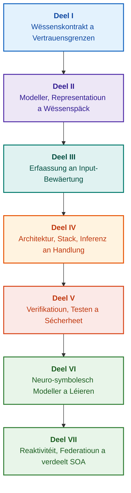

# Architektur vu beweisbaséierten Expertensystemer: Vun formellen Ontologien bis zu neuro-symbolescher KI

**Ingenieursmonographie an ëmfaassend Handbuch iwwer Design, mathematesch Modeller, Architektur a formell Verifikatioun vun héichzouverlässegen intelligente Systemer (Safety-Critical & Evidence-Grounded AI)**

**Auteur:** [Mykola Fedchyk (Микола Федчик)](../en/about-the-author.md) · [LinkedIn](https://www.linkedin.com/in/nickfedchik/)  
**Format:** Ingenieursmonographie / Handbuch vum KI-Architekt  
**Joer:** 2026  

---

## Iwwer d'Buch

D'Buch ass eng fundamental monographesch Fuerschung an en Ingenieursleitfuedem, deen der Iwwerwanndung vun der Schlësselkris vun der zäitgenëssescher kënschtlecher Intelligenz gewidmet ass: der epistemescher Spléck tëscht der probabilistescher Plausibilitéit vun neuronalen Generatiounen an der deterministescher Wourecht vu formelle mathematesche Beweiser. Am Mëttelpunkt vun der Fuerschung steet eng rigoréis Ingenieursfro: **Wéi designt een en Expertensystem, deem seng Conclusiounen all onwidderleeft, vollstänneg op d'Primärquelle vun de Beweiser zréckverfollegbar a gëeegent fir d'Zertifizéierung a sécherheetskriteschen Ingenieursberäicher sinn (ISO 26262, IEC 61508, DO-178C, ISO/SAE 21434)?**

Den Auteur begrënnt an etabléiert en neit Paradigma: **Beweisbaséiert Neuro-Symbolesch KI (Evidence-Grounded Neuro-Symbolic AI)**. An dëser Architektur iwwerhuelen statistesch Modeller (LLM/SLM) eng berodend Funktioun fir d'Generéiere vun Ufrohypothesen a projektivem Rendering; wärend en deterministesche symbolesche Kär onverännerlech d'Invariante vu logescher Konsistenz, Byte-Niveau Buedemung vu Fakten, Autoritéitskontroll a sécherem Iwwergank zur Handlung garantéiert.

### Vum Ingenieursartefakt zur verifizéierbarer Entscheedung

Systemufuerderungen, Quelltext, Testprotokoller, reglementaresch Standarden an Ingenieursentscheedunge sinn a modernen Produktiounsëmfelder scho laang präsent, funktionéieren awer meeschtens als isoléiert Artefakte ouni formaliséiert Semantik, ouni strikt Gëltegkeetsgrenzen an ouni géigesäiteg Tracabilitéit. En erfollegräichen Testbericht kann sech op eng vereelzt Hardware-Revisioun bezéien; en Zitat aus engem funktionelle Sécherheetsstandard kann aus dem Kontext gerappt sinn; an en Noutfall-Rollback vun enger Konfiguratioun kann ongewollt eng zréckgezunn Komponent nees aktivéieren.

Dës Monographie bitt eng duerchgängeg Ingenieurspipeline: vun der Formaliséierung vun Ingenieursartefakten als typiséiert Daten a kryptografesch ënnerschriwwen Wëssenspäck — bis zur symbolescher Inferenz, schrëttweiser Dekompositioun vu Pläng, kontrafaktuellen Erklärungen an dem Audit vu Kompetenzgrenzen. Déi praktesch Duerstellung gëtt begleet vun industriellen Implementatiounen an der Sprooch Go mat ëmfaassenden Testsuite ([Kapitel 1](../en/ch01-introduction-to-expert-systems.md)), strenge mathematesche Kontrakter ([Deel II](../en/part-02-knowledge-models.md)) a Protokoller vum kontinuéierleche Léieren ouni Wëssensregressioun ([Kapitel 25](../en/ch25-how-expert-systems-learn.md)).

### Fir wee d'Monographie geduecht ass

D'Publikatioun riicht sech u Systemarchitekten, Lead-Ingenieure fir Zouverlässegkeet a funktionell Sécherheet, Entwéckler vu logeschen Inferenzmotoren a Wëssensingénieuren. Fir d'Basiskonzepter ze verstoen, geet e grondleeënd Verständnes vu Prädikatelogik vun der éischter Uerdnung, Software-Versiounsverwaltung a Systemliewenszyklus duer; fir d'Ausféierung vun de praktesche Beispiller sinn d'Standardtools vu Go noutwendeg. Spezialiséiert Kapitelen iwwer déi formell Synthees vu Sécherheetsargumentatioune mat Goal Structuring Notation (GSN), Synergetik vu komplexe Systemer, neuromorphe Beschleuneger an autonom Navigatioun ouni GNSS weisen déi féierend Grenze vun der beweisbaséierter KI an High-Tech-Industrien op (Loft- a Raumfaart, autonom Mobilitéit, kritesch Energieinfrastruktur).

---

## Wëssenschaftleche Kontext a Positioun vun der Monographie an der globaler Fuerschung

D'Monographie gesäit Expertensystemer net als en archaescht Relikt vu regelfasste Systemer aus den 1980er Joren (wéi CLIPS oder MYCIN), mee als d'Spëtzt vun der **beweisbaséierter neuro-symbolescher KI vun der Drëtter Well (Third-Wave Evidence-Grounded Neuro-Symbolic AI)**. D'Aarbecht baséiert op den theoretesche Fundamenter vun de féierende weltwäite wëssenschaftleche Schoulen a schléisst gläichzäiteg d'Spléck tëscht abstrakte mathematesche Modeller an performanter Systemtechnik:

| Wëssenschaftleche Beräich | Schlësselwierker a weltwäit Auteuren | Konzeptuell Bréck am Buch |
|---|---|---|
| **Neuro-symbolesch KI vun der Drëtter Well (NeSy)** | Artur d'Avila Garcez, Luis C. Lamb (*Neurosymbolic AI: The 3rd Wave*, 2023; *Neural-Symbolic Cognitive Reasoning*, Springer, 2009); Henry Kautz (*The Third AI Summer*, AAAI 2022) | Verantwortungstrennung: statistesch Modeller (SLM/LLM) generéieren Ufrohypothesen, wärend den deterministesche symbolesche Kär d'Fakten formell verifizéiert a validéiert ([Kapitel 29](../en/ch29-neuro-symbolic-architecture.md)). |
| **Semantesch Restriktiounen a séchert Léieren** | Guy Van den Broeck et al. (*A Semantic Loss Function for Deep Learning with Symbolic Knowledge*, ICML 2018); Luc De Raedt et al. (*DeepProbLog*, IJCAI 2020) | Zougangs- an Ausgangskontrollpaarten, deterministesch semantesch Filtratioun vun Neuronalnetz-Virschléi no formelle Schemen ([Kapitelen 28](../en/ch28-dual-mode-expert-systems.md), [33](../en/ch33-inter-system-knowledge-exchange-and-model-teaching.md)). |
| **Widderleeft Schléissen an Argumentatiounstheorie** | John L. Pollock (*Defeasible Reasoning*, 1987; *Cognitive Carpentry*, MIT Press, 1995); Phan Minh Dung (*Abstract Argumentation Frameworks*, AIJ 1995); Douglas Walton (*Argumentation Schemes*, Cambridge, 2008) | Zerleeung vu Wëssen an Aussoen, Hierkonft a Widderleeungselementer (*rebutting* an *undercutting defeaters*); Konfliktléisung an normatieve Basen iwwer Dung-Argumentatiounsframewierker ([Kapitelen 2](../en/ch02-epistemology-of-machine-knowledge.md), [27](../en/ch27-safety-case-gsn-synthesis.md)). |
| **Autonome Mining vun Associatiounsregelen (KBC)** | Luis Galárraga, Fabian M. Suchanek et al. (*AMIE: Association Rule Mining under Incomplete Evidence*, WWW 2013, VLDBJ 2015); Stephen Muggleton (*Inductive Logic Programming*, 1994) | Automatesch Reegelinduktioun aus Wëssensbasen ënner der Partial Completeness Assumption (PCA) ouni falsch Géigebeispiller vun der oppener Welt ([Kapitel 34](../en/ch34-deterministic-relational-analysis-abduction-and-socratic-dialogue.md)). |
| **Formell Sécherheetsschëlter an Zertifizéierung (Safe AI)** | Bettina Könighofer, Roderick Bloem et al. (*Shield Synthesis*, 2017); Tim Kelly, Rob Weaver (*Goal Structuring Notation*, York, 2004); André Platzer (*Logical Foundations of CPS*, Springer, 2018) | Synthees vu Sécherheetsfäll an der GSN-Notatioun fir ISO 26262/21434 Standarden; formell Schëlter an numeresch Validitéitsenveloppen fir peripher Aktuatoren ([Kapitelen 27](../en/ch27-safety-case-gsn-synthesis.md), [30](../en/ch30-safety-cybersecurity-co-engineering.md), [33](../en/ch33-inter-system-knowledge-exchange-and-model-teaching.md)). |
| **Epistemesch Logik a Semiotik vum Wëssen** | John F. Sowa (*Knowledge Representation: Logical, Philosophical, and Computational Foundations*, 2000); Frank van Harmelen et al. (*Handbook of Knowledge Representation*, Elsevier, 2008) | Epistemesch Triad vum Charles Sanders Peirce (Begrëff → Urteel → Schlussfolgerung); abduktiv Inferenz vun Hypothesen ënner strenger deduktiver Kontroll ([Kapitelen 6](../en/ch06-applied-mathematics-for-expert-systems.md), [34](../en/ch34-deterministic-relational-analysis-abduction-and-socratic-dialogue.md)). |
| **Kybernetik a Synergetik vu komplexe Systemer** | Norbert Wiener (*Cybernetics*, 1948); W. Ross Ashby (*An Introduction to Cybernetics*, 1956); Hermann Haken (*Synergetics: An Introduction*, 1977; *Advanced Synergetics*, 1983); Ilya Prigogine (*Order out of Chaos*, 1984) | Gesetz vun der noutwenneger Varietéit vun Ashby, zou Kontrollschläifen L0–L4, Zoustandsraumreduktioun op Uerdnungsparameteren nom Haken-Subordinatiounsprinzip, Phaseniwwerganksprediktioun duerch Critical Slowing Down (CSD) a dissipativ Stabiliséierung vu Wëssensbasen ([Kapitelen 6](../en/ch06-applied-mathematics-for-expert-systems.md), [22](../en/ch22-cybernetics-edge-to-backend.md), [35](../en/ch35-self-organizing-expert-systems-synergetics-and-npu-runtime.md)). |
| **Wëssenstesten, sproochlech Invarianz a Lipschitz-Kalibréierung** | Kent Beck (*TDD*, 2002); Martin Fowler (*Refactoring*, 2018); Clark Barrett, Leonardo de Moura (*Z3 SMT Solver*, 2008); Chuan Guo et al. (*On Calibration of Modern Neural Networks*, ICML 2017); Marco Tulio Ribeiro et al. (*CheckList*, ACL 2020); John L. Pollock (*Defeasible Reasoning*, 1987) | Véierniveau Wëssenstestpyramid (KTP): isoléiert Eenheetstesten vu Reegelen (KUT) mat Viraussetzungsmocking (`PremiseMock`), Blockéierung vun der Fal vun der vakuum Wourecht, 6-Punkt spektral BVA, Reegel- a Defeater-Gitteren (KIT), semantesch Invarianzmetrik ($\text{SIS} \ge 0.98$) op sproochleche Variatiounen, Lipschitz-Kontinuitéit ($L_{\mathcal{K}} \le L_{\max}$) géint Relais-Klackeren, a stigmergesch Akkumulatioun vu Wëssenslücken ([Kapitel 36](../en/ch36-knowledge-testing-pyramid-and-variational-calibration.md)). |

---

## Theoretesch Modeller, wëssenschaftlech Fuerschung an Ingenieursinnovatiounen vum Auteur

Dës Monographie bündelt fundamental Fuerschungsresultater an déi praktesch Ingenieurserfarung vum Auteur am Beräich vum Design vun héichzouverlässege Systemer, agebette Architekturen a beweisbaséierter KI. Am Géigesaz zu reng iwwersiichtsbaséierten Aarbechten entwéckelt d'Buch eng Rei vun originelle formellen Theorien, Protokoller a Systemléisungen, déi déi neuro-symbolesch Interaktioun fir d'éischt op e mathematesch verifizéierte Vertrauensniveau hiewen:

### 1. Fundamental theoretesch Entwécklungen a mathematesch Formalismen

1. **Beweisbuedemungsinvariant (Evidence-Grounded Invariant, EGI) a Faktovalidéierungs-Paart ([Kapitelen 2](../en/ch02-epistemology-of-machine-knowledge.md), [19](../en/ch19-from-question-to-evidence.md), [28](../en/ch28-dual-mode-expert-systems.md), [29](../en/ch29-neuro-symbolic-architecture.md)):**
   * *Theoretescht Konzept:* Den Auteur formuléiert a formaliséiert d'Buedemungsvollstännegkeetsinvariant $\mathrm{Comp}(C) = 1.00$, déi festleet, datt an engem beweisbaséierte System keng Fuerderung de Status vun engem Fakt kritt ouni deterministesch Projektioun op d'Primärquelle vum Wëssen. All Element an der Faktendatebank gëtt vun engem kryptografeschen Tupel begleet: onverännerleche Byte-Koordinate `[byte_start, byte_end]`, Hash vum kanonesche Fragment `quote_sha256`, an Identifikateur vum PROV-O Hierkonftszertifikat.
   * *Ingenieursbedeitung:* De Mechanismus vum Zougangspaart um Byte-Niveau verhënnert vollstänneg d'Andrénge vun Neuronalnetz-Halluzinatiounen an d'versionéiert Wëssensbasis a garantéiert eng Nulltoleranz fir net confirméiert Donnéeën ($ZHR = 1.00$).
2. **Véierniveau Wëssenstestpyramid (KTP) a Lipschitz-Stabilitéit vum Inferenzraum ([Kapitel 36](../en/ch36-knowledge-testing-pyramid-and-variational-calibration.md)):**
   * *Theoretescht Konzept:* Den Auteur proposéiert fir d'éischt eng systematesch Wëssenstestpyramid (KTP), analog zu der Softwaretestpyramid vum Martin Fowler: Eenheetsteste vun eenzele Reegelen (`PremiseMock`) (KUT), Integratiounsteste vun Reegelinteraktiounen a Widderleeungselementer (KIT), a variatiounsfäheg Kalibréierung op Formuléierungsmannigfalteschen (KVT).
   * *Mathemateschen Apparat:* Strikt Invariant fir d'Fal vun der vakuum Wourecht ze blockéieren ($P \to Q$ wann $P \equiv \text{False}$), semantesch Invarianzmetrik ($\mathrm{SIS} \ge 0.98$) ënner sproochleche Perturbatiounen, a Lipschitz-Kontinuitéitsgrenz vum Inferenzraum ($L_{\mathcal{K}} \le L_{\max}$), déi d'katastrophalt Klackere vu Conclusiounen bei klenge Schankunge vum Input mathematesch ausschléisst.
3. **Popperesch Falsifikatiounstheorie vun deontege Reegelen an aktiven Konformitéitsauditeur ([Kapitel 39](../en/ch39-active-compliance-auditor-and-popperian-testing.md)):**
   * *Theoretescht Konzept:* Iwwergank vum klassesche Modell vun engem "passive Orakel" (deen nëmmen op Ufroe reagéiert) zum Paradigma vun engem aktive Wëssensauditeur, deen de Falsifikatiounsprinzip vum Karl Popper ëmsetzt. De System exploréiert autonom den Ufuerderungsraum (ASPICE 4.0, ISO 26262, ISO/SAE 21434), synthetiséiert Géigebeispiller, identifizéiert onvollstänneg Spezifikatiounen a baut en ëmfaassende Produkttestprogramm op.
   * *Praktesche Wäert:* Kombinatioun vu kreativer Grenzfallszenariogeneréierung duerch d'Neuronalnetz (System 1) a deterministescher deontescher Verifikatioun duerch de symbolesche Kär (System 2) mat garantéiertem Schutz vum Mënsch an der Kontrollschläif (Human-in-the-Loop) viru kognitiver Iwwerlaaschtung.
4. **Synergetesch Dimensiounsreduktioun vun der Wëssensbasis a Pre-Bifurkatiounsdiagnostik CSD ([Kapitelen 6](../en/ch06-applied-mathematics-for-expert-systems.md), [22](../en/ch22-cybernetics-edge-to-backend.md), [35](../en/ch35-self-organizing-expert-systems-synergetics-and-npu-runtime.md)):**
   * *Theoretescht Konzept:* Uwendung vum mathemateschen Apparat vun der Synergetik vum Hermann Haken (Uerdnungsparameteren an d'Subordinatiounsprinzip) a vun der Theorie vun den dissipative Strukturen vum Ilya Prigogine op d'Evolutioun vu komplexe Wëssensbasen.
   * *Wëssenschaftlecht Resultat:* Method zur Reduktioun vum multidimensionale Phaseraum vun Telemetriedaten op Uerdnungsparameteren an integréierte Pre-Bifurkatiounsdetektor fir Critical Slowing Down (CSD) baséiert op Autokorrelatioun a Varianz, wat et erméiglecht, eng dynamesch Instabilitéit vum System laang virun den Noutfallschwellensensoren ze erkennen.
5. **Modell vun Autonomie-Niveauen vun der Handlung (A0–A4), Autorisatiounspaart an idempotent Sagaen ([Kapitel 21](../en/ch21-from-recommendation-to-action.md)):**
   * *Theoretescht Konzept:* Diskritt Skala vun Autoritéitsniveauen fir Systemaktiounen (A0: passiv Analys, A1: Virbereedung vun engem Entworf, A2: Handlung mat mënschlecher Ënnerschrëft, A3: iwwerwaacht Autonomie, A4: Schutz-Noutausschaltung), zougewisen un den Tupel "Aktioun, Ëmfeld, Risikoniveau".
   * *Mathemateschen Apparat:* Algebresch Idempotenzinvariant $f(f(x, k), k) \equiv f(x, k)$ baséiert um kryptografesche Schlëssel $k$, schrëttweis Ausféierung an enger zouer Schläif, a Protokoll vu verdeelte Kompensatiounssagaen mam Zoustand `OutcomeUnknown` an onofhängeger Verifikatioun vu Postkonditiounen.
6. **Formell Co-Ingenieurswiesen vu funktioneller Sécherheet a Cybersécherheet an der GSN-Notatioun ([Kapitelen 27](../en/ch27-safety-case-gsn-synthesis.md), [30](../en/ch30-safety-cybersecurity-co-engineering.md)):**
   * *Theoretescht Konzept:* Modell fir déi koordinéiert Synthees vu GSN-Argumentatiounsbeem (Goal Structuring Notation) fir d'Realiséierung vun Ufuerderungen aus den Normen ISO 26262 (funktionell Sécherheet) an ISO/SAE 21434 (Cybersécherheet).
   * *Ingenieursduerchbroch:* Formaliséierung vun engem mathemateschen Arbitrage tëscht widderspréchlechen Ziler (Äntwertzäitbudget fir Noutfäll géint Déift vun der kryptografescher Attestéierung) a Protokoll fir d'selektiv Offenleeung vu Beweiser un extern Auditeuren iwwer gesalzte Merkle-Beem.
7. **Protokoll zur Iwwerpréiwung vun der Fidelitéit a semantescher Konsistenz vun Erklärungen ([Kapitel 20](../en/ch20-explanation-engine.md)):**
   * *Theoretescht Konzept:* D'Erklärung gëtt net als fräien Text vun engem generatieve Modell ugesinn, mee als en eegestännegen deterministeschen Artefakt, deen eendeiteg aus dem Beweisgrap, der Reegelversioun an der fixéierter Faktenschnëttfläch ofgeleet gëtt.
   * *Mathemateschen Apparat:* Metrescht Paart fir d'Bewäertung vun der Fidelitéit ($C_{\text{facts}} = 1.00, H_{\text{free}} = 1.00$) mat automateschem fail-safe Fallback op e strengt Schablounemuster bei der klengster Ofwäichung tëscht der symbolescher Inferenz an der Verbaliséierung fir den Operateur.

---

### 2. Empiratesch Fuerschung, Testbänke vum Auteur a Systemtechnik

1. **Onverännerlech binär Wëssenspäck mat `mmap` an Null-Deserialiséierung ([Kapitel 32](../en/ch32-high-performance-knowledge-packs-mmap-and-harvesting.md)):**
   * *Innovatioun vum Auteur:* Zweeschichtege Package-Opbau (kanonesch Schicht vun de Primärquellen + derivéiert materialiséiert Schicht vun den Indexen).
   * *Empiratescht Resultat:* Direkter Mapping vum Index an de virtuelle Adressraum iwwer de Systemruff `mmap`, Eliminatioun vun dynameschen Allokatiounsfraise (zero-allocation), a Start vum Inferenzmotor an sublinearer Zäit onofhängeg vun der Gigabyte-Gréisst vun der Ontologie.
2. **Empiratesche Kalibréierungsstand op Standard-Korpora IETF RFC-1000 a W3C-150 ([Kapitelen 2](../en/ch02-epistemology-of-machine-knowledge.md), [4](../en/ch04-evolution-from-bayes-to-evidence-ai.md), [14](../en/ch14-requirements-detection-and-formalization.md), [25](../en/ch25-how-expert-systems-learn.md)):**
   * *Experiment vum Auteur:* Asaz vun enger grousser Fuerschungstestbänk op 1.000 gültege Spezifikatioune vun IETF RFC (verdeelt iwwer 5 historesch Epoche vun der Internet-Entwécklung) an 150 komplexe Diagnostik-Ufroe vum W3C-Korpus (inklusiv kënschtlecher Induktioun vu logesche Konflikter a Konfabulatiounen).
   * *Praktescht Resultat:* Opbau vun objektiven Wëssensexamensmatrizen, Detektioun vun normatieve Konflikter, a mathematesch noweisleche Schutz géint Regressiounen an der Wëssensbasis bei Aktualiséierungen.
3. **Méistufege Relatiounsanalys, symbolesch Abduktioun a sokratesche Dialog ([Kapitel 34](../en/ch34-deterministic-relational-analysis-abduction-and-socratic-dialogue.md)):**
   * *Entwécklung vum Auteur:* Zwee-Wee-begrenzte Breetesichalgorithmus (Bidirectional Bounded BFS, $k \le 6$) mat Zykleschutz a Formatioun vu komponéierte Beweisketten um Byte-Niveau fir beliebeg verbonnen Entitéiten.
   * *Ingenieurvirdeel:* Ëmsetzung vun der Peirce-Symbolabduktioun ënner strenger deduktiver Kontroll a typiséierte sokratesche Klärungsframe (*Clarification Frames*), déi de System an e produktiven Dialog mam Mënsch iwwerféieren amplaz vun enger blann Oflehnung ënner der Closed-World Assumption (CWA).
4. **Formell Schëlter an numeresch Validitéitsenveloppe fir peripher Kontrollsystemer ([Kapitel 33](../en/ch33-inter-system-knowledge-exchange-and-model-teaching.md), [Anhäng B](../en/appendix-b-robotics-and-cyber-physical-systems.md), [C](../en/appendix-c-autonomous-navigation-and-geosearch.md), [E](../en/appendix-e-mixed-signal-neuromorphic-expert-systems.md)):**
   * *Innovatioun vum Auteur:* Methodologie fir d'Iwwersetzung vun diskrete logeschen Invarianten a kontinuéierlech numeresch Sécherheetskorridore fir digital Signalprozessoren (DSP) a GNSS-fräi autonom Navigatiounssystemer (TRN/DSMAC/VIO).
   * *Betribszouverlässegkeet:* Signéierten Austausch vu Reegelen baséiert op Ed25519-Kryptografie, sécher Quarantän fir nei Wëssenskandidaten, an Hardware-Ofschnëtt vu geféierleche Steierbefehler.
5. **Schutz viru Verloscht vu vertraulechen Informatiounen duerch Erklärungen an differenziellen Audit ([Kapitel 20](../en/ch20-explanation-engine.md)):**
   * *Entwécklung vum Auteur:* Reduktiounsprotokoll fir d'Zwëscherrepresentatioun vun Erklärungen ($\mathrm{EIR}_{\text{redacted}}$) mat ACL-Iwwerpréiwung fir all Knuet a Kant vum Beweisgrap, wat Säitekanalattacken fir d'Modellrekonstruktioun iwwer Serien vu kontrastiven WHY NOT-Ufroe blockéiert.

---

## Prinzip vun der Gruppéierung a Klassifikatioun

D'Deeler vum Buch ginn duerch d'Haaptaufgab vum Ingenieurswiese bestëmmt, an net duerch d'Joer vum Schreiwen vum Kapitel oder den Numm vun enger spezifescher Technologie. All Kapitel gehéiert zu engem Haaptdeel; Nopeschmethoden erkläre wéi seng Haaptfro geléist gëtt. Kapitelnummeren a Dateinimm bleiwen fest Identifikatoren, sou datt d'thematesch Liesuerdnung vun der numerescher ënnerscheede kann.

D'Ënnertitelen an de Kapitelen bilden verschidde Klassen a solle wéi eng kontinuéierlech Argumentatiounskette gelies ginn, net als eng Lëscht vu gläichwäertegen Technologien:

| Ënnerdeel-Klass | Fro vum Lieser | Funktioun am Kapitel |
|---|---|---|
| Problem an Ufgabegrenz | Wat genee muss geléist ginn? | Definéiert d'Haaptfro an den Uwendungsberäich |
| Objet a Modell | Wéi eng Daten, Wëssen oder Zoustänn ginn ënnersicht? | Passt Begrëffer, Typen an Hypothesen uneneen un |
| Method a Prozedur | Wéi kënnt een zum Resultat? | Erkläert Inferenz, Transformatioun oder Steierung |
| Implementatioun an Tool | Mat wat fir engem Tool gëtt d'Prozedur ausgefouert? | Weist d'Software- oder Hardware-Realitéit vun der Method |
| Verifikatioun a Kontrollfall | Wéi erkennt een e Feeler? | Vergläicht d'Resultat mat engem onofhängege Critère |
| Conclusioun a Resultatgrenzen | Wat ass bewisen a wat bleift op? | Äntwert op d'Haaptfro ouni iwwerdriwwe Verspriechen |

Land, Industrie oder kommerziellt Produkt stellen en Uwendungskontext duer, net en eegestännegen Niveau vun dëser Taxonomie. Glossar, Ofkierzungen, Quellen an Navigatioun sinn Hëllefsmëttel fir Referenzen, net eegestänneg Kapiteltheemen.

Déi komplett redaktionell Iwwersiichtskaart enthält eng Evaluatioun vum Haaptthema vun all Kapitel, d'Grenzen tëscht ugrenzenden Diskussiounen a Bemierkungen iwwer Zesummesetzung a Conclusiounen. Eng nei annotéiert Notiz bedeit net, datt all Inhaltsrisiken bannent de Kapitelen scho vollstänneg eliminéiert sinn.

---

## Recommandéiert Liesweeër

**Éischt Software-Verifikatioun:** [1](../en/ch01-introduction-to-expert-systems.md) → [7](../en/ch07-knowledge-base-typology.md) → [8](../en/ch08-engineering-artifacts-as-data.md) → [17](../en/ch17-implementation-stack.md) → [23](../en/ch23-knowledge-base-verification.md) → [25](../en/ch25-how-expert-systems-learn.md). Zil: Reproduzéierbart Urteel mat Beweisgrënn, negativen Tester a kontrolléierter Wëssensännerung. E Sproochmodell ass net erfuerderlech.

**Wëssensingénieuren:** [Deel II](../en/part-02-knowledge-models.md) → [Deel III](../en/part-03-knowledge-engineering-nlp.md) → [19](../en/ch19-from-question-to-evidence.md) → [20](../en/ch20-explanation-engine.md) → [26](../en/ch26-continual-learning.md). Zil: Semantik, Hierkonft, Wëssenserfaassung a Validéierung vun neie Kandidaten ofstëmmen. Deel II behält de wëssenschaftleche Testprogramm fir d'Kapitele 7–11.

**Léisungsarchitektur:** [16](../en/ch16-expert-systems-architecture.md) → [19](../en/ch19-from-question-to-evidence.md) → [31](../en/ch31-syllogistic-reasoning-and-relation-lattices.md) → [20](../en/ch20-explanation-engine.md) → [21](../en/ch21-from-recommendation-to-action.md). Zil: Strikt Trennung tëscht Beweisverifikatioun, Normenuwendung, Erklärung an Handlungsautoritéit.

**Verifikatioun a Sécherheet:** [23](../en/ch23-knowledge-base-verification.md) → [36](../en/ch36-knowledge-testing-pyramid-and-variational-calibration.md) → [25](../en/ch25-how-expert-systems-learn.md) → [26](../en/ch26-continual-learning.md) → [27](../en/ch27-safety-case-gsn-synthesis.md) → [30](../en/ch30-safety-cybersecurity-co-engineering.md). D'Diagnostik vun engem externen Objet gëtt dedizéiert iwwer [Kapitel 24](../en/ch24-system-diagnosis.md) behandelt.

**Hybrid Äntwerten a Betrib:** [Deel VI](../en/part-06-frontiers-neuro-symbolic.md) → [Deel VII](../en/part-07-runtime-and-knowledge-exchange.md) → [40](../en/ch40-distributed-epistemic-architectures-soa-and-cluster-scaling.md) an déi néideg Anhäng. Zil: Sproochmodell integréieren, Wëssenslücke managen, verdeelt Wëssensdéngschtarchitektur opbauen an tëschen-systemeschen Austausch verifizéieren. D'Kapitelen [2](../en/ch02-epistemology-of-machine-knowledge.md), [4](../en/ch04-evolution-from-bayes-to-evidence-ai.md) a [6](../en/ch06-applied-mathematics-for-expert-systems.md) kënnen no Bedarf als Kontrakt, Geschicht a mathematescht Handbuch gelies ginn.

---

## Grenze vun den Ingenieursverspriechen

Dëst Buch ass e Bildungs- a Fuerschungsmaterial, a weder eng zertifizéiert Prozedur nach en offizielle Beweis fir d'Produktkonformitéit mat engem Standard. Deterministesch Ausféierung beweist net automatesch d'Richtegkeet vu Fakten; Hash a digital Ënnerschrëft beweisen net déi absolut Wourecht; an en Argumentatiounsgrap ersetzt net d'Bewäertung vun engem mënschlechen Expert. Zouverlässegkeetsufuerderunge fir e ganzt Produkt däerfen net mat der Feelerquote vun engem Sproochmodell gläichgestallt oder op all Softwarekomponente generaliséiert ginn.

Automatiséiert Parsing reduzéiert manuell Dateneingaben, eliminéiert awer net d'Beräichsmodelléierung, d'Peer-Review an d'Verantwortung vun de Wëssensbesëtzer. Protégé, manuell Iwwerpréiwung an automatiséiert Ernte kënnen effektiv zesummeschaffen. Mathematesch Garantië gëllen nëmme fir e spezifescht Sproocheprofil an Hypothesen; gemooss Vitessen bezéie sech op déi konkret Ufro, de Korpus an dat getest Ëmfeld. Archivdaten vum Auteur sinn strikt getrennt vun oppenen Trainingsëmfelder an zukünfteger Fuerschung, déi nach aussteet.

Entscheedungen iwwer Produktfräigab, Risikoakzeptanz a Konformitéit mat reglementareschen Ufuerderunge bleiwen an der Verantwortung vun autoriséierte mënschleche Spezialisten. Den Expertensystem preparéiert verifizéierbart Material an setzt déi ausgemaach Richtlinn duerch, iwwerhëlt awer keng reglementaresch oder legal Autoritéit aus sech eraus.

---

## Struktur vum Buch

D'Buch besteet aus siwen themateschen Deeler, 40 Kapitelen a fënnef Anhäng. All Kapitel gehéiert zu engem Haaptdeel. Déi viregt an déi nächst Kapitel an der Navigatioun verfollegen déi thematesch Uerdnung hei ënnen; d'Kapitelnummeren an d'Dateinimm sinn erhale bliwwen.

---

### [Deel I. Konzeptuell an epistemesch Fundamenter](../en/part-01-foundations.md)

*Wéini en Expertensystem gebraucht gëtt, wat als Wëssen zielt a wéi d'Grënn vun Organisatiounsentscheedunge konservéiert ginn.*

* [Kapitel 1. Aféierung an Expertensystemer: Vum Chaos zu gemanagtem Wëssen](../en/ch01-introduction-to-expert-systems.md)
* [Kapitel 2. Philosophie fir den Ingenieur: Wat eng Maschinn d'Recht huet Wëssen ze nennen](../en/ch02-epistemology-of-machine-knowledge.md)
* [Kapitel 3. Wéi en Expertensystem sech vun engem Informatiouns- a Referenzsystem ënnerscheet](../en/ch03-beyond-reference-information-systems.md)
* [Kapitel 4. Evolutioun vun Expertensystemer: Vum Bayes-Theorem zu beweisbaséierten KI-Léisungen](../en/ch04-evolution-from-bayes-to-evidence-ai.md)
* [Kapitel 5. Triad vum Vertrauen: Expertensystem, beweisbaséiert Empfehlung a Betribsgediechtnes](../en/ch05-triad-of-trust-and-corporate-memory.md)

---

### [Deel II. Mathematesch Modeller, Representatioun a Wëssensspäicherung](../en/part-02-knowledge-models.md)

*Wiel vu mathemateschen Operatiounen a Representatiounen, typiséiert Artefakter, Tracabilitéitsgrap an onverännerleche Wëssenspak.*

* [Kapitel 6. Ugewannt Mathematik fir Expertensystemer: Reegelen, Probabilitéiten, Graphen a Kausalitéit](../en/ch06-applied-mathematics-for-expert-systems.md)
* [Kapitel 7. Typologie vu Wëssensbasen: Reegelen, Ontologien, Prezedenzfäll a Vektoren](../en/ch07-knowledge-base-typology.md)
* [Kapitel 8. Ingenieursartefakter als Date vum Expertensystem](../en/ch08-engineering-artifacts-as-data.md)
* [Kapitel 9. Ingenieurs-Wëssensgrap: Tracabilitéit vun Ufuerderungen bis zu Hardware](../en/ch09-engineering-knowledge-graph-traceability.md)
* [Kapitel 32. Onverännerlech Wëssenspäck: Validatioun um Byte-Niveau, Indexen a Memory-Mapping](../en/ch32-high-performance-knowledge-packs-mmap-and-harvesting.md)

---

### [Deel III. Wëssenserfaassung, sproochlech Analys an Input-Bewäertung](../en/part-03-knowledge-engineering-nlp.md)

*Dokumenter, Erfarung vun Experten a Beobachtungen: Kandidatenerfaassung, sproochlech Analys, Formaliséierung a Bewäertung vu Beweiser.*

* [Kapitel 10. Wëssenserfaassungssystemer: Quellen, Validatioun a Liewenszyklus](../en/ch10-knowledge-acquisition-systems.md)
* [Kapitel 11. Wëssensextraktioun bei Experten: Interviewen, kognitiv Kaarten a Formaliséierung vun Erfarung](../en/ch11-knowledge-elicitation-from-experts.md)
* [Kapitel 12. Linguistesch Analys a lokal Modeller: Erhale vu Sënn a Quellen](../en/ch12-linguistic-analysis-and-local-models.md)
* [Kapitel 13. Variabilitéit vun der natierlecher Sprooch géint Determinismus: Kompilatioun vum Ufro-Sënn](../en/ch13-language-variability-vs-determinism.md)
* [Kapitel 14. Detektioun vun Ufuerderungen a Modalitéiten: Vum normativen Text zu Invarianten](../en/ch14-requirements-detection-and-formalization.md)
* [Kapitel 15. Wëssensextraktioun a Wëssensbasis-Konstruktioun: Fakten, Grammatiken an Automaten](../en/ch15-knowledge-extraction-and-kb-construction.md)
* [Kapitel 37. Bewäertung vun Input-Informatiounen: Quellen, Beweiser an Onsécherheet](../en/ch37-input-information-assessment-and-algorithmic-skepticism.md)

---

### [Deel IV. Architektur, Technologie-Stack, Inferenz an Handlung](../en/part-04-architecture-and-inference.md)

*Architekturkontrakter, Technologie-Stack, Hardware-Ausféierung, Fuerderungsverifikatioun, normebaséiert Inferenz, Erklärung a kybernetesch Kontrollschläif.*

* [Kapitel 16. Architektur vun engem Expertensystem: Vum formelle Wëssen zur beweisbaséierter Entscheedung](../en/ch16-expert-systems-architecture.md)
* [Kapitel 17. Technologie-Stack: Critèrë fir d'Wiel vun Tools, Programméiersproochen a Reegelmotoren](../en/ch17-implementation-stack.md)
* [Kapitel 18. Ausféierungsinfrastruktur: Lokal Modeller, Hardware-Beschleuneger, Edge an On-Premise](../en/ch18-execution-infrastructure.md)
* [Kapitel 19. Vun der Ufro zum Beweis: Sich, Buedemung a Fuerderungsverifikatioun](../en/ch19-from-question-to-evidence.md)
* [Kapitel 31. Normebaséiert Inferenz: Prädikatenhierarchien, Ausnamen a Gëltegkeet](../en/ch31-syllogistic-reasoning-and-relation-lattices.md)
* [Kapitel 20. Erklärungsmotor: Entscheedung, Oflehnung a Kompetenzgrenzen](../en/ch20-explanation-engine.md)
* [Kapitel 21. Vun der Empfehlung zur Handlung: Autoritéitskontroll a sécher Ausféierung am Produktiounsëmfeld](../en/ch21-from-recommendation-to-action.md)
* [Kapitel 22. Kybernetesch Kontrollschläif: Sensoren, Peripherie a Feedback](../en/ch22-cybernetics-edge-to-backend.md)

---

### [Deel V. Verifikatioun, Testen, Diagnostik a Sécherheetsbegrënnung](../en/part-05-verification-and-learning.md)

*Formell Verifikatioun vu Reegelen, Wëssenstestpyramid, popperesch Falsifikatioun, technesch Diagnostik an Argumenter fir funktionell Sécherheet a Cybersécherheet.*

* [Kapitel 23. Verifikatioun vun der Wëssensbasis: Wéi Konsistenz, Vollstännegkeet an Zouverlässegkeet vu Reegelen iwwerpréift ginn](../en/ch23-knowledge-base-verification.md)
* [Kapitel 36. Wëssenstestpyramid: Reegelen, Interaktiounen an Äntwertstabilitéit](../en/ch36-knowledge-testing-pyramid-and-variational-calibration.md)
* [Kapitel 39. Aktiven Test-Expert: Popperesch Falsifikatioun, reglementaresch Konformitéit (ASPICE/ISO 26262/ISO 21434) an autonomen Testdesign](../en/ch39-active-compliance-auditor-and-popperian-testing.md)
* [Kapitel 24. Technesch Diagnostik: Wéi Symptom an Ursaach ënner Donnéenonvollstännegkeet net verwiesselt ginn](../en/ch24-system-diagnosis.md)
* [Kapitel 27. Sécherheetsfall: Synthees a Verifikatioun vun Argumenter](../en/ch27-safety-case-gsn-synthesis.md)
* [Kapitel 30. Co-Ingenieurswiesen vu funktioneller Sécherheet a Cybersécherheet](../en/ch30-safety-cybersecurity-co-engineering.md)

---

### [Deel VI. Neuro-symbolesch Modeller, kognitiv Frontieren a kontinuéierlecht Léieren](../en/part-06-frontiers-neuro-symbolic.md)

*Strikt Inferenz a berodend Hypothes, Sproochmodellintegratioun, Wëssenslücken, Kontroll vun onbestätegten Äntwerten, Examensmatrizen a kontinuéierlecht Léieren aus Erfarung.*

* [Kapitel 28. Dual-Mode Expertensystemer: Strikt Inferenz a berodend Hypothes](../en/ch28-dual-mode-expert-systems.md)
* [Kapitel 29. Neuro-symbolesch Architektur: Sproochmodeller a Verifikatioun vu Beweisgrënn](../en/ch29-neuro-symbolic-architecture.md)
* [Kapitel 34. Wëssenslücken: Relatiounssich, Abduktioun a Klärungsdialog](../en/ch34-deterministic-relational-analysis-abduction-and-socratic-dialogue.md)
* [Kapitel 38. Maschinnen-Halluzinatiounen a Wëssensdefiziter: Beweisbaséiert Äntwertkontroll](../en/ch38-curing-machine-hallucinations-and-knowledge-deficits.md)
* [Kapitel 25. Wéi een en Expertensystem trainéiert: Examensmatrizen, Wëssensaudit a Regressiounskontroll](../en/ch25-how-expert-systems-learn.md)
* [Kapitel 26. Kontinuéierlecht Léieren (Continual Learning) aus Erfarung an Iwwerwanndung vu Systemlog-Drift](../en/ch26-continual-learning.md)

---

### [Deel VII. Reaktiiv Ausféierung, Tëschen-System Wëssensaustausch a verdeelt SOA](../en/part-07-runtime-and-knowledge-exchange.md)

*Reaktiv Reegelausféierung, Synergetik a Phaseniwwergäng vu Wëssen, tëschen-systemeschen Austausch a verdeelt epistemesch Architektur am Enterprise-Moossstaf.*

* [Kapitel 35. Reaktiivt Expertensystem: Evenementer, Revokatioun a Wëssensadaptatioun](../en/ch35-self-organizing-expert-systems-synergetics-and-npu-runtime.md)
* [Kapitel 33. Tëschen-System Wëssensaustausch: Reegelen u Fremdsystemer liwweren, Modeller trainéieren a séchere Feedback](../en/ch33-inter-system-knowledge-exchange-and-model-teaching.md)
* [Kapitel 40. Verdeelt Architektur vu beweisbaséierten Expertensystemer: Epistemesch SOA, semantesch Routage, Gediechtneshierarchie a Multi-Vendor Defeasible Arbitrage](../en/ch40-distributed-epistemic-architectures-soa-and-cluster-scaling.md)

---

### Anhäng

* [Unhang A. Praktesche Framework fir beweisbaséiert Fuerschung a komplexe Ingenieursprojeten](../en/appendix-a-evidence-governed-framework.md)
* [Unhang B. Beweisbaséiert Expertensystemer an der autonomer Robotik a kyber-physesche Komplexer](../en/appendix-b-robotics-and-cyber-physical-systems.md)
* [Unhang C. Autonom Navigatioun ouni GNSS: Georäimlech Ofstëmmung (TRN/DSMAC), visuell Odometrie (VIO) an Expertenarbitrage vu Sensorfusioun](../en/appendix-c-autonomous-navigation-and-geosearch.md)
* [Unhang D. Analog Expertensystemer, neuromorph Computatioun an Hardware-Logikinferenz](../en/appendix-d-analog-expert-systems-and-neuromorphic-computing.md)
* [Unhang E. Gemëscht Analog-Digital Expertensystemer: Neuromorph, analog an aner net-konventionell Rechner ënner Beweiskontroll](../en/appendix-e-mixed-signal-neuromorphic-expert-systems.md)
* [Iwwer den Auteur: Mykola Fedchyk (Nick Fedchik)](../en/about-the-author.md)

---

## Fuerschungsrichtungen fir d'Zukunft

D'Richtung vun der zukünfteger Aarbecht si keng fäerdeg Verspriechen: Reproduzéierbar Zesummestellung vu Wëssenspäck; Verifikatioun vu limitéierter formeller Representatioun; Agentengouvernance iwwer explizit Autoritéiten; vertraulech Verifikatioun vu spezifesche formaliséierten Aussoen; kontrolléiert Zréckzéien a Fuerschung iwwer Machine Unlearning. De Beweis vun enger Modelleegenschaft bestätegt net automatesch d'Konformitéit vum physesche Produkt, an d'Läsche vun enger Reegel ass net datselwecht wéi d'vollstänneg Eliminatioun vum Dateafloss aus dem trainéierte Modell.

Fir Hardware-Beschleuneger an net-konventionell Rechner ginn d'Feelerquote, d'Latenz, d'Energie an d'Verhale bei Ausfäll fir d'éischt rigoréis gemooss. Dës Froe ginn am [Kapitel 29](../en/ch29-neuro-symbolic-architecture.md), am [Kapitel 32](../en/ch32-high-performance-knowledge-packs-mmap-and-harvesting.md) an an den [Anhäng D](../en/appendix-d-analog-expert-systems-and-neuromorphic-computing.md) an [E](../en/appendix-e-mixed-signal-neuromorphic-expert-systems.md) diskutéiert. De praktesche Fuerschungsprogramm fir d'Kapitelen 7–11 gëtt am [Deel II](../en/part-02-knowledge-models.md) duergestallt: all Propositioun huet eng Hypothes, e Kontrollverglach an eng Falsifikatiounskonditioun.
