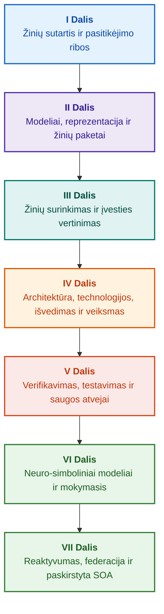

# Įrodymais grindžiamų ekspertinių sistemų architektūra: Nuo formaliųjų ontologijų iki neuro-simbolinio DI

**Inžinerinė monografija ir žinynas apie didelio patikimumo intelektualiųjų sistemų projektavimą, matematinius pagrindus, architektūrą ir verifikavimą (Safety-Critical & Evidence-Grounded AI)**

**Autorius:** [Mykola Fedchyk](about-the-author.md) · [LinkedIn](https://www.linkedin.com/in/nickfedchik/)  
**Formatas:** Inžinerinė monografija / DI architekto stalo žinynas  
**Metai:** 2026  

---

## Apie knygą

Ši monografija yra fundamentalus mokslinis tyrimas ir inžinerinis vadovas, skirtas įveikti didžiausią šiuolaikinio dirbtinio intelekto krizę: episteminį atotrūkį tarp neuroninių tinklų generavimo tikimybinio patikimumo ir formalių matematinių įrodymų deterministinės tiesos. Šio tyrimo centre slypi bekompromisis klausimas: **kaip suprojektuoti ekspertinę sistemą, kurios kiekviena išvada būtų nepaneigiama, visiškai atsekama iki pirminių įrodymų šaltinių ir tinkama sertifikuoti saugai kritinėse inžinerijos srityse (ISO 26262, IEC 61508, DO-178C, ISO/SAE 21434)?**

Autorius pagrindžia ir pristato naują paradigmą: **Įrodymais grindžiamą neuro-simbolinį DI (Evidence-Grounded Neuro-Symbolic AI)**, kuriame statistiniai modeliai (LLM/SLM) atlieka patariamąją hipotezių kūrimo ir projekcijų atvaizdavimo funkciją, o deterministinis simbolinis branduolys nekintamai garantuoja loginio nuoseklumo, faktų įtvirtinimo baitų lygmeniu, įgaliojimų ribų vykdymo ir saugaus perėjimo prie veiksmų invariantus.

### Nuo artefakto iki patikrinamo sprendimo

Sistemos reikalavimai, pirminis kodas, testų vykdymo žurnalai, reguliavimo standartai ir inžineriniai sprendimai šiandien persmelkia šiuolaikinę gamybos aplinką. Tačiau jie daugiausia veikia kaip atskiri artefaktai, neturintys formalizuotos semantikos, aiškių galiojimo ribų ir dvikryptio atsekamumo. Teigiama kvalifikacinio testo ataskaita gali nurodyti pasenusią aparatinės įrangos versiją; funkcinės saugos standarto citata gali būti ištraukta iš konteksto; automatinis avarinis konfigūracijos atšaukimas gali netyčia aktyvuoti atšauktą komponentą.

Ši monografija sukuria nuoseklią inžinerinę grandinę: nuo inžinerinių artefaktų formalizavimo kaip tipizuotų duomenų ir kriptografiškai pasirašytų žinių paketų iki simbolinio išvedimo, laipsniško planų skaidymo, kontrafaktinių paaiškinimų ir kompetencijos ribų audito. Praktinis dėstymas grindžiamas gamybai paruoštais Go kalbos moduliais su išsamiais testų rinkiniais ([1 Skyrius](ch01-introduction-to-expert-systems.md)), griežtomis matematinėmis sutartimis ([II Dalis](part-02-knowledge-models.md)) ir nuolatinio mokymosi protokolais, kurie įrodomai eliminuoja regresijas ([25 Skyrius](ch25-how-expert-systems-learn.md)).

### Tikslinė auditorija

Knyga skirta sistemų architektams, vyriausiesiems patikimumo ir funkcinės saugos inžinieriams, išvedimo variklių kūrėjams ir žinių inžinieriams. Norint įsisavinti pagrindines sąvokas, pakanka tik pirmojo laipsnio predikatų logikos, programinės įrangos versijavimo ir gyvavimo ciklo valdymo pagrindų; praktinių pavyzdžių atkartojimui reikalingi standartiniai Go įrankiai. Specializuoti skyriai, apimantys Goal Structuring Notation (GSN) sintezę, sudėtingų sistemų sinergetiką, neuromorfinius greitintuvus ir autonominę navigaciją be GNSS, nagrinėja pažangiausias įrodymais valdomo DI ribas aviacijoje, autonominiame transporte ir kritinėje infrastruktūroje.

---

## Mokslinis kontekstas ir pasaulinė monografijos vieta

Monografijoje ekspertinės sistemos vertinamos ne kaip archajiškas 1980-ųjų taisyklių sistemų (tokių kaip CLIPS ar MYCIN) palikimas, o kaip **Trečiosios bangos įrodymais grindžiamo neuro-simbolinio DI (Third-Wave Evidence-Grounded Neuro-Symbolic AI)** avangardas. Metodologija sujungia pirmaujančių pasaulio mokslo mokyklų teorinius pagrindus su didelio našumo sistemų inžinerija:

| Mokslo disciplina | Pagrindiniai pasauliniai darbai ir autoriai | Koncepcinis tiltas šioje monografijoje |
|---|---|---|
| **Trečiosios bangos neuro-simbolinis DI (NeSy)** | Artur d'Avila Garcez, Luis C. Lamb (*Neurosymbolic AI: The 3rd Wave*, 2023; *Neural-Symbolic Cognitive Reasoning*, Springer, 2009); Henry Kautz (*The Third AI Summer*, AAAI 2022) | Atsakomybių atskyrimas: statistiniai modeliai (SLM/LLM) kuria užklausų hipotezes, o deterministinis simbolinis branduolys formaliai patikrina ir priima faktus ([29 Skyrius](ch29-neuro-symbolic-architecture.md)). |
| **Semantiniai apribojimai ir saugus mokymasis** | Guy Van den Broeck et al. (*A Semantic Loss Function for Deep Learning with Symbolic Knowledge*, ICML 2018); Luc De Raedt et al. (*DeepProbLog*, IJCAI 2020) | Priėmimo ir išėjimo šliuzai, deterministinis semantinis neuroninių tinklų kandidatų teiginių filtravimas pagal formalias schemas ([28 Skyrius](ch28-dual-mode-expert-systems.md), [33 Skyrius](ch33-inter-system-knowledge-exchange-and-model-teaching.md)). |
| **Paneigiamas samprotavimas ir argumentacijos teorija** | John L. Pollock (*Defeasible Reasoning*, 1987; *Cognitive Carpentry*, MIT Press, 1995); Phan Minh Dung (*Abstract Argumentation Frameworks*, AIJ 1995); Douglas Walton (*Argumentation Schemes*, Cambridge, 2008) | Žinių skaidymas į teiginius, kilmę ir paneigėjus (*defeaters*: *rebutting* ir *undercutting*); konfliktų sprendimas normatyvinėse taisyklių bazėse naudojant Dungo argumentacijos struktūras ([2 Skyrius](ch02-epistemology-of-machine-knowledge.md), [27 Skyrius](ch27-safety-case-gsn-synthesis.md)). |
| **Automatizuota asociatyviųjų taisyklių gavyba (KBC)** | Luis Galárraga, Fabian M. Suchanek et al. (*AMIE: Association Rule Mining under Incomplete Evidence*, WWW 2013, VLDBJ 2015); Stephen Muggleton (*Inductive Logic Programming*, 1994) | Autonominė taisyklių indukcija iš žinių bazių pagal dalinio išsamumo prielaidą (PCA), išvengiant klaidingų atvirojo pasaulio priešpriešinių pavyzdžių ([34 Skyrius](ch34-deterministic-relational-analysis-abduction-and-socratic-dialogue.md)). |
| **Formalūs saugos skydai ir sertifikavimas (Safe AI)** | Bettina Könighofer, Roderick Bloem et al. (*Shield Synthesis*, 2017); Tim Kelly, Rob Weaver (*Goal Structuring Notation*, York, 2004); André Platzer (*Logical Foundations of CPS*, Springer, 2018) | Struktūrizuotų saugos argumentų sintezė GSN notacijoje ISO 26262/21434 standartams; formalūs skydai ir skaitiniai galiojimo vokai kraštiniams vykdymo įrenginiams ([27 Skyrius](ch27-safety-case-gsn-synthesis.md), [30 Skyrius](ch30-safety-cybersecurity-co-engineering.md), [33 Skyrius](ch33-inter-system-knowledge-exchange-and-model-teaching.md)). |
| **Episteminė logika ir žinių semiotika** | John F. Sowa (*Knowledge Representation: Logical, Philosophical, and Computational Foundations*, 2000); Frank van Harmelen et al. (*Handbook of Knowledge Representation*, Elsevier, 2008) | Charleso Sanderso Peirce'o episteminė triada (Sąvoka → Sprendimas → Samprotavimas); darbo hipotezių abdukcinis generavimas esant griežtai dedukcinei kontrolei ([6 Skyrius](ch06-applied-mathematics-for-expert-systems.md), [34 Skyrius](ch34-deterministic-relational-analysis-abduction-and-socratic-dialogue.md)). |
| **Sudėtingų sistemų kibernetika ir sinergetika** | Norbert Wiener (*Cybernetics*, 1948); W. Ross Ashby (*An Introduction to Cybernetics*, 1956); Hermann Haken (*Synergetics: An Introduction*, 1977; *Advanced Synergetics*, 1983); Ilya Prigogine (*Order out of Chaos*, 1984) | Ashby būdingos įvairovės dėsnis, uždari L0–L4 valdymo ciklai, fazinės erdvės redukavimas į tvarkos parametrus per Hakeno pavaldumo principą, ankstyvas fazinių virsmų perspėjimas per kritinį lėtėjimą (CSD) ir besivystančių žinių bazių disipacinis stabilizavimas ([6 Skyrius](ch06-applied-mathematics-for-expert-systems.md), [22 Skyrius](ch22-cybernetics-edge-to-backend.md), [35 Skyrius](ch35-self-organizing-expert-systems-synergetics-and-npu-runtime.md)). |
| **Žinių testavimas, invariantumas ir Lipšico kalibracija** | Kent Beck (*TDD*, 2002); Martin Fowler (*Refactoring*, 2018); Clark Barrett, Leonardo de Moura (*Z3 SMT Solver*, 2008); Chuan Guo et al. (*On Calibration of Modern Neural Networks*, ICML 2017); Marco Tulio Ribeiro et al. (*CheckList*, ACL 2020); John L. Pollock (*Defeasible Reasoning*, 1987) | Keturių lygių žinių testavimo piramidė (KTP): izoliuotas atominių taisyklių vienetų testavimas (KUT) su simuliuotomis prielaidomis (`PremiseMock`), vakuuminės tiesos spąstų pašalinimas, 6 taškų spektrinė ribinių verčių analizė (BVA), taisyklių gardelės ir paneigėjai (KIT), semantinio invariantumo balas ($\text{SIS} \ge 0.98$) esant lingvistinėms užklausų mutacijoms, Lipšico tolydumo ribos ($L_{\mathcal{K}} \le L_{\max}$), užkertančios kelią relės drebėjimui, ir stigmerginis žinių spragų fiksavimas ([36 Skyrius](ch36-knowledge-testing-pyramid-and-variational-calibration.md)). |

---

## Autoriaus teoriniai modeliai, moksliniai tyrimai ir inžinerinės inovacijos

Šioje monografijoje apibendrinami autoriaus fundamentiniai tyrimai ir sistemų inžinerijos indėlis saugai kritinės programinės įrangos, įterptųjų architektūrų ir įrodymais grindžiamo DI srityse. Skirtingai nuo grynai apžvalginio pobūdžio literatūros, knygoje pristatomas originalių formalių teorijų, protokolų ir architektūrinių modelių rinkinys, kuris neuro-simbolinę sąveiką pakelia į matematiškai patikrintą pasitikėjimo lygį:

### 1. Pagrindiniai teoriniai modeliai ir matematiniai formalizmai

1. **Įrodymais pagrįstas invariantas (EGI) ir faktų tvirtinimo šliuzas ([2 Skyrius](ch02-epistemology-of-machine-knowledge.md), [19 Skyrius](ch19-from-question-to-evidence.md), [28 Skyrius](ch28-dual-mode-expert-systems.md), [29 Skyrius](ch29-neuro-symbolic-architecture.md)):**
   * *Teorinė formuluotė:* Autorius formalizuoja Įtvirtinimo išsamumo invariantą $\mathrm{Comp}(C) = 1.00$, nustatydamas, kad įrodymais valdomoje architektūroje joks teiginys negali būti pakeltas į pripažinto fakto statusą be deterministinės projekcijos į autoritetingus pirminius šaltinius. Kiekvienas priimtas faktų rinkinys yra įtvirtintas nekintamais baitų poslinkiais `[byte_start, byte_end]`, kanonine kriptografine fragmento santrauka `quote_sha256` ir PROV-O kilmės sertifikato identifikatoriumi.
   * *Inžinerinis poveikis:* Aparatūrinis ir programinis priėmimo šliuzas baitų lygmeniu užkerta kelią neuroninių tinklų haliucinacijoms patekti į versijuotą žinių bazę, garantuodamas nulinę toleranciją nepagrįstiems teiginiams ($ZHR = 1.00$).
2. **Keturių lygių žinių testavimo piramidė (KTP) ir logikos erdvės Lipšico tolydumas ([36 Skyrius](ch36-knowledge-testing-pyramid-and-variational-calibration.md)):**
   * *Teorinė formuluotė:* Autorius pristato Žinių testavimo piramidę (KTP), perkeldamas Fowlerio programinės įrangos testavimo piramidės discipliną į žinių sistemas: izoliuotas taisyklių vienetų testavimas (KUT) naudojant simuliuotas prielaidų sąlygas (`PremiseMock`), taisyklių sąveikos ir paneigėjų integravimo testavimas (KIT) bei variacinis kalibravimas užklausų erdvėse (KVT).
   * *Matematinis aparatas:* Vakuuminę tiesą užkertančio invarianto formalizavimas ($P \to Q$, kur $P \equiv \text{False}$), Semantinio invariantumo balas ($\mathrm{SIS} \ge 0.98$) esant lingvistinėms perturbacijoms ir Lipšico tolydumo apribojimas išvedimo erdvėje ($L_{\mathcal{K}} \le L_{\max}$), kuris matematiškai pašalina katastrofišką relės drebėjimą esant mažiems įvesties pokyčiams.
3. **Deontinių normų poperiškasis falsifikavimas ir aktyvus atitikties auditas ([39 Skyrius](ch39-active-compliance-auditor-and-popperian-testing.md)):**
   * *Teorinė formuluotė:* Paradigmos perėjimas nuo pasyvaus orakulo (kuris tik atsako į užklausas) prie aktyvaus atitikties auditoriaus, įgyvendinančio Karlo Popperio falsifikuojamumo principą. Sistema autonomiškai tiria specifikacijų erdvę (ASPICE 4.0, ISO 26262, ISO/SAE 21434), sintezuoja priešpriešinius pavyzdžius, nustato nepakankamai apibrėžtas ribines sąlygas ir kuria išsamias verifikavimo kampanijas.
   * *Praktinė vertė:* Neuroninio ribinių atvejų generavimo (1 Sistema) sujungimas su deterministiniu deontiniu patikrinimu per simbolinį branduolį (2 Sistema), apsaugant žmogų valdymo cikle (Human-in-the-Loop) nuo pritarimo nuovargio.
4. **Žinių bazių sinergetinis matmenų mažinimas ir CSD diagnostika prieš bifurkaciją ([6 Skyrius](ch06-applied-mathematics-for-expert-systems.md), [22 Skyrius](ch22-cybernetics-edge-to-backend.md), [35 Skyrius](ch35-self-organizing-expert-systems-synergetics-and-npu-runtime.md)):**
   * *Teorinė formuluotė:* Hermanno Hakeno sinergetikos (tvarkos parametrų ir pavaldumo principo) bei Ilya Prigogine'o disipacinių struktūrų taikymas sudėtingų žinių saugyklų evoliucijai.
   * *Mokslinis indėlis:* Daugiamatės telemetrijos fazinės erdvės redukuojamos į tvarkos parametrus, integruojant priešbifurkacinį kritinio lėtėjimo (CSD) detektorių, pagrįstą autokoreliacijos ir dispersijos metrikais. Tai leidžia aptikti artėjantį kibernetinį-fizinį nestabilumą gerokai anksčiau, nei suveikia įprastiniai slenksčių monitoriai.
5. **Veiksmų autonomijos lygių modelis (A0–A4), priėmimo šliuzai ir idempotentės sagos ([21 Skyrius](ch21-from-recommendation-to-action.md)):**
   * *Teorinė formuluotė:* Granuliuota įgaliojimų sistema automatizuotam vykdymui (A0: pasyvi analizė, A1: projekto rengimas, A2: žmogaus pasirašytas vykdymas, A3: prižiūrima ribota autonomija, A4: avarinis išjungimas fail-closed). Leidimai siejami ne su sistema kaip monolitu, o su trejetu $\langle\text{veiksmas}, \text{aplinka}, \text{rizikos lygis}\rangle$.
   * *Matematinis aparatas:* Algebrinis idempotentiškumo invariantas $f(f(x, k), k) \equiv f(x, k)$ su kriptografiniu žetonu $k$, laipsniškas uždaro ciklo vykdymas ir paskirstytas kompensacinių sagų protokolas, sprendžiantis `OutcomeUnknown` būsenas per papildomą sąlygų patikrinimą ne kanale.
6. **Formali funkcinės saugos ir kibernetinio saugumo bendroji inžinerija GSN ([27 Skyrius](ch27-safety-case-gsn-synthesis.md), [30 Skyrius](ch30-safety-cybersecurity-co-engineering.md)):**
   * *Teorinė formuluotė:* Vieninga Goal Structuring Notation (GSN) sintezės metodika, suderinanti vienu metu galiojančius ISO 26262 (sauga) ir ISO/SAE 21434 (kibernetinis saugumas) apribojimus.
   * *Inžinerinis lūžis:* Matematinis arbitražas tarp prieštaringų tikslų (avarinio atsako delsos ribos prieš kriptografinio atestavimo gylį), suderintas su selektyvaus įrodymų atskleidimo išorės auditoriams protokolu per pasūdytus Merkle medžius.
7. **Paaiškinimų tikslumo ir semantinio nuoseklumo verifikavimo protokolas ([20 Skyrius](ch20-explanation-engine.md)):**
   * *Teorinė formuluotė:* Paaiškinimai vertinami ne kaip laisvai generuojamas tekstas, o kaip aukščiausios klasės deterministiniai artefaktai, gaunami griežtai iš įrodymų grafo, taisyklių versijų žymų ir užfiksuotų faktų momentinių kadrų.
   * *Matematinis aparatas:* Formalus paaiškinimo tikslumo metrinis patikrinimas ($C_{\text{facts}} = 1.00, H_{\text{free}} = 1.00$), paremtas automatiniu saugiu grįžimu prie standžių šablonų esant menkiausiam neatitikimui tarp simbolinio išvedimo ir operatoriui skirto natūralios kalbos teksto.

---

### 2. Empiriniai tyrimai, autoriaus eksperimentiniai stendai ir sistemų inžinerija

1. **Nekintami binariniai žinių paketai su `mmap` ir nulinės alokacijos deserializavimu ([32 Skyrius](ch32-high-performance-knowledge-packs-mmap-and-harvesting.md)):**
   * *Autoriaus inovacija:* Dviejų lygių paketų architektūra, atskirianti kanoninius pirminių šaltinių archyvus nuo išvestinių materializuotų indeksų segmentų.
   * *Empirinis rezultatas:* Tiesioginis atminties atvaizdavimas per `mmap` virtualioje adresų erdvėje panaikina dinaminės atminties paskirstymą vykdymo metu (zero-allocation) ir pasiekia subtiesinį variklio paleidimo delsą, nepriklausomai nuo daugiagigabaitės ontologijų apimties.
2. **Empirinis kalibravimo stendas su IETF RFC-1000 ir W3C-150 reguliavimo korpusais ([2 Skyrius](ch02-epistemology-of-machine-knowledge.md), [4 Skyrius](ch04-evolution-from-bayes-to-evidence-ai.md), [14 Skyrius](ch14-requirements-detection-and-formalization.md), [25 Skyrius](ch25-how-expert-systems-learn.md)):**
   * *Autoriaus stendas:* Plataus masto vertinimo sistemos diegimas 1000 aktyvių IETF RFC specifikacijų (apimančių 5 chronologines interneto epochas) ir 150 sudėtingų diagnostinių užklausų W3C korpuse (įskaitant sukeltus loginius konfliktus ir konfabuliacijas).
   * *Praktinė išvada:* Objektyvių žinių patikrinimo matricų kūrimas, normatyvinių prieštaravimų empirinis nustatymas ir matematiškai patvirtinta apsauga nuo žinių bazės regresijų nuolatinių atnaujinimų metu.
3. **Daugiapakopė santykių analizė, simbolinė abdukcija ir sokratiškasis dialogas ([34 Skyrius](ch34-deterministic-relational-analysis-abduction-and-socratic-dialogue.md)):**
   * *Autoriaus inovacija:* Dvikryptis ribotos paieškos plotyn algoritmas (Bounded BFS, $k \le 6$) su ciklų slopinimu ir sudėtinės įrodymų grandinės sinteze baitų lygmeniu tarp tarpusavyje susijusių esybių.
   * *Inžinerinis pranašumas:* Peirce'o simbolinės abdukcijos realizavimas esant griežtoms dedukcinėms riboms kartu su tipizuotais sokratiškojo patikslinimo rėmais (Clarification Frames), kurie veda sistemą į produktyvų dialogą su vartotoju, užuot aklai atmetę pagal Uždaro pasaulio prielaidą (CWA).
4. **Formalūs saugos skydai ir skaitiniai galiojimo vokai kraštiniam valdymui ([33 Skyrius](ch33-inter-system-knowledge-exchange-and-model-teaching.md), [Priedai B](appendix-b-robotics-and-cyber-physical-systems.md), [C](appendix-c-autonomous-navigation-and-geosearch.md), [E](appendix-e-mixed-signal-neuromorphic-expert-systems.md)):**
   * *Autoriaus inovacija:* Diskrečių loginių invariantų vertimo į tolydžius skaitinius saugos koridorius metodika skaitmeniniams signalų procesoriams (DSP) ir navigacijai be GNSS (TRN/DSMAC/VIO).
   * *Veiklos patikimumas:* Kriptografiškai pasirašytas taisyklių keitimasis per Ed25519, izoliuotas kandidatinių taisyklių karantinas ir aparatūrinis negaliojančių vykdomųjų trajektorijų perėmimas.
5. **Apsauga nuo konfidencialios informacijos nutekėjimo per paaiškinimus ir diferencialinis auditas ([20 Skyrius](ch20-explanation-engine.md)):**
   * *Autoriaus inovacija:* Tarpinio paaiškinimų atvaizdavimo redukavimo protokolas ($\mathrm{EIR}_{\text{redacted}}$), įgyvendinantis prieigos kontrolės sąrašus (ACL) kiekviename įrodymų grafo mazge ir briaunoje, neutralizuojantis šoninių kanalų atakas modelio rekonstrukcijai per kontrastines užklausas KODĖL NE (WHY NOT).

---

## Struktūrizavimo principas

Šios monografijos dalys yra struktūrizuotos pagal pirminius inžinerinius tikslus, o ne pagal chronologines publikavimo datas ar laikinus technologijų pavadinimus. Kiekvienas skyrius priklauso vienai pagrindinei daliai; susijusios technikos iliustruoja metodus jos centrinei tezei spręsti. Skyrių numeriai ir failų identifikatoriai lieka pastoviais raktais, leidžiančiais teminėms skaitymo sekoms skirtis nuo skaitinės tvarkos.

Skyrių vidinės poskyrių klasės kuria logiškai pagrįstą argumentaciją, o ne paprastą lygiaverčių technologijų katalogą:

| Poskyrio klasė | Skaitytojo klausimas | Architektūrinė funkcija skyriuje |
|---|---|---|
| Problema ir ribos | Koks konkretus iššūkis turi būti išspręstas? | Apibrėžia tyrimo esmę ir galiojimo sritį |
| Objektas ir modelis | Kokie duomenys, žinios ar būsenos vertinami? | Formalizuoja sąvokas, tipus ir veiklos prielaidas |
| Metodas ir procedūra | Kaip išvedamas sprendimas? | Išsamiai aprašo dedukcijos, transformacijos ir valdymo algoritmus |
| Įgyvendinimas ir įrankiai | Kokia programinė ar aparatinė įranga atlieka procedūrą? | Pateikia konkrečius kodo sąrašus ir architektūrines sutartis |
| Verifikavimas ir etalonas | Kaip sistemiškai atskleidžiami gedimų režimai? | Matuoja našumą ir teisingumą pagal nepriklausomus kriterijus |
| Išvada ir apribojimai | Kas įrodyta ir kas lieka atvira? | Atsako į pagrindinę tezę be nepagrįstų teiginių |

Geografija, konkretūs pramonės sektoriai ir komercinės platformos tarnauja kaip taikymo kontekstai, o ne kaip atskiri lygmenys šioje taksonomijoje. Žodynėliai, santrumpos, bibliografijos ir rodyklių navigacija sudaro žinyno aparatą, o ne savarankiškas skyrių temas.

Išsami [redakcinė struktūros apžvalga](editorial-structure-review.md) pateikia kiekvieno skyriaus pagrindinės temos, gretimų temų ribų ir kompozicinių pastabų įvertinimą. Santraukos atnaujinimas nereiškia, kad visos vidinės kompozicinės rizikos skyriuose yra išspręstos.

## Skaitymo maršrutai

**Pirmasis programinės įrangos patikrinimas:** [1](ch01-introduction-to-expert-systems.md) → [7](ch07-knowledge-base-typology.md) → [8](ch08-engineering-artifacts-as-data.md) → [17](ch17-implementation-stack.md) → [23](ch23-knowledge-base-verification.md) → [25](ch25-how-expert-systems-learn.md). Tikslas: Gauti atkuriamą, įrodymais pagrįstą verdiktą su neigiamais testais ir kontroliuojama žinių mutacija. Kalbos modelis yra neprivalomas.

**Žinių inžinerija:** [II Dalis](part-02-knowledge-models.md) → [III Dalis](part-03-knowledge-engineering-nlp.md) → [19](ch19-from-question-to-evidence.md) → [20](ch20-explanation-engine.md) → [26](ch26-continual-learning.md). Tikslas: Suderinti formaliąją semantiką, kilmę, kandidatų nustatymą ir patvirtinimą. II Dalis išlaiko tarpsektorinę empirinių tyrimų programą 7–11 skyriams.

**Sprendimų architektūra:** [16](ch16-expert-systems-architecture.md) → [19](ch19-from-question-to-evidence.md) → [31](ch31-syllogistic-reasoning-and-relation-lattices.md) → [20](ch20-explanation-engine.md) → [21](ch21-from-recommendation-to-action.md). Tikslas: Atsieti įrodymų tikrinimą, normatyvinių taisyklių taikymą, paaiškinimų generavimą ir operatyvinius veiksmų įgaliojimus.

**Verifikavimas ir sauga:** [23](ch23-knowledge-base-verification.md) → [36](ch36-knowledge-testing-pyramid-and-variational-calibration.md) → [25](ch25-how-expert-systems-learn.md) → [26](ch26-continual-learning.md) → [27](ch27-safety-case-gsn-synthesis.md) → [30](ch30-safety-cybersecurity-co-engineering.md). Išorinė fizinė diagnostika nagrinėjama [24 Skyriuje](ch24-system-diagnosis.md).

**Hibridiniai atsakai ir operatyvinis diegimas:** [VI Dalis](part-06-frontiers-neuro-symbolic.md) → [VII Dalis](part-07-runtime-and-knowledge-exchange.md) → [40](ch40-distributed-epistemic-architectures-soa-and-cluster-scaling.md) ir atitinkami priedai. Tikslas: Integruoti neuroninius kalbos modelius, valdyti episteminius atotrūkius, kurti paskirstytus žinių paslaugų telkinius ir patikrinti tarpusavio federacijas. Skyriai [2](ch02-epistemology-of-machine-knowledge.md), [4](ch04-evolution-from-bayes-to-evidence-ai.md) ir [6](ch06-applied-mathematics-for-expert-systems.md) pagal poreikį gali būti naudojami kaip sutartys, istorinė raida ir matematiniai pagrindai.

---

## Teiginių apimtis ir inžinerinės ribos

Ši monografija yra pagrindinė mokomoji ir tiriamoji medžiaga; tai nėra sertifikuota atitikties procedūra ar atskiras įrangos atitikties standartams įrodymas. Deterministinis vykdymas negarantuoja faktinio prielaidų teisingumo; santraukos ir skaitmeniniai parašai įrodo vientisumą, o ne empirinę tiesą; argumentų grafai nepakeičia sertifikuoto žmogaus vertinimo. Sistemos lygio patikimumo reikalavimai negali būti prilyginti kalbos modelio žetonų klaidų dažniui ar visuotinai taikomi visiems programinės įrangos moduliams.

Automatizuotas analizavimas ir išskyrimas sumažina rankinį duomenų perkėlimą, tačiau nepanaikina formalaus modeliavimo, tarpusavio peržiūros (peer review) ir paskirtų žinių saugotojų (knowledge custodians) būtinybės. Protégé ontologijos, rankiniai auditai ir automatizuoti rinktuvai veikia kartu. Matematines garantijas riboja aiškūs formaliųjų kalbų profiliai ir veiklos prielaidos; išmatuoti pralaidumo rodikliai atspindi konkrečias užklausų apkrovas, korpusus ir vykdymo aplinkas. Istoriniai autoriaus ankstesnių gamybinių diegimų rodikliai yra griežtai atskirti nuo atvirų švietimo stendų ir aktyvių mokslinių tyrimų.

Galutiniai sprendimai dėl išleidimo į gamybą, rizikos prisiėmimo ir reglamentavimo atitikties priklauso tik įgaliotiems inžinieriams. Įrodymais valdoma ekspertinė sistema parengia patikrinamus audito pėdsakus ir užtikrina suderintų saugos taisyklių vykdymą; ji neperima reguliavimo suvereniteto.

---

## Knygos struktūra

Monografija suskirstyta į septynias temines dalis, kurias sudaro 40 skyrių ir penki priedai. Kiekvienas skyrius priklauso vienai pagrindinei daliai. Naršymo sekos atitinka toliau pateiktą teminį planą; skyrių numeriai ir failų keliai lieka nepakitę.

---

### [I Dalis. Koncepciniai ir episteminiai pagrindai](part-01-foundations.md)

*Kada reikalinga ekspertinė sistema, kas sudaro mašinų žinias ir kaip išsaugomas organizacinis pagrindimas.*

* [1 Skyrius. Įvadas į ekspertines sistemas: Nuo chaoso prie valdomų žinių](ch01-introduction-to-expert-systems.md)
* [2 Skyrius. Filosofija sistemų inžinieriui: Ką mašinos turi teisę vadinti žiniomis](ch02-epistemology-of-machine-knowledge.md)
* [3 Skyrius. Ekspertinių sistemų atskyrimas nuo etaloninių informacinių sistemų](ch03-beyond-reference-information-systems.md)
* [4 Skyrius. Ekspertinių sistemų evoliucija: Nuo Bayeso teoremos iki įrodymais grindžiamo DI](ch04-evolution-from-bayes-to-evidence-ai.md)
* [5 Skyrius. Pasitikėjimo triada: Ekspertinė sistema, patikrinama rekomendacija ir įmonės atmintis](ch05-triad-of-trust-and-corporate-memory.md)

---

### [II Dalis. Matematiniai modeliai, žinių reprezentacija ir saugojimas](part-02-knowledge-models.md)

*Matematinių formalismų parinkimas, tipizuoti artefaktai, inžinerinio atsekamumo grafai ir nekintami žinių paketai.*

* [6 Skyrius. Taikomoji matematika ekspertinėms sistemoms: Taisyklės, tikimybės, grafai ir priežastingumas](ch06-applied-mathematics-for-expert-systems.md)
* [7 Skyrius. Žinių bazių tipologija: Taisyklės, ontologijos, atvejai ir vektoriniai įterpiniai](ch07-knowledge-base-typology.md)
* [8 Skyrius. Inžineriniai artefaktai kaip ekspertinės sistemos duomenys](ch08-engineering-artifacts-as-data.md)
* [9 Skyrius. Inžinerinis žinių grafas: Visiškas atsekamumas nuo reikalavimų iki silicio](ch09-engineering-knowledge-graph-traceability.md)
* [32 Skyrius. Nekintami žinių paketai: Baitų lygmens priėmimas, indeksai ir atminties atvaizdavimas](ch32-high-performance-knowledge-packs-mmap-and-harvesting.md)

---

### [III Dalis. Žinių gavyba, lingvistinė analizė ir įvesties vertinimas](part-03-knowledge-engineering-nlp.md)

*Dokumentai, žmogiškoji patirtis ir jutiminiai stebėjimai: kandidatų išskyrimas, lingvistinė analizė, formalizavimas ir įrodymų vertinimas.*

* [10 Skyrius. Žinių įgijimo sistemos: Šaltiniai, priėmimo šliuzai ir gyvavimo ciklai](ch10-knowledge-acquisition-systems.md)
* [11 Skyrius. Žinių gavimas iš srities ekspertų: Interviu, kognityviniai žemėlapiai ir praktikos formalizavimas](ch11-knowledge-elicitation-from-experts.md)
* [12 Skyrius. Lingvistinė analizė ir vietiniai modeliai: Semantikos ir šaltinių priskyrimo išsaugojimas](ch12-linguistic-analysis-and-local-models.md)
* [13 Skyrius. Natūralios kalbos kintamumas vs. determinizmas: Užklausų semantikos kompiliavimas](ch13-language-variability-vs-determinism.md)
* [14 Skyrius. Reikalavimų ir modalumų išskyrimas: Nuo normatyvinio teksto iki formaliųjų invariantų](ch14-requirements-detection-and-formalization.md)
* [15 Skyrius. Žinių gavyba ir žinių bazės kūrimas: Faktai, gramatikos ir automatai](ch15-knowledge-extraction-and-kb-construction.md)
* [37 Skyrius. Įvesties informacijos vertinimas: Šaltiniai, įrodymai ir algoritminis skepticizmas](ch37-input-information-assessment-and-algorithmic-skepticism.md)

---

### [IV Dalis. Architektūra, technologijų rinkinys, išvedimas ir veiksmas](part-04-architecture-and-inference.md)

*Architektūrinės sutartys, vykdymo rinkinys, aparatinis greitinimas, teiginių tikrinimas, normatyvinis išvedimas, paaiškinimų varikliai ir kibernetiniai valdymo ciklai.*

* [16 Skyrius. Ekspertinių sistemų architektūra: Nuo formalizuotų žinių iki įrodymais valdomo veiksmo](ch16-expert-systems-architecture.md)
* [17 Skyrius. Technologijų rinkinys: Įrankių pasirinkimas, programavimo kalbos ir taisyklių varikliai](ch17-implementation-stack.md)
* [18 Skyrius. Vykdymo infrastruktūra: Vietiniai SLM, aparatiniai greitintuvai, edge ir on-premise](ch18-execution-infrastructure.md)
* [19 Skyrius. Nuo klausimo iki įrodymo: Paieška, įtvirtinimas ir teiginių tikrinimas](ch19-from-question-to-evidence.md)
* [31 Skyrius. Normatyvinis išvedimas: Predikatų hierarchijos, išimtys ir laiko galiojimas](ch31-syllogistic-reasoning-and-relation-lattices.md)
* [20 Skyrius. Paaiškinimų variklis: Sprendimai, pagrįstas atsisakymas ir kompetencijos ribos](ch20-explanation-engine.md)
* [21 Skyrius. Nuo rekomendacijos iki veiksmo: Įgaliojimų kontrolė ir saugus vykdymas gamyboje](ch21-from-recommendation-to-action.md)
* [22 Skyrius. Kibernetinis valdymo ciklas: Jutikliai, vykdomieji mechanizmai ir grįžtamasis ryšys](ch22-cybernetics-edge-to-backend.md)

---

### [V Dalis. Verifikavimas, testavimas, diagnostika ir saugos atvejai](part-05-verification-and-learning.md)

*Formalus taisyklių verifikavimas, žinių testavimo piramidės, poperiškasis falsifikavimas, techninė diagnostika ir funkcinės/kibernetinės saugos atvejai.*

* [23 Skyrius. Žinių bazės verifikavimas: Nuoseklumas, išsamumas ir taisyklių teisingumas](ch23-knowledge-base-verification.md)
* [36 Skyrius. Žinių testavimo piramidė: Taisyklės, sąveikos ir variacinis stabilumas](ch36-knowledge-testing-pyramid-and-variational-calibration.md)
* [39 Skyrius. Aktyvus atitikties auditorius: Poperiškasis falsifikavimas, standartų atitiktis (ASPICE/ISO 26262/ISO 21434) ir autonominis testų generavimas](ch39-active-compliance-auditor-and-popperian-testing.md)
* [24 Skyrius. Techninė diagnostika: Simptomų atskyrimas nuo pagrindinių priežasčių esant neišsamiai informacijai](ch24-system-diagnosis.md)
* [27 Skyrius. Saugos atvejų inžinerija: GSN argumentų formali sintezė ir verifikavimas](ch27-safety-case-gsn-synthesis.md)
* [30 Skyrius. Funkcinės saugos ir kibernetinio saugumo bendroji inžinerija](ch30-safety-cybersecurity-co-engineering.md)

---

### [VI Dalis. Neuro-simboliniai modeliai, kognityvinės ribos ir nuolatinis mokymasis](part-06-frontiers-neuro-symbolic.md)

*Griežta dedukcija vs. patariamosios hipotezės, kalbos modelių integracija, žinių spragos, haliucinacijų šalinimas, egzaminų matricos ir mokymasis iš patirties.*

* [28 Skyrius. Dviejų režimų ekspertinės sistemos: Griežta dedukcija ir patariamosios hipotezės](ch28-dual-mode-expert-systems.md)
* [29 Skyrius. Neuro-simbolinė architektūra: Kalbos modeliai ir įrodymais valdomas verifikavimas](ch29-neuro-symbolic-architecture.md)
* [34 Skyrius. Žinių spragos: Santykių paieška, abdukcija ir sokratiškasis paaiškinimas](ch34-deterministic-relational-analysis-abduction-and-socratic-dialogue.md)
* [38 Skyrius. Mašinos haliucinacijų ir žinių trūkumo gydymas: Įrodymais pagrįsta išvesties kontrolė](ch38-curing-machine-hallucinations-and-knowledge-deficits.md)
* [25 Skyrius. Kaip mokosi ekspertinės sistemos: Egzaminų matricos, žinių auditai ir regresijos kontrolė](ch25-how-expert-systems-learn.md)
* [26 Skyrius. Nuolatinis mokymasis iš patirties ir sistemos žurnalų poslinkio mažinimas](ch26-continual-learning.md)

---

### [VII Dalis. Reaktyvi vykdymo aplinka, tarpusavio žinių mainai ir paskirstyta SOA](part-07-runtime-and-knowledge-exchange.md)

*Reaktyvus taisyklių vykdymas, sinergetika ir žinių faziniai virsmai, tarpusavio federacija ir paskirstytos įmonės episteminės architektūros.*

* [35 Skyrius. Reaktyviosios ekspertinės sistemos: Įvykiai, taisyklių atšaukimas ir žinių saviorganizacija](ch35-self-organizing-expert-systems-synergetics-and-npu-runtime.md)
* [33 Skyrius. Tarpusavio žinių mainai: Taisyklių teikimas, modelių mokymas ir saugus grįžtamasis ryšys](ch33-inter-system-knowledge-exchange-and-model-teaching.md)
* [40 Skyrius. Paskirstyta episteminė architektūra: Žinių SOA, semantinis maršrutizavimas, atminties hierarchijos ir kelių šaltinių paneigiamas arbitražas](ch40-distributed-epistemic-architectures-soa-and-cluster-scaling.md)

---

### Priedai

* [Priedas A. Praktinė įrodymais valdomų tyrimų sistema sudėtingiems inžineriniams projektams](appendix-a-evidence-governed-framework.md)
* [Priedas B. Įrodymais valdomos ekspertinės sistemos autonominėje robotikoje ir kibernetinėse-fizinėse sistemose](appendix-b-robotics-and-cyber-physical-systems.md)
* [Priedas C. Autonominė navigacija be GNSS: Geoelementų atitikimas (TRN/DSMAC), vizualinė-inercinė odometrija (VIO) ir ekspertinis jutiklių suliejimo arbitražas](appendix-c-autonomous-navigation-and-geosearch.md)
* [Priedas D. Analoginės ekspertinės sistemos, neuromorfiniai skaičiavimai ir aparatinis išvedimas](appendix-d-analog-expert-systems-and-neuromorphic-computing.md)
* [Priedas E. Mišrių analoginių-skaitmeninių signalų ekspertinės sistemos: Neuromorfiniai, analoginiai ir ne von Neumanno procesoriai pagal įrodymų valdymą](appendix-e-mixed-signal-neuromorphic-expert-systems.md)
* [Apie autorių: Mykola Fedchyk (Nick Fedchik)](about-the-author.md)

---

## Tyrimų kryptys

Šiame darbe suformuluotos ateities tyrimų kryptys rodo atvirus inžinerinius iššūkius, o ne garantuotus paruoštus komercinius rezultatus: atkuriamas nulinės alokacijos žinių paketų pakavimas; apribotų formalių fragmentų verifikavimas; agentų valdymas per aiškią įgaliojimų nuomą (authority leases); konfidencialių formalių teiginių nulinio žinojimo patikrinimas (zero-knowledge); kontroliuojamas taisyklių atšaukimas ir modelių atitaisymas (machine unlearning). Teorinės savybės įrodymas modelyje automatiškai nepatvirtina fizinės sistemos saugumo, o taisyklės atšaukimas nėra tolygus duomenų įtakos pašalinimui iš apmokyto neuroninio modelio.

Aparatinės įrangos greitintuvams ir netradiciniams procesoriams prieš diegiant turi būti griežtai nustatyti empiriniai klaidų dažniai, delsos ribos, energijos išsklaidymas ir saugus gedimo elgesys (fail-silent). Atitinkamos architektūrinės strategijos nagrinėjamos [29 Skyriuje](ch29-neuro-symbolic-architecture.md), [32 Skyriuje](ch32-high-performance-knowledge-packs-mmap-and-harvesting.md) ir [Prieduose D](appendix-d-analog-expert-systems-and-neuromorphic-computing.md) bei [E](appendix-e-mixed-signal-neuromorphic-expert-systems.md). Skyrių 7–11 empirinių tyrimų darbotvarkė išsamiai aprašyta [II Dalyje](part-02-knowledge-models.md): kiekvienas siūlomas tyrimas suporuotas su patikrinama hipoteze, pradiniu etalonu ir formaliu falsifikavimo kriterijumi.
