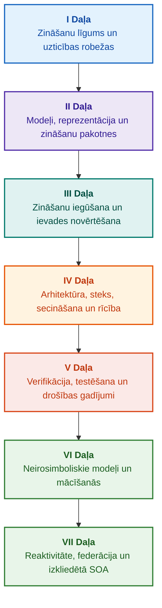

# Pierādījumos balstītu ekspertsistēmu arhitektūra: No formālajām ontoloģijām līdz neirosimboliskajam MI

**Inženierzinātņu monogrāfija un rokasgrāmata par augstas integritātes inteliģento sistēmu projektēšanu, matemātiskajiem pamatiem, arhitektūru un verifikāciju (Safety-Critical & Evidence-Grounded AI)**

**Autors:** [Mykola Fedchyk](../en/about-the-author.md) · [LinkedIn](https://www.linkedin.com/in/nickfedchik/)  
**Formāts:** Inženierzinātņu monogrāfija / MI arhitekta rokasgrāmata  
**Gads:** 2026  

---

## Par grāmatu

Šī monogrāfija ir fundamentāls pētniecības darbs un inženierijas rokasgrāmata, kas veltīta mūsdienu mākslīgā intelekta lielākās krīzes pārvarēšanai: epistemiskajai plaisai starp neironu tīklu ģenerēšanas varbūtējo ticamību un formālo matemātisko pierādījumu deterministisko patiesumu. Šī pētījuma centrā ir bezkompromisa jautājums: **kā projektēt ekspertsistēmu, kuras katrs secinājums ir neapgāžams, pilnībā izsekojams līdz primārajiem pierādījumu avotiem un piemērots sertifikācijai drošībai kritiskās inženierzinātņu jomās (ISO 26262, IEC 61508, DO-178C, ISO/SAE 21434)?**

Autors pamato un ievieš jaunu paradigmu: **Pierādījumos balstītu neirosimbolisko MI (Evidence-Grounded Neuro-Symbolic AI)**, kurā statistiskie modeļi (LLM/SLM) pilda konsultatīvu hipoēžu ģenerēšanas un projekciju vizualizācijas funkciju, kamēr deterministiskais simboliskais kodols nemainīgi garantē loģiskās konsekvences, baitu līmeņa faktu nostiprināšanas, pilnvaru robežu ievērošanas un drošas pārejas uz izpildi invariantus.

### No artefakta līdz pārbaudāmam lēmumam

Sistēmas prasības, pirmkods, testu izpildes žurnāli, regulatīvie standarti un inženiertehniskie lēmumi mūsdienās caurvij ražošanas vides. Tomēr tie galvenokārt darbojas kā atsevišķi artefakti bez formalizētas semantikas, skaidrām derīguma robežām un divvirzienu izsekojamības. Sekmīgs kvalifikācijas testa ziņojums var atsaukties uz novecojušu aparatūras revīziju; citāts no funkcionālās drošības standarta var tikt izrauts no konteksta; automatizēta ārkārtas konfigurācijas atcelšana var nejauši aktivizēt atsauktu komponentu.

Šī monogrāfija izveido visaptverošu inženiertehnisko konveijeru: no inženierijas artefaktu formalizēšanas tipizētos datos un kriptogrāfiski parakstītās zināšanu pakotnēs līdz simboliskajai secināšanai, pakāpeniskai plānu dekompozīcijai, kontrafaktuāliem skaidrojumiem un kompetences robežu auditam. Praktiskais izklāsts balstās uz ražošanas līmeņa Go valodas implementācijām ar visaptverošām testu kopām ([1. Nodaļa](../en/ch01-introduction-to-expert-systems.md)), stingriem matemātiskajiem līgumiem ([II Daļa](../en/part-02-knowledge-models.md)) un nepārtrauktās mācīšanās protokoliem, kas pierādāmi novērš regresijas ([25. Nodaļa](../en/ch25-how-expert-systems-learn.md)).

### Mērķauditorija

Grāmata ir paredzēta sistēmu arhitektiem, uzticamības un funkcionālās drošības vadošajiem inženieriem, secināšanas dzinēju izstrādātājiem un zināšanu inženieriem. Pamatjēdzienu apguvei nepieciešama tikai pirmās kārtas predikātu loģikas, programmatūras versiju vadības un dzīves cikla pārvaldības pamatu izpratne; praktisko piemēru reproducēšanai pietiek ar standarta Go rīkiem. Specializētās nodaļas, kas aptver Goal Structuring Notation (GSN) sintēzi, sarežģītu sistēmu sinerģētiku, neiromorfos paātrinātājus un autonomo navigāciju bez GNSS, pēta pierādījumos balstīta MI modernākās robežas aviācijā, autonomajos transportlīdzekļos un kritiskajā infrastruktūrā.

---

## Zinātniskais konteksts un monogrāfijas globālā vieta

Monogrāfija neuztver ekspertsistēmas kā arhaisku 1980. gadu likumos balstīto sistēmu (piemēram, CLIPS vai MYCIN) mantojumu, bet gan kā **Trešā viļņa pierādījumos balstītā neirosimboliskā MI (Third-Wave Evidence-Grounded Neuro-Symbolic AI)** avangardu. Metodoloģija apvieno vadošo pasaules zinātnisko skolu teorētiskos pamatus ar augstas veiktspējas sistēmu inženieriju:

| Zinātnes nozare | Nozīmīgākie globālie darbi un autori | Konceptuālais tilts šajā monogrāfijā |
|---|---|---|
| **Trešā viļņa neirosimboliskais MI (NeSy)** | Artur d'Avila Garcez, Luis C. Lamb (*Neurosymbolic AI: The 3rd Wave*, 2023; *Neural-Symbolic Cognitive Reasoning*, Springer, 2009); Henry Kautz (*The Third AI Summer*, AAAI 2022) | Atbildības sadalījums: statistiskie modeļi (SLM/LLM) ģenerē vaicājumu hipoēzes, savukārt deterministisks simboliskais kodols formāli pārbauda un apstiprina faktus ([29. Nodaļa](../en/ch29-neuro-symbolic-architecture.md)). |
| **Semantiskie ierobežojumi un droša mācīšanās** | Guy Van den Broeck et al. (*A Semantic Loss Function for Deep Learning with Symbolic Knowledge*, ICML 2018); Luc De Raedt et al. (*DeepProbLog*, IJCAI 2020) | Ieejas un izejas vārtejas, neironu tīklu kandidātu apgalvojumu deterministiska semantiskā filtrēšana pret formālajām shēmām ([Nodaļas 28](../en/ch28-dual-mode-expert-systems.md), [33](../en/ch33-inter-system-knowledge-exchange-and-model-teaching.md)). |
| **Atspēkojama spriešana un argumentācijas teorija** | John L. Pollock (*Defeasible Reasoning*, 1987; *Cognitive Carpentry*, MIT Press, 1995); Phan Minh Dung (*Abstract Argumentation Frameworks*, AIJ 1995); Douglas Walton (*Argumentation Schemes*, Cambridge, 2008) | Zināšanu sadalīšana apgalvojumos, izcelsmē un atspēkotājos (*defeaters*: *rebutting* un *undercutting*); konfliktu risināšana normatīvo noteikumu bāzēs, izmantojot Dunga argumentācijas ietvarus ([Nodaļas 2](../en/ch02-epistemology-of-machine-knowledge.md), [27](../en/ch27-safety-case-gsn-synthesis.md)). |
| **Automatizēta asociatīvo likumu ieguve (KBC)** | Luis Galárraga, Fabian M. Suchanek et al. (*AMIE: Association Rule Mining under Incomplete Evidence*, WWW 2013, VLDBJ 2015); Stephen Muggleton (*Inductive Logic Programming*, 1994) | Autonoma likumu indukcija no zināšanu bāzēm saskaņā ar daļējas pilnības pieņēmumu (PCA), novēršot kļūdainus atvērtās pasaules pretpiemērus ([34. Nodaļa](../en/ch34-deterministic-relational-analysis-abduction-and-socratic-dialogue.md)). |
| **Formālie drošības vairogi un sertifikācija (Safe AI)** | Bettina Könighofer, Roderick Bloem et al. (*Shield Synthesis*, 2017); Tim Kelly, Rob Weaver (*Goal Structuring Notation*, York, 2004); André Platzer (*Logical Foundations of CPS*, Springer, 2018) | Strukturētu drošības argumentu sintēze GSN notācijā ISO 26262/21434 standartiem; formālie vairogi un skaitliskās derīguma aploksnes perifērijas izpildmehānismiem ([Nodaļas 27](../en/ch27-safety-case-gsn-synthesis.md), [30](../en/ch30-safety-cybersecurity-co-engineering.md), [33](../en/ch33-inter-system-knowledge-exchange-and-model-teaching.md)). |
| **Epistēmiskā loģika un zināšanu semiotika** | John F. Sowa (*Knowledge Representation: Logical, Philosophical, and Computational Foundations*, 2000); Frank van Harmelen et al. (*Handbook of Knowledge Representation*, Elsevier, 2008) | Čārlza Sandersa Pīrsa epistēmiskā triāde (Jēdziens → Spriedums → Secinājums); darba hipoēžu abduktīva ģenerēšana stingrā deduktīvā kontrolē ([Nodaļas 6](../en/ch06-applied-mathematics-for-expert-systems.md), [34](../en/ch34-deterministic-relational-analysis-abduction-and-socratic-dialogue.md)). |
| **Sarežģītu sistēmu kibernētika un sinerģētika** | Norbert Wiener (*Cybernetics*, 1948); W. Ross Ashby (*An Introduction to Cybernetics*, 1956); Hermann Haken (*Synergetics: An Introduction*, 1977; *Advanced Synergetics*, 1983); Ilya Prigogine (*Order out of Chaos*, 1984) | Ešbija nepieciešamās daudzveidības likums, slēgti L0–L4 vadības cikli, fāzu telpas reducēšana uz kārtības parametriem ar Hākena pakļaušanas principu, agrīna fāžu pāreju brīdināšana caur kritisko palēnināšanos (CSD) un zināšanu bāzu disipatīvā stabilizācija ([Nodaļas 6](../en/ch06-applied-mathematics-for-expert-systems.md), [22](../en/ch22-cybernetics-edge-to-backend.md), [35](../en/ch35-self-organizing-expert-systems-synergetics-and-npu-runtime.md)). |
| **Zināšanu testēšana, invariantums un Lipšica kalibrācija** | Kent Beck (*TDD*, 2002); Martin Fowler (*Refactoring*, 2018); Clark Barrett, Leonardo de Moura (*Z3 SMT Solver*, 2008); Chuan Guo et al. (*On Calibration of Modern Neural Networks*, ICML 2017); Marco Tulio Ribeiro et al. (*CheckList*, ACL 2020); John L. Pollock (*Defeasible Reasoning*, 1987) | Četru līmeņu zināšanu testēšanas piramīda (KTP): izolēta atomāro likumu vienībtestēšana (KUT) ar simulētiem pieņēmumiem (`PremiseMock`), vakuuma patiesuma lamatas novēršana, 6 punktu spektrālā robežvērtību analīze (BVA), likumu režģi un atspēkotāji (KIT), semantiskā invariantuma rādītājs ($\text{SIS} \ge 0.98$) lingvistiskajās mutācijās, Lipšica nepārtrauktības robežas ($L_{\mathcal{K}} \le L_{\max}$), kas novērš releju vibrāciju, un stigmerģiska zināšanu robu fiksēšana ([36. Nodaļa](../en/ch36-knowledge-testing-pyramid-and-variational-calibration.md)). |

---

## Autora teorētiskie modeļi, zinātniskie pētījumi un inženiertehniskās inovācijas

Šajā monogrāfijā apkopoti autora fundamentālie pētījumi un sistēmu inženierijas ieguldījums drošībai kritiskas programmatūras, iegulto arhitektūru un pierādījumos balstīta MI jomā. Atšķirībā no tīri aprakstošas literatūras grāmata ievieš oriģinālu formālo teoriju, protokolu un arhitektūras modeļu kopumu, kas neirosimbolisko mijiedarbību paceļ matemātiski pārbaudītā uzticamības līmenī:

### 1. Fundamentālie teorētiskie modeļi un matemātiskie formalismi

1. **Pierādījumos balstīts invariants (EGI) un faktu pieņemšanas vārteja ([Nodaļas 2](../en/ch02-epistemology-of-machine-knowledge.md), [19](../en/ch19-from-question-to-evidence.md), [28](../en/ch28-dual-mode-expert-systems.md), [29](../en/ch29-neuro-symbolic-architecture.md)):**
   * *Teorētiskā formulēšana:* Autors formalizē Nostiprināšanas pilnīguma invariantu $\mathrm{Comp}(C) = 1.00$, nosakot, ka pierādījumos balstītā arhitektūrā neviens apgalvojums nevar tikt paaugstināts par atzītu faktu bez deterministiskas projekcijas uz autoritatīviem primārajiem avotiem. Katrs apstiprinātais fakts ir nostiprināts ar nemaināmām baitu nobīdēm `[byte_start, byte_end]`, kanonisku fragmenta kriptogrāfisko jaucējkodu `quote_sha256` un PROV-O izcelsmes sertifikāta identifikatoru.
   * *Inženiertehniskā ietekme:* Baitu līmeņa aparatūras/programmatūras pieņemšanas vārteja padara neiespējamu neironu tīklu halucināciju iekļūšanu versiju zināšanu bāzē, garantējot nulles toleranci pret nepamatotiem apgalvojumiem ($ZHR = 1.00$).
2. **Četru līmeņu zināšanu testēšanas piramīda (KTP) un loģiskās telpas Lipšica nepārtrauktība ([36. Nodaļa](../en/ch36-knowledge-testing-pyramid-and-variational-calibration.md)):**
   * *Teorētiskā formulēšana:* Autors ievieš Zināšanu testēšanas piramīdu (KTP), pārnesot Faulera programmatūras testēšanas piramīdas disciplīnu uz zināšanu sistēmām: izolēta likumu vienībtestēšana (KUT) ar simulētiem priekšnosacījumiem (`PremiseMock`), likumu mijiedarbības un atspēkotāju integrācijas testēšana (KIT) un variāciju kalibrēšana vaicājumu telpās (KVT).
   * *Matemātiskais aparāts:* Vakuuma patiesumu novērsoša invarianta formalizēšana ($P \to Q$, kur $P \equiv \text{False}$), Semantiskā invariantuma rādītājs ($\mathrm{SIS} \ge 0.98$) lingvistisko perturbāciju gadījumā un Lipšica nepārtrauktības ierobežojums secināšanas telpā ($L_{\mathcal{K}} \le L_{\max}$), kas matemātiski novērš katastrofālu releju vibrāciju pie nelielām ievades svārstībām.
3. **Deontisko normu poperiskā falsifikācija un aktīvs atbilstības audits ([39. Nodaļa](../en/ch39-active-compliance-auditor-and-popperian-testing.md)):**
   * *Teorētiskā formulēšana:* Paradigmas maiņa no pasīva orākula (kas tikai atbild uz vaicājumiem) uz aktīvu atbilstības auditoru, kurš īsteno Kārļa Popera falsificējamības principu. Sistēma autonomi zondē specifikāciju telpu (ASPICE 4.0, ISO 26262, ISO/SAE 21434), sintezē pretpiemērus, identificē nepietiekami definētus robežnosacījumus un veido visaptverošas verifikācijas kampaņas.
   * *Praktiskā vērtība:* Neironu robežgadījumu ģenerēšanas (1. Sistēma) apvienošana ar deterministisku deontisko verifikāciju caur simbolisko kodolu (2. Sistēma), aizsargājot vadības ciklā iesaistīto cilvēku (Human-in-the-Loop) no apstiprinājumu noguruma.
4. **Zināšanu bāzu sinerģētiskā dimensiju samazināšana un pirmsbifurkācijas CSD diagnostika ([Nodaļas 6](../en/ch06-applied-mathematics-for-expert-systems.md), [22](../en/ch22-cybernetics-edge-to-backend.md), [35](../en/ch35-self-organizing-expert-systems-synergetics-and-npu-runtime.md)):**
   * *Teorētiskā formulēšana:* Hermaņa Hākena sinerģētikas (kārtības parametri un pakļaušanas princips) un Iļjas Prigožina disipatīvo struktūru pielietošana sarežģītu zināšanu krātuvju evolūcijai.
   * *Zinātniskais ieguldījums:* Daudzdimensiju telemetrijas fāzu telpas tiek samazinātas līdz kārtības parametriem, integrējot pirmsbifurkācijas kritiskās palēnināšanās (CSD) detektoru, kas balstīts uz autokorelācijas un dispersijas rādītājiem. Tas atklāj draudošu kiberfizikālo nestabilitāti krietni pirms tradicionālo sliekšņu uzraugu nostrādāšanas.
5. **Darbības autonomijas līmeņu modelis (A0–A4), piekļuves vārtejas un idempotentās sāgas ([21. Nodaļa](../en/ch21-from-recommendation-to-action.md)):**
   * *Teorētiskā formulēšana:* Granulāra pilnvaru sistēma automatizētai izpildei (A0: pasīva analīze, A1: projekta sagatavošana, A2: cilvēka parakstīta izpilde, A3: uzraudzīta ierobežota autonomija, A4: avārijas apturēšana fail-closed). Atļaujas nav piesaistītas sistēmai kā monolītam, bet gan trijotnei $\langle\text{darbība}, \text{vide}, \text{riska līmenis}\rangle$.
   * *Matemātiskais aparāts:* Algebrisks idempotences invariants $f(f(x, k), k) \equiv f(x, k)$ ar kriptogrāfisku marķieri $k$, pakāpeniska slēgtā cikla izpilde un sadalīts kompensējošo sāgu protokols, kas atrisina `OutcomeUnknown` stāvokļus ar ārpusjoslas pēcnosacījumu pārbaudi.
6. **Funkcionālās drošības un kiberdrošības formālā kopinženierija GSN ([Nodaļas 27](../en/ch27-safety-case-gsn-synthesis.md), [30](../en/ch30-safety-cybersecurity-co-engineering.md)):**
   * *Teorētiskā formulēšana:* Vienota Goal Structuring Notation (GSN) sintēzes metodika, kas saskaņo vienlaicīgos ISO 26262 (drošība) un ISO/SAE 21434 (kiberdrošība) standartu ierobežojumus.
   * *Inženiertehniskais sasniegums:* Matemātiskā šķīrējtiesa starp pretrunīgiem mērķiem (avārijas reakcijas latentuma robežas pret kriptogrāfiskās apliecināšanas dziļumu), apvienojumā ar protokolu pierādījumu selektīvai atklāšanai ārējiem auditoriem caur sālītiem Merkle kokiem.
7. **Paskaidrojumu precizitātes un semantiskās konsekvences verifikācijas protokols ([20. Nodaļa](../en/ch20-explanation-engine.md)):**
   * *Teorētiskā formulēšana:* Paskaidrojumi netiek traktēti kā brīvi ģenerēts teksts, bet gan kā pirmās klases deterministiski artefakti, kas iegūti stingri no pierādījumu grafa, likumu versiju tagiem un fiksētiem faktu momentuzņēmumiem.
   * *Matemātiskais aparāts:* Paskaidrojumu precizitātes formāla metriskā vārteja ($C_{\text{facts}} = 1.00, H_{\text{free}} = 1.00$), ko atbalsta automātiska droša atgriešanās pie stingrām veidnēm pie mazākās neatbilstības starp simbolisko dedukciju un operatoram paredzēto tekstu.

---

### 2. Empīriskie pētījumi, autora eksperimentālie stendi un sistēmu inženierija

1. **Nemaināmas binārās zināšanu pakotnes ar `mmap` un nulles alokācijas deserializāciju ([32. Nodaļa](../en/ch32-high-performance-knowledge-packs-mmap-and-harvesting.md)):**
   * *Autora inovācija:* Divlīmeņu pakotņu arhitektūra, kas atdala kanoniskos primāro avotu arhīvus no atvasinātajiem materializētajiem indeksu segmentiem.
   * *Empīriskais rezultāts:* Tieša atmiņas kartēšana ar `mmap` virtuālajā adrešu telpā novērš izpildlaika dinamiskās atmiņas piešķiršanu (zero-allocation) un panāk sublineāru dzinēja palaišanas aizturi neatkarīgi no daudzgigabaitu ontoloģiju apjoma.
2. **Empīriskais kalibrēšanas stends uz IETF RFC-1000 un W3C-150 regulatīvajiem korpusiem ([Nodaļas 2](../en/ch02-epistemology-of-machine-knowledge.md), [4](../en/ch04-evolution-from-bayes-to-evidence-ai.md), [14](../en/ch14-requirements-detection-and-formalization.md), [25](../en/ch25-how-expert-systems-learn.md)):**
   * *Autora stends:* Plaša mēroga novērtēšanas sistēmas izvietošana uz 1000 aktīvām IETF RFC specifikācijām (aptverot 5 hronoloģiskas interneta laikmetus) un 150 sarežģītiem diagnostikas vaicājumiem W3C korpusā (ieskaitot inducētus loģiskos konfliktus un konfabulācijas).
   * *Praktiskais atklājums:* Objektīvu zināšanu pārbaudes matricu izveide, normatīvo pretrunu empīriska identificēšana un matemātiski apstiprināta aizsardzība pret zināšanu bāzes regresijām nepārtrauktu atjauninājumu laikā.
3. **Daudzsoļu relāciju analīze, simboliskā abdukcija un sokrātisks dialogs ([34. Nodaļa](../en/ch34-deterministic-relational-analysis-abduction-and-socratic-dialogue.md)):**
   * *Autora inovācija:* Divvirzienu ierobežotās platuma meklēšanas algoritms (Bounded BFS, $k \le 6$) ar ciklu slāpēšanu un saliktu baitu līmeņa pierādījumu ķēdes sintēzi starp savstarpēji saistītām entītijām.
   * *Inženiertehniskā priekšrocība:* Pīrsa simboliskās abdukcijas realizācija stingros deduktīvos rāmjos, apvienojumā ar tipizētiem sokrātiskiem precizēšanas ietvariem (Clarification Frames), kas vada sistēmu produktīvā lietotāja dialogā, nevis aklā noraidīšanā saskaņā ar Slēgtās pasaules pieņēmumu (CWA).
4. **Formālie drošības vairogi un skaitliskās derīguma aploksnes perifērijas vadībai ([33. Nodaļa](../en/ch33-inter-system-knowledge-exchange-and-model-teaching.md), [Pielikumi B](../en/appendix-b-robotics-and-cyber-physical-systems.md), [C](../en/appendix-c-autonomous-navigation-and-geosearch.md), [E](../en/appendix-e-mixed-signal-neuromorphic-expert-systems.md)):**
   * *Autora inovācija:* Diskrētu loģisko invariantu tulkošanas metodoloģija uz nepārtrauktiem skaitliskiem drošības koridoriem digitālo signālu procesoriem (DSP) un navigācijai bez GNSS (TRN/DSMAC/VIO).
   * *Darbības uzticamība:* Kriptogrāfiski parakstīta noteikumu apmaiņa caur Ed25519, kandidātu noteikumu izolēta karantīna un nederīgu izpildmehānisma trajektoriju pārtveršana aparatūras līmenī.
5. **Aizsardzība pret konfidenciālas informācijas noplūdi caur paskaidrojumiem un diferenciālais audits ([20. Nodaļa](../en/ch20-explanation-engine.md)):**
   * *Autora inovācija:* Starpattēlojuma paskaidrojumu samazināšanas protokols ($\mathrm{EIR}_{\text{redacted}}$), kas ievieš piekļuves kontroles sarakstus (ACL) katrā pierādījumu grafa mezglā un šķautnē, neitralizējot modeļa rekonstrukcijas blakuskanālu uzbrukumus caur kontrastīviem KĀPĒC NE vaicājumiem (WHY NOT).

---

## Strukturēšanas princips

Šīs monogrāfijas daļas ir strukturētas ap primārajiem inženiertehniskajiem mērķiem, nevis hronoloģiskiem publicēšanas datumiem vai pārejošiem tehnoloģiju nosaukumiem. Katra nodaļa pieder vienai primārajai daļai; saistītās metodes ilustrē veidus tās centrālās tēzes risināšanai. Nodaļu numuri un failu identifikatori paliek nemainīgi atslēgvārdi, ļaujot tematiskajām lasīšanas secībām atšķirties no skaitliskās kārtības.

Nodaļu iekšējās apakšnodaļu klases veido loģiski pamatotu argumentāciju, nevis vienkāršu līdzvērtīgu tehnoloģiju katalogu:

| Apakšnodaļas klase | Lasītāja jautājums | Arhitektūras funkcija nodaļā |
|---|---|---|
| Problēma un robežas | Kāds precīzs izaicinājums ir jāatrisina? | Definē pētījuma kodolu un derīguma jomu |
| Objekts un modelis | Kādi dati, zināšanas vai stāvokļi tiek vērtēti? | Formalizē jēdzienus, tipus un darbības pieņēmumus |
| Metode un procedūra | Kā tiek iegūts risinājums? | Detalizēti apraksta dedukcijas, transformācijas un vadības algoritmus |
| Implementācija un rīki | Kāda programmatūra vai aparatūra izpilda procedūru? | Sniedz konkrētus koda sarakstus un arhitektūras līgumus |
| Verifikācija un etalons | Kā sistēmiski tiek atklāti atteices režīmi? | Mēra veiktspēju un pareizību pēc neatkarīgiem kritērijiem |
| Secinājums un ierobežojumi | Kas ir pierādīts un kas paliek atvērts? | Atbild uz centrālo tēzi bez nepamatotiem apgalvojumiem |

Ģeogrāfija, konkrētas rūpniecības nozares un komerciālās platformas kalpo kā pielietojuma konteksti, nevis atsevišķi līmeņi šajā taksonomijā. Vārdnīcas, saīsinājumi, bibliogrāfijas un rādītāju navigācija veido atsauces aparātu, nevis atsevišķas nodaļu tēmas.

Pilns redakcionālais struktūras pārskats sniedz katras nodaļas galvenās tēmas, blakus esošo tēmu robežu un kompozīcijas piezīmju novērtējumu. Kopsavilkuma atjaunināšana nenozīmē, ka visi iekšējie kompozīcijas riski nodaļās ir atrisināti.

## Lasīšanas maršruti

**Pirmā programmatūras pārbaude:** [1](../en/ch01-introduction-to-expert-systems.md) → [7](../en/ch07-knowledge-base-typology.md) → [8](../en/ch08-engineering-artifacts-as-data.md) → [17](../en/ch17-implementation-stack.md) → [23](../en/ch23-knowledge-base-verification.md) → [25](../en/ch25-how-expert-systems-learn.md). Mērķis: Iegūt reproducējamu, pierādījumos balstītu spriedumu ar negatīviem testiem un kontrolētu zināšanu mutāciju. Valodas modelis nav obligāts.

**Zināšanu inženierija:** [II Daļa](../en/part-02-knowledge-models.md) → [III Daļa](../en/part-03-knowledge-engineering-nlp.md) → [19](../en/ch19-from-question-to-evidence.md) → [20](../en/ch20-explanation-engine.md) → [26](../en/ch26-continual-learning.md). Mērķis: Saskaņot formālo semantiku, izcelsmi, kandidātu ieguvi un validāciju. II Daļa saglabā starpnozaru empīrisko pētījumu programmu 7.–11. nodaļai.

**Risinājumu arhitektūra:** [16](../en/ch16-expert-systems-architecture.md) → [19](../en/ch19-from-question-to-evidence.md) → [31](../en/ch31-syllogistic-reasoning-and-relation-lattices.md) → [20](../en/ch20-explanation-engine.md) → [21](../en/ch21-from-recommendation-to-action.md). Mērķis: Atdalīt pierādījumu pārbaudi, normatīvo noteikumu piemērošanu, paskaidrojumu ģenerēšanu un operatīvo rīcības pilnvarojumu.

**Verifikācija un drošība:** [23](../en/ch23-knowledge-base-verification.md) → [36](../en/ch36-knowledge-testing-pyramid-and-variational-calibration.md) → [25](../en/ch25-how-expert-systems-learn.md) → [26](../en/ch26-continual-learning.md) → [27](../en/ch27-safety-case-gsn-synthesis.md) → [30](../en/ch30-safety-cybersecurity-co-engineering.md). Ārējā fiziskā diagnostika tiek aplūkota [24. Nodaļā](../en/ch24-system-diagnosis.md).

**Hibrīda atbildes un operatīvā ieviešana:** [VI Daļa](../en/part-06-frontiers-neuro-symbolic.md) → [VII Daļa](../en/part-07-runtime-and-knowledge-exchange.md) → [40](../en/ch40-distributed-epistemic-architectures-soa-and-cluster-scaling.md) un attiecīgie pielikumi. Mērķis: Integrēt neironu valodas modeļus, pārvaldīt epistemiskās plaisas, veidot izkliedētu zināšanu pakalpojumu klasterus un pārbaudīt starpsistēmu federācijas. Nodaļas [2](../en/ch02-epistemology-of-machine-knowledge.md), [4](../en/ch04-evolution-from-bayes-to-evidence-ai.md) un [6](../en/ch06-applied-mathematics-for-expert-systems.md) var izmantot pēc vajadzības kā līgumus, vēsturisko attīstību un matemātiskos pamatus.

---

## Apgalvojumu apjoms un inženiertehniskās robežas

Šī monogrāfija ir fundamentāls izglītības un pētniecības materiāls; tā nav sertificēta atbilstības procedūra vai atsevišķs pierādījums par aprīkojuma atbilstību standartiem. Deterministiska izpilde negarantē pieņēmumu faktisko pareizību; jaucējkodi un digitālie paraksti apliecina integritāti, nevis empīrisko patiesību; argumentu grafi neaizstāj sertificētu cilvēka spriedumu. Sistēmas līmeņa uzticamības prasības nevar pielīdzināt valodas modeļa marķieru kļūdu līmenim vai universāli ekstrapolēt uz visiem programmatūras moduļiem.

Automatizēta parsēšana un ieguve samazina manuālu datu pārvietošanu, bet neatceļ nepieciešamību pēc formālas modelēšanas, salīdzinošās pārskatīšanas (peer review) un nozīmētiem zināšanu glabātājiem (knowledge custodians). Protégé ontoloģijas, manuālie auditi un automatizētie savācēji darbojas saskaņoti. Matemātiskās garantijas ierobežo skaidri formālo valodu profili un darbības pieņēmumi; izmērītie caurlaides etaloni atspoguļo konkrētas vaicājumu slodzes, korpusus un izpildes vides. Autora iepriekšējo ražošanas ieviešanu vēsturiskie rādītāji ir stingri nošķirti no atvērtajiem izglītības stendiem un aktīvajiem pētījumiem.

Galīgie lēmumi par laišanu ražošanā, riska uzņemšanos un atbilstību normatīvajiem aktiem pieder tikai un vienīgi pilnvarotiem inženieriem. Pierādījumos balstīta ekspertsistēma sagatavo pārbaudāmas audita liecības un ievieš saskaņotās drošības politikas; tā nepārņem normatīvo suverenitāti.

---

## Grāmatas struktūra

Monogrāfija ir sakārtota septiņās tematiskajās daļās, kas aptver 40 nodaļas un piecus pielikumus. Katra nodaļa pieder vienai primārajai daļai. Navigācijas secība atbilst zemāk redzamajam tematiskajam ceļvedim; nodaļu numuri un failu ceļi paliek nemainīgi.

---

### [I Daļa. Konceptuālie un epistemiskie pamati](../en/part-01-foundations.md)

*Kad nepieciešama ekspertsistēma, kas veido mašīnas zināšanas un kā tiek saglabāts organizatoriskais pamatojums.*

* [1. Nodaļa. Ievads ekspertsistēmās: No haosa līdz pārvaldītām zināšanām](../en/ch01-introduction-to-expert-systems.md)
* [2. Nodaļa. Filozofija sistēmu inženierim: Ko mašīnām ir tiesības saukt par zināšanām](../en/ch02-epistemology-of-machine-knowledge.md)
* [3. Nodaļa. Ekspertsistēmu nošķiršana no uzziņu informācijas sistēmām](../en/ch03-beyond-reference-information-systems.md)
* [4. Nodaļa. Ekspertsistēmu evolūcija: No Bejesa teorēmas līdz pierādījumos balstītam MI](../en/ch04-evolution-from-bayes-to-evidence-ai.md)
* [5. Nodaļa. Uzticības triāde: Ekspertsistēma, pārbaudāms ieteikums un korporatīvā atmiņa](../en/ch05-triad-of-trust-and-corporate-memory.md)

---

### [II Daļa. Matemātiskie modeļi, zināšanu reprezentācija un glabāšana](../en/part-02-knowledge-models.md)

*Matemātisko formalismu izvēle, tipizēti artefakti, inženiertehniskās izsekojamības grafi un nemaināmas zināšanu pakotnes.*

* [6. Nodaļa. Lietišķā matemātika ekspertsistēmām: Likumi, varbūtības, grafi un cēloņsakarības](../en/ch06-applied-mathematics-for-expert-systems.md)
* [7. Nodaļa. Zināšanu bāzu tipoloģija: Likumi, ontoloģijas, gadījumi un vektoru iegulšana](../en/ch07-knowledge-base-typology.md)
* [8. Nodaļa. Inženiertehniskie artefakti kā ekspertsistēmas dati](../en/ch08-engineering-artifacts-as-data.md)
* [9. Nodaļa. Inženiertehniskais zināšanu grafs: Pilnīga izsekojamība no prasībām līdz silīcijam](../en/ch09-engineering-knowledge-graph-traceability.md)
* [32. Nodaļa. Nemaināmas zināšanu pakotnes: Baitu līmeņa pieņemšana, indeksi un atmiņas kartēšana](../en/ch32-high-performance-knowledge-packs-mmap-and-harvesting.md)

---

### [III Daļa. Zināšanu iegūšana, lingvistiskā analīze un ievades novērtēšana](../en/part-03-knowledge-engineering-nlp.md)

*Dokumenti, cilvēku ekspertīze un sensoru novērojumi: kandidātu iegūšana, lingvistiskā analīze, formalizācija un pierādījumu novērtēšana.*

* [10. Nodaļa. Zināšanu iegūšanas sistēmas: Avoti, piekļuves vārtejas un dzīves cikli](../en/ch10-knowledge-acquisition-systems.md)
* [11. Nodaļa. Zināšanu iegūšana no nozares ekspertiem: Intervijas, kognitīvās kartes un prakses formalizēšana](../en/ch11-knowledge-elicitation-from-experts.md)
* [12. Nodaļa. Lingvistiskā analīze un lokālie modeļi: Semantikas un avotu piesaistes saglabāšana](../en/ch12-linguistic-analysis-and-local-models.md)
* [13. Nodaļa. Dabiskās valodas mainīgums pret determinismu: Vaicājumu semantikas kompilēšana](../en/ch13-language-variability-vs-determinism.md)
* [14. Nodaļa. Prasību un modalitāšu ieguve: No normatīvā teksta līdz formālajiem invariantiem](../en/ch14-requirements-detection-and-formalization.md)
* [15. Nodaļa. Zināšanu ieguve un zināšanu bāzes veidošana: Fakti, gramatikas un automāti](../en/ch15-knowledge-extraction-and-kb-construction.md)
* [37. Nodaļa. Ievades informācijas novērtēšana: Avoti, pierādījumi un algoritmiskais skepticisms](../en/ch37-input-information-assessment-and-algorithmic-skepticism.md)

---

### [IV Daļa. Arhitektūra, tehnoloģiju steks, secināšana un rīcība](../en/part-04-architecture-and-inference.md)

*Arhitektūras līgumi, izpildlaika steks, aparatūras paātrināšana, apgalvojumu verifikācija, normatīvā secināšana, paskaidrojumu dzinēji un kibernētiskie vadības cikli.*

* [16. Nodaļa. Ekspertsistēmu arhitektūra: No formalizētām zināšanām līdz pierādījumos balstītai rīcībai](../en/ch16-expert-systems-architecture.md)
* [17. Nodaļa. Tehnoloģiju steks: Rīku izvēle, programmēšanas valodas un likumu dzinēji](../en/ch17-implementation-stack.md)
* [18. Nodaļa. Izpildes infrastruktūra: Lokālie SLM, aparatūras paātrinātāji, edge un on-premise](../en/ch18-execution-infrastructure.md)
* [19. Nodaļa. No jautājuma līdz pierādījumam: Meklēšana, nostiprināšana un apgalvojumu pārbaude](../en/ch19-from-question-to-evidence.md)
* [31. Nodaļa. Normatīvā secināšana: Predikātu hierarhijas, izņēmumi un laika derīgums](../en/ch31-syllogistic-reasoning-and-relation-lattices.md)
* [20. Nodaļa. Paskaidrojumu dzinējs: Lēmumi, pamatots atteikums un kompetences robežas](../en/ch20-explanation-engine.md)
* [21. Nodaļa. No ieteikuma līdz darbībai: Pilnvaru kontrole un droša izpilde ražošanā](../en/ch21-from-recommendation-to-action.md)
* [22. Nodaļa. Kibernētiskais vadības cikls: Sensori, izpildmehānismi un atgriezeniskā saite](../en/ch22-cybernetics-edge-to-backend.md)

---

### [V Daļa. Verifikācija, testēšana, diagnostika un drošības gadījumi](../en/part-05-verification-and-learning.md)

*Formālā likumu verifikācija, zināšanu testēšanas piramīdas, poperiskā falsifikācija, tehniskā diagnostika un funkcionālās/kiberdrošības gadījumi.*

* [23. Nodaļa. Zināšanu bāzes verifikācija: Konsekvence, pilnīgums un likumu pareizība](../en/ch23-knowledge-base-verification.md)
* [36. Nodaļa. Zināšanu testēšanas piramīda: Likumi, mijiedarbības un variāciju stabilitāte](../en/ch36-knowledge-testing-pyramid-and-variational-calibration.md)
* [39. Nodaļa. Aktīvais atbilstības auditors: Poperiskā falsifikācija, atbilstība standartiem (ASPICE/ISO 26262/ISO 21434) un autonoma testu ģenerēšana](../en/ch39-active-compliance-auditor-and-popperian-testing.md)
* [24. Nodaļa. Tehniskā diagnostika: Simptomu nošķiršana no pamatcēloņiem nepilnīgas informācijas apstākļos](../en/ch24-system-diagnosis.md)
* [27. Nodaļa. Drošības gadījumu inženierija: GSN argumentu formālā sintēze un verifikācija](../en/ch27-safety-case-gsn-synthesis.md)
* [30. Nodaļa. Funkcionālās drošības un kiberdrošības kopinženierija](../en/ch30-safety-cybersecurity-co-engineering.md)

---

### [VI Daļa. Neirosimboliskie modeļi, kognitīvās robežas un nepārtraukta mācīšanās](../en/part-06-frontiers-neuro-symbolic.md)

*Stingra dedukcija pret konsultatīvajām hipoēzēm, valodas modeļu integrācija, zināšanu robi, halucināciju novēršana, eksāmenu matricas un pieredzē balstīta mācīšanās.*

* [28. Nodaļa. Divrežīmu ekspertsistēmas: Stingra dedukcija un konsultatīvās hipoēzes](../en/ch28-dual-mode-expert-systems.md)
* [29. Nodaļa. Neirosimboliskā arhitektūra: Valodas modeļi un pierādījumos balstīta verifikācija](../en/ch29-neuro-symbolic-architecture.md)
* [34. Nodaļa. Zināšanu robi: Relāciju meklēšana, abdukcija un sokrātiskā precizēšana](../en/ch34-deterministic-relational-analysis-abduction-and-socratic-dialogue.md)
* [38. Nodaļa. Mašīnas halucināciju un zināšanu deficīta ārstēšana: Pierādījumos balstīta izvades kontrole](../en/ch38-curing-machine-hallucinations-and-knowledge-deficits.md)
* [25. Nodaļa. Kā mācās ekspertsistēmas: Eksāmenu matricas, zināšanu auditi un regresijas kontrole](../en/ch25-how-expert-systems-learn.md)
* [26. Nodaļa. Nepārtraukta mācīšanās no pieredzes un sistēmas žurnālu novirzes mazināšana](../en/ch26-continual-learning.md)

---

### [VII Daļa. Reaktīvais izpildlaiks, starpsistēmu zināšanu apmaiņa un izkliedētā SOA](../en/part-07-runtime-and-knowledge-exchange.md)

*Reaktīva likumu izpilde, sinerģētika un zināšanu fāzu pārejas, starpsistēmu federācija un izkliedētās uzņēmuma epistemiskās arhitektūras.*

* [35. Nodaļa. Reaktīvās ekspertsistēmas: Notikumi, likumu atsaukšana un zināšanu pašorganizācija](../en/ch35-self-organizing-expert-systems-synergetics-and-npu-runtime.md)
* [33. Nodaļa. Starpsistēmu zināšanu apmaiņa: Likumu nodrošināšana, modeļu apmācība un droša atgriezeniskā saite](../en/ch33-inter-system-knowledge-exchange-and-model-teaching.md)
* [40. Nodaļa. Izkliedētā epistemiskā arhitektūra: Zināšanu SOA, semantiskā maršrutēšana, atmiņas hierarhijas un vairāku avotu atspēkojama šķīrējtiesa](../en/ch40-distributed-epistemic-architectures-soa-and-cluster-scaling.md)

---

### Pielikumi

* [Pielikums A. Praktiskais pierādījumos balstītais pētniecības ietvars sarežģītiem inženiertehniskiem projektiem](../en/appendix-a-evidence-governed-framework.md)
* [Pielikums B. Pierādījumos balstītas ekspertsistēmas autonomajā robotikā un kiberfizikālajās sistēmās](../en/appendix-b-robotics-and-cyber-physical-systems.md)
* [Pielikums C. Autonomā navigācija bez GNSS: Ģeotelpiskā saskaņošana (TRN/DSMAC), vizuāli-inerciālā odometrija (VIO) un ekspertu sensoru saplūšanas šķīrējtiesa](../en/appendix-c-autonomous-navigation-and-geosearch.md)
* [Pielikums D. Analogās ekspertsistēmas, neiromorfā skaitļošana un aparatūras secināšana](../en/appendix-d-analog-expert-systems-and-neuromorphic-computing.md)
* [Pielikums E. Jauktu analogo-digitālo signālu ekspertsistēmas: Neiromorfie, analogie un ārpus-fon-Neimana procesori pierādījumu pārvaldībā](../en/appendix-e-mixed-signal-neuromorphic-expert-systems.md)
* [Par autoru: Mykola Fedchyk (Nick Fedchik)](../en/about-the-author.md)

---

## Pētniecības virzieni

Nākotnes pētniecības virzieni, kas formulēti šajā darbā, atspoguļo atvērtus inženiertehniskos izaicinājumus, nevis garantētus gatavus komerciālos rezultātus: nulles alokācijas zināšanu pakotņu reproducējama iepakošana; ierobežotu formālo fragmentu verifikācija; aģentu pārvaldība ar skaidru pilnvaru nomu (authority leases); konfidenciālu formālo apgalvojumu nulles zināšanu verifikācija (zero-knowledge); un kontrolēta likumu atsaukšana un modeļu atradināšana (machine unlearning). Teorētiskas īpašības pierādīšana modelī automātiski neapstiprina fiziskās sistēmas drošību, un likuma atsaukšana nav līdzvērtīga datu ietekmes novēršanai no apmācīta neironu tīkla modeļa.

Aparatūras paātrinātājiem un netradicionāliem procesoriem pirms ieviešanas ir stingri jāraksturo empīriskie kļūdu rādītāji, latentuma robežas, enerģijas izkliede un fail-silent uzvedība. Attiecīgās arhitektūras stratēģijas tiek pētītas [29. Nodaļā](../en/ch29-neuro-symbolic-architecture.md), [32. Nodaļā](../en/ch32-high-performance-knowledge-packs-mmap-and-harvesting.md) un [Pielikumos D](../en/appendix-d-analog-expert-systems-and-neuromorphic-computing.md) un [E](../en/appendix-e-mixed-signal-neuromorphic-expert-systems.md). 7.–11. nodaļas empīrisko pētījumu plāns ir detalizēti aprakstīts [II Daļā](../en/part-02-knowledge-models.md): katrs ierosinātais pētījums ir savienots ar pārbaudāmu hipoēzi, bāzes etalonu un formālu falsifikācijas kritēriju.
