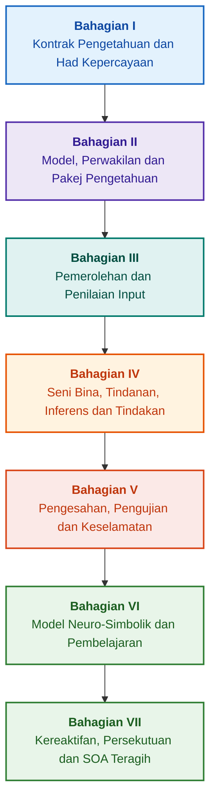

# Seni Bina Sistem Pakar Berasaskan Bukti: Daripada Ontologi Formal kepada AI Neuro-Simbolik

**Monograf kejuruteraan dan panduan komprehensif mengenai reka bentuk, model matematik, seni bina dan pengesahan formal sistem pintar berkeandalan tinggi (Safety-Critical & Evidence-Grounded AI)**

**Penulis:** [Mykola Fedchyk (Микола Федчик)](../../about-the-author.md) · [LinkedIn](https://www.linkedin.com/in/nickfedchik/)  
**Format:** Monograf Kejuruteraan / Buku Rujukan Arkitek AI  
**Tahun:** 2026  

---

## Mengenai Buku Ini

Buku ini merupakan penyelidikan monografik asas dan panduan praktikal kejuruteraan yang didedikasikan untuk mengatasi krisis utama kecerdasan buatan kontemporari: jurang epistemik antara kebolehpercayaan kebarangkalian janaan rangkaian neural dan kebenaran deterministik bukti matematik formal. Di tengah-tengah penyelidikan ini terletak soalan kejuruteraan yang tegas: **bagaimanakah mereka bentuk sistem pakar yang setiap kesimpulannya tidak dapat disangkal, dapat dikesan sepenuhnya kepada sumber bukti utama, dan sesuai untuk pensijilan dalam domain kejuruteraan keselamatan kritikal (ISO 26262, IEC 61508, DO-178C, ISO/SAE 21434)?**

Penulis mengemukakan dan mengasaskan paradigma baharu: **AI Neuro-Simbolik Berasaskan Bukti (Evidence-Grounded Neuro-Symbolic AI)**. Dalam seni bina ini, model statistik (LLM/SLM) menjalankan fungsi penasihat untuk menjana hipotesis pertanyaan dan rendering unjuran; manakala teras simbolik deterministik menjamin secara invarian konsistensi logik, asas fakta peringkat bait, kawalan sempadan kuasa, dan peralihan selamat kepada tindakan.

### Daripada Artifak Kejuruteraan kepada Keputusan Boleh Disahkan

Keperluan sistem, kod sumber, log ujian, piawaian kawal selia dan keputusan kejuruteraan sudah wujud dalam persekitaran pengeluaran moden, tetapi kebanyakannya berfungsi sebagai artifak terpencil tanpa semantik formal, tanpa sempadan kesahan yang ketat dan tanpa kebolehkesanan timbal balik. Laporan ujian yang berjaya mungkin merujuk kepada semakan perkakasan yang lapuk; petikan daripada piawaian keselamatan fungsi mungkin dikeluarkan daripada konteks; dan rollback kecemasan konfigurasi mungkin secara tidak sengaja mengaktifkan semula komponen yang telah dibatalkan.

Monograf ini menawarkan saluran kejuruteraan menyeluruh: daripada pemformalan artifak kejuruteraan sebagai data ditaip dan pakej pengetahuan yang ditandatangani secara kriptografi — kepada inferens simbolik, penguraian pelan langkah demi langkah, penjelasan kontrafakta dan audit sempadan kecekapan. Penyampaian praktikal disertakan dengan pelaksanaan gred industri dalam bahasa Go dengan set ujian lengkap ([Bab 1](../../ch01-introduction-to-expert-systems.md)), kontrak matematik yang ketat ([Bahagian II](../../part-02-knowledge-models.md)), dan protokol pembelajaran berterusan yang terbukti menghalang regresi pengetahuan ([Bab 25](../../ch25-how-expert-systems-learn.md)).

### Sasaran Pembaca Monograf

Penerbitan ini ditujukan kepada arkitek sistem, jurutera utama keandalan dan keselamatan fungsi, pembangun enjin inferens logik, dan jurutera pengetahuan. Untuk pemahaman awal konsep, pemahaman asas logik predikat peringkat pertama, pengurusan versi perisian dan kitaran hayat sistem adalah mencukupi; untuk menggunakan contoh praktikal, alat Go standard diperlukan. Bab-bab khusus yang didedikasikan untuk sintesis formal hujah keselamatan Goal Structuring Notation (GSN), sinergetik sistem kompleks, pemecut neuromorfik dan navigasi autonomi tanpa GNSS mendedahkan sempadan termaju AI berasaskan bukti dalam industri berteknologi tinggi (aeroangkasa, pengangkutan autonomi, infrastruktur tenaga kritikal).

---

## Konteks Saintifik dan Kedudukan Monograf dalam Penyelidikan Global

Monograf ini tidak melihat sistem pakar sebagai peninggalan lapuk sistem berasaskan peraturan era 1980-an (seperti CLIPS atau MYCIN), sebaliknya sebagai barisan hadapan **AI Neuro-Simbolik Berasaskan Bukti Gelombang Ketiga (Third-Wave Evidence-Grounded Neuro-Symbolic AI)**. Karya ini bersandar pada asas teori mazhab saintifik global terkemuka, sambil merapatkan jurang antara model matematik abstrak dan kejuruteraan sistem berprestasi tinggi:

| Bidang Saintifik | Karya Utama Global dan Penulis | Jambatan Konseptual dalam Buku |
|---|---|---|
| **AI Neuro-Simbolik Gelombang Ketiga (NeSy)** | Artur d'Avila Garcez, Luis C. Lamb (*Neurosymbolic AI: The 3rd Wave*, 2023; *Neural-Symbolic Cognitive Reasoning*, Springer, 2009); Henry Kautz (*The Third AI Summer*, AAAI 2022) | Pembahagian tanggungjawab: model statistik (SLM/LLM) menjana hipotesis pertanyaan, manakala teras simbolik deterministik mengesahkan dan meluluskan fakta secara formal ([Bab 29](../../ch29-neuro-symbolic-architecture.md)). |
| **Kekangan Semantik dan Pembelajaran Selamat** | Guy Van den Broeck et al. (*A Semantic Loss Function for Deep Learning with Symbolic Knowledge*, ICML 2018); Luc De Raedt et al. (*DeepProbLog*, IJCAI 2020) | Pintu masuk dan keluar kawalan pengesahan, penapisan semantik deterministik bagi cadangan rangkaian neural mengikut skema formal ([Bab 28](../../ch28-dual-mode-expert-systems.md), [33](../../ch33-inter-system-knowledge-exchange-and-model-teaching.md)). |
| **Penaakulan Boleh Batal dan Teori Argumentasi** | John L. Pollock (*Defeasible Reasoning*, 1987; *Cognitive Carpentry*, MIT Press, 1995); Phan Minh Dung (*Abstract Argumentation Frameworks*, AIJ 1995); Douglas Walton (*Argumentation Schemes*, Cambridge, 2008) | Penguraian pengetahuan kepada tuntutan, asal-usul dan pembatal (*rebutting* dan *undercutting defeaters*); penyelesaian konflik dalam pangkalan normatif melalui rangka kerja argumentasi Dung ([Bab 2](../../ch02-epistemology-of-machine-knowledge.md), [27](../../ch27-safety-case-gsn-synthesis.md)). |
| **Perlombongan Peraturan Persatuan Autonomi (KBC)** | Luis Galárraga, Fabian M. Suchanek et al. (*AMIE: Association Rule Mining under Incomplete Evidence*, WWW 2013, VLDBJ 2015); Stephen Muggleton (*Inductive Logic Programming*, 1994) | Induksi automatik peraturan daripada pangkalan pengetahuan di bawah andaian kelengkapan separa (PCA) tanpa contoh balas palsu dunia terbuka ([Bab 34](../../ch34-deterministic-relational-analysis-abduction-and-socratic-dialogue.md)). |
| **Perisai Keselamatan Formal dan Pensijilan (Safe AI)** | Bettina Könighofer, Roderick Bloem et al. (*Shield Synthesis*, 2017); Tim Kelly, Rob Weaver (*Goal Structuring Notation*, York, 2004); André Platzer (*Logical Foundations of CPS*, Springer, 2018) | Sintesis kes keselamatan dalam notasi GSN untuk piawaian ISO 26262/21434; perisai formal dan sampul kesahan berangka untuk penggerak periferi ([Bab 27](../../ch27-safety-case-gsn-synthesis.md), [30](../../ch30-safety-cybersecurity-co-engineering.md), [33](../../ch33-inter-system-knowledge-exchange-and-model-teaching.md)). |
| **Logik Epistemik dan Semiotik Pengetahuan** | John F. Sowa (*Knowledge Representation: Logical, Philosophical, and Computational Foundations*, 2000); Frank van Harmelen et al. (*Handbook of Knowledge Representation*, Elsevier, 2008) | Triad epistemik Charles Sanders Peirce (Konsep → Penghakiman → Kesimpulan); inferens abduktif hipotesis di bawah kawalan deduktif yang ketat ([Bab 6](../../ch06-applied-mathematics-for-expert-systems.md), [34](../../ch34-deterministic-relational-analysis-abduction-and-socratic-dialogue.md)). |
| **Sibernetik dan Sinergetik Sistem Kompleks** | Norbert Wiener (*Cybernetics*, 1948); W. Ross Ashby (*An Introduction to Cybernetics*, 1956); Hermann Haken (*Synergetics: An Introduction*, 1977; *Advanced Synergetics*, 1983); Ilya Prigogine (*Order out of Chaos*, 1984) | Undang-undang kepelbagaian yang diperlukan Ashby, gelung kawalan tertutup L0–L4, pengurangan ruang keadaan kepada parameter pesanan melalui prinsip subordinasi Haken, ramalan peralihan fasa melalui Critical Slowing Down (CSD) dan penstabilan disipatif pangkalan pengetahuan ([Bab 6](../../ch06-applied-mathematics-for-expert-systems.md), [22](../../ch22-cybernetics-edge-to-backend.md), [35](../../ch35-self-organizing-expert-systems-synergetics-and-npu-runtime.md)). |
| **Pengujian Pengetahuan, Invarian Linguistik dan Penentukuran Lipschitz** | Kent Beck (*TDD*, 2002); Martin Fowler (*Refactoring*, 2018); Clark Barrett, Leonardo de Moura (*Z3 SMT Solver*, 2008); Chuan Guo et al. (*On Calibration of Modern Neural Networks*, ICML 2017); Marco Tulio Ribeiro et al. (*CheckList*, ACL 2020); John L. Pollock (*Defeasible Reasoning*, 1987) | Piramid Pengujian Pengetahuan empat peringkat (KTP): ujian unit peraturan terpencil (`PremiseMock`) (KUT), menyekat perangkap kebenaran lompang, BVA spektrum 6 mata, kekisi peraturan dan pembatal (KIT), metrik invarian semantik ($\text{SIS} \ge 0.98$) pada variasi linguistik, keterusan Lipschitz ($L_{\mathcal{K}} \le L_{\max}$) terhadap gegaran geganti, dan pengumpulan jurang pengetahuan secara stigmergik ([Bab 36](../../ch36-knowledge-testing-pyramid-and-variational-calibration.md)). |

---

## Model Teori, Penyelidikan Saintifik dan Inovasi Kejuruteraan Penulis

Monograf ini menggabungkan penemuan penyelidikan asas dan pengalaman kejuruteraan praktikal penulis dalam bidang reka bentuk sistem keandalan tinggi, seni bina terbenam dan AI berasaskan bukti. Tidak seperti karya tinjauan semata-mata, buku ini membangunkan siri teori formal asli, protokol dan penyelesaian seni bina yang meningkatkan interaksi neuro-simbolik ke tahap keyakinan yang boleh dibuktikan secara matematik:

### 1. Pembangunan Teori Asas dan Formalisme Matematik

1. **Invarian Pengasasan Bukti (Evidence-Grounded Invariant, EGI) dan Pintu Pengesahan Fakta ([Bab 2](../../ch02-epistemology-of-machine-knowledge.md), [19](../../ch19-from-question-to-evidence.md), [28](../../ch28-dual-mode-expert-systems.md), [29](../../ch29-neuro-symbolic-architecture.md)):**
   * *Konsep Teori:* Penulis merumuskan dan memformalkan secara matematik invarian kelengkapan pengasasan $\mathrm{Comp}(C) = 1.00$, yang menetapkan bahawa dalam sistem berasaskan bukti tiada tuntutan boleh memperoleh status fakta tanpa unjuran deterministik pada sumber bukti utama. Setiap elemen dalam pangkalan fakta disertakan dengan tupel kriptografi: koordinat bait tidak berubah `[byte_start, byte_end]`, cincangan serpihan kanonik `quote_sha256`, dan pengecam sijil asal-usul PROV-O.
   * *Kepentingan Kejuruteraan:* Mekanisme pintu pengesahan peringkat bait pada peringkat perkakasan dan perisian menghalang sepenuhnya penembusan halusinasi rangkaian neural ke dalam pangkalan pengetahuan berversi, menjamin toleransi sifar terhadap data yang tidak disahkan ($ZHR = 1.00$).
2. **Piramid Pengujian Pengetahuan Empat Peringkat (KTP) dan Kestabilan Lipschitz Ruang Inferens ([Bab 36](../../ch36-knowledge-testing-pyramid-and-variational-calibration.md)):**
   * *Konsep Teori:* Penulis mencadangkan buat kali pertama Piramid Pengujian Pengetahuan (KTP) yang sistematik, serupa dengan piramid pengujian perisian Martin Fowler: pengujian unit peraturan terpencil (`PremiseMock`) (KUT), pengujian integrasi interaksi peraturan dan pembatal (KIT), dan penentukuran variasi pada manifold perumusan (KVT).
   * *Radas Matematik:* Invarian ketat untuk menyekat perangkap kebenaran lompang ($P \to Q$ apabila $P \equiv \text{False}$), metrik invarian semantik ($\mathrm{SIS} \ge 0.98$) di bawah gangguan linguistik, dan kekangan keterusan Lipschitz bagi ruang inferens ($L_{\mathcal{K}} \le L_{\max}$), yang secara matematik menghapuskan gegaran malapetaka bagi kesimpulan pada turun naik kecil input.
3. **Teori Pemalsuan Popperian bagi Peraturan Deontik dan Auditor pematuhan Aktif ([Bab 39](../../ch39-active-compliance-auditor-and-popperian-testing.md)):**
   * *Konsep Teori:* Peralihan daripada model klasik "oracle pasif" (yang hanya menjawab soalan) kepada paradigma auditor pengetahuan aktif yang melaksanakan prinsip pemalsuan Karl Popper. Sistem meneroka ruang keperluan (ASPICE 4.0, ISO 26262, ISO/SAE 21434) secara autonomi, mensintesis contoh balas, mengenal pasti spesifikasi yang tidak lengkap, dan mereka bentuk program ujian produk yang menyeluruh.
   * *Nilai Praktikal:* Gabungan penjanaan kreatif senario sempadan oleh rangkaian neural (Sistem 1) dan pengesahan deontik deterministik oleh teras simbolik (Sistem 2) dengan perlindungan terjamin bagi manusia dalam gelung kawalan (Human-in-the-Loop) daripada keletihan kelulusan.
4. **Pengurangan Dimensi Sinergetik Pangkalan Pengetahuan dan Diagnosis Pra-Bifurkasi CSD ([Bab 6](../../ch06-applied-mathematics-for-expert-systems.md), [22](../../ch22-cybernetics-edge-to-backend.md), [35](../../ch35-self-organizing-expert-systems-synergetics-and-npu-runtime.md)):**
   * *Konsep Teori:* Penggunaan radas matematik sinergetik Hermann Haken (parameter pesanan dan prinsip subordinasi) dan teori struktur disipatif Ilya Prigogine kepada evolusi pangkalan pengetahuan yang kompleks.
   * *Hasil Saintifik:* Kaedah dibangunkan untuk mengurangkan ruang keadaan berbilang dimensi telemetri kepada parameter pesanan dan penyepaduan pengesan Critical Slowing Down (CSD) berdasarkan autokorelasi dan serakan, membolehkan ramalan keruntuhan dinamik sistem sebelum pengaktifan penderia ambang kecemasan.
5. **Model Tahap Autonomi Tindakan (A0–A4), Pintu Kuasa dan Saga Idempoten ([Bab 21](../../ch21-from-recommendation-to-action.md)):**
   * *Konsep Teori:* Skala diskret kuasa tindakan sistem (A0: analisis pasif, A1: penyediaan draf, A2: tindakan di bawah tandatangan manusia, A3: autonomi diselia, A4: pemotongan perlindungan kecemasan) yang diberikan kepada tupel "tindakan, persekitaran, tahap risiko".
   * *Radas Matematik:* Invarian algebra idempoten $f(f(x, k), k) \equiv f(x, k)$ berdasarkan kunci kriptografi $k$, pelaksanaan gelung tertutup langkah demi langkah, dan protokol saga pampasan teragih dengan keadaan `OutcomeUnknown` dan pengesahan bebas pasca-syarat.
6. **Kejuruteraan Bersama Formal bagi Keselamatan Fungsi dan Keselamatan Siber dalam Notasi GSN ([Bab 27](../../ch27-safety-case-gsn-synthesis.md), [30](../../ch30-safety-cybersecurity-co-engineering.md)):**
   * *Konsep Teori:* Model untuk sintesis terselaras pokok argumentasi GSN (Goal Structuring Notation) yang memenuhi keperluan piawaian ISO 26262 (keselamatan fungsi) dan ISO/SAE 21434 (keselamatan siber) secara serentak.
   * *Pencapaian Kejuruteraan:* Pemformalan arbitraj matematik antara matlamat yang bercanggah (belanjawan masa tindak balas kecemasan berbanding kedalaman pengesahan kriptografi) dan protokol pendedahan bukti terpilih kepada juruaudit luar melalui pokok Merkle bergaram.
7. **Protokol Pengesahan Kesetiaan dan Ketekalan Semantik Penjelasan ([Bab 20](../../ch20-explanation-engine.md)):**
   * *Konsep Teori:* Penjelasan dianggap bukan sebagai teks bebas model generatif, tetapi sebagai artifak deterministik tersendiri yang diterbitkan secara unik daripada graf bukti, versi peraturan, dan tangkapan fakta yang disahkan.
   * *Radas Matematik:* Pintu metrik penilaian kesetiaan ($C_{\text{facts}} = 1.00, H_{\text{free}} = 1.00$) dengan sandaran fail-safe automatik kepada templat tegar pada sedikit perbezaan antara inferens simbolik dan pemverbalan untuk pengendali.

---

### 2. Penyelidikan Empirikal, Rangka Ujian Penulis dan Kejuruteraan Sistem

1. **Pakej Pengetahuan Perduaan Tidak Berubah dengan `mmap` dan Nyah-bersiri Sifar ([Bab 32](../../ch32-high-performance-knowledge-packs-mmap-and-harvesting.md)):**
   * *Inovasi Penulis:* Seni bina dua lapisan untuk pakej (lapisan kanonik sumber utama + lapisan terbitan indeks yang dimaterialkan).
   * *Hasil Empirikal:* Pemetaan langsung indeks ke dalam ruang alamat maya melalui panggilan sistem `mmap`, penghapusan overhed peruntukan memori dinamik (zero-allocation), dan pemulaan enjin dalam masa sublinear tanpa mengira saiz gigabait ontologi.
2. **Poligon Penentukuran Empirikal pada Korpus Piawai IETF RFC-1000 dan W3C-150 ([Bab 2](../../ch02-epistemology-of-machine-knowledge.md), [4](../../ch04-evolution-from-bayes-to-evidence-ai.md), [14](../../ch14-requirements-detection-and-formalization.md), [25](../../ch25-how-expert-systems-learn.md)):**
   * *Eksperimen Penulis:* Penerapan bangku ujian penyelidikan berskala besar pada 1,000 spesifikasi sah IETF RFC (diedarkan merentasi 5 era sejarah pembangunan Internet) dan 150 pertanyaan diagnostik kompleks korpus W3C (termasuk induksi buatan konflik logik dan konfabulasi).
   * *Hasil Praktikal:* Pembinaan matriks peperiksaan pengetahuan objektif, pengesanan percanggahan normatif, dan perlindungan terbukti secara matematik terhadap regresi pangkalan pengetahuan semasa kemas kini.
3. **Analisis Hubungan Pelbagai Langkah, Abduksi Simbolik dan Dialog Socrates ([Bab 34](../../ch34-deterministic-relational-analysis-abduction-and-socratic-dialogue.md)):**
   * *Pembangunan Penulis:* Algoritma Carian Lebar Terhad Dua Arah (Bidirectional Bounded BFS, $k \le 6$) dengan perlindungan gelung dan pembentukan rantai bukti peringkat bait komposit untuk entiti yang berkaitan.
   * *Kelebihan Kejuruteraan:* Pelaksanaan abduksi simbolik Peirce di bawah kawalan deduktif yang ketat dan bingkai penjelasan Socrates yang ditaip (*Clarification Frames*), mengalihkan sistem kepada mod dialog produktif dengan manusia dan bukannya penolakan buta di bawah Andaian Dunia Tertutup (CWA).
4. **Perisai Formal dan Sampul Kesahan Berangka untuk Sistem Kawalan Periferi ([Bab 33](../../ch33-inter-system-knowledge-exchange-and-model-teaching.md), [Lampiran B](../../appendix-b-robotics-and-cyber-physical-systems.md), [C](../../appendix-c-autonomous-navigation-and-geosearch.md), [E](../../appendix-e-mixed-signal-neuromorphic-expert-systems.md)):**
   * *Inovasi Penulis:* Metodologi untuk menterjemah invarian logik diskret ke dalam koridor keselamatan berangka berterusan untuk pemproses isyarat digital (DSP) dan sistem navigasi autonomi tanpa GNSS (TRN/DSMAC/VIO).
   * *Kebolehpercayaan Operasi:* Pertukaran peraturan yang ditandatangani berdasarkan kriptografi Ed25519, kuarantin selamat calon pengetahuan baharu, dan pemotongan arahan kawalan berbahaya pada tahap perkakasan.
5. **Perlindungan Terhadap Kebocoran Maklumat Sulit melalui Penjelasan dan Audit Diferensial ([Bab 20](../../ch20-explanation-engine.md)):**
   * *Pembangunan Penulis:* Protokol pengurangan perwakilan perantaraan penjelasan ($\mathrm{EIR}_{\text{redacted}}$) dengan pengesahan ACL untuk setiap nod dan tepi graf bukti, menyekat serangan saluran sisi untuk membina semula model melalui siri pertanyaan kontras WHY NOT.

---

## Prinsip Pengelompokan dan Klasifikasi

Bahagian-bahagian buku ditentukan oleh tugas utama kejuruteraan, dan bukannya tahun penulisan bab atau nama teknologi tertentu. Setiap bab mempunyai satu bahagian utama; kaedah bersebelahan menerangkan cara menyelesaikan soalan utamanya. Nombor bab dan nama fail kekal sebagai pengecam tetap, supaya susunan bacaan tematik mungkin berbeza daripada susunan berangka.

Tajuk subseksyen dalam bab membentuk kelas yang berbeza dan harus dibaca sebagai urutan hujah yang berterusan, bukan sebagai senarai teknologi yang setara:

| Kelas Subseksyen | Soalan Pembaca | Fungsi dalam Bab |
|---|---|---|
| Masalah dan Had Tugas | Apakah sebenarnya yang perlu diselesaikan? | Menentukan soalan utama dan skop aplikasi |
| Objek dan Model | Apakah data, pengetahuan atau keadaan yang diperiksa? | Menyelaraskan konsep, jenis dan andaian |
| Kaedah dan Prosedur | Bagaimana untuk mencapai hasil? | Menerangkan inferens, transformasi atau kawalan |
| Pelaksanaan dan Alat | Apakah alat yang digunakan untuk melaksanakan prosedur? | Menunjukkan penjelmaan perisian atau perkakasan kaedah |
| Pengesahan dan Kes Kawalan | Bagaimana untuk mengesan ralat? | Membandingkan hasil dengan kriteria bebas |
| Kesimpulan dan Had Hasil | Apa yang telah dibuktikan dan apa yang masih terbuka? | Menjawab soalan utama tanpa janji yang berlebihan |

Negara, industri atau produk komersial ialah konteks aplikasi, bukan tahap bebas taksonomi ini. Glosari, singkatan, sumber dan navigasi membentuk radas rujukan tambahan, bukan topik bab yang berdiri sendiri.

Peta semakan struktur editorial yang lengkap mengandungi penilaian tema utama setiap bab, sempadan antara perbincangan bersebelahan, dan nota mengenai komposisi dan kesimpulan. Nota baharu tidak bermakna semua risiko kandungan dalam bab telah dihapuskan sepenuhnya.

---

## Laluan Pembacaan yang Disyorkan

**Pengesahan Perisian Pertama:** [1](../../ch01-introduction-to-expert-systems.md) → [7](../../ch07-knowledge-base-typology.md) → [8](../../ch08-engineering-artifacts-as-data.md) → [17](../../ch17-implementation-stack.md) → [23](../../ch23-knowledge-base-verification.md) → [25](../../ch25-how-expert-systems-learn.md). Matlamat: Penghakiman boleh dihasilkan semula dengan alasan bukti, ujian negatif dan perubahan pengetahuan terkawal. Model bahasa tidak diperlukan.

**Kejuruteraan Pengetahuan:** [Bahagian II](../../part-02-knowledge-models.md) → [Bahagian III](../../part-03-knowledge-engineering-nlp.md) → [19](../../ch19-from-question-to-evidence.md) → [20](../../ch20-explanation-engine.md) → [26](../../ch26-continual-learning.md). Matlamat: Menyelaraskan semantik, asal-usul, pemerolehan pengetahuan dan pengesahan calon baharu. Bahagian II mengekalkan program ujian saintifik untuk bab 7–11.

**Seni Bina Penyelesaian:** [16](../../ch16-expert-systems-architecture.md) → [19](../../ch19-from-question-to-evidence.md) → [31](../../ch31-syllogistic-reasoning-and-relation-lattices.md) → [20](../../ch20-explanation-engine.md) → [21](../../ch21-from-recommendation-to-action.md). Matlamat: Mengasingkan pengesahan bukti, aplikasi norma, penjelasan dan kuasa tindakan dengan ketat.

**Pengesahan dan Keselamatan:** [23](../../ch23-knowledge-base-verification.md) → [36](../../ch36-knowledge-testing-pyramid-and-variational-calibration.md) → [25](../../ch25-how-expert-systems-learn.md) → [26](../../ch26-continual-learning.md) → [27](../../ch27-safety-case-gsn-synthesis.md) → [30](../../ch30-safety-cybersecurity-co-engineering.md). Diagnosis objek luaran dikendalikan secara khusus melalui [Bab 24](../../ch24-system-diagnosis.md).

**Jawapan Hibrid dan Operasi:** [Bahagian VI](../../part-06-frontiers-neuro-symbolic.md) → [Bahagian VII](../../part-07-runtime-and-knowledge-exchange.md) → [40](../../ch40-distributed-epistemic-architectures-soa-and-cluster-scaling.md) dan lampiran yang berkaitan. Matlamat: Mengintegrasikan model bahasa, mengurus jurang pengetahuan, membina seni bina perkhidmatan pengetahuan teragih rujukan dan mengesahkan pertukaran antara sistem. Bab [2](../../ch02-epistemology-of-machine-knowledge.md), [4](../../ch04-evolution-from-bayes-to-evidence-ai.md) dan [6](../../ch06-applied-mathematics-for-expert-systems.md) boleh dibaca sebagai kontrak, sejarah dan panduan matematik mengikut keperluan.

---

## Had Janji Kejuruteraan

Buku ini merupakan bahan pendidikan dan penyelidikan, bukan prosedur yang diperakui atau bukti rasmi pematuhan produk dengan piawaian. Pelaksanaan deterministik tidak secara langsung membuktikan ketepatan fakta; cincangan dan tandatangan digital tidak membuktikan kebenaran mutlak; dan graf hujah tidak menggantikan penilaian pakar manusia. Keperluan keandalan keseluruhan produk tidak boleh disamakan dengan kadar ralat model bahasa atau dikaitkan dengan semua komponen perisian.

Penghuraian automatik mengurangkan kemasukan data manual, tetapi tidak menghapuskan pemodelan domain, semakan rakan sebaya dan tanggungjawab pemilik pengetahuan. Protégé, semakan manual dan penuaian automatik boleh bekerjasama dengan berkesan. Jaminan matematik hanya terpakai kepada profil bahasa dan andaian tertentu; kelajuan yang diukur berkaitan dengan pertanyaan khusus, korpus dan persekitaran yang diuji. Data arkib penulis dipisahkan dengan ketat daripada persekitaran latihan terbuka dan penyelidikan masa depan yang belum dijalankan.

Keputusan mengenai keluaran produk, penerimaan risiko dan pematuhan dengan keperluan kawal selia industri kekal di bawah tanggungjawab pakar manusia yang diberi kuasa. Sistem pakar menyediakan bahan yang boleh disahkan dan menguatkuasakan dasar yang dipersetujui, tetapi tidak memperoleh kuasa pengawalseliaan atau undang-undang dengan sendirinya.

---

## Struktur Buku

Buku ini terdiri daripada tujuh bahagian tematik, 40 bab dan lima lampiran. Setiap bab tergolong dalam satu bahagian utama. Bab sebelumnya dan seterusnya dalam navigasi mengikut susunan tematik di bawah; nombor bab dan nama fail dipelihara.

---

### [Bahagian I. Asas Konseptual dan Epistemik](../../part-01-foundations.md)

*Bila sistem pakar diperlukan, apa yang boleh dianggap sebagai pengetahuan, dan bagaimana untuk mengekalkan asas keputusan organisasi.*

* [Bab 1. Pengenalan kepada Sistem Pakar: Daripada Huru-hara kepada Pengetahuan Terurus](../../ch01-introduction-to-expert-systems.md)
* [Bab 2. Falsafah untuk Jurutera: Apakah Hak Mesin untuk Memanggil Sesuatu Pengetahuan](../../ch02-epistemology-of-machine-knowledge.md)
* [Bab 3. Perbezaan Asas Antara Sistem Pakar dan Sistem Maklumat Rujukan](../../ch03-beyond-reference-information-systems.md)
* [Bab 4. Evolusi Sistem Pakar: Daripada Teorem Bayes kepada Penyelesaian AI Berasaskan Bukti](../../ch04-evolution-from-bayes-to-evidence-ai.md)
* [Bab 5. Triad Kepercayaan: Sistem Pakar, Cadangan Berasaskan Bukti dan Memori Korporat](../../ch05-triad-of-trust-and-corporate-memory.md)

---

### [Bahagian II. Model Matematik, Perwakilan dan Penyimpanan Pengetahuan](../../part-02-knowledge-models.md)

*Pilihan operasi matematik dan perwakilan, artifak ditaip, graf kebolehkesanan dan pakej pengetahuan tidak berubah.*

* [Bab 6. Matematik Gunaan untuk Sistem Pakar: Peraturan, Kebarangkalian, Graf dan Kausaliti](../../ch06-applied-mathematics-for-expert-systems.md)
* [Bab 7. Tipologi Pangkalan Pengetahuan: Peraturan, Ontologi, Preseden dan Vektor](../../ch07-knowledge-base-typology.md)
* [Bab 8. Artifak Kejuruteraan Sebagai Data Sistem Pakar](../../ch08-engineering-artifacts-as-data.md)
* [Bab 9. Graf Pengetahuan Kejuruteraan: Kebolehkesanan Daripada Keperluan kepada Perkakasan](../../ch09-engineering-knowledge-graph-traceability.md)
* [Bab 32. Pakej Pengetahuan Tidak Berubah: Kebenaran Peringkat Bait, Indeks dan Pemetaan Memori](../../ch32-high-performance-knowledge-packs-mmap-and-harvesting.md)

---

### [Bahagian III. Pemerolehan Pengetahuan, Analisis Linguistik dan Penilaian Input](../../part-03-knowledge-engineering-nlp.md)

*Dokumen, pengalaman pakar dan pemerhatian: pengekstrakan calon, analisis linguistik, pemformalan dan penilaian bukti.*

* [Bab 10. Sistem Pemerolehan Pengetahuan: Sumber, Kemasukan dan Kitaran Hayat](../../ch10-knowledge-acquisition-systems.md)
* [Bab 11. Pengekstrakan Pengetahuan daripada Pakar: Temu Bual, Peta Kognitif dan Pemformalan Pengalaman](../../ch11-knowledge-elicitation-from-experts.md)
* [Bab 12. Analisis Linguistik dan Model Tempatan: Pemeliharaan Makna dan Sumber](../../ch12-linguistic-analysis-and-local-models.md)
* [Bab 13. Kebolehubahan Bahasa Semula Jadi Lawan Determinisme: Kompilasi Makna Pertanyaan](../../ch13-language-variability-vs-determinism.md)
* [Bab 14. Pengesanan Keperluan dan Modaliti: Daripada Teks Normatif kepada Invarian](../../ch14-requirements-detection-and-formalization.md)
* [Bab 15. Pengekstrakan Pengetahuan dan Pembinaan Pangkalan Pengetahuan: Fakta, Tatabahasa dan Automata](../../ch15-knowledge-extraction-and-kb-construction.md)
* [Bab 37. Penilaian Maklumat Input: Sumber, Bukti dan Ketidakpastian](../../ch37-input-information-assessment-and-algorithmic-skepticism.md)

---

### [Bahagian IV. Seni Bina, Tindanan Teknologi, Inferens dan Tindakan](../../part-04-architecture-and-inference.md)

*Kontrak seni bina, tindanan teknologi, pelaksanaan perkakasan, pengesahan tuntutan, inferens berasaskan norma, penjelasan dan gelung kawalan sibernetik.*

* [Bab 16. Seni Bina Sistem Pakar: Daripada Pengetahuan Formal kepada Keputusan Berasaskan Bukti](../../ch16-expert-systems-architecture.md)
* [Bab 17. Tindanan Teknologi: Kriteria Pemilihan Alat, Bahasa Pengaturcaraan dan Enjin Peraturan](../../ch17-implementation-stack.md)
* [Bab 18. Infrastruktur Pelaksanaan: Model Tempatan, Pemecut Perkakasan, Edge dan On-Premise](../../ch18-execution-infrastructure.md)
* [Bab 19. Daripada Soalan kepada Bukti: Carian, Asas dan Pengesahan Tuntutan](../../ch19-from-question-to-evidence.md)
* [Bab 31. Inferens Berasaskan Norma: Hierarki Predikat, Pengecualian dan Kesahan](../../ch31-syllogistic-reasoning-and-relation-lattices.md)
* [Bab 20. Enjin Penjelasan: Keputusan, Penolakan dan Had Kecekapan](../../ch20-explanation-engine.md)
* [Bab 21. Daripada Cadangan kepada Tindakan: Kawalan Kuasa dan Pelaksanaan Selamat dalam Persekitaran Pengeluaran](../../ch21-from-recommendation-to-action.md)
* [Bab 22. Gelung Kawalan Sibernetik: Penderia, Periferi dan Maklum Balas](../../ch22-cybernetics-edge-to-backend.md)

---

### [Bahagian V. Pengesahan, Pengujian, Diagnosis dan Kes Keselamatan](../../part-05-verification-and-learning.md)

*Pengesahan formal peraturan, piramid pengujian pengetahuan, pemalsuan Popperian, diagnosis teknikal dan hujah keselamatan fungsi serta keselamatan siber.*

* [Bab 23. Pengesahan Pangkalan Pengetahuan: Cara Memeriksa Ketekalan, Kelengkapan dan Keandalan Peraturan](../../ch23-knowledge-base-verification.md)
* [Bab 36. Piramid Pengujian Pengetahuan: Peraturan, Interaksi dan Kestabilan Tindak Balas](../../ch36-knowledge-testing-pyramid-and-variational-calibration.md)
* [Bab 39. Penguji Pakar Aktif: Pemalsuan Popperian, Pematuhan Kawal Selia (ASPICE/ISO 26262/ISO 21434) dan Reka Bentuk Ujian Autonomi](../../ch39-active-compliance-auditor-and-popperian-testing.md)
* [Bab 24. Diagnosis Teknikal: Cara Mengelak Mengelirukan Gejala dengan Punca Utama di Bawah Ketidaklengkapan Data](../../ch24-system-diagnosis.md)
* [Bab 27. Kes Keselamatan: Sintesis dan Pengesahan Hujah](../../ch27-safety-case-gsn-synthesis.md)
* [Bab 30. Kejuruteraan Bersama Keselamatan Fungsi dan Keselamatan Siber](../../ch30-safety-cybersecurity-co-engineering.md)

---

### [Bahagian VI. Model Neuro-Simbolik, Sempadan Kognitif dan Pembelajaran Berterusan](../../part-06-frontiers-neuro-symbolic.md)

*Inferens ketat dan hipotesis penasihat, penyepaduan model bahasa, jurang pengetahuan, kawalan jawapan tidak disahkan, matriks peperiksaan dan pembelajaran berterusan daripada pengalaman.*

* [Bab 28. Sistem Pakar Dwi-Mod: Inferens Ketat dan Hipotesis Penasihat](../../ch28-dual-mode-expert-systems.md)
* [Bab 29. Seni Bina Neuro-Simbolik: Model Bahasa dan Pengesahan Alasan Bukti](../../ch29-neuro-symbolic-architecture.md)
* [Bab 34. Jurang Pengetahuan: Carian Hubungan, Abduksi dan Dialog Penjelasan](../../ch34-deterministic-relational-analysis-abduction-and-socratic-dialogue.md)
* [Bab 38. Halusinasi Mesin dan Defisit Pengetahuan: Kawalan Jawapan Berasaskan Bukti](../../ch38-curing-machine-hallucinations-and-knowledge-deficits.md)
* [Bab 25. Cara Melatih Sistem Pakar: Matriks Peperiksaan, Audit Pengetahuan dan Kawalan Regresi](../../ch25-how-expert-systems-learn.md)
* [Bab 26. Pembelajaran Berterusan (Continual Learning) daripada Pengalaman dan Mengatasi Hanyutan Log Sistem](../../ch26-continual-learning.md)

---

### [Bahagian VII. Pelaksanaan Reaktif, Pertukaran Pengetahuan Antara Sistem dan SOA Teragih](../../part-07-runtime-and-knowledge-exchange.md)

*Pelaksanaan peraturan reaktif, sinergetik dan peralihan fasa pengetahuan, pertukaran antara sistem dan seni bina epistemik teragih skala perusahaan.*

* [Bab 35. Sistem Pakar Reaktif: Peristiwa, Pembatalan dan Penyesuaian Pengetahuan](../../ch35-self-organizing-expert-systems-synergetics-and-npu-runtime.md)
* [Bab 33. Pertukaran Pengetahuan Antara Sistem: Membekalkan Peraturan kepada Sistem Luaran, Model Pengajaran dan Maklum Balas Selamat](../../ch33-inter-system-knowledge-exchange-and-model-teaching.md)
* [Bab 40. Seni Bina Teragih Sistem Pakar Berasaskan Bukti: SOA Epistemik, Penghalaan Semantik, Hierarki Memori dan Arbitraj Defeasible Berbilang Vendor](../../ch40-distributed-epistemic-architectures-soa-and-cluster-scaling.md)

---

### Lampiran

* [Lampiran A. Rangka Kerja Praktikal untuk Penyelidikan Berasaskan Bukti dalam Projek Kejuruteraan Kompleks](../../appendix-a-evidence-governed-framework.md)
* [Lampiran B. Sistem Pakar Berasaskan Bukti dalam Robotik Autonomi dan Kompleks Siber-Fizikal](../../appendix-b-robotics-and-cyber-physical-systems.md)
* [Lampiran C. Navigasi Autonomi Tanpa GNSS: Pemadanan Georuang (TRN/DSMAC), Odometri Visual (VIO) dan Arbitraj Pakar Gabungan Penderia](../../appendix-c-autonomous-navigation-and-geosearch.md)
* [Lampiran D. Sistem Pakar Analog, Pengkomputeran Neuromorfik dan Inferens Logik Perkakasan](../../appendix-d-analog-expert-systems-and-neuromorphic-computing.md)
* [Lampiran E. Sistem Pakar Isyarat Campuran Analog-Digital: Pengkomputeran Neuromorfik, Analog dan Tidak Konvensional di Bawah Kawalan Bukti](../../appendix-e-mixed-signal-neuromorphic-expert-systems.md)
* [Mengenai Penulis: Mykola Fedchyk (Nick Fedchik)](../../about-the-author.md)

---

## Hala Tuju Penyelidikan Masa Depan

Arah kerja masa depan bukanlah janji yang tersedia: Pembinaan pakej pengetahuan yang boleh dihasilkan semula; pengesahan perwakilan formal yang terhad; tadbir urus ejen melalui kuasa eksplisit; pengesahan sulit tuntutan formal tertentu; pembatalan terkawal dan penyelidikan tentang penyahlakuan mesin (machine unlearning). Membuktikan sifat model tidak mengesahkan pematuhan produk fizikal secara automatik, dan memadamkan peraturan tidak sama dengan menghapuskan sepenuhnya pengaruh data daripada model terlatih.

Bagi pemecut perkakasan dan komputer bukan konvensional, kadar ralat, kependaman, penggunaan tenaga dan tingkah laku semasa kegagalan diukur dengan ketat terlebih dahulu. Isu-isu ini dibincangkan dalam [Bab 29](../../ch29-neuro-symbolic-architecture.md), [Bab 32](../../ch32-high-performance-knowledge-packs-mmap-and-harvesting.md) dan [Lampiran D](../../appendix-d-analog-expert-systems-and-neuromorphic-computing.md) dan [E](../../appendix-e-mixed-signal-neuromorphic-expert-systems.md). Program penyelidikan praktikal untuk bab 7–11 dibentangkan dalam [Bahagian II](../../part-02-knowledge-models.md): setiap cadangan mempunyai hipotesis, perbandingan kawalan dan syarat pemalsuan.
