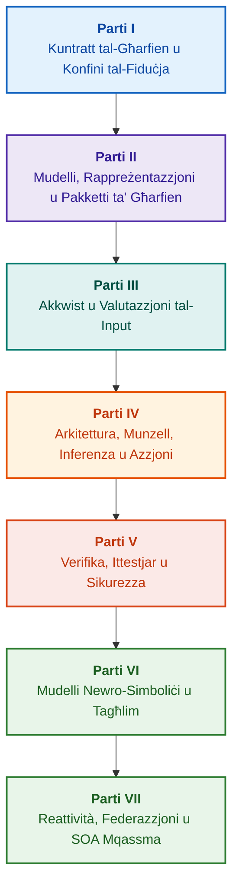

# Arkitettura ta' Sistemi Esperti Bbażati fuq l-Evidenza: Minn Ontoloġiji Formali għal AI Newro-Simbolika

**Monografu tal-inġinerija u gwida komprensiva dwar id-disinn, mudelli matematiċi, arkitettura u verifika formali ta' sistemi intelliġenti ta' affidabbiltà għolja (Safety-Critical & Evidence-Grounded AI)**

**Awtur:** [Mykola Fedchyk (Микола Федчик)](../../about-the-author.md) · [LinkedIn](https://www.linkedin.com/in/nickfedchik/)  
**Format:** Monografu tal-Inġinerija / Manwal tal-Perit tal-AI  
**Sena:** 2026  

---

## Dwar il-Ktieb

Il-ktieb huwa riċerka monografika fundamentali u gwida prattika tal-inġinerija ddedikata biex tingħeleb il-kriżi ċentrali tal-intelliġenza artifiċjali kontemporanja: id-distakk epistemiku bejn il-plawżibbiltà probabilistika tal-output tan-netwerks newrali u l-verità deterministika tal-provi formali matematiċi. Fil-qalba tar-riċerka hemm mistoqsija rigoruża tal-inġinerija: **kif tiddisinja sistema esperta fejn kull konklużjoni hija irrevokabbli, traċċabbli għalkollox sal-għejun primarji tal-evidenza, u adattata għaċ-ċertifikazzjoni f'oqsma tal-inġinerija ta' sikurezza kritika (ISO 26262, IEC 61508, DO-178C, ISO/SAE 21434)?**

L-awtur jissostanzja u jistabbilixxi paradigma ġdida: **AI Newro-Simbolika Bbażata fuq l-Evidenza (Evidence-Grounded Neuro-Symbolic AI)**. F'din l-arkitettura, mudelli statistiċi (LLM/SLM) iwettqu funzjoni konsultattiva għall-ġenerazzjoni ta' ipoteżijiet u rendering projettiv; filwaqt li qalba simbolika deterministika tiggarantixxi b'mod invarjanti l-konsistenza loġika, l-ankraġġ tal-fatti fil-livell tal-bytes, il-kontroll tal-konfini tal-awtorità, u t-tranżizzjoni sikura għall-azzjoni.

### Minn Artifatt tal-Inġinerija għal Deċiżjoni Verifikabbli

Ir-rekwiżiti tas-sistema, il-kodiċi tas-sors, ir-reġistri tat-testijiet, l-istandards regolatorji, u d-deċiżjonijiet tal-inġinerija diġà jeżistu f'ambjenti moderni ta' produzzjoni, iżda l-aktar jiffunzjonaw bħala artifatti frammentati mingħajr semantika formali, mingħajr konfini riġidi ta' validità, u mingħajr traċċabbiltà reċiproka. Rapport ta' ttestjar b'suċċess jista' jirreferi għal reviżjoni skaduta ta' komponent ta' ħardwer; ċitazzjoni minn standard ta' sikurezza tista' tinqala' mill-kuntest; u rollback ta' emerġenza ta' konfigurazzjoni jista' jerġa' jattiva b'mod mhux intenzjonat komponent irrevokat.

Dan il-monografu jippreżenta pipeline sħiħ tal-inġinerija: mill-formalizzazzjoni tal-artifatti tal-inġinerija bħala dejta ttajpjata u pakketti ta' għarfien iffirmati kriptografikament — sal-inferenza simbolika, id-dekompożizzjoni pass pass tal-pjanijiet, spjegazzjonijiet kontrofattwali, u l-awditjar tal-konfini tal-kompetenza. L-espożizzjoni prattika hija akkumpanjata minn implimentazzjonijiet ta' grad industrijali fil-lingwa Go b'settijiet kompluti ta' testijiet ([Kapitlu 1](../../ch01-introduction-to-expert-systems.md)), kuntratti matematiċi stretti ([Parti II](../../part-02-knowledge-models.md)), u protokolli ta' tagħlim kontinwu li jipprevjenu b'mod ippruvat ir-rigressjoni tal-għarfien ([Kapitlu 25](../../ch25-how-expert-systems-learn.md)).

### Għal Min Hu Maħsub Dan il-Monografu

Il-pubblikazzjoni hija mmirata lejn periti tas-sistemi, inġiniera ewlenin tal-affidabbiltà u s-sikurezza funzjonali, żviluppaturi ta' magni tal-inferenza loġika, u inġiniera tal-għarfien. Għall-fehim tal-kunċetti bażiċi, huwa biżżejjed fehim fundamentali tal-loġika tal-predikati tal-ewwel ordni, tal-immaniġġjar tal-verżjonijiet tas-softwer, u taċ-ċiklu tal-ħajja tas-sistemi; għall-użu prattiku tal-eżempji, huma meħtieġa l-għodod standard ta' Go. Kapitli speċjalizzati ddedikati għas-sinteżi formali tal-argumentazzjoni tas-sikurezza Goal Structuring Notation (GSN), sinerġetika ta' sistemi kumplessi, aċċeleraturi newromorfiċi, u navigazzjoni awtonoma mingħajr GNSS juru l-frontieri l-aktar avvanzati tal-AI bbażata fuq l-evidenza fl-industriji ta' teknoloġija għolja (ajruspazju, trasport awtonomu, infrastruttura kritika tal-enerġija).

---

## Kuntest Xjentifiku u Pożizzjonament tal-Monografu fir-Riċerka Globali

Il-monografu ma jħarisx lejn is-sistemi esperti bħala fdal arkajku tas-sistemi bbażati fuq ir-regoli tas-snin tmenin (bħal CLIPS jew MYCIN), iżda bħala l-quddiem nett tal-**AI Newro-Simbolika Bbażata fuq l-Evidenza tat-Tielet Mewġa (Third-Wave Evidence-Grounded Neuro-Symbolic AI)**. Ix-xogħol jiddependi fuq il-pedamenti teoretiċi tal-iskejjel xjentifiċi globali ewlenin, filwaqt li jnaqqas id-distakk bejn mudelli matematiċi astratti u inġinerija ta' sistemi ta' prestazzjoni għolja:

| Qasam Xjentifiku | Xogħlijiet Globali Ewlenin u Awturi | Pont Kunċettwali fil-Ktieb |
|---|---|---|
| **AI Newro-Simbolika tat-Tielet Mewġa (NeSy)** | Artur d'Avila Garcez, Luis C. Lamb (*Neurosymbolic AI: The 3rd Wave*, 2023; *Neural-Symbolic Cognitive Reasoning*, Springer, 2009); Henry Kautz (*The Third AI Summer*, AAAI 2022) | Separazzjoni tar-responsabbiltajiet: mudelli statistiċi (SLM/LLM) jiġġeneraw ipoteżijiet ta' mistoqsijiet, filwaqt li l-qalba simbolika deterministika tivverifika u tapprova l-fatti b'mod formali ([Kapitlu 29](../../ch29-neuro-symbolic-architecture.md)). |
| **Restrizzjonijiet Semantiċi u Tagħlim Sikur** | Guy Van den Broeck et al. (*A Semantic Loss Function for Deep Learning with Symbolic Knowledge*, ICML 2018); Luc De Raedt et al. (*DeepProbLog*, IJCAI 2020) | Portali ta' verifika tad-dħul u tal-ħruġ, filtrazzjoni semantika deterministika tal-proposti tan-netwerk newrali skont skemi formali ([Kapitli 28](../../ch28-dual-mode-expert-systems.md), [33](../../ch33-inter-system-knowledge-exchange-and-model-teaching.md)). |
| **Raġunament li Jista' Jiġi Kkontestat u Teorija tal-Argumentazzjoni** | John L. Pollock (*Defeasible Reasoning*, 1987; *Cognitive Carpentry*, MIT Press, 1995); Phan Minh Dung (*Abstract Argumentation Frameworks*, AIJ 1995); Douglas Walton (*Argumentation Schemes*, Cambridge, 2008) | Dekompożizzjoni tal-għarfien f'dikjarazzjonijiet, proveni u fatturi li jxejjnu (*rebutting* u *undercutting defeaters*); riżoluzzjoni ta' kunflitti f'bażijiet normattivi permezz ta' oqfsa ta' argumentazzjoni Dung ([Kapitli 2](../../ch02-epistemology-of-machine-knowledge.md), [27](../../ch27-safety-case-gsn-synthesis.md)). |
| **Estrazzjoni Awtonoma ta' Regoli ta' Assoċjazzjoni (KBC)** | Luis Galárraga, Fabian M. Suchanek et al. (*AMIE: Association Rule Mining under Incomplete Evidence*, WWW 2013, VLDBJ 2015); Stephen Muggleton (*Inductive Logic Programming*, 1994) | Induzzjoni awtomatika ta' regoli minn bażijiet tal-għarfien taħt l-assunzjoni ta' kompletezza parzjali (PCA) mingħajr kontro-eżempji foloz tad-dinja miftuħa ([Kapitlu 34](../../ch34-deterministic-relational-analysis-abduction-and-socratic-dialogue.md)). |
| **Tarki Formoli tas-Sikurezza u Ċertifikazzjoni (Safe AI)** | Bettina Könighofer, Roderick Bloem et al. (*Shield Synthesis*, 2017); Tim Kelly, Rob Weaver (*Goal Structuring Notation*, York, 2004); André Platzer (*Logical Foundations of CPS*, Springer, 2018) | Sinteżi ta' każijiet ta' sikurezza f'notazzjoni GSN għall-istandards ISO 26262/21434; tarki formali u envelopes ta' validità numerika għal attwaturi periferali ([Kapitli 27](../../ch27-safety-case-gsn-synthesis.md), [30](../../ch30-safety-cybersecurity-co-engineering.md), [33](../../ch33-inter-system-knowledge-exchange-and-model-teaching.md)). |
| **Loġika Epistemika u Semjotika tal-Għarfien** | John F. Sowa (*Knowledge Representation: Logical, Philosophical, and Computational Foundations*, 2000); Frank van Harmelen et al. (*Handbook of Knowledge Representation*, Elsevier, 2008) | Trijade epistemika ta' Charles Sanders Peirce (Kunċett → Ġudizzju → Konklużjoni); inferenza abduttiva ta' ipoteżijiet taħt kontroll deduttiv strett ([Kapitli 6](../../ch06-applied-mathematics-for-expert-systems.md), [34](../../ch34-deterministic-relational-analysis-abduction-and-socratic-dialogue.md)). |
| **Ċibernetika u Sinerġetika ta' Sistemi Kumplessi** | Norbert Wiener (*Cybernetics*, 1948); W. Ross Ashby (*An Introduction to Cybernetics*, 1956); Hermann Haken (*Synergetics: An Introduction*, 1977; *Advanced Synergetics*, 1983); Ilya Prigogine (*Order out of Chaos*, 1984) | Liġi tal-varjetà meħtieġa ta' Ashby, linji ta' kontroll magħluqa L0–L4, tnaqqis tal-ispazju tal-istat għal parametri tal-ordni permezz tal-prinċipju tas-subordinazzjoni ta' Haken, tbassir ta' tranżizzjonijiet ta' fażi permezz ta' Tnaqqis Kritiku fil-Veloċità (CSD) u stabbilizzazzjoni dissipattiva ta' bażijiet tal-għarfien ([Kapitli 6](../../ch06-applied-mathematics-for-expert-systems.md), [22](../../ch22-cybernetics-edge-to-backend.md), [35](../../ch35-self-organizing-expert-systems-synergetics-and-npu-runtime.md)). |
| **Ittestjar tal-Għarfien, Invarjanza Lingwistika u Kalibrazzjoni Lipschitz** | Kent Beck (*TDD*, 2002); Martin Fowler (*Refactoring*, 2018); Clark Barrett, Leonardo de Moura (*Z3 SMT Solver*, 2008); Chuan Guo et al. (*On Calibration of Modern Neural Networks*, ICML 2017); Marco Tulio Ribeiro et al. (*CheckList*, ACL 2020); John L. Pollock (*Defeasible Reasoning*, 1987) | Piramida tal-Ittestjar tal-Għarfien f'erba' livelli (KTP): ittestjar unitarju ta' regoli iżolati (KUT) b'mocking ta' premissi (`PremiseMock`), prevenzjoni tan-nassa tal-verità vojta, BVA spettrali b'6 punti, kannizzata ta' regoli u fatturi li jxejjnu (KIT), metrika ta' invarjanza semantika ($\text{SIS} \ge 0.98$) fuq varjazzjonijiet lingwistiċi, kontinwità Lipschitz ($L_{\mathcal{K}} \le L_{\max}$) kontra relay chattering, u akkumulazzjoni stigmurġika ta' lakuni fl-għarfien ([Kapitlu 36](../../ch36-knowledge-testing-pyramid-and-variational-calibration.md)). |

---

## Mudelli Teoriċi, Riċerka Xjentifika u Innovazzjonijiet tal-Inġinerija tal-Awtur

Dan il-monografu jissintetizza riżultati fundamentali tar-riċerka u esperjenza prattika tal-inġinerija tal-awtur fid-disinn ta' sistemi ta' affidabbiltà għolja, arkitetturi inkorporati, u AI bbażata fuq l-evidenza. B'differenza minn reviżjonijiet purament deskrittivi, il-ktieb jiżviluppa serje ta' teoriji formali oriġinali, protokolli, u soluzzjonijiet arkitettoniċi li jgħollu l-interazzjoni newro-simbolika għal livell ta' fiduċja verifikabbli matematikament:

### 1. Żviluppi Teoriċi Fundamentali u Formaliżmi Matematiċi

1. **Invarjant tal-Ankraġġ tal-Evidenza (EGI) u Portal tal-Validazzjoni tal-Fatti ([Kapitli 2](../../ch02-epistemology-of-machine-knowledge.md), [19](../../ch19-from-question-to-evidence.md), [28](../../ch28-dual-mode-expert-systems.md), [29](../../ch29-neuro-symbolic-architecture.md)):**
   * *Kunċett Teoretiku:* L-awtur ifformula u ppreżenta b'mod matematiku l-invarjant tal-kompletezza tal-ankraġġ $\mathrm{Comp}(C) = 1.00$, li jistipula li f'sistema bbażata fuq l-evidenza ebda dikjarazzjoni ma tista' tikseb status ta' fatt mingħajr projezzjoni deterministika fuq l-għejun primarji tal-għarfien. Kull element fil-bażi tal-fatti huwa akkumpanjat minn tuple kriptografiku: koordinati immutabbli tal-bytes `[byte_start, byte_end]`, hash tal-framment kanoniku `quote_sha256`, u identifikatur taċ-ċertifikat tal-provenjenza PROV-O.
   * *Importanza tal-Inġinerija:* Il-mekkaniżmu tal-portal tal-kontroll fil-livell tal-bytes fil-livell tal-ħardwer u s-softwer jelimina għalkollox il-penetrazzjoni ta' alluċinazzjonijiet tan-netwerk newrali fil-bażi tal-għarfien verżjonata, u jiggarantixxi tolleranza żero għal dejta mhux ikkonfermata ($ZHR = 1.00$).
2. **Piramida tal-Ittestjar tal-Għarfien f'Erba' Livelli (KTP) u Stabbiltà Lipschitz tal-Ispazju tal-Inferenza ([Kapitlu 36](../../ch36-knowledge-testing-pyramid-and-variational-calibration.md)):**
   * *Kunċett Teoretiku:* L-awtur ippropona għall-ewwel darba Piramida sistematika tal-Ittestjar tal-Għarfien (KTP), simili għall-piramida tal-ittestjar tas-softwer ta' Martin Fowler: ittestjar unitarju ta' regoli iżolati (`PremiseMock`) (KUT), ittestjar tal-integrazzjoni tal-interazzjoni tar-regoli u fatturi li jxejjnu (KIT), u kalibrazzjoni varjazzjonali fuq varjetajiet ta' formulazzjonijiet (KVT).
   * *Apparat Matematiku:* Invarjant riġidu biex tiġi mblukkata n-nassa tal-verità vojta ($P \to Q$ meta $P \equiv \text{False}$), metrika ta' invarjanza semantika ($\mathrm{SIS} \ge 0.98$) taħt perturbazzjonijiet lingwistiċi, u restrizzjoni ta' kontinwità Lipschitz tal-ispazju tal-inferenza ($L_{\mathcal{K}} \le L_{\max}$), li telimina matematikament il-chattering diżastruż tal-konklużjonijiet f'varjazzjonijiet żgħar tal-input.
3. **Teorija tal-Falsifikazzjoni Popperjana ta' Regoli Deontiċi u Awditur tal-Konformità Attiv ([Kapitlu 39](../../ch39-active-compliance-auditor-and-popperian-testing.md)):**
   * *Kunċett Teoretiku:* Tranżizzjoni mill-mudell klassiku ta' "oraklu passiv" (li jwieġeb biss għall-mistoqsijiet) għall-paradigma ta' awditur tal-għarfien attiv li japplika l-prinċipju tal-falsifikazzjoni ta' Karl Popper. Is-sistema tinvestiga b'mod awtonomu l-ispazju tar-rekwiżiti (ASPICE 4.0, ISO 26262, ISO/SAE 21434), tissintetizza kontro-eżempji, tidentifika speċifikazzjonijiet mhux kompluti, u tfassal programm eżawrjenti ta' ttestjar tal-prodott.
   * *Valur Prattiku:* Kombinazzjoni ta' ġenerazzjoni kreattiva ta' xenarji ta' tarf min-netwerk newrali (Sistema 1) u verifika deontika deterministika mill-qalba simbolika (Sistema 2) bi protezzjoni garantita tal-bniedem fil-linja ta' kontroll (Human-in-the-Loop) minn għeja fl-approvazzjonijiet.
4. **Tnaqqis Sinerġetiku tad-Dimensjonali tal-Bażi tal-Għarfien u Dijanjostika Pre-Bifurkazzjoni CSD ([Kapitli 6](../../ch06-applied-mathematics-for-expert-systems.md), [22](../../ch22-cybernetics-edge-to-backend.md), [35](../../ch35-self-organizing-expert-systems-synergetics-and-npu-runtime.md)):**
   * *Kunċett Teoretiku:* Applikazzjoni tal-apparat matematiku tas-sinerġetika ta' Hermann Haken (parametri tal-ordni u l-prinċipju tas-subordinazzjoni) u tat-teorija tal-istrutturi dissipattivi ta' Ilya Prigogine għall-evoluzzjoni ta' bażijiet tal-għarfien kumplessi.
   * *Riżultat Xjentifiku:* Metodu żviluppat biex inaqqas l-ispazju tal-istat multidimensjonali tat-telemetrija għal parametri tal-ordni, u integrat detettur ta' Tnaqqis Kritiku fil-Veloċità (*Critical Slowing Down*, CSD) ibbażat fuq awtokorrelazzjoni u dispersjoni, li jippermetti tbassir ta' kollass dinamiku tas-sistema ħafna qabel ma jattwaw sensuri ta' limitu ta' emerġenza.
5. **Mudell ta' Livelli ta' Awtonomija tal-Azzjoni (A0–A4), Portal tal-Awtorizzazzjoni u Sagas Idempotenti ([Kapitlu 21](../../ch21-from-recommendation-to-action.md)):**
   * *Kunċett Teoretiku:* Skala diskreta ta' awtorità għall-azzjoni tas-sistema (A0: analiżi passiva, A1: tħejjija ta' abbozz, A2: azzjoni taħt firma umana, A3: awtonomija ssorveljata, A4: waqfien protettiv ta' emerġenza) assenjata lit-tuple "azzjoni, ambjent, livell ta' riskju".
   * *Apparat Matematiku:* Invarjant alġebriku ta' idempotenza $f(f(x, k), k) \equiv f(x, k)$ ibbażat fuq iċ-ċavetta kriptografika $k$, eżekuzzjoni pass pass f'linja magħluqa, u protokoll ta' sagas ta' kumpens distribwiti bi stat `OutcomeUnknown` u verifika indipendenti ta' wara l-kundizzjonijiet.
6. **Ko-Inġinerija Formali ta' Sikurezza Funzjonali u Ċibersigurtà f'Notazzjoni GSN ([Kapitli 27](../../ch27-safety-case-gsn-synthesis.md), [30](../../ch30-safety-cybersecurity-co-engineering.md)):**
   * *Kunċett Teoretiku:* Mudell għas-sinteżi koordinata ta' siġar ta' argumentazzjoni GSN (Goal Structuring Notation) li jissodisfaw simultanjament ir-rekwiżiti tal-istandards ISO 26262 (sikurezza funzjonali) u ISO/SAE 21434 (ċibersigurtà).
   * *Qabża fl-Inġinerija:* Formalizzazzjoni ta' arbitraġġ matematiku bejn għanijiet konfliġġenti (baġit ta' ħin ta' reazzjoni ta' emerġenza kontra fond ta' attestazzjoni kriptografika) u protokoll ta' żvelar selettiv ta' evidenza lil awdituri esterni permezz ta' siġar Merkle immellħa.
7. **Protokoll ta' Verifika ta' Fedeltà u Konsistenza Semantika ta' Spjegazzjonijiet ([Kapitlu 20](../../ch20-explanation-engine.md)):**
   * *Kunċett Teoretiku:* L-ispjegazzjoni hija ttrattata mhux bħala test ħieles ta' mudell ġenerattiv, iżda bħala artifatt deterministiku awtonomu derivat esklussivament mill-graff tal-prova, il-verżjoni tar-regoli, u l-istampa ffissata tal-fatti.
   * *Apparat Matematiku:* Portal metriku ta' valutazzjoni tal-fedeltà ($C_{\text{facts}} = 1.00, H_{\text{free}} = 1.00$) b'fallback awtomatiku fail-safe għal mudell riġidu fl-iċken diverġenza bejn l-inferenza simbolika u l-verbalizzazzjoni għall-operatur.

---

### 2. Riċerka Empirika, Test Benches tal-Awtur u Inġinerija tas-Sistemi

1. **Pakketti ta' Għarfien Binarji Immutabbli b'`mmap` u Żero Deserjalizzazzjoni ([Kapitlu 32](../../ch32-high-performance-knowledge-packs-mmap-and-harvesting.md)):**
   * *Innovazzjoni tal-Awtur:* Arkitettura f'żewġ saffi għall-pakketti (saff kanoniku tas-sorsi primarji + saff materjalizzat derivat tal-indiċijiet).
   * *Riżultat Empiriku:* Immappjar dirett tal-indiċi fl-ispazju tal-indirizzi virtwali permezz tas-sejħa tas-sistema `mmap`, eliminazzjoni tal-ispejjeż ġenerali tal-allokazzjoni dinamika tal-memorja (zero-allocation), u startjar tal-magna f'ħin sublineari irrispettivament mid-daqs f'gigabytes tal-ontoloġija.
2. **Poligonu ta' Kalibrazzjoni Empirika fuq Korpi Standard IETF RFC-1000 u W3C-150 ([Kapitli 2](../../ch02-epistemology-of-machine-knowledge.md), [4](../../ch04-evolution-from-bayes-to-evidence-ai.md), [14](../../ch14-requirements-detection-and-formalization.md), [25](../../ch25-how-expert-systems-learn.md)):**
   * *Esperiment tal-Awtur:* Skjerament ta' test bench ta' riċerka fuq skala kbira fuq 1,000 speċifikazzjoni valida IETF RFC (imqassma fuq 5 epoki storiċi tal-iżvilupp tal-Internet) u 150 mistoqsija dijanjostika kumplessa mill-korpus W3C (inkluż l-induzzjoni artifiċjali ta' kunflitti loġiċi u konfabulazzjonijiet).
   * *Riżultat Prattiku:* Bini ta' matriċi ta' eżami oġġettivi tal-għarfien, sejbien ta' kontradizzjonijiet normattivi, u protezzjoni ppruvata matematikament kontra rigressjonijiet fil-bażi tal-għarfien waqt aġġornamenti.
3. **Analiżi Relazzjonali f'Diversi Passi, Abduzzjoni Simbolika u Djalogu Sokratiku ([Kapitlu 34](../../ch34-deterministic-relational-analysis-abduction-and-socratic-dialogue.md)):**
   * *Żvilupp tal-Awtur:* Algoritmu ta' Tiftix f'Wisa' Limitat f'Żewġ Direzzjonijiet (Bidirectional Bounded BFS, $k \le 6$) bi protezzjoni minn ċikli u formazzjoni ta' ktajjen ta' evidenza komposti fil-livell tal-bytes għal entitajiet relatati.
   * *Vantaġġ fl-Inġinerija:* Realizzazzjoni tal-abduzzjoni simbolika ta' Peirce taħt kontroll deduttiv strett u frejms ta' kjarifika Sokratiċi ttajpjati (*Clarification Frames*), li jaqilbu s-sistema għal modalità ta' djalogu produttiv mal-bniedem minflok rifjut għami taħt l-assunzjoni tad-dinja magħluqa (CWA).
4. **Tarki Formali u Envelopes ta' Validità Numerika għal Sistemi ta' Kontroll Periferali ([Kapitlu 33](../../ch33-inter-system-knowledge-exchange-and-model-teaching.md), [Annessi B](../../appendix-b-robotics-and-cyber-physical-systems.md), [C](../../appendix-c-autonomous-navigation-and-geosearch.md), [E](../../appendix-e-mixed-signal-neuromorphic-expert-systems.md)):**
   * *Innovazzjoni tal-Awtur:* Metodoloġija għat-traduzzjoni ta' invarjanti loġiċi diskreti f'kurituri ta' sikurezza numeriċi kontinwi għal proċessuri ta' sinjali diġitali (DSP) u sistemi ta' navigazzjoni awtonoma mingħajr GNSS (TRN/DSMAC/VIO).
   * *Affidabbiltà Operattiva:* Skambju ta' regoli ffirmati bbażat fuq kriptografija Ed25519, kwarantina sikura ta' kandidati tal-għarfien, u qtugħ ta' kmandi ta' kontroll perikolużi fil-livell tal-ħardwer.
5. **Protezzjoni Minn Tnixxija ta' Informazzjoni Kunfidenzjali Permezz ta' Spjegazzjonijiet u Awditjar Differenzjali ([Kapitlu 20](../../ch20-explanation-engine.md)):**
   * *Żvilupp tal-Awtur:* Protokoll ta' tnaqqis ta' rappreżentazzjoni intermedja ta' spjegazzjoni ($\mathrm{EIR}_{\text{redacted}}$) b'verifika ta' ACL għal kull nodu u tarf tal-graff tal-prova, li jibblokka attakki ta' side-channel biex jinbnew mudelli permezz ta' serje ta' mistoqsijiet kuntrastanti WHY NOT.

---

## Prinċipju ta' Raggruppament u Klassifikazzjoni

Il-partijiet tal-ktieb huma ddeterminati mill-kompitu ewlieni tal-inġinerija, u mhux mis-sena li fiha nkiteb il-kapitlu jew mill-isem ta' teknoloġija partikolari. Kull kapitlu għandu parti ewlenija waħda; metodi assoċjati jispjegaw kif tissolva l-mistoqsija ewlenija tiegħu. In-numri tal-kapitli u l-ismijiet tal-fajls jibqgħu identifikaturi fissi, sabiex l-ordni tematiku tal-qari jista' jkun differenti minn dak numeriku.

It-titli tas-sottosezzjonijiet fi ħdan il-kapitli jiffurmaw diversi klassijiet distinti u għandhom jinqraw bħala sekwenza kontinwa ta' argumenti, u mhux bħala lista ta' teknoloġiji ekwivalenti:

| Klassi tas-Sottosezzjoni | Mistoqsija tal-Qarrej | Funzjoni fil-Kapitlu |
|---|---|---|
| Problema u Konfini tal-Kompitu | X'jeħtieġ eżattament li jiġi solvut? | Jiddefinixxi l-mistoqsija ewlenija u l-ambitu tal-applikazzjoni |
| Oġġett u Mudell | Liema dejta, għarfien jew stati huma eżaminati? | Jallinja kunċetti, tipi u assunzjonijiet |
| Metodu u Proċedura | Kif jinkiseb ir-riżultat? | Jispjega l-inferenza, it-trasformazzjoni jew il-kontroll |
| Implimentazzjoni u Għodda | B'liema għodda titwettaq il-proċedura? | Juri l-inkarnazzjoni tas-softwer jew tal-ħardwer tal-metodu |
| Verifika u Każ ta' Kontroll | Kif tidentifika żball? | Jikkompara r-riżultat ma' kriterju indipendenti |
| Konklużjoni u Limiti tar-Riżultat | X'ġie ppruvat u x'baqa' miftuħ? | Iwieġeb għall-mistoqsija ewlenija mingħajr wegħdiet eċċessivi |

Pajjiż, industrija jew prodott kummerċjali huma kuntest ta' applikazzjoni, mhux livell separat ta' din it-tassonomija. Il-glossarju, l-abbrevjazzjonijiet, is-sorsi u n-navigazzjoni jikkostitwixxu għodod ta' referenza awżiljarji, mhux suġġetti indipendenti ta' kapitlu.

Il-mappa sħiħa ta' reviżjoni editorjali fiha valutazzjoni tat-tema ewlenija ta' kull kapitlu, konfini bejn diskussjonijiet assoċjati, u noti dwar il-kompożizzjoni u l-konklużjonijiet. Nota kummentata ġdida ma tfissirx li r-riskji kollha tal-kontenut fi ħdan il-kapitli diġà ġew eliminati għalkollox.

---

## Mogħdijiet ta' Qari Rakkomandati

**L-Ewwel Verifika tas-Softwer:** [1](../../ch01-introduction-to-expert-systems.md) → [7](../../ch07-knowledge-base-typology.md) → [8](../../ch08-engineering-artifacts-as-data.md) → [17](../../ch17-implementation-stack.md) → [23](../../ch23-knowledge-base-verification.md) → [25](../../ch25-how-expert-systems-learn.md). Għan: Verdett riproduċibbli b'bażi ta' evidenza, testijiet negattivi u bidla kkontrollata fl-għarfien. Mudell lingwistiku mhuwiex meħtieġ.

**Inġinerija tal-Għarfien:** [Parti II](../../part-02-knowledge-models.md) → [Parti III](../../part-03-knowledge-engineering-nlp.md) → [19](../../ch19-from-question-to-evidence.md) → [20](../../ch20-explanation-engine.md) → [26](../../ch26-continual-learning.md). Għan: Allinjament ta' semantika, provenjenza, akkwist ta' għarfien u verifika ta' kandidati ġodda. Il-Parti II tippreserva l-programm ta' ttestjar xjentifiku għall-kapitli 7–11.

**Arkitettura tas-Soluzzjoni:** [16](../../ch16-expert-systems-architecture.md) → [19](../../ch19-from-question-to-evidence.md) → [31](../../ch31-syllogistic-reasoning-and-relation-lattices.md) → [20](../../ch20-explanation-engine.md) → [21](../../ch21-from-recommendation-to-action.md). Għan: Separazzjoni stretta bejn verifika tal-evidenza, applikazzjoni tan-norma, spjegazzjoni u awtorità għall-azzjoni.

**Verifika u Sikurezza:** [23](../../ch23-knowledge-base-verification.md) → [36](../../ch36-knowledge-testing-pyramid-and-variational-calibration.md) → [25](../../ch25-how-expert-systems-learn.md) → [26](../../ch26-continual-learning.md) → [27](../../ch27-safety-case-gsn-synthesis.md) → [30](../../ch30-safety-cybersecurity-co-engineering.md). Id-dijanjostika ta' oġġett estern hija ttrattata b'mod iddedikat permezz ta' [Kapitlu 24](../../ch24-system-diagnosis.md).

**Tweġibiet Ibridi u Operazzjoni:** [Parti VI](../../part-06-frontiers-neuro-symbolic.md) → [Parti VII](../../part-07-runtime-and-knowledge-exchange.md) → [40](../../ch40-distributed-epistemic-architectures-soa-and-cluster-scaling.md) u annessi rilevanti. Għan: Integrazzjoni tal-mudell lingwistiku, immaniġġjar ta' lakuni fl-għarfien, bini ta' arkitettura ta' servizzi ta' għarfien imqassma u verifika ta' skambju bejn is-sistemi. Kapitli [2](../../ch02-epistemology-of-machine-knowledge.md), [4](../../ch04-evolution-from-bayes-to-evidence-ai.md) u [6](../../ch06-applied-mathematics-for-expert-systems.md) jistgħu jinqraw bħala kuntratt, storja u manwal matematiku skont il-bżonn.

---

## Limiti tal-Wegħdiet tal-Inġinerija

Dan il-ktieb huwa materjal edukattiv u ta' riċerka, u la huwa proċedura ta' ċertifikazzjoni u lanqas prova uffiċjali ta' konformità tal-prodott ma' standard. Eżekuzzjoni deterministika ma tippruvax awtomatikament il-korrettezza tal-fatti; hash u firma diġitali ma jippruvawx il-verità assoluta; u graff ta' argumentazzjoni ma jieħux post il-valutazzjoni ta' speċjalista uman. Rekwiżiti ta' affidabbiltà ta' prodott sħiħ m'għandhomx jiġu ekwiparati mar-rata ta' żball ta' mudell lingwistiku jew attribwiti lill-komponenti kollha tas-softwer.

Il-parsing awtomatizzat inaqqas id-dħul manwali tad-dejta, iżda ma jeliminax l-immudellar tad-dominju, ir-reviżjoni mill-pari, u r-responsabbiltà tas-sidien tal-għarfien. Protégé, reviżjoni manwali, u ħsad awtomatiku jistgħu jaħdmu flimkien b'mod effettiv. Garanziji matematiċi japplikaw biss għal profil lingwistiku u assunzjonijiet speċifiċi; il-veloċitajiet imkejla jikkonċernaw il-mistoqsija, il-korpus u l-ambjent ittestjat partikolari. Dejta arkivjali tal-awtur hija separata b'mod strett minn ambjenti ta' tagħlim miftuħa u minn riċerka futura li għadha trid titwettaq.

Id-deċiżjonijiet dwar ir-rilaxx tal-prodott, l-aċċettazzjoni tar-riskju u l-konformità mar-rekwiżiti regolatorji tal-industrija jibqgħu taħt ir-responsabbiltà ta' speċjalisti umani awtorizzati. Is-sistema esperta tħejji materjal verifikabbli u tinforza politika miftiehma, iżda ma takkwistax awtorità regolatorja jew legali waħedha.

---

## Struttura tal-Ktieb

Il-ktieb jikkonsisti f'seba' partijiet tematiċi, 40 kapitlu u ħames annessi. Kull kapitlu jappartjeni għal parti ewlenija waħda. Il-kapitlu preċedenti u dak li jmiss fin-navigazzjoni jsegwu l-ordni tematiku t'hawn taħt; in-numri tal-kapitli u l-ismijiet tal-fajls huma ppreservati.

---

### [Parti I. Pedamenti Kunċettwali u Epistemiċi](../../part-01-foundations.md)

*Meta tkun meħtieġa sistema esperta, x'jista' jitqies bħala għarfien, u kif jiġu ppreservati l-pedamenti tad-deċiżjonijiet organizzattivi.*

* [Kapitlu 1. Introduzzjoni għal Sistemi Esperti: Mill-Kaos għal Għarfien Immaniġġjat](../../ch01-introduction-to-expert-systems.md)
* [Kapitlu 2. Filosofija għall-Inġinier: X'Għandha Dritt il-Magna Ssejjaħ Għarfien](../../ch02-epistemology-of-machine-knowledge.md)
* [Kapitlu 3. Kif Sistema Esperta Tvarja Minn Sistema ta' Informazzjoni u Referenza](../../ch03-beyond-reference-information-systems.md)
* [Kapitlu 4. Evoluzzjoni ta' Sistemi Esperti: Mit-Teorema ta' Bayes għal Soluzzjonijiet ta' AI Bbażati fuq l-Evidenza](../../ch04-evolution-from-bayes-to-evidence-ai.md)
* [Kapitlu 5. Trijade tal-Fiduċja: Sistema Esperta, Rakkomandazzjoni Bbażata fuq l-Evidenza u Memorja Korporattiva](../../ch05-triad-of-trust-and-corporate-memory.md)

---

### [Parti II. Mudelli Matematiċi, Rappreżentazzjoni u Ħażna tal-Għarfien](../../part-02-knowledge-models.md)

*Għażla ta' operazzjonijiet matematiċi u rappreżentazzjonijiet, artifatti ttajpjati, graff ta' traċċabbiltà u pakkett ta' għarfien immutabbli.*

* [Kapitlu 6. Matematika Applikata għal Sistemi Esperti: Regoli, Probabbiltajiet, Graffs u Kawżalità](../../ch06-applied-mathematics-for-expert-systems.md)
* [Kapitlu 7. Tipoloġija ta' Bażijiet tal-Għarfien: Regoli, Ontoloġiji, Preċedenti u Vetturi](../../ch07-knowledge-base-typology.md)
* [Kapitlu 8. Artifatti tal-Inġinerija Bħala Dejta ta' Sistema Esperta](../../ch08-engineering-artifacts-as-data.md)
* [Kapitlu 9. Graff tal-Għarfien tal-Inġinerija: Traċċabbiltà minn Rekwiżiti sa Ħardwer](../../ch09-engineering-knowledge-graph-traceability.md)
* [Kapitlu 32. Pakketti ta' Għarfien Immutabbli: Verifika fil-Livell tal-Bytes, Indiċijiet u Immappjar tal-Memorja](../../ch32-high-performance-knowledge-packs-mmap-and-harvesting.md)

---

### [Parti III. Akkwist tal-Għarfien, Analiżi Lingwistika u Valutazzjoni tal-Input](../../part-03-knowledge-engineering-nlp.md)

*Dokumenti, esperjenza ta' speċjalisti u osservazzjonijiet: estrazzjoni ta' kandidati, analiżi lingwistika, formalizzazzjoni u valutazzjoni tal-evidenza.*

* [Kapitlu 10. Sistemi ta' Akkwist tal-Għarfien: Għejun, Verifika u Ċiklu tal-Ħajja](../../ch10-knowledge-acquisition-systems.md)
* [Kapitlu 11. Estrazzjoni tal-Għarfien minn Esperti: Intervisti, Mapep Konjittivi u Formalizzazzjoni tal-Esperjenza](../../ch11-knowledge-elicitation-from-experts.md)
* [Kapitlu 12. Analiżi Lingwistika u Mudelli Lokali: Preservazzjoni tat-Tifsira u tal-Għejun](../../ch12-linguistic-analysis-and-local-models.md)
* [Kapitlu 13. Varjabbiltà tal-Lingwa Naturali Kontra d-Determiniżmu: Kompilazzjoni tat-Tifsira tal-Mistoqsija](../../ch13-language-variability-vs-determinism.md)
* [Kapitlu 14. Sejbien ta' Rekwiżiti u Modalitajiet: Minn Test Normattiv għal Invarjanti](../../ch14-requirements-detection-and-formalization.md)
* [Kapitlu 15. Estrazzjoni tal-Għarfien u Kostruzzjoni tal-Bażi tal-Għarfien: Fatti, Grammatiki u Awtomati](../../ch15-knowledge-extraction-and-kb-construction.md)
* [Kapitlu 37. Valutazzjoni tal-Informazzjoni tal-Input: Għejun, Evidenza u Inċertezza](../../ch37-input-information-assessment-and-algorithmic-skepticism.md)

---

### [Parti IV. Arkitettura, Munzell Teknoloġiku, Inferenza u Azzjoni](../../part-04-architecture-and-inference.md)

*Kuntratti arkitettoniċi, munzell teknoloġiku, eżekuzzjoni tal-ħardwer, verifika ta' stqarrijiet, inferenza bbażata fuq normi, spjegazzjoni u linja ta' kontroll ċibernetiku.*

* [Kapitlu 16. Arkitettura ta' Sistema Esperta: Minn Għarfien Formali għal Deċiżjoni Bbażata fuq l-Evidenza](../../ch16-expert-systems-architecture.md)
* [Kapitlu 17. Munzell Teknoloġiku: Kriterji għall-Għażla ta' Għodod, Lingwi ta' Programmar u Magni ta' Regoli](../../ch17-implementation-stack.md)
* [Kapitlu 18. Infrastruttura tal-Eżekuzzjoni: Mudelli Lokali, Aċċeleraturi tal-Ħardwer, Edge u On-Premise](../../ch18-execution-infrastructure.md)
* [Kapitlu 19. Minn Mistoqsija għal Evidenza: Tiftix, Ankraġġ u Verifika ta' Stqarrijiet](../../ch19-from-question-to-evidence.md)
* [Kapitlu 31. Inferenza Bbażata fuq Normi: Ġerarkiji ta' Predikati, Eċċezzjonijiet u Validità](../../ch31-syllogistic-reasoning-and-relation-lattices.md)
* [Kapitlu 20. Magna tal-Ispjegazzjonijiet: Deċiżjoni, Rifjut u Konfini tal-Kompetenza](../../ch20-explanation-engine.md)
* [Kapitlu 21. Minn Rakkomandazzjoni għal Azzjoni: Kontroll tal-Awtorità u Eżekuzzjoni Sikura fl-Ambjent tal-Produzzjoni](../../ch21-from-recommendation-to-action.md)
* [Kapitlu 22. Linja ta' Kontroll Ċibernetika: Sensuri, Periferali u Rispons](../../ch22-cybernetics-edge-to-backend.md)

---

### [Parti V. Verifika, Ittestjar, Dijanjostika u Każ tas-Sikurezza](../../part-05-verification-and-learning.md)

*Verifika formali ta' regoli, piramida tal-ittestjar tal-għarfien, falsifikazzjoni Popperjana, dijanjostika teknika u argumenti ta' sikurezza funzjonali u ċibersigurtà.*

* [Kapitlu 23. Verifika tal-Bażi tal-Għarfien: Kif Tiċċekkja l-Konsistenza, il-Kompletezza u l-Affidabbiltà tar-Regoli](../../ch23-knowledge-base-verification.md)
* [Kapitlu 36. Piramida tal-Ittestjar tal-Għarfien: Regoli, Interazzjonijiet u Stabbiltà tat-Tweġibiet](../../ch36-knowledge-testing-pyramid-and-variational-calibration.md)
* [Kapitlu 39. Awditur tal-Konformità Attiv: Falsifikazzjoni Popperjana, Konformità Regolatorja (ASPICE/ISO 26262/ISO 21434) u Disinn ta' Testijiet Awtonomu](../../ch39-active-compliance-auditor-and-popperian-testing.md)
* [Kapitlu 24. Dijanjostika Teknika: Kif Ma Tħallatx Sintomu ma' Kawża Ewlenija Taħt Inkompletezza tad-Dejta](../../ch24-system-diagnosis.md)
* [Kapitlu 27. Każ tas-Sikurezza: Sinteżi u Verifika ta' Argumenti](../../ch27-safety-case-gsn-synthesis.md)
* [Kapitlu 30. Ko-Inġinerija ta' Sikurezza Funzjonali u Ċibersigurtà](../../ch30-safety-cybersecurity-co-engineering.md)

---

### [Parti VI. Mudelli Newro-Simboliċi, Frontieri Konjittivi u Tagħlim Kontinwu](../../part-06-frontiers-neuro-symbolic.md)

*Inferenza riġida u ipoteżi konsultattiva, integrazzjoni ta' mudelli lingwistiċi, lakuni fl-għarfien, kontroll ta' tweġibiet mhux sostnuti, matriċi ta' eżami u tagħlim kontinwu mill-esperjenza.*

* [Kapitlu 28. Sistemi Esperti b'Modalità Doppja: Inferenza Riġida u Ipoteżi Konsultattiva](../../ch28-dual-mode-expert-systems.md)
* [Kapitlu 29. Arkitettura Newro-Simbolika: Mudelli Lingwistiċi u Verifika tal-Pedamenti tal-Evidenza](../../ch29-neuro-symbolic-architecture.md)
* [Kapitlu 34. Lakuni fl-Għarfien: Tiftix Relazzjonali, Abduzzjoni u Djalogu ta' Kjarifika](../../ch34-deterministic-relational-analysis-abduction-and-socratic-dialogue.md)
* [Kapitlu 38. Alluċinazzjonijiet tal-Magni u Defiċits tal-Għarfien: Kontroll tat-Tweġibiet Ibbażat fuq l-Evidenza](../../ch38-curing-machine-hallucinations-and-knowledge-deficits.md)
* [Kapitlu 25. Kif Tħarreġ Sistema Esperta: Matriċi ta' Eżami, Awditjar tal-Għarfien u Kontroll tar-Rigressjoni](../../ch25-how-expert-systems-learn.md)
* [Kapitlu 26. Tagħlim Kontinwu (Continual Learning) mill-Esperjenza u Kif Tingħeleb id-Drift tar-Reġistri tas-Sistema](../../ch26-continual-learning.md)

---

### [Parti VII. Eżekuzzjoni Reattiva, Skambju ta' Għarfien Bejn is-Sistemi u SOA Mqassma](../../part-07-runtime-and-knowledge-exchange.md)

*Eżekuzzjoni reattiva ta' regoli, sinerġetika u tranżizzjonijiet ta' fażi tal-għarfien, skambju bejn sistemi u arkitettura epistemika mqassma fuq skala ta' intrapriża.*

* [Kapitlu 35. Sistema Esperta Reattiva: Avvenimenti, Revoka u Adattament tal-Għarfien](../../ch35-self-organizing-expert-systems-synergetics-and-npu-runtime.md)
* [Kapitlu 33. Skambju ta' Għarfien Bejn is-Sistemi: Provvista ta' Regoli lil Sistemi Esterni, Tagħlim ta' Mudelli u Rispons Sikur](../../ch33-inter-system-knowledge-exchange-and-model-teaching.md)
* [Kapitlu 40. Arkitettura Mqassma ta' Sistema Esperta Bbażata fuq l-Evidenza: SOA Epistemika, Rotot Semantiċi, Ġerarkija tal-Memorja u Arbitraġġ Defeasible b'Diversi Bejjiegħa](../../ch40-distributed-epistemic-architectures-soa-and-cluster-scaling.md)

---

### Annessi

* [Anness A. Qafas Prattiku għal Riċerka Bbażata fuq l-Evidenza fi Proġetti Kumplessi tal-Inġinerija](../../appendix-a-evidence-governed-framework.md)
* [Anness B. Sistemi Esperti Bbażati fuq l-Evidenza fir-Robotika Awtonoma u Kumplessi Ċibernetiku-Fiżiċi](../../appendix-b-robotics-and-cyber-physical-systems.md)
* [Anness C. Navigazzjoni Awtonoma Mingħajr GNSS: Tqabbil Ġeospazjali (TRN/DSMAC), Odometrija Viżiva (VIO) u Arbitraġġ Espert ta' Fużjoni tas-Sensuri](../../appendix-c-autonomous-navigation-and-geosearch.md)
* [Anness D. Sistemi Esperti Analoġiċi, Komputazzjoni Newromorfika u Inferenza Loġika tal-Ħardwer](../../appendix-d-analog-expert-systems-and-neuromorphic-computing.md)
* [Anness E. Sistemi Esperti b'Sinjali Mħallta Analogu-Diġitali: Komputazzjoni Newromorfika, Analoġika u Mhux Konvenzjonali taħt Kontroll Ibbażat fuq l-Evidenza](../../appendix-e-mixed-signal-neuromorphic-expert-systems.md)
* [Dwar l-Awtur: Mykola Fedchyk (Nick Fedchik)](../../about-the-author.md)

---

## Direzzjonijiet ta' Riċerka Futura

Id-direzzjonijiet tal-ħidma futura mhumiex wegħdiet lesti: Ġbir riproduċibbli ta' pakketti ta' għarfien; verifika ta' rappreżentazzjoni formali limitata; governanza tal-aġenti permezz ta' awtorità espliċita; verifika kunfidenzjali ta' dikjarazzjonijiet formali speċifiċi; revoka kkontrollata u riċerka dwar it-tneħħija tat-tagħlim tal-magni (machine unlearning). Il-prova ta' proprjetà ta' mudell ma tikkonfermax awtomatikament il-konformità tal-prodott fiżiku, u t-tħassir ta' regola mhuwiex l-istess bħall-eliminazzjoni sħiħa tal-influwenza tad-dejta mill-mudell imħarreġ.

Għal aċċeleraturi tal-ħardwer u kompjuters mhux konvenzjonali, ir-rata ta' żball, il-latenza, il-konsum tal-enerġija, u l-imġiba waqt fallimenti jitkejlu b'mod rigoruż l-ewwel. Dawn il-kwistjonijiet huma diskussi f'[Kapitlu 29](../../ch29-neuro-symbolic-architecture.md), f'[Kapitlu 32](../../ch32-high-performance-knowledge-packs-mmap-and-harvesting.md) u fl-[Annessi D](../../appendix-d-analog-expert-systems-and-neuromorphic-computing.md) u [E](../../appendix-e-mixed-signal-neuromorphic-expert-systems.md). Il-programm ta' riċerka prattika għall-kapitli 7–11 huwa ppreżentat f'[Parti II](../../part-02-knowledge-models.md): kull proposta għandha ipoteżi, paragun ta' kontroll, u kundizzjoni ta' falsifikazzjoni.
