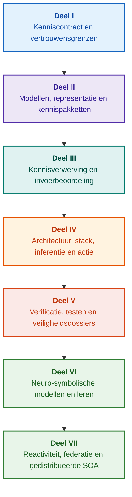

# Architectuur van op bewijs gebaseerde expertsystemen: van formele ontologieën tot neuro-symbolische AI

**Technisch handboek en monografie over ontwerp, wiskundige modellen, architectuur en verificatie van hoogwaardige intelligente systemen (Safety-Critical & Evidence-Grounded AI)**

**Auteur:** [Mykola Fedchyk](../../about-the-author.md) · [LinkedIn](https://www.linkedin.com/in/nickfedchik/)  
**Formaat:** Technische monografie / Handboek voor AI-systeemarchitecten  
**Jaar:** 2026  

---

## Over het boek

Deze monografie is een fundamenteel wetenschappelijk onderzoek en een technisch handboek gewijd aan het overbruggen van de centrale crisis in moderne kunstmatige intelligentie: de epistemische kloof tussen de probabilistische aannemelijkheid van neurale taalmodellen en de deterministische waarheid van formele bewijzen. Centraal staat de vraag: **hoe ontwerpt men een expertsysteem waarvan elke conclusie onweerlegbaar is, volledig herleidbaar tot primaire bronnen en certificeerbaar voor bedrijfskritische domeinen (ISO 26262, IEC 61508, DO-178C, ISO/SAE 21434)?**

De auteur introduceert en formaliseert een nieuw paradigma: **op bewijs gebaseerde neuro-symbolische AI (Evidence-Grounded Neuro-Symbolic AI)**. Statistische modellen (LLM/SLM) vervullen hierin een adviserende rol bij het genereren van hypothesen en projecties, terwijl een deterministische symbolische kern onwrikbaar garant staat voor logische consistentie, byte-verankering van feiten, autorisatiecontrole en veilige handelingsuitvoering.

### Van artefact naar verifieerbare beslissing

Systeemvereisten, broncode, testrapporten, wettelijke normen en ontwerpbeslissingen zijn reeds alomtegenwoordig in industriële omgevingen, maar functioneren veelal als gefragmenteerde artefacten zonder geformaliseerde semantiek en wederzijdse traceerbaarheid. Een geslaagd testrapport kan verwijzen naar een verouderde hardwarerevisie; een citaat uit een veiligheidsnorm kan uit zijn verband zijn gerukt; een geautomatiseerde noodrollback kan onbedoeld een ingetrokken component activeren.

Deze monografie biedt een integraal technisch traject: van de formalisering van technische artefacten als getypeerde gegevens en cryptografisch ondertekende kennispakketten tot symbolische inferentie, stapsgewijze plandecompositie, contrafactualiteit en audit van competentiegrenzen. De uiteenzetting wordt ondersteund door productieklare Go-implementaties met complete testsuites ([Hoofdstuk 1](../../ch01-introduction-to-expert-systems.md)), wiskundige contracten ([Deel II](../../part-02-knowledge-models.md)) en continue leerprotocollen zonder regressies ([Hoofdstuk 25](../../ch25-how-expert-systems-learn.md)).

### Doelgroep

Het werk richt zich op systeemarchitecten, hoofdingenieurs functionele veiligheid en betrouwbaarheid, ontwikkelaars van inferentiemotoren en kennisingenieurs. Voor het beheersen van de concepten volstaan basiskennis van eerste-orde predicatenlogica, versiebeheer en softwarelevenscycli; voor de implementaties zijn standaard Go-tools vereist. Gespecialiseerde hoofdstukken over Goal Structuring Notation (GSN), synergietheorie van complexe systemen, neuromorfe versnellers en GNSS-loze autonome navigatie openen toepassingsgebieden in de lucht- en ruimtevaart, autonome voertuigen en energienetwerken.

---

## Wetenschappelijke context en wereldwijde positionering van de monografie

De monografie benadert expertsystemen niet als een relict uit de jaren 80 (zoals CLIPS of MYCIN), maar als de voorhoede van **derde-golf neuro-symbolische AI gebaseerd op bewijs (Third-Wave NeSy)**. Het werk slaat een brug tussen internationale academische theorieën en hoogwaardige systeemtechniek:

| Wetenschappelijk domein | Belangrijke werken en auteurs | Conceptuele brug in het boek |
|---|---|---|
| **Neuro-symbolische AI van de 3e golf (NeSy)** | Artur d'Avila Garcez, Luis C. Lamb (*Neurosymbolic AI: The 3rd Wave*, 2023; *Neural-Symbolic Cognitive Reasoning*, Springer, 2009); Henry Kautz (*The Third AI Summer*, AAAI 2022) | Functiescheiding: statistische modellen (SLM/LLM) genereren vraaghypothesen, terwijl een deterministische symbolische kern feiten formeel verifieert en toelaat ([Hoofdstuk 29](../../ch29-neuro-symbolic-architecture.md)). |
| **Semantische begrenzingen en veilig leren** | Guy Van den Broeck et al. (*A Semantic Loss Function for Deep Learning with Symbolic Knowledge*, ICML 2018); Luc De Raedt et al. (*DeepProbLog*, IJCAI 2020) | Toelatings- en uitgangsgateways, deterministische semantische filtering van neurale voorstellen tegen formale schema's ([Hoofdstukken 28](../../ch28-dual-mode-expert-systems.md), [33](../../ch33-inter-system-knowledge-exchange-and-model-teaching.md)). |
| **Herroepbaar redeneren en argumentatietheorie** | John L. Pollock (*Defeasible Reasoning*, 1987; *Cognitive Carpentry*, MIT Press, 1995); Phan Minh Dung (*Abstract Argumentation Frameworks*, AIJ 1995); Douglas Walton (*Argumentation Schemes*, Cambridge, 2008) | Uitsplitsing van kennis in claims, herkomst en ontkrachtende omstandigheden (*rebutting* en *undercutting defeaters*); normconflictoplossing via Dung-frameworks ([Hoofdstukken 2](../../ch02-epistemology-of-machine-knowledge.md), [27](../../ch27-safety-case-gsn-synthesis.md)). |
| **Automatische associatieregelwinning (KBC)** | Luis Galárraga, Fabian M. Suchanek et al. (*AMIE: Association Rule Mining under Incomplete Evidence*, WWW 2013, VLDBJ 2015); Stephen Muggleton (*Inductive Logic Programming*, 1994) | Regelinductie in kennisbases onder de aanname van partiële volledigheid (PCA) zonder foutieve open-wereld tegenvoorbeelden ([Hoofdstuk 34](../../ch34-deterministic-relational-analysis-abduction-and-socratic-dialogue.md)). |
| **Formele veiligheidsschilden en certificering (Safe AI)** | Bettina Könighofer, Roderick Bloem et al. (*Shield Synthesis*, 2017); Tim Kelly, Rob Weaver (*Goal Structuring Notation*, York, 2004); André Platzer (*Logical Foundations of CPS*, Springer, 2018) | Synthese van veiligheidsargumenten in GSN-notatie voor ISO 26262/21434; formele schilden en numerieke geldigheidsenveloppen voor actuatoren ([Hoofdstukken 27](../../ch27-safety-case-gsn-synthesis.md), [30](../../ch30-safety-cybersecurity-co-engineering.md), [33](../../ch33-inter-system-knowledge-exchange-and-model-teaching.md)). |
| **Epistemische logica en kennissemiotiek** | John F. Sowa (*Knowledge Representation: Logical, Philosophical, and Computational Foundations*, 2000); Frank van Harmelen et al. (*Handbook of Knowledge Representation*, Elsevier, 2008) | Peirces epistemische triade (Begrip → Oordeel → Gevolgtrekking); abductieve hypothesevorming onder strikte deductieve controle ([Hoofdstukken 6](../../ch06-applied-mathematics-for-expert-systems.md), [34](../../ch34-deterministic-relational-analysis-abduction-and-socratic-dialogue.md)). |
| **Cybernetica en synergetica van complexe systemen** | Norbert Wiener (*Cybernetics*, 1948); W. Ross Ashby (*An Introduction to Cybernetics*, 1956); Hermann Haken (*Synergetics: An Introduction*, 1977; *Advanced Synergetics*, 1983); Ilya Prigogine (*Order out of Chaos*, 1984) | Ashbys wet van de vereiste variëteit, gesloten L0–L4 regelkringen, faseruimtereductie naar ordeparameters via Hakens slavernijprincipe, vroegtijdige CSD-detectie en dissipatieve stabilisatie ([Hoofdstukken 6](../../ch06-applied-mathematics-for-expert-systems.md), [22](../../ch22-cybernetics-edge-to-backend.md), [35](../../ch35-self-organizing-expert-systems-synergetics-and-npu-runtime.md)). |
| **Kennistesten, invariantie en Lipschitz-kalibratie** | Kent Beck (*TDD*, 2002); Martin Fowler (*Refactoring*, 2018); Clark Barrett, Leonardo de Moura (*Z3 SMT Solver*, 2008); Chuan Guo et al. (*On Calibration of Modern Neural Networks*, ICML 2017); Marco Tulio Ribeiro et al. (*CheckList*, ACL 2020); John L. Pollock (*Defeasible Reasoning*, 1987) | Kennis-testpiramide met vier niveaus (KTP): geïsoleerde unittests van atomen (KUT) met mocken van premissen (`PremiseMock`), blokkeren van vacuous truth, grenswaarde-analyse, regeltralieën (KIT), semantische invariantiescore ($\text{SIS} \ge 0{,}98$) en Lipschitz-continuïteit ($L_{\mathcal{K}} \le L_{\max}$) tegen relaisdender ([Hoofdstuk 36](../../ch36-knowledge-testing-pyramid-and-variational-calibration.md)). |

---

## Theoretische modellen van de auteur, wetenschappelijk onderzoek en engineering-innovaties

De monografie integreert het fundamentele onderzoek en de industriële praktijk van de auteur in veiligheidskritieke software en betrouwbare AI:

### 1. Fundamentele theoretische ontwikkelingen en wiskundige formalismen

1. **Invariant van bewijsbaarheid op byteniveau (EGI) en feitentoelatingsgateway ([Hoofdstukken 2](../../ch02-epistemology-of-machine-knowledge.md), [19](../../ch19-from-question-to-evidence.md), [28](../../ch28-dual-mode-expert-systems.md), [29](../../ch29-neuro-symbolic-architecture.md)):**
   * *Theoretisch concept:* De auteur formaliseert de verankeringsvolledigheids-invariant $\mathrm{Comp}(C) = 1{,}00$: geen enkele uitspraak verkrijgt de status van feit zonder deterministische projectie op primaire bronnen. Elk feit wordt beveiligd door een cryptografisch tuple: onveranderlijke byte-coördinaten `[byte_start, byte_end]`, citaathash `quote_sha256` en PROV-O-herkomstcertificaat.
   * *Industriële betekenis:* De byte-toelatingsgateway voorkomt dat neurale hallucinaties binnendringen in de geversioneerde kennisbasis ($ZHR = 1{,}00$).
2. **Kennis-testpiramide (KTP) en Lipschitz-stabiliteit van de logische ruimte ([Hoofdstuk 36](../../ch36-knowledge-testing-pyramid-and-variational-calibration.md)):**
   * *Theoretisch concept:* Transpositie van Fowlers testpiramide naar kennissystemen: geïsoleerde regeltests (KUT) met premisse-mocks (`PremiseMock`), integratietests van regels en defeaters (KIT), en variationele kalibratie (KVT).
   * *Wiskundig apparaat:* Invariant tegen vacuous truth ($P \to Q$ bij $P \equiv \text{False}$), semantische invariantiescore ($\mathrm{SIS} \ge 0{,}98$) en Lipschitz-begrenzing ($L_{\mathcal{K}} \le L_{\max}$), die dendergedrag bij invoervariaties mathematisch uitsluit.
3. **Popperiaanse falsificatie van deontische normen en actieve compliance-auditor ([Hoofdstuk 39](../../ch39-active-compliance-auditor-and-popperian-testing.md)):**
   * *Theoretisch concept:* Overgang van een passief orakel naar een actieve compliance-auditor gebaseerd op Karl Poppers falsificatiebeginsel. Het systeem toetst specificatieruimten (ASPICE 4.0, ISO 26262, ISO/SAE 21434), synthetiseert tegenvoorbeelden en ontwerpt testprogramma's.
   * *Praktische waarde:* Combinatie van neurale randscenario-generatie (Systeem 1) met deterministische deontische verificatie (Systeem 2) met bescherming van menselijke beslissers tegen goedkeuringsmoeheid.
4. **Synergetische dimensiereductie van de kennisbasis en CSD-diagnostiek ([Hoofdstukken 6](../../ch06-applied-mathematics-for-expert-systems.md), [22](../../ch22-cybernetics-edge-to-backend.md), [35](../../ch35-self-organizing-expert-systems-synergetics-and-npu-runtime.md)):**
   * *Theoretisch concept:* Toepassing van Hakens synergetica (ordeparameters en slavernijbeginsel) en Prigogines dissipatieve structuren op kennissystemen.
   * *Wetenschappelijk resultaat:* Reductie van hoogdimensionale telemetrieruimten en integratie van een Critical Slowing Down (CSD) detector voor vroegtijdige instabiliteitswaarschuwing.
5. **Actie-autonomieniveaus (A0–A4), toelatingsgateway en idempotente saga's ([Hoofdstuk 21](../../ch21-from-recommendation-to-action.md)):**
   * *Theoretisch concept:* Discrete bevoegdheidsschaal (van A0: passieve analyse tot A4: autonome nooduitschakeling), toegekend aan het tuple $\langle\text{actie}, \text{omgeving}, \text{risiconiveau}\rangle$.
   * *Wiskundig apparaat:* Idempotentie-invariant $f(f(x, k), k) \equiv f(x, k)$ via sleutel $k$ en gedistribueerde compenserende saga's die de status `OutcomeUnknown` opvangen.
6. **Formele co-engineering van functionele veiligheid en cybersecurity in GSN ([Hoofdstukken 27](../../ch27-safety-case-gsn-synthesis.md), [30](../../ch30-safety-cybersecurity-co-engineering.md)):**
   * *Theoretisch concept:* Geïntegreerde synthese van GSN-veiligheidsbomen ter gelijktijdige naleving van ISO 26262 (safety) en ISO/SAE 21434 (security).
   * *Doorbraak:* Mathematische afweging tussen tegenstrijdige eisen (reactietijd vs. cryptografische diepgang) en selectieve bewijsopenbaring via Merkle-bomen met salt.
7. **Verificatieprotocol voor verklaringsgetrouwheid en semantische consistentie ([Hoofdstuk 20](../../ch20-explanation-engine.md)):**
   * *Theoretisch concept:* Een verklaring wordt behandeld als een deterministisch artefact afgeleid van de bewijsgraaf, regelversies en vastgelegde feiten.
   * *Wiskundig apparaat:* Metrische gateway ($C_{\text{facts}} = 1{,}00, H_{\text{free}} = 1{,}00$) met automatische fail-safe terugval naar een sjabloon bij de geringste afwijking.

---

### 2. Empirisch onderzoek, eigen testopstellingen en systeemtechniek

1. **Onveranderlijke binaire kennispakketten met `mmap` en zero-allocation ([Hoofdstuk 32](../../ch32-high-performance-knowledge-packs-mmap-and-harvesting.md)):**
   * *Innovatie:* Tweelagige architectuur (canonieke bronnenlaag + gematerialiseerde indexlaag).
   * *Empirisch resultaat:* Direct geheugenmappen via `mmap`, zero-heap-allocatie en sublineaire opstarttijd ongeacht gigabyte-ontologieën.
2. **Empirische kalibratie op normatieve corpora IETF RFC-1000 en W3C-150 ([Hoofdstukken 2](../../ch02-epistemology-of-machine-knowledge.md), [4](../../ch04-evolution-from-bayes-to-evidence-ai.md), [14](../../ch14-requirements-detection-and-formalization.md), [25](../../ch25-how-expert-systems-learn.md)):**
   * *Testopstelling:* Evaluatie op 1.000 actieve IETF RFC-specificaties en 150 diagnostische W3C-scenario's (inclusief geïnduceerde contradicties).
   * *Praktisch resultaat:* Objectieve examenmatrices, identificatie van normconflicten en wiskundig bewezen regressiebescherming.
3. **Multi-hop relationele analyse, symbolische abductie en socratische dialoog ([Hoofdstuk 34](../../ch34-deterministic-relational-analysis-abduction-and-socratic-dialogue.md)):**
   * *Ontwikkeling:* Bidirectioneel begrensd BFS-algoritme ($k \le 6$) met cycluspreventie en synthese van byte-bewijsketens.
   * *Voordeel:* Uitvoering van Peirces abductie onder deductieve controle en getypeerde socratische verhelderingskaders (*Clarification Frames*).
4. **Formele veiligheidsschilden en numerieke geldigheidscorridors voor edge-besturing ([Hoofdstuk 33](../../ch33-inter-system-knowledge-exchange-and-model-teaching.md), [Bijlagen B](../../appendix-b-robotics-and-cyber-physical-systems.md), [C](../../appendix-c-autonomous-navigation-and-geosearch.md), [E](../../appendix-e-mixed-signal-neuromorphic-expert-systems.md)):**
   * *Innovatie:* Vertaling van discrete logische invarianten naar continue veiligheidscorridors voor DSP's en GNSS-loze navigatie.
   * *Betrouwbaarheid:* Cryptografisch ondertekende regeluitwisseling via Ed25519 en hardwarematige interceptie van ongeldige stuurcommando's.
5. **Bescherming tegen datalekken via verklaringen en differentiële audits ([Hoofdstuk 20](../../ch20-explanation-engine.md)):**
   * *Ontwikkeling:* Reductieprotocol voor verklaringsrepresentatie ($\mathrm{EIR}_{\text{redacted}}$) met ACL-validatie op elke knoop en boog van de bewijsgraaf.

---

## Structureringsprincipe

De delen van de monografie zijn geordend naar primaire engineering-doelstellingen en niet naar chronologie of technologiemerken. Elk hoofdstuk behoort tot één hoofdonderdeel. Hoofdstuknummers en bestandsnamen vormen stabiele identificatoren.

| Sectieklasse | Vraag van de lezer | Architecturale functie in het hoofdstuk |
|---|---|---|
| Probleem & Reikwijdte | Welk specifiek probleem moet worden opgelost? | Kernvraag en geldigheidsdomein afbakenen |
| Object & Model | Welke gegevens, kennis of toestanden worden behandeld? | Begrippen, types en aannames formaliseren |
| Methode & Procedure | Hoe wordt de deductie gerealiseerd? | Algoritmen voor deductie en regeling toelichten |
| Implementatie & Gereedschap | Met welke middelen wordt de procedure uitgevoerd? | Concrete softwarematige en hardwarematige oplossingen tonen |
| Verificatie & Benchmark | Hoe worden fouten systematisch blootgelegd? | Resultaten afzetten tegen onafhankelijke criteria |
| Conclusie & Beperkingen | Wat is bewezen en wat blijft open? | Kernvraag beantwoorden zonder onbewezen beloften |

De redactionele review (editorial-structure-review.md) bevat de thematische evaluatie van alle hoofdstukken.

## Leesroutes

**Eerste softwareverificatie:** [1](../../ch01-introduction-to-expert-systems.md) → [7](../../ch07-knowledge-base-typology.md) → [8](../../ch08-engineering-artifacts-as-data.md) → [17](../../ch17-implementation-stack.md) → [23](../../ch23-knowledge-base-verification.md) → [25](../../ch25-how-expert-systems-learn.md). Doel: Reproduceerbaar oordeel op basis van bewijs met negatieve tests en gecontroleerde kennismutatie.

**Kennistechnologie:** [Deel II](../../part-02-knowledge-models.md) → [Deel III](../../part-03-knowledge-engineering-nlp.md) → [19](../../ch19-from-question-to-evidence.md) → [20](../../ch20-explanation-engine.md) → [26](../../ch26-continual-learning.md). Doel: Afstemmen van semantiek, herkomst, acquisitie en kandidaatvalidatie.

**Oplossingsarchitectuur:** [16](../../ch16-expert-systems-architecture.md) → [19](../../ch19-from-question-to-evidence.md) → [31](../../ch31-syllogistic-reasoning-and-relation-lattices.md) → [20](../../ch20-explanation-engine.md) → [21](../../ch21-from-recommendation-to-action.md). Doel: Ontkoppelen van bewijstoetsing, normtoepassing, uitleg en actiebevoegdheden.

**Verificatie en veiligheid:** [23](../../ch23-knowledge-base-verification.md) → [36](../../ch36-knowledge-testing-pyramid-and-variational-calibration.md) → [25](../../ch25-how-expert-systems-learn.md) → [26](../../ch26-continual-learning.md) → [27](../../ch27-safety-case-gsn-synthesis.md) → [30](../../ch30-safety-cybersecurity-co-engineering.md). Fysieke systeemanalyse via [Hoofdstuk 24](../../ch24-system-diagnosis.md).

**Hybride systemen en exploitatie:** [Deel VI](../../part-06-frontiers-neuro-symbolic.md) → [Deel VII](../../part-07-runtime-and-knowledge-exchange.md) → [40](../../ch40-distributed-epistemic-architectures-soa-and-cluster-scaling.md) en bijlagen. Doel: Integreren van taalmodellen, beheren van kennislacunes en schalen van gedistribueerde SOA's.

---

## Grenzen van garanties

Dit werk vormt onderzoeks- en studiemateriaal en geldt niet als een gecertificeerde conformiteitsprocedure. Deterministische uitvoering garandeert niet de empirische waarheid van premissen; cryptografische hashes bewijzen integriteit, geen materiële juistheid; argumentatiegrafen vervangen het oordeel van bevoegde ingenieurs niet.

Automatische datawinning vermindert handmatige invoer maar vervangt formele modellering en collegiale toetsing niet. Wiskundige garanties gelden binnen de expliciete modelaannames. Beslissingen over ingebruikname en risicoacceptatie blijven voorbehouden aan bevoegde ingenieurs.

---

## Structuur van het boek

De monografie omvat zeven thematische delen, 40 hoofdstukken en vijf bijlagen:

---

### [Deel I. Conceptuele en epistemische grondslagen](../../part-01-foundations.md)

*Wanneer een expertsysteem vereist is, wat als machinekennis geldt en behoud van besluitmotiveringen.*

* [Hoofdstuk 1. Inleiding tot expertsystemen: van chaos naar beheersbare kennis](../../ch01-introduction-to-expert-systems.md)
* [Hoofdstuk 2. Filosofie voor ingenieurs: wat een machine kennis mag noemen](../../ch02-epistemology-of-machine-knowledge.md)
* [Hoofdstuk 3. Het onderscheid tussen expertsystemen en naslagsystemen](../../ch03-beyond-reference-information-systems.md)
* [Hoofdstuk 4. Evolutie van expertsystemen: van de stelling van Bayes naar AI gebaseerd op bewijs](../../ch04-evolution-from-bayes-to-evidence-ai.md)
* [Hoofdstuk 5. De triade van vertrouwen: expertsysteem, bewijsbare aanbeveling en bedrijfsgeheugen](../../ch05-triad-of-trust-and-corporate-memory.md)

---

### [Deel II. Wiskundige modellen, representatie en opslag van kennis](../../part-02-knowledge-models.md)

*Wiskundige formalismen, getypeerde artefacten, traceerbaarheidsgrafen en onveranderlijke kennispakketten.*

* [Hoofdstuk 6. Toegepaste wiskunde voor expertsystemen: regels, kansen, grafen en causaliteit](../../ch06-applied-mathematics-for-expert-systems.md)
* [Hoofdstuk 7. Typologie van kennisbases: regels, ontologieën, casussen en vectoren](../../ch07-knowledge-base-typology.md)
* [Hoofdstuk 8. Technische artefacten als gegevens voor het expertsysteem](../../ch08-engineering-artifacts-as-data.md)
* [Hoofdstuk 9. Technische kennisgraaf: traceerbaarheid van specificaties tot silicium](../../ch09-engineering-knowledge-graph-traceability.md)
* [Hoofdstuk 32. Onveranderlijke kennispakketten: bytetoezending, indices en memory-mapping](../../ch32-high-performance-knowledge-packs-mmap-and-harvesting.md)

---

### [Deel III. Kennisverwerving, taalanalyse en invoerbeoordeling](../../part-03-knowledge-engineering-nlp.md)

*Documenten, domeinexpertise en metingen: kandidaatextractie, parsing en bewijswaardering.*

* [Hoofdstuk 10. Kennisverwervingssystemen: bronnen, toelatingsgateways en levenscycli](../../ch10-knowledge-acquisition-systems.md)
* [Hoofdstuk 11. Kennisextractie bij domeinexperts: interviews, cognitieve kaarten en formalisering van praktijkkennis](../../ch11-knowledge-elicitation-from-experts.md)
* [Hoofdstuk 12. Linguïstische analyse en lokale modellen: behoud van semantiek en bronattributie](../../ch12-linguistic-analysis-and-local-models.md)
* [Hoofdstuk 13. Natuurlijke taalvariabiliteit versus determinisme: compileren van de vraagbedoeling](../../ch13-language-variability-vs-determinism.md)
* [Hoofdstuk 14. Detectie van eisen en modaliteiten: van normatieve tekst naar formele invarianten](../../ch14-requirements-detection-and-formalization.md)
* [Hoofdstuk 15. Kennisextractie en opbouw van de kennisbasis: feiten, grammatica's en automaten](../../ch15-knowledge-extraction-and-kb-construction.md)
* [Hoofdstuk 37. Beoordeling van invoerinformatie: bronnen, bewijskracht en algoritmische scepsis](../../ch37-input-information-assessment-and-algorithmic-skepticism.md)

---

### [Deel IV. Architectuur, technologie-stack, inferentie en handeling](../../part-04-architecture-and-inference.md)

*Architectuurcontracten, runtime-stack, hardwareversnelling, normatieve inferentie, verklaringsmotoren en regelkringen.*

* [Hoofdstuk 16. Architectuur van het expertsysteem: van geformaliseerde kennis naar handeling gebaseerd op bewijs](../../ch16-expert-systems-architecture.md)
* [Hoofdstuk 17. De technologie-stack: selectiecriteria voor gereedschappen, programmeertalen en regelmotoren](../../ch17-implementation-stack.md)
* [Hoofdstuk 18. Executie-infrastructuur: lokale SLM's, hardwareversnellers, Edge en On-Premise](../../ch18-execution-infrastructure.md)
* [Hoofdstuk 19. Van vraag naar bewijs: zoeken, koppelen en verifiëren van stellingen](../../ch19-from-question-to-evidence.md)
* [Hoofdstuk 31. Normatieve inferentie: predicaathierarchieën, uitzonderingen en temporele geldigheid](../../ch31-syllogistic-reasoning-and-relation-lattices.md)
* [Hoofdstuk 20. Verklaringsmotor: beslissingen, gemotiveerde weigering en competentiegrenzen](../../ch20-explanation-engine.md)
* [Hoofdstuk 21. Van aanbeveling naar actie: autorisatiecontrole en veilige uitvoering](../../ch21-from-recommendation-to-action.md)
* [Hoofdstuk 22. De cybernetische regelkring: sensoren, actuatoren en gesloten terugkoppeling](../../ch22-cybernetics-edge-to-backend.md)

---

### [Deel V. Verificatie, testen, diagnostiek en veiligheidsdossiers](../../part-05-verification-and-learning.md)

*Formele regelverificatie, kennis-testpiramide, Popperiaanse falsificatie en GSN-veiligheidsargumentatie.*

* [Hoofdstuk 23. Verificatie van de kennisbasis: consistentie, volledigheid en regelrobuustheid](../../ch23-knowledge-base-verification.md)
* [Hoofdstuk 36. De kennis-testpiramide: regels, interacties en variationele stabiliteit](../../ch36-knowledge-testing-pyramid-and-variational-calibration.md)
* [Hoofdstuk 39. De actieve compliance-auditor: Popperiaanse falsificatie, normering (ASPICE/ISO 26262/ISO 21434) en testontwerp](../../ch39-active-compliance-auditor-and-popperian-testing.md)
* [Hoofdstuk 24. Technische diagnostiek: symptomen en grondoorzaken scheiden bij onvolledige informatie](../../ch24-system-diagnosis.md)
* [Hoofdstuk 27. Veiligheidsdossiers: formele synthese en verificatie van GSN-argumenten](../../ch27-safety-case-gsn-synthesis.md)
* [Hoofdstuk 30. Co-engineering van functionele veiligheid en cybersecurity](../../ch30-safety-cybersecurity-co-engineering.md)

---

### [Deel VI. Neuro-symbolische modellen, cognitieve grenzen en continu leren](../../part-06-frontiers-neuro-symbolic.md)

*Strikte deductie vs. adviserende hypothesen, taalmodelintegratie, hallucinatiebeheersing en ervaringsleren.*

* [Hoofdstuk 28. Bimodale expertsystemen: strikte deductie en adviserende hypothese](../../ch28-dual-mode-expert-systems.md)
* [Hoofdstuk 29. Neuro-symbolische architectuur: taalmodellen en verificatie op basis van bewijs](../../ch29-neuro-symbolic-architecture.md)
* [Hoofdstuk 34. Kennislacunes: relationeel zoeken, abductie en verhelderende dialoog](../../ch34-deterministic-relational-analysis-abduction-and-socratic-dialogue.md)
* [Hoofdstuk 38. Bestrijding van machinehallucinaties en kennistekorten: controle gebaseerd op bewijs](../../ch38-curing-machine-hallucinations-and-knowledge-deficits.md)
* [Hoofdstuk 25. Hoe expertsystemen leren: examenmatrices, kennisaudits en regressiecontrole](../../ch25-how-expert-systems-learn.md)
* [Hoofdstuk 26. Continu leren (Continual Learning) uit ervaring en beheersing van logdrift](../../ch26-continual-learning.md)

---

### [Deel VII. Reactieve executie, kennisuitwisseling en gedistribueerde SOA](../../part-07-runtime-and-knowledge-exchange.md)

*Reactieve regeluitvoering, synergetica, systeemfederaties en gedistribueerde enterprise-architecturen.*

* [Hoofdstuk 35. Reactieve expertsystemen: gebeurtenissen, intrekking en zelforganisatie van kennis](../../ch35-self-organizing-expert-systems-synergetics-and-npu-runtime.md)
* [Hoofdstuk 33. Kennisuitwisseling tussen systemen: regelbevoorrading, modeltraining en veilige terugkoppeling](../../ch33-inter-system-knowledge-exchange-and-model-teaching.md)
* [Hoofdstuk 40. Gedistribueerde epistemische architectuur: Knowledge SOA, semantische routering en multi-source arbitrage](../../ch40-distributed-epistemic-architectures-soa-and-cluster-scaling.md)

---

### Bijlagen

* [Bijlage A. Praktisch onderzoekskader voor projecten met bewijsvoering in complexe engineering](../../appendix-a-evidence-governed-framework.md)
* [Bijlage B. Expertsystemen gebaseerd op bewijs in autonome robotica en cyber-fysieke systemen](../../appendix-b-robotics-and-cyber-physical-systems.md)
* [Bijlage C. Autonome navigatie zonder GNSS: geospatiale correlatie (TRN/DSMAC), visuele odometrie (VIO) en sensorfusie](../../appendix-c-autonomous-navigation-and-geosearch.md)
* [Bijlage D. Analoge expertsystemen, neuromorfe berekeningen en hardware-inferentie](../../appendix-d-analog-expert-systems-and-neuromorphic-computing.md)
* [Bijlage E. Gemengd analoog-digitale expertsystemen onder controle van bewijs](../../appendix-e-mixed-signal-neuromorphic-expert-systems.md)
* [Over de auteur: Mykola Fedchyk (Nick Fedchik)](../../about-the-author.md)

---

## Onderzoeksrichtingen

Toekomstige onderzoeksrichtingen betreffen: reproduceerbare zero-allocation kennispakketten; verificatie van begrensde formele fragmenten; agentbesturing via expliciete autorisatiecontracten; zero-knowledge verificatie (ZKP); en gecontroleerde intrekking en machine unlearning. Eigenschapsbewijzen op modellen valideren niet automatisch het fysieke apparaat.

Voor hardwareversnellers moeten foutpercentages, latentie en faalgedrag vooraf worden gekwantificeerd ([Hoofdstukken 29](../../ch29-neuro-symbolic-architecture.md), [32](../../ch32-high-performance-knowledge-packs-mmap-and-harvesting.md), [Bijlagen D](../../appendix-d-analog-expert-systems-and-neuromorphic-computing.md) en [E](../../appendix-e-mixed-signal-neuromorphic-expert-systems.md)). Het empirische onderzoeksprogramma voor hoofdstukken 7–11 staat in [Deel II](../../part-02-knowledge-models.md).
