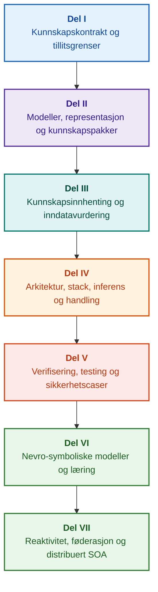

# Arkitektur for bevisstyrte ekspertsystemer: Fra formelle ontologier til nevro-symbolsk AI

**Ingeniørmonografi og oppslagsverk for design, matematiske fundamenter, arkitektur og verifisering av høyintegritets intelligente systemer (Safety-Critical & Evidence-Grounded AI)**

**Forfatter:** [Mykola Fedchyk](../en/about-the-author.md) · [LinkedIn](https://www.linkedin.com/in/nickfedchik/)  
**Format:** Ingeniørmonografi / Håndbok for AI-arkitekter  
**År:** 2026  

---

## Om boken

Denne monografien utgjør et fundamentalt forskningsarbeid og en ingeniørveiledning dedikert til å overvinne den moderne kunstige intelligensens fremste krise: det epistemiske gapet mellom den probabilistiske plausibiliteten i nevrale nettverksgenereringer og den deterministiske sannheten i formelle matematiske bevis. I kjernen av denne forskningen ligger et kompromissløst spørsmål: **hvordan kan vi designe et ekspertsystem der enhver konklusjon er ugjendrivelig, fullt ut sporbar til primære beviskilder og sertifiserbar i sikkerhetskritiske ingeniørdomener (ISO 26262, IEC 61508, DO-178C, ISO/SAE 21434)?**

Forfatteren begrunner og etablerer et nytt paradigme: **Bevisforankret nevro-symbolsk AI (Evidence-Grounded Neuro-Symbolic AI)**, der statistiske modeller (LLM/SLM) fyller en rådgivende funksjon for hypotesegenerering og projeksjonsrendering, mens en deterministisk symbolsk kjerne uforanderlig garanterer invariantene for logisk konsistens, byte-nivå forankring av fakta, håndheving av autoritetsgrenser og sikker overgang til handling.

### Fra artefakt til verifiserbar beslutning

Systemkrav, kildekode, logger fra testkjøringer, regulatoriske standarder og ingeniørbeslutninger gjennomsyrer dagens moderne produksjonsmiljøer. De fungerer imidlertid i overveiende grad som frakoblede artefakter uten formalisert semantikk, eksplisitte gyldighetsgrenser og toveis sporbarhet. En godkjent kvalifiseringstestrapport kan referere til en utdatert maskinvarerevisjon; et sitat fra en funksjonell sikkerhetsstandard kan være revet ut av kontekst; en automatisert nødreversering av en konfigurasjon kan utilsiktet aktivere en tilbakekalt komponent.

Denne monografien etablerer en helhetlig ingeniørpipeline: fra formalisering av ingeniørgjenstander som typede data og kryptografisk signerte kunnskapspakker til symbolsk inferens, trinnvis plandekomponering, kontrafaktiske forklaringer og revisjon av kompetansegrenser. Den praktiske fremstillingen er forankret i produksjonsklare Go-implementasjoner med uttømmende testsuiter ([Kapittel 1](../en/ch01-introduction-to-expert-systems.md)), strenge matematiske kontrakter ([Del II](../en/part-02-knowledge-models.md)) og kontinuerlige læringsprotokoller som beviselig eliminerer regresjoner ([Kapittel 25](../en/ch25-how-expert-systems-learn.md)).

### Målgruppe

Boken er skrevet for systemarkitekter, sjefsingeniører innen pålitelighet og funksjonell sikkerhet, utviklere av inferensmotorer og kunnskapsingeniører. Grunnleggende tilegnelse av kjernekonseptene krever kun basisforståelse av førsteordens predikatlogikk, programvareversjonering og livssyklusstyring; å gjenskape de praktiske eksemplene krever standard Go-verktøy. Spesialiserte kapitler som dekker formell Goal Structuring Notation (GSN)-syntese, komplekse reformers synergetikk, nevromorfe akseleratorer og autonom navigasjon uten GNSS utforsker frontlinjene for bevisstyrt AI innen luft- og romfart, autonome kjøretøy og kritisk infrastruktur.

---

## Vitenskapelig kontekst og monografiens globale plassering

Monografien tilnærmer seg ikke ekspertsystemer som en arkaisk arv fra 1980-tallets regelbaserte systemer (som CLIPS eller MYCIN), men som spydspissen for **Tredje bølges bevisforankrede nevro-symbolske AI (Third-Wave Evidence-Grounded Neuro-Symbolic AI)**. Metodikken forener det teoretiske fundamentet fra ledende globale forskningsmiljøer med høytytende systemteknikk:

| Vitenskapelig disiplin | Viktige globale verker og forfattere | Konseptuell bro i denne monografien |
|---|---|---|
| **Tredje bølges nevro-symbolsk AI (NeSy)** | Artur d'Avila Garcez, Luis C. Lamb (*Neurosymbolic AI: The 3rd Wave*, 2023; *Neural-Symbolic Cognitive Reasoning*, Springer, 2009); Henry Kautz (*The Third AI Summer*, AAAI 2022) | Ansvarsfordeling: statistiske modeller (SLM/LLM) genererer spørrehypoteser, mens en deterministisk symbolsk kjerne formelt verifiserer og godkjenner fakta ([Kapittel 29](../en/ch29-neuro-symbolic-architecture.md)). |
| **Semantiske restriksjoner og sikker læring** | Guy Van den Broeck et al. (*A Semantic Loss Function for Deep Learning with Symbolic Knowledge*, ICML 2018); Luc De Raedt et al. (*DeepProbLog*, IJCAI 2020) | Inngangs- og utgangsporter, deterministisk semantisk filtrering av kandidatpåstander fra nevrale nettverk mot formelle skjemaer ([Kapitlene 28](../en/ch28-dual-mode-expert-systems.md), [33](../en/ch33-inter-system-knowledge-exchange-and-model-teaching.md)). |
| **Omstøtelig resonnering og argumentasjonsteori** | John L. Pollock (*Defeasible Reasoning*, 1987; *Cognitive Carpentry*, MIT Press, 1995); Phan Minh Dung (*Abstract Argumentation Frameworks*, AIJ 1995); Douglas Walton (*Argumentation Schemes*, Cambridge, 2008) | Dekomponering av kunnskap i påstander, opprinnelse og omstøtere (*defeaters*: *rebutting* og *undercutting*); konfliktløsning i normative regelbaser via Dungs argumentasjonsrammeverk ([Kapitlene 2](../en/ch02-epistemology-of-machine-knowledge.md), [27](../en/ch27-safety-case-gsn-synthesis.md)). |
| **Automatisert utvinning av assosiasjonsregler (KBC)** | Luis Galárraga, Fabian M. Suchanek et al. (*AMIE: Association Rule Mining under Incomplete Evidence*, WWW 2013, VLDBJ 2015); Stephen Muggleton (*Inductive Logic Programming*, 1994) | Autonom regelinduksjon fra kunnskapsbaser under antakelsen om delvis fullstendighet (PCA), som forhindrer falske moteksempler i en åpen verden ([Kapittel 34](../en/ch34-deterministic-relational-analysis-abduction-and-socratic-dialogue.md)). |
| **Formelle sikkerhetsskjold og sertifisering (Safe AI)** | Bettina Könighofer, Roderick Bloem et al. (*Shield Synthesis*, 2017); Tim Kelly, Rob Weaver (*Goal Structuring Notation*, York, 2004); André Platzer (*Logical Foundations of CPS*, Springer, 2018) | Syntese av strukturerte sikkerhetscaser i GSN-notasjon for ISO 26262/21434-standarder; formelle skjold og numeriske gyldighetskonvolutter for aktuatorer i kanten ([Kapitlene 27](../en/ch27-safety-case-gsn-synthesis.md), [30](../en/ch30-safety-cybersecurity-co-engineering.md), [33](../en/ch33-inter-system-knowledge-exchange-and-model-teaching.md)). |
| **Epistemisk logikk og kunnskapssemiotikk** | John F. Sowa (*Knowledge Representation: Logical, Philosophical, and Computational Foundations*, 2000); Frank van Harmelen et al. (*Handbook of Knowledge Representation*, Elsevier, 2008) | Charles Sanders Peirces epistemiske triade (Begrep → Dom → Slutning); abduktiv generering av arbeidshypoteser under streng deduktiv kontroll ([Kapitlene 6](../en/ch06-applied-mathematics-for-expert-systems.md), [34](../en/ch34-deterministic-relational-analysis-abduction-and-socratic-dialogue.md)). |
| **Kybernetikk og synergetikk for komplekse systemer** | Norbert Wiener (*Cybernetics*, 1948); W. Ross Ashby (*An Introduction to Cybernetics*, 1956); Hermann Haken (*Synergetics: An Introduction*, 1977; *Advanced Synergetics*, 1983); Ilya Prigogine (*Order out of Chaos*, 1984) | Ashbys lov om nødvendig variasjon, lukkede kontrollsløyfer L0–L4, faseromsreduksjon til ordensparametre via Hakens slaveprinsipp, tidlig varsling om faseoverganger gjennom kritisk retardasjon (CSD) og dissipativ stabilisering av kunnskapsbaser ([Kapitlene 6](../en/ch06-applied-mathematics-for-expert-systems.md), [22](../en/ch22-cybernetics-edge-to-backend.md), [35](../en/ch35-self-organizing-expert-systems-synergetics-and-npu-runtime.md)). |
| **Kunnskapstesting, invarians og Lipschitz-kalibrering** | Kent Beck (*TDD*, 2002); Martin Fowler (*Refactoring*, 2018); Clark Barrett, Leonardo de Moura (*Z3 SMT Solver*, 2008); Chuan Guo et al. (*On Calibration of Modern Neural Networks*, ICML 2017); Marco Tulio Ribeiro et al. (*CheckList*, ACL 2020); John L. Pollock (*Defeasible Reasoning*, 1987) | Fire-nivås kunnskapstestpyramide (KTP): isolert enhetstesting av atomære regler (KUT) med simulerte premisser (`PremiseMock`), eliminering av fellen med tom sannhet, 6-punkts spektral grenseverdianalyse (BVA), regelgitter og omstøtere (KIT), poengsum for semantisk invarians ($\text{SIS} \ge 0.98$) ved språklige spørremutasjoner, Lipschitz-kontinuitetsgrenser ($L_{\mathcal{K}} \le L_{\max}$) som forhindrer reléklapring samt stigmergisk fangst av kunnskapshull ([Kapittel 36](../en/ch36-knowledge-testing-pyramid-and-variational-calibration.md)). |

---

## Forfatterens teoretiske modeller, vitenskapelige forskning og ingeniørinnovasjoner

Denne monografien oppsummerer forfatterens grunnforskning og systemtekniske bidrag innen sikkerhetskritisk programvare, innebygde arkitekturer og bevisstyrt AI. I motsetning til rent oversiktspreget litteratur introduserer boken en rekke originale formelle teorier, protokoller og arkitektoniske mønstre som løfter nevro-symbolske interaksjoner til et matematisk verifisert tillitsnivå:

### 1. Fundamentale teoretiske modeller og matematiske formalismer

1. **Bevisforankret invariant (EGI) og port for faktavalidering ([Kapitlene 2](../en/ch02-epistemology-of-machine-knowledge.md), [19](../en/ch19-from-question-to-evidence.md), [28](../en/ch28-dual-mode-expert-systems.md), [29](../en/ch29-neuro-symbolic-architecture.md)):**
   * *Teoretisk formulering:* Forfatteren formaliserer Forankringsfullstendighetsinvarianten $\mathrm{Comp}(C) = 1.00$, som fastslår at i en bevisstyrt arkitektur kan ingen påstand opphøyes til anerkjent faktum uten deterministisk projeksjon på autoritative primærkilder. Hver godkjente faktatuppel forankres med uforanderlige byte-forskyvninger `[byte_start, byte_end]`, en kanonisk kryptografisk fragmenthash `quote_sha256` og en PROV-O opprinnelsessertifikatidentifikator.
   * *Ingeniørmessig effekt:* Maskinvare-/programvareporten på byte-nivå gjør det umulig for nevrale nettverkshallusinasjoner å trenge inn i den versjonerte kunnskapsbasen, og garanterer nulltoleranse for uforankrede påstander ($ZHR = 1.00$).
2. **Fire-nivås kunnskapstestpyramide (KTP) og Lipschitz-kontinuitet i det logiske rommet ([Kapittel 36](../en/ch36-knowledge-testing-pyramid-and-variational-calibration.md)):**
   * *Teoretisk formulering:* Forfatteren introduserer Kunnskapstestpyramiden (KTP), som overfører disiplinen fra Fowlers testpyramide til kunnskapssystemer: isolert enhetstesting av regler (KUT) ved bruk av simulerte premissforhold (`PremiseMock`), integrasjonstesting av regelinteraksjoner og omstøtere (KIT) samt variasjonell kalibrering over spørrevarieteter (KVT).
   * *Matematisk apparat:* Formalisering av en invariant som forhindrer tom sannhet ($P \to Q$ der $P \equiv \text{False}$), en semantisk invariansskår ($\mathrm{SIS} \ge 0.98$) ved språklige forstyrrelser og en Lipschitz-kontinuitetsbegrensning på inferensvarieteten ($L_{\mathcal{K}} \le L_{\max}$), som matematisk eliminerer katastrofal reléklapring ved små inngangsvariasjoner.
3. **Popperiansk falsifisering av deontiske normer og aktiv samsvarsrevisjon ([Kapittel 39](../en/ch39-active-compliance-auditor-and-popperian-testing.md)):**
   * *Teoretisk formulering:* Et paradigmeskifte fra et passivt orakel (som kun besvarer spørsmål) til en aktiv samsvarsrevisor som implementerer Karl Poppers falsifiserbarhetsprinsipp. Systemet sonderer autonomt spesifikasjonsrommet (ASPICE 4.0, ISO 26262, ISO/SAE 21434), syntetiserer moteksempler, identifiserer underdefinerte randbetingelser og designer uttømmende verifiseringskampanjer.
   * *Praktisk verdi:* Kobling av nevral generering av grensetilfeller (System 1) med deterministisk deontisk verifisering via den symbolske kjernen (System 2), som beskytter mennesket i kontrollsløyfen (Human-in-the-Loop) mot godkjenningstretthet.
4. **Synergetisk dimensjonsreduksjon av kunnskapsbaser og CSD-diagnostikk før bifurkasjon ([Kapitlene 6](../en/ch06-applied-mathematics-for-expert-systems.md), [22](../en/ch22-cybernetics-edge-to-backend.md), [35](../en/ch35-self-organizing-expert-systems-synergetics-and-npu-runtime.md)):**
   * *Teoretisk formulering:* Anvendelse av Hermann Hakens synergetikk (ordensparametre og slaveprinsipp) og Ilya Prigogines dissipative strukturer på utviklingen av komplekse kunnskapsdepoter.
   * *Vitenskapelig bidrag:* Høydimensjonale telemetrifaserom reduseres til ordensparametre, integrert med en detektor for kritisk retardasjon (CSD) før bifurkasjon basert på autokorrelasjons- og variansmetrikker. Dette oppdager forestående kyberfysisk ustabilitet lenge før konvensjonelle terskelovervåkere utløser alarm.
5. **Modell for handlingsautonominivåer (A0–A4), godkjenningsporter og idempotente sagaer ([Kapittel 21](../en/ch21-from-recommendation-to-action.md)):**
   * *Teoretisk formulering:* Et granulært autoritetsrammeverk for automatisert utførelse (A0: passiv analyse, A1: utkastgenerering, A2: menneskesignert utførelse, A3: overvåket avgrenset autonomi, A4: nødstopp fail-closed). Tillatelser er ikke knyttet til systemet som en monolitt, men til tripletten $\langle\text{handling}, \text{miljø}, \text{risikonivå}\rangle$.
   * *Matematisk apparat:* En algebraisk idempotensinvariant $f(f(x, k), k) \equiv f(x, k)$ nøklet med kryptografisk token $k$, trinnvis lukket sløyfeutførelse og en distribuert kompenserende sagaprotokoll som håndterer `OutcomeUnknown`-tilstander via out-of-band-verifisering av postbetingelser.
6. **Formell samprosjektering av funksjonell sikkerhet og cybersikkerhet i GSN ([Kapitlene 27](../en/ch27-safety-case-gsn-synthesis.md), [30](../en/ch30-safety-cybersecurity-co-engineering.md)):**
   * *Teoretisk formulering:* En enhetlig Goal Structuring Notation (GSN)-syntesemetodikk som harmoniserer samtidige begrensninger fra ISO 26262 (funksjonell sikkerhet) og ISO/SAE 21434 (cybersikkerhet).
   * *Ingeniørmessig gjennombrudd:* Matematisk voldgift mellom motstridende mål (forsinkelsesgrenser for nødrespons kontra kryptografisk attestasjonsdybde), kombinert med en protokoll for selektiv bevisavdekking til eksterne revisorer via saltede Merkle-trær.
7. **Protokoll for forklaringsfidelitet og verifisering av semantisk konsistens ([Kapittel 20](../en/ch20-explanation-engine.md)):**
   * *Teoretisk formulering:* Forklaringer behandles ikke som fritt generert tekst, men som førsteklasses deterministiske artefakter utledet strengt fra bevisgrafen, reglenes versjonstagger og frosne faktamomentbilder.
   * *Matematisk apparat:* Formell metrisk porting av forklaringsfidelitet ($C_{\text{facts}} = 1.00, H_{\text{free}} = 1.00$) støttet av automatisk feilsikker tilbakevending til rigide maler ved minste avvik mellom symbolsk deduksjon og operatørvendt naturlig språktekst.

---

### 2. Empirisk forskning, forfatterens eksperimentelle testbenker og systemteknikk

1. **Uforanderlige binære kunnskapspakker med `mmap` og null-allokeringsdeserialisering ([Kapittel 32](../en/ch32-high-performance-knowledge-packs-mmap-and-harvesting.md)):**
   * *Forfatterens innovasjon:* To-nivås pakkearkitektur som skiller kanoniske primærkildearkiver fra avledede materialiserte indekssegmenter.
   * *Empirisk resultat:* Direkte minnekartlegging via `mmap` i det virtuelle adresserommet eliminerer heap-allokeringer under kjøring (zero-allocation) og oppnår sublineær motoroppstartsforsinkelse uavhengig av ontologienes størrelse på flere gigabyte.
2. **Empirisk kalibreringstestbenk på IETF RFC-1000 og W3C-150 regulatoriske korpus ([Kapitlene 2](../en/ch02-epistemology-of-machine-knowledge.md), [4](../en/ch04-evolution-from-bayes-to-evidence-ai.md), [14](../en/ch14-requirements-detection-and-formalization.md), [25](../en/ch25-how-expert-systems-learn.md)):**
   * *Forfatterens testbenk:* Utplassering av et storskala evalueringsrammeverk over 1 000 aktive IETF RFC-spesifikasjoner (som dekker 5 kronologiske internettepoker) og 150 komplekse diagnostiske spørringer mot W3C-korpuset (inkludert induserte logiske konflikter og konfabulasjoner).
   * *Praktisk funn:* Konstruksjon av objektive kunnskapseksaminasjonsmatriser, empirisk identifisering av normative motsetninger og matematisk validert forsvar mot kunnskapsbaseregresjoner ved kontinuerlige oppdateringer.
3. **Flertrinns relasjonsanalyse, symbolsk abduksjon og sokratisk dialog ([Kapittel 34](../en/ch34-deterministic-relational-analysis-abduction-and-socratic-dialogue.md)):**
   * *Forfatterens innovasjon:* Toveis avgrenset bredde-først-søkealgoritme (Bounded BFS, $k \le 6$) med syklusundertrykkelse og sammensatt beviskjedesyntese på byte-nivå over sammenkoblede enheter.
   * *Ingeniørmessig fordel:* Realisering av Peirces symbolske abduksjon under strenge deduktive rammer, paret med typede sokratiske avklaringsrammer (Clarification Frames) som leder systemet inn i en produktiv brukerdialog i stedet for blind avvisning under antakelsen om en lukket verden (CWA).
4. **Formelle sikkerhetsskjold og numeriske gyldighetskonvolutter for kantstyring ([Kapittel 33](../en/ch33-inter-system-knowledge-exchange-and-model-teaching.md), [Vedlegg B](../en/appendix-b-robotics-and-cyber-physical-systems.md), [C](../en/appendix-c-autonomous-navigation-and-geosearch.md), [E](../en/appendix-e-mixed-signal-neuromorphic-expert-systems.md)):**
   * *Forfatterens innovasjon:* Metodikk for å oversette diskrete logiske invarianter til kontinuerlige numeriske sikkerhetskorridorer for digitale signalprosessorer (DSP) og navigasjon uten GNSS (TRN/DSMAC/VIO).
   * *Driftssikkerhet:* Kryptografisk signert regelutveksling via Ed25519, isolert karantene av kandidatregler og maskinvareavskjæring av ugyldige aktuatorbaner.
5. **Forsvar mot lekkasje av konfidensiell informasjon via forklaringer og differensiell revisjon ([Kapittel 20](../en/ch20-explanation-engine.md)):**
   * *Forfatterens innovasjon:* Reduksjonsprotokoll for mellomliggende forklaringsrepresentasjon ($\mathrm{EIR}_{\text{redacted}}$) som håndhever tilgangskontrollister (ACL) ved hver node og kant i bevisgrafen, og nøytraliserer sidekanalsangrep for modellrekonstruksjon via kontrastive HVORFOR IKKE-spørringer (WHY NOT).

---

## Struktureringsprinsipp

Delene i denne monografien er strukturert rundt primære ingeniørmål snarere enn kronologiske publiseringsdatoer eller forbigående teknologinavn. Hvert kapittel tilhører én primærdel; relaterte teknikker illustrerer metoder for å adressere dens sentrale tese. Kapittelnumre og filidentifikatorer forblir permanente nøkler, noe som gjør det mulig for tematiske lesesekvenser å avvike fra den numeriske rekkefølgen.

Avsnittsklasser innenfor kapitlene bygger opp en logisk sammenhengende argumentasjon snarere enn en katalog over likeverdige teknologier:

| Avsnittsklasse | Leserens forespørsel | Arkitektonisk funksjon i kapitlet |
|---|---|---|
| Problem og grenser | Hvilken nøyaktig utfordring må løses? | Definerer kjernen i undersøkelsen og gyldighetsområdet |
| Objekt og modell | Hvilke data, kunnskaper eller tilstander evalueres? | Formaliserer begreper, typer og driftsforutsetninger |
| Metode og prosedyre | Hvordan utledes løsningen? | Detaljerer algoritmer for deduksjon, transformasjon og kontroll |
| Implementering og verktøy | Hvilken programvare eller maskinvare utfører prosedyren? | Gir konkrete kodelister og arkitekturkontrakter |
| Verifisering og ytelsestesting | Hvordan avdekkes feilmoduser systematisk? | Måler ytelse og korrekthet mot uavhengige kriterier |
| Konklusjon og begrensninger | Hva er bevist, og hva forblir åpent? | Besvarer den sentrale tesen uten ubegrunnede påstander |

Geografi, spesifikke industrisektorer og kommersielle plattformer fungerer som applikasjonskontekster og ikke som separate nivåer i denne taksonomien. Ordtester, forkortelser, bibliografier og indeksnavigasjon utgjør referanseapparatet, ikke frittstående kapitteltemaer.

Den fullstendige redaksjonelle strukturgjennomgangen gir en vurdering av hvert kapittels kjernetema, grenser mellom tilstøtende emner og komposisjonsnotater. Oppdatering av et sammendrag innebærer ikke at alle interne komposisjonsrisikoer i kapitlene er løst.

## Leseløyper

**Første programvareverifisering:** [1](../en/ch01-introduction-to-expert-systems.md) → [7](../en/ch07-knowledge-base-typology.md) → [8](../en/ch08-engineering-artifacts-as-data.md) → [17](../en/ch17-implementation-stack.md) → [23](../en/ch23-knowledge-base-verification.md) → [25](../en/ch25-how-expert-systems-learn.md). Mål: Produsere en reproduserbar, bevisforankret dom med negative tester og kontrollert kunnskapsmutasjon. Språkmodell er valgfri.

**Kunnskapsteknikk:** [Del II](../en/part-02-knowledge-models.md) → [Del III](../en/part-03-knowledge-engineering-nlp.md) → [19](../en/ch19-from-question-to-evidence.md) → [20](../en/ch20-explanation-engine.md) → [26](../en/ch26-continual-learning.md). Mål: Forene formell semantikk, opprinnelse, kandidatutvinning og validering. Del II bevarer det tverrgående empiriske forskningsprogrammet for kapitlene 7–11.

**Løsningsarkitektur:** [16](../en/ch16-expert-systems-architecture.md) → [19](../en/ch19-from-question-to-evidence.md) → [31](../en/ch31-syllogistic-reasoning-and-relation-lattices.md) → [20](../en/ch20-explanation-engine.md) → [21](../en/ch21-from-recommendation-to-action.md). Mål: Frikoble bevisverifisering, anvendelse av normative regler, forklaringsgenerering og operativ handlingsautoritet.

**Verifisering og sikkerhet:** [23](../en/ch23-knowledge-base-verification.md) → [36](../en/ch36-knowledge-testing-pyramid-and-variational-calibration.md) → [25](../en/ch25-how-expert-systems-learn.md) → [26](../en/ch26-continual-learning.md) → [27](../en/ch27-safety-case-gsn-synthesis.md) → [30](../en/ch30-safety-cybersecurity-co-engineering.md). Ekstern fysisk diagnostikk behandles i [Kapittel 24](../en/ch24-system-diagnosis.md).

**Hybridrespons og operativ utrulling:** [Del VI](../en/part-06-frontiers-neuro-symbolic.md) → [Del VII](../en/part-07-runtime-and-knowledge-exchange.md) → [40](../en/ch40-distributed-epistemic-architectures-soa-and-cluster-scaling.md) og relevante vedlegg. Mål: Integrere nevrale språkmodeller, håndtere epistemiske gap, designe distribuerte kunnskapstjenesteklynger og verifisere føderasjoner mellom systemer. Kapitlene [2](../en/ch02-epistemology-of-machine-knowledge.md), [4](../en/ch04-evolution-from-bayes-to-evidence-ai.md) og [6](../en/ch06-applied-mathematics-for-expert-systems.md) kan konsulteres ved behov som kontrakter, historisk utvikling og matematiske fundamenter.

---

## Påstandenes omfang og ingeniørgrenser

Denne monografien utgjør grunnleggende utdannings- og forskningsmateriale; den er ikke en sertifisert samsvarsprosedyre eller et selvstendig bevis på utstyrs samsvar med standarder. Deterministisk utførelse garanterer ikke faktamessig korrekthet i premissene; hasher og digitale signaturer beviser integritet, ikke empirisk sannhet; argumentgrafer erstatter ikke sertifisert menneskelig vurdering. Pålitelighetskrav på systemnivå kan ikke likestilles med språkmodellens tokenfeilrater eller universelt overføres til alle programvaremoduler.

Automatisert parsing og ekstraksjon reduserer manuell dataflytting, men eliminerer ikke nødvendigheten av formell modellering, fagfellevurdering (peer review) og utpekte kunnskapsforvaltere (knowledge custodians). Protégé-ontologier, manuelle revisjoner og automatiserte innsamlere fungerer i samspill. Matematiske garantier avgrenses av eksplisitte formelle språkprofiler og driftsforutsetninger; målte gjennomstrømningsytelser gjenspeiler spesifikke spørrebelastninger, korpus og utførelsesmiljøer. Historiske metrikker fra forfatterens tidligere produksjonsdistribusjoner holdes strengt adskilt fra åpne utdanningstestbenker og aktive forskningsundersøkelser.

Endelige beslutninger vedrørende produksjonsgodkjenning, risikoaksept og regulatorisk samsvar tilligger utelukkende autoriserte ingeniører. Et bevisstyrt ekspertsystem forbereder verifiserbare revisjonsspor og håndhever avtalte sikkerhetspolicyer; det overtar ikke regulatorisk suverenitet.

---

## Bokens struktur

Monografien er organisert i syv tematiske deler, som omfatter 40 kapitler og fem vedlegg. Hvert kapittel tilhører én primærdel. Navigasjonssekvenser følger det tematiske veikartet nedenfor; kapittelnumre og filbaner forblir uforanderlige.

---

### [Del I. Konseptuelle og epistemiske fundamenter](../en/part-01-foundations.md)

*Når et ekspertsystem er påkrevd, hva som utgjør maskinkunnskap og hvordan organisatorisk begrunnelse bevares.*

* [Kapittel 1. Introduksjon til ekspertsystemer: Fra kaos til styrt kunnskap](../en/ch01-introduction-to-expert-systems.md)
* [Kapittel 2. Filosofi for systemingeniøren: Hva maskiner har rett til å kalle kunnskap](../en/ch02-epistemology-of-machine-knowledge.md)
* [Kapittel 3. Å skille ekspertsystemer fra referanseinformasjonssystemer](../en/ch03-beyond-reference-information-systems.md)
* [Kapittel 4. Ekspertsystemenes evolusjon: Fra Bayes teorem til bevisforankret AI](../en/ch04-evolution-from-bayes-to-evidence-ai.md)
* [Kapittel 5. Tillitens triade: Ekspertsystem, verifiserbar anbefaling og bedriftsminne](../en/ch05-triad-of-trust-and-corporate-memory.md)

---

### [Del II. Matematiske modeller, kunnskapsrepresentasjon og lagring](../en/part-02-knowledge-models.md)

*Valg av matematiske formalismer, typede artefakter, ingeniørmessige sporbarhetsgrafer og uforanderlige kunnskapspakker.*

* [Kapittel 6. Anvendt matematikk for ekspertsystemer: Regler, sannsynligheter, grafer og kausalitet](../en/ch06-applied-mathematics-for-expert-systems.md)
* [Kapittel 7. Typologi for kunnskapsbaser: Regler, ontologier, tilfeller og vektorinnbakinger](../en/ch07-knowledge-base-typology.md)
* [Kapittel 8. Ingeniørgjenstander som data for ekspertsystemet](../en/ch08-engineering-artifacts-as-data.md)
* [Kapittel 9. Ingeniørmessig kunnskapsgraf: Ende-til-ende-sporbarhet fra krav til silisium](../en/ch09-engineering-knowledge-graph-traceability.md)
* [Kapittel 32. Uforanderlige kunnskapspakker: Byte-validering, indekser og minnekartlegging](../en/ch32-high-performance-knowledge-packs-mmap-and-harvesting.md)

---

### [Del III. Kunnskapsinnhenting, lingvistisk analyse og inndatavurdering](../en/part-03-knowledge-engineering-nlp.md)

*Dokumenter, menneskelig ekspertise og sensoriske observasjoner: kandidatutvinning, lingvistisk analyse, formalisering og bevisvurdering.*

* [Kapittel 10. Systemer for kunnskapsinnhenting: Kilder, adgangsporter og livssykluser](../en/ch10-knowledge-acquisition-systems.md)
* [Kapittel 11. Innhenting av kunnskap fra domeneeksperter: Intervjuer, kognitive kart og formalisering av praksis](../en/ch11-knowledge-elicitation-from-experts.md)
* [Kapittel 12. Lingvistisk analyse og lokale modeller: Bevaring av semantikk og kildeattribusjon](../en/ch12-linguistic-analysis-and-local-models.md)
* [Kapittel 13. Naturlig språkvariabilitet vs. determinisme: Kompilering av spørresemanikk](../en/ch13-language-variability-vs-determinism.md)
* [Kapittel 14. Utvinning av krav og modaliteter: Fra normativ tekst til formelle invarianter](../en/ch14-requirements-detection-and-formalization.md)
* [Kapittel 15. Kunnskapsutvinning og bygging av kunnskapsbase: Fakta, grammatikker og automater](../en/ch15-knowledge-extraction-and-kb-construction.md)
* [Kapittel 37. Vurdering av inngangsinformasjon: Kilder, bevis og algoritmisk skepsis](../en/ch37-input-information-assessment-and-algorithmic-skepticism.md)

---

### [Del IV. Arkitektur, teknologistack, inferens og handling](../en/part-04-architecture-and-inference.md)

*Arkitektoniske kontrakter, kjøretidsstakk, maskinvareakselerasjon, påstandsverifisering, normativ inferens, forklaringsmotorer og kybernetiske kontrollsløyfer.*

* [Kapittel 16. Ekspertsystemarkitektur: Fra formalisert kunnskap til bevisstyrt handling](../en/ch16-expert-systems-architecture.md)
* [Kapittel 17. Teknologistacken: Verktøyvalg, programmeringsspråk og regelmotorer](../en/ch17-implementation-stack.md)
* [Kapittel 18. Utføringsinfrastruktur: Lokale SLM-er, maskinvareakseleratorer, edge og on-premise](../en/ch18-execution-infrastructure.md)
* [Kapittel 19. Fra spørsmål til bevis: Søk, forankring og påstandsverifisering](../en/ch19-from-question-to-evidence.md)
* [Kapittel 31. Normativ inferens: Predikathierarkier, unntak og tidsmessig gyldighet](../en/ch31-syllogistic-reasoning-and-relation-lattices.md)
* [Kapittel 20. Forklaringsmotor: Beslutninger, begrunnet avslag og kompetansegrenser](../en/ch20-explanation-engine.md)
* [Kapittel 21. Fra anbefaling til handling: Autoritetskontroll og sikker utførelse i produksjon](../en/ch21-from-recommendation-to-action.md)
* [Kapittel 22. Den kybernetiske kontrollsløyfen: Sensorer, aktuatorer og tilbakekobling](../en/ch22-cybernetics-edge-to-backend.md)

---

### [Del V. Verifisering, testing, diagnostikk og sikkerhetscaser](../en/part-05-verification-and-learning.md)

*Formell regelverifisering, kunnskapstestpyramider, popperiansk falsifisering, teknisk diagnostikk og funksjonell/cybersikkerhetscaser.*

* [Kapittel 23. Verifisering av kunnskapsbaser: Konsistens, fullstendighet og regelkorrekthet](../en/ch23-knowledge-base-verification.md)
* [Kapittel 36. Kunnskapstestpyramiden: Regler, interaksjoner og variasjonell stabilitet](../en/ch36-knowledge-testing-pyramid-and-variational-calibration.md)
* [Kapittel 39. Den aktive samsvarsrevisoren: Popperiansk falsifisering, standardoverholdelse (ASPICE/ISO 26262/ISO 21434) og autonom testgenerering](../en/ch39-active-compliance-auditor-and-popperian-testing.md)
* [Kapittel 24. Teknisk diagnostikk: Å skille symptomer fra rotårsaker under ufullstendig informasjon](../en/ch24-system-diagnosis.md)
* [Kapittel 27. Sikkerhetscase-teknikk: Formell syntese og verifisering av GSN-argumenter](../en/ch27-safety-case-gsn-synthesis.md)
* [Kapittel 30. Samprosjektering av funksjonell sikkerhet og cybersikkerhet](../en/ch30-safety-cybersecurity-co-engineering.md)

---

### [Del VI. Nevro-symboliske modeller, kognitive frontlinjer og kontinuerlig læring](../en/part-06-frontiers-neuro-symbolic.md)

*Streng deduksjon vs. rådgivende hypoteser, integrering av språkmodeller, kunnskapshull, eliminering av hallusinasjoner, eksamensmatriser og erfaringsbasert læring.*

* [Kapittel 28. Dobbeltmodus ekspertsystemer: Streng deduksjon og rådgivende hypoteser](../en/ch28-dual-mode-expert-systems.md)
* [Kapittel 29. Nevro-symbolsk arkitektur: Språkmodeller og bevisstyrt verifisering](../en/ch29-neuro-symbolic-architecture.md)
* [Kapittel 34. Kunnskapshull: Relasjonssøk, abduksjon og sokratisk avklaring](../en/ch34-deterministic-relational-analysis-abduction-and-socratic-dialogue.md)
* [Kapittel 38. Behandling av maskinhallusioner og kunnskapsunderskudd: Bevisforankret utdatakontroll](../en/ch38-curing-machine-hallucinations-and-knowledge-deficits.md)
* [Kapittel 25. Hvordan ekspertsystemer lærer: Eksamensmatriser, kunnskapsrevisjoner og regresjonskontroll](../en/ch25-how-expert-systems-learn.md)
* [Kapittel 26. Kontinuerlig læring fra erfaring og reduksjon av drift i systemlogger](../en/ch26-continual-learning.md)

---

### [Del VII. Reaktivt kjøretidsmiljø, kunnskapsutveksling mellom systemer og distribuert SOA](../en/part-07-runtime-and-knowledge-exchange.md)

*Reaktiv regelutførelse, synergetikk og kunnskapsfaseoverganger, føderasjon mellom systemer og distribuerte epistemiske bedriftsarkitekturer.*

* [Kapittel 35. Reaktive ekspertsystemer: Hendelser, tilbakekalling og selvorganisering av kunnskap](../en/ch35-self-organizing-expert-systems-synergetics-and-npu-runtime.md)
* [Kapittel 33. Kunnskapsutveksling mellom systemer: Regeltilførsel, modellundervisning og sikker tilbakemelding](../en/ch33-inter-system-knowledge-exchange-and-model-teaching.md)
* [Kapittel 40. Distribuert epistemisk arkitektur: Kunnskaps-SOA, semantisk ruting, minnehierarkier og omstøtelig voldgift fra flere kilder](../en/ch40-distributed-epistemic-architectures-soa-and-cluster-scaling.md)

---

### Vedlegg

* [Vedlegg A. Praktisk bevisstyrt forskningsrammeverk for komplekse ingeniørprosjekter](../en/appendix-a-evidence-governed-framework.md)
* [Vedlegg B. Bevisstyrte ekspertsystemer i autonom robotikk og kyberfysiske systemer](../en/appendix-b-robotics-and-cyber-physical-systems.md)
* [Vedlegg C. Autonom navigasjon uten GNSS: Romlig matching (TRN/DSMAC), visuell-treghetsodometri (VIO) og ekspertsensorfusjonsmegling](../en/appendix-c-autonomous-navigation-and-geosearch.md)
* [Vedlegg D. Analoge ekspertsystemer, nevromorf beregning og maskinvareinferens](../en/appendix-d-analog-expert-systems-and-neuromorphic-computing.md)
* [Vedlegg E. Ekspertsystemer med blandede analog-digitale signaler: Nevromorfe, analoge og ikke-von-Neumann-prosessorer under bevisstyring](../en/appendix-e-mixed-signal-neuromorphic-expert-systems.md)
* [Om forfatteren: Mykola Fedchyk (Nick Fedchik)](../en/about-the-author.md)

---

## Forskningsretninger

Fremtidige forskningsretninger formulert i dette arbeidet representerer åpne ingeniørmessige utfordringer snarere enn garanterte hyllevare-resultater: reproduserbar pakking av kunnskapspakker med null-allokering; verifisering av avgrensede formelle fragmenter; agentstyring via eksplisitte autoritetsavtaler (authority leases); nullkunnskapsverifisering (zero-knowledge) av konfidensielle formelle påstander; og kontrollert tilbakekalling av regler og maskinavvenning av modeller (machine unlearning). Å bevise en teoretisk egenskap på en modell validerer ikke automatisk sikkerheten til det fysiske systemet, og tilbakekalling av en regel er ikke det samme som å fjerne datainnflytelsen fra en trent nevral modell.

For maskinvareakseleratorer og ukonvensjonelle prosessorer må empiriske feilrater, forsinkelsesgrenser, energidissipasjon og fail-silent-atferd karakteriseres grundig før utrulling. Relevante arkitekturstrategier undersøkes i [Kapittel 29](../en/ch29-neuro-symbolic-architecture.md), [Kapittel 32](../en/ch32-high-performance-knowledge-packs-mmap-and-harvesting.md) samt [Vedlegg D](../en/appendix-d-analog-expert-systems-and-neuromorphic-computing.md) og [E](../en/appendix-e-mixed-signal-neuromorphic-expert-systems.md). Det empiriske forskningsprogrammet for kapitlene 7–11 er detaljert i [Del II](../en/part-02-knowledge-models.md): hver foreslåtte undersøkelse er koblet til en testbar hypotese, et referansegrunnlag og et formelt falsifiseringskriterium.
