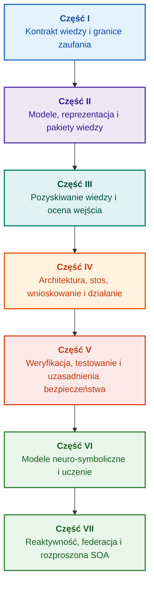

# Architektura dowodowych systemów eksperckich: od formalnych ontologii do neuro-symbolicznego AI

**Monografia inżynierska i kompendium projektowania, modeli matematycznych, architektury i weryfikacji systemów inteligentnych wysokiej niezawodności (Safety-Critical & Evidence-Grounded AI)**

**Autor:** [Mykola Fedchyk](../../about-the-author.md) · [LinkedIn](https://www.linkedin.com/in/nickfedchik/)  
**Format:** Monografia inżynierska / Kompendium architekta systemów AI  
**Rok:** 2026  

---

## O książce

Monografia stanowi fundamentalne badanie naukowe i podręcznik inżynierski poświęcony przezwyciężeniu kluczowego kryzysu współczesnej sztucznej inteligencji: luki epistemicznej między probabilistycznym prawdopodobieństwem generacji modeli neuronowych a deterministyczną prawdą dowodów formalnych. W centrum uwagi znajduje się pytanie: **jak zaprojektować system ekspercki, którego każdy wniosek jest niepodważalny, w pełni identyfikowalny z pierwotnymi źródłami i zdatny do certyfikacji w domenach krytycznych (ISO 26262, IEC 61508, DO-178C, ISO/SAE 21434)?**

Autor uzasadnia i definiuje nowy paradygmat: **dowodową neuro-symboliczną sztuczną inteligencję (Evidence-Grounded Neuro-Symbolic AI)**, w której modele statystyczne (LLM/SLM) pełnią doradczą funkcję generowania hipotez i rzutowania, a deterministyczny rdzeń symboliczny bezwzględnie gwarantuje niezmienniki spójności logicznej, bajtowego ugruntowania faktów, kontroli uprawnień i bezpiecznego przejścia do wykonania.

### Od artefaktu do weryfikowalnej decyzji

Wymagania, kod źródłowy, protokoły testowe, normy branżowe i decyzje inżynierskie funkcjonują w każdym środowisku produkcyjnym, lecz przeważnie jako odizolowane artefakty bez sformalizowanej semantyki i wzajemnej identyfikowalności. Pozytywny raport z testów może odnosić się do nieaktualnej rewizji sprzętu; cytat z normy może być wyrwany z kontekstu; a automatyczny rollback konfiguracji może omyłkowo aktywować wycofany komponent.

Monografia proponuje kompleksowy trakt inżynierski: od formalizacji artefaktów technicznych jako danych i kryptograficznie podpisanych pakietów wiedzy, poprzez wnioskowanie symboliczne, dekompozycję planów, wyjaśnienia kontrfaktyczne, aż po audyt granic kompetencji. Wywód poparty jest działającymi implementacjami w języku Go z pełnymi zestawami testów ([Rozdział 1](../../ch01-introduction-to-expert-systems.md)), ścisłymi kontraktami matematycznymi ([Część II](../../part-02-knowledge-models.md)) oraz protokołami uczenia ciągłego bez regresji ([Rozdział 25](../../ch25-how-expert-systems-learn.md)).

### Dla kogo przeznaczona jest monografia

Książka skierowana jest do architektów systemowych, głównych inżynierów ds. niezawodności i bezpieczeństwa funkcjonalnego, twórców silników wnioskowania oraz inżynierów wiedzy. Do opanowania koncepcji wystarcza znajomość logiki predykatów pierwszego rzędu, wersjonowania i cyklu życia oprogramowania; do uruchomienia przykładów wymagane jest standardowe środowisko Go. Rozdziały poświęcone syntezie uzasadnień bezpieczeństwa (GSN), synergetyce systemów złożonych, akceleratorom neuromorficznym oraz nawigacji autonomicznej bez GNSS ukazują zaawansowane obszary zastosowań w przemyśle kosmicznym, pojazdach autonomicznych i energetyce.

---

## Kontekst naukowy i miejsce monografii w badaniach światowych

Monografia traktuje systemy eksperckie nie jako archaiczny spadek po regułach z lat 80. (typu CLIPS czy MYCIN), lecz jako awangardę **dowodowej neuro-symbolicznej sztucznej inteligencji trzeciej fali (Third-Wave NeSy)**. Praca opiera się na fundamentach światowych szkół naukowych, łącząc modele matematyczne z inżynierią wysokiej wydajności:

| Kierunek naukowy | Kluczowe prace światowe i autorzy | Pomost koncepcyjny w książce |
|---|---|---|
| **Neuro-symboliczne AI trzeciej fali (NeSy)** | Artur d'Avila Garcez, Luis C. Lamb (*Neurosymbolic AI: The 3rd Wave*, 2023; *Neural-Symbolic Cognitive Reasoning*, Springer, 2009); Henry Kautz (*The Third AI Summer*, AAAI 2022) | Rozdział obowiązków: modele statystyczne (SLM/LLM) generują hipotezy zapytań, a deterministyczny rdzeń symboliczny weryfikuje i zatwierdza fakty ([Rozdział 29](ch29-neuro-symbolic-architecture.md)). |
| **Ograniczenia semantyczne i bezpieczne uczenie** | Guy Van den Broeck et al. (*A Semantic Loss Function for Deep Learning with Symbolic Knowledge*, ICML 2018); Luc De Raedt et al. (*DeepProbLog*, IJCAI 2020) | Bramy kontroli wejściowej i wyjściowej, deterministyczne filtrowanie propozycji sieci neuronowej według formalnych schematów ([Rozdziały 28](../../ch28-dual-mode-expert-systems.md), [33](../../ch33-inter-system-knowledge-exchange-and-model-teaching.md)). |
| **Rozumowanie obalalane i teoria argumentacji** | John L. Pollock (*Defeasible Reasoning*, 1987; *Cognitive Carpentry*, MIT Press, 1995); Phan Minh Dung (*Abstract Argumentation Frameworks*, AIJ 1995); Douglas Walton (*Argumentation Schemes*, Cambridge, 2008) | Podział wiedzy na twierdzenia, pochodzenie i okoliczności obalające (*rebutting* i *undercutting defeaters*); rozstrzyganie konfliktów w bazach norm według struktur Dunga ([Rozdziały 2](../../ch02-epistemology-of-machine-knowledge.md), [27](../../ch27-safety-case-gsn-synthesis.md)). |
| **Automatyczne wydobywanie reguł asocjacyjnych (KBC)** | Luis Galárraga, Fabian M. Suchanek et al. (*AMIE: Association Rule Mining under Incomplete Evidence*, WWW 2013, VLDBJ 2015); Stephen Muggleton (*Inductive Logic Programming*, 1994) | Automatyczna indukcja reguł w bazach wiedzy przy założeniu częściowej kompletności (PCA) bez fałszywych kontrprzykładów otwartego świata ([Rozdział 34](../../ch34-deterministic-relational-analysis-abduction-and-socratic-dialogue.md)). |
| **Formalne tarcze bezpieczeństwa i certyfikacja (Safe AI)** | Bettina Könighofer, Roderick Bloem et al. (*Shield Synthesis*, 2017); Tim Kelly, Rob Weaver (*Goal Structuring Notation*, York, 2004); André Platzer (*Logical Foundations of CPS*, Springer, 2018) | Synteza uzasadnień bezpieczeństwa w notacji GSN dla norm ISO 26262/21434; formalne tarcze i numeryczne koperty poprawności dla aktuatorów brzegowych ([Rozdziały 27](../../ch27-safety-case-gsn-synthesis.md), [30](../../ch30-safety-cybersecurity-co-engineering.md), [33](../../ch33-inter-system-knowledge-exchange-and-model-teaching.md)). |
| **Logika epistemiczna i semiotyka wiedzy** | John F. Sowa (*Knowledge Representation: Logical, Philosophical, and Computational Foundations*, 2000); Frank van Harmelen et al. (*Handbook of Knowledge Representation*, Elsevier, 2008) | Triada epistemiczna Charlesa Sandersa Peirce'a (Pojęcie → Sąd → Wnioskowanie); abdukcyjne generowanie hipotez roboczych pod ścisłą kontrolą dedukcyjną ([Rozdziały 6](../../ch06-applied-mathematics-for-expert-systems.md), [34](../../ch34-deterministic-relational-analysis-abduction-and-socratic-dialogue.md)). |
| **Cybernetyka i synergetyka systemów złożonych** | Norbert Wiener (*Cybernetics*, 1948); W. Ross Ashby (*An Introduction to Cybernetics*, 1956); Hermann Haken (*Synergetics: An Introduction*, 1977; *Advanced Synergetics*, 1983); Ilya Prigogine (*Order out of Chaos*, 1984) | Prawo niezbędnej różnorodności Ashby'ego, zamknięte pętle sterowania L0–L4, redukcja przestrzeni fazowej do parametrów porządku, wczesne wykrywanie przejść fazowych (CSD) i stabilizacja dyssypatywna ([Rozdziały 6](../../ch06-applied-mathematics-for-expert-systems.md), [22](../../ch22-cybernetics-edge-to-backend.md), [35](../../ch35-self-organizing-expert-systems-synergetics-and-npu-runtime.md)). |
| **Testowanie wiedzy, niezmienniczość i kalibracja Lipschitza** | Kent Beck (*TDD*, 2002); Martin Fowler (*Refactoring*, 2018); Clark Barrett, Leonardo de Moura (*Z3 SMT Solver*, 2008); Chuan Guo et al. (*On Calibration of Modern Neural Networks*, ICML 2017); Marco Tulio Ribeiro et al. (*CheckList*, ACL 2020); John L. Pollock (*Defeasible Reasoning*, 1987) | Czteropoziomowa piramida testowania wiedzy (KTP): izolowane testy reguł (KUT) z mockami przesłanek (`PremiseMock`), blokowanie prawdy próżniowej, analiza wartości brzegowych, kraty reguł (KIT), niezmienniczość semantyczna ($\text{SIS} \ge 0{,}98$) i ciągłość Lipschitza ($L_{\mathcal{K}} \le L_{\max}$) przeciw drganiom przekaźnikowym ([Rozdział 36](../../ch36-knowledge-testing-pyramid-and-variational-calibration.md)). |

---

## Autorskie modele teoretyczne, badania naukowe i innowacje inżynierskie

Monografia integruje wieloletni dorobek badawczo-inżynierski autora w dziedzinie systemów wysokiej niezawodności, architektur wbudowanych i dowodowego AI. Książka formułuje szereg oryginalnych teorii formalnych i protokołów:

### 1. Fundamentalne opracowania teoretyczne i formalizmy matematyczne

1. **Niezmiennik bajtowej dowodowości (EGI) i brama ugruntowania faktów ([Rozdziały 2](../../ch02-epistemology-of-machine-knowledge.md), [19](../../ch19-from-question-to-evidence.md), [28](../../ch28-dual-mode-expert-systems.md), [29](ch29-neuro-symbolic-architecture.md)):**
   * *Koncepcja teoretyczna:* Autor formalizuje niezmiennik kompletności ugruntowania $\mathrm{Comp}(C) = 1{,}00$: żadne twierdzenie nie uzyskuje statusu faktu bez deterministycznej projekcji na źródła pierwotne. Każdy fakt chroniony jest krotką kryptograficzną: niezmienne współrzędne bajtowe `[byte_start, byte_end]`, hash fragmentu `quote_sha256` oraz certyfikat PROV-O.
   * *Znaczenie inżynierskie:* Bajtowa brama dopuszczenia uniemożliwia przenikanie halucynacji sieci neuronowej do wersjonowanej bazy wiedzy ($ZHR = 1{,}00$).
2. **Czteropoziomowa piramida testowania wiedzy (KTP) i stabilność Lipschitza przestrzeni logicznej ([Rozdział 36](../../ch36-knowledge-testing-pyramid-and-variational-calibration.md)):**
   * *Koncepcja teoretyczna:* Transpozycja piramidy testów oprogramowania na bazy wiedzy: izolowane testy modułowe reguł (KUT) z mockami przesłanek (`PremiseMock`), testy integracyjne interakcji i defeaterów (KIT) oraz kalibracja wariacyjna (KVT).
   * *Aparat matematyczny:* Niezmiennik blokowania prawdy próżniowej ($P \to Q$ przy $P \equiv \text{False}$), wskaźnik niezmienniczości semantycznej ($\mathrm{SIS} \ge 0{,}98$) oraz ograniczenie Lipschitza ($L_{\mathcal{K}} \le L_{\max}$), które matematycznie eliminuje drgania wniosków przy fluktuacjach wejścia.
3. **Teoria popperowskiej falsyfikacji norm deontycznych i aktywny audytor zgodności ([Rozdział 39](../../ch39-active-compliance-auditor-and-popperian-testing.md)):**
   * *Koncepcja teoretyczna:* Przejście od pasywnej wyroczni do aktywnego audytora zgodności realizującego zasadę falsyfikacji Karla Poppera. System sonduje przestrzeń norm (ASPICE 4.0, ISO 26262, ISO/SAE 21434), syntetyzuje kontrprzykłady i projektuje kompleksowe programy testów.
   * *Wartość praktyczna:* Połączenie generowania przypadków brzegowych przez model (System 1) z deterministyczną weryfikacją deontyczną przez rdzeń (System 2) przy ochronie człowieka przed zmęczeniem akceptacjami.
4. **Synergetyczna redukcja wymiarowości bazy wiedzy i diagnostyka przedbifurkacyjna CSD ([Rozdziały 6](../../ch06-applied-mathematics-for-expert-systems.md), [22](../../ch22-cybernetics-edge-to-backend.md), [35](../../ch35-self-organizing-expert-systems-synergetics-and-npu-runtime.md)):**
   * *Koncepcja teoretyczna:* Zastosowanie synergetyki Hakena (parametry porządku i zasada podporządkowania) oraz struktur dyssypatywnych Prigogine'a w bazach wiedzy.
   * *Wynik:* Redukcja wielowymiarowych przestrzeni fazowych telemetrii do parametrów porządku i integracja detektora krytycznego spowolnienia (*Critical Slowing Down*, CSD) na długo przed zadziałaniem progów awaryjnych.
5. **Model poziomów autonomii działania (A0–A4), brama dopuszczenia i idempotentne sagi ([Rozdział 21](../../ch21-from-recommendation-to-action.md)):**
   * *Koncepcja teoretyczna:* Dyskretna skala uprawnień systemowych (A0: analiza pasywna do A4: awaryjne odcięcie zasilania), przypisywana krotce $\langle\text{akcja}, \text{środowisko}, \text{ryzyko}\rangle$.
   * *Aparat matematyczny:* Niezmiennik idempotencji $f(f(x, k), k) \equiv f(x, k)$ oparty na kluczu $k$ oraz rozproszone sagi kompensacyjne z niezależną weryfikacją post-warunków.
6. **Współinżynieria bezpieczeństwa funkcjonalnego i cyberbezpieczeństwa w notacji GSN ([Rozdziały 27](../../ch27-safety-case-gsn-synthesis.md), [30](../../ch30-safety-cybersecurity-co-engineering.md)):**
   * *Koncepcja teoretyczna:* Model spójnej syntezy drzew GSN dla jednoczesnego spełnienia wymogów ISO 26262 i ISO/SAE 21434.
   * *Przełom:* Matematyczny arbitraż celów sprzecznych (czas reakcji vs. głębokość atestacji) oraz protokół selektywnego ujawniania dowodów za pomocą solonych drzew Merkle'a.
7. **Protokół weryfikacji wierności i spójności semantycznej wyjaśnień ([Rozdział 20](../../ch20-explanation-engine.md)):**
   * *Koncepcja teoretyczna:* Wyjaśnienie traktowane jako deterministyczny artefakt wyprowadzany bezpośrednio z grafu dowodu, wersji reguł i zamrożonego stanu faktów.
   * *Aparat matematyczny:* Metryczna brama oceny wierności ($C_{\text{facts}} = 1{,}00, H_{\text{free}} = 1{,}00$) z automatycznym przejściem na szablon w przypadku rozbieżności.

---

### 2. Badania empiryczne, autorskie stanowiska badawcze i inżynieria systemowa

1. **Niezmienne binarne pakiety wiedzy z `mmap` i zerową alokacją pamięci ([Rozdział 32](../../ch32-high-performance-knowledge-packs-mmap-and-harvesting.md)):**
   * *Innowacja:* Dwuwarstwowa architektura pakietów (kanoniczna warstwa źródeł + zmaterializowana warstwa indeksów).
   * *Wynik empiryczny:* Bezpośrednie mapowanie indeksu w przestrzeń adresową przez `mmap`, brak alokacji na stercie i sublinearny start silnika bez względu na rozmiar ontologii.
2. **Poligon kalibracyjny na korpusach normatywnych IETF RFC-1000 i W3C-150 ([Rozdziały 2](../../ch02-epistemology-of-machine-knowledge.md), [4](../../ch04-evolution-from-bayes-to-evidence-ai.md), [14](../../ch14-requirements-detection-and-formalization.md), [25](../../ch25-how-expert-systems-learn.md)):**
   * *Eksperyment:* Stanowisko badawcze obejmujące 1.000 specyfikacji IETF RFC oraz 150 złożonych zapytań korpusu W3C (w tym indukowane sprzeczności).
   * *Rezultat praktyczny:* Budowa obiektywnych macierzy egzaminacyjnych, wykrywanie sprzeczności normatywnych i ochrona przed regresjami.
3. **Wieloskokowa analiza relacyjna, abdukcja symboliczna i dialog sokratejski ([Rozdział 34](../../ch34-deterministic-relational-analysis-abduction-and-socratic-dialogue.md)):**
   * *Rozwiązanie:* Algorytm dwukierunkowego ograniczonego przeszukiwania BFS ($k \le 6$) z ochroną przed cyklami i syntezą łańcuchów dowodowych.
   * *Zaleta inżynierska:* Realizacja abdukcji Peirce'a pod kontrolą dedukcyjną i sokratejskie ramki doprecyzowujące (*Clarification Frames*).
4. **Formalne tarcze bezpieczeństwa i koperty poprawności dla systemów brzegowych ([Rozdział 33](../../ch33-inter-system-knowledge-exchange-and-model-teaching.md), [Dodatki B](../../appendix-b-robotics-and-cyber-physical-systems.md), [C](../../appendix-c-autonomous-navigation-and-geosearch.md), [E](../../appendix-e-mixed-signal-neuromorphic-expert-systems.md)):**
   * *Innowacja:* Translacja dyskretnych niezmienników w ciągłe korytarze bezpieczeństwa dla procesorów sygnałowych (DSP) i nawigacji bez GNSS.
   * *Niezawodność:* Wymiana reguł podpisana kryptografią Ed25519 oraz sprzętowe blokowanie niedozwolonych sygnałów sterujących.
5. **Ochrona przed wyciekiem informacji poufnych przez wyjaśnienia i audyt różnicowy ([Rozdział 20](../../ch20-explanation-engine.md)):**
   * *Rozwiązanie:* Protokół redukcji reprezentacji wyjaśnienia ($\mathrm{EIR}_{\text{redacted}}$) z weryfikacją ACL dla każdego węzła i krawędzi grafu dowodu.

---

## Zasada grupowania

Części książki wynikają z nadrzędnego zadania inżynierskiego, a nie z chronologii czy nazw technologii. Każdy rozdział przynależy do jednej części głównej. Numery rozdziałów i nazwy plików stanowią stałe identyfikatory.

| Klasa rozdziału | Pytanie czytelnika | Funkcja w rozdziale |
|---|---|---|
| Problem i granice zadania | Co dokładnie należy rozwiązać? | Zdefiniować pytanie główne i zakres stosowalności |
| Obiekt i model | Jakie dane, wiedza lub stany są rozpatrywane? | Uzgodnić pojęcia, typy i założenia |
| Metoda i procedura | Jak uzyskać wynik? | Wyjaśnić wnioskowanie, transformację lub sterowanie |
| Implementacja i narzędzia | Czym zrealizować procedurę? | Przedstawić oprogramowanie lub sprzęt |
| Weryfikacja i testy | Jak wykryć błędy? | Zestawić wynik z niezależnym kryterium |
| Wnioski i ograniczenia | Co ustalono, a co pozostaje otwarte? | Odpowiedzieć na pytanie główne bez nadmiernych obietnic |

Pełna mapa redakcyjna zawiera ocenę kompozycji i granic każdego rozdziału.

## Ścieżki czytania

**Pierwsza weryfikacja oprogramowania:** [1](../../ch01-introduction-to-expert-systems.md) → [7](../../ch07-knowledge-base-typology.md) → [8](../../ch08-engineering-artifacts-as-data.md) → [17](../../ch17-implementation-stack.md) → [23](../../ch23-knowledge-base-verification.md) → [25](../../ch25-how-expert-systems-learn.md). Cel: Odtwarzalny werdykt z podstawami, testami negatywnymi i kontrolowaną zmianą wiedzy.

**Inżynieria wiedzy:** [Część II](../../part-02-knowledge-models.md) → [Część III](../../part-03-knowledge-engineering-nlp.md) → [19](../../ch19-from-question-to-evidence.md) → [20](../../ch20-explanation-engine.md) → [26](../../ch26-continual-learning.md). Cel: Uzgodnienie semantyki, pochodzenia, akwizycji wiedzy i walidacji kandydatów.

**Architektura rozwiązań:** [16](../../ch16-expert-systems-architecture.md) → [19](../../ch19-from-question-to-evidence.md) → [31](../../ch31-syllogistic-reasoning-and-relation-lattices.md) → [20](../../ch20-explanation-engine.md) → [21](../../ch21-from-recommendation-to-action.md). Cel: Rozdzielenie weryfikacji podstaw, stosowania norm, wyjaśniania i uprawnień do działania.

**Weryfikacja i bezpieczeństwo:** [23](../../ch23-knowledge-base-verification.md) → [36](../../ch36-knowledge-testing-pyramid-and-variational-calibration.md) → [25](../../ch25-how-expert-systems-learn.md) → [26](../../ch26-continual-learning.md) → [27](../../ch27-safety-case-gsn-synthesis.md) → [30](../../ch30-safety-cybersecurity-co-engineering.md). Diagnostyka zewnętrzna poprzez [Rozdział 24](../../ch24-system-diagnosis.md).

**Systemy hybrydowe i eksploatacja:** [Część VI](../../part-06-frontiers-neuro-symbolic.md) → [Część VII](../../part-07-runtime-and-knowledge-exchange.md) → [40](../../ch40-distributed-epistemic-architectures-soa-and-cluster-scaling.md) oraz dodatki. Cel: Integracja modeli językowych, zarządzanie lukami wiedzy i skalowanie rozproszonych architektur SOA.

---

## Granice zapewnień

Książka stanowi materiał dydaktyczny i badawczy, nie zaś certyfikowaną procedurę zgodności z normami. Wykonanie deterministyczne nie dowodzi prawdziwości przesłanek; hashe i podpisy dowodzą integralności, a nie prawdy empirycznej; graf argumentów nie zastępuje oceny eksperta. Wymogów niezawodności całego wyrobu nie należy utożsamiać z częstością błędów modelu językowego.

Automatyczna ekstrakcja zmniejsza nakład pracy ręcznej, lecz nie eliminuje potrzeby modelowania i recenzji. Gwarancje matematyczne odnoszą się do zdefiniowanych założeń; pomiary wydajności dotyczą określonych środowisk testowych. Ostateczne decyzje o dopuszczeniu do eksploatacji i zgodności z normami należą wyłącznie do uprawnionych inżynierów.

---

## Struktura książki

Monografia składa się z siedmiu części tematycznych, 40 rozdziałów i pięciu dodatków:

---

### [Część I. Fundament koncepcyjny i epistemiczny](../../part-01-foundations.md)

*Kiedy system ekspercki jest niezbędny, co stanowi wiedzę maszynową i jak zachować uzasadnienie decyzji.*

* [Rozdział 1. Wprowadzenie do systemów eksperckich: od chaosu do wiedzy zarządczej](../../ch01-introduction-to-expert-systems.md)
* [Rozdział 2. Filozofia dla inżyniera: co maszyna ma prawo nazwać wiedzą](../../ch02-epistemology-of-machine-knowledge.md)
* [Rozdział 3. Czym system ekspercki różni się od systemu informacyjno-wyszukiwawczego](../../ch03-beyond-reference-information-systems.md)
* [Rozdział 4. Ewolucja systemów eksperckich: od twierdzenia Bayesa do dowodowych decyzji AI](../../ch04-evolution-from-bayes-to-evidence-ai.md)
* [Rozdział 5. Triada zaufania: system ekspercki, dowodowa rekomendacja i pamięć korporacyjna](../../ch05-triad-of-trust-and-corporate-memory.md)

---

### [Część II. Modele matematyczne, reprezentacja i przechowywanie wiedzy](../../part-02-knowledge-models.md)

*Formalizmy matematyczne, typizowane artefakty, grafy śledzenia i pakiety wiedzy.*

* [Rozdział 6. Matematyka stosowana systemów eksperckich: reguły, prawdopodobieństwa, grafy i przyczynowość](../../ch06-applied-mathematics-for-expert-systems.md)
* [Rozdział 7. Typologia baz wiedzy: reguły, ontologie, przypadki i wektory](../../ch07-knowledge-base-typology.md)
* [Rozdział 8. Artefakty inżynierskie jako dane systemu eksperckiego](../../ch08-engineering-artifacts-as-data.md)
* [Rozdział 9. Inżynierski graf wiedzy: śledzenie powiązań od wymagań do krzemu](../../ch09-engineering-knowledge-graph-traceability.md)
* [Rozdział 32. Niezmienne pakiety wiedzy: dopuszczenie bajtowe, indeksy i mapowanie pamięci](../../ch32-high-performance-knowledge-packs-mmap-and-harvesting.md)

---

### [Część III. Pozyskiwanie wiedzy, analiza językowa i ocena wejścia](../../part-03-knowledge-engineering-nlp.md)

*Dokumenty, wiedza ekspercka i obserwacje: ekstrakcja kandydatów, parsowanie i ocena dowodów.*

* [Rozdział 10. Systemy pozyskiwania wiedzy: źródła, bramy dopuszczenia i cykle życia](../../ch10-knowledge-acquisition-systems.md)
* [Rozdział 11. Wydobywanie wiedzy od ekspertów dziedzinowych: wywiady, mapy poznawcze i formalizacja praktyki](../../ch11-knowledge-elicitation-from-experts.md)
* [Rozdział 12. Analiza lingwistyczna i modele lokalne: zachowanie semantyki i atrybucji źródeł](../../ch12-linguistic-analysis-and-local-models.md)
* [Rozdział 13. Zmienność języka naturalnego a determinizm: kompilacja sensu zapytania](../../ch13-language-variability-vs-determinism.md)
* [Rozdział 14. Wykrywanie wymagań i modalności: od tekstu normatywnego do niezmienników](../../ch14-requirements-detection-and-formalization.md)
* [Rozdział 15. Ekstrakcja wiedzy i budowa bazy wiedzy: fakty, gramatyki i automaty](../../ch15-knowledge-extraction-and-kb-construction.md)
* [Rozdział 37. Ocena informacji wejściowej: źródła, dowody i sceptycyzm algorytmiczny](../../ch37-input-information-assessment-and-algorithmic-skepticism.md)

---

### [Część IV. Architektura, stos technologiczny, wnioskowanie i działanie](../../part-04-architecture-and-inference.md)

*Kontrakty architektoniczne, stos uruchomieniowy, wnioskowanie normatywne, silnik wyjaśnień i pętle sterowania.*

* [Rozdział 16. Architektura systemu eksperckiego: od sformalizowanej wiedzy do decyzji dowodowej](../../ch16-expert-systems-architecture.md)
* [Rozdział 17. Stos technologiczny: kryteria doboru narzędzi, języków programowania i silników reguł](../../ch17-implementation-stack.md)
* [Rozdział 18. Infrastruktura wykonawcza: lokalne modele SLM, akceleratory sprzętowe, Edge i On-Premise](../../ch18-execution-infrastructure.md)
* [Rozdział 19. Od pytania do dowodu: wyszukiwanie, wiązanie i weryfikacja twierdzeń](../../ch19-from-question-to-evidence.md)
* [Rozdział 31. Wnioskowanie normatywne: hierarchie predykatów, wyjątki i ważność czasowa](../../ch31-syllogistic-reasoning-and-relation-lattices.md)
* [Rozdział 20. Silnik wyjaśnień: decyzje, uzasadniona odmowa i granice kompetencji](../../ch20-explanation-engine.md)
* [Rozdział 21. Od rekomendacji do działania: kontrola uprawnień i bezpieczne wykonanie](../../ch21-from-recommendation-to-action.md)
* [Rozdział 22. Cybernetyczna pętla sterowania: sensory, aktuatory i sprzężenie zwrotne](../../ch22-cybernetics-edge-to-backend.md)

---

### [Część V. Weryfikacja, testowanie, diagnostyka i uzasadnienia bezpieczeństwa](../../part-05-verification-and-learning.md)

*Formalna weryfikacja reguł, piramida testowania wiedzy, falsyfikacja popperowska, diagnostyka i GSN.*

* [Rozdział 23. Weryfikacja bazy wiedzy: spójność, kompletność i niezawodność reguł](../../ch23-knowledge-base-verification.md)
* [Rozdział 36. Piramida testowania wiedzy: reguły, interakcje i odporność odpowiedzi](../../ch36-knowledge-testing-pyramid-and-variational-calibration.md)
* [Rozdział 39. Aktywny audytor zgodności: falsyfikacja popperowska, normy (ASPICE/ISO 26262/ISO 21434) i projektowanie testów](../../ch39-active-compliance-auditor-and-popperian-testing.md)
* [Rozdział 24. Diagnostyka techniczna: rozróżnianie objawów od przyczyn w warunkach niepełnej informacji](../../ch24-system-diagnosis.md)
* [Rozdział 27. Uzasadnienia bezpieczeństwa: formalna synteza i weryfikacja argumentów GSN](../../ch27-safety-case-gsn-synthesis.md)
* [Rozdział 30. Zintegrowane projektowanie bezpieczeństwa funkcjonalnego i cyberbezpieczeństwa](../../ch30-safety-cybersecurity-co-engineering.md)

---

### [Część VI. Modele neuro-symboliczne, granice poznawcze i uczenie ciągłe](../../part-06-frontiers-neuro-symbolic.md)

*Dedukcja a hipotezy doradcze, integracja modeli językowych, zwalczanie halucynacji i uczenie z doświadczenia.*

* [Rozdział 28. Dwutrybowe systemy eksperckie: ścisła dedukcja i hipoteza doradcza](../../ch28-dual-mode-expert-systems.md)
* [Rozdział 29. Architektura neuro-symboliczna: modele językowe i dowodowa weryfikacja faktów](ch29-neuro-symbolic-architecture.md)
* [Rozdział 34. Luki w wiedzy: wyszukiwanie relacyjne, abdukcja i dialog doprecyzowujący](../../ch34-deterministic-relational-analysis-abduction-and-socratic-dialogue.md)
* [Rozdział 38. Halucynacje maszynowe i deficyty wiedzy: dowodowa kontrola odpowiedzi](../../ch38-curing-machine-hallucinations-and-knowledge-deficits.md)
* [Rozdział 25. Jak uczyć system ekspercki: macierze egzaminacyjne, audyty wiedzy i kontrola regresji](../../ch25-how-expert-systems-learn.md)
* [Rozdział 26. Uczenie ciągłe (Continual Learning) z doświadczenia i mitygacja dryfu logów](../../ch26-continual-learning.md)

---

### [Część VII. Wykonanie reaktywne, wymiana wiedzy i rozproszona architektura SOA](../../part-07-runtime-and-knowledge-exchange.md)

*Reaktywne wykonywanie reguł, synergetyka, federacje systemów i rozproszone architektury SOA.*

* [Rozdział 35. Reaktywne systemy eksperckie: zdarzenia, odwołania i samoorganizacja wiedzy](../../ch35-self-organizing-expert-systems-synergetics-and-npu-runtime.md)
* [Rozdział 33. Międzysystemowa wymiana wiedzy: dostarczanie reguł, nauczanie modeli i bezpieczne sprzężenie](../../ch33-inter-system-knowledge-exchange-and-model-teaching.md)
* [Rozdział 40. Rozproszona architektura epistemiczna: Knowledge SOA, routing semantyczny i wieloźródłowy arbitraż](../../ch40-distributed-epistemic-architectures-soa-and-cluster-scaling.md)

---

### Dodatki

* [Dodatek A. Praktyczny framework badań dowodowych w złożonych projektach inżynierskich](../../appendix-a-evidence-governed-framework.md)
* [Dodatek B. Dowodowe systemy eksperckie w robotyce autonomicznej i układach cyberfizycznych](../../appendix-b-robotics-and-cyber-physical-systems.md)
* [Dodatek C. Nawigacja autonomiczna bez GNSS: dopasowanie geoprzestrzenne (TRN/DSMAC), odometria wizualna (VIO) i fuzja sensorów](../../appendix-c-autonomous-navigation-and-geosearch.md)
* [Dodatek D. Analogowe systemy eksperckie, obliczenia neuromorficzne i wnioskowanie sprzętowe](../../appendix-d-analog-expert-systems-and-neuromorphic-computing.md)
* [Dodatek E. Mieszane analogowo-cyfrowe systemy eksperckie pod kontrolą dowodową](../../appendix-e-mixed-signal-neuromorphic-expert-systems.md)
* [O autorze: Mykola Fedchyk (Nick Fedchik)](../../about-the-author.md)

---

## Kierunki badawcze

Przyszłe kierunki prac badawczych obejmują: powtarzalne pakiety wiedzy zero-allocation; weryfikację ograniczonych fragmentów formalnych; sterowanie agentami przez jawne kontrakty uprawnień; poufną weryfikację twierdzeń z dowodami z wiedzą zerową (ZKP); oraz kontrolowane odwoływanie wiedzy i machine unlearning. Dowód własności modelu nie poświadcza automatycznie zgodności fizycznego wyrobu.

Dla akceleratorów sprzętowych należy uprzednio zmierzyć błąd, opóźnienie i zużycie energii ([Rozdziały 29](ch29-neuro-symbolic-architecture.md), [32](../../ch32-high-performance-knowledge-packs-mmap-and-harvesting.md), [Dodatki D](../../appendix-d-analog-expert-systems-and-neuromorphic-computing.md) i [E](../../appendix-e-mixed-signal-neuromorphic-expert-systems.md)). Program badań dla rozdziałów 7–11 zawarto w [Części II](../../part-02-knowledge-models.md).
