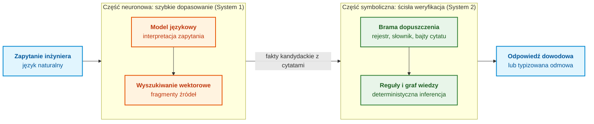
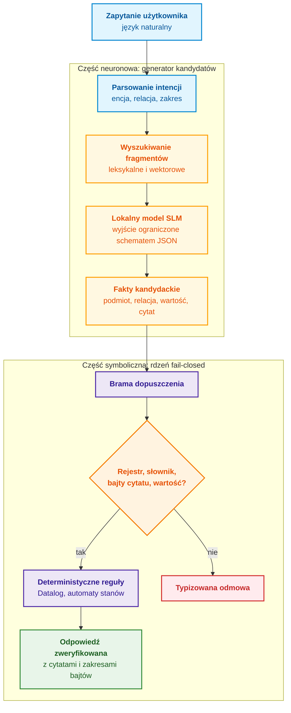
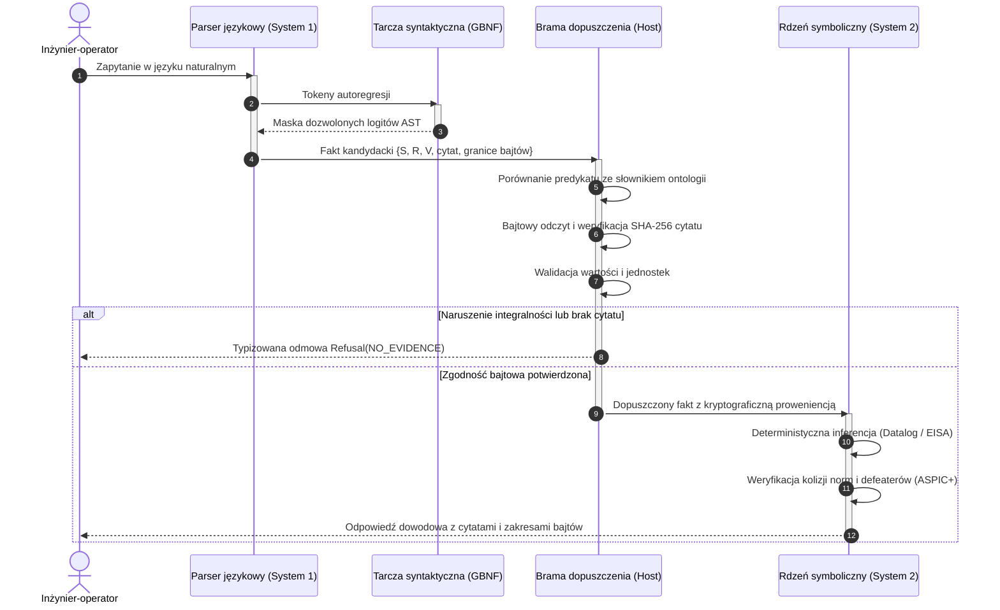
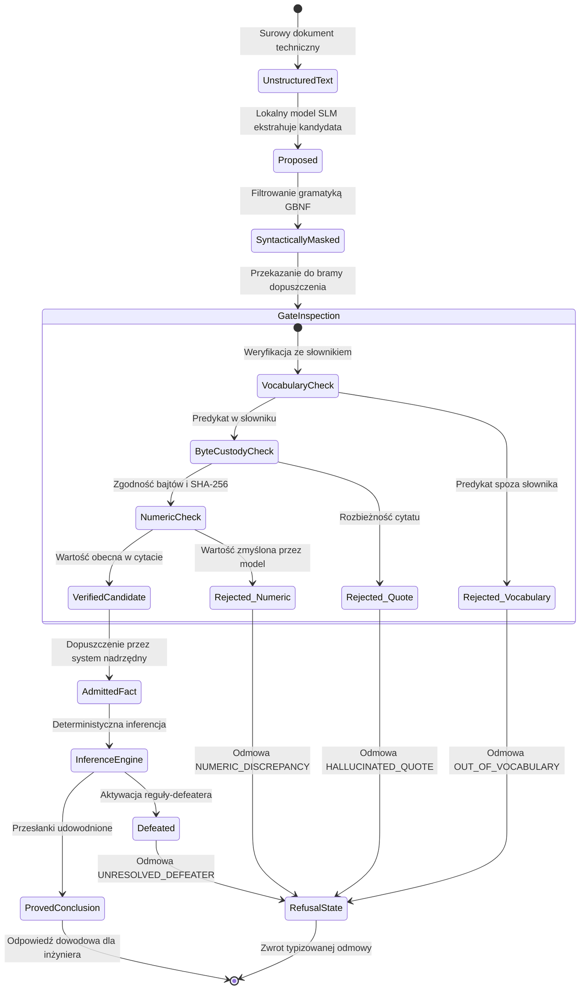

# Rozdział 29. Architektura neuro-symboliczna: modele językowe i dowodowa weryfikacja faktów

> **Książka:** [Architektura dowodowych systemów eksperckich](README.md) · [Część VI: Modele neuro-symboliczne, granice poznawcze i uczenie ciągłe](part-06-frontiers-neuro-symbolic.md)  
> **Poprzedni rozdział:** [Rozdział 28. Dwutrybowe systemy eksperckie: ścisła dedukcja i hipoteza doradcza](ch28-dual-mode-expert-systems.md)  
> **Następny rozdział:** [Rozdział 34. Luki w wiedzy: wyszukiwanie relacyjne, abdukcja i dialog doprecyzowujący](ch34-deterministic-relational-analysis-abduction-and-socratic-dialogue.md)  
> **Spis treści:** [README.md](README.md)  
> **Autor:** [Mykola Fedchyk](about-the-author.md)  
> **Poziom:** Zaawansowany: architekci systemowi, inżynierowie uczenia maszynowego, programiści systemów o znaczeniu krytycznym  
> **Oczekiwane rezultaty:** Wyjaśnienie, dlaczego prawdopodobieństwo tekstu nie stanowi dowodu; rozdzielenie zadań między model językowy proponujący fakty a symboliczny rdzeń je zatwierdzający; budowa bajtowej bramy dopuszczenia z rejestrem wersji, zamkniętym słownikiem relacji, weryfikacją cytatów i kontrolą wartości; ograniczanie wyjścia modeli lokalnych schematem JSON w Ollama; audyt wyjaśnień pod kątem niezweryfikowanych liczb; odróżnianie modelu zaadaptowanego od bazowego na przypadkach brzegowych.

## Abstrakt

Rozdział analizuje architekturę neuro-symboliczną systemów eksperckich trzeciej fali sztucznej inteligencji (NeSy), łączącą elastyczność przetwarzania języka naturalnego przez duże i małe modele językowe (LLM/SLM) ze ścisłą weryfikowalnością deterministycznego rdzenia symbolicznego. Zbadano fundamentalną lukę epistemiczną dzielącą statystyczne prawdopodobieństwo tekstu autoregresyjnego od prawdy formalnej w domenach o krytycznym znaczeniu dla bezpieczeństwa (ISO 26262 ASIL D, DO-178C DAL A). Sformułowano zasadę architektoniczną: „Model proponuje, rdzeń symboliczny zatwierdza”. Przeanalizowano doświadczenia wiodących ośrodków badawczych i przemysłowych (AlphaProof z DeepMind, Process Reward Models z OpenAI, Cicero z Meta FAIR, potoki DSPy z Uniwersytetu Stanforda, szkoły MIT CSAIL i Imperial College London). Szczegółowo opisano konstrukcję bajtowej bramy dopuszczenia weryfikującej współrzędne cytatów, schematy JSON, słowniki zamknięte oraz blokującej halucynacje liczbowe. Przedstawiono pełną, produkcyjną implementację potoku w języku Go z lokalnym modelem uruchamianym przez środowisko Ollama.

Gdy inżynier projektujący wbudowany sterownik hamulcowy lub awionikę zapyta asystenta generatywnego: „Jaki jest maksymalny czas reakcji watchdoga bezpieczeństwa?”, model natychmiast i przekonująco odpowie: „100 milisekund”. Jednak w specyfikacji normatywnej dla poziomu ASIL D (ISO 26262) lub DAL A (DO-178C) zapisano bezwzględne 10 milisekund: pozostałe 90 ms to statystyczna halucynacja zaczerpnięta z opisów mikrokontrolerów konsumenckich. Zaufanie autorytatywnie brzmiącej odpowiedzi doprowadzi do awarii i spóźnionego restartu kontrolera w warunkach krytycznych. Z kolei klasyczny silnik reguł z [Rozdziału 28](ch28-dual-mode-expert-systems.md) zna poprawną odpowiedź z cytatem z normy, lecz odmówi odpowiedzi, jeśli zapytanie sformułowano językiem potocznym („watchdog procesora”), podczas gdy w bazie zarejestrowano „sprzętowy timer bezpieczeństwa WDOG-1”. Pierwszy system jest niebezpieczny z powodu halucynacji; drugi jest bezużyteczny w codziennej pracy przez nadmierną sztywność.

Rozdział odpowiada na pytanie: **jak połączyć elastyczność modelu językowego ze ścisłością rdzenia symbolicznego, aby żadne niezweryfikowane twierdzenie nie trafiło do odpowiedzi?** Główna teza: **model językowy proponuje, rdzeń symboliczny zatwierdza. Model interpretuje zapytanie, proponuje fakty kandydackie z dosłownymi cytatami i formułuje wyjaśnienia. Brama dopuszczenia weryfikuje każdego kandydata według rejestru wersji dokumentów, zamkniętego słownika relacji, bajtów cytatu i wartości. Wnioski wyprowadzają wyłącznie deterministyczne reguły nad dopuszczonymi faktami, a wszystko, co nie przeszło weryfikacji, staje się odmową lub oznaczoną hipotezą.** Rozdział ilustruje tę architekturę działającym programem w języku Go z modelem lokalnym przez Ollama.

## 1. Luka epistemiczna: dlaczego prawdopodobieństwo nie jest prawdą

Główne zagrożenie bezkrytycznego stosowania modeli generatywnych w krytycznych systemach eksperckich wynika z głębokiej **luki epistemicznej** między zewnętrzną formą a merytoryczną treścią wypowiedzi. W ludzkiej percepcji bezbłędnie sformułowany, pewny wywód inżynierski jest intuicyjnie kojarzony z prawdą. W sensie matematycznym wysokie prawdopodobieństwo tekstu świadczy wyłącznie o jego zgodności statystycznej z korpusem danych treningowych, a nie o poprawności fizycznej, weryfikowalności formalnej czy zgodności ze źródłem normatywnym. Zaufanie modelowi w kwestii samodzielnego ustalania faktów prowadzi do niezauważalnego przenikania halucynacji wprost do traktu wykonawczego.

Natura tego problemu wynika bezpośrednio z funkcji celu optymalizacji systemów autoregresyjnych. Model językowy $\mathcal{M}$ nie weryfikuje faktów w świecie rzeczywistym, lecz optymalizuje warunkowe prawdopodobieństwo przewidywania kolejnego tokenu:

```math
P_{\mathcal{M}}(w_t\mid w_1,\dots,w_{t-1}),\qquad \hat{w}_{1:N}=\operatorname*{arg\,max}_{w_{1:N}}\prod_{t=1}^{N}P_{\mathcal{M}}(w_t\mid w_{1:t-1}).
```

Oznaczenia:

- $\mathcal{M}$ to model językowy;
- $`w_t`$ to token na pozycji $t$, a $`w_1,\dots,w_{t-1}`$ to tokeny poprzedzające;
- $`P_{\mathcal{M}}(w_t\mid w_1,\dots,w_{t-1})`$ to prawdopodobieństwo kolejnego tokenu w kontekście tokenów poprzednich, w przedziale $[0, 1]$;
- $N$ to długość sekwencji, a $`w_{1:N}`$ oznacza pełną sekwencję;
- $`w_{1:t-1}`$ (lub $`w_{<t}`$) oznacza sekwencję tokenów poprzedzających pozycję $t$;
- $`\prod_{t=1}^{N}`$ oznacza iloczyn prawdopodobieństw tokenów od pozycji 1 do $N$;
- $`\operatorname*{arg\,max}_{w_{1:N}}`$ wybiera sekwencję o największym iloczynie prawdopodobieństw;
- $`\hat{w}_{1:N}`$ to wybrana przez model sekwencja wyjściowa.

Model wyznacza maksimum wiarygodności statystycznej wśród kandydatów, a nie prawdopodobieństwo zgodności tekstu z rzeczywistością.

Najbardziej prawdopodobna sekwencja nie musi być poprawna. Adam Kalai i współpracownicy wykazali, że halucynacje wynikają bezpośrednio z presji statystycznej uczenia: gdy model nie potrafi odróżnić prawdy od fałszu, mechanizmy oceny nagradzają zgadywanie zamiast przyznania się do niewiedzy [[1]](#src-1). Wniosek inżynierski: brama dopuszczenia musi nagradzać odmowę, a nie pewne siebie zgadywanie.

Wysoka dokładność modelu na testach benchmarkowych nie wystarcza w systemach krytycznych. Ricky Butler i George Finelli udowodnili, że ilościowe potwierdzenie ultrawysokiej niezawodności oprogramowania metodami statystycznymi jest niemożliwe z powodu zaporowej liczby wymaganych testów [[2]](#src-2). Skoro niezawodności nie da się dowieść testowaniem kodu deterministycznego, tym bardziej nie da się jej dowieść testowaniem modeli stochastycznych. Zaufanie należy budować na strukturze weryfikowalnej: cytacie, regule i formalnym argumencie z [Rozdziału 27](ch27-safety-case-gsn-synthesis.md).

Rozumowanie krok po kroku generowane przez model nie zastępuje weryfikacji. Jason Wei i współpracownicy wykazali, że technika łańcucha myśli (*Chain of Thought, CoT*) podnosi trafność odpowiedzi [[3]](#src-3). Jednak Miles Turpin i współpracownicy odkryli, że takie wyjaśnienia systematycznie zniekształcają rzeczywistą przyczynę odpowiedzi: gdy model nakierowano na błędną odpowiedź ukrytą cechą w prompcie, generował on przekonujące uzasadnienie błędu bez wzmianki o tej cesze, a dokładność spadała do 36% [[4]](#src-4). Łańcuch myśli jest tekstem, a nie formalnym dowodem.

Ograniczenia widoczne są także w obszarze syntezy hipotez. Tom Zahavy z Google DeepMind wskazuje, że generatywne AI opanowało indukcję i rozwija dedukcję, lecz nie posiada mechanizmu abdukcji [[5]](#src-5). Denys Yuvzhenko analizuje te różnice na przykładach technicznych [[6]](#src-6). W systemach eksperckich wszelkie hipotezy modeli mają status kandydatów podlegających weryfikacji.

## 2. Dychotomia poznawcza System 1 / System 2: granice analogii inżynierskiej

Daniel Kahneman wyróżnił dwa tryby myślenia: intuicyjny, szybki System 1 oraz powolny, ustrukturyzowany System 2 [[7]](#src-7). W architekturze systemów eksperckich rozróżnienie to służy jako analogia podziału zadań: część neuronowa szybko dopasowuje język naturalny do wzorców, a część symboliczna powoli i odtwarzalnie weryfikuje twierdzenia.



Początki systemów neuro-symbolicznych sformalizowali Artur d'Avila Garcez i współpracownicy [[8]](#src-8), a Gary Marcus wskazał podejście hybrydowe jako drogę do niezawodnego AI [[9]](#src-9). Przegląd Brandona Colelougha i Williama Regli ukazuje stan badań: na 167 prac z lat 2020–2024 aż 63% dotyczy uczenia i wnioskowania, 28% wyjaśnialności i zaufania, a zaledwie 5% metapoznania [[10]](#src-10). Dowodowe systemy eksperckie operują właśnie w domenie zaufania i wyjaśnialności:

| Właściwość | LLM z RAG | Reguły klasyczne | Architektura neuro-symboliczna |
|---|---|---|---|
| Rozumienie języka swobodnego | wysokie | niskie, łamie się na synonimach | wysokie, dzięki modelom SLM/LLM |
| Odtwarzalność wniosku | stochastyczna, zależna od dekodowania | pełna przy stałej bazie wiedzy | pełna w symbolicznym rdzeniu |
| Związek wniosku ze źródłem | pośredni, przez wyszukane passusy | bezpośredni, przez fakty i reguły | bezpośredni, przez dopuszczone cytaty |
| Zachowanie przy braku wiedzy | prawdopodobna halucynacja | odmowa | odmowa lub oznaczona hipoteza |
| Koszt utrzymania wiedzy | niski dla tekstu, wysoki dla kontroli | wysoki nakład modelowania ręcznego | automatyczna ekstrakcja z bramą walidacji |

Przewaga podejścia neuro-symbolicznego polega na audytowalności: każdy błąd można jednoznacznie przypisać do konkretnego cytatu, reguły lub decyzji bramy.

## 3. Zasada podziału obowiązków: generator statystyczny kontra weryfikator symboliczny

Poniższy schemat ilustruje pełną ścieżkę zapytania w neuro-symbolicznym systemie eksperckim:



Architektura RAG (Retrieval-Augmented Generation) opisana przez Patricka Lewisa i współpracowników łączy wyszukiwanie z generowaniem tekstu [[11]](#src-11). W systemie dowodowym generacja jest ograniczona: model nie formułuje odpowiedzi końcowej, lecz proponuje ustrukturyzowane fakty poparte dosłownymi cytatami.

Część symboliczna zabezpiecza trzy niezmienniki:
1. **Niezmiennik dowodowości:** Każde twierdzenie twierdzące opiera się na dosłownym cytacie z zatwierdzonej wersji dokumentu z dokładnymi zakresami bajtów.
2. **Niezmiennik zamknięcia przy awarii (Fail-Closed):** Przy braku wiedzy lub dwuznaczności system zwraca typizowaną odmowę, a nie prawdopodobny domysł.
3. **Niezmiennik wnioskowania deterministycznego:** Wnioski wyprowadzają wyłącznie reguły logiczne nad dopuszczonymi faktami.

| Rola modelu językowego | Co wykonuje model | Co weryfikuje część symboliczna |
|---|---|---|
| Ocena wystarczalności | Sygnalizuje, czy passusy odpowiadają na pytanie | Obecność dokumentu w rejestrze; odmowę orzeka rdzeń |
| Planowanie struktury | Dzieli zapytanie na encję, relację i zakres | Przynależność relacji do zamkniętego słownika ontologii |
| Ekstrakcja kandydatów | Proponuje krotki faktów z dosłownymi cytatami | Hash rewizji, granice bajtów i dosłowność wartości |
| Formułowanie wyjaśnień | Generuje spójny tekst na bazie drzewa dowodu | Każda liczba i identyfikator musi występować w faktach |
| Hipotezy doradcze | Proponuje przypuszczenia w trybie doradczym | Izolacja od faktów pewnych, oznaczenie hipotezy ([Rozdział 28](ch28-dual-mode-expert-systems.md)) |
| Generalizacja reguł | Proponuje nowe reguły na podstawie precedensów | Kwarantanna kandydatów, testy sprzeczności ([Rozdział 26](ch26-continual-learning.md)) |

Model pozostaje doradcą; ostateczna decyzja należy do deterministycznej weryfikacji.

## 4. Światowy krajobraz architektur neuro-symbolicznych: paradygmaty przemysłowe i akademickie

Koncepcja rozdziału Systemu 1 i Systemu 2 stanowi główny nurt badawczy w latach 2024–2026. Realizacje różnią się jednak znacząco pod względem formalizmu i narzutu obliczeniowego.

### 4.1. Doświadczenia Alphabet / DeepMind: AlphaProof i interaktywne dowodzenie w Lean

W systemie **AlphaProof** badacze Google DeepMind wykazali zdolność rozwiązywania zadań Międzynarodowej Olimpiady Matematycznej (IMO 2024) [[29]](#src-29). AlphaProof łączy model Gemini z jądrem dowodzenia **Lean 4** [[20]](#src-20). Model generuje taktyki, a Lean mechanicznie sprawdza poprawność typów logicznych.

> **Wniosek dla systemów dowodowych:** Rozdział *„LLM proponuje taktykę → formalny rdzeń weryfikuje”* jest standardem niezawodności.
> 
> **Granica stosowalności:** Lean 4 tworzono dla matematyków. Dowodzenie trwa sekundy lub minuty. W sterownikach wbudowanych (ISO 26262 ASIL D, DO-178C DAL A) o limitach reakcji $`< 100\,\mu\text{s}`$ jest to niedopuszczalne. Systemy czasu rzeczywistego wymagają wyspecjalizowanych rdzeni symbolicznych o deterministycznym czasie i zerowej alokacji.

### 4.2. Doświadczenia OpenAI: nagrody procesowe (PRM) i granice ukrytego rozumowania

Hunter Lightman i współpracownicy zaproponowali **Process-Supervised Reward Models (PRM)** (*„Let's Verify Step by Step”*) [[25]](#src-25). PRM ocenia poprawność każdego kroku łańcucha myśli (*CoT*). Rozwiązanie to rozwinięto w modelach o1/o3 poprzez skalowanie obliczeń w fazie wnioskowania.

> **Wniosek dla systemów dowodowych:** Weryfikacja każdego przejścia logicznego jest skuteczniejsza niż ocena samego wyniku.
> 
> **Pułapka:** Wewnętrzny łańcuch myśli pozostaje ciągiem stochastycznym. Weryfikacja „AI sprawdza AI” bez zewnętrznego silnika matematycznego wywołuje kolaps modelu [[3]](#src-3).

### 4.3. Doświadczenia Meta FAIR: dialog strategiczny i filtrowanie w architekturze Cicero

Agent dyplomatyczny **Cicero** [[24]](#src-24) osiągnął poziom mistrzowski w grze „Diplomacy”:
* **Model językowy (System 1):** Negocjuje z graczami i tłumaczy dialog na ustrukturyzowane propozycje;
* **Planista symboliczny (System 2):** Oblicza optymalne posunięcia w oparciu o teorię gier i równowagę Nasha.

Cicero filtruje wyjście modelu: jeśli wypowiedź przeczy strategii, zostaje zablokowana.

### 4.4. Doświadczenia Stanford HAI: skompilowane potoki deklaratywne DSPy

Omar Khattab i współpracownicy stworzyli framework **DSPy** [[26]](#src-26), zastępujący ręczny prompt engineering kompilacją ograniczeń. Inżynier definiuje sygnaturę zadania, a optymalizator kompiluje parametry potoku.

> **Wniosek dla systemów dowodowych:** Deklaratywne typowanie eliminuje subiektywizm promptów.

### 4.5. Szkoły akademickie: MIT NSCL i ramy argumentacji ASPIC+

Prace w MIT CSAIL nad **Neuro-Symbolic Concept Learner (NSCL)** [[27]](#src-27) dowiodły siły ugruntowania semantycznego: sceny są tłumaczone na wykonywalne drzewa programów funkcyjnych.

Z kolei szkoła argumentacji z Imperial College London (Francesca Toni, Sanjay Modgil) opracowała formalizm **ASPIC+** [[28]](#src-28), umożliwiający rozstrzyganie konfliktów norm przez okoliczności obalające (*rebutting* i *undercutting defeaters*), gdy normy szczegółowe (*Lex Specialis*) deterministycznie przeważają nad ogólnymi.

### 4.6. Protokół czasowy interakcji w tandemie neuro-symbolicznym

Poniższy diagram sekwencji przedstawia przepływ komunikatów podczas obsługi zapytania inżynierskiego:



### 4.7. Cykl życia i weryfikacja faktu kandydackiego

Diagram stanów obrazuje przejścia wiedzy od surowego tekstu do zatwierdzonego faktu lub odmowy:



## 5. Bajtowa brama dopuszczenia: ugruntowanie we współrzędnych źródeł pierwotnych

Cytaty muszą być sprawdzane na poziomie bajtów, ponieważ pliki przechowywane są jako ciągi bajtów i z nich generowane są sumy kontrolne. Modele językowe operują jednak na tokenach i znakach Unicode. W UTF-8 znaki zajmują od 1 do 4 oktetów [[12]](#src-12). Jeśli model poda współrzędne cytatu w znakach, dla znaków wielobajtowych granice ulegną przesunięciu. Reguła projektowa: model dostarcza dosłowny cytat tekstowy, a host oblicza granice bajtowe. W razie rozbieżności host przeszukuje plik bajtowo i dopuszcza cytat tylko wtedy, gdy występuje w dokumencie ściśle jeden raz.

Brama wykonuje pięć kontroli w stałej kolejności:

1. **Rejestr wersji:** Suma SHA-256 dokumentu musi zgadzać się z wersją zatwierdzoną w rejestrze źródeł ([Rozdział 15](ch15-knowledge-extraction-and-kb-construction.md)).
2. **Odmowa modelu:** Gdy model sygnalizuje brak odpowiedzi w passusie, rejestruje się to jako wynik poprawny.
3. **Zamknięty słownik:** Relacja musi należeć do zbioru relacji obsługiwanych przez rdzeń reguł.
4. **Dosłowność cytatu:** Bajty dokumentu w zadanym przedziale muszą dokładnie odpowiadać cytatowi.
5. **Obecność wartości w cytacie:** Wartość faktu musi występować w cytacie jako pełny token leksykalny.

Ta sama rygorystyczna kontrola obejmuje generowane wyjaśnienia: każda liczba w wyjaśnieniu musi pochodzić z dopuszczonych faktów, inaczej system emituje deterministyczny szablon.

## 6. Lokalne małe modele językowe (SLM) jako deterministyczne generatory kandydatów

Uruchamianie modeli SLM (1–8 mld parametrów) w środowisku lokalnym gwarantuje poufność dokumentacji technicznej ([Rozdział 25](ch25-how-expert-systems-learn.md)). Zadanie ekstrakcji nie wymaga potężnego modelu ogólnego, lecz żelaznej dyscypliny formatu.

**Dekodowanie z ograniczeniami gramatycznymi:** Zastosowanie gramatyk wymusza ustrukturyzowany format wyjściowy bez konieczności dostrajania wag [[13]](#src-13), [[14]](#src-14). W praktyce `llama.cpp` stosuje gramatyki GBNF [[15]](#src-15), a Ollama wymusza schematy JSON przez parametr `format` [[16]](#src-16). Schemat gwarantuje strukturę, lecz nie prawdziwość danych.

**Ustalenie hiperparametrów:** Instrukcje systemowe i parametry utrwala się w pliku `Modelfile` [[17]](#src-17):

<details>
<summary>Plik modelu Ollama (Modelfile)</summary>

```dockerfile
FROM qwen2.5:3b

# Temperatura zerowa eliminuje losowość doboru tokenów
PARAMETER temperature 0
PARAMETER num_predict 512

SYSTEM """You extract candidate facts from technical specifications.
Return a JSON array of objects with fields subject, relation, value and quote.
The quote must be an exact verbatim substring of the given passage.
Use only these relations: max_length_octets, timeout.
If the passage states no such fact, return an empty array []."""
```

</details>

Temperatura zero eliminuje stochastyczność doboru tokenów, lecz nie gwarantuje poprawności logicznej.

**Adaptacja modelu:** Gdy model bazowy narusza kontrakt, stosuje się adaptery LoRA ([Rozdział 25](ch25-how-expert-systems-learn.md)). Zbiór treningowy musi zawierać przykłady negatywne (puste tablice `[]`), aby zapobiec zgadywaniu. Rozdzielenie adapterów dziedzinowych zapobiega interferencji katastrofalnej [[18]](#src-18).

| Przypadek testowy | Zachowanie modelu bazowego | Zachowanie modelu zaadaptowanego |
|---|---|---|
| Zapytanie o brakujący parametr | Zgaduje wartość lub generuje komentarz | Zwraca pustą tablicę `[]` lub odmowę |
| Cytat ze znakami wielobajtowymi | Parafrazuje, gubiąc słowa | Zwraca dosłowny ciąg bajtów |
| Czystość formatu | Oplata JSON blokami Markdown | Zwraca czysty JSON zgodny ze schematem |
| Zgodność ze słownikiem | Tworzy dowolne predykaty | Stosuje wyłącznie relacje dozwolone |

## 7. Implementacja programistyczna zweryfikowanego potoku neuro-symbolicznego w Go z Ollama

Poniższy program realizuje bramę dopuszczenia w języku Go bez zależności zewnętrznych. Dokument zawiera tekst wielobajtowy UTF-8 w celu demonstracji różnic między indeksami znaków a bajtów. Przy ustawionej zmiennej `OLLAMA_MODEL` program odpytuje lokalną instancję Ollama; w przeciwnym razie weryfikuje zestaw testowy typowych błędów modeli. Sprawdzanie wartości tokenami eliminuje fałszywe dopasowania podciągów („100” w „1000”).

<details>
<summary>Implementacja w Go: Brama dopuszczenia z Ollama</summary>

```go
// Brama dopuszczenia systemu neuro-symbolicznego: model proponuje, rdzeń weryfikuje.
// Uruchomienie: go run . (Ollama opcjonalna: bez OLLAMA_MODEL używane są nagrane odpowiedzi).
package main

import (
	"bytes"
	"crypto/sha256"
	"encoding/hex"
	"encoding/json"
	"fmt"
	"net/http"
	"os"
	"regexp"
	"strings"
	"time"
)

const docID = "gw-spec-v3"

var document = []byte("Специфікація шлюзу, розділ 4.2.\nМаксимальна довжина рядка становить 1000 октетів.\nТайм-аут очікування команди: 5 хвилин.\n")

// Rejestr źródeł przechowuje hash SHA-256 zatwierdzonej wersji dokumentu.
var registry = map[string]string{docID: "02291fbf65ce9738b868cf379f70c612bdba115ce91aabaf1b3f8f6a1b0d403d"}

// Zamknięty słownik relacji obsługiwanych przez rdzeń symboliczny.
var vocabulary = map[string]bool{"max_length_octets": true, "timeout": true}

type Proposal struct {
	Refusal   bool   `json:"refusal,omitempty"`
	Reason    string `json:"reason,omitempty"`
	Subject   string `json:"subject,omitempty"`
	Relation  string `json:"relation,omitempty"`
	Value     string `json:"value,omitempty"`
	Quote     string `json:"quote,omitempty"`
	ByteStart int    `json:"byte_start,omitempty"`
	ByteEnd   int    `json:"byte_end,omitempty"`
}

// Nagrane odpowiedzi: poprawna, błąd przesunięcia znakowego, zmyślona wartość,
// relacja spoza słownika oraz odmowa.
var recorded = []Proposal{
	{Subject: "рядок", Relation: "max_length_octets", Value: "1000", Quote: "Максимальна довжина рядка становить 1000 октетів.", ByteStart: 55, ByteEnd: 143},
	{Subject: "рядок", Relation: "max_length_octets", Value: "1000", Quote: "Максимальна довжина рядка становить 1000 октетів.", ByteStart: 32, ByteEnd: 81},
	{Subject: "команда", Relation: "timeout", Value: "300 секунд", Quote: "Тайм-аут очікування команди: 5 хвилин.", ByteStart: 144, ByteEnd: 212},
	{Subject: "рядок", Relation: "max_length_octets", Value: "100", Quote: "Максимальна довжина рядка становить 1000 октетів.", ByteStart: 55, ByteEnd: 143},
	{Subject: "шлюз", Relation: "recommended_vendor", Value: "Acme", Quote: "Специфікація шлюзу, розділ 4.2.", ByteStart: 0, ByteEnd: 54},
	{Refusal: true, Reason: "unsupported_in_context"},
}

type Fact struct {
	Proposal
	Digest, Note string
}

// containsToken sprawdza obecność wartości jako całego tokena.
func containsToken(text, value string) bool {
	if strings.TrimSpace(value) == "" {
		return false
	}
	return regexp.MustCompile(`(^|[^\p{L}\p{N}])` + regexp.QuoteMeta(value) + `($|[^\p{L}\p{N}])`).MatchString(text)
}

func admit(p Proposal) (Fact, string) {
	sum := sha256.Sum256(document)
	if hex.EncodeToString(sum[:]) != registry[docID] {
		return Fact{}, "редакція документа не збігається з реєстром"
	}
	if p.Refusal {
		return Fact{}, "модель відмовилася: " + p.Reason
	}
	if !vocabulary[p.Relation] {
		return Fact{}, "відношення поза закритим словником: " + p.Relation
	}
	quote := []byte(p.Quote)
	if len(quote) == 0 {
		return Fact{}, "немає цитати"
	}
	note := "діапазон моделі підтверджено"
	if p.ByteStart < 0 || p.ByteEnd > len(document) || p.ByteStart >= p.ByteEnd ||
		!bytes.Equal(document[p.ByteStart:p.ByteEnd], quote) {
		switch bytes.Count(document, quote) {
		case 0:
			return Fact{}, "цитати немає в джерелі"
		case 1:
			p.ByteStart = bytes.Index(document, quote)
			p.ByteEnd = p.ByteStart + len(quote)
			note = "діапазон моделі хибний, хост знайшов цитату дослівно"
		default:
			return Fact{}, "цитата неоднозначна"
		}
	}
	if !containsToken(p.Quote, p.Value) {
		return Fact{}, "значення не підтверджене цитатою: " + p.Value
	}
	d := sha256.Sum256(quote)
	return Fact{Proposal: p, Digest: hex.EncodeToString(d[:6]), Note: note}, ""
}

func known(f Fact, facts []Fact) bool {
	for _, g := range facts {
		if g.Relation == f.Relation && g.ByteStart == f.ByteStart && g.ByteEnd == f.ByteEnd {
			return true
		}
	}
	return false
}

// askOllama wysyła zapytanie do lokalnej instancji Ollama.
func askOllama(model, passage string) ([]Proposal, error) {
	str := map[string]string{"type": "string"}
	schema := map[string]any{"type": "array", "items": map[string]any{
		"type":       "object",
		"properties": map[string]any{"subject": str, "relation": str, "value": str, "quote": str},
		"required":   []string{"subject", "relation", "value", "quote"},
	}}
	body, _ := json.Marshal(map[string]any{
		"model": model, "stream": false, "format": schema,
		"options": map[string]any{"temperature": 0},
		"messages": []map[string]string{
			{"role": "system", "content": "Extract facts as JSON with an exact verbatim quote from the passage. Return [] if none."},
			{"role": "user", "content": passage},
		},
	})
	client := http.Client{Timeout: 60 * time.Second}
	resp, err := client.Post("http://localhost:11434/api/chat", "application/json", bytes.NewReader(body))
	if err != nil {
		return nil, err
	}
	defer resp.Body.Close()
	if resp.StatusCode != http.StatusOK {
		return nil, fmt.Errorf("Ollama: %s", resp.Status)
	}
	var out struct {
		Message struct{ Content string } `json:"message"`
	}
	if err := json.NewDecoder(resp.Body).Decode(&out); err != nil {
		return nil, err
	}
	var proposals []Proposal
	return proposals, json.Unmarshal([]byte(out.Message.Content), &proposals)
}

// ungrounded zwraca liczby z wyjaśnienia nieobecne w dopuszczonych cytatach.
func ungrounded(narrative string, facts []Fact) []string {
	var missing []string
	for _, n := range regexp.MustCompile(`\d+`).FindAllString(narrative, -1) {
		found := false
		for _, f := range facts {
			found = found || containsToken(f.Quote, n)
		}
		if !found {
			missing = append(missing, n)
		}
	}
	return missing
}

func main() {
	proposals, origin := recorded, "записані відповіді моделі"
	if model := os.Getenv("OLLAMA_MODEL"); model != "" {
		if live, err := askOllama(model, string(document)); err == nil {
			proposals, origin = live, "Ollama, модель "+model
		} else {
			fmt.Println("Ollama недоступна:", err)
		}
	}
	fmt.Println("Джерело пропозицій:", origin)
	var facts []Fact
	for i, p := range proposals {
		f, reason := admit(p)
		switch {
		case reason != "":
			fmt.Printf("%d. ВІДХИЛЕНО: %s\n", i+1, reason)
		case known(f, facts):
			fmt.Printf("%d. ДУБЛІКАТ уже допущеного факту (%s)\n", i+1, f.Note)
		default:
			facts = append(facts, f)
			fmt.Printf("%d. ДОПУЩЕНО: %s %s = %s, %s [%d, %d), sha256:%s (%s)\n",
				i+1, f.Subject, f.Relation, f.Value, docID, f.ByteStart, f.ByteEnd, f.Digest, f.Note)
		}
	}
	narrative := "Максимальна довжина рядка становить 1000 октетів, а тайм-аут команди дорівнює 300 секундам."
	if missing := ungrounded(narrative, facts); len(missing) > 0 {
		fmt.Println("Пояснення моделі містить неперевірені числа", missing, "-> детермінований шаблон:")
		for _, f := range facts {
			fmt.Printf("  За %s [%d, %d): %s\n", docID, f.ByteStart, f.ByteEnd, f.Quote)
		}
	}
}
```

Testy brzegowe zapisać jako `main_test.go` i uruchomić przez `go test -v .`:

```go
package main

import "testing"

func TestAdmissionBoundaries(t *testing.T) {
	base := recorded[0]
	if _, reason := admit(base); reason != "" {
		t.Fatalf("valid proposal rejected: %s", reason)
	}
	for _, value := range []string{"100", "", " ", "000"} {
		p := base
		p.Value = value
		if _, reason := admit(p); reason == "" {
			t.Fatalf("value %q accepted as part of 1000", value)
		}
	}
	p := base
	p.Quote = "довжина рядка"
	p.ByteStart, p.ByteEnd = 0, 0
	if _, reason := admit(p); reason == "" {
		t.Fatal("quote without the value accepted")
	}
	facts := []Fact{{Proposal: base}}
	if missing := ungrounded("Ліміт 10 октетів і 1000 октетів.", facts); len(missing) != 1 || missing[0] != "10" {
		t.Fatalf("partial number treated as grounded: %v", missing)
	}
}
```

</details>

Wynik uruchomienia `go run .`:

<details>
<summary>Wyjście programu</summary>

```text
Джерело пропозицій: записані відповіді моделі
1. ДОПУЩЕНО: рядок max_length_octets = 1000, gw-spec-v3 [55, 143), sha256:5fc027f3d330 (діапазон моделі підтверджено)
2. ДУБЛІКАТ уже допущеного факту (діапазон моделі хибний, хост знайшов цитату дослівно)
3. ВІДХИЛЕНО: значення не підтверджене цитатою: 300 секунд
4. ВІДХИЛЕНО: значення не підтверджене цитатою: 100
5. ВІДХИЛЕНО: відношення поза закритим словником: recommended_vendor
6. ВІДХИЛЕНО: модель відмовилася: unsupported_in_context
Пояснення моделі містить неперевірені числа [300] -> детермінований шаблон:
  За gw-spec-v3 [55, 143): Максимальна довжина рядка становить 1000 октетів.
```

</details>

Kandydat 1 spełnia wszystkie kryteria (przedział $[55, 143)$, hash `5fc027f3d330`). Kandydat 2 zawiera ten sam cytat, lecz w indeksach znakowych $[32, 81)$: brama koryguje granice na bajtowe i oznacza duplikat. Kandydat 3 przelicza 5 minut na „300 sekund”: ponieważ frazy brak w cytacie, zostaje odrzucona; konwersje jednostek należą do rdzenia. Kandydat 4 podaje „100” zamiast 1000: jako podciąg zostaje odrzucony. Kandydat 5 używa relacji spoza słownika; kandydat 6 to poprawna odmowa. Weryfikacja wyjaśnienia wykrywa niezweryfikowaną liczbę 300 i podmienia tekst na szablon cytatu.

## 8. Wykonanie dwutrybowe i routing semantyczny

Brama integruje się z modelem dwutrybowym z [Rozdziału 28](ch28-dual-mode-expert-systems.md). W trybie ścisłym odpowiedź tworzą wyłącznie dopuszczone fakty i reguły; niepewność skutkuje odmową. W trybie doradczym zweryfikowany rdzeń pozostaje nienaruszony, a odrzucone propozycje modelu i heurystyki dołączane są jako oznaczone hipotezy z warunkami walidacji.

### 8.1. Rekonstrukcja struktury zapytania z izolowaną weryfikacją hosta

Gdy parser deterministyczny zawodzi na skutek zmienności języka, trzystopniowa ścieżka rezerwowa zapewnia stabilność:

1. **Doradcze odtworzenie struktury:** Model SLM przekształca zapytanie w strukturę JSON (encja, relacja, ograniczenia) bez generowania tekstu odpowiedzi.
2. **Weryfikacja przez hosta:** Host sprawdza obecność encji w bazie, poprawność relacji w słowniku oraz weryfikuje fakty w bramie dopuszczenia.
3. **Oznaczenie w śladzie dowodowym:** Po przejściu weryfikacji odpowiedź otrzymuje adnotację o odtworzonej strukturze na potrzeby audytu.

## 9. Narzędzia generacji sterowanej i ograniczania gramatycznego

| Narzędzie | Rola w systemie | Ograniczenia |
|---|---|---|
| Ollama Structured Outputs [[16]](#src-16) | Wymuszanie składni JSON schematem | Nie gwarantuje poprawności merytorycznej |
| Gramatyki GBNF w `llama.cpp` [[15]](#src-15) | Ograniczanie wyjścia do gramatyk i słowników | Gramatyka nie zna treści dokumentu |
| Weryfikacja NLI | Prawdopodobieństwo implikacji semantycznej | Filtr probabilistyczny; nie zastępuje cytatu dosłownego |
| Datalog & Answer Set Programming ([Rozdział 28](ch28-dual-mode-expert-systems.md)) | Deterministyczna inferencja nad faktami | Poprawność względna wobec przesłanek i reguł |

Rejestrowanie przyczyn odrzuceń kandydatów (błędy słownika, cytatu, wartości) stanowi kluczową telemetrię do monitorowania jakości modeli.

## 10. Perspektywiczne kierunki badawcze integracji neuro-symbolicznej

**Systemy wieloagentowe sterowane wiedzą:** Uprawnienia sprawcze spoczywają w deterministycznym rdzeniu reguł ([Rozdział 21](ch21-from-recommendation-to-action.md)); agenci jedynie odpytują bazę i realizują autoryzowane zadania.

**Trwała baza wiedzy zamiast doraźnego RAG:** Ciągłe budowanie ustrukturyzowanej bazy Markdown według wzorca Andreja Karpathy'ego [[19]](#src-19) jako zoptymalizowanego archiwum pod kontrolą bramy.

**Metapoznanie:** Jawne audyty spójności wewnętrznej, wykrywanie luk w wiedzy i autonomiczne decyzje o odmowie odpowiedzi [[10]](#src-10).

**Formalna weryfikacja baz reguł:** Zastosowanie Lean 4 [[20]](#src-20) do dowodzenia niesprzeczności ontologii przed wdrożeniem produkcyjnym.

**Wycofywanie wiedzy i machine unlearning:** Kaskadowe odwoływanie w grafie wiedzy ([Rozdział 9](ch09-engineering-knowledge-graph-traceability.md)) kontra złożone oduczanie w wagach sieci neuronowej [[21]](#src-21).

**Poufny audyt z dowodami z wiedzą zerową:** Weryfikacja zgodności z normami bez ujawniania danych zastrzeżonych za pomocą zk-SNARKs [[22]](#src-22).

**Self-Consistency w ekstrakcji:** Próbkowanie wielu ścieżek wnioskowania według Wanga i współpracowników [[23]](#src-23) przed przekazaniem faktów do bramy.

Zastosowania fizyczne omawiają dodatki: robotykę w [Dodatku B](appendix-b-robotics-and-cyber-physical-systems.md), nawigację w [Dodatku C](appendix-c-autonomous-navigation-and-geosearch.md), a systemy neuromorficzne w [Dodatkach D](appendix-d-analog-expert-systems-and-neuromorphic-computing.md) i [E](appendix-e-mixed-signal-neuromorphic-expert-systems.md).

## Wnioski

Elastyczność modelu językowego i ścisłość rdzenia symbolicznego łączą się harmonijnie, gdy model wyłącznie proponuje, a rdzeń zatwierdza. Model interpretuje zapytania, ekstrahuje kandydatów i tworzy wyjaśnienia. Brama dopuszczenia sprawdza rejestr wersji, słowniki, bajty cytatów i wartości. Wnioskowanie realizują deterministyczne reguły.

Prawdopodobieństwo nie jest prawdą; łańcuch myśli może maskować błędy; ultrawysokiej niezawodności nie da się dowieść statystycznie. Program w Go potwierdza skuteczność bramy: błędy indeksowania, zmyślone jednostki i wartości podciągowe są bezwzględnie eliminowane.

Brama bada oparcie twierdzenia w dokumencie, a nie prawdę samego dokumentu. Zamknięte słowniki celowo ograniczają ekspresję. Schematy wymuszają formę, lecz nie gwarantują prawdy.

[Rozdział 34](ch34-deterministic-relational-analysis-abduction-and-socratic-dialogue.md) analizuje domykanie luk w wiedzy i dialog sokratejski. [Rozdział 38](ch38-curing-machine-hallucinations-and-knowledge-deficits.md) systematyzuje walkę z halucynacjami. [Dodatek A](appendix-a-evidence-governed-framework.md) scala metodykę w ramy inżynierskie.

## Pytania do samokontroli

1. Dlaczego maksymalizacja prawdopodobieństwa sekwencji tokenów nie gwarantuje prawdy empirycznej? Jak Kalai i współpracownicy tłumaczą halucynacje?
2. Co Butler i Finelli wykazali w kwestii testowania ultrawysokiej niezawodności oprogramowania krytycznego?
3. Dlaczego łańcuch myśli modelu nie może być uznany za formalny dowód logiczny?
4. Jakie trzy niezmienniki gwarantuje część symboliczna architektury?
5. Dlaczego granice cytatu musi obliczać host, a nie model?
6. Dlaczego brama odrzuciła wartość „300 sekund” przy cytacie „5 minut”?
7. Co gwarantuje ograniczenie wyjścia schematem JSON, a czego nie zapewnia?
8. Jak odróżnić zaadaptowany model ekstrakcyjny od bazowego?
9. Dlaczego wersjonowana baza wiedzy przewyższa wagi sieci w procedurze wycofywania faktów?
10. Dlaczego wartości muszą być weryfikowane jako pełne tokeny leksykalne?

## Słownik

| Termin polski | Standardowy termin angielski | Zwięzła definicja |
|---|---|---|
| Architektura neuro-symboliczna | Neuro-symbolic architecture | Połączenie sieci neuronowych i inferencji symbolicznej z podziałem ról |
| Model autoregresyjny | Autoregressive model | Model generujący sekwencję poprzez predykcję kolejnego tokenu |
| Halucynacja | Hallucination | Prawdopodobne, lecz bezpodstawne twierdzenie modelu generatywnego |
| Łańcuch myśli | Chain of thought | Krok po kroku generowane uzasadnienie poprzedzające odpowiedź |
| Abdukcja | Abduction | Wnioskowanie stawiające hipotezę wyjaśniającą obserwowane fakty |
| Metapoznanie | Meta-cognition | Mechanizmy badania własnych stanów wiedzy i ograniczeń systemu |
| Generowanie ze wspomaganiem wyszukiwania | Retrieval-augmented generation | Generowanie odpowiedzi uwarunkowane wyszukanymi fragmentami tekstu |
| Fakt kandydacki | Fact proposal | Zaproponowana krotka zawierająca podmiot, relację, wartość i cytat |
| Brama dopuszczenia | Admission gate | Deterministyczny filtr weryfikacyjny dla faktów kandydackich |
| Rejestr źródeł | Source registry | Baza skrótów kryptograficznych zatwierdzonych wersji dokumentów |
| Słownik zamknięty | Closed vocabulary | Skończony zbiór predykatów relacji obsługiwanych przez rdzeń |
| Cytat dosłowny | Verbatim quote | Fragment dokumentu źródłowego zgodny bajt w bajt |
| Dekodowanie z ograniczeniami | Constrained decoding | Generowanie z maskowaniem niedozwolonych tokenów według gramatyki |
| Plik modelu | Modelfile | Plik konfiguracyjny parametrów i promptu systemowego w Ollama |
| Interferencja katastrofalna | Catastrophic interference | Utrata wcześniej nabytych umiejętności przy uczeniu nowych zadań |
| Wycofywanie wiedzy | Knowledge retirement | Kaskadowe unieważnianie faktów we wszystkich zależnych wnioskach |
| Oduczanie maszynowe | Machine unlearning | Usuwanie wpływu konkretnych danych treningowych z wag modelu |
| Dowód z wiedzą zerową | Zero-knowledge proof | Matematyczny dowód własności bez ujawniania samych danych |
| Leksem | Token (lexical unit) | Ciągły ciąg znaków alfanumerycznych ograniczony separatorami |
| Rekonstrukcja struktury zapytania | Query frame recovery | Doradcze przekształcenie zapytania w schemat weryfikowany przez hosta |

## Skróty

| Skrót | Pełna nazwa | Znaczenie |
|---|---|---|
| GBNF | GGML Backus–Naur Form | Format gramatyk llama.cpp ograniczający wyjście modelu |
| JSON | JavaScript Object Notation | Tekstowy format wymiany danych ustrukturyzowanych |
| LLM | Large Language Model | Duży model językowy (> 10 mld parametrów) |
| LoRA | Low-Rank Adaptation | Efektywna parametrycznie metoda dostrajania wag |
| NLI | Natural Language Inference | Badanie implikacji logicznej między tekstami |
| RAG | Retrieval-Augmented Generation | Generowanie wspomagane wyszukiwaniem dokumentów |
| SHA-256 | Secure Hash Algorithm 256 | Kryptograficzna funkcja skrótu o wyjściu 256-bitowym |
| SLM | Small Language Model | Mały model językowy (1–8 mld parametrów) do pracy lokalnej |
| UTF-8 | Unicode Transformation Format, 8-bit | Kodowanie znaków Unicode sekwencjami od 1 do 4 oktetów |

## Źródła

1. <a id="src-1"></a>Adam Tauman Kalai, Ofir Nachum, Santosh S. Vempala, Edwin Zhang. [*Why Language Models Hallucinate*](https://arxiv.org/abs/2509.04664). arXiv:2509.04664, 2025.
2. <a id="src-2"></a>Ricky W. Butler, George B. Finelli. [*The Infeasibility of Quantifying the Reliability of Life-Critical Real-Time Software*](https://doi.org/10.1109/32.210303). *IEEE Transactions on Software Engineering*, 19(1), 3–12, 1993.
3. <a id="src-3"></a>Jason Wei, Xuezhi Wang, Dale Schuurmans, Maarten Bosma et al. [*Chain-of-Thought Prompting Elicits Reasoning in Large Language Models*](https://arxiv.org/abs/2201.11903). NeurIPS, 2022.
4. <a id="src-4"></a>Miles Turpin, Julian Michael, Ethan Perez, Samuel R. Bowman. [*Language Models Don't Always Say What They Think: Unfaithful Explanations in Chain-of-Thought Prompting*](https://arxiv.org/abs/2305.04388). NeurIPS, 2023.
5. <a id="src-5"></a>Tom Zahavy. [*LLMs Can't Jump*](https://www.tomzahavy.com/files/llms-cant-jump.pdf). Artykuł programowy, Google DeepMind, 2026.
6. <a id="src-6"></a>Denys Yuvzhenko. [*Skok, którego nie potrafi wykonać AI*](https://dou.ua/forums/topic/61201/). DOU, 2026.
7. <a id="src-7"></a>Daniel Kahneman. [*A Perspective on Judgment and Choice: Mapping Bounded Rationality*](https://doi.org/10.1037/0003-066X.58.9.697). *American Psychologist*, 58(9), 697–720, 2003.
8. <a id="src-8"></a>Artur S. d'Avila Garcez, Krysia B. Broda, Dov M. Gabbay. [*Neural-Symbolic Learning Systems: Foundations and Applications*](https://doi.org/10.1007/978-1-4471-0211-3). Springer, 2002.
9. <a id="src-9"></a>Gary Marcus. [*The Next Decade in AI: Four Steps Towards Robust Artificial Intelligence*](https://arxiv.org/abs/2002.06177). arXiv:2002.06177, 2020.
10. <a id="src-10"></a>Brandon C. Colelough, William Regli. [*Neuro-Symbolic AI in 2024: A Systematic Review*](https://arxiv.org/abs/2501.05435). arXiv:2501.05435, 2025.
11. <a id="src-11"></a>Patrick Lewis, Ethan Perez, Aleksandra Piktus, Fabio Petroni et al. [*Retrieval-Augmented Generation for Knowledge-Intensive NLP Tasks*](https://arxiv.org/abs/2005.11401). NeurIPS, 2020.
12. <a id="src-12"></a>François Yergeau. [*RFC 3629: UTF-8, a Transformation Format of ISO 10646*](https://www.rfc-editor.org/rfc/rfc3629). IETF, 2003.
13. <a id="src-13"></a>Saibo Geng, Martin Josifoski, Maxime Peyrard, Robert West. [*Grammar-Constrained Decoding for Structured NLP Tasks without Finetuning*](https://arxiv.org/abs/2305.13971). EMNLP, 2023.
14. <a id="src-14"></a>Brandon T. Willard, Rémi Louf. [*Efficient Guided Generation for Large Language Models*](https://arxiv.org/abs/2307.09702). arXiv:2307.09702, 2023.
15. <a id="src-15"></a>llama.cpp contributors. [*GBNF Guide*](https://github.com/ggml-org/llama.cpp/blob/master/grammars/README.md). Dokumentacja llama.cpp.
16. <a id="src-16"></a>Ollama. [*Structured Outputs*](https://docs.ollama.com/capabilities/structured-outputs). Dokumentacja Ollama.
17. <a id="src-17"></a>Ollama. [*Modelfile Reference*](https://github.com/ollama/ollama/blob/main/docs/modelfile.mdx). Dokumentacja Ollama.
18. <a id="src-18"></a>Michael McCloskey, Neal J. Cohen. [*Catastrophic Interference in Connectionist Networks: The Sequential Learning Problem*](https://doi.org/10.1016/S0079-7421(08)60536-8). *Psychology of Learning and Motivation*, 24, 109–165, 1989.
19. <a id="src-19"></a>Andrej Karpathy. [*LLM Wiki*](https://gist.github.com/karpathy/442a6bf555914893e9891c11519de94f). GitHub Gist.
20. <a id="src-20"></a>Leonardo de Moura, Sebastian Ullrich. [*The Lean 4 Theorem Prover and Programming Language*](https://doi.org/10.1007/978-3-030-79876-5_37). CADE 28, LNCS 12699, 625–635, 2021.
21. <a id="src-21"></a>Lucas Bourtoule, Varun Chandrasekaran, Christopher A. Choquette-Choo, Hengrui Jia et al. [*Machine Unlearning*](https://arxiv.org/abs/1912.03817). IEEE Symposium on Security and Privacy, 2021.
22. <a id="src-22"></a>Jens Groth. [*On the Size of Pairing-Based Non-interactive Arguments*](https://doi.org/10.1007/978-3-662-49896-5_11). EUROCRYPT 2016, LNCS 9666, 305–326, 2016.
23. <a id="src-23"></a>Xuezhi Wang et al. [*Self-Consistency Improves Chain of Thought Reasoning in Language Models*](https://research.google/pubs/self-consistency-improves-chain-of-thought-reasoning-in-language-models/). *Proceedings of the 11th International Conference on Learning Representations (ICLR 2023)*, 2023.
24. <a id="src-24"></a>Anton Bakhtin, Noam Brown, Emily Dinan, Gabriele Farina, Colin Flaherty, Daniel Fried et al. [*Human-level play in the game of Diplomacy by combining language models with strategic reasoning*](https://doi.org/10.1126/science.ade9097). *Science*, 378(6624), 1067–1074, 2022.
25. <a id="src-25"></a>Hunter Lightman, Vineet Kosaraju, Yura Burda, Harri Edwards, Bowen Baker, Teddy Lee, Jan Leike, John Schulman, Ilya Sutskever, Karl Cobbe. [*Let's Verify Step by Step*](https://arxiv.org/abs/2305.20050). arXiv:2305.20050, 2023.
26. <a id="src-26"></a>Omar Khattab, Arnav Singhvi, Paridhi Maheshwari, Zhiyuan Zhang, Keshav Santhanam, Sri Vardhamanan et al. [*DSPy: Compiling Declarative Language Model Calls into Self-Improving Pipelines*](https://arxiv.org/abs/2310.03714). arXiv:2310.03714, 2023.
27. <a id="src-27"></a>Jiayuan Mao, Chuang Gan, Pushmeet Kohli, Joshua B. Tenenbaum, Jiajun Wu. [*The Neuro-Symbolic Concept Learner: Interpreting Scenes, Words, and Sentences From Natural Supervision*](https://openreview.net/forum?id=rJgMlhRctm). *International Conference on Learning Representations (ICLR 2019)*, 2019.
28. <a id="src-28"></a>Sanjay Modgil, Francesca Toni. [*The ASPIC+ framework for structured argumentation: a tutorial*](https://doi.org/10.1080/19462166.2013.869766). *Argument & Computation*, 5(1), 31–62, 2014.
29. <a id="src-29"></a>Google DeepMind (AlphaProof & AlphaGeometry Teams). [*AI achieves silver-medal standard solving International Mathematical Olympiad problems*](https://deepmind.google/discover/blog/ai-solves-imo-problems-at-silver-medal-level/). Google DeepMind Research, 2024.

---

[← Rozdział 28](ch28-dual-mode-expert-systems.md) | [Spis treści](README.md) | [Część VI](part-06-frontiers-neuro-symbolic.md) | [Rozdział 34 →](ch34-deterministic-relational-analysis-abduction-and-socratic-dialogue.md)
