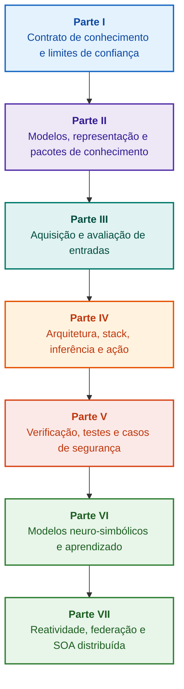

# Arquitetura de sistemas especialistas governados por evidências: das ontologias formais à IA neuro-simbólica

**Monografia de engenharia e manual de referência sobre projeto, modelos matemáticos, arquitetura e verificação de sistemas inteligentes de alta integridade (Safety-Critical & Evidence-Grounded AI)**

**Autor:** [Mykola Fedchyk](about-the-author.md) · [LinkedIn](https://www.linkedin.com/in/nickfedchik/)  
**Formato:** Monografia de engenharia / Manual de referência para arquitetos de sistemas de IA  
**Ano:** 2026  

---

## Sobre o livro

Esta monografia constitui uma pesquisa fundamental e um guia de engenharia dedicado a superar a principal crise da inteligência artificial contemporânea: a lacuna epistêmica entre a plausibilidade probabilística dos modelos neurais e a verdade determinística das provas formais. No centro da investigação situa-se uma exigência indispensável: **como projetar um sistema especialista cujas conclusões sejam irrefutáveis, plenamente rastreáveis até as fontes primárias e passíveis de certificação em domínios críticos de engenharia (ISO 26262, IEC 61508, DO-178C, ISO/SAE 21434)?**

O autor fundamenta e formaliza um novo paradigma: **a IA neuro-simbólica governada por evidências (Evidence-Grounded Neuro-Symbolic AI)**, no qual modelos estatísticos (LLM/SLM) desempenham uma função consultiva de geração de hipóteses e projeção, enquanto um núcleo simbólico determinístico garante de forma imutável os invariantes de consistência lógica, ancoragem de fatos ao nível do byte, controle de permissões e transição segura para a ação.

### Do artefato à decisão verificável

Requisitos de sistema, código-fonte, registros de ensaios, normas regulatórias e decisões de projeto já coexistem nos ambientes de produção, mas operam majoritariamente como artefatos isolados sem semântica formalizada e sem rastreabilidade bidirecional. Um relatório de qualificação aprovado pode fazer referência a uma revisão de hardware obsoleta; uma citação de norma de segurança pode estar descontextualizada; um rollback automático de configuração pode reativar inadvertidamente um componente revogado.

A monografia estabelece um trajeto de engenharia integral: desde a formalização de artefatos técnicos como dados tipados e pacotes de conhecimento assinados criptograficamente, até a inferência simbólica, a decomposição de planos, as explicações contrafactuais e a auditoria de limites de competência. A exposição apoia-se em implementações industriais em Go com suites completas de testes ([Capítulo 1](ch01-introduction-to-expert-systems.md)), contratos matemáticos rigorosos ([Parte II](part-02-knowledge-models.md)) e protocolos de aprendizado contínuo sem regressões ([Capítulo 25](ch25-how-expert-systems-learn.md)).

### Público-alvo

Esta obra destina-se a arquitetos de sistemas, engenheiros principais de confiabilidade e segurança funcional, desenvolvedores de motores de inferência e engenheiros do conhecimento. O domínio dos conceitos fundamentais requer conhecimentos elementares de lógica de predicados de primeira ordem, versionamento e ciclo de vida de software; a reprodução dos exemplos práticos exige as ferramentas padrão do ecossistema Go. Capítulos especializados dedicados à síntese de Goal Structuring Notation (GSN), à sinergética de sistemas complexos, aos aceleradores neuromórficos e à navegação autônoma sem GNSS abrem caminho para aplicações críticas aeroespaciais, automotivas e de infraestrutura energética.

---

## Contexto científico e posicionamento mundial da monografia

A monografia aborda os sistemas especialistas não como um legado obsoleto dos motores de regras dos anos 1980 (como CLIPS ou MYCIN), mas como a vanguarda da **IA neuro-simbólica de terceira onda governada por evidências (Third-Wave NeSy)**. A metodologia conecta as principais escolas acadêmicas mundiais com a engenharia de sistemas de alto desempenho:

| Disciplina científica | Obras fundamentais e autores | Ponte conceitual no livro |
|---|---|---|
| **IA neuro-simbólica de 3ª onda (NeSy)** | Artur d'Avila Garcez, Luis C. Lamb (*Neurosymbolic AI: The 3rd Wave*, 2023; *Neural-Symbolic Cognitive Reasoning*, Springer, 2009); Henry Kautz (*The Third AI Summer*, AAAI 2022) | Separação de responsabilidades: modelos estatísticos (SLM/LLM) geram hipóteses de consulta, enquanto um núcleo simbólico determinístico verifica e admite fatos ([Capítulo 29](ch29-neuro-symbolic-architecture.md)). |
| **Restrições semânticas e aprendizado seguro** | Guy Van den Broeck et al. (*A Semantic Loss Function for Deep Learning with Symbolic Knowledge*, ICML 2018); Luc De Raedt et al. (*DeepProbLog*, IJCAI 2020) | Gateways de admissão e egresso, filtragem semântica determinística de propostas neurais contra esquemas formais ([Capítulos 28](ch28-dual-mode-expert-systems.md), [33](ch33-inter-system-knowledge-exchange-and-model-teaching.md)). |
| **Raciocínio derrotável e teoria da argumentação** | John L. Pollock (*Defeasible Reasoning*, 1987; *Cognitive Carpentry*, MIT Press, 1995); Phan Minh Dung (*Abstract Argumentation Frameworks*, AIJ 1995); Douglas Walton (*Argumentation Schemes*, Cambridge, 2008) | Decomposição do conhecimento em asserções, proveniência e circunstâncias anuladoras (*rebutting* e *undercutting defeaters*); resolução de conflitos normativos via estruturas de Dung ([Capítulos 2](ch02-epistemology-of-machine-knowledge.md), [27](ch27-safety-case-gsn-synthesis.md)). |
| **Mineração autônoma de regras de associação (KBC)** | Luis Galárraga, Fabian M. Suchanek et al. (*AMIE: Association Rule Mining under Incomplete Evidence*, WWW 2013, VLDBJ 2015); Stephen Muggleton (*Inductive Logic Programming*, 1994) | Indução automática de regras em bases de conhecimento sob o pressuposto de completude parcial (PCA) sem contraexemplos inválidos de mundo aberto ([Capítulo 34](ch34-deterministic-relational-analysis-abduction-and-socratic-dialogue.md)). |
| **Escudos formais de segurança e certificação (Safe AI)** | Bettina Könighofer, Roderick Bloem et al. (*Shield Synthesis*, 2017); Tim Kelly, Rob Weaver (*Goal Structuring Notation*, York, 2004); André Platzer (*Logical Foundations of CPS*, Springer, 2018) | Síntese de casos de segurança em GSN para ISO 26262/21434; escudos formais e envelopes numéricos de validade para atuadores periféricos ([Capítulos 27](ch27-safety-case-gsn-synthesis.md), [30](ch30-safety-cybersecurity-co-engineering.md), [33](ch33-inter-system-knowledge-exchange-and-model-teaching.md)). |
| **Lógica epistêmica e semiótica do conhecimento** | John F. Sowa (*Knowledge Representation: Logical, Philosophical, and Computational Foundations*, 2000); Frank van Harmelen et al. (*Handbook of Knowledge Representation*, Elsevier, 2008) | Tríade epistêmica de Charles Sanders Peirce (Conceito → Julgamento → Inferência); geração abdutiva de hipóteses sob rigoroso controle dedutivo ([Capítulos 6](ch06-applied-mathematics-for-expert-systems.md), [34](ch34-deterministic-relational-analysis-abduction-and-socratic-dialogue.md)). |
| **Cibernética e sinergética de sistemas complexos** | Norbert Wiener (*Cybernetics*, 1948); W. Ross Ashby (*An Introduction to Cybernetics*, 1956); Hermann Haken (*Synergetics: An Introduction*, 1977; *Advanced Synergetics*, 1983); Ilya Prigogine (*Order out of Chaos*, 1984) | Lei da variedade necessária de Ashby, malhas fechadas de controle L0–L4, redução do espaço de fases a parâmetros de ordem via princípio de subordinação de Haken, alerta antecipado CSD e estabilização dissipativa ([Capítulos 6](ch06-applied-mathematics-for-expert-systems.md), [22](ch22-cybernetics-edge-to-backend.md), [35](ch35-self-organizing-expert-systems-synergetics-and-npu-runtime.md)). |
| **Testes de conhecimento, invariância e calibração de Lipschitz** | Kent Beck (*TDD*, 2002); Martin Fowler (*Refactoring*, 2018); Clark Barrett, Leonardo de Moura (*Z3 SMT Solver*, 2008); Chuan Guo et al. (*On Calibration of Modern Neural Networks*, ICML 2017); Marco Tulio Ribeiro et al. (*CheckList*, ACL 2020); John L. Pollock (*Defeasible Reasoning*, 1987) | Pirâmide de testes de conhecimento em quatro níveis (KTP): testes unitários de átomos (KUT) com mocks de premissas (`PremiseMock`), bloqueio de verdades vacuas, análise espectral de limites, reticulados de regras (KIT), índice de invariância semântica ($\text{SIS} \ge 0{,}98$) e continuidade lipschitziana ($L_{\mathcal{K}} \le L_{\max}$) contra oscilações de relé ([Capítulo 36](ch36-knowledge-testing-pyramid-and-variational-calibration.md)). |

---

## Modelos teóricos do autor, pesquisas científicas e inovações de engenharia

A monografia condensa as contribuições de pesquisa e engenharia de sistemas do autor em sistemas de alta integridade, arquiteturas embarcadas e IA governada por evidências:

### 1. Desenvolvimentos teóricos fundamentais e formalismos matemáticos

1. **Invariante de prova ao nível do byte (EGI) e gateway de ancoragem de fatos ([Capítulos 2](ch02-epistemology-of-machine-knowledge.md), [19](ch19-from-question-to-evidence.md), [28](ch28-dual-mode-expert-systems.md), [29](ch29-neuro-symbolic-architecture.md)):**
   * *Conceito teórico:* O autor formaliza o invariante de completude de ancoragem $\mathrm{Comp}(C) = 1{,}00$: nenhuma asserção atinge o status de fato sem projeção determinística sobre fontes primárias. Cada fato é respaldado por uma tupla criptográfica: coordenadas de byte imutáveis `[byte_start, byte_end]`, hash de citação `quote_sha256` e certificado de procedência PROV-O.
   * *Impacto na engenharia:* O gateway de admissão ao nível do byte impede a infiltração de alucinações na base de conhecimento versionada ($ZHR = 1{,}00$).
2. **Pirâmide de testes de conhecimento (KTP) e estabilidade de Lipschitz do espaço lógico ([Capítulo 36](ch36-knowledge-testing-pyramid-and-variational-calibration.md)):**
   * *Conceito teórico:* Transposição da pirâmide de testes de software para bases de conhecimento: testes unitários de regras (KUT) com mocks de antecedentes (`PremiseMock`), testes de integração de regras e defeaters (KIT), e calibração variacional (KVT).
   * *Aparato matemático:* Invariante contra verdades vacuas ($P \to Q$ quando $P \equiv \text{False}$), escore de invariância semântica ($\mathrm{SIS} \ge 0{,}98$) e limite de Lipschitz ($L_{\mathcal{K}} \le L_{\max}$), eliminando matematicamente instabilidades de conclusões sob ruídos de entrada.
3. **Falsificação popperiana de normas deônticas e auditor ativo de conformidade ([Capítulo 39](ch39-active-compliance-auditor-and-popperian-testing.md)):**
   * *Conceito teórico:* Transição do oráculo passivo para o auditor ativo de conformidade baseado no princípio de falseabilidade de Karl Popper. O sistema sonda espaços normativos (ASPICE 4.0, ISO 26262, ISO/SAE 21434), sintetiza contraexemplos e projeta campanhas de ensaio.
   * *Valor prático:* Articulação entre geração neural de casos limítrofes (Sistema 1) e validação deôntica determinística (Sistema 2), resguardando o operador humano da fadiga de aprovação.
4. **Redução sinergética de dimensionalidade e diagnóstico pré-bifurcação CSD ([Capítulos 6](ch06-applied-mathematics-for-expert-systems.md), [22](ch22-cybernetics-edge-to-backend.md), [35](ch35-self-organizing-expert-systems-synergetics-and-npu-runtime.md)):**
   * *Conceito teórico:* Aplicação da sinergética de Haken (parâmetros de ordem e princípio de subordinação) e das estruturas dissipativas de Prigogine a bases de conhecimento.
   * *Resultado científico:* Redução de espaços de fase de telemetria e integração de um detector de desaceleração crítica (*Critical Slowing Down*, CSD) para identificar instabilidades dinâmicas muito antes dos sensores de limite de emergência.
5. **Modelo de níveis de autonomia de ação (A0–A4), gateway de admissão e sagas idempotentes ([Capítulo 21](ch21-from-recommendation-to-action.md)):**
   * *Conceito teórico:* Escala discreta de autoridade operacional (de A0: análise passiva até A4: desligamento autônomo de emergência), vinculada à tupla $\langle\text{ação}, \text{ambiente}, \text{nível de risco}\rangle$.
   * *Aparato matemático:* Invariante algébrico de idempotência $f(f(x, k), k) \equiv f(x, k)$ via chave $k$ e sagas compensatórias distribuídas para tratar o estado `OutcomeUnknown`.
6. **Coengenharia formal de segurança funcional e cibersegurança em GSN ([Capítulos 27](ch27-safety-case-gsn-synthesis.md), [30](ch30-safety-cybersecurity-co-engineering.md)):**
   * *Conceito teórico:* Modelo unificado de síntese de árvores de argumentação GSN para atender conjuntamente à ISO 26262 (safety) e ISO/SAE 21434 (security).
   * *Avanço de engenharia:* Arbitragem matemática entre objetivos conflitantes (latência de reação vs. profundidade de atestação) e divulgação seletiva de evidências via árvores de Merkle com salt.
7. **Protocolo de verificação de fidelidade e consistência semântica de explicações ([Capítulo 20](ch20-explanation-engine.md)):**
   * *Conceito teórico:* A explicação é gerenciada como um artefato determinístico derivado do grafo de prova, do estado das regras e dos fatos admitidos.
   * *Aparato matemático:* Gateway métrico ($C_{\text{facts}} = 1{,}00, H_{\text{free}} = 1{,}00$) com transição automática para gabarito determinístico diante da menor divergência.

---

### 2. Pesquisas empíricas, bancadas de teste experimentais e engenharia de sistemas

1. **Pacotes binários imutáveis de conhecimento com `mmap` e zero alocações ([Capítulo 32](ch32-high-performance-knowledge-packs-mmap-and-harvesting.md)):**
   * *Inovação:* Arquitetura em duas camadas (camada canônica de fontes primárias + camada materializada de índices).
   * *Resultado empírico:* Mapeamento direto em memória (`mmap`), eliminação de alocações dinâmicas na heap e inicialização sub-linear independentemente do volume da ontologia.
2. **Polígono de calibração empírica nos corpora normativos IETF RFC-1000 e W3C-150 ([Capítulos 2](ch02-epistemology-of-machine-knowledge.md), [4](ch04-evolution-from-bayes-to-evidence-ai.md), [14](ch14-requirements-detection-and-formalization.md), [25](ch25-how-expert-systems-learn.md)):**
   * *Bancada de teste:* Avaliação rigorosa sobre 1.000 especificações IETF RFC e 150 casos diagnósticos W3C (incluindo contradições induzidas).
   * *Resultado prático:* Matrizes objetivas de exame, identificação de conflitos normativos e proteção comprovada contra regressões.
3. **Análise relacional multi-saltos, abdução simbólica e diálogo socrático ([Capítulo 34](ch34-deterministic-relational-analysis-abduction-and-socratic-dialogue.md)):**
   * *Desenvolvimento:* Algoritmo BFS bidirecional delimitado ($k \le 6$) com supressão de ciclos e síntese de cadeias de prova ao nível do byte.
   * *Vantagem:* Concretização da abdução de Peirce sob controle dedutivo e quadros socráticos de esclarecimento (*Clarification Frames*).
4. **Escudos formais de segurança e envelopes numéricos de validade para controle de borda ([Capítulo 33](ch33-inter-system-knowledge-exchange-and-model-teaching.md), [Apêndices B](appendix-b-robotics-and-cyber-physical-systems.md), [C](appendix-c-autonomous-navigation-and-geosearch.md), [E](appendix-e-mixed-signal-neuromorphic-expert-systems.md)):**
   * *Inovação:* Conversão de invariantes lógicos discretos em corredores contínuos de segurança para DSPs e navegação autônoma sem GNSS.
   * *Confiabilidade:* Intercâmbio de regras assinado com Ed25519 e interceptação em hardware de comandos de controle não autorizados.
5. **Defesa contra vazamento de informações confidenciais em explicações e auditoria diferencial ([Capítulo 20](ch20-explanation-engine.md)):**
   * *Desenvolvimento:* Protocolo de redução de representação ($\mathrm{EIR}_{\text{redacted}}$) com verificação de listas de controle de acesso (ACL) em cada nó e aresta do grafo de prova.

---

## Princípio de estruturação

As partes da monografia estruturam-se em torno de objetivos essenciais de engenharia e não por ordem cronológica ou nomes comerciais. Cada capítulo pertence a uma parte principal. Os números e nomes de arquivos permanecem identificadores fixos.

| Classe de seção | Pergunta do leitor | Função arquitetural no capítulo |
|---|---|---|
| Problema & Limites | Qual dificuldade técnica exata deve ser superada? | Definir a questão central e o domínio de validade |
| Objeto & Modelo | Quais dados, conhecimentos ou estados são processados? | Formalizar conceitos, tipos e premissas operacionais |
| Método & Procedimento | Como se obtém a dedução? | Detalhar algoritmos de inferência, transformação e controle |
| Implementação & Ferramentas | Com quais recursos se executa o procedimento? | Apresentar soluções concretas de software e hardware |
| Verificação & Benchmark | Como as falhas são caracterizadas sistematicamente? | Avaliar o resultado perante critérios independentes |
| Conclusões & Restrições | O que foi provado e o que permanece aberto? | Responder à tese sem promessas não comprováveis |

O relatório editorial completo ([editorial-structure-review.md](editorial-structure-review.md)) documenta a análise temática de cada capítulo.

## Rotas de leitura

**Primeira verificação de software:** [1](ch01-introduction-to-expert-systems.md) → [7](ch07-knowledge-base-typology.md) → [8](ch08-engineering-artifacts-as-data.md) → [17](ch17-implementation-stack.md) → [23](ch23-knowledge-base-verification.md) → [25](ch25-how-expert-systems-learn.md). Objetivo: Produzir veredicto reproduzível baseado em evidências com testes negativos e controle de mutações.

**Engenharia do conhecimento:** [Parte II](part-02-knowledge-models.md) → [Parte III](part-03-knowledge-engineering-nlp.md) → [19](ch19-from-question-to-evidence.md) → [20](ch20-explanation-engine.md) → [26](ch26-continual-learning.md). Objetivo: Alinhar semântica, proveniência, aquisição e validação de candidatos.

**Arquitetura de solução:** [16](ch16-expert-systems-architecture.md) → [19](ch19-from-question-to-evidence.md) → [31](ch31-syllogistic-reasoning-and-relation-lattices.md) → [20](ch20-explanation-engine.md) → [21](ch21-from-recommendation-to-action.md). Objetivo: Desacoplar verificação probatória, aplicação normativa, explicação e permissões de ação.

**Verificação e segurança:** [23](ch23-knowledge-base-verification.md) → [36](ch36-knowledge-testing-pyramid-and-variational-calibration.md) → [25](ch25-how-expert-systems-learn.md) → [26](ch26-continual-learning.md) → [27](ch27-safety-case-gsn-synthesis.md) → [30](ch30-safety-cybersecurity-co-engineering.md). Diagnóstico de sistemas externos através do [Capítulo 24](ch24-system-diagnosis.md).

**Sistemas híbridos e operação:** [Parte VI](part-06-frontiers-neuro-symbolic.md) → [Parte VII](part-07-runtime-and-knowledge-exchange.md) → [40](ch40-distributed-epistemic-architectures-soa-and-cluster-scaling.md) e apêndices. Objetivo: Integrar modelos de linguagem, gerenciar lacunas e construir SOAs epistêmicas distribuídas.

---

## Limites das garantias

Esta monografia constitui material acadêmico e de pesquisa, e não um procedimento certificado nem comprovação automática de conformidade. A execução determinística não garante a verdade empírica das premissas; hashes e assinaturas comprovam integridade, não acurácia física; grafos argumentativos não substituem o discernimento de engenheiros habilitados.

A extração automatizada não elimina a modelagem formal nem a revisão por pares. As garantias matemáticas aplicam-se no escopo estrito das premissas estabelecidas. As decisões de homologação e aceitação de risco permanecem sob responsabilidade exclusiva de engenheiros autorizados.

---

## Estrutura da obra

A monografia é composta por sete partes temáticas, 40 capítulos e cinco apêndices:

---

### [Parte I. Fundamentos conceituais e epistêmicos](part-01-foundations.md)

*Quando recorrer a sistemas especialistas, o que constitui conhecimento de máquina e preservação de justificativas organizacionais.*

* [Capítulo 1. Introdução aos sistemas especialistas: do caos ao conhecimento governado](ch01-introduction-to-expert-systems.md)
* [Capítulo 2. Filosofia para o engenheiro: o que a máquina tem o direito de chamar de conhecimento](ch02-epistemology-of-machine-knowledge.md)
* [Capítulo 3. Distinguindo o sistema especialista do sistema de informação e consulta](ch03-beyond-reference-information-systems.md)
* [Capítulo 4. Evolução dos sistemas especialistas: do teorema de Bayes à IA governada por evidências](ch04-evolution-from-bayes-to-evidence-ai.md)
* [Capítulo 5. A tríade da confiança: sistema especialista, recomendação demonstrável e memória corporativa](ch05-triad-of-trust-and-corporate-memory.md)

---

### [Parte II. Modelos matemáticos, representação e armazenamento de conhecimento](part-02-knowledge-models.md)

*Formalismos matemáticos, artefatos tipados, grafos de rastreabilidade e pacotes de conhecimento imutáveis.*

* [Capítulo 6. Matemática aplicada a sistemas especialistas: regras, probabilidades, grafos e causalidade](ch06-applied-mathematics-for-expert-systems.md)
* [Capítulo 7. Tipologia de bases de conhecimento: regras, ontologias, casos e vetores](ch07-knowledge-base-typology.md)
* [Capítulo 8. Artefatos de engenharia como dados do sistema especialista](ch08-engineering-artifacts-as-data.md)
* [Capítulo 9. Grafo de conhecimento de engenharia: rastreabilidade desde requisitos até o silício](ch09-engineering-knowledge-graph-traceability.md)
* [Capítulo 32. Pacotes de conhecimento imutáveis: admissão ao nível do byte, índices e mapeamento de memória](ch32-high-performance-knowledge-packs-mmap-and-harvesting.md)

---

### [Parte III. Aquisição de conhecimento, análise linguística e avaliação de entradas](part-03-knowledge-engineering-nlp.md)

*Documentos, experiência técnica e observações: extração de candidatos, análise linguística e avaliação de evidências.*

* [Capítulo 10. Sistemas de aquisição de conhecimento: fontes, gateways de admissão e ciclos de vida](ch10-knowledge-acquisition-systems.md)
* [Capítulo 11. Elicitação de conhecimento com especialistas de domínio: entrevistas, mapas cognitivos e formalização de práticas](ch11-knowledge-elicitation-from-experts.md)
* [Capítulo 12. Análise linguística e modelos locais: preservação de semântica e atribuição de fontes](ch12-linguistic-analysis-and-local-models.md)
* [Capítulo 13. Variabilidade da linguagem natural versus determinismo: compilação do sentido da consulta](ch13-language-variability-vs-determinism.md)
* [Capítulo 14. Detecção de requisitos e modalidades: do texto normativo aos invariantes formais](ch14-requirements-detection-and-formalization.md)
* [Capítulo 15. Extração de conhecimento e construção de bases: fatos, gramáticas e autômatos](ch15-knowledge-extraction-and-kb-construction.md)
* [Capítulo 37. Avaliação de informações de entrada: fontes, evidências e ceticismo algorítmico](ch37-input-information-assessment-and-algorithmic-skepticism.md)

---

### [Parte IV. Arquitetura, stack tecnológico, inferência e ação](part-04-architecture-and-inference.md)

*Contratos arquiteturais, ambiente de execução, inferência normativa, motor de explicações e malha de regulação.*

* [Capítulo 16. Arquitetura do sistema especialista: do conhecimento formalizado à ação governada por evidências](ch16-expert-systems-architecture.md)
* [Capítulo 17. O stack tecnológico: critérios de seleção de ferramentas, linguagens e motores de regras](ch17-implementation-stack.md)
* [Capítulo 18. Infraestrutura de execução: SLMs locais, aceleradores de hardware, Edge e On-Premise](ch18-execution-infrastructure.md)
* [Capítulo 19. Da pergunta à evidência: busca, ancoragem e verificação de asserções](ch19-from-question-to-evidence.md)
* [Capítulo 31. Inferência normativa: hierarquias de predicados, exceções e validade temporal](ch31-syllogistic-reasoning-and-relation-lattices.md)
* [Capítulo 20. Motor de explicações: decisões, recusa fundamentada e limites de competência](ch20-explanation-engine.md)
* [Capítulo 21. Da recomendação à ação: controle de autoridade e execução segura](ch21-from-recommendation-to-action.md)
* [Capítulo 22. A malha cibernética de controle: sensores, atuadores e realimentação fechada](ch22-cybernetics-edge-to-backend.md)

---

### [Parte V. Verificação, testes, diagnósticos e casos de segurança](part-05-verification-and-learning.md)

*Verificação formal de regras, pirâmide de testes de conhecimento, falsificação popperiana e casos GSN.*

* [Capítulo 23. Verificação da base de conhecimento: consistência, completude e robustez](ch23-knowledge-base-verification.md)
* [Capítulo 36. A pirâmide de testes de conhecimento: regras, interações e estabilidade variacional](ch36-knowledge-testing-pyramid-and-variational-calibration.md)
* [Capítulo 39. O auditor ativo de conformidade: falsificação popperiana, normas (ASPICE/ISO 26262/ISO 21434) e projeto de ensaios](ch39-active-compliance-auditor-and-popperian-testing.md)
* [Capítulo 24. Diagnóstico técnico: separação de sintomas e causas-raiz sob informação incompleta](ch24-system-diagnosis.md)
* [Capítulo 27. Engenharia de casos de segurança: síntese e verificação formal de argumentos GSN](ch27-safety-case-gsn-synthesis.md)
* [Capítulo 30. Coengenharia de segurança funcional e cibersegurança](ch30-safety-cybersecurity-co-engineering.md)

---

### [Parte VI. Modelos neuro-simbólicos, fronteiras cognitivas e aprendizado contínuo](part-06-frontiers-neuro-symbolic.md)

*Dedução estrita vs. hipóteses consultivas, integração de modelos de linguagem, combate a alucinações e aprendizado com a experiência.*

* [Capítulo 28. Sistemas especialistas bimodais: dedução estrita e hipótese consultiva](ch28-dual-mode-expert-systems.md)
* [Capítulo 29. Arquitetura neuro-simbólica: modelos de linguagem e verificação probatória de fatos](ch29-neuro-symbolic-architecture.md)
* [Capítulo 34. Lacunas de conhecimento: busca relacional, abdução e diálogo socrático](ch34-deterministic-relational-analysis-abduction-and-socratic-dialogue.md)
* [Capítulo 38. Mitigação de alucinações de máquina e déficits de conhecimento: controle baseado em evidências](ch38-curing-machine-hallucinations-and-knowledge-deficits.md)
* [Capítulo 25. Como os sistemas especialistas aprendem: matrizes de exame, auditorias de conhecimento e controle de regressões](ch25-how-expert-systems-learn.md)
* [Capítulo 26. Aprendizado contínuo (Continual Learning) com a experiência e mitigação de deriva](ch26-continual-learning.md)

---

### [Parte VII. Execução reativa, intercâmbio de conhecimento e SOA distribuída](part-07-runtime-and-knowledge-exchange.md)

*Execução reativa de regras, sinergética, federação entre sistemas e arquiteturas SOA distribuídas.*

* [Capítulo 35. Sistemas especialistas reativos: eventos, revogação e auto-organização do conhecimento](ch35-self-organizing-expert-systems-synergetics-and-npu-runtime.md)
* [Capítulo 33. Intercâmbio de conhecimento entre sistemas: fornecimento de regras, treinamento e realimentação segura](ch33-inter-system-knowledge-exchange-and-model-teaching.md)
* [Capítulo 40. Arquitetura epistêmica distribuída: Knowledge SOA, roteamento semântico e arbitragem multifonte](ch40-distributed-epistemic-architectures-soa-and-cluster-scaling.md)

---

### Apêndices

* [Apêndice A. Framework prático de pesquisa governada por evidências em projetos complexos de engenharia](appendix-a-evidence-governed-framework.md)
* [Apêndice B. Sistemas especialistas governados por evidências em robótica autônoma e sistemas ciberfísicos](appendix-b-robotics-and-cyber-physical-systems.md)
* [Apêndice C. Navegação autônoma sem GNSS: correspondência geoespacial (TRN/DSMAC), odometria visual (VIO) e fusão sensorial](appendix-c-autonomous-navigation-and-geosearch.md)
* [Apêndice D. Sistemas especialistas analógicos, computação neuromórfica e inferência em hardware](appendix-d-analog-expert-systems-and-neuromorphic-computing.md)
* [Apêndice E. Sistemas especialistas mistos analógico-digitais sob controle governado por evidências](appendix-e-mixed-signal-neuromorphic-expert-systems.md)
* [Sobre o autor: Mykola Fedchyk (Nick Fedchik)](about-the-author.md)

---

## Linhas de pesquisa

As linhas futuras de pesquisa abrangem: compilação reproduzível de pacotes de conhecimento sem alocação dinâmica; verificação de fragmentos formais restritos; governança de agentes via contratos explícitos de autoridade; verificação com provas de conhecimento zero (ZKP); bem como revogação controlada e desaprendizado de máquina (*machine unlearning*). Provar uma propriedade no modelo não certifica automaticamente o equipamento físico.

Para aceleradores de hardware, taxas de erro, latências e comportamentos sob falha devem ser quantificados previamente ([Capítulos 29](ch29-neuro-symbolic-architecture.md), [32](ch32-high-performance-knowledge-packs-mmap-and-harvesting.md), [Apêndices D](appendix-d-analog-expert-systems-and-neuromorphic-computing.md) e [E](appendix-e-mixed-signal-neuromorphic-expert-systems.md)). O programa empírico para os capítulos 7 a 11 é detalhado na [Parte II](part-02-knowledge-models.md).
