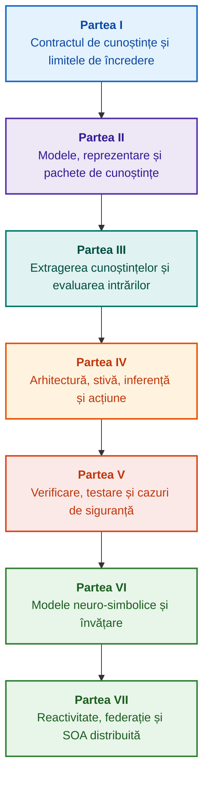

# Arhitectura sistemelor experte guvernate de dovezi: De la ontologii formale la IA neuro-simbolică

**Monografie inginerească și ghid de referință pentru proiectarea, fundamentele matematice, arhitectura și verificarea sistemelor inteligente de înaltă integritate (Safety-Critical & Evidence-Grounded AI)**

**Autor:** [Mykola Fedchyk](../en/about-the-author.md) · [LinkedIn](https://www.linkedin.com/in/nickfedchik/)  
**Format:** Monografie inginerească / Ghid de birou al arhitectului AI  
**An:** 2026  

---

## Despre carte

Această monografie reprezintă o investigație fundamentală de cercetare și un ghid ingineresc dedicat depășirii crizei majore a inteligenței artificiale moderne: decalajul epistemic dintre plauzibilitatea probabilistică a generărilor rețelelor neuronale și adevărul determinist al demonstrațiilor matematice formale. În centrul acestei cercetări se află o întrebare fără compromisuri: **cum putem proiecta un sistem expert a cărui fiecare concluzie este irefutabilă, complet trasabilă până la sursele primare de dovezi și aptă pentru certificare în domenii inginerești critice pentru siguranță (ISO 26262, IEC 61508, DO-178C, ISO/SAE 21434)?**

Autorul fundamentează și introduce o nouă paradigmă: **IA Neuro-Simbolică Guvernată de Dovezi (Evidence-Grounded Neuro-Symbolic AI)**, în care modelele statistice (LLM/SLM) îndeplinesc o funcție consultativă de generare de ipoteze și proiecții, în timp ce un nucleu simbolic determinist garantează imuabil invarianții de consistență logică, ancorare a faptelor la nivel de octet, impunere a limitelor de autoritate și tranziție sigură la execuție.

### De la artefact la decizie verificabilă

Cerințele de sistem, codul sursă, jurnalele de execuție a testelor, standardele de reglementare și deciziile inginerești pătrund astăzi mediile de producție moderne. Cu toate acestea, ele funcționează predominant ca artefacte deconectate, lipsite de semantică formalizată, limite explicite de validitate și trasabilitate bidirecțională. Un raport de calificare a testelor validat poate face referire la o revizie hardware învechită; un citat dintr-un standard de siguranță funcțională poate fi rupt din context; o revenire automată a configurației de urgență poate reactiva involuntar o componentă revocată.

Această monografie stabilește un flux ingineresc complet: de la formalizarea artefactelor inginerești ca date tipizate și pachete de cunoștințe semnate criptografic, până la inferența simbolică, descompunerea planurilor pas cu pas, explicațiile contrafactuale și auditul limitelor de competență. Expunerea practică este susținută de implementări de nivel de producție în limbajul Go, însoțite de suite exhaustive de teste ([Capitolul 1](../en/ch01-introduction-to-expert-systems.md)), contracte matematice riguroase ([Partea II](../en/part-02-knowledge-models.md)) și protocoale de învățare continuă care elimină demonstrabil regresia cunoștințelor ([Capitolul 25](../en/ch25-how-expert-systems-learn.md)).

### Publicul țintă

Cartea este adresată arhitecților de sisteme, inginerilor principali de fiabilitate și siguranță funcțională, dezvoltatorilor de motoare de inferență și inginerilor de cunoștințe. Înțelegerea inițială a conceptelor de bază necesită doar o familiarizare fundamentală cu logica predicatelor de ordinul întâi, versionarea software-ului și managementul ciclului de viață; reproducerea exemplelor practice utilizează uneltele standard din ecosistemul Go. Capitolele specializate care abordează sinteza formală Goal Structuring Notation (GSN), sinergetica sistemelor complexe, acceleratoarele neuromorfice și navigația autonomă fără semnal GNSS explorează frontierele avansate ale IA guvernate de dovezi în industria aerospațială, vehicule autonome și infrastructuri critice.

---

## Context științific și plasarea globală a monografiei

Această monografie nu abordează sistemele experte ca pe o moștenire arhaică a sistemelor bazate pe reguli din anii 1980 (cum ar fi CLIPS sau MYCIN), ci ca pe avangarda **celui de-al treilea val al IA neuro-simbolice guvernate de dovezi (Third-Wave Evidence-Grounded Neuro-Symbolic AI)**. Metodologia conectează fundamentele teoretice ale școlilor științifice globale de elită cu ingineria sistemelor de înaltă performanță:

| Disciplină științifică | Lucrări și autori de referință la nivel global | Punte conceptuală în această monografie |
|---|---|---|
| **IA neuro-simbolică a celui de-al treilea val (NeSy)** | Artur d'Avila Garcez, Luis C. Lamb (*Neurosymbolic AI: The 3rd Wave*, 2023; *Neural-Symbolic Cognitive Reasoning*, Springer, 2009); Henry Kautz (*The Third AI Summer*, AAAI 2022) | Separarea responsabilităților: modelele statistice (SLM/LLM) generează ipoteze de interogare, în timp ce un nucleu simbolic determinist verifică formal și admite faptele ([Capitolul 29](../en/ch29-neuro-symbolic-architecture.md)). |
| **Constrângeri semantice și învățare sigură** | Guy Van den Broeck et al. (*A Semantic Loss Function for Deep Learning with Symbolic Knowledge*, ICML 2018); Luc De Raedt et al. (*DeepProbLog*, IJCAI 2020) | Porți de admitere și ieșire, filtrare semantică deterministă a aserțiunilor candidate generate de rețele neuronale în raport cu scheme formale ([Capitolele 28](../en/ch28-dual-mode-expert-systems.md), [33](../en/ch33-inter-system-knowledge-exchange-and-model-teaching.md)). |
| **Raționament revocabil și teoria argumentării** | John L. Pollock (*Defeasible Reasoning*, 1987; *Cognitive Carpentry*, MIT Press, 1995); Phan Minh Dung (*Abstract Argumentation Frameworks*, AIJ 1995); Douglas Walton (*Argumentation Schemes*, Cambridge, 2008) | Descompunerea cunoștințelor în revendicări, proveniență și infirmatori (*defeaters*: *rebutting* și *undercutting*); rezolvarea conflictelor în baze de reguli normative prin cadre de argumentare Dung ([Capitolele 2](../en/ch02-epistemology-of-machine-knowledge.md), [27](../en/ch27-safety-case-gsn-synthesis.md)). |
| **Extragerea automată a regulilor de asociere (KBC)** | Luis Galárraga, Fabian M. Suchanek et al. (*AMIE: Association Rule Mining under Incomplete Evidence*, WWW 2013, VLDBJ 2015); Stephen Muggleton (*Inductive Logic Programming*, 1994) | Inducerea autonomă a regulilor din baze de cunoștințe sub Ipoteza Completitudinii Parțiale (PCA), eliminând contraexemplele false din lumea deschisă ([Capitolul 34](../en/ch34-deterministic-relational-analysis-abduction-and-socratic-dialogue.md)). |
| **Scuturi formale de siguranță și certificare (Safe AI)** | Bettina Könighofer, Roderick Bloem et al. (*Shield Synthesis*, 2017); Tim Kelly, Rob Weaver (*Goal Structuring Notation*, York, 2004); André Platzer (*Logical Foundations of CPS*, Springer, 2018) | Sinteza argumentelor structurate de siguranță în notație GSN pentru standardele ISO 26262/21434; scuturi formale și anvelope numerice de validitate pentru acționare la nivel edge ([Capitolele 27](../en/ch27-safety-case-gsn-synthesis.md), [30](../en/ch30-safety-cybersecurity-co-engineering.md), [33](../en/ch33-inter-system-knowledge-exchange-and-model-teaching.md)). |
| **Logică epistemică și semiotica cunoașterii** | John F. Sowa (*Knowledge Representation: Logical, Philosophical, and Computational Foundations*, 2000); Frank van Harmelen et al. (*Handbook of Knowledge Representation*, Elsevier, 2008) | Triada epistemică a lui Charles Sanders Peirce (Concept → Judecată → Raționament); generarea abductivă a ipotezelor de lucru sub control deductiv strict ([Capitolele 6](../en/ch06-applied-mathematics-for-expert-systems.md), [34](../en/ch34-deterministic-relational-analysis-abduction-and-socratic-dialogue.md)). |
| **Cibernetica și sinergetica sistemelor complexe** | Norbert Wiener (*Cybernetics*, 1948); W. Ross Ashby (*An Introduction to Cybernetics*, 1956); Hermann Haken (*Synergetics: An Introduction*, 1977; *Advanced Synergetics*, 1983); Ilya Prigogine (*Order out of Chaos*, 1984) | Legea varietății necesare a lui Ashby, bucle închise de control L0–L4, reducerea spațiului stărilor la parametri de ordine prin principiul aservirii al lui Haken, avertizare timpurie a tranzițiilor de fază prin încetinire critică (CSD) și stabilizare disipativă a bazelor de cunoștințe ([Capitolele 6](../en/ch06-applied-mathematics-for-expert-systems.md), [22](../en/ch22-cybernetics-edge-to-backend.md), [35](../en/ch35-self-organizing-expert-systems-synergetics-and-npu-runtime.md)). |
| **Testarea cunoștințelor, invarianță și calibrare Lipschitz** | Kent Beck (*TDD*, 2002); Martin Fowler (*Refactoring*, 2018); Clark Barrett, Leonardo de Moura (*Z3 SMT Solver*, 2008); Chuan Guo et al. (*On Calibration of Modern Neural Networks*, ICML 2017); Marco Tulio Ribeiro et al. (*CheckList*, ACL 2020); John L. Pollock (*Defeasible Reasoning*, 1987) | Piramida de testare a cunoștințelor pe patru niveluri (KTP): testare unitară izolată a regulilor atomice (KUT) cu simularea antecedentelor (`PremiseMock`), eliminarea capcanei adevărului vid, analiza spectrală a valorilor limită în 6 puncte (BVA), rețele de reguli și infirmatori (KIT), scor de invarianță semantică ($\text{SIS} \ge 0.98$) la mutații lingvistice ale interogărilor, limite de continuitate Lipschitz ($L_{\mathcal{K}} \le L_{\max}$) pentru a preveni oscilația releelor și captarea stigmergică a lacunelor de cunoaștere ([Capitolul 36](../en/ch36-knowledge-testing-pyramid-and-variational-calibration.md)). |

---

## Modele teoretice, cercetare științifică și inovații inginerești ale autorului

Această monografie sintetizează cercetarea fundamentală și contribuțiile de inginerie de sistem ale autorului în domeniul software-ului critic, al arhitecturilor integrate și al IA guvernate de dovezi. Spre deosebire de literatura pur expozitivă, cartea introduce o suită de teorii formale originale, protocoale și modele arhitecturale care ridică interacțiunile neuro-simbolice la un nivel de încredere verificat matematic:

### 1. Dezvoltări teoretice fundamentale și formalisme matematice

1. **Invariantul Ancorat în Dovezi (EGI) și Poarta de Validare a Faptelor ([Capitolele 2](../en/ch02-epistemology-of-machine-knowledge.md), [19](../en/ch19-from-question-to-evidence.md), [28](../en/ch28-dual-mode-expert-systems.md), [29](../en/ch29-neuro-symbolic-architecture.md)):**
   * *Formulare teoretică:* Autorul formalizează Invariantul de Completitudine a Ancorării $\mathrm{Comp}(C) = 1.00$, stabilind că, într-o arhitectură guvernată de dovezi, nicio aserțiune nu poate fi ridicată la rangul de fapt recunoscut fără o proiecție deterministă pe surse primare autoritare. Fiecare tuplu de fapt admis este ancorat de decalaje imuabile de octeți `[byte_start, byte_end]`, un hash criptografic canonic de fragment `quote_sha256` și un identificator de certificat de proveniență PROV-O.
   * *Impact ingineresc:* Poarta hardware/software de admitere la nivel de octet împiedică halucinațiile rețelelor neuronale să pătrundă în baza de cunoștințe versionată, garantând o toleranță zero față de afirmațiile nefondate ($ZHR = 1.00$).
2. **Piramida de Testare a Cunoștințelor pe Patru Niveluri (KTP) și Continuitatea Lipschitz a Spațiului Logic ([Capitolul 36](../en/ch36-knowledge-testing-pyramid-and-variational-calibration.md)):**
   * *Formulare teoretică:* Autorul introduce Piramida de Testare a Cunoștințelor (KTP), transpunând disciplina piramidei de testare software a lui Fowler în sistemele de cunoștințe: testarea unitară izolată a regulilor (KUT) prin simularea condițiilor premiselor (`PremiseMock`), testarea de integrare a interacțiunilor dintre reguli și infirmatori (KIT) și calibrarea variațională pe varietăți de interogări (KVT).
   * *Aparat matematic:* Formalizarea unui invariant care previne adevărul vid ($P \to Q$ unde $P \equiv \text{False}$), a unui scor de invarianță semantică ($\mathrm{SIS} \ge 0.98$) la perturbații lingvistice și a unei constrângeri de continuitate Lipschitz pe varietatea de inferență ($L_{\mathcal{K}} \le L_{\max}$), care elimină matematic oscilația catastrofală a releelor la variații minore ale intrărilor.
3. **Falsificarea Popperiană a Normelor Deontice și Auditul Activ de Conformitate ([Capitolul 39](../en/ch39-active-compliance-auditor-and-popperian-testing.md)):**
   * *Formulare teoretică:* O schimbare de paradigmă de la un oracol pasiv (care răspunde doar la interogări) la un auditor activ de conformitate care implementează principiul falsificabilității formulat de Karl Popper. Sistemul sondează autonom spațiul specificațiilor (ASPICE 4.0, ISO 26262, ISO/SAE 21434), sintetizează contraexemple, identifică condiții limită slab specificate și proiectează campanii exhaustive de verificare.
   * *Valoare practică:* Îmbinarea generării neuronale a cazurilor limită (Sistemul 1) cu verificarea deontică deterministă prin nucleul simbolic (Sistemul 2), protejând în același timp omul din bucla de control (Human-in-the-Loop) de oboseala decizională.
4. **Reducerea Sinergetică a Dimensionalității Bazelor de Cunoștințe și Diagnosticarea CSD Pre-Bifurcație ([Capitolele 6](../en/ch06-applied-mathematics-for-expert-systems.md), [22](../en/ch22-cybernetics-edge-to-backend.md), [35](../en/ch35-self-organizing-expert-systems-synergetics-and-npu-runtime.md)):**
   * *Formulare teoretică:* Aplicarea sinergeticii lui Hermann Haken (parametri de ordine și principiul aservirii) și a structurilor disipative ale lui Ilya Prigogine la evoluția depozitelor complexe de cunoștințe.
   * *Contribuție științifică:* Spațiile fazice multidimensionale ale telemetriei sunt reduse la parametri de ordine, integrând un detector de Încetinire Critică (CSD) pre-bifurcație bazat pe metrici de autocorelație și varianță. Acest lucru permite detectarea instabilităților cibernetico-fizice iminente cu mult înainte ca monitorizările convenționale de prag să declanșeze alarme.
5. **Modelul Nivelurilor de Autonomie a Acțiunilor (A0–A4), Porți de Validare și Saga Idempotente ([Capitolul 21](../en/ch21-from-recommendation-to-action.md)):**
   * *Formulare teoretică:* Un cadru granular de autoritate pentru execuția automatizată (A0: analiză pasivă, A1: generare proiect, A2: execuție semnată de om, A3: autonomie delimitată supravegheată, A4: oprire de urgență fail-closed). Permisiunile nu sunt legate de sistem ca monolit, ci de tuplul $\langle\text{acțiune}, \text{mediu}, \text{nivel de risc}\rangle$.
   * *Aparat matematic:* Invariant algebric de idempotență $f(f(x, k), k) \equiv f(x, k)$ securizat prin token criptografic $k$, execuție pas cu pas în buclă închisă și un protocol distribuit de saga compensatorii care rezolvă stările `OutcomeUnknown` prin verificarea post-condițiilor în afara benzii principale.
6. **Co-Ingineria Formală a Siguranței Funcționale și Securității Cibernetice în GSN ([Capitolele 27](../en/ch27-safety-case-gsn-synthesis.md), [30](../en/ch30-safety-cybersecurity-co-engineering.md)):**
   * *Formulare teoretică:* Metodologie unificată de sinteză Goal Structuring Notation (GSN) care armonizează constrângerile simultane ale standardelor ISO 26262 (siguranță) și ISO/SAE 21434 (securitate cibernetică).
   * *Inovație inginerească:* Arbitraj matematic între obiective conflictuale (limite de latență a răspunsului de urgență vs. profunzimea atestării criptografice), combinat cu un protocol de divulgare selectivă a dovezilor către auditorii externi prin arbori Merkle sărați.
7. **Protocolul de Fidelitate a Explicațiilor și Verificare a Consistenței Semantice ([Capitolul 20](../en/ch20-explanation-engine.md)):**
   * *Formulare teoretică:* Explicațiile nu sunt tratate ca un text generativ liber, ci ca artefacte deterministe de prim ordin derivate strict din graful demonstrației, etichetele de versiune ale regulilor și instantaneele înghețate ale faptelor.
   * *Aparat matematic:* Validare metrică formală a fidelității explicațiilor ($C_{\text{facts}} = 1.00, H_{\text{free}} = 1.00$) susținută de revenire automată pe șabloane rigide la cea mai mică discrepanță între deducția simbolică și textul în limbaj natural destinat operatorului.

---

### 2. Cercetare empirică, platforme experimentale ale autorului și inginerie de sistem

1. **Pachete Binare Imuabile de Cunoștințe cu `mmap` și Deserializare Fără Alocare ([Capitolul 32](../en/ch32-high-performance-knowledge-packs-mmap-and-harvesting.md)):**
   * *Inovație a autorului:* Arhitectură de pachete pe două niveluri care separă arhivele canonice ale surselor primare de segmentele de index materializate derivate.
   * *Rezultat empiric:* Maparea directă a memoriei prin `mmap` în spațiul virtual de adrese elimină alocările pe heap la runtime (zero-allocation) și asigură latențe subliniare de pornire a motorului, indiferent de dimensiunea multigiagabait a ontologiilor.
2. **Platformă Experimentală de Calibrare pe Corpurile de Reglementare IETF RFC-1000 și W3C-150 ([Capitolele 2](../en/ch02-epistemology-of-machine-knowledge.md), [4](../en/ch04-evolution-from-bayes-to-evidence-ai.md), [14](../en/ch14-requirements-detection-and-formalization.md), [25](../en/ch25-how-expert-systems-learn.md)):**
   * *Platformă a autorului:* Implementarea unui cadru de evaluare pe scară largă pe 1.000 de specificații IETF RFC active (acoperind 5 epoci cronologice ale internetului) și 150 de interogări de diagnosticare complexe pe corpul W3C (inclusiv conflicte logice induse și confabulații).
   * *Constatare practică:* Construirea de matrici obiective de examinare a cunoștințelor, identificarea empirică a contradicțiilor normative și apărarea validată matematic împotriva regresiei bazei de cunoștințe în timpul actualizărilor continue.
3. **Analiză Relațională Multi-Pas, Abducție Simbolică și Dialog Socratic ([Capitolul 34](../en/ch34-deterministic-relational-analysis-abduction-and-socratic-dialogue.md)):**
   * *Inovație a autorului:* Algoritm bidirecțional limitat de căutare în lățime (Bounded BFS, $k \le 6$) cu suprimarea ciclurilor și sinteza lanțurilor compozite de dovezi la nivel de octet între entități interconectate.
   * *Avantaj ingineresc:* Realizarea abducției simbolice peirciene sub constrângeri deductive stricte, combinată cu Cadre Socratice de Clarificare (Clarification Frames) care ghidează sistemul într-un dialog productiv cu utilizatorul în loc de respingerea oarbă sub Ipoteza Lumii Închise (CWA).
4. **Scuturi Formale de Siguranță și Anvelope Numerice de Validitate pentru Control la Margine ([Capitolul 33](../en/ch33-inter-system-knowledge-exchange-and-model-teaching.md), [Anexele B](../en/appendix-b-robotics-and-cyber-physical-systems.md), [C](../en/appendix-c-autonomous-navigation-and-geosearch.md), [E](../en/appendix-e-mixed-signal-neuromorphic-expert-systems.md)):**
   * *Inovație a autorului:* Metodologie de translatare a invarianților logici discreți în coridoare numerice continue de siguranță pentru procesoare de semnal digital (DSP) și navigație fără GNSS (TRN/DSMAC/VIO).
   * *Fiabilitate operațională:* Schimb de reguli semnate criptografic prin Ed25519, carantinare izolată a regulilor candidate și interceptare la nivel hardware a traiectoriilor nevalide ale actuatoarelor.
5. **Apărare Împotriva Scurgerilor de Informații Confidențiale prin Explicații și Audit Diferențial ([Capitolul 20](../en/ch20-explanation-engine.md)):**
   * *Inovație a autorului:* Protocol de reducere a reprezentării intermediare a explicațiilor ($\mathrm{EIR}_{\text{redacted}}$) care impune liste de control al accesului (ACL) la fiecare nod și muchie a grafului de demonstrație, neutralizând atacurile prin canale laterale de reconstrucție a modelului declanșate prin interogări contrastive DE CE NU (WHY NOT).

---

## Principiu de structurare

Părțile acestei monografii sunt structurate în jurul obiectivelor inginerești primare, mai degrabă decât după date cronologice de publicare sau denumiri tehnologice tranzitorii. Fiecare capitol aparține unei singure părți principale; tehnicile asociate ilustrează metode de abordare a tezei sale centrale. Numerele capitolelor și identificatorii de fișiere rămân chei permanente, permițând secvențelor tematice de lectură să difere de ordinea numerică.

Clasele de secțiuni din cadrul capitolelor stabilesc o argumentație coerentă, mai degrabă decât un catalog de tehnologii echivalente:

| Clasă de secțiune | Întrebarea cititorului | Funcție arhitecturală în capitol |
|---|---|---|
| Problemă și limite | Ce provocare exactă trebuie rezolvată? | Definirea nucleului cercetării și domeniului de validitate |
| Obiect și model | Ce date, cunoștințe sau stări sunt evaluate? | Formalizarea conceptelor, tipurilor și premiselor operaționale |
| Metodă și procedură | Cum se deduce soluția? | Detalierea algoritmilor de deducție, transformare și control |
| Implementare și unelte | Ce software sau hardware execută procedura? | Prezentarea listelor de cod concrete și a contractelor arhitecturale |
| Verificare și benchmark | Cum sunt expuse sistematic modurile de defectare? | Evaluarea performanței și corectitudinii după criterii independente |
| Concluzie și limitări | Ce a fost demonstrat și ce rămâne deschis? | Răspuns la teza centrală fără afirmații nefondate |

Geografia, sectoarele industriale specifice și platformele comerciale funcționează ca contexte de aplicare și nu ca niveluri distincte în această taxonomie. Glosarele, abrevierile, bibliografiile și navigarea prin index constituie aparatul de referință, nu teme autonome de capitol.

Revizuirea editorială structurală completă oferă o evaluare a temei centrale a fiecărui capitol, a delimitărilor dintre subiectele adiacente și a notelor compoziționale. Actualizarea unui rezumat nu implică faptul că toate riscurile compoziționale interne din capitole au fost rezolvate.

## Trasee de lectură

**Prima verificare software:** [1](../en/ch01-introduction-to-expert-systems.md) → [7](../en/ch07-knowledge-base-typology.md) → [8](../en/ch08-engineering-artifacts-as-data.md) → [17](../en/ch17-implementation-stack.md) → [23](../en/ch23-knowledge-base-verification.md) → [25](../en/ch25-how-expert-systems-learn.md). Obiectiv: Obținerea unui verdict reproductibil, ancorat în dovezi, cu teste negative și mutație controlată a cunoștințelor. Modelul de limbaj este opțional.

**Ingineria cunoștințelor:** [Partea II](../en/part-02-knowledge-models.md) → [Partea III](../en/part-03-knowledge-engineering-nlp.md) → [19](../en/ch19-from-question-to-evidence.md) → [20](../en/ch20-explanation-engine.md) → [26](../en/ch26-continual-learning.md). Obiectiv: Armonizarea semanticii formale, a provenienței, a extragerii candidaților și a validării. Partea II păstrează programul de cercetare empirică trans-secțional pentru Capitolele 7–11.

**Arhitectura soluțiilor:** [16](../en/ch16-expert-systems-architecture.md) → [19](../en/ch19-from-question-to-evidence.md) → [31](../en/ch31-syllogistic-reasoning-and-relation-lattices.md) → [20](../en/ch20-explanation-engine.md) → [21](../en/ch21-from-recommendation-to-action.md). Obiectiv: Decuplarea verificării dovezilor, aplicării regulilor normative, generării explicațiilor și autorității de acțiune operațională.

**Verificare și siguranță:** [23](../en/ch23-knowledge-base-verification.md) → [36](../en/ch36-knowledge-testing-pyramid-and-variational-calibration.md) → [25](../en/ch25-how-expert-systems-learn.md) → [26](../en/ch26-continual-learning.md) → [27](../en/ch27-safety-case-gsn-synthesis.md) → [30](../en/ch30-safety-cybersecurity-co-engineering.md). Diagnosticarea fizică externă este abordată în [Capitolul 24](../en/ch24-system-diagnosis.md).

**Răspunsuri hibride și implementare operațională:** [Partea VI](../en/part-06-frontiers-neuro-symbolic.md) → [Partea VII](../en/part-07-runtime-and-knowledge-exchange.md) → [40](../en/ch40-distributed-epistemic-architectures-soa-and-cluster-scaling.md) și anexele relevante. Obiectiv: Integrarea modelelor de limbaj neuronale, gestionarea decalajelor epistemice, arhitectura clusterelor distribuite de servicii de cunoștințe și verificarea federațiilor inter-sisteme. Capitolele [2](../en/ch02-epistemology-of-machine-knowledge.md), [4](../en/ch04-evolution-from-bayes-to-evidence-ai.md) și [6](../en/ch06-applied-mathematics-for-expert-systems.md) pot fi consultate la cerere ca definire a contractelor, evoluție istorică și fundamente matematice.

---

## Domeniul de aplicare al afirmațiilor și limite inginerești

Această monografie constituie material educațional și de cercetare fundamentală; nu reprezintă o procedură certificată de conformitate și nici o dovadă de sine stătătoare a conformității echipamentelor cu standardele industriale. Execuția deterministă nu garantează acuratețea factuală a premiselor; hash-urile și semnăturile digitale dovedesc integritatea, nu adevărul empiric; grafurile de argumentare nu înlocuiesc judecata umană certificată. Cerințele de fiabilitate la nivel de sistem nu pot fi echivalate cu ratele de eroare a tokenilor modelelor de limbaj și nici extrapolate automat pe toate modulele software.

Analiza și extragerea automatizate reduc mișcarea manuală a datelor, dar nu elimină necesitatea modelării formale, a revizuirii de către colegi (peer review) și a desemnării custozilor responsabili de cunoștințe (knowledge custodians). Ontologiile din Protégé, auditurile manuale și procesele automate de colectare funcționează sincronizat. Garanțiile matematice sunt circumscrise de profile explicite de limbaje formale și ipoteze de mediu; măsurătorile de debit reflectă sarcini de lucru specifice, corpuri de date și medii de execuție concrete. Valorile metrice istorice din implementările de producție anterioare ale autorului sunt delimitate strict de platformele educaționale deschise și de cercetările active.

Deciziile finale privind lansarea în producție, acceptarea riscurilor și conformitatea cu reglementările revin exclusiv inginerilor umani autorizați. Un sistem expert guvernat de dovezi pregătește piste de audit verificabile și impune politicile de siguranță convenite; acesta nu preia suveranitatea decizională a reglementărilor.

---

## Structura cărții

Monografia este organizată în șapte părți tematice, cuprinzând 40 de capitole și cinci anexe. Fiecare capitol aparține unei singure părți principale. Secvențele de navigare urmează harta tematică de mai jos; numerele capitolelor și căile fișierelor rămân nemodificate.

---

### [Partea I. Fundamente conceptuale și epistemice](../en/part-01-foundations.md)

*Când este necesar un sistem expert, ce constituie cunoașterea mașinii și cum se păstrează justificarea organizațională.*

* [Capitolul 1. Introducere în sistemele experte: De la haos la cunoaștere guvernată](../en/ch01-introduction-to-expert-systems.md)
* [Capitolul 2. Filosofie pentru inginerul de sisteme: Ce au dreptul mașinile să numească cunoaștere](../en/ch02-epistemology-of-machine-knowledge.md)
* [Capitolul 3. Delimitarea sistemelor experte de sistemele informaționale de referință](../en/ch03-beyond-reference-information-systems.md)
* [Capitolul 4. Evoluția sistemelor experte: De la teorema lui Bayes la IA guvernată de dovezi](../en/ch04-evolution-from-bayes-to-evidence-ai.md)
* [Capitolul 5. Triada încrederii: Sistemul expert, recomandarea verificabilă și memoria corporativă](../en/ch05-triad-of-trust-and-corporate-memory.md)

---

### [Partea II. Modele matematice, reprezentarea și stocarea cunoștințelor](../en/part-02-knowledge-models.md)

*Alegerea formalismelor matematice, artefacte tipizate, grafuri de trasabilitate inginerească și pachete imuabile de cunoștințe.*

* [Capitolul 6. Matematici aplicate pentru sisteme experte: Reguli, probabilități, grafuri și cauzalitate](../en/ch06-applied-mathematics-for-expert-systems.md)
* [Capitolul 7. Tipologia bazelor de cunoștințe: Reguli, ontologii, cazuri și reprezentări vectoriale](../en/ch07-knowledge-base-typology.md)
* [Capitolul 8. Artefactele inginerești ca date ale sistemului expert](../en/ch08-engineering-artifacts-as-data.md)
* [Capitolul 9. Graful de cunoștințe inginerești: Trasabilitate cap-la-cap de la cerințe la siliciu](../en/ch09-engineering-knowledge-graph-traceability.md)
* [Capitolul 32. Pachete imuabile de cunoștințe: Validare la nivel de octet, indexuri și mapare în memorie](../en/ch32-high-performance-knowledge-packs-mmap-and-harvesting.md)

---

### [Partea III. Extragerea cunoștințelor, analiză lingvistică și evaluarea intrărilor](../en/part-03-knowledge-engineering-nlp.md)

*Documente, expertiză umană și observații senzoriale: extragerea candidaților, analiză lingvistică, formalizare și evaluarea dovezilor.*

* [Capitolul 10. Sisteme de achiziție a cunoștințelor: Surse, porți de admitere și cicluri de viață](../en/ch10-knowledge-acquisition-systems.md)
* [Capitolul 11. Extragerea cunoștințelor de la experții din domeniu: Interviuri, hărți cognitive și formalizarea practicilor](../en/ch11-knowledge-elicitation-from-experts.md)
* [Capitolul 12. Analiză lingvistică și modele locale: Păstrarea semanticii și atribuirea surselor](../en/ch12-linguistic-analysis-and-local-models.md)
* [Capitolul 13. Variabilitatea limbajului natural vs. determinism: Compilarea semanticii interogărilor](../en/ch13-language-variability-vs-determinism.md)
* [Capitolul 14. Extragerea cerințelor și a modalităților: De la text normativ la invarianți formali](../en/ch14-requirements-detection-and-formalization.md)
* [Capitolul 15. Extragerea cunoștințelor și construirea bazei de cunoștințe: Fapte, gramatici și automate](../en/ch15-knowledge-extraction-and-kb-construction.md)
* [Capitolul 37. Evaluarea informațiilor de intrare: Surse, dovezi și scepticism algoritmic](../en/ch37-input-information-assessment-and-algorithmic-skepticism.md)

---

### [Partea IV. Arhitectură, stivă tehnologică, inferență și acțiune](../en/part-04-architecture-and-inference.md)

*Contracte arhitecturale, stiva de execuție, accelerare hardware, verificarea afirmațiilor, inferență normativă, motoare de explicații și bucle de control cibernetice.*

* [Capitolul 16. Arhitectura sistemelor experte: De la cunoaștere formalizată la acțiune guvernată de dovezi](../en/ch16-expert-systems-architecture.md)
* [Capitolul 17. Stiva tehnologică: Selectarea instrumentelor, limbaje de programare și motoare de reguli](../en/ch17-implementation-stack.md)
* [Capitolul 18. Infrastructura de execuție: SLM-uri locale, acceleratoare hardware, edge și on-premise](../en/ch18-execution-infrastructure.md)
* [Capitolul 19. De la întrebare la dovadă: Căutare, ancorare și verificarea propozițiilor](../en/ch19-from-question-to-evidence.md)
* [Capitolul 31. Inferență normativă: Ierarhii de predicate, excepții și valabilitate temporală](../en/ch31-syllogistic-reasoning-and-relation-lattices.md)
* [Capitolul 20. Motorul de explicații: Decizii, refuz justificat și limite de competență](../en/ch20-explanation-engine.md)
* [Capitolul 21. De la recomandare la acțiune: Controlul autorității și execuție sigură în producție](../en/ch21-from-recommendation-to-action.md)
* [Capitolul 22. Bucla de control cibernetică: Senzori, actuatori și buclă de reacție](../en/ch22-cybernetics-edge-to-backend.md)

---

### [Partea V. Verificare, testare, diagnosticare și cazuri de siguranță](../en/part-05-verification-and-learning.md)

*Verificarea formală a regulilor, piramide de testare a cunoștințelor, falsificare popperiană, diagnosticare tehnică și cazuri de siguranță funcțională/securitate cibernetică.*

* [Capitolul 23. Verificarea bazei de cunoștințe: Consistență, completitudine și validitatea regulilor](../en/ch23-knowledge-base-verification.md)
* [Capitolul 36. Piramida de testare a cunoștințelor: Reguli, interacțiuni și stabilitate variațională](../en/ch36-knowledge-testing-pyramid-and-variational-calibration.md)
* [Capitolul 39. Auditorul activ de conformitate: Falsificare popperiană, conformitate cu standardele (ASPICE/ISO 26262/ISO 21434) și generare autonomă de teste](../en/ch39-active-compliance-auditor-and-popperian-testing.md)
* [Capitolul 24. Diagnosticare tehnică: Separarea simptomelor de cauzele rădăcină în condiții de informații incomplete](../en/ch24-system-diagnosis.md)
* [Capitolul 27. Ingineria cazurilor de siguranță: Sinteza formală și verificarea argumentelor GSN](../en/ch27-safety-case-gsn-synthesis.md)
* [Capitolul 30. Co-Ingineria siguranței funcționale și securității cibernetice](../en/ch30-safety-cybersecurity-co-engineering.md)

---

### [Partea VI. Modele neuro-simbolice, frontiere cognitive și învățare continuă](../en/part-06-frontiers-neuro-symbolic.md)

*Deducție strictă vs. ipoteze consultative, integrarea modelelor de limbaj, lacune de cunoaștere, eliminarea halucinațiilor, matrici de examinare și învățare bazată pe experiență.*

* [Capitolul 28. Sisteme experte cu mod dublu: Deducție strictă și ipoteze consultative](../en/ch28-dual-mode-expert-systems.md)
* [Capitolul 29. Arhitectura neuro-simbolică: Modele de limbaj și verificare guvernată de dovezi](../en/ch29-neuro-symbolic-architecture.md)
* [Capitolul 34. Lacune de cunoaștere: Căutare relațională, abducție și clarificare socratică](../en/ch34-deterministic-relational-analysis-abduction-and-socratic-dialogue.md)
* [Capitolul 38. Vindecarea halucinațiilor mașinii și a deficitelor de cunoaștere: Controlul ieșirilor ancorat în dovezi](../en/ch38-curing-machine-hallucinations-and-knowledge-deficits.md)
* [Capitolul 25. Cum învață sistemele experte: Matrici de examinare, audituri de cunoștințe și controlul regresiei](../en/ch25-how-expert-systems-learn.md)
* [Capitolul 26. Învățare continuă din experiență și atenuarea deviației jurnalelor de sistem](../en/ch26-continual-learning.md)

---

### [Partea VII. Mediu de execuție reactiv, schimb inter-sisteme de cunoștințe și SOA distribuită](../en/part-07-runtime-and-knowledge-exchange.md)

*Execuția reactivă a regulilor, sinergetică și tranziții de fază ale cunoștințelor, federație inter-sisteme și arhitecturi epistemice de întreprindere distribuite.*

* [Capitolul 35. Sisteme experte reactive: Evenimente, revocare și auto-organizarea cunoștințelor](../en/ch35-self-organizing-expert-systems-synergetics-and-npu-runtime.md)
* [Capitolul 33. Schimbul inter-sisteme de cunoștințe: Distribuirea regulilor, instruirea modelelor și feedback securizat](../en/ch33-inter-system-knowledge-exchange-and-model-teaching.md)
* [Capitolul 40. Arhitectură epistemică distribuită: SOA de cunoștințe, rutare semantică, ierarhii de memorie și arbitraj revocabil multi-sursă](../en/ch40-distributed-epistemic-architectures-soa-and-cluster-scaling.md)

---

### Anexe

* [Anexa A. Cadru practic de cercetare guvernată de dovezi pentru proiecte inginerești complexe](../en/appendix-a-evidence-governed-framework.md)
* [Anexa B. Sisteme experte guvernate de dovezi în robotică autonomă și sisteme cibernetico-fizice](../en/appendix-b-robotics-and-cyber-physical-systems.md)
* [Anexa C. Navigație autonomă fără GNSS: Corelare geospațială (TRN/DSMAC), odometrie vizual-inerțială (VIO) și arbitraj de fuziune senzorială](../en/appendix-c-autonomous-navigation-and-geosearch.md)
* [Anexa D. Sisteme experte analogice, calcul neuromorfic și inferență hardware](../en/appendix-d-analog-expert-systems-and-neuromorphic-computing.md)
* [Anexa E. Sisteme experte cu semnal mixt analogic-digital: Procesoare neuromorfice, analogice și non-von-Neumann sub guvernanță de dovezi](../en/appendix-e-mixed-signal-neuromorphic-expert-systems.md)
* [Despre autor: Mykola Fedchyk (Nick Fedchik)](../en/about-the-author.md)

---

## Direcții de cercetare

Direcțiile viitoare de cercetare formulate în această lucrare reprezintă provocări inginerești deschise, nu rezultate comerciale garantate: împachetarea reproductibilă a pachetelor de cunoștințe fără alocare pe heap; verificarea fragmentelor formale delimitate; guvernanța agenților prin contracte explicite de autoritate (authority leases); verificarea zero-knowledge a propozițiilor formale confidențiale; și revocarea controlată a regulilor și dezvățarea modelelor (machine unlearning). Demonstrarea unei proprietăți teoretice pe un model nu validează automat siguranța sistemului fizic, iar retragerea unei reguli nu este echivalentă cu eliminarea influenței datelor dintr-un model neuronal antrenat.

Pentru acceleratoarele hardware și procesoarele neconvenționale, ratele empirice de eroare, limitele de latență, disiparea energiei și comportamentele fail-silent trebuie caracterizate riguros înainte de implementare. Strategiile arhitecturale relevante sunt explorate în [Capitolul 29](../en/ch29-neuro-symbolic-architecture.md), [Capitolul 32](../en/ch32-high-performance-knowledge-packs-mmap-and-harvesting.md) și [Anexele D](../en/appendix-d-analog-expert-systems-and-neuromorphic-computing.md) și [E](../en/appendix-e-mixed-signal-neuromorphic-expert-systems.md). Programul de cercetare empirică pentru capitolele 7–11 este detaliat în [Partea II](../en/part-02-knowledge-models.md): fiecare investigație propusă este asociată cu o ipoteză testabilă, un benchmark de referință și un criteriu formal de falsificare.
