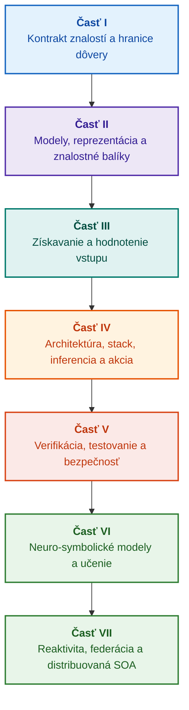

# Architektúra expertných systémov podložených dôkazmi: od formálnych ontológií k neuro-symbolickej AI

**Inžinierska monografia a praktická príručka o navrhovaní, matematických modeloch, architektúre a formálnej verifikácii vysoko dôveryhodných inteligentných systémov (Safety-Critical & Evidence-Grounded AI)**

**Autor:** [Mykola Fedchyk](../../about-the-author.md) · [LinkedIn](https://www.linkedin.com/in/nickfedchik/)  
**Formát:** Inžinierska monografia / Príručka architekta AI  
**Rok vydania:** 2026  

---

## O knihe

Táto monografia je základnou výskumnou prácou a komplexným inžinierskym sprievodcom venovaným prekonaniu kľúčovej krízy modernej umelej inteligencie: epistemickej priepasti medzi pravdepodobnostnou vierohodnosťou výstupov neurónových sietí a deterministickou pravdivosťou formálnych matematických dôkazov. V centre pozornosti stojí nekompromisná otázka: **Ako navrhnúť expertný systém, ktorého každý záver je nevyvrátiteľný, plne vysledovateľný k primárnym zdrojom dôkazov a spôsobilý na certifikáciu v bezpečnostne kritických inžinierskych doménach (ISO 26262, IEC 61508, DO-178C, ISO/SAE 21434)?**

Autor zdôvodňuje a zavádza novú paradigmu: **Dôkazmi riadenú neuro-symbolickú AI (Evidence-Grounded Neuro-Symbolic AI)**. V nej štatistické modely (LLM/SLM) plnia poradnú funkciu generovania hypotéz a projekčného vykresľovania, zatiaľ čo deterministické symbolické jadro neotrasiteľne garantuje invarianty logickej bezrozpornosti, ukotvenia faktov na úrovni bajtov, kontroly hraníc právomocí a bezpečného prechodu k akcii.

### Od artefaktu k overiteľnému rozhodnutiu

Systémové požiadavky, zdrojový kód, testovacie protokoly, regulačné normy a inžinierske rozhodnutia už dnes existujú v produkčných prostrediach, avšak zväčša fungujú ako izolované artefakty bez formalizovanej sémantiky, prísnych hraníc platnosti a vzájomnej vysledovateľnosti. Úspešná správa o kvalifikačnej skúške sa môže vzťahovať na zastaranú hardvérovú revíziu; citácia z bezpečnostnej normy môže byť vytrhnutá z kontextu; núdzové obnovenie konfigurácie môže neúmyselne znova aktivovať vyradený komponent.

Monografia predkladá ucelený inžiniersky trakt: od formalizácie inžinierskych artefaktov na typované dáta a kryptograficky podpísané znalostné balíky až po symbolické vyvodzovanie, stupňovitú dekompozíciu plánov, kontrafaktuálne vysvetlenia a audit hraníc kompetencie. Praktický výklad sa opiera o priemyselné implementácie v jazyku Go s rozsiahlymi testovacími sadami ([Kapitola 1](../../ch01-introduction-to-expert-systems.md)), prísne matematické kontrakty ([Časť II](../../part-02-knowledge-models.md)) a protokoly nepretržitého učenia, ktoré dokázateľne vylučujú regresie ([Kapitola 25](../../ch25-how-expert-systems-learn.md)).

### Pre koho je monografia určená

Publikácia je určená systémovým architektom, vedúcim inžinierom spoľahlivosti a funkčnej bezpečnosti, vývojárom inferenčných motorov a znalostným inžinierom. Na pochopenie základných konceptov postačuje základná znalosť predikátovej logiky prvého rádu, verziovania softvéru a životného cyklu systémov; na nasadenie praktických príkladov sa vyžadujú štandardné nástroje Go. Špecializované kapitoly venované formálnej syntéze bezpečnostných argumentácií (GSN), synergetike zložitých systémov, neuromorfným akcelerátorom a autonómnej navigácii bez GNSS odhaľujú pokročilé hranice aplikácie dôkazmi riadenej AI v technologicky náročných odvetviach (letectvo, autonómna doprava, kritická energetika).

---

## Vedecký kontext a miesto monografie vo svetovom výskume

Monografia nepristupuje k expertným systémom ako k archaickému dedičstvu pravidlových systémov 80. rokov (ako CLIPS či MYCIN), ale ako k predvoju **tretej vlny dôkazmi riadenej neuro-symbolickej AI (Third-Wave Evidence-Grounded Neuro-Symbolic AI)**. Práca vychádza z teoretických základov popredných svetových vedeckých škôl, pričom premosťuje priepasť medzi abstraktnými matematickými modelmi a vysoko výkonným systémovým inžinierstvom:

| Vedecký smer | Kľúčové svetové práce a autori | Konceptuálny most v knihe |
|---|---|---|
| **Neuro-symbolická AI tretej vlny (NeSy)** | Artur d'Avila Garcez, Luis C. Lamb (*Neurosymbolic AI: The 3rd Wave*, 2023; *Neural-Symbolic Cognitive Reasoning*, Springer, 2009); Henry Kautz (*The Third AI Summer*, AAAI 2022) | Rozdelenie zodpovedností: Štatistické modely (SLM/LLM) generujú hypotézy dopytu a deterministické symbolické jadro formálne verifikuje a schvaľuje fakty ([Kapitola 29](../../ch29-neuro-symbolic-architecture.md)). |
| **Sémantické obmedzenia a bezpečné učenie** | Guy Van den Broeck a kol. (*A Semantic Loss Function for Deep Learning with Symbolic Knowledge*, ICML 2018); Luc De Raedt a kol. (*DeepProbLog*, IJCAI 2020) | Vstupné a výstupné validačné brány, deterministická sémantická filtrácia návrhov neurónovej siete podľa formálnych schém ([Kapitoly 28](../../ch28-dual-mode-expert-systems.md), [33](../../ch33-inter-system-knowledge-exchange-and-model-teaching.md)). |
| **Vyvrátiteľné usudzovanie a teória argumentácie** | John L. Pollock (*Defeasible Reasoning*, 1987; *Cognitive Carpentry*, MIT Press, 1995); Phan Minh Dung (*Abstract Argumentation Frameworks*, AIJ 1995); Douglas Walton (*Argumentation Schemes*, Cambridge, 2008) | Štruktúrovanie znalostí na tvrdenia, pôvod a vyvracateľov (*rebutting* a *undercutting defeaters*); riešenie konfliktov v normatívnych pravidlových bázach Dungovými argumentačnými rámcami ([Kapitoly 2](../../ch02-epistemology-of-machine-knowledge.md), [27](../../ch27-safety-case-gsn-synthesis.md)). |
| **Autonómne dolovanie asociačných pravidiel (KBC)** | Luis Galárraga, Fabian M. Suchanek a kol. (*AMIE: Association Rule Mining under Incomplete Evidence*, WWW 2013, VLDBJ 2015); Stephen Muggleton (*Inductive Logic Programming*, 1994) | Automatická indukcia pravidiel zo znalostných báz za predpokladu čiastočnej úplnosti (PCA) bez falošných protipríkladov otvoreného sveta ([Kapitola 34](../../ch34-deterministic-relational-analysis-abduction-and-socratic-dialogue.md)). |
| **Formálne bezpečnostné štíty a certifikácia (Safe AI)** | Bettina Könighofer, Roderick Bloem a kol. (*Shield Synthesis*, 2017); Tim Kelly, Rob Weaver (*Goal Structuring Notation*, York, 2004); André Platzer (*Logical Foundations of CPS*, Springer, 2018) | Syntéza bezpečnostných prípadov v notácii GSN pre normy ISO 26262/21434; formálne štíty a numerické obálky validity pre periférne pohony ([Kapitoly 27](../../ch27-safety-case-gsn-synthesis.md), [30](../../ch30-safety-cybersecurity-co-engineering.md), [33](../../ch33-inter-system-knowledge-exchange-and-model-teaching.md)). |
| **Epistemická logika a semiotika znalostí** | John F. Sowa (*Knowledge Representation: Logical, Philosophical, and Computational Foundations*, 2000); Frank van Harmelen a kol. (*Handbook of Knowledge Representation*, Elsevier, 2008) | Epistemická triáda Charlesa Sandersa Peircea (Pojem → Úsudok → Záver); abduktívne vyvodzovanie pracovných hypotéz pod prísnou deduktívnou kontrolou ([Kapitoly 6](../../ch06-applied-mathematics-for-expert-systems.md), [34](../../ch34-deterministic-relational-analysis-abduction-and-socratic-dialogue.md)). |
| **Kybernetika a synergetika zložitých systémov** | Norbert Wiener (*Cybernetics*, 1948); W. Ross Ashby (*An Introduction to Cybernetics*, 1956); Hermann Haken (*Synergetics: An Introduction*, 1977; *Advanced Synergetics*, 1983); Ilya Prigogine (*Order out of Chaos*, 1984) | Ashbyho zákon nevyhnutnej variability, uzavreté riadiace cykly L0–L4, redukcia stavového priestoru na parametre usporiadania Hakenovým princípom podriadenosti, včasné varovanie pred fázovými prechodmi cez kritické spomalenie (CSD) a disipatívna stabilizácia báz znalostí ([Kapitoly 6](../../ch06-applied-mathematics-for-expert-systems.md), [22](../../ch22-cybernetics-edge-to-backend.md), [35](../../ch35-self-organizing-expert-systems-synergetics-and-npu-runtime.md)). |
| **Testovanie znalostí, jazyková invariantnosť a Lipschitzova kalibrácia** | Kent Beck (*TDD*, 2002); Martin Fowler (*Refactoring*, 2018); Clark Barrett, Leonardo de Moura (*Z3 SMT Solver*, 2008); Chuan Guo a kol. (*On Calibration of Modern Neural Networks*, ICML 2017); Marco Tulio Ribeiro a kol. (*CheckList*, ACL 2020); John L. Pollock (*Defeasible Reasoning*, 1987) | Štvorúrovňová pyramída testovania znalostí (KTP): izolované testovanie pravidiel (KUT) s napodobňovaním premís (`PremiseMock`), eliminácia pasce vákuovej pravdivosti, 6-bodová spektrálna BVA, zväzky pravidiel a vyvracatelia (KIT), skóre sémantickej invariantnosti ($\text{SIS} \ge 0{,}98$) pri jazykových variáciách dopytu, Lipschitzova spojitosť ($L_{\mathcal{K}} \le L_{\max}$) zamedzujúca kmitaniu relé a stigmergické zaznamenávanie medzier v báze znalostí ([Kapitola 36](../../ch36-knowledge-testing-pyramid-and-variational-calibration.md)). |

---

## Autorské teoretické modely, vedecký výskum a inžinierske inovácie

Táto monografia sumarizuje fundamentálny výskum a inžiniersky prínos autora v oblasti navrhovania systémov s vysokou spoľahlivosťou, vstavaných architektúr a dôkazmi riadenej AI. Na rozdiel od čisto prehľadových publikácií kniha formuluje súbor originálnych formálnych teórií, protokolov a architektonických vzorov, ktoré povyšujú neuro-symbolickú interakciu na matematicky overiteľnú úroveň dôvery:

### 1. Fundamentálne teoretické modely a matematický formalizmus

1. **Invariant dôkazového ukotvenia (EGI) a validačná brána faktov ([Kapitoly 2](../../ch02-epistemology-of-machine-knowledge.md), [19](../../ch19-from-question-to-evidence.md), [28](../../ch28-dual-mode-expert-systems.md), [29](../../ch29-neuro-symbolic-architecture.md)):**
   * *Teoretický koncept:* Autor formuloval a matematicky vymedzil invariant úplnosti ukotvenia $\mathrm{Comp}(C) = 1{,}00$, podľa ktorého v dôkazovom systéme žiadne tvrdenie nemôže získať status uznaného faktu bez deterministickej projekcie na primárne zdroje znalostí. Každý prvok bázy faktov je zabezpečený kryptografickou n-ticou: nemennými bajtovými posunmi `[byte_start, byte_end]`, hašom kánonického fragmentu `quote_sha256` a identifikátorom certifikátu pôvodu PROV-O.
   * *Inžiniersky význam:* Hardvérovo-softvérová validačná brána na úrovni bajtov znemožňuje prienik halucinácií neurónovej siete do verziovanej bázy znalostí a zabezpečuje nulovú toleranciu voči nepodloženým dátam ($ZHR = 1{,}00$).
2. **Štvorúrovňová pyramída testovania znalostí (KTP) a Lipschitzova stabilita inferenčného priestoru ([Kapitola 36](../../ch36-knowledge-testing-pyramid-and-variational-calibration.md)):**
   * *Teoretický koncept:* Autor prvýkrát predstavuje ucelenú Pyramídu testovania znalostí (KTP), ktorá prenáša disciplínu Fowlerovej testovacej pyramídy do znalostných systémov: modulárne testovanie pravidiel (KUT) s izoláciou premís (`PremiseMock`), integračné testovanie interakcií pravidiel a vyvracateľov (KIT) a variačnú kalibráciu na varietach dopytov (KVT).
   * *Matematický aparát:* Zavedenie prísneho invariantu blokovania vákuovej pravdivosti ($P \to Q$, keď $P \equiv \text{False}$), metriky sémantickej invariantnosti ($\mathrm{SIS} \ge 0{,}98$) pri jazykových odchýlkach a obmedzenia Lipschitzovej spojitosti ($L_{\mathcal{K}} \le L_{\max}$), ktoré matematicky vylučuje katastrofálne kmitanie rozhodnutí pri nepatrných zmenách na vstupe.
3. **Popperovská teória falzifikácie deontických noriem a aktívny audítor zhody ([Kapitola 39](../../ch39-active-compliance-auditor-and-popperian-testing.md)):**
   * *Teoretický koncept:* Prechod od tradičného pasívneho orákula (ktoré iba pasívne odpovedá) k paradigme aktívneho audítora znalostí implementujúceho princíp falzifikácie Karla Poppera. Systém autonómne sonduje priestor požiadaviek (ASPICE 4.0, ISO 26262, ISO/SAE 21434), syntetizuje protipríklady, odhaľuje neúplné špecifikácie a navrhuje komplexný verifikačný plán.
   * *Praktická hodnota:* Spojenie kreatívneho generovania hraničných scenárov neurónovou sieťou (Systém 1) s deterministickou deontickou verifikáciou symbolickým jadrom (Systém 2), čo chráni človeka v riadiacom cykle (Human-in-the-Loop) pred kognitívnou únavou zo schvaľovania.
4. **Synergetická redukcia dimenzie bázy znalostí a predbifurkačná diagnostika CSD ([Kapitoly 6](../../ch06-applied-mathematics-for-expert-systems.md), [22](../../ch22-cybernetics-edge-to-backend.md), [35](../../ch35-self-organizing-expert-systems-synergetics-and-npu-runtime.md)):**
   * *Teoretický koncept:* Aplikácia matematického aparátu synergetiky Hermanna Hakena (parametre usporiadania a princíp podriadenosti) a teórie disipatívnych štruktúr Iľju Prigogina na evolúciu komplexných báz znalostí.
   * *Vedecký výsledok:* Vyvinutá metóda redukcie viacrozmerného stavového priestoru telemetrie na parametre usporiadania a integrovaný detektor kritického spomalenia (*Critical Slowing Down*, CSD) na báze autokorelácie a rozptylu, čo umožňuje predpovedať dynamické zlyhanie kyberfyzikálneho systému dávno pred aktiváciou havarijných prahových snímačov.
5. **Model úrovní autonómie konania (A0–A4), autorizačná brána a idempotentné ságy ([Kapitola 21](../../ch21-from-recommendation-to-action.md)):**
   * *Teoretický koncept:* Diskrétna stupnica systémových právomocí (A0: pasívna analýza, A1: príprava návrhu, A2: akcia podpísaná človekom, A3: kontrolovaná autonómia, A4: núdzové ochranné odpojenie), prideľovaná trojici „akcia, prostredie, miera rizika“.
   * *Matematický aparát:* Zavedenie algebraického invariantu idempotencie $f(f(x, k), k) \equiv f(x, k)$ na základe kryptografického kľúča $k$, stupňovité uzavreté vykonávanie a protokol distribuovaných kompenzačných ság so stavom `OutcomeUnknown` a nezávislým overením postpodmienok.
6. **Formálne spoločné inžinierstvo funkčnej bezpečnosti a kybernetickej bezpečnosti v notácii GSN ([Kapitoly 27](../../ch27-safety-case-gsn-synthesis.md), [30](../../ch30-safety-cybersecurity-co-engineering.md)):**
   * *Teoretický koncept:* Vytvorený model koordinovanej syntézy argumentačných stromov GSN (Goal Structuring Notation) pre simultánne splnenie noriem ISO 26262 (funkčná bezpečnosť) a ISO/SAE 21434 (kybernetická bezpečnosť).
   * *Inžiniersky prelom:* Formalizácia matematickej arbitráže medzi protichodnými cieľmi (časový rozpočet núdzovej reakcie vs. hĺbka kryptografickej atestácie) a protokol selektívneho sprístupňovania dôkazov externým audítorom cez solené Merklove stromy.
7. **Protokol verifikácie vernosti a sémantickej konzistentnosti vysvetlení ([Kapitola 20](../../ch20-explanation-engine.md)):**
   * *Teoretický koncept:* Vysvetlenie sa nechápe ako voľný text generatívneho modelu, ale ako samostatný deterministický artefakt, jednoznačne odvodený z grafu dôkazu, verzie pravidiel a fixovaného stavu faktov.
   * *Matematický aparát:* Formalizovaná metrická brána vernosti ($C_{\text{facts}} = 1{,}00, H_{\text{free}} = 1{,}00$) s automatickým bezpečným návratom (fail-safe fallback) k rigidnej šablóne pri najmenšej odchýlke medzi symbolickým záverom a formuláciou pre operátora.

---

### 2. Empirický výskum, autorské testovacie polygóny a systémové inžinierstvo

1. **Nemenné binárne znalostné balíky s `mmap` a nulovou deserializáciou ([Kapitola 32](../../ch32-high-performance-knowledge-packs-mmap-and-harvesting.md)):**
   * *Autorský prístup:* Dvojvrstvová architektúra balíkov (kanonická vrstva primárnych zdrojov + odvodená materializovaná vrstva indexov).
   * *Empirický výsledok:* Priame mapovanie indexu do virtuálneho adresného priestoru cez systémové volanie `mmap`, úplné odstránenie réžie dynamickej alokácie pamäte (zero-allocation) a štart motora v sublineárnom čase bez ohľadu na gigabajtový objem ontológie.
2. **Empirický kalibračný polygón na korpusoch IETF RFC-1000 a W3C-150 ([Kapitoly 2](../../ch02-epistemology-of-machine-knowledge.md), [4](../../ch04-evolution-from-bayes-to-evidence-ai.md), [14](../../ch14-requirements-detection-and-formalization.md), [25](../../ch25-how-expert-systems-learn.md)):**
   * *Autorský experiment:* Nasadenie rozsiahleho výskumného prostredia na 1 000 platných špecifikáciách IETF RFC (rozložených do 5 historických epoch rozvoja internetu) a 150 komplexných diagnostických dopytoch z korpusu W3C (vrátane umelej injektáže logických rozporov a konfabulácií).
   * *Praktický výsledok:* Zostavenie objektívnych skúšobných matíc znalostí, detekcia normatívnych rozporov a matematicky dokázaná ochrana pred regresiami bázy znalostí pri jej aktualizácii.
3. **Viacstupňová relačná analýza, symbolická abdukcia a sokratovský dialóg ([Kapitola 34](../../ch34-deterministic-relational-analysis-abduction-and-socratic-dialogue.md)):**
   * *Autorský vývoj:* Algoritmus obojsmerného ohraničeného prehľadávania do šírky (Bidirectional Bounded BFS, $k \le 6$) s ochranou pred cyklami a formovaním kompozitných bajtových reťazcov dôkazov pre ľubovoľné prepojené entity.
   * *Inžinierska výhoda:* Implementácia Peirceovej symbolickej abdukcie pod prísnou deduktívnou kontrolou a typované sokratovské vyjasňujúce rámce (*Clarification Frames*), ktoré vedú systém k produktívnemu dialógu s človekom namiesto slepého odmietnutia v rámci predpokladu uzavretého sveta (CWA).
4. **Formálne štíty a numerické obálky validity pre periférne riadiace systémy ([Kapitola 33](../../ch33-inter-system-knowledge-exchange-and-model-teaching.md), [Prílohy B](../../appendix-b-robotics-and-cyber-physical-systems.md), [C](../../appendix-c-autonomous-navigation-and-geosearch.md), [E](../../appendix-e-mixed-signal-neuromorphic-expert-systems.md)):**
   * *Autorský prístup:* Metodika translácie diskrétnych logických invariantov do spojitých numerických bezpečnostných koridorov pre digitálne signálové procesory (DSP) a systémy autonómnej navigácie bez GNSS (TRN/DSMAC/VIO).
   * *Prevádzková spoľahlivosť:* Podpísaná výmena pravidiel postavená na kryptografii Ed25519, bezpečná karanténa kandidátskych znalostí a zamedzenie nebezpečným riadiacim zásahom na hardvérovej úrovni.
5. **Ochrana pred únikom dôverných informácií cez vysvetlenia a diferenciálny audit ([Kapitola 20](../../ch20-explanation-engine.md)):**
   * *Autorský vývoj:* Protokol redukcie medzireprezentácie vysvetlenia ($\mathrm{EIR}_{\text{redacted}}$) s kontrolou ACL pre každý uzol a hranu grafu dôkazu, ktorý blokuje útoky postranným kanálom na rekonštrukciu modelov cez sériu kontrastných dopytov WHY NOT.

---

## Princíp členenia a kategorizácie

Časti knihy sú definované kľúčovou inžinierskou úlohou, nie rokom spísania kapitoly či názvom konkrétnej technológie. Každá kapitola patrí do jednej hlavnej časti; príbuzné metódy vysvetľujú spôsob riešenia jej centrálnej otázky. Čísla kapitol a názvy súborov zostávajú stálymi identifikátormi, preto sa tematické poradie čítania môže líšiť od numerického.

Názvy podkapitol v kapitolách patria do jasne vymedzených kategórií a mali by sa čítať ako súvislý argumentačný sled, nie ako paralelný zoznam technológií:

| Kategória podkapitoly | Otázka čitateľa | Funkcia v kapitole |
|---|---|---|
| Problém a hranica úlohy | Čo presne je potrebné vyriešiť? | Vymedziť hlavnú otázku a oblasť použitia |
| Objekt a model | Aké dáta, znalosti či stavy sa posudzujú? | Zjednotiť pojmy, typy a predpoklady |
| Metóda a procedúra | Ako dospieť k výsledku? | Objasniť inferenciu, transformáciu alebo riadenie |
| Implementácia a nástroj | Čím procedúru vykonať? | Ukázať softvérové alebo hardvérové stelesnenie |
| Verifikácia a kontrolný prípad | Ako odhaliť chybu? | Porovnať výsledok s nezávislým kritériom |
| Záver a hranice výsledku | Čo bolo dokázané a čo zostalo otvorené? | Zodpovedať hlavnú otázku bez zveličovania sľubov |

Krajina, priemyselné odvetvie alebo komerčný produkt predstavujú aplikačný kontext, nie samostatnú úroveň tejto taxonómie. Slovník pojmov, skratky, zoznam literatúry a navigácia tvoria referenčný aparát, nie samostatné témy kapitol.

Kompletná redakčná mapa obsahuje hodnotenie hlavnej témy každej kapitoly, hranice medzi príbuznými výkladmi a poznámky ku kompozícii a záverom. Nová anotácia neznamená, že všetky riziká obsahu vnútri kapitol boli definitívne odstránené.

## Odporúčané trasy čítania

**Prvé overenie softvéru:** [1](../../ch01-introduction-to-expert-systems.md) → [7](../../ch07-knowledge-base-typology.md) → [8](../../ch08-engineering-artifacts-as-data.md) → [17](../../ch17-implementation-stack.md) → [23](../../ch23-knowledge-base-verification.md) → [25](../../ch25-how-expert-systems-learn.md). Cieľ: Reprodukovateľný verdikt s dôkaznými podkladmi, negatívnymi testami a riadenou zmenou znalostí. Jazykový model nie je podmienkou.

**Znalostné inžinierstvo:** [Časť II](../../part-02-knowledge-models.md) → [Časť III](../../part-03-knowledge-engineering-nlp.md) → [19](../../ch19-from-question-to-evidence.md) → [20](../../ch20-explanation-engine.md) → [26](../../ch26-continual-learning.md). Cieľ: Zosúladiť sémantiku, pôvod, získavanie znalostí a validáciu nových kandidátov. V Časti II je zachovaný medzioborový program vedeckého testovania kapitol 7–11.

**Architektúra riešenia:** [16](../../ch16-expert-systems-architecture.md) → [19](../../ch19-from-question-to-evidence.md) → [31](../../ch31-syllogistic-reasoning-and-relation-lattices.md) → [20](../../ch20-explanation-engine.md) → [21](../../ch21-from-recommendation-to-action.md). Cieľ: Dôsledne oddeliť kontrolu podkladov, aplikáciu noriem, vysvetlenie a akčné oprávnenia.

**Verifikácia a bezpečnosť:** [23](../../ch23-knowledge-base-verification.md) → [36](../../ch36-knowledge-testing-pyramid-and-variational-calibration.md) → [25](../../ch25-how-expert-systems-learn.md) → [26](../../ch26-continual-learning.md) → [27](../../ch27-safety-case-gsn-synthesis.md) → [30](../../ch30-safety-cybersecurity-co-engineering.md). Diagnostika externého objektu je samostatne prístupná cez [Kapitolu 24](../../ch24-system-diagnosis.md).

**Hybridná odozva a prevádzka:** [Časť VI](../../part-06-frontiers-neuro-symbolic.md) → [Časť VII](../../part-07-runtime-and-knowledge-exchange.md) → [40](../../ch40-distributed-epistemic-architectures-soa-and-cluster-scaling.md) a súvisiace prílohy. Cieľ: Integrovať jazykový model, riadiť znalostné medzery, vybudovať distribuovanú SOA architektúru a verifikovať medzisystémovú výmenu. Kapitoly [2](../../ch02-epistemology-of-machine-knowledge.md), [4](../../ch04-evolution-from-bayes-to-evidence-ai.md) a [6](../../ch06-applied-mathematics-for-expert-systems.md) slúžia ako kontrakt, história a matematická príručka.

---

## Hranice inžinierskych prísľubov

Kniha predstavuje vzdelávací a výskumný materiál, nie certifikovaný postup ani oficiálny dôkaz zhody výrobku s technickou normou. Deterministické vykonanie nedokazuje automaticky správnosť faktov; kryptografický haš a podpis nedokazujú objektívnu pravdivosť; a argumentačný graf nenahrádza posudok odborníka. Požiadavky na spoľahlivosť celého systému nemožno stotožňovať s chybovosťou jazykového modelu ani nekriticky zovšeobecňovať na všetky softvérové komponenty.

Automatizovaná syntaktická analýza minimalizuje manuálny prepis dát, no nevylučuje doménové modelovanie, oponentské posudzovanie a zodpovednosť vlastníkov znalostí. Protégé, manuálna revízia a automatický zber môžu efektívne koexistovať. Matematické garancie platia výhradne pre definovaný jazykový profil a predpoklady; namerané rýchlosti sa vzťahujú na testovaný dopyt, korpus a prostredie. Archívne dáta autora sú striktne oddelené od otvorených výskumných prostredí a budúcich prác.

Rozhodnutia o uvoľnení do prevádzky, akceptácii rizika a regulačnom súlade prináležia povereným ľudským špecialistom. Expertný systém pripravuje overiteľný materiál a vykonáva dohodnuté pravidlá, nenadobúda však regulačné ani právne právomoci.

---

## Štruktúra knihy

Kniha pozostáva zo siedmich tematických častí, 40 kapitol a piatich príloh. Každá kapitola patrí do jednej hlavnej časti. Predchádzajúca a nasledujúca kapitola v navigácii rešpektujú tematické usporiadanie nižšie; čísla kapitol a názvy súborov sú zachované.

---

### [Časť I. Konceptuálne a epistemické základy](../../part-01-foundations.md)

*Kedy je potrebný expertný systém, čo považovať za znalosť a ako zachovať podklady organizačného rozhodnutia.*

* [Kapitola 1. Úvod do expertných systémov: Od chaosu k riadeným znalostiam](../../ch01-introduction-to-expert-systems.md)
* [Kapitola 2. Filozofia pre inžiniera: Čo má stroj právo nazývať znalosťou](../../ch02-epistemology-of-machine-knowledge.md)
* [Kapitola 3. Čím sa expertný systém líši od informačno-referenčného systému](../../ch03-beyond-reference-information-systems.md)
* [Kapitola 4. Evolúcia expertných systémov: Od Bayesovej vety k dôkazovým riešeniam AI](../../ch04-evolution-from-bayes-to-evidence-ai.md)
* [Kapitola 5. Triáda dôvery: Expertný systém, dôkazové odporúčanie a podniková pamäť](../../ch05-triad-of-trust-and-corporate-memory.md)

---

### [Časť II. Matematické modely, reprezentácia a ukladanie znalostí](../../part-02-knowledge-models.md)

*Voľba matematických operácií a reprezentácie, typované artefakty, graf vysledovateľnosti a nemenný znalostný balík.*

* [Kapitola 6. Aplikovaná matematika expertných systémov: Pravidlá, pravdepodobnosti, grafy a kauzalita](../../ch06-applied-mathematics-for-expert-systems.md)
* [Kapitola 7. Typológia báz znalostí: Pravidlá, ontológie, precedensy a vektory](../../ch07-knowledge-base-typology.md)
* [Kapitola 8. Inžinierske artefakty ako dáta expertného systému](../../ch08-engineering-artifacts-as-data.md)
* [Kapitola 9. Inžiniersky znalostný graf: Vysledovateľnosť od požiadaviek po hardvér](../../ch09-engineering-knowledge-graph-traceability.md)
* [Kapitola 32. Nemenné znalostné balíky: Bajtová priepustnosť, indexy a mapovanie pamäte](../../ch32-high-performance-knowledge-packs-mmap-and-harvesting.md)

---

### [Časť III. Získavanie znalostí, jazyková analýza a hodnotenie vstupu](../../part-03-knowledge-engineering-nlp.md)

*Dokumenty, expertíza špecialistov a pozorovania: Extrakcia kandidátov, jazyková analýza, formalizácia a hodnotenie dôkazov.*

* [Kapitola 10. Systémy získavania znalostí: Zdroje, schvaľovanie a životný cyklus](../../ch10-knowledge-acquisition-systems.md)
* [Kapitola 11. Získavanie znalostí od expertov: Rozhovory, kognitívne mapy a formalizácia skúseností](../../ch11-knowledge-elicitation-from-experts.md)
* [Kapitola 12. Lingvistická analýza a lokálne modely: Zachovanie významu a zdrojov](../../ch12-linguistic-analysis-and-local-models.md)
* [Kapitola 13. Variabilita prirodzeného jazyka verzus determinizmus: Kompilácia zmyslu otázky](../../ch13-language-variability-vs-determinism.md)
* [Kapitola 14. Detekcia požiadaviek a modalít: Od normatívneho textu k invariantom](../../ch14-requirements-detection-and-formalization.md)
* [Kapitola 15. Extrakcia znalostí a budovanie bázy znalostí: Fakty, gramatiky a automaty](../../ch15-knowledge-extraction-and-kb-construction.md)
* [Kapitola 37. Hodnotenie vstupných informácií: Zdroje, svedectvá a neistota](../../ch37-input-information-assessment-and-algorithmic-skepticism.md)

---

### [Časť IV. Architektúra, technologický stack, inferencia a akcia](../../part-04-architecture-and-inference.md)

*Architektonické kontrakty, technologický stack, hardvérové vykonávanie, verifikácia tvrdení, usudzovanie podľa noriem, vysvetľovanie a kybernetický riadiaci cyklus.*

* [Kapitola 16. Architektúra expertného systému: Od formálnych znalostí k dôkazovému rozhodnutiu](../../ch16-expert-systems-architecture.md)
* [Kapitola 17. Technologický stack: Kritériá výberu nástrojov, programovacích jazykov a pravidlových motorov](../../ch17-implementation-stack.md)
* [Kapitola 18. Infraštruktúra vykonávania: Lokálne modely, hardvérové akcelerátory, Edge a On-Premise](../../ch18-execution-infrastructure.md)
* [Kapitola 19. Od otázky k dôkazu: Vyhľadávanie, ukotvenie a overenie tvrdenia](../../ch19-from-question-to-evidence.md)
* [Kapitola 31. Usudzovanie podľa noriem: Hierarchie predikátov, výnimky a platnosť](../../ch31-syllogistic-reasoning-and-relation-lattices.md)
* [Kapitola 20. Vysvetľovací motor: Rozhodnutie, odmietnutie a hranice kompetencie](../../ch20-explanation-engine.md)
* [Kapitola 21. Od odporúčania k akcii: Kontrola oprávnení a bezpečné vykonávanie v produkcii](../../ch21-from-recommendation-to-action.md)
* [Kapitola 22. Kybernetický riadiaci cyklus: Senzory, periférie a spätná väzba](../../ch22-cybernetics-edge-to-backend.md)

---

### [Časť V. Verifikácia, testovanie, diagnostika a bezpečnostné odôvodnenie](../../part-05-verification-and-learning.md)

*Formálna verifikácia pravidiel, pyramída testovania znalostí, popperovská falzifikácia, technická diagnostika a argumentácia funkčnej a kybernetickej bezpečnosti.*

* [Kapitola 23. Verifikácia bázy znalostí: Ako overiť bezrozpornosť, úplnosť a spoľahlivosť pravidiel](../../ch23-knowledge-base-verification.md)
* [Kapitola 36. Pyramída testovania znalostí: Pravidlá, interakcie a stabilita odpovedí](../../ch36-knowledge-testing-pyramid-and-variational-calibration.md)
* [Kapitola 39. Aktívny expertný tester: Popperovská falzifikácia, regulačný súlad (ASPICE/ISO 26262/ISO 21434) a autonómny návrh testov](../../ch39-active-compliance-auditor-and-popperian-testing.md)
* [Kapitola 24. Technická diagnostika: Ako nezameniť symptóm za príčinu v podmienkach neúplnosti](../../ch24-system-diagnosis.md)
* [Kapitola 27. Odôvodnenie bezpečnosti: Syntéza a verifikácia argumentov](../../ch27-safety-case-gsn-synthesis.md)
* [Kapitola 30. Spoločné inžinierstvo funkčnej bezpečnosti a kybernetickej bezpečnosti](../../ch30-safety-cybersecurity-co-engineering.md)

---

### [Časť VI. Neuro-symbolické modely, kognitívne hranice a nepretržité učenie](../../part-06-frontiers-neuro-symbolic.md)

*Prísne vyvodzovanie a poradná hypotéza, integrácia jazykového modelu, medzery, kontrola nepodložených odpovedí, skúšobné matice a nepretržité učenie sa zo skúseností.*

* [Kapitola 28. Dvojrežimové expertné systémy: Prísne vyvodzovanie a poradná hypotéza](../../ch28-dual-mode-expert-systems.md)
* [Kapitola 29. Neuro-symbolická architektúra: Jazykové modely a overovanie dôkazových základov](../../ch29-neuro-symbolic-architecture.md)
* [Kapitola 34. Znalostné medzery: Relačné vyhľadávanie, abdukcia a vyjasňujúci dialóg](../../ch34-deterministic-relational-analysis-abduction-and-socratic-dialogue.md)
* [Kapitola 38. Strojové halucinácie a deficit znalostí: Dôkazmi riadená kontrola odpovedí](../../ch38-curing-machine-hallucinations-and-knowledge-deficits.md)
* [Kapitola 25. Ako trénovať expertný systém: Skúšobné matice, audit znalostí a kontrola regresie](../../ch25-how-expert-systems-learn.md)
* [Kapitola 26. Nepretržité učenie (Continual Learning) zo skúseností a prekonanie posunu systémových záznamov](../../ch26-continual-learning.md)

---

### [Časť VII. Reaktívne vykonávanie, medzisystémová výmena znalostí a distribuovaná SOA](../../part-07-runtime-and-knowledge-exchange.md)

*Reaktívne vykonávanie pravidiel, synergetika a fázové prechody znalostí, medzisystémová výmena a podniková distribuovaná epistemická architektúra.*

* [Kapitola 35. Reaktívny expertný systém: Udalosti, odvolávanie a adaptácia znalostí](../../ch35-self-organizing-expert-systems-synergetics-and-npu-runtime.md)
* [Kapitola 33. Medzisystémová výmena znalostí: Poskytovanie pravidiel externým systémom, trénovanie modelov a bezpečná spätná väzba](../../ch33-inter-system-knowledge-exchange-and-model-teaching.md)
* [Kapitola 40. Distribuovaná architektúra expertného systému podloženého dôkazmi: Epistemická SOA, sémantické smerovanie, hierarchia pamäte a viaczdrojová arbitráž](../../ch40-distributed-epistemic-architectures-soa-and-cluster-scaling.md)

---

### Prílohy

* [Príloha A. Praktický rámec pre výskum podložený dôkazmi v komplexných inžinierskych projektoch](../../appendix-a-evidence-governed-framework.md)
* [Príloha B. Expertné systémy podložené dôkazmi v autonómnej robotike a kyberfyzikálnych systémoch](../../appendix-b-robotics-and-cyber-physical-systems.md)
* [Príloha C. Autonómna navigácia bez GNSS: Geopriestorové porovnávanie (TRN/DSMAC), vizuálna odometria (VIO) a expertná fúzia senzorov](../../appendix-c-autonomous-navigation-and-geosearch.md)
* [Príloha D. Analógové expertné systémy, neuromorfné výpočty a hardvérové logické vyvodzovanie](../../appendix-d-analog-expert-systems-and-neuromorphic-computing.md)
* [Príloha E. Zmiešané analógovo-digitálne expertné systémy: Neuromorfné, analógové a nekonvenčné počítače pod kontrolou dôkazov](../../appendix-e-mixed-signal-neuromorphic-expert-systems.md)
* [O autorovi: Mykola Fedchyk (Nick Fedchik)](../../about-the-author.md)

---

## Smery budúceho výskumu

Smery budúcej práce nie sú hotovými garanciami: Reprodukovateľné zostavovanie znalostných balíkov; verifikácia ohraničenej formálnej reprezentácie; riadenie agentov prostredníctvom explicitných právomocí; dôverné overovanie konkrétnych formalizovaných tvrdení; kontrolované odvolávanie pravidiel a výskum strojového odnaučenia (machine unlearning). Preukázanie vlastnosti modelu automaticky nepotvrdzuje zhodu fyzického výrobku a odstránenie pravidla nie je ekvivalentné vymazaniu vplyvu dát z natrénovaného modelu.

Pri hardvérových akcelerátoroch a nekonvenčných architektúrach sa najprv precízne meria miera chýb, latencia, spotreba energie a správanie pri poruchách. Príslušné otázky rozoberajú [Kapitola 29](../../ch29-neuro-symbolic-architecture.md), [Kapitola 32](../../ch32-high-performance-knowledge-packs-mmap-and-harvesting.md) a [Prílohy D](../../appendix-d-analog-expert-systems-and-neuromorphic-computing.md) a [E](../../appendix-e-mixed-signal-neuromorphic-expert-systems.md). Praktický výskumný program pre kapitoly 7–11 je uvedený v [Časti II](../../part-02-knowledge-models.md): Každý návrh obsahuje hypotézu, kontrolné porovnanie a podmienku falzifikácie.
