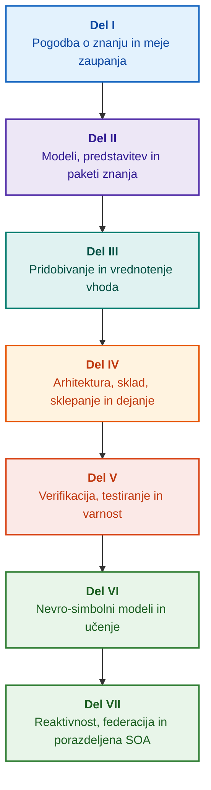

# Arhitektura na dokazih temelječih ekspertnih sistemov: od formalnih ontologij do nevro-simbolne umetne inteligence

**Inženirska monografija in priročnik o načrtovanju, matematičnih modelih, arhitekturi in formalni verifikaciji visoko zanesljivih inteligentnih sistemov (Safety-Critical & Evidence-Grounded AI)**

**Avtor:** [Mykola Fedchyk](../../about-the-author.md) · [LinkedIn](https://www.linkedin.com/in/nickfedchik/)  
**Format:** Inženirska monografija / Priročnik za AI arhitekte  
**Leto izida:** 2026  

---

## O knjigi

Ta monografija je temeljna raziskovalna študija in celovit inženirski vodnik, namenjen reševanju ključne krize sodobne umetne inteligence: epistemološke vrzeli med verjetnostno verodostojnostjo nevronskih mrež in deterministično resnico formalnih matematičnih dokazov. V središču raziskave je brezkompromisno vprašanje: **Kako načrtovati ekspertni sistem, katerega vsak sklep je neizpodbiten, v celoti sledljiv do primarnih virov dokazov in primeren za certificiranje v varnostno kritičnih inženirskih domenah (ISO 26262, IEC 61508, DO-178C, ISO/SAE 21434)?**

Avtor utemeljuje in uvaja novo paradigmo: **Na dokazih temelječo nevro-simbolno AI (Evidence-Grounded Neuro-Symbolic AI)**. V njej statistični modeli (LLM/SLM) opravljajo svetovalno funkcijo generiranja poizvedovalnih hipotez in projekcijskega upodabljanja, medtem ko deterministično simbolno jedro neomajno zagotavlja invariante logične konsistentnosti, prizemljitve dejstev na ravni bajtov, nadzora meja pooblastil in varnega prehoda v dejanje.

### Od artefakta do preverljive odločitve

Sistemske zahteve, izvorna koda, dnevniki testiranja, regulativni standardi in inženirske odločitve že obstajajo v sodobnih proizvodnih okoljih, vendar večinoma delujejo kot izolirani artefakti brez formalizirane semantike, strogih meja veljavnosti in medsebojne sledljivosti. Uspešno poročilo o kvalifikacijskem preizkusu se lahko nanaša na zastarelo revizijo strojne opreme; citat iz varnostnega standarda je lahko iztrgan iz konteksta; zasilno vračanje konfiguracije pa lahko nehote ponovno aktivira opuščeno komponento.

Monografija predstavlja celovit inženirski cevovod: od formalizacije inženirskih artefaktov v tipizirane podatke in kriptografsko podpisane pakete znanja – do simbolnega sklepanja, koračne dekompozicije načrtov, protidejstvenih razlag in revizije meja pristojnosti. Praktična razlaga temelji na industrijskih izvedbah v jeziku Go z obsežnimi nabori testov ([Poglavje 1](../../ch01-introduction-to-expert-systems.md)), strogih matematičnih pogodbah ([Del II](../../part-02-knowledge-models.md)) in protokolih neprekinjenega učenja, ki dokazano preprečujejo regresije znanja ([Poglavje 25](../../ch25-how-expert-systems-learn.md)).

### Komu je monografija namenjena

Knjiga je namenjena sistemskim arhitektom, vodilnim inženirjem za zanesljivost in funkcionalno varnost, razvijalcem sklepnih mehanizmov ter inženirjem znanja. Za usvojitev osnovnih konceptov zadošča temeljno razumevanje predikatne logike prvega reda, vodenja različic programske opreme in življenjskega cikla sistemov; za preizkušanje praktičnih primerov je potrebno standardno orodje Go. Specializirana poglavja, posvečena formalni sintezi varnostnih utemeljitev (GSN), sinergetiki kompleksnih sistemov, nevromorfnim pospeševalnikom in avtonomni navigaciji brez GNSS, odpirajo napredne meje uporabe na dokazih temelječe umetne inteligence v visokotehnoloških panogah (letalstvo, avtonomna vozila, kritična energetika).

---

## Znanstveni kontekst in mesto monografije v svetovnih raziskavah

Monografija ne obravnava ekspertnih sistemov kot arhaične zapuščine pravil iz 80. let prejšnjega stoletja (kot sta CLIPS ali MYCIN), temveč kot vodilno silo **tretjega vala na dokazih temelječe nevro-simbolne umetne inteligence (Third-Wave Evidence-Grounded Neuro-Symbolic AI)**. Delo se opira na teoretične temelje vodilnih svetovnih znanstvenih šol ter hkrati premošča vrzel med abstraktnimi matematičnimi modeli in visoko zmogljivim sistemskim inženiringom:

| Znanstvena smer | Ključna svetovna dela in avtorji | Konceptualni most v knjigi |
|---|---|---|
| **Nevro-simbolna AI tretjega vala (NeSy)** | Artur d'Avila Garcez, Luis C. Lamb (*Neurosymbolic AI: The 3rd Wave*, 2023; *Neural-Symbolic Cognitive Reasoning*, Springer, 2009); Henry Kautz (*The Third AI Summer*, AAAI 2022) | Delitev odgovornosti: statistični modeli (SLM/LLM) ustvarjajo hipoteze, deterministično simbolno jedro pa dejstva formalno preveri in potrdi ([Poglavje 29](../../ch29-neuro-symbolic-architecture.md)). |
| **Semantične omejitve in varno učenje** | Guy Van den Broeck in sod. (*A Semantic Loss Function for Deep Learning with Symbolic Knowledge*, ICML 2018); Luc De Raedt in sod. (*DeepProbLog*, IJCAI 2020) | Vhodna in izhodna verifikacijska vrata, deterministično semantično filtriranje predlogov nevronske mreže glede na formalne sheme ([Poglavji 28](../../ch28-dual-mode-expert-systems.md), [33](../../ch33-inter-system-knowledge-exchange-and-model-teaching.md)). |
| **Izpodbojno sklepanje in teorija argumentacije** | John L. Pollock (*Defeasible Reasoning*, 1987; *Cognitive Carpentry*, MIT Press, 1995); Phan Minh Dung (*Abstract Argumentation Frameworks*, AIJ 1995); Douglas Walton (*Argumentation Schemes*, Cambridge, 2008) | Razdelitev znanja na trditve, izvor in izbijalce (*rebutting* in *undercutting defeaters*); reševanje sporov v normativnih pravilih z Dungovimi argumentacijskimi okviri ([Poglavji 2](../../ch02-epistemology-of-machine-knowledge.md), [27](../../ch27-safety-case-gsn-synthesis.md)). |
| **Avtonomno rudarjenje asociacijskih pravil (KBC)** | Luis Galárraga, Fabian M. Suchanek in sod. (*AMIE: Association Rule Mining under Incomplete Evidence*, WWW 2013, VLDBJ 2015); Stephen Muggleton (*Inductive Logic Programming*, 1994) | Samodejna indukcija pravil iz baz znanja pod predpostavko delne popolnosti (PCA) brez lažnih protiprimerov odprtega sveta ([Poglavje 34](../../ch34-deterministic-relational-analysis-abduction-and-socratic-dialogue.md)). |
| **Formalni varnostni ščiti in certificiranje (Safe AI)** | Bettina Könighofer, Roderick Bloem in sod. (*Shield Synthesis*, 2017); Tim Kelly, Rob Weaver (*Goal Structuring Notation*, York, 2004); André Platzer (*Logical Foundations of CPS*, Springer, 2018) | Sinteza varnostnih primerov v notaciji GSN za standarde ISO 26262/21434; formalni ščiti in numerične ovojnice veljavnosti za periferne pogone ([Poglavja 27](../../ch27-safety-case-gsn-synthesis.md), [30](../../ch30-safety-cybersecurity-co-engineering.md), [33](../../ch33-inter-system-knowledge-exchange-and-model-teaching.md)). |
| **Epistemična logika in semiotika znanja** | John F. Sowa (*Knowledge Representation: Logical, Philosophical, and Computational Foundations*, 2000); Frank van Harmelen in sod. (*Handbook of Knowledge Representation*, Elsevier, 2008) | Epistemična triada Charlesa Sandersa Peircea (Pojem → Sodba → Sklep); abduktivno sklepanje delovnih hipotez pod strogim deduktivnim nadzorom ([Poglavji 6](../../ch06-applied-mathematics-for-expert-systems.md), [34](../../ch34-deterministic-relational-analysis-abduction-and-socratic-dialogue.md)). |
| **Kibernetika in sinergetika kompleksnih sistemov** | Norbert Wiener (*Cybernetics*, 1948); W. Ross Ashby (*An Introduction to Cybernetics*, 1956); Hermann Haken (*Synergetics: An Introduction*, 1977; *Advanced Synergetics*, 1983); Ilya Prigogine (*Order out of Chaos*, 1984) | Ashbyjev zakon nujne raznolikosti, sklenjene krmilne zanke L0–L4, redukcija faznega prostora na parametre reda s Hakenovim načelom podrejanja, zgodnje opozarjanje na fazne prehode s kritičnim upočasnjevanjem (CSD) in disipativna stabilizacija baz znanja ([Poglavja 6](../../ch06-applied-mathematics-for-expert-systems.md), [22](../../ch22-cybernetics-edge-to-backend.md), [35](../../ch35-self-organizing-expert-systems-synergetics-and-npu-runtime.md)). |
| **Testiranje znanja, jezikovna invariantnost in Lipschitzova umeritev** | Kent Beck (*TDD*, 2002); Martin Fowler (*Refactoring*, 2018); Clark Barrett, Leonardo de Moura (*Z3 SMT Solver*, 2008); Chuan Guo in sod. (*On Calibration of Modern Neural Networks*, ICML 2017); Marco Tulio Ribeiro in sod. (*CheckList*, ACL 2020); John L. Pollock (*Defeasible Reasoning*, 1987) | Štirinivojska piramida testiranja znanja (KTP): izolirano testiranje enot pravil (KUT) s posnemanjem premis (`PremiseMock`), odprava pasti vakuumske resnice, 6-točkovna spektralna BVA, mreže pravil in izbijalci (KIT), ocena semantične invariantnosti ($\text{SIS} \ge 0{,}98$) ob jezikovnih mutacijah, Lipschitzova zveznost ($L_{\mathcal{K}} \le L_{\max}$) proti nihanju relejev ter stigmergično beleženje vrzeli v bazi znanja ([Poglavje 36](../../ch36-knowledge-testing-pyramid-and-variational-calibration.md)). |

---

## Avtorski teoretični modeli, znanstvene raziskave in inženirske inovacije

Monografija povzema avtorjevo temeljno raziskovalno in inženirsko delo na področju načrtovanja visoko zanesljivih sistemov, vgrajenih arhitektur in na dokazih temelječe umetne inteligence. V nasprotju s pregledno literaturo knjiga prinaša vrsto izvirnih formalnih teorij, protokolov in arhitekturnih vzorcev, ki nevro-simbolne interakcije dvigujejo na matematično preverljivo raven zaupanja:

### 1. Temeljni teoretični modeli in matematični formalizem

1. **Invariant dokazne prizemljitve (EGI) in verifikacijska vrata dejstev ([Poglavja 2](../../ch02-epistemology-of-machine-knowledge.md), [19](../../ch19-from-question-to-evidence.md), [28](../../ch28-dual-mode-expert-systems.md), [29](../../ch29-neuro-symbolic-architecture.md)):**
   * *Teoretični koncept:* Avtor je formaliziral invariant popolnosti prizemljitve $\mathrm{Comp}(C) = 1{,}00$, ki določa, da v dokaznem sistemu nobena trditev ne more pridobiti statusa priznanega dejstva brez deterministične projekcije na primarne vire znanja. Vsak element baze dejstev je zavarovan s kriptografsko n-terico: nespremenljivimi bajtnimi odmiki `[byte_start, byte_end]`, zgoščevalno vrednostjo kanoničnega fragmenta `quote_sha256` in identifikatorjem potrdila o izvoru PROV-O.
   * *Inženirski pomen:* Mehanizem verifikacijskih vrat na ravni bajtov na meji strojne in programske opreme onemogoča vdor halucinacij nevronske mreže v bazo znanja z vodenjem različic ter zagotavlja ničelno toleranco do nepotrjenih podatkov ($ZHR = 1{,}00$).
2. **Štirinivojska piramida testiranja znanja (KTP) in Lipschitzova stabilnost prostora sklepanja ([Poglavje 36](../../ch36-knowledge-testing-pyramid-and-variational-calibration.md)):**
   * *Teoretični koncept:* Avtor prvič predlaga sistematično Piramido testiranja znanja (KTP), ki disciplino Fowlerjeve testne piramide prenaša na sisteme znanja: izolirano testiranje enot pravil (KUT) z izolacijo premis (`PremiseMock`), integracijsko testiranje medsebojnih vplivov pravil in izbijalcev (KIT) ter variacijsko umerjanje na mnogoterostih poizvedb (KVT).
   * *Matematični aparat:* Uvedba stroge invariante blokiranja vakuumske resnice ($P \to Q$, ko je $P \equiv \text{False}$), metrika semantične invariantnosti ($\mathrm{SIS} \ge 0{,}98$) ob jezikovnih variacijah ter omejitev Lipschitzove zveznosti prostora sklepanja ($L_{\mathcal{K}} \le L_{\max}$), ki matematično izključuje katastrofalno nihanje odločitev ob minimalnih vhodnih spremembah.
3. **Popperjanska teorija ponaredljivosti deontičnih norm in aktivni revizor skladnosti ([Poglavje 39](../../ch39-active-compliance-auditor-and-popperian-testing.md)):**
   * *Teoretični koncept:* Prehod s tradicionalnega pasivnega oraklja (ki zgolj odgovarja na vprašanja) na paradigmo aktivnega revizorja znanja, ki uresničuje načelo ponaredljivosti Karla Popperja. Sistem avtonomno pregleduje prostor zahtev (ASPICE 4.0, ISO 26262, ISO/SAE 21434), sintetizira protiprimere, odkriva nepopolne specifikacije in samostojno načrtuje celovit načrt testiranja.
   * *Praktična vrednost:* Združitev ustvarjalnega generiranja mejnih scenarijev z nevronsko mrežo (Sistem 1) in deterministične deontične verifikacije s simbolnim jedrom (Sistem 2), kar človeka v krmilni zanki (Human-in-the-Loop) ščiti pred kognitivno utrujenostjo odobravanja.
4. **Sinergetska redukcija dimenzij baze znanja in zgodnja CSD diagnostika ([Poglavja 6](../../ch06-applied-mathematics-for-expert-systems.md), [22](../../ch22-cybernetics-edge-to-backend.md), [35](../../ch35-self-organizing-expert-systems-synergetics-and-npu-runtime.md)):**
   * *Teoretični koncept:* Uporaba matematičnega aparata sinergetike Hermanna Hakena (parametri reda in načelo podrejanja) ter teorije disipativnih struktur Ilye Prigogina pri evoluciji kompleksnih baz znanja.
   * *Znanstveni rezultat:* Razvita je metoda za redukcijo večdimenzionalnega stanja telemetrije na parametre reda ter integriran detektor kritičnega upočasnjevanja (*Critical Slowing Down*, CSD) na podlagi avtokorelacije in variance, kar omogoča napovedovanje dinamičnega zloma sistema dolgo pred sprožitvijo varnostnih senzorjev.
5. **Model ravni avtonomije ukrepanja (A0–A4), pooblastilna vrata in idempotentne sage ([Poglavje 21](../../ch21-from-recommendation-to-action.md)):**
   * *Teoretični koncept:* Diskretna lestvica pooblastil sistemskih ukrepov (A0: pasivna analiza, A1: priprava osnutka, A2: dejanje s podpisom človeka, A3: nadzorovana avtonomija, A4: zasilni varnostni izklop), ki ni dodeljena sistemu kot celoti, temveč trojici »dejanje, okolje, raven tveganja«.
   * *Matematični aparat:* Vpeljava algebraične invariante idempotentnosti $f(f(x, k), k) \equiv f(x, k)$ na podlagi kriptografskega ključa $k$, koračno zaprto izvajanje in protokol porazdeljenih kompenzacijskih sag s stanjem `OutcomeUnknown` ter neodvisno verifikacijo po-pogojev.
6. **Formalni skupni inženiring funkcionalne varnosti in kibernetske varnosti v notaciji GSN ([Poglavji 27](../../ch27-safety-case-gsn-synthesis.md), [30](../../ch30-safety-cybersecurity-co-engineering.md)):**
   * *Teoretični koncept:* Razvit je model usklajene sinteze argumentacijskih dreves GSN (Goal Structuring Notation) za sočasno izpolnjevanje zahtev standardov ISO 26262 (funkcionalna varnost) in ISO/SAE 21434 (kibernetska varnost).
   * *Inženirski preboj:* Formalizacija matematične arbitraže med nasprotujočimi si cilji (časovni proračun nujnega odziva v primerjavi z globino kriptografskega preverjanja) in protokol selektivnega razkritja dokazov zunanjim revizorjem prek soljenih Merklovih dreves.
7. **Protokol za verifikacijo zvestobe in semantične konsistentnosti razlag ([Poglavje 20](../../ch20-explanation-engine.md)):**
   * *Teoretični koncept:* Razlaga se ne obravnava kot prosto besedilo generativnega modela, temveč kot samostojen determinističen artefakt, ki je enolično izpeljan iz grafa dokaza, različice pravil in zamrznjenega stanja dejstev.
   * *Matematični aparat:* Formalizirana metrika zvestobe ($C_{\text{facts}} = 1{,}00, H_{\text{free}} = 1{,}00$) s samodejnim varnim preklopom (fail-safe fallback) na togo predlogo ob vsakem najmanjšem razkoraku med simbolnim sklepom in ubeseditvijo za operaterja.

---

### 2. Empirične raziskave, avtorski testni poligoni in sistemski inženiring

1. **Nespremenljivi binarni paketi znanja z `mmap` in ničelno deserializacijo ([Poglavje 32](../../ch32-high-performance-knowledge-packs-mmap-and-harvesting.md)):**
   * *Avtorska rešitev:* Dvonivojska arhitektura paketov (kanonična plast primarnih virov + izpeljana materializirana plast indeksov).
   * *Empirični rezultat:* Neposredno preslikavanje indeksa v navidezni naslovni prostor prek sistemskega klica `mmap`, odprava zakasnitev dinamičnega dodeljevanja pomnilnika (zero-allocation) in zagon motorja v sublinearnem času ne glede na gigabajtni obseg ontologije.
2. **Empirični kalibracijski poligon na korpusih IETF RFC-1000 in W3C-150 ([Poglavja 2](../../ch02-epistemology-of-machine-knowledge.md), [4](../../ch04-evolution-from-bayes-to-evidence-ai.md), [14](../../ch14-requirements-detection-and-formalization.md), [25](../../ch25-how-expert-systems-learn.md)):**
   * *Avtorski eksperiment:* Vzpostavitev obsežnega raziskovalnega okolja na 1.000 veljavnih specifikacijah IETF RFC (razporejenih v 5 zgodovinskih obdobij interneta) in 150 kompleksnih diagnostičnih poizvedbah iz korpusa W3C (vključno z umetnim vnašanjem logičnih protislovij in konfabulacij).
   * *Praktični rezultat:* Izdelava objektivnih izpitnih matrik znanja, odkrivanje normativnih neskladij in matematično dokazana zaščita pred regresijami baze znanja pri njenem posodabljanju.
3. **Večstopenjska relacijska analiza, simbolna abdukcija in sokratski dialog ([Poglavje 34](../../ch34-deterministic-relational-analysis-abduction-and-socratic-dialogue.md)):**
   * *Avtorski razvoj:* Algoritem dvosmernega omejenega iskanja v širino (Bidirectional Bounded BFS, $k \le 6$) z zaščito pred zankami in oblikovanjem sestavljenih bajtnih dokaznih verig za poljubne povezane entitete.
   * *Inženirska prednost:* Implementacija Peirceove simbolne abdukcije pod strogim deduktivnim nadzorom in tipizirani sokratski razjasnjevalni okvirji (*Clarification Frames*), ki sistem vodijo v produktiven dialog s človekom namesto slepe zavrnitve po predpostavki zaprtega sveta (CWA).
4. **Formalni ščiti in numerične ovojnice veljavnosti za periferne krmilne sisteme ([Poglavje 33](../../ch33-inter-system-knowledge-exchange-and-model-teaching.md), [Priloge B](../../appendix-b-robotics-and-cyber-physical-systems.md), [C](../../appendix-c-autonomous-navigation-and-geosearch.md), [E](../../appendix-e-mixed-signal-neuromorphic-expert-systems.md)):**
   * *Avtorska rešitev:* Metodologija prevajanja diskretnih logičnih invariant v zvezne numerične varnostne koridorje za digitalne signalne procesorje (DSP) in sisteme avtonomne navigacije brez GNSS (TRN/DSMAC/VIO).
   * *Operativna zanesljivost:* Podpisana izmenjava pravil na podlagi kriptografije Ed25519, varna karantena novih kandidatov znanja in preprečevanje nevarnih krmilnih ukazov na strojni ravni.
5. **Preprečevanje uhajanja zaupnih podatkov skozi razlage in diferencialna revizija ([Poglavje 20](../../ch20-explanation-engine.md)):**
   * *Avtorski razvoj:* Protokol za redukcijo vmesne predstavitve razlage ($\mathrm{EIR}_{\text{redacted}}$) s preverjanjem ACL za vsako vozlišče in rob grafa dokaza, ki preprečuje napade stranskega kanala za rekonstrukcijo modelov prek serij kontrastnih poizvedb WHY NOT.

---

## Načelo členitve in združevanja

Deli knjige so opredeljeni z osrednjo inženirsko nalogo, ne z letnico nastanka poglavja ali poimenovanjem posamezne tehnologije. Vsako poglavje spada v en glavni del; sorodne metode pojasnjujejo način reševanja njegovega osrednjega vprašanja. Številke poglavij in imena datotek ostajajo trajni identifikatorji, zato se lahko vsebinski vrstni red branja razlikuje od številčnega.

Naslovi razdelkov v poglavjih sodijo v jasno določene razrede in jih je treba brati kot sklenjeno argumentacijsko zaporedje, ne kot vzporeden seznam tehnologij:

| Razred razdelka | Bralčevo vprašanje | Vloga v poglavju |
|---|---|---|
| Problem in meja naloge | Kaj natančno je treba rešiti? | Opredeliti glavno vprašanje in področje uporabe |
| Predmet in model | Kateri podatki, znanje ali stanja se obravnavajo? | Uskladiti pojme, tipe in predpostavke |
| Metoda in postopek | Kako doseči rezultat? | Pojasniti sklepanje, transformacijo ali krmiljenje |
| Izvedba in orodje | S čim izvesti postopek? | Prikazati programsko ali strojno uresničitev |
| Preverjanje in kontrolni primer | Kako odkriti napako? | Primerjati rezultat z neodvisnim merilom |
| Sklep in meje rezultata | Kaj je dokazano in kaj ostaja odprto? | Odgovoriti na glavno vprašanje brez pretiravanja |

Država, industrijska panoga ali komercialni izdelek predstavljajo le kontekst uporabe, ne pa samostojne ravni te taksonomije. Slovar, okrajšave, viri in navigacija tvorijo pomožni referenčni aparat, ne pa samostojnih tem poglavij.

Celotna uredniška karta vsebuje oceno glavne teme vsakega poglavja, meje med sosednjimi razpravami ter opombe k zgradbi in sklepom. Nova anotacija ne pomeni, da so bila vsa vsebinska tveganja znotraj poglavij že dokončno odpravljena.

## Priporočene poti branja

**Začetno preverjanje programske opreme:** [1](../../ch01-introduction-to-expert-systems.md) → [7](../../ch07-knowledge-base-typology.md) → [8](../../ch08-engineering-artifacts-as-data.md) → [17](../../ch17-implementation-stack.md) → [23](../../ch23-knowledge-base-verification.md) → [25](../../ch25-how-expert-systems-learn.md). Cilj: Pridobitev ponovljive presoje z dokaznimi podlagami, negativnimi testi in nadzorovano spremembo znanja. Uporaba jezikovnega modela ni obvezna.

**Inženiring znanja:** [Del II](../../part-02-knowledge-models.md) → [Del III](../../part-03-knowledge-engineering-nlp.md) → [19](../../ch19-from-question-to-evidence.md) → [20](../../ch20-explanation-engine.md) → [26](../../ch26-continual-learning.md). Cilj: Uskladitev semantike, izvora, pridobivanja znanja in validacije novih kandidatov. Del II ohranja program znanstvenega testiranja za poglavja 7–11.

**Arhitektura rešitve:** [16](../../ch16-expert-systems-architecture.md) → [19](../../ch19-from-question-to-evidence.md) → [31](../../ch31-syllogistic-reasoning-and-relation-lattices.md) → [20](../../ch20-explanation-engine.md) → [21](../../ch21-from-recommendation-to-action.md). Cilj: Jasno ločiti preverjanje dokazov, uporabo norm, razlago in pooblastila za ukrepanje.

**Preverjanje in varnost:** [23](../../ch23-knowledge-base-verification.md) → [36](../../ch36-knowledge-testing-pyramid-and-variational-calibration.md) → [25](../../ch25-how-expert-systems-learn.md) → [26](../../ch26-continual-learning.md) → [27](../../ch27-safety-case-gsn-synthesis.md) → [30](../../ch30-safety-cybersecurity-co-engineering.md). Diagnostika zunanjih sistemov je posebej obravnavana v [Poglavju 24](../../ch24-system-diagnosis.md).

**Hibridni odzivi in obratovanje:** [Del VI](../../part-06-frontiers-neuro-symbolic.md) → [Del VII](../../part-07-runtime-and-knowledge-exchange.md) → [40](../../ch40-distributed-epistemic-architectures-soa-and-cluster-scaling.md) in ustrezne priloge. Cilj: Integracija jezikovnega modela, obvladovanje vrzeli v znanju, vzpostavitev porazdeljene arhitekture storitev znanja in preverjanje medsebojne izmenjave. Poglavja [2](../../ch02-epistemology-of-machine-knowledge.md), [4](../../ch04-evolution-from-bayes-to-evidence-ai.md) in [6](../../ch06-applied-mathematics-for-expert-systems.md) se berejo kot pogodba, zgodovina in matematični priročnik.

---

## Meje inženirskih obljub

Knjiga predstavlja izobraževalno in raziskovalno gradivo ter ni certificiran postopek ali uradno potrdilo o skladnosti izdelka s standardi. Deterministično izvajanje samo po sebi ne dokazuje točnosti dejstev; kriptografska zgoščevalna vrednost in digitalni podpis ne dokazujeta absolutne resnice; graf argumentov pa ne more nadomestiti presoje človeškega strokovnjaka. Zahtev glede zanesljivosti celotnega izdelka ne smemo enačiti s stopnjo napak jezikovnega modela ali jih posploševati na vse programske komponente.

Samodejno razčlenjevanje zmanjšuje ročni vnos podatkov, vendar ne odpravlja potrebe po modeliranju domene, strokovnem pregledu in odgovornosti skrbnikov znanja. Protégé, ročni pregled in avtomatizirano zbiranje lahko delujejo usklajeno. Matematična jamstva veljajo le za določen jezikovni profil in predpostavke; izmerjene hitrosti delovanja se nanašajo izključno na testirano poizvedbo, korpus in okolje. Avtorjevi arhivski podatki so strogo ločeni od odprtih učnih poligonov in prihodnjih raziskav.

Odločitve o sprostitvi v proizvodnjo, prevzemanju tveganj in izpolnjevanju regulativnih zahtev ostajajo v pristojnosti pooblaščenih strokovnjakov. Ekspertni sistem pripravi preverljivo gradivo in izvaja dogovorjeno politiko, vendar sam po sebi nima regulatornih ali pravnih pristojnosti.

---

## Struktura knjige

Knjiga je sestavljena iz sedmih tematskih delov, 40 poglavij in petih prilog. Vsako poglavje spada v en glavni del. Prejšnje in naslednje poglavje v navigaciji sledita spodnjemu tematskemu vrstnemu redu; številke poglavij in imena datotek so ohranjeni.

---

### [Del I. Konceptualni in epistemični temelji](../../part-01-foundations.md)

*Kdaj je potreben ekspertni sistem, kaj šteti za znanje in kako ohraniti podlage organizacijskih odločitev.*

* [Poglavje 1. Uvod v ekspertne sisteme: Od kaosa do upravljanega znanja](../../ch01-introduction-to-expert-systems.md)
* [Poglavje 2. Filozofija za inženirja: Kaj ima stroj pravico imenovati znanje](../../ch02-epistemology-of-machine-knowledge.md)
* [Poglavje 3. V čem se ekspertni sistem razlikuje od informacijsko-referenčnega sistema](../../ch03-beyond-reference-information-systems.md)
* [Poglavje 4. Evolucija ekspertnih sistemov: Od Bayesovega izreka do na dokazih temelječe AI](../../ch04-evolution-from-bayes-to-evidence-ai.md)
* [Poglavje 5. Triada zaupanja: Ekspertni sistem, na dokazih temelječe priporočilo in korporativni spomin](../../ch05-triad-of-trust-and-corporate-memory.md)

---

### [Del II. Matematični modeli, predstavitev in shranjevanje znanja](../../part-02-knowledge-models.md)

*Izbira matematičnih operacij in predstavitev, tipizirani artefakti, graf sledljivosti in nespremenljivi paket znanja.*

* [Poglavje 6. Uporabna matematika za ekspertne sisteme: Pravila, verjetnosti, grafi in vzročnost](../../ch06-applied-mathematics-for-expert-systems.md)
* [Poglavje 7. Tipologija baz znanja: Pravila, ontologije, precedensi in vektorji](../../ch07-knowledge-base-typology.md)
* [Poglavje 8. Inženirski artefakti kot podatki ekspertnega sistema](../../ch08-engineering-artifacts-as-data.md)
* [Poglavje 9. Inženirski graf znanja: Sledljivost od zahtev do strojne opreme](../../ch09-engineering-knowledge-graph-traceability.md)
* [Poglavje 32. Nespremenljivi paketi znanja: Odobritev na ravni bajtov, indeksi in preslikava pomnilnika](../../ch32-high-performance-knowledge-packs-mmap-and-harvesting.md)

---

### [Del III. Pridobivanje znanja, jezikovna analiza in vrednotenje vhoda](../../part-03-knowledge-engineering-nlp.md)

*Dokumenti, izkušnje strokovnjakov in opazovanja: Luščenje kandidatov, jezikovna analiza, formalizacija in vrednotenje dokazov.*

* [Poglavje 10. Sistemi za pridobivanje znanja: Viri, sprejem in življenjski cikel](../../ch10-knowledge-acquisition-systems.md)
* [Poglavje 11. Pridobivanje znanja od strokovnjakov: Intervjuji, kognitivni zemljevidi in formalizacija izkušenj](../../ch11-knowledge-elicitation-from-experts.md)
* [Poglavje 12. Lingvistična analiza in lokalni modeli: Ohranjanje pomena in virov](../../ch12-linguistic-analysis-and-local-models.md)
* [Poglavje 13. Raznolikost naravnega jezika proti determinizmu: Prevajanje pomena vprašanja](../../ch13-language-variability-vs-determinism.md)
* [Poglavje 14. Odkrivanje zahtev in modalitet: Od normativnega besedila do invariant](../../ch14-requirements-detection-and-formalization.md)
* [Poglavje 15. Ekstrakcija znanja in gradnja baze znanja: Dejstva, slovnice in avtomati](../../ch15-knowledge-extraction-and-kb-construction.md)
* [Poglavje 37. Vrednotenje vhodnih informacij: Viri, pričevanja in negotovost](../../ch37-input-information-assessment-and-algorithmic-skepticism.md)

---

### [Del IV. Arhitektura, tehnološki sklad, sklepanje in dejanje](../../part-04-architecture-and-inference.md)

*Arhitekturne pogodbe, tehnološki sklad, izvajanje na strojni opremi, preverjanje trditev, sklepanje po normah, razlaga in kibernetska krmilna zanka.*

* [Poglavje 16. Arhitektura ekspertnega sistema: Od formalnega znanja do na dokazih temelječe odločitve](../../ch16-expert-systems-architecture.md)
* [Poglavje 17. Tehnološki sklad: Merila za izbiro orodij, programskih jezikov in pravilnih motorjev](../../ch17-implementation-stack.md)
* [Poglavje 18. Izvajalna infrastruktura: Lokalni modeli, strojni pospeševalniki, Edge in On-Premise](../../ch18-execution-infrastructure.md)
* [Poglavje 19. Od vprašanja do dokaza: Iskanje, sidranje in preverjanje trditve](../../ch19-from-question-to-evidence.md)
* [Poglavje 31. Sklepanje na podlagi norm: Hierarhije predikatov, izjeme in veljavnost](../../ch31-syllogistic-reasoning-and-relation-lattices.md)
* [Poglavje 20. Pojasnjevalni mehanizem: Odločitev, zavrnitev in meje pristojnosti](../../ch20-explanation-engine.md)
* [Poglavje 21. Od priporočila do dejanja: Nadzor pooblastil in varna izvedba v produkciji](../../ch21-from-recommendation-to-action.md)
* [Poglavje 22. Kibernetska krmilna zanka: Senzorji, periferija in povratna zanka](../../ch22-cybernetics-edge-to-backend.md)

---

### [Del V. Verifikacija, testiranje, diagnostika in utemeljitev varnosti](../../part-05-verification-and-learning.md)

*Formalna verifikacija pravil, piramida testiranja znanja, popperjanska ponaredljivost, tehnična diagnostika ter argumenti funkcionalne in kibernetske varnosti.*

* [Poglavje 23. Verifikacija baze znanja: Kako preveriti konsistentnost, popolnost in zanesljivost pravil](../../ch23-knowledge-base-verification.md)
* [Poglavje 36. Piramida testiranja znanja: Pravila, interakcije in stabilnost odgovorov](../../ch36-knowledge-testing-pyramid-and-variational-calibration.md)
* [Poglavje 39. Aktivni strokovni preizkuševalec: Popperjanska ponaredljivost, skladnost s standardi (ASPICE/ISO 26262/ISO 21434) in avtonomno načrtovanje testov](../../ch39-active-compliance-auditor-and-popperian-testing.md)
* [Poglavje 24. Tehnična diagnostika: Kako v pogojih nepopolnosti ne zamenjati simptoma z vzrokom](../../ch24-system-diagnosis.md)
* [Poglavje 27. Utemeljitev varnosti: Sinteza in preverjanje argumentov](../../ch27-safety-case-gsn-synthesis.md)
* [Poglavje 30. Skupni inženiring funkcionalne varnosti in kibernetske varnosti](../../ch30-safety-cybersecurity-co-engineering.md)

---

### [Del VI. Nevro-simbolni modeli, kognitivne meje in neprekinjeno učenje](../../part-06-frontiers-neuro-symbolic.md)

*Strogo sklepanje in svetovalna hipoteza, integracija jezikovnih modelov, vrzeli, nadzor nad nepotrjenimi odgovori, izpitne matrike in neprekinjeno učenje iz izkušenj.*

* [Poglavje 28. Dvonačinski ekspertni sistemi: Strogo sklepanje in svetovalna hipoteza](../../ch28-dual-mode-expert-systems.md)
* [Poglavje 29. Nevro-simbolna arhitektura: Jezikovni modeli in preverjanje dokaznih temeljev](../../ch29-neuro-symbolic-architecture.md)
* [Poglavje 34. Vrzeli v znanju: Relacijsko iskanje, abdukcija in pojasnjevalni dialog](../../ch34-deterministic-relational-analysis-abduction-and-socratic-dialogue.md)
* [Poglavje 38. Strojne halucinacije in primanjkljaj znanja: Na dokazih temelječ nadzor odgovorov](../../ch38-curing-machine-hallucinations-and-knowledge-deficits.md)
* [Poglavje 25. Kako poučevati ekspertni sistem: Izpitne matrike, revizija znanja in obvladovanje regresij](../../ch25-how-expert-systems-learn.md)
* [Poglavje 26. Neprekinjeno učenje (Continual Learning) iz izkušenj in premagovanje odstopanja sistemskih dnevnikov](../../ch26-continual-learning.md)

---

### [Del VII. Reaktivno izvajanje, medsebojna izmenjava znanja in porazdeljena SOA](../../part-07-runtime-and-knowledge-exchange.md)

*Reaktivno izvajanje pravil, sinergetika in fazni prehodi znanja, izmenjava med sistemi ter podjetniška porazdeljena epistemična arhitektura.*

* [Poglavje 35. Reaktivni ekspertni sistem: Dogodki, preklici in prilagajanje znanja](../../ch35-self-organizing-expert-systems-synergetics-and-npu-runtime.md)
* [Poglavje 33. Medsebojna izmenjava znanja: Distribucija pravil zunanjim sistemom, učenje modelov in varna povratna zanka](../../ch33-inter-system-knowledge-exchange-and-model-teaching.md)
* [Poglavje 40. Porazdeljena arhitektura na dokazih temelječega ekspertnega sistema: Epistemična SOA, semantično usmerjanje, pomnilniška hierarhija in večvirna arbitraža](../../ch40-distributed-epistemic-architectures-soa-and-cluster-scaling.md)

---

### Priloge

* [Priloga A. Praktični okvir za na dokazih temelječe raziskave v kompleksnih inženirskih projektih](../../appendix-a-evidence-governed-framework.md)
* [Priloga B. Na dokazih temelječi ekspertni sistemi v avtonomni robotiki in kibernetsko-fizičnih sistemih](../../appendix-b-robotics-and-cyber-physical-systems.md)
* [Priloga C. Avtonomna navigacija brez GNSS: Geoprostorsko ujemanje (TRN/DSMAC), vizualna odometrija (VIO) in strokovna fuzija senzorjev](../../appendix-c-autonomous-navigation-and-geosearch.md)
* [Priloga D. Analogni ekspertni sistemi, nevromorfno računalništvo in strojno logično sklepanje](../../appendix-d-analog-expert-systems-and-neuromorphic-computing.md)
* [Priloga E. Mešani analogno-digitalni ekspertni sistemi: Nevromorfni, analogni in nekonvencionalni računalniki pod dokaznim nadzorom](../../appendix-e-mixed-signal-neuromorphic-expert-systems.md)
* [O avtorju: Mykola Fedchyk (Nick Fedchik)](../../about-the-author.md)

---

## Smeri prihodnjih raziskav

Smeri prihodnjega dela niso vnaprej zagotovljena jamstva: Ponovljiva gradnja paketov znanja; verifikacija omejene formalne predstavitve; upravljanje agentov prek izrecnih pooblastil; zaupno preverjanje določenih formaliziranih trditev; nadzorovan preklic in raziskave strojnega od-učenja (machine unlearning). Dokazovanje lastnosti modela ne potrjuje samodejno skladnosti fizičnega izdelka, brisanje pravila pa ni enakovredno popolnemu izbrisu vpliva podatkov iz naučenega modela.

Pri strojnih pospeševalnikih in nekonvencionalnih računskih arhitekturah se najprej natančno izmerijo stopnja napak, zakasnitev, poraba energije in obnašanje ob okvarah. Ustrezna vprašanja obravnavajo [Poglavje 29](../../ch29-neuro-symbolic-architecture.md), [Poglavje 32](../../ch32-high-performance-knowledge-packs-mmap-and-harvesting.md) ter [Prilogi D](../../appendix-d-analog-expert-systems-and-neuromorphic-computing.md) in [E](../../appendix-e-mixed-signal-neuromorphic-expert-systems.md). Praktični raziskovalni program za poglavja 7–11 je podan v [Delu II](../../part-02-knowledge-models.md): Vsak predlog vsebuje hipotezo, kontrolno primerjavo in pogoj za ovržbo.
