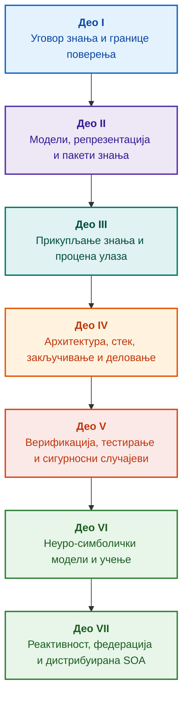

# Архитектура експертских система управљаних доказима: Од формалних онтологија до неуро-симболичке вештачке интелигенције

**Инжењерска монографија и референтни приручник за пројектовање, математичке основе, архитектуру и верификацију високопоузданих интелигентних система (Safety-Critical & Evidence-Grounded AI)**

**Аутор:** [Микола Федчик](../../about-the-author.md) · [LinkedIn](https://www.linkedin.com/in/nickfedchik/)  
**Формат:** Инжењерска монографија / Референтни приручник архитекте вештачке интелигенције  
**Година:** 2026  

---

## О књизи

Ова монографија представља фундаментално истраживање и инжењерски водич посвећен превазилажењу најважније кризе савремене вештачке интелигенције: епистемичког јаза између вероватносне уверљивости генерација неуронских мрежа и детерминистичке истинитости формалних математичких доказа. У средишту овог истраживања лежи бескомпромисно питање: **како пројектовати експертски систем чији је сваки закључак необорив, потпуно следљив до примарних извора доказа и погодан за сертификацију у сигурносно критичним инжењерским доменима (ISO 26262, IEC 61508, DO-178C, ISO/SAE 21434)?**

Аутор образлаже и поставља нову парадигму: **неуро-симболичку вештачку интелигенцију засновану на доказима (Evidence-Grounded Neuro-Symbolic AI)**, у којој статистички модели (LLM/SLM) обављају саветодавну функцију генерисања хипотеза и пројекција, док детерминистичко симболичко језгро непроменљиво гарантује инваријанте логичке конзистентности, бајтовског утемељења чињеница, спровођења граница надлежности и сигурног преласка на извршавање акција.

### Од артефакта до проверљиве одлуке

Системски захтеви, изворни код, протоколи извршавања тестова, регулаторни стандарди и инжењерске одлуке данас прожимају модерна производна окружења. Међутим, они претежно функционишу као nepovezani артефакти лишени формализоване семантике, експлицитних граница важења и двосмерне следљивости. Извештај о успешном квалификационом тесту може реферисати на застарелу ревизију хардвера; цитат из стандарда функционалне безбедности може бити извучен из контекста; аутоматско хитно враћање конфигурације може нехотице активирати опозвану компоненту.

Ова монографија успоставља целовити инжењерски цевовод: од формализације инжењерских артефаката као типизираних података и криптографски потписаних пакета знања до симболичког закључивања, декомпозиције планова корак-по-корак, контрачињеничних објашњења и аудита граница компетенција. Практично излагање је утемељено на продукцијским имплементацијама у језику Go са исцрпним тестним пакетима ([Поглавље 1](../../ch01-introduction-to-expert-systems.md)), ригорозним математичким уговорима ([Део II](../../part-02-knowledge-models.md)) и протоколима континуалног учења који доказиво елиминишу регресије ([Поглавље 25](../../ch25-how-expert-systems-learn.md)).

### Циљна група

Књига је намењена системским архитектима, водећим инжењерима за поузданост и функционалну безбедност, програмерима механизама логичког закључивања и инжењерима знања. За почетно разумевање кључних концепата потребно је само основно познавање предикатске логике првог реда, верзионисања софтвера и управљања животним циклусом; реплицирање практичних примера захтева стандардне Go алате. Специјализована поглавља која покривају формалну синтезу Goal Structuring Notation (GSN), синергетику комплексних система, неуроморфне акцелераторе и аутономну навигацију без GNSS-а адресирају најнапредније границе вештачке интелигенције управљане доказима у ваздухопловству, аутономним возилима и критичној инфраструктури.

---

## Научни контекст и глобално позиционирање монографије

Ова монографија не приступа експертским системима као архаичном наслеђу система заснованих на правилима из 1980-их (као што су CLIPS или MYCIN), већ као авангарди **трећег таласа неуро-симболичке вештачке интелигенције засноване на доказима (Third-Wave Evidence-Grounded Neuro-Symbolic AI)**. Методологија повезује теоријске основе водећих светских научних школа са системским инжењерством високих перформанси:

| Научна дисциплина | Кључна светска дела и аутори | Концептуални мост у овој монографији |
|---|---|---|
| **Неуро-симболичка AI трећег таласа (NeSy)** | Artur d'Avila Garcez, Luis C. Lamb (*Neurosymbolic AI: The 3rd Wave*, 2023; *Neural-Symbolic Cognitive Reasoning*, Springer, 2009); Henry Kautz (*The Third AI Summer*, AAAI 2022) | Раздвајање одговорности: статистички модели (SLM/LLM) генеришу хипотезе упита, док детерминистичко симболичко језгро формално верификује и прихвата чињенице ([Поглавље 29](../../ch29-neuro-symbolic-architecture.md)). |
| **Семантичка ограничења и безбедно учење** | Guy Van den Broeck et al. (*A Semantic Loss Function for Deep Learning with Symbolic Knowledge*, ICML 2018); Luc De Raedt et al. (*DeepProbLog*, IJCAI 2020) | Улазне и излазне капије, детерминистичко семантичко филтрирање кандидатских тврдњи неуронских мрежа у односу на формалне шеме ([Поглавља 28](../../ch28-dual-mode-expert-systems.md), [33](../../ch33-inter-system-knowledge-exchange-and-model-teaching.md)). |
| **Обориво расуђивање и теорија аргументације** | John L. Pollock (*Defeasible Reasoning*, 1987; *Cognitive Carpentry*, MIT Press, 1995); Phan Minh Dung (*Abstract Argumentation Frameworks*, AIJ 1995); Douglas Walton (*Argumentation Schemes*, Cambridge, 2008) | Декомпозиција знања на тврдње, порекло и побијаче (*defeaters*: *rebutting* и *undercutting*); решавање конфликата у нормативним базама правила помоћу Дангових аргументационих оквира ([Поглавља 2](../../ch02-epistemology-of-machine-knowledge.md), [27](../../ch27-safety-case-gsn-synthesis.md)). |
| **Аутоматизовано рударење асоцијативних правила (KBC)** | Luis Galárraga, Fabian M. Suchanek et al. (*AMIE: Association Rule Mining under Incomplete Evidence*, WWW 2013, VLDBJ 2015); Stephen Muggleton (*Inductive Logic Programming*, 1994) | Аутономна индукција правила из база знања под Претпоставком Делимичне Комплетности (PCA), чиме се елиминишу лажни контрапримери отвореног света ([Поглавље 34](../../ch34-deterministic-relational-analysis-abduction-and-socratic-dialogue.md)). |
| **Формални сигурносни штитови и сертификација (Safe AI)** | Bettina Könighofer, Roderick Bloem et al. (*Shield Synthesis*, 2017); Tim Kelly, Rob Weaver (*Goal Structuring Notation*, York, 2004); André Platzer (*Logical Foundations of CPS*, Springer, 2018) | Синтеза структурираних сигурносних аргумената у GSN нотацији за стандарде ISO 26262/21434; формални штитови и нумерички омотачи ваљаности за актуаторе на рубу мреже ([Поглавља 27](../../ch27-safety-case-gsn-synthesis.md), [30](../../ch30-safety-cybersecurity-co-engineering.md), [33](../../ch33-inter-system-knowledge-exchange-and-model-teaching.md)). |
| **Епистемичка логика и семиотика знања** | John F. Sowa (*Knowledge Representation: Logical, Philosophical, and Computational Foundations*, 2000); Frank van Harmelen et al. (*Handbook of Knowledge Representation*, Elsevier, 2008) | Епистемичка тријада Чарлса Сандерса Перса (Појам → Суд → Закључак); абдуктивно генерисање радних хипотеза под строгом дедуктивном контролом ([Поглавља 6](../../ch06-applied-mathematics-for-expert-systems.md), [34](../../ch34-deterministic-relational-analysis-abduction-and-socratic-dialogue.md)). |
| **Кибернетика и синергетика комплексних система** | Norbert Wiener (*Cybernetics*, 1948); W. Ross Ashby (*An Introduction to Cybernetics*, 1956); Hermann Haken (*Synergetics: An Introduction*, 1977; *Advanced Synergetics*, 1983); Ilya Prigogine (*Order out of Chaos*, 1984) | Ешбијев закон неопходне разноврсности, затворене управљачке петље L0–L4, редукција фазног простора на параметре реда помоћу Хакеновог принципа потчињавања, рано упозорење на фазне прелазе кроз критично успоравање (CSD) и дисипативна стабилизација база знања ([Поглавља 6](../../ch06-applied-mathematics-for-expert-systems.md), [22](../../ch22-cybernetics-edge-to-backend.md), [35](../../ch35-self-organizing-expert-systems-synergetics-and-npu-runtime.md)). |
| **Тестирање знања, инваријантност и Липшицова калибрација** | Kent Beck (*TDD*, 2002); Martin Fowler (*Refactoring*, 2018); Clark Barrett, Leonardo de Moura (*Z3 SMT Solver*, 2008); Chuan Guo et al. (*On Calibration of Modern Neural Networks*, ICML 2017); Marco Tulio Ribeiro et al. (*CheckList*, ACL 2020); John L. Pollock (*Defeasible Reasoning*, 1987) | Четворостепена пирамида тестирања знања (KTP): изоловано јединично тестирање атомских правила (KUT) уз мокирање премиса (`PremiseMock`), елиминација замке вакуумске истинитости, шестотачкаста спектрална анализа граничних вредности (BVA), решетке правила и побијачи (KIT), скор семантичке инваријантности ($\text{SIS} \ge 0.98$) при мутацијама упита, Липшицова ограничења непрекидности ($L_{\mathcal{K}} \le L_{\max}$) која спречавају треперење релеја и стигмергијско бележење празнина у знању ([Поглавље 36](../../ch36-knowledge-testing-pyramid-and-variational-calibration.md)). |

---

## Ауторски теоријски модели, научна истраживања и инжењерске иновације

Ова монографија синтетизује ауторов фундаментални истраживачки и системско-инжењерски допринос у области софтвера критичног за безбедност, уграђених архитектура и вештачке интелигенције вођене доказима. За разлику од чисто прегледне литературе, књига уводи скуп оригиналних формалних теорија, протокола и архитектонских образаца који подижу неуро-симболичке интеракције на математички верификован ниво поверења:

### 1. Фундаментални теоријски модели и математички формализми

1. **Инваријанта утемељења у доказима (EGI) и капија за прихватање чињеница ([Поглавља 2](../../ch02-epistemology-of-machine-knowledge.md), [19](../../ch19-from-question-to-evidence.md), [28](../../ch28-dual-mode-expert-systems.md), [29](../../ch29-neuro-symbolic-architecture.md)):**
   * *Теоријска формулација:* Аутор формализује Инваријанту потпуности утемељења $\mathrm{Comp}(C) = 1.00$, успостављајући да у архитектури вођеној доказима ниједна тврдња не може бити уздигнута у статус признате чињенице без детерминистичке пројекције на ауторитативне примарне изворе. Свака прихваћена n-торка чињенице усидрена је непроменљивим бајтовским помацима `[byte_start, byte_end]`, канонским криптографским хешом фрагмента `quote_sha256` и идентификатором PROV-O сертификата о пореклу.
   * *Инжењерски утицај:* Хардверско-софтверска пропусна капија на нивоу бајтова онемогућава халуцинацијама неуронских мрежа улазак у верзионисану базу знања, гарантујући нулту толеранцију на неутемељене тврдње ($ZHR = 1.00$).
2. **Четворостепена пирамида тестирања знања (KTP) и Липшицова непрекидност логичког простора ([Поглавље 36](../../ch36-knowledge-testing-pyramid-and-variational-calibration.md)):**
   * *Теоријска формулација:* Аутор уводи Пирамиду тестирања знања (KTP), преносећи дисциплину Фаулерове пирамиде тестирања софтвера у системе знања: изоловано јединично тестирање правила (KUT) коришћењем мокираних услова претходника (`PremiseMock`), интеграционо тестирање интеракција правила и побијача (KIT) и варијациону калибрацију кроз многострукости упита (KVT).
   * *Математички апарат:* Формализација инваријанте која спречава вакуумску истинитост ($P \to Q$ где је $P \equiv \text{False}$), скор семантичке инваријантности ($\mathrm{SIS} \ge 0.98$) при лингвистичким пертурбацијама и Липшицово ограничење непрекидности на многострукости закључивања ($L_{\mathcal{K}} \le L_{\max}$), што математички елиминише катастрофално треперење релеја при малим варијацијама улаза.
3. **Поперовска фалсификација деонтичких норми и активни аудит усклађености ([Поглавље 39](../../ch39-active-compliance-auditor-and-popperian-testing.md)):**
   * *Теоријска формулација:* Промена парадигме са пасивног пророчишта (које само одговара на упите) на активног аудитора усклађености који имплементира принцип фалсификације Карла Попера. Систем аутономно сондира простор спецификација (ASPICE 4.0, ISO 26262, ISO/SAE 21434), синтетизује контрапримере, идентификује недовољно дефинисане граничне услове и пројектује исцрпне верификационе кампање.
   * *Практична вредност:* Спајање неуронског генерисања граничних случајева (Систем 1) са детерминистичком деонтичком верификацијом кроз симболичко језгро (Систем 2), штитећи човека у управљачкој петљи (Human-in-the-Loop) од замора одобравања.
4. **Синергетска редукција димензионалности база знања и дијагностика CSD пре бифуркације ([Поглавља 6](../../ch06-applied-mathematics-for-expert-systems.md), [22](../../ch22-cybernetics-edge-to-backend.md), [35](../../ch35-self-organizing-expert-systems-synergetics-and-npu-runtime.md)):**
   * *Теоријска формулација:* Примена синергетике Хермана Хакена (параметри реда и принцип потчињавања) и дисипативних структура Илије Пригожина на еволуцију сложених репозиторијума знања.
   * *Научни допринос:* Високодимензионални фазни простори телеметрије редукују се на параметре реда, уз интеграцију детектора критичног успоравања (CSD) пре бифуркације заснованог на ауboundорелацији и варијанси. Ово омогућава откривање предстојеће сајбер-физичке нестабилности далеко пре него што реагују традиционални надзорници прагова.
5. **Модел нивоа аутономије деловања (A0–A4), пропусне капије и идемпотентне саге ([Поглавље 21](../../ch21-from-recommendation-to-action.md)):**
   * *Теоријска формулација:* Грануларни оквир овлашћења за аутоматизовано извршавање (A0: пасивна анализа, A1: нацрт акције, A2: извршење потписано од стране човека, A3: надгледана ограничена аутономија, A4: хитно искључивање fail-closed). Дозволе нису везане за систем као монолит, већ за триплет $\langle\text{акција}, \text{окружење}, \text{ниво ризика}\rangle$.
   * *Математички апарат:* Алгебарска инваријанта идемпотентности $f(f(x, k), k) \equiv f(x, k)$ кључана криптографским токеном $k$, извршавање корак-по-корак у затвореној петљи и протокол дистрибуираних компензационих сага који решава стања `OutcomeUnknown` помоћу ванпојасне верификације пост-услова.
6. **Формално заједничко инжењерство функционалне безбедности и сајбер-безбедности у GSN-у ([Поглавља 27](../../ch27-safety-case-gsn-synthesis.md), [30](../../ch30-safety-cybersecurity-co-engineering.md)):**
   * *Теоријска формулација:* Јединствена методологија синтезе у Goal Structuring Notation (GSN) која хармонизује истовремена ограничења стандарда ISO 26262 (функционална безбедност) и ISO/SAE 21434 (сајбер-безбедност).
   * *Инжењерски пробој:* Математичка арбитража између конфликтних циљева (границе кашњења хитног одговора наспрам дубине криптографске атестације), комбинована са протоколом селективног откривања доказа екстерним аудиторима путем посољених Мерклових стабала.
7. **Протокол верности објашњења и верификације семантичке конзистентности ([Поглавље 20](../../ch20-explanation-engine.md)):**
   * *Теоријска формулација:* Објашњења се не третирају као слободно генерисани текст, већ као детерминистички артефакти прве класе изведени стриктно из графа доказа, верзионих ознака правила и замрзнутих снимака чињеница.
   * *Математички апарат:* Формална метричка валидација верности објашњења ($C_{\text{facts}} = 1.00, H_{\text{free}} = 1.00$) уз аутоматско безбедно враћање на круте шаблоне при најмањем раскораку између симболичке дедукције и текста природног језика за оператера.

---

### 2. Емпиријска истраживања, ауторске експерименталне платформе и системско инжењерство

1. **Непроменљиви бинарни пакети знања са `mmap` и десеријализацијом са нултом алокацијом ([Поглавље 32](../../ch32-high-performance-knowledge-packs-mmap-and-harvesting.md)):**
   * *Ауторска иновација:* Двослојна архитектура пакета која раздваја канонске архиве примарних извора од изведених материјализованих сегмената индекса.
   * *Емпиријски резултат:* Директно мапирање у виртуелни адресни простор помоћу `mmap` елиминише алокације на хипу током извршавања (zero-allocation) и постиже суб-линеарно кашњење покретања енџина без обзира на вишегигабајтни обим онтологија.
2. **Емпиријска калибрациона платформа на регулаторним корпусима IETF RFC-1000 и W3C-150 ([Поглавља 2](../../ch02-epistemology-of-machine-knowledge.md), [4](../../ch04-evolution-from-bayes-to-evidence-ai.md), [14](../../ch14-requirements-detection-and-formalization.md), [25](../../ch25-how-expert-systems-learn.md)):**
   * *Ауторска платформа:* Распоређивање оквира за процену великих размера на 1.000 активних IETF RFC спецификација (које обухватају 5 хронолошких епоха интернета) и 150 сложених дијагностичких упита над W3C корпусом (укључујући индуковане логичке конфликте и конфабулације).
   * *Практични налаз:* Конструкција објективних матрица испита знања, емпиријска идентификација нормативних противречности и математички валидирана одбрана од регресија базе знања током континуалних ажурирања.
3. **Вишекорачна релациона анализа, симболичка абдукција и сократовски дијалог ([Поглавље 34](../../ch34-deterministic-relational-analysis-abduction-and-socratic-dialogue.md)):**
   * *Ауторска иновација:* Алгоритам обостране ограничене претраге у ширину (Bounded BFS, $k \le 6$) са супресијом циклуса и синтезом композитног ланца бајтовских доказа између произвољних повезаних ентитета.
   * *Инжењерска предност:* Реализација Персове симболичке абдукције под строгим дедуктивним ограничењима, у комбинацији са типизираним сократовским оквирима за појашњење (Clarification Frames) који воде систем у продуктиван дијалог са корисником уместо слепог одбијања под Претпоставком Затвореног Света (CWA).
4. **Формални сигурносни штитови и нумерички омотачи ваљаности за контролу на рубу ([Поглавље 33](../../ch33-inter-system-knowledge-exchange-and-model-teaching.md), [Додаци B](../../appendix-b-robotics-and-cyber-physical-systems.md), [C](../../appendix-c-autonomous-navigation-and-geosearch.md), [E](../../appendix-e-mixed-signal-neuromorphic-expert-systems.md)):**
   * *Ауторска иновација:* Методологија превођења дискретних логичких инваријанти у континуалне нумеричке сигурносне коридоре за дигиталне сигналне процесоре (DSP) и навигацију без GNSS-а (TRN/DSMAC/VIO).
   * *Оперативна поузданост:* Криптографски потписана размена правила помоћу Ed25519, изоловани карантин кандидатских правила и хардверско пресретање неважећих путања актуатора.
5. **Одбрана од цурења поверљивих информација путем објашњења и диференцијални аудит ([Поглавље 20](../../ch20-explanation-engine.md)):**
   * *Ауторска иновација:* Протокол редукције средње репрезентације објашњења ($\mathrm{EIR}_{\text{redacted}}$) који спроводи листе контроле приступа (ACL) на сваком чвору и грани графа доказа, неутралишући нападе бочним каналима усмерене на реконструкцију модела кроз контрастне упите ЗАШТО НЕ (WHY NOT).

---

## Принцип структурирања

Делови ове монографије структурирани су око примарних инжењерских циљева, а не према хронолошким датумима објављивања или пролазним комерцијалним називима технологија. Свако поглавље припада једном примарном делу; сродне технике илуструју методе за адресирање његове централне тезе. Бројеви поглавља и идентификатори датотека остају трајни кључеви, омогућавајући да се тематске путање читања разликују од нумеричког редоследа.

Структурне класе одељака унутар поглавља граде логички повезану аргументацију уместо пуког каталога еквивалентних технологија:

| Класа одељка | Питање читаоца | Архитектонска функција у поглављу |
|---|---|---|
| Проблем и границе | Који тачно изазов мора бити решен? | Дефинисање сржи истраживања и опсега важења |
| Објекат и модел | Који подаци, знања или стања се вреднују? | Формализација појмова, типова и оперативних претпоставки |
| Метода и поступак | Како се изводи решење? | Детаљан опис алгоритама дедукције, трансформације и контроле |
| Имплементација и алати | Који софтвер или хардвер извршава поступак? | Конкретни излистаји кода и архитектонски уговори |
| Верификација и бенчмарк | Како се систематски откривају кварови? | Мерење перформанси и тачности према независним критеријумима |
| Закључак и ограничења | Шта је доказано, а шта остаје отворено? | Одговор на централну тезу без неоснованих тврдњи |

Географија, специфични индустријски сектори и комерцијалне платформе служе као контексти примене, а не као посебни слојеви у овој таксономији. Речници, скраћенице, библиографије и навигација кроз индекс чине референтни апарат, а не засебне теме поглавља.

Комплетан уреднички преглед структуре пружа процену централне теме сваког поглавља, граница између суседних тема и композиционих напомена. Ажурирање сажетка не подразумева да су сви унутрашњи композициони ризици унутар поглавља решени.

## Путање читања

**Прва софтверска верификација:** [1](../../ch01-introduction-to-expert-systems.md) → [7](../../ch07-knowledge-base-typology.md) → [8](../../ch08-engineering-artifacts-as-data.md) → [17](../../ch17-implementation-stack.md) → [23](../../ch23-knowledge-base-verification.md) → [25](../../ch25-how-expert-systems-learn.md). Циљ: Добијање репродуцибилног, на доказима заснованог вердикта са негативним тестовима и контролисаном мутацијом знања. Језички модел је опциони.

**Инжењерство знања:** [Део II](../../part-02-knowledge-models.md) → [Део III](../../part-03-knowledge-engineering-nlp.md) → [19](../../ch19-from-question-to-evidence.md) → [20](../../ch20-explanation-engine.md) → [26](../../ch26-continual-learning.md). Циљ: Усаглашавање формалне семантике, порекла, екстракције кандидата и валидације. Део II чува међусекторски емпиријски истраживачки програм за Поглавља 7–11.

**Архитектура решења:** [16](../../ch16-expert-systems-architecture.md) → [19](../../ch19-from-question-to-evidence.md) → [31](../../ch31-syllogistic-reasoning-and-relation-lattices.md) → [20](../../ch20-explanation-engine.md) → [21](../../ch21-from-recommendation-to-action.md). Циљ: Раздвајање доказне верификације, примене нормативних правила, генерисања објашњења и оперативних овлашћења за акцију.

**Верификација и безбедност:** [23](../../ch23-knowledge-base-verification.md) → [36](../../ch36-knowledge-testing-pyramid-and-variational-calibration.md) → [25](../../ch25-how-expert-systems-learn.md) → [26](../../ch26-continual-learning.md) → [27](../../ch27-safety-case-gsn-synthesis.md) → [30](../../ch30-safety-cybersecurity-co-engineering.md). Екстерна физичка дијагностика обрађује се у [Поглављу 24](../../ch24-system-diagnosis.md).

**Хибридни одговори и оперативна примена:** [Део VI](../../part-06-frontiers-neuro-symbolic.md) → [Део VII](../../part-07-runtime-and-knowledge-exchange.md) → [40](../../ch40-distributed-epistemic-architectures-soa-and-cluster-scaling.md) и релевантни додаци. Циљ: Интеграција неуронских језичких модела, управљање епистемичким јазовима, архитектура дистрибуираних кластера услуга знања и верификација међусистемских федерација. Поглавља [2](../../ch02-epistemology-of-machine-knowledge.md), [4](../../ch04-evolution-from-bayes-to-evidence-ai.md) и [6](../../ch06-applied-mathematics-for-expert-systems.md) могу се користити по потреби као уговори, историјска еволуција и математичке основе.

---

## Опсег тврдњи и инжењерске границе

Ова монографија представља фундаментални образовни и истраживачки материјал; она није сертификована процедура усклађености нити самостални доказ усклађености опреме са стандардима. Детерминистичко извршавање не гарантује фактичку тачност премиса; хешеви и дигитални потписи доказују интегритет, а не емпиријску истину; графови аргумената не замењују сертификовано људско расуђивање. Захтеви поузданости на нивоу система не могу се поистоветити са стопом грешака токена језичког модела нити универзално пресликати на све софтверске модуле.

Аутоматизовано парсирање и екстракција смањују ручно премештање података, али не елиминишу неопходност формалног моделовања, стручне рецензије (peer review) и одређивања одговорних чувара знања (knowledge custodians). Онтологије у алату Protégé, мануелни аудити и аутоматизовани сакупљачи података функционишу у спрези. Математичке гаранције су омеђене експлицитним профилима формалних језика и оперативним претпоставкама; измерене вредности пропусности одражавају специфична оптерећења упита, корпусе и окружења извршавања. Историјске метрике из претходних ауторових продукцијских инсталација строго су одвојене од отворених едукативних платформи и активних научних истраживања.

Коначне одлуке о пуштању у производњу, прихватању ризика и регулаторној усклађености припадају искључиво овлашћеним инжењерима. Експертски систем вођен доказима припрема проверљиве ревизорске трагове и спроводи договорене сигурносне политике; он не преузима регулаторни суверенитет.

---

## Структура књиге

Монографија је организована у седам тематских делова, који обухватају 40 поглавља и пет додатака. Свако поглавље припада једном примарном делу. Секвенце навигације прате тематску путању приказану испод; бројеви поглавља и путање датотека остају непроменљиви.

---

### [Део I. Концептуалне и епистемичке основе](../../part-01-foundations.md)

*Када је експертски систем неопходан, шта чини машинско знање и како се чува организационо образложење.*

* [Поглавље 1. Увод у експертске системе: Од хаоса до управљаног знања](../../ch01-introduction-to-expert-systems.md)
* [Поглавље 2. Филозофија за системског инжењера: Шта машине имају право да назову знањем](../../ch02-epistemology-of-machine-knowledge.md)
* [Поглавље 3. Разграничење експертских система од референтних информационих система](../../ch03-beyond-reference-information-systems.md)
* [Поглавље 4. Еволуција експертских система: Од Бајесове теореме до вештачке интелигенције засноване на доказима](../../ch04-evolution-from-bayes-to-evidence-ai.md)
* [Поглавље 5. Тријада поверења: Експертски систем, проверљива препорука и корпоративна меморија](../../ch05-triad-of-trust-and-corporate-memory.md)

---

### [Део II. Математички модели, репрезентација и складиштење знања](../../part-02-knowledge-models.md)

*Избор математичких формализама, типизирани артефакти, инжењерски графови следљивости и непроменљиви пакети знања.*

* [Поглавље 6. Примењена математика за експертске системе: Правила, вероватноће, графови и каузалност](../../ch06-applied-mathematics-for-expert-systems.md)
* [Поглавље 7. Типологија база знања: Правила, онтологије, случајеви и векторска уграђивања](../../ch07-knowledge-base-typology.md)
* [Поглавље 8. Инжењерски артефакти као подаци експертског система](../../ch08-engineering-artifacts-as-data.md)
* [Поглавље 9. Инжењерски граф знања: Потпуна следљивост од захтева до силицијума](../../ch09-engineering-knowledge-graph-traceability.md)
* [Поглавље 32. Непроменљиви пакети знања: Бајтовско прихватање, индекси и мапирање меморије](../../ch32-high-performance-knowledge-packs-mmap-and-harvesting.md)

---

### [Део III. Прикупљање знања, лингвистичка анализа и процена улаза](../../part-03-knowledge-engineering-nlp.md)

*Документи, људска стручност и сензорска посматрања: екстракција кандидата, лингвистичка анализа, формализација и процена доказа.*

* [Поглавље 10. Системи за прикупљање знања: Извори, пропусне капије и животни циклуси](../../ch10-knowledge-acquisition-systems.md)
* [Поглавље 11. Прикупљање знања од доменских експерата: Интервјуи, когнитивне мапе и формализација праксе](../../ch11-knowledge-elicitation-from-experts.md)
* [Поглавље 12. Лингвистичка анализа и локални модели: Очување семантике и атрибуција извора](../../ch12-linguistic-analysis-and-local-models.md)
* [Поглавље 13. Варијабилност природног језика наспрам детерминизма: Компилација семантике упита](../../ch13-language-variability-vs-determinism.md)
* [Поглавље 14. Екстракција захтева и модалитета: Од нормативног текста до формалних инваријанти](../../ch14-requirements-detection-and-formalization.md)
* [Поглавље 15. Екстракција знања и изградња базе знања: Чињенице, граматике и аутомати](../../ch15-knowledge-extraction-and-kb-construction.md)
* [Поглавље 37. Процена улазних информација: Извори, докази и алгоритамски скептицизам](../../ch37-input-information-assessment-and-algorithmic-skepticism.md)

---

### [Део IV. Архитектура, технолошки стек, закључивање и деловање](../../part-04-architecture-and-inference.md)

*Архитектонски уговори, извршни стек, хардверско убрзање, верификација тврдњи, нормативно закључивање, механизми објашњења и кибернетске управљачке петље.*

* [Поглавље 16. Архитектура експертских система: Од формализованог знања до деловања вођеног доказима](../../ch16-expert-systems-architecture.md)
* [Поглавље 17. Технолошки стек: Избор алата, програмски језици и машине за правила](../../ch17-implementation-stack.md)
* [Поглавље 18. Инфраструктура извршавања: Локални SLM-ови, хардверски акцелератори, edge и on-premise](../../ch18-execution-infrastructure.md)
* [Поглавље 19. Од питања до доказа: Претрага, утемељење и верификација исказа](../../ch19-from-question-to-evidence.md)
* [Поглавље 31. Нормативно закључивање: Хијерархије предиката, изузеци и временска ваљаност](../../ch31-syllogistic-reasoning-and-relation-lattices.md)
* [Поглавље 20. Механизам објашњења: Одлуке, образложено одбијање и границе компетенција](../../ch20-explanation-engine.md)
* [Поглавље 21. Од препоруке до акције: Контрола овлашћења и безбедно извршавање у продукцији](../../ch21-from-recommendation-to-action.md)
* [Поглавље 22. Кибернетска управљачка петља: Сензори, актуатори и повратна спрега](../../ch22-cybernetics-edge-to-backend.md)

---

### [Део V. Верификација, тестирање, дијагностика и сигурносни случајеви](../../part-05-verification-and-learning.md)

*Формална верификација правила, пирамиде тестирања знања, поперовска фалсификација, техничка дијагностика и случајеви функционалне/сајбер безбедности.*

* [Поглавље 23. Верификација базе знања: Конзистентност, потпуност и исправност правила](../../ch23-knowledge-base-verification.md)
* [Поглавље 36. Пирамида тестирања знања: Правила, интеракције и варијациона стабилност](../../ch36-knowledge-testing-pyramid-and-variational-calibration.md)
* [Поглавље 39. Активни аудитор усклађености: Поперовска фалсификација, усклађеност са стандардима (ASPICE/ISO 26262/ISO 21434) и аутономно генерисање тестова](../../ch39-active-compliance-auditor-and-popperian-testing.md)
* [Поглавље 24. Техничка дијагностика: Раздвајање симптома од коренских узрока уз непотпуне информације](../../ch24-system-diagnosis.md)
* [Поглавље 27. Инжењерство сигурносних случајева: Формална синтеза и верификација GSN аргумената](../../ch27-safety-case-gsn-synthesis.md)
* [Поглавље 30. Заједничко инжењерство функционалне безбедности и сајбер-безбедности](../../ch30-safety-cybersecurity-co-engineering.md)

---

### [Део VI. Неуро-симболички модели, когнитивне границе и континуално учење](../../part-06-frontiers-neuro-symbolic.md)

*Строга дедукција наспрам саветодавних хипотеза, интеграција језичких модела, празнине у знању, елиминација халуцинација, испитне матрице и учење из искуства.*

* [Поглавље 28. Дворежимски експертски системи: Строга дедукција и саветодавне хипотезе](../../ch28-dual-mode-expert-systems.md)
* [Поглавље 29. Неуро-симболичка архитектура: Језички модели и верификација вођена доказима](../../ch29-neuro-symbolic-architecture.md)
* [Поглавље 34. Празнине у знању: Релациона претрага, абдукција и сократовско појашњење](../../ch34-deterministic-relational-analysis-abduction-and-socratic-dialogue.md)
* [Поглавље 38. Лечење машинских халуцинација и дефицита знања: Контрола излаза утемељена на доказима](../../ch38-curing-machine-hallucinations-and-knowledge-deficits.md)
* [Поглавље 25. Како експертски системи уче: Испитне матрице, аудити знања и контрола регресије](../../ch25-how-expert-systems-learn.md)
* [Поглавље 26. Континуално учење из искуства и ублажавање померања системских дневника](../../ch26-continual-learning.md)

---

### [Део VII. Реактивно окружење извршавања, међусистемска размена знања и дистрибуирана SOA](../../part-07-runtime-and-knowledge-exchange.md)

*Реактивно извршавање правила, синергетика и фазни прелази знања, међусистемска федерација и дистрибуиране корпоративне епистемичке архитектуре.*

* [Поглавље 35. Реактивни експертски системи: Догађаји, опозив правила и самоорганизација знања](../../ch35-self-organizing-expert-systems-synergetics-and-npu-runtime.md)
* [Поглавље 33. Међусистемска размена знања: Дистрибуција правила, подучавање модела и безбедна повратна спрега](../../ch33-inter-system-knowledge-exchange-and-model-teaching.md)
* [Поглавље 40. Дистрибуирана епистемичка архитектура: SOA знања, семантичко рутирање, хијерархије меморије и вишеизворна оборива арбитража](../../ch40-distributed-epistemic-architectures-soa-and-cluster-scaling.md)

---

### Додаци

* [Додатак A. Практични оквир за истраживање вођено доказима за комплексне инжењерске пројекте](../../appendix-a-evidence-governed-framework.md)
* [Додатак B. Експертски системи вођени доказима у аутономној роботици и сајбер-физичким системима](../../appendix-b-robotics-and-cyber-physical-systems.md)
* [Додатак C. Аутономна навигација без GNSS-а: Геопросторно упоређивање (TRN/DSMAC), визуелно-инерцијална одометрија (VIO) и експертска арбитража фузије сензора](../../appendix-c-autonomous-navigation-and-geosearch.md)
* [Додатак D. Аналогни експертски системи, неуроморфно рачунарство и хардверско закључивање](../../appendix-d-analog-expert-systems-and-neuromorphic-computing.md)
* [Додатак E. Експертски системи мешовитих аналогно-дигиталних сигнала: Неуроморфни, аналогни и не-фон-Нојманови процесори под управом доказа](../../appendix-e-mixed-signal-neuromorphic-expert-systems.md)
* [О аутору: Микола Федчик (Nick Fedchik)](../../about-the-author.md)

---

## Правци истраживања

Будући правци истраживања формулисани у овом раду представљају отворене инжењерске изазове, а не готова комерцијална решења: репродуцибилно паковање пакета знања са нултом алокацијом; верификација ограничених формалних фрагмената; управљање агентима путем експлицитних закупа овлашћења (authority leases); zero-knowledge верификација поверљивих формалних исказа; и контролисани опозив правила и модуларно одучавање модела (machine unlearning). Доказивање теоријског својства на моделу не потврђује аутоматски сигурност физичког система, а опозив правила није исто што и елиминација утицаја података из обученог неуронског модела.

За хардверске акцелераторе и неконвенционалне процесоре, емпиријске стопе грешака, границе кашњења, дисипација енергије и fail-silent понашања морају бити карактерисани пре распоређивања. Релевантне архитектонске стратегије истражују се у [Поглављу 29](../../ch29-neuro-symbolic-architecture.md), [Поглављу 32](../../ch32-high-performance-knowledge-packs-mmap-and-harvesting.md) и [Додацима D](../../appendix-d-analog-expert-systems-and-neuromorphic-computing.md) и [E](../../appendix-e-mixed-signal-neuromorphic-expert-systems.md). Емпиријски истраживачки план за поглавља 7–11 детаљно је разрађен у [Делу II](../../part-02-knowledge-models.md): свако предложено истраживање упарено је са проверљивом хипотезом, почетним бенчмарком и формалним критеријумом фалсификације.
