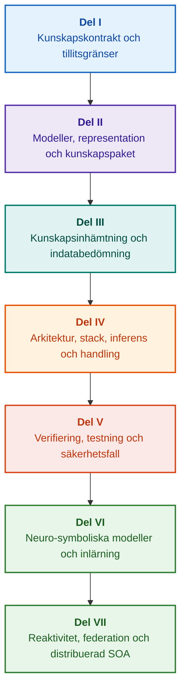

# Arkitektur för evidensstyrda expertsystem: Från formella ontologier till neuro-symbolisk AI

**Ingenjörsmonografi och referenshandbok för design, matematiska grunder, arkitektur och verifiering av högintelligenta system med hög integritet (Safety-Critical & Evidence-Grounded AI)**

**Författare:** [Mykola Fedchyk](../../about-the-author.md) · [LinkedIn](https://www.linkedin.com/in/nickfedchik/)  
**Format:** Ingenjörsmonografi / Skrivbordsreferens för AI-arkitekter  
**År:** 2026  

---

## Om boken

Denna monografi utgör en grundläggande forskningsstudie och ingenjörsguide tillägnad att övervinna den moderna artificiella intelligensens mest akuta kris: den epistemiska klyftan mellan den probabilistiska rimligheten hos neurala nätverksgenereringar och den deterministiska sanningen i formella matematiska bevis. I centrum för denna forskning ligger en kompromisslös fråga: **hur designar vi ett expertsystem vars varje slutsats är ovedersäglig, fullständigt spårbar till primära beviskällor och kvalificerad för certifiering inom säkerhetskritiska ingenjörsdomäner (ISO 26262, IEC 61508, DO-178C, ISO/SAE 21434)?**

Författaren motiverar och introducerar ett nytt paradigm: **Evidensförankrad neuro-symbolisk AI (Evidence-Grounded Neuro-Symbolic AI)**, där statistiska modeller (LLM/SLM) fullgör en rådgivande funktion för hypotesgenerering och projektionsrendering, medan en deterministisk symbolisk kärna oföränderligt garanterar invarianterna för logisk konsistens, byte-nivåförankring av fakta, upprätthållande av auktoritetsgränser och säker övergång till exekvering.

### Från artefakt till verifierbart beslut

Systemkrav, källkod, loggar från testkörningar, regulatoriska standarder och ingenjörsbeslut genomsyrar dagens moderna produktionsmiljöer. De fungerar dock övervägande som frikopplade artefakter utan formaliserad semantik, explicita giltighetsgränser och tvåvägs spårbarhet. En godkänd kvalificeringstestrapport kan referera till en föråldrad hårdvarurevision; ett citat från en funktionell säkerhetsstandard kan vara ryckt ur sitt sammanhang; en automatiserad nödåterställning av en konfiguration kan oavsiktligt aktivera en återkallad komponent.

Denna monografi etablerar en heltäckande ingenjörspipeline: från formalisering av ingenjörsartefakter som typade data och kryptografiskt signerade kunskapspaket till symbolisk inferens, steg-för-steg plandekomposition, kontrafaktiska förklaringar och revision av kompetensgränser. Den praktiska framställningen förankras i produktionsklara Go-implementationer med uttömmande testsviter ([Kapitel 1](../../ch01-introduction-to-expert-systems.md)), rigorösa matematiska kontrakt ([Del II](../../part-02-knowledge-models.md)) och kontinuerliga inlärningsprotokoll som bevisligen eliminerar regressioner ([Kapitel 25](../../ch25-how-expert-systems-learn.md)).

### Målgrupp

Boken riktar sig till systemarkitekter, chefsingenjörer inom tillförlitlighet och funktionell säkerhet, utvecklare av inferensmotorer och kunskapsingenjörer. För att tillgodogöra sig grundbegreppen krävs endast grundläggande förståelse för första ordningens predikatlogik, versionshantering och livscykelhantering; reproduktion av de praktiska exemplen kräver standardverktyg för Go. Specialiserade kapitel som täcker syntes av Goal Structuring Notation (GSN), komplexa reformers synergetik, neuromorfa acceleratorer och autonom navigering utan GNSS utforskar de mest avancerade gränserna för evidensstyrd AI inom flyg- och rymdteknik, autonoma fordon och kritisk infrastruktur.

---

## Vetenskaplig kontext och monografins globala placering

Monografin betraktar inte expertsystem som ett arkaiskt arv från 1980-talets regelbaserade system (som CLIPS eller MYCIN), utan som förtrupp för **Tredje vågens evidensförankrade neuro-symboliska AI (Third-Wave Evidence-Grounded Neuro-Symbolic AI)**. Metodiken förenar de teoretiska grunderna från ledande internationella forskningsmiljöer med högpresterande systemteknik:

| Vetenskaplig disciplin | Viktiga globala verk och författare | Konceptuell brygga i denna monografi |
|---|---|---|
| **Tredje vågens neuro-symboliska AI (NeSy)** | Artur d'Avila Garcez, Luis C. Lamb (*Neurosymbolic AI: The 3rd Wave*, 2023; *Neural-Symbolic Cognitive Reasoning*, Springer, 2009); Henry Kautz (*The Third AI Summer*, AAAI 2022) | Ansvarsfördelning: statistiska modeller (SLM/LLM) genererar frågehypoteser, medan en deterministisk symbolisk kärna formellt verifierar och godkänner fakta ([Kapitel 29](../../ch29-neuro-symbolic-architecture.md)). |
| **Semantiska restriktioner och säker inlärning** | Guy Van den Broeck et al. (*A Semantic Loss Function for Deep Learning with Symbolic Knowledge*, ICML 2018); Luc De Raedt et al. (*DeepProbLog*, IJCAI 2020) | Ingångs- och utgångsgrindar, deterministisk semantisk filtrering av neurala nätverkskandidater mot formella scheman ([Kapitlen 28](../../ch28-dual-mode-expert-systems.md), [33](../../ch33-inter-system-knowledge-exchange-and-model-teaching.md)). |
| **Omprövbart resonerande och argumentationsteori** | John L. Pollock (*Defeasible Reasoning*, 1987; *Cognitive Carpentry*, MIT Press, 1995); Phan Minh Dung (*Abstract Argumentation Frameworks*, AIJ 1995); Douglas Walton (*Argumentation Schemes*, Cambridge, 2008) | Dekomposition av kunskap i påståenden, härkomst och vederläggare (*defeaters*: *rebutting* och *undercutting*); konfliktlösning i normativa regelbaser via Dungs argumentationsramverk ([Kapitlen 2](../../ch02-epistemology-of-machine-knowledge.md), [27](../../ch27-safety-case-gsn-synthesis.md)). |
| **Automatiserad utvinning av associationsregler (KBC)** | Luis Galárraga, Fabian M. Suchanek et al. (*AMIE: Association Rule Mining under Incomplete Evidence*, WWW 2013, VLDBJ 2015); Stephen Muggleton (*Inductive Logic Programming*, 1994) | Autonom regelinduktion från kunskapsbaser under antagandet om partiell fullständighet (PCA), vilket eliminerar falska motexempel i en öppen värld ([Kapitel 34](../../ch34-deterministic-relational-analysis-abduction-and-socratic-dialogue.md)). |
| **Formella säkerhetssköldar och certifiering (Safe AI)** | Bettina Könighofer, Roderick Bloem et al. (*Shield Synthesis*, 2017); Tim Kelly, Rob Weaver (*Goal Structuring Notation*, York, 2004); André Platzer (*Logical Foundations of CPS*, Springer, 2018) | Syntes av strukturerade säkerhetsfall i GSN-notation för standarderna ISO 26262/21434; formella sköldar och numeriska giltighetskuvert för ställdon i kanten ([Kapitlen 27](../../ch27-safety-case-gsn-synthesis.md), [30](../../ch30-safety-cybersecurity-co-engineering.md), [33](../../ch33-inter-system-knowledge-exchange-and-model-teaching.md)). |
| **Epistemisk logik och kunskapssemiotik** | John F. Sowa (*Knowledge Representation: Logical, Philosophical, and Computational Foundations*, 2000); Frank van Harmelen et al. (*Handbook of Knowledge Representation*, Elsevier, 2008) | Charles Sanders Peirces epistemiska triad (Begrepp → Omdöme → Slutsats); abduktiv generering av arbetshypoteser under strikt deduktiv kontroll ([Kapitlen 6](../../ch06-applied-mathematics-for-expert-systems.md), [34](../../ch34-deterministic-relational-analysis-abduction-and-socratic-dialogue.md)). |
| **Cybernetik och synergetik för komplexa system** | Norbert Wiener (*Cybernetics*, 1948); W. Ross Ashby (*An Introduction to Cybernetics*, 1956); Hermann Haken (*Synergetics: An Introduction*, 1977; *Advanced Synergetics*, 1983); Ilya Prigogine (*Order out of Chaos*, 1984) | Ashbys lag om nödvändig variation, slutna styrslingor L0–L4, fasrumsreduktion till ordningsparametrar via Hakens slavprincip, tidig förvarning om fasövergångar genom kritisk inbromsning (CSD) och dissipativ stabilisering av kunskapsbaser ([Kapitlen 6](../../ch06-applied-mathematics-for-expert-systems.md), [22](../../ch22-cybernetics-edge-to-backend.md), [35](../../ch35-self-organizing-expert-systems-synergetics-and-npu-runtime.md)). |
| **Kunskapstestning, invarians och Lipschitz-kalibrering** | Kent Beck (*TDD*, 2002); Martin Fowler (*Refactoring*, 2018); Clark Barrett, Leonardo de Moura (*Z3 SMT Solver*, 2008); Chuan Guo et al. (*On Calibration of Modern Neural Networks*, ICML 2017); Marco Tulio Ribeiro et al. (*CheckList*, ACL 2020); John L. Pollock (*Defeasible Reasoning*, 1987) | Fyrstegs kunskapstestpyramid (KTP): isolerad enhetstestning av atomära regler (KUT) med simulerade premisser (`PremiseMock`), eliminering av fällan med tom sanning, 6-punkts spektral gränsvärdesanalys (BVA), regellattices och vederläggare (KIT), poäng för semantisk invarians ($\text{SIS} \ge 0.98$) vid lingvistiska frågemutationer, Lipschitz-kontinuitetsgränser ($L_{\mathcal{K}} \le L_{\max}$) som förhindrar relä-fladder samt stigmergisk fångst av kunskapsluckor ([Kapitel 36](../../ch36-knowledge-testing-pyramid-and-variational-calibration.md)). |

---

## Författarens teoretiska modeller, vetenskapliga forskning och ingenjörsinnovationer

Denna monografi sammanfattar författarens grundforskning och systemtekniska bidrag inom säkerhetskritisk programvara, inbyggda arkitekturer och evidensstyrd AI. Till skillnad från ren översiktslitteratur introducerar boken en svit av originella formella teorier, protokoll och arkitekturmönster som lyfter neuro-symboliska interaktioner till en matematiskt verifierad tillitsnivå:

### 1. Grundläggande teoretiska modeller och matematiska formalismer

1. **Evidensförankrad invariant (EGI) och grind för faktavalidering ([Kapitlen 2](../../ch02-epistemology-of-machine-knowledge.md), [19](../../ch19-from-question-to-evidence.md), [28](../../ch28-dual-mode-expert-systems.md), [29](../../ch29-neuro-symbolic-architecture.md)):**
   * *Teoretisk formulering:* Författaren formaliserar Invarianten för förankringsfullständighet $\mathrm{Comp}(C) = 1.00$, som fastställer att i en evidensstyrd arkitektur kan inget påstående upphöjas till erkänt faktum utan en deterministisk projektion på auktoritativa primärkällor. Varje godkänd faktatuppel förankras med oföränderliga byte-offset `[byte_start, byte_end]`, en kanonisk kryptografisk fragmenthash `quote_sha256` och en PROV-O härkomstcertifikatsidentifierare.
   * *Ingenjörsmässig effekt:* Hårdvaru-/mjukvaruporten på byte-nivå gör det omöjligt för neurala nätverkshallucinationer att tränga in i den versionerade kunskapsbasen, vilket garanterar nolltolerans mot ogrundade påståenden ($ZHR = 1.00$).
2. **Fyrstegs kunskapstestpyramid (KTP) och Lipschitz-kontinuitet i det logiska rummet ([Kapitel 36](../../ch36-knowledge-testing-pyramid-and-variational-calibration.md)):**
   * *Teoretisk formulering:* Författaren introducerar Kunskapstestpyramiden (KTP), som överför disciplinen från Fowlers testpyramid till kunskapssystem: isolerad enhetstestning av regler (KUT) med simulerade premissvillkor (`PremiseMock`), integrationstestning av regelinteraktioner och vederläggare (KIT) samt variationell kalibrering över frågemångfalder (KVT).
   * *Matematisk apparat:* Formalisering av en invariant som förhindrar tom sanning ($P \to Q$ där $P \equiv \text{False}$), ett poäng för semantisk invarians ($\mathrm{SIS} \ge 0.98$) vid lingvistiska störningar och ett Lipschitz-kontinuitetsvillkor på inferensmångfalden ($L_{\mathcal{K}} \le L_{\max}$), vilket matematiskt eliminerar katastrofalt relä-fladder vid små insignalvariationer.
3. **Poppersk falsifiering av deontiska normer och aktiv efterlevnadsrevision ([Kapitel 39](../../ch39-active-compliance-auditor-and-popperian-testing.md)):**
   * *Teoretisk formulering:* Ett paradigmskifte från ett passivt orakel (som enbart besvarar frågor) till en aktiv efterlevnadsrevisor som tillämpar Karl Poppers falsifierbarhetsprincip. Systemet sonderar autonomt specifikationsrymden (ASPICE 4.0, ISO 26262, ISO/SAE 21434), syntetiserar motexempel, identifierar underdefinierade gränsvillkor och utformar uttömmande verifieringskampanjer.
   * *Praktiskt värde:* Sammankoppling av neural generering av gränsfall (System 1) med deterministisk deontisk verifiering via den symboliska kärnan (System 2), vilket skyddar människan i styrslingan (Human-in-the-Loop) från godkännandetrötthet.
4. **Synergetisk dimensionalitetsreduktion av kunskapsbaser och CSD-diagnostik före bifurkation ([Kapitlen 6](../../ch06-applied-mathematics-for-expert-systems.md), [22](../../ch22-cybernetics-edge-to-backend.md), [35](../../ch35-self-organizing-expert-systems-synergetics-and-npu-runtime.md)):**
   * *Teoretisk formulering:* Tillämpning av Hermann Hakens synergetik (ordningsparametrar och slavprincip) och Ilya Prigogines dissipativa strukturer på utvecklingen av komplexa kunskapsförråd.
   * *Vetenskapligt bidrag:* Högdimensionella telemetrifasrum reduceras till ordningsparametrar, integrerande en detektor för kritisk inbromsning (CSD) före bifurkation baserad på autokorrelations- och variansmetrik. Detta upptäcker förestående cyberfysisk instabilitet långt innan konventionella tröskelövervakare larmar.
5. **Modell för handlingsautonominivåer (A0–A4), godkännandegrindar och idempotenta sagor ([Kapitel 21](../../ch21-from-recommendation-to-action.md)):**
   * *Teoretisk formulering:* Ett granulärt auktoritetsramverk för automatiserad exekvering (A0: passiv analys, A1: utkastgenerering, A2: mänskligt signerat utförande, A3: övervakad avgränsad autonomi, A4: nödstopp fail-closed). Behörigheter är inte knutna till systemet som en monolit, utan till tripletten $\langle\text{åtgärd}, \text{miljö}, \text{risknivå}\rangle$.
   * *Matematisk apparat:* En algebraisk idempotensinvariant $f(f(x, k), k) \equiv f(x, k)$ nycklad med kryptografisk token $k$, steg-för-steg sluten slingexekvering och ett distribuerat kompenserande sagaprotokoll som hanterar `OutcomeUnknown`-tillstånd via out-of-band-verifiering av postvillkor.
6. **Formell samkonstruktion av funktionell säkerhet och cybersäkerhet i GSN ([Kapitlen 27](../../ch27-safety-case-gsn-synthesis.md), [30](../../ch30-safety-cybersecurity-co-engineering.md)):**
   * *Teoretisk formulering:* En enhetlig Goal Structuring Notation (GSN)-syntesmetodik som harmoniserar samtidiga restriktioner från ISO 26262 (säkerhet) och ISO/SAE 21434 (cybersäkerhet).
   * *Ingenjörsmässigt genombrott:* Matematisk skiljedom mellan motstridiga mål (latensgränser för nödsvar kontra kryptografiskt intygandedjup), kombinerat med ett protokoll för selektiv bevisavslöjande för externa revisorer via saltade Merkle-träd.
7. **Protokoll för förklaringsfidelitet och verifiering av semantisk konsistens ([Kapitel 20](../../ch20-explanation-engine.md)):**
   * *Teoretisk formulering:* Förklaringar behandlas inte som fritt genererad text, utan som förstklassiga deterministiska artefakter som härleds strikt från bevisgrafen, reglernas versionstaggar och frysta faktamomentbilder.
   * *Matematisk apparat:* Formell metrisk grindning av förklaringsfidelitet ($C_{\text{facts}} = 1.00, H_{\text{free}} = 1.00$) med stöd för automatisk säkerhetsåtergång till rigida mallar vid minsta avvikelse mellan symbolisk deduktion och operatörsvänd naturlig språktext.

---

### 2. Empirisk forskning, författarens experimentella provbänkar och systemteknik

1. **Oföränderliga binära kunskapspaket med `mmap` och nollallokeringsdeserialisering ([Kapitel 32](../../ch32-high-performance-knowledge-packs-mmap-and-harvesting.md)):**
   * *Författarens innovation:* Tvånivåers paketarkitektur som frikopplar kanoniska primärkällarkiv från härledda materialiserade indexsegment.
   * *Empiriskt resultat:* Direkt minnesmappning via `mmap` i det virtuella adressutrymmet eliminerar heap-allokeringar vid körning (zero-allocation) och uppnår sub-linjär motorstartlatens oavsett fleragigabyte-ontologier.
2. **Empirisk kalibreringsprovbänk på IETF RFC-1000 och W3C-150 regelverkskorpusar ([Kapitlen 2](../../ch02-epistemology-of-machine-knowledge.md), [4](../../ch04-evolution-from-bayes-to-evidence-ai.md), [14](../../ch14-requirements-detection-and-formalization.md), [25](../../ch25-how-expert-systems-learn.md)):**
   * *Författarens provbänk:* Driftsättning av ett storskaligt utvärderingsramverk över 1 000 aktiva IETF RFC-specifikationer (som spänner över 5 kronologiska internetepoker) och 150 komplexa diagnostiska frågor mot W3C-korpusen (inklusive inducerade logiska konflikter och konfabulationer).
   * *Praktisk upptäckt:* Konstruktion av objektiva kunskapsexaminationsmatriser, empirisk identifiering av normativa motsägelser och matematiskt validerat försvar mot kunskapsbasregressioner vid kontinuerliga uppdateringar.
3. **Flerstegs relationsanalys, symbolisk abduktion och sokratisk dialog ([Kapitel 34](../../ch34-deterministic-relational-analysis-abduction-and-socratic-dialogue.md)):**
   * *Författarens innovation:* En dubbelriktad avgränsad bredden-först-sökalgoritm (Bounded BFS, $k \le 6$) med cykelundertryckning och sammansatt beviskedjesyntes på byte-nivå över sammankopplade entiteter.
   * *Ingenjörsmässig fördel:* Realisering av Peirces symboliska abduktion under strikta deduktiva ramar, parad med typade sokratiska förtydliganderamar (Clarification Frames) som vägleder systemet till en produktiv användardialog istället för blind avvisning under antagandet om en sluten värld (CWA).
4. **Formella säkerhetssköldar och numeriska giltighetskuvert för kantstyrning ([Kapitel 33](../../ch33-inter-system-knowledge-exchange-and-model-teaching.md), [Bilagorna B](../../appendix-b-robotics-and-cyber-physical-systems.md), [C](../../appendix-c-autonomous-navigation-and-geosearch.md), [E](../../appendix-e-mixed-signal-neuromorphic-expert-systems.md)):**
   * *Författarens innovation:* Metodik för att översätta diskreta logiska invarianter till kontinuerliga numeriska säkerhetskorridorer för digitala signalprocessorer (DSP) och navigering utan GNSS (TRN/DSMAC/VIO).
   * *Driftsäkerhet:* Kryptografiskt signerat regelutbyte via Ed25519, isolerad karantänisering av kandidatregler och hårdvaruavlyssning av ogiltiga ställdonstrajektorier.
5. **Försvar mot läckage av konfidentiell information via förklaringar och differentiell revision ([Kapitel 20](../../ch20-explanation-engine.md)):**
   * *Författarens innovation:* Reduktionsprotokoll för intermediär förklaringsrepresentation ($\mathrm{EIR}_{\text{redacted}}$) som upprätthåller åtkomstkontrollistor (ACL) vid varje nod och kant i bevisgrafen, vilket neutraliserar sidokanalsattacker för modellrekonstruktion via kontrastiva VARFÖR INTE-frågor (WHY NOT).

---

## Struktureringsprincip

Delarna i denna monografi är strukturerade kring primära ingenjörsmässiga mål snarare än kronologiska publiceringsdatum eller flyktiga kommersiella teknologinamn. Varje kapitel tillhör en enda primär del; relaterade tekniker illustrerar metoder för att hantera dess centrala tes. Kapitelnummer och filidentifierare förblir permanenta nycklar, vilket gör att tematiska lässekvenser kan skilja sig från den numeriska ordningen.

Avsnittsklasser inom kapitel bygger upp en logiskt sammanhängande argumentation snarare än en katalog över likvärdiga teknologier:

| Avsnittsklass | Läsarens frågeställning | Arkitektonisk funktion i kapitlet |
|---|---|---|
| Problem och gränser | Vilken exakt utmaning måste lösas? | Definierar kärnan i undersökningen och giltighetsområdet |
| Objekt och modell | Vilka data, kunskaper eller tillstånd utvärderas? | Formaliserar begrepp, typer och driftsantaganden |
| Metod och procedur | Hur härleds lösningen? | Detaljerar algoritmer för deduktion, transformation och styrning |
| Implementation och verktyg | Vilken mjukvara eller hårdvara kör proceduren? | Tillhandahåller konkreta kodlistningar och arkitekturkontrakt |
| Verifiering och benchmark | Hur exponeras felmoder systematiskt? | Mäter prestanda och korrekthet mot oberoende kriterier |
| Slutsats och begränsningar | Vad har bevisats och vad förblir öppet? | Besvarar den centrala tesen utan ogrundade påståenden |

Geografi, specifika industrisektorer och kommersiella plattformar fungerar som tillämpningskontexter och inte som separata nivåer i denna taxonomi. Ordlistor, förkortningar, bibliografier och indexnavigering utgör referensapparat, inte fristående kapitelämnen.

Den fullständiga redaktionella strukturöversikten ger en bedömning av varje kapitels kärntema, gränser mellan närliggande ämnen och kompositionella anteckningar. Att uppdatera en sammanfattning innebär inte att alla interna kompositionella risker i kapitlen är lösta.

## Läsrutter

**Första mjukvaruverifiering:** [1](../../ch01-introduction-to-expert-systems.md) → [7](../../ch07-knowledge-base-typology.md) → [8](../../ch08-engineering-artifacts-as-data.md) → [17](../../ch17-implementation-stack.md) → [23](../../ch23-knowledge-base-verification.md) → [25](../../ch25-how-expert-systems-learn.md). Mål: Ta fram ett reproducerbart, evidensförankrat utlåtande med negativa tester och kontrollerad kunskapsmutation. Språkmodell är valfri.

**Kunskapsingenjörskonst:** [Del II](../../part-02-knowledge-models.md) → [Del III](../../part-03-knowledge-engineering-nlp.md) → [19](../../ch19-from-question-to-evidence.md) → [20](../../ch20-explanation-engine.md) → [26](../../ch26-continual-learning.md). Mål: Förena formell semantik, härkomst, kandidatutvinning och validering. Del II bevarar det tvärgående empiriska forskningsprogrammet för kapitlen 7–11.

**Lösningsarkitektur:** [16](../../ch16-expert-systems-architecture.md) → [19](../../ch19-from-question-to-evidence.md) → [31](../../ch31-syllogistic-reasoning-and-relation-lattices.md) → [20](../../ch20-explanation-engine.md) → [21](../../ch21-from-recommendation-to-action.md). Mål: Frikoppla bevisverifiering, tillämpning av normativa regler, förklaringsgenerering och operativ handlingsauktoritet.

**Verifiering och säkerhet:** [23](../../ch23-knowledge-base-verification.md) → [36](../../ch36-knowledge-testing-pyramid-and-variational-calibration.md) → [25](../../ch25-how-expert-systems-learn.md) → [26](../../ch26-continual-learning.md) → [27](../../ch27-safety-case-gsn-synthesis.md) → [30](../../ch30-safety-cybersecurity-co-engineering.md). Extern fysisk diagnostik behandlas i [Kapitel 24](../../ch24-system-diagnosis.md).

**Hybridsvar och operativ driftsättning:** [Del VI](../../part-06-frontiers-neuro-symbolic.md) → [Del VII](../../part-07-runtime-and-knowledge-exchange.md) → [40](../../ch40-distributed-epistemic-architectures-soa-and-cluster-scaling.md) och relevanta bilagor. Mål: Integrera neurala språkmodeller, hantera epistemiska klyftor, designa distribuerade kunskapstjänstkluster och verifiera federationer mellan system. Kapitlen [2](../../ch02-epistemology-of-machine-knowledge.md), [4](../../ch04-evolution-from-bayes-to-evidence-ai.md) och [6](../../ch06-applied-mathematics-for-expert-systems.md) kan refereras vid behov som kontrakt, historisk utveckling och matematiska grunder.

---

## Påståendenas omfattning och ingenjörsmässiga gränser

Denna monografi utgör grundläggande utbildnings- och forskningsmaterial; den är inte ett certifierat efterlevnadsförfarande eller ett självständigt bevis på utrustningens överensstämmelse med standarder. Deterministisk exekvering garanterar inte premissernas faktiska korrekthet; hashar och digitala signaturer bevisar integritet, inte empirisk sanning; argumentgrafer ersätter inte certifierat mänskligt omdöme. Tillförlitlighetskrav på systemnivå kan inte likställas med språkmodellens felfrekvens för tokens eller extrapoleras universellt över alla mjukvarumoduler.

Automatiserad tolkning och extraktion minskar manuell dataflytt men eliminerar inte nödvändigheten av formell modellering, kollegial granskning (peer review) och utsedda kunskapsförvaltare (knowledge custodians). Protégé-ontologier, manuella revisioner och automatiserade insamlare samverkar. Matematiska garantier avgränsas av explicita formella språkprofiler och driftsantaganden; uppmätta genomströmningsriktmärken speglar specifika frågebelastningar, korpusar och exekveringsmiljöer. Historiska mätvärden från författarens tidigare produktionsdriftsättningar skiljs strikt från öppna utbildningsprovbänkar och aktiva forskningsstudier.

Slutgiltiga beslut om produktionsfrisläppning, riskacceptans och regelefterlevnad vilar uteslutande hos auktoriserade ingenjörer. Ett evidensstyrt expertsystem förbereder verifierbara revisionsspår och upprätthåller överenskomna säkerhetspolicyer; det övertar inte regulatorisk suveränitet.

---

## Bokens struktur

Monografin är indelad i sju tematiska delar, omfattande 40 kapitel och fem bilagor. Varje kapitel tillhör en enda primär del. Navigationssekvenser följer den tematiska färdplanen nedan; kapitelnummer och filsökvägar förblir oförändrade.

---

### [Del I. Konceptuella och epistemiska grunder](../../part-01-foundations.md)

*När ett expertsystem krävs, vad som utgör maskinkunskap och hur organisatorisk motivering bevaras.*

* [Kapitel 1. Introduktion till expertsystem: Från kaos till styrd kunskap](../../ch01-introduction-to-expert-systems.md)
* [Kapitel 2. Filosofi för systemingenjören: Vad maskiner har rätt att kalla kunskap](../../ch02-epistemology-of-machine-knowledge.md)
* [Kapitel 3. Att skilja expertsystem från referensinformationssystem](../../ch03-beyond-reference-information-systems.md)
* [Kapitel 4. Expertsystemens evolution: Från Bayes teorem till evidensstyrd AI](../../ch04-evolution-from-bayes-to-evidence-ai.md)
* [Kapitel 5. Tillitens triad: Expertsystem, verifierbar rekommendation och företagsminne](../../ch05-triad-of-trust-and-corporate-memory.md)

---

### [Del II. Matematiska modeller, kunskapsrepresentation och lagring](../../part-02-knowledge-models.md)

*Val av matematiska formalismer, typade artefakter, tekniska spårbarhetsgrafer och oföränderliga kunskapspaket.*

* [Kapitel 6. Tillämpad matematik för expertsystem: Regler, sannolikheter, grafer och kausalitet](../../ch06-applied-mathematics-for-expert-systems.md)
* [Kapitel 7. Typologi för kunskapsbaser: Regler, ontologier, fall och vektorinbäddningar](../../ch07-knowledge-base-typology.md)
* [Kapitel 8. Ingenjörsartefakter som data för expertsystem](../../ch08-engineering-artifacts-as-data.md)
* [Kapitel 9. Teknisk kunskapsgraf: Total spårbarhet från krav till kisel](../../ch09-engineering-knowledge-graph-traceability.md)
* [Kapitel 32. Oföränderliga kunskapspaket: Validering på byte-nivå, index och minnesmappning](../../ch32-high-performance-knowledge-packs-mmap-and-harvesting.md)

---

### [Del III. Kunskapsinhämtning, lingvistisk analys och indatabedömning](../../part-03-knowledge-engineering-nlp.md)

*Dokument, mänsklig expertis och sensoriska observationer: kandidatutvinning, lingvistisk analys, formalisering och bevisbedömning.*

* [Kapitel 10. System för kunskapsinhämtning: Källor, valideringsgrindar och livscykler](../../ch10-knowledge-acquisition-systems.md)
* [Kapitel 11. Att inhämta kunskap från domänexperter: Intervjuer, kognitiva kartor och formalisering av praxis](../../ch11-knowledge-elicitation-from-experts.md)
* [Kapitel 12. Lingvistisk analys och lokala modeller: Att bevara semantik och källattribution](../../ch12-linguistic-analysis-and-local-models.md)
* [Kapitel 13. Naturlig språkvariabilitet vs. determinism: Kompilering av frågesemantik](../../ch13-language-variability-vs-determinism.md)
* [Kapitel 14. Extraktion av krav och modaliteter: Från normativ text till formella invarianter](../../ch14-requirements-detection-and-formalization.md)
* [Kapitel 15. Kunskapsutvinning och uppbyggnad av kunskapsbaser: Fakta, grammatiker och automater](../../ch15-knowledge-extraction-and-kb-construction.md)
* [Kapitel 37. Bedömning av ingående information: Källor, bevis och algoritmisk skepticism](../../ch37-input-information-assessment-and-algorithmic-skepticism.md)

---

### [Del IV. Arkitektur, teknikstack, inferens och handling](../../part-04-architecture-and-inference.md)

*Arkitektoniska kontrakt, körstack, hårdvaruacceleration, påståendeverifiering, normativ inferens, förklaringsmotorer och cybernetiska styrslingor.*

* [Kapitel 16. Expertsystemarkitektur: Från formaliserad kunskap till evidensstyrd handling](../../ch16-expert-systems-architecture.md)
* [Kapitel 17. Teknikstacken: Val av verktyg, programmeringsspråk och regelmotorer](../../ch17-implementation-stack.md)
* [Kapitel 18. Exekveringsinfrastruktur: Lokala SLM:er, hårdvaruacceleratorer, edge och on-premise](../../ch18-execution-infrastructure.md)
* [Kapitel 19. Från fråga till bevis: Sökning, förankring och påståendeverifiering](../../ch19-from-question-to-evidence.md)
* [Kapitel 31. Normativ inferens: Predikathierarkier, undantag och tidsmässig giltighet](../../ch31-syllogistic-reasoning-and-relation-lattices.md)
* [Kapitel 20. Förklaringsmotor: Beslut, motiverad vägran och kompetensgränser](../../ch20-explanation-engine.md)
* [Kapitel 21. Från rekommendation till handling: Auktoritetskontroll och säker exekvering i produktion](../../ch21-from-recommendation-to-action.md)
* [Kapitel 22. Den cybernetiska styrslingan: Sensorer, ställdon och återkoppling](../../ch22-cybernetics-edge-to-backend.md)

---

### [Del V. Verifiering, testning, diagnostik och säkerhetsfall](../../part-05-verification-and-learning.md)

*Formell regelverifiering, kunskapstestpyramider, poppersk falsifiering, teknisk diagnostik och funktionella/cybersäkerhetsfall.*

* [Kapitel 23. Verifiering av kunskapsbaser: Konsistens, fullständighet och regelkorrekthet](../../ch23-knowledge-base-verification.md)
* [Kapitel 36. Kunskapstestpyramiden: Regler, interaktioner och variationell stabilitet](../../ch36-knowledge-testing-pyramid-and-variational-calibration.md)
* [Kapitel 39. Den aktiva efterlevnadsrevisorn: Poppersk falsifiering, standardefterlevnad (ASPICE/ISO 26262/ISO 21434) och autonom testgenerering](../../ch39-active-compliance-auditor-and-popperian-testing.md)
* [Kapitel 24. Teknisk diagnostik: Att särskilja symtom från grundorsaker under ofullständig information](../../ch24-system-diagnosis.md)
* [Kapitel 27. Konstruktion av säkerhetsfall: Formell syntes och verifiering av GSN-argument](../../ch27-safety-case-gsn-synthesis.md)
* [Kapitel 30. Samkonstruktion av funktionell säkerhet och cybersäkerhet](../../ch30-safety-cybersecurity-co-engineering.md)

---

### [Del VI. Neuro-symboliska modeller, kognitiva frontlinjer och kontinuerlig inlärning](../../part-06-frontiers-neuro-symbolic.md)

*Strikt deduktion vs. rådgivande hypoteser, integrering av språkmodeller, kunskapsluckor, eliminering av hallucinationer, examinationsmatriser och erfarenhetsbaserad inlärning.*

* [Kapitel 28. Expertsystem med dubbla lägen: Strikt deduktion och rådgivande hypoteser](../../ch28-dual-mode-expert-systems.md)
* [Kapitel 29. Neuro-symbolisk arkitektur: Språkmodeller och evidensstyrd verifiering](../../ch29-neuro-symbolic-architecture.md)
* [Kapitel 34. Kunskapsluckor: Relationssökning, abduktion och sokratiskt förtydligande](../../ch34-deterministic-relational-analysis-abduction-and-socratic-dialogue.md)
* [Kapitel 38. Att bota maskinhallucinationer och kunskapsunderskott: Evidensförankrad utdatakontroll](../../ch38-curing-machine-hallucinations-and-knowledge-deficits.md)
* [Kapitel 25. Hur expertsystem lär sig: Examinationsmatriser, kunskapsrevisioner och regressionskontroll](../../ch25-how-expert-systems-learn.md)
* [Kapitel 26. Kontinuerlig inlärning från erfarenhet och begränsning av drift i systemloggar](../../ch26-continual-learning.md)

---

### [Del VII. Reaktiv körtidsmiljö, kunskapsutbyte mellan system och distribuerad SOA](../../part-07-runtime-and-knowledge-exchange.md)

*Reaktiv regelexekvering, synergetik och kunskapsfasövergångar, federation mellan system och distribuerade epistemiska företagsarkitekturer.*

* [Kapitel 35. Reaktiva expertsystem: Händelser, återkallelse och självorganisering av kunskap](../../ch35-self-organizing-expert-systems-synergetics-and-npu-runtime.md)
* [Kapitel 33. Kunskapsutbyte mellan system: Regeltillhandahållande, modellundervisning och säker återkoppling](../../ch33-inter-system-knowledge-exchange-and-model-teaching.md)
* [Kapitel 40. Distribuerad epistemisk arkitektur: Kunskaps-SOA, semantisk dirigering, minneshierarkier och omprövbar skiljedom från flera källor](../../ch40-distributed-epistemic-architectures-soa-and-cluster-scaling.md)

---

### Bilagor

* [Bilaga A. Praktiskt evidensstyrt forskningsramverk för komplexa ingenjörsprojekt](../../appendix-a-evidence-governed-framework.md)
* [Bilaga B. Evidensstyrda expertsystem inom autonom robotik och cyberfysiska system](../../appendix-b-robotics-and-cyber-physical-systems.md)
* [Bilaga C. Autonom navigering utan GNSS: Geospatial matchning (TRN/DSMAC), visuell-tröghetsodometri (VIO) och expertmedling vid sensorfusion](../../appendix-c-autonomous-navigation-and-geosearch.md)
* [Bilaga D. Analoga expertsystem, neuromorf beräkning och hårdvaruinferens](../../appendix-d-analog-expert-systems-and-neuromorphic-computing.md)
* [Bilaga E. Expertsystem med blandade analog-digitala signaler: Neuromorfa, analoga och icke-von-Neumann-processorer under evidensstyrning](../../appendix-e-mixed-signal-neuromorphic-expert-systems.md)
* [Om författaren: Mykola Fedchyk (Nick Fedchik)](../../about-the-author.md)

---

## Forskningsinriktningar

Framtida forskningsriktningar som formuleras i detta arbete representerar öppna ingenjörsmässiga utmaningar snarare än garanterade färdiga kommersiella lösningar: reproducerbar paketering av kunskapspaket med nollallokering; verifiering av avgränsade formella fragment; agentstyrning via explicita behörighetsavtal (authority leases); nollkunskapsverifiering (zero-knowledge) av konfidentiella formella påståenden; samt kontrollerad återkallelse av regler och maskinavvänjning av modeller (machine unlearning). Att bevisa en teoretisk egenskap på en modell validerar inte automatiskt det fysiska systemets säkerhet, och att återkalla en regel är inte liktydigt med att eliminera datans påverkan från en tränad neural modell.

För hårdvaruacceleratorer och icke-konventionella processorer måste empiriska felfrekvenser, latensgränser, energiförlust och fail-silent-beteenden karakteriseras noggrant före driftsättning. Relevanta arkitekturstrategier undersöks i [Kapitel 29](../../ch29-neuro-symbolic-architecture.md), [Kapitel 32](../../ch32-high-performance-knowledge-packs-mmap-and-harvesting.md) samt [Bilagorna D](../../appendix-d-analog-expert-systems-and-neuromorphic-computing.md) och [E](../../appendix-e-mixed-signal-neuromorphic-expert-systems.md). Det empiriska forskningsprogrammet för kapitlen 7–11 beskrivs i detalj i [Del II](../../part-02-knowledge-models.md): varje föreslagen undersökning paras ihop med en testbar hypotes, ett utgångsriktmärke och ett formellt falsifieringskriterium.
