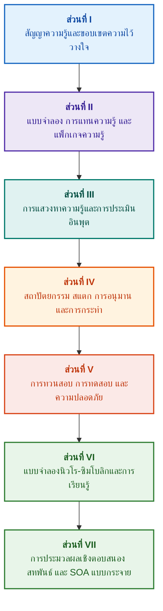

# สถาปัตยกรรมระบบผู้เชี่ยวชาญที่มีหลักฐานควบคุม: จากภววิทยาเชิงรูปนัยสู่ AI นิวโร-ซิมโบลิก

**เอกสารการวิจัยเชิงวิศวกรรมและคู่มือฉบับสมบูรณ์เกี่ยวกับการออกแบบ แบบจำลองทางคณิตศาสตร์ สถาปัตยกรรม และการทวนสอบเชิงรูปนัยสำหรับระบบอัจฉริยะที่มีความน่าเชื่อถือสูง (Safety-Critical & Evidence-Grounded AI)**

**ผู้เขียน:** [Mykola Fedchyk (Микола Федчик)](../../about-the-author.md) · [LinkedIn](https://www.linkedin.com/in/nickfedchik/)  
**รูปแบบ:** เอกสารวิชาการทางวิศวกรรม / คู่มือสถาปนิก AI  
**ปี:** 2026  

---

## เกี่ยวกับหนังสือ

หนังสือเล่มนี้เป็นงานวิจัยเชิงเอกสารพื้นฐานและคู่มือปฏิบัติการทางวิศวกรรมที่อุทิศให้กับการเอาชนะวิกฤตการณ์สำคัญของปัญญาประดิษฐ์ร่วมสมัย: ช่องว่างทางญาณวิทยาระหว่างความน่าจะเป็นเชิงสถิติของโครงข่ายประสาทเทียมกับความจริงเชิงกำหนดของการพิสูจน์ทางคณิตศาสตร์รูปนัย หัวใจของการวิจัยตั้งอยู่บนคำถามทางวิศวกรรมที่เคร่งครัด: **จะออกแบบระบบผู้เชี่ยวชาญอย่างไรให้ทุกข้อสรุปไม่สามารถปฏิเสธได้ ตรวจสอบย้อนกลับไปยังแหล่งที่มาหลักของพยานหลักฐานได้อย่างสมบูรณ์ และพร้อมสำหรับการรับรองในโดเมนวิศวกรรมที่มีความสำคัญด้านความปลอดภัยขั้นวิกฤต (ISO 26262, IEC 61508, DO-178C, ISO/SAE 21434)?**

ผู้เขียนได้วางรากฐานและสร้างกระบวนทัศน์ใหม่: **AI นิวโร-ซิมโบลิกที่มีหลักฐานควบคุม (Evidence-Grounded Neuro-Symbolic AI)** ในสถาปัตยกรรมนี้ โมเดลเชิงสถิติ (LLM/SLM) ทำหน้าที่ให้คำปรึกษาในการสร้างสมมติฐานการสืบค้นและการเรนเดอร์ภาพฉาย ในขณะที่แกนกลางเชิงสัญลักษณ์ที่แน่นอนจะรับประกันความสอดคล้องเชิงตรรกะ การยึดโยงข้อเท็จจริงในระดับไบต์ การควบคุมขอบเขตอำนาจ และการเปลี่ยนผ่านสู่การปฏิบัติอย่างปลอดภัยโดยไม่แปรผัน

### จากสิ่งประดิษฐ์ทางวิศวกรรมสู่การตัดสินใจที่ตรวจสอบได้

ข้อกำหนดของระบบ โค้ดต้นฉบับ บันทึกการทดสอบ มาตรฐานการกำกับดูแล และการตัดสินใจทางวิศวกรรมมีอยู่แล้วในสภาพแวดล้อมการผลิตสมัยใหม่ แต่ส่วนใหญ่ทำงานเป็นสิ่งประดิษฐ์ที่กระจัดกระจายโดยปราศจากความหมายเชิงรูปนัย ขาดขอบเขตความสมบูรณ์ที่เข้มงวด และขาดการตรวจสอบย้อนกลับระหว่างกัน รายงานการทดสอบที่ประสบความสำเร็จอาจอ้างอิงถึงการแก้ไขฮาร์ดแวร์ที่ล้าสมัย ใบเสนอราคาจากมาตรฐานความปลอดภัยเชิงฟังก์ชันอาจถูกตัดออกจากบริบท และการย้อนกลับการกำหนดค่าในกรณีฉุกเฉินอาจเปิดใช้งานส่วนประกอบที่ถูกยกเลิกไปแล้วโดยไม่ได้ตั้งใจ

เอกสารเล่มนี้นำเสนอขั้นตอนทางวิศวกรรมแบบครบวงจร: ตั้งแต่การทำให้สิ่งประดิษฐ์ทางวิศวกรรมเป็นข้อมูลที่มีการระบุประเภทและแพ็กเกจความรู้ที่ลงนามด้วยการเข้ารหัส — ไปจนถึงการอนุมานเชิงสัญลักษณ์ การแยกย่อยแผนทีละขั้นตอน คำอธิบายเชิงตรงกันข้ามกับข้อเท็จจริง และการตรวจสอบขอบเขตความสามารถ การนำเสนอเชิงปฏิบัติมาพร้อมกับการใช้งานจริงระดับอุตสาหกรรมในภาษา Go พร้อมชุดการทดสอบที่สมบูรณ์ ([บทที่ 1](../../ch01-introduction-to-expert-systems.md)) สัญญาทางคณิตศาสตร์ที่เข้มงวด ([ส่วนที่ II](../../part-02-knowledge-models.md)) และโปรโตคอลการเรียนรู้อย่างต่อเนื่องที่ได้รับการพิสูจน์แล้วว่าป้องกันการถดถอยของความรู้ ([บทที่ 25](../../ch25-how-expert-systems-learn.md))

### หนังสือเล่มนี้เหมาะสำหรับใคร

สิ่งพิมพ์นี้มุ่งเป้าไปที่สถาปนิกของระบบ วิศวกรชั้นนำด้านความน่าเชื่อถือและความปลอดภัยเชิงฟังก์ชัน นักพัฒนาเครื่องมืออนุมานเชิงตรรกะ และวิศวกรความรู้ เพื่อความเข้าใจเบื้องต้นเกี่ยวกับแนวคิด ความเข้าใจพื้นฐานเกี่ยวกับตรรกะภาคแสดงอันดับหนึ่ง การจัดการเวอร์ชันของซอฟต์แวร์ และวงจรชีวิตของระบบก็เพียงพอแล้ว สำหรับการนำตัวอย่างไปใช้งานจริง จำเป็นต้องมีเครื่องมือมาตรฐานของ Go บทเฉพาะทางที่อุทิศให้กับการสังเคราะห์ข้อโต้แย้งด้านความปลอดภัย Goal Structuring Notation (GSN) เชิงรูปนัย การประสานพลังของระบบที่ซับซ้อน ตัวเร่งความเร็วระบบประสาทเทียม และการนำทางอัตโนมัติโดยไม่มี GNSS เผยให้เห็นพรมแดนชั้นนำของ AI ที่ควบคุมด้วยหลักฐานในอุตสาหกรรมไฮเทค (การบินและอวกาศ ยานยนต์อัตโนมัติ โครงสร้างพื้นฐานด้านพลังงานที่สำคัญ)

---

## บริบททางวิทยาศาสตร์และตำแหน่งของเอกสารในการวิจัยระดับโลก

เอกสารนี้ไม่ได้มองว่าระบบผู้เชี่ยวชาญเป็นเพียงมรดกตกทอดที่ล้าสมัยของระบบตามกฎในยุค 1980 (เช่น CLIPS หรือ MYCIN) แต่มองว่าเป็นแนวหน้าของ **AI นิวโร-ซิมโบลิกที่มีหลักฐานควบคุมในยุคคลื่นลูกที่สาม (Third-Wave Evidence-Grounded Neuro-Symbolic AI)** ผลงานนี้อาศัยรากฐานทางทฤษฎีของสำนักวิทยาศาสตร์ชั้นนำระดับโลก ขณะเดียวกันก็เชื่อมช่องว่างระหว่างแบบจำลองทางคณิตศาสตร์เชิงนามธรรมกับวิศวกรรมระบบประสิทธิภาพสูง:

| สาขาวิทยาศาสตร์ | ผลงานสำคัญระดับโลกและผู้เขียน | สะพานแนวคิดในหนังสือ |
|---|---|---|
| **AI นิวโร-ซิมโบลิกคลื่นลูกที่สาม (NeSy)** | Artur d'Avila Garcez, Luis C. Lamb (*Neurosymbolic AI: The 3rd Wave*, 2023; *Neural-Symbolic Cognitive Reasoning*, Springer, 2009); Henry Kautz (*The Third AI Summer*, AAAI 2022) | การแบ่งแยกความรับผิดชอบ: แบบจำลองเชิงสถิติ (SLM/LLM) สร้างสมมติฐานการสืบค้น ในขณะที่แกนสัญลักษณ์เชิงกำหนดจะตรวจสอบและอนุมัติข้อเท็จจริงอย่างเป็นทางการ ([บทที่ 29](../../ch29-neuro-symbolic-architecture.md)) |
| **ข้อจำกัดเชิงความหมายและการเรียนรู้อย่างปลอดภัย** | Guy Van den Broeck et al. (*A Semantic Loss Function for Deep Learning with Symbolic Knowledge*, ICML 2018); Luc De Raedt et al. (*DeepProbLog*, IJCAI 2020) | เกตเวย์ควบคุมการเข้าและออก การกรองเชิงความหมายแบบกำหนดของข้อเสนอโครงข่ายประสาทตามโครงร่างรูปนัย ([บทที่ 28](../../ch28-dual-mode-expert-systems.md), [33](../../ch33-inter-system-knowledge-exchange-and-model-teaching.md)) |
| **การให้เหตุผลที่ลบล้างได้และทฤษฎีการโต้แย้ง** | John L. Pollock (*Defeasible Reasoning*, 1987; *Cognitive Carpentry*, MIT Press, 1995); Phan Minh Dung (*Abstract Argumentation Frameworks*, AIJ 1995); Douglas Walton (*Argumentation Schemes*, Cambridge, 2008) | การแยกความรู้ออกเป็นข้อเรียกร้อง แหล่งกำเนิด และปัจจัยลบล้าง (*rebutting* และ *undercutting defeaters*); การแก้ไขข้อขัดแย้งในฐานกฎเกณฑ์ผ่านกรอบการโต้แย้งของ Dung ([บทที่ 2](../../ch02-epistemology-of-machine-knowledge.md), [27](../../ch27-safety-case-gsn-synthesis.md)) |
| **การทำเหมืองกฎความสัมพันธ์อัตโนมัติ (KBC)** | Luis Galárraga, Fabian M. Suchanek et al. (*AMIE: Association Rule Mining under Incomplete Evidence*, WWW 2013, VLDBJ 2015); Stephen Muggleton (*Inductive Logic Programming*, 1994) | การเหนี่ยวนำกฎอัตโนมัติจากฐานความรู้ภายใต้สมมติฐานความสมบูรณ์บางส่วน (PCA) โดยไม่มีตัวอย่างคัดค้านที่เป็นเท็จของโลกเปิด ([บทที่ 34](../../ch34-deterministic-relational-analysis-abduction-and-socratic-dialogue.md)) |
| **เกราะป้องกันความปลอดภัยเชิงรูปนัยและการรับรอง (Safe AI)** | Bettina Könighofer, Roderick Bloem et al. (*Shield Synthesis*, 2017); Tim Kelly, Rob Weaver (*Goal Structuring Notation*, York, 2004); André Platzer (*Logical Foundations of CPS*, Springer, 2018) | การสังเคราะห์กรณีความปลอดภัยในรูปแบบสัญลักษณ์ GSN สำหรับมาตรฐาน ISO 26262/21434 เกราะกำบังเชิงรูปนัยและขอบเขตความสมบูรณ์เชิงตัวเลขสำหรับแอคทูเอเตอร์รอบข้าง ([บทที่ 27](../../ch27-safety-case-gsn-synthesis.md), [30](../../ch30-safety-cybersecurity-co-engineering.md), [33](../../ch33-inter-system-knowledge-exchange-and-model-teaching.md)) |
| **ตรรกะเชิงญาณวิทยาและสัญศาสตร์แห่งความรู้** | John F. Sowa (*Knowledge Representation: Logical, Philosophical, and Computational Foundations*, 2000); Frank van Harmelen et al. (*Handbook of Knowledge Representation*, Elsevier, 2008) | ไตรลักษณ์เชิงญาณวิทยาของ Charles Sanders Peirce (แนวคิด → การตัดสิน → ข้อสรุป); การอนุมานสมมติฐานแบบอับดักชันภายใต้การควบคุมแบบนิรนัยที่เข้มงวด ([บทที่ 6](../../ch06-applied-mathematics-for-expert-systems.md), [34](../../ch34-deterministic-relational-analysis-abduction-and-socratic-dialogue.md)) |
| **ไซเบอร์เนติกส์และการประสานพลังของระบบที่ซับซ้อน** | Norbert Wiener (*Cybernetics*, 1948); W. Ross Ashby (*An Introduction to Cybernetics*, 1956); Hermann Haken (*Synergetics: An Introduction*, 1977; *Advanced Synergetics*, 1983); Ilya Prigogine (*Order out of Chaos*, 1984) | กฎความหลากหลายที่จำเป็นของ Ashby วงรอบการควบคุมแบบปิด L0–L4 การลดพื้นที่สถานะให้เหลือพารามิเตอร์ลำดับตามหลักการอยู่ใต้บังคับบัญชาของ Haken การคาดการณ์การเปลี่ยนสถานะด้วย Critical Slowing Down (CSD) และการทำให้ฐานความรู้มีเสถียรภาพแบบกระจายตัว ([บทที่ 6](../../ch06-applied-mathematics-for-expert-systems.md), [22](../../ch22-cybernetics-edge-to-backend.md), [35](../../ch35-self-organizing-expert-systems-synergetics-and-npu-runtime.md)) |
| **การทดสอบความรู้ ความไม่แปรเปลี่ยนทางภาษา และการสอบเทียบ Lipschitz** | Kent Beck (*TDD*, 2002); Martin Fowler (*Refactoring*, 2018); Clark Barrett, Leonardo de Moura (*Z3 SMT Solver*, 2008); Chuan Guo et al. (*On Calibration of Modern Neural Networks*, ICML 2017); Marco Tulio Ribeiro et al. (*CheckList*, ACL 2020); John L. Pollock (*Defeasible Reasoning*, 1987) | พีระมิดการทดสอบความรู้สี่ระดับ (KTP): การทดสอบหน่วยของกฎเดี่ยว (`PremiseMock`) (KUT) การปิดกั้นกับดักความจริงแบบสุญญากาศ BVA สเปกตรัม 6 จุด โครงตาข่ายของกฎและปัจจัยลบล้าง (KIT) เมตริกความไม่แปรเปลี่ยนเชิงความหมาย ($\text{SIS} \ge 0.98$) ในรูปแบบต่างๆ ของภาษา ความต่อเนื่องแบบ Lipschitz ($L_{\mathcal{K}} \le L_{\max}$) เพื่อป้องกันการสั่นไหวของรีเลย์ และการสะสมช่องว่างความรู้แบบสติกเมอร์จี ([บทที่ 36](../../ch36-knowledge-testing-pyramid-and-variational-calibration.md)) |

---

## แบบจำลองเชิงทฤษฎี งานวิจัยทางวิทยาศาสตร์ และนวัตกรรมทางวิศวกรรมของผู้เขียน

เอกสารฉบับนี้รวบรวมผลการวิจัยพื้นฐานและประสบการณ์ทางวิศวกรรมเชิงปฏิบัติของผู้เขียนในการออกแบบระบบที่มีความน่าเชื่อถือสูง สถาปัตยกรรมฝังตัว และ AI ที่ขับเคลื่อนด้วยหลักฐาน แตกต่างจากงานสำรวจทั่วไป หนังสือเล่มนี้ได้พัฒนาทฤษฎีเชิงรูปนัย โปรโตคอล และโซลูชันทางสถาปัตยกรรมดั้งเดิมที่ยกระดับปฏิสัมพันธ์ระหว่างระบบประสาทและสัญลักษณ์ไปสู่ระดับความไว้วางใจที่พิสูจน์ได้ทางคณิตศาสตร์เป็นครั้งแรก:

### 1. การพัฒนาเชิงทฤษฎีพื้นฐานและระเบียบวิธีทางคณิตศาสตร์

1. **อินแวเรียนต์การยึดโยงหลักฐาน (Evidence-Grounded Invariant, EGI) และเกตเวย์การตรวจสอบข้อเท็จจริง ([บทที่ 2](../../ch02-epistemology-of-machine-knowledge.md), [19](../../ch19-from-question-to-evidence.md), [28](../../ch28-dual-mode-expert-systems.md), [29](../../ch29-neuro-symbolic-architecture.md)):**
   * *แนวคิดเชิงทฤษฎี:* ผู้เขียนได้กำหนดสูตรและจัดรูปแบบทางคณิตศาสตร์ของอินแวเรียนต์ความสมบูรณ์ของการยึดโยง $\mathrm{Comp}(C) = 1.00$ ซึ่งระบุว่าในระบบที่มีหลักฐานควบคุม จะไม่มีข้อเรียกร้องใดสามารถได้รับสถานะของข้อเท็จจริงได้หากไม่มีการฉายภาพแบบกำหนดไปยังแหล่งความรู้หลัก แต่ละองค์ประกอบในฐานข้อเท็จจริงจะมาพร้อมกับทูเพิลการเข้ารหัสลับ: พิกัดไบต์ที่ไม่เปลี่ยนแปลง `[byte_start, byte_end]` แฮชของส่วนข้อความตามแบบแผน `quote_sha256` และตัวระบุใบรับรองแหล่งที่มา PROV-O
   * *ความสำคัญทางวิศวกรรม:* กลไกของเกตเวย์ควบคุมระดับไบต์ในระดับฮาร์ดแวร์และซอฟต์แวร์ช่วยขจัดอาการประสาทหลอนของโครงข่ายประสาทเทียมไม่ให้แทรกซึมเข้าไปในฐานความรู้ที่มีการจัดการเวอร์ชัน รับประกันการยอมรับข้อผิดพลาดเป็นศูนย์สำหรับข้อมูลที่ไม่ได้รับการยืนยัน ($ZHR = 1.00$)
2. **พีระมิดการทดสอบความรู้สี่ระดับ (KTP) และความเสถียรแบบ Lipschitz ของพื้นที่อนุมาน ([บทที่ 36](../../ch36-knowledge-testing-pyramid-and-variational-calibration.md)):**
   * *แนวคิดเชิงทฤษฎี:* ผู้เขียนเสนอพีระมิดการทดสอบความรู้ (KTP) อย่างเป็นระบบเป็นครั้งแรก ซึ่งคล้ายกับพีระมิดการทดสอบซอฟต์แวร์ของ Martin Fowler: การทดสอบหน่วยของกฎที่แยกเดี่ยว (`PremiseMock`) (KUT) การทดสอบการบูรณาการของปฏิสัมพันธ์ระหว่างกฎและปัจจัยลบล้าง (KIT) และการสอบเทียบความแปรปรวนบนรูปแบบคำถามที่หลากหลาย (KVT)
   * *เครื่องมือทางคณิตศาสตร์:* อินแวเรียนต์ที่เข้มงวดเพื่อป้องกันกับดักความจริงแบบสุญญากาศ ($P \to Q$ เมื่อ $P \equiv \text{False}$) เมตริกความไม่แปรเปลี่ยนเชิงความหมาย ($\mathrm{SIS} \ge 0.98$) ภายใต้การรบกวนทางภาษา และข้อจำกัดความต่อเนื่องแบบ Lipschitz ของพื้นที่อนุมาน ($L_{\mathcal{K}} \le L_{\max}$) ซึ่งขจัดการสั่นไหวของข้อสรุปอย่างรุนแรงเมื่ออินพุตมีความผันผวนเพียงเล็กน้อย
3. **ทฤษฎีการพิสูจน์ว่าเป็นเท็จแบบป็อปเปอร์ของกฎเกณฑ์ทางหน้าที่และผู้ตรวจสอบการปฏิบัติตามกฎเชิงรุก ([บทที่ 39](../../ch39-active-compliance-auditor-and-popperian-testing.md)):**
   * *แนวคิดเชิงทฤษฎี:* การเปลี่ยนผ่านจากแบบจำลอง "ออราเคิลแบบตั้งรับ" แบบดั้งเดิม (ที่ตอบคำถามเท่านั้น) ไปสู่กระบวนทัศน์ของผู้ตรวจสอบความรู้เชิงรุกที่ใช้หลักการพิสูจน์ว่าเป็นเท็จของ Karl Popper ระบบจะสำรวจพื้นที่ของข้อกำหนด (ASPICE 4.0, ISO 26262, ISO/SAE 21434) โดยอัตโนมัติ สังเคราะห์ตัวอย่างคัดค้าน ระบุข้อกำหนดที่ไม่สมบูรณ์ และออกแบบโปรแกรมการทดสอบผลิตภัณฑ์ที่ครอบคลุม
   * *คุณค่าเชิงปฏิบัติ:* การผสมผสานระหว่างการสร้างสถานการณ์จำลองขอบเขตโดยโครงข่ายประสาทเทียม (ระบบ 1) และการตรวจสอบหน้าที่อย่างแน่นอนโดยแกนสัญลักษณ์ (ระบบ 2) พร้อมการปกป้องมนุษย์ในวงรอบการควบคุม (Human-in-the-Loop) จากความเหนื่อยล้าในการอนุมัติ
4. **การลดมิติเชิงประสานพลังของฐานความรู้และการวินิจฉัย CSD ก่อนการแยกสาขา ([บทที่ 6](../../ch06-applied-mathematics-for-expert-systems.md), [22](../../ch22-cybernetics-edge-to-backend.md), [35](../../ch35-self-organizing-expert-systems-synergetics-and-npu-runtime.md)):**
   * *แนวคิดเชิงทฤษฎี:* การประยุกต์ใช้เครื่องมือทางคณิตศาสตร์ของการประสานพลังของ Hermann Haken (พารามิเตอร์ลำดับและหลักการอยู่ใต้บังคับบัญชา) และทฤษฎีโครงสร้างการกระจายตัวของ Ilya Prigogine กับวิวัฒนาการของฐานความรู้ที่ซับซ้อน
   * *ผลลัพธ์ทางวิทยาศาสตร์:* วิธีการที่พัฒนาขึ้นเพื่อลดพื้นที่สถานะหลายมิติของการวัดระยะไกลให้เหลือพารามิเตอร์ลำดับ และตัวตรวจจับการชะลอตัวขั้นวิกฤต (*Critical Slowing Down*, CSD) ที่ผสานรวมโดยอาศัยความสัมพันธ์ในตัวเองและความแปรปรวน ทำให้สามารถทำนายการพังทลายของระบบได้ล่วงหน้าก่อนที่เซ็นเซอร์เกณฑ์ฉุกเฉินจะทำงาน
5. **แบบจำลองระดับความเป็นอิสระในการกระทำ (A0–A4) เกตเวย์การอนุญาต และซากาแบบไอเดมโพเทนต์ ([บทที่ 21](../../ch21-from-recommendation-to-action.md)):**
   * *แนวคิดเชิงทฤษฎี:* ระดับอำนาจที่ไม่ต่อเนื่องสำหรับการกระทำของระบบ (A0: การวิเคราะห์แบบตั้งรับ, A1: การเตรียมร่าง, A2: การกระทำภายใต้ลายเซ็นของมนุษย์, A3: ความเป็นอิสระที่มีการควบคุมดูแล, A4: การตัดการทำงานเพื่อป้องกันฉุกเฉิน) ซึ่งกำหนดให้กับทูเพิล "การกระทำ สภาพแวดล้อม ระดับความเสี่ยง"
   * *เครื่องมือทางคณิตศาสตร์:* อินแวเรียนต์พีชคณิตแบบไอเดมโพเทนต์ $f(f(x, k), k) \equiv f(x, k)$ โดยอิงตามคีย์การเข้ารหัส $k$ การดำเนินการแบบวงรอบปิดทีละขั้นตอน และโปรโตคอลซากาการชดเชยแบบกระจายพร้อมสถานะ `OutcomeUnknown` และการตรวจสอบเงื่อนไขภายหลังอย่างอิสระ
6. **วิศวกรรมร่วมเชิงรูปนัยของความปลอดภัยเชิงฟังก์ชันและความมั่นคงปลอดภัยไซเบอร์ในสัญลักษณ์ GSN ([บทที่ 27](../../ch27-safety-case-gsn-synthesis.md), [30](../../ch30-safety-cybersecurity-co-engineering.md)):**
   * *แนวคิดเชิงทฤษฎี:* แบบจำลองสำหรับการสังเคราะห์ต้นไม้การโต้แย้ง GSN (Goal Structuring Notation) ที่สอดคล้องกันเพื่อตอบสนองข้อกำหนดของมาตรฐาน ISO 26262 (ความปลอดภัยเชิงฟังก์ชัน) และ ISO/SAE 21434 (ความมั่นคงปลอดภัยไซเบอร์) พร้อมกัน
   * *ความก้าวหน้าทางวิศวกรรม:* การสร้างรูปแบบการอนุญาโตตุลาการทางคณิตศาสตร์ระหว่างเป้าหมายที่ขัดแย้งกัน (งบประมาณเวลาตอบสนองฉุกเฉินเทียบกับความลึกของการรับรองด้วยการเข้ารหัส) และโปรโตคอลสำหรับการเปิดเผยหลักฐานแบบเลือกแก่ผู้ตรวจสอบภายนอกผ่านต้นไม้ Merkle ที่ใส่เกลือ
7. **โปรโตคอลการทวนสอบความถูกต้องและความสอดคล้องเชิงความหมายของคำอธิบาย ([บทที่ 20](../../ch20-explanation-engine.md)):**
   * *แนวคิดเชิงทฤษฎี:* คำอธิบายไม่ได้รับการปฏิบัติเสมือนเป็นข้อความอิสระของโมเดลกำเนิด แต่เป็นสิ่งประดิษฐ์เชิงกำหนดที่ได้มาจากกราฟการพิสูจน์ เวอร์ชันของกฎ และสแน็ปช็อตของข้อเท็จจริงที่ได้รับการยืนยันอย่างชัดเจน
   * *เครื่องมือทางคณิตศาสตร์:* เกตเวย์เมตริกการประเมินความถูกต้อง ($C_{\text{facts}} = 1.00, H_{\text{free}} = 1.00$) พร้อมการย้อนกลับอัตโนมัติแบบ fail-safe ไปยังเทมเพลตที่เข้มงวดเมื่อมีความคลาดเคลื่อนเพียงเล็กน้อยระหว่างการอนุมานเชิงสัญลักษณ์และการใช้ถ้อยคำสำหรับผู้ปฏิบัติงาน

---

### 2. การวิจัยเชิงประจักษ์ แท่นทดสอบของผู้เขียน และวิศวกรรมระบบ

1. **แพ็กเกจความรู้ไบนารีที่ไม่เปลี่ยนแปลงด้วย `mmap` และการดีซีเรียลไลซ์เป็นศูนย์ ([บทที่ 32](../../ch32-high-performance-knowledge-packs-mmap-and-harvesting.md)):**
   * *นวัตกรรมของผู้เขียน:* สถาปัตยกรรมสองชั้นสำหรับแพ็กเกจ (ชั้นบัญญัติของแหล่งที่มาหลัก + ชั้นสาระสำคัญของดัชนี)
   * *ผลลัพธ์เชิงประจักษ์:* การจับคู่ดัชนีเข้าสู่พื้นที่ที่อยู่เสมือนโดยตรงผ่านการเรียกใช้ระบบ `mmap` การขจัดค่าโสหุ้ยในการจัดสรรหน่วยความจำแบบไดนามิก (zero-allocation) และการเริ่มต้นเครื่องมืออนุมานในเวลาที่ต่ำกว่าเชิงเส้นโดยไม่ขึ้นกับขนาดกิกะไบต์ของภววิทยา
2. **สนามทดสอบการสอบเทียบเชิงประจักษ์บนคลังข้อมูลมาตรฐาน IETF RFC-1000 และ W3C-150 ([บทที่ 2](../../ch02-epistemology-of-machine-knowledge.md), [4](../../ch04-evolution-from-bayes-to-evidence-ai.md), [14](../../ch14-requirements-detection-and-formalization.md), [25](../../ch25-how-expert-systems-learn.md)):**
   * *การทดลองของผู้เขียน:* การปรับใช้แท่นทดสอบการวิจัยขนาดใหญ่บนข้อกำหนด IETF RFC ที่ถูกต้อง 1,000 ฉบับ (กระจายอยู่ใน 5 ยุคประวัติศาสตร์ของการพัฒนาอินเทอร์เน็ต) และข้อซักถามในการวินิจฉัยที่ซับซ้อน 150 ข้อจากคลังข้อมูล W3C (รวมถึงการชักนำความขัดแย้งเชิงตรรกะและการกุเรื่องขึ้นมา)
   * *ผลลัพธ์เชิงปฏิบัติ:* การสร้างเมทริกซ์การสอบความรู้ที่เป็นกลาง การตรวจจับความขัดแย้งเชิงบรรทัดฐาน และการป้องกันที่พิสูจน์ได้ทางคณิตศาสตร์จากการถดถอยของฐานความรู้ในระหว่างการปรับปรุง
3. **การวิเคราะห์เชิงสัมพันธ์หลายขั้นตอน การอนุมานแบบอับดักชันเชิงสัญลักษณ์ และบทสนทนาแบบโสกราตีส ([บทที่ 34](../../ch34-deterministic-relational-analysis-abduction-and-socratic-dialogue.md)):**
   * *การพัฒนาของผู้เขียน:* อัลกอริทึมการค้นหาตามแนวกว้างที่จำกัดสองทิศทาง (Bidirectional Bounded BFS, $k \le 6$) พร้อมการป้องกันวงจรและการสร้างห่วงโซ่พยานหลักฐานระดับไบต์แบบผสมสำหรับเอนทิตีที่เกี่ยวข้อง
   * *ข้อได้เปรียบทางวิศวกรรม:* การนำการอนุมานแบบอับดักชันเชิงสัญลักษณ์ของ Peirce มาใช้ภายใต้การควบคุมแบบนิรนัยที่เข้มงวด และกรอบการชี้แจงแบบโสกราตีสที่มีการระบุประเภท (*Clarification Frames*) ซึ่งเปลี่ยนระบบไปสู่โหมดการสนทนาที่มีประสิทธิภาพกับมนุษย์แทนที่จะเป็นการปฏิเสธแบบไม่ลืมหูลืมตาภายใต้สมมติฐานโลกปิด (CWA)
4. **เกราะกำบังเชิงรูปนัยและขอบเขตความสมบูรณ์เชิงตัวเลขสำหรับระบบควบคุมรอบข้าง ([บทที่ 33](../../ch33-inter-system-knowledge-exchange-and-model-teaching.md), [ภาคผนวก ข](../../appendix-b-robotics-and-cyber-physical-systems.md), [ค](../../appendix-c-autonomous-navigation-and-geosearch.md), [จ](../../appendix-e-mixed-signal-neuromorphic-expert-systems.md)):**
   * *นวัตกรรมของผู้เขียน:* วิธีการแปลอินแวเรียนต์เชิงตรรกะแบบไม่ต่อเนื่องให้เป็นช่องทางความปลอดภัยเชิงตัวเลขที่ต่อเนื่องสำหรับโปรเซสเซอร์สัญญาณดิจิทัล (DSP) และระบบนำทางอัตโนมัติที่ไม่มี GNSS (TRN/DSMAC/VIO)
   * *ความน่าเชื่อถือในการดำเนินงาน:* การแลกเปลี่ยนกฎที่ลงนามแล้วโดยอิงตามการเข้ารหัสลับ Ed25519 การกักกันความรู้ใหม่อย่างปลอดภัย และการตัดคำสั่งควบคุมที่เป็นอันตรายในระดับฮาร์ดแวร์
5. **การป้องกันข้อมูลลับรั่วไหลผ่านคำอธิบายและการตรวจสอบเชิงอนุพันธ์ ([บทที่ 20](../../ch20-explanation-engine.md)):**
   * *การพัฒนาของผู้เขียน:* โปรโตคอลการลดทอนการแทนค่าระดับกลางของคำอธิบาย ($\mathrm{EIR}_{\text{redacted}}$) พร้อมการตรวจสอบ ACL สำหรับแต่ละโหนดและขอบของกราฟการพิสูจน์ ซึ่งขัดขวางการโจมตีช่องทางเสริมเพื่อสร้างแบบจำลองใหม่ผ่านชุดคำถาม WHY NOT

---

## หลักการจัดกลุ่มและการจำแนกประเภท

ส่วนต่างๆ ของหนังสือถูกกำหนดโดยงานทางวิศวกรรมหลัก ไม่ใช่ตามปีที่เขียนบทหรือชื่อของเทคโนโลยีใดเทคโนโลยีหนึ่ง แต่ละบทมีส่วนหลักหนึ่งส่วน วิธีการที่เกี่ยวข้องจะอธิบายวิธีแก้ปัญหาสำหรับคำถามหลัก หมายเลขบทและชื่อไฟล์ยังคงเป็นตัวระบุที่แน่นอน ดังนั้นลำดับการอ่านตามหัวข้ออาจแตกต่างจากลำดับตัวเลข

ชื่อหัวข้อย่อยภายในบทต่างๆ ก่อตัวเป็นชั้นที่ชัดเจนและควรอ่านเป็นลำดับการโต้แย้งที่ต่อเนื่อง ไม่ใช่เป็นเพียงรายการเทคโนโลยีที่เทียบเท่ากัน:

| ระดับหัวข้อย่อย | คำถามของผู้อ่าน | ฟังก์ชันในบท |
|---|---|---|
| ปัญหาและขอบเขตงาน | ต้องแก้ไขอะไรกันแน่? | กำหนดคำถามหลักและขอบเขตการใช้งาน |
| วัตถุและแบบจำลอง | ข้อมูล ความรู้ หรือสถานะใดที่ได้รับการตรวจสอบ? | ปรับแนวคิด ประเภท และสมมติฐานให้สอดคล้องกัน |
| วิธีการและขั้นตอน | บรรลุผลลัพธ์ได้อย่างไร? | อธิบายการอนุมาน การแปลง หรือการควบคุม |
| การนำไปใช้และเครื่องมือ | ใช้เครื่องมือใดในการดำเนินการตามขั้นตอน? | แสดงการทำให้เป็นจริงในเชิงซอฟต์แวร์หรือฮาร์ดแวร์ของวิธีการ |
| การทวนสอบและกรณีควบคุม | จะตรวจจับข้อผิดพลาดได้อย่างไร? | เปรียบเทียบผลลัพธ์กับเกณฑ์อิสระ |
| ข้อสรุปและขอบเขตผลลัพธ์ | สิ่งใดได้รับการพิสูจน์แล้วและสิ่งใดยังคงเปิดกว้าง? | ตอบคำถามหลักโดยไม่ให้คำมั่นสัญญาเกินจริง |

ประเทศ อุตสาหกรรม หรือผลิตภัณฑ์เชิงพาณิชย์เป็นบริบทของการใช้งาน ไม่ใช่ระดับอิสระของอนุกรมวิธานนี้ อภิธานศัพท์ คำย่อ แหล่งที่มา และการนำทางเป็นเครื่องมืออ้างอิงเสริม ไม่ใช่หัวข้อบทอิสระ

แผนผังการทบทวนโครงสร้างบทบรรณาธิการ ฉบับสมบูรณ์ประกอบด้วยการประเมินหัวข้อหลักของแต่ละบท ขอบเขตระหว่างการอภิปรายที่อยู่ติดกัน ตลอดจนข้อสังเกตเกี่ยวกับองค์ประกอบและข้อสรุป บันทึกข้อคิดเห็นใหม่ไม่ได้หมายความว่าความเสี่ยงด้านเนื้อหาทั้งหมดภายในบทต่างๆ ได้รับการขจัดไปหมดสิ้นแล้ว

---

## เส้นทางการอ่านที่แนะนำ

**การตรวจสอบซอฟต์แวร์ครั้งแรก:** [1](../../ch01-introduction-to-expert-systems.md) → [7](../../ch07-knowledge-base-typology.md) → [8](../../ch08-engineering-artifacts-as-data.md) → [17](../../ch17-implementation-stack.md) → [23](../../ch23-knowledge-base-verification.md) → [25](../../ch25-how-expert-systems-learn.md) เป้าหมาย: การตัดสินที่ทำซ้ำได้พร้อมเหตุผลเชิงประจักษ์ การทดสอบเชิงลบ และการเปลี่ยนแปลงความรู้ที่มีการควบคุม ไม่จำเป็นต้องใช้โมเดลภาษา

**วิศวกรรมความรู้:** [ส่วนที่ II](../../part-02-knowledge-models.md) → [ส่วนที่ III](../../part-03-knowledge-engineering-nlp.md) → [19](../../ch19-from-question-to-evidence.md) → [20](../../ch20-explanation-engine.md) → [26](../../ch26-continual-learning.md) เป้าหมาย: ปรับความหมาย แหล่งที่มา การแสวงหาความรู้ และการตรวจสอบความถูกต้องของผู้สมัครใหม่ให้ตรงกัน ส่วนที่ II ยังคงรักษาโปรแกรมการทดสอบทางวิทยาศาสตร์สำหรับบทที่ 7–11

**สถาปัตยกรรมโซลูชัน:** [16](../../ch16-expert-systems-architecture.md) → [19](../../ch19-from-question-to-evidence.md) → [31](../../ch31-syllogistic-reasoning-and-relation-lattices.md) → [20](../../ch20-explanation-engine.md) → [21](../../ch21-from-recommendation-to-action.md) เป้าหมาย: แยกการตรวจสอบหลักฐาน การประยุกต์ใช้บรรทัดฐาน คำอธิบาย และอำนาจในการดำเนินการออกจากกันอย่างเคร่งครัด

**การทวนสอบและความปลอดภัย:** [23](../../ch23-knowledge-base-verification.md) → [36](../../ch36-knowledge-testing-pyramid-and-variational-calibration.md) → [25](../../ch25-how-expert-systems-learn.md) → [26](../../ch26-continual-learning.md) → [27](../../ch27-safety-case-gsn-synthesis.md) → [30](../../ch30-safety-cybersecurity-co-engineering.md) การวินิจฉัยวัตถุภายนอกจะได้รับการจัดการโดยเฉพาะผ่าน [บทที่ 24](../../ch24-system-diagnosis.md)

**คำตอบแบบผสมผสานและการปฏิบัติการ:** [ส่วนที่ VI](../../part-06-frontiers-neuro-symbolic.md) → [ส่วนที่ VII](../../part-07-runtime-and-knowledge-exchange.md) → [40](../../ch40-distributed-epistemic-architectures-soa-and-cluster-scaling.md) และภาคผนวกที่เกี่ยวข้อง เป้าหมาย: ผสานรวมโมเดลภาษา จัดการช่องว่างความรู้ สร้างสถาปัตยกรรมบริการความรู้แบบกระจาย และตรวจสอบการแลกเปลี่ยนระหว่างระบบ บทที่ [2](../../ch02-epistemology-of-machine-knowledge.md), [4](../../ch04-evolution-from-bayes-to-evidence-ai.md) และ [6](../../ch06-applied-mathematics-for-expert-systems.md) สามารถอ่านเป็นสัญญา ประวัติศาสตร์ และคู่มือคณิตศาสตร์ได้ตามต้องการ

---

## ขอบเขตของคำมั่นสัญญาทางวิศวกรรม

หนังสือเล่มนี้เป็นสื่อการศึกษาและการวิจัย ไม่ใช่ขั้นตอนที่ได้รับการรับรองหรือหลักฐานอย่างเป็นทางการเกี่ยวกับความสอดคล้องของผลิตภัณฑ์กับมาตรฐาน การดำเนินการที่กำหนดขึ้นไม่ได้พิสูจน์ความถูกต้องของข้อเท็จจริงโดยตรง แฮชและลายเซ็นดิจิทัลไม่ได้พิสูจน์ความจริงอันสมบูรณ์ และกราฟข้อโต้แย้งไม่ได้แทนที่การประเมินของผู้เชี่ยวชาญที่เป็นมนุษย์ ข้อกำหนดด้านความน่าเชื่อถือของผลิตภัณฑ์ทั้งหมดไม่ควรนำไปเปรียบเทียบกับอัตราความผิดพลาดของโมเดลภาษาหรือนำไปสรุปกับส่วนประกอบซอฟต์แวร์ทั้งหมด

การแยกวิเคราะห์อัตโนมัติช่วยลดการป้อนข้อมูลด้วยตนเอง แต่ไม่ได้ขจัดความจำเป็นในการสร้างแบบจำลองโดเมน การทบทวนโดยผู้ทรงคุณวุฒิ และความรับผิดชอบของเจ้าของความรู้ Protégé การตรวจสอบด้วยตนเอง และการเก็บเกี่ยวอัตโนมัติสามารถทำงานร่วมกันได้อย่างมีประสิทธิภาพ การรับประกันทางคณิตศาสตร์ใช้ได้กับโปรไฟล์ภาษาและสมมติฐานเฉพาะเท่านั้น ความเร็วที่วัดได้เกี่ยวข้องกับการสืบค้น คลังข้อมูล และสภาพแวดล้อมที่ทดสอบอย่างเฉพาะเจาะจง ข้อมูลที่เก็บถาวรของผู้เขียนแยกออกจากแท่นการเรียนรู้แบบเปิดและการวิจัยในอนาคตที่ยังไม่ได้ดำเนินการอย่างเข้มงวด

การตัดสินใจเกี่ยวกับการเปิดตัวผลิตภัณฑ์ การยอมรับความเสี่ยง และการปฏิบัติตามข้อกำหนดทางกฎหมายยังคงอยู่ภายใต้ความรับผิดชอบของผู้เชี่ยวชาญที่เป็นมนุษย์ที่ได้รับอนุญาต ระบบผู้เชี่ยวชาญจะเตรียมเนื้อหาที่ตรวจสอบได้และบังคับใช้นโยบายที่ตกลงกันไว้ แต่ไม่ได้มาซึ่งอำนาจตามกฎหมายหรือข้อบังคับด้วยตนเอง

---

## โครงสร้างของหนังสือ

หนังสือเล่มนี้ประกอบด้วยเจ็ดส่วนตามหัวข้อ 40 บท และห้าภาคผนวก แต่ละบทอยู่ในส่วนหลักหนึ่งส่วน บทก่อนหน้าและถัดไปในการนำทางจะเป็นไปตามลำดับหัวข้อด้านล่าง หมายเลขบทและชื่อไฟล์ยังคงไม่เปลี่ยนแปลง

---

### [ส่วนที่ I. รากฐานเชิงแนวคิดและญาณวิทยา](../../part-01-foundations.md)

*เมื่อใดที่จำเป็นต้องมีระบบผู้เชี่ยวชาญ สิ่งใดที่ถือเป็นความรู้ และวิธีรักษาพื้นฐานของการตัดสินใจขององค์กร*

* [บทที่ 1. บทนำสู่ระบบผู้เชี่ยวชาญ: จากความสับสนวุ่นวายสู่ความรู้ที่มีการจัดการ](../../ch01-introduction-to-expert-systems.md)
* [บทที่ 2. ปรัชญาสำหรับวิศวกร: สิ่งใดที่เครื่องจักรมีสิทธิ์เรียกว่าความรู้](../../ch02-epistemology-of-machine-knowledge.md)
* [บทที่ 3. ความแตกต่างพื้นฐานระหว่างระบบผู้เชี่ยวชาญและระบบสารสนเทศอ้างอิง](../../ch03-beyond-reference-information-systems.md)
* [บทที่ 4. วิวัฒนาการของระบบผู้เชี่ยวชาญ: จากทฤษฎีบทของเบย์สสู่โซลูชัน AI ที่ขับเคลื่อนด้วยหลักฐาน](../../ch04-evolution-from-bayes-to-evidence-ai.md)
* [บทที่ 5. ไตรลักษณ์แห่งความไว้วางใจ: ระบบผู้เชี่ยวชาญ คำแนะนำที่มีหลักฐานควบคุม และความทรงจำขององค์กร](../../ch05-triad-of-trust-and-corporate-memory.md)

---

### [ส่วนที่ II. แบบจำลองทางคณิตศาสตร์ การแทนความรู้ และการจัดเก็บ](../../part-02-knowledge-models.md)

*การเลือกการดำเนินการทางคณิตศาสตร์และการแทนค่า สิ่งประดิษฐ์ที่ระบุประเภท กราฟการตรวจสอบย้อนกลับ และแพ็กเกจความรู้ที่ไม่เปลี่ยนแปลง*

* [บทที่ 6. คณิตศาสตร์ประยุกต์สำหรับระบบผู้เชี่ยวชาญ: กฎ ความน่าจะเป็น กราฟ และความเป็นเหตุเป็นผล](../../ch06-applied-mathematics-for-expert-systems.md)
* [บทที่ 7. การจำแนกประเภทของฐานความรู้: กฎ ภววิทยา แบบอย่าง และเวกเตอร์](../../ch07-knowledge-base-typology.md)
* [บทที่ 8. สิ่งประดิษฐ์ทางวิศวกรรมในฐานะข้อมูลของระบบผู้เชี่ยวชาญ](../../ch08-engineering-artifacts-as-data.md)
* [บทที่ 9. กราฟความรู้ทางวิศวกรรม: การตรวจสอบย้อนกลับตั้งแต่ข้อกำหนดจนถึงฮาร์ดแวร์](../../ch09-engineering-knowledge-graph-traceability.md)
* [บทที่ 32. แพ็กเกจความรู้ที่ไม่เปลี่ยนแปลง: การอนุญาตระดับไบต์ ดัชนี และการแมปหน่วยความจำ](../../ch32-high-performance-knowledge-packs-mmap-and-harvesting.md)

---

### [ส่วนที่ III. การแสวงหาความรู้ การวิเคราะห์ภาษาศาสตร์ และการประเมินอินพุต](../../part-03-knowledge-engineering-nlp.md)

*เอกสาร ประสบการณ์ของผู้เชี่ยวชาญ และการสังเกต: การสกัดผู้สมัคร การวิเคราะห์ภาษาศาสตร์ การสร้างรูปแบบ และการประเมินหลักฐาน*

* [บทที่ 10. ระบบการแสวงหาความรู้: แหล่งที่มา การรับเข้า และวงจรชีวิต](../../ch10-knowledge-acquisition-systems.md)
* [บทที่ 11. การดึงความรู้จากผู้เชี่ยวชาญ: การสัมภาษณ์ แผนที่ความรู้ความเข้าใจ และการจัดรูปแบบประสบการณ์](../../ch11-knowledge-elicitation-from-experts.md)
* [บทที่ 12. การวิเคราะห์ภาษาศาสตร์และแบบจำลองเฉพาะที่: การรักษาความหมายและแหล่งที่มา](../../ch12-linguistic-analysis-and-local-models.md)
* [บทที่ 13. ความแปรปรวนของภาษาธรรมชาติต่อต้านการกำหนดแน่นอน: การรวบรวมความหมายของการสืบค้น](../../ch13-language-variability-vs-determinism.md)
* [บทที่ 14. การตรวจจับข้อกำหนดและรูปแบบ: จากข้อความเชิงบรรทัดฐานสู่อินแวเรียนต์](../../ch14-requirements-detection-and-formalization.md)
* [บทที่ 15. การสกัดความรู้และการสร้างฐานความรู้: ข้อเท็จจริง ไวยากรณ์ และออโตมาตา](../../ch15-knowledge-extraction-and-kb-construction.md)
* [บทที่ 37. การประเมินข้อมูลอินพุต: แหล่งที่มา หลักฐาน และความไม่แน่นอน](../../ch37-input-information-assessment-and-algorithmic-skepticism.md)

---

### [ส่วนที่ IV. สถาปัตยกรรม สแตกเทคโนโลยี การอนุมาน และการกระทำ](../../part-04-architecture-and-inference.md)

*สัญญาทางสถาปัตยกรรม สแตกเทคโนโลยี การดำเนินการบนฮาร์ดแวร์ การตรวจสอบข้อเรียกร้อง การอนุมานตามบรรทัดฐาน คำอธิบาย และวงรอบการควบคุมทางไซเบอร์เนติกส์*

* [บทที่ 16. สถาปัตยกรรมของระบบผู้เชี่ยวชาญ: จากความรู้เชิงรูปนัยสู่การตัดสินใจที่ควบคุมด้วยหลักฐาน](../../ch16-expert-systems-architecture.md)
* [บทที่ 17. สแตกเทคโนโลยี: เกณฑ์ในการเลือกเครื่องมือ ภาษาโปรแกรม และเครื่องมือกฎ](../../ch17-implementation-stack.md)
* [บทที่ 18. โครงสร้างพื้นฐานการดำเนินการ: โมเดลเฉพาะที่ ตัวเร่งความเร็วฮาร์ดแวร์ Edge และ On-Premise](../../ch18-execution-infrastructure.md)
* [บทที่ 19. จากคำถามสู่หลักฐาน: การค้นหา การยึดโยง และการตรวจสอบข้อเรียกร้อง](../../ch19-from-question-to-evidence.md)
* [บทที่ 31. การอนุมานตามบรรทัดฐาน: ลำดับชั้นภาคแสดง ข้อยกเว้น และความสมบูรณ์](../../ch31-syllogistic-reasoning-and-relation-lattices.md)
* [บทที่ 20. เครื่องมือสร้างคำอธิบาย: การตัดสินใจ การปฏิเสธ และขอบเขตความสามารถ](../../ch20-explanation-engine.md)
* [บทที่ 21. จากคำแนะนำสู่การปฏิบัติ: การควบคุมอำนาจและการดำเนินการอย่างปลอดภัยในสภาพแวดล้อมจริง](../../ch21-from-recommendation-to-action.md)
* [บทที่ 22. วงรอบการควบคุมทางไซเบอร์เนติกส์: เซ็นเซอร์ อุปกรณ์ต่อพ่วง และการป้อนกลับ](../../ch22-cybernetics-edge-to-backend.md)

---

### [ส่วนที่ V. การทวนสอบ การทดสอบ การวินิจฉัย และกรณีความปลอดภัย](../../part-05-verification-and-learning.md)

*การทวนสอบกฎเชิงรูปนัย พีระมิดการทดสอบความรู้ การพิสูจน์ว่าเป็นเท็จแบบป็อปเปอร์ การวินิจฉัยทางเทคนิค และการโต้แย้งด้านความปลอดภัยเชิงฟังก์ชันและความมั่นคงปลอดภัยไซเบอร์*

* [บทที่ 23. การทวนสอบฐานความรู้: วิธีตรวจสอบความสอดคล้อง ความสมบูรณ์ และความน่าเชื่อถือของกฎ](../../ch23-knowledge-base-verification.md)
* [บทที่ 36. พีระมิดการทดสอบความรู้: กฎ ปฏิสัมพันธ์ และความเสถียรของการตอบสนอง](../../ch36-knowledge-testing-pyramid-and-variational-calibration.md)
* [บทที่ 39. ผู้ตรวจสอบการปฏิบัติตามกฎเชิงรุก: การพิสูจน์ว่าเป็นเท็จแบบป็อปเปอร์ การปฏิบัติตามกฎระเบียบ (ASPICE/ISO 26262/ISO 21434) และการออกแบบการทดสอบอัตโนมัติ](../../ch39-active-compliance-auditor-and-popperian-testing.md)
* [บทที่ 24. การวินิจฉัยทางเทคนิค: วิธีหลีกเลี่ยงการสับสนระหว่างอาการกับสาเหตุที่แท้จริงภายใต้ความไม่สมบูรณ์ของข้อมูล](../../ch24-system-diagnosis.md)
* [บทที่ 27. กรณีความปลอดภัย: การสังเคราะห์และการตรวจสอบข้อโต้แย้ง](../../ch27-safety-case-gsn-synthesis.md)
* [บทที่ 30. วิศวกรรมร่วมของความปลอดภัยเชิงฟังก์ชันและความมั่นคงปลอดภัยไซเบอร์](../../ch30-safety-cybersecurity-co-engineering.md)

---

### [ส่วนที่ VI. แบบจำลองนิวโร-ซิมโบลิก พรมแดนการรับรู้ และการเรียนรู้อย่างต่อเนื่อง](../../part-06-frontiers-neuro-symbolic.md)

*การอนุมานที่เข้มงวดและสมมติฐานการให้คำปรึกษา การรวมโมเดลภาษา ช่องว่างความรู้ การควบคุมคำตอบที่ไม่ได้รับการยืนยัน เมทริกซ์การสอบ และการเรียนรู้อย่างต่อเนื่องจากประสบการณ์*

* [บทที่ 28. ระบบผู้เชี่ยวชาญแบบสองโหมด: การอนุมานที่เข้มงวดและสมมติฐานการให้คำปรึกษา](../../ch28-dual-mode-expert-systems.md)
* [บทที่ 29. สถาปัตยกรรมนิวโร-ซิมโบลิก: โมเดลภาษาและการตรวจสอบความถูกต้องของเหตุผลเชิงหลักฐาน](../../ch29-neuro-symbolic-architecture.md)
* [บทที่ 34. ช่องว่างความรู้: การค้นหาเชิงสัมพันธ์ การอนุมานแบบอับดักชัน และการสนทนาเพื่อความชัดเจน](../../ch34-deterministic-relational-analysis-abduction-and-socratic-dialogue.md)
* [บทที่ 38. ภาพหลอนของเครื่องจักรและการขาดดุลความรู้: การควบคุมคำตอบที่มีหลักฐานกำกับ](../../ch38-curing-machine-hallucinations-and-knowledge-deficits.md)
* [บทที่ 25. วิธีฝึกอบรมระบบผู้เชี่ยวชาญ: เมทริกซ์การสอบ การตรวจสอบความรู้ และการควบคุมการถดถอย](../../ch25-how-expert-systems-learn.md)
* [บทที่ 26. การเรียนรู้อย่างต่อเนื่อง (Continual Learning) จากประสบการณ์และการเอาชนะการเปลี่ยนแปลงของบันทึกระบบ](../../ch26-continual-learning.md)

---

### [ส่วนที่ VII. การประมวลผลเชิงตอบสนอง การแลกเปลี่ยนความรู้ระหว่างระบบ และ SOA แบบกระจาย](../../part-07-runtime-and-knowledge-exchange.md)

*การดำเนินการตามกฎเชิงตอบสนอง การประสานพลังความรู้และการเปลี่ยนผ่านสถานะ การแลกเปลี่ยนระหว่างระบบ และสถาปัตยกรรมทางญาณวิทยาแบบกระจายในระดับองค์กร*

* [บทที่ 35. ระบบผู้เชี่ยวชาญเชิงตอบสนอง: เหตุการณ์ การเพิกถอน และการปรับตัวของความรู้](../../ch35-self-organizing-expert-systems-synergetics-and-npu-runtime.md)
* [บทที่ 33. การแลกเปลี่ยนความรู้ระหว่างระบบ: การจัดหากฎให้กับระบบภายนอก การฝึกอบรมแบบจำลอง และการป้อนกลับที่ปลอดภัย](../../ch33-inter-system-knowledge-exchange-and-model-teaching.md)
* [บทที่ 40. สถาปัตยกรรมแบบกระจายของระบบผู้เชี่ยวชาญที่ควบคุมด้วยหลักฐาน: SOA เชิงญาณวิทยา การกำหนดเส้นทางเชิงความหมาย ลำดับชั้นหน่วยความจำ และการอนุญาโตตุลาการแบบลบล้างได้หลายผู้จำหน่าย](../../ch40-distributed-epistemic-architectures-soa-and-cluster-scaling.md)

---

### ภาคผนวก

* [ภาคผนวก ก. กรอบการทำงานเชิงปฏิบัติสำหรับการวิจัยที่ควบคุมด้วยหลักฐานในโครงการวิศวกรรมที่ซับซ้อน](../../appendix-a-evidence-governed-framework.md)
* [ภาคผนวก ข. ระบบผู้เชี่ยวชาญที่มีหลักฐานควบคุมในวิทยาการหุ่นยนต์อัตโนมัติและระบบไซเบอร์-กายภาพ](../../appendix-b-robotics-and-cyber-physical-systems.md)
* [ภาคผนวก ค. การนำทางอัตโนมัติโดยไม่มี GNSS: การจับคู่เชิงพื้นที่ (TRN/DSMAC) การวัดระยะทางด้วยภาพ (VIO) และการตัดสินของผู้เชี่ยวชาญด้านการหลอมรวมเซ็นเซอร์](../../appendix-c-autonomous-navigation-and-geosearch.md)
* [ภาคผนวก ง. ระบบผู้เชี่ยวชาญแบบแอนะล็อก การคำนวณทางประสาทวิทยา และการอนุมานตรรกะระดับฮาร์ดแวร์](../../appendix-d-analog-expert-systems-and-neuromorphic-computing.md)
* [ภาคผนวก จ. ระบบผู้เชี่ยวชาญสัญญาณผสมแอนะล็อก-ดิจิทัล: การคำนวณทางประสาทวิทยา แอนะล็อก และแบบไม่ธรรมดาภายใต้การควบคุมของหลักฐาน](../../appendix-e-mixed-signal-neuromorphic-expert-systems.md)
* [เกี่ยวกับผู้เขียน: Mykola Fedchyk (Nick Fedchik)](../../about-the-author.md)

---

## ทิศทางการวิจัยในอนาคต

ทิศทางของงานในอนาคตไม่ใช่คำมั่นสัญญาที่ทำเสร็จแล้ว: การรวบรวมแพ็กเกจความรู้ที่สามารถทำซ้ำได้ การตรวจสอบความถูกต้องของการเป็นตัวแทนเชิงรูปนัยที่จำกัด การกำกับดูแลตัวแทนผ่านอำนาจที่ชัดเจน การตรวจสอบข้อเรียกร้องที่เป็นทางการเฉพาะอย่างเป็นความลับ การเพิกถอนที่มีการควบคุมและการวิจัยเกี่ยวกับการปลดการเรียนรู้ของเครื่อง (machine unlearning) การพิสูจน์คุณสมบัติของแบบจำลองไม่ได้ยืนยันความสอดคล้องของผลิตภัณฑ์จริงโดยอัตโนมัติ และการลบกฎไม่ได้เทียบเท่ากับการขจัดอิทธิพลของข้อมูลออกจากแบบจำลองที่ได้รับการฝึกอบรมแล้วอย่างสมบูรณ์

สำหรับตัวเร่งความเร็วฮาร์ดแวร์และคอมพิวเตอร์ที่ไม่ธรรมดา อัตราข้อผิดพลาด เวลาแฝง การใช้พลังงาน และพฤติกรรมระหว่างเกิดความล้มเหลวจะได้รับการวัดอย่างเคร่งครัดก่อน ปัญหาเหล่านี้จะกล่าวถึงใน [บทที่ 29](../../ch29-neuro-symbolic-architecture.md), [บทที่ 32](../../ch32-high-performance-knowledge-packs-mmap-and-harvesting.md) และใน [ภาคผนวก ง](../../appendix-d-analog-expert-systems-and-neuromorphic-computing.md) และ [จ](../../appendix-e-mixed-signal-neuromorphic-expert-systems.md) โปรแกรมการวิจัยเชิงปฏิบัติสำหรับบทที่ 7–11 นำเสนอใน [ส่วนที่ II](../../part-02-knowledge-models.md): แต่ละข้อเสนอมีสมมติฐาน การเปรียบเทียบการควบคุม และเงื่อนไขการพิสูจน์ว่าเป็นเท็จ
