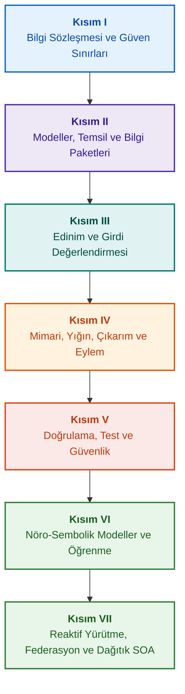

# Kanıt Temelli Uzman Sistemlerin Mimarisi: Biçimsel Ontolojilerden Nöro-Sembolik Yapay Zekaya

**Yüksek Güvenilirlikli Akıllı Sistemlerin Tasarımı, Matematiksel Modelleri, Mimarisi ve Biçimsel Doğrulaması Üzerine Mühendislik Monografisi ve Başucu Rehberi (Safety-Critical & Evidence-Grounded AI)**

**Yazar:** [Mykola Fedchyk](about-the-author.md) · [LinkedIn](https://www.linkedin.com/in/nickfedchik/)  
**Format:** Mühendislik Monografisi / Yapay Zeka Mimarı Başucu Kitabı  
**Yıl:** 2026  

---

## Kitap Hakkında

Bu monografi, modern yapay zekanın en temel krizini — yapay sinir ağı üretimlerinin olasılıksal akla yatkınlığı ile biçimsel matematiksel kanıtların deterministik doğruluğu arasındaki epistemik uçurumu — aşmaya adanmış temel bir araştırma çalışması ve kapsamlı bir mühendislik rehberidir. Araştırmanın odağında şu tavizsiz soru yer almaktadır: **Her çıkarımı çürütülemez, birincil kanıt kaynaklarına kadar eksiksiz izlenebilir ve güvenlik açısından kritik mühendislik alanlarında (ISO 26262, IEC 61508, DO-178C, ISO/SAE 21434) sertifikasyona uygun bir uzman sistem nasıl tasarlanır?**

Yazar, yeni bir paradigmayı temellendirmekte ve kurmaktadır: **Kanıt Temelli Nöro-Sembolik Yapay Zeka (Evidence-Grounded Neuro-Symbolic AI)**. Bu yaklaşımda istatistiksel modeller (LLM/SLM), hipotez üretimi ve yansıtıcı işleme alanında danışmanlık görevi görürken; deterministik sembolik çekirdek, mantıksal tutarlılık, bayt düzeyinde olgu sabitleme, yetki sınırlarının denetimi ve eyleme güvenli geçiş değişmezlerini (invariants) sarsılmaz bir biçimde garanti eder.

### Yapay Nesneden Doğrulanabilir Karara

Sistem gereksinimleri, kaynak kodlar, test günlükleri, düzenleyici standartlar ve mühendislik kararları günümüz üretim ortamlarında halihazırda mevcuttur; ancak çoğunlukla biçimsel semantikten, kesin geçerlilik sınırlarından ve karşılıklı izlenebilirlikten yoksun, yalıtılmış nesneler olarak işlev görürler. Başarılı bir test raporu eski bir donanım revizyonuna dayanıyor olabilir; fonksiyonel güvenlik standardından yapılan bir alıntı bağlamından koparılmış olabilir; acil durum konfigürasyon geri alımı iptal edilmiş bir bileşeni yetkisiz olarak yeniden etkinleştirebilir.

Bu monografi uçtan uca bir mühendislik hattı sunmaktadır: Mühendislik yapıtlarının tiplenmiş verilere ve kriptografik olarak imzalanmış bilgi paketlerine dönüştürülmesinden; sembolik çıkarıma, adım adım plan ayrıştırmasına, karşı-olgusal açıklamalara ve yetkinlik sınırlarının denetimine kadar uzanır. Pratik anlatım, kapsamlı test paketlerine sahip Go dilinde endüstriyel düzeyde uygulamalar ([Bölüm 1](ch01-introduction-to-expert-systems.md)), katı matematiksel sözleşmeler ([Kısım II](part-02-knowledge-models.md)) ve bilgi gerilemelerini (regresyon) kanıtlanabilir biçimde engelleyen sürekli öğrenme protokolleri ([Bölüm 25](ch25-how-expert-systems-learn.md)) ile desteklenmektedir.

### Hedef Kitle

Bu yayın; sistem mimarları, güvenilirlik ve fonksiyonel güvenlik başmühendisleri, mantıksal çıkarım motoru geliştiricileri ve bilgi mühendisleri için hazırlanmıştır. Temel kavramları kavramak için birinci dereceden yüklem mantığı, yazılım sürümleme ve yaşam döngüsü yönetimi hakkında temel bilgi yeterlidir; pratik örnekleri çalıştırmak için standart Go araçları gereklidir. Goal Structuring Notation (GSN) ile güvenlik gerekçelendirmelerinin biçimsel sentezi, karmaşık sistemlerin sinerjetiği, nöromorfik hızlandırıcılar ve GNSS bağımsız otonom navigasyonu ele alan uzmanlaşmış bölümler, yüksek teknoloji endüstrilerinde (havacılık ve uzay, otonom ulaşım, kritik enerji) kanıt temelli yapay zekanın öncü sınırlarını ortaya koymaktadır.

---

## Bilimsel Bağlam ve Monografinin Dünya Araştırmalarındaki Yeri

Monografi, uzman sistemleri 1980'lerin kural tabanlı sistemlerinin (CLIPS veya MYCIN gibi) arkaik bir kalıntısı olarak değil, **Üçüncü Dalga Kanıt Temelli Nöro-Sembolik Yapay Zekanın (Third-Wave Evidence-Grounded Neuro-Symbolic AI)** öncüsü olarak ele almaktadır. Çalışma, dünyanın önde gelen bilim okullarının teorik temellerine dayanırken, soyut matematiksel modeller ile yüksek başarımlı sistem mühendisliği arasındaki boşluğu kapatmaktadır:

| Bilimsel Alan | Dünyadaki Temel Çalışmalar ve Yazarlar | Kitaptaki Kavramsal Köprü |
|---|---|---|
| **Üçüncü Dalga Nöro-Sembolik Yapay Zeka (NeSy)** | Artur d'Avila Garcez, Luis C. Lamb (*Neurosymbolic AI: The 3rd Wave*, 2023; *Neural-Symbolic Cognitive Reasoning*, Springer, 2009); Henry Kautz (*The Third AI Summer*, AAAI 2022) | Görev paylaşımı: İstatistiksel modeller (SLM/LLM) sorgu hipotezleri üretir, deterministik sembolik çekirdek ise olguları biçimsel olarak doğrular ve onaylar ([Bölüm 29](ch29-neuro-symbolic-architecture.md)). |
| **Semantik Kısıtlar ve Güvenli Öğrenme** | Guy Van den Broeck vd. (*A Semantic Loss Function for Deep Learning with Symbolic Knowledge*, ICML 2018); Luc De Raedt vd. (*DeepProbLog*, IJCAI 2020) | Giriş ve çıkış kabul ağ geçitleri, sinir ağı önerilerinin biçimsel şemalara göre deterministik semantik filtrelenmesi ([Bölüm 28](ch28-dual-mode-expert-systems.md), [Bölüm 33](ch33-inter-system-knowledge-exchange-and-model-teaching.md)). |
| **Çürütülebilir Akıl Yürütme ve Argümantasyon Teorisi** | John L. Pollock (*Defeasible Reasoning*, 1987; *Cognitive Carpentry*, MIT Press, 1995); Phan Minh Dung (*Abstract Argumentation Frameworks*, AIJ 1995); Douglas Walton (*Argumentation Schemes*, Cambridge, 2008) | Bilginin iddialar, menşei ve çürütücülere (*rebutting* ve *undercutting defeaters*) ayrıştırılması; Dung argümantasyon çerçeveleri ile normatif kural tabanlarındaki çelişkilerin çözülmesi ([Bölüm 2](ch02-epistemology-of-machine-knowledge.md), [Bölüm 27](ch27-safety-case-gsn-synthesis.md)). |
| **Otonom İlişkisel Kural Madenciliği (KBC)** | Luis Galárraga, Fabian M. Suchanek vd. (*AMIE: Association Rule Mining under Incomplete Evidence*, WWW 2013, VLDBJ 2015); Stephen Muggleton (*Inductive Logic Programming*, 1994) | Açık dünya varsayımının hatalı karşı-örnekleri hariç tutularak, kısmi tamlık varsayımı (PCA) altında bilgi tabanlarından otomatik kural çıkarımı ([Bölüm 34](ch34-deterministic-relational-analysis-abduction-and-socratic-dialogue.md)). |
| **Biçimsel Güvenlik Kalkanları ve Sertifikasyon (Safe AI)** | Bettina Könighofer, Roderick Bloem vd. (*Shield Synthesis*, 2017); Tim Kelly, Rob Weaver (*Goal Structuring Notation*, York, 2004); André Platzer (*Logical Foundations of CPS*, Springer, 2018) | ISO 26262/21434 standartları için GSN notasyonunda güvenlik vakalarının sentezi; çevresel aktüatörler için biçimsel kalkanlar ve sayısal geçerlilik zarfları ([Bölüm 27](ch27-safety-case-gsn-synthesis.md), [Bölüm 30](ch30-safety-cybersecurity-co-engineering.md), [Bölüm 33](ch33-inter-system-knowledge-exchange-and-model-teaching.md)). |
| **Epistemik Mantık ve Bilgi Semiyotiği** | John F. Sowa (*Knowledge Representation: Logical, Philosophical, and Computational Foundations*, 2000); Frank van Harmelen vd. (*Handbook of Knowledge Representation*, Elsevier, 2008) | Charles Sanders Peirce'ün epistemik üçlüsü (Kavram → Yargı → Çıkarım); sıkı tümdengelim denetimi altında çalışma hipotezlerinin abdüktif çıkarımı ([Bölüm 6](ch06-applied-mathematics-for-expert-systems.md), [Bölüm 34](ch34-deterministic-relational-analysis-abduction-and-socratic-dialogue.md)). |
| **Sibernetik ve Karmaşık Sistemlerin Sinerjetiği** | Norbert Wiener (*Cybernetics*, 1948); W. Ross Ashby (*An Introduction to Cybernetics*, 1956); Hermann Haken (*Synergetics: An Introduction*, 1977; *Advanced Synergetics*, 1983); Ilya Prigogine (*Order out of Chaos*, 1984) | Ashby'nin gerekli çeşitlilik yasası, L0–L4 kapalı kontrol döngüleri, Haken'in köleleştirme ilkesiyle durum uzayının düzen parametrelerine indirgenmesi, kritik yavaşlama (CSD) ile faz geçişlerinin erken uyarısı ve bilgi tabanlarının disipatif stabilizasyonu ([Bölüm 6](ch06-applied-mathematics-for-expert-systems.md), [Bölüm 22](ch22-cybernetics-edge-to-backend.md), [Bölüm 35](ch35-self-organizing-expert-systems-synergetics-and-npu-runtime.md)). |
| **Bilgi Testi, Dilsel Değişmezlik ve Lipschitz Kalibrasyonu** | Kent Beck (*TDD*, 2002); Martin Fowler (*Refactoring*, 2018); Clark Barrett, Leonardo de Moura (*Z3 SMT Solver*, 2008); Chuan Guo vd. (*On Calibration of Modern Neural Networks*, ICML 2017); Marco Tulio Ribeiro vd. (*CheckList*, ACL 2020); John L. Pollock (*Defeasible Reasoning*, 1987) | Dört seviyeli Bilgi Test Piramidi (KTP): Öncül taklitleriyle (`PremiseMock`) izole kural birim testi (KUT), boş küme doğruluğu tuzağının elenmesi, 6 noktalı spektral BVA, kural kafesleri ve çürütücüler (KIT), dilsel varyasyonlarda semantik değişmezlik skoru ($\text{SIS} \ge 0.98$), röle titremesini engelleyen Lipschitz süreklilik kısıtı ($L_{\mathcal{K}} \le L_{\max}$) ve bilgi tabanı açıklarının damgalayıcı birikimi ([Bölüm 36](ch36-knowledge-testing-pyramid-and-variational-calibration.md)). |

---

## Yazarın Teorik Modelleri, Bilimsel Araştırmaları ve Mühendislik Yenilikleri

Bu monografi, yazarın kritik güvenilirlikli sistem tasarımı, gömülü mimariler ve kanıt temelli yapay zeka alanındaki temel araştırmalarını ve mühendislik katkılarını bir araya getirmektedir. Salt literatür derlemelerinin aksine kitap, nöro-sembolik etkileşimleri matematiksel olarak doğrulanabilir güven seviyesine yükselten bir dizi özgün biçimsel teori, protokol ve mimari kalıp ortaya koymaktadır:

### 1. Temel Teorik Geliştirmeler ve Matematiksel Biçimcilik

1. **Kanıt Dayanaklı Değişmez (EGI) ve Olgu Doğrulama Ağ Geçidi ([Bölüm 2](ch02-epistemology-of-machine-knowledge.md), [19](ch19-from-question-to-evidence.md), [28](ch28-dual-mode-expert-systems.md), [29](ch29-neuro-symbolic-architecture.md)):**
   * *Teorik Yaklaşım:* Yazar, $\mathrm{Comp}(C) = 1.00$ dayanak tamlığı değişmezini formüle etmiş ve kanıt temelli bir sistemde, birincil bilgi kaynaklarına deterministik projeksiyon olmaksızın hiçbir iddianın kabul edilmiş olgu statüsü kazanamayacağını matematiksel olarak tanımlamıştır. Olgu tabanındaki her öğe kriptografik bir demetle desteklenir: Değiştirilemez bayt kaymaları `[byte_start, byte_end]`, kanonik parça özeti `quote_sha256` ve PROV-O kaynak sertifikası kimliği.
   * *Mühendislik Önemi:* Bayt düzeyindeki kabul ağ geçidi mekanizması, donanım ve yazılım düzeyinde sinir ağı halüsinasyonlarının sürümlenen bilgi tabanına sızmasını imkansız kılarak kanıtlanmamış verilere karşı sıfır toleransı garanti eder ($ZHR = 1.00$).
2. **Dört Seviyeli Bilgi Test Piramidi (KTP) ve Çıkarım Uzayının Lipschitz Kararlılığı ([Bölüm 36](ch36-knowledge-testing-pyramid-and-variational-calibration.md)):**
   * *Teorik Yaklaşım:* Yazar, Martin Fowler'ın yazılım test piramidini bilgi sistemlerine uyarlayan sistematik Bilgi Test Piramidini (KTP) önermiştir: Öncülleri izole edilmiş kural birim testi (KUT) (`PremiseMock`), kural etkileşimleri ve çürütücülerin entegrasyon testi (KIT) ve sorgu manifoldları üzerinde varyasyonel kalibrasyon (KVT).
   * *Matematiksel Düzenek:* Boş küme doğruluğunu önleyen katı değişmez ($P \equiv \text{False}$ iken $P \to Q$), dilsel sorgu varyasyonlarında semantik değişmezlik metriği ($\mathrm{SIS} \ge 0.98$) ve küçük girdi dalgalanmalarında feci röle titremesini matematiksel olarak dışlayan çıkarım uzayının Lipschitz süreklilik kısıtı ($L_{\mathcal{K}} \le L_{\max}$).
3. **Deontik Normların Popperci Yanlışlanabilirlik Teorisi ve Aktif Uyumluluk Denetçisi ([Bölüm 39](ch39-active-compliance-auditor-and-popperian-testing.md)):**
   * *Teorik Yaklaşım:* Yalnızca soruları yanıtlayan pasif kahin modelinden, Karl Popper'ın yanlışlanabilirlik ilkesini hayata geçiren aktif bilgi denetçisi paradigmasına geçiş. Sistem, gereksinim uzayını (ASPICE 4.0, ISO 26262, ISO/SAE 21434) otonom olarak yoklar, karşı-örnekler sentezler, eksik spesifikasyonları tespit eder ve kapsamlı bir doğrulama programı tasarlar.
   * *Pratik Değer:* Sinir ağı tarafından sınır senaryolarının yaratıcı üretimi (Sistem 1) ile sembolik çekirdek tarafından deterministik deontik doğrulamanın (Sistem 2) birleşimi, kontrol döngüsündeki insanı (Human-in-the-Loop) onay yorgunluğundan korur.
4. **Bilgi Tabanı Boyutunun Sinerjetik İndirgenmesi ve CSD Erken Teşhisi ([Bölüm 6](ch06-applied-mathematics-for-expert-systems.md), [22](ch22-cybernetics-edge-to-backend.md), [35](ch35-self-organizing-expert-systems-synergetics-and-npu-runtime.md)):**
   * *Teorik Yaklaşım:* Hermann Haken'in sinerjetik matematiksel araçlarının (düzen parametreleri ve köleleştirme ilkesi) ve Ilya Prigogine'in disipatif yapılar teorisinin karmaşık bilgi tabanlarının evrimine uygulanması.
   * *Bilimsel Sonuç:* Telemetrinin çok boyutlu durum uzayını düzen parametrelerine indirgeme yöntemi geliştirilmiş ve otokorelasyon ile varyansa dayalı Kritik Yavaşlama (*Critical Slowing Down*, CSD) detektörü entegre edilerek, acil durum sensörleri devreye girmeden çok önce sistemin dinamik kopmaya yaklaştığı tespit edilebilmiştir.
5. **Eylem Otonomi Seviyeleri (A0–A4) Modeli, Yetkilendirme Ağ Geçidi ve İdempotent Sagalar ([Bölüm 21](ch21-from-recommendation-to-action.md)):**
   * *Teorik Yaklaşım:* Sistemin bütününe değil; "eylem, ortam, risk seviyesi" üçlüsüne atanan ayrık eylem yetki ölçeği (A0: Pasif analiz, A1: Taslak hazırlama, A2: İnsan imzalı eylem, A3: Denetimli otonomi, A4: Acil güvenlik kesintisi).
   * *Matematiksel Düzenek:* Kriptografik $k$ anahtarına dayalı cebirsel idempotentlik değişmezi $f(f(x, k), k) \equiv f(x, k)$, adım adım kapalı döngü yürütme ve `OutcomeUnknown` durumuna sahip dağıtık telafi sagaları protokolü.
6. **GSN Notasyonunda Fonksiyonel Güvenlik ve Siber Güvenliğin Biçimsel Birlikte Mühendisliği ([Bölüm 27](ch27-safety-case-gsn-synthesis.md), [30](ch30-safety-cybersecurity-co-engineering.md)):**
   * *Teorik Yaklaşım:* ISO 26262 (fonksiyonel güvenlik) ve ISO/SAE 21434 (siber güvenlik) standartlarının gereksinimlerini eşzamanlı karşılamak üzere GSN (Goal Structuring Notation) argümantasyon ağaçlarının koordineli sentez modeli.
   * *Mühendislik Atılımı:* Çatışan hedefler arasında matematiksel tahkim (acil müdahale zaman bütçesi vs kriptografik doğrulama derinliği) ve tuzlanmış Merkle ağaçları aracılığıyla dış denetçilere kanıtların seçici ifşası protokolü.
7. **Açıklamaların Sadakati ve Semantik Tutarlılığı Doğrulama Protokolü ([Bölüm 20](ch20-explanation-engine.md)):**
   * *Teorik Yaklaşım:* Açıklama, üretici bir modelin serbest metni olarak değil; kanıt grafından, kural sürümünden ve dondurulmuş olgu anlık görüntüsünden tekil olarak türetilen deterministik bir yapıt olarak değerlendirilir.
   * *Matematiksel Düzenek:* Sadakat değerlendirme metrik ağ geçidi ($C_{\text{facts}} = 1.00, H_{\text{free}} = 1.00$) formüle edilmiş ve sembolik çıkarım ile operatör metni arasında en küçük tutarsızlıkta otomatik güvenli şablona geri dönüş sağlanmıştır.

---

### 2. Deneysel Araştırmalar, Yazarın Deney Düzenekleri ve Sistem Mühendisliği

1. **`mmap` ve Sıfır Seri Bütünlüğü Giderimi ile Değiştirilemez İkili Bilgi Paketleri ([Bölüm 32](ch32-high-performance-knowledge-packs-mmap-and-harvesting.md)):**
   * *Yazarın Buluşu:* Paketlerin iki katmanlı mimarisi (birincil kaynakların kanonik katmanı + dizinlerin türetilmiş somutlaşmış katmanı).
   * *Deneysel Sonuç:* `mmap` sistem çağrısıyla dizinin doğrudan sanal adres alanına eşlenmesi, dinamik bellek ayırma yükünün sıfırlanması (zero-allocation) ve ontoloji gigabaytlarca olsa dahi motorun alt-lineer sürede başlatılması.
2. **IETF RFC-1000 ve W3C-150 Standart Kümeleri Üzerinde Deneysel Kalibrasyon Sahası ([Bölüm 2](ch02-epistemology-of-machine-knowledge.md), [4](ch04-evolution-from-bayes-to-evidence-ai.md), [14](ch14-requirements-detection-and-formalization.md), [25](ch25-how-expert-systems-learn.md)):**
   * *Yazarın Deneyi:* 1.000 geçerli IETF RFC şartnamesi (internetin gelişiminin 5 kronolojik dönemine yayılmış) ve W3C kümesinden 150 karmaşık tanı sorgusu üzerinde büyük ölçekli araştırma ortamının devreye alınması.
   * *Pratik Sonuç:* Nesnel bilgi sınav matrislerinin oluşturulması, normatif çelişkilerin tespiti ve bilgi tabanı güncellenirken gerilemelere karşı matematiksel korumanın kanıtlanması.
3. **Çok Adımlı İlişkisel Analiz, Sembolik Abdüksiyon ve Sokratik Diyalog ([Bölüm 34](ch34-deterministic-relational-analysis-abduction-and-socratic-dialogue.md)):**
   * *Yazarın Geliştirmesi:* Döngü korumalı ve ilişkili varlıklar için bileşik bayt kanıt zincirleri oluşturan İki Yönlü Sınırlı Genişlik Öncelikli Arama (Bidirectional Bounded BFS, $k \le 6$) algoritması.
   * *Mühendislik Avantajı:* Sıkı tümdengelim denetimi altında Peirce'ün sembolik abdüksiyonu ve kapalı dünya varsayımı (CWA) altında kör reddetme yerine insanla yapıcı diyalog sağlayan tiplenmiş Sokratik açıklama çerçeveleri (*Clarification Frames*).
4. **Çevresel Kontrol Sistemleri için Biçimsel Kalkanlar ve Sayısal Geçerlilik Zarfları ([Bölüm 33](ch33-inter-system-knowledge-exchange-and-model-teaching.md), [Ek B](appendix-b-robotics-and-cyber-physical-systems.md), [Ek C](appendix-c-autonomous-navigation-and-geosearch.md), [Ek E](appendix-e-mixed-signal-neuromorphic-expert-systems.md)):**
   * *Yazarın Buluşu:* Sayısal sinyal işlemcileri (DSP) ve GNSS bağımsız otonom navigasyon sistemleri (TRN/DSMAC/VIO) için ayrık mantıksal değişmezlerin sürekli sayısal güvenlik koridorlarına çevrilmesi metodolojisi.
   * *Pratik Güvenilirlik:* Ed25519 kriptografisine dayalı imzalı kural değişimi, yeni aday bilgilerin güvenli karantinası ve tehlikeli kontrol komutlarının donanım düzeyinde kesilmesi.
5. **Açıklamalar Yoluyla Gizli Bilgi Sızıntısının Önlenmesi ve Diferansiyel Denetim ([Bölüm 20](ch20-explanation-engine.md)):**
   * *Yazarın Geliştirmesi:* Kanıt grafının her düğümü ve kenarı için ACL kontrolü içeren açıklama ara temsili indirgeme protokolü ($\mathrm{EIR}_{\text{redacted}}$) ile kontrastif "WHY NOT" sorguları üzerinden model rekonstrüksiyonu yan kanal saldırılarının engellenmesi.

---

## Sınıflandırma ve Gruplandırma İlkesi

Kitabın kısımları, bölümlerin yazıldığı yıla veya belirli teknoloji isimlerine göre değil, temel mühendislik görevine göre belirlenmiştir. Her bölüm tek bir ana kısma aittir; komşu yöntemler ana sorunun çözüm biçimini açıklar. Bölüm numaraları ve dosya adları kalıcı tanımlayıcılar olarak korunmuştur; bu nedenle tematik okuma sırası sayısal sıradan farklı olabilir.

Bölüm içi alt başlıklar net kategorilere ayrılmıştır ve eşdeğer teknolojiler listesi olarak değil, argümanın mantıksal ilerleyişi olarak okunmalıdır:

| Başlık Sınıfı | Okuyucunun Sorusu | Bölümdeki İşlevi |
|---|---|---|
| Problem ve Görev Sınırı | Tam olarak ne çözülmeli? | Ana soruyu ve uygulama kapsamını belirlemek |
| Nesne ve Model | Hangi veriler, bilgiler veya durumlar inceleniyor? | Kavramları, tipleri ve varsayımları uzlaştırmak |
| Yöntem ve Prosedür | Sonuç nasıl elde edilir? | Çıkarım, dönüşüm veya kontrol adımlarını açıklamak |
| Uygulama ve Araç | Prosedür ne ile gerçekleştirilir? | Yöntemin yazılımsal veya donanımsal karşılığını göstermek |
| Doğrulama ve Kontrol Örneği | Hata nasıl tespit edilir? | Sonucu bağımsız bir kriterle karşılaştırmak |
| Sonuç ve Kapsam Sınırları | Ne kanıtlandı, ne açıkta kaldı? | Vaatleri aşırı genişletmeden ana soruyu yanıtlamak |

Ülke, sektör veya ticari ürünler uygulama bağlamıdır; bu sınıflandırmanın bağımsız bir düzeyi değildir. Sözlük, kısaltmalar, kaynaklar ve navigasyon referans niteliğindedir; bağımsız bölüm konuları değildir.

Kapsamlı [editöryal inceleme haritası](editorial-structure-review.md), her bölümün ana konusunun değerlendirmesini, bitişik tartışmalar arasındaki sınırları ve yapı ile sonuçlara ilişkin notları içerir. Yeni bir özetin varlığı, bölümlerin içindeki tüm içerik risklerinin halihazırda giderildiği anlamına gelmez.

## Önerilen Okuma Rotaları

**İlk Yazılım Doğrulaması:** [1](ch01-introduction-to-expert-systems.md) → [7](ch07-knowledge-base-typology.md) → [8](ch08-engineering-artifacts-as-data.md) → [17](ch17-implementation-stack.md) → [23](ch23-knowledge-base-verification.md) → [25](ch25-how-expert-systems-learn.md). Amaç: Kanıt gerekçeleri, negatif testler ve kontrollü bilgi değişimi ile tekrarlanabilir bir karar elde etmek. Dil modeli zorunlu değildir.

**Bilgi Mühendisliği:** [Kısım II](part-02-knowledge-models.md) → [Kısım III](part-03-knowledge-engineering-nlp.md) → [19](ch19-from-question-to-evidence.md) → [20](ch20-explanation-engine.md) → [26](ch26-continual-learning.md). Amaç: Semantikleri, menşei, bilgi edinimini ve yeni adayların doğrulanmasını uyumlu hale getirmek. Kısım II, Bölüm 7–11 arasındaki bilimsel test programını muhafaza eder.

**Çözüm Mimarisi:** [16](ch16-expert-systems-architecture.md) → [19](ch19-from-question-to-evidence.md) → [31](ch31-syllogistic-reasoning-and-relation-lattices.md) → [20](ch20-explanation-engine.md) → [21](ch21-from-recommendation-to-action.md). Amaç: Kanıt dayanaklarının kontrolünü, normun uygulanmasını, açıklamayı ve eylem yetkisini birbirinden ayırmak.

**Doğrulama ve Güvenlik:** [23](ch23-knowledge-base-verification.md) → [36](ch36-knowledge-testing-pyramid-and-variational-calibration.md) → [25](ch25-how-expert-systems-learn.md) → [26](ch26-continual-learning.md) → [27](ch27-safety-case-gsn-synthesis.md) → [30](ch30-safety-cybersecurity-co-engineering.md). Dış nesnelerin teşhisi [Bölüm 24](ch24-system-diagnosis.md) üzerinden özel olarak ele alınır.

**Hibrit Yanıtlar ve İşletim:** [Kısım VI](part-06-frontiers-neuro-symbolic.md) → [Kısım VII](part-07-runtime-and-knowledge-exchange.md) → [40](ch40-distributed-epistemic-architectures-soa-and-cluster-scaling.md) ve ilgili ekler. Amaç: Dil modelini entegre etmek, bilgi açıklarını yönetmek, dağıtık bilgi servisleri mimarisi kurmak ve sistemler arası paylaşımı doğrulamak. [Bölüm 2](ch02-epistemology-of-machine-knowledge.md), [Bölüm 4](ch04-evolution-from-bayes-to-evidence-ai.md) ve [Bölüm 6](ch06-applied-mathematics-for-expert-systems.md) sözleşme, tarihçe ve matematiksel rehber olarak okunabilir.

---

## Mühendislik Taahhütlerinin Sınırları

Bu kitap bir eğitim ve araştırma materyalidir; sertifikalı bir prosedür veya bir ürünün standarda uygunluk belgesi değildir. Deterministik yürütme olguların doğruluğunu doğrudan kanıtlamaz; kriptografik özet ve dijital imza mutlak hakikati kanıtlamaz; argüman grafı uzman değerlendirmesinin yerini tutmaz. Bir ürünün genel güvenilirlik gereksinimleri, dil modelinin hata oranıyla eşdeğer tutulmamalı veya tüm yazılım bileşenlerine genellenmemelidir.

Otomatik ayrıştırma manuel veri aktarımını azaltır; ancak etki alanı modellemesini, hakem değerlendirmesini ve bilgi sahiplerinin sorumluluğunu ortadan kaldırmaz. Protégé, manuel inceleme ve otomatik toplama bir arada çalışabilir. Matematiksel garantiler yalnızca belirli bir dil profili ve varsayımlar için geçerlidir; ölçülen işlem hızı, test edilen sorguya, veri kümesine ve ortama bağlıdır. Yazarın arşivlenmiş verileri, açık test ortamlarından ve henüz tamamlanmamış araştırmalardan ayrı tutulmuştur.

Yayına alma, risk kabulü ve yasal standartlara uygunluk kararları yetkili uzmanların sorumluluğundadır. Uzman sistem doğrulanabilir materyali hazırlar ve üzerinde anlaşmaya varılan ilkeleri uygular; ancak kendiliğinden yasal bir düzenleyici yetki kazanmaz.

---

## Kitabın Yapısı

Kitap yedi tematik kısım, 40 bölüm ve beş ekten oluşmaktadır. Her bölüm bir ana kısma aittir. Gezinmedeki önceki ve sonraki bölümler aşağıdaki tematik sıraya karşılık gelir; bölüm numaraları ve dosya adları korunmuştur.

---

### [Kısım I. Kavramsal ve Epistemik Temeller](part-01-foundations.md)

*Uzman sisteme ne zaman ihtiyaç duyulduğu, neyin bilgi sayılacağı ve örgütsel karar gerekçelerinin nasıl korunacağı.*

* [Bölüm 1. Uzman Sistemlere Giriş: Kaostan Yönetilen Bilgiye](ch01-introduction-to-expert-systems.md)
* [Bölüm 2. Mühendis İçin Felsefe: Makinenin Neyi Bilgi Olarak Adlandırma Hakkı Vardır](ch02-epistemology-of-machine-knowledge.md)
* [Bölüm 3. Uzman Sistemin Bilgi ve Referans Sistemlerinden Farkı](ch03-beyond-reference-information-systems.md)
* [Bölüm 4. Uzman Sistemlerin Evrimi: Bayes Teoreminden Kanıt Temelli Yapay Zekaya](ch04-evolution-from-bayes-to-evidence-ai.md)
* [Bölüm 5. Güven Üçlüsü: Uzman Sistem, Kanıt Temelli Öneri ve Kurumsal Bellek](ch05-triad-of-trust-and-corporate-memory.md)

---

### [Kısım II. Matematiksel Modeller, Bilgi Temsili ve Saklama](part-02-knowledge-models.md)

*Matematiksel işlemlerin ve temsillerin seçimi, tiplenmiş yapıtlar, izlenebilirlik grafı ve değiştirilemez bilgi paketi.*

* [Bölüm 6. Uzman Sistemler İçin Uygulamalı Matematik: Kurallar, Olasılıklar, Graflar ve Nedensellik](ch06-applied-mathematics-for-expert-systems.md)
* [Bölüm 7. Bilgi Tabanı Tipolojisi: Kurallar, Ontolojiler, Emsaller ve Vektörler](ch07-knowledge-base-typology.md)
* [Bölüm 8. Uzman Sistem Verisi Olarak Mühendislik Yapıtları](ch08-engineering-artifacts-as-data.md)
* [Bölüm 9. Mühendislik Bilgi Grafı: Gereksinimlerden Donanıma İzlenebilirlik](ch09-engineering-knowledge-graph-traceability.md)
* [Bölüm 32. Değiştirilemez Bilgi Paketleri: Bayt Düzeyinde Kabul, Dizinler ve Bellek Eşleme](ch32-high-performance-knowledge-packs-mmap-and-harvesting.md)

---

### [Kısım III. Bilgi Edinimi, Dilsel Analiz ve Girdi Değerlendirmesi](part-03-knowledge-engineering-nlp.md)

*Belgeler, uzman deneyimi ve gözlemler: Adayların çıkarımı, dilsel analiz, biçimselleştirme ve kanıtların değerlendirilmesi.*

* [Bölüm 10. Bilgi Edinme Sistemleri: Kaynaklar, Kabul ve Yaşam Döngüsü](ch10-knowledge-acquisition-systems.md)
* [Bölüm 11. Uzmanlardan Bilgi Çıkarımı: Mülakatlar, Bilişsel Haritalar ve Deneyim Biçimlendirmesi](ch11-knowledge-elicitation-from-experts.md)
* [Bölüm 12. Dilbilimsel Analiz ve Yerel Modeller: Anlam ve Kaynak Korunumu](ch12-linguistic-analysis-and-local-models.md)
* [Bölüm 13. Doğal Dil Çeşitliliği Determinizme Karşı: Soru Anlamının Derlenmesi](ch13-language-variability-vs-determinism.md)
* [Bölüm 14. Gereksinimlerin ve Kipliklerin Tespiti: Normatif Metinden Değişmezlere](ch14-requirements-detection-and-formalization.md)
* [Bölüm 15. Bilgi Çıkarımı ve Bilgi Tabanı İnşası: Olgular, Dilbilgileri ve Otomatlar](ch15-knowledge-extraction-and-kb-construction.md)
* [Bölüm 37. Girdi Bilgisinin Değerlendirilmesi: Kaynaklar, Kanıtlar ve Belirsizlik](ch37-input-information-assessment-and-algorithmic-skepticism.md)

---

### [Kısım IV. Mimari, Teknoloji Yığını, Çıkarım ve Eylem](part-04-architecture-and-inference.md)

*Mimari sözleşmeler, teknoloji yığını, donanım yürütmesi, iddia denetimi, normatif çıkarım, açıklama ve sibernetik kontrol döngüsü.*

* [Bölüm 16. Uzman Sistem Mimarisi: Biçimsel Bilgiden Kanıt Temelli Karara](ch16-expert-systems-architecture.md)
* [Bölüm 17. Teknoloji Yığını: Araçlar, Programlama Dilleri ve Kural Motorları Seçim Kriterleri](ch17-implementation-stack.md)
* [Bölüm 18. Yürütme Altyapısı: Yerel Modeller, Donanım Hızlandırıcıları, Edge ve On-Premise](ch18-execution-infrastructure.md)
* [Bölüm 19. Sorudan Kanıta: Arama, Dayanaklama ve İddia Denetimi](ch19-from-question-to-evidence.md)
* [Bölüm 31. Normlara Dayalı Çıkarım: Yüklem Hiyerarşileri, İstisnalar ve Geçerlilik](ch31-syllogistic-reasoning-and-relation-lattices.md)
* [Bölüm 20. Açıklama Motoru: Karar, Ret ve Yetkinlik Sınırları](ch20-explanation-engine.md)
* [Bölüm 21. Öneriden Eyleme: Yetki Denetimi ve Üretim Ortamında Güvenli Yürütme](ch21-from-recommendation-to-action.md)
* [Bölüm 22. Sibernetik Kontrol Döngüsü: Sensörler, Çevre Birimleri ve Geribildirim](ch22-cybernetics-edge-to-backend.md)

---

### [Kısım V. Doğrulama, Test, Teşhis ve Güvenlik Kanıtlaması](part-05-verification-and-learning.md)

*Kuralların biçimsel doğrulaması, bilgi test piramidi, Popperci yanlışlama, teknik teşhis ve fonksiyonel güvenlik ile siber güvenlik argümanları.*

* [Bölüm 23. Bilgi Tabanı Doğrulaması: Kuralların Tutarlılığı, Tamlığı ve Güvenilirliği Nasıl Denetlenir](ch23-knowledge-base-verification.md)
* [Bölüm 36. Bilgi Test Piramidi: Kurallar, Etkileşimler ve Yanıt Kararlılığı](ch36-knowledge-testing-pyramid-and-variational-calibration.md)
* [Bölüm 39. Aktif Uzman Testçi: Popperci Yanlışlama, Standart Uyumluluğu (ASPICE/ISO 26262/ISO 21434) ve Otonom Test Tasarımı](ch39-active-compliance-auditor-and-popperian-testing.md)
* [Bölüm 24. Teknik Teşhis: Eksik Bilgi Koşullarında Belirti ile Kök Neden Nasıl Ayırt Edilir](ch24-system-diagnosis.md)
* [Bölüm 27. Güvenlik Gerekçelendirmesi: Argümanların Sentezi ve Doğrulaması](ch27-safety-case-gsn-synthesis.md)
* [Bölüm 30. Fonksiyonel Güvenlik ve Siber Güvenliğin Birlikte Mühendisliği](ch30-safety-cybersecurity-co-engineering.md)

---

### [Kısım VI. Nöro-Sembolik Modeller, Bilişsel Sınırlar ve Sürekli Öğrenme](part-06-frontiers-neuro-symbolic.md)

*Kesin çıkarım ve danışman hipotez, dil modeli entegrasyonu, açıklar, kanıtsız yanıt denetimi, sınav matrisleri ve deneyimden sürekli öğrenme.*

* [Bölüm 28. Çift Modlu Uzman Sistemler: Kesin Çıkarım ve Danışman Hipotez](ch28-dual-mode-expert-systems.md)
* [Bölüm 29. Nöro-Sembolik Mimari: Dil Modelleri ve Kanıt Temellerinin Denetimi](ch29-neuro-symbolic-architecture.md)
* [Bölüm 34. Bilgi Açıkları: İlişkisel Arama, Abdüksiyon ve Netleştirme Diyaloğu](ch34-deterministic-relational-analysis-abduction-and-socratic-dialogue.md)
* [Bölüm 38. Makine Halüsinasyonları ve Bilgi Yetersizliği: Kanıta Dayalı Yanıt Denetimi](ch38-curing-machine-hallucinations-and-knowledge-deficits.md)
* [Bölüm 25. Uzman Sistem Nasıl Eğitilir: Sınav Matrisleri, Bilgi Denetimi ve Regresyon Kontrolü](ch25-how-expert-systems-learn.md)
* [Bölüm 26. Deneyimden Sürekli Öğrenme (Continual Learning) ve Sistem Günlüğü Kaymasını Aşma](ch26-continual-learning.md)

---

### [Kısım VII. Reaktif Yürütme, Sistemler Arası Bilgi Değişimi ve Dağıtık SOA](part-07-runtime-and-knowledge-exchange.md)

*Kuralların reaktif yürütülmesi, sinerjetik ve bilgi faz geçişleri, sistemler arası paylaşım ve kurumsal ölçekte dağıtık epistemik mimari.*

* [Bölüm 35. Reaktif Uzman Sistem: Olaylar, İptal ve Bilgi Adaptasyonu](ch35-self-organizing-expert-systems-synergetics-and-npu-runtime.md)
* [Bölüm 33. Sistemler Arası Bilgi Değişimi: Dış Sistemlere Kural Temini, Model Eğitimi ve Güvenli Geribildirim](ch33-inter-system-knowledge-exchange-and-model-teaching.md)
* [Bölüm 40. Kanıt Temelli Uzman Sistemin Dağıtık Mimarisi: Epistemik SOA, Semantik Yönlendirme, Bellek Hiyerarşisi ve Çok Kaynaklı Tahkim](ch40-distributed-epistemic-architectures-soa-and-cluster-scaling.md)

---

### Ekler

* [Ek A. Karmaşık Mühendislik Projelerinde Kanıt Temelli Araştırmanın Pratik Çerçevesi](appendix-a-evidence-governed-framework.md)
* [Ek B. Otonom Robotik ve Siber-Fiziksel Komplekslerde Kanıt Temelli Uzman Sistemler](appendix-b-robotics-and-cyber-physical-systems.md)
* [Ek C. GNSS Bağımsız Otonom Navigasyon: Coğrafi Eşleme (TRN/DSMAC), Görsel Odometri (VIO) ve Sensör Füzyonunun Uzman Tahkimi](appendix-c-autonomous-navigation-and-geosearch.md)
* [Ek D. Analog Uzman Sistemler, Nöromorfik Hesaplama ve Donanımsal Mantıksal Çıkarım](appendix-d-analog-expert-systems-and-neuromorphic-computing.md)
* [Ek E. Hibrit Analog-Dijital Uzman Sistemler: Kanıt Denetimi Altında Nöromorfik, Analog ve Geleneksel Olmayan Hesaplayıcılar](appendix-e-mixed-signal-neuromorphic-expert-systems.md)
* [Yazar Hakkında: Mykola Fedchyk (Nick Fedchik)](about-the-author.md)

---

## Gelecek Araştırma Yönleri

Gelecekteki araştırma yönleri hazır garantiler değildir: Bilgi paketlerinin tekrarlanabilir inşası; sınırlı biçimsel temsilin doğrulanması; açık yetkiler aracılığıyla aracıların yönetimi; belirli biçimsel iddiaların gizli doğrulaması; kontrollü iptal ve makine unlearning (unutma) araştırmaları. Bir modelin özelliğini kanıtlamak fiziksel ürünün uygunluğunu otomatik olarak belgelemez; bir kuralı silmek eğitilmiş modelden verilerin etkisini tamamen yok etmekle eşdeğer değildir.

Donanım hızlandırıcıları ve geleneksel olmayan hesaplayıcılar için öncelikle hata payı, gecikme süresi, enerji tüketimi ve arıza anındaki davranışlar ölçülür. İlgili konular [Bölüm 29](ch29-neuro-symbolic-architecture.md), [Bölüm 32](ch32-high-performance-knowledge-packs-mmap-and-harvesting.md) ile [Ek D](appendix-d-analog-expert-systems-and-neuromorphic-computing.md) ve [Ek E](appendix-e-mixed-signal-neuromorphic-expert-systems.md)'de ele alınmaktadır. Bölüm 7–11 için pratik araştırma programı [Kısım II](part-02-knowledge-models.md)'de sunulmuştur: Her önerinin bir hipotezi, kontrol karşılaştırması ve yanlışlanabilirlik koşulu bulunmaktadır.
