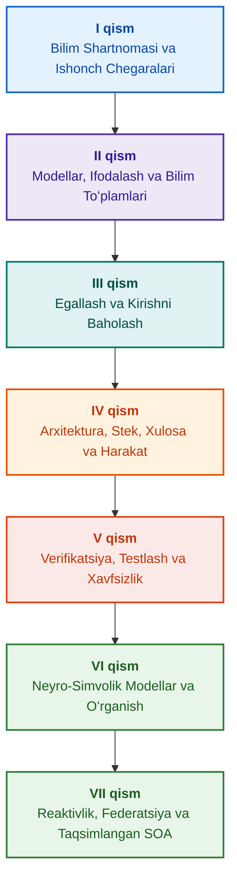

# Dalillarga asoslangan ekspert tizimlari arxitekturasi: Formal ontologiyalardan neyro-simvolik SIgacha

**Yuqori ishonchlilikdagi intellektual tizimlarni loyihalash, matematik modellari, arxitekturasi va formal verifikatsiyasi boʻyicha muhandislik monografiyasi va amaliy qoʻllanma (Safety-Critical & Evidence-Grounded AI)**

**Muallif:** [Mykola Fedchyk (Микола Федчик)](../../about-the-author.md) · [LinkedIn](https://www.linkedin.com/in/nickfedchik/)  
**Formati:** Muhandislik monografiyasi / SI arxitektorining stoli kitobi  
**Yili:** 2026  

---

## Kitob haqida

Ushbu kitob zamonaviy sunʼiy intellektning asosiy inqirozini — neyrotarmoq generasiyalarining ehtimoliy haqiqatga oʻxshashligi bilan formal matematik isbotlarning deterministik haqiqati oʻrtasidagi epistemik uzilishni yengib oʻtishga bagʻishlangan fundamental monografik tadqiqot va muhandislik qoʻllanmasidir. Tadqiqot markazida qatʼiy muhandislik savoli turadi: **har bir xulosasi rad etib boʻlmas, boshlangʻich dalil manbalarigacha toʻliq kuzatilishi mumkin boʻlgan va xavfsizlik uchun oʻta muhim muhandislik sohalarida (ISO 26262, IEC 61508, DO-178C, ISO/SAE 21434) sertifikatlashga yaroqli ekspert tizimini qanday loyihalash mumkin?**

Muallif yangi paradigmani asoslaydi va barpo etadi: **Dalillarga Asoslangan Neyro-Simvolik SI (Evidence-Grounded Neuro-Symbolic AI)**. Ushbu arxitekturada statistik modellar (LLM/SLM) soʻrov gipotezalarini yaratish va proyeksiyali renderlash boʻyicha maslahat funksiyasini bajaradi; deterministik simvolik yadro esa mantiqiy ziddiyatsizlik, faktlarni bayt darajasida asoslash, vakolatlar chegarasini nazorat qilish va harakatga xavfsiz oʻtish invariantlariga soʻzsiz kafolat beradi.

### Muhandislik artefaktidan tekshiriladigan qarorgacha

Tizim talablari, manba kodi, sinov jurnallari, meʼyoriy standartlar va muhandislik qarorlari zamonaviy ishlab chiqarish muhitlarida allaqachon mavjud, biroq asosan rasmiylashtirilgan semantikasiz, qatʼiy amal qilish chegaralarisiz va oʻzaro kuzatuvsiz ajratilgan artefaktlar sifatida faoliyat yuritadi. Muvaffaqiyatli sinov hisoboti eskirgan apparat reviziyasiga tegishli boʻlishi mumkin; funksional xavfsizlik standartidan iqtibos kontekstdan yulinib olinishi mumkin; konfiguratsiyaning favqulodda qaytarilishi esa bekor qilingan komponentni beixtiyor qayta faollashtirishi mumkin.

Ushbu monografiya toʻliq muhandislik yoʻlini taklif etadi: muhandislik artefaktlarini tiplashtirilgan maʼlumotlar va kriptografik imzolangan bilim toʻplamlari sifatida rasmiylashtirishdan — simvolik xulosa chiqarish, rejalarning bosqichma-bosqich dekompozitsiyasi, kontrfaktik tushuntirishlar va vakolat chegaralari auditigacha. Amaliy bayon Go tilida toʻliq sinov toʻplamlariga ega boʻlgan sanoat darajasidagi dasturiy yechimlar ([1-bob](../../ch01-introduction-to-expert-systems.md)), qatʼiy matematik shartnomalar ([II qism](../../part-02-knowledge-models.md)) va bilimlarning regressiyasini istisno qiluvchi uzluksiz oʻrganish protokollari ([25-bob](../../ch25-how-expert-systems-learn.md)) bilan mustahkamlangan.

### Monografiya kimlar uchun moʻljallangan

Nashr tizim arxitektorlari, ishonchlilik va funksional xavfsizlik boʻyicha yetakchi muhandislar, mantiqiy xulosa chiqarish dvigatellari ishlab chiquvchilari va bilim muhandislari uchun moʻljallangan. Tushunchalarni dastlabki oʻzlashtirish uchun birinchi tartibli predikatlar mantigʻi, dasturiy taʼminot versiyalarini boshqarish va tizimlarning hayotiy davri haqidagi asosiy tushunchalar yetarli; amaliy misollarni ishga tushirish uchun standart Go vositalari talab qilinadi. Goal Structuring Notation (GSN) xavfsizlik asoslarini formal sintez qilish, murakkab tizimlar sinergetikasi, neyromorfik tezlatkichlar va GNSSsiz avtonom navigatsiyaga bagʻishlangan maxsus boblar yuqori texnologiyali tarmoqlarda (aerokosmik, avtonom transport, muhim energetika infratuzilmasi) dalillarga asoslangan SIning ilgʻor marralarini ochib beradi.

---

## Ilmiy kontekst va monografiyaning global tadqiqotlardagi oʻrni

Monografiya ekspert tizimlariga 1980-yillardagi qoidalarga asoslangan tizimlarning (CLIPS yoki MYCIN kabi) arxaik qoldigʻi sifatida emas, balki **Uchinchi Toʻlqin Dalillarga Asoslangan Neyro-Simvolik SIning (Third-Wave Evidence-Grounded Neuro-Symbolic AI)** yetakchi fronti sifatida qaraydi. Asar yetakchi jahon ilmiy maktablarining nazariy poydevoriga tayanadi va shu bilan birga mavhum matematik modellar bilan yuqori unumdorlikdagi tizim muhandisligi oʻrtasidagi tafovutni bartaraf etadi:

| Ilmiy yoʻnalish | Asosiy global ishlar va mualliflar | Kitobdagi konseptual koʻprik |
|---|---|---|
| **Uchinchi toʻlqin neyro-simvolik SI (NeSy)** | Artur d'Avila Garcez, Luis C. Lamb (*Neurosymbolic AI: The 3rd Wave*, 2023; *Neural-Symbolic Cognitive Reasoning*, Springer, 2009); Henry Kautz (*The Third AI Summer*, AAAI 2022) | Masʼuliyatlarni taqsimlash: statistik modellar (SLM/LLM) soʻrov gipotezalarini yaratadi, deterministik simvolik yadro esa faktlarni formal tekshiradi va tasdiqlaydi ([29-bob](../../ch29-neuro-symbolic-architecture.md)). |
| **Semantik cheklovlar va xavfsiz oʻrganish** | Guy Van den Broeck et al. (*A Semantic Loss Function for Deep Learning with Symbolic Knowledge*, ICML 2018); Luc De Raedt et al. (*DeepProbLog*, IJCAI 2020) | Kirish va chiqish nazorat shlyuzlari, neyrotarmoq takliflarini formal sxemalar boʻyicha deterministik semantik filtrlash ([28](../../ch28-dual-mode-expert-systems.md), [33-boblar](../../ch33-inter-system-knowledge-exchange-and-model-teaching.md)). |
| **Inkor qilinadigan mulohaza va argumentatsiya nazariyasi** | John L. Pollock (*Defeasible Reasoning*, 1987; *Cognitive Carpentry*, MIT Press, 1995); Phan Minh Dung (*Abstract Argumentation Frameworks*, AIJ 1995); Douglas Walton (*Argumentation Schemes*, Cambridge, 2008) | Bilimlarni daʼvolar, kelib chiqish va inkor etuvchi omillarga (*rebutting* va *undercutting defeaters*) ajratish; Dung argumentatsiya tizimlari orqali meʼyoriy bazalardagi ziddiyatlarni hal qilish ([2](../../ch02-epistemology-of-machine-knowledge.md), [27-boblar](../../ch27-safety-case-gsn-synthesis.md)). |
| **Assotsiativ qoidalarni avtonom mayning qilish (KBC)** | Luis Galárraga, Fabian M. Suchanek et al. (*AMIE: Association Rule Mining under Incomplete Evidence*, WWW 2013, VLDBJ 2015); Stephen Muggleton (*Inductive Logic Programming*, 1994) | Ochiq olamning notoʻgʻri qarshi misollariga tayanmasdan, qisman toʻliqlik taxmini (PCA) ostida bilim bazalaridan qonuniyatlarni avtomatik induksiya qilish ([34-bob](../../ch34-deterministic-relational-analysis-abduction-and-socratic-dialogue.md)). |
| **Formal xavfsizlik qalqonlari va sertifikatlash (Safe AI)** | Bettina Könighofer, Roderick Bloem et al. (*Shield Synthesis*, 2017); Tim Kelly, Rob Weaver (*Goal Structuring Notation*, York, 2004); André Platzer (*Logical Foundations of CPS*, Springer, 2018) | ISO 26262/21434 standartlari uchun GSN notatsiyasida xavfsizlik asoslarini sintez qilish; periferik aktuatorlar uchun formal qalqonlar va raqamli haqiqiylik konvertlari ([27](../../ch27-safety-case-gsn-synthesis.md), [30](../../ch30-safety-cybersecurity-co-engineering.md), [33-boblar](../../ch33-inter-system-knowledge-exchange-and-model-teaching.md)). |
| **Epistemik mantiq va bilim semiotikasi** | John F. Sowa (*Knowledge Representation: Logical, Philosophical, and Computational Foundations*, 2000); Frank van Harmelen et al. (*Handbook of Knowledge Representation*, Elsevier, 2008) | Charlz Sanders Pirsning epistemik triadasi (Tushuncha → Hukm → Xulosa); qatʼiy deduktiv nazorat ostida gipotezalarni abduktiv chiqarish ([6](../../ch06-applied-mathematics-for-expert-systems.md), [34-boblar](../../ch34-deterministic-relational-analysis-abduction-and-socratic-dialogue.md)). |
| **Murakkab tizimlar kibernetikasi va sinergetikasi** | Norbert Wiener (*Cybernetics*, 1948); W. Ross Ashby (*An Introduction to Cybernetics*, 1956); Hermann Haken (*Synergetics: An Introduction*, 1977; *Advanced Synergetics*, 1983); Ilya Prigogine (*Order out of Chaos*, 1984) | Eshbining zarur xilma-xillik qonuni, yopiq boshqaruv zanjirlari L0–L4, Hakenning boʻysunish tamoyili boʻyicha holat fazosini tartib parametrlariga keltirish, kritik sekinlashuv (CSD) orqali faza oʻtishlarini bashorat qilish va bilim bazalarini dissipativ barqarorlashtirish ([6](../../ch06-applied-mathematics-for-expert-systems.md), [22](../../ch22-cybernetics-edge-to-backend.md), [35-boblar](../../ch35-self-organizing-expert-systems-synergetics-and-npu-runtime.md)). |
| **Bilimlarni testlash, lingvistik invariantlik va Lipshits kalibrlashi** | Kent Beck (*TDD*, 2002); Martin Fowler (*Refactoring*, 2018); Clark Barrett, Leonardo de Moura (*Z3 SMT Solver*, 2008); Chuan Guo et al. (*On Calibration of Modern Neural Networks*, ICML 2017); Marco Tulio Ribeiro et al. (*CheckList*, ACL 2020); John L. Pollock (*Defeasible Reasoning*, 1987) | Toʻrt darajali bilimlarni testlash piramidasi (KTP): shartlarni ajratish bilan alohida qoidalarni modulli testlash (`PremiseMock`) (KUT), boʻsh haqiqat tuzogʻini toʻsish, 6 nuqtali spektral BVA, qoidalar va inkor etuvchilar panjarasi (KIT), lingvistik oʻzgarishlarda semantik invariantlik metriki ($\text{SIS} \ge 0.98$), rele tebranishlariga qarshi Lipshits uzluksizligi ($L_{\mathcal{K}} \le L_{\max}$) va bilim boʻshliqlarini stigmurgik toʻplash ([36-bob](../../ch36-knowledge-testing-pyramid-and-variational-calibration.md)). |

---

## Muallifning nazariy modellari, ilmiy tadqiqotlari va muhandislik innovatsiyalari

Ushbu monografiya muallifning yuqori ishonchlilikdagi tizimlarni, oʻrnatilgan arxitekturalarni va dalillarga asoslangan SIni loyihalash sohasidagi fundamental tadqiqot natijalari va amaliy muhandislik tajribasini umumlashtiradi. Faqat sharhlovchi ishlardan farqli oʻlaroq, kitobda neyro-simvolik oʻzaro taʼsirni matematik isbotlanadigan ishonch darajasiga olib chiqadigan bir qator original formal nazariyalar, protokollar va tizimli yechimlar ishlab chiqilgan:

### 1. Fundamental nazariy ishlanmalar va matematik formalizmlar

1. **Dalillarni Asoslash Invarianti (Evidence-Grounded Invariant, EGI) va Faktlarni Tasdiqlash Shlyuzi ([2](../../ch02-epistemology-of-machine-knowledge.md), [19](../../ch19-from-question-to-evidence.md), [28](../../ch28-dual-mode-expert-systems.md), [29-boblar](../../ch29-neuro-symbolic-architecture.md)):**
   * *Nazariy Konseptsiya:* Muallif dalillarga asoslangan tizimda boshlangʻich bilim manbalariga deterministik proyeksiyasiz hech bir daʼvo fakt maqomini ololmasligini belgilovchi $\mathrm{Comp}(C) = 1.00$ toʻliqlik invariantini shakllantirdi va matematik rasmiylashtirdi. Faktlar bazasidagi har bir element kriptografik kortej bilan taʼminlanadi: oʻzgarmas bayt koordinatalari `[byte_start, byte_end]`, kanonik fragment xeshi `quote_sha256` va PROV-O kelib chiqish sertifikati identifikatori.
   * *Muhandislik Ahamiyati:* Bayt darajasidagi nazorat shlyuzi mexanizmi apparat va dasturiy darajada neyrotarmoq gallyutsinatsiyalarining versiyalangan bilim bazasiga kirishini butunlay istisno qiladi, tasdiqlanmagan maʼlumotlarga nol darajadagi murosani kafolatlaydi ($ZHR = 1.00$).
2. **Toʻrt Darajali Bilimlarni Testlash Piramidasi (KTP) va Xulosa Fazosining Lipshits Barqarorligi ([36-bob](../../ch36-knowledge-testing-pyramid-and-variational-calibration.md)):**
   * *Nazariy Konseptsiya:* Muallif birinchi marta Martin Faulerning dasturiy taʼminotni testlash piramidasiga oʻxshash tizimli Bilimlarni Testlash Piramidasini (KTP) taklif qildi: alohida qoidalarni modulli testlash (`PremiseMock`) (KUT), qoidalar va inkor etuvchilarning oʻzaro taʼsirini integratsion testlash (KIT) va ifodalar koʻp xilligida variatsion kalibrlash (KVT).
   * *Matematik Apparat:* Boʻsh haqiqat tuzogʻini toʻsuvchi qatʼiy invariant ($P \equiv \text{False}$ boʻlganda $P \to Q$), lingvistik tebranishlarda semantik invariantlik metriki ($\mathrm{SIS} \ge 0.98$) va kirishning kichik tebranishlarida xulosalarning halokatli tebranishini matematik ravishda bartaraf etuvchi xulosa fazosining Lipshits uzluksizligi chegarasi ($L_{\mathcal{K}} \le L_{\max}$).
3. **Deontik Qoidalarning Popper Falsifikatsiya Nazariyasi va Faol Komplaens Auditori ([39-bob](../../ch39-active-compliance-auditor-and-popperian-testing.md)):**
   * *Nazariy Konseptsiya:* Faqat savollarga javob beradigan klassik "passiv orakul" modelidan Karl Popperning falsifikatsiya tamoyilini amalga oshiruvchi faol bilim auditori paradigmasiga oʻtish. Tizim talablar fazosini (ASPICE 4.0, ISO 26262, ISO/SAE 21434) avtonom tarzda tekshiradi, qarshi misollarni sintez qiladi, toʻliq boʻlmagan spetsifikatsiyalarni aniqlaydi va mahsulotni sinovdan oʻtkazishning toʻliq dasturini loyihalashtiradi.
   * *Amaliy Qimmati:* Neyrotarmoq tomonidan chegara ssenariylarini ijodiy yaratish (1-tizim) va simvolik yadro tomonidan deterministik deontik tekshirish (2-tizim) uygʻunligi, bu boshqaruv zanjiridagi insonni (Human-in-the-Loop) tasdiqlash charchoqlaridan ishonchli himoya qiladi.
4. **Bilimlar Bazasi Oʻlchovini Sinergetik Qisqartirish va Bifurkatsiyadan Oldingi CSD Diagnostikasi ([6](../../ch06-applied-mathematics-for-expert-systems.md), [22](../../ch22-cybernetics-edge-to-backend.md), [35-boblar](../../ch35-self-organizing-expert-systems-synergetics-and-npu-runtime.md)):**
   * *Nazariy Konseptsiya:* Hermann Hakenning sinergetika matematik apparatini (tartib parametrlari va boʻysunish tamoyili) va Ilya Prigojinning dissipativ tuzilmalar nazariyasini murakkab bilim bazalari evolyutsiyasiga qoʻllash.
   * *Ilmiy Natija:* Telemetriyaning koʻp oʻlchovli faza fazosini tartib parametrlariga keltirish usuli ishlab chiqildi va avtokorrelyatsiya hamda dispersiya asosida Kritik Sekinlashuvni (*Critical Slowing Down*, CSD) aniqlovchi bifurkatsiyadan oldingi detektor integratsiya qilindi, bu tizimning dinamik buzilishini avariya datchiklari ishga tushishidan ancha oldin bashorat qilish imkonini beradi.
5. **Harakat Mustaqilligi Darajalari Modeli (A0–A4), Ruxsat Shlyuzi va Idempotent Sagalar ([21-bob](../../ch21-from-recommendation-to-action.md)):**
   * *Nazariy Konseptsiya:* "Harakat, muhit, xavf darajasi" kortejiga biriktiriladigan tizim harakati vakolatlarining diskret shkalasi (A0: passiv tahlil, A1: loyihani tayyorlash, A2: inson imzosi bilan harakat, A3: nazorat ostidagi avtonomiya, A4: himoyalovchi favqulodda toʻxtatish).
   * *Matematik Apparat:* Kriptografik kalit $k$ asosidagi algebraik idempotentlik invarianti $f(f(x, k), k) \equiv f(x, k)$, bosqichma-bosqich yopiq zanjirli ijro va `OutcomeUnknown` holati hamda shartlardan keyingi mustaqil tekshiruvga ega taqsimlangan kompensatsiya sagalari protokoli.
6. **GSN Notatsiyasida Funksional Xavfsizlik va Kiberxavfsizlikni Formal Birgalikda Loyihalash ([27](../../ch27-safety-case-gsn-synthesis.md), [30-boblar](../../ch30-safety-cybersecurity-co-engineering.md)):**
   * *Nazariy Konseptsiya:* ISO 26262 (funksional xavfsizlik) va ISO/SAE 21434 (kiberxavfsizlik) standartlari talablarini bir vaqtning oʻzida qondirish uchun GSN (Goal Structuring Notation) argumentatsiya daraxtlarini muvofiqlashtirilgan sintez qilish modeli.
   * *Muhandislik Yutugʻi:* Ziddiyatli maqsadlar oʻrtasidagi matematik arbitrajni rasmiylashtirish (favqulodda javob berish vaqti byudjeti kriptografik attestatsiya chuqurligiga qarshi) va tuzlangan Merkle daraxtlari orqali tashqi auditorlarga dalillarni selektiv ochish protokoli.
7. **Tushuntirishlarning Sadoqati va Semantik Izchilligini Tekshirish Protokoli ([20-bob](../../ch20-explanation-engine.md)):**
   * *Nazariy Konseptsiya:* Tushuntirish generativ modelning erkin matni sifatida emas, balki isbot grafigidan, qoidalar versiyasidan va qayd etilgan faktlar kesimidan bir maʼnoli chiqariladigan mustaqil deterministik artefakt sifatida qaraladi.
   * *Matematik Apparat:* Simvolik xulosa bilan operator uchun ogʻzaki ifoda oʻrtasidagi eng kichik tafovutda qatʼiy shablonga avtomatik fail-safe qaytishga ega boʻlgan sadoqatni baholash metrik shlyuzi ($C_{\text{facts}} = 1.00, H_{\text{free}} = 1.00$).

---

### 2. Empirik tadqiqotlar, mualliflik sinov stendlari va tizim muhandisligi

1. **`mmap` va Nol Deserializatsiyali Oʻzgarmas Binar Bilim Toʻplamlari ([32-bob](../../ch32-high-performance-knowledge-packs-mmap-and-harvesting.md)):**
   * *Muallif Yangiligi:* Toʻplamlarning ikki qatlamli arxitekturasi (boshlangʻich manbalarning kanonik qatlami + indekslarning hosila moddiylashtirilgan qatlami).
   * *Empirik Natija:* `mmap` tizim chaqiruvi orqali indeksni toʻgʻridan-toʻgʻri virtual manzil maydoniga aks ettirish, dinamik xotira ajratish xarajatlarini bartaraf etish (zero-allocation) va ontologiyaning gigabayt hajmiga qaramasdan dvigatelni subchiziqli vaqtda ishga tushirish.
2. **IETF RFC-1000 va W3C-150 Standart Korpuslarida Empirik Kalibrlash Maydoni ([2](../../ch02-epistemology-of-machine-knowledge.md), [4](../../ch04-evolution-from-bayes-to-evidence-ai.md), [14](../../ch14-requirements-detection-and-formalization.md), [25-boblar](../../ch25-how-expert-systems-learn.md)):**
   * *Muallif Tajribasi:* Internet rivojlanishining 5 ta tarixiy davriga boʻlingan 1000 ta haqiqiy IETF RFC spetsifikatsiyasida va W3C korpusining 150 ta murakkab diagnostik soʻrovida (mantiqiy ziddiyatlar va konfabulyatsiyalarni sunʼiy kiritish bilan birga) keng koʻlamli tadqiqot stendini joylashtirish.
   * *Amaliy Natija:* Bilimlarni tekshirishning xolis imtihon matritsalarini qurish, meʼyoriy ziddiyatlarni aniqlash va yangilanishlar paytida bilim bazasining regressiyasidan matematik isbotlangan himoya.
3. **Koʻp Bosqichli Relyatsion Tahlil, Simvolik Abduksiya va Sokrat Muloqoti ([34-bob](../../ch34-deterministic-relational-analysis-abduction-and-socratic-dialogue.md)):**
   * *Muallif Ishlanmasi:* Bogʻlangan obʼyektlar uchun bayt darajasidagi murakkab dalillar zanjirini shakllantirish va halqalardan himoyalangan Ikki Tomonlama Cheklangan Kenglik Boʻyicha Qidiruv algoritmi (Bidirectional Bounded BFS, $k \le 6$).
   * *Muhandislik Afzalligi:* Qatʼiy deduktiv nazorat ostida Pirsning simvolik abduksiyasini amalga oshirish va yopiq olam taxmini (CWA) ostida koʻr-koʻrona rad etish oʻrniga tizimni inson bilan samarali muloqot rejimiga oʻtkazuvchi tiplashtirilgan Sokrat aniqlashtirish freymlari (*Clarification Frames*).
4. **Periferik Boshqaruv Tizimlari Uchun Formal Qalqonlar va Raqamli Haqiqiylik Konvertlari ([33-bob](../../ch33-inter-system-knowledge-exchange-and-model-teaching.md), [Ilovalar B](../../appendix-b-robotics-and-cyber-physical-systems.md), [V](../../appendix-c-autonomous-navigation-and-geosearch.md), [D](../../appendix-e-mixed-signal-neuromorphic-expert-systems.md)):**
   * *Muallif Yangiligi:* Raqamli signal protsessorlari (DSP) va GNSSsiz avtonom navigatsiya tizimlari (TRN/DSMAC/VIO) uchun diskret mantiqiy invariantlarni uzluksiz raqamli xavfsizlik koridorlariga oʻtkazish metodologiyasi.
   * *Foydalanish Ishonchliligi:* Ed25519 kriptografiyasiga asoslangan imzolangan qoidalar almashinuvi, yangi bilim nomzodlarining xavfsiz karantini va xavfli boshqaruv buyruqlarini apparat darajasida kesish.
5. **Tushuntirishlar va Differensial Audit Orqali Maxfiy Maʼlumotlar Sizib Chiqishidan Himoya ([20-bob](../../ch20-explanation-engine.md)):**
   * *Muallif Ishlanmasi:* Isbot grafigining har bir tuguni va qirrasi uchun ACL tekshiruvi boʻlgan tushuntirishning oraliq ifodasini qisqartirish protokoli ($\mathrm{EIR}_{\text{redacted}}$), bu kontrastli WHY NOT soʻrovlari seriyasi orqali modellarni qayta tiklash boʻyicha yon kanal hujumlarini toʻsadi.

---

## Guruhlash va tasniflash tamoyili

Kitob qismlari bobning yozilgan yili yoki muayyan texnologiya nomi bilan emas, balki asosiy muhandislik vazifasi bilan belgilanadi. Har bir bob bitta asosiy qismga tegishli; tutash usullar uning asosiy savolini qanday hal qilishni tushuntiradi. Bob raqamlari va fayl nomlari doimiy identifikatorlar sifatida saqlanadi, shuning uchun tematik oʻqish tartibi raqamli tartibdan farq qilishi mumkin.

Boblar ichidagi boʻlim sarlavhalari aniq sinflarni tashkil etadi va ularni teng huquqli texnologiyalar roʻyxati sifatida emas, balki ketma-ket argumentatsiya zanjiri sifatida oʻqish kerak:

| Boʻlim sinfi | Oʻquvchining savoli | Bobdagi vazifasi |
|---|---|---|
| Muammo va vazifa chegarasi | Aynan nimani hal qilish kerak? | Asosiy savol va qoʻllanish sohasini aniqlash |
| Obʼyekt va model | Qaysi maʼlumotlar, bilimlar yoki holatlar koʻrib chiqiladi? | Tushunchalar, tiplar va taxminlarni muvofiqlashtirish |
| Usul va protsedura | Natijaga qanday erishiladi? | Xulosa chiqarish, oʻzgartirish yoki boshqaruvni tushuntirish |
| Amalga oshirish va vosita | Protsedura qaysi vosita bilan bajariladi? | Usulning dasturiy yoki apparat gavdalanishini koʻrsatish |
| Tekshirish va nazorat holati | Xatoni qanday aniqlash mumkin? | Natijani mustaqil mezon bilan taqqoslash |
| Xulosa va natija chegaralari | Nima isbotlandi va nima ochiq qoldi? | Ortiqcha vaʼdalarsiz asosiy savolga javob berish |

Mamlakat, sanoat yoki tijorat mahsuloti ushbu taksonomiyaning mustaqil darajasi emas, balki qoʻllanish kontekstidir. Lugʻat, qisqartmalar, manbalar va navigatsiya bobning mustaqil mavzulari emas, balki yordamchi maʼlumot vositalaridir.

Toʻliq tahririyat tuzilmasi sharhi har bir bobning asosiy mavzusini baholashni, tutash munozaralar orasidagi chegaralarni va tuzilish hamda xulosalarga oid eslatmalarni oʻz ichiga oladi. Yangi izoh boblar ichidagi barcha mazmuniy xatarlar allaqachon toʻliq bartaraf etilganligini anglatmaydi.

---

## Tavsiya etilgan oʻqish yoʻnalishlari

**Dastlabki dasturiy tekshiruv:** [1](../../ch01-introduction-to-expert-systems.md) → [7](../../ch07-knowledge-base-typology.md) → [8](../../ch08-engineering-artifacts-as-data.md) → [17](../../ch17-implementation-stack.md) → [23](../../ch23-knowledge-base-verification.md) → [25](../../ch25-how-expert-systems-learn.md). Maqsad: dalillarga asoslangan, salbiy testlar va boshqariladigan bilim oʻzgarishiga ega takrorlanuvchi qaror. Til modeli shart emas.

**Bilim muhandisligi:** [II qism](../../part-02-knowledge-models.md) → [III qism](../../part-03-knowledge-engineering-nlp.md) → [19](../../ch19-from-question-to-evidence.md) → [20](../../ch20-explanation-engine.md) → [26](../../ch26-continual-learning.md). Maqsad: semantikani, kelib chiqishni, bilimlarni egallashni va yangi nomzodlarni tekshirishni muvofiqlashtirish. II qism 7–11-boblar uchun ilmiy sinov dasturini saqlaydi.

**Yechim arxitekturasi:** [16](../../ch16-expert-systems-architecture.md) → [19](../../ch19-from-question-to-evidence.md) → [31](../../ch31-syllogistic-reasoning-and-relation-lattices.md) → [20](../../ch20-explanation-engine.md) → [21](../../ch21-from-recommendation-to-action.md). Maqsad: dalillarni tekshirish, meʼyorni qoʻllash, tushuntirish va harakat vakolatini qatʼiy ajratish.

**Verifikatsiya va xavfsizlik:** [23](../../ch23-knowledge-base-verification.md) → [36](../../ch36-knowledge-testing-pyramid-and-variational-calibration.md) → [25](../../ch25-how-expert-systems-learn.md) → [26](../../ch26-continual-learning.md) → [27](../../ch27-safety-case-gsn-synthesis.md) → [30](../../ch30-safety-cybersecurity-co-engineering.md). Tashqi obʼyekt diagnostikasi [24-bob](../../ch24-system-diagnosis.md) orqali maxsus amalga oshiriladi.

**Gibrid javoblar va foydalanish:** [VI qism](../../part-06-frontiers-neuro-symbolic.md) → [VII qism](../../part-07-runtime-and-knowledge-exchange.md) → [40](../../ch40-distributed-epistemic-architectures-soa-and-cluster-scaling.md) va zarur ilovalar. Maqsad: til modelini integratsiya qilish, bilim boʻshliqlarini boshqarish, taqsimlangan bilim xizmatlari arxitekturasini qurish va tizimlararo almashinuvni tekshirish. [2](../../ch02-epistemology-of-machine-knowledge.md), [4](../../ch04-evolution-from-bayes-to-evidence-ai.md) va [6-boblarni](../../ch06-applied-mathematics-for-expert-systems.md) ehtiyojga koʻra shartnoma, tarix va matematik maʼlumotnoma sifatida oʻqish mumkin.

---

## Muhandislik majburiyatlari chegaralari

Ushbu kitob oʻquv va tadqiqot materiali boʻlib, sertifikatlangan protsedura yoki mahsulotning standartga muvofiqligining rasmiy isboti emas. Deterministik ijro faktlarning toʻgʻriligini bevosita isbotlamaydi; xesh va raqamli imzo mutlaq haqiqatni isbotlamaydi; argumentlar grafigi esa inson mutaxassisining bahosini almashtirmaydi. Butun mahsulotning ishonchlilik talablarini til modelining xatolik darajasi bilan tenglashtirish yoki barcha dasturiy komponentlarga tatbiq etish mumkin emas.

Avtomatlashtirilgan tahlil qoʻlda maʼlumot kiritishni kamaytiradi, ammo domen modellashtirishni, ekspert sharhini va bilim egalarining masʼuliyatini bekor qilmaydi. Protégé, qoʻlda koʻrib chiqish va avtomatik yigʻish birgalikda samarali ishlashi mumkin. Matematik kafolatlar faqat muayyan til profiliga va taxminlarga tegishli; oʻlchangan tezliklar aniq sinovdan oʻtgan soʻrovga, korpusga va muhitga tegishli. Muallifning arxiv maʼlumotlari ochiq oʻquv stendlaridan va hali bajarilmagan tadqiqotlardan qatʼiy ajratilgan.

Mahsulotni chiqarish, xavfni qabul qilish va meʼyoriy talablarga muvofiqlik toʻgʻrisidagi qarorlar vakolatli inson mutaxassislarining zimmasida qoladi. Ekspert tizimi tekshiriladigan materialni tayyorlaydi va kelishilgan siyosatni amalga oshiradi, ammo oʻz-oʻzidan meʼyoriy yoki qonuniy vakolatga ega boʻlmaydi.

---

## Kitob tuzilishi

Kitob yettita tematik qismdan, 40 bobdan va beshta ilovadan iborat. Har bir bob bitta asosiy qismga tegishli. Navigatsiyadagi oldingi va keyingi boblar quyidagi tematik tartibga mos keladi; bob raqamlari va fayl nomlari oʻzgarishsiz saqlangan.

---

### [I qism. Konseptual va epistemik asoslar](../../part-01-foundations.md)

*Ekspert tizimi qachon kerak, nimani bilim deb hisoblash mumkin va tashkiliy qarorlar asoslarini qanday saqlash kerak.*

* [1-bob. Ekspert tizimlariga kirish: Xaosdan boshqariladigan bilimgacha](../../ch01-introduction-to-expert-systems.md)
* [2-bob. Muhandis uchun falsafa: Mashinaning nimani bilim deb atashga haqqi bor](../../ch02-epistemology-of-machine-knowledge.md)
* [3-bob. Ekspert tizimining axborot-maʼlumotnoma tizimidan tub farqi nimada](../../ch03-beyond-reference-information-systems.md)
* [4-bob. Ekspert tizimlari evolyutsiyasi: Bayes teoremasidan dalillarga asoslangan SI yechimlarigacha](../../ch04-evolution-from-bayes-to-evidence-ai.md)
* [5-bob. Ishonch triadasi: Ekspert tizimi, dalillarga asoslangan tavsiya va korporativ xotira](../../ch05-triad-of-trust-and-corporate-memory.md)

---

### [II qism. Matematik modellar, bilimlarni ifodalash va saqlash](../../part-02-knowledge-models.md)

*Matematik operatsiyalar va ifodalarni tanlash, tiplashtirilgan artefaktlar, kuzatuv grafigi va oʻzgarmas bilim toʻplami.*

* [6-bob. Ekspert tizimlari uchun amaliy matematika: Qoidalar, ehtimollar, grafiklar va sababiyat](../../ch06-applied-mathematics-for-expert-systems.md)
* [7-bob. Bilimlar bazalarining tipologiyasi: Qoidalar, ontologiyalar, presedentlar va vektorlar](../../ch07-knowledge-base-typology.md)
* [8-bob. Ekspert tizimi maʼlumotlari sifatida muhandislik artefaktlari](../../ch08-engineering-artifacts-as-data.md)
* [9-bob. Muhandislik bilimlari grafigi: Talablardan apparatgacha kuzatilishi](../../ch09-engineering-knowledge-graph-traceability.md)
* [32-bob. Oʻzgarmas bilim toʻplamlari: Bayt darajasidagi ruxsat, indekslar va xotirani aks ettirish](../../ch32-high-performance-knowledge-packs-mmap-and-harvesting.md)

---

### [III qism. Bilimlarni egallash, lingvistik tahlil va kirishni baholash](../../part-03-knowledge-engineering-nlp.md)

*Hujjatlar, mutaxassislar tajribasi va kuzatishlar: nomzodlarni ajratib olish, lingvistik tahlil, rasmiylashtirish va dalillarni baholash.*

* [10-bob. Bilimlarni egallash tizimlari: Manbalar, ruxsat va hayotiy davr](../../ch10-knowledge-acquisition-systems.md)
* [11-bob. Mutaxassislardan bilimlarni ajratib olish: Intervyular, kognitiv xaritalar va tajribani rasmiylashtirish](../../ch11-knowledge-elicitation-from-experts.md)
* [12-bob. Lingvistik tahlil va lokal modellar: Maʼno va manbalarni saqlash](../../ch12-linguistic-analysis-and-local-models.md)
* [13-bob. Tabiiy tilning oʻzgaruvchanligi determinizmga qarshi: Soʻrov maʼnosini kompilyatsiya qilish](../../ch13-language-variability-vs-determinism.md)
* [14-bob. Talablar va modalliklarni aniqlash: Meʼyoriy matndan invariantlargacha](../../ch14-requirements-detection-and-formalization.md)
* [15-bob. Bilimlarni ajratib olish va bilim bazasini qurish: Faktlar, grammatikalar va avtomatlar](../../ch15-knowledge-extraction-and-kb-construction.md)
* [37-bob. Kirish axborotini baholash: Manbalar, dalillar va noaniqlik](../../ch37-input-information-assessment-and-algorithmic-skepticism.md)

---

### [IV qism. Arxitektura, texnologik stek, xulosa chiqarish va harakat](../../part-04-architecture-and-inference.md)

*Arxitektura shartnomalari, texnologik stek, apparat ijrosi, daʼvolarni tekshirish, meʼyorlarga asoslangan xulosa, tushuntirish va kibernetik boshqaruv zanjiri.*

* [16-bob. Ekspert tizimi arxitekturasi: Formal bilimdan dalillarga asoslangan qarorgacha](../../ch16-expert-systems-architecture.md)
* [17-bob. Texnologik stek: Vositalar, dasturlash tillari va qoidalar dvigatellarini tanlash mezonlari](../../ch17-implementation-stack.md)
* [18-bob. Ijro infratuzilmasi: Lokal modellar, apparat tezlatkichlari, Edge va On-Premise](../../ch18-execution-infrastructure.md)
* [19-bob. Savoldan dalilgacha: Qidiruv, asoslash va daʼvolarni tekshirish](../../ch19-from-question-to-evidence.md)
* [31-bob. Meʼyorlarga asoslangan xulosa: Predikatlar iyerarxiyasi, istisnolar va amal qilish muddati](../../ch31-syllogistic-reasoning-and-relation-lattices.md)
* [20-bob. Tushuntirish dvigateli: Qaror, rad etish va vakolat chegaralari](../../ch20-explanation-engine.md)
* [21-bob. Tavsiyadan harakatgacha: Vakolat nazorati va ishlab chiqarish muhitida xavfsiz ijro](../../ch21-from-recommendation-to-action.md)
* [22-bob. Kibernetik boshqaruv zanjiri: Datchiklar, periferiya va teskari aloqa](../../ch22-cybernetics-edge-to-backend.md)

---

### [V qism. Verifikatsiya, testlash, diagnostika va xavfsizlik asosi](../../part-05-verification-and-learning.md)

*Qoidalarni formal tekshirish, bilimlarni testlash piramidasi, Popper falsifikatsiyasi, texnik diagnostika va funksional xavfsizlik hamda kiberxavfsizlik dalillari.*

* [23-bob. Bilim bazasini tekshirish: Qoidalarning ziddiyatsizligi, toʻliqligi va ishonchliligini qanday tekshirish mumkin](../../ch23-knowledge-base-verification.md)
* [36-bob. Bilimlarni testlash piramidasi: Qoidalar, oʻzaro taʼsirlar va javob barqarorligi](../../ch36-knowledge-testing-pyramid-and-variational-calibration.md)
* [39-bob. Faol sinovchi-ekspert: Popper falsifikatsiyasi, meʼyoriy muvofiqlik (ASPICE/ISO 26262/ISO 21434) va avtonom test dizayni](../../ch39-active-compliance-auditor-and-popperian-testing.md)
* [24-bob. Texnik diagnostika: Maʼlumotlar toʻliq boʻlmaganda simptomni tub sabab bilan qanday adashtirmaslik kerak](../../ch24-system-diagnosis.md)
* [27-bob. Xavfsizlik asosi: Argumentlarni sintez qilish va tekshirish](../../ch27-safety-case-gsn-synthesis.md)
* [30-bob. Funksional xavfsizlik va kiberxavfsizlikni birgalikda loyihalash](../../ch30-safety-cybersecurity-co-engineering.md)

---

### [VI qism. Neyro-simvolik modellar, kognitiv chegaralar va uzluksiz oʻrganish](../../part-06-frontiers-neuro-symbolic.md)

*Qatʼiy xulosa va maslahat gipotezasi, til modelini integratsiya qilish, bilim boʻshliqlari, tasdiqlanmagan javobni nazorat qilish, imtihon matritsalari va tajribadan uzluksiz oʻrganish.*

* [28-bob. Ikki rejimli ekspert tizimlari: Qatʼiy xulosa va maslahat gipotezasi](../../ch28-dual-mode-expert-systems.md)
* [29-bob. Neyro-simvolik arxitektura: Til modellari va dalil asoslarini tekshirish](../../ch29-neuro-symbolic-architecture.md)
* [34-bob. Bilim boʻshliqlari: Relyatsion qidiruv, abduksiya va aniqlashtirish muloqoti](../../ch34-deterministic-relational-analysis-abduction-and-socratic-dialogue.md)
* [38-bob. Mashina gallyutsinatsiyalari va bilim taqchilligi: Dalillarga asoslangan javob nazorati](../../ch38-curing-machine-hallucinations-and-knowledge-deficits.md)
* [25-bob. Ekspert tizimini qanday oʻrgatish kerak: Imtihon matritsalari, bilimlar auditi va regressiya nazorati](../../ch25-how-expert-systems-learn.md)
* [26-bob. Tajribadan uzluksiz oʻrganish (Continual Learning) va tizim jurnalining siljishini bartaraf etish](../../ch26-continual-learning.md)

---

### [VII qism. Reaktiv bajarilish, tizimlararo bilim almashinuvi va taqsimlangan SOA](../../part-07-runtime-and-knowledge-exchange.md)

*Qoidalarni reaktiv bajarish, bilimlar sinergetikasi va faza oʻtishlari, tizimlararo almashinuv va korxona miqyosidagi taqsimlangan epistemik arxitektura.*

* [35-bob. Reaktiv ekspert tizimi: Hodisalar, bekor qilish va bilimlarni moslashtirish](../../ch35-self-organizing-expert-systems-synergetics-and-npu-runtime.md)
* [33-bob. Tizimlararo bilim almashinuvi: Tashqi tizimlarga qoidalarni yetkazib berish, modellarni oʻrgatish va xavfsiz teskari aloqa](../../ch33-inter-system-knowledge-exchange-and-model-teaching.md)
* [40-bob. Dalillarga asoslangan ekspert tizimining taqsimlangan arxitekturasi: Epistemik SOA, semantik marshrutlash, xotira iyerarxiyasi va koʻp yetkazib beruvchili defeazitiv arbitraj](../../ch40-distributed-epistemic-architectures-soa-and-cluster-scaling.md)

---

### Ilovalar

* [A ilovasi. Murakkab muhandislik loyihalarida dalillarga asoslangan tadqiqotning amaliy doirasi](../../appendix-a-evidence-governed-framework.md)
* [B ilovasi. Avtonom robototexnika va kiber-fizik komplekslarda dalillarga asoslangan ekspert tizimlari](../../appendix-b-robotics-and-cyber-physical-systems.md)
* [V ilovasi. GNSSsiz avtonom navigatsiya: Geofazoviy taqqoslash (TRN/DSMAC), vizual odometriya (VIO) va sensorlar integratsiyasining ekspert arbitraji](../../appendix-c-autonomous-navigation-and-geosearch.md)
* [G ilovasi. Analog ekspert tizimlari, neyromorfik hisoblashlar va apparat mantiqiy xulosasi](../../appendix-d-analog-expert-systems-and-neuromorphic-computing.md)
* [D ilovasi. Aralash analog-raqamli ekspert tizimlari: Dalillar nazorati ostidagi neyromorfik, analog va boshqa noanʼanaviy hisoblagichlar](../../appendix-e-mixed-signal-neuromorphic-expert-systems.md)
* [Muallif haqida: Mykola Fedchyk (Nick Fedchik)](../../about-the-author.md)

---

## Kelajakdagi tadqiqot yoʻnalishlari

Kelajakdagi ish yoʻnalishlari tayyor kafolatlar emas: Bilim toʻplamlarini takrorlanuvchi yigʻish; cheklangan formal ifodani tekshirish; aniq vakolatlar orqali agentlarni boshqarish; aniq rasmiylashtirilgan daʼvolarni maxfiy tekshirish; nazorat ostida bekor qilish va mashinani unutishni (machine unlearning) tadqiq qilish. Model xususiyatini isbotlash jismoniy mahsulotning muvofiqligini avtomatik ravishda tasdiqlamaydi, qoidani oʻchirish esa oʻrgatilgan modeldan maʼlumotlar taʼsirini toʻliq bartaraf etish bilan teng emas.

Apparat tezlatkichlari va noanʼanaviy hisoblagichlar uchun birinchi navbatda xatolik darajasi, kechikish, energiya sarfi va nosozliklar paytidagi xatti-harakatlar qatʼiy oʻlchanadi. Bu masalalar [29-bob](../../ch29-neuro-symbolic-architecture.md), [32-bob](../../ch32-high-performance-knowledge-packs-mmap-and-harvesting.md) hamda [G](../../appendix-d-analog-expert-systems-and-neuromorphic-computing.md) va [D ilovalarida](../../appendix-e-mixed-signal-neuromorphic-expert-systems.md) muhokama qilinadi. 7–11-boblar uchun amaliy tadqiqot dasturi [II qismda](../../part-02-knowledge-models.md) keltirilgan: har bir taklif gipoteza, nazorat taqqoslashi va falsifikatsiya shartiga ega.
