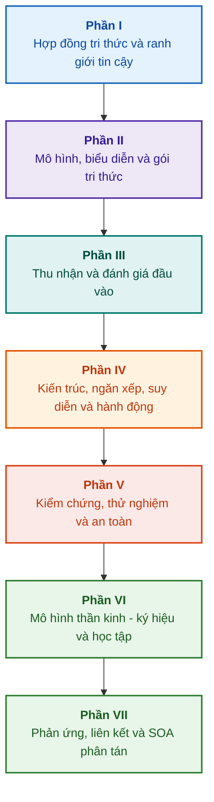

# Kiến trúc Hệ Chuyên gia Dựa trên Bằng chứng: Từ Bản thể học Hình thức đến Trí tuệ Nhân tạo Thần kinh - Ký hiệu

**Chuyên khảo kỹ thuật và cẩm nang thiết kế, mô hình toán học, kiến trúc và kiểm chứng hình thức cho các hệ thống thông minh độ tin cậy cao (Safety-Critical & Evidence-Grounded AI)**

**Tác giả:** [Mykola Fedchyk](about-the-author.md) · [LinkedIn](https://www.linkedin.com/in/nickfedchik/)  
**Định dạng:** Chuyên khảo kỹ thuật / Cẩm nang kiến trúc sư AI  
**Năm:** 2026  

---

## Về cuốn sách

Cuốn chuyên khảo này là công trình nghiên cứu nền tảng và tài liệu hướng dẫn kỹ thuật toàn diện, dành riêng cho việc giải quyết cuộc khủng hoảng cốt lõi của trí tuệ nhân tạo hiện đại: khoảng cách nhận thức luận (epistemic gap) giữa tính hợp lý mang tính xác suất của các mô hình mạng nơ-ron và chân lý tất định của các chứng minh toán học hình thức. Trọng tâm của nghiên cứu là câu hỏi không thể thỏa hiệp: **Làm thế nào để thiết kế một hệ chuyên gia mà mọi kết luận đưa ra đều không thể bác bỏ, có thể truy xuất nguồn gốc đầy đủ đến các bằng chứng ban đầu và đủ điều kiện để chứng nhận trong các lĩnh vực kỹ thuật trọng yếu về an toàn (ISO 26262, IEC 61508, DO-178C, ISO/SAE 21434)?**

Tác giả đề xuất và thiết lập một mô hình mới: **AI Thần kinh - Ký hiệu Dựa trên Bằng chứng (Evidence-Grounded Neuro-Symbolic AI)**. Trong đó, các mô hình thống kê (LLM/SLM) đóng vai trò tư vấn trong việc tạo giả thuyết và kết xuất ngữ cảnh; trong khi lõi ký hiệu tất định đảm bảo một cách bất biến tính nhất quán logic, neo giữ dữ liệu chính xác đến từng byte, kiểm soát giới hạn thẩm quyền và chuyển đổi an toàn sang hành động thực thi.

### Từ hiện vật kỹ thuật đến quyết định có thể kiểm chứng

Các yêu cầu hệ thống, mã nguồn, nhật ký thử nghiệm, tiêu chuẩn quy định và quyết định kỹ thuật đã tồn tại trong môi trường sản xuất hiện đại, nhưng phần lớn hoạt động như những hiện vật biệt lập thiếu ngữ nghĩa hình thức, thiếu ranh giới hiệu lực nghiêm ngặt và thiếu khả năng truy xuất chéo. Một báo cáo thử nghiệm đạt chuẩn có thể đang tham chiếu đến phiên bản phần cứng cũ; một trích dẫn tiêu chuẩn an toàn chức năng có thể bị tách rời khỏi ngữ cảnh; một thao tác khôi phục cấu hình khẩn cấp có thể vô tình tái kích hoạt một thành phần đã bị hủy bỏ.

Chuyên khảo vạch ra một quy trình kỹ thuật xuyên suốt: từ việc hình thức hóa các hiện vật kỹ thuật thành dữ liệu định kiểu và các gói tri thức được ký mật mã – đến suy diễn ký hiệu, phân rã kế hoạch từng bước, giải thích phản thực tế và kiểm toán ranh giới năng lực. Nội dung thực hành được hỗ trợ bởi các triển khai cấp công nghiệp bằng ngôn ngữ Go với bộ kiểm thử toàn diện ([Chương 1](ch01-introduction-to-expert-systems.md)), các hợp đồng toán học nghiêm ngặt ([Phần II](part-02-knowledge-models.md)), và các giao thức học tập liên tục đã được chứng minh ngăn ngừa hoàn toàn tình trạng suy thoái tri thức ([Chương 25](ch25-how-expert-systems-learn.md)).

### Đối tượng độc giả

Cuốn sách hướng tới các kiến trúc sư hệ thống, kỹ sư trưởng về độ tin cậy và an toàn chức năng, nhà phát triển công cụ suy diễn logic và kỹ sư tri thức. Để nắm bắt các khái niệm cơ bản, người đọc chỉ cần hiểu biết nền tảng về logic vị từ bậc một, quản lý phiên bản phần mềm và vòng đời hệ thống; để triển khai các ví dụ thực hành, môi trường Go tiêu chuẩn là đủ. Các chương chuyên sâu về tổng hợp hình thức hồ sơ an toàn bằng Goal Structuring Notation (GSN), điều khiển học hệ thống phức tạp (synergetics), bộ tăng tốc neuromorphic và điều hướng tự hành không phụ thuộc GNSS sẽ mở ra những chân trời ứng dụng AI dựa trên bằng chứng trong các ngành công nghệ cao (hàng không vũ trụ, xe tự hành, năng lượng trọng yếu).

---

## Bối cảnh khoa học và vị thế của chuyên khảo trong nghiên cứu quốc tế

Chuyên khảo tiếp cận các hệ chuyên gia không phải như tàn dư cổ xưa của các hệ thống dựa trên luật những năm 1980 (như CLIPS hay MYCIN), mà như tiền tuyến của **AI Thần kinh - Ký hiệu Dựa trên Bằng chứng Làn sóng thứ ba (Third-Wave Evidence-Grounded Neuro-Symbolic AI)**. Công trình dựa trên nền tảng lý thuyết của các trường phái khoa học hàng đầu thế giới, đồng thời thu hẹp khoảng cách giữa các mô hình toán học trừu tượng và kỹ thuật hệ thống hiệu năng cao:

| Hướng khoa học | Công trình tiêu biểu và tác giả quốc tế | Cầu nối khái niệm trong sách |
|---|---|---|
| **AI Thần kinh - Ký hiệu Làn sóng thứ ba (NeSy)** | Artur d'Avila Garcez, Luis C. Lamb (*Neurosymbolic AI: The 3rd Wave*, 2023; *Neural-Symbolic Cognitive Reasoning*, Springer, 2009); Henry Kautz (*The Third AI Summer*, AAAI 2022) | Phân định trách nhiệm: Mô hình thống kê (SLM/LLM) tạo giả thuyết truy vấn, lõi ký hiệu tất định thực hiện kiểm chứng hình thức và phê duyệt sự thật ([Chương 29](ch29-neuro-symbolic-architecture.md)). |
| **Ràng buộc ngữ nghĩa và học an toàn** | Guy Van den Broeck và cộng sự (*A Semantic Loss Function for Deep Learning with Symbolic Knowledge*, ICML 2018); Luc De Raedt và cộng sự (*DeepProbLog*, IJCAI 2020) | Cổng kiểm soát đầu vào và đầu ra, lọc ngữ nghĩa tất định đối với các đề xuất của mạng nơ-ron theo lược đồ hình thức ([Chương 28](ch28-dual-mode-expert-systems.md), [Chương 33](ch33-inter-system-knowledge-exchange-and-model-teaching.md)). |
| **Suy luận có thể bác bỏ và lý thuyết biện luận** | John L. Pollock (*Defeasible Reasoning*, 1987; *Cognitive Carpentry*, MIT Press, 1995); Phan Minh Dung (*Abstract Argumentation Frameworks*, AIJ 1995); Douglas Walton (*Argumentation Schemes*, Cambridge, 2008) | Phân tách tri thức thành khẳng định, nguồn gốc và yếu tố bác bỏ (*rebutting* và *undercutting defeaters*); giải quyết xung đột trong cơ sở quy tắc định chuẩn bằng khung biện luận Dung ([Chương 2](ch02-epistemology-of-machine-knowledge.md), [Chương 27](ch27-safety-case-gsn-synthesis.md)). |
| **Khai phá quy tắc kết hợp tự trị (KBC)** | Luis Galárraga, Fabian M. Suchanek và cộng sự (*AMIE: Association Rule Mining under Incomplete Evidence*, WWW 2013, VLDBJ 2015); Stephen Muggleton (*Inductive Logic Programming*, 1994) | Tự động quy nạp quy tắc từ cơ sở tri thức dưới giả định hoàn chỉnh một phần (PCA) mà không tạo ra các phản ví dụ sai lầm của thế giới mở ([Chương 34](ch34-deterministic-relational-analysis-abduction-and-socratic-dialogue.md)). |
| **Lá chắn an toàn hình thức và chứng nhận (Safe AI)** | Bettina Könighofer, Roderick Bloem và cộng sự (*Shield Synthesis*, 2017); Tim Kelly, Rob Weaver (*Goal Structuring Notation*, York, 2004); André Platzer (*Logical Foundations of CPS*, Springer, 2018) | Tổng hợp hồ sơ an toàn theo ký hiệu GSN cho các tiêu chuẩn ISO 26262/21434; lá chắn hình thức và phong bì hợp lệ số học cho bộ truyền động ngoại vi ([Chương 27](ch27-safety-case-gsn-synthesis.md), [Chương 30](ch30-safety-cybersecurity-co-engineering.md), [Chương 33](ch33-inter-system-knowledge-exchange-and-model-teaching.md)). |
| **Logic nhận thức và ký hiệu học tri thức** | John F. Sowa (*Knowledge Representation: Logical, Philosophical, and Computational Foundations*, 2000); Frank van Harmelen và cộng sự (*Handbook of Knowledge Representation*, Elsevier, 2008) | Bộ ba nhận thức luận của Charles Sanders Peirce (Khái niệm → Phán đoán → Suy luận); suy đoán giả thuyết (abduction) dưới sự kiểm soát diễn dịch nghiêm ngặt ([Chương 6](ch06-applied-mathematics-for-expert-systems.md), [Chương 34](ch34-deterministic-relational-analysis-abduction-and-socratic-dialogue.md)). |
| **Điều khiển học và hiệp đồng học hệ thống phức tạp** | Norbert Wiener (*Cybernetics*, 1948); W. Ross Ashby (*An Introduction to Cybernetics*, 1956); Hermann Haken (*Synergetics: An Introduction*, 1977; *Advanced Synergetics*, 1983); Ilya Prigogine (*Order out of Chaos*, 1984) | Định luật đa dạng cần thiết của Ashby, vòng điều khiển kín L0–L4, rút gọn không gian trạng thái thành tham số trật tự theo nguyên lý nô dịch Haken, cảnh báo sớm chuyển pha qua hiện tượng chậm lại tới hạn (CSD) và ổn định cấu trúc tiêu tán của cơ sở tri thức ([Chương 6](ch06-applied-mathematics-for-expert-systems.md), [Chương 22](ch22-cybernetics-edge-to-backend.md), [Chương 35](ch35-self-organizing-expert-systems-synergetics-and-npu-runtime.md)). |
| **Kiểm thử tri thức, bất biến ngôn ngữ và hiệu chuẩn Lipschitz** | Kent Beck (*TDD*, 2002); Martin Fowler (*Refactoring*, 2018); Clark Barrett, Leonardo de Moura (*Z3 SMT Solver*, 2008); Chuan Guo và cộng sự (*On Calibration of Modern Neural Networks*, ICML 2017); Marco Tulio Ribeiro và cộng sự (*CheckList*, ACL 2020); John L. Pollock (*Defeasible Reasoning*, 1987) | Kim tự tháp kiểm thử tri thức 4 tầng (KTP): Kiểm thử đơn vị quy tắc biệt lập (KUT) với giả lập tiền đề (`PremiseMock`), loại bỏ bẫy chân lý chân không, phân tích giá trị biên quang phổ 6 điểm (BVA), lưới quy tắc và yếu tố bác bỏ (KIT), điểm bất biến ngữ nghĩa ($\text{SIS} \ge 0.98$) trước biến thể ngôn ngữ, ràng buộc liên tục Lipschitz ($L_{\mathcal{K}} \le L_{\max}$) chống rung relay, và tích lũy vết khuyết thiếu tri thức ([Chương 36](ch36-knowledge-testing-pyramid-and-variational-calibration.md)). |

---

## Các mô hình lý thuyết gốc, nghiên cứu khoa học và đổi mới kỹ thuật của tác giả

Chuyên khảo đúc kết các nghiên cứu nền tảng và đóng góp kỹ thuật của tác giả trong lĩnh vực thiết kế hệ thống có độ tin cậy trọng yếu, kiến trúc nhúng và AI dựa trên bằng chứng. Khác với các tài liệu tổng quan thuần túy, cuốn sách xây dựng một hệ thống lý thuyết hình thức, giao thức và mẫu kiến trúc nguyên bản nhằm nâng tầm tương tác thần kinh - ký hiệu lên cấp độ tin cậy có thể chứng minh bằng toán học:

### 1. Phát triển lý thuyết nền tảng và hình thức hóa toán học

1. **Bất biến Căn cứ Bằng chứng (EGI) và Cổng Tiếp nhận Sự thật ([Chương 2](ch02-epistemology-of-machine-knowledge.md), [19](ch19-from-question-to-evidence.md), [28](ch28-dual-mode-expert-systems.md), [29](ch29-neuro-symbolic-architecture.md)):**
   * *Khái niệm lý thuyết:* Tác giả xây dựng và hình thức hóa bất biến đầy đủ căn cứ $\mathrm{Comp}(C) = 1.00$, khẳng định rằng trong hệ thống dựa trên bằng chứng, không một tuyên bố nào có thể đạt tư cách sự thật được công nhận nếu thiếu phép chiếu tất định vào các nguồn tri thức ban đầu. Mỗi phần tử trong cơ sở sự thật được bảo đảm bằng bộ dữ liệu mật mã: độ lệch byte bất biến `[byte_start, byte_end]`, mã băm đoạn chuẩn `quote_sha256`, và định danh chứng chỉ nguồn gốc PROV-O.
   * *Ý nghĩa kỹ thuật:* Cơ chế cổng kiểm soát ở cấp độ byte ở cả tầng phần cứng và phần mềm ngăn chặn hoàn toàn ảo giác của mạng nơ-ron xâm nhập vào cơ sở tri thức có quản lý phiên bản, đảm bảo mức độ không khoan nhượng đối với dữ liệu không được xác nhận ($ZHR = 1.00$).
2. **Kim tự tháp kiểm thử tri thức 4 tầng (KTP) và độ ổn định Lipschitz của không gian suy luận ([Chương 36](ch36-knowledge-testing-pyramid-and-variational-calibration.md)):**
   * *Khái niệm lý thuyết:* Lần đầu tiên tác giả đề xuất Kim tự tháp kiểm thử tri thức (KTP) có hệ thống, áp dụng kỷ luật kiểm thử phần mềm của Martin Fowler vào các hệ tri thức: kiểm thử đơn vị quy tắc cô lập tiền đề (`PremiseMock`) (KUT), kiểm thử tích hợp tương tác quy tắc và yếu tố bác bỏ (KIT), và hiệu chuẩn biến phân trên đa tạp câu hỏi (KVT).
   * *Bộ máy toán học:* Đưa vào bất biến ngăn chặn bẫy chân lý chân không ($P \to Q$ khi $P \equiv \text{False}$), chỉ số bất biến ngữ nghĩa ($\mathrm{SIS} \ge 0.98$) trước biến thiên ngôn ngữ, và ràng buộc liên tục Lipschitz của không gian suy luận ($L_{\mathcal{K}} \le L_{\max}$), loại trừ hoàn toàn tình trạng rung relay thảm khốc trước các nhiễu loạn nhỏ ở đầu vào.
3. **Lý thuyết bác bỏ quy chuẩn kiểu Popper và kiểm toán viên tuân thủ chủ động ([Chương 39](ch39-active-compliance-auditor-and-popperian-testing.md)):**
   * *Khái niệm lý thuyết:* Chuyển đổi từ mô hình "nhà tiên tri thụ động" truyền thống (chỉ trả lời câu hỏi) sang mô hình kiểm toán tri thức chủ động thực hiện nguyên lý bác bỏ của Karl Popper. Hệ thống tự động thăm dò không gian yêu cầu (ASPICE 4.0, ISO 26262, ISO/SAE 21434), tổng hợp các phản ví dụ, phát hiện đặc tả chưa đầy đủ và tự chủ thiết kế chương trình kiểm thử sản phẩm toàn diện.
   * *Giá trị thực tiễn:* Kết hợp khả năng tạo tình huống biên sáng tạo của mạng nơ-ron (Hệ thống 1) với kiểm chứng quy chuẩn tất định của lõi ký hiệu (Hệ thống 2), bảo vệ con người trong vòng điều khiển (Human-in-the-Loop) khỏi tình trạng mệt mỏi vì phê duyệt.
4. **Rút gọn hiệp đồng số chiều cơ sở tri thức và chẩn đoán sớm hiện tượng chậm lại tới hạn CSD ([Chương 6](ch06-applied-mathematics-for-expert-systems.md), [22](ch22-cybernetics-edge-to-backend.md), [35](ch35-self-organizing-expert-systems-synergetics-and-npu-runtime.md)):**
   * *Khái niệm lý thuyết:* Ứng dụng công cụ toán học của hiệp đồng học Hermann Haken (tham số trật tự và nguyên lý nô dịch) cùng lý thuyết cấu trúc tiêu tán của Ilya Prigogine vào sự tiến hóa của các cơ sở tri thức phức tạp.
   * *Kết quả khoa học:* Phát triển phương pháp thu gọn không gian trạng thái đa chiều của dữ liệu đo từ xa thành các tham số trật tự, tích hợp bộ phát hiện hiện tượng chậm lại tới hạn (*Critical Slowing Down*, CSD) dựa trên tự tương quan và phương sai, cho phép cảnh báo nguy cơ sụp đổ động của hệ thống thực-ảo từ rất sớm trước khi cảm biến ngưỡng khẩn cấp kích hoạt.
5. **Mô hình cấp độ tự trị hành động (A0–A4), cổng cấp quyền và các saga lũy đẳng ([Chương 21](ch21-from-recommendation-to-action.md)):**
   * *Khái niệm lý thuyết:* Thiết lập thang đo thẩm quyền hành động rời rạc (A0: Phân tích thụ động, A1: Chuẩn bị bản thảo, A2: Hành động có chữ ký con người, A3: Tự trị có giám sát, A4: Ngắt khẩn cấp an toàn), được gán không phải cho toàn bộ hệ thống mà cho bộ ba "hành động, môi trường, mức rủi ro".
   * *Bộ máy toán học:* Giới thiệu bất biến lũy đẳng đại số $f(f(x, k), k) \equiv f(x, k)$ dựa trên khóa mật mã $k$, thực thi vòng lặp kín từng bước và giao thức saga bù trừ phân tán với trạng thái `OutcomeUnknown` và kiểm chứng hậu điều kiện độc lập.
6. **Kỹ thuật đồng thời hình thức giữa an toàn chức năng và an ninh mạng theo ký hiệu GSN ([Chương 27](ch27-safety-case-gsn-synthesis.md), [30](ch30-safety-cybersecurity-co-engineering.md)):**
   * *Khái niệm lý thuyết:* Xây dựng mô hình tổng hợp điều phối các cây lập luận GSN (Goal Structuring Notation) để đáp ứng đồng thời các tiêu chuẩn ISO 26262 (an toàn chức năng) và ISO/SAE 21434 (an ninh mạng).
   * *Đột phá kỹ thuật:* Hình thức hóa cơ chế trọng tài toán học giữa các mục tiêu mâu thuẫn (quỹ thời gian phản ứng khẩn cấp so với độ sâu xác thực mật mã) và giao thức tiết lộ bằng chứng có chọn lọc cho kiểm toán viên bên ngoài thông qua cây Merkle có thêm muối.
7. **Giao thức kiểm chứng độ trung thực và tính nhất quán ngữ nghĩa của lời giải thích ([Chương 20](ch20-explanation-engine.md)):**
   * *Khái niệm lý thuyết:* Lời giải thích không được coi là văn bản tự do của mô hình tạo sinh, mà là một hiện vật tất định độc lập được dẫn xuất duy nhất từ đồ thị chứng minh, phiên bản quy tắc và ảnh chụp nhanh sự thật cố định.
   * *Bộ máy toán học:* Hình thức hóa cổng chỉ số đánh giá độ trung thực ($C_{\text{facts}} = 1.00, H_{\text{free}} = 1.00$) với khả năng tự động quay lui an toàn (fail-safe fallback) về mẫu khuôn cứng nhắc khi có bất kỳ sai lệch nào giữa kết luận ký hiệu và lời diễn đạt bằng văn bản cho người vận hành.

---

### 2. Nghiên cứu thực nghiệm, dàn thử nghiệm của tác giả và kỹ thuật hệ thống

1. **Gói tri thức nhị phân bất biến với `mmap` và không tốn chi phí giải tuần tự hóa ([Chương 32](ch32-high-performance-knowledge-packs-mmap-and-harvesting.md)):**
   * *Sáng tạo của tác giả:* Kiến trúc gói tri thức hai tầng (tầng chuẩn của nguồn sơ cấp + tầng cụ thể hóa phái sinh của chỉ mục).
   * *Kết quả thực nghiệm:* Ánh xạ trực tiếp chỉ mục vào không gian địa chỉ ảo thông qua lời gọi hệ thống `mmap`, loại bỏ hoàn toàn chi phí cấp phát bộ nhớ động (zero-allocation) và khởi động công cụ trong thời gian dưới tuyến tính bất kể dung lượng bản thể học lên tới hàng gigabyte.
2. **Khu vực hiệu chuẩn thực nghiệm trên các tập quy chuẩn IETF RFC-1000 và W3C-150 ([Chương 2](ch02-epistemology-of-machine-knowledge.md), [4](ch04-evolution-from-bayes-to-evidence-ai.md), [14](ch14-requirements-detection-and-formalization.md), [25](ch25-how-expert-systems-learn.md)):**
   * *Thử nghiệm của tác giả:* Triển khai môi trường nghiên cứu quy mô lớn trên 1.000 đặc tả IETF RFC hợp lệ (phân bố qua 5 kỷ nguyên phát triển Internet) và 150 truy vấn chẩn đoán phức tạp từ tập dữ liệu W3C (bao gồm cả việc cố ý đưa vào các mâu thuẫn logic và chứng bịa đặt).
   * *Kết quả thực tiễn:* Xây dựng ma trận kiểm tra tri thức khách quan, phát hiện mâu thuẫn quy chuẩn và chứng minh bằng toán học khả năng ngăn ngừa suy thoái tri thức khi cập nhật cơ sở tri thức.
3. **Phân tích quan hệ nhiều bước, suy đoán ký hiệu và đối thoại kiểu Socrates ([Chương 34](ch34-deterministic-relational-analysis-abduction-and-socratic-dialogue.md)):**
   * *Phát triển của tác giả:* Thuật toán tìm kiếm theo chiều rộng có giới hạn hai chiều (Bidirectional Bounded BFS, $k \le 6$) với cơ chế chống lặp và xây dựng chuỗi bằng chứng byte phức hợp cho các thực thể liên kết tùy ý.
   * *Ưu thế kỹ thuật:* Hiện thực hóa suy đoán ký hiệu của Peirce dưới sự kiểm soát diễn dịch nghiêm ngặt và các khung làm rõ kiểu Socrates có định kiểu (*Clarification Frames*), đưa hệ thống vào chế độ đối thoại hiệu quả với con người thay vì từ chối mù quáng theo giả định thế giới đóng (CWA).
4. **Lá chắn hình thức và phong bì hợp lệ số học cho hệ thống điều khiển ngoại vi ([Chương 33](ch33-inter-system-knowledge-exchange-and-model-teaching.md), [Phụ lục B](appendix-b-robotics-and-cyber-physical-systems.md), [Phụ lục C](appendix-c-autonomous-navigation-and-geosearch.md), [Phụ lục E](appendix-e-mixed-signal-neuromorphic-expert-systems.md)):**
   * *Sáng tạo của tác giả:* Phương pháp luận chuyển đổi các bất biến logic rời rạc thành các hành lang an toàn số học liên tục cho bộ xử lý tín hiệu số (DSP) và hệ thống điều hướng tự hành không GNSS (TRN/DSMAC/VIO).
   * *Độ tin cậy vận hành:* Trao đổi quy tắc có chữ ký dựa trên mật mã Ed25519, cách ly an toàn tri thức ứng viên mới và ngắt các tín hiệu điều khiển nguy hiểm ở tầng phần cứng.
5. **Chống rò rỉ thông tin bí mật qua lời giải thích và kiểm toán vi phân ([Chương 20](ch20-explanation-engine.md)):**
   * *Phát triển của tác giả:* Giao thức rút gọn biểu diễn trung gian của giải thích ($\mathrm{EIR}_{\text{redacted}}$) với kiểm tra ACL cho từng nút và cạnh của đồ thị chứng minh, ngăn chặn các cuộc tấn công kênh phụ nhằm tái tạo mô hình thông qua chuỗi truy vấn tương phản WHY NOT.

---

## Nguyên tắc phân loại và cấu trúc

Các phần của cuốn sách được xác định bởi nhiệm vụ kỹ thuật cốt lõi chứ không phải theo năm viết chương hay tên công nghệ cụ thể. Mỗi chương thuộc về một phần chính duy nhất; các phương pháp lân cận giải thích cách thức giải quyết câu hỏi trọng tâm đó. Số chương và tên tệp được giữ nguyên làm định danh bất biến, do đó thứ tự đọc theo chuyên đề có thể khác với thứ tự số học.

Tiêu đề các mục trong chương thuộc về các lớp rõ ràng và cần được đọc như một chuỗi lập luận chặt chẽ chứ không phải là danh sách các công nghệ ngang hàng:

| Lớp mục | Câu hỏi của độc giả | Chức năng trong chương |
|---|---|---|
| Vấn đề và ranh giới bài toán | Chính xác cần giải quyết vấn đề gì? | Xác định câu hỏi chính và phạm vi áp dụng |
| Đối tượng và mô hình | Dữ liệu, tri thức hay trạng thái nào được khảo sát? | Đồng nhất khái niệm, kiểu dữ liệu và giả định |
| Phương pháp và quy trình | Làm thế nào để đạt được kết quả? | Giải thích logic suy diễn, chuyển đổi hoặc điều khiển |
| Hiện thực hóa và công cụ | Dùng công cụ gì để thực hiện quy trình? | Trình bày triển khai phần mềm hoặc phần cứng của phương pháp |
| Kiểm chứng và ca đối chứng | Làm sao phát hiện lỗi sai? | Đối chiếu kết quả với tiêu chí độc lập |
| Kết luận và giới hạn kết quả | Điều gì đã được chứng minh và điều gì còn bỏ ngỏ? | Trả lời câu hỏi chính mà không phóng đại cam kết |

Quốc gia, ngành công nghiệp hoặc sản phẩm thương mại chỉ là ngữ cảnh ứng dụng, không phải là một cấp độ độc lập của hệ thống phân loại này. Bảng thuật ngữ, từ viết tắt, tài liệu tham khảo và điều hướng tạo thành bộ máy tham chiếu, không phải chủ đề độc lập của chương.

Bản đồ [đánh giá biên tập](editorial-structure-review.md) đầy đủ chứa đựng đánh giá về chủ đề chính của từng chương, ranh giới giữa các nội dung kế cận cùng các nhận xét về bố cục và kết luận. Phần tóm tắt mới không có nghĩa là mọi rủi ro nội dung bên trong các chương đã được xóa bỏ hoàn toàn.

## Lộ trình đọc khuyến nghị

**Kiểm chứng phần mềm bước đầu:** [1](ch01-introduction-to-expert-systems.md) → [7](ch07-knowledge-base-typology.md) → [8](ch08-engineering-artifacts-as-data.md) → [17](ch17-implementation-stack.md) → [23](ch23-knowledge-base-verification.md) → [25](ch25-how-expert-systems-learn.md). Mục tiêu: Đưa ra phán quyết có thể tái lập với căn cứ bằng chứng, kiểm thử phủ định và thay đổi tri thức có kiểm soát. Sử dụng mô hình ngôn ngữ là không bắt buộc.

**Kỹ nghệ tri thức:** [Phần II](part-02-knowledge-models.md) → [Phần III](part-03-knowledge-engineering-nlp.md) → [19](ch19-from-question-to-evidence.md) → [20](ch20-explanation-engine.md) → [26](ch26-continual-learning.md). Mục tiêu: Điều phối ngữ nghĩa, nguồn gốc, thu nhận tri thức và xác thực các ứng viên mới. Phần II lưu giữ chương trình thử nghiệm khoa học xuyên suốt của các chương 7–11.

**Kiến trúc giải pháp:** [16](ch16-expert-systems-architecture.md) → [19](ch19-from-question-to-evidence.md) → [31](ch31-syllogistic-reasoning-and-relation-lattices.md) → [20](ch20-explanation-engine.md) → [21](ch21-from-recommendation-to-action.md). Mục tiêu: Tách bạch việc kiểm tra căn cứ bằng chứng, áp dụng chuẩn mực, giải thích và thẩm quyền hành động.

**Kiểm chứng và an toàn:** [23](ch23-knowledge-base-verification.md) → [36](ch36-knowledge-testing-pyramid-and-variational-calibration.md) → [25](ch25-how-expert-systems-learn.md) → [26](ch26-continual-learning.md) → [27](ch27-safety-case-gsn-synthesis.md) → [30](ch30-safety-cybersecurity-co-engineering.md). Chẩn đoán hệ thống bên ngoài được xử lý riêng tại [Chương 24](ch24-system-diagnosis.md).

**Phản hồi lai và vận hành:** [Phần VI](part-06-frontiers-neuro-symbolic.md) → [Phần VII](part-07-runtime-and-knowledge-exchange.md) → [40](ch40-distributed-epistemic-architectures-soa-and-cluster-scaling.md) và các phụ lục liên quan. Mục tiêu: Tích hợp mô hình ngôn ngữ, quản lý lỗ hổng tri thức, xây dựng kiến trúc dịch vụ tri thức phân tán và kiểm chứng trao đổi liên hệ thống. Các chương [2](ch02-epistemology-of-machine-knowledge.md), [4](ch04-evolution-from-bayes-to-evidence-ai.md) và [6](ch06-applied-mathematics-for-expert-systems.md) có thể đọc như hợp đồng, lịch sử và tài liệu tham khảo toán học.

---

## Giới hạn của các cam kết kỹ thuật

Cuốn sách là tài liệu học tập và nghiên cứu, không phải là một quy trình đã được chứng nhận hay bằng chứng pháp lý về sự phù hợp của sản phẩm với một tiêu chuẩn cụ thể. Thực thi tất định không chứng minh tính đúng đắn tuyệt đối của sự thật; băm mật mã và chữ ký số không chứng minh chân lý khách quan; và đồ thị lập luận không thay thế được đánh giá của chuyên gia con người. Không được đồng nhất các yêu cầu về độ tin cậy của toàn bộ sản phẩm với tỷ lệ lỗi của mô hình ngôn ngữ hoặc áp dụng bừa bãi cho mọi thành phần phần mềm.

Phân tích cú pháp tự động làm giảm việc nhập dữ liệu thủ công, nhưng không xóa bỏ vai trò mô hình hóa lĩnh vực, bình duyệt chuyên gia và trách nhiệm của chủ sở hữu tri thức. Protégé, rà soát thủ công và thu thập tự động có thể hoạt động phối hợp cùng nhau. Các bảo đảm toán học chỉ áp dụng cho hồ sơ ngôn ngữ và các giả định cụ thể; tốc độ xử lý đo được chỉ gắn liền với truy vấn, tập ngữ liệu và môi trường thử nghiệm cụ thể. Số liệu lưu trữ của tác giả được phân định rõ ràng với các hệ thống thử nghiệm mở và các nghiên cứu chưa hoàn thành.

Quyết định phát hành, chấp nhận rủi ro và tuân thủ các yêu cầu pháp lý thuộc về các chuyên gia con người có thẩm quyền. Hệ chuyên gia chuẩn bị tài liệu có thể kiểm chứng và thực thi chính sách đã thống nhất, nhưng tự bản thân nó không có thẩm quyền quản lý hay pháp lý.

---

## Cấu trúc cuốn sách

Cuốn sách bao gồm bảy phần chuyên đề, 40 chương và năm phụ lục. Mỗi chương thuộc về một phần chính duy nhất. Chương trước và chương tiếp theo trong điều hướng tương ứng với thứ tự chuyên đề dưới đây; số chương và tên tệp được bảo toàn.

---

### [Phần I. Nền tảng khái niệm và nhận thức luận](part-01-foundations.md)

*Khi nào cần hệ chuyên gia, điều gì được coi là tri thức và làm thế nào để bảo toàn căn cứ của quyết định tổ chức.*

* [Chương 1. Giới thiệu về Hệ Chuyên gia: Từ hỗn loạn đến tri thức được kiểm soát](ch01-introduction-to-expert-systems.md)
* [Chương 2. Triết học cho Kỹ sư: Cỗ máy có quyền gọi điều gì là tri thức](ch02-epistemology-of-machine-knowledge.md)
* [Chương 3. Hệ chuyên gia khác biệt căn bản như thế nào với hệ thống tra cứu thông tin](ch03-beyond-reference-information-systems.md)
* [Chương 4. Sự tiến hóa của các hệ chuyên gia: Từ định lý Bayes đến các giải pháp AI dựa trên bằng chứng](ch04-evolution-from-bayes-to-evidence-ai.md)
* [Chương 5. Bộ ba tin cậy: Hệ chuyên gia, khuyến nghị dựa trên bằng chứng và ký ức doanh nghiệp](ch05-triad-of-trust-and-corporate-memory.md)

---

### [Phần II. Mô hình toán học, biểu diễn và lưu trữ tri thức](part-02-knowledge-models.md)

*Lựa chọn các phép toán và dạng biểu diễn, hiện vật định kiểu, đồ thị truy xuất nguồn gốc và gói tri thức bất biến.*

* [Chương 6. Toán ứng dụng cho các hệ chuyên gia: Quy tắc, xác suất, đồ thị và quan hệ nhân quả](ch06-applied-mathematics-for-expert-systems.md)
* [Chương 7. Phân loại cơ sở tri thức: Quy tắc, bản thể học, án lệ và vector](ch07-knowledge-base-typology.md)
* [Chương 8. Hiện vật kỹ thuật dưới dạng dữ liệu của hệ chuyên gia](ch08-engineering-artifacts-as-data.md)
* [Chương 9. Đồ thị tri thức kỹ thuật: Truy xuất nguồn gốc từ yêu cầu đến phần cứng](ch09-engineering-knowledge-graph-traceability.md)
* [Chương 32. Gói tri thức bất biến: Tiếp nhận cấp độ byte, chỉ mục và ánh xạ bộ nhớ](ch32-high-performance-knowledge-packs-mmap-and-harvesting.md)

---

### [Phần III. Thu nhận tri thức, phân tích ngôn ngữ và đánh giá đầu vào](part-03-knowledge-engineering-nlp.md)

*Tài liệu, kinh nghiệm chuyên gia và quan sát: Trích xuất ứng viên, phân tích ngôn ngữ, hình thức hóa và đánh giá bằng chứng.*

* [Chương 10. Hệ thống thu nhận tri thức: Nguồn gốc, phê duyệt và vòng đời](ch10-knowledge-acquisition-systems.md)
* [Chương 11. Khai thác tri thức từ chuyên gia: Phỏng vấn, bản đồ nhận thức và hình thức hóa kinh nghiệm](ch11-knowledge-elicitation-from-experts.md)
* [Chương 12. Phân tích ngôn ngữ và mô hình cục bộ: Bảo toàn ngữ nghĩa và nguồn gốc](ch12-linguistic-analysis-and-local-models.md)
* [Chương 13. Tính biến thiên của ngôn ngữ tự nhiên đối đầu với tính tất định: Biên dịch ý nghĩa câu hỏi](ch13-language-variability-vs-determinism.md)
* [Chương 14. Phát hiện yêu cầu và phương thái: Từ văn bản quy chuẩn đến các bất biến](ch14-requirements-detection-and-formalization.md)
* [Chương 15. Trích xuất tri thức và xây dựng cơ sở tri thức: Sự thật, ngữ pháp và máy tự động](ch15-knowledge-extraction-and-kb-construction.md)
* [Chương 37. Đánh giá thông tin đầu vào: Nguồn gốc, bằng chứng và sự không chắc chắn](ch37-input-information-assessment-and-algorithmic-skepticism.md)

---

### [Phần IV. Kiến trúc, ngăn xếp công nghệ, suy diễn và hành động](part-04-architecture-and-inference.md)

*Hợp đồng kiến trúc, ngăn xếp công nghệ, thực thi phần cứng, kiểm tra khẳng định, suy diễn theo quy chuẩn, giải thích và vòng điều khiển điều khiển học.*

* [Chương 16. Kiến trúc hệ chuyên gia: Từ tri thức hình thức đến quyết định dựa trên bằng chứng](ch16-expert-systems-architecture.md)
* [Chương 17. Ngăn xếp công nghệ: Tiêu chí lựa chọn công cụ, ngôn ngữ lập trình và công cụ quy tắc](ch17-implementation-stack.md)
* [Chương 18. Hạ tầng thực thi: Mô hình cục bộ, bộ tăng tốc phần cứng, Edge và On-Premise](ch18-execution-infrastructure.md)
* [Chương 19. Từ câu hỏi đến bằng chứng: Tìm kiếm, neo giữ và kiểm tra khẳng định](ch19-from-question-to-evidence.md)
* [Chương 31. Suy luận theo quy chuẩn: Phân cấp vị từ, ngoại lệ và hiệu lực](ch31-syllogistic-reasoning-and-relation-lattices.md)
* [Chương 20. Công cụ giải thích: Quyết định, từ chối và giới hạn năng lực](ch20-explanation-engine.md)
* [Chương 21. Từ khuyến nghị đến hành động: Kiểm soát thẩm quyền và thực thi an toàn trong môi trường sản xuất](ch21-from-recommendation-to-action.md)
* [Chương 22. Vòng điều khiển điều khiển học: Cảm biến, thiết bị ngoại vi và phản hồi](ch22-cybernetics-edge-to-backend.md)

---

### [Phần V. Kiểm chứng, thử nghiệm, chẩn đoán và biện minh an toàn](part-05-verification-and-learning.md)

*Kiểm chứng hình thức các quy tắc, kim tự tháp kiểm thử tri thức, bác bỏ kiểu Popper, chẩn đoán kỹ thuật cùng lập luận an toàn chức năng và an ninh mạng.*

* [Chương 23. Kiểm chứng cơ sở tri thức: Cách kiểm tra tính nhất quán, tính đầy đủ và độ tin cậy của quy tắc](ch23-knowledge-base-verification.md)
* [Chương 36. Kim tự tháp kiểm thử tri thức: Quy tắc, tương tác và độ ổn định của câu trả lời](ch36-knowledge-testing-pyramid-and-variational-calibration.md)
* [Chương 39. Người kiểm thử chuyên gia chủ động: Bác bỏ kiểu Popper, tuân thủ tiêu chuẩn (ASPICE/ISO 26262/ISO 21434) và tự chủ thiết kế thử nghiệm](ch39-active-compliance-auditor-and-popperian-testing.md)
* [Chương 24. Chẩn đoán kỹ thuật: Cách tránh nhầm lẫn giữa triệu chứng và nguyên nhân gốc trong điều kiện thiếu thông tin](ch24-system-diagnosis.md)
* [Chương 27. Biện minh an toàn: Tổng hợp và xác thực các luận điểm](ch27-safety-case-gsn-synthesis.md)
* [Chương 30. Kỹ nghệ đồng thời giữa an toàn chức năng và an ninh mạng](ch30-safety-cybersecurity-co-engineering.md)

---

### [Phần VI. Mô hình thần kinh - ký hiệu, tiền tuyến nhận thức và học tập liên tục](part-06-frontiers-neuro-symbolic.md)

*Suy luận chặt chẽ và giả thuyết tư vấn, tích hợp mô hình ngôn ngữ, lỗ hổng tri thức, kiểm soát phản hồi vô căn cứ, ma trận khảo hạch và học tập liên tục từ thực tế.*

* [Chương 28. Hệ chuyên gia chế độ kép: Suy luận nghiêm ngặt và giả thuyết tư vấn](ch28-dual-mode-expert-systems.md)
* [Chương 29. Kiến trúc thần kinh - ký hiệu: Mô hình ngôn ngữ và kiểm tra căn cứ bằng chứng](ch29-neuro-symbolic-architecture.md)
* [Chương 34. Lỗ hổng tri thức: Tìm kiếm quan hệ, suy đoán và đối thoại làm rõ](ch34-deterministic-relational-analysis-abduction-and-socratic-dialogue.md)
* [Chương 38. Ảo giác máy móc và thiếu hụt tri thức: Kiểm soát phản hồi dựa trên bằng chứng](ch38-curing-machine-hallucinations-and-knowledge-deficits.md)
* [Chương 25. Cách huấn luyện hệ chuyên gia: Ma trận khảo hạch, kiểm toán tri thức và kiểm soát suy thoái](ch25-how-expert-systems-learn.md)
* [Chương 26. Học tập liên tục (Continual Learning) từ kinh nghiệm và vượt qua hiện tượng trôi dạt nhật ký hệ thống](ch26-continual-learning.md)

---

### [Phần VII. Thực thi phản ứng, chia sẻ tri thức liên hệ thống và SOA phân tán](part-07-runtime-and-knowledge-exchange.md)

*Thực thi quy tắc phản ứng, hiệp đồng học và chuyển pha tri thức, trao đổi liên hệ thống và kiến trúc nhận thức phân tán quy mô doanh nghiệp.*

* [Chương 35. Hệ chuyên gia phản ứng: Sự kiện, thu hồi và thích ứng tri thức](ch35-self-organizing-expert-systems-synergetics-and-npu-runtime.md)
* [Chương 33. Trao đổi tri thức liên hệ thống: Phân phối quy tắc cho hệ thống bên ngoài, huấn luyện mô hình và phản hồi an toàn](ch33-inter-system-knowledge-exchange-and-model-teaching.md)
* [Chương 40. Kiến trúc phân tán của hệ chuyên gia dựa trên bằng chứng: SOA nhận thức, định tuyến ngữ nghĩa, phân cấp bộ nhớ và trọng tài đa nguồn](ch40-distributed-epistemic-architectures-soa-and-cluster-scaling.md)

---

### Phụ lục

* [Phụ lục A. Khung thực hành cho nghiên cứu dựa trên bằng chứng trong các dự án kỹ thuật phức tạp](appendix-a-evidence-governed-framework.md)
* [Phụ lục B. Hệ chuyên gia dựa trên bằng chứng trong robot tự hành và phức hợp mạng - vật lý](appendix-b-robotics-and-cyber-physical-systems.md)
* [Phụ lục C. Điều hướng tự hành không GNSS: Khớp không gian địa lý (TRN/DSMAC), đo cự ly thị giác (VIO) và trọng tài chuyên gia trong hợp nhất cảm biến](appendix-c-autonomous-navigation-and-geosearch.md)
* [Phụ lục D. Hệ chuyên gia tương tự, tính toán neuromorphic và suy luận logic phần cứng](appendix-d-analog-expert-systems-and-neuromorphic-computing.md)
* [Phụ lục E. Hệ chuyên gia tín hiệu hỗn hợp tương tự - số: Tính toán neuromorphic, tương tự và phi truyền thống dưới sự giám sát của bằng chứng](appendix-e-mixed-signal-neuromorphic-expert-systems.md)
* [Về tác giả: Mykola Fedchyk (Nick Fedchik)](about-the-author.md)

---

## Các hướng nghiên cứu tương lai

Các định hướng nghiên cứu tương lai không phải là những bảo đảm có sẵn: Việc đóng gói tri thức có thể tái lập; kiểm chứng các dạng biểu diễn hình thức giới hạn; quản trị các tác tử thông qua quyền hạn rõ ràng; kiểm tra bảo mật các khẳng định hình thức cụ thể; thu hồi có kiểm soát và nghiên cứu xóa bỏ dữ liệu học máy (machine unlearning). Việc chứng minh một đặc tính của mô hình không tự động chứng nhận sự phù hợp của sản phẩm vật lý, và việc xóa bỏ một quy tắc không đồng nghĩa với việc xóa sạch ảnh hưởng của dữ liệu khỏi mô hình đã huấn luyện.

Đối với các bộ tăng tốc phần cứng và kiến trúc tính toán phi truyền thống, trước hết cần đo đạc chính xác tỷ lệ sai số, độ trễ, mức tiêu thụ năng lượng và hành vi khi xảy ra sự cố. Các vấn đề liên quan được xem xét tại [Chương 29](ch29-neuro-symbolic-architecture.md), [Chương 32](ch32-high-performance-knowledge-packs-mmap-and-harvesting.md) cùng [Phụ lục D](appendix-d-analog-expert-systems-and-neuromorphic-computing.md) và [Phụ lục E](appendix-e-mixed-signal-neuromorphic-expert-systems.md). Chương trình nghiên cứu thực hành cho các chương 7–11 được trình bày tại [Phần II](part-02-knowledge-models.md): Mỗi đề xuất đều có giả thuyết, đối chứng so sánh và điều kiện bác bỏ rõ ràng.
