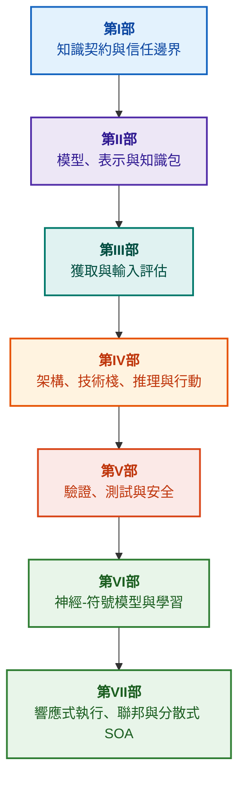

# 證據導向專家系統架構：從形式本體論到神經-符號AI

**關於高可信度智慧系統設計、數學模型、架構與形式驗證的工程專著暨架構師指南（Safety-Critical & Evidence-Grounded AI）**

**作者：** [Mykola Fedchyk](about-the-author.md) · [LinkedIn](https://www.linkedin.com/in/nickfedchik/)  
**體裁：** 工程專著 / AI 架構師案頭寶典  
**年份：** 2026  

---

## 關於本書

本書是一部奠基性的專著研究與工程指南，致力於克服現代人工智慧的核心危機：神經網路生成的機率合理性與形式數學證明的確定性真理之間的「認識論鴻溝（Epistemic Gap）」。本研究的核心問題是：**如何設計一套專家系統，使其每一個結論都無懈可擊、可完全溯源至原始證據來源，並能夠在安全攸關的工程領域（ISO 26262、IEC 61508、DO-178C、ISO/SAE 21434）通過嚴格的認證？**

作者論證並確立了全新的範式：**證據導向神經-符號 AI（Evidence-Grounded Neuro-Symbolic AI）**。在該範式中，統計模型（LLM/SLM）扮演諮詢角色，負責生成查詢假說與投影渲染；而確定性符號核心則嚴格保證邏輯一致性、字節級事實紮根、權限邊界控制以及安全轉換為具體行動的不變量。

### 從工程產物到可驗證的決策

系統需求、原始碼、測試日誌、法規標準與工程決策早已存在於現代生產環境中，但它們大多作為孤立的產物存在，缺乏形式化的語義、嚴格的有效邊界與雙向可追溯性。一份通過的資格測試報告可能對應的是過時的硬體版本；功能安全標準的條文可能脫離上下文被引用；緊急配置回滾可能在無意中重新啟動已被廢棄的組件。

本書提出了一條端到端的工程管線：從將工程產物形式化為具型別的資料與密碼學簽名的知識包，到符號推理、分步計畫分解、反事實解釋以及能力邊界審計。實務內容輔以基於 Go 語言實現的工業級模組與完整測試套件（[第1章](ch01-introduction-to-expert-systems.md)）、嚴格的數學契約（[第II部](part-02-knowledge-models.md)），以及被證實能防止迴歸的持續學習協定（[第25章](ch25-how-expert-systems-learn.md)）。

### 目標讀者

本書面向系統架構師、可靠性與功能安全主管工程師、推理引擎開發人員以及知識工程師。掌握核心概念僅需具備一階謂詞邏輯、軟體版本控制與系統生命週期管理的基礎知識；重現書中的實務範例僅需標準的 Go 開發工具。專門探討 Goal Structuring Notation (GSN) 安全論證形式合成、複雜系統協同論、神經形態加速器以及無 GNSS 自主導航的章節，展示了證據導向 AI 在尖端高科技領域（航空太空、自動駕駛、關鍵能源）的前沿應用。

---

## 學術脈絡與本書在全球研究中的定位

本書並未將專家系統視為 1980 年代基於規則的系統（如 CLIPS 或 MYCIN）的過時遺產，而是將其定位為**第三波證據導向神經-符號 AI（Third-Wave Evidence-Grounded Neuro-Symbolic AI）**的前沿。本專著立足於世界領先學派的理論基礎，同時弭平了抽象數學模型與高效能系統工程之間的鴻溝：

| 學術方向 | 全球核心著作與學者 | 本書中的概念橋樑 |
|---|---|---|
| **第三波神經-符號 AI (NeSy)** | Artur d'Avila Garcez, Luis C. Lamb (*Neurosymbolic AI: The 3rd Wave*, 2023; *Neural-Symbolic Cognitive Reasoning*, Springer, 2009); Henry Kautz (*The Third AI Summer*, AAAI 2022) | 職責分離：統計模型（SLM/LLM）生成查詢假說，確定性符號核心形式驗證並認可事實（[第29章](ch29-neuro-symbolic-architecture.md)）。 |
| **語義約束與安全學習** | Guy Van den Broeck et al. (*A Semantic Loss Function for Deep Learning with Symbolic Knowledge*, ICML 2018); Luc De Raedt et al. (*DeepProbLog*, IJCAI 2020) | 輸入與輸出准入閘道，基於形式綱要對神經網路候選輸出進行確定性語義過濾（[第28章](ch28-dual-mode-expert-systems.md)、[第33章](ch33-inter-system-knowledge-exchange-and-model-teaching.md)）。 |
| **可撤銷推理與論證理論** | John L. Pollock (*Defeasible Reasoning*, 1987; *Cognitive Carpentry*, MIT Press, 1995); Phan Minh Dung (*Abstract Argumentation Frameworks*, AIJ 1995); Douglas Walton (*Argumentation Schemes*, Cambridge, 2008) | 將知識分解為主幹主張、來源出處與反駁因素（*rebutting* 與 *undercutting defeaters*）；使用 Dung 抽象論證框架解決法規知識庫中的衝突（[第2章](ch02-epistemology-of-machine-knowledge.md)、[第27章](ch27-safety-case-gsn-synthesis.md)）。 |
| **關聯規則自主挖掘 (KBC)** | Luis Galárraga, Fabian M. Suchanek et al. (*AMIE: Association Rule Mining under Incomplete Evidence*, WWW 2013, VLDBJ 2015); Stephen Muggleton (*Inductive Logic Programming*, 1994) | 在部分完備性假設（PCA）下從知識庫中自主歸納關聯規則，消除開放世界的虛假反例（[第34章](ch34-deterministic-relational-analysis-abduction-and-socratic-dialogue.md)）。 |
| **形式安全防護罩與認證 (Safe AI)** | Bettina Könighofer, Roderick Bloem et al. (*Shield Synthesis*, 2017); Tim Kelly, Rob Weaver (*Goal Structuring Notation*, York, 2004); André Platzer (*Logical Foundations of CPS*, Springer, 2018) | 依照 ISO 26262/21434 標準以 GSN 記號合成安全案例；為外圍致動器提供形式防護罩與數值有效性包絡（[第27章](ch27-safety-case-gsn-synthesis.md)、[第30章](ch30-safety-cybersecurity-co-engineering.md)、[第33章](ch33-inter-system-knowledge-exchange-and-model-teaching.md)）。 |
| **認識論邏輯與知識符號學** | John F. Sowa (*Knowledge Representation: Logical, Philosophical, and Computational Foundations*, 2000); Frank van Harmelen et al. (*Handbook of Knowledge Representation*, Elsevier, 2008) | 查爾斯·桑德斯·皮爾士的認識論三元組（概念 → 判斷 → 推理）；在嚴格演繹控制下對工作假說進行溯因推理（[第6章](ch06-applied-mathematics-for-expert-systems.md)、[第34章](ch34-deterministic-relational-analysis-abduction-and-socratic-dialogue.md)）。 |
| **控制論與複雜系統協同論** | Norbert Wiener (*Cybernetics*, 1948); W. Ross Ashby (*An Introduction to Cybernetics*, 1956); Hermann Haken (*Synergetics: An Introduction*, 1977; *Advanced Synergetics*, 1983); Ilya Prigogine (*Order out of Chaos*, 1984) | 艾許比的必要多樣性定律、L0–L4 閉環控制、哈肯役使原理將狀態空間約化為序參量、透過臨界減速（CSD）預警相變，以及知識庫的耗散結構穩定化（[第6章](ch06-applied-mathematics-for-expert-systems.md)、[第22章](ch22-cybernetics-edge-to-backend.md)、[第35章](ch35-self-organizing-expert-systems-synergetics-and-npu-runtime.md)）。 |
| **知識測試、語言不變性與利普希茨校準** | Kent Beck (*TDD*, 2002); Martin Fowler (*Refactoring*, 2018); Clark Barrett, Leonardo de Moura (*Z3 SMT Solver*, 2008); Chuan Guo et al. (*On Calibration of Modern Neural Networks*, ICML 2017); Marco Tulio Ribeiro et al. (*CheckList*, ACL 2020); John L. Pollock (*Defeasible Reasoning*, 1987) | 四層知識測試金字塔（KTP）：帶前提模擬（`PremiseMock`）的原子規則單元測試（KUT）、消除空洞真陷阱、6 點譜系邊界值分析（BVA）、規則格與反駁因素（KIT）、面對語言變化的語義不變性評分（$\text{SIS} \ge 0.98$）、防止繼電器抖動的利普希茨連續性約束（$L_{\mathcal{K}} \le L_{\max}$），以及共識痕跡知識空缺累積（[第36章](ch36-knowledge-testing-pyramid-and-variational-calibration.md)）。 |

---

## 作者的原創理論模型、科學研究與工程創新

本專著總結了作者在安全攸關系統設計、嵌入式架構以及證據導向 AI 領域的奠基性研究與工程實踐。與純粹的文獻綜述不同，本書提出了一系列原創形式理論、協定與架構模式，首次將神經-符號交互提升至可進行數學驗證的可信水準：

### 1. 基礎理論模型與嚴格數學形式化

1. **證據紮根不變量 (EGI) 與事實准入閘道（[第2章](ch02-epistemology-of-machine-knowledge.md)、[第19章](ch19-from-question-to-evidence.md)、[第28章](ch28-dual-mode-expert-systems.md)、[第29章](ch29-neuro-symbolic-architecture.md)）：**
   * *理論構想：* 作者建立並形式化了紮根完備性不變量 $\mathrm{Comp}(C) = 1.00$，規定在證據導向系統中，任何主張若未確定性投影至權威一級知識來源，均不得賦予被認可事實的地位。事實庫中的每個條目均附帶密碼學元組：不可變字節偏移 `[byte_start, byte_end]`、規範片段雜湊 `quote_sha256`，以及 PROV-O 出處證書識別碼。
   * *工程意義：* 字節級准入閘道在軟硬體邊界處徹底杜絕了神經網路幻覺滲透入受版本控制的知識庫中，確保對無憑據數據零容忍（$ZHR = 1.00$）。
2. **四層知識測試金字塔 (KTP) 與推理空間利普希茨穩定性（[第36章](ch36-knowledge-testing-pyramid-and-variational-calibration.md)）：**
   * *理論構想：* 作者首次提出了系統化的知識測試金字塔（KTP），將馬丁·福勒的測試金字塔規則引入知識系統：隔離前提（`PremiseMock`）的規則單元測試（KUT）、規則交互與反駁因素的整合測試（KIT），以及在查詢多樣體上的變分校準（KVT）。
   * *數學機制：* 定義了消除空洞真的不變量（當 $P \equiv \text{False}$ 時的 $P \to Q$）、語言擾動下的語義不變性度量（$\mathrm{SIS} \ge 0.98$），以及推理空間利普希茨連續性約束（$L_{\mathcal{K}} \le L_{\max}$），從數學上杜絕微小輸入擾動導致的災難性繼電器抖動。
3. **波普爾規範證偽理論與主動合規審計員（[第39章](ch39-active-compliance-auditor-and-popperian-testing.md)）：**
   * *理論構想：* 實現從僅僅回答問題的傳統「被動神諭」到踐行卡爾·波普爾證偽原則的主動知識審計範式的轉變。系統自主探測需求空間（ASPICE 4.0、ISO 26262、ISO/SAE 21434），合成反例，識別不完整規格，並自主設計產品的全套驗證方案。
   * *實用價值：* 將神經網路對邊界場景的創造性生成（System 1）與符號核心的確定性道義驗證（System 2）相結合，有效防止控制迴路中的操作人員（Human-in-the-Loop）產生審批疲勞。
4. **知識庫維度的協同縮約與 CSD 早期診斷（[第6章](ch06-applied-mathematics-for-expert-systems.md)、[第22章](ch22-cybernetics-edge-to-backend.md)、[第35章](ch35-self-organizing-expert-systems-synergetics-and-npu-runtime.md)）：**
   * *理論構想：* 將赫爾曼·哈肯的協同論數學工具（序參量與役使原理）及伊利亞·普里高津的耗散結構理論應用於複雜知識庫的演化。
   * *科學成果：* 開發了將遙測多維狀態空間縮約為序參量的方法，並整合了基於自相關與方差的臨界減速（*Critical Slowing Down*, CSD）前饋探測器，在緊急閾值感測器觸發前及早預警動態失穩。
5. **行動自主性等級 (A0–A4) 模型、授權閘道與等冪長篇交易（[第21章](ch21-from-recommendation-to-action.md)）：**
   * *理論構想：* 制定了系統行動權限的離散尺度（A0：被動分析、A1：草案準備、A2：人工簽署執行、A3：受控自主、A4：緊急安全切斷），該權限並非賦予整個系統，而是賦予「行動、環境、風險等級」三元組。
   * *數學機制：* 引入基於密碼學金鑰 $k$ 的代數等冪不變量 $f(f(x, k), k) \equiv f(x, k)$、分步閉環執行，以及帶有 `OutcomeUnknown` 狀態且獨立驗證後置條件的分散式補償長篇交易（Saga）協定。
6. **GSN 記號下功能安全與網路安全的形式協同工程（[第27章](ch27-safety-case-gsn-synthesis.md)、[第30章](ch30-safety-cybersecurity-co-engineering.md)）：**
   * *理論構想：* 建立了目標結構化記號（GSN）論證樹的協調合成模型，同時滿足 ISO 26262（功能安全）與 ISO/SAE 21434（網路安全）的嚴格標準。
   * *工程突破：* 形式化了衝突目標間的數學仲裁（緊急響應時間預算 vs 密碼學認證深度），並建立了利用加鹽默克爾樹向外部審計員選擇性披露證據的安全協定。
7. **解釋真實性與語義一致性驗證協定（[第20章](ch20-explanation-engine.md)）：**
   * *理論構想：* 解釋不再被視為生成模型自由生成的文字，而是作為由證明圖、規則版本與固定事實快照唯一導出的確定性產物。
   * *數學機制：* 形式化了真實性度量閘道（$C_{\text{facts}} = 1.00, H_{\text{free}} = 1.00$），一旦符號推理與操作員文字呈現之間出現任何微小差異，自動安全退回至剛性模板。

---

### 2. 經驗實證研究、作者實驗台與系統工程

1. **基於 `mmap` 與零反序列化的不可變二進位知識包（[第32章](ch32-high-performance-knowledge-packs-mmap-and-harvesting.md)）：**
   * *作者原創：* 知識包雙層架構（原始來源的正準層 + 索引的衍生實體化層）。
   * *實證成果：* 透過系統呼叫 `mmap` 將索引直接映射至虛擬位址空間，完全消除動態記憶體分配開銷（zero-allocation），使引擎在次線性時間內啟動，無論本體容量達到多少吉字節（GB）。
2. **基於 IETF RFC-1000 與 W3C-150 規範語料庫的經驗校準平台（[第2章](ch02-epistemology-of-machine-knowledge.md)、[第4章](ch04-evolution-from-bayes-to-evidence-ai.md)、[第14章](ch14-requirements-detection-and-formalization.md)、[第25章](ch25-how-expert-systems-learn.md)）：**
   * *作者實驗：* 針對 1000 份現行 IETF RFC 規範（分佈於網際網路發展的 5 個歷史紀元）以及 W3C 語料庫中的 150 個複雜診斷查詢（包括人工注入的邏輯衝突與虛談）部署了大規模研究實驗台。
   * *實用成果：* 建立了客觀的知識考試矩陣，檢測規範衝突，並從數學上證明了知識庫更新時的防迴歸保護。
3. **多步關聯分析、符號溯因與蘇格拉底式對話（[第34章](ch34-deterministic-relational-analysis-abduction-and-socratic-dialogue.md)）：**
   * *作者開發：* 雙向有界廣度優先搜尋演算法（Bidirectional Bounded BFS, $k \le 6$），具備循環防止功能，可為任意相互關聯的實體形成複合字節級證據鏈。
   * *工程優勢：* 在嚴格演繹控制下實現皮爾士符號溯因，並提供具型別的蘇格拉底式澄清框架（*Clarification Frames*），引導系統與人類展開建設性對話，而非在封閉世界假設（CWA）下盲目拒絕。
4. **外圍控制系統的形式防護罩與數值有效性包絡（[第33章](ch33-inter-system-knowledge-exchange-and-model-teaching.md)、[附錄乙](appendix-b-robotics-and-cyber-physical-systems.md)、[附錄丙](appendix-c-autonomous-navigation-and-geosearch.md)、[附錄戊](appendix-e-mixed-signal-neuromorphic-expert-systems.md)）：**
   * *作者原創：* 將離散邏輯不變量轉換為數位訊號處理器（DSP）與無 GNSS 自主導航（TRN/DSMAC/VIO）連續數值安全走廊的方法學。
   * *實用可靠性：* 基於 Ed25519 密碼學的簽名規則交換、候選知識的安全隔離檢疫，以及在硬體層級切斷危險控制信號。
5. **防止透過解釋外洩機密資訊與差異審計（[第20章](ch20-explanation-engine.md)）：**
   * *作者開發：* 解釋中間表示精簡協定（$\mathrm{EIR}_{\text{redacted}}$），對證明圖的每個節點和邊緣執行 ACL 檢查，阻斷透過連續對比性「WHY NOT」查詢進行模型重構的側信道攻擊。

---

## 體系劃分與分類原則

本書各部分的劃分取決於核心工程任務，而非章節撰寫年份或特定技術名稱。每個章節均有其所屬的主要部分；鄰近方法解釋了其核心問題的解決之道。章節編號與檔案名稱作為永久識別碼予以保留，因此主題閱讀順序可能與數字順序有所不同。

各章內的段落標題屬於若干不同的類別。應將其作為論證脈絡的循序推進來閱讀，而非同等技術的並列清單：

| 章節類別 | 讀者思考的問題 | 在章節中的功能 |
|---|---|---|
| 問題與任務邊界 | 究竟需要解決什麼？ | 定義核心問題與適用範圍 |
| 物件與模型 | 考量何種資料、知識或狀態？ | 統一概念、型別與假設 |
| 方法與程序 | 如何獲得所需結果？ | 闡釋推理、轉換或控制邏輯 |
| 實作與工具 | 透過何種工具執行程序？ | 展示方法的軟體或硬體落實 |
| 驗證與對照案例 | 如何及早發現錯誤？ | 將結果與獨立標準進行對照檢驗 |
| 結論與結果邊界 | 何者已獲證實，何者仍未確定？ | 回答核心問題，避免過度承諾 |

國家、行業或商業產品僅為應用場景，並非本分類法中的獨立層級。術語表、縮略詞、參考文獻與導航構成輔助工具，並非獨立的主題章節。

完整的[編輯審查地圖](editorial-structure-review.md)包含對每章主要主題的評估、相鄰論述之間的邊界，以及對結構與結論的意見。新增的導言並不意味著章節內的所有內容風險均已消除。

## 推薦閱讀路徑

**首次軟體驗證：** [1](ch01-introduction-to-expert-systems.md) → [7](ch07-knowledge-base-typology.md) → [8](ch08-engineering-artifacts-as-data.md) → [17](ch17-implementation-stack.md) → [23](ch23-knowledge-base-verification.md) → [25](ch25-how-expert-systems-learn.md)。目標：獲得可重現的、具備證據支撐的結論，配合負面測試與受控的知識演進。語言模型並非必要。

**知識工程：** [第II部](part-02-knowledge-models.md) → [第III部](part-03-knowledge-engineering-nlp.md) → [19](ch19-from-question-to-evidence.md) → [20](ch20-explanation-engine.md) → [26](ch26-continual-learning.md)。目標：協調語義、來源出處、知識獲取與新候選知識的驗證。第II部完整保留了第7–11章的跨部科學測試計畫。

**解決方案架構：** [16](ch16-expert-systems-architecture.md) → [19](ch19-from-question-to-evidence.md) → [31](ch31-syllogistic-reasoning-and-relation-lattices.md) → [20](ch20-explanation-engine.md) → [21](ch21-from-recommendation-to-action.md)。目標：明確分離證據基礎的檢驗、規範的適用、解釋的生成與行動權限的授予。

**驗證與安全：** [23](ch23-knowledge-base-verification.md) → [36](ch36-knowledge-testing-pyramid-and-variational-calibration.md) → [25](ch25-how-expert-systems-learn.md) → [26](ch26-continual-learning.md) → [27](ch27-safety-case-gsn-synthesis.md) → [30](ch30-safety-cybersecurity-co-engineering.md)。外部系統的診斷透過[第24章](ch24-system-diagnosis.md)提供專門入口。

**混合應答與運維：** [第VI部](part-06-frontiers-neuro-symbolic.md) → [第VII部](part-07-runtime-and-knowledge-exchange.md) → [40](ch40-distributed-epistemic-architectures-soa-and-cluster-scaling.md) 及相應附錄。目標：整合語言模型、管理知識空缺、建構分散式知識服務架構並驗證系統間共享。[第2章](ch02-epistemology-of-machine-knowledge.md)、[第4章](ch04-evolution-from-bayes-to-evidence-ai.md)與[第6章](ch06-applied-mathematics-for-expert-systems.md)可根據具體需求作為契約、歷史與數學指南閱讀。

---

## 工程承諾的界限

本書為教學與研究資料，並非認證合格的法定程序，亦非產品符合特定標準的法定證明。確定性執行並不能直接證明事實的真實性；雜湊值與數位簽名不能證明絕對客觀真理；論證圖無法替代人類專家的專業評估。整機產品的可靠性要求不得等同於語言模型的錯誤率，亦不得任意推廣至所有軟體組件。

自動化語法解析可減少人工數據轉錄，但並不能取代領域建模、同行評審與知識所有者的職責。Protégé、人工審查與自動收集可相輔相成。數學保證僅適用於特定的語言設定檔與假設條件；實測處理速度僅對應於受測的特定查詢、語料庫與環境。作者的歷史實測記錄與開放式教學實驗台及未完成的研究明確區隔。

產品發布、風險承擔以及法規合規性的最終決定權，始終掌握在獲得授權的人類專家手中。專家系統負責準備可驗證的材料並落實既定的政策，但其本身不具備任何監管或法定權限。

---

## 全書結構

本書由七個主題部分、40 個章節和五個附錄組成。每個章節均有其所屬的主要部分。導航中的上一章和下一章均遵循以下主題順序；章節編號與檔案名稱均完整保留。

---

### [第I部 概念與認識論基礎](part-01-foundations.md)

*何時需要專家系統、何者可視為知識，以及如何完整保留組織決策的客觀依據。*

* [第1章 專家系統導論：從混沌到受控知識](ch01-introduction-to-expert-systems.md)
* [第2章 工程師的認識論：機器有權將何者稱為知識](ch02-epistemology-of-machine-knowledge.md)
* [第3章 專家系統與一般資訊參考系統之根本差異](ch03-beyond-reference-information-systems.md)
* [第4章 專家系統的演進：從貝氏定理到證據導向 AI 解決方案](ch04-evolution-from-bayes-to-evidence-ai.md)
* [第5章 信任三元組：專家系統、證據導向建議與企業記憶](ch05-triad-of-trust-and-corporate-memory.md)

---

### [第II部 數學模型、知識表示與知識儲存](part-02-knowledge-models.md)

*數學運算與表示的選擇、具型別產物、可追溯性圖譜與不可變知識包。*

* [第6章 專家系統應用數學：規則、機率、圖譜與因果關係](ch06-applied-mathematics-for-expert-systems.md)
* [第7章 知識庫類型學：規則、本體、案例與向量](ch07-knowledge-base-typology.md)
* [第8章 作為專家系統資料的工程產物](ch08-engineering-artifacts-as-data.md)
* [第9章 工程知識圖譜：從需求到硬體的全程追溯](ch09-engineering-knowledge-graph-traceability.md)
* [第32章 不可變知識包：字節級准入、索引與記憶體映射](ch32-high-performance-knowledge-packs-mmap-and-harvesting.md)

---

### [第III部 知識獲取、語言分析與輸入評估](part-03-knowledge-engineering-nlp.md)

*文檔、專家經驗與觀測：候選知識獲取、語言分析、形式化與證據評估。*

* [第10章 知識獲取系統：來源、准入與生命週期](ch10-knowledge-acquisition-systems.md)
* [第11章 從專家萃取知識：訪談、認知地圖與經驗形式化](ch11-knowledge-elicitation-from-experts.md)
* [第12章 語言學分析與本地模型：保留語義與出處來源](ch12-linguistic-analysis-and-local-models.md)
* [第13章 自然語言多樣性對抗確定性：編譯問題的核心意義](ch13-language-variability-vs-determinism.md)
* [第14章 需求與模態偵測：從法規條文到系統不變量](ch14-requirements-detection-and-formalization.md)
* [第15章 知識抽取與知識庫建構：事實、文法與自動機](ch15-knowledge-extraction-and-kb-construction.md)
* [第37章 輸入資訊評估：來源、證據與不確定性](ch37-input-information-assessment-and-algorithmic-skepticism.md)

---

### [第IV部 架構、技術棧、推理與行動](part-04-architecture-and-inference.md)

*架構契約、技術棧、硬體執行、主張驗證、基於規範的推理、解釋機制與控制論反饋迴路。*

* [第16章 專家系統架構：從形式知識到證據導向決策](ch16-expert-systems-architecture.md)
* [第17章 技術棧：工具、程式語言與規則引擎的選型標準](ch17-implementation-stack.md)
* [第18章 執行基礎設施：本地模型、硬體加速器、Edge 與 On-Premise](ch18-execution-infrastructure.md)
* [第19章 從問題到證據：檢索、錨定與主張驗證](ch19-from-question-to-evidence.md)
* [第31章 基於規範的推理：謂詞階層、例外情況與有效性](ch31-syllogistic-reasoning-and-relation-lattices.md)
* [第20章 解釋引擎：決策、拒絕與能力極限](ch20-explanation-engine.md)
* [第21章 從建議到行動：權限控制與生產環境中的安全執行](ch21-from-recommendation-to-action.md)
* [第22章 控制論反饋迴路：感測器、外圍設備與回授](ch22-cybernetics-edge-to-backend.md)

---

### [第V部 驗證、測試、診斷與安全論證](part-05-verification-and-learning.md)

*規則形式驗證、知識測試金字塔、波普爾證偽、技術診斷，以及功能安全與網路安全論證。*

* [第23章 知識庫驗證：如何檢查規則的一致性、完備性與可靠性](ch23-knowledge-base-verification.md)
* [第36章 知識測試金字塔：規則、交互與回答穩定性](ch36-knowledge-testing-pyramid-and-variational-calibration.md)
* [第39章 主動專家測試員：波普爾證偽、法規合規性（ASPICE/ISO 26262/ISO 21434）與自主測試設計](ch39-active-compliance-auditor-and-popperian-testing.md)
* [第24章 技術診斷：在資訊不完備條件下如何避免混淆徵狀與根因](ch24-system-diagnosis.md)
* [第27章 安全論證：論據合成與驗證](ch27-safety-case-gsn-synthesis.md)
* [第30章 功能安全與網路安全協同工程](ch30-safety-cybersecurity-co-engineering.md)

---

### [第VI部 神經-符號模型、認知前沿與持續學習](part-06-frontiers-neuro-symbolic.md)

*嚴格推論與諮詢假說、語言模型整合、知識缺口、無憑據回答控制、考試矩陣與實踐持續學習。*

* [第28章 雙模式專家系統：嚴格推理與諮詢假說](ch28-dual-mode-expert-systems.md)
* [第29章 神經-符號架構：語言模型與證據依據驗證](ch29-neuro-symbolic-architecture.md)
* [第34章 知識空缺：關聯搜尋、溯因與澄清對話](ch34-deterministic-relational-analysis-abduction-and-socratic-dialogue.md)
* [第38章 機器幻覺與知識匱乏：基於證據的應答控制](ch38-curing-machine-hallucinations-and-knowledge-deficits.md)
* [第25章 如何訓練專家系統：考試矩陣、知識審計與迴歸控制](ch25-how-expert-systems-learn.md)
* [第26章 經驗實踐中的持續學習（Continual Learning）與克服系統日誌漂移](ch26-continual-learning.md)

---

### [第VII部 響應式執行、系統間知識交換與分散式 SOA](part-07-runtime-and-knowledge-exchange.md)

*規則響應式執行、協同論與知識相變、跨系統知識交換，以及企業級分散式認識論架構。*

* [第35章 響應式專家系統：事件、撤銷與知識調適](ch35-self-organizing-expert-systems-synergetics-and-npu-runtime.md)
* [第33章 跨系統知識共享：向外部系統分發規則、模型教學與安全反饋](ch33-inter-system-knowledge-exchange-and-model-teaching.md)
* [第40章 證據導向專家系統的分散式架構：認識論 SOA、語義路由、記憶體階層與多源可撤銷仲裁](ch40-distributed-epistemic-architectures-soa-and-cluster-scaling.md)

---

### 附錄

* [附錄甲 複雜工程專案中證據導向研究的實用框架](appendix-a-evidence-governed-framework.md)
* [附錄乙 自主機器人與賽博-物理複合體中的證據導向專家系統](appendix-b-robotics-and-cyber-physical-systems.md)
* [附錄丙 無 GNSS 自主導航：地理空間匹配（TRN/DSMAC）、視覺測程（VIO）與感測器融合的專家仲裁](appendix-c-autonomous-navigation-and-geosearch.md)
* [附錄丁 類比專家系統、神經形態計算與硬體邏輯推理](appendix-d-analog-expert-systems-and-neuromorphic-computing.md)
* [附錄戊 混合訊號類比-數位專家系統：證據監督下的神經形態、類比與非傳統計算](appendix-e-mixed-signal-neuromorphic-expert-systems.md)
* [關於作者：Mykola Fedchyk (Nick Fedchik)](about-the-author.md)

---

## 未來研究方向

未來的研究方向並非現成的保證：知識包的可重現建構；受限形式表示的驗證；透過明確授權管理自主代理；特定形式化主張的保密驗證；受控撤銷與機器遺忘（machine unlearning）研究。證明模型的屬性並不自動等同於物理產品的合規性，而刪除一條規則亦不等於完全消除該數據對已訓練模型的影響。

對於硬體加速器與非傳統計算架構，首先必須嚴格測量其誤差率、延遲、能耗以及在故障狀態下的行為表現。相關問題在[第29章](ch29-neuro-symbolic-architecture.md)、[第32章](ch32-high-performance-knowledge-packs-mmap-and-harvesting.md)以及[附錄丁](appendix-d-analog-expert-systems-and-neuromorphic-computing.md)和[附錄戊](appendix-e-mixed-signal-neuromorphic-expert-systems.md)中進行了深入探討。第7–11章的實務研究計畫詳見[第II部](part-02-knowledge-models.md)：每項提案均包含明確的假說、對照組比較與證偽條件。
