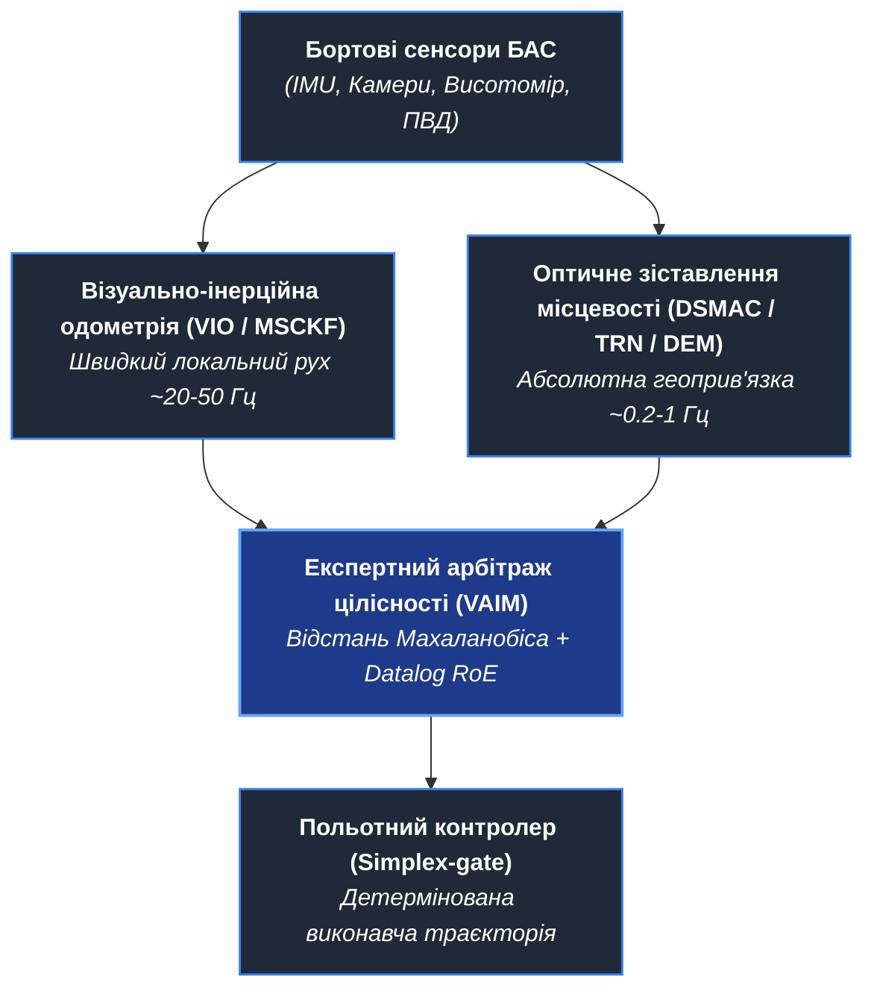
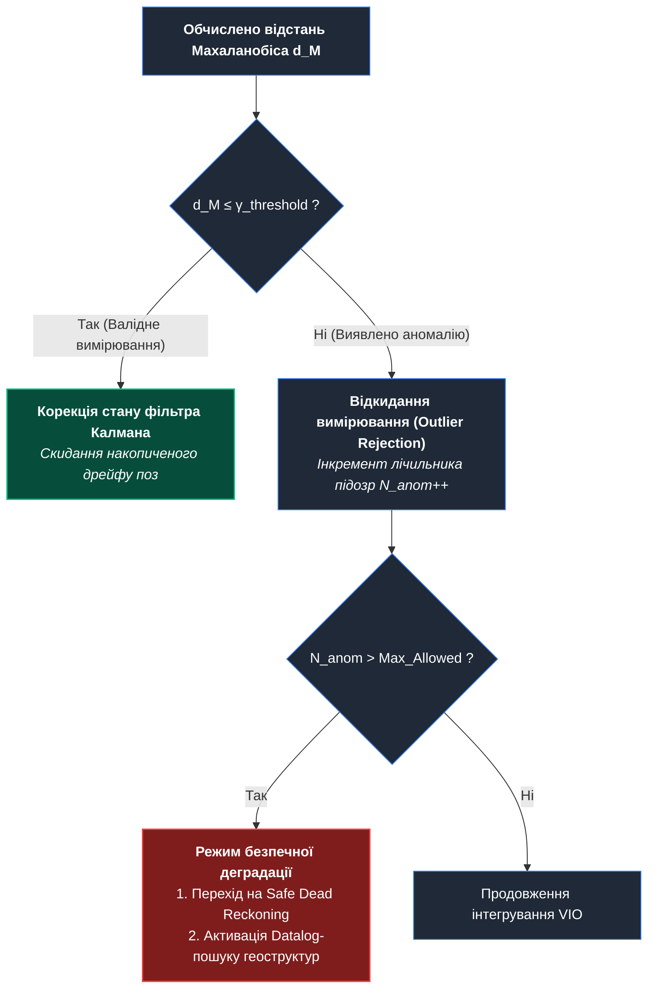
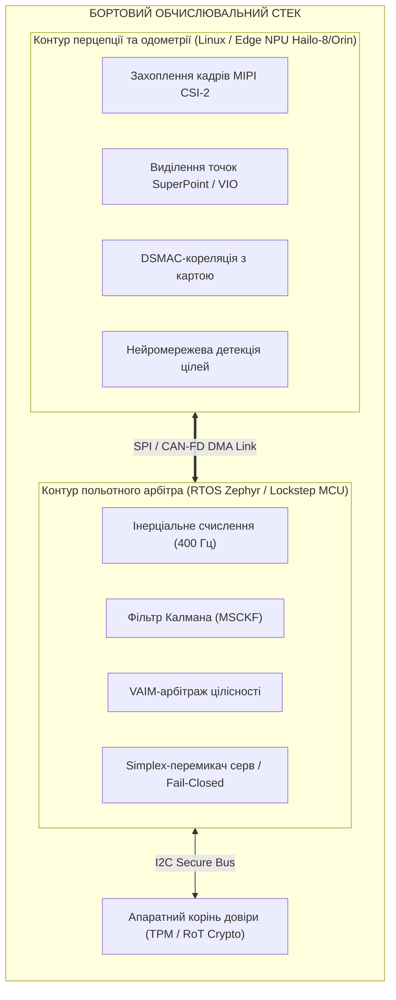

# Автономна навігація БАС без GNSS: VIO, DSMAC та експертний арбітраж цілісності (VAIM) в умовах тотального РЕБ

> [!NOTE]
> Цей матеріал є інженерно-аналітичною статтею з циклу прикладного MilTech та військової кібернетики. Він розкриває математичні та архітектурні засади створення навігаційних комплексів для безпілотних авіаційних систем (БАС) в умовах повної недоступності або навмисного спуфінгу супутникових сигналів, у синергії з монографією [«Експертні системи: інженерія знань, нейросимволічні архітектури та доказовий ШІ»](../ExpertSystem/book/README.md) (зокрема [Додатком В: Автономні навігаційні та геопошукові експертні системи](../ExpertSystem/book/appendix-c-autonomous-navigation-and-geosearch.md)).
>
> **Пов'язані статті серії:**
>
> - [Експертні системи для БАС, ППО, РЕР та РЕБ](DOU-Military-Expert-Systems-UAS-AD-ELINT-EW-UA.md)
> - [Військова кібернетика в дії: C4ISTAR, моделювання та кіберфізичні системи](DOU-Military-Cybernetics-In-Action-UA.md)
> - [Ройовий інтелект і координація гетерогенних роботокомплексів](DOU-Swarm-Intelligence-And-Heterogeneous-Robotics-UA.md)
> - [Апаратний корінь довіри (Hardware Root of Trust) та антиспуфінг у MilTech IoT](DOU-Hardware-Root-Of-Trust-And-Anti-Spoofing-Military-IoT-UA.md)

---

## 1. Проблема супутникової залежності на сучасному ТВД

Сучасний театр воєнних дій остаточно зруйнував ілюзію щодо надійності супутникової навігації (GNSS — GPS, GLONASS, Galileo, BeiDou). В умовах ешелонованої радіоелектронної боротьби (РЕБ) використання супутникових сигналів наражається на два критичні виклики:

1. **Тотальне радіоелектронне придушення (Jamming):** придушення слабких супутникових сигналів (потужність на поверхні Землі складає близько $-160\text{ dBW}$) широкосмуговим шумом у діапазонах L1/L2/L3 на дистанціях у десятки й сотні кілометрів.
2. **Координований просторово-часовий спуфінг (Spoofing):** підміна справжніх навігаційних сигналів фальшивими псевдодальностями, що змушує автопілот БАС фіксувати хибні координати, змінювати курс на контрольовану ворогом територію або переходити у неконтрольоване пікірування.

Класична інерціальна навігаційна система (INS / IMU) на базі мікроелектромеханічних сенсорів (MEMS) тактичного класу не здатна самостійно вирішити проблему тривалого автономного польоту: накопичення зміщення нуля гіроскопів (bias drift) та інтегрування шуму акселерометрів призводить до квадратичного зростання похибки координат за часом ($E_{pos} \propto t^2$). За 10–15 хвилин польоту в умовах радіомовчання похибка комерційного MEMS-IMU може перевищувати кілька кілометрів.

Виходом є побудова **багатомодальної автономної навігаційної системи без GNSS**, яка об'єднує інерціальні дані, візуальну одометрію (VIO), оптичне зіставлення сцени (DSMAC / Scene Matching), кореляцію з цифровими матрицями висот (DEM / DSM) та експертний арбітраж цілісності вимірювань.



---

## 2. Візуально-інерційна одометрія (VIO): локальна орієнтація

Візуально-інерційна одометрія забезпечує оцінку відносного руху БАС між сусідніми кадрами за рахунок інтеграції високочастотних даних IMU ($100\text{--}400\text{ Гц}$) із кадрами монокулярної або стереокамери ($20\text{--}60\text{ Гц}$).

Найбільш стійким для бортових вбудованих платформ є підхід на основі **мультистанційного фільтра Калмана (MSCKF — Multi-State Constraint Kalman Filter)**, реалізований в архітектурах на зразок OpenVINS.

### Математичний апарат стану системи

Вектор стану системи $\mathbf{x}_k$ містить стан інерціального вимірювального блока (IMU) та історію поз камери у вікні ковзання з $N$ кадрів:

```math
\mathbf{x}_k = \begin{bmatrix} \mathbf{x}_{IMU}^T & \mathbf{x}_{C_1}^T & \mathbf{x}_{C_2}^T & \dots & \mathbf{x}_{C_N}^T \end{bmatrix}^T
```

де стан інерціального блока $\mathbf{x}_{IMU}$ описується вектором 16-го або 15-го порядку:

```math
\mathbf{x}_{IMU} = \begin{bmatrix} {}^I_G \mathbf{q}^T & {}^G \mathbf{p}_I^T & {}^G \mathbf{v}_I^T & \mathbf{b}_g^T & \mathbf{b}_a^T \end{bmatrix}^T
```

а стан кожної пози камери $\mathbf{x}_{C_i}$ у вікні ковзання визначається орієнтацією та позицією відносно глобальної СК:

```math
\mathbf{x}_{C_i} = \begin{bmatrix} {}^{C_i}_G \mathbf{q}^T & {}^G \mathbf{p}_{C_i}^T \end{bmatrix}^T
```

Тут:

- ${}^I_G \mathbf{q}$ — одиничний кватерніон орієнтації корпусу щодо глобальної системи координат;
- ${}^G \mathbf{p}_I \in \mathbb{R}^3$ та ${}^G \mathbf{v}_I \in \mathbb{R}^3$ — просторове положення та вектор лінійної швидкості;
- $\mathbf{b}_g \in \mathbb{R}^3, \mathbf{b}_a \in \mathbb{R}^3$ — повільно дрейфуючі нулі гіроскопів та акселерометрів.

Коли камера спостерігає 3D-точку місцевості $f_j$ у кількох кадрах вікна ковзання, формується вектор візуальної нев'язки $r_j = z_j - \hat{z}_j$. На відміну від класичного SLAM, MSCKF маргіналізує координати просторових точок $f_j$, спрощуючи задачу до оновлення лише коваріаційної матриці поз камери без росту обчислювальної складності від кількості орієнтирів.

---

## 3. Цифрове зіставлення оптичної сцени (DSMAC) та рельєфна навігація (TRN)

Хоча VIO усуває високочастотний дрейф IMU, воно є відносною системою: інтеграція помилок призводить до повільного, але невпинного дрейфу траєкторії (близько 0.5–1.5% від пройденої дистанції). Для усунення накопиченої помилки застосовується **корекція за абсолютними геолокованими опорними картами**.

### 1. DSMAC (Digital Scene-Matching Area Correlation)

Бортова оптична або інфрачервона камера фіксує ортогональний знімок земної поверхні $I_{curr}$. Цей знімок зіставляється з попередньо завантаженою у бортову пам'ять геоприв'язаною супутниковою або аерофотокартою еталонного району $I_{ref}$.

Для стійкості до сезонних змін освітлення, снігового покриву та тіней застосовуються два типи зіставлення:

- **Дескрипторне зіставлення на базі глибинних нейромереж (SuperPoint + LightGlue):** інваріантне до кута повороту, масштабу та погодних умов.
- **Нормалізована взаємна кореляція (NCC / ZNCC) градієнтних мап:**

- **Нормалізована взаємна кореляція (NCC / ZNCC) градієнтних мап:**

```math
\text{NCC}(u, v) = \frac{\sum_{x, y} \big(I_{curr}(x, y) - \bar{I}_{curr}\big)\big(I_{ref}(x+u, y+v) - \bar{I}_{ref}(u,v)\big)}{\sqrt{\sum_{x, y} \big(I_{curr}(x, y) - \bar{I}_{curr}\big)^2 \cdot \sum_{x, y} \big(I_{ref}(x+u, y+v) - \bar{I}_{ref}(u,v)\big)^2}}
```

Пік кореляційного відгуку $\max_{(u, v)} \text{NCC}(u, v)$ визначає просторове зміщення БАС $(\Delta x, \Delta y)$ щодо еталонної матриці координат.

### 2. TRN (Terrain Referenced Navigation)

У районах з монотонною оптичною текстурою (степ, лісовий масив, водні плеса) оптичний DSMAC деградує. У таких умовах залучається рельєфна кореляція: радіо- або лідарний висотомір вимірює профіль висоти над землею $h_{alt}(t)$, а барометричний висотомір — барометричну висоту $H_{baro}(t)$.

Різниця формує виміряну висоту рельєфу:

```math
z_{elev}(t) = H_{baro}(t) - h_{alt}(t)
```

Масив точок $z_{elev}(t)$ зіставляється з бортовою цифровою моделлю рельєфу (**DEM / DSM** роздільною здатністю 10–30 м на піксель, наприклад SRTM/Copernicus) за допомогою алгоритму TERCOM або розширеного точкового зіставлення (Point-to-Mesh ICP).

---

## 4. Експертний арбітраж цілісності навігації (VAIM)

Головна небезпека автономного польоту — потрапляння до контуру фільтрації помилкових візуальних або рельєфних відповідностей (наприклад, хибний пік кореляції через однотипні хмари, димову завісу чи ворожі маскувальні сітки).

Для захисту від інтеграції хибних геоприв'язок розроблено протокол **VAIM (Visual Autonomous Integrity Monitoring)** на основі статистичної відстані Махаланобіса та символічного дерева правил:

```math
d_M = \sqrt{\big(z_{DSMAC} - \mathbf{H}\hat{\mathbf{x}}_{k|k-1}\big)^T \mathbf{S}_k^{-1} \big(z_{DSMAC} - \mathbf{H}\hat{\mathbf{x}}_{k|k-1}\big)} \le \gamma_{\text{threshold}}
```

де коваріаційна матриця інновації (нев'язки) $\mathbf{S}_k$ визначається як:

```math
\mathbf{S}_k = \mathbf{H} \mathbf{P}_{k|k-1} \mathbf{H}^T + \mathbf{R}
```

Тут:

- $z_{DSMAC}$ — абсолютна координата, обчислена алгоритмом зіставлення знімка;
- $\hat{\mathbf{x}}_{k|k-1}$ — екстрапольований вектор стану за візуально-інерційним фільтром;
- $\mathbf{P}_{k|k-1}$ — апріорна коваріаційна матриця невизначеності стану БАС;
- $\mathbf{R}$ — коваріаційна матриця похибки вимірювання DSMAC;
- $\mathbf{H}$ — матриця спостереження (проекція стану на координати вимірювання).

### Логіка арбітражу цілісності



---

## 5. Топологічний геопошук на базі декларативних правил Datalog

Коли оптичне зіставлення текстур (DSMAC) зазнає труднощів через зміну пір року (наприклад, еталонна літня супутникова карта проти засніженого зимового ландшафту), піксельна кореляція відмовляє. У такому випадку система переходить на **топологічний пошук інваріантних геоструктур**.

Бортова модель сегментації виділяє лінійні та вузлові об'єкти: перехрестя доріг, залізничні колії, річкові русла, лінії високовольтних передач. Геометрія сцени формалізується у вигляді реляційних фактів і перевіряється Datalog-рушієм:

```prolog
% Визначення топологічного перехрестя доріг
road_junction(J, Road1, Road2, Angle) :-
    road_segment(Road1),
    road_segment(Road2),
    Road1 \= Road2,
    intersects(Road1, Road2, J),
    intersection_angle(Road1, Road2, Angle).

% Ідентифікація опорного навігаційного орієнтира
nav_waypoint_match(ObservedJunction, MapWaypointId) :-
    road_junction(ObservedJunction, R1, R2, AngleObs),
    db_waypoint(MapWaypointId, R1_Type, R2_Type, AngleExpected, GeoCoords),
    angle_tolerance(AngleObs, AngleExpected, 10.0),
    match_road_types(R1, R1_Type),
    match_road_types(R2, R2_Type).
```

Символічний підхід дозволяє розпізнати топологічний вузол навіть за умови, що дорожнє полотно частково вкрите водою або брудом, оскільки геометрія кутів сходження доріг залишається незмінною.

---

## 6. Термінальне оптичне самонаведення та правила ведення дій (RoE)

На термінальній ділянці польоту автономний БАС стикається з необхідністю точного захоплення цільового об'єкта в умовах відсутності радіозв'язку з оператором.

Для унеможливлення помилкового ураження нецільових або цивільних об'єктів бортовий контролер виконує детерміновану верифікацію **Правил ведення бойових дій (Rules of Engagement, RoE)**:

1. **Критерій довіри класифікатора (Confidence Gate):** поріг детекції цілі бортовим NPU має задовольняти умову $C_{det} \ge 0.88$ протягом не менше ніж $N=5$ послідовних кадрів.
2. **Критерій кінематичної несуперечливості:** кутова швидкість лінії візування $\dot{\lambda}$ не повинна перевищувати фізично можливих меж перевантаження борту $n_y \le n_{max}$.
3. **Заборона супутніх руйнувань (No-Collateral Constraint):** радіус ураження не повинен перетинатися з геозонами, маркованими у бортовій карті як захищені (лікарні, житлова забудова, об'єкти критичної цивільної інфраструктури).
4. **Контракт аварійного зриву атаки (Fail-Closed Abort):** якщо в останні $T_{crit} = 1.5\text{ с}$ оптичний супровід втрачено або відстань Махаланобіса між вектором руху та візуальним трекером перевищила допустиму дельту, БАС зобов'язаний виконати команду відведення на безпечний сектор (Abort Dive) або самоліквідацію у визначеному безпечному коридорі.

---

## 7. Бортова апаратно-програмна реалізація

Для гарантії надійності обчислювальний комплекс БАС будується за **двоконтурною гетерогенною архітектурою**:



- **Високопродуктивний контур перцепції:** процесорний модуль на базі ARM Cortex-A + NPU (Hailo-8 / NVIDIA Jetson Orin Nano). Відповідає за ресурсомісткі задачі: обробку відеопотоку з камери, інференс нейромереж детекції, зіставлення оптичних дескрипторів та пошук кореляцій за картою.
- **Детермінований польотний контролер:** мікроконтролер із двоядерною архітектурою Lockstep (STM32H7 / Infineon AURIX TC3xx), що функціонує під управлінням сертифікованої RTOS реального часу (Zephyr RTOS / FreeRTOS). Здійснює опитування IMU з частотою 400 Гц, розрахунок фільтра Калмана, виконання Datalog-правил RoE та безпосередню генерацію ШІМ-сигналів на рульові машинки та двигуни.
- **Апаратний корінь довіри (Root of Trust):** криптографічний чип (Microchip ATECC608 або вбудований TPM), що забезпечує захищене зберігання ключів автентифікації польотного завдання, перевірку підпису прошивки (Secure Boot) та шифрування телеметричних журналів польоту.

---

## 8. Висновки

Автономна навігація БАС в умовах сучасного радіоелектронного придушення не може спиратися на один універсальний сенсор. Стійкість системи досягається виключно **гібридизацією фізичних вимірювань і багаторівневим експертним арбітражем**:

1. Високочастотна візуально-інерційна одометрія (VIO) забезпечує короткострокову плавність і точність траєкторії.
2. Цифрове зіставлення сцени (DSMAC) та рельєфна навігація (TRN) періодично усувають просторовий дрейф координат.
3. Статистичний арбітраж цілісності (VAIM) унеможливлює потрапляння хибних орієнтирів до контуру оцінки стану.
4. Декларативні правила Datalog забезпечують топологічну прив'язку за інваріантними об'єктами навіть за повної зміни пір року.
5. Детерміновані правила RoE та апаратна Simplex-ізоляція гарантують безпеку та контрольованість застосування комплексу.

Така архітектура перетворює безпілотний літальний апарат із вразливої дистанційно керованої платформи на автономну, стійку до РЕБ кіберфізичну систему з доказовою математичною базою.

---

## Посилання

- [OpenVINS: An Open Platform for Visual-Inertial Navigation Research](https://github.com/rpng/open_vins)
- [LightGlue: Local Feature Matching at Light Speed (ETH Zurich)](https://github.com/cvg/lightglue)
- [Zephyr Project RTOS for Safety-Critical Embedded Systems](https://www.zephyrproject.org/)
- [Військовий інститут телекомунікацій та інформатизації імені Героїв Крут](https://uk.wikipedia.org/wiki/%D0%92%D1%96%D0%B9%D1%81%D1%8C%D0%BA%D0%BE%D0%B2%D0%B8%D0%B9_%D1%96%D0%BD%D1%81%D1%82%D0%B8%D1%82%D1%83%D1%82_%D1%82%D0%B5%D0%BB%D0%B5%D0%BA%D0%BE%D0%BC%D1%83%D0%BD%D1%96%D0%BA%D0%B0%D1%86%D1%96%D0%B9_%D1%82%D0%B0_%D1%96%D0%BD%D1%84%D0%BE%D1%80%D0%BC%D0%B0%D1%82%D0%B8%D0%B7%D0%B0%D1%86%D1%96%D1%97_%D1%96%D0%BC%D0%B5%D0%BD%D1%96_%D0%93%D0%B5%D1%80%D0%BE%D1%97%D0%B2_%D0%9A%D1%80%D1%83%D1%82)
