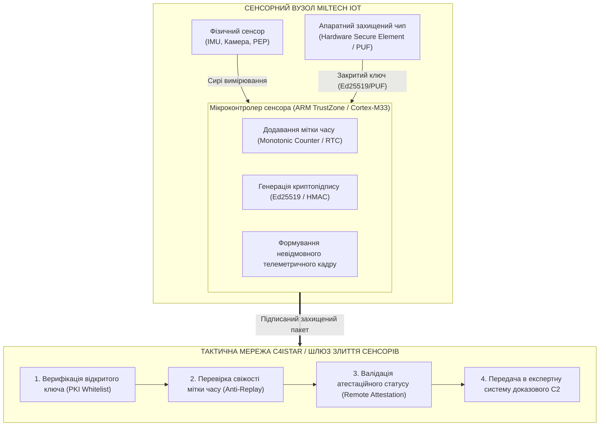
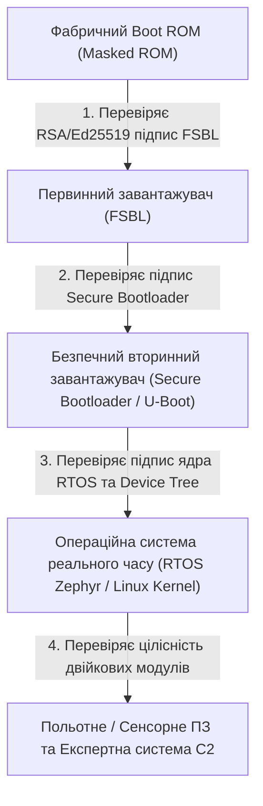
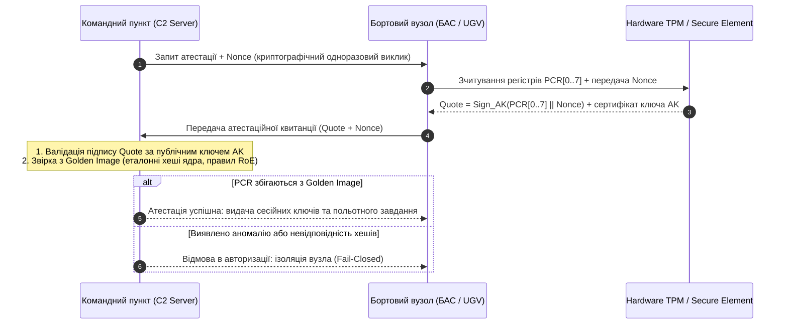

# Розділ 12. Апаратний корінь довіри (Hardware Root of Trust) та антиспуфінг у MilTech IoT

> **Монографія:** [Військова Кібернетика початку XXI століття](README.md) · [Частина IV: Доказовий штучний інтелект та кіберфізична безпека](README.md#частина-iv-доказовий-штучний-інтелект-та-кіберфізична-безпека)  
> **Попередній розділ:** [← Розділ 11. Експертні системи для БАС, ППО, РЕР та РЕБ](Military-Expert-Systems-UAS-AD-ELINT-EW-UA.md)  
> **Наступний розділ:** [До змісту монографії →](README.md)  
> **Зміст монографії:** [README.md](README.md)  
> **Автор:** [Микола Федчик (Mykola Fedchyk)](../ExpertSystem/book/about-the-author.md) · [LinkedIn](https://www.linkedin.com/in/nickfedchik/)  
> **Пов'язана монографія:** [«Експертні системи: інженерія знань, нейросимволічні архітектури та доказовий ШІ»](../ExpertSystem/book/README.md)

---

## 1. Загрози кіберфізичного рівня: поле бою як вороже інформаційне середовище

У сучасній мережецентричній війні тактична обізнаність командира та автономність бойових роботів залежать від тисяч розподілених кіберфізичних пристроїв: сенсорів БАС, тепловізорів, акустичних станцій розвідки, лазерних далекомірів, навігаційних модулів та ретрансляторів.

Проте цифрова перевага перетворюється на фатальну вразливість, якщо ворог атакує не радіоканал чи бронекорпус, а **достовірність сенсорних даних**:

1. **Сенсорний спуфінг (Sensor Spoofing):** введення в оману алгоритмів обробки шляхом трансляції спотворених акустичних сигнатур, оптичних пасток або модифікованих телеметричних кадрів.
2. **Атаки повтору (Replay Attacks):** запис легітимного пакету телеметрії або розвідувального донесення та його повторна трансляція пізніше для дезорієнтації штабу.
3. **Компрометація ланцюжка постачання (Supply Chain Attacks):** впровадження прихованого шкідливого коду у прошивки контролерів китайського або комерційного походження (COTS — Commercial Off-The-Shelf).
4. **Фізичне захоплення та вилучення ключів (Physical Key Extraction):** якщо збитий дрон або залишений наземний сенсор зберігає секретні ключі шифрування у незахищеній флеш-пам'яті (Flash/EEPROM), противник отримує можливість розшифровувати зв'язок усього підрозділу.

Вирішення цієї проблеми лежить у побудові архітектури **Zero-Trust Sensor Network**, де кожен вимірювальний пристрій має незмінний **апаратний корінь довіри (Hardware Root of Trust, RoT)** і криптографічно підтверджує своє походження та цілісність.



---

## 2. Архітектура апаратного кореня довіри (Root of Trust)

Апаратний корінь довіри — це неподільний апаратно-програмний комплекс, який за замовчуванням вважається надійним і слугує фундаментом для всіх наступних рівнів безпеки.

### Ключові компоненти RoT

1. **Масочне Boot ROM (Незмінне ПЗП завантаження):** первинний завантажувальний код, «зашитий» у кристал мікроконтролера на етапі фабричного виробництва. Його неможливо модифікувати програмно навіть за наявності повного фізичного доступу.
2. **Криптографічний захищений елемент (Secure Element / TPM 2.0 / ATECC608):** виділений мікрочип із апаратними прискорювачами криптографії (SHA-256, Ed25519, AES-GCM) та фізичним захистом від зондування і зчитування шин.
3. **Фізично неклоновані функції (PUF — Physically Unclonable Functions):** технологія генерації унікального криптографічного ключа на основі мікроскопічних технологічних варіацій кремнієвої структури кристала при кожному увімкненні живлення. Ключ не зберігається у пам'яті у статичному вигляді, тому його неможливо зчитати зі знеструмленого чипа.
4. **Апаратна схема самоліквідації ключів (Active Zeroization):** при виявленні спроби механічного розкриття корпусу сенсора або порушення захисної сітки мікрочипа ключі миттєво стираються за кілька наносекунд.

---

## 3. Довірене завантаження (Secure Boot) та ланцюжок верифікації

Процес ініціалізації будь-якого тактичного обчислювача будується за принципом **неперервного ланцюжка довіри (Chain of Trust)**:



Якщо на будь-якому етапі цифровий підпис бінарного образу не збігається з публічним ключем виробника, завантаження миттєво зупиняється, а пристрій переходить у стан **Fail-Closed Isolation**, виключаючи виконання модифікованого або зараженого коду.

---

## 4. Криптографічний захист сенсорних вимірювань (Zero-Trust Sensor Fusion)

У традиційних системах сенсори передають сирі дані по шинах CAN, UART або SPI у відкритому вигляді. Будь-яка врізка у провід або підключення до шини дозволяє інжектувати фальшиві координати чи показники цілей.

В архітектурі **Zero-Trust Sensor Fusion** кожен вимірювальний елемент має власний мікроконтролер із підтримкою ARM TrustZone, який формує самодостатній підписаний кадр:

$$
\text{TelemetryFrame} = \Big\langle \text{ID}_{\text{sensor}}, \, t_{\text{timestamp}}, \, C_{\text{seq}}, \, \mathbf{D}, \, \text{Sign}_{SK}\big(\text{SHA-256}(\text{ID}_{\text{sensor}} \parallel t_{\text{timestamp}} \parallel C_{\text{seq}} \parallel \mathbf{D})\big) \Big\rangle
$$

де:

- $\text{ID}_{\text{sensor}}$ — унікальний 128-бітний ідентифікатор сенсора;
- $t_{\text{timestamp}}$ — синхронізована мітка часу (Unix nanoseconds / GPS time);
- $C_{\text{seq}}$ — строго монотонний 64-бітний лічильник пакетів (захист від повтору та пропуску пакетів);
- $\mathbf{D}$ — вектор корисного навантаження вимірювання (кутові швидкості, спектрограма, просторові координати цілі);
- $\text{Sign}_{SK}$ — цифровий підпис на закритому криптографічному ключі сенсора.

Центральний модуль злиття даних (Sensor Fusion Engine) відкидає будь-яке повідомлення з недійсним підписом або застарілою міткою часу ще до того, як воно потрапить до алгоритмів фільтрації Калмана чи бази знань експертної системи.

---

## 5. Протокол дистанційної флотської атестації (Remote Fleet Attestation)

Перед тим як залучити групу безпілотних апаратів або наземних роботизованих платформ до виконання бойового завдання, командний вузол здійснює процедуру **масової криптографічної атестації флоту**:



### Переваги флотської атестації

- **Автоматизація передполітної перевірки:** виключається людський фактор ручного огляду дронів інженерами.
- **Ізоляція скомпрометованих одиниць:** платформи з несанкціонованими модифікаціями прошивки автоматично блокуються та не отримують польотних завдань і криптографічних ключів зв'язку.
- **Захист від підроблених бортів:** ворог не може підключити свій дрон до тактичної мережі під виглядом дружнього апарата.

---

## 6. Постквантова стійкість (Post-Quantum Cryptography) для систем із тривалим життєвим циклом

Військова техніка та засоби зв'язку часто проєктуються для експлуатації протягом 10–20 років. Перехоплений противником сьогодні зашифрований трафік може бути збережений і розшифрований у майбутньому за допомогою квантових комп'ютерів (загроза **«Harvest Now, Decrypt Later»**).

Для захисту довгострокових ключів і каналів C2 здійснюється перехід на **постквантові криптографічні алгоритми**, стандартизовані NIST:

1. **ML-KEM (Kyber):** алгоритм інкапсуляції ключів на базі решіток (Lattice-based cryptography) для встановлення сеансових ключів шифрування каналу зв'язку.
2. **ML-DSA (Dilithium) / Falcon:** алгоритми квантово-стійкого цифрового підпису для верифікації прошивок та атестаційних квитанцій.

Сучасні вбудовані крипточипи нового покоління вже містять апаратну підтримку операцій над поліномами для виконання ML-KEM-512/768 за мілісекунди без перевантаження головного процесора.

---

## 7. Програмна реалізація верифікатора телеметрії на Go

Нижче наведено приклад виробничого коду на мові Go для перевірки підпису, монотонного лічильника та свіжості часової мітки підписаного сенсорного кадру:

```go
package security

import (
	"crypto/ed25519"
	"crypto/sha256"
	"encoding/binary"
	"errors"
	"fmt"
	"time"
)

// SignedTelemetryFrame описує захищений телеметричний кадр
type SignedTelemetryFrame struct {
	SensorID  [16]byte
	Timestamp uint64 // Unix наносекунди
	Sequence  uint64 // Монотонний лічильник
	Payload   []byte
	Signature []byte // Ed25519 підпис
}

// TelemetryVerifier здійснює валідацію цілісності сенсорного потоку
type TelemetryVerifier struct {
	trustedPublicKeys map[[16]byte]ed25519.PublicKey
	lastSequence     map[[16]byte]uint64
	maxAllowedDrift  time.Duration
}

// NewTelemetryVerifier ініціалізує валідатор сенсорних даних
func NewTelemetryVerifier(maxDrift time.Duration) *TelemetryVerifier {
	return &TelemetryVerifier{
		trustedPublicKeys: make(map[[16]byte]ed25519.PublicKey),
		lastSequence:     make(map[[16]byte]uint64),
		maxAllowedDrift:  maxDrift,
	}
}

// RegisterSensor додає публічний ключ довіреного сенсора
func (v *TelemetryVerifier) RegisterSensor(id [16]byte, pubKey ed25519.PublicKey) {
	v.trustedPublicKeys[id] = pubKey
}

// VerifyFrame перевіряє справжність, послідовність та свіжість вимірювання
func (v *TelemetryVerifier) VerifyFrame(frame *SignedTelemetryFrame) error {
	pubKey, exists := v.trustedPublicKeys[frame.SensorID]
	if !exists {
		return fmt.Errorf("sensor %x is not registered in trusted PKI", frame.SensorID)
	}

	// 1. Перевірка захисту від Replay-атак (монотонний лічильник)
	lastSeq := v.lastSequence[frame.SensorID]
	if frame.Sequence <= lastSeq {
		return fmt.Errorf("replay attack detected: seq %d <= last %d", frame.Sequence, lastSeq)
	}

	// 2. Перевірка часового дрейфу (Time Freshness)
	now := uint64(time.Now().UnixNano())
	var drift uint64
	if now > frame.Timestamp {
		drift = now - frame.Timestamp
	} else {
		drift = frame.Timestamp - now
	}
	if time.Duration(drift) > v.maxAllowedDrift {
		return errors.New("telemetry frame timestamp is expired or out of sync")
	}

	// 3. Формування підписаного хешу
	hasher := sha256.New()
	hasher.Write(frame.SensorID[:])
	_ = binary.Write(hasher, binary.BigEndian, frame.Timestamp)
	_ = binary.Write(hasher, binary.BigEndian, frame.Sequence)
	hasher.Write(frame.Payload)
	digest := hasher.Sum(nil)

	// 4. Криптографічна перевірка підпису Ed25519
	if !ed25519.Verify(pubKey, digest, frame.Signature) {
		return errors.New("cryptographic signature verification failed: payload tampered")
	}

	// Оновлення стану лічильника
	v.lastSequence[frame.SensorID] = frame.Sequence
	return nil
}
```

---

## 8. Висновки

Безпека сучасних військових кіберфізичних систем не може обмежуватися лише встановленням паролів на Wi-Fi чи використанням закритих радіоканалів. Вона має ґрунтуватися на **фізично захищеному криптографічному фундаменті**:

1. **Апаратний корінь довіри (RoT):** захищає пристрої від зламу при фізичному захопленні та гарантує виконання лише авторизованої прошивки через Secure Boot.
2. **Zero-Trust підписування сенсорних даних:** унеможливлює інжекцію фальшивої телеметрії та захищає системи C4ISTAR від сенсорного спуфінгу.
3. **Флотська атестація (Remote Attestation):** забезпечує криптографічний контроль конфігурації всього парку дронів перед початком операції.
4. **Постквантова стійкість (PQC):** захищає критичні військові дані від розшифрування в довгостроковій перспективі.

Інтеграція апаратної безпеки з експертними системами прийняття рішень перетворює розрізнені сенсорні вузли на стійку, захищену від обману та високодоказову бойову інфраструктуру.

---

## Посилання

- [TCG TPM 2.0 Library Specification (Trusted Computing Group)](https://trustedcomputinggroup.org/resource/tpm-library-specification/)
- [NIST Post-Quantum Cryptography Standardization](https://csrc.nist.gov/projects/post-quantum-cryptography)
- [ARM TrustZone Technology for Cortex-M Architecture](https://www.arm.com/technologies/trustzone-for-cortex-m)
- [Війська зв'язку та кібербезпеки Збройних Сил України](https://mod.gov.ua/pro-nas/vijska-zv-yazku-ta-kiberbezpeki)

---

[← Розділ 11. Експертні системи для БАС, ППО, РЕР та РЕБ](Military-Expert-Systems-UAS-AD-ELINT-EW-UA.md) | [Зміст монографії](README.md) | [До змісту монографії →](README.md)
