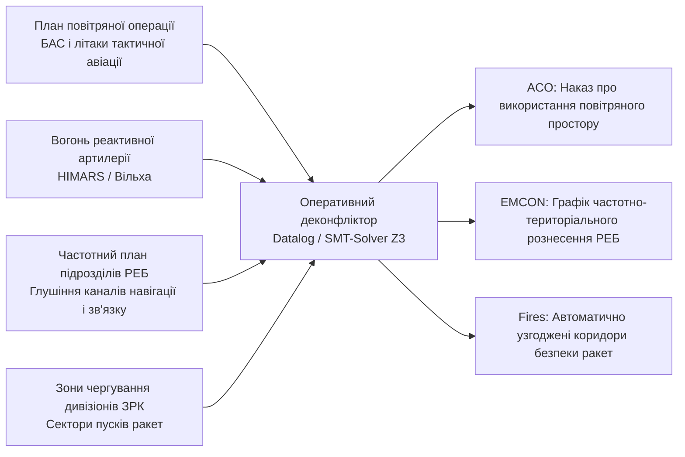
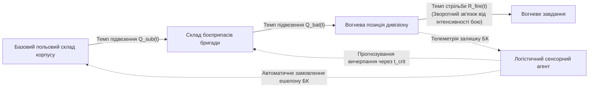

# Військова кібернетика оперативного рівня: міжвидова координація бригад, корпусів та JADC2

> [!NOTE]
> Цей розділ є частиною фундаментальної монографії [«Військова Кібернетика початку XXI століття»](README.md). Матеріал присвячено кібернетичній взаємодії на оперативному масштабі бойових дій: між бригадами та армійськими корпусами Сухопутних військ, авіацією Повітряних сил, зенітними ракетними військами, ВМС, Силами спеціальних операцій та засобами глибокого вогневого ураження в парадигмі JADC2 (Joint All-Domain Command and Control).
>
> **Автор:** [Микола Федчик (Mykola Fedchyk)](../ExpertSystem/book/about-the-author.md)
>
> Праця узгоджена з монографією [«Експертні системи: інженерія знань, нейросимволічні архітектури та доказовий ШІ»](../ExpertSystem/book/README.md).

---

## 1. Оперативний масштаб: координація простору, часу та різнорідних сил

Оперативний рівень ведення війни (оперативні командування, армійські корпуси, угруповання об'єднаних сил) є мостом між тактичними сутичками окремих батальйонів і стратегічними цілями всієї кампанії.

Головний кібернетичний виклик оперативного рівня — подолати **відомчу та фізичну фрагментованість різнорідних компонентів збройних сил**:

1. **Сухопутні війська (механізовані та артилерійські бригади):** оперують у двовимірному координатному просторі з високою щільністю перешкод, прив'язані до ліній постачання та складок рельєфу.
2. **Повітряні сили (тактична авіація, важкі розвідувальні БАС):** діють у тривимірному просторі з надвисокими швидкостями (800–2000 км/год) та вимагають випереджального очищення коридорів польоту від власної та ворожої ППО.
3. **Війська протиповітряної оборони (ЗРК різної дальності):** здійснюють цілодобовий моніторинг радіолокаційного поля та мають надкороткий час реакції на балістичні й крилаті загрози.
4. **Військово-морські сили (надводні та підводні сили):** діють у морських акваторіях, забезпечуючи блокаду узбережжя, десантні та протикорабельні операції.
5. **Сили безпілотних систем і РЕБ:** формують активне електромагнітне поле та дистанційні ройові бар'єри.

Без надійного кібернетичного контуру координація перетворюється на хаос: засоби РЕБ суміжної бригади придушують дрони сусідів, зенітні комплекси збивають дружні літаки, а артилерійські удари завдаються по позиціях, що вже зайняті дружньою піхотою.

```mermaid
flowchart TD
    subgraph JADC2["ОПЕРАТИВНИЙ МІЖВИДОВИЙ КОНТУР (JADC2 ARCHITECTURE)"]
        direction TB
        
        HQ["Штаб оперативного командування / Армійського корпусу\n(Спільний оперативний центр - Joint Operations Center)"]

        subgraph Domains["Домени бойового простору"]
            Land["Суходільний домен\n(Механізовані бригади, ТрО, Артилерія)"]
            Air["Повітряний домен\n(Винищувачі, Штурмовики, ДРЛВ)"]
            AirDefense["Домен ППО / ПРО\n(Батареї Patriot, NASAMS, Бук)"]
            Sea["Морський домен\n(Фрегати, Катери, USV, Морська піхота)"]
            CyberEW["Кібер- та Е/М домен\n(Бригадні групи РЕР, РЕБ, Кіберсили)"]
        end

        HQ <==>|"Тактична мережа обміну даними (Link-16 / СОКБ / Дельта)"| Land
        HQ <==>|"Повітряний командний радіоканал (TADIL / J-Series)"| Air
        HQ <==>|"Швидкісна шина ППО (Автоматизований цілерозподіл)"| AirDefense
        HQ <==>|"Захищений супутниковий та КХ зв'язок"| Sea
        HQ <==>|"Захищені оптичні та квантово-стійкі канали"| CyberEW

        Land <.-.->|"Горизонтальний деконфліктинг (Peer-to-Peer)"| AirDefense
        Air <.-.->|"Коридори прольоту (ACO)"| AirDefense
        CyberEW <.-.->|"Частотний деконфліктинг (EMCON)"| Land
    end
```

---

## 2. Математичні моделі оперативного протиборства

### Модифіковані рівняння Ланчестера для гетерогенних сил з інформаційним множником

Класична квадратична модель Ланчестера описує бойове зіткнення однорідних сил. На оперативному рівні кібернетична перевага полягає у збільшенні вогневої ефективності за рахунок швидкості передачі даних.

Нехай $x(t) \in \mathbb{R}^n$ та $y(t) \in \mathbb{R}^m$ — вектори чисельності різнорідних бойових платформ дружніх та ворожих сил відповідно (танки, артилерія, ППО, дрони). Динаміка втрат описується системою матричних диференціальних рівнянь:

$$
\frac{d\mathbf{x}}{dt} = - \mathbf{A}(I_y) \, \mathbf{y}(t) - \mathbf{D}_x \, \mathbf{x}(t)
$$

$$
\frac{d\mathbf{y}}{dt} = - \mathbf{B}(I_x) \, \mathbf{x}(t) - \mathbf{D}_y \, \mathbf{y}(t)
$$

де:

- $\mathbf{B}(I_x)$ — матриця оперативно-тактичної ефективності дружніх сил, що є нелінійною функцією **рівня інформаційної обізнаності** $I_x \in [0, 1]$;
- $\mathbf{A}(I_y)$ — матриця бойової ефективності противника;
- $\mathbf{D}_x, \mathbf{D}_y$ — матриці небойових та експлуатаційних втрат (відмови техніки, логістичні зриви).

Рівень інформаційної обізнаності $I_x$ формалізується через повноту покриття розвідувальними сенсорами та затримку доведення розвідданих:

$$
I_x = \Big( 1 - e^{-\lambda_{\text{rec}} T_{\text{fresh}}} \Big) \cdot \Big( 1 - P_{\text{latency}}(\tau > \tau_{\text{crit}}) \Big)
$$

Якщо $I_x \gg I_y$, менше угруповання сил дружньої сторони перемагає чисельно переважаючого противника шляхом прецизійного вибивання критичних вузлів (штабів, складів, РЛС) за рахунок значно вищих значень коефіцієнтів матриці $\mathbf{B}$.

---

## 3. Оперативний деконфліктинг: простір, повітря та електромагнітний спектр

Управління вогнем та рухом на рівні корпусу потребує безперервного автоматизованого узгодження просторово-часових обмежень:



### 1. Деконфліктинг повітряного простору (Airspace Control Order, ACO)

Для уникнення ураження власної авіації засобами ППО та артилерійськими снарядами автоматизована система оперативного рівня синтезує динамічні захисні об'єми (Dynamic Geofenced Volumes, DGV):

- **Артилерійські конуси безпеки (Gun-Target Line Safety Corridor):** тривимірний просторовий коридор над траєкторією польоту снарядів, де тимчасово забороняється політ розвідувальних крил.
- **Тимчасові висотні ешелони (Air Corridors):** коридори швидкого повернення штурмової авіації з відключенням автоматичних пусків ЗРК у цьому вузькому просторовому вікні.

### 2. Електромагнітний деконфліктинг (EMCON — Emission Control)

Масоване придушення радіоканалів противника станціями РЕБ бригадного і корпусного підпорядкування («Буковель», «Нота») не повинно паралізувати радіолінії управління власних безпілотників чи супутникового зв'язку:

$$
\forall i \in \text{FriendlyRadios}, \; \forall j \in \text{ActiveJammers} \implies |f_i - f_j| \ge \Delta f_{\text{guard}} \quad \lor \quad \|\mathbf{r}_i - \mathbf{r}_j\| \ge R_{\text{safe}}(P_j)
$$

Якщо умова порушується, символічний деконфліктор автоматично наказує передавачу завад зменшити сектор випромінювання або скоригувати сітку частот.

---

## 4. Логістична кібернетика оперативного рівня

Боєздатність армійського корпусу визначається не кількістю зброї в штаті, а **швидкістю відновлення ресурсів (боєприпаси, паливо, ремонтні комплекти, евакуація)**.

Кібернетика розглядає операційну логістику як динамічну мережу черг (Queuing Network) за принципами системної динаміки Джея Форрестера:



Рівень запасу боєприпасів $S_k(t)$ на позиції артилерійського дивізіону $k$ моделюється диференціальним рівнянням нерозривності:

$$
\frac{dS_k(t)}{dt} = Q_{\text{in}, k}(t - \tau_{\text{convoy}}) - R_{\text{fire}, k}(t)
$$

де $Q_{\text{in}, k}$ — темп надходження вантажів конвоями із запізненням транспортування $\tau_{\text{convoy}}$, а $R_{\text{fire}, k}(t)$ — стохастичний темп витрати боєприпасів під час відбиття ворожого наступу.

Кібернетична АСУ логістики в реальному часі розраховує оптимізаційну задачу динамічного перерозподілу автотранспорту за критерієм мінімізації ризику утворення «сухого залишку» ($S_k(t) = 0$) на найбільш загрозливих напрямках.

---

## 5. Протоколи міжвидової інтеграції та злиття даних

На оперативному рівні неможливо замінити всі існуючі системи управління на єдину програму. Тому сучасна військова кібернетика спирається на **сервіс-орієнтовані шини обміну даними (Enterprise Service Bus) та семантичні онтології**:

- **Стандарти НАТО:** Link-16 (STANAG 5516 / Tactical Data Information Link J), NVG (NATO Vector Graphics), MIP (Multilateral Interoperability Programme).
- **Вітчизняні інтеграційні платформи:** національна інтеграційна система ситуаційної обізнаності «Дельта», що агрегує шари просторових даних від супутників, БАС, засобів РЕР, камер спостереження та повідомлень чат-ботів у реальному часі.

---

## 6. Висновки

1. Оперативний рівень військової кібернетики вирішує задачу міжвидової інтеграції різнорідних родів військ (Суходіл, Повітря, ППО, Флот, РЕБ) в єдиний синхронізований бойовий механізм (JADC2).
2. Математичне моделювання на базі розширених матричних рівнянь Ланчестера підтверджує, що скорочення часу доведення розвідданих багаторазово підвищує бойову міць угруповання навіть за меншої кількості техніки.
3. Автоматизований просторово-часовий і частотний деконфліктинг (ACO та EMCON) на основі алгоритмів задоволення обмежень унеможливлює дружній вогонь і взаємне радіоелектронне придушення.
4. Логістична кібернетика як замкнена система керування ланцюгами постачання гарантує безперервність бойових операцій шляхом випереджального забезпечення критичними ресурсами.

---

## Посилання

- [Alberts, D. S., Garstka, J. J., & Stein, F. P. (1999). Network Centric Warfare: Developing and Leveraging Information Superiority. CCRP](https://www.dodccrp.org/files/Alberts_NCW.pdf)
- [Forrester, J. W. (1961). Industrial Dynamics. MIT Press](https://mitpress.mit.edu/9781614275251/industrial-dynamics/)
- [NATO Standardization Office. (2018). STANAG 5516: Tactical Data Exchange - Link 16](https://nso.nato.int/)
- [Центр інновацій та оборонних технологій Міністерства оборони України](https://mod.gov.ua/)
