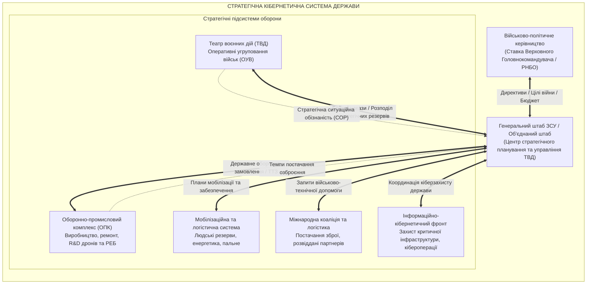
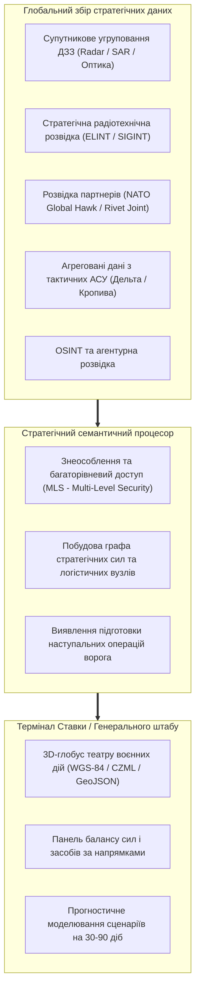
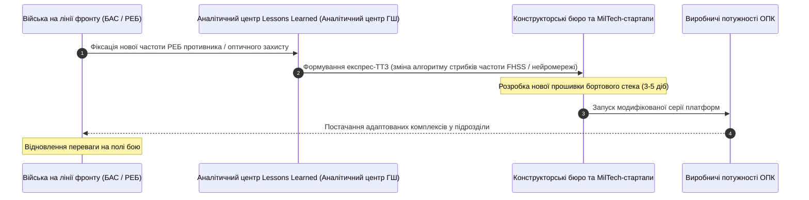

# Військова кібернетика стратегічного рівня: управління театром воєнних дій та оборонною стійкістю

> [!NOTE]
> Цей розділ є частиною фундаментальної монографії [«Військова Кібернетика початку XXI століття»](README.md). Матеріал присвячено стратегічному рівню військової кібернетики: автоматизованим системам вищого військово-політичного керівництва держави (Ставка Верховного Головнокомандувача, Генеральний штаб, Міністерство оборони), кібернетиці Театру Воєнних Дій (ТВД), моделюванню стратегічних операцій і кампаній, координації з коаліційними союзниками та інтеграції оборонно-промислового комплексу (ОПК) у загальнонаціональну модель стійкості.
>
> **Автор:** [Микола Федчик (Mykola Fedchyk)](../ExpertSystem/book/about-the-author.md)
>
> Праця узгоджена з монографією [«Експертні системи: інженерія знань, нейросимволічні архітектури та доказовий ШІ»](../ExpertSystem/book/README.md).

---

## 1. Стратегічний рівень кібернетики: війна як зіткнення соціотехнічних систем

Стратегічний рівень війни оперує найбільшим масштабом простору, часу та ресурсів: тут вирішуються задачі збереження державності, досягнення цілей оборонної операції та нейтралізації воєнного потенціалу агресора.

Військова кібернетика стратегічного масштабу розглядає війну не як послідовність боїв, а як **протиборство надскладних, самоорганізованих, розподілених соціотехнічних систем**:

---

## 2. Математичне моделювання кампаній та стратегічного виснаження

### Ентропійний критерій стійкості стратегічного управління

Стійкість стратегічного управління державою у війні визначається інформаційною ентропією за Шенноном-Вінером. Якщо обсяг невідомості щодо планів противника або стану власних сил перевищує пропускну здатність штабів, виникає стратегічний хаос.

Нехай $H(S_t)$ — ентропія стану театру дій у момент часу $t$:

$$
H(S_t) = - \sum_{i=1}^K p(s_i) \log_2 p(s_i)
$$

де $p(s_i)$ — ймовірність перебування стратегічної ситуації в гіпотетичному стані $s_i$.

Швидкість усунення невизначеності стратегічною розвідкою $\frac{dI}{dt}$ має перевищувати темп генерування невизначеності противником $\frac{dH}{dt}$:

$$
\frac{dI_{\text{rec}}}{dt} \ge \frac{dH_{\text{theater}}}{dt} \implies \text{Стратегічна стабільність системи}
$$

### Модель стратегічного виснаження потенціалу (Attrition Dynamics)

Динаміка стратегічного виснаження воюючих сторін моделюється системою рівнянь з урахуванням темпів власного військового виробництва та зовнішньої допомоги:

$$
\frac{dM(t)}{dt} = P_{\text{prod}}(t) + A_{\text{ally}}(t) - L_{\text{combat}}(t, \text{Intensity})
$$

де:

- $M(t)$ — сукупний бойовий потенціал сил оборони (кількість боєготових батальйонно-тактичних груп, парку ракет, БАС, артилерійських стволів);
- $P_{\text{prod}}(t)$ — темп внутрішнього оборонного виробництва;
- $A_{\text{ally}}(t)$ — обсяги військової допомоги партнерів;
- $L_{\text{combat}}$ — втрати на лінії бойового зіткнення як функція інтенсивності бойових дій.

Кібернетична система стратегічного планування розраховує горизонт вичерпання запасів агресора та оптимізує моменти введення стратегічних резервів для перелому ходу кампанії.

---

## 3. Ситуаційна обізнаність ТВД: єдина спільна оперативна картина (COP)

На стратегічному рівні командування не аналізує політ окремих квадрокоптерів. Головна задача — побудова **Єдиної спільної оперативної картини (Common Operational Picture, COP)** всього театру воєнних дій:

### Принципи стратегічного COP:

1. **Багаторівнева безпека (Multi-Level Security, MLS):** автоматичне гранульоване маскування джерел інформації відповідно до грифу секретності користувача (Top Secret / Secret / Restricted) без порушення цілісності картини.
2. **Семантична агрегація:** перетворення тисяч точкових сенсорних спостережень у цілісні стратегічні сутності: «ешелон техніки на станції навантаження», «передислокація полку зв'язку», «підготовка аеродрому базування стратегічної авіації».
3. **Предиктивна аналітика:** виявлення неявних просторово-часових кореляцій, що свідчать про підготовку масованого ракетного удару чи зміни основного вектора наступу за 48–72 години до початку дій.

---

## 4. Кібернетика оборонно-промислового комплексу (ОПК) та національної стійкості

В сучасній затяжній війні високої інтенсивності оборонно-промисловий комплекс (ОПК) є невіддільною частиною військової кібернетичної системи.

Цикл **«Бойовий досвід — R&D — Серійне виробництво — Фронт»** має скоротитися з років до тижнів:

Кібернетична система управління ОПК забезпечує:

- **Розподілене виробництво:** перенесення випуску дронів і боєприпасів із вразливих великих заводів на мережу десятків розосереджених підземних або модульних міні-підприємств.
- **Цифровий двійник ланцюжка постачання (Digital Supply Chain Twin):** контроль критичних імпортних компонентів (FPGA, тепловізійні матриці, двигуни, оптоволокно) із запобіганням дефіциту за рахунок альтернативних логістичних маршрутів.

---

## 5. Коаліційна інтеграція та кібербезпека стратегічного рівня

Жодна сучасна держава не веде масштабну оборону в повній ізоляції. Кібернетична сумісність із протоколами та сервісами союзників (НАТО) є запорукою успіху:

- **Інтероперабельність протоколів:** шлюзи між національними центрами управління та Об'єднаними командуваннями НАТО (SHAPE) за стандартом STANAG 4559 (NATO Secondary Imagery Dissemination) та OTH-Gold.
- **Квантово-стійке шифрування каналів вищого командування:** використання алгоритмів постквантової криптографії (ML-KEM/Kyber, ML-DSA/Dilithium) для унеможливлення стратегічного перехоплення директив вищого командування.

---

## 6. Висновки

1. Стратегічний рівень військової кібернетики інтегрує керування збройними силами, економіку оборонного виробництва, мобілізаційні ресурси та коаліційну взаємодію в єдину замкнену систему зі зворотним зв'язком.
2. Спільна оперативна картина (COP) усього театру воєнних дій забезпечує усунення інформаційної ентропії та випереджальну реакцію вищого військового командування на загрози.
3. Перемога у війні на виснаження забезпечується не статичними запасами зброї, а високою кібернетичною швидкістю адаптації ОПК — циклом швидкої модернізації техніки на основі досвіду After Action Review.
4. Стійкість держави як соціотехнічної системи базується на захищених, децентралізованих і доказових процедурах прийняття стратегічних рішень.

---

## Посилання

- [Clausewitz, C. von. (1832). On War (Vom Kriege)](https://www.gutenberg.org/ebooks/1946)
- [Shannon, C. E. (1948). A Mathematical Theory of Communication. Bell System Technical Journal](https://doi.org/10.1002/j.1538-7305.1948.tb01338.x)
- [Chairman of the Joint Chiefs of Staff. (2020). Joint Publication 3-0: Joint Operations. US DoD](https://www.jcs.mil/Doctrine/)
- [Рада національної безпеки і оборони України](https://www.rnbo.gov.ua/)
