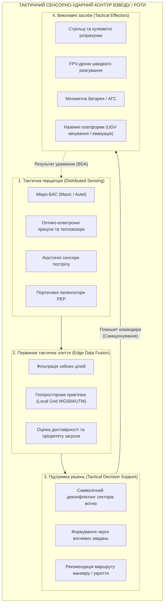
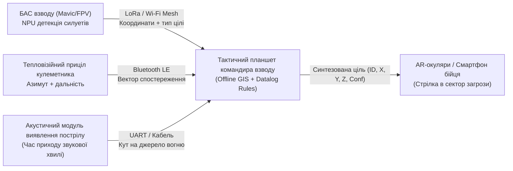
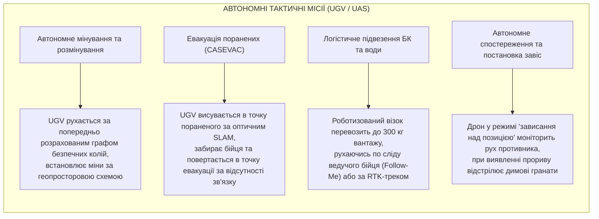

# Військова кібернетика тактичного рівня: людино-машинна синергія відділення, взводу та роти

> [!NOTE]
> Цей розділ є частиною фундаментальної монографії [«Військова Кібернетика початку XXI століття»](README.md). Матеріал присвячено дослідженню інформаційної взаємодії людини та автоматизованих комплексів у нижній ланці управління (відділення, взвод, рота, батальйон): тактичній розвідці, підтримці прийняття рішень (DSS), розподілу вогневих завдань та автономному виконанню бойових операцій.
>
> Праця узгоджена з монографією [«Експертні системи: інженерія знань, нейросимволічні архітектури та доказовий ШІ»](../ExpertSystem/book/README.md).

---

## 1. Специфіка тактичного рівня: мікросекунди, шум і дефіцит уваги

Тактичний рівень ведення бойових дій (від безпосереднього окопу до командно-спостережного пункту батальйону) характеризується екстремальними факторами:

1. **Критичний ліміт часу:** рішення про зміну вогневої позиції, маневр або контратаку приймається за секунди.
2. **Інформаційна перевантаженість бійця:** одночасний потік радіопереговорів, звукових сигнатур бою, відео з розвідувальних дронів та повідомлень у месенджерах призводить до когнітивного паралічу (Cognitive Tunneling).
3. **Фрагментований зв'язок:** вплив ворожого РЕБ, складки рельєфу та руйнація базових станцій роблять неможливою постійну передачу даних на вищі штаби.

Військова кібернетика тактичного рівня покликана трансформувати відділення та взвод у **високоінтегрований людино-машинний кіберфізичний комплекс (Centaur Tactical Unit)**, де сенсори, роботи та бійці діють у єдиному синхронізованому контурі.



---

## 2. Математичне моделювання тактичного циклу ураження (Kill Chain)

Ефективність тактичного підрозділу формалізується тривалістю повного сенсорно-вогневого циклу $T_{\text{kill\_chain}}$:

$$
T_{\text{kill\_chain}} = t_{\text{det}} + t_{\text{fuse}} + t_{\text{dec}} + t_{\text{eng}} + t_{\text{bda}}
$$

де:

- $t_{\text{det}}$ — час первинної детекції цілі сенсором;
- $t_{\text{fuse}}$ — час нормалізації та зіставлення даних у тактичній мережі;
- $t_{\text{dec}}$ — час прийняття рішення командиром (когнітивна затримка);
- $t_{\text{eng}}$ — час доведення команди та підльоту/пострілу вогневого засобу;
- $t_{\text{bda}}$ — час оцінки результатів удару (Battle Damage Assessment).

Якщо $T_{\text{kill\_chain}} > T_{\text{dwell}}$ (де $T_{\text{dwell}}$ — час перебування цілі на відкритій позиції до зміни укриття, зазвичай 15–45 с), вогневе ураження стає неможливим. Завдання кібернетики тактичного рівня — скоротити цей час через автоматизацію фаз $t_{\text{fuse}}$ та $t_{\text{dec}}$ до значень менше 5 секунд.

### Ймовірність виявлення цілі в умовах завад

Ймовірність виявлення $P_D$ об'єкта тактичним сенсором у секторі спостереження описується моделлю Маркама-Шверлінга з урахуванням відношення «сигнал/шум» (SNR) та коефіцієнта оптичного або радіоелектронного маскування $K_{\text{mask}}$:

$$
P_D = \frac{1}{2} \, \text{erfc}\left( \sqrt{-\ln P_{FA}} - \sqrt{\frac{\text{SNR}}{1 + K_{\text{mask}}} + \frac{1}{2}} \right)
$$

де $P_{FA}$ — задана допустима ймовірність хибної тривоги (False Alarm Rate), а $\text{erfc}$ — додаткова функція помилок.

---

## 3. Частково спостережувані марковські процеси (POMDP) у тактичному плануванні

У реальному бою стан поля бою $\mathbf{s} \in \mathcal{S}$ є **частково спостережуваним** через туман війни, складки місцевості та задимлення. Тактичний агент підтримки рішень моделює ситуацію як POMDP-кортеж:

$$
\mathcal{M}_{\text{tactical}} = \langle \mathcal{S}, \, \mathcal{A}, \, \mathcal{T}, \, \mathcal{R}, \, \Omega, \, \mathcal{O}, \, \gamma \rangle
$$

де:

- $\mathcal{S}$ — множина просторових станів противника і дружніх сил;
- $\mathcal{A}$ — множина допустимих тактичних дій (вогонь, відхід, димова завіса, спостереження);
- $\mathcal{T}(s' \mid s, a)$ — імовірність переходу поля бою в стан $s'$ після виконання дії $a$;
- $\mathcal{R}(s, a)$ — функція винагороди (збереження особового складу, зупинка прориву);
- $\Omega$ — простір спостережень, що надходять від сенсорів БАС та бійців;
- $\mathcal{O}(o \mid s', a)$ — імовірність отримати спостереження $o$ за умови переходу в стан $s'$;
- $\gamma \in (0, 1)$ — коефіцієнт дисконтування майбутніх наслідків.

Оптимальна тактична стратегія $\pi^*(b)$ формується відносно поточного вектора довіри (Belief State) $b(s) = P(s_t = s \mid o_{1:t}, a_{1:t-1})$:

$$
\pi^*(b) = \arg\max_{a \in \mathcal{A}} \left[ \sum_{s \in \mathcal{S}} b(s) \mathcal{R}(s, a) + \gamma \sum_{o \in \Omega} P(o \mid b, a) V^*(\tau(b, a, o)) \right]
$$

де $\tau(b, a, o)$ — байєсівське оновлення вектора довіри після отримання нового спостереження.

---

## 4. Розвідка та первинне злиття сенсорів на рівні відділення/взводу

Сучасне відділення не може дозволити собі централізований сервер для обробки даних. Використовується парадигма **Edge Mesh Sensing**:



### Принципи тактичного злиття:

1. **Мінімальний обсяг даних:** передається не «важке» відео, а компактні JSON/Protobuf-вектори метаданих (тип об'єкта, координати WGS-84, рівень достовірності, мітка часу).
2. **Просторовий деконфліктинг дублікатів:** якщо дрон та акустичний сенсор спостерігають одну й ту саму точку з радіусом $\Delta R \le 25\text{ м}$, система автоматично об'єднує їх в єдиний трек цілі.
3. **Пріоритет загрози (Threat Scoring):** цілі ранжуються за формулою пріоритету (наприклад, бронетехніка з прямим кутом наведення на позицію має вищий пріоритет, ніж піхотинець в укритті на дистанції 800 м).

---

## 5. Автономні функції виконання тактичних завдань

Роботизовані комплекси на тактичному рівні поступово перебирають на себе смертельно небезпечні рутинні операції, звільняючи особовий склад:



### Алгоритм поведінки UGV при втраті зв'язку (Dead-Reckoning Fail-Safe)

Якщо під час доставки боєкомплекту або евакуації зв'язок придушено завадами, бортовий контролер переходить у детермінований режим безпечного повернення:

```prolog
% Datalog-правило тактичної безпеки UGV
action(ugv_retreat) :-
    link_status(lost),
    link_loss_duration(T),
    T > 30, % секунд
    battery_level(B),
    B > 20,
    safe_path_recorded(true).

% Заборона зупинки у відкритому секторі вогню
action(seek_cover_and_wait) :-
    link_status(lost),
    under_fire(true),
    nearest_trench_cover(Distance),
    Distance < 50.
```

---

## 6. Висновки

1. Тактичний рівень військової кібернетики фокусується на стисненні сенсорно-вогневого циклу $T_{\text{kill\_chain}}$ до лічених секунд шляхом когнітивного розвантаження бійця та автоматизації злиття даних на передньому краї.
2. Концепція Centaur Unit поєднує інтуїцію та тактичний досвід командира з обчислювальною швидкістю мікро-NPU та сенсорної мережі взводу.
3. Частково спостережувані марковські процеси (POMDP) дають математичну основу для дій в умовах задимлення, туману війни та радіоелектронного придушення.
4. Наземні та повітряні роботизовані засоби (UGV/UAS) беруть на себе критичні функції логістики, розмінування та медичної евакуації, діючи автономно за детермінованими безпековими правилами.

---

## Посилання

- [Boyd, J. R. (1987). A Discourse on Winning and Losing. Air University Library](https://www.airuniversity.af.edu/)
- [Kaelbling, L. P., Littman, M. L., & Cassandra, A. R. (1998). Planning and acting in partially observable stochastic domains. Artificial Intelligence](https://doi.org/10.1016/S0004-3702(98)00023-X)
- [Scharre, P. (2018). Army of None: Autonomous Weapons and the Future of War. W. W. Norton & Company](https://wwnorton.com/books/army-of-none/)
- [Національний університет оборони України](https://nuou.org.ua/)
