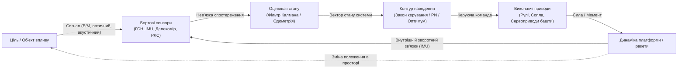
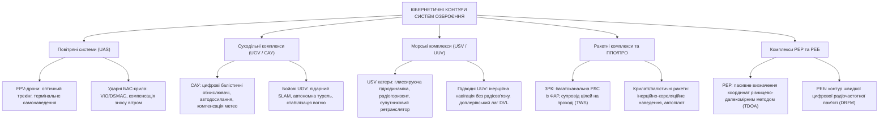
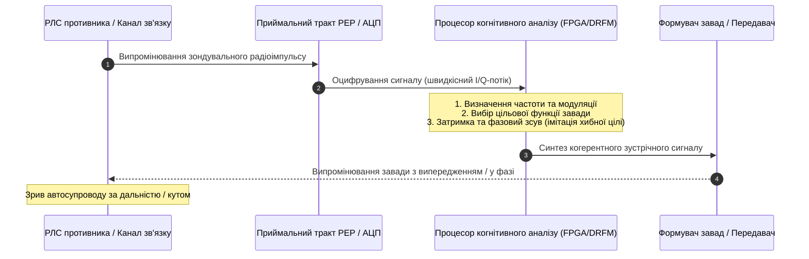
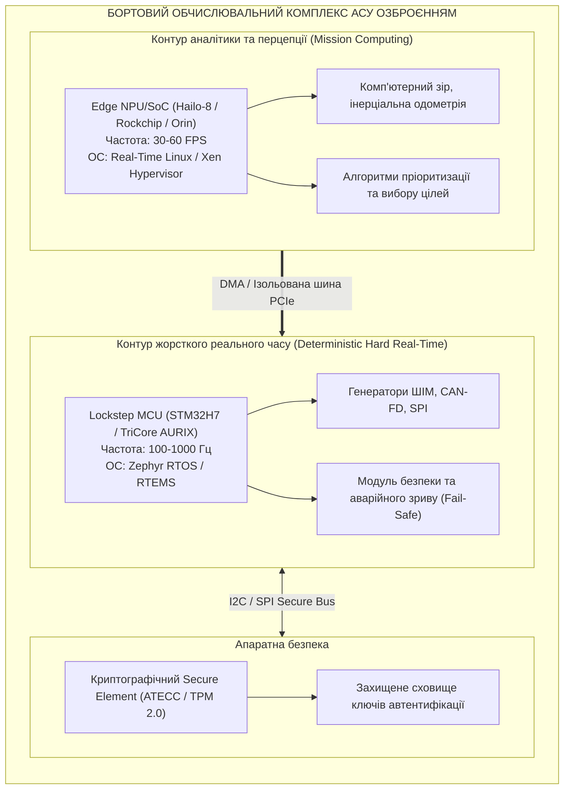

# Військова кібернетика і АСУ озброєнням: внутрішні кібернетичні контури систем

> [!NOTE]
> Цей розділ є частиною фундаментальної монографії [«Військова Кібернетика початку XXI століття»](README.md). Матеріал присвячено теорії зворотного зв'язку та внутрішнім контурам автоматизованого керування зброєю: від безпілотних апаратів усіх середовищ (UAS, UGV, USV, UUV) до артилерійських комплексів, ракетних систем, засобів ППО/ПРО, РЕР та РЕБ.
>
> Праця узгоджена з монографією [«Експертні системи: інженерія знань, нейросимволічні архітектури та доказовий ШІ»](../ExpertSystem/book/README.md).

---

## 1. Концепція внутрішньої кібернетики зброї: від механізму до кіберфізичної системи

Класична зброя індустріальної епохи функціонувала як розімкнений механічний пристрій: наведення здійснювалося людиною-навідником, а політ снаряда чи рух машини підпорядковувалися незмінним законам зовнішньої балістики без можливості корекції в процесі руху.

Військова кібернетика початку XXI століття розглядає будь-який сучасний зразок озброєння як **замкнену кіберфізичну систему з множинними петлями зворотного зв'язку**:

Кібернетичний контур озброєння вирішує тріаду задач:

1. **Спостереження (State Estimation):** фільтрація шумів вимірювань і розрахунок просторово-часових параметрів цілі та власної платформи в реальному часі.
2. **Оптимальне наведення (Optimal Guidance):** синтез траєкторії, що мінімізує промах або час підльоту за обмежень на перевантаження.
3. **Виконавча стабілізація (Autopilot & Flight Control):** швидка компенсація аеродинамічних або гідродинамічних збурень середовища через сервоприводи рульових поверхонь чи балістичних приводів.

---

## 2. Математичний апарат контурів наведення

### Закон пропорційної навігації (Proportional Navigation)

Основою кібернетичного керування для більшості самонавідних ракет, дронів-перехоплювачів та керованих артилерійських боєприпасів є закон пропорційної навігації (True Proportional Navigation, TPN).

Прискорення перехоплювача $\mathbf{a}_M$, нормальне до лінії візування (Line-of-Sight, LOS), пропорційне кутовій швидкості обертання лінії візування $\dot{\lambda}$ та швидкості зближення $V_c$:

$$
\mathbf{a}_M = N' \, V_c \, \dot{\lambda} \, \mathbf{n}
$$

де:

- $N' \in [3, \, 5]$ — безрозмірний навігаційний коефіцієнт (Navigation Gain);
- $V_c = - \dot{R} = - \frac{d}{dt} \|\mathbf{r}_T - \mathbf{r}_M\|$ — швидкість відносного зближення перехоплювача та цілі;
- $\dot{\lambda} = \frac{\|\mathbf{r} \times \mathbf{v}\|}{\|\mathbf{r}\|^2}$ — кутова швидкість лінії візування;
- $\mathbf{n}$ — одиничний вектор, перпендикулярний до лінії візування в площині перехоплення.

### Оптимальне термінальне керування (Zero Effort Miss)

Для високошвидкісних або маневруючих цілей класична пропорційна навігація модифікується через оцінку прогнозованого промаху за нульового керування (Zero Effort Miss, ZEM):

$$
\mathbf{ZEM}(t) = \mathbf{r}(t) + \mathbf{v}(t) \, t_{go} + \frac{1}{2} \mathbf{a}_T(t) \, t_{go}^2
$$

де $t_{go} = \frac{R}{V_c}$ — прогнозований залишковий час до зустрічі з ціллю (Time-to-Go), а $\mathbf{a}_T$ — оцінене бортовим фільтром Калмана прискорення цілі.

Оптимальне керуюче прискорення перехоплювача, отримане з мінімізації функціонала витрат енергії за принципом максимуму Понтрягіна, записується як:

$$
\mathbf{a}_M^*(t) = \frac{N'(t_{go})}{t_{go}^2} \, \mathbf{ZEM}(t)
$$

---

## 3. Специфіка кібернетичних контурів за типами озброєння

### 1. Безпілотні авіаційні комплекси (UAS: FPV, розвідувальні крила, перехоплювачі)

- **Контур сервокерування:** замикається з частотою 400–1000 Гц на бортовому IMU (акселерометри та гіроскопи) через PID-регулятори кутових швидкостей $\mathbf{\omega} = [\omega_x, \omega_y, \omega_z]^T$.
- **Контур супроводу цілі (Visual Target Tracker):** реалізується на мікро-NPU (0.5–2 Вт) через кореляційні трекери або моделі глибинного навчання (YOLO-Edge). Замикається через поправку курсу із затримкою до 20–30 мс, компенсуючи зрив радіозв'язку на останніх 50–100 метрах пікірування.

### 2. Суходільні роботизовані комплекси (UGV) та артилерійські установки (САУ)

- **Самохідна артилерія (САУ типу PzH 2000, Богдана, CAESAR):** сучасна САУ є роботом, де людина лише дає дозвіл на постріл. Бортова СУВ (Fire Control System) у реальному часі враховує температуру заряду, знос каналу ствола, тривимірний профіль вітру за метеоданими та автоматично орієнтує ствол за лазерним гірокомпасом із похибкою менше $0.5$ артилерійської поділки.
- **Наземні роботокомплекси (UGV):** діють у високов'язкому та перешкодному середовищі. Внутрішній контур будується на базі 3D-лідарного SLAM і фільтрації непрохідних ділянок рельєфу (Elevation Grid Mapping).

### 3. Морські надводні (USV) та підводні (UUV) ударні дрони

- **USV (морські дрони-катери):** контур курсу працює в умовах стохастичного хвильового збурення. Передатна функція корпусу має суттєву інерційність: для стабілізації застосовуються випереджальні фільтри Калмана, що прогнозують підйом і звалювання з гребеня хвилі.
- **Підводні UUV:** повна відсутність електромагнітного зв'язку крізь товщу води вимагає автономного контуру на базі доплерівського гідроакустичного лага (Doppler Velocity Log, DVL) та прецизійних волоконно-оптичних гіроскопів (FOG).

### 4. Зенітні ракетні комплекси (ЗРК) та протиракетна оборона (ПРО)

Кібернетика ЗРК вирішує задачу розпаралелювання контурів супроводу десятків швидкісних аеродинамічних і балістичних цілей:

- **Фазована антенна решітка (ФАР/АФАР):** електронне керування променем дозволяє за мікросекунди змінювати напрямок сканування, поєднуючи режим огляду повітряного простору із супроводом цілей на проході (Track-While-Scan, TWS).
- **Радіолінія командного наведення:** обчислювальний комплекс батареї синтезує оптимальну траєкторію зближення та передає кодовані команди на борт зенітної керованої ракети аж до моменту захоплення цілі її власною активною радіолокаційною чи напівактивною ГСН.

---

## 4. Контури радіоелектронної боротьби (РЕБ) та радіоелектронної розвідки (РЕР)

Військова кібернетика систем РЕБ і РЕР відрізняється від систем кінетичного ураження: тут об'єктом керування є **електромагнітне поле та інформаційні структури сигналів противника**.

### Замкнений адаптивний контур когнітивного РЕБ

Сучасні станції постановки завад використовують технологію цифрової радіочастотної пам'яті (Digital Radio Frequency Memory, DRFM):

### Енергетичне рівняння придушення радіолінії

Для гарантованого зриву радіолінії керування або супутникової навігації бортовий контур РЕБ підтримує співвідношення «завада/сигнал» на вході приймача цілі вище критичного порогу:

$$
\left( \frac{P_J}{P_S} \right) = \frac{P_{tx, J} \, G_J \, G_{rx, J} \, R_S^2 \, L_S}{P_{tx, S} \, G_S \, G_{rx, S} \, R_J^2 \, L_J} \ge \gamma_{\text{jam}}
$$

де:

- $P_{tx, J}, P_{tx, S}$ — потужності передавача завад і корисного передавача відповідно;
- $G$ — коефіцієнти підсилення антен у відповідних напрямках;
- $R_J, R_S$ — відстані від приймача цілі до станції РЕБ та передавача сигналу;
- $\gamma_{\text{jam}}$ — коефіцієнт придушення (зазвичай 3–10 дБ залежно від типу модуляції).

---

## 5. Бортова апаратно-програмна реалізація контурів АСУВ

Висока динаміка бойових процесів висуває категоричні вимоги до обчислювальної архітектури бойових машин:

- **Принцип архітектурної ізоляції (Simplex Architecture):** жоден збій нейромережевого прискорювача чи помилка операційної системи Linux не повинні впливати на роботу польотного контролера або контуру стабілізації зброї на базі RTOS.
- **Апаратний корінь безпеки (RoT):** захищає алгоритми наведення від несанкціонованої модифікації супротивником при захопленні апарата на полі бою.

---

## 6. Висновки

1. Сучасна зброя перестала бути засобом механічного ураження — вона перетворилася на автономну кіберфізичну систему, де ефективність визначається швидкодією та математичною точністю внутрішніх контурів керування.
2. Пропорційна навігація (PN) та оцінка прогнозованого промаху (ZEM) забезпечують високу ймовірність ураження маневрених цілей за обмежених енергетичних ресурсів ракети чи дрона.
3. Гетерогенність середовищ (повітря, суходіл, море, електромагнітний спектр) вимагає спеціалізованих контурів зворотного зв'язку: від оптичного трекінгу в FPV до гідроакустичного числення в UUV та когнітивного DRFM у засобах РЕБ.
4. Надійність бортової АСУ озброєнням досягається суворим фізичним і логічним розділенням імовірнісних обчислювачів перцепції та детермінованих контурів реального часу.

---

## Посилання

- [Zarchan, P. (2012). Tactical and Strategic Missile Guidance (6th ed.). AIAA](https://arc.aiaa.org/doi/book/10.2514/4.101708)
- [Wiener, N. (1948). Cybernetics: Or Control and Communication in the Animal and the Machine. MIT Press](https://mitpress.mit.edu/9780262730099/cybernetics/)
- [Adamy, D. (2001). EW 101: A First Course in Electronic Warfare. Artech House](https://us.artechhouse.com/EW-101-A-First-Course-in-Electronic-Warfare-P314.aspx)
- [Військовий інститут телекомунікацій та інформатизації імені Героїв Крут](https://uk.wikipedia.org/wiki/%D0%92%D1%96%D0%B9%D1%81%D1%8C%D0%BA%D0%BE%D0%B2%D0%B8%D0%B9_%D1%96%D0%BD%D1%81%D1%82%D0%B8%D1%82%D1%83%D1%82_%D1%82%D0%B5%D0%BB%D0%B5%D0%BA%D0%BE%D0%BC%D1%83%D0%BD%D1%96%D0%BA%D0%B0%D1%86%D1%96%D0%B9_%D1%82%D0%B0_%D1%96%D0%BD%D1%84%D0%BE%D1%80%D0%BC%D0%B0%D1%82%D0%B8%D0%B7%D0%B0%D1%86%D1%96%D1%97_%D1%96%D0%BC%D0%B5%D0%BD%D1%96_%D0%93%D0%B5%D1%80%D0%BE%D1%97%D0%B2_%D0%9A%D1%80%D1%83%D1%82)
