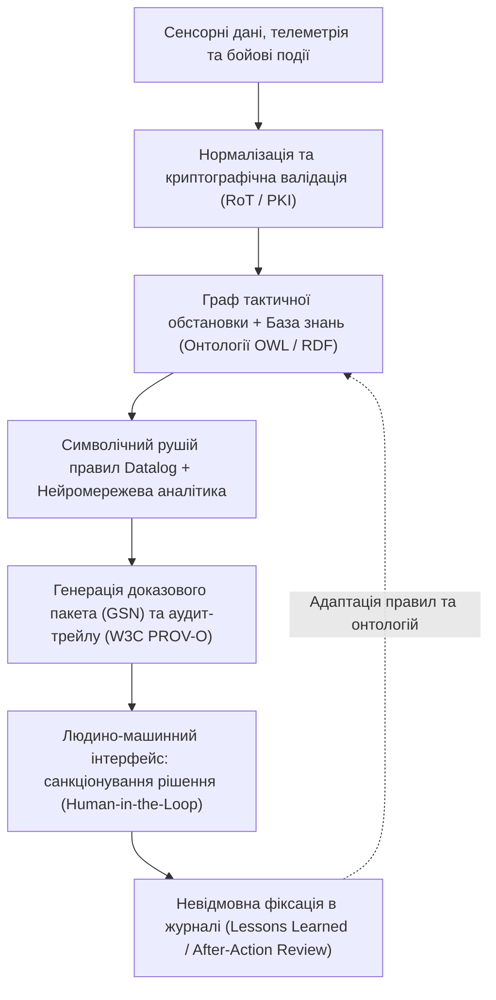

# Експертні системи військового призначення

> [!NOTE]
> Цей матеріал є Розділом 10 (Частина IV: Доказовий штучний інтелект та кіберфізична безпека) фундаментальної монографії [«Військова Кібернетика початку XXI століття»](README.md).
>
> **Автор:** [Микола Федчик (Mykola Fedchyk)](../ExpertSystem/book/about-the-author.md)
>
> Праця узгоджена з монографією [«Експертні системи: інженерія знань, нейросимволічні архітектури та доказовий ШІ»](../ExpertSystem/book/README.md).

Війна різко змінює ставлення до інформації. У мирному інженерному середовищі погані дані означають затримку, переробку, втрату грошей або невдалий реліз. У військовому середовищі погані дані, запізніле рішення або неправильно зрозумілий сигнал можуть коштувати життя. Саме тому розмова про експертні системи військового призначення має бути значно серйознішою, ніж черговий сюжет про "ШІ на полі бою".

Ця стаття не є посібником із планування атак, наведення, обходу захисту, застосування радіоелектронної боротьби або ведення бойових дій. Такі речі не варто описувати у відкритій публікації. Мене цікавить інше: якою має бути сучасна експертна система, що допомагає військовим і оборонним організаціям працювати з інформацією, плануванням, координацією, зв'язком, ризиками, доказами, обмеженнями і відповідальністю.

У цій рамці експертна система не "воює замість людини". Вона збирає факти, структурує знання, перевіряє правила, показує прогалини, моделює варіанти, пояснює висновки, фіксує джерела і допомагає людині швидше побачити те, що в шумі подій легко пропустити.

## Чому військовому управлінню потрібні експертні системи

Військове управління майже завжди працює в умовах неповної інформації. Дані запізнюються, джерела суперечать одне одному, зв'язок деградує, ситуація змінюється швидше, ніж її встигають описати в документах, а противник свідомо створює хибні сигнали.

Класична інформаційна система добре зберігає дані. Система зв'язку добре передає повідомлення. Аналітичний звіт добре підсумовує минуле. Але командиру й штабу часто потрібне інше: швидко зрозуміти, що змінилося, які факти надійні, які припущення небезпечні, які обмеження спрацьовують, де є конфлікт між джерелами, що потребує людського рішення, а що можна лише підсвітити як ризик.

Саме тут з'являється місце для експертної системи. Її сила не в тому, що вона "розумніша" за штаб або досвідченого офіцера. Її сила в дисципліні:

- не забути правило;
- не загубити джерело;
- не змішати факт із припущенням;
- не видати неповні дані за впевненість;
- не приховати конфлікт між сигналами;
- не втратити зв'язок між рішенням і доказами;
- не дозволити мовній моделі говорити переконливіше, ніж дозволяють факти.

У військовому контексті це критично. Експертна система має бути не генератором наказів, а інструментом доказового управління в умовах невизначеності.

## Підтримка планування операцій

Планування військових операцій - це не лише карта і задум. Це робота з обмеженнями, ресурсами, часом, зв'язком, логістикою, медичною евакуацією, погодою, станом підрозділів, доступністю техніки, ризиками для цивільних, правовими рамками, взаємодією з суміжними силами, інформаційною обстановкою і здатністю системи управління витримати збій.

Експертна система в такому середовищі може виконувати кілька безпечних і корисних ролей.

Перша роль - перевірка повноти плану. Система може показати, чи враховано критичні обмеження: зв'язок, резерви, евакуацію, забезпечення, погодження, часові вікна, обмеження застосування сили, ризики для цивільних, стан техніки, доступність каналів і залежність від зовнішніх систем.

Друга роль - виявлення конфліктів. Наприклад, один елемент плану спирається на канал зв'язку, який уже перевантажений або ненадійний; інший потребує ресурсу, який призначений для іншого завдання; третій має часову залежність, яку неможливо виконати без додаткового підтвердження. Система не має автоматично "переплановувати війну", але вона може чесно сказати: тут є конфлікт.

Третя роль - сценарний аналіз. Що станеться, якщо зв'язок частково зникне? Якщо джерело розвідданих виявиться ненадійним? Якщо логістичне забезпечення запізниться? Якщо погодні умови зміняться? Якщо ключовий ресурс стане недоступним? Експертна система може моделювати не "найкращий план атаки", а стійкість плану до збоїв.

Четверта роль - підготовка доказового пакета для рішення. Командир має бачити не лише рекомендацію, а й підстави: які факти використано, які джерела підтверджені, які припущення зроблено, які ризики лишилися, хто переглянув висновок, які альтернативи відхилені і чому.

Це особливо важливо для багаторівневого управління. На одному рівні рішення виглядає локальним. На іншому - воно впливає на логістику, зв'язок, взаємодію, резерви, безпеку цивільних або інформаційні наслідки. Експертна система потрібна саме для того, щоб бачити зв'язки між рівнями.

## Тактичний рівень: підтримка, а не автопілот

На тактичному рівні спокуса автоматизації найбільша. Події швидкі, каналів багато, часу мало, помилка дорога. Але саме тут треба бути найобережнішим.

Експертна система тактичного рівня має підтримувати сприйняття ситуації, попередження про ризики, фільтрацію шуму, контроль обмежень і швидку підготовку варіантів для людини. Вона не повинна перетворюватися на непрозорий механізм, який самостійно приймає рішення про застосування сили.

Корисні задачі тактичної експертної системи можуть бути такими:

- звести дані з кількох джерел у спільну картину;
- позначити, які сигнали підтверджені, а які лише припущення;
- виявити суперечності між повідомленнями;
- підсвітити деградацію зв'язку або сенсорного покриття;
- показати, які рішення потребують додаткового підтвердження;
- попередити про порушення встановлених обмежень;
- зафіксувати, хто і на основі яких даних ухвалив рішення;
- допомогти після події відновити хід міркування.

Це не виглядає так ефектно, як фантазії про автономні бойові системи. Але саме така нудна інженерна дисципліна часто рятує людей: менше плутанини, менше дублювання, менше втрати контексту, менше небезпечної впевненості там, де дані неповні.

## Досвід російсько-української війни

Російсько-українська війна дуже жорстко показала, що сучасне поле бою є не лише фізичним, а й інформаційним, електромагнітним, програмним і організаційним середовищем.

Перший урок - швидкість циклу "побачити - зрозуміти - передати - вирішити - виконати - перевірити" стала критичною. Але швидкість без перевірки небезпечна. Якщо система прискорює помилку, вона робить не краще, а гірше. Тому експертна система має прискорювати не лише передачу інформації, а й перевірку її якості.

Другий урок - масовість сенсорів змінила характер інформації. Дрони, камери, радіосигнали, журнали систем, повідомлення від підрозділів, відкриті джерела, супутникові дані, телеметрія і ручні спостереження створюють величезний потік сигналів. Проблема вже не тільки в тому, щоб отримати дані. Проблема в тому, щоб відрізнити релевантне від шуму, нове від дублювання, підтверджене від неперевіреного.

Третій урок - радіоелектронна боротьба і радіоелектронна розвідка стали повсякденною частиною середовища. Зв'язок може деградувати, навігація може бути ненадійною, канали можуть змінювати якість, сигнали можуть бути хибними або неповними. Експертна система має працювати не в ідеальній мережі, а в умовах втрати даних, затримок, дублювання, фрагментації і недовіри до частини джерел.

Четвертий урок - горизонтальна взаємодія стала так само важливою, як вертикальне управління. Підрозділи, волонтерські технологічні команди, ремонт, логістика, розвідка, зв'язок, медики, оператори безпілотних систем, аналітики й командування працюють у спільному темпі. Якщо інформаційна система не підтримує таку взаємодію, люди будують її вручну в чатах і таблицях. Це швидко, але крихко.

П'ятий урок - знання застарівають дуже швидко. Те, що працювало вчора, сьогодні може бути небезпечним. Тому експертна система військового призначення має мати не лише базу правил, а й життєвий цикл знань: хто додав правило, хто підтвердив, де воно застосовне, коли воно застаріло, які винятки відомі, які уроки отримано після застосування.

## Операційні системи управління військами: що можна покращити

Сучасні системи управління військами часто історично будувалися як системи зв'язку, відображення обстановки, документообігу або передачі наказів. Але реальність вимагає більшого: вони мають ставати системами доказового управління.

Покращення перше - спільна доменна модель. Система має однаково розуміти, що таке підрозділ, задача, ресурс, обмеження, канал зв'язку, сенсор, подія, ризик, рішення, підтвердження, джерело, часовий інтервал і рівень впевненості. Без спільної моделі дані з різних підсистем погано поєднуються.

Покращення друге - граф зв'язків. Важливо бачити, як задача залежить від ресурсів, як ресурс залежить від логістики, як логістика залежить від зв'язку, як зв'язок залежить від електромагнітної обстановки, як рішення залежить від джерел і підтверджень. Таблиці потрібні, але граф краще показує вплив змін.

Покращення третє - подієва архітектура. У реальному часі система має реагувати на події: змінився статус, зник канал, з'явився новий сигнал, джерело втратило довіру, ресурс став недоступним, правило виявило конфлікт. Події мають бути структуровані, підписані, прив'язані до джерела і збережені для аудиту.

Покращення четверте - керування невизначеністю. Не кожне повідомлення однаково надійне. Не кожне джерело однаково актуальне. Не кожна модель однаково застосовна. Система має явно показувати рівень впевненості, конфлікти, прогалини і застарілість даних.

Покращення п'яте - режим деградації. Військова система не може припускати, що мережа, хмара, супутниковий зв'язок або центральний сервер завжди доступні. Має бути локальний режим, кешування критичних знань, синхронізація після відновлення зв'язку, контроль версій і зрозуміла поведінка при неповних даних.

Покращення шосте - пояснюваність. Якщо система підсвітила ризик, вона має показати чому. Якщо вона запропонувала перегляд, має бути видно правило. Якщо вона визнала джерело слабким, має бути видно критерій. Якщо мовна модель сформувала підсумок, мають бути посилання на джерела.

## Різноканальний зв'язок як частина знань

Окрема тема - сучасний різноканальний і різнопротокольний зв'язок. У реальній військовій системі дані можуть проходити через різні канали: радіомережі, ретранслятори, супутникові канали, дротові сегменти, польові мережі, локальні вузли, мобільні термінали, шлюзи між системами і тимчасові резервні рішення. Відкрита стаття не має описувати конкретні схеми застосування таких каналів. Але архітектурний принцип можна проговорити.

Для експертної системи канал зв'язку - це не просто "труба для повідомлення". Це об'єкт знань із властивостями: доступність, затримка, пропускна здатність, рівень довіри, ступінь деградації, джерело даних, часовий інтервал, залежність від обладнання, політика використання, обмеження безпеки і наслідки відмови.

Якщо система бачить кілька каналів, вона має не магічно вибирати "найкращий", а показувати стан і ризики: який канал перевантажений, який втратив якість, де дані запізнюються, які повідомлення дублюються, які джерела не підтверджені, які рішення не можна вважати надійними без повторної перевірки. Це знову не про автоматизм, а про прозорість.

Різнопротокольність додає ще одну проблему: різні системи по-різному називають події, статуси, ролі, пріоритети, координати, часові позначки, підтвердження і помилки. Тому потрібен шар нормалізації: спільна доменна модель, словники, мапінг полів, контроль одиниць вимірювання, контроль часу, контроль джерела і контроль версій.

У добрій архітектурі експертна система не залежить від одного каналу або одного формату. Вона отримує події, перевіряє їх походження, зберігає слід, порівнює з іншими джерелами і явно маркує невизначеність. Якщо канал зник, система має деградувати передбачувано: показати, які знання застаріли, які рішення потребують підтвердження, які модулі перейшли в локальний режим.

## Кооперація механічних, електронних і радіоелектронних засобів

Сучасна війна дедалі більше схожа на взаємодію багатьох різних систем: механічних платформ, безпілотних засобів, сенсорів, ретрансляторів, засобів зв'язку, радіоелектронної розвідки, радіоелектронної боротьби, логістичних платформ, пунктів управління, польових серверів, мобільних застосунків і аналітичних центрів.

Кожна з цих систем має власні дані, протоколи, обмеження, затримки, зони відповідальності і рівень довіри. Якщо їх просто з'єднати каналами зв'язку, це ще не буде кооперація. Кооперація виникає тоді, коли система розуміє ролі, обмеження, стан і залежності.

Експертна система може бути шаром, який відповідає на питання:

- які засоби доступні;
- які дані від них надійшли;
- які дані підтверджені іншими джерелами;
- які канали деградують;
- які засоби конфліктують за ресурс або частотне середовище;
- які рішення потребують людського підтвердження;
- які дії можуть створити ризик для своїх сил або цивільних;
- які правила безпеки і взаємодії спрацьовують.

Для радіоелектронних засобів це особливо важливо. РЕР і РЕБ не існують окремо від зв'язку, навігації, сенсорів, безпілотних систем і управління. Будь-яка активність в електромагнітному середовищі може мати побічний ефект для своїх систем. Тому експертна система має допомагати не лише "виявляти" або "реагувати", а й контролювати електромагнітну сумісність, ризики для власного зв'язку, конфлікти між засобами і потребу в погодженні.

Це має бути зроблено без магії. Правила, обмеження, джерела, часові вікна, рівні довіри, дозволи, журнали і відповідальні особи мають бути явними. Інакше складна кооперація перетворюється на чорну скриньку, якій у військовому середовищі не можна довіряти.

## Де місце ШІ: нейросимволічна синергія замість сліпої авторегресії

ШІ в такій системі потрібен, але не як автономний генератор рішень. Сучасна військова кібернетика вимагає чіткого розмежування функцій між статистичним навчанням і строгою детермінованою логікою — підхід, відомий як **нейросимволічний ШІ (Neuro-Symbolic AI)**:

- **Нейромережевий шар (Sub-symbolic perception):** моделі комп'ютерного зору (CNN, ViT на бортових NPU-прискорювачах), акустичні класифікатори та трансформери обробки природної мови відповідають за первинне сприйняття сигналів, розпізнавання патернів і перетворення неструктурованого потоку сенсорних даних на імовірнісні ембединги та гіпотези.
- **Символічний шар (Symbolic reasoning):** бази знань, Datalog-рушії та онтологічні моделі відповідають за строге логічне виведення, перевірку правил ведення бойових дій (Rules of Engagement, RoE), аналіз обмежень безпеки (Safety Invariants) та деконфліктинг ресурсів.

Такий поділ запобігає «галюцинаціям» мовних моделей у критичних ситуаціях. Модель ШІ може сформувати гіпотезу або підсумувати радіообмін, але жодна дія не може бути передана в командний контур без проходження через символічний фільтр перевірки правил.

## Архітектура військової експертної системи: від подій до верифікованого виведення

На високому рівні архітектура доказової експертної системи складається з дев'яти взаємопов'язаних шарів:

1. **Шар джерел і сенсорів:** бортова телеметрія, сенсори БАС, журнали засобів РЕР/РЕБ, повідомлення підрозділів, метеорологічні та геопросторові дані.
2. **Шар конекторів і нормалізації:** трансформація гетерогенних сигналів у спільну модель подій із фіксацією джерела, часових позначок і рівня довіри.
3. **Шар бази знань та онтологій:** формалізовані тактичні нормативи, частотні плани, матриці електромагнітної сумісності, процедурні правила та шаблони рішень.
4. **Граф обстановки і залежностей (Knowledge Graph):** динамічна мережа сутностей, що зв'язує підрозділи, платформи, частоти, логістичні ланцюги та виявлені фактори ризику.
5. **Детермінований рушій логічного виведення (Datalog / ASP Engine):** верифікація несуперечливості фактів і виконання правил із гарантованим поліноміальним часом обчислення (P-complete), що унеможливлює зависання системи в реальному часі.
6. **Аналітичний шар і статистичні моделі:** виявлення просторово-часових аномалій, оцінка завадової обстановки та прогнозування витрати ресурсів.
7. **Шар пояснення та доказового пакета (GSN & Evidence Chain):** синтез дерева аргументації з обов'язковим трасуванням до первинних фактів.
8. **Шар людино-машинного інтерфейсу (Human-in-the-Loop):** надання командиру та штабу верифікованих альтернатив із прозорою оцінкою ризиків та невизначеності.
9. **Шар невідмовного аудиту (W3C PROV-O Audit Log):** криптографічне збереження повного ланцюга міркувань для післядієвого розбору операцій (After Action Review).

Спрощена схема інформаційного контуру:

## Доказовий пакет і структура аргументів безпеки (GSN)

Військова експертна система не має права видавати твердження у форматі «чорної скриньки». Кожна аналітична рекомендація має супроводжуватися формальним доказовим пакетом, побудованим за принципами **нотації структурування цілей (Goal Structuring Notation, GSN)**:

- **Головне твердження (Goal):** наприклад, *«План радіоелектронного прикриття напрямку є узгодженим і не порушує зв'язку власних БАС»*.
- **Стратегія аргументації (Strategy):** декомпозиція твердження на перевірку просторових зон, частотних інтервалів і часових вікон.
- **Контекст (Context):** активний частотний план, поточні дані засобів РЕР та координати базових станцій.
- **Фактичні докази (Evidence):** підписані телеметричні логи, висновки Datalog-правил деконфліктингу та криптографічні сертифікати джерел.

Будь-який розрив у ланцюжку доказів або наявність суперечливих фактів призводить до переходу системи у стан **Fail-Closed** — генерація попередження про неможливість гарантувати безпеку та запит на додаткову перевірку людиною.

## Реальний час не означає автоматизм

Фраза "в реальному часі" часто звучить так, ніби рішення має ухвалювати машина. Насправді реальний час означає інше: система має встигати оновлювати картину, підсвічувати зміни, попереджати про конфлікти і давати людині актуальні підстави для рішення.

Для експертної системи реального часу важливі:

- подієва обробка;
- пріоритети повідомлень;
- контроль затримки;
- явне маркування застарілих даних;
- локальна робота при втраті зв'язку;
- синхронізація після відновлення каналу;
- захист від дублювання і хибних сигналів;
- журналювання того, що саме було відомо на момент рішення.

Це останнє особливо важливе. Після події легко сказати: "система мала знати". Але правильне питання інше: що система реально знала в той момент, з якою впевненістю, з яких джерел і які попередження показала людині?

## Знання військової експертної системи

Знання в такій системі не обмежуються доктриною або інструкціями. Вони мають багато шарів.

Доменні знання: типи підрозділів, ресурсів, каналів, задач, обмежень, подій, ризиків, рішень і доказів.

Процедурні знання: як підтверджується інформація, хто має право ухвалювати рішення, коли потрібне погодження, коли потрібна ескалація, які перевірки обов'язкові.

Технічні знання: стан обладнання, залежності між системами, вимоги до зв'язку, живлення, обслуговування, сумісності, оновлення і резервування.

Операційні знання високого рівня: типові ризики, обмеження взаємодії, уроки після дій, шаблони помилок, фактори деградації, відомі залежності між ресурсами і задачами.

Правові та етичні знання: обмеження застосування сили, захист цивільних, правила поводження з даними, відповідальність, заборони, вимоги до людського контролю.

Знання про невизначеність: які джерела надійні, які застарілі, які конфліктують, які потребують підтвердження, які дані недоступні.

Знання про власну систему: які моделі використовуються, яка їхня версія, на яких даних вони перевірялися, де вони не застосовні, які правила мають власника, які правила застарівають.

Це не має бути просто папка з документами. Це має бути керований набір фактів, правил, графів, джерел, версій, винятків, журналів і відповідальних осіб.

## Ризики і червоні лінії

Експертні системи військового призначення можуть бути дуже корисними, але ризики тут також вищі.

Перший ризик - автоматизаційна упередженість. Люди схильні довіряти системі, якщо вона говорить впевнено. Тому система має показувати невизначеність так само виразно, як рекомендацію.

Другий ризик - хибні або підмінені дані. Противник може атакувати не лише мережу, а й картину світу: підсунути хибний сигнал, змінити контекст, створити дублікати, зімітувати підтвердження. Експертна система має бути побудована з недовірою до даних за замовчуванням.

Третій ризик - чорна скринька. Якщо система не може пояснити висновок, її не можна використовувати для критичних рішень. Особливо там, де можливі наслідки для людей.

Четвертий ризик - неконтрольоване оновлення знань. У війні знання змінюються швидко, але швидкість не має знищувати контроль. Нове правило має мати джерело, власника, межі застосування і перевірку.

П'ятий ризик - змішування ролей. Мовна модель, рушій правил, оператор, командир, аналітик і система зв'язку не мають зливатися в одну безвідповідальну сутність. Має бути зрозуміло, хто що зробив і хто за що відповідає.

Червона лінія для мене проста: експертна система може підтримувати рішення, але не повинна приховувати від людини невизначеність, джерела, обмеження і наслідки. Особливо в питаннях, де рішення може призвести до застосування сили.

## Перспектива для України

Для України тема військових експертних систем не абстрактна. Війна вже створила величезну кількість практичних знань: про зв'язок, безпілотні системи, РЕБ, логістику, ремонт, евакуацію, взаємодію, навчання, адаптацію, роботу з волонтерськими технологічними спільнотами та розробниками і швидке впровадження рішень.

Водночас цю тему варто бачити не лише як реакцію на сучасну війну. В Україні вже існувала сильна військово-інженерна школа, пов'язана з радіолокацією, ППО, автоматизованими системами управління, зв'язком, радіоелектронною розвідкою, обчислювальною технікою і військовою кібернетикою. Кафедра військової кібернетики КВІРТУ ППО, підготовка програмістів для радіолокаційних засобів ППО, підготовка наприкінці 1990-х років на кафедрі РЕР у КВІУС інженерів-програмістів зі спеціалізацією в радіоелектронній розвідці, а згодом розвиток військової інформатики, телекомунікацій і кібербезпеки у ВІТІ КПІ показують важливу спадкоємність: експертні системи не виникають у порожньому місці. Вони продовжують лінію, де математика, сигнали, обчислення, надійність і управління були частиною військової інженерії.

Але знання, які живуть лише у головах людей, чатах, таблицях і розрізнених документах, дуже важко масштабувати. Людина переводиться, підрозділ змінює район, команда втомлюється, контекст втрачається. Уроки залишаються, але не завжди повертаються в момент нового рішення.

Перспективний напрям - не будувати одну гігантську централізовану систему на всі випадки життя. Краще будувати мережу сумісних модулів:

- модуль уроків після дій;
- модуль якості даних і джерел;
- модуль стану зв'язку;
- модуль логістичних ризиків;
- модуль технічного стану засобів;
- модуль взаємодії РЕР, РЕБ і зв'язку на рівні сумісності та ризиків;
- модуль перевірки обмежень і погоджень;
- модуль пояснення для різних рівнів управління;
- модуль локальної роботи без постійного зв'язку.

Такі модулі мають обмінюватися структурованими подіями, мати спільні поняття, підтримувати аудит і працювати навіть тоді, коли частина інфраструктури недоступна.

Окремо важлива суверенність. Військова експертна система не може повністю залежати від зовнішньої хмари, закритого сервісу або моделі, яку неможливо перевірити. Частина можливостей може бути хмарною, але критичні знання, правила, журнали, права доступу і локальні режими мають контролюватися власною стороною.

## Висновок

Експертні системи військового призначення не повинні бути фантазією про автономну війну. Їхня найсильніша роль значно приземленіша і важливіша: зробити військове управління доказовішим, стійкішим, пояснюванішим і менш залежним від хаосу інформаційного потоку.

У сучасній війні перемагає не просто той, хто має більше даних. Перемагає той, хто швидше перетворює дані на перевірені знання, знання - на зрозумілі варіанти, варіанти - на відповідальні рішення, а рішення - на досвід, який повертається в систему.

ШІ може сильно допомогти в цьому циклі. Але тільки якщо він стоїть поруч із правилами, графами знань, доказами, людським переглядом, аудитом, кібербезпекою і дисципліною керування знаннями.

Питання не в тому, чи будуть експертні системи у військовому управлінні. Вони вже поступово з'являються - у пошуку, зв'язку, логістиці, розвідці, плануванні, аналізі ризиків і післядієвому навчанні. Питання в іншому: чи будуть вони прозорими, контрольованими, стійкими і відповідальними.

Бо в системах військового призначення найнебезпечніший висновок - не той, який звучить обережно. Найнебезпечніший висновок - той, який звучить упевнено, але не може показати, звідки він узявся.

## Посилання

- [Київське вище інженерне радіотехнічне училище протиповітряної оборони (КВІРТУ ППО) — Вікіпедія](https://uk.wikipedia.org/wiki/%D0%9A%D0%B8%D1%97%D0%B2%D1%81%D1%8C%D0%BA%D0%B5_%D0%B2%D0%B8%D1%89%D0%B5_%D1%96%D0%BD%D0%B6%D0%B5%D0%BD%D0%B5%D1%80%D0%BD%D0%B5_%D1%80%D0%B0%D0%B4%D1%96%D0%BE%D1%82%D0%B5%D1%85%D0%BD%D1%96%D1%87%D0%BD%D0%B5_%D1%83%D1%87%D0%B8%D0%BB%D0%B8%D1%89%D0%B5_%D0%BF%D1%80%D0%BE%D1%82%D0%B8%D0%BF%D0%BE%D0%B2%D1%96%D1%82%D1%80%D1%8F%D0%BD%D0%BE%D1%97_%D0%BE%D0%B1%D0%BE%D1%80%D0%BE%D0%BD%D0%B8)
- [Київське вище військове інженерне училище зв'язку (КВВІУЗ) — Вікіпедія](https://uk.wikipedia.org/wiki/%D0%9A%D0%B8%D1%97%D0%B2%D1%81%D1%8C%D0%BA%D0%B5_%D0%B2%D0%B8%D1%89%D0%B5_%D0%B2%D1%96%D0%B9%D1%81%D1%8C%D0%BA%D0%BE%D0%B2%D0%B5_%D1%96%D0%BD%D0%B6%D0%B5%D0%BD%D0%B5%D1%80%D0%BD%D0%B5_%D1%83%D1%87%D0%B8%D0%BB%D0%B8%D1%89%D0%B5_%D0%B7%D0%B2%27%D1%8F%D0%B7%D0%BA%D1%83)
- [Військовий інститут телекомунікацій та інформатизації імені Героїв Крут (ВІТІ) — Вікіпедія](https://uk.wikipedia.org/wiki/%D0%92%D1%96%D0%B9%D1%81%D1%8C%D0%BA%D0%BE%D0%B2%D0%B8%D0%B9_%D1%96%D0%BD%D1%81%D1%82%D0%B8%D1%82%D1%83%D1%82_%D1%82%D0%B5%D0%BB%D0%B5%D0%BA%D0%BE%D0%BC%D1%83%D0%BD%D1%96%D0%BA%D0%B0%D1%86%D1%96%D0%B9_%D1%82%D0%B0_%D1%96%D0%BD%D1%84%D0%BE%D1%80%D0%BC%D0%B0%D1%82%D0%B8%D0%B7%D0%B0%D1%86%D1%96%D1%97_%D1%96%D0%BC%D0%B5%D0%BD%D1%96_%D0%93%D0%B5%D1%80%D0%BE%D1%97%D0%B2_%D0%9A%D1%80%D1%83%D1%82)
- [Війська зв'язку та кібербезпеки Збройних Сил України — Міністерство оборони України](https://mod.gov.ua/pro-nas/vijska-zv-yazku-ta-kiberbezpeki)
- [Війська зв'язку та кібербезпеки Збройних Сил України — Вікіпедія](https://uk.wikipedia.org/wiki/%D0%92%D1%96%D0%B9%D1%81%D1%8C%D0%BA%D0%B0_%D0%B7%D0%B2%27%D1%8F%D0%B7%D0%BA%D1%83_%D1%82%D0%B0_%D0%BA%D1%96%D0%B1%D0%B5%D1%80%D0%B1%D0%B5%D0%B7%D0%BF%D0%B5%D0%BA%D0%B8_%D0%97%D0%B1%D1%80%D0%BE%D0%B9%D0%BD%D0%B8%D1%85_%D0%A1%D0%B8%D0%BB_%D0%A3%D0%BA%D1%80%D0%B0%D1%97%D0%BD%D0%B8)
- [Командування Військ зв'язку та кібербезпеки Збройних Сил України — Вікіпедія](https://uk.wikipedia.org/wiki/%D0%9A%D0%BE%D0%BC%D0%B0%D0%BD%D0%B4%D1%83%D0%B2%D0%B0%D0%BD%D0%BD%D1%8F_%D0%92%D1%96%D0%B9%D1%81%D1%8C%D0%BA_%D0%B7%D0%B2%27%D1%8F%D0%B7%D0%BA%D1%83_%D1%82%D0%B0_%D0%BA%D1%96%D0%B1%D0%B5%D1%80%D0%B1%D0%B5%D0%B7%D0%BF%D0%B5%D0%BA%D0%B8_%D0%97%D0%B1%D1%80%D0%BE%D0%B9%D0%BD%D0%B8%D1%85_%D0%A1%D0%B8%D0%BB_%D0%A3%D0%BA%D1%80%D0%B0%D1%97%D0%BD%D0%B8)
