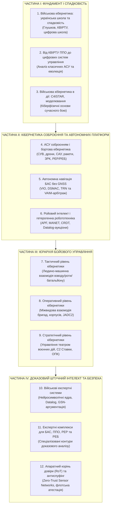

# Військова Кібернетика початку XXI століття: системи управління, кіберфізичні комплекси та доказовий інтелект

> [!NOTE]
> Цей репозиторій містить академічну та інженерно-аналітичну монографію **«Військова Кібернетика початку XXI століття»**. Дослідження узагальнює класичну спадщину української школи кібернетики (академік В. М. Глушков, наукова школа КВІРТУ ППО, Інститут кібернетики НАН України) та досвід високотехнологічної війни нового типу: від бортової автономії окремого FPV-дрона до стратегічного управління театром воєнних дій (ТВД).
>
> Праця тісно взаємодіє з фундаментальною монографією [«Експертні системи: інженерія знань, нейросимволічні архітектури та доказовий ШІ»](../ExpertSystem/book/README.md).

---

## Концепція та мета монографії

Сучасне протистояння на полі бою перестало бути виключно війною мас і калібрів — воно перетворилося на **війну кібернетичних контурів управління**:

1. **Боротьба за цикл управління (Cycle-Time Dominance):** перемагає сторона, чий сенсорно-ударний контур (OODA Loop / Kill Chain) працює швидше за швидкість реакції супротивника.
2. **Інформаційна цілісність у ворожому середовищі (Zero-Trust Information Dominance):** інформаційне поле бою насичене завадами РЕБ, фальшивими цілями та кібератаками. Перевагу отримують системи, що мають математично доведену стійкість до спуфінгу та строго верифіковану базу знань.
3. **Гетерогенна автономність (Distributed Autonomous Teaming):** перехід від ручного дистанційного керування окремими апаратами до децентралізованих роїв роботів (UAS, UGV, USV) із детермінованим арбітражем правил застосування (Rules of Engagement, RoE).
4. **Ієрархічна кібернетична вертикаль:** безшовний зв'язок між мікроконтролером бортового приводу гармати чи ракети, тактичним планшетом командира роти, оперативним штабом армійського корпусу та стратегічним центром планування кампаній.

---

## Архітектура монографії: Структура розділів

---

## Навігатор за розділами монографії

### Частина I. Фундамент і спадковість

1. **[Військова кібернетика: українська школа та спадковість](Ukrainian-Military-Cybernetics-UA.md)**
   Історичний генезис військової кібернетики в Україні: праці академіка В. М. Глушкова, концепція ОГАС та оборонних АСУ, внесок наукової школи КВІРТУ ППО, спадковість поколінь кібернетиків та її переосмислення у високотехнологічній війні проти російської агресії.
2. **[Українська військова кібернетика: від КВІРТУ ППО до цифрових систем управління](Ukrainian-Military-Cybernetics-School-UA.md)**
   Аналіз архітектур класичних військових автоматизованих систем управління («Повітря», «Промінь», «Вектор»), методологія математичного моделювання радіолокаційних полів, алгоритми супроводу траєкторій та їх трансформація у розподілені бойові системи («Кропива», «Дельта», «Віраж-Планшет»).
3. **[Військова кібернетика в дії: C4ISTAR, моделювання та кіберфізичні системи](Military-Cybernetics-In-Action-UA.md)**
   Концепція C4ISTAR як багаторівневого зворотного зв'язку; теорія кіберфізичних систем поля бою; моделювання бойових дій на основі диференціальних рівнянь Ланчестера та стохастичних мереж Петрі; контури інтелектуального радіоелектронного захисту.

### Частина II. Внутрішня кібернетика озброєння та автономних платформ

4. **[Військова кібернетика і АСУ озброєнням: внутрішні кібернетичні контури систем](Military-Cybernetics-Weapons-Control-Systems-UA.md)**
   Внутрішня кібернетика бойових засобів: дронів усіх середовищ (повітря, суходіл, море, глибина), самохідних артилерійських установок (САУ), керованих ракет, зенітних ракетних комплексів (ЗРК), станцій РЕР та комплексів РЕБ. Теорія оптимального керування, передатні функції приводів, пропорційне наведення та адаптивний радіоелектронний захист.
5. **[Автономна навігація БАС без GNSS: VIO, DSMAC та арбітраж цілісності](Autonomous-Navigation-GNSS-Denied-MilTech-UA.md)**
   Комплексування вимірювань в умовах спуфінгу та придушення супутникового сигналу. Багатокамерна візуально-інерційна одометрія (MSCKF/OpenVINS), кореляційне зіставлення з оптичними картами (DSMAC/LightGlue), рельєфна навігація (TRN) та статистичний контроль цілісності вимірювань (VAIM).
6. **[Ройовий інтелект і координація гетерогенних роботокомплексів](Swarm-Intelligence-And-Heterogeneous-Robotics-UA.md)**
   Математичний апарат децентралізованого рою (APF-потенціали Рейнольдса-Хатіба), безконфліктні структури даних (CRDT) у динамічних радіомережах MANET, децентралізовані Datalog-аукціони цілерозподілу, просторово-часовий деконфліктинг та трифакторний протокол «Антифратрицид».

### Частина III. Ієрархія бойового управління: Тактика, Операція, Стратегія

7. **[Військова кібернетика тактичного рівня: людино-машинна синергія відділення, взводу та роти](Military-Cybernetics-Tactical-Level-UA.md)**
   Взаємодія військовослужбовців та безпілотних комплексів у нижній ланці управління. Когнітивне розвантаження оператора, скорочення циклу ураження (Kill Chain), тактична розвідка, марковські процеси прийняття рішень (POMDP), алгоритми автоматичного наведення та автономні місії (евакуація поранених, мінування).
8. **[Військова кібернетика оперативного рівня: міжвидова координація бригад, корпусів та JADC2](Military-Cybernetics-Operational-Level-UA.md)**
   Кібернетика операційного масштабу. Інформаційно-вогнева інтеграція сухопутних бригад, авіації, ППО, флоту та сил спеціальних операцій. Автоматизований деконфліктинг повітряного простору (ACO) та електромагнітної обстановки (EMCON), динамічна логістика ресурсів на базі системної динаміки Форрестера.
9. **[Військова кібернетика стратегічного рівня: управління театром воєнних дій та оборонною стійкістю](Military-Cybernetics-Strategic-Level-UA.md)**
   Стратегічні АСУ вищого військового командування (Ставка, Генеральний штаб). Глобальна обізнаність на театрі воєнних дій (ТВД), математичне моделювання кампаній, стратегічний розподіл резервів, ентропійний аналіз стійкості коаліційних сил та кібернетика мобілізаційного циклу військово-промислового сектору.

### Частина IV. Доказовий штучний інтелект та кіберфізична безпека

10. **[Експертні системи військового призначення: інженерія знань та доказовий ШІ](Military-Expert-Systems-UA.md)**
    Архітектура нейросимволічного ядра: розділення імовірнісної перцепції та детермінованого логічного виведення на мовах Datalog/Answer Set Programming. Доказовий пакет аргументації (GSN) та невідмовний аудит міркувань за стандартом W3C PROV-O.
11. **[Експертні системи для БАС, ППО, РЕР та РЕБ](Military-Expert-Systems-UAS-AD-ELINT-EW-UA.md)**
    Спеціалізовані прикладні контури підтримки рішень: енергетичний і просторовий аудит польотних завдань БАС, деконфліктинг засобів ППО та дружньої авіації, ідентифікація випромінювачів РЕР та автоматизоване частотне планування РЕБ.
12. **[Апаратний корінь довіри (Hardware Root of Trust) та антиспуфінг у MilTech IoT](Hardware-Root-Of-Trust-And-Anti-Spoofing-Military-IoT-UA.md)**
    Криптографічний захист польових сенсорних мереж: довірене завантаження Secure Boot, фізично неклоновані функції (PUF), атестація парку дронів за стандартом TPM 2.0 Quote, конкатенаційне підписування телеметрії та перехід до постквантових алгоритмів (ML-KEM/Kyber, ML-DSA/Dilithium).

---

## Методологічні засади та обмеження безпеки

Усі матеріали монографії сформовано з дотриманням суворих критеріїв інформаційної та операційної безпеки:

- **Виключно відкриті науково-технічні джерела:** робота спирається на розсекречені історичні праці, академічні публікації провідних університетів світу (MIT, Stanford, ETH Zurich), відкриті стандарти IEEE/ISO/NIST та публічні специфікації оборонних проєктів (DARPA, NATO STO).
- **Відсутність чутливих даних:** текст не містить реальних координат, позивних, бойових наказів, актуальних тактичних частот чи вразливостей конкретних підрозділів сил безпеки й оборони України.
- **Математична та інженерна строгість:** замість журналістських узагальнень матеріали фокусуються на диференціальних рівняннях, передатних функціях, ймовірнісних розподілах, векторних діаграмах та коді мовами формальної логіки й системного програмування.

---

## Зв'язок із суміжними монографіями

- [Експертні системи: інженерія знань, нейросимволічні архітектури та доказовий ШІ](../ExpertSystem/book/README.md)
  - [Додаток B. Робототехніка та кіберфізичні системи](../ExpertSystem/book/appendix-b-robotics-and-cyber-physical-systems.md)
  - [Додаток C. Автономна навігація та геопошук у GNSS-Denied середовищі](../ExpertSystem/book/appendix-c-autonomous-navigation-and-geosearch.md)
- [Інформаційна безпека: еволюція кіберзахисту від класичних АСУ до квантової ери](../Inform_Security/README.md)
